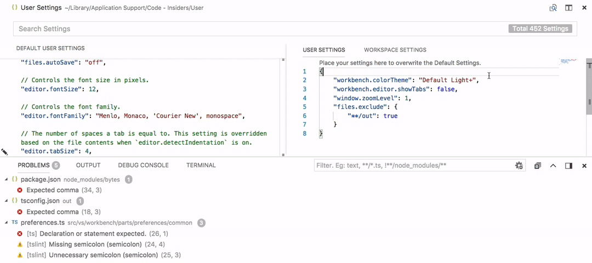
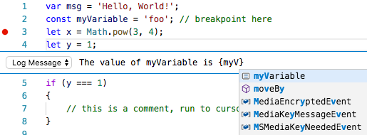

# April 2018 (version 1.23)

## Insiders Release

Welcome to the Insiders build. These are the preliminary notes for the April 1.23 release of Visual Studio Code. As we get closer to the release date, you'll see details below about new features and important fixes.

Until the April release notes are available, you can still track our progress:

* **[April Iteration Plan](https://github.com/Microsoft/vscode/issues/47369)** - See what's planned for the milestone.
* **[Commit Log](https://github.com/Microsoft/vscode/commits/master)** - GitHub commits to the vscode open source repository.
* **[Closed issues](https://github.com/Microsoft/vscode/milestone/66?closed=1)** - Resolved bugs and implemented feature requests in the April milestone.

We really appreciate people taking a look at our new features as soon as they are ready so check back here often and learn what's new to try out.

If you find issues or have suggestions, you can enter them in the VS Code repository on [GitHub](https://github.com/Microsoft/vscode/issues).

## Editor

### Highlighted indent guides

VS Code can now highlight the active indent guide, as you move your cursor between various code blocks. The color name is `editorIndentGuide.activeBackground`:


### Improved editor positioning

In certain cases when changing the editor scroll height (such as resizing a wrapped editor, using mouse wheel zooming, or modifying  a CodeLens), the editor would attempt to maintain the centered line in the viewport. VS Code now maintains the first line in the viewport, providing a more stable editor experience.


### Column selection using middle mouse button

In VS Code, column selection can be added by holding `Shift` and `Alt` and then using the left mouse button. Now the middle mouse button can also be used to create a column selection:


> Note: When setting `editor.multiCursorModifier` to `ctrlCmd`, the modifiers are `Shift` and `Ctrl` on Windows and `Shift` and `Cmd` on macOS.

### Run code actions on save

The new `editor.codeActionsOnSave` setting lets you configure a set of code actions that are run when a file is saved. For example, for JavaScript, TypeScript, and other extensions that contribute an organize imports code action, you can enable organize imports on save by [setting](https://code.visualstudio.com/docs/getstarted/settings):

```json
"editor.codeActionsOnSave": {
	 "source.organizeImports": true
}
```

You can also enable or disable which code actions are run on save per language using a [language specific setting]((https://code.visualstudio.com/docs/getstarted/settings#_language-specific-editor-settings). The following settings enable organize imports on save for TypeScript files only:

```json
"[typescript]": {
	"editor.codeActionsOnSave": {
		"source.organizeImports": true
	}
},
"[typescriptreact]": {
	"editor.codeActionsOnSave": {
		"source.organizeImports": true
	}
}
```

## Workbench

### Improved handling of UTF-16 encoded files

VS Code always supported the UTF-16 encoding for files but required a BOM (byte order mark) to properly detect this encoding. If VS Code didn't find a BOM, the file would not be opened and the user saw an information message.

With this release, we added a new action to this message to open the file as text in the editor:


Once opened, you can then change the encoding to try to decode the text.

In addition, we now have a heuristic that tries to detect UTF-16 without a BOM automatically. This heuristic should work for all UTF-16 files that contain only ASCII characters.

### Include/Exclude files in Problems view

You can now include or exclude files in the Problems view using filters.

- Use glob patterns in the filter input box to include/exclude files. An exclude pattern must be prefixed with `!`. For example, `!*.js` will remove all files that have a .js extension.
- Enable `Use files exclude filter` action to remove all files matching `files.exclude` setting.



### NPM Script running

With the setting `npm.enableScriptExplorer` you can enable an explorer that shows the scripts defined in your workspace.


The explorer supports to:
- open a script inside a package.json file or the `scripts` section when the `package.json` file is selected. This is the default action when selecting a script.
- run a script as a Task with the output shown in the terminal.
- debug a script. To launch the node debugger, the script needs to define a node debug option like `--inspect-brk`.

Use the setting `npm.exclude` to exclude scripts in package.json files contained in particular folders.

## Languages

### Markdown workspace symbol search

A pull request from [@pradeepmurugesan](https://github.com/pradeepmurugesan) adds markdown support for workspace symbol search. After opening a markdown file for the first time, you can use (`kb(workbench.action.showAllSymbols)`) to search through the headers of all markdown files in the current workspace:


### Persistent markdown previews

Markdown previews are now automatically restored when you reopen VS Code:


Previously, previews had to be reopened whenever you restarted VS Code.

## Debugging

### Logpoints improvements

We have polished some logpoint actions such that they now have appropriate labels and we have added a logpoint action to the debug menu.

We now support suggestions for conditional breakpoints and for log mesages within curly braces ('{}').

To avoid accidental deletion of a breakpoint condition or message we now prompt users when deleting breakpoints with a condition or a log message.




## Extension Authoring

### FileSystem Providers

Extensions can now serve files and folders from arbitrary sources, like ftp-servers, and VS Code will handle them just like regular files. For that, we have defined the `FileSystemProvider`-interface which extension associate with a uri-scheme, like `ftp`. With that the editor can discover and manage files and folders, e.g. create new files or folders, delete them, read and write them.


#### Language Identifiers and Document Selectors

The addition of filesystem providers means that not all files live on disk. While there were similar cases before, this is now much more apparent and extensions should be aware of this. The short, but _important_ message is that not all documents live on disk and if your extension uses relies on disk-access you _must_ check the [scheme](https://github.com/Microsoft/vscode/blob/470d92886a599302aa16e84ea8330817a7faef6f/src/vs/vscode.d.ts#L91) first.

To raise awareness we have added an information message which shows when you register a language feature using just a language identifier, not a document filter. For more details, visit this page: https://code.visualstudio.com/docs/extensionAPI/document-selectors.

Last, there is a sample extension which you can use for testing. It implements a filesystem that keeps everything in memory, nothing is on disk, and you can test your language features against that. Get the extension here: https://marketplace.visualstudio.com/items?itemName=jrieken.vscode-memfs

#### Watch out: TextDocument.isUntitled

Because of filesystem providers we have adjusted the semantics of `TextDocument.isUntitled` to be `true` only for newly created documents (using the `untitled`-scheme). Before, all documents not from disk were treated as untitled. This change might alter the behaviour of your extension, esp. when it assumes that documents, that aren't untitled, are stored on disk.

### Reading Diagnostics

There is new API to read diagnostics and to be notified when diagnostics change, see: `languages.getDiagnostics` and `languages.onDidChangeDiagnostics`. For instance, a SCM-extension can now check that there are no errors before sharing changes with the team.

### Refined RenameProvider

We have refined the `RenameProvider`-API and it can now, optionally, implement a new function called `prepareRename`. With that the provider can help VS Code resolve and validate the symbol that's to be renamed.

### Include offset based information in document change events

`TextDocumentContentChangeEvent` has a new property, `rangeOffset`, which, together with `rangeLength`, allows extensions to use `(offset,length)` coordinates to keep track of text document changes.

### Source code action kinds

`CodeActionKind.Source` identifies code actions that apply to the entire file. Organize imports is a good example of a `Source` code action since it can be triggered from any position in a file.

`Source` code actions do not show up in the normal quick fix lightbulb menu. They must be explicitly requested using the `editor.action.sourceAction` command. `Source` code actions also show up in the new 'Source Actions' context menu.

### Organize imports code actions

Building on `Source` code actions, the newly added `CodeActionKind.SourceOrganizeImports` identifies an organize imports code action. These actions can be triggered using `editor.action.organizeImports` and have a standard keyboard shortcut: `kb(editor.action.organizeImports)`.

If your extension already implements organize imports, we highly recommend that you migrate it to use `CodeActionKind.SourceOrganizeImports` so that users have a more consistent experience across languages.

### CodeActionProviderMetadata

`registerCodeActionsProvider` now takes an optional `CodeActionProviderMetadata` argument which lets extensions tell VS Code about the kind of code actions that a `CodeActionProvider` will provide. This information is used by VS Code to enable the new 'Refactor' and 'Source Action' context menus. The refactor context menu for example will only be enabled when a `CodeActionProvider` is registered with `CodeActionProviderMetadata` indicating that it that provide will return `refactor.*` code actions.

### Webview API

The webview API allows extensions to create fully customizable views within Visual Studio Code. For example, the built-in Markdown extension uses webviews to render Markdown previews. Webviews can also be used to build complex user interfaces beyond what VS Code's native APIs support.


A [new extension authoring page](/docs/extensions/webview.md) covers the webview API. You can also find an example webview API extension [here](https://github.com/Microsoft/vscode-extension-samples/tree/master/webview-sample). We look forward to see how extension authors put this powerful new API to use.

### Task API

The task API received further polish around task querying and execution from an extension. The newly supported API is:

- `fetchTasks` takes a filter to only query for a subset of tasks.
- `taskExecutions` support fetching the execution objects for all running tasks.
- `TaskExecution` objects provided via `executeTask`, `taskExecutions` or one of the events can be compared using `===`.

The API is still in the proposed state.

### Application scope settings

If you want your settings to be applied at application level and not get overridden at a window or resource level, you can do that now by using `application` scope.

```json
"configuration": {
	"properties": {
		"git.path": {
			"type": "string",
			"description": "Path to the git executable",
			"scope": "application"
		}
	}
}
```

**Note:** Deprecated `isExecutable` property in favour of using application scope since it was meant for the same purpose.

## Notable Changes

* [10663](https://github.com/Microsoft/vscode/issues/10663): Preserve view state when switching tabs on compare view
* [24634](https://github.com/Microsoft/vscode/issues/24634): macOS: Add a setting to enable acceptsFirstMouse for window
* [29549](https://github.com/Microsoft/vscode/issues/29549): Multi thread debugging should support stopping thread
* [46785](https://github.com/Microsoft/vscode/issues/46785): With no file in focus, "Reveal in Finder" should open the workspace's folder
* [48733](https://github.com/Microsoft/vscode/issues/48733): Introduce an option debug.enableAllHovers to enable calls to hover providers while debugging
* [47478](https://github.com/Microsoft/vscode/issues/47478): Detect incomplete installed extensions

## Thank You

Last but certainly not least, a big *__Thank You!__* to the following folks that helped to make VS Code even better:

Contributions to `vscode-extension-samples`:

* [Niklas Mollenhauer (@nikeee)](https://github.com/nikeee): Change `client` folder to `lsp-sample` [PR #59](https://github.com/Microsoft/vscode-extension-samples/pull/59)

Contributions to `language-server-protocol`:

* [Simon Marchi (@simark)](https://github.com/simark): Change TextDocumentSyncKindIncremental -> TextDocumentSyncKind.Increm... [PR #419](https://github.com/Microsoft/language-server-protocol/pull/419)
* [Adelar da Silva Queiróz (@adelarsq)](https://github.com/adelarsq): Sorting language servers by Language [PR #424](https://github.com/Microsoft/language-server-protocol/pull/424/)
* [Geoffrey Gilmore (@ggilmore)](https://github.com/ggilmore): Clarify "textDocument/didOpen" requirement [PR #431](https://github.com/Microsoft/language-server-protocol/pull/431)
* [Junfeng Li (@autozimu)](https://github.com/autozimu): Typo. [PR #434](https://github.com/Microsoft/language-server-protocol/pull/434)
* [Niklas Mollenhauer (@nikeee)](https://github.com/nikeee): Add `undefined` to TextDocuments#get(uri: string) [PR #339](https://github.com/Microsoft/vscode-languageserver-node/pull/339)
* [Caleb Lloyd (@caleblloyd)](https://github.com/caleblloyd): Fix for sticky sidebar going off page on Desktop [PR #444](https://github.com/Microsoft/language-server-protocol/pull/444)
* [Diego Berrocal (@CestDiego)](https://github.com/CestDiego): [PR #450](https://github.com/Microsoft/language-server-protocol/pull/450)
* [Remy Suen (@rcjsuen)](https://github.com/rcjsuen):
  * Escape pipe characters so that they get rendered in HTML [PR #435](https://github.com/Microsoft/language-server-protocol/pull/435)
  * Change workspace/configuration's icon to be a request [PR #441](https://github.com/Microsoft/language-server-protocol/pull/441)
  * Change workspace/workspaceFolder's icon to be a request [PR #442](https://github.com/Microsoft/language-server-protocol/pull/442)
  * Fix #447 Clarify the default for TextDocumentSyncOptions's change [PR #448](https://github.com/Microsoft/language-server-protocol/pull/448)

Contributions to `vscode-languageserver-node`:

* [Remy Suen (@rcjsuen)](https://github.com/rcjsuen):
  * Fix registration parameters for workspace/didChangeWatchedFiles [PR #320](https://github.com/Microsoft/vscode-languageserver-node/pull/320)
  * Add middleware to intercept textDocument/publishDiagnostics [PR #322](https://github.com/Microsoft/vscode-languageserver-node/pull/322)
  * Add deprecated boolean property to CompletionItem and SymbolInformation [PR #332](https://github.com/Microsoft/vscode-languageserver-node/pull/332)
  * Fix documentLink/resolve by introducing a data field [PR #336](https://github.com/Microsoft/vscode-languageserver-node/pull/336)
  * Replace symlinking in Travis build with npm scripts [PR #338](https://github.com/Microsoft/vscode-languageserver-node/pull/338)
* [Niklas Mollenhauer (@nikeee)](https://github.com/nikeee): Resolve #340 [PR #341](https://github.com/Microsoft/vscode-languageserver-node/pull/341)

<!-- In-product release notes styles.  Do not modify without also modifying regex in gulpfile.common.js -->
<a id="scroll-to-top" role="button" aria-label="scroll to top" href="#"><span class="icon"></span></a>
<link rel="stylesheet" type="text/css" href="css/inproduct_releasenotes.css"/>
