# May 2018 (version 1.24)

<!-- DOWNLOAD_LINKS_PLACEHOLDER -->

## Insiders Release

Welcome to the Insiders build. These are the preliminary notes for the May 1.24 release of Visual Studio Code. As we get closer to the release date, you'll see details below about new features and important fixes.

Until the May release notes are available, you can still track our progress:

* **[May Iteration Plan](https://github.com/Microsoft/vscode/issues/49327)** - See what's planned for the milestone.
* **[Commit Log](https://github.com/Microsoft/vscode/commits/master)** - GitHub commits to the vscode open source repository.
* **[Closed issues](https://github.com/Microsoft/vscode/milestone/67?closed=1)** - Resolved bugs and implemented feature requests in the May milestone.

We really appreciate people taking a look at our new features as soon as they are ready so check back here often and learn what's new to try out.

If you find issues or have suggestions, you can enter them in the VS Code repository on [GitHub](https://github.com/Microsoft/vscode/issues).

## Workbench

### Duplicate Workspace in New Window

There is a new command `workbench.action.duplicateWorkspaceInNewWindow` to duplicate the current workspace in a new window. This command can used as a workaround to a current limitation that one workspace can not be opened in two windows.

Due to this, we are now **deprecating** the less general command `workbench.action.openFolderAsWorkspaceInNewWindow`. We plan to drop support for it in the following milestone.

## Editor

### Syntax highlighting for deleted lines

VS Code now highlights deleted lines in the inline diff editor:

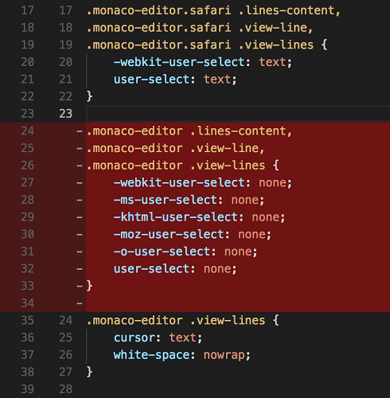

### Font Zoom actions

Font Zoom actions have been added. They can be invoked in order to increase or decrease the font size of the editor. This is an alternative form of zooming, where the rest of the UI is left as-is.

Use the following keybindings to replace the default zoom actions:

on macOS:

```json
{ "key": "cmd+numpad_add",      "command": "editor.action.fontZoomIn" },
{ "key": "shift+cmd+=",         "command": "editor.action.fontZoomIn" },
{ "key": "cmd+=",               "command": "editor.action.fontZoomIn" },
{ "key": "cmd+numpad_subtract", "command": "editor.action.fontZoomOut" },
{ "key": "shift+cmd+-",         "command": "editor.action.fontZoomOut" },
{ "key": "cmd+-",               "command": "editor.action.fontZoomOut" },
{ "key": "cmd+numpad0",         "command": "editor.action.fontZoomReset" },
{ "key": "cmd+0",               "command": "editor.action.fontZoomReset" },
```

on Windows and Linux:

```json
{ "key": "ctrl+numpad_add",      "command": "editor.action.fontZoomIn" },
{ "key": "shift+ctrl+=",         "command": "editor.action.fontZoomIn" },
{ "key": "ctrl+=",               "command": "editor.action.fontZoomIn" },
{ "key": "ctrl+numpad_subtract", "command": "editor.action.fontZoomOut" },
{ "key": "shift+ctrl+-",         "command": "editor.action.fontZoomOut" },
{ "key": "ctrl+-",               "command": "editor.action.fontZoomOut" },
{ "key": "ctrl+numpad0",         "command": "editor.action.fontZoomReset" },
{ "key": "ctrl+0",               "command": "editor.action.fontZoomReset" },
```

### F8 stays in Editor

Last milestone, we changed the `F8` keybinding **Go to Next Problem** to visit all errors and warnings. That meant you'd leave the current editor instead of looping around. Not everyone liked this behavior and so we have added new commands:

* **Go to Next/Previews Problem *in Files*** is the default, which visits all problems, and is bound to `F8/Shift+F8`.
* **Go to Next/Previews Problem** which loops inside the current editor.

## Integrated Terminal

### Fallback DOM Renderer

Back in the 1.17 release, the Integrated Terminal moved over to [rendering using canvas](https://code.visualstudio.com/blogs/2017/10/03/terminal-renderer) in order to boost performance. While this was great for the majority of users, some environments had issues with this at the hardware and OS levels and rendering ended up taking longer. VS Code now measures the average time it takes to render a frame and if it takes too long, you will get a notification to switch to the new fallback DOM renderer:

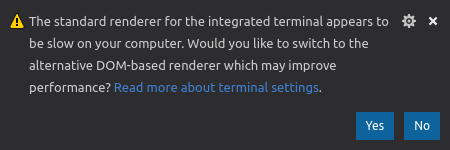

This new renderer uses the DOM like the original terminal, so if your environment has issues rendering with canvas this should provide a more stable experience. You can also turn on the DOM renderer manually with this setting:

```js
{
  "terminal.integrated.rendererType": "dom"
}
```

### Italic support

The terminal now supports the italicized xterm character attribute:

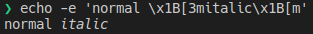

### Letter spacing support

A new setting allows increasing terminal letter spacing by an integer pixel value:

```js
{
  "terminal.integrated.letterSpacing": 2
}
```

### Better CLI support in WSL

Running the `code` command line inside the Windows Subsystem for Linux (WSL) will now suppress output and return to the prompt.

### Navigation to split terminals using the `term` Quick Open menu

It's now possible to navigate to specific split terminals via the `term` Quick Open menu:


## Debugging

### New icon for "Continue" action

todo@isidorn

### Renamed "column breakpoints" to "inline breakpoints"

We have renamed "column breakpoint" to "inline breakpoint" because the community is much more familiar with the term "inline breakpoint". Consequently we are deprecating the old `editor.debug.action.toggleColumnBreakpoint` command in favor of a new `editor.debug.action.toggleInlineBreakpoint` command.

### Callstack shows Full path

todo@isidorn

### IntelliSense for variables in launch.json and tasks.json

todo@isidorn

### Variable substitution for keys in launch.json

todo@isidorn

## Languages

### TypeScript 2.9.1

VS Code now ships with TypeScript 2.9.1. This update brings new language features such as [`import()` types}(https://blogs.msdn.microsoft.com/typescript/2018/05/31/announcing-typescript-2-9/#import-types), [json imports](https://blogs.msdn.microsoft.com/typescript/2018/05/31/announcing-typescript-2-9/#json-imports), and many improvements to JS Docs. It also brings some great new tooling support and fixes a number of bugs.

You can read more about what's new in TS 2.9.1 on the [TypeScript blog](https://blogs.msdn.microsoft.com/typescript/2018/05/31/announcing-typescript-2-9/#json-imports).

### Move to new file refactoring

<!-- TODO mjbvz -->

### Highlighting unused variables and imports in JS/TS

Unused variables, parameters, and imports are now greyed out in JavaScript and TypeScript:

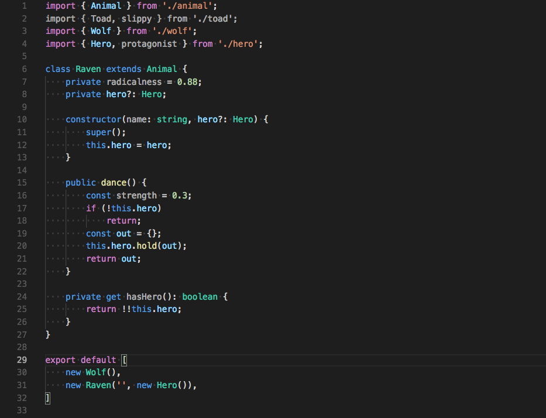

Use a Quick Fix to automatically remove them and clean up your code:

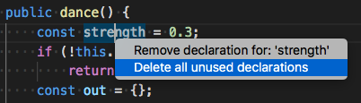

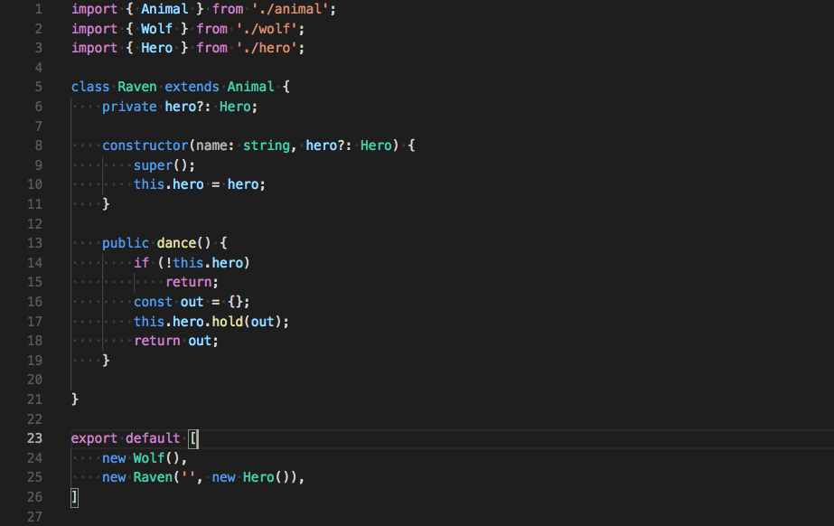

This can be disable by setting `"javascript.showUnused": false` and `"typescript.showUnused": false`.

### Updating import paths when a file is moved or renamed in JS/TS

<!-- TODO mjbvz -->

### Improved JS/TS auto suggest

IntelliSense is now shown automatically in a few more places. This includes:

* After typing a `<` inside jsx code.
* After typing a `/` to close a jsx tag.
* After typing a `'` or `"` for a string literal type in TypeScript.

### Generate getter/setter refactoring

The new `generate 'get' and 'set' accessors` refactoring lets you quickly encapsulate a field in JavaScript and TypeScript:

<!-- TODO img mjbvz -->

### Syntax aware folding enabled by default for JS/TS

Syntax aware folding is now enabled by default for JavaScript and TypeScript. A preview of this feature first shipped with VS code 1.22 but there were a few bugs that we wanted to fix before turning it on for everyone.

The new syntax aware folding should match the old indentation based folding in most cases, however indentation based folding sometimes creates more folding ranges that you may be used to. To revert back to using the old indentation based folding, set:

```json
"[javascript]": {
  "editor.foldingStrategy": "indentation"
},
"[javascriptreact]": {
  "editor.foldingStrategy": "indentation"
},
"[typescript]": {
  "editor.foldingStrategy": "indentation"
},
"[typescriptreact]": {
  "editor.foldingStrategy": "indentation"
}
```

### Preferences for auto imports and generated code

You can now explicitly specify the quote and path styles that VS Code uses for auto imports and other generated JavaScript and TypeScript code.

The new `javascript.preferences.quoteStyle` and `typescript.preferences.quoteStyle` settings specify the type of quotes to use. Valid values are:

* `"single"` quotes.
* `"double"` quotes.
* `"auto"` to infer quote type from existing imports.

The `javascript.preferences.importModuleSpecifier` and `typescript.preferences.importModuleSpecifier` settings specify the type of path to use for imports. Valid values are:

* `"relative"` to the file location.
* `"non-relative"` based on the `baseUrl` configured in your `jsconfig.json` / `tsconfig.json`.
* `"auto"` to infer the shortest path type.

These new preferences require TypeScript 2.9+.

### Import folding

Blocks of import statements are now foldable in JavaScript and TypeScript:

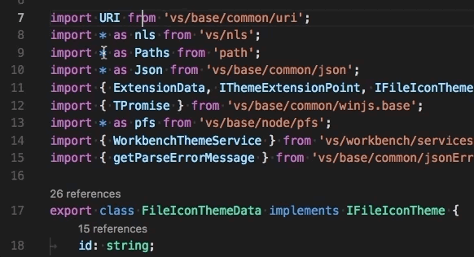

This feature requires TypeScript 2.9+. You must also have semantic folding enabled (it is enabled by default). Make sure you have `"editor.foldingStrategy"` set to `"auto"` and that you have not set `"typescript.experimental.syntaxFolding": false`.

## Extension Authoring

### Custom views

**Access to selected elements**

You can now get the list of currently selected elements in the tree view using the following newly added API to `TreeView`

```typescript
/**
 * Currently selected elements.
 */
readonly selection: ReadonlyArray<T>;
```

**Expand/Collapse listeners**

The following events were added to the `TreeView` when an element is collapsed or expanded.

```typescript
/**
 * Event that is fired when an element is expanded
 */
readonly onDidExpandElement: Event<TreeViewExpansionEvent<T>>;

/**
 * Event that is fired when an element is collapsed
 */
readonly onDidCollapseElement: Event<TreeViewExpansionEvent<T>>;

export interface TreeViewExpansionEvent<T> {

   /**
    * Element that is expanded or collapsed.
    */
   element: T;

}
```

### New context key for Call Stack elements

todo@isidorn
`callStackItemType` context key to refine for which items commands appear in the CALL STACK view

### New Theme Colors

There are two theme colors for showing a border at the top of a tab:

* `tab.activeBorderTop`: Border to the top of an active tab.
* `tab.unfocusedActiveBorderTop`: Border to the top of an active tab in an unfocused group.
* `list.errorForeground`: The color of items in the Explorer with errors.
* `list.warningForeground`: The color of items in the Explorer with warnings.

### Task API

The task API graduated and is now available for all extension authors. It moved from the `vscode.workspace` to the new `vscode.tasks` namespace. We're leaving the old API in `workspace` for one additional milestone so that extension authors have time to move to the new API. In addition, events were added to signal the start and end of the underlying process bound to a task.

### Prepare for Outline View

This release ships an [outline view](#outline-view). Currently, there is logic to synthesize a tree from the flat list of document symbols but the logic isn't perfect. We are still discussing the API for this (see [#34968](#https://github.com/Microsoft/vscode/issues/34968)) but you can still prepare for this:

* Make sure that your language implementation returns a hierarchy of document symbols (this should be the 'natural' representation anyways).
* Make sure you have two ranges in hand: One that covers the full declaration of a symbol and one that points to the identifier of a symbol (VS Code uses that information to choose the symbol that matches the cursor selection).

Feel free to join the discussion and to propose the API for this: [#34968](#https://github.com/Microsoft/vscode/issues/34968).

### Default argument for keybinding command invocation

It used to be that commands invoked from a keybinding which did not specify any argument list [would receive an empty object `{}` as the only argument](https://github.com/Microsoft/vscode/issues/42851), when invoked. In the upcoming release, that argument will be `null` instead.

### CodeActionProvider Selection

The `CodeActionProvider.provideCodeAction` method's `range` parameter is now a `Selection | range`. The provided value will always be the user's selection if there is an active editor.

### Webview preserveFocus

The new `preserveFocus` focus flag on `Webview.reveal` allows extensions to show a webview without focusing it. This can be used to open a webview with documentation or other non-interactive content to the side of the current editor for example.

### Reload webviews inside the webview dev tools

You can now press `ctrl+r` or `cmd+r` when focused on a webview's developer tools to reload that webview. Keep in mind that this will only reload the webview itself. The `html` value of webview is not changed.

### Access Theme Colors in Webviews

Extension authors can now access all standard VS Code theme colors inside webviews using css variables. These variable names are prefixed with `vscode` and replace the `.` with `-`. For example `editor.foreground` becomes `var(--vscode-editor-foreground)`.

## Preview Features

Preview features are not ready for release but are functional enough to use. We welcome your early feedback while they are under development.

### Outline View

This release ships with an Outline view! While already functional, it is still in preview and needs to be enabled manually. Do so by right clicking on the top Explorer bar and by selecting **Outline**.

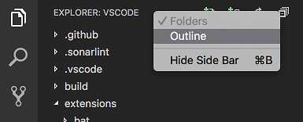

The Outline view shows the symbol tree of the currently active editor. For symbols, the view relies on information computed by your installed extensions. The outline view includes a filter box, different 'Sort By' modes, optional cursor tracking, and supports the usual open gestures, like Open to Side.

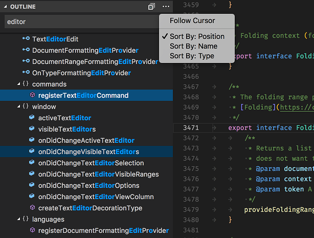

Stay tuned, more work is planned and you can subscribe to issues tagged with the [`outline`](https://github.com/Microsoft/vscode/labels/outline) label.

### Editor Grid Layout

During this milestone, we began work to implement an editor grid layout feature to allow opening editors vertically and horizontally without limits:


This feature will be available in our [Insiders release](https://code.visualstudio.com/insiders/) in the beginning of June. Subscribe to [issue 14909](https://github.com/Microsoft/vscode/issues/14909) to receive a notification when this happens.

### New Settings Editor

In this milestone, we began experimenting with a GUI for editing settings, which has been a popular request for a long time. This is an early preview, but if you'd like to try it out, you can open it with the **Preferences: Open Settings (Preview)** command. We would like any feedback you have - you can leave it on [this GitHub issue](https://github.com/Microsoft/vscode/issues/50249).

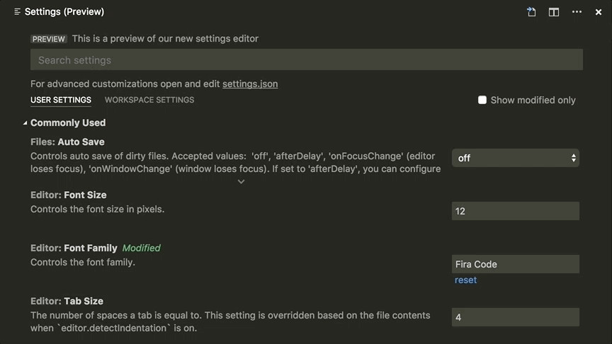

## Engineering

We moved our [continuous integration builds](https://aka.ms/vscode-builds) over to our friends at [Visual Studio Team Services](https://www.visualstudio.com/team-services/) (👋 shout out to [@chrisrpatterson](https://github.com/chrisrpatterson) & [@lszomoru](https://github.com/lszomoru) for their ongoing support). This was only possible given the VSTS team's work on [public projects](https://blogs.msdn.microsoft.com/devops/2018/04/27/vsts-public-projects-limited-preview/), as well as a several other features. VSTS allows us to have a [single YAML based build definition](https://github.com/Microsoft/vscode/blob/master/build/tfs/continuous-build.yml) which targets all our three major platforms: Windows, macOS and Linux.

[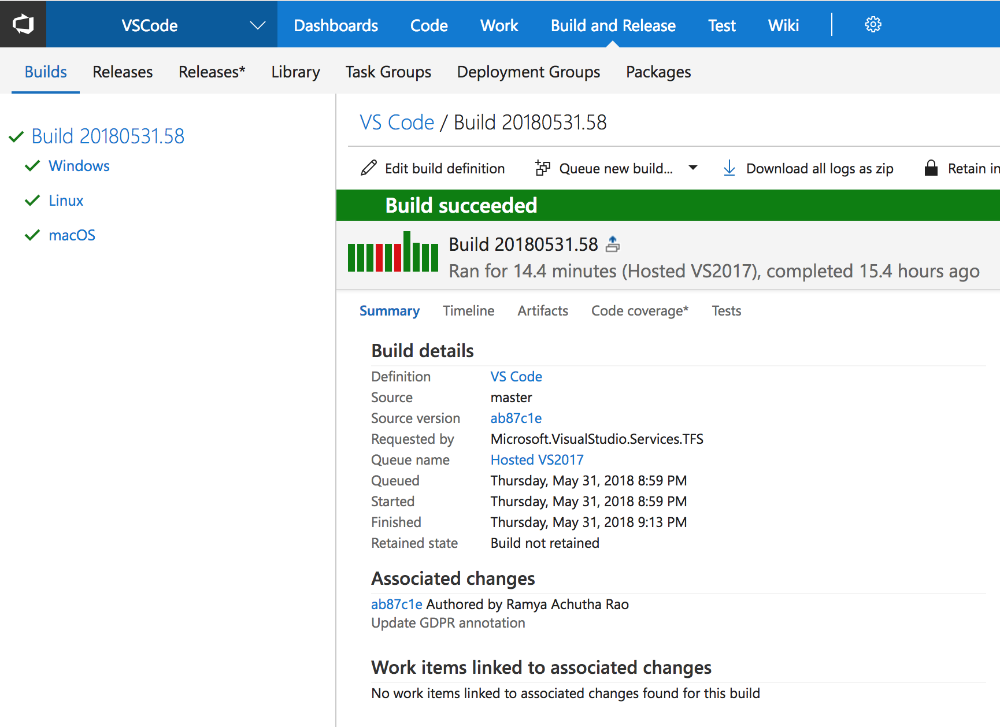](https://aka.ms/vscode-builds)

## Proposed Extension APIs

This milestone we added new proposed extension APIs. We plan to add these APIs to stable in a future milestone once we are confident enough with them. We welcome any feedback on how they work for your extension.

> **Note:** These APIs are still proposed, so in order to use it, you must opt into it by adding a `"enableProposedApi": true` to `package.json` and you'll have to copy the [`vscode.proposed.d.ts`](https://github.com/Microsoft/vscode/blob/master/src/vs/vscode.proposed.d.ts) into your extension project. Also be aware that you cannot publish an extension to the Marketplace that uses the `enableProposedApi` attribute.

### Search Provider API

The SearchProvider API lets extensions implement file search and text search in a workspace. It will be especially useful alongside a FileSystemProvider.

```ts
export namespace workspace {
  export function registerSearchProvider(scheme: string, provider: SearchProvider): Disposable;
}

export interface SearchProvider {
  provideFileSearchResults?(options: FileSearchOptions, progress: Progress<string>, token: CancellationToken): Thenable<void>;
  provideTextSearchResults?(query: TextSearchQuery, options: TextSearchOptions, progress: Progress<TextSearchResult>, token: CancellationToken): Thenable<void>;
}
```

To learn more, have a look at the [searchProviderExample](https://github.com/Microsoft/vscode-extension-samples/blob/roblou/searchProviderExample/fsprovider-sample/src/searchProvider.ts).

### debug.toolBarLocation

In this milestone, we started to work on alternative locations for the Debug toolbar. As a first step, we have introduced a new setting `debug.toolBarLocation` and an initial attempt for a "docked" Debug toolbar (in addition to the old "floating" toolbar):

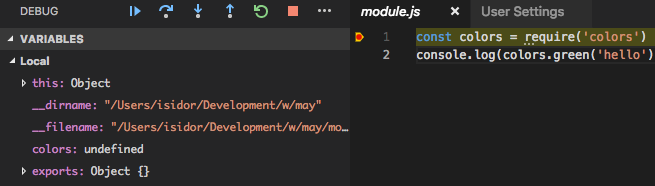  @isidorn pls create screenshot where the new debug toolbar is not so cramped at the edge. Show a full (but small) Debug view and a bit of the adjacent editor.

Since we are still experimenting with this new toolbar design, you can expect more changes in the next milestones.

Since the existing `debug.hideActionBar` can be easily subsumed under a value `hidden` of the new `debug.toolBarLocation` setting, we are **deprecating** the `debug.hideActionBar` setting`.

## New Documentation

### Update Docker topic

We've rewritten [Working with Docker](https://code.visualstudio.com/docs/azure/docker) which shows how you can create, publish and reuse Docker containers from within VS Code.

### Working with MongoDB

We've added a new [Working with MongoDB](https://code.visualstudio.com/docs/azure/mongodb) topic for managing MongoDB databases in VS Code with the [Cosmos DB](https://marketplace.visualstudio.com/items?itemName=ms-azuretools.vscode-cosmosdb) extension.

## Notable Changes

* [49103](https://github.com/Microsoft/vscode/issues/49103): Make composite bar primary and context menu actions to be consistent in order
* [18233](https://github.com/Microsoft/vscode/issues/18233): Replace history in Search view
* [24396](https://github.com/Microsoft/vscode/issues/24396): Show existing commands with same keybinding in Keyboard definition dialog
* [12013](https://github.com/Microsoft/vscode/issues/12013): Explorer should not trim leading or trailing whitespaces


## Thank You

Last but certainly not least, a big *__Thank You!__* to the following folks that helped to make VS Code even better:

Contributions to `vscode`:

* [Andrew Baumann (@0xabu)](https://github.com/0xabu): enable CLI when invoked from WSL on modern (RS4) hosts [PR #44945](https://github.com/Microsoft/vscode/pull/44945)
* [@alexglazkov9](https://github.com/alexglazkov9): fixes #48891 [PR #48896](https://github.com/Microsoft/vscode/pull/48896)
* [@alexr00](https://github.com/alexr00)
  * Added a function for getting VSCode base folder [PR #49467](https://github.com/Microsoft/vscode/pull/49467)
  * Added a setting for configuring open direction for "open to the side" [PR #49523](https://github.com/Microsoft/vscode/pull/49523)
  * Fixes #33621: Added check for intersection to SelectionHighlighter [PR #49358](https://github.com/Microsoft/vscode/pull/49358)
  * Fixes #47367: Added a go to next error that stays within current file [PR #49391](https://github.com/Microsoft/vscode/pull/49391)
  * Added a setting for closing the active editor group when the last edi… [PR #49517](https://github.com/Microsoft/vscode/pull/49517)
  * Fixes #18233: Added replace history for Find view [PR #49506](https://github.com/Microsoft/vscode/pull/49506)
* [Neal B (@borgfriend)](https://github.com/borgfriend): NPM Scripts: Added configuration option to change default click action [PR #49282](https://github.com/Microsoft/vscode/pull/49282)
* [Brandon Ruggles (@brandonrninefive)](https://github.com/brandonrninefive): Feature Addition for Issue #24396 - New "Keyboard Shortcut" dialog should display current assignment [PR #40405](https://github.com/Microsoft/vscode/pull/40405)
* [Callum Isitt (@callumisitt)](https://github.com/callumisitt): Add link to package homepage in package.json files [PR #50049](https://github.com/Microsoft/vscode/pull/50049)
* [Howard Chen (@chenhowa)](https://github.com/chenhowa): Attempts to make described workaround from issue #45226 [PR #48028](https://github.com/Microsoft/vscode/pull/48028)
* [Cherry Wang (@chryw)](https://github.com/chryw): Made unverified breakpoint icons thicker [PR #48989](https://github.com/Microsoft/vscode/pull/48989)
* [Chris Sienkiewicz (@chsienki)](https://github.com/chsienki): Allow class names to begin with an underscore in textModel.ts  [PR #49652](https://github.com/Microsoft/vscode/pull/49652)
* [Daniel Frankcom (@danielfrankcom)](https://github.com/danielfrankcom): Rewrite of ANSI code handling method [PR #49763](https://github.com/Microsoft/vscode/pull/49763)
* [Dustin Campbell (@DustinCampbell)](https://github.com/DustinCampbell)
  * Latest fixes for C# TextMate grammar [PR #49077](https://github.com/Microsoft/vscode/pull/49077)
  * Update C# TextMate grammar with important bug fix [PR #49849](https://github.com/Microsoft/vscode/pull/49849)
  * Update C# TextMate grammar [PR #49645](https://github.com/Microsoft/vscode/pull/49645)
* [Don Williamson (@dwilliamson)](https://github.com/dwilliamson)
  * Configure output panel editor word wrap [PR #49787](https://github.com/Microsoft/vscode/pull/49787)
  * Add Output Panel Smart Scroll [PR #49728](https://github.com/Microsoft/vscode/pull/49728)
* [Eric Amodio (@eamodio)](https://github.com/eamodio): Fixes #44396 - cancel alt up after mouse down on menu [PR #44397](https://github.com/Microsoft/vscode/pull/44397)
* [Gabriel Rigo da Cruz Jacobsen (@gabrieljacobsen)](https://github.com/gabrieljacobsen): Fixed dropdown only working the first time [PR #49290](https://github.com/Microsoft/vscode/pull/49290)
* [Giora Guttsait (@gioragutt)](https://github.com/gioragutt): Show terminals separately in quickOpenTerm and quickOpenView [PR #49758](https://github.com/Microsoft/vscode/pull/49758)
* [@h-h-h-h](https://github.com/h-h-h-h): `{ "editor.wrappingIndent": "deepIndent" }` for 2 additional tabs on continuation lines [PR #50542](https://github.com/Microsoft/vscode/pull/50542)
* [ermin.zem (@harbin1053020115)](https://github.com/harbin1053020115): [themes] font-weigth => font-weight [PR #49613](https://github.com/Microsoft/vscode/pull/49613)
* [@Heldenkrieger01](https://github.com/Heldenkrieger01): Fix #49777 - Emmet balance In after balance out should go back to initial selection and not first child [PR #49996](https://github.com/Microsoft/vscode/pull/49996)
* [Huachao Mao (@Huachao)](https://github.com/Huachao): Rename dipose.ts to dispose.ts [PR #49659](https://github.com/Microsoft/vscode/pull/49659)
* [Crist Ye (@iamCristYe)](https://github.com/iamCristYe): Update coding information for GBK and GB18030 [PR #49271](https://github.com/Microsoft/vscode/pull/49271)
* [Ilie Halip (@ihalip)](https://github.com/ihalip): Fixed the case where a notification was purged too soon [PR #49202](https://github.com/Microsoft/vscode/pull/49202)
* [Yuki Ueda (@Ikuyadeu)](https://github.com/Ikuyadeu): Highlight escaped characters in default Light+ (Fix #48638) [PR #48746](https://github.com/Microsoft/vscode/pull/48746)
* [Dennis Dufbäck (@InspectorDeno)](https://github.com/InspectorDeno): Add tooltips to extension navbar [PR #49825](https://github.com/Microsoft/vscode/pull/49825)
* [Matt Q (@irrationalRock)](https://github.com/irrationalRock): Fixed #4375 - Multiple Cursors now go to the next logical line  [PR #49318](https://github.com/Microsoft/vscode/pull/49318)
* [Jason Liu (@Jasonlhy)](https://github.com/Jasonlhy): Correct comment inside script tag and style tag in razor file [PR #48345](https://github.com/Microsoft/vscode/pull/48345)
* [Jean Pierre (@jeanp413)](https://github.com/jeanp413): Fix for #49138 [PR #49501](https://github.com/Microsoft/vscode/pull/49501)
* [Chen (@jiegec)](https://github.com/jiegec): Remove redundant '6' in stdFork.ts [PR #49869](https://github.com/Microsoft/vscode/pull/49869)
* [Krzysztof Cieślak (@Krzysztof-Cieslak)](https://github.com/Krzysztof-Cieslak)
  * Add openOnDebugBreak for openDebug [PR #49936](https://github.com/Microsoft/vscode/pull/49936)
  * Add activePanel context key [PR #49971](https://github.com/Microsoft/vscode/pull/49971)
  * Add prefix case for incrementFileName [PR #50003](https://github.com/Microsoft/vscode/pull/50003)
  * Go To Next/Previous Breakpoint editor actions [PR #50285](https://github.com/Microsoft/vscode/pull/50285)
* [DongWei (@MaleDong)](https://github.com/MaleDong)
  * Fix doc comments and remove duplicate number in an array [PR #50072](https://github.com/Microsoft/vscode/pull/50072)
  * Refactor: Remove useless event interface [PR #49684](https://github.com/Microsoft/vscode/pull/49684)
* [Marco Beltempo (@marcobeltempo)](https://github.com/marcobeltempo): Fixes #46509 - Added key binding to disable a single breakpoint [PR #46629](https://github.com/Microsoft/vscode/pull/46629)
* [Drew Diamantoukos (@MercifulCode)](https://github.com/MercifulCode): Cleaning up some typos in vscode.d.ts and vscode.proposed.d.ts [PR #50533](https://github.com/Microsoft/vscode/pull/50533)
* [@mkavidas](https://github.com/mkavidas)
  * Allow to configure a top tab border color [PR #49313](https://github.com/Microsoft/vscode/pull/49313)
  * 50190 [PR #50255](https://github.com/Microsoft/vscode/pull/50255)
  * grammar fix for #50008 [PR #50063](https://github.com/Microsoft/vscode/pull/50063)
* [Noah Gibson (@noahjg)](https://github.com/noahjg): Terminal line selection [PR #47991](https://github.com/Microsoft/vscode/pull/47991)
* [Nick James (@omniomi)](https://github.com/omniomi): [powershell] Update PowerShell Editor Syntax. [PR #50348](https://github.com/Microsoft/vscode/pull/50348)
* [Marc Ranolfi (@ranolfi)](https://github.com/ranolfi): Automatic wrapping with `` (backticks) for PHP and SQL [PR #49189](https://github.com/Microsoft/vscode/pull/49189)
* [@rianadon](https://github.com/rianadon): Add emoji fonts to default font families [PR #50168](https://github.com/Microsoft/vscode/pull/50168)
* [Mike Seese (@seesemichaelj)](https://github.com/seesemichaelj): [WIP]: Move Debug Actions Widget to the Debug Viewlet [PR #49099](https://github.com/Microsoft/vscode/pull/49099)
* [Jeff (@stormwarning)](https://github.com/stormwarning): Update SCSS syntax extension [PR #49076](https://github.com/Microsoft/vscode/pull/49076)
* [Tim Wanders (@tim241)](https://github.com/tim241): Removed duplicate loop from #4375 [PR #50585](https://github.com/Microsoft/vscode/pull/50585)
* [Tom Rochette (@tomzx)](https://github.com/tomzx): Fix typo in workbench actions. [PR #50164](https://github.com/Microsoft/vscode/pull/50164)
* [@tsalinger](https://github.com/tsalinger): fixes #43687 [PR #48750](https://github.com/Microsoft/vscode/pull/48750)
* [Alexander (@usernamehw)](https://github.com/usernamehw): Use different problem colors for editor and tree [PR #49020](https://github.com/Microsoft/vscode/pull/49020)
* [Valera Rozuvan (@valera-rozuvan)](https://github.com/valera-rozuvan): Remove unnecessary commented out code [PR #50540](https://github.com/Microsoft/vscode/pull/50540)
* [Igor Matuszewski (@Xanewok)](https://github.com/Xanewok): Don't use code annotations unconditionally for related diagnostics [PR #49319](https://github.com/Microsoft/vscode/pull/49319)

Contributions to `language-server-protocol`:

* [Remy Suen (@rcjsuen)](https://github.com/rcjsuen):
  * Add deprecated property to CompletionItem and SymbolInformation [PR #465](https://github.com/Microsoft/language-server-protocol/pull/465)
* [Julien HENRY (@henryju)](https://github.com/henryju): Fix typo [PR #469](https://github.com/Microsoft/language-server-protocol/pull/469)
* [Aurélien Pupier (@apupier)](https://github.com/apupier): Fix typos [PR #478](https://github.com/Microsoft/language-server-protocol/pull/478)
* [Simon Marchi (@simark)](https://github.com/simark): Fix minor syntax mistakes [PR #479](https://github.com/Microsoft/language-server-protocol/pull/479)

Contributions to `vscode-languageserver-node`:

* [Remy Suen (@rcjsuen)](https://github.com/rcjsuen):
  * CompletionItem's deprecated property should be preserved across requests [PR #347](https://github.com/Microsoft/vscode-languageserver-node/pull/347)
  * Test #351 to ensure that CompletionItem data is preserved [PR #352](https://github.com/Microsoft/vscode-languageserver-node/pull/352)

Contributions to `vscode-json-languageservice`:

* [Quinn Slack (@sqs)](https://github.com/sqs): fix maxItems validation error message [PR #21](https://github.com/Microsoft/vscode-json-languageservice/pull/21)

Contributions to `vscode-eslint`:

* [Jan Pilzer (@Hirse)](https://github.com/Hirse): Use eslint --init to generate configuration [PR #423](https://github.com/Microsoft/vscode-eslint/pull/423)

Contributions to `vscode-extension-samples`:

* [Ahmad Awais ⚡️ (@ahmadawais)](https://github.com/ahmadawais): 👌 IMPROVE: Readme.md file [PR #73](https://github.com/Microsoft/vscode-extension-samples/pull/73)
* [geppy (@geppy)](https://github.com/geppy): Update quickstart [PR #67](https://github.com/Microsoft/vscode-extension-samples/pull/67)
* [Joe Perks (@joeperks)](https://github.com/joeperks): Correcting wording, config on dir hiding [PR #71](https://github.com/Microsoft/vscode-extension-samples/pull/71)
* [Benjamin Lannon (@lannonbr)](https://github.com/lannonbr): Added documentation and example of using custom view containers into tree-view-sample [PR #65](https://github.com/Microsoft/vscode-extension-samples/pull/65)

Contributions to `vscode-chrome-debug`:

* [Ahmad Awais ⚡️ (@ahmadawais)](https://github.com/ahmadawais): 👌 IMPROVE: Lang identifier for code block [PR #674](https://github.com/Microsoft/vscode-chrome-debug/pull/674)
* [@digeff](https://github.com/digeff)
  * Update -core [PR #670](https://github.com/Microsoft/vscode-chrome-debug/pull/670)
  * Add gulp and package updates to release [PR #666](https://github.com/Microsoft/vscode-chrome-debug/pull/666)
  * Fix for 'Cannot acquire Chrome process id' error in VS 15.7 [PR #665](https://github.com/Microsoft/vscode-chrome-debug/pull/665)

Contributions to `vscode-chrome-debug-core`:

* [@digeff](https://github.com/digeff)
  * Fix breakpoint not hitting on certain paths [PR #330](https://github.com/Microsoft/vscode-chrome-debug-core/pull/330)
  * Now we keep a collection to determine if a script needs to be added, removed or changed on the client [PR #329](https://github.com/Microsoft/vscode-chrome-debug-core/pull/329)
  * Small fixes [PR #326](https://github.com/Microsoft/vscode-chrome-debug-core/pull/326)

<!-- In-product release notes styles.  Do not modify without also modifying regex in gulpfile.common.js -->
<a id="scroll-to-top" role="button" aria-label="scroll to top" href="#"><span class="icon"></span></a>
<link rel="stylesheet" type="text/css" href="css/inproduct_releasenotes.css"/>
