---
Order:
TOCTitle: June 2018
PageTitle: Visual Studio Code June 2018
MetaDescription: See what is new in the Visual Studio Code June 2018 Release (1.25)
MetaSocialImage: 1_25/release-highlights.png
Date: 2018-07-05
DownloadVersion: 1.25.1
---
# June 2018 (version 1.25)

**Update 1.25.1**: The update addresses these [issues](https://github.com/microsoft/vscode/milestone/73?closed=1).

<!-- DOWNLOAD_LINKS_PLACEHOLDER -->

---

Welcome to the June 2018 release of Visual Studio Code. We're very excited to move several features announced as Preview last month to Stable. Some of the key highlights include:

* **[Grid editor layout](#grid-editor-layout)** - Custom horizontal and vertical editor layout.
* **[Outline view](#outline-view)** - Symbol tree outline and navigation for your documents.
* **[Portable Mode](#portable-mode)** - Run or copy your VS Code setup from a USB thumb drop or file share.
* **[Hover display options](#hover-display-options)** - Control the appearance of hover information.
* **[Sub-word navigation](#editor)** - Quickly navigate in camelCase words.
* **[Floating debug toolbar](#floating-debug-toolbar)** - Keep the debug toolbar always visible without hiding editor tabs.
* **[Extensions view improvements](#extensions)** - Easily see Enabled, Disabled, and Recommended extensions.
* **[Preview: Settings editor](#new-settings-editor)** - Now with a "Table of Contents" to organize settings.
* **[Language Server Protocol Inspector](#language-server-protocol-inspector)** - Extension authors can visualize LSP protocol traffic.
* **[New Python Flask tutorial](#new-documentation)** - Use VS Code to create and debug Python Flask web applications.

>If you'd like to read these release notes online, go to [Updates](https://code.visualstudio.com/updates) on [code.visualstudio.com](https://code.visualstudio.com).<br>
>You can also check out this 1.25 release [highlights video](https://youtu.be/yVEhzjZUZhU) from Cloud Developer Advocate [Brian Clark](https://twitter.com/_clarkio).

The release notes are arranged in the following sections related to VS Code focus areas. Here are some further updates:

* **[Workbench](#editor)** - Drop files and folders into empty Explorer, uniform history navigation.
* **[Editor](#editor)** - Smart suggestion selection, snippet placeholder transforms.
* **[Languages](#languages)** - Update JS/TS imports on folder rename, CSS pseudo selectors and elements.
* **[Preview Features](#preview-features)** - User setup on Windows, custom tool and menu bar for Windows and Linux.
* **[Extension Authoring](#extension-authoring)** - Contribute grid editor layouts, preselect Completion Items.
* **[New Commands](#new-commands)** - New grid editor layout commands and keyboard shortcuts.

**Insiders:** Want to see new features as soon as possible? You can download the nightly [Insiders](https://code.visualstudio.com/insiders) build and try the latest updates as soon as they are available. And for the latest Visual Studio Code news, updates, and content, follow us on Twitter [@code](https://twitter.com/code)!

## Workbench

### Grid editor layout

You can now arrange editors both vertically and horizontally and have more than 3 editors side by side:

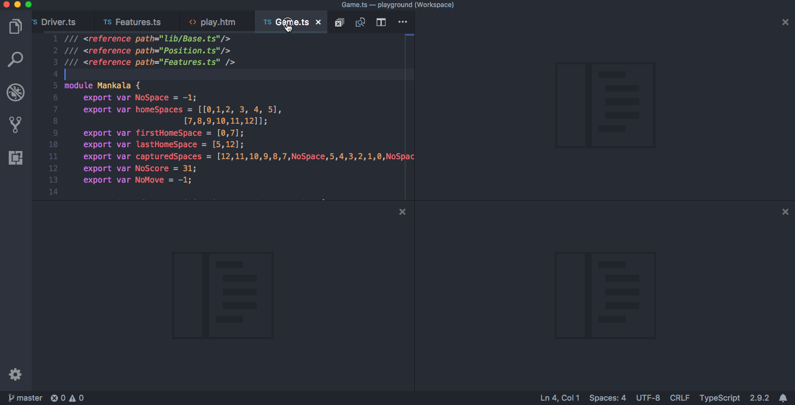

To support flexible layouts, you can create empty editor groups. By default, closing the last editor of an editor group will also close the group itself, but you can change this behavior with the new setting `workbench.editor.closeEmptyGroups: false`.


There are a predefined set of editor layouts in the new **View** > **Editor Layout** menu:

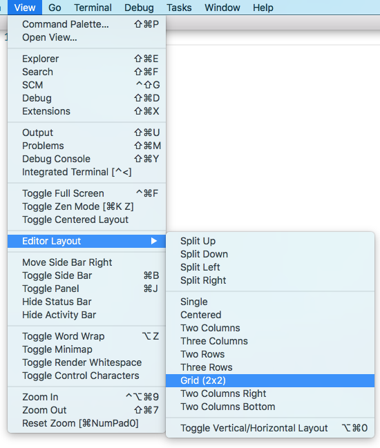

Editors that open to the side (for example by clicking the editor toolbar **Split Editor** action) will by default open to the right hand side of the active editor. If you prefer to open editors below the active one, configure the new setting `workbench.editor.openSideBySideDirection: down`.

There are many [new commands](#new-commands) for adjusting the editor layout with the keyboard alone, but if you prefer to use the mouse, drag and drop is a fast way to split the editor in any direction:

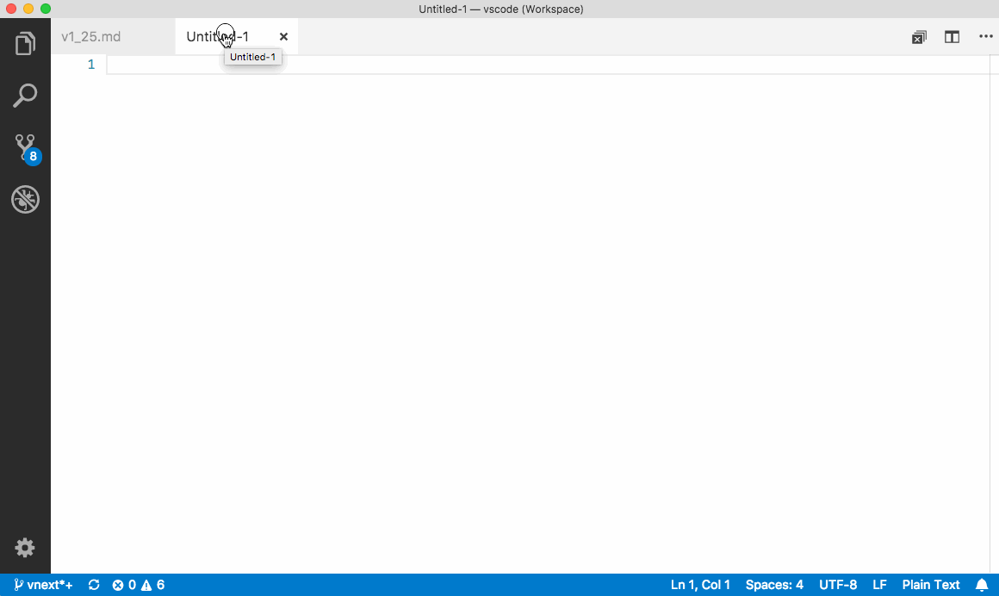

Since editor groups are now unlimited and can be arranged in many ways, the **OPEN EDITORS** view no longer labels editor groups as **Left**, **Center**, or **Right**. Instead, editor groups are now labeled with numbers according to their creation time. The last editor group created will always be at the end of the **OPEN EDITORS** list. We found this to be a good model that minimizes changing the list when moving editor groups around in the layout:

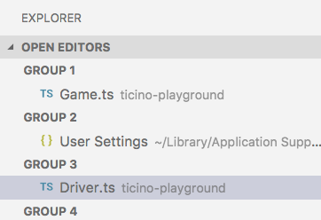

Refer to the [Extension Authoring](#extension-authoring) section for the impact on extensions and themes and see [New Commands](#new-commands) for the list of new grid editor layout commands.

>**Pro Tip**: If you press and hold the `Alt` key while hovering over the toolbar action to split an editor, it will offer to split to the other orientation. This is a fast way to split either to the right or to the bottom.


Due to the grid layout work we have changed how the **centered editor layout** behaves:
  * It is now possible to open any editor layout inside the centered editor layout. Thus it gives more flexibility to the user.
  * Centered editor layout no longer automatically enables and disables based on the layout. As this was sometimes confusing and lead to unexpected behavior.

### Outline view

The Outline view is out of preview and now enabled by default. It is a separate section in the bottom of the File Explorer. When expanded, it will show the symbol tree of the currently active editor.

The Outline view has different **Sort By** modes, optional cursor tracking, and supports the usual open gestures. It also includes an input box which finds or filters symbols as you type. Errors and warnings are also shown in the Outline view, letting you see at a glance a problem's location.

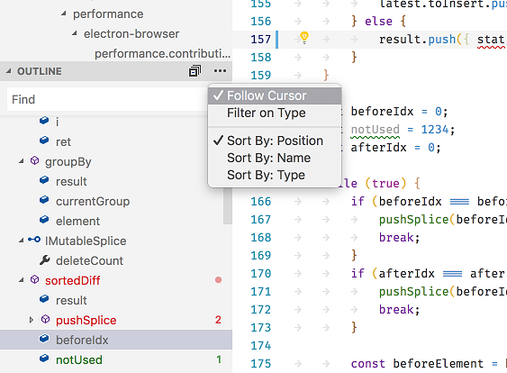

There are several Outline view settings which allow you to enable/disable icons and control the errors and warnings display (all enabled by default):

* `outline.icons` - Toggle rendering outline elements with icons.
* `outline.problems.enabled` - Show errors and warnings on outline elements.
* `outline.problems.badges` - Toggle using badges for errors and warnings.
* `outline.problems.colors` - Toggle using colors for errors and warnings.

There is also a [new API](#document-symbols) for extensions authors.

### Portable Mode

VS Code now supports Portable Mode, where all data created and maintained by VS Code is located near the installation. This lets you easily move a VS Code setup across environments, for example through a USB drive or file share. Portable Mode is supported on the ZIP download for Windows and Linux, as well as the regular Application download for macOS. [Click here](https://code.visualstudio.com/docs/editor/portable) to learn more.

### Drop files and folders into empty files explorer

It is now possible to drop files, folders, and VS Code workspace files into an empty Explorer to open them.

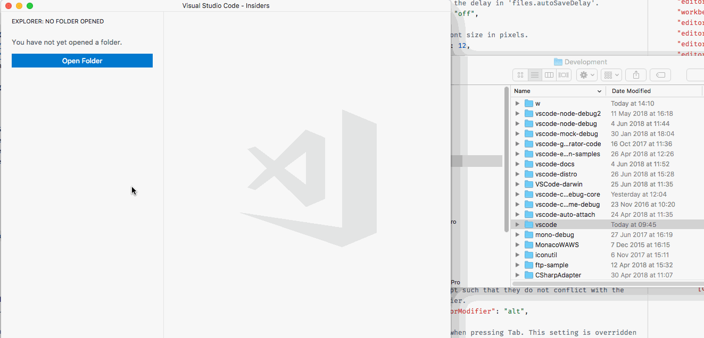

### History navigation

Navigating input history is now more natural and consistent across VS Code. You can use the <kbd>UpArrow</kbd> (`history.showPrevious`) and <kbd>DownArrow</kbd> (`history.showNext`) keys to navigate the input boxes in the Search and Problems views and the Find widgets in the Editor, Terminal, and Web views.

For simplicity and consistency, we changed the default keybindings for navigating among input boxes from <kbd>UpArrow</kbd> and <kbd>DownArrow</kbd> to <kbd>Ctrl+UpArrow</kbd> (or <kbd>Cmd+UpArrow</kbd> on macOS) and <kbd>Ctrl+DownArrow</kbd> (or <kbd>Cmd+DownArrow</kbd> on macOS) keys respectively. You can always go back to previous behavior by updating `kb(search.focus.previousInputBox)`, `kb(search.focus.nextInputBox)` and `kb(search.action.focusSearchFromResults)` keybindings.

**Note**: We also removed all existing [18 History Navigation Commands](#history-navigation-commands) and unified them into two commands `history.showPrevious` and `history.showNext`.

## Editor

### Hover display options

Some users prefer to have no hover suggestions covering text in the editor and the editor hover can now be customized with three additional settings. Use `editor.hover.enabled` to toggle the editor hover, use `editor.hover.delay` to customize the time until the hover is shown, and use `editor.hover.sticky` to change if the hover should remain visible when moving the mouse over it.

### Sub-word support

We have new commands for sub-word navigation and sub-word deletion. These commands will stop at camel case positions and at underscores (`_`).

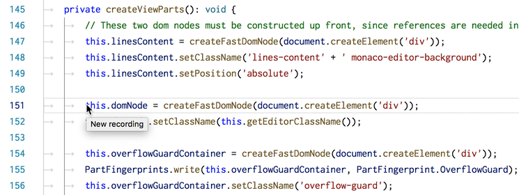

Here is an example for how you can bind them:

```json
{ "key": "ctrl+alt+right",          "command": "cursorWordPartRight",
                                       "when": "textInputFocus" },
{ "key": "ctrl+shift+alt+right",    "command": "cursorWordPartRightSelect",
                                       "when": "textInputFocus" },
{ "key": "ctrl+alt+left",           "command": "cursorWordPartStartLeft",
                                       "when": "textInputFocus" },
{ "key": "ctrl+shift+alt+left",      "command": "cursorWordPartStartLeftSelect",
                                       "when": "textInputFocus" },
{ "key": "ctrl+alt+backspace",       "command": "deleteWordPartLeft",
                                       "when": "textInputFocus && !editorReadonly" },
{ "key": "ctrl+shift+alt+backspace", "command": "deleteWordPartRight",
                                       "when": "textInputFocus && !editorReadonly" },
```

### Suggestion selections

Language IntelliSense providers often know which suggestions are best and with this version of VS Code, they can now preselect suggestions. There is new [API](#preselected-completion-items) for preselected suggestions and when available, the editor will select that suggestion rather than the first in the list.

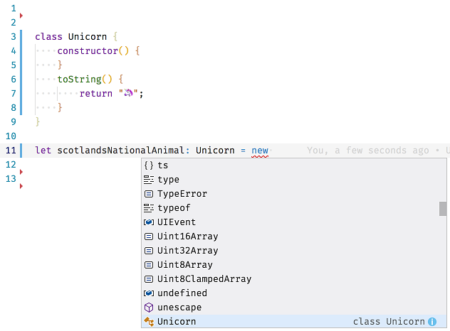

### Snippet placeholder transformations

Snippets finally support placeholder transformations. Placeholder transformations are like variable transformations but more dynamic. A transformation is applied when switching from one placeholder to the next and this is the grammar rule for them: __${__*int*__/__*regex*__/__*format_string*__/__*opts*__}__.

Below is a sample that replaces "Hello World" with its German counterpart:

```json
"HelloWorld": {
  "prefix": "say_hello",
  "body": "${1} ${2} -> ${1/Hello/Hallo/} ${2/World/Welt/}"
}
```


Refer to the [snippet grammar](https://code.visualstudio.com/docs/editor/userdefinedsnippets#_grammar) for more details and how to unleash the full potential of transformations.

## Integrated Terminal

### Performance Improvements

The Integrated Terminal's parser was re-written from the ground up for enhanced ANSI compliance and boosting the rate at which incoming data is processed by approximately 30%. This came in as an upstream community contribution to [xterm.js](https://github.com/xtermjs/xterm.js/pull/1399).

### Bold text bright color setting

The terminal currently converts all bold text to use the bright color variant. This is a little inconsistent across terminal emulators and is mostly around for legacy reasons. You can now turn this automatic conversion off to allow the use of non-bright colors for bold text.

```json
{
  "terminal.integrated.drawBoldTextInBrightColors": false
}
```

This came in as an upstream community contribution to [xterm.js](https://github.com/xtermjs/xterm.js/pull/1391).

## Debugging

### Floating debug toolbar

In the previous milestone, we have introduced a new setting to dock the debug toolbar in the Debug view (`"debug.toolBarLocation": "docked"`). In this milestone, we reviewed user feedback and tried to improve the floating toolbar behavior as well (`"debug.toolBarLocation": "floating"`).

The [consensus](https://github.com/microsoft/vscode/issues/52490) from feedback was that the toolbar should always be visible (independent from which view is active) and that it should not hide anything (for instance the editor tabs). Therefore, we've "unchained" the floating toolbar by allowing it to be dragged to the editor area. This should help users that heavily use editor tabs but also want to see the debug toolbar at all times.

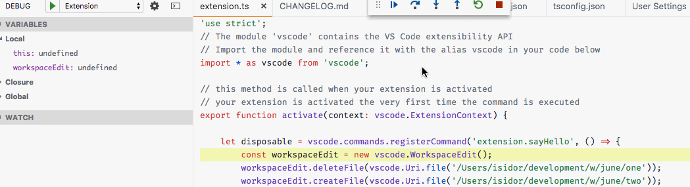

Since the existing `debug.hideActionBar` setting is handled by the value `hidden` with the `debug.toolBarLocation` setting, we are now **removing** `debug.hideActionBar`.

## Languages

### TypeScript 2.9.2

VS Code now ships with TypeScript 2.9.2. This minor release fixes a number of bugs and improves stability. You can read about the complete set of changes [here](https://github.com/microsoft/TypeScript/milestone/73?closed=1).

### Update import paths on folder rename

Last release brought automatic import path updating when you move or rename a JavaScript or TypeScript file. This feature now also works when you move or rename a directory. Again, by default, VS Code will prompt you if we can update paths. You can control the prompting behavior with the `javascript.updateImportsOnFileMove.enabled` and `typescript.updateImportsOnFileMove.enabled` settings.

Valid values are:

* `"prompt"` - The default. Asks if paths should be updated.
* `"always"` - Always automatically update paths.
* `"never"` - Do not update paths automatically and do not prompt.

### Hierarchical Markdown document symbols

The built-in Markdown support uses the new `DocumentSymbol` API to make sure Markdown headers are properly nested in the Outline view.

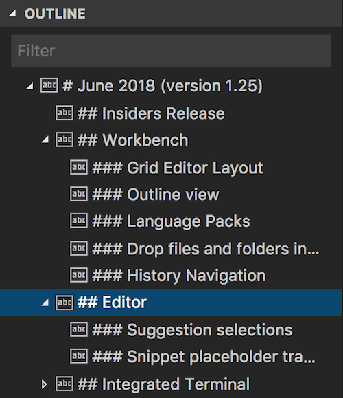

### New CSS pseudo selectors and pseudo elements from MDN

In the April release, we started [sourcing data](https://code.visualstudio.com/updates/v1_23#_improved-css-support-for-new-properties) from Mozilla Developer Network for up-to-date CSS/SCSS/Less support. In this release, we added the following pseudo selectors / elements:

* `:defined | :dir | :focus-visible | :focus-within | :placeholder-shown`
* `::-moz-range-progress | ::-moz-range-thumb | ::-moz-range-track | ::-webkit-progress-inner-value | ::grammar-error | ::placeholder`

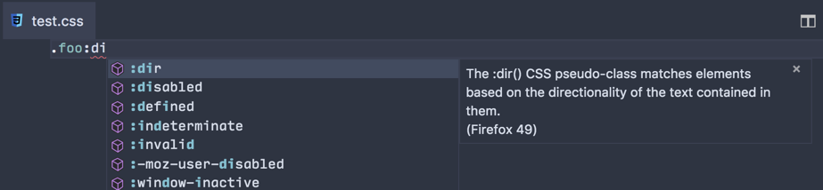

### Improved accuracy of Browser Compatibility Data

Thanks to [mdn/browser-compat-data](https://github.com/mdn/browser-compat-data), we brought this section from MDN to our CSS/SCSS/Less completions:

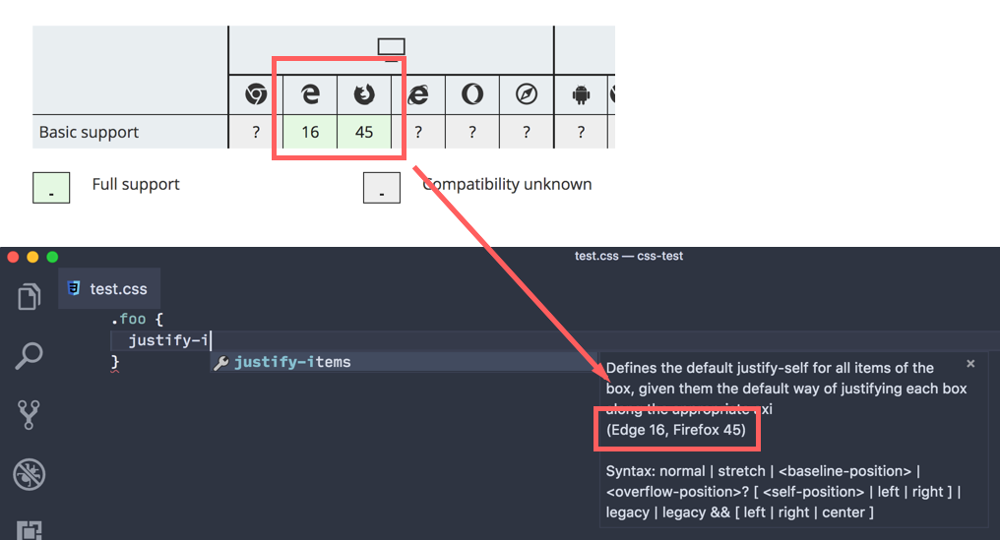

The `justify-items` property, alongside many other CSS properties for CSS Grid Layout, has been supported in Edge since version 16. By sourcing data from MDN, VS Code keeps browser compatibility data for CSS features up-to-date.

### Graceful handling of unknown At-Rules

People who are using CSS pre-processors may use custom at-rules that are compiled to valid CSS at build time. Previously, VS Code could not parse or handle such at-rules. In this release, we have better support for at-rules, so that they:

* Receive correct syntax highlighting as they still abide by CSS syntax.
* No longer generate errors at incorrect locations.
* Generate correct errors that can be controlled by `css.lint.unknownAtRules`.

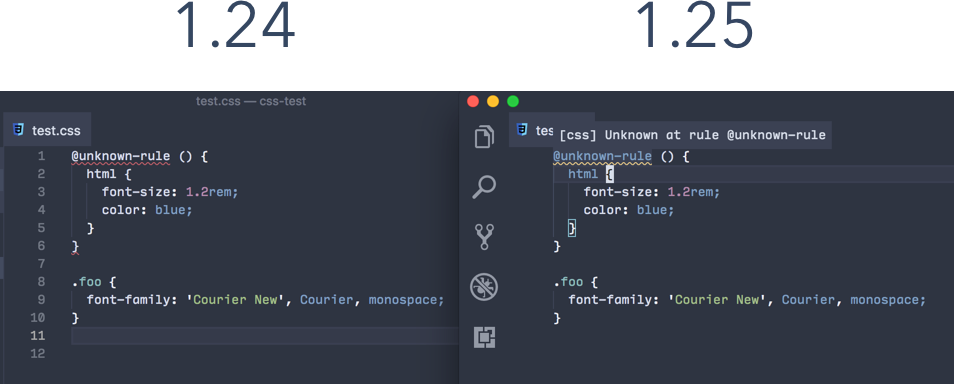

## Extensions

### New default view for Extensions view

Until now, the default view for the Extensions view contained a section for **Installed** extensions and another for **Recommended** extensions. The presence of installed but disabled extensions among the enabled ones made it hard to interact with the latter. We now provide a new default, where the **Enabled** extensions are shown first, followed by a section for **Recommended** extensions, and, at the bottom, a collapsed section for **Disabled** extensions.

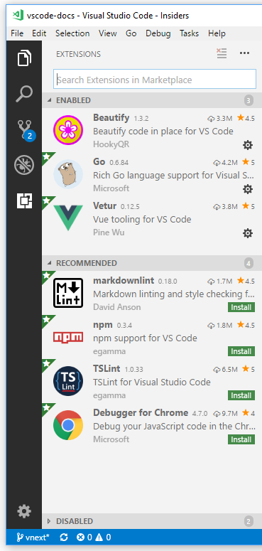

You can always re-order, collapse/expand, or hide any of these sections by using the context menu in the Extensions view. You can also use the **Open View...** command in the **View** menu to show/hide these sections.

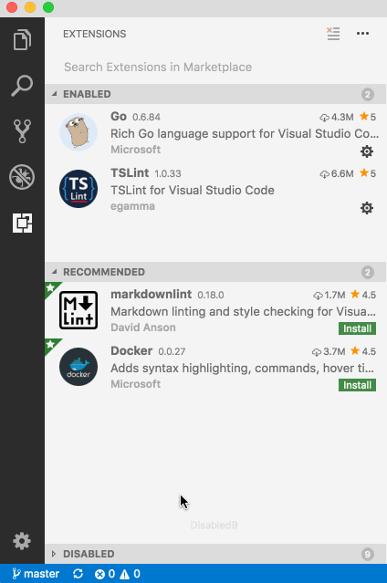

### Dismiss extension recommendations

We recommend extensions to you based on the files you have opened and your workspace environment. We understand that not every recommendation might be appropriate for your project and so you can now dismiss specific recommendations.

To dismiss a recommendation, click on the extension item to open the Details pane and then press the **Ignore Recommendation** button. Ignored recommendations will no longer be recommended to you.

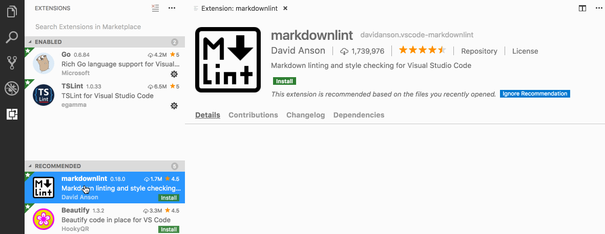

### Manage workspace recommendations

You could already configure a set of extensions to be recommended for users of your workspace using [workspace recommendations](https://code.visualstudio.com/docs/editor/extension-marketplace#_workspace-recommended-extensions) in an `extensions.json` file. Managing these recommendations is now much easier. Click on any extension in the Extensions view to open the Details pane. You can then use the new commands below to add recommendations or disallow certain extensions that you don't want recommended for users of your workspace.

* Extensions: Add to Recommended Extensions (Workspace)
* Extensions: Add to Recommended Extensions (Workspace Folder)
* Extensions: Ignore Recommended Extension (Workspace)
* Extensions: Ignore Recommended Extension (Workspace Folder)

## Language Packs

VS Code now ships with only English as the display language and other [languages](https://code.visualstudio.com/docs/getstarted/locales#_available-locales) rely on Language Packs installable from the VS Code [Marketplace](https://marketplace.visualstudio.com/search?target=VSCode&category=Language%20Packs&sortBy=Downloads). You should not notice this change if you had installed a Language Pack when prompted by the 1.23 or 1.24 versions of VS Code. If you are upgrading from an older version of VS Code or have a fresh installation, you will see a prompt to install the Language Pack of your OS's UI language. Additional Language Packs can be installed from the Marketplace using the Extensions view (`kb(workbench.view.extensions)`).

To summarize:

* If you update from VS Code version 1.22 or older to 1.25, the display language will be English and VS Code will prompt you to install the Language Pack for the OS's UI language, if such a Language Pack is available in the Marketplace.
* If you updated from 1.23 or 1.24 to 1.25, you should already have been prompted to install the Language Pack for the UI language. If you did so, 1.25 will start as normal and the display language is presented as the chosen UI language. If you didn't install a Language Pack, then you will be prompted to do so.
* Fresh installs of VS Code, version 1.25 or higher, will prompt you to install a Language Pack if an appropriate one is available in the Marketplace.

## Preview Features

Preview features are not ready for release but are functional enough to use. We welcome your early feedback while they are under development.

### New Settings Editor

In this milestone, we continued work on a GUI for editing settings. It's still a preview, but if you'd like to try it out, you can open it with the **Preferences: Open Settings (Preview)** command. We would like to hear any feedback you have - you can leave it on [this GitHub issue](https://github.com/microsoft/vscode/issues/50249).

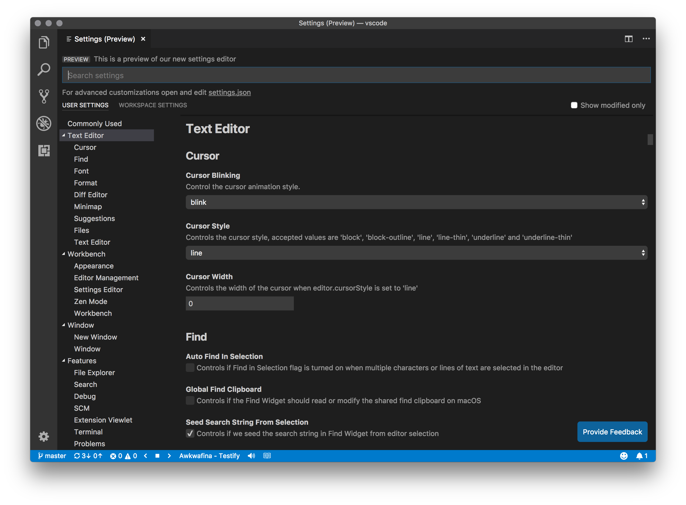

Some of the new changes compared to last month are:

* A "table of contents" (TOC) that organizes settings into new categories.
* A cleaned up and refreshed layout for the setting rows.
* The "Reset" button has been removed - editing a setting to its default value will remove it from `settings.json`.

Also, try the `"workbench.settings.settingsSearchTocBehavior"` setting to see three different options (`show`, `hide`, `filter`) for the "table of contents" while searching settings, and let us know which option you prefer.

### User setup for Windows

Windows users now have a new **Preview** setup package available, which does not require Administrator privileges to install. This setup package also provides a smoother background update experience. This feature is only available on Insiders for now, as we'd like more feedback during July in order to provide the best experience for our Stable user base.

Here are the download links for the Insiders user setup packages:

* [Windows 64 bit](https://vscode-update.azurewebsites.net/latest/win32-x64-user/insider)
* [Windows 32 bit](https://vscode-update.azurewebsites.net/latest/win32-user/insider)

### Custom title bar and menus for Windows/Linux

Windows and Linux users can now use the `window.titleBarStyle` setting value `custom` and we've implemented a new menu bar to match. The setting is not yet enabled by default but can be turned on with the `window.titleBarStyle` setting.

With the setting enabled for Windows and Linux, the old menu bar will be replaced with a new menu bar that matches your light or dark theme. The new menu bar also comes with some enhancements such as top-level keyboard navigation with the arrow keys. Lastly, the menus throughout the product will also match the new menu bar.

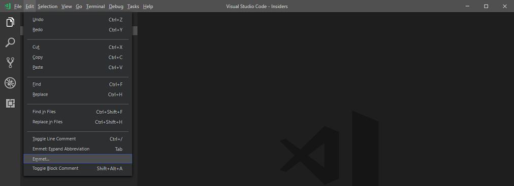

We will continue to improve the new menus and title bar as well as address issues tagged with the [`workbench-title`](https://github.com/microsoft/vscode/labels/workbench-title) or [`workbench-menu`](https://github.com/microsoft/vscode/labels/workbench-menu) labels.

### Terminal: Dynamic texture atlas

An experimental setting has been added to enable the new "dynamic texture atlas" for the [terminal canvas](https://code.visualstudio.com/blogs/2017/10/03/terminal-renderer). This changes the caching strategy used by the terminal to store character glyphs. Instead of being a fixed set of glyphs on the default background, glyphs are now added to the texture atlas as they are required and regardless of the background being used. This should reduce the first terminal start up time, reduce rendering time of characters not using the default background, as well as improving overall rendering performance.

This will eventually be the default, for now you can opt-in with the following setting:

```json
{
  "terminal.integrated.experimentalTextureCachingStrategy": "dynamic"
}
```

This came in as an upstream community contribution to [xterm.js](https://github.com/xtermjs/xterm.js/pull/1327).

## Extension Authoring

### Grid Editor Layout: ViewColumn

There are only a few API adjustments to support the new grid editor layout feature. Most notably, there is a new `ViewColumn.Beside` action that can be used to open an editor to the side of the active one. With the grid editor layout, there is no longer a limit in the number of opened editors, so using that option will always create a new editor to the side of the active one unless there is already some space to the side. Depending on the user setting `workbench.editor.openSideBySideDirection`, this can either be to the right or below the editor.

The `ViewColumn` value for text editors and webviews still goes by the order of appearance in the editor area from left to right as shown below:

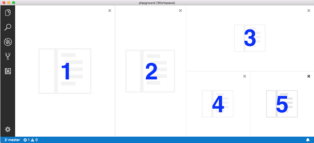

Even though the `ViewColumn` enumeration was extended all the way to `ViewColumn.Nine`, a `TextEditor` will always have a number assigned as view column as long as it is contained in the grid.

When an editor group is moved or an editor group is closed, the `onDidChangeTextEditorViewColumn` event is fired as before.

### Grid Editor Layout: New Commands

Even though the change to the API is minimal to support the new grid editor layout, extensions can still make use of the grid editor layout by leveraging new commands that were added (see the [New Commands](#new-commands) section for a complete overview).

The new `vscode.setEditorLayout` deserves a bit of explanation as it allows you to change the overall editor layout with a single command and arguments. The layout is described as object with an initial (optional) orientation (`0` = horizontal, `1` = vertical) and an array of editor `groups` within. Each editor group can have a `size` and another array of editor `groups` that will be laid out orthogonal to the orientation. If editor group sizes are provided, their sum must be `1` to be applied per row or column.

Example for a 2x2 grid:

```json
{ orientation: 0, groups: [{ groups: [{}, {}], size: 0.5 }, { groups: [{}, {}], size: 0.5 }] }
```

### Editors open in active ViewColumn by default

If no `ViewColumn` is provided when opening a text editor or webview , VS Code now defaults to opening in the currently active editor group, instead of opening it in `ViewColumn.One`. If you want to preserve the previous behavior, just pass in `ViewColumn.One` when opening.

### Preselected Completion Items

Extension that provide completion items can now marks them as 'preselected'. That is useful when many completions exist but some are more likely to be selected. An example of this is when the user is assigning known variable types. This feature also lets extensions select more commonly used completions, such as favoring `console.log` over `console.dirxml`.

The API addition is `'CompletionItem#preselect: boolean'` and when many preselected items exists, the one with the highest rank is selected.

### Document Symbols

To get the most out of the new Outline view tree, extensions should modify their `DocumentSymbolProviders` to return `DocumentSymbols`. This is a new type added and tailored towards the needs of the outline tree. It supports representing a hierarchy of document symbols and allows differentiating between the range that defines a symbol and the selection range that identifies a symbol.

```bash

         +--/**
         |   * Some Comment
<range>--|   */
         |  export function fooFunction() {
         |                  +----------+
         +--}                   |
                                |
                          <selection range>
```

### Readonly file system provider

A file system provider can now be registered as `readonly`. VS Code will respect this flag by disabling all the mutating commands on the resources coming from that file system provider. Editors will also be opened in readonly mode for those readonly resources.

### Custom views

**Tree view visibility**

You can now check if the tree view is visible or not using the following newly added property and event to `TreeView`:

```typescript
/**
 * `true` if the [tree view](#TreeView) is visible otherwise `false`.
 */
readonly visible: boolean;

/**
 * Event that is fired when [visibility](TreeView.visible) has changed
 */
readonly onDidChangeVisibility: Event<TreeViewVisibilityChangeEvent>;

/**
 * The event that is fired when there is a change in [tree view's visibility](#TreeView.visible)
 */
export interface TreeViewVisibilityChangeEvent {

  /**
   * `true` if the [tree view](#TreeView) is visible otherwise `false`.
   */
  readonly visible: boolean;

}

```

**Selection Listener**

A new selection change event was added to the tree view to listen to the selection changes:

```typescript
/**
 * Event that is fired when the [selection](#TreeView.selection) has changed
 */
readonly onDidChangeSelection: Event<TreeViewSelectionChangeEvent<T>>;

/**
 * The event that is fired when there is a change in [tree view's selection](#TreeView.selection)
 */
export interface TreeViewSelectionChangeEvent<T> {

  /**
   * Selected elements.
  */
  readonly selection: T[];

}

```

**Reveal and Focus**

You can now reveal and focus an element in the tree view by setting the focus option to `true` while calling the `reveal` API.

```typescript
reveal(element: T, options?: { select?: boolean, focus?: boolean }): Thenable<void>;
```

### New Theme colors

There are two new theme colors for the background color of empty editor groups, a feature that came out of the work to support grid editor layout:

* `editorGroup.emptyBackground`: Background color of an empty editor group.
* `editorGroup.focusedEmptyBorder`: Border color of an empty editor group that is focused.

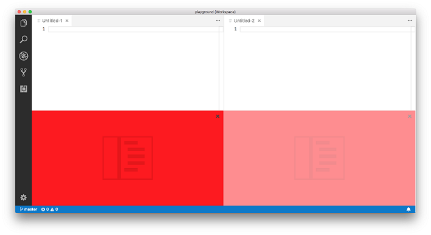

* `editorPane.background`: Background color of the editor pane visible on the left and right side of the centered editor layout

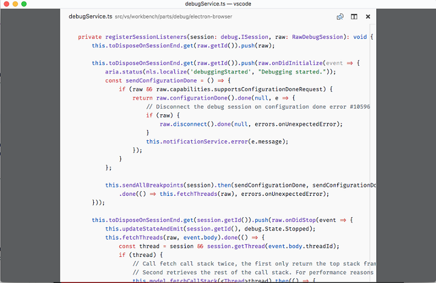

### Deprecated Theme colors

The theme color `editorGroup.background` is no longer supported with the introduction of the grid editor layout feature.

### Rename Command

The rename-command (`editor.action.rename`) can now be invoked with an `Uri` and a `Position` and the editor will initiate a rename operation accordingly. For example:

```ts
vscode.commands.executeCommand(
  'editor.action.rename',
  [vscode.Uri.file('/my/file.abc'), new vscode.Position(14, 7)]
)
```

### DiagnosticTag

Diagnostic tags allow extensions to attach additional metadata about a diagnostic. VS Code uses this metadata to tweak how these diagnostics are rendered.

```ts
const diag = new vscode.Diagnostic(new Range(0, 0, 0, 10), 'Unused');
diag.tags = [vscode.Diagnostic.Unnecessary]
```

`DiagnosticTag.Unnecessary` indicates that a diagnostic is for unreferenced or unreachable source code. Any source code marked with `DiagnosticTag.Unnecessary` will be rendered faded out. The amount of fading is controlled by the `"editorUnnecessaryCode.opacity"` theme color. For example, `"editorUnnecessaryCode.opacity": "#000000c0"` will render the code with 75% opacity. For high contrast themes, use the `"editorUnnecessaryCode.border"` theme color to underline unnecessary code instead of fading it out.

### WebviewPanel.active and WebviewPanel.visible

Webview panels have two new readonly properties:

* `active` - tracks when the panel is focused.
* `visible`- tracks when the panel is on the screen.

### Webview persistence

The webview API has been extended with support for saving and restoring the state of a webview.

The `getState` and `setState` APIs inside the webview context allow a webview to save state and get a state object that is persisted even when the webview itself goes into a background tab.

```js
// Inside a webview's JavaScript
const vscode = acquireVsCodeApi();

// Look up old state (will be undefined if no state is set)
const oldState = vscode.getState();

// Update the persisted state.
// You can save off any json serializable object.
if (oldState) {
    vscode.setState({ count: oldState.count + 1 });
} else {
    vscode.setState({ count: 1 });
}
```

In addition, extensions can register a `WebviewPanelSerializer` that allows webviews of a given type to be persisted across restarts of VS Code. To enable this, the extension must call `vscode.window.registerWebviewPanelSerializer` in its activation method.

```ts
export function activate(context: vscode.ExtensionContext) {
    ...

    vscode.window.registerWebviewPanelSerializer('myWebviewType', {
        async deserializeWebviewPanel(webviewPanel: vscode.WebviewPanel, state: any) {
            // `state` is the state persisted using `setState` inside the webview
            console.log(`Got state: ${state}`);

            new MyWebview(webviewPanel);
        }
    });
}
```

The extension must also add a `onWebviewPanel` activation event:

```json
"activationEvents": [
    ...,
    "onWebviewPanel:catCoding"
]
```

The new webview persistence APIs are documented on the [webview extension authoring page](https://code.visualstudio.com/docs/extensions/webview). The [example webview extension](https://github.com/microsoft/vscode-extension-samples/tree/main/webview-sample) also demonstrates how to use these new APIs.

### Language Packs: Minimal translations

VS Code will now prompt users for an available Language Pack in the language of the Language Pack. Below is an example recommending a Simplified Chinese Language Pack in Simplified Chinese and English.

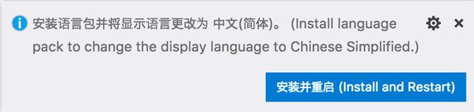

This display requires that Language Pack authors translate the following minimal translation strings in their Language Pack:

```ts
{
   showLanguagePackExtensions: localize('showLanguagePackExtensions', "Search language packs in the Marketplace to change the display language to {0}."),
   searchMarketplace: localize('searchMarketplace', "Search Marketplace"),
   installAndRestartMessage: localize('installAndRestartMessage', "Install language pack to change the display language to {0}."),
   installAndRestart: localize('installAndRestart', "Install and Restart")
}
```

### Language Server Protocol Inspector

Language Servers that use [vscode-languageclient](https://github.com/microsoft/vscode-languageserver-node) can specify a setting `[langId].trace.server` to receive logging support. Although the generated log is valuable for understanding the LSP communication between VS Code and Language Servers, the log can be long and hard to extract useful information from.

With the new LSP Inspector, you now have a tool to help understand LSP logs: https://microsoft.github.io/language-server-protocol/inspector/

In the Inspector, you can:

* Scan through the requests, responses, and notifications between Language Client and Server.
* Filter through logs using search or predefined filters to locate useful information.


The Inspector can be useful for debugging Language extensions. You can ask users to attach LSP logs to their bug reports and use the Inspector to analyze the logs.

The [Language Server Guide](https://code.visualstudio.com/docs/extensions/example-language-server#_logging-support-for-language-server) has been updated to include sections on logging support and the features of the LSP Inspector.

### Language Server: End to End testing

A section on End to End Testing has been added to the [Language Server Guide](https://code.visualstudio.com/docs/extensions/example-language-server#_testing-the-language-server).

Compared to unit-testing components of Language Servers, End to End tests open a workspace in VS Code, launch the Language extension in the Extension Host, and make assertions against the real behavior of the Language extension. This makes mocking workspace and VS Code state easy and checks real VS Code behavior.

### Language Server: Refreshed guide

The [Language Server Guide](https://code.visualstudio.com/docs/extensions/example-language-server) has received a refresh. Major improvements include:

* Sections on Logging and Testing as mentioned above.
* Explanation of Language Server Protocol, Language Server, and the relationship between them.
* Updated illustrations of LSP and Language Server.
* Updated [lsp-sample](https://github.com/microsoft/vscode-extension-samples/tree/main/lsp-sample) sample code.
* More references to the [LSP Website](https://microsoft.github.io/language-server-protocol/).

## Proposed Extension APIs

Every milestone comes with new proposed APIs and extension authors can try them out. As always we are keen on your feedback. This is what you have to do to try out a proposed API:

* You must use Insiders because proposed APIs change frequently.
* You must have this line in the `package.json` file of your extension: `"enableProposedApi": true`.
* Copy the latest version of the [vscode.proposed.d.ts](https://github.com/microsoft/vscode/blob/main/src/vs/vscode.proposed.d.ts) file into your project.

Note that you cannot publish an extension that uses a proposed API. We may likely make breaking changes in the next release and we never want to break existing extensions.

### WorkspaceEdit can create/rename/delete Files

We have added a proposed API that extends `WorkspaceEdit` so that it can be used to create, rename, and delete files or folders. This is useful for complex refactorings, for example renaming a file when a type is being renamed, but should also enable other scenarios.

### Local Rename Events

We are proposing two events that fire before and after a rename occurs. They are called `onWillRenameFile` and `onDidRenameFile` and they allow an extension to react or participate in the rename.

### QuickInput API

The new `QuickPick` and `InputBox` APIs allow for more flexible collection of user input than the existing `showQuickPick` and `showInputBox` APIs. With the new APIs, you create a new instance of an input object on which you then register event handlers and set properties according to your use case:

```ts
export namespace window {
  export function createQuickPick<T extends QuickPickItem>(): QuickPick<T>;
  export function createInputBox(): InputBox;
}
```

There are samples of QuickInput API usage in a [sample extension](https://github.com/microsoft/vscode-extension-samples/tree/main/quickinput-sample).

The multi-step input sample:

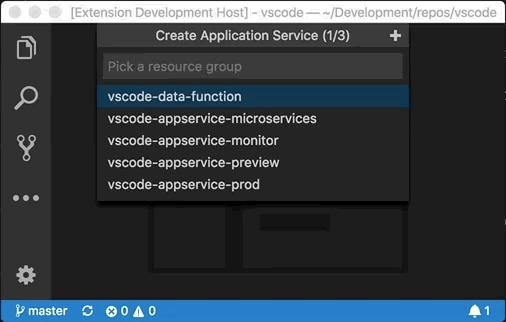

If the existing `showQuickPick` and `showInputBox` APIs are not flexible enough, use the new `QuickPick` and `InputBox` APIs, otherwise keep to the existing ones as these will get the job done quicker.

Use issue [#53327](https://github.com/microsoft/vscode/issues/53327) for feedback and discussion.

### Terminal renderers

The concept of a terminal "renderer" is being proposed. A terminal renderer is basically a terminal instance within the terminal panel but it has no backing process, instead the **extension** acts as the process. This is useful for implementing a terminal multiplexer within VS Code where the extension has access to the in/out pipes of some process, which are hooked then up to the terminal renderer. The [Live Share extension](https://marketplace.visualstudio.com/items?itemName=MS-vsliveshare.vsliveshare) is planning on using this new API to improve the stability and maintainability of its shared terminal support.

```ts
export namespace window {
  export function createTerminalRenderer(name: string): TerminalRenderer;
}

export interface TerminalRenderer {
  name: string;
  dimensions: TerminalDimensions | undefined;
  readonly maximumDimensions: TerminalDimensions | undefined;
  readonly terminal: Terminal;
  readonly onDidAcceptInput: Event<string>;
  readonly onDidChangeMaximumDimensions: Event<TerminalDimensions>;
  write(text: string): void;
}

export interface TerminalDimensions {
  readonly columns: number;
  readonly rows: number;
}
```

Another example use case is an extension creating its own REPL. This works by the extension listening to every character press and acting when the `Enter` key is pressed:

```ts
const shell = vscode.window.createTerminalRenderer('My Extension REPL');
shell.write('Type and press enter to echo the text\r\n\r\n');
shell.terminal.show();

let line = '';
shell.onDidAcceptInput(data => {
  if (data === '\r') {
    shell.write(`\r\necho: "${line}"\r\n\n`);
    line = '';
  } else {
    line += data;
    shell.write(data);
  }
});
```

### Tracking the active terminal

We are proposing new extension APIs for the Integrated Terminal that make it possible to track the active terminal, similar to `window.activeTextEditor` and `window.onDidChangeActiveTextEditor`:

```ts
export namespace
  export const activeTerminal: Terminal | undefined;
  export const onDidChangeActiveTerminal: Event<Terminal | undefined>;
}
```

### Terminal.onData renamed

`Terminal.onData` has been renamed to `onDidWriteData` in order to align with our [naming guidelines](https://github.com/microsoft/vscode/wiki/Extension-API-guidelines#event-naming):

```ts
export interface Terminal {
  onDidWriteData: Event<string>;
}
```

### DefinitionLink

Definition links allow definition providers to return additional metadata with definitions:

```ts
export interface DefinitionLink {
   /**
    * Span of the symbol being defined in the source file.
    *
    * Used as the underlined span for mouse definition hover. Defaults to the word range at
    * the definition position.
    */
   origin?: Range;

   /**
    * The resource identifier of the definition.
    */
   uri: Uri;

   /**
    * The full range of the definition.
    *
    * For a class definition for example, this would be the entire body of the class definition.
    */
   range: Range;

   /**
    * The span of the symbol definition.
    *
    * For a class definition, this would be the class name itself in the class definition.
    */
   selectionRange?: Range;
}
```

This additional information is used by VS Code to improve the user experience for **Go to Definition** actions.

To use `DefinitionLink`, a `DefinitionProvider` must currently implement a `provideDefinition2` method. Once the `DefinitionLink` API is stabilized, we plan to remove `provideDefinition2` and update the normal `DefinitionProvider.provideDefinition` method to also allow returning `DefinitionLink`.

## New Commands

Key|Command|Command id
---|-------|----------
`kb(workbench.action.splitEditorOrthogonal)`|Split the editor to the orthogonal direction that is configured via `openSideBySideDirection`|`workbench.action.splitEditorOrthogonal`
`kb(workbench.action.showEditorsInActiveGroup)`|Show the opened editors of the active editor group|`workbench.action.showEditorsInActiveGroup`
`kb(workbench.action.moveEditorToLastGroup)`|Move the active editor to the last editor group|`workbench.action.moveEditorToLastGroup`
`kb(workbench.action.moveActiveEditorGroupUp)`|Move the active editor group up|`workbench.action.moveActiveEditorGroupUp`
`kb(workbench.action.moveActiveEditorGroupDown)`|Move the active editor group down|`workbench.action.moveActiveEditorGroupDown`
`kb(workbench.action.focusLastEditorGroup)`|Focus the last editor group|`workbench.action.focusLastEditorGroup`
`kb(workbench.action.firstEditorInGroup)`|Focus the first editor group|`workbench.action.firstEditorInGroup`
`kb(workbench.action.closeGroup)`|Close the active editor group (will merge opened editors into the neighbor group)|`workbench.action.closeGroup`
`kb(workbench.action.closeAllEditorGroups)`|Close all editor groups|`workbench.action.closeAllEditorGroups`
`kb(workbench.action.closeEditorsAndGroup)`|Close the active editor group and its editors|`workbench.action.closeEditorsAndGroup`
`kb(workbench.action.splitEditorUp)`|Split the active editor up|`workbench.action.splitEditorUp`
`kb(workbench.action.splitEditorDown)`|Split the active editor down|`workbench.action.splitEditorDown`
`kb(workbench.action.splitEditorLeft)`|Split the active editor to the left|`workbench.action.splitEditorLeft`
`kb(workbench.action.splitEditorRight)`|Split the active editor to the right|`workbench.action.splitEditorRight`
`kb(workbench.action.joinAllGroups)`|Merge the editors of all editor groups into the active one|`workbench.action.joinAllGroups`
`kb(workbench.action.focusFourthEditorGroup)`|Focus the fourth editor group (will create a new editor group as needed)|`workbench.action.focusFourthEditorGroup`
`kb(workbench.action.focusFifthEditorGroup)`|Focus the fifth editor group (will create a new editor group as needed)|`workbench.action.focusFifthEditorGroup`
`kb(workbench.action.focusSixthEditorGroup)`|Focus the sixth editor group (will create a new editor group as needed)|`workbench.action.focusSixthEditorGroup`
`kb(workbench.action.focusSeventhEditorGroup)`|Focus the seventh editor group (will create a new editor group as needed)|`workbench.action.focusSeventhEditorGroup`
`kb(workbench.action.focusEighthEditorGroup)`|Focus the eighth editor group (will create a new editor group as needed)|`workbench.action.focusEighthEditorGroup`
`kb(workbench.action.moveEditorToLeftGroup)`|Move active editor into the left editor group|`workbench.action.moveEditorToLeftGroup`
`kb(workbench.action.moveEditorToRightGroup)`|Move active editor into the right editor group|`workbench.action.moveEditorToRightGroup`
`kb(workbench.action.moveEditorToAboveGroup)`|Move active editor into the above editor group|`workbench.action.moveEditorToAboveGroup`
`kb(workbench.action.moveEditorToBelowGroup)`|Move active editor into the below editor group|`workbench.action.moveEditorToBelowGroup`
`kb(workbench.action.focusLeftGroup)`|Focus the editor group to the left|`workbench.action.focusLeftGroup`
`kb(workbench.action.focusRightGroup)`|Focus the editor group to the right|`workbench.action.focusRightGroup`
`kb(workbench.action.focusAboveGroup)`|Focus the editor group to the top|`workbench.action.focusAboveGroup`
`kb(workbench.action.focusBelowGroup)`|Focus the editor group to the bottom|`workbench.action.focusBelowGroup`
`kb(workbench.action.newEditorGroupLeft)`|Create a new editor group to the left|`workbench.action.newEditorGroupLeft`
`kb(workbench.action.newEditorGroupRight)`|Create a new editor group to the right|`workbench.action.newEditorGroupRight`
`kb(workbench.action.newEditorGroupAbove)`|Create a new editor group to the top|`workbench.action.newEditorGroupAbove`
`kb(workbench.action.newEditorGroupBelow)`|Create a new editor group to the bottom|`workbench.action.newEditorGroupBelow`
`kb(workbench.action.editorLayoutSingle)`|Switch to editor layout: Single|`workbench.action.editorLayoutSingle`
`kb(workbench.action.editorLayoutTwoColumns)`|Switch to editor layout: Two Columns|`workbench.action.editorLayoutTwoColumns`
`kb(workbench.action.editorLayoutThreeColumns)`|Switch to editor layout: Three Columns|`workbench.action.editorLayoutThreeColumns`
`kb(workbench.action.editorLayoutTwoRows)`|Switch to editor layout: Two Rows|`workbench.action.editorLayoutTwoRows`
`kb(workbench.action.editorLayoutThreeRows)`|Switch to editor layout: Three Rows|`workbench.action.editorLayoutThreeRows`
`kb(workbench.action.editorLayoutTwoByTwoGrid)`|Switch to editor layout: Two by Two Grid|`workbench.action.editorLayoutTwoByTwoGrid`
`kb(workbench.action.editorLayoutTwoColumnsBottom)`|Switch to editor layout: Two Columns (Bottom)|`workbench.action.editorLayoutTwoColumnsBottom`
`kb(workbench.action.editorLayoutTwoColumnsRight)`|Switch to editor layout: Two Columns (Right)|`workbench.action.editorLayoutTwoColumnsRight`
`kb(workbench.action.editorLayoutCentered)`|Switch to editor layout: Centered|`workbench.action.editorLayoutCentered`

### New `layoutEditorGroups` command

The `layoutEditorGroups` command lets you create an editor group layout and assign it a keybinding. The layout is described as an object with an initial (optional) orientation (`0` = horizontal, `1` = vertical) and an array of editor `groups` within. Each editor group can have a `size` and another array of editor `groups` that will be laid out orthogonal to the orientation. If editor group sizes are provided, their sum must be `1` to be applied per row or column. For example:

```json
{
    "key": "Ctrl+0",
    "command": "layoutEditorGroups",
    "args": {
        "orientation": 1,
        "groups": [{ "size": 0.2 }, { "size": 0.6 }, { "size": 0.2, "groups": [{}, {}] }]
    }
}
```

This will produce the following layout:

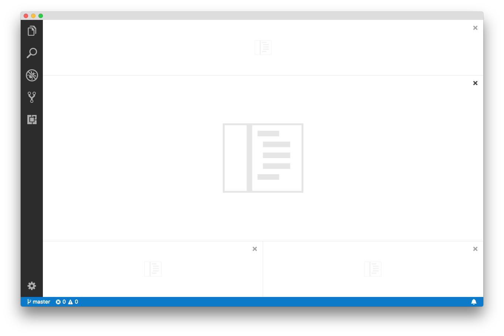

## Removed Commands

Command id|Replacement
---|-------
`workbench.action.showEditorsInFirstGroup`|Use `showEditorsInActiveGroup` instead
`workbench.action.showEditorsInSecondGroup`|Use `showEditorsInActiveGroup` instead
`workbench.action.showEditorsInThirdGroup`|Use `showEditorsInActiveGroup` instead
`workbench.action.moveEditorToSecondGroup`|Use a `workbench.action.moveEditor*` command instead
`workbench.action.moveEditorToThirdGroup`|Use a `workbench.action.moveEditor*` command instead
`workbench.action.openLastEditorInGroup`|Use `lastEditorInGroup` instead
`workbench.action.openFolderAsWorkspaceInNewWindow`| Use `duplicateWorkspaceInNewWindow` instead
`editor.debug.action.toggleColumnBreakpoint`| Use `toggleInlineBreakpoint` instead

### History Navigation Commands

Command id|Replacement
---|-------
`search.history.showPrevious`|Use `history.showPrevious` instead
`search.history.showNext`|Use `history.showNext` instead
`search.replaceHistory.showPrevious`|Use `history.showPrevious` instead
`search.replaceHistory.showNext`|Use `history.showNext` instead
`search.history.showPreviousIncludePattern`|Use `history.showPrevious` instead
`search.history.showNextIncludePattern`|Use `history.showNext` instead
`search.history.showPreviousExcludePattern`|Use `history.showPrevious` instead
`search.history.showNextExcludePattern`|Use `history.showNext` instead
`find.history.showPrevious`| Use `history.showPrevious` instead
`find.history.showNext`| Use `history.showNext` instead
`workbench.action.terminal.findWidget.history.showPrevious`|Use `history.showPrevious` instead
`workbench.action.terminal.findWidget.history.showNext`|Use `history.showNext` instead
`editor.action.extensioneditor.showPreviousFindTerm`| Use `history.showPrevious` instead
`editor.action.extensioneditor.showNextFindTerm`| Use `history.showNext` instead
`editor.action.webvieweditor.showPreviousFindTerm`| Use `history.showPrevious` instead
`editor.action.webvieweditor.showNextFindTerm`| Use `history.showNext` instead
`repl.action.historyPrevious`| Use `history.showPrevious` instead
`repl.action.historyNext`| Use `history.showNext` instead

## New Documentation

### New Python Flask tutorial

There is a new [Using Flask in Visual Studio Code](https://code.visualstudio.com/docs/python/tutorial-flask?utm_source=VsCode&utm_medium=ReleaseNotes) tutorial showing how you can quickly create, edit, and debug a Python [Flask](https://flask.palletsprojects.com) web application in VS Code.

### Updated website deployment tutorial

We've updated the [Deploy static website to Azure](https://code.visualstudio.com/tutorials/static-website/getting-started?utm_source=VsCode&utm_medium=ReleaseNotes) tutorial for creating and deploying a static website using [Azure Storage](https://learn.microsoft.com/azure/storage/). Website deployment is simplified with the new features provided by [Azure Storage extension](https://marketplace.visualstudio.com/items?itemName=ms-azuretools.vscode-azurestorage).

## Notable Changes

* [35361](https://github.com/microsoft/vscode/issues/35361): Limited native window tabs functionality in macOS high sierra
* [40158](https://github.com/microsoft/vscode/issues/40158): Fix breakpoint verification UI for the multi session case
* [42726](https://github.com/microsoft/vscode/issues/42726): Open File: unable to open a file with spaces in name if absolute path is provided
* [49591](https://github.com/microsoft/vscode/issues/49591): Have a "Close All" button as editor action in the toolbar
* [51200](https://github.com/microsoft/vscode/issues/51200): Process monitor on Linux shows wrong process load
* [51440](https://github.com/microsoft/vscode/issues/51440): Allow closing notifications with middle mouse button

## Thank You

Last but certainly not least, a big *__Thank You!__* to the following folks that helped to make VS Code even better:

Contributions to `vscode`:

* [bitshiftza (@bitshiftza)](https://github.com/bitshiftza): Fix for issue #39458 [PR #52506](https://github.com/microsoft/vscode/pull/52506)
* [@brentwang23](https://github.com/brentwang23): Implement word part move and delete for issue #46203 [PR #48023](https://github.com/microsoft/vscode/pull/48023)
* [Howard Chen (@chenhowa)](https://github.com/chenhowa): Await git.pullFrom and git.pushTo to ensure any failures display an … [PR #49167](https://github.com/microsoft/vscode/pull/49167)
* [Cherry Wang (@chryw)](https://github.com/chryw): Markdown and common toolbar icons consistency pass [PR #50484](https://github.com/microsoft/vscode/pull/50484)
* [@CoenraadS](https://github.com/CoenraadS): Add setting for highlightActiveIndentGuide #49148 [PR #49298](https://github.com/microsoft/vscode/pull/49298)
* [Daniel Frankcom (@danielfrankcom)](https://github.com/danielfrankcom): Added background ANSI colour codes [PR #49764](https://github.com/microsoft/vscode/pull/49764)
* [Darius Keeley (@Dari-K)](https://github.com/Dari-K): Fix #51533 [PR #52075](https://github.com/microsoft/vscode/pull/52075)
* [David  (@ddruker)](https://github.com/ddruker): [GIT EXTENSION] Add Custom Foreground Color for Files Added to Index [PR #46066](https://github.com/microsoft/vscode/pull/46066)
* [EbXpJ6bp (@EbXpJ6bp)](https://github.com/EbXpJ6bp): Improve Dependencies and Contributions UI in the Extension editor [PR #52126](https://github.com/microsoft/vscode/pull/52126)
* [Schuyler Cebulskie (@Gawdl3y)](https://github.com/Gawdl3y): Add V8 version to about dialog and prettify it [PR #51511](https://github.com/microsoft/vscode/pull/51511)
* [Deleted user (@ghost)](https://github.com/ghost): [Fix] Add a missing return type for _hue2rgb  [PR #51285](https://github.com/microsoft/vscode/pull/51285)
* [Jing Zhou (@gnijuohz)](https://github.com/gnijuohz): Show warning when git commit input box only contains whitespaces [PR #45254](https://github.com/microsoft/vscode/pull/45254)
* [Christoph Seitz (@go2sh)](https://github.com/go2sh): Add transformations for placeholders [PR #51621](https://github.com/microsoft/vscode/pull/51621)
* [Jan Pilzer (@Hirse)](https://github.com/Hirse): Add gitignore language [PR #51026](https://github.com/microsoft/vscode/pull/51026)
* [Ian Sanders (@iansan5653)](https://github.com/iansan5653): Limit highlighting on drag over open editors by checking if dragged item can be dropped [PR #52623](https://github.com/microsoft/vscode/pull/52623)
* [James (@jwhitmarsh)](https://github.com/jwhitmarsh): Allow emmet actions inside script tags with text/ng-template as type [PR #51849](https://github.com/microsoft/vscode/pull/51849)
* [Catalin Pirvu (@katakonst)](https://github.com/katakonst): Restore focus on message field when git include multiple projects. [PR #46068](https://github.com/microsoft/vscode/pull/46068)
* [Krzysztof Cieślak (@Krzysztof-Cieslak)](https://github.com/Krzysztof-Cieslak): Add support for `1.txt` format in incrementFileName [PR #50869](https://github.com/microsoft/vscode/pull/50869)
* [Leonardo Braga (@LeonardoBraga)](https://github.com/LeonardoBraga)
  * Improves support to Windows UNC files in a "yet-to-be-saved" state [PR #52518](https://github.com/microsoft/vscode/pull/52518)
  * Statusbar polishing [PR #52149](https://github.com/microsoft/vscode/pull/52149)
  * Fixes stuck hover widget when triggered manually, with "editor.hover": false [PR #52147](https://github.com/microsoft/vscode/pull/52147)
* [Jon Malmaud (@malmaud)](https://github.com/malmaud): Fix typo in extensions doc. [PR #51509](https://github.com/microsoft/vscode/pull/51509)
* [Momoto, Seiji (@momoto)](https://github.com/momoto): Fix typo in main.contribution.ts [PR #52104](https://github.com/microsoft/vscode/pull/52104)
* [Nahom Abi (@NahomAgidew)](https://github.com/NahomAgidew): Fix to #43625: spin sync icon on push [PR #52146](https://github.com/microsoft/vscode/pull/52146)
* [Ori Ashual (@oriash93)](https://github.com/oriash93): Added option whether to show terminal reuse alert [PR #44461](https://github.com/microsoft/vscode/pull/44461)
* [Eugen Cazacu (@oygen87)](https://github.com/oygen87): delete a comment [PR #50971](https://github.com/microsoft/vscode/pull/50971)
* [Dániel Tar (@qcz)](https://github.com/qcz)
  * Fix typo in taskConfiguration.ts [PR #52067](https://github.com/microsoft/vscode/pull/52067)
  * Improve i18n of new task identifier related strings [PR #52019](https://github.com/microsoft/vscode/pull/52019)
  * Fix a replace gone wrong in typescript-language-features/package.nls [PR #52704](https://github.com/microsoft/vscode/pull/52704)
* [Ronald Rey (@reyronald)](https://github.com/reyronald): Add "Recommend" action to extension viewlet [PR #50419](https://github.com/microsoft/vscode/pull/50419)
* [@rianadon](https://github.com/rianadon): [WIP] Colored titlebar for Windows [PR #39972](https://github.com/microsoft/vscode/pull/39972)
* [ryenus (@ryenus)](https://github.com/ryenus): Allow customization of the viewlets in the default Extensions view [PR #47766](https://github.com/microsoft/vscode/pull/47766)
* [Shizeng Zhou (@shizengzhou)](https://github.com/shizengzhou): Remove the border. Fix #48765 [PR #48825](https://github.com/microsoft/vscode/pull/48825)
* [Benjamin Smith (@SirHoneyBiscuit)](https://github.com/SirHoneyBiscuit): Add option to hide/show release notes on update #44020 [PR #44271](https://github.com/microsoft/vscode/pull/44271)
* [Alfonso Perez (@alfonsoperez)](https://github.com/alfonsoperez): Keep deleting lines when triggering deleteAllLeft on column 1 [PR #28392](https://github.com/microsoft/vscode/pull/28392)
* [Spencer (@spalger)](https://github.com/spalger): Fix DeleteAllLeft when executed from column 1 [PR #40876](https://github.com/microsoft/vscode/pull/40876)
* [Benjamin Crawford (@subylan)](https://github.com/subylan): max_old_space_size flag out of range for 32-bit builds. [PR #52792](https://github.com/microsoft/vscode/pull/52792)
* [Tomáš Hübelbauer (@TomasHubelbauer)](https://github.com/TomasHubelbauer)
  * Hide ahead push arrow if remote push URL is no_push  [PR #45341](https://github.com/microsoft/vscode/pull/45341)
  * Mention the mouse middle button drag to rectangle select feature in the Interactive Playground [PR #49205](https://github.com/microsoft/vscode/pull/49205)
* [@vemoo](https://github.com/vemoo): fix for "Cannot Create keybinding to restart a specific Task"  [PR #36474](https://github.com/microsoft/vscode/pull/36474)
* [Winner Crespo (@wistcc)](https://github.com/wistcc): Adding warning when tokenization is skipped [PR #51265](https://github.com/microsoft/vscode/pull/51265)
* [@zhuowei](https://github.com/zhuowei): Fix #35361: fix native tabs on macOS 10.13 [PR #52775](https://github.com/microsoft/vscode/pull/52775)

Contributions to `vscode-vsce`:

* [Jimi (Dimitris) Charalampidis (@JimiC)](https://github.com/JimiC): Add ability to publish using  'npm version' [PR #263](https://github.com/microsoft/vscode-vsce/pull/263)
* [Kevin Cunnane (@kevcunnane)](https://github.com/kevcunnane): Support Yarn use in package command [PR #260](https://github.com/microsoft/vscode-vsce/pull/260)
* [Ritwick Dey (@ritwickdey)](https://github.com/ritwickdey): useYarn parameter while publishing extension [PR #268](https://github.com/microsoft/vscode-vsce/pull/268)

Contributions to `language-server-protocol`:

* [Colin Rofls (@cmyr)](https://github.com/cmyr): Fixup typos in specification.md [PR #499](https://github.com/microsoft/language-server-protocol/pull/499)
* [Samarth Wahal (@LordZamy)](https://github.com/LordZamy): Fix typo in spec [PR #508](https://github.com/microsoft/language-server-protocol/pull/508)

Contributions to `vscode-node-debug`:

* [jramsay (@jramsay)](https://github.com/jramsay): Enable Loaded Scripts for VS Live Share [PR #180](https://github.com/microsoft/vscode-node-debug/pull/180)

Contributions to `vscode-chrome-debug-core`:

* [@digeff](https://github.com/digeff): Fix possible race condition for new and changed scripts [PR #336](https://github.com/microsoft/vscode-chrome-debug-core/pull/336)
* [Johannes Ewald (@jhnns)](https://github.com/jhnns): Fix unsafe array access in internalSourceBreakpoint [PR #335](https://github.com/microsoft/vscode-chrome-debug-core/pull/335)

Contributions to `vscode-chrome-debug`:

* [Chance An (@changsi-an)](https://github.com/changsi-an)
  * Add the supportsLaunchUnelevatedProcessRequest flag to the telemetry. [PR #680](https://github.com/microsoft/vscode-chrome-debug/pull/680)
  * Call host to launch Chrome unelevated if host sends supportsLaunchUnelevatedProcessRequest flag. [PR #676](https://github.com/microsoft/vscode-chrome-debug/pull/676)
* [Michael Crane (@mrcrane)](https://github.com/mrcrane)
  * Set chrome PID in all launch cases [PR #687](https://github.com/microsoft/vscode-chrome-debug/pull/687)

Contributions to `localization`:

There are over 800 members in the Transifex [VS Code project](https://aka.ms/vscodeloc) team with about 100 active contributors every month. We appreciate your contributions, either by providing new translations, voting on translations, or suggesting process improvements.

Here is a snapshot of contributors for this release. For details about the project including the contributor name list, visit the project site at [https://aka.ms/vscodeloc](https://aka.ms/vscodeloc).

* **French:** Antoine Griffard, Quentin BRETON.
* **Italian:** Andrea Dottor, Emilie Rollandin, Aldo Donetti, Luigi Bruno, Piero Azi, Marco Dal Pino, Alessandro Alpi, Emanuele Ricci, Lorthirk, Riccardo Cappello.
* **German:** Ettore Atalan.
* **Spanish:** Alejandro Medina, Alberto Poblacion, José M. Aguilar.
* **Japanese:** Shunya Tajima, Satoshi Kajiura, Seiji Momoto, yoshioms, Hiroyuki Mori, Yuki Ueda, Yano Naoki, Yuichi Nukiyama.
* **Chinese (Simplified):** Joel Yang, pluwen, Yurui Zhang, Simon Chan, YF, Vicey Wang.
* **Chinese (Traditional):** Duran Hsieh, Winnie Lin, Alan Liu, Alan Tsai, Will 保哥, Han Lin.
* **Korean:** Kyunghee Ko.
* **Russian:** Ivan Kuzmenko.
* **Bulgarian:** Любомир Василев.
* **Hungarian:** Tar Dániel, Dóczi Dominik.
* **Portuguese (Brazil):** Danilo Dantas, Otacilio Saraiva Maia Neto, Roger Figueiredo, Lucas Miranda, Rafael Oliveira, Yehoshua Oliveira, Bruno Sonnino, Roberto Fonseca.
* **Turkish:** Adem Coşkuner, Burak Karahan, Koray Sarıtaş.
* **Dutch:** RubenJacobse, Gerald Versluis, Maurits Kammer.
* **Finnish:** Feetu Nyrhinen, Jussi Palo, Petri Niinimäki.
* **Greek:** Nickolaos Platides, Theodore Tsirpanis, George M, Christos Koutsiaris.
* **Indonesian:** Wildan Mubarok, Laurensius Dede Suhardiman, Joseph Aditya P G, G-RiNe Project, Adiyat Mubarak.
* **Latvian:** kozete.
* **Polish:** Patryk Brejdak, Iwona Kubowicz, Sebastian Baran, Lukasz Woznicki, Mateusz Przybyłowicz.
* **Swedish:** Eugen Cazacu.
* **Ukrainan:** Fedir Gordiienko, SergZ, Bogdan Surai.
* **Vietnamese:** Vuong, Hung Nguyen, Thanh Phu, Brian Nguyen.
* **Croatian:** Nikša Mihaica, Bruno Vego.
* **English (United Kingdom) :** Matthew John Cheetham.

<!-- In-product release notes styles.  Do not modify without also modifying regex in gulpfile.common.js -->
<a id="scroll-to-top" role="button" aria-label="scroll to top" href="#"><span class="icon"></span></a>
<link rel="stylesheet" type="text/css" href="css/inproduct_releasenotes.css"/>
