# August 2018 (version 1.27)

**Update 1.27.2**: The update addresses these [issues](https://github.com/Microsoft/vscode/milestone/77?closed=1).

<!-- DOWNLOAD_LINKS_PLACEHOLDER -->

---

Welcome to the August 2018 release of Visual Studio Code. There are a number of significant updates in this version that we hope you will like, some of the key highlights include:

* **[Settings editor](#settings-editor)** - New Settings editor UI to discover, search, and modify VS Code settings.
* **[Custom menu bar](#custom-title-bar-and-menus-on-windows-and-linux)** - Fully themable title and menu bars on Windows and Linux.
* **[Breadcrumbs improvements](#breadcrumbs-improvements)** - Symbols highlighted when navigating with breadcrumbs.
* **[New Terminal menu](#new-terminal-menu)** - Combined menu for creating terminals and managing tasks.
* **[Platform specific keyboard shortcuts](#platform-specific-keybindings)** - Share the same keybindings.json file across different OSs.
* **[CSS @import path completion](#path-completion-for-css-imports)** - Import path suggestions while you type in CSS, SCSS, and Less.
* **[JSON conditional evaluation](#json)** - Support for 'if', 'then', and 'else' schema keywords.
* **[Built-in Loaded Scripts view](#loaded-scripts-view-now-reusable)** - Loaded Scripts Explorer now available for debug extensions.

>If you'd like to read these release notes online, go to [Updates](https://code.visualstudio.com/updates) on [code.visualstudio.com](https://code.visualstudio.com).<br>
>You can also check out this 1.27 release [highlights video](https://youtu.be/ojgWoISk6U8) from Cloud Developer Advocate [Brian Clark](https://twitter.com/_clarkio).

**Insiders:** Want to see new features as soon as possible? You can download the nightly [Insiders](https://code.visualstudio.com/insiders) build and try the latest updates as soon as they are available. And for the latest Visual Studio Code news, updates, and content, follow us on Twitter [@code](https://twitter.com/code)!

## Workbench

### Settings editor

Over the past few months, we've been developing a GUI for editing settings. In 1.27, we are making it the default settings editor.

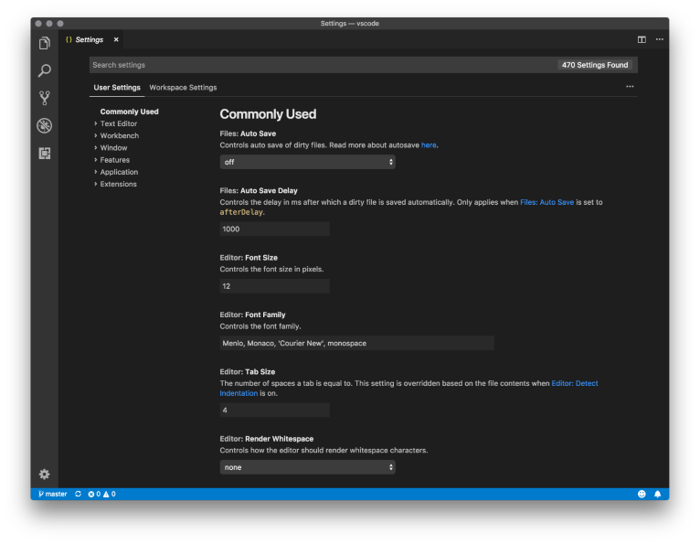

You can still access the JSON settings editor, either by using the command **Open Settings (JSON)** or by changing your default settings editor with the `"workbench.settings.editor"` setting.

One improvement we made this month is to clean up the UI by moving setting value descriptions (`enumDescriptions`) into a custom dropdown control:

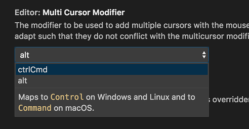

Settings that have been modified are now indicated with a blue line, like modified lines in the editor. The gear icon opens a context menu with an option to reset the setting to its default value.

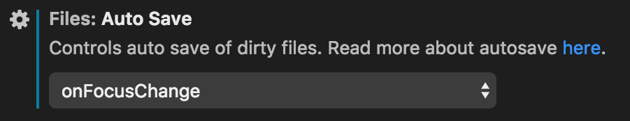

Setting values are now validated, and any validation errors are displayed.

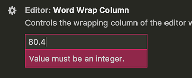

The table of contents now will remain visible during search, and filter to show only categories that have matches. You can click on a category to filter the results to just settings under that category. Set `"workbench.settings.settingsSearchTocBehavior"` to `"hidden"` if you prefer to hide the table of contents during search.

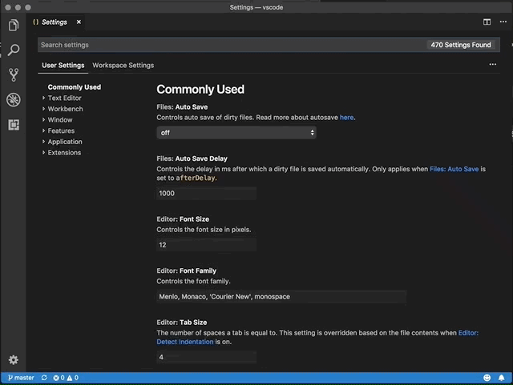

When you search in settings, our Bing-powered search service is still providing results that it thinks are relevant. Now, that service will also show you extensions from the Marketplace that have relevant settings. You will see a button at the bottom of the settings search results, **Show matching extensions**. When clicked, the Extensions view will open with the matching extensions.

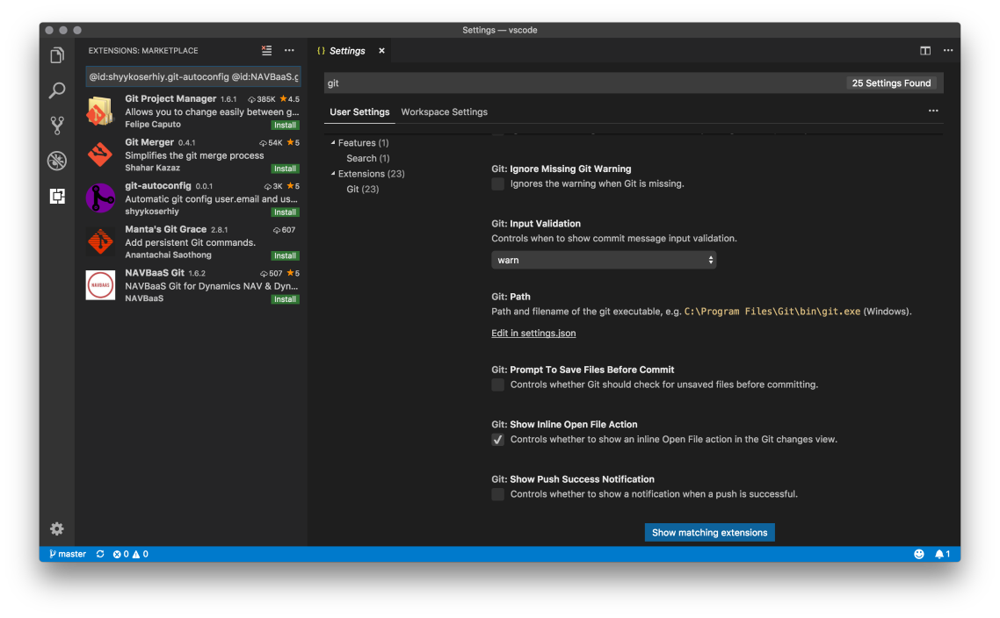

### Custom title bar and menus on Windows and Linux

Also over the past few iterations, we have been working to improve the look and feel as well as usability of the title bar and menus on Windows and Linux. This iteration, we are removing the preview label with an aim to make this the default experience on Windows soon. To enable this feature, you can set the setting `"window.titleBarStyle"` to `"custom"`.

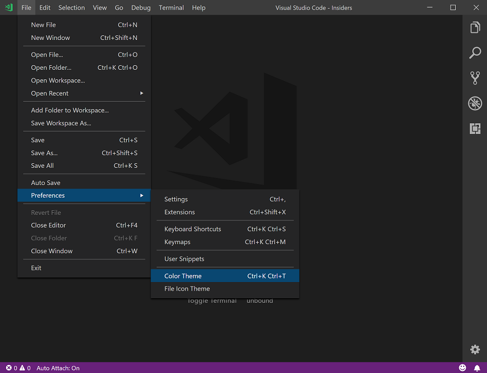

The new experience comes with several advantages over the default:

* Themable title bar, menu bar, and context menus throughout the product. This means your dark theme stays dark!
* Better keyboard navigation in the menu bar. We have made it easier to switch between menus with the keyboard and use menu mnemonics.
* A less intrusive menu bar. The new experience is more compact and less jarring when setting `"window.menuBarVisibility"` to `"toggle"`.
* Better accessibility. Several accessibility issues have been resolved to improve menu usability with a screen reader.

As we want to make this new experience the default on Windows, we encourage you to try it out and send us your feedback so we can provide the best possible experience.

### Breadcrumbs improvements

We have tweaked the new breadcrumbs bar, made various improvements, and fixed bugs:

* Focused document symbols are now highlighted in the editor.
* Breadcrumbs are automatically enabled when the focus command (`kb(breadcrumbs.focus)`) is run.
* Breadcrumbs work a lot better with themes.
* Breadcrumbs now honor the file excludes configuration.

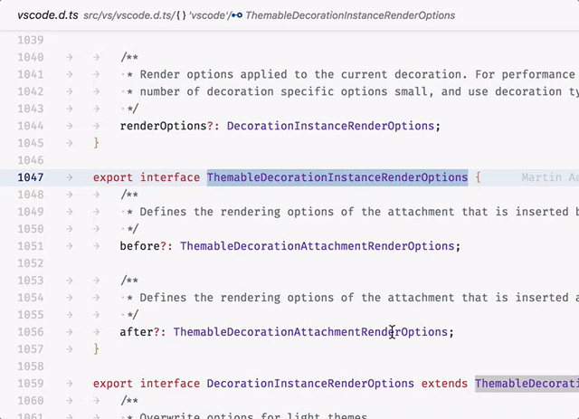

### New Terminal menu

The **Tasks** menu was renamed to **Terminal** and some more entries for the Integrated Terminal were added.

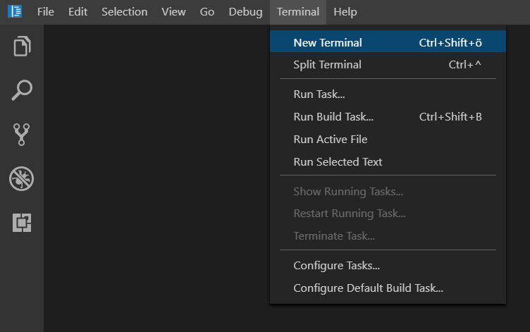

### Platform specific keybindings

It's now possible to enable keyboard shortcuts for specific operating systems using `isLinux`, `isMac` and `isWindows` within a keybinding's `when` clause:

```json
{
  "key": "ctrl+o",
  "command": "workbench.action.files.openFolder",
  "when": "!isMac"
},
{
  "key": "cmd+o",
  "command": "workbench.action.files.openFolder",
  "when": "isMac"
}
```

This makes it much easier to share your `keybindings.json` file across different machines.

### Open window as new native tab

A new macOS-only command, `workbench.action.newWindowTab`, opens a window as new native tab. `newWindowTab` does not have a default keybinding and needs the setting `window.nativeTabs` to be enabled.

### Files no longer close when deleted/renamed externally

We changed the default of the `workbench.editor.closeOnFileDelete` setting from `true` to `false`. This means that a file that has been deleted or renamed outside of VS Code (or by another program like Git or command from the Integrated Terminal) will no longer close a file that is opened as editor tab. Instead, the file will indicate that it has been deleted from disk and you can just save the file to restore it.

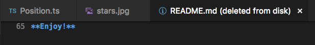

**Note:** Unless the file is dirty, the contents of the file are not preserved between restarts.

### Middle click to open file in a new editor

Now it is possible to use the middle mouse click in the Explorer view to open a file in a new editor and not reuse the previous editor in [preview mode](https://code.visualstudio.com/docs/getstarted/userinterface#_preview-mode).

### Accessibility improvements

We have fixed  quite some accessibility issues - mostly around keyboard navigation, screen reader support, and focus. The full list can be found [here](https://github.com/Microsoft/vscode/issues?q=is%3Aissue+label%3Aaccessibility+milestone%3A%22August+2018%22+is%3Aclosed). This is an ongoing effort which we plan to continue in September.

### Improved Windows background update

We've done some stability work on our custom Windows background updater, in order to address issues resulting in broken installations for some users. This is a continuous work item with more improvements in upcoming releases.

## Editor

### Auto closing & surrounding characters

When typing certain brackets like `{`, `[` or `(`, depending on the programming language, they will get auto-closed by default when they are followed by specific characters that typically cannot start an expression, for example `;:.,=}])>`. This behavior can be customized with the `editor.autoClosingBrackets` setting. Similarly, it is possible to customize the auto closing behavior while typing quotes like `"`, `'` or `` ` `` with `editor.autoClosingQuotes`.

When text is selected and you type one of these characters, the selection will be surrounded by brackets or quotes. It is now possible to adjust this behavior separately via the new `editor.autoSurround` setting.

## Languages

### Path completion for CSS imports

Path completion for CSS, SCSS and Less `@import` is now available. SCSS partial `@import` is handled as well.

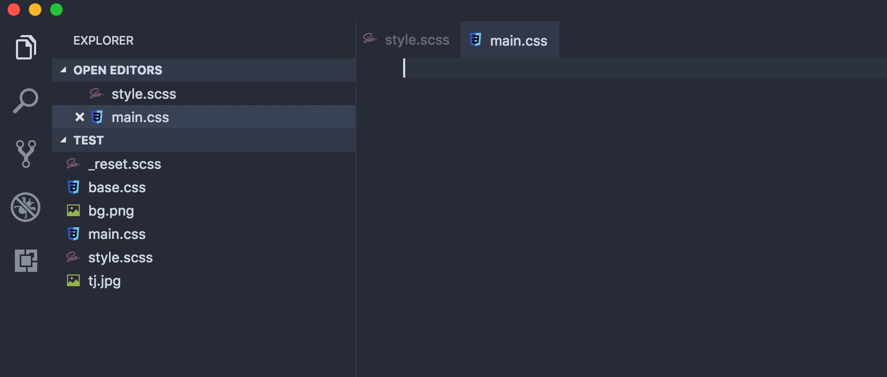

### Jump to definition for CSS links

There is now jump to definition for `@import` and `url()` links in CSS, SCSS and Less.

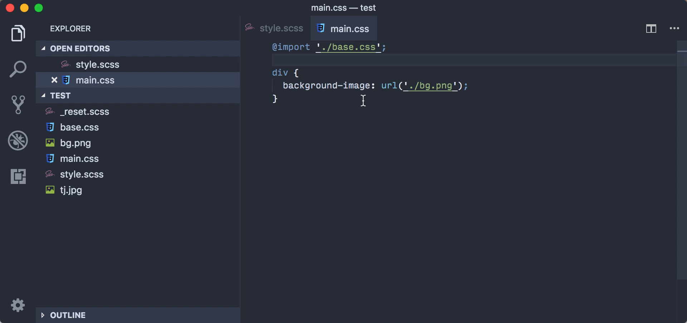

### JSON

The built-in JSON language extension now supports the new [JSON Schema Draft-07](https://json-schema.org/draft-07/json-schema-release-notes.html).

The most interesting addition are the `if`, `then`, `else` keywords to allow conditional schema evaluation.

```json
{
    "type": "integer",
    "minimum": 1,
    "maximum": 1000,
    "if": { "minimum": 100 },
    "then": { "multipleOf": 100 },
    "else": {
        "if": { "minimum": 10 },
        "then": { "multipleOf": 10 }
    }
}
```

The `if` keyword means that, if the result of the value schema passes validation, apply the `then` schema, otherwise apply the `else` schema.

### HTML

The HTML formatter has been updated to version 1.8.1 of [JS Beautifier](http://jsbeautifier.org/).

This adds a new option to the `"html.format.wrapAttributes"` settings:

* `"aligned-multiple"` will wrap attributes when the maximum line length is reached and aligns all wrapped lines with the first attribute.

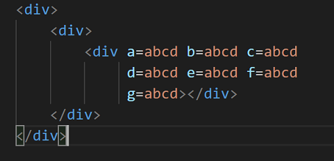

### TypeScript 3.0.3

VS Code now ships with TypeScript 3.0.3. This minor release fixes a number of bugs and improves stability. You can read about the complete set of changes [here](https://github.com/Microsoft/TypeScript/milestone/76?closed=1).

## Debugging

### Loaded Scripts view now reusable

For more than a year, the [Loaded Scripts Explorer](https://code.visualstudio.com/docs/nodejs/nodejs-debugging#_access-loaded-scripts) in the Debug view was contributed by the Node.js debug extension and was not available to other debuggers. In this release, we've added the Loaded Scripts view as a built-in debugger feature. All debug extensions that have the notion of "scripts" will be able to support access to their scripts in a dynamically updated view.

In addition, we've improved some shortcomings of the old Loaded Scripts Explorer:

* Chains of single-child folders are now collapsed into a single node. This makes it much easier to drill down into deep but sparse folder hierarchies.
* We've started to address accessibility issues.

### Middle click to remove breakpoints

Now it is possible to use the middle mouse click in the breakpoints view to easily remove a breakpoint.

### Change the default for "openDebug" to open on every session start

For new users, it can sometimes be confusing when you start a debug session and the debug view does not open automatically every time. If the user is not yet familiar with the UI, they don't know what keywords to look for in order to open the UI. To avoid confusion, we changed the default of `debug.openDebug` to be `openOnSessionStart` so that the debug view opens on every session start, not only on the first (which was the previous default behavior).

## Extension Authoring

### Extension logging

The `ExtensionContext` that comes as an argument of the `activate` function has a new property [`logPath`](https://github.com/Microsoft/vscode/blob/526f4c149211773357b2ce9f62c2a9973612a16a/src/vs/vscode.d.ts#L4541-L4546). This is the absolute file path of a directory where extensions can store log files. The path is unique for an extension and not reused by other extensions.

### Language Server Protocol

A new version of the Language Server Protocol is available and includes the corresponding node modules for use with VS Code.

The new version has support for:

* Code Action kind announcements from the server to allow clients to populate corresponding menu entries.
* An implementation for a [`textDocument/prepareRename`](https://microsoft.github.io/language-server-protocol/specification#textDocument_prepareRename).
* Support for file operations (create, rename and delete) in [Workspace Edits](https://microsoft.github.io/language-server-protocol/specification#workspace_applyEdit).

### `vscode-languageclient`: JSON log format and log streaming

Previously, when building Language Server extensions using `vscode-languageclient`, you could specify `[langId].trace.server` to send [LSP logs](https://code.visualstudio.com/docs/extensions/example-language-server#_logging-support-for-language-server) into a VS Code output channel.

`[langId].trace.server` can now output logging information in a machine-readable [JSON format](https://github.com/Microsoft/language-server-protocol-inspector#log-format):

```json
"languageServerExample.trace.server": {
  "format": "json", // or "text"
  "verbosity": "verbose" // or "off" | "messages"
}
```

This opens up interesting use cases, such as streaming LSP logs into an [LSP Inspector](https://marketplace.visualstudio.com/items?itemName=octref.lsp-inspector-webview) to visualize the behavior of a Language Server:


You can learn more about it in [Microsoft/language-server-protocol-inspector](https://github.com/Microsoft/language-server-protocol-inspector) and [lsp-log-streaming-sample](https://github.com/Microsoft/vscode-extension-samples/tree/master/lsp-log-streaming-sample).

### Debug extensions: Built-in Loaded Scripts view

The Loaded Scripts Explorer is now a built-in component of the VS Code debugger. In order to use it, a debugger extension needs to change its debug adapter in the following way:

* Add a `supportsLoadedSourcesRequest` capability with a value `true` to the `Capabilities` returned from the `initialize` request.
* Implement the `loadedSources` request by returning the current set of loaded sources.
* Send out `loadedSource` events for newly loaded or unloaded sources.

### New theme colors

There is a new theme color for breadcrumbs:

* `breadcrumb.background`: Background color of breadcrumb items.

There are new theme colors for the settings editor:

* `settings.dropdownListBorder`: Border color of the new dropdown control.
* `settings.modifiedItemIndicator`: The color of the line that indicates a modified setting.

### Git extension API

The Git extension has started to [expose a more defined API](https://github.com/Microsoft/vscode/blob/release/1.27/extensions/git/src/api/git.d.ts). This API can be used from any other extension to interact the open Git repositories in a user's workspace. Since it is still in its preliminary stages, we will continuously improve the API in the upcoming releases.

## Proposed Extension APIs

Every milestone comes with new proposed APIs and extension authors can try them out. As always we are keen on your feedback. This is what you have to do to try out a proposed API:

* You must use Insiders because proposed APIs change frequently.
* You must have this line in the `package.json` file of your extension: `"enableProposedApi": true`.
* Copy the latest version of the [`vscode.proposed.d.ts`](https://github.com/Microsoft/vscode/blob/master/src/vs/vscode.proposed.d.ts) file into your project.

Note that you cannot publish an extension that uses a proposed API. We may likely make breaking changes in the next release and we never want to break existing extensions.

### SCM: Selected source controls

In order for extensions to know which source control instances have been selected by the user for visibility in the UI, `SourceControl` instances now have a `selected` property as well as a `onDidChangeSelection` event which represent that state.

```ts
export interface SourceControl {

  /**
    * Whether the source control is selected.
    */
  readonly selected: boolean;

  /**
    * An event signaling when the selection state changes.
    */
  readonly onDidChangeSelection: Event<boolean>;
}
```

### Comment providers

We are introducing the concept of comments this iteration, which allow extensions to create and manage conversations within editors and a new **Comments** panel. This enables extensions to support code review scenarios.

Comments are organized into threads and associated with a particular document.

```ts
export enum CommentThreadCollapsibleState {
  Collapsed = 0,
  Expanded = 1
}

interface CommentThread {
  threadId: string;
  resource: Uri;
  range: Range;
  comments: Comment[];
  collapsibleState?: CommentThreadCollapsibleState;
}

interface Comment {
  commentId: string;
  body: MarkdownString;
  userName: string;
  gravatar: string;
  command?: Command;
}
```

To display comments, an extension must register a `DocumentCommentProvider` or `WorkspaceCommentProvider`.

```ts
export interface CommentThreadChangedEvent {
  readonly added: CommentThread[];
  readonly removed: CommentThread[];
  readonly changed: CommentThread[];
}

interface CommentInfo {
  threads: CommentThread[];
  commentingRanges?: Range[];
}

interface DocumentCommentProvider {
  provideDocumentComments(document: TextDocument, token: CancellationToken): Promise<CommentInfo>;
  createNewCommentThread(document: TextDocument, range: Range, text: string, token: CancellationToken): Promise<CommentThread>;
  replyToCommentThread(document: TextDocument, range: Range, commentThread: CommentThread, text: string, token: CancellationToken): Promise<CommentThread>;
  onDidChangeCommentThreads: Event<CommentThreadChangedEvent>;
}

interface WorkspaceCommentProvider {
  provideWorkspaceComments(token: CancellationToken): Promise<CommentThread[]>;
  onDidChangeCommentThreads: Event<CommentThreadChangedEvent>;
}
```

Using the `DocumentCommentProvider`, comments can be returned for open documents. When providing comments, the extension specifies both the current threads on the document, and what range of the document supports adding new comments. Comments can be added or replied to from within the document.


When a `WorkspaceCommentProvider` is first registered, the `CommentsPanel` becomes visible and shows all comments provided to it. Comments are grouped by comment thread and resource. When a comment is selected in the panel, the comments `command` is run, so the extension determines the behavior.

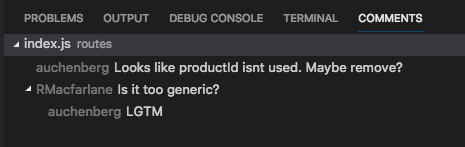

## Preview Features

Preview features are not ready for release but are functional enough to use. We welcome your early feedback while they are under development.

### Electron 3.0 exploration

During this milestone, we explored bundling Electron 3.0.0 into VS Code. This is a major Electron release and comes with Chrome 66 and Node.js 10.x (a major leap forward compared to our current version that has Chrome 61 and Node.js 8.x). We plan to push out the update to our Insiders users in the near future to gather additional feedback. If you are interested in helping out, make sure to install VS Code [Insiders](https://code.visualstudio.com/insiders).

## Engineering

### Extensions and webpack

We are now using [webpack](https://webpack.js.org) to bundle extensions. It unlocks two achievements: (1) reduce the startup time for extensions because there are fewer files to load and less source to parse and (2) reduce the install time because fewer files need to be extracted and written to disk. So far, we've reduced the bundle size by ~4000 files!

### Performance canary

We have added a test harness to ensure that our startup performance isn't regressing. There is a new script that can be deployed to dedicated machines to test the performance of Insider builds. The script simply installs the latest build and makes sure that it starts within a time limit. For now, we started with Windows because performance is often affected by updates to anti-virus software but the plan is to test on all platforms we support.

### IPC stack improvements

We've improved our homegrown IPC stack to [support byte buffer messages](https://github.com/Microsoft/vscode/pull/56820) between processes. This enables certain scenarios such as sending binary data between our different processes without overhead as well as allowing us to optimize IPC for performance.

## Notable Fixes

* [6363](https://github.com/Microsoft/vscode/issues/6363): Alternate data streams are removed when saving
* [25919](https://github.com/Microsoft/vscode/issues/25919): New command to force open a new window as native tab
* [49021](https://github.com/Microsoft/vscode/issues/49021): Do not reset WSL permissions metadata on save
* [49403](https://github.com/Microsoft/vscode/issues/49403): Auto attach causing issues when debugging in integrated terminal
* [55025](https://github.com/Microsoft/vscode/issues/55025): Allow to continue debug when extension host restarts
* [56084](https://github.com/Microsoft/vscode/issues/56084): Open Editors: revisit order of groups to be based on visual order
* [56691](https://github.com/Microsoft/vscode/issues/56691): Error launching vscode when a # exists in the path
* [57018](https://github.com/Microsoft/vscode/issues/57018): Stopping/Restarting debugger fails to stop babel-node

## Thank You

Last but certainly not least, a big *__Thank You!__* to the following folks that helped to make VS Code even better:

Contributions to `vscode`:

* [123 (@16m)](https://github.com/16m): [Fix a typo] s/clientWidth/clientHeight/ [PR #56544](https://github.com/Microsoft/vscode/pull/56544)
* [Nil (@cdnil)](https://github.com/cdnil):
  * add 'search.collapseAllResults' setting [PR #56438](https://github.com/Microsoft/vscode/pull/56438)
  * update smoke ts version [PR #56080](https://github.com/Microsoft/vscode/pull/56080)
* [Daniel McNab (@DJMcNab)](https://github.com/DJMcNab): add rust region comments (#55648) [PR #57069](https://github.com/Microsoft/vscode/pull/57069)
* [Alexandr Fadeev (@fadeevab)](https://github.com/fadeevab): Tests to check improvements: ${}, $$, and $(shell ()). [PR #55826](https://github.com/Microsoft/vscode/pull/55826)
* [Zach Bloomquist (@flotwig)](https://github.com/flotwig): Default 'Quick Switch Window' selection to be next window [PR #55535](https://github.com/Microsoft/vscode/pull/55535)
* [Olga Lesnikova (@Geloosa)](https://github.com/Geloosa): shorthand types for Monarch language action [PR #57439](https://github.com/Microsoft/vscode/pull/57439)
* [Gopal Goel (@gopalgoel19)](https://github.com/gopalgoel19): Append file extension to "Don't Show Again" menu label [PR #55984](https://github.com/Microsoft/vscode/pull/55984)
* [Hao Hu (@hhu94)](https://github.com/hhu94): Add openEditorAtIndex command to pass in the editor index [PR #56441](https://github.com/Microsoft/vscode/pull/56441)
* [Itamar (@itamark)](https://github.com/itamark): Hide the feedback form after clicking Submit a bug [PR #55938](https://github.com/Microsoft/vscode/pull/55938)
* [Jatin Sandilya (@jats22)](https://github.com/jats22): Show error message when extension gallery service is not accessible [PR #56767](https://github.com/Microsoft/vscode/pull/56767)
* [Jean Pierre (@jeanp413)](https://github.com/jeanp413): Fix for #47852 [PR #56775](https://github.com/Microsoft/vscode/pull/56775)
* [Krzysztof Cieślak (@Krzysztof-Cieslak)](https://github.com/Krzysztof-Cieslak): Prefix detection starts from start of the file name [PR #55961](https://github.com/Microsoft/vscode/pull/55961)
* [Manoel (@ManoelLobo)](https://github.com/ManoelLobo): Add .eslintrc extension [PR #57014](https://github.com/Microsoft/vscode/pull/57014)
* [Mathieu Déziel (@mathdeziel)](https://github.com/mathdeziel): Fixed emmet validation when open angle bracket is followed by space [PR #55762](https://github.com/Microsoft/vscode/pull/55762)
* [Matt Ferderer (@mattferderer)](https://github.com/mattferderer): Update Markdown link snippets to use https [PR #56851](https://github.com/Microsoft/vscode/pull/56851)
* [Dmitry Ignatovich (@mechatroner)](https://github.com/mechatroner): Add API function that changes document language [PR #55107](https://github.com/Microsoft/vscode/pull/55107)
* [Jesse Mazzella (@ozyx)](https://github.com/ozyx): Add option to enable cycling of parameter hints [PR #55354](https://github.com/Microsoft/vscode/pull/55354)
* [Karthikayan (@ParkourKarthik)](https://github.com/ParkourKarthik): Notify number of outdated extensions on Check for Extension updates action [PR #56053](https://github.com/Microsoft/vscode/pull/56053)
* [@ris58h](https://github.com/ris58h):
  * Remove out of date params from doc comments [PR #57043](https://github.com/Microsoft/vscode/pull/57043)
  * Middle Click to remove breakpoint [PR #56035](https://github.com/Microsoft/vscode/pull/56035)
* [Nikolai Vavilov (@seishun)](https://github.com/seishun): Use 'r+' with truncation when saving existing files on Windows [PR #42899](https://github.com/Microsoft/vscode/pull/42899)

Contributions to `vscode-vsce`:

* [Amir Ali Omidi (@aaomidi)](https://github.com/aaomidi): Add useYarn to ICreateVSIXOptions, IPublishOptions, and IPublishVSIXOptions [PR #279](https://github.com/Microsoft/vscode-vsce/pull/279)
* [Amadeusz Annissimo (@amadeann)](https://github.com/amadeann): Changed --out flag description in package command [PR #280](https://github.com/Microsoft/vscode-vsce/pull/280)
* [Sriram Thaiyar (@sri)](https://github.com/sri): Show URL of published extension when it is successful [PR #281](https://github.com/Microsoft/vscode-vsce/pull/281)

Contributions to `vscode-eslint`:

* [Jan Pilzer (@Hirse)](https://github.com/Hirse):
  * eslintignore comment syntax highlighting [PR #473](https://github.com/Microsoft/vscode-eslint/pull/473)
  * Fix README indent and spelling [PR #519](https://github.com/Microsoft/vscode-eslint/pull/519)
* [Dave Townsend (@Mossop)](https://github.com/Mossop): Allow setting the node runtime for the language server [PR #516](https://github.com/Microsoft/vscode-eslint/pull/516)

Contributions to `language-server-protocol`:

* [Jens Fischer (@Gama11)](https://github.com/Gama11): Add CodeActionOptions with providedCodeActionKinds [PR #534](https://github.com/Microsoft/language-server-protocol/pull/534)
* [Remy Suen (@rcjsuen)](https://github.com/rcjsuen):
  * Fix formatting for folding API  [PR #542](https://github.com/Microsoft/language-server-protocol/pull/542)
  * Add textDocument/prepareRename [PR #551](https://github.com/Microsoft/language-server-protocol/pull/551)
  * Add version information to the specification [PR #553](https://github.com/Microsoft/language-server-protocol/pull/553)
* [@ehuss](https://github.com/ehuss): Fix typo in Color Presentation Request. [PR #544](https://github.com/Microsoft/language-server-protocol/pull/544)
* [Miro Spönemann (@spoenemann)](https://github.com/spoenemann): [PR #550](https://github.com/Microsoft/language-server-protocol/pull/550)

Contributions to `vscode-languageserver-node`:

* [Jens Fischer (@Gama11)](https://github.com/Gama11): Add CodeActionOptions with providedCodeActionKinds [PR #385](https://github.com/Microsoft/vscode-languageserver-node/pull/385)
* [Anton Kosyakov (@akosyakov)](https://github.com/akosyakov): Make sure document listeners are installed on restart [PR #396](https://github.com/Microsoft/vscode-languageserver-node/pull/396)

Contributions to `debug-adapter-protocol`:

* [Josh Tynjala (@joshtynjala)](https://github.com/joshtynjala): Add SWF debug adapter [PR #1](https://github.com/Microsoft/debug-adapter-protocol/pull/1)
* [Glenn Sarti (@glennsarti)](https://github.com/glennsarti): (maint) Add Puppet to implementors list [PR #2](https://github.com/Microsoft/debug-adapter-protocol/pull/2)
* [Thomas Müller (@tmueller)](https://github.com/tmueller): Update adapters.md [PR #4](https://github.com/Microsoft/debug-adapter-protocol/pull/4)
* [F.W. (@fwcd)](https://github.com/fwcd): Added Eclipse LSP4J to the list of known SDKs [PR #5](https://github.com/Microsoft/debug-adapter-protocol/pull/5)

Contributions to `vscode-css-languageservice`:

* [Connor Shea (@connorshea)](https://github.com/connorshea): Add CSS Lint Rule name to lint markers. [PR #116](https://github.com/Microsoft/vscode-css-languageservice/pull/116)

Contributions to `vscode-html-languageservice`:

* [Liam Newman (@bitwiseman)](https://github.com/bitwiseman):
  * js-beautify 1.8.1 [PR #37](https://github.com/Microsoft/vscode-html-languageservice/pull/37)
  * Option to use jsb release or next [PR #35](https://github.com/Microsoft/vscode-html-languageservice/pull/35)
  * Js beautify rc11 [PR #34](https://github.com/Microsoft/vscode-html-languageservice/pull/34)
  * Update js-beautify to 1.8.0-rc4 [PR #31](https://github.com/Microsoft/vscode-html-languageservice/pull/31)

Contributions to `vscode-json-languageservice`:

* [Viktor Havrylin (@Fer0x)](https://github.com/Fer0x): [draft-07] Implement if/then/else [PR #24](https://github.com/Microsoft/vscode-json-languageservice/pull/24)

Contributions to `node-jsonc-parser`:

* [Chris Wendt (@chrismwendt)](https://github.com/chrismwendt): Do not mutate the given path [PR #12](https://github.com/Microsoft/node-jsonc-parser/pull/12)

Contributions to `vscode-generator-code`:

* [@MrLuje](https://github.com/MrLuje): Allow to set publisher as generator option [PR #125](https://github.com/Microsoft/vscode-generator-code/pull/125)

Contributions to `localization`:

There are almost 1200 members in the Transifex [VS Code project](https://aka.ms/vscodeloc) team with about 100 active contributors every month. We appreciate your contributions, either by providing new translations, voting on translations, or suggesting process improvements.

Here is a snapshot of contributors for this release. For details about the project including the contributor name list, visit the project site at [https://aka.ms/vscodeloc](https://aka.ms/vscodeloc).

* **Bulgarian:** Любомир Василев.
* **Croatian:** Nikša Mihaica.
* **Danish:** Christoffer Bech.
* **English (United Kingdom):** Matthew John Cheetham, Swotboy2000.
* **Finnish:** Petri Niinimäki, Feetu Nyrhinen, Jussi Palo.
* **French:** Antoine Griffard, Guillaume Bauer, Smrman.
* **German:** Carsten Siemens, Carsten Kneip, Jonas Droste, Markus Hatvan, Christian Studer, Peter Schneider, Jonas Keller, thefreshman89.
* **Hungarian:** Tar Dániel, Bence László.
* **Chinese Simplified:** Joel Yang, 子实 王, Wang Dongcheng, pluwen, DongWei, Henry Chu, aimin guo, Chris Pan 潘冬冬, 子昂 马.
* **Chinese Traditional:** Duran Hsieh, Winnie Lin, Poy Chang, Alan Tsai.
* **Indonesian:** Wildan Mubarok, G-RiNe Project.
* **Italian:** Luca Bruni, Alessandro Alpi, Andrea Dottor, Emanuele Curati, Riccardo Cappello, Gianluca Acerbis, Emilie Rollandin, Marco Dal Pino, Luigi Bruno, Lorthirk, Aldo Donetti.
* **Japanese:** Shunya Tajima, Satoshi Kajiura, Yuichi Nukiyama, Hiroyuki Mori, yoshioms.
* **Korean:** Kyunghee Ko, PaulNara, smallsnail, Kwangjin Hwang.
* **Lithuanian:** Tomas Cimermonas.
* **Polish:** Artur, hawkeye116477, Patryk Brejdak, Mateusz Gazdziak, Robert Skórski, Sebastian Baran.
* **Portuguese (Brazil):** Roberto Fonseca, Bruno Sonnino, Marcelo Fernandes, Lucas Miranda, João Mesquita, Danilo Dantas, Rodrigo Crespi, Arthur Bruel, Thiago Moreira de Souza Arrais, Otacilio Saraiva Maia Neto, Loiane Groner, Fabio Correia.
* **Portuguese (Portugal):** Richard Nunes, Daniel Correia, Tiago Costa.
* **Romanian:** Bogdan Mateescu, Szauka.
* **Russian:** Roman Slauta, Ivan Kuzmenko.
* **Spanish:** Alejandro Medina, José M. Aguilar, Roberto Fonseca, Javier Moreno, Andy Gonzalez, Alberto Poblacion, Nancy Todd, Antonio Sanmartín.
* **Telugu:** Hari Jujjavarapu, Sridhar L.

<!-- In-product release notes styles.  Do not modify without also modifying regex in gulpfile.common.js -->
<a id="scroll-to-top" role="button" aria-label="scroll to top" href="#"><span class="icon"></span></a>
<link rel="stylesheet" type="text/css" href="css/inproduct_releasenotes.css"/>
