# September 2018 (version 1.28)

**Update 1.28.2**: The update addresses these [issues](https://github.com/Microsoft/vscode/milestone/80?closed=1).

**Update 1.28.1**: The update addresses these [issues](https://github.com/Microsoft/vscode/milestone/79?closed=1).

<!-- DOWNLOAD_LINKS_PLACEHOLDER -->

---

Welcome to the September 2018 release of Visual Studio Code. As announced in the [September iteration plan](https://github.com/Microsoft/vscode/issues/58224), we focused on housekeeping our GitHub issues and pull requests. Across all of our VS Code repositories, we closed (either triaged or fixed) **3918** issues. While we closed issues, you created **2187** new issues. This resulted in a net reduction of **1731** issues. The main [vscode repository](https://github.com/Microsoft/vscode/issues) now has 2472 open feature requests and 625 open bugs. In addition, we closed **212** pull requests.

It was great to see how much you care about our progress. [Benjamin Lannon](https://github.com/lannonbr) published a personal site with a [live tracker](https://vscode-issue-tracker.netlify.com/) of the issue numbers in our [main repository](https://github.com/Microsoft/vscode/issues). It nicely shows the progress we made since September 11:

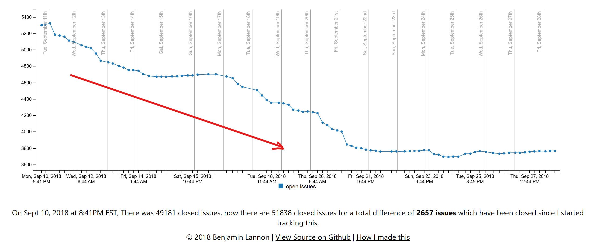

It also shows what happens as soon as we stop paying attention to reducing issues. Below are the last three days of last week while we were getting ready for this release. As you can see, there will be more issue grooming iterations in our future.

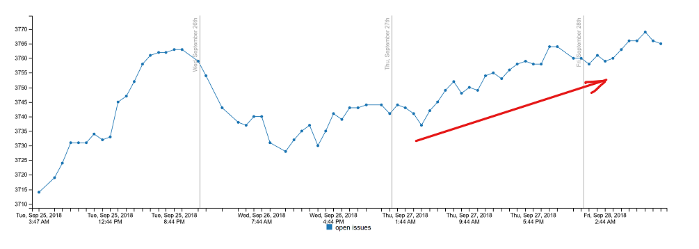

During this housekeeping milestone, we addressed several feature requests and community [pull requests](#thank-you) also resulted in new features. Here are some of the release highlights:

* **[Custom file icons](#file-icons-per-file-type)** - VS Code file icons reflect file type in your OS explorer.
* **[Project level snippets](#project-level-snippets)** - Tune your snippet collection per workspace.
* **[Editor Tab completion](#tab-completion)** - Use Tab to easily cycle through IntelliSense suggestions.
* **[Jump to last edit](#navigate-to-last-edit-location)** - New command to go to the location of your last edit.
* **[Save without formatting](#save-without-formatters)** - Save a file without changing the existing formatting.
* **[Git improvements](#git-integration)** - Better delete conflict handling, new rebase on sync option.
* **[Rename via import path](#rename-import-path)** - Rename a JS/TS file through its import path.
* **[Convert to async refactoring](#convert-to-async-function)** - Quickly update a function to use async and await.
* **[Better Markdown folding](#better-markdown-folding)** - Collapse code blocks, multiline lists, and embedded HTML.

>If you'd like to read these release notes online, go to [Updates](https://code.visualstudio.com/updates) on [code.visualstudio.com](https://code.visualstudio.com).<br>
>You can also check out this 1.28 release [highlights video](https://youtu.be/QFC4HxR3wI8) from Cloud Developer Advocate [Brian Clark](https://twitter.com/_clarkio).

**Insiders:** Want to see new features as soon as possible? You can download the nightly [Insiders](https://code.visualstudio.com/insiders) build and try the latest updates as soon as they are available.

## Workbench

### Custom title and menu bar on Windows by default

The custom title bar and themable menus described in previous [release notes](https://code.visualstudio.com/updates/v1_27#_custom-title-bar-and-menus-on-windows-and-linux) are now enabled by default on Windows. The setting `"window.titleBarStyle"` was defaulted to `"custom"` for the entire last month on Windows in Insiders, and we are now ready to make this the default experience.

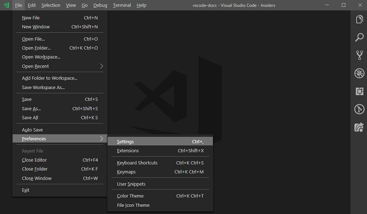

### File icons per file type

On macOS and Windows, VS Code registers as the default editor for well-known file types. VS Code now ships custom icons for the some of the common VS Code file types. These icons will show up in the OS explorer when the size of the icons is configured to be medium to large. For small icon sizes, we decided to preserve the VS Code logo as the icon.

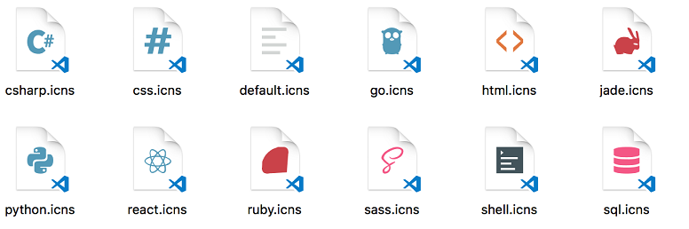

### Project level snippets

Snippets can now be scoped to a project and shared with your team. Simply use the **Preferences: Configure User Snippets** command or create `*.code-snippets` file in the `.vscode` folder. Project snippets work just like other snippets, they show up in IntelliSense and in the **Insert Snippet** action where they now have their own category.

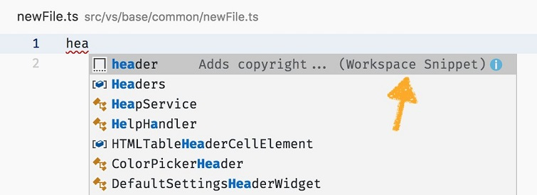

Snippets also now support multiple prefixes. If you cannot decide if your copyright header snippet should be prefixed as `header`, `stub`, or `copyright`, you can have them all. Simply use a string array as the `prefix` property.

```json
{
  "prefix": [ "header", "stub", "copyright"],
  "body": "Copyright. Foo Corp 2028",
  "description": "Adds copyright...",
  "scope": "javascript,typescript"
}
```

### Symbolic links support when opening folder

For a long time, VS Code has been resolving the symbolic link to a folder when opening. This meant that even though the symbolic link was there for a reason, VS Code was ignoring it and always opened the resolved link path. We have decided to change this behavior and preserve the symbolic link.

**Note:** Certain features will work with reduced functionality when opening a folder as a symbolic link (for example [debugging](https://github.com/Microsoft/vscode/issues/57954) and [Git integration](https://github.com/Microsoft/vscode/issues/5970)).

### Record and search keyboard shortcuts

In the Keyboard Shortcuts editor (`kb(workbench.action.openGlobalKeybindings)`), you can now search for keybindings just by typing keystrokes instead of typing out the key name (example 'shift'). Turn on the **Recording Keys** mode and type the keystrokes you want to search for.

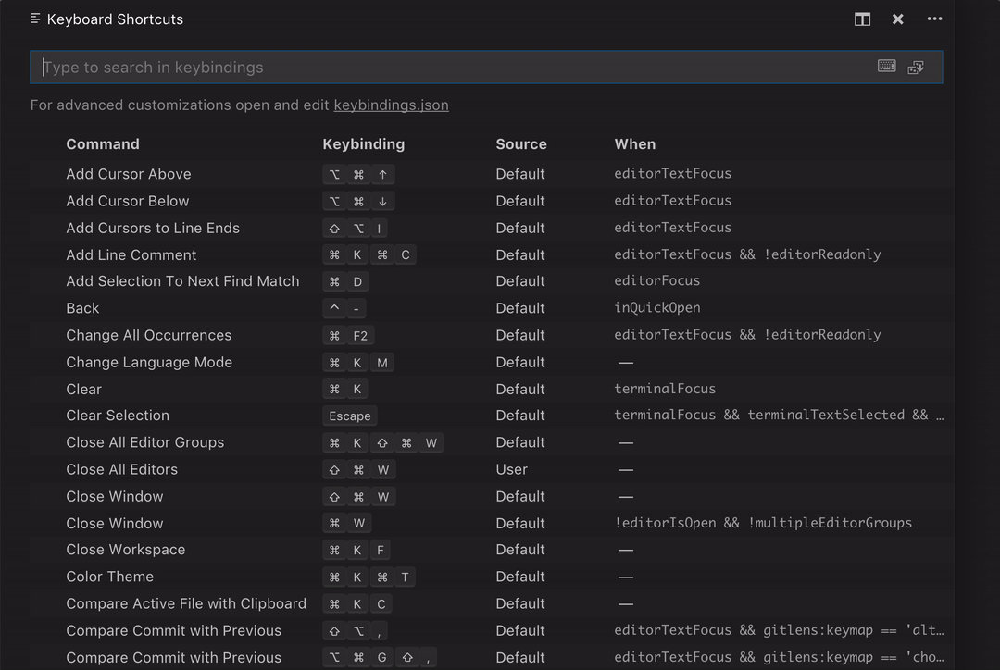

You can also enter into the **Recording Keys** mode using `kb(keybindings.editor.recordSearchKeys)`. Press the `Esc` key to exit from **Recording Keys** mode.

### Toggle panel changes

We decided to revisit the behavior of our commands for toggling panels (Terminal, Output, Problems, Debug Console). You can follow issue [19400](https://github.com/Microsoft/vscode/issues/19400) for the background on the change.

The **old** behavior was:

* Panel shows if not visible.
* Panel hides if visible.

The **new** behavior is:

* Panel shows if not visible.
* Panel hides if having keyboard focus.
* Panel gets focused when visible but not focused.

To get back the previous behavior, you can configure a keybinding to close the panel when the related panel is active.

For example, for Output panel:

```json
{
    "key": "cmd+shift+u",
    "command": "workbench.action.closePanel",
    "when": "activePanel==workbench.panel.output"
}
```

The list of panel identifiers is:

* `workbench.panel.terminal`
* `workbench.panel.markers`
* `workbench.panel.output`
* `workbench.panel.repl`

### Copy Relative Path

The command to copy a file path as relative path is now more prominently exposed in the context menus of the File Explorer as well as editor tabs.

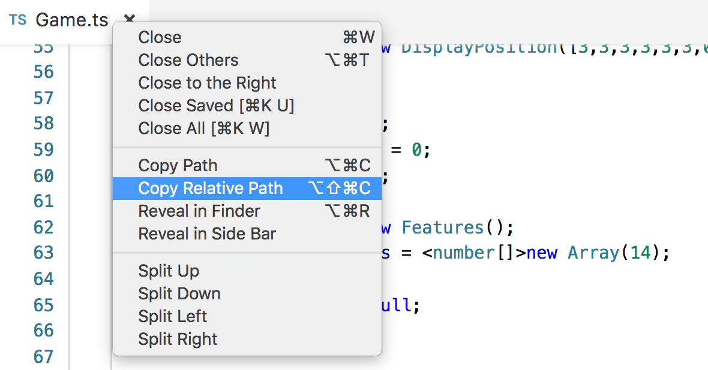

### Exclude recently opened files from Quick Open

A new setting `search.quickOpen.includeHistory` allows you to control if files that were recently opened should be part of the Quick Open file picker. By default, files that were recently opened will appear to the top of the search and other files from the workspace below. If you would prefer to not see recently opened files on top, you can change this setting to `false`.

### Disable trash when deleting files

If you are seeing issues when deleting files from the Explorer when they move to the OS trash, you can now set `files.enableTrash` to `false` to never use the OS trash when deleting. Doing so will change the **Delete** action and keybinding on the File Explorer to bypass the OS trash and delete permanently. You will still see a prompt before the delete happens.

### Prompt to open workspace file if detected

When opening a folder that contains one or more `.code-workspace` files in the root, VS Code now shows a notification to ask if you'd like to open the workspace file instead. Opening a workspace file will usually provide a better experience than just opening the folder. You can learn more about multi-root workspaces in our [documentation](https://code.visualstudio.com/docs/editor/multi-root-workspaces).


### Do not restore view state when reopening a file

VS Code has always remembered the view state (cursor location, folded sections, etc.) of a file even after the file was closed. There is now a new setting `workbench.editor.restoreViewState` to drop this view state when a file is closed. This allows you to always start at the top of the file after reopening it.

### Close a file across all editor groups

A new command **Close Editor in all Groups** (`workbench.action.closeEditorInAllGroups`) allows you to close the currently active file across all editor groups.

### Problems panel

**Show error codes**

The Problems panel now shows the error code of a problem if it has any.

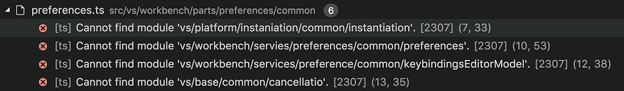

**Improved keyboard navigation**

The Problems panel has become more keyboard friendly:

* You can start typing to filter when the panel has focus.
* You can use `kb(problems.action.focusFilter)` to give focus to the filter box and `kb(problems.action.focusProblemsFromFilter)` to give focus to the problem list from the filter box.

### Output channel for telemetry events

In the July release, we added a feature where all telemetry events sent by VS Code also get logged to a local file when you set the log level to **Trace** using the **Developer: Set Log Level...** command. You can now view the contents of this file in the **Log (Telemetry)** channel of the Output panel. As before, you can view the file directly, using the **Developer: Open Log File...** command.

### Give focus to a custom view

You can now use a command to give focus to a custom view. There is a separate command provided for each custom view.

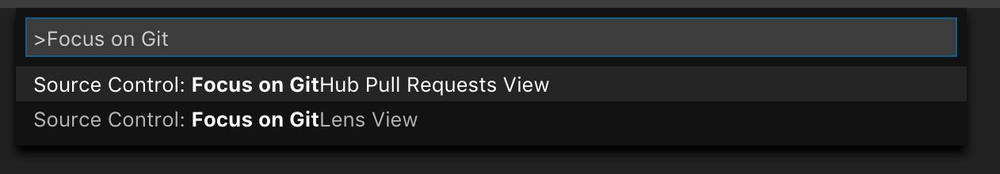

### Linux URL handling

Once a feature limited to Windows and macOS, now you can also open VS Code URLs on Linux! These URLs are useful for many different features such as automatically installing extensions, for example `vscode-insiders:extension/vscodevim.vim`.

## Editor

### Tab completion

Editor Tab completion can now complete all kind of suggestions. After setting `"editor.tabCompletion": "on"`, pressing `kbstyle(Tab)` will complete any prefix, not just snippets. Also, pressing `kb(insertNextSuggestion)` will insert the next suggestion and `kb(insertPrevSuggestion)` will insert the previous suggestion.

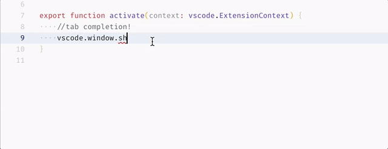

### Navigate to last edit location

A new command **Go to Last Edit Location** (`workbench.action.navigateToLastEditLocation`) was added to quickly navigate to the last location in a file that was edited. The default keybinding is `kb(workbench.action.navigateToLastEditLocation)`.

### Save without formatters

The new command **Save without Formatting** (`workbench.action.files.saveWithoutFormatting`) can be used to save a file without triggering any of the save participants (for example, formatters, remove trailing whitespace, final newline). The default keybinding is `kb(workbench.action.files.saveWithoutFormatting)`. This is useful when editing files outside your normal projects, which may have different formatting conventions.

### IntelliSense locality bonus

Suggestions can now be sorted based on their distance to the cursor. Set `"editor.suggest.localityBonus": true` and you'll see, for example, function parameters showing up at the top of the IntelliSense list.

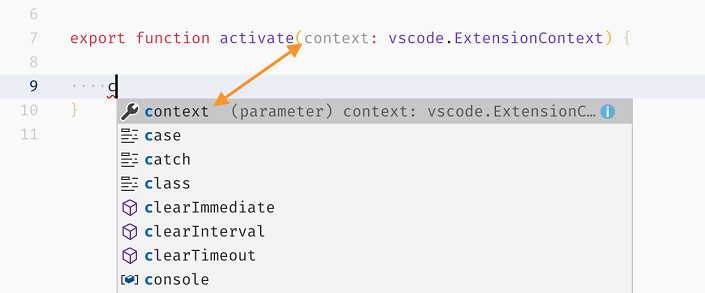

### Emmet

We have made a few improvements to the Emmet features this iteration:

* If you have enabled Emmet in JavaScript files, then you can now have Emmet abbreviation expansion inside the `<script>` tags in an HTML file.
* The **Emmet: Wrap with Abbreviation** feature is no longer restricted to files with the `.html` extension.
* The **Emmet: Balance (inward)** feature now works on current node even if there is no selection.
* The [bug](https://github.com/Microsoft/vscode/issues/56082) of wrongfully considering CSS selectors with a `#` in SCSS files as valid abbreviations is now fixed.

## Source Control

### Change SCM commit keybinding

You can now change the default keybinding to accept a commit message in the SCM view, using the `scm.acceptInput` command.

### SCM status bar tracks active file

The SCM Status Bar contribution in the bottom left now tracks whichever repository the currently active file belongs to. This reduces confusion when editing files across your multi-folder workspace.

## Git integration

### Better handling of deletion conflicts

Deletion conflicts have always been detected by VS Code. Now there is a better UI flow for handling them, you will see the undeleted version when opening the change and you get to decide what happens to the file when staging it: keep it or delete it.

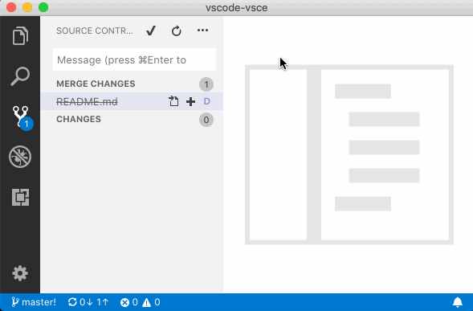

### Configure long commit message warning threshold

The `git.inputValidationLength` setting now lets you configure how long a commit message must be before a warning appears as you edit it.

### Add folder to workspace after 'git init'

After initializing a Git repository, VS Code will now ask you whether you'd like to add it to the current workspace.

### Configure branch validation rules

You can now control how branch name validation works with the powerful `git.branchValidationRegex` and `git.branchWhitespaceChar` settings. See issue [50241](https://github.com/Microsoft/vscode/issues/50241) for more details.

### Always rebase when running Sync

The `git.rebaseWhenSync` setting will let you configure the **Sync** command to always use rebase instead of merge when running.

### Disable progress reporting

With the `git.showProgress` setting, you can now disable showing progress during Git operations.

### Push --force

There are times in your development day-to-day in which you just feel like taking a risk. Running `git push --force` is a great example! VS Code now lets you forcefully push commits to a remote without the need to go into a terminal. Use the `git.allowForcePush`, `git.useForcePushWithLease` and `git.confirmForcePush` settings to control this behavior. See issue [53286](https://github.com/Microsoft/vscode/pull/53286) for more details.

### Stash apply

The following `git stash apply` commands are now featured in the global Command Palette: **Git: Apply Stash...**, **Git: Apply Latest Stash**.

### Always visible Staged Changes section

You can now always keep the **Staged Changes** section visible in the SCM view, even when empty, using the `git.alwaysShowStagedChangesResourceGroup` setting:

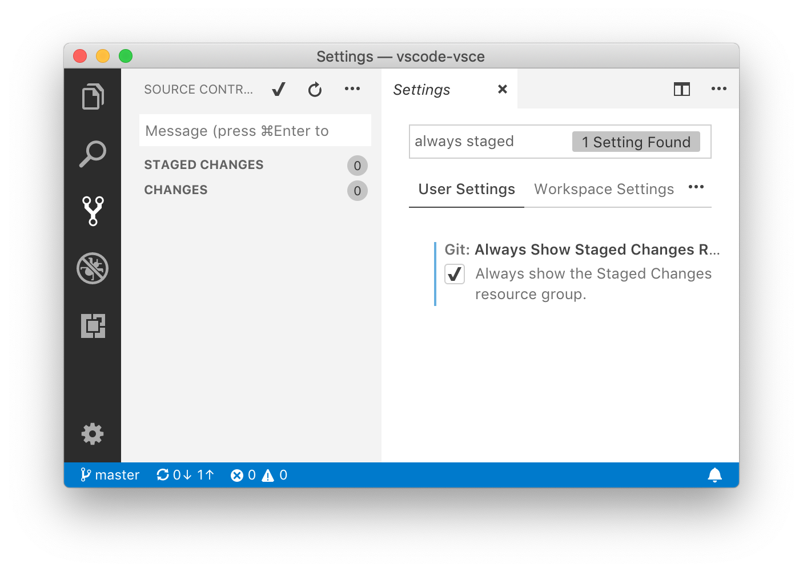

## Terminal

### Define keybindings to send custom sequences

The new command `workbench.action.terminal.sendSequence` has been added which lets you send custom sequences directly to the active terminal. This allows things like sending arrow keys, enter, etc. using the `\u` format for sending Unicode characters.

```json
{
  "key": "ctrl+u",
  "command": "workbench.action.terminal.sendSequence",
  "args": { "text": "\u001b[1;5D\u007f" }
}
```

You can read more about this [on the website](https://code.visualstudio.com/docs/editor/integrated-terminal#_send-text-from-a-keybinding).

### Find improvements

Find in the terminal has been improved and now behaves more like find in the editor:

* Support for regex, case sensitivity and match word.
* The standard find next/previous keybindings (F3, shift+F3) now work.
* Find results that are wrapped across lines are returned.

## Languages

### TypeScript 3.1

VS Code 1.28 ships with [TypeScript 3.1.1](https://devblogs.microsoft.com/typescript/announcing-typescript-3-1/). This release brings new language features such [mappable tuple and array types](https://devblogs.microsoft.com/typescript/announcing-typescript-3-1/#mappable-tuple-and-array-types), along with a number of tooling improvements, and bug fixes.

### Rename import path

Realize that an imported file could use a better name? Now can you rename the referenced file just by renaming the import:

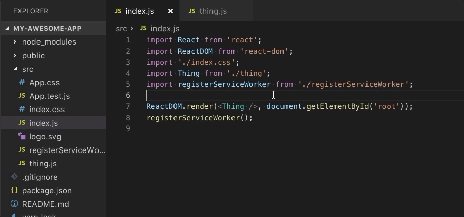

### Convert to async function

The new **Convert to async function** suggestion for JavaScript and TypeScript rewrites functions that use `.then` Promise chaining to use `async` and `await`:

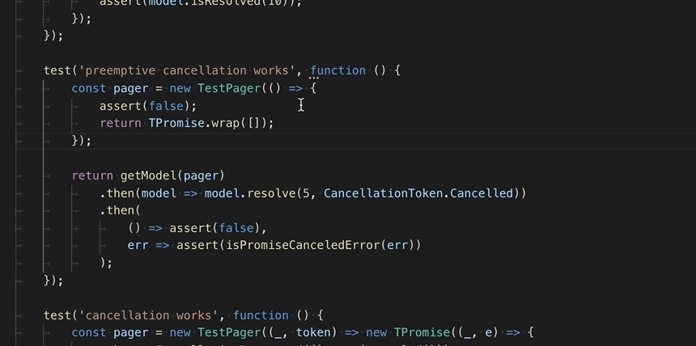

> Note that this feature requires that the setting `javascript.validate.enable` is set to true.

### New settings for JS/TS suggestions

We've cleaned up the settings names for JavaScript and TypeScript suggestions, and added a few additional settings that provide finer grained control:

* All suggestion related settings are now under `javascript.suggest.*` and `typescript.suggest.*`.
* `typescript.useCodeSnippetOnMethodSuggest` has be renamed to `javascript.suggest.completeFunctionCalls` and `typescript.suggest.completeFunctionCalls`.
* `javascript.nameSuggestions` has been renamed to `javascript.suggest.names`.
* `typescript.autoImportSuggestions.enabled` has been renamed to `javascript.suggest.autoImports` and `typescriptscript.suggest.autoImports`.
* The new `javascript.suggest.enabled` and `typescript.suggest.enabled` let you completely disable JS or TS suggestions.

### Semicolon as a commit character for JS/TS

Semicolon is now a commit character for JavaScript and TypeScript suggestions. This means that you can accept that current suggestion just by typing `;`. Existing commit characters also include `.` and `(`.

You can disable commit characters by setting `"editor.acceptSuggestionOnCommitCharacter": false`.

### HTML and CSS path completion excludes dot files

Files that start with `.` are now excluded from path completion results.

### Better Markdown folding

Multiline lists, fenced code blocks, and raw HTML are now foldable in Markdown files:

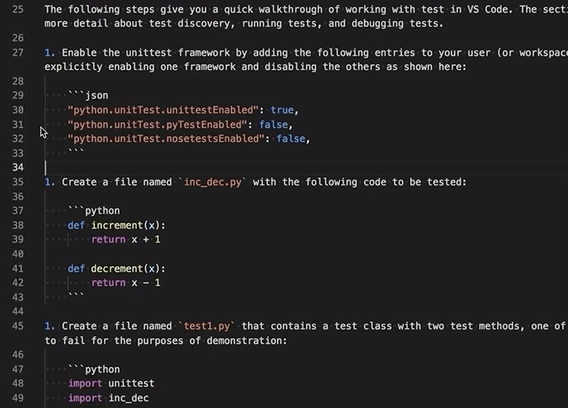

### Markdown preview now opens links to local files in the preview

In the Markdown preview, clicking on a link to a local file will now open that file's preview:

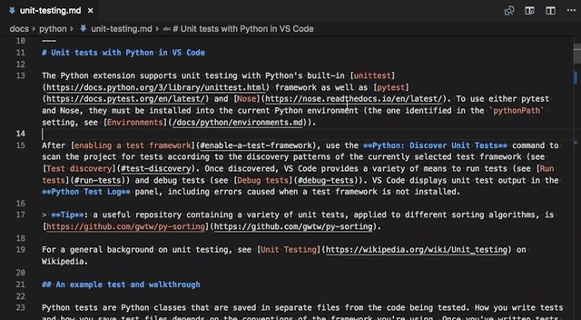

This makes browsing documentation easier. Use the `markdown.preview.openMarkdownLinks` setting to configure how links are handled. Valid settings values are:

* `inEditor` - Open local Markdown links in an editor.
* `inPreview` - Open local Markdown links in the current preview. This is new default behavior.

## Extensions

### Search filtering improvements

You can now use the `@category` filter along with other filters for installed extensions like `@installed`, `@enabled`, `@disabled` and `@outdated` to compose your extension search query. For example, you could search for installed themes, using the query `@installed @category:themes` or installed extensions that contribute snippets, using `@installed @category:snippets`.

### Disabled extensions not counted as outdated

The badge on the Activity Bar for the Extensions view that shows the count of outdated extensions will now exclude disabled extensions. The intention of this badge was to let you know that there are outdated extensions that you may want to update. Since disabled extensions aren't currently being used, including them in the count would only be a distraction.

### Extension Host unresponsive

VS Code executes extensions in a separate process called the **Extension Host**. This process communicates with the renderer/UI process using message passing. We have added better tracking of the messages to the Extension Host and if a message is not acknowledged within 10 seconds, we will show the following notification:

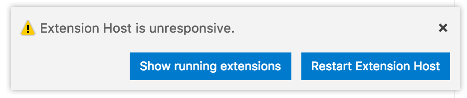

**What does it mean**: Most likely an extension is doing CPU intensive operations that end up **blocking the Extension Host process for more than 10 seconds**.

**What to do**: One option is to **wait** for the completion of the operation and simply ignore the notification. Another option is to **investigate** which extension is causing the high CPU usage by going to the **Running Extensions** view and [start profiling the Extension Host](https://github.com/Microsoft/vscode/wiki/Performance-Issues#profile-the-running-extensions). You can then create an issue directly against the problematic extension. Finally, if you believe the extension has entered an infinite loop, and it does not appear that it will recover, you can **restart** the Extension Host.

## Engineering

### Extensions and webpack

We have continued our [webpack](https://webpack.js.org) effort and now most of the bundled extensions are webpack'ed. As a re-fresher: this helps to reduce the startup time for extensions because there are fewer files to load and less source code to parse. It also helps to reduce the install time because fewer files need to be extracted and written to disk.

This milestone we have trimmed the bundle by another 2803 files. In July we started with 9000 files, by August we were down to 4650, and in September we have 1847!

## Preview Features

Preview features are not ready for release but are functional enough to use. We welcome your early feedback while they are under development.

### Continued Electron 3.0 exploration

During this milestone, we continued to explore bundling Electron 3.0.0 into VS Code. This is a major Electron release and comes with Chrome 66 and Node.js 10.x (a major leap forward compared to our current version that has Chrome 61 and Node.js 8.x). We plan to push out the update to our Insiders users in the near future to gather additional feedback. If you are interested in helping out, make sure to install VS Code [Insiders](https://code.visualstudio.com/insiders).

## Miscellaneous

### Blurriness on macOS Mojave

If you have updated to macOS 10.14 (Mojave), you might have noticed that fonts in VS Code look blurry if you are not using a high-DPI monitor.

A workaround for this is to run:

```bash
defaults write com.microsoft.VSCode.helper CGFontRenderingFontSmoothingDisabled -bool NO
```

from a terminal followed by restarting your computer.

Note that this change is global for every application and not specific to VS Code. See issue [51132](https://github.com/Microsoft/vscode/issues/51132) for the related discussion.

### Electron update

In this release, we updated from Electron 2.0.7 to 2.0.9. Most notably, this allows VS Code to run again on ArchLinux (issue [55934](https://github.com/Microsoft/vscode/issues/55934)).

## Extension Authoring

### Handling URLs for uninstalled extensions

[Back in July](https://code.visualstudio.com/updates/v1_26#_uri-handler-api), we released the URI Handler API for extensions to handle system-wide URIs. With the latest release, VS Code can even handle URIs for extensions which are not yet installed. Once a user opens such a URI, VS Code will search for the extension in the Marketplace, propose the user to install it, and launch VS Code passing in the URI. This allows extensions to have a smooth startup flow which takes users from a webpage to running the extension with certain state.

### Diagnostic error codes

Since diagnostic error codes are now surfaced in [Problems panel](#problems-panel), it is no longer necessary for extensions to add error codes to the [`Diagnostic.message`](https://github.com/Microsoft/vscode/blob/master/src/vs/vscode.d.ts#L4074) property.

### Better configuration when clauses

When authoring keybindings or menu visibility, [when](https://code.visualstudio.com/docs/getstarted/keybindings#_when-clause-contexts) clauses are used. In a when clause, you can reference a configuration (setting) value by prefixing it with `config.`, for example `config.editor.tabCompletion`. Only boolean configuration properties had been supported but with this release, you can also use string and number values.

### Change the language of a text document

There is a new API function to change the language mode of a document, `vscode.languages.setTextDocumentLanguage`. The API takes a document and the language [identifier](https://code.visualstudio.com/docs/languages/overview#_language-id) you want to use. To know what language ids are available, use `vscode.languages.getLanguages`.

### `workspaceContains` activation

Extensions can use the `workspaceContains` activation event to be activated when a workspace is opened that contains a file matching some pattern. For example, a PHP extension might ask to be activated when a workspace with a file matching `**/*.php` is opened. This isn't new, but users have pointed out that the search process can run for a long time and use a lot of CPU when a large workspace is opened.

We made a couple changes to make these searches less impactful. The first is that these searches will now respect the users' `files.exclude`, `search.exclude`, and `search.useIgnoreFiles` settings. In other words, if the user is not able to find a file in a normal text search or file search via Quick Open, a `workspaceContains` pattern won't match on that file. This greatly reduces the number of files that we have to search for `workspaceContains`, and reduces incorrect activations when it matches a file that isn't really part of the project, for example, some file buried in `node_modules/`.

The second change is to impose a 7 second limit on these searches. If the search has not completed after 7 seconds, we kill the search process and activate the extension anyway.

Overall, this should reduce cases of your laptop mysteriously heating up after opening a large workspace in VS Code.

### New theme colors

There are new theme colors:

* `menu.separatorBackground`: Color of a separator menu item in menus.
* `sideBarSectionHeader.border`: Side bar section header border color.
* `inputValidation.infoForeground`: Input validation foreground color for information severity.
* `inputValidation.warningForeground`: Input validation foreground color for warning severity.
* `inputValidation.errorForeground`: Input validation foreground color for error severity.
* `editor.snippetTabstopHighlightBackground`: Highlight background color of a snippet tabstop.
* `editor.snippetTabstopHighlightBorder`: Highlight border color of a snippet tabstop.
* `editor.snippetFinalTabstopHighlightBackground`: Highlight background color of the final tabstop of a snippet.
* `editor.snippetFinalTabstopHighlightBorder`: Highlight border color of the final tabstop of a snippet.
* `activityBar.inactiveForeground`: Activity bar item foreground color when it is inactive.

### Debug API

**`resolveDebugConfiguration` needs to explicitly return `null` to open `launch.json`**

Previously, if `resolveDebugConfiguration` returned a launch configuration that did not have a `type` attribute, VS Code would automatically open an underlying `launch.json` file. After feedback from extension authors, we decided to give extensions more control over this scenario.

Now `resolveDebugConfiguration` has to explicitly return the value `null` to prevent the debug session from starting and open `launch.json` instead. Returning the value `undefined` simply prevents the debug session from starting. As before, returning a configuration with a `type` attribute will start a debug session.

## Proposed Extension APIs

Every milestone comes with new proposed APIs and extension authors can try them out. As always we are keen on your feedback. This is what you have to do to try out a proposed API:

* You must use Insiders because proposed APIs change frequently.
* You must have this line in the `package.json` file of your extension: `"enableProposedApi": true`.
* Copy the latest version of the [`vscode.proposed.d.ts`](https://github.com/Microsoft/vscode/blob/master/src/vs/vscode.proposed.d.ts) file into your project.

Note that you cannot publish an extension that uses a proposed API. We may likely make breaking changes in the next release and we never want to break existing extensions.

### Debug API

**new `DebugConfigurationProvider.provideDebugAdapter` replaces `DebugConfigurationProvider.debugAdapterExecutable` commands**

Previously we added the proposed API `DebugConfigurationProvider.debugAdapterExecutable` so that an extension can return a dynamically calculated path (and corresponding program arguments) for the debug adapter about to be launched by VS Code. In this milestone, we are revising the initial design based on the feedback received (for example [#45220](https://github.com/Microsoft/vscode/issues/45220), [#56646](https://github.com/Microsoft/vscode/issues/56646), [#57706](https://github.com/Microsoft/vscode/issues/57706), [#54465](https://github.com/Microsoft/vscode/issues/54465)).

The [new API method](https://github.com/Microsoft/vscode/blob/513025ed9e97c2fc04721d435bd88e5b4a2269ad/src/vs/vscode.proposed.d.ts#L536-L558) is called `provideDebugAdapter` and now we pass in the debug session, the workspace folder, the executable information from the `package.json`, and the resolved launch config. With this information, an extension has the "full picture" when being asked to create the debug adapter.

In addition, we now support more ways for starting and connecting to the debug adapter implementation. For this, a descriptor object can be returned from the `provideDebugAdapter` method:

* A `DebugAdapterExecutable` descriptor can be used to launch the debug adapter as an external process per session and communicates with it via stdin/stdout. With the new API, it is now possible to specify the working directory and environment variables for the debug adapter.
* A `DebugAdapterServer` describes a server process that handles multiple sessions and communicates via a socket.
* A `DebugAdapterImplementation` can be used for an in-place implementation that has no communication overhead. This option relies on a small modification to the [Node.js based client library](https://www.npmjs.com/package/vscode-debugadapter) for DAP and is planned for October.

Please note that this is proposed API and cannot be used in extensions published on the Marketplace. However, we'd appreciate your feedback for `DebugConfigurationProvider.provideDebugAdapter` on issue [45220](https://github.com/Microsoft/vscode/issues/45220).

### Comment editing and deletion

In the last iteration, we introduced the `DocumentCommentProvider` to allow extensions to create and manage comments within the editor. We have added [new methods](https://github.com/Microsoft/vscode/blob/513025ed9e97c2fc04721d435bd88e5b4a2269ad/src/vs/vscode.proposed.d.ts#L779-L787) to this provider to support the editing and deletions of comments. Comments themselves now also have [flags](https://github.com/Microsoft/vscode/blob/513025ed9e97c2fc04721d435bd88e5b4a2269ad/src/vs/vscode.proposed.d.ts#L724-L738) that indicate if they support edit or delete. If the extension sets one of these flag and provides an appropriate edit or delete method, actions to edit or delete the comment will be shown when hovering or focusing on a comment within the editor:

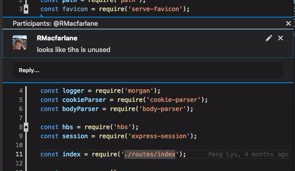

## New Commands

Key|Command|Command id
---|-------|----------
`kb(workbench.action.navigateToLastEditLocation)`|Navigate to the last location edited|`workbench.action.navigateToLastEditLocation`
`kb(workbench.action.files.saveWithoutFormatting)`|Save file without running save participants (formatters, etc.)|`workbench.action.files.saveWithoutFormatting`
`kb(workbench.action.closeEditorInAllGroups)`|Close the active file across all editor groups|`workbench.action.closeEditorInAllGroups`
`kb(toggle.diff.renderSideBySide)`|Toggle diff editor inline and side-by-side mode (deprecates `toggle.diff.editorMode`)|`toggle.diff.renderSideBySide`

## New Documentation

### GitHub Pull Request extension blog post

You can read Kenneth's recent [blog post](https://code.visualstudio.com/blogs/2018/09/10/introducing-github-pullrequests) announcing the new [GitHub Pull Request](https://marketplace.visualstudio.com/items?itemName=GitHub.vscode-pull-request-github) extension and discussing the collaboration between VS Code and the GitHub Editor team.

### Using Azure Pipelines blog post

In [Visual Studio Code using Azure Pipelines](https://code.visualstudio.com/blogs/2018/09/12/engineering-with-azure-pipelines), VS Code engineer João Moreno describes how VS Code is now using [Azure Pipelines](https://aka.ms/azurecicd) for its build and continuous integration (CI) infrastructure.

### New PowerShell topic

[PowerShell in Visual Studio Code](https://code.visualstudio.com/docs/languages/powershell) shows the PowerShell integration through the Microsoft [PowerShell](https://marketplace.visualstudio.com/items?itemName=ms-vscode.PowerShell) extension. The extension supports powerful language features such as IntelliSense, Go to Definition, and Find All References as well as debugging and code snippets.

### New Python Django tutorial

There is a new [Use Django in Visual Studio Code](https://code.visualstudio.com/docs/python/tutorial-django?utm_source=VsCode&utm_medium=ReleaseNotes) tutorial showing how you can quickly create, edit, and debug a Python [Django](https://www.djangoproject.com/) web application in VS Code.

## Notable Fixes

* [48051](https://github.com/Microsoft/vscode/issues/48051): After formatting you need to scroll left
* [31619](https://github.com/Microsoft/vscode/issues/31619): Must tab through deleted tab stops in snippets
* [58327](https://github.com/Microsoft/vscode/issues/58327): Debug toolbar buttons disabled
* [35935](https://github.com/Microsoft/vscode/issues/35935): "Clear Recently Opened" should also clear editor quick pick history
* [58799](https://github.com/Microsoft/vscode/issues/58799): Reveal untitled file when saving
* [29553](https://github.com/Microsoft/vscode/issues/29553): Preserve quick open input on Escape
* [58222](https://github.com/Microsoft/vscode/issues/58222): UriDisplayService is missing remote share path name
* [54213](https://github.com/Microsoft/vscode/issues/54213): Mechanism to abort the debug launch without showing launch.json
* [52511](https://github.com/Microsoft/vscode/issues/52511): Debug Hover Widget - Enable the widget resizing for long items whose overflow is hidden
* [50569](https://github.com/Microsoft/vscode/issues/50569): Conditional breakpoint prompt should offer to enable breakpoints if breakpoint is already disabled
* [42737](https://github.com/Microsoft/vscode/issues/42737): Extensions: allow to right click to bring up gear menu
* [58434](https://github.com/Microsoft/vscode/issues/58434): Use `--force` arg to prevent prompts while installing extensions from CLI.

## Thank You

Last but certainly not least, a big *__Thank You!__* to the following folks that helped to make VS Code even better:

Contributions to `vscode`:

* [Sribalaji M (@1AmNegan)](https://github.com/1AmNegan): Center viewport for nextChange/previousChange using keybinding [PR #51235](https://github.com/Microsoft/vscode/pull/51235)
* [Agustín Rodríguez (@agurodriguez)](https://github.com/agurodriguez): styles for diff on Markdown preview [PR #59289](https://github.com/Microsoft/vscode/pull/59289)
* [Andrew Casey (@amcasey)](https://github.com/amcasey): Add GDPR annotation for typescript-language-features/languageserviceerrorresponse [PR #57182](https://github.com/Microsoft/vscode/pull/57182)
* [Andy Li (@andyli)](https://github.com/andyli): override Ubuntu's default integrated terminal font options (#35901) [PR #56429](https://github.com/Microsoft/vscode/pull/56429)
* [Aliaksandr Stelmachonak (@ava1ar)](https://github.com/ava1ar): Added ARM64 build support [PR #52119](https://github.com/Microsoft/vscode/pull/52119)
* [Beau Allison (@beauallison)](https://github.com/beauallison): Align GIT light colored check icon with dark [PR #50526](https://github.com/Microsoft/vscode/pull/50526)
* [Andre Wachsmuth (@blutorange)](https://github.com/blutorange): fix promise polyfill, chaining promises works [PR #57723](https://github.com/Microsoft/vscode/pull/57723)
* [Bruno Finger (@brunofin)](https://github.com/brunofin): Replace brackets as well upon creating a branch [PR #57374](https://github.com/Microsoft/vscode/pull/57374)
* [David Staheli (@DavidStaheli)](https://github.com/DavidStaheli): Use the new VSTS YAML syntax [PR #57745](https://github.com/Microsoft/vscode/pull/57745)
* [Dave Williams (@davnicwil)](https://github.com/davnicwil): New config to turn off TypeScript autocomplete suggestions [PR #58011](https://github.com/Microsoft/vscode/pull/58011)
* [Dustin Campbell (@DustinCampbell)](https://github.com/DustinCampbell): Update C# grammar [PR #57451](https://github.com/Microsoft/vscode/pull/57451)
* [Eric Amodio (@eamodio)](https://github.com/eamodio): Image uris with querystring not being detected properly [PR #58314](https://github.com/Microsoft/vscode/pull/58314)
* [@Git-Lior](https://github.com/Git-Lior)
  * Hide dirty-diff decorator when inside the diff-editor [PR #58373](https://github.com/Microsoft/vscode/pull/58373)
  * Improve no user.email/user.name config error message [PR #58174](https://github.com/Microsoft/vscode/pull/58174)
* [Guy Waldman (@guywald1)](https://github.com/guywald1)
  * Fix dirty setting update logic [PR #58926](https://github.com/Microsoft/vscode/pull/58926)
  * Add smarter filename suggestions, #57528 [PR #58009](https://github.com/Microsoft/vscode/pull/58009)
* [Jay Rodgers (@headmelted)](https://github.com/headmelted)
  * Adding missed dependency libxss1 [PR #59181](https://github.com/Microsoft/vscode/pull/59181)
  * Adding electron ARM and ARM64 tasks for cross-compiling [PR #58436](https://github.com/Microsoft/vscode/pull/58436)
* [Eric Gang (@Hirico)](https://github.com/Hirico): Preserve the revealed area after using "Open File" from git-diff editor (fix #53465) [PR #54867](https://github.com/Microsoft/vscode/pull/54867)
* [Jatin Sandilya (@jats22)](https://github.com/jats22): Remove absolute path for python [PR #56943](https://github.com/Microsoft/vscode/pull/56943)
* [Jason Bright (@jgbright)](https://github.com/jgbright)
  * Add Markdown list folding, #57104 [PR #57899](https://github.com/Microsoft/vscode/pull/57899)
  * Git rebase detection [PR #57651](https://github.com/Microsoft/vscode/pull/57651)
* [Jim Hessin (@jhessin)](https://github.com/jhessin): Update language-configuration.json [PR #44566](https://github.com/Microsoft/vscode/pull/44566)
* [JYX (@jjyyxx)](https://github.com/jjyyxx): Fix inaccurate description in tsconfig.schema.json [PR #58582](https://github.com/Microsoft/vscode/pull/58582)
* [Jonathan Perret (@jonathanperret)](https://github.com/jonathanperret): Fix typos in workbench.editor.labelFormat [PR #59155](https://github.com/Microsoft/vscode/pull/59155)
* [Konstantin Müller (@konstantin-mueller)](https://github.com/konstantin-mueller): #54204 Add commands to apply stash [PR #54300](https://github.com/Microsoft/vscode/pull/54300)
* [limerick (@limerickgds)](https://github.com/limerickgds): Generator method of class autocomplete causes star(*) to be add… [PR #51557](https://github.com/Microsoft/vscode/pull/51557)
* [Luis Zuniga (@luiszun)](https://github.com/luiszun): Check the path for spaces before sending. Avoids filenames to be inte… [PR #56966](https://github.com/Microsoft/vscode/pull/56966)
* [@lzmkony](https://github.com/lzmkony): Delete the duplicated function [PR #57700](https://github.com/Microsoft/vscode/pull/57700)
* [Muhammad Azeem (@manixate)](https://github.com/manixate): Prevent scrollbar to be considered as a drop target for drag-and-drop [PR #49747](https://github.com/Microsoft/vscode/pull/49747)
* [Matt Hardcastle (@MattHardcastle)](https://github.com/MattHardcastle): Do not auto-close when ending with open [PR #55315](https://github.com/Microsoft/vscode/pull/55315)
* [Maarten Fonville (@mfonville)](https://github.com/mfonville): Update Electron to 2.0.9 [PR #58382](https://github.com/Microsoft/vscode/pull/58382)
* [Marat Abdullin (@mshoho)](https://github.com/mshoho): An option to copy only plain text to clipboard. [PR #54155](https://github.com/Microsoft/vscode/pull/54155)
* [Néstor Hernández Ojeda (@nesukun)](https://github.com/nesukun): Add support for force push and force-with-lease [PR #53286](https://github.com/Microsoft/vscode/pull/53286)
* [Nilesh Kevlani (@njkevlani)](https://github.com/njkevlani): Added new command for sending custom sequence to terminal [PR #56962](https://github.com/Microsoft/vscode/pull/56962)
* [Noam Yogev (@noamyogev84)](https://github.com/noamyogev84): Allow snippet json prefix to be an array to support multiple prefixes for the same snippet [PR #59092](https://github.com/Microsoft/vscode/pull/59092)
* [Alexandre ZANNI (@noraj)](https://github.com/noraj): Add more Markdown extensions [PR #58072](https://github.com/Microsoft/vscode/pull/58072)
* [Sardorbek (@oneslash)](https://github.com/oneslash)
  * always show create a branch button [PR #58731](https://github.com/Microsoft/vscode/pull/58731)
  * add copy relative path as separate item like in other IDEs [PR #57602](https://github.com/Microsoft/vscode/pull/57602)
  * check only dot at the end of a branch [PR #58825](https://github.com/Microsoft/vscode/pull/58825)
* [Karthikayan (@ParkourKarthik)](https://github.com/ParkourKarthik)
  * improve handling fallback of theme colors in terminal [PR #57100](https://github.com/Microsoft/vscode/pull/57100)
  * add option for input validation foreground color [PR #57734](https://github.com/Microsoft/vscode/pull/57734)
* [Chi Wang (@patr0nus)](https://github.com/patr0nus): Fixes the “Invalid start index” error [PR #57617](https://github.com/Microsoft/vscode/pull/57617)
* [Morten N.O. Nørgaard Henriksen (@raix)](https://github.com/raix): Add branch name validation and whitespace config [PR #50712](https://github.com/Microsoft/vscode/pull/50712)
* [Rik Smeets (@rik-smeets)](https://github.com/rik-smeets): Add missing access keys (mnemonics) for menu items [PR #58412](https://github.com/Microsoft/vscode/pull/58412)
* [Rodrigo Varas (@rodrigovaras)](https://github.com/rodrigovaras): Fix to make the EH debugging to work when live share proxy the debug adapter [PR #58227](https://github.com/Microsoft/vscode/pull/58227)
* [Segev Finer (@segevfiner)](https://github.com/segevfiner)
  * Try to checkout a new local branch when checking out a remote branch [PR #54897](https://github.com/Microsoft/vscode/pull/54897)
  * Add URL handler support for Linux desktops [PR #56727](https://github.com/Microsoft/vscode/pull/56727)
* [@sucicf1](https://github.com/sucicf1): Fix#35905 [PR #58380](https://github.com/Microsoft/vscode/pull/58380)
* [Thomas Basche (@tombasche)](https://github.com/tombasche): Allow empty git commit [PR #56048](https://github.com/Microsoft/vscode/pull/56048)
* [tsangint (@tsangint)](https://github.com/tsangint): Fix typo [PR #57192](https://github.com/Microsoft/vscode/pull/57192)
* [Alexander (@usernamehw)](https://github.com/usernamehw): Fix tab focus related issues [PR #57821](https://github.com/Microsoft/vscode/pull/57821)
* [Winner Crespo (@wistcc)](https://github.com/wistcc)
  * Allowing disable the submodule auto detection warning [PR #51111](https://github.com/Microsoft/vscode/pull/51111)
  * Fixing text when reverting changes for deleted file [PR #55975](https://github.com/Microsoft/vscode/pull/55975)
  * Adding the git.syncRebase setting [PR #52527](https://github.com/Microsoft/vscode/pull/52527)
  * Adding the git.showStagedChangesResourceGroup config property [PR #55976](https://github.com/Microsoft/vscode/pull/55976)

Contributions to `language-server-protocol`:

* [Tyson Andre (@TysonAndre)](https://github.com/TysonAndre): Fix more typos [PR #568](https://github.com/Microsoft/language-server-protocol/pull/568)

Contributions to `vscode-languageserver-node`:

* [Mathias R. Jessen (@IISResetMe)](https://github.com/IISResetMe): Fixed error msg misspellings of "received" [PR #414](https://github.com/Microsoft/vscode-languageserver-node/pull/414)

Contributions to `debug-adapter-protocol`:

* [Antonino Perricone (@APerricone)](https://github.com/APerricone): Added harbour language by APerricone [PR #6](https://github.com/Microsoft/debug-adapter-protocol/pull/6)

Contributions to `vscode-recipes`:

* [Daryl Knowles (@darylknowles)](https://github.com/darylknowles): Debug End-To-End should start local server with ng e2e [PR #122](https://github.com/Microsoft/vscode-recipes/pull/122)
* [Karuppasamy M (@karuppasamy)](https://github.com/karuppasamy): Add recipes for Ruby on Rails [PR #59](https://github.com/Microsoft/vscode-recipes/pull/59)
* [Trivikram Kamat (@trivikr)](https://github.com/trivikr): Added recipe for debugging node-tap tests in VS Code [PR #128](https://github.com/Microsoft/vscode-recipes/pull/128)

Contributions to `vscode-chrome-debug`:

* [Sasha (@stristr)](https://github.com/stristr): Use nullable `targetTypes` property for advanced debugging. [PR #727](https://github.com/Microsoft/vscode-chrome-debug/pull/727)

Contributions to `vscode-chrome-debug-core`:

* [@digeff](https://github.com/digeff)
  * Update logging mechanism to not log sources [PR #355](https://github.com/Microsoft/vscode-chrome-debug-core/pull/355)
  * Fix first line bp chrome 69 [PR #352](https://github.com/Microsoft/vscode-chrome-debug-core/pull/352)
  * Fix break-on-load to make breakpoints on attach work [PR #332](https://github.com/Microsoft/vscode-chrome-debug-core/pull/332)

Contributions to `localization`:

There are almost 1200 members in the Transifex [VS Code project](https://aka.ms/vscodeloc) team with about 100 active contributors every month. We appreciate your contributions, either by providing new translations, voting on translations, or suggesting process improvements.

Here is a snapshot of contributors for this release. For details about the project including the contributor name list, visit the project site at [https://aka.ms/vscodeloc](https://aka.ms/vscodeloc).

* **Bengali:** Anisuzzaman Khan, abm_prottoy, Mushiar Khan, Mehedi Hassan.
* **Bulgarian:** Любомир Василев.
* **Croatian:** Nikša Mihaica.
* **Czech:** Vít Staniček.
* **Danish:** Kenneth Greig, Johan Fagerberg, Martin Fruensgaard.
* **Dutch:** Gerald Versluis, Marco van den Hout.
* **French:** Antoine Griffard, MayakoLyyn, Smrman, Etienne Blanc-Coquand.
* **German:** J.M., Carsten Kneip, Volkmar Rigo, SetTrend.
* **Greek:** Nikolaos Maliakkas.
* **Hindi:** Ashwini Gupta, Shaswat Rungta.
* **Hungarian:** Tar Dániel.
* **Chinese Simplified:** Joel Yang, 子实 王, pluwen, Chris Pan 潘冬冬, danyeh.
* **Chinese Traditional:** Duran Hsieh, Poy Chang, Alan Tsai, Han Lin, Shih-Ming Tung, Will 保哥.
* **Indonesian:** G-RiNe Project, Wildan Mubarok, Rizki A. Wibowo, Riwut Libinuko, Azhe-kun, rodin, Febrian Setianto (Feber).
* **Italian:** Luigi Bruno, Luca Bruni, Alessandro Alpi, Emilie Rollandin, Pascal Brax, Andrea Dottor, Riccardo Cappello.
* **Japanese:** Satoshi Kajiura, Shunya Tajima, Yuichi Nukiyama, yoshioms, daisuke osada (daiskeh).
* **Korean:** Kyunghee Ko, jaeyeon Kim, Junseong Jang, Jisan Oh.
* **Lithuanian:** Martynas Jusys.
* **Malayalam:** Kiren Paul.
* **Norwegian:** Espen Klein Nilsen.
* **Polish:** Artur, Patryk Brejdak, Adam Borowski, Mateusz Wyczawski.
* **Portuguese (Brazil):** Roberto Fonseca, Bruno Sonnino, Danilo Dantas, Marcelo Fernandes, Thiago Custodio, Rodrigo Crespi, Marcelo Andrade, Alessandro Fragnani, Lucas Miranda, Otacilio Saraiva Maia Neto.
* **Portuguese (Portugal):** António Santos,Diogo Barros, António Lourenço, jp2masa, Ruben Mateus, Henrique Silva, André Vala.
* **Russian:** Ivan Kuzmenko, Roman Slauta.
* **Spanish:** Jorge Serrano Pérez, José M. Aguilar, Alberto Poblacion, Carlos Mendible, Alejandro Medina, Andy Gonzalez,Carlos Herrera.
* **Tamil:** Vijay Nirmal, rajakvk, Anand AV.
* **Turkish:** Mustafa Turhan, Fırat Payalan, Selim Ata.

<!-- In-product release notes styles.  Do not modify without also modifying regex in gulpfile.common.js -->
<a id="scroll-to-top" role="button" aria-label="scroll to top" href="#"><span class="icon"></span></a>
<link rel="stylesheet" type="text/css" href="css/inproduct_releasenotes.css"/>
