# October 2018 (version 1.29)

**Update 1.29.1**: The update addresses these [issues](https://github.com/Microsoft/vscode/milestone/82?closed=1).

<!-- DOWNLOAD_LINKS_PLACEHOLDER -->

---

Welcome to the October 2018 release of Visual Studio Code. There are a number of significant updates in this version that we hope you will like, some of the key highlights include:

* **[Multiline search](#multiline-search)** - Search across files with regex multiline expressions.
* **[File icons in IntelliSense](#file-and-folder-icons-in-intellisense)** - Quickly distinguish file types in IntelliSense.
* **[Better macOS support](#macos-mojave-dark-mode-support)** - Full screen mode control and Mojave Dark Mode support.
* **[Collapsible stack frames](#collapsible-stack-frames)** - Collapse uninteresting stack frames to clearly see your code.
* **[Improved Loaded Scripts view](#improved-loaded-scripts-view)** - Displays related resources such as original source files.
* **[Updated extension samples](#normalized-extension-samples)** - Uniform style and structure, README, and API usage.
* **[CI recipe for extensions](#using-azure-pipelines-for-extension-ci)** - Azure Pipelines build recipe for extensions.
* **[Preview: Find All References](#references-view)** - Find All References view shows reference search results.

>If you'd like to read these release notes online, go to [Updates](https://code.visualstudio.com/updates) on [code.visualstudio.com](https://code.visualstudio.com).<br>
>You can also check out this 1.29 release [highlights video](https://youtu.be/g5MZ89F8G0U) from Cloud Developer Advocate [Brian Clark](https://twitter.com/_clarkio).

The release notes are arranged in the following sections related to VS Code focus areas. Here are some further updates:

* **[Workbench](#workbench)** - Platform specific end-of-line characters, highlight modified file tabs.
* **[Integrated Terminal](#integrated-terminal)** - Split terminal cwd options, Cmd+Backspace to delete to start of line.
* **[Languages](#languages)** - Display CSS Specificity on hover, handle unknown CSS properties.
* **[Debugging](#debugging)** - Multiple debug consoles, start with stop on entry, style console.log messages.
* **[Extension Authoring](#extension-authoring)** - Active terminal API, more control over custom views.

**Insiders:** Want to see new features as soon as possible? You can download the nightly [Insiders](https://code.visualstudio.com/insiders) build and try the latest updates as soon as they are available. And for the latest Visual Studio Code news, updates, and content, follow us on Twitter [@code](https://twitter.com/code)!

## Search

### Multiline search

VS Code now supports multiline search! Same as in the editor, a regex search executes in multiline mode only if it contains a `\n` literal. The Search view shows a hint next to each multiline match, with the number of additional match lines.

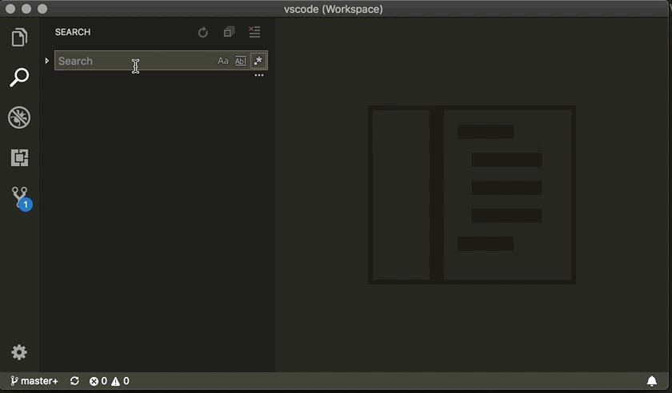

This feature is possible thanks to the work done in the [ripgrep](https://github.com/BurntSushi/ripgrep) tool to implement multiline search.

### Backreferences and lookahead in search

It is also now possible to use [backreferences](https://www.regular-expressions.info/backref.html) and [lookahead](https://www.regular-expressions.info/lookaround.html) assertions in regex searches, by setting `"search.usePCRE2": true`. This configures [ripgrep](https://github.com/BurntSushi/ripgrep) to use the [PCRE2](https://pcre.org/) regex engine. While PCRE2 supports many other features, we only support regex expressions that are still valid in JavaScript, because open editors are still searched using the editor's JavaScript-based search.

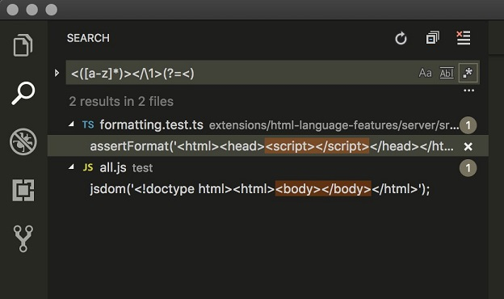

If you are still missing lookbehind assertions, don't worry! That feature is just recently supported by JavaScript and should come to VS Code in a later Electron shell update.

### Show line numbers in search

We've added a setting `search.showLineNumbers` which will display the line number for each match in the Search view.

### Disable search and replace preview

There is a new setting `search.useReplacePreview` which allows you to disable the preview diff that appears when doing a search/replace in the Search view.


### Use global .gitignore file in search

Git allows you to configure a global `gitignore` file using the `core.excludesfile` config property. By default, search does not respect the global `gitignore` file, but you can now change this by enabling the new setting `search.useGlobalIgnoreFiles`.

## Workbench

### macOS Mojave Dark Mode support

The macOS Mojave Dark Mode is now better supported in VS Code. Previously, VS Code menus and dialogs would show with the default light theme, even if macOS was running in dark theme. Now, all native UI elements will show with the Dark Mode if enabled.

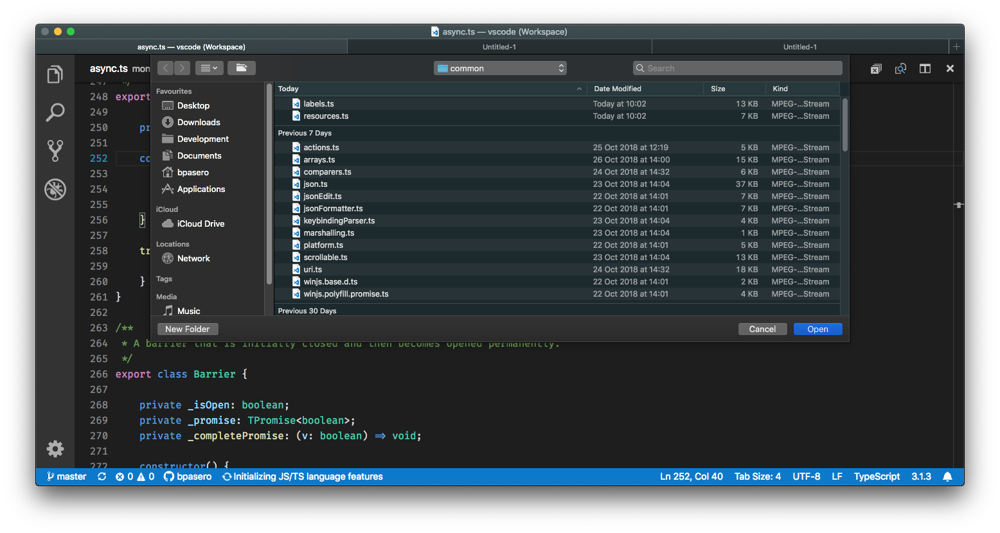

### macOS full screen support

A new setting `window.nativeFullScreen` was introduced that, if set to `false`, will enable full screen mode for VS Code that does not use the native macOS full screen feature. This has the advantage that entering full screen mode will not create a macOS space on the desktop. By default, VS Code will still use macOS native full screen.

### New default for `files.eol`: `auto`

The `files.eol` end of line setting now has a new default value `auto`. When set to `auto`, the end of line character for new files is specific to the operating system. It is `\r\n` on Windows and `\n` on macOS and Linux. You can also still explicitly set `file.eol` to `\n` or `\r\n`.

### Highlight modified tabs

A new setting `workbench.editor.highlightModifiedTabs` displays a thick border at the top of editor tabs whenever the editor is dirty (has unsaved changes). This makes it easier to find files that need to be saved. The color of the border can be customized (see below).

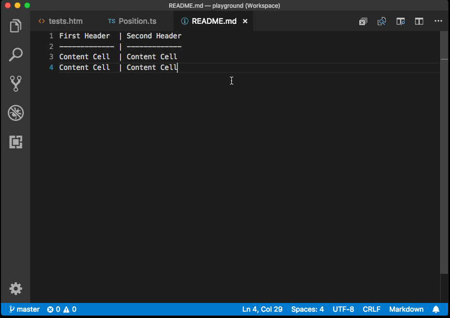

### Centered editor layout auto resize

Centered layout view will now automatically resize to max width when more than 1 editor group is open. This should make centered layout easier to use and require less manual toggling. This behavior is controlled by a new setting `workbench.editor.centeredLayoutAutoResize` which is enable by default.

### Symbol order in Breadcrumbs

There is a new setting that controls how symbols in the Breadcrumbs picker are ordered: `breadcrumbs.symbolSortOrder`.

Allowed values are:

* `position` - position in the file (default)
* `name` - alphabetical order
* `type` - symbol type order

The example below shows the Breadcrumbs symbol list ordered by name:

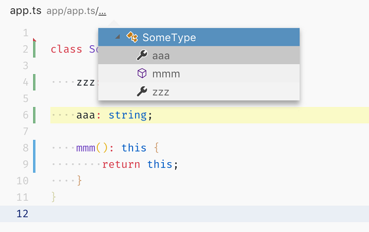

### Breadcrumbs and preview editors

When middle clicking items in the Breadcrumbs navigation, they now open in a new editor and don't reuse the preview editor. This behavior now matches middle clicking files in the Explorer.

### Notifications automatically hide even when showing buttons

Previously, VS Code would never hide notifications if they included buttons. This resulted in the potential for notifications to pile up in the lower right corner and cover parts of the editor. With this release, notifications are hidden after a timeout even if they show buttons.

There are two exceptions:

* Notifications with `error` severity will not be hidden on the assumption that the user needs to take some action.
* A few specific notifications from VS Code will remain open. For example, the notification that asks if you'd like to install an extension after browsing the VS Code Marketplace.

**Note:** Even if notifications are hidden, you can always access all notifications from the Notification Center, either by clicking on the little bell icon in the Status bar or via the **Show Notifications** (`notifications.toggleList`) command.

### Panel position button to context menu

In order to preserve horizontal space and reduce clutter, we removed the toggle Panel position button (**Move to Right**, **Move to Bottom**) from the Panel title area. The action is now available in the Panel title area context menu and also in **View** > **Appearance** > **Toggle Panel Position**  main menu. Another reason for removing this button was that we believe users set their layout once and don't normally toggle back and forth.

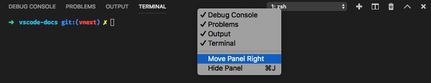

### Updated file icons per file type

In the [previous release](https://code.visualstudio.com/updates/v1_28#_file-icons-per-file-type), we added custom icons for common VS Code file types. We now added those icons to smaller views so they will appear in a list view.


### Settings editor "Modified in" hint is now a link

In the Settings editor, we show a hint when a setting is configured in a scope (User, Workspace) other than the currently selected scope. The other scope hint is now a link that will take you to the setting in the other scope.

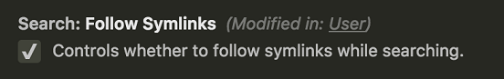

### Tree widget performance

The VS Code tree widget control is used in many places in the VS Code UI but was hitting performance limits in some specific use cases (Problems panel, Outline view). We have been working on faster virtual tree widget implementations which can accommodate different levels of performance versus API convenience. You can read [here](https://github.com/Microsoft/vscode/wiki/Lists-And-Trees) to learn more.

The new `ObjectTree` widget is now being used in the Problems panel and we've already seen significant improvements. We were able to dramatically raise the number of problem items the workbench can handle as well as increase the speed of certain operations (such as **Collapse All**) and advanced filtering scenarios. These improvements now make it feasible to work with larger collection sizes.

### Workbench navigation commands

Four commands are added to improve workbench navigation:

* `workbench.action.nextSideBarView`: Go to next view in Side Bar.
* `workbench.action.previousSideBarView`: Go to previous view in Side Bar.
* `workbench.action.nextPanelView`: Go to next Panel.
* `workbench.action.previousPanelView`: Go to previous Panel.

By default, the commands do not have keyboard shortcuts.

Two context keys, `sideBarFocus` and `panelFocus` were also added. This allows using the same keybinding for different commands in different Workbench areas:

```json
[
  { "key": "cmd+]", "command": "workbench.action.nextEditor" },
  { "key": "cmd+[", "command": "workbench.action.previousEditor" },
  {
    "key": "cmd+]",
    "command": "workbench.action.nextSideBarView",
    "when": "sideBarFocus"
  },
  {
    "key": "cmd+[",
    "command": "workbench.action.previousSideBarView",
    "when": "sideBarFocus"
  },
  {
    "key": "cmd+]",
    "command": "workbench.action.nextPanelView",
    "when": "panelFocus"
  },
  {
    "key": "cmd+[",
    "command": "workbench.action.previousPanelView",
    "when": "panelFocus"
  }
]
```

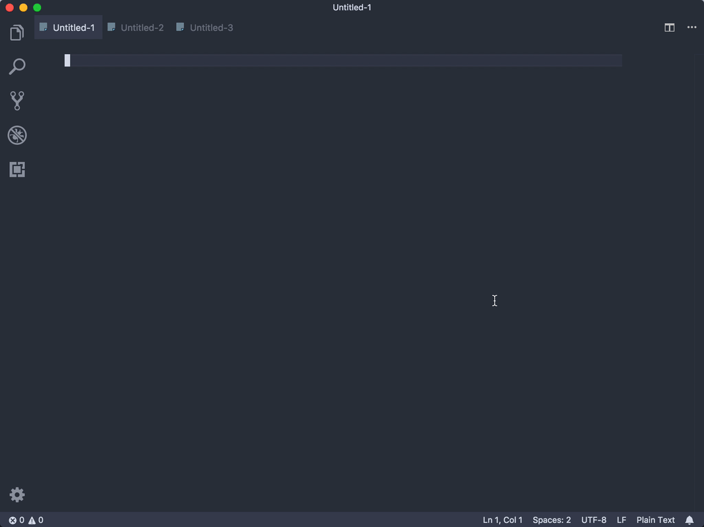

### Show view group parent

The **Open View** command (`view` in Quick Open) now shows each view group's parent to better represent the view hierarchy. For example, the Explorer group now show as **Side Bar / Explorer**, and Terminal group as **Panel / Terminal**.

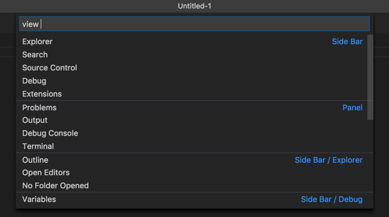

## Editor

### File and folder icons in IntelliSense

The IntelliSense widget now shows file and folder icons for file completions based on your File Icon theme. This provides a unified look and helps you quickly identify different file types.

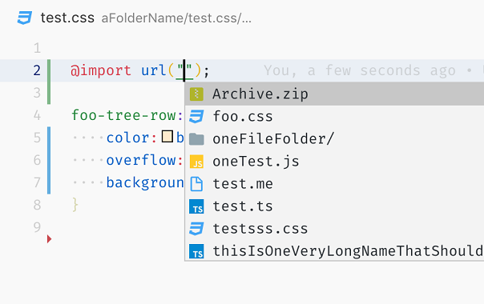

### Format Selection

To speed up small formatting operations, the **Format Selection** command without an editor selection will now format the current line.

### Show error codes

The editor now shows the error code of a problem if an error code is defined. The error code is displayed at the end of the line in square brackets.

Below you can see that TypeScript is displaying the error code '2339':

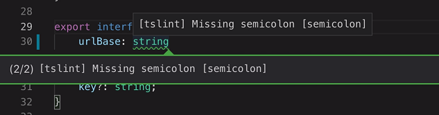

## Integrated Terminal

### Split terminal can inherit working directory

A setting `terminal.integrated.splitCwd` was added to control the current working directory (cwd) of the new terminal when a terminal is split:

* `workspaceRoot` - The previous behavior; a new split terminal will use the workspace root as the working directory. In a multi-root workspace, a choice for which root folder to use is offered.
* `initial` - A new split terminal will use the working directory that the parent terminal started with.
* `inherited` - On macOS and Linux, a new split terminal will use the working directory of the parent terminal. On Windows, this behaves the same as `initial`.

### Cmd+Backspace to delete to the start of the line

A new keybinding was added on macOS for `Cmd+Backspace` which sends `\u0015` (Ctrl+U) to the terminal. In bash, this deletes from the cursor to the start of the line, in zsh, it deletes the whole line.

### Experimental buffer improvements

A new setting `terminal.integrated.experimentalBufferImpl` allows changing how the terminal stores its buffer to a `TypedArray`/`ArrayBuffer`-based implementation. If you would like to opt-in, you can expect performance improvements across the board, including reduced memory usage and garbage collection, and an overall increase to the throughput of the terminal.

```json
{
  "terminal.integrated.experimentalBufferImpl": "TypedArray"
}
```

This is just the beginning, we're expecting further improvements to throughput and memory usage over the next couple of releases before making this the default implementation. A special thanks to [@jerch](https://github.com/jerch) from the [xterm.js](https://github.com/xtermjs/xterm.js) team, who has been the main driving force behind this [multi-month project](https://github.com/xtermjs/xterm.js/issues/791).

## Tasks

### Clear terminal before executing task

A new property `clear` was added to the task `presentation` configuration. Set the `clear` property to `true` to clear the terminal before the task is run.

## Debugging

### Collapsible stack frames

Sometimes call stacks in the debugger contain stack frames which are not interesting to the user (external code, skipped files etc...). To reduce clutter and save on vertical space, we now render those uninteresting stack frames as collapsed.

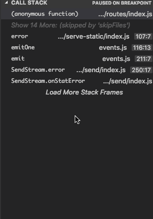

### Improved Loaded Scripts view

In this milestone, we updated the **Loaded Scripts** view to support file icons and added the capability to show **related resources** as child elements. Debug extensions can use this feature to show the source file(s) that were transpiled into a script.

The following picture from the Node.js debugger shows the TypeScript source for JavaScript files (as available in source maps):

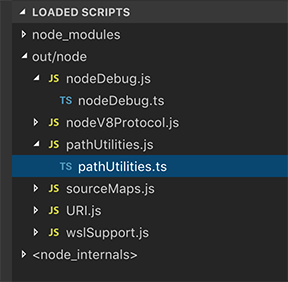

Please note that the related resources feature requires opt-in by debug extensions. In the October release, only `node-debug` has experimental support for this feature for Node.js versions < 8.0 (aka "legacy").

### Multiple debug consoles

When debugging multiple debug sessions, we now show their output in different debug consoles. This makes it easier to distinguish which debug session is responsible for which output and evaluation.

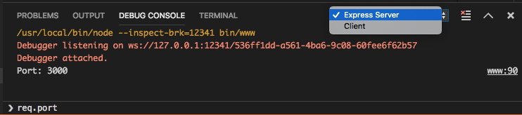

### Start debugging with stop on entry

For Node.js debugging, we have added a new command **Debug: Start Debugging and Stop On Entry** (`extension.node-debug.startWithStopOnEntry`). Use this command if you would like to start debugging and immediately stop on the entry of your program. The default keybinding is `kb(extension.node-debug.startWithStopOnEntry)`. Note that is command is only available if your selected launch configuration is of type `node`.

### Node debugging supports console.log styling

When debugging Node.js (or Chrome using the "Debugger for Chrome" extension), you can now style messages from `console.log` using `%c`, similar to what Chrome DevTools supports. Supported properties are `color`, `background`, `font-weight: bold`, and `text-decoration: underline`.

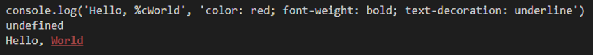

### Breakpoint widget expands to multiple lines

The Breakpoint widget can now expand to multiple lines, use `Shift+Enter` to insert an additional line, or simply paste a multiline condition or log message. This should help when editing more complex conditions and log messages.

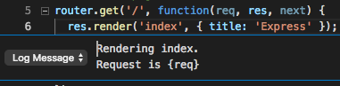

## Languages

### TypeScript 3.1.4

This release includes TypeScript 3.1.4, a small update that [fixes a few important bugs](https://github.com/Microsoft/TypeScript/milestone/81?closed=1).

### Markdown snippet improvements

The built-in Markdown snippets, such as those for links and code blocks, now use the currently selected text by default. This allows you to [create keybindings](https://code.visualstudio.com/docs/getstarted/keybindings) that turn the currently selected text into a link or header:

```json
{
  "key": "cmd+k",
  "command": "editor.action.insertSnippet",
  "when": "editorTextFocus",
  "args": {
    "langId": "markdown",
    "name": "Insert link"
  }
}
```

### CSS Specificity in hover message

The CSS hover now shows you the CSS [Specificity](https://developer.mozilla.org/en-US/docs/Web/CSS/Specificity).

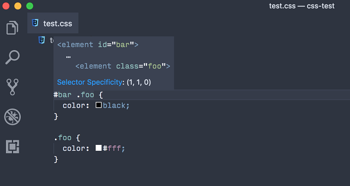

### Handle unknown CSS properties

With CSS pre-processors such as [PostCSS](https://postcss.org), you might use invalid properties that are compiled to valid properties during development time. The `[css/less/scss].lint.validProperties` setting prevents VS Code from marking those invalid properties as erroneous.

### Improved CSS zero unit warning

CSS now lints [zero units](https://github.com/CSSLint/csslint/wiki/Disallow-units-for-zero-values#rule-details) used in CSS shorthand property values. For example, `0px` will now cause a warning:

```css
.foo {
  outline: black 0px solid;
}
```

### Graceful handling of JSON schema loading error

If VS Code is unable to download a JSON schema used for IntelliSense or error-checking JSON files, a warning will be shown in the Status Bar:

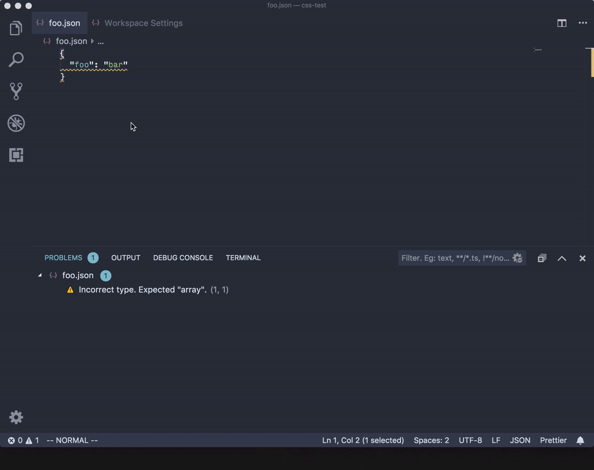

In the past, you would have seen an error in the editor.

## Engineering

### Continued Electron 3.0 exploration

During this milestone, we continued to explore bundling Electron 3.0.0 into VS Code. This is a major Electron release and comes with Chrome 66 and Node.js 10.x (a major leap forward compared to our current version that has Chrome 61 and Node.js 8.x). We plan to push out the update to our Insiders users in the near future to gather additional feedback. If you are interested in helping out, make sure to install VS Code [Insiders](https://code.visualstudio.com/insiders).

### Strict null checking core VS Code

This milestone, we also [started work](https://github.com/Microsoft/vscode/issues/60565) to enable TypeScript's [strict null checks](https://www.typescriptlang.org/docs/handbook/basic-types.html#null-and-undefined) in the core VS Code source. Strict null checks help catch many common programming mistakes and make the intent of the programmer more explicit. We've seen clear benefits using strict null checks for VS Code's built-in extensions.

Since VS Code's [core source](https://github.com/Microsoft/vscode/tree/master/src) contains several thousand files, we are adopting strict null checking incrementally. We started by strict null checking files that have no imports and are now iteratively enabling strict null checks in files that only import other strict null checked files. This will continue until the entire code base is converted.

Enabling strict null checks is a major engineering effort but we think the payoff in terms of source code and product quality will be worth it. You can track our strict null checking progress [here](https://github.com/Microsoft/vscode/issues/60565).

## Miscellaneous

### Low contrast menu bar

If you are using Ubuntu 18.10 or a GTK theme that mixes light or dark context menus with the opposite theming for the application menu bar, you may experience a low contrast menu bar that is difficult to read.

There are two possible workarounds for this:

* Try out the VS Code custom title bar style by configuring the setting `window.titleBarStyle` to `custom`.
* Change your GTK theme. You can do this by installing the Gnome Tweaks application and using the previous default theme `Adwaita`.

Information on this issue can be tracked in issue [62593](https://github.com/Microsoft/vscode/issues/62593).

### Electron update

In this release, we updated from Electron 2.0.9 to 2.0.12.

## Preview Features

Preview features are not ready for release but are functional enough to use. We welcome your early feedback while they are under development.

### References View

There is a new command **Find All References**, which displays a dedicated Side Bar view showing reference search results. This complements the existing Peek view presentation and provides a more stable list of references. In the context menu, select **Find All References** (`kb(references-view.find)`) and references are shown in a separate view, just like search results.


Results are stable and individual results can be cleared, which is great if you use the view as a To Do list. You can use `kb(references-view.next)` and `kb(references-view.prev)` to navigate through results without taking your hands off the keyboard.

Let us know what you think and we'll be refining the experience in our next update.

## Extension Authoring

### Normalized extension samples

The VS Code extension samples at [vscode-extension-samples](https://github.com/Microsoft/vscode-extension-samples) have been updated for consistency.

Each extension sample now includes:

* Uniform coding style and structure.
* A README that explains the sample's functionality with a short animation.
* A listing of the `vscode` API or Contribution Points used in each sample.

### Bundling extensions

Bundled extensions load faster. We therefore created a sample that shows how to [webpack an extension](
https://github.com/Microsoft/vscode-extension-samples/blob/master/webpack-sample/README.md).

### Develop extensions without requiring a publisher

In an effort to simplify initial extension development, the `publisher` field was removed from the [Yeoman Extension Generator](https://code.visualstudio.com/docs/extensions/yocode) template. For extensions without a `publisher` identifier, VS Code now loads them with `undefined_publisher` as their publisher. However, the `vsce` publishing tool will warn you if you are missing a valid publisher when attempting to publish extensions to the Marketplace.

### Active terminal APIs

The proposed APIs that give access to the active terminal, `window.activeTerminal` and `window.onDidChangeActiveTerminal`, are now stable.

### Notifications with buttons hide after a timeout

If your extension is using the `showInformationMessage` or `showWarningMessage` API with the non-modal option and buttons, note that these notifications will now hide after a certain timeout. Only notifications triggered via `showErrorMessage` and having buttons will stay open as before. If you must get immediate input from the user or need to show a message prominently, you can still use `modal: true` as an option. This will bring up a modal dialog that blocks the user from doing anything until dismissed. We do however discourage overuse of this option because it interrupts the user.

### Custom views: Expand revealed elements

You can now expand an element to reveal using the `expand` option in the `reveal` API. It also supports recursively expanding child elements by passing the number of levels.

**NOTE:** You can only expand to a maximum of 3 levels.

```typescript
/**
 * Reveals the given element in the tree view.
 * If the tree view is not visible then the tree view is shown and element is revealed.
 *
 * By default revealed element is selected.
 * In order to not to select, set the option `select` to `false`.
 * In order to focus, set the option `focus` to `true`.
 * In order to expand the revealed element, set the option `expand` to `true`. To expand recursively set `expand` to the number of levels to expand.
 * **NOTE:** You can expand only to 3 levels maximum.
 *
 * **NOTE:** [TreeDataProvider](#TreeDataProvider) is required to implement [getParent](#TreeDataProvider.getParent) method to access this API.
 */
reveal(element: T, options?: { select?: boolean, focus?: boolean, expand?: boolean | number }): Thenable<void>;
```

### New theme colors

There are new theme colors:

* `tab.activeModifiedBorder`: Border on the top of modified (dirty) active tabs in an active group.
* `tab.inactiveModifiedBorder`: Border on the top of modified (dirty) inactive tabs in an active group.
* `tab.unfocusedActiveModifiedBorder`: Border on the top of modified (dirty) active tabs in an unfocused group.
* `tab.unfocusedInactiveModifiedBorder`: Border on the top of modified (dirty) inactive tabs in an unfocused group.
* `editor.stackFrameHighlightBackground`: Background color of the top debug stack frame highlight in the editor. By default this color is yellow.
* `editor.focusedStackFrameHighlightBackground`: Background color of the focused debug stack frame highlight in the editor. By default this color is green.

### Git extension API additions

The [Git extension API](https://github.com/Microsoft/vscode/blob/master/extensions/git/src/api/git.d.ts) has been updated to expose details on the actual [changes](https://github.com/Microsoft/vscode/blob/ae5b8fb1978bfb595ec4821af0d61d32d80a177c/extensions/git/src/api/git.d.ts#L80:L91) each repository has.

Additionally, the following methods have been exposed:

* [`push`](https://github.com/Microsoft/vscode/blob/ae5b8fb1978bfb595ec4821af0d61d32d80a177c/extensions/git/src/api/git.d.ts#L155)
* [`detectObjectType`](https://github.com/Microsoft/vscode/blob/ae5b8fb1978bfb595ec4821af0d61d32d80a177c/extensions/git/src/api/git.d.ts#L124)
* [`buffer`](https://github.com/Microsoft/vscode/blob/ae5b8fb1978bfb595ec4821af0d61d32d80a177c/extensions/git/src/api/git.d.ts#L125)
* [`clean`](https://github.com/Microsoft/vscode/blob/ae5b8fb1978bfb595ec4821af0d61d32d80a177c/extensions/git/src/api/git.d.ts#L129)

### Using Azure Pipelines for extension CI

We've updated our documentation on [how to setup a continuous integration solution for your extension](https://code.visualstudio.com/docs/extensions/testing-extensions#_continuous-integration) using Azure Pipelines. The new guide provides a configuration with which you can run your extension tests simultaneously on Windows, macOS and Linux.

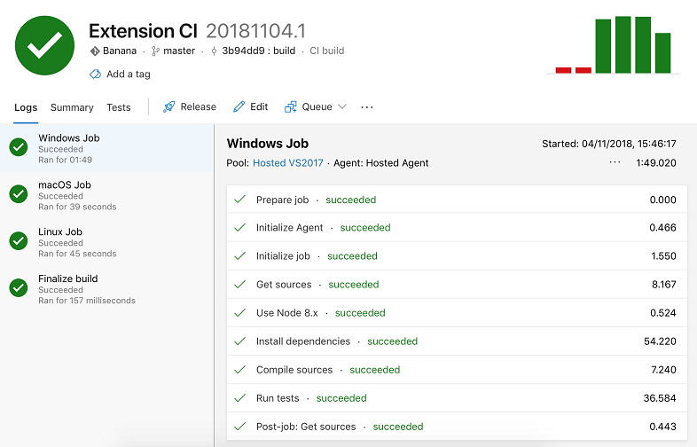

## Proposed Extension APIs

Every milestone comes with new proposed APIs and extension authors can try them out. As always we are keen on your feedback. This is what you have to do to try out a proposed API:

* You must use Insiders because proposed APIs change frequently.
* You must have this line in the `package.json` file of your extension: `"enableProposedApi": true`.
* Copy the latest version of the [`vscode.proposed.d.ts`](https://github.com/Microsoft/vscode/blob/master/src/vs/vscode.proposed.d.ts) file into your project.

Note that you cannot publish an extension that uses a proposed API. We may likely make breaking changes in the next release and we never want to break existing extensions.

### Clipboard API

We have a proposed API to access the clipboard. It follows the up-coming browser [Clipboard](https://developer.mozilla.org/docs/Web/API/Clipboard) API and currently allows reading and writing of text:

```typescript
export interface Clipboard {
  readText(): Thenable<string>;
  writeText(value: string): Thenable<void>;
}
export namespace env {
  const clipboard: Clipboard;
}
```

### Completion text insert rules

There is a new proposed API to modify the insert behavior of completion items. By default, multiline completions get 're-formatted' to match in the indentation of the current line. Sometimes this indentation is unwanted and the new proposed API allows a completion to turn it off. `CompletionItemInsertTextRule` is a bitmask that has a `KeepWhitespace` rule that a completion can set.

### Custom views

**Collapse All action**

You can add **Collapse All** action to your view by just setting `showCollapseAll` option to `true` while creating the `TreeView`.

```typescript
/**
 * Options for creating a [TreeView](#TreeView]
 */
export interface TreeViewOptions<T> {

    /**
     * A data provider that provides tree data.
     */
    treeDataProvider: TreeDataProvider<T>;

    /**
     * Whether to show collapse all action or not.
     */
    showCollapseAll?: boolean;
}

namespace window {

    export function createTreeView<T>(viewId: string, options: TreeViewOptions<T>): TreeView<T>;

}
```

VS Code provides the **Collapse All** functionality and shows it with same icon and location for all opted-in views.

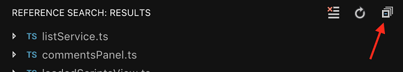

**TreeItem label highlights**

You can highlight the `TreeItem` label by providing ranges using the `highlights` option. Since it is a proposed API, you have to use `TreeItem2` to update highlights.

```typescript
/**
 * Label describing the [Tree item](#TreeItem)
 */
export interface TreeItemLabel {

    /**
     * A human-readable string describing the [Tree item](#TreeItem).
     */
    label: string;

    /**
     * Ranges in the label to highlight. A range is defined as a tuple of two number where the
     * first is the inclusive start index and the second the exclusive end index
     */
    highlights?: [number, number][];

}

export class TreeItem2 extends TreeItem {
    /**
     * Label describing this item. When `falsy`, it is derived from [resourceUri](#TreeItem.resourceUri).
     */
    label?: string | TreeItemLabel | /* for compilation */ any;

    /**
     * @param label Label describing this item
     * @param collapsibleState [TreeItemCollapsibleState](#TreeItemCollapsibleState) of the tree item. Default is [TreeItemCollapsibleState.None](#TreeItemCollapsibleState.None)
     */
    constructor(label: TreeItemLabel, collapsibleState?: TreeItemCollapsibleState);
}
```

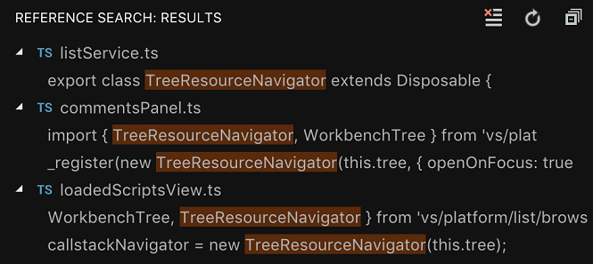

### Hide Source Control input box

There is a new proposed API property on `SourceControlInputBox` instances which will let you hide the input box at the top of a source control provider UI view.

```typescript
export interface SourceControlInputBox {

    /**
    * Controls whether the input box is visible (default is  true`).
    */
    visible: boolean;
}
```

### SignatureHelpContext

The [proposed](https://github.com/Microsoft/vscode/issues/54972) `SignatureHelpContext` gives `SignatureHelpProviders` additional information about why signature help was requested:

```typescript
export interface SignatureHelpProvider {
  provideSignatureHelp(document: TextDocument, position: Position, token: CancellationToken, context: SignatureHelpContext): ProviderResult<SignatureHelp>;
}
```

The `SignatureHelpContext` includes:

* What action caused signature help to be triggered
* The trigger character (if any)
* Was this was a re-trigger? (signature help was already showing)

```typescript
/**
 * Contains additional information about the context in which a
 * [signature help provider](#SignatureHelpProvider.provideSignatureHelp) is triggered.
 */
export interface SignatureHelpContext {
  /**
   * Action that caused signature help to be requested.
   */
  readonly triggerReason: SignatureHelpTriggerReason;

  /**
   * Character that caused signature help to be requested.
   *
   * This is `undefined` when signature help is not triggered by typing, such as when invoking signature help
   * or when moving the cursor.
   */
  readonly triggerCharacter?: string;

  /**
   * Whether or not signature help was previously showing when triggered.
   *
   * Retriggers occur when the signature help is already active and can be caused by typing a trigger character
   * or by a cursor move.
   */
  readonly isRetrigger: boolean;
}

/**
 * How a [Signature provider](#SignatureHelpProvider) was triggered
 */
export enum SignatureHelpTriggerReason {
  /**
   * Signature help was invoked manually by the user or by a command.
   */
  Invoke = 1,

  /**
   * Signature help was triggered by a trigger character.
   */
  TriggerCharacter = 2,

  /**
   * Signature help was triggered by the cursor moving or by the document content changing.
   */
  ContentChange = 3,
}
```

Additionally, the proposal allows `SignatureHelpProvider` to be registered with a set of `triggerCharacters` and a distinct set of `retriggerCharacters`:

```typescript

export interface SignatureHelpProviderMetadata {
  readonly triggerCharacters: ReadonlyArray<string>;
  readonly retriggerCharacters: ReadonlyArray<string>;
}

namespace languages {
  export function registerSignatureHelpProvider(
    selector: DocumentSelector,
    provider: SignatureHelpProvider,
    metadata: SignatureHelpProviderMetadata
  ): Disposable;
}
```

`retriggerCharacters` only cause a signature help provider to be invoked if signature help is already showing.

## Contributions to Extensions

Our team maintains or contributes to a number of VS Code extensions. Most notably this month:

### Go

Below are some of the key features the [Go](https://marketplace.visualstudio.com/items?itemName=ms-vscode.Go) extension now supports when you use the new [Go modules](https://github.com/golang/go/wiki/Modules) in Go 1.11:

* Code navigation (Go to Definition, Signature Help, Symbol info on hover)
* Code completion
* Code coverage
* Code diagnostics
* Package related commands like **Go: Add Import** and **Go: Browse Packages**

For more details, please read the wiki on the [Go modules support in Visual Studio Code](https://github.com/Microsoft/vscode-go/wiki/Go-modules-support-in-Visual-Studio-Code).

Other notable features in the Go extension are:

* Language Server from Sourcegraph is now supported in Windows as well.
* The auto completion widget now shows documentation for the suggested symbols. Press `kb(editor.action.triggerSuggest)` to expand/collapse the details section of the auto-completion widget.
* Auto-completion is now supported when cross-compiling. This is especially helpful when you are trying out the new [WebAssembly support](https://github.com/golang/go/wiki/WebAssembly) in Go 1.11.
* Context menu with **Copy Value**, **Copy as expression** and **Add to Watch** options are now available in the Variables pane of the Debug view.
* Option to lint just the current file on file save.

### TypeScript TSLint plugin

The new [TypeScript TSLint plugin](https://github.com/Microsoft/typescript-tslint-plugin) enables TSLint as a TypeScript language service plugin. These plugins work in any editor that uses the TypeScript language service including VS Code, Visual Studio, Atom, and Sublime Text.

We've also shipped [an extension](https://marketplace.visualstudio.com/items?itemName=ms-vscode.vscode-typescript-tslint-plugin) that bundles the TypeScript TSLint plugin so that you don't have to configure the plugin in your workspace.

### GitHub Pull Requests

This milestone we worked on improvements to the [GitHub Pull Requests](https://marketplace.visualstudio.com/items?itemName=GitHub.vscode-pull-request-github) extension. The extension now supports editing and deleting comments, both within the editor and on the description page, and has better caching for comments that are not yet submitted. You can read the full release notes for the extension [here](https://github.com/Microsoft/vscode-pull-request-github/releases).

## New Documentation

### Deploy Python tutorials

There are two new Python tutorials showing how to deploy Python web applications with VS Code.

* [Deploy Python using Docker containers](https://code.visualstudio.com/docs/python/tutorial-deploy-containers)
* [Deploy Python using Azure App Service](https://code.visualstudio.com/docs/python/tutorial-deploy-app-service-on-linux)

### Debugging recipes

There are new VS Code debugging [recipes](https://github.com/Microsoft/vscode-recipes) for [PHP](https://github.com/Microsoft/vscode-recipes/tree/master/PHP), [Python](https://github.com/Microsoft/vscode-recipes/tree/master/debugging%20python), and [Ruby on Rails](https://github.com/Microsoft/vscode-recipes/tree/master/debugging-Ruby-on-Rails).

## Notable Fixes

* [54214](https://github.com/Microsoft/vscode/issues/54214): startDebugging method in vscode still return true even when the build fails
* [57289](https://github.com/Microsoft/vscode/issues/57289): Settings UI should remember its search on reload
* [57321](https://github.com/Microsoft/vscode/issues/57321): Show "Clear Search" and "Clear Filters" buttons when settings search returns no results
* [59305](https://github.com/Microsoft/vscode/issues/59305): Show a "Open Workspace" button in .code-workspace files
* [59430](https://github.com/Microsoft/vscode/issues/59430): Can no longer break in node internals files
* [61711](https://github.com/Microsoft/vscode/issues/61711): All breakpoints are unverified
* [62085](https://github.com/Microsoft/vscode/issues/62085): PauseRequest not being received by the debugAdapter
* [62346](https://github.com/Microsoft/vscode/issues/62346): Can't cancel a debug session while it's initializing
* [62354](https://github.com/Microsoft/vscode/issues/62354): Remote debugging issues after Node 10.12

## Thank You

Last but certainly not least, a big *__Thank You!__* to the following folks that helped to make VS Code even better:

Contributions to `vscode`:

* [Agustín Rodríguez (@agurodriguez)](https://github.com/agurodriguez)
  * stop duplicating actions for tabs management when using macOS native tabs [PR #59793](https://github.com/Microsoft/vscode/pull/59793)
  * remove extra margins on completion hovers with markdown [PR #59786](https://github.com/Microsoft/vscode/pull/59786)
* [Ahmed Atito (@atitoa93)](https://github.com/atitoa93)
  * Support C# in markdown preview code block syntax highlighting. [PR #61291](https://github.com/Microsoft/vscode/pull/61291)
  * Update status bar when opening a binary file as text [PR #59914](https://github.com/Microsoft/vscode/pull/59914)
* [Robert Balent (@balent)](https://github.com/balent)
  * Scrolling zoom is reversed if image viewer doesn't have focus [PR #61222](https://github.com/Microsoft/vscode/pull/61222)
  * Fixing image viewer zoom [PR #61198](https://github.com/Microsoft/vscode/pull/61198)
* [Anurag Banerjee (@banuragprdxn)](https://github.com/banuragprdxn): Rewording / copy change [PR #60996](https://github.com/Microsoft/vscode/pull/60996)
* [Brett Larney (@bblarney)](https://github.com/bblarney): fixed documentation typo: 'guardeed' -> 'guaranteed' [PR #61186](https://github.com/Microsoft/vscode/pull/61186)
* [@benjamenhogben](https://github.com/benjamenhogben)
  * Add throwable to php try/catch block snippet [PR #60012](https://github.com/Microsoft/vscode/pull/60012)
  * add php try catch snippet [PR #59979](https://github.com/Microsoft/vscode/pull/59979)
* [Alex Boyko (@BoykoAlex)](https://github.com/BoykoAlex): Open symbol handler for http/https conditional on the mode [PR #61509](https://github.com/Microsoft/vscode/pull/61509)
* [Brendon Crawford (@brendoncrawford)](https://github.com/brendoncrawford): Fixes tests error with faulty OS check when Fedora [PR #60917](https://github.com/Microsoft/vscode/pull/60917)
* [Chris Sinco (@c5inco)](https://github.com/c5inco): Snap font stack to latest [PR #61419](https://github.com/Microsoft/vscode/pull/61419)
* [Emil Hessman (@ceh)](https://github.com/ceh): Remove duplicate switch case [PR #59677](https://github.com/Microsoft/vscode/pull/59677)
* [Joshua (@cookiej91)](https://github.com/cookiej91): Fixed typo in comment [PR #61909](https://github.com/Microsoft/vscode/pull/61909)
* [Daksh (@DakshMiglani)](https://github.com/DakshMiglani)
  * guaranteed instead of guardeed [PR #61303](https://github.com/Microsoft/vscode/pull/61303)
  * whether instead of wheter [PR #61304](https://github.com/Microsoft/vscode/pull/61304)
* [Dick van den Brink (@DickvdBrink)](https://github.com/DickvdBrink): Fixed warning when installing on debian 8 [PR #59406](https://github.com/Microsoft/vscode/pull/59406)
* [Jonathan Dierksen (@dierksen)](https://github.com/dierksen): Use textmate/swift.tmbundle for Swift syntax. [PR #59639](https://github.com/Microsoft/vscode/pull/59639)
* [Douglas Gabriel (@douglasgabriel)](https://github.com/douglasgabriel): Removing dead code from 'build/monaco/api.ts' [PR #60024](https://github.com/Microsoft/vscode/pull/60024)
* [Frieder Bluemle (@friederbluemle)](https://github.com/friederbluemle): Fix whitespace errors in markdown files [PR #62299](https://github.com/Microsoft/vscode/pull/62299)
* [Gary Mathews (@garymathews)](https://github.com/garymathews): Fix explorer inputbox alignment [PR #60539](https://github.com/Microsoft/vscode/pull/60539)
* [Guillaume Poussel (@gpoussel)](https://github.com/gpoussel): Fix 'null' tooltips on Quick Open view [PR #62268](https://github.com/Microsoft/vscode/pull/62268)
* [Len Smith (@ignu)](https://github.com/ignu): Add window.nonNativeFullscreen option for macOS [PR #55267](https://github.com/Microsoft/vscode/pull/55267)
* [Ilya Biryukov (@IlyaBiryukov)](https://github.com/IlyaBiryukov)
  * Add APIs to git scc provider. [PR #60048](https://github.com/Microsoft/vscode/pull/60048)
  * Allow scc providers hide commit input box. [PR #60051](https://github.com/Microsoft/vscode/pull/60051)
* [joan xie (@infinnie)](https://github.com/infinnie)
  * Minor style updates [PR #60304](https://github.com/Microsoft/vscode/pull/60304)
  * Inactive tab foreground (#61106) [PR #61187](https://github.com/Microsoft/vscode/pull/61187)
* [Matt Q (@irrationalRock)](https://github.com/irrationalRock): Emmet Syntax Profiles tag_nl produces no extra space [PR #60108](https://github.com/Microsoft/vscode/pull/60108)
* [John Graham (@J-Graham)](https://github.com/J-Graham): Middle clicking files in breadcrumbs explorer opens … [PR #59797](https://github.com/Microsoft/vscode/pull/59797)
* [Jason Bright (@jgbright)](https://github.com/jgbright): Open Workspace button in .code-workspace files [PR #59586](https://github.com/Microsoft/vscode/pull/59586)
* [Kai Wood (@kaiwood)](https://github.com/kaiwood): Fix typo in code comment [PR #62282](https://github.com/Microsoft/vscode/pull/62282)
* [karan verma (@karanisverma)](https://github.com/karanisverma):enablePreview description change [PR #61603](https://github.com/Microsoft/vscode/pull/61603)
* [Karl Schärlund (@kscharlund)](https://github.com/kscharlund): Support odd indentation sizes (fixes #17639) [PR #59568](https://github.com/Microsoft/vscode/pull/59568)
* [Kyra (@kyranet)](https://github.com/kyranet): snippets: Add setInterval snippet [PR #61351](https://github.com/Microsoft/vscode/pull/61351)
* [Samuel Attard (@MarshallOfSound)](https://github.com/MarshallOfSound): enable mojave dark mode support [PR #59742](https://github.com/Microsoft/vscode/pull/59742)
* [Maksym Dogadailo (@mdogadailo)](https://github.com/mdogadailo): items in split view are not draggable without separator-border [PR #59830](https://github.com/Microsoft/vscode/pull/59830)
* [Josip Medved (@medo64)](https://github.com/medo64): Correcting minLength and maxLength validation messages [PR #61556](https://github.com/Microsoft/vscode/pull/61556)
* [Prem Kagrani (@michaelscof)](https://github.com/michaelscof): Fixed typos and a word [PR #61171](https://github.com/Microsoft/vscode/pull/61171)
* [Michael Kopf (@Michel73)](https://github.com/Michel73): Prefill quick open [PR #55752](https://github.com/Microsoft/vscode/pull/55752)
* [Mine Starks (@minestarks)](https://github.com/minestarks): Support configuring TypeScript plugins [PR #61756](https://github.com/Microsoft/vscode/pull/61756)
* [Matthew J. Clemente (@mjclemente)](https://github.com/mjclemente): Fix broken links in vscode namespace API [PR #61651](https://github.com/Microsoft/vscode/pull/61651)
* [mnikn (@mnikn)](https://github.com/mnikn): Add accept all incoming or current changes in popup-menu. [PR #53649](https://github.com/Microsoft/vscode/pull/53649)
* [Matthew Knox (@mrkno)](https://github.com/mrkno): Problems view filters have massive delay [PR #60080](https://github.com/Microsoft/vscode/pull/60080)
* [Niclas van Eyk (@NiclasvanEyk)](https://github.com/NiclasvanEyk): Added actions from #57321 to the 'No Settings Found'-message [PR #59739](https://github.com/Microsoft/vscode/pull/59739)
* [Nick Schonning (@nschonni)](https://github.com/nschonni)
  * typo: Double word "as" [PR #61402](https://github.com/Microsoft/vscode/pull/61402)
  * typo: Double word "Show" [PR #61403](https://github.com/Microsoft/vscode/pull/61403)
  * typo: Double word "for" [PR #61404](https://github.com/Microsoft/vscode/pull/61404)
  * typo: Double word "text" [PR #61400](https://github.com/Microsoft/vscode/pull/61400)
  * typo: Double word "is" [PR #61398](https://github.com/Microsoft/vscode/pull/61398)
* [Olivier Truong (@oltruong)](https://github.com/oltruong): typo fix [PR #62196](https://github.com/Microsoft/vscode/pull/62196)
* [@orangegrove1955](https://github.com/orangegrove1955): Corrected typo in comments [PR #61216](https://github.com/Microsoft/vscode/pull/61216)
* [Karthikayan (@ParkourKarthik)](https://github.com/ParkourKarthik): include priority in requestItem and add to request queue [PR #60582](https://github.com/Microsoft/vscode/pull/60582)
* [Antoine (@Poke1650)](https://github.com/Poke1650): Add missing ending periods in comments. [PR #61827](https://github.com/Microsoft/vscode/pull/61827)
* [Maxime Guerreiro (@PunKeel)](https://github.com/PunKeel): Removed duplicate "the" from documentation. [PR #59897](https://github.com/Microsoft/vscode/pull/59897)
* [Roni Hacohen (@ronihcohen)](https://github.com/ronihcohen): Adding Pascal case to snippet format options [PR #59758](https://github.com/Microsoft/vscode/pull/59758)
* [Roy Tang (@roytang)](https://github.com/roytang): Format selection keyboard shortcut will … [PR #61206](https://github.com/Microsoft/vscode/pull/61206)
* [Ryan Clarke (@ryanclarke)](https://github.com/ryanclarke): Add sort option for breadcrumb symbol trees [PR #61420](https://github.com/Microsoft/vscode/pull/61420)
* [Sankt Petersbug (@sankt-petersbug)](https://github.com/sankt-petersbug): Fix Markdown Preview incorrectly encodes a link [PR #61530](https://github.com/Microsoft/vscode/pull/61530)
* [Prabhanjan S Koushik (@skprabhanjan)](https://github.com/skprabhanjan)
  * Terminal:SelectBox: Terminal select box should have main ARIA label [PR #61466](https://github.com/Microsoft/vscode/pull/61466)
  * Respect global .gitignore when searching [PR #59717](https://github.com/Microsoft/vscode/pull/59717)
* [Tharun Jose (@tharunjose)](https://github.com/tharunjose): Update README.md [PR #60100](https://github.com/Microsoft/vscode/pull/60100)
* [Marcus Farkas (@ToothlessGear)](https://github.com/ToothlessGear): Add setting to allow to disable Replace Preview [PR #60153](https://github.com/Microsoft/vscode/pull/60153)
* [Stepan Usatyuk (@usaatyuk)](https://github.com/usaatyuk): Persist settings search when reloaded [PR #59704](https://github.com/Microsoft/vscode/pull/59704)
* [Alexander (@usernamehw)](https://github.com/usernamehw)
  * Add border for dirty tabs [PR #59759](https://github.com/Microsoft/vscode/pull/59759)
  * Align badge theming with the GUI badge [PR #61965](https://github.com/Microsoft/vscode/pull/61965)
  * Use hover link color in Settings GUI [PR #61978](https://github.com/Microsoft/vscode/pull/61978)
* [Varan Shukla (@varanshukla)](https://github.com/varanshukla): Fixed spelling mistakes [PR #61789](https://github.com/Microsoft/vscode/pull/61789)
* [Jeremy Shore (@w9jds)](https://github.com/w9jds)
  * Allows clicking of Modified In labels in setting editor view [PR #60045](https://github.com/Microsoft/vscode/pull/60045)
  * Handle accessibility events on "Open Settings" link in searchview [PR #60058](https://github.com/Microsoft/vscode/pull/60058)
* [Konrad Borowski (@xfix)](https://github.com/xfix): Add a semicolon at end of non-built-in languages list [PR #62284](https://github.com/Microsoft/vscode/pull/62284)
* [Literallie (@xxyy)](https://github.com/xxyy): Less distracting error message for JSON schema resolution issues [PR #60219](https://github.com/Microsoft/vscode/pull/60219)
* [sk (@yeahok)](https://github.com/yeahok): Fix R icon size [PR #59891](https://github.com/Microsoft/vscode/pull/59891)
* [Yisrael Veller (@YisraelV)](https://github.com/YisraelV): multiline breakpoint widget - implementing #56521 [PR #61859](https://github.com/Microsoft/vscode/pull/61859)
* [Richard Harlen (@zimbo73)](https://github.com/zimbo73): Update src/vs/workbench/services/files/electron-browser/fileService.ts [PR #62296](https://github.com/Microsoft/vscode/pull/62296)

Contributions to `vscode-eslint`:

* [Loune Lam (@loune)](https://github.com/loune): Added Suppress rule for this line / Suppress rule for file quick actions / Show documentation [PR #530](https://github.com/Microsoft/vscode-eslint/pull/530)
* [Nguyen Long Nhat (@torn4dom4n)](https://github.com/torn4dom4n): Update Variables Reference [#553](https://github.com/Microsoft/vscode-eslint/pull/553)
* [David Broder-Rodgers (@broder)](https://github.com/broder): Fix some typos in eslintServer [PR #555](https://github.com/Microsoft/vscode-eslint/pull/555)

Contributions to `vscode-languageserver-node`:

* [Vic Nightfall (@Victorious3)](https://github.com/Victorious3): Spelling error in exception [PR #419](https://github.com/Microsoft/vscode-languageserver-node/pull/419)
* [Chris Wendt (@chrismwendt)](https://github.com/chrismwendt): Fix examples in the README [PR #428](https://github.com/Microsoft/vscode-languageserver-node/pull/428)
* [Thibaud Colas (@thibaudcolas)](https://github.com/thibaudcolas): Update version in lockfile to match package.json [PR #431](https://github.com/Microsoft/vscode-languageserver-node/pull/431)

Contributions to `language-server-protocol`:

* [Tobias Bieniek (@Turbo87)](https://github.com/Turbo87): overview: Fix example response id [PR #575](https://github.com/Microsoft/language-server-protocol/pull/575)
* [Jonathan Yee (@jonyeezs)](https://github.com/jonyeezs): Readme: Use comma to make list more readable [PR #578](https://github.com/Microsoft/language-server-protocol/pull/578)
* [Lewis Cowper (@lewiscowper)](https://github.com/lewiscowper): Turn headers into hyperlinks (website) [PR #577](https://github.com/Microsoft/language-server-protocol/pull/577)
* [Remy Suen (@rcjsuen)](https://github.com/rcjsuen): Correct typo in request name [PR #589](https://github.com/Microsoft/language-server-protocol/pull/589)
* [@fghzxm](https://github.com/fghzxm): Fix broken parentheses [PR #590](https://github.com/Microsoft/language-server-protocol/pull/590)

Contributions to `vscode-html-languageservice`:

* [@AHKol](https://github.com/AHKol): Fix 58693 [PR #38](https://github.com/Microsoft/vscode-html-languageservice/pull/38)

Contributions to `vscode-css-languageservice`:

* [Will Bender (@Ragnoroct)](https://github.com/Ragnoroct): Show specificity in a css selector hover. [PR #129](https://github.com/Microsoft/vscode-css-languageservice/pull/129)
* [Richard Samuelson (@ricsam)](https://github.com/ricsam): Remove package-lock.json [PR #125](https://github.com/Microsoft/vscode-css-languageservice/pull/125)
* [Thomas Lent (@tlent)](https://github.com/tlent)
  * Rename specificity label and add a link to MDN [PR #131](https://github.com/Microsoft/vscode-css-languageservice/pull/131)
  * Add parentheses around specificity values [PR #130](https://github.com/Microsoft/vscode-css-languageservice/pull/130)

Contributions to `vscode-json-languageservice`:

* [Debasish Sahoo (@debck)](https://github.com/debck): add license badge to readme [PR #31](https://github.com/Microsoft/vscode-json-languageservice/pull/31)
* [Flo Edelmann (@FloEdelmann)](https://github.com/FloEdelmann): Don't wrap in array and object completions [PR #29](https://github.com/Microsoft/vscode-json-languageservice/pull/29)
* [Levertion (@Levertion)](https://github.com/Levertion): Use 'if' to create completions [PR #27](https://github.com/Microsoft/vscode-json-languageservice/pull/27)
* [Literallie (@xxyy)](https://github.com/xxyy)
  * Resolve test failure caused by changed error message [PR #33](https://github.com/Microsoft/vscode-json-languageservice/pull/33)
  * More concise error message for schema validation errors [PR #32](https://github.com/Microsoft/vscode-json-languageservice/pull/32)

Contributions to `debug-adapter-protocol`:

* [Igor Kulaychuk (@ayuckhulk)](https://github.com/ayuckhulk): Add NetCoreDbg to Debug Adapter Protocol implementors list [PR #9](https://github.com/Microsoft/debug-adapter-protocol/pull/9)
* [Mario Loriedo (@l0rd)](https://github.com/l0rd): Add Theia among the Dev Tools [PR #10](https://github.com/Microsoft/debug-adapter-protocol/pull/10)
* [Sven Efftinge (@svenefftinge)](https://github.com/svenefftinge): Theia is maintained by Eclipse community [PR #11](https://github.com/Microsoft/debug-adapter-protocol/pull/11)

Contributions to `vscode-debugadapter-node`:

* [Shennie Yao (@Shenniey)](https://github.com/Shenniey)
  * Changing to UTC [PR #203](https://github.com/Microsoft/vscode-debugadapter-node/pull/203)
  * adding timestamp logging to be configurable (turned on by default) [PR #202](https://github.com/Microsoft/vscode-debugadapter-node/pull/202)

Contributions to `vscode-chrome-debug-core`:

* [@digeff](https://github.com/digeff)
  * We adapt to the latest version of Node.js which uses file:/// and we don't send sourceRef for files that exist [PR #373](https://github.com/Microsoft/vscode-chrome-debug-core/pull/373)
  * Fix not hitting BPs on the first line of NTVS unit tests [PR #369](https://github.com/Microsoft/vscode-chrome-debug-core/pull/369)
  * Fix node not hitting breakpoints in network paths [PR #368](https://github.com/Microsoft/vscode-chrome-debug-core/pull/368)
* [@rdegelo](https://github.com/rdegelo)
  * Improving Debug Console Styling. Adding underline and background support [PR #374](https://github.com/Microsoft/vscode-chrome-debug-core/pull/374)
  * Added support for basic color escape sequencies on Debug Console [PR #367](https://github.com/Microsoft/vscode-chrome-debug-core/pull/367)

Contributions to `vscode-generator-code`:

* [Diogo Simões (@s1moe2)](https://github.com/s1moe2): added the option to choose between npm/yarn on the templates that install dependencies [PR #133](https://github.com/Microsoft/vscode-generator-code/pull/133)
* [Randy (@TheQwerty)](https://github.com/TheQwerty): Fix typo: commmand -> command [PR #140](https://github.com/Microsoft/vscode-generator-code/pull/140)

Contributions to `vscode-vsce`:

* [Fabio Spampinato (@fabiospampinato)](https://github.com/fabiospampinato): Added support for the `VSCE_IGNORE_KEYWORDS_LENGTH` environment variable [PR #298](https://github.com/Microsoft/vscode-vsce/pull/298)

Contributions to `vscode-extension-samples`:

* [Eunice Park (@eunicode)](https://github.com/eunicode): Add README to theme-sample [PR #115](https://github.com/Microsoft/vscode-extension-samples/pull/115)

Contributions to `vscode-recipes`:

* [Alistair Chapman (@agc93)](https://github.com/agc93): Add recipe for debugging Cake scripts [PR #168](https://github.com/Microsoft/vscode-recipes/pull/168)
* [Akshay Avinash (@akshay11298)](https://github.com/akshay11298)
  * Added debugging python link in README [PR #170](https://github.com/Microsoft/vscode-recipes/pull/170)
  * Added Python debugging [PR #165](https://github.com/Microsoft/vscode-recipes/pull/165)
* [@amiya-1998](https://github.com/amiya-1998)
  * Update README.md [PR #142](https://github.com/Microsoft/vscode-recipes/pull/142)
  * Update README.md [PR #143](https://github.com/Microsoft/vscode-recipes/pull/143)
  * Update README.md [PR #144](https://github.com/Microsoft/vscode-recipes/pull/144)
* [André Vargas (@andrevargas)](https://github.com/andrevargas): Add instructions for debugging Gatsby.js [PR #160](https://github.com/Microsoft/vscode-recipes/pull/160)
* [Taylor (@ATaylor1181)](https://github.com/ATaylor1181): fixed typos in Ruby On Rails Readme [PR #153](https://github.com/Microsoft/vscode-recipes/pull/153)
* [Calvin Wong (@calvwng)](https://github.com/calvwng): Clarify launch.json step & add Nuxt.js debug link [PR #147](https://github.com/Microsoft/vscode-recipes/pull/147)
* [Cameo Langford (@cameo-myob)](https://github.com/cameo-myob): Updated Debugging Ruby on Rails to fix typos [PR #151](https://github.com/Microsoft/vscode-recipes/pull/151)
* [Cody Condon (@codycc)](https://github.com/codycc): Fix typo in README [PR #139](https://github.com/Microsoft/vscode-recipes/pull/139)
* [@guymcmanusgithub](https://github.com/guymcmanusgithub): Cleaned up the language in the first couple of paragraphs of the READ… [PR #154](https://github.com/Microsoft/vscode-recipes/pull/154)
* [John Hinson (@jlhinson)](https://github.com/jlhinson): Fixed several grammar and spelling issues in the Meteor recipe. [PR #133](https://github.com/Microsoft/vscode-recipes/pull/133)
* [Kirk Clemons (@kcclemo)](https://github.com/kcclemo): Various grammatical changes. [PR #161](https://github.com/Microsoft/vscode-recipes/pull/161)
* [Maddie Kreamer (@maddiekreamer)](https://github.com/maddiekreamer): Spelling errors fixed [PR #167](https://github.com/Microsoft/vscode-recipes/pull/167)
* [Nisaruj (@nisaruj)](https://github.com/nisaruj): Fix some spelling issues [PR #138](https://github.com/Microsoft/vscode-recipes/pull/138)
* [Luiz Machado (@odahcam)](https://github.com/odahcam): Add instructions for PHP [PR #136](https://github.com/Microsoft/vscode-recipes/pull/136)
* [Peter Blazejewicz (@peterblazejewicz)](https://github.com/peterblazejewicz): Angular cli recipe minor changes [PR #134](https://github.com/Microsoft/vscode-recipes/pull/134)
* [@qhieu45](https://github.com/qhieu45): Add "skipFiles" option to README.md & launch.json [PR #164](https://github.com/Microsoft/vscode-recipes/pull/164)
* [Robin Cher (@robincher)](https://github.com/robincher): PR - Adding Mocha Default Test Options  [PR #148](https://github.com/Microsoft/vscode-recipes/pull/148)
* [Sam Warner (@sjwarner-bp)](https://github.com/sjwarner-bp): Update Docker-TpeScript README.md with grammar changes [PR #149](https://github.com/Microsoft/vscode-recipes/pull/149)

Contributions to `inno-updater`:

* [@edawine](https://github.com/edawine): Fix incomplete error message in strings.rs [PR #4](https://github.com/Microsoft/inno-updater/pull/4)
* [Isaac Whitfield (@whitfin)](https://github.com/whitfin): Remove unnecessary allocations when polling for exit [PR #6](https://github.com/Microsoft/inno-updater/pull/6)
* [Jared De La Cruz (@jareddlc)](https://github.com/jareddlc): Make logging more consistent [PR #7](https://github.com/Microsoft/inno-updater/pull/7)

Contributions to `localization`:

There are almost 1400 members in the Transifex [VS Code project](https://aka.ms/vscodeloc) team with about 100 active contributors every month. We appreciate your contributions, either by providing new translations, voting on translations, or suggesting process improvements.

Here is a snapshot of contributors for this release. For details about the project including the contributor name list, visit the project site at [https://aka.ms/vscodeloc](https://aka.ms/vscodeloc).

* **Bosnian:** Dario Fuzinato.
* **Bulgarian:** Любомир Василев.
* **Catalan:** joanmiro pisa.
* **Czech:** Vít Staniček, Kryštof Černý, Michal Franc.
* **Dutch:** Gerald Versluis, Vincent Verbist.
* **English (United Kingdom):** Matthew John Cheetham, Alexander Ogilvie.
* **Finnish:** Petri Niinimäki, Feetu Nyrhinen.
* **French:** Antoine Griffard, Adrien Clerbois.
* **German:** J.M. Rütter, Volkmar Rigo.
* **Greek:** Dimitris Siakavelis, Christos Koutsiaris.
* **Hindi:** Ashwini Gupta, Bimal ., Brahma Dev, Rahul Bhammarker.
* **Hungarian:** Tar Dániel.
* **Chinese Simplified:** Joel Yang, pluwen, Zijian Zhou, Simon Chan.
* **Chinese Traditional:** Duran Hsieh, Poy Chang, Alan Tsai, Kevin Yang, Winnie Lin.
* **Indonesian:** Rizki A. Wibowo, Laurensius Dede Suhardiman, Fahmi Irsyad khairi, Wildan Mubarok, G-RiNe Project, Pratikto Ariestyadi, Joshua Siagian, William Tantiono, Herman Prawiro, Febrian Setianto (Feber), Angger Rafi Akbar, Joseph Aditya P G, Oka bRionZ, rodin.
* **Italian:** Alessandro Alpi, Riccardo Cappello, Marco Dal Pino, Roberto Albano, Andrea Dottor, Luigi Bruno.
* **Japanese:** Shunya Tajima, Yuichi Nukiyama, Satoshi Kajiura, Yoshihisa Ozaki.
* **Kannada:** Sanjay !.
* **Korean:** Kyunghee Ko, Junseong Jang.
* **Lithuanian:** Martynas Jusys.
* **Malayalam:** Ajith S Punalur, Anand Chalakkal Jose Mohan, Kiren Paul.
* **Norwegian Bokmål:** Espen Klein Nilsen.
* **Polish:** Artur, Andrzej Supermocny, Jan Bońkowski, Mateusz Wyczawski, Warchlak.
* **Portuguese (Brazil):** Rodrigo Crespi, Roberto Fonseca, Danilo Dantas, Thiago Aragão, Thiago Moreira de Souza Arrais, Atílio Dadalto, Marcelo Fernandes, Douglas Heydt, Robson Cassiano, Lucas Miranda, Thiago Custodio.
* **Portuguese (Portugal):** Diogo Barros, António Santos, Antonio Lourenco.
* **Russian:** Ivan Kuzmenko, Roman Slauta, Michael Crane.
* **Spanish:** José M. Aguilar, Matias Menich, Alberto Poblacion, Daniel J. Pérez Nieto, Andrés Reyes Galgani.
* **Tamil:** Nadar Solomon Sunder, Sarath Jasrin, Sakthi Raj, rajakvk, Avinash, ஜெகன் லங்கா சாமி துரை, Anand AV, Jeyanthinath Muthuram, Narayanan Singaram.
* **Telugu:** Rama Chandu, Hari Jujjavarapu, Sai Pavan Koundinya Upadhyayula.
* **Ukrainian:** Svitlana Galianova, Borys Lebeda, Dmytro Kyrychuk, Victor Kubrak, Volodymyr Holovka.
* **Urdu:** Haseeb Anwer, Saqib Ameen, Ahmad Awais.
* **Vietnamese:** Thanh Phu, Daniel Nguyen, Nguyễn Nhật Tân, Hung Nguyen, Vuong.

<!-- In-product release notes styles.  Do not modify without also modifying regex in gulpfile.common.js -->
<a id="scroll-to-top" role="button" aria-label="scroll to top" href="#"><span class="icon"></span></a>
<link rel="stylesheet" type="text/css" href="css/inproduct_releasenotes.css"/>
