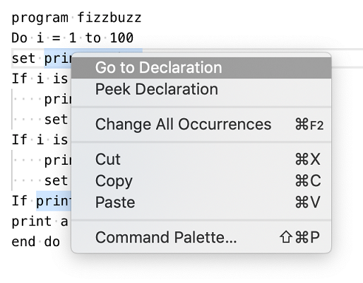
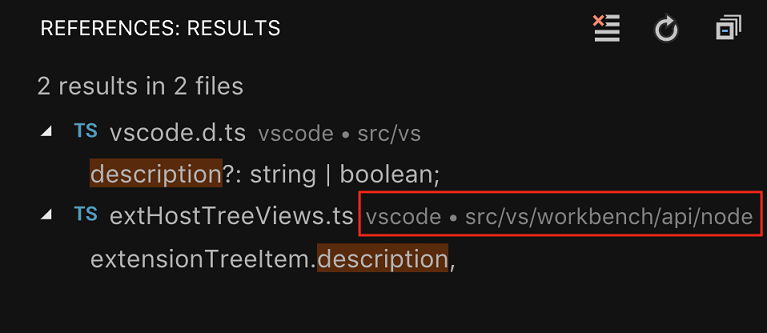
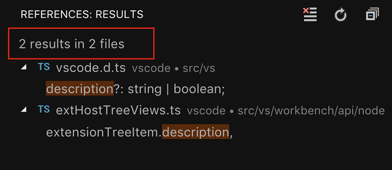

# November 2018 (version 1.30)

<!-- DOWNLOAD_LINKS_PLACEHOLDER -->

## Insiders Release

Welcome to the Insiders build. These are the preliminary notes for the November 1.30 release of Visual Studio Code. As we get closer to the release date, you'll see details below about new features and important fixes.

Until the November release notes are available, you can still track our progress:

* **[November Iteration Plan](https://github.com/Microsoft/vscode/issues/62876)** - See what's planned for the milestone.
* **[Commit Log](https://github.com/Microsoft/vscode/commits/master)** - GitHub commits to the vscode open source repository.
* **[Closed issues](https://github.com/Microsoft/vscode/milestone/81?closed=1)** - Resolved bugs and implemented feature requests in the November milestone.

We really appreciate people taking a look at our new features as soon as they are ready so check back here often and learn what's new to try out.

If you find issues or have suggestions, you can enter them in the VS Code repository on [GitHub](https://github.com/Microsoft/vscode/issues).

## Editor

### Declaration vs. Definition

Until now VS Code offered commands around the definition of a symbol, e.g. "Go to Definition" and "Peek Definition". This neglated the fact that some languages differentiate, stricter than others, between the *declaration* and the *definition* of a symbol. We have now fixed that and there are now command around the declaration of a symbol.



As always, the data for language features like "Go to Declaration" is computed by extensions. Therefore we have added new API, read on in the "Extension Authoring"-section.

### Comment Snippet Variables

There are new snippet-variables that insert line or block comments, honoring the current language. Use `BLOCK_COMMENT_START` and  `BLOCK_COMMENT_END` for block comments and `LINE_COMMENT` otherwise.

The snippet below inserts `/* Hello World */` in JavaScript files and `<!-- Hello World -->` in HTML files

```json
"hello": {
  "scope": "javascript,html",
  "prefix": "hello",
  "body": "$BLOCK_COMMENT_START Hello World $BLOCK_COMMENT_END"
}
```

## Extensions

### Install Versions

You can now go back to a previous version of an extension if there are issues with the current version. VS Code provides an **Install Another Version** action on an installed extension which shows a dropdown of available versions.


### Unresponsive Extension Host

VS Code runs extensions in a separate Node.js process – the extension host. This isolates extension code from VS Code itself, but it doesn’t isolate different extensions from each other. Due to the single threaded nature of JavaScript, an extension can, willingly or not, monopolize the extension host thread, block all other extensions, and make operations appear as unresponsive.

VS Code now monitors the extension host and when it becomes unresponsive it starts to profile it. When an extension is identified as dominating source of the unresponsiveness a minimized noticiation that encourages user to file an issue is shown:


As a *user* keep an eye on the bell icon in the status bar as the notification is minimized, as an *extension author* that has received an issue because of this check this guide: https://github.com/Microsoft/vscode/wiki/Explain:-extension-causes-high-cpu-load. It explains what has happened and how to open the CPU-profile that's attached to the issue.

## Languages

### TypeScript 3.2

<!-- TODO mjbvz -->

### File icons for JavaScript and TypeScript path suggestions

We now show the proper file icons for path suggestions

### Renames now handle JS/TS object shorthand properly

<!-- TODO mjbvz -->

### Improved display of JavaScript and TypeScript callbacks in navigation

JavaScript and TypeScript anonymous callbacks were all previously labeled as `<function>` in the Outline view, breadcrumbs view, and document symbol list. This made it impossible to tell which function you were really after:


With TypeScript 3.2+, VS Code now displays more context for callback functions so that you can tell them apart:


### Highlighting of Markdown elements in JSDoc comments

Fenced code blocks and other Markdown elements inside of JSDoc blocks are now syntax highlighted:


This inline highlighting better matches VS Code's Markdown rendering of JSDocs for hovers and IntelliSense documentation.

## Debugging

### Simplified initial debug configurations
This milestone we have looked into simplifying the generated `launch.json` for our most popular debug extensions. Our goal was to make it easier for users to start and configure debugging. This meant hiding unnecessary launch configuration attributes and using quick pick for better user interaction while generating the initial `launch.json`. More details about this effort can be found [here](https://github.com/Microsoft/vscode/issues/62851).

### Debug consoles can be deleted
As of last milestone when debugging multiple debug sessions we also show multiple debug consoles, one for each session. Now it is possible to delete these consoles when the corresponding session is no longer active by clearing the content of that debug console. We did not add additional commands for managing the lifecycle of a debug console, because we believe the current approach will be more intuitive and easier to use.

## Node/Chrome debugging

- `smartStep` now enabled by default:<BR>
A few months ago we've [changed the behavior](https://code.visualstudio.com/updates/v1_26#_changed-smartstep-behavior-for-nodechrome-debugging) of `smartStep` to make it more useful.
Since `smartStep` results in a much better debugging experience, especially for TS, we have now changed the behavior to be always on.

- Automatic default for `localRoot`:<BR>
In Node.js remote debugging scenarios the debug configuration attribute `localRoot` automatically defaults to `${workspaceFolder}`. So only `remoteRoot` needs to be specified.

## Improved Input variables for Tasks and Debug

We now support collecting basic user inputs with tasks and debug. In both tasks.json and launch.json you can specify string quick inputs and string quick picks as part of your task or launch by adding an `”inputs”` section to the file. To use the input defined in `”inputs”` reference it in your task configuration:

    {
      // See https://go.microsoft.com/fwlink/?LinkId=733558
      // for the documentation about the tasks.json format
      "version": "2.0.0",
      "tasks": [
          {
              "label": "Echo input",
              "type": "shell",
              "command": "echo ${input:echoPrompt} ${input:echoPick}",
          }
      ],
      "inputs":[
          {
              "id": "echoPrompt",
              "description": "Please enter a value",
              "default": "default echo text",
              "type": "promptString",

          },
          {
              "id": "echoPick",
              "description": "Select one of the values",
              "default": "two",
              "type": "pickString",
              "options": ["one", "two", "three"]
          }
      ],
    }

Or launch configuration:

    {
      "version": "0.2.0",
      "configurations": [
          {
              "type": "node",
              "request": "launch",
              "name": "Launch Program",
              "program": "${input:programName}",
          }
      ],
      "inputs": [
          {
              "id": "programName",
              "type": "promptString",
              "default": "test.js",
              "description": "The program name"
          }
      ]
    }

## Tasks

### Run on folder open

If you have a task that you always run when you open a folder, you can configure it to run automatically when that folder is opened by configuring its `"runOn"` property:

        {
            "type": "npm",
            "script": "strict-null-check-watch",
            "label": "TS - Strict Null Checks",
            "isBackground": true,
            "runOptions": {
                "runOn": "folderOpen"
            }
        }

### Clear task terminal

To clear the terminal before executing a task, you can configure the task’s presentation options:

        {
            "type": "gulp",
            "task": "tslint",
            "label": "Run tslint",
            "presentation": {
                "clear": true
            }
        }

### Rerun tasks

Tasks can now be rurun using the Rerun Last Task command. By default, a rerun task will re-evaluate it’s run variables, including it’s inputs. To use the variables that have already been evaluated in the previous run, configure the `"reevaluateOnRerun"` option:

        {
            "type": "gulp",
            "task": "tslint",
            "label": "Run tslint",
            "runOptions": {
                "reevaluateOnRerun": false
            }
        }


## Preview Features

Preview features are not ready for release but are functional enough to use. We welcome your early feedback while they are under development.

### HTML custom tags / attributes support

The new `html.experimental.custom.tags` and `html.experimental.custom.attributes` settings allows you to specify a list of tags and attributes that VS Code loads during startup. When you are editing HTML files, VS Code will offer auto-completion and hover for those tags and attributes. This works great with [Web Components](https://developer.mozilla.org/en-US/docs/Web/Web_Components), for example:


You can open [octref/web-components-examples](https://github.com/octref/web-components-examples) repository to test this feature. This feature is **in preview and both the setting names and JSON format are subject to change**.

If you have feedback or feature requests, please follow up in issue [#62976](https://github.com/Microsoft/vscode/issues/62976).

## Extension Authoring

### Go To Declaration

We have added a `DeclarationProvider`-interface which extensions can implement to support the "Go to Declaration" feature. Declaration providers should return locations that are the declaration of a symbol. When multiple providers are registered for the same file, then their results are merged.

### Configuring contributed TypeScript server plugins

Extensions can now send configuration data to [contributed typescript server plugins](https://code.visualstudio.com/docs/extensionAPI/extension-points#_contributestypescriptserverplugins) through an API provided by VS Code's built-in TypeScript extension:

```typescript
// In your VS Code extension

export async function activate(context: vscode.ExtensionContext) {
    // Get the TS extension
    const tsExtension = vscode.extensions.gettsExtension('vscode.typescript-language-features');
    if (!tsExtension) {
        return;
    }

    await tsExtension.activate();

    // Get the API from the TS extension
    if (!tsExtension.exports || !tsExtension.exports.getAPI) {
        return;
    }

    const api = tsExtension.exports.getAPI(0);
    if (!api) {
        return;
    }

    // Configure the 'my-typescript-plugin-id' plugin
    api.configurePlugin('my-typescript-plugin-id', {
        someValue: process.env['SOME_VALUE']
    });
}
```

The TypeScript server plugin receives the configuration data through an `onConfigurationChanged` method:

```typescript
// In your TypeScript plugin

import * as ts_module from 'typescript/lib/tsserverlibrary';

export = function init({ typescript }: { typescript: typeof ts_module }) {
    return {
        create(info: ts.server.PluginCreateInfo) {
            // Create new language service
        },
        onConfigurationChanged(config: any) {
            // Receive configuration changes sent from VS Code
        },
    };
};
```

This API allows VS Code extensions to synchronize VS Code settings with a TypeScript server plugin, or dynamically change the behavior of a plugin. Take a look at the [TypeScript TSLint plugin](https://github.com/Microsoft/vscode-typescript-tslint-plugin/blob/master/src/index.ts) and [lit-html](https://github.com/mjbvz/vscode-lit-html/blob/master/src/index.ts) extensions to see how this API is used in practice.

### Custom Views

The proposed API for adding a **Collapse All** action to your view is now stable.

**Tree Item Description**

You can now add a description to your tree item using the `description` property in `TreeItem`. If the tree item is backed by a resource, you can also let VS Code derive the description from the resource by setting `description` to `true`.

```typescript
/**
 * A human readable string which is rendered less prominently.
 * When `true`, it is derived from [resourceUri](#TreeItem.resourceUri), and when `falsy`, it is not shown.
 */
description?: string | boolean;
```



### Debugging API

- DebugSession TODO@weinand
- Breakpoints TODO@weinand
- DebugAdapterDescriptorFactory TODO@weinand
- DebugAdapterTracker TODO@weinand
- DAP: runInTerminal.shellProcessId TODO@weinand

### Clipboard

The clipboard API has been finalized and can now be used by all extensions. It allows to copy & paste strings to the OS clipboard.

### Completion Items

When inserting a completion item that spans multiple lines VS Code adjusts the indentation. This is not always wanted and therefore we added `vscode.CompletionItem.keepWhitespace` to control this behaviour.

### Labels for Symbol Providers

When registering a document symbol provider, a label (`DocumentSymbolProviderMetadata`) can now be provided. This label will be showin in breadcrumbs and the outline when a document has multiple symbol providers.

## Proposed Extension APIs

Every milestone comes with new proposed APIs and extension authors can try them out. As always we are keen on your feedback. This is what you have to do to try out a proposed API:

* You must use Insiders because proposed APIs change frequently.
* You must have this line in the `package.json` file of your extension: `"enableProposedApi": true`.
* Copy the latest version of the [`vscode.proposed.d.ts`](https://github.com/Microsoft/vscode/blob/master/src/vs/vscode.proposed.d.ts) file into your project.

Note that you cannot publish an extension that uses a proposed API. We may likely make breaking changes in the next release and we never want to break existing extensions.

### Custom Views

**Tree View Message**

You can now set a message in your tree view using the `message` property in `TreeView`.

```typescript
/**
 * An optional human-readable message that will be rendered in the view.
 */
message?: string | MarkdownString;

```



### Smart Select and Extensions

We have added proposed API to support the smart select feature. Today, when you run the "Expand Select" or "Shrink Select" command, selections ranges are computed based on a weak heuristic. While we are working to improve that heuristic we also want to get extension authors involved. Therefore we have added proposed api for a [`SelectionRangeProvider`](https://github.com/Microsoft/vscode/blob/86571ec5a50b5bce09db45f458b407b77a33674a/src/vs/vscode.proposed.d.ts#L21-L34).


## Engineering

### WinJS-Promise Removal

### Continued Electron 3.0 exploration

During this milestone, we continued to explore bundling Electron 3.0.0 into VS Code. This is a major Electron release and comes with Chrome 66 and Node.js 10.x (a major leap forward compared to our current version that has Chrome 61 and Node.js 8.x). We plan to push out the update to our Insiders users in December to gather additional feedback. If you are interested in helping out, make sure to install VS Code [Insiders](https://code.visualstudio.com/insiders).

## Notable Fixes

* [37929](https://github.com/Microsoft/vscode/issues/37929): do not active debuggers when creating debug env drop down menu
* [60187](https://github.com/Microsoft/vscode/issues/60187): Debugger Won't hit breakpoints in jest test
* [61590](https://github.com/Microsoft/vscode/issues/61590): Make Settings and Keybindings editor consistent in showing editor actions
* [62370](https://github.com/Microsoft/vscode/issues/62370): Improve diagnostics hovers in editor
* [62500](https://github.com/Microsoft/vscode/issues/62500): Add "Run to Cursor" to the command palette
* [62778](https://github.com/Microsoft/vscode/issues/62778): Centered layout does not restore size
* [63618](https://github.com/Microsoft/vscode/issues/63618): Debug Electron 2.0.13 64bit failed with error "Cannot connect to runtime process, timeout after 10000ms". But succeed on Electron 32bit

## Thank You

Last but certainly not least, a big *__Thank You!__* to the following folks that helped to make VS Code even better:

Contributions to `vscode-eslint`:

* [AnguloHerrera (@angulito)](https://github.com/angulito): Improve pipeline [PR #569](https://github.com/Microsoft/vscode-eslint/pull/569)

Contributions to `language-server-protocol`:

* [Jan Keromnes (@jankeromnes)](https://github.com/jankeromnes): Minor improvements: Typos, grammar, wording. [PR #579](https://github.com/Microsoft/language-server-protocol/pull/579)
* [Adolfo Ochagavía (@aochagavia)](https://github.com/aochagavia): Fix typo in specification [PR #597](https://github.com/Microsoft/language-server-protocol/pull/597)

Contributions to `vscode-languageserver-node`:

* [Remy Suen (@rcjsuen)](https://github.com/rcjsuen): Provide metadata about symbols with DefinitionLink [PR #415](https://github.com/Microsoft/vscode-languageserver-node/pull/415)
* [Guillaume Martres (@smarter)](https://github.com/smarter): Add asVersionedTextDocumentIdentifier to the Converter interface [PR #421](https://github.com/Microsoft/vscode-languageserver-node/pull/421)

Contributions to `debug-adapter-protocol`:

* [Danny Tuppeny (@DanTup)](https://github.com/ayuckhulk): Fix link to Dart plugin [PR #16](https://github.com/Microsoft/debug-adapter-protocol/pull/16)

<!-- In-product release notes styles.  Do not modify without also modifying regex in gulpfile.common.js -->
<a id="scroll-to-top" role="button" aria-label="scroll to top" href="#"><span class="icon"></span></a>
<link rel="stylesheet" type="text/css" href="css/inproduct_releasenotes.css"/>
