# November 2018 (version 1.30)

<!-- DOWNLOAD_LINKS_PLACEHOLDER -->

## Insiders Release

Welcome to the Insiders build. These are the preliminary notes for the November 1.30 release of Visual Studio Code. As we get closer to the release date, you'll see details below about new features and important fixes.

Until the November release notes are available, you can still track our progress:

* **[November Iteration Plan](https://github.com/Microsoft/vscode/issues/62876)** - See what's planned for the milestone.
* **[Commit Log](https://github.com/Microsoft/vscode/commits/master)** - GitHub commits to the vscode open source repository.
* **[Closed issues](https://github.com/Microsoft/vscode/milestone/81?closed=1)** - Resolved bugs and implemented feature requests in the November milestone.

We really appreciate people taking a look at our new features as soon as they are ready so check back here often and learn what's new to try out.

If you find issues or have suggestions, you can enter them in the VS Code repository on [GitHub](https://github.com/Microsoft/vscode/issues).

## Workbench

### Custom title and menu bar on Linux by default

For many iterations, we have improved the accessibility and themability of menus on Windows via the custom title and menu bar. While it has been optionally available on Linux in the past, this iteration it will now be enabled by default.

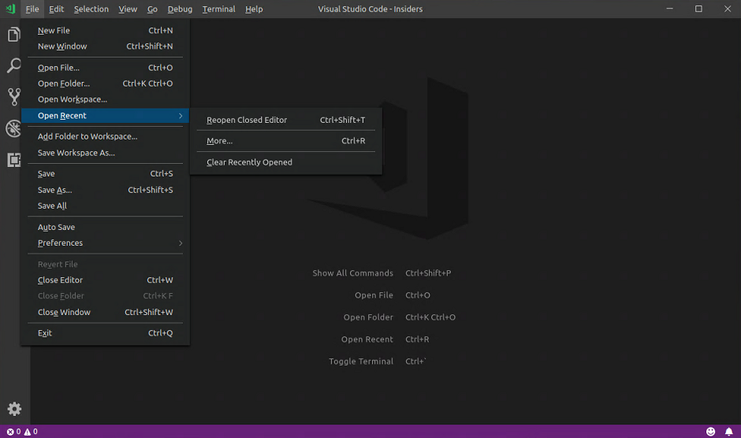

### Scrolling menus

With the custom menu bar enabled, menus are restricted to being rendered within the window. Previously, menus could be cut off by the boundaries of the window. This has now been address by making context menus scrollable when needed.

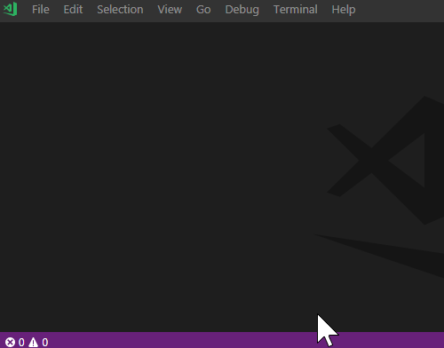

### Menu bar overflow menu

The menu bar also has a new overflow menu when your window width is not enough for both the menu bar and your window title.

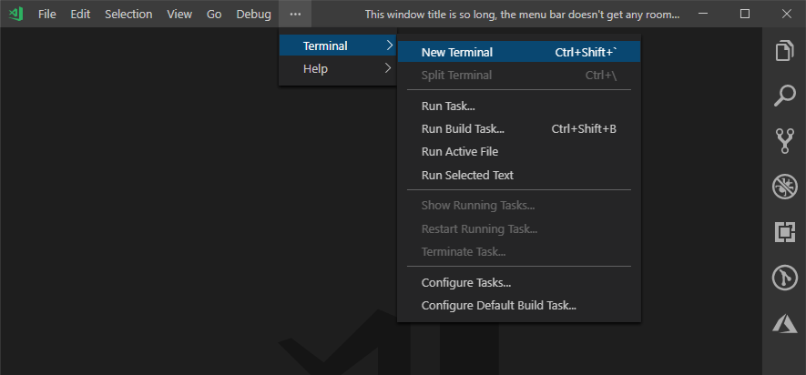

### Multiline search input

Last month, we added support for multiline search. This month we improved the search UX to make it a little easier to use. Now, you can search with multiline text without having to write a regular expression. Type `shift+enter` in the search box to insert a newline, and the search box will grow to show your full multiline query.

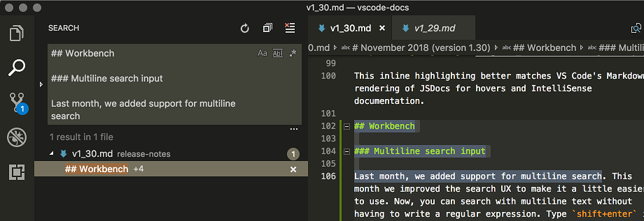

### Moved settings editor actions

The settings editor actions (**Open settings.json**, **Show modified settings**, etc.) have been moved from the `...` menu inside the settings editor to the editor title bar. This makes them consistent with other editor types, and **Open settings.json** is now just one click away. The Keyboard Shortcuts editor has made the same change.

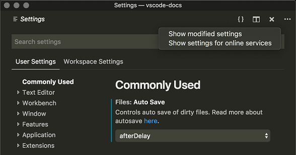

## Editor

### Declaration versus definition

Until now, VS Code offered commands for displaying the definition of a symbol, for example **Go to Definition** and **Peek Definition**. This didn't take into account the fact that some languages differentiate, stricter than others, between the **declaration** and the **definition** of a symbol. We have fixed that and there are now commands for the declaration of a symbol.


The data required for language features like **Go to Declaration** is computed by extensions and we have added a new API, which you can read about in the [Extension Authoring](#extension-authoring) section.


## References View

The references viewlet has been polished and is no longer a preview feature. There is now

* "Find All References" which opens the viewlet, and
* "Peek References" which opens references in the peek view

The references viewlet is hidden at startup but will remain visible once it has been used. When being cleared it shows a history of previous searches.

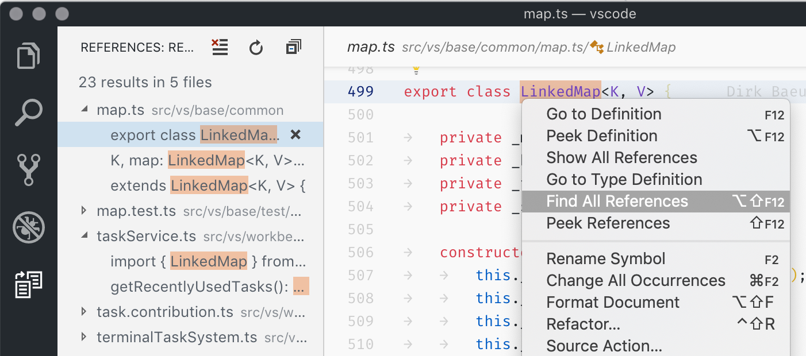

There is now a summary atop the results and there is a context menu which allows to clear and copy results. Many bugs have been fixed and overall stability has been improved.

### Comment snippet variables

There are new snippet variables that insert line or block comments, honoring the current language. Use `BLOCK_COMMENT_START` and  `BLOCK_COMMENT_END` for block comments and `LINE_COMMENT` otherwise.

The snippet below inserts `/* Hello World */` in JavaScript files and `<!-- Hello World -->` in HTML files

```json
"hello": {
  "scope": "javascript,html",
  "prefix": "hello",
  "body": "$BLOCK_COMMENT_START Hello World $BLOCK_COMMENT_END"
}
```

### Smooth cursor animation

There is a new setting, `editor.cursorSmoothCaretAnimation` which will enable a transition animation whenever the cursor is moved.

## Languages

### TypeScript 3.2

VS Code now includes [TypeScript 3.2.2](https://blogs.msdn.microsoft.com/typescript/2018/11/29/announcing-typescript-3-2/). This release brings some exciting new language features, including [strict typing of `bind`, `call`, and `apply`](https://blogs.msdn.microsoft.com/typescript/2018/11/29/announcing-typescript-3-2/#strictbindcallapply), and [BigInt support](https://blogs.msdn.microsoft.com/typescript/2018/11/29/announcing-typescript-3-2/#bigint). The TypeScript update also fixes some important bugs and includes new tooling features and improvements

### File icons for JS/TS path suggestions

We now show the proper file icons for JavaScript and TypeScript path suggestions:

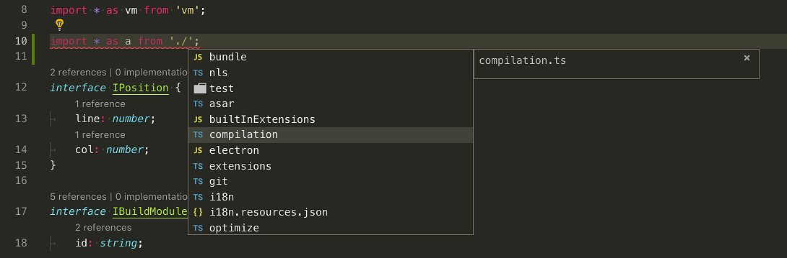

### Adding missing new JS/TS quick fix

Forget a `new` when instantiating a class? TypeScript 3.2 brings a new Quick Fix to help out:

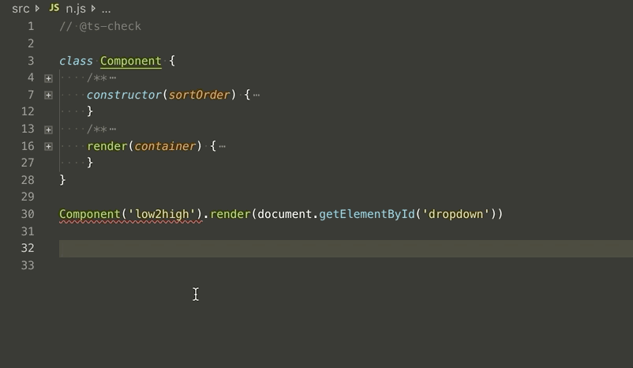

This Quick Fix works in TypeScript and in [type checked JavaScript](https://code.visualstudio.com/docs/languages/javascript#_type-checking).

### Renames handle JS/TS destructuring properly

Renames now handle JavaScript and TypeScript destructuring and will introduce an alias if needed:

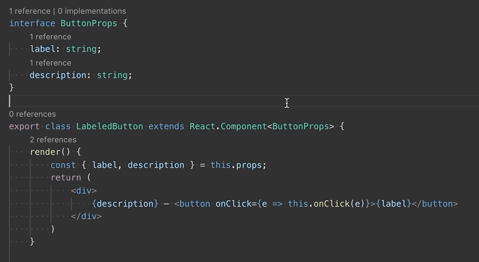

### Improved display of JavaScript and TypeScript callbacks in navigation

JavaScript and TypeScript anonymous callbacks were all previously labeled as `<function>` in the Outline view, breadcrumbs view, and document symbol list. This made it impossible to tell which function you were really after:


With TypeScript 3.2+, VS Code now displays more context for callback functions so that you can tell them apart:


### Highlighting of Markdown elements in JSDoc comments

Fenced code blocks and other Markdown elements inside of JSDoc blocks are now syntax highlighted:


This inline highlighting better matches VS Code's Markdown rendering of JSDocs for hovers and IntelliSense documentation.

## Debugging

### Simplified initial debug configurations

This milestone we looked into simplifying the generated `launch.json` for our most popular debug extensions. Our goal was to make it easier for users to start and configure debugging. This meant hiding unnecessary launch configuration attributes and using the Quick Pick UI for better user interaction while generating the initial `launch.json`. More details about this effort can be found [here](https://github.com/Microsoft/vscode/issues/62851).

### Debug consoles can be deleted

As of last milestone when debugging multiple debug sessions, we show multiple debug consoles, one for each session. Now it is possible to delete these consoles when the corresponding session is no longer active by clearing the content of that debug console. We did not add additional commands for managing the lifecycle of a debug console, because we believe the current approach will be more intuitive and easier to use.

### Debugging from the Process Explorer

It's now possible to start debugging node processes from the Process Explorer using the 'Debug' context menu action.

## Node/Chrome debugging

### `smartStep` now enabled by default

A few releases ago we [changed the behavior](https://code.visualstudio.com/updates/v1_26#_changed-smartstep-behavior-for-nodechrome-debugging) of `smartStep` to make it more useful. Since `smartStep` results in a much better debugging experience, especially for TypeScript, we have now changed the behavior to be always on.

### Automatic default for `localRoot`

In Node.js remote debugging scenarios, the debug configuration attribute `localRoot` automatically defaults to `${workspaceFolder}`. So only `remoteRoot` needs to be specified.

### Improved user input variables for task and debug configurations

For a long time VS Code has supported [variable substitution](https://code.visualstudio.com/docs/editor/variables-reference) in `tasks.json` and `launch.json` via the `${variableName}` syntax.

For `launch.json`, it was even possible to use variables that prompt for user input (for example `${command:pickNodeProcess}` which opens a Quick Pick based process picker). This feature was not available for `tasks.json` and the command based variables had other limitations too (see issues [#9297](https://github.com/Microsoft/vscode/issues/9297), [#30588](https://github.com/Microsoft/vscode/issues/30588), and [#9544](https://github.com/Microsoft/vscode/issues/9544)).

In this milestone, user input variables have been generalized and improved and they are now available for `launch.json` **and** `tasks.json`. This work has also brought the command syntax to `tasks.json`.

For user input variables, we introduced a new variable category `input`, which results in this syntax: `${input:variableName}`. This simple syntax is not sufficient to present meaningful UI to the end user, so we've introduced a new `inputs` section in `launch.json` and `tasks.json`, where additional configuration attributes are specified.

Here is the list of supported attributes:

* `id` - The corresponding variable name for which these attributes are used.
* `type` - The type of user input widget. In this release, `promptString` (for a string InputBox) and `pickString` (for a string Quick Pick) are supported.
* `description` - A descriptive text shown to the user.
* `default` - The default value to use if the user just presses **Enter**.

A first example that shows how to use a user input variable in a task configuration (`tasks.json`):

```json
{
    "tasks": [
        {
            "label": "Echo input",
            "type": "shell",
            "command": "echo ${input:echoPrompt}"
        }
    ],
    "inputs": [
        {
            "id": "echoPrompt",
            "description": "Please enter a value",
            "default": "default echo text",
            "type": "promptString"
        }
    ]
}
```

Below shows a user input variable for selecting between two options in a debug configuration (`launch.json`):

```json
{
    "configurations": [
        {
            "type": "node",
            "request": "launch",
            "name": "Launch Program",
            "program": "${workspaceFolder}/${input:pickProgram}"
        }
    ],
    "inputs": [
        {
            "id": "pickProgram",
            "description": "Select client or server",
            "type": "pickString",
            "options": ["client.js", "server.js"],
            "default": "client.js"
        }
    ]
}
```

It is planned to combine **user input variables** with the existing command-based variables so that user input variables can be contributed by extensions.

## Tasks

### Run on folder open

If you have a task that you always run when you open a folder, you can configure it to run automatically when that folder is opened by configuring its `"runOn"` property:

```json
{
    "type": "npm",
    "script": "strict-null-check-watch",
    "label": "TS - Strict Null Checks",
    "isBackground": true,
    "runOptions": {
        "runOn": "folderOpen"
    }
}
```

### Clear task terminal

To clear the terminal before executing a task, you can configure the task’s presentation options:

```json
{
    "type": "gulp",
    "task": "tslint",
    "label": "Run tslint",
    "presentation": {
        "clear": true
    }
}
```

### Rerun tasks

Tasks can now be rerun using the **Rerun Last Task** command. By default, a rerun task will re-evaluate its run variables, including its inputs. To use the variables that have already been evaluated in the previous run, configure the `"reevaluateOnRerun"` option:

```json
{
    "type": "gulp",
    "task": "tslint",
    "label": "Run tslint",
    "runOptions": {
        "reevaluateOnRerun": false
    }
}
```

## Extensions

### Install versions

You can now go back to a previous version of an extension if there are issues with the current version. VS Code provides an **Install Another Version** action on an installed extension which shows a dropdown of available versions.

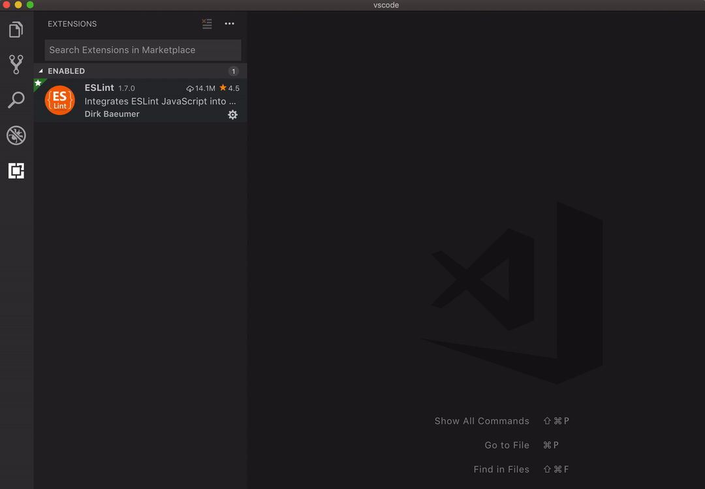

### Unresponsive extension host

VS Code runs extensions in a separate Node.js process – the extension host. This isolates extension code from VS Code itself, but it doesn’t isolate different extensions from each other. Due to the single threaded nature of JavaScript, an extension can, willingly or not, monopolize the extension host thread, block all other extensions, and make operations appear unresponsive.

VS Code now monitors the extension host and when it becomes unresponsive, VS Code starts profiling the extension host. When an extension is identified as being the cause of the unresponsiveness, a minimized notification is shown that encourages the user to file an issue:


As a **user**, keep an eye on the bell icon in the Status Bar as the notification is small. As an **extension author**, if you receive an unresponsive issue, please review this [guide](https://github.com/Microsoft/vscode/wiki/Explain:-extension-causes-high-cpu-load) which explains what has happened and how to open the CPU-profile attached to the issue.

## Preview Features

Preview features are not ready for release but are functional enough to use. We welcome your early feedback while they are under development.

### HTML custom tags / attributes support

The new `html.experimental.custom.tags` and `html.experimental.custom.attributes` settings allows you to specify a list of tags and attributes that VS Code loads during startup. When you are editing HTML files, VS Code will offer auto-completion and hover for those tags and attributes. This works great with [Web Components](https://developer.mozilla.org/docs/Web/Web_Components), for example:


You can open [octref/web-components-examples](https://github.com/octref/web-components-examples) repository to test this feature. This feature is **in preview and both the setting names and JSON format are subject to change**.

If you have feedback or feature requests, please follow up in issue [#62976](https://github.com/Microsoft/vscode/issues/62976).

### Network proxy support for extensions

There is an experimental setting `HTTP: Proxy Support` for enabling network proxy support for all extensions. While we are still working on some of the details, we invite you to give it a try and [let us know](https://github.com/Microsoft/vscode/issues/60773) if it works for you. (Note that enabling the network proxy support currently [breaks](https://github.com/Microsoft/vscode/issues/64133) the GitHub Pull-Request extension's sign-in.)

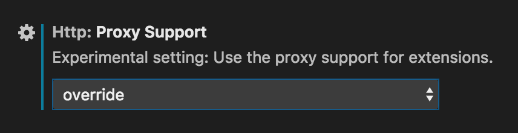

Setting it to `override` should work best for most setups, try `on` for comparison when that doesn't work well.

## Extension Authoring

### Go To Declaration

We have added a `DeclarationProvider` interface which extensions can implement to support the **Go to Declaration** feature. Declaration providers should return locations that are the declaration of a symbol. When multiple providers are registered for the same file, then their results are merged.

### Signature Help Context

SignatureHelpProviders now take a `context` parameter that provides information about how signature help was triggered. The context includes:

* How signature help was triggered (trigger character, a command, or a document context change).
* Which character caused signature help to be triggered.
* Was signature help previously showing when it was triggered?

```typescript
import * as vscode from 'vscode';

export function activate(context: vscode.ExtensionContext) {
    vscode.languages.registerSignatureHelpProvider('markdown', new class implements vscode.SignatureHelpProvider {
        provideSignatureHelp(
            document: vscode.TextDocument,
            position: vscode.Position,
            token: vscode.CancellationToken,
            context: vscode.SignatureHelpContext
        ): vscode.ProviderResult<vscode.SignatureHelp> {
            // Return fake signature help result
            const sigHelp = new vscode.SignatureHelp();
            sigHelp.activeParameter = 0;
            sigHelp.activeSignature = 0;
            sigHelp.signatures = [new vscode.SignatureInformation(getLabel(context))];
            return sigHelp;
        }
    }, {
        triggerCharacters: ['('],
        retriggerCharacters: [',']
    });
}

function getLabel(context: vscode.SignatureHelpContext): string {
    const parts = [];
    // How was signature help triggered
    switch (context.triggerKind) {
        case vscode.SignatureHelpTriggerKind.Invoke:            parts.push('invoke'); break;
        case vscode.SignatureHelpTriggerKind.ContentChange:     parts.push('change'); break;
        case vscode.SignatureHelpTriggerKind.TriggerCharacter:  parts.push('character'); break;
    }

    // Which character (if any) caused signature help to be triggered
    if (context.triggerCharacter) { parts.push(context.triggerCharacter) }

    // Was signature help already showing when it was triggered again?
    if (context.isRetrigger) { parts.push('retrigger') }

    return parts.join(' ');
}
```

Additionally, SignatureHelpProviders can now be registered with a distinct set of trigger characters and re-trigger characters. Re-trigger characters only trigger signature help if is already showing. Here's the above SignatureHelpProvider in action:

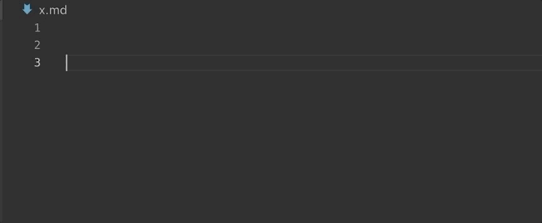

### Configuring contributed TypeScript server plugins

Extensions can now send configuration data to [contributed typescript server plugins](https://code.visualstudio.com/docs/extensionAPI/extension-points#_contributestypescriptserverplugins) through an API provided by VS Code's built-in TypeScript extension:

```typescript
// In your VS Code extension

export async function activate(context: vscode.ExtensionContext) {
    // Get the TS extension
    const tsExtension = vscode.extensions.gettsExtension('vscode.typescript-language-features');
    if (!tsExtension) {
        return;
    }

    await tsExtension.activate();

    // Get the API from the TS extension
    if (!tsExtension.exports || !tsExtension.exports.getAPI) {
        return;
    }

    const api = tsExtension.exports.getAPI(0);
    if (!api) {
        return;
    }

    // Configure the 'my-typescript-plugin-id' plugin
    api.configurePlugin('my-typescript-plugin-id', {
        someValue: process.env['SOME_VALUE']
    });
}
```

The TypeScript server plugin receives the configuration data through an `onConfigurationChanged` method:

```typescript
// In your TypeScript plugin

import * as ts_module from 'typescript/lib/tsserverlibrary';

export = function init({ typescript }: { typescript: typeof ts_module }) {
    return {
        create(info: ts.server.PluginCreateInfo) {
            // Create new language service
        },
        onConfigurationChanged(config: any) {
            // Receive configuration changes sent from VS Code
        },
    };
};
```

This API allows VS Code extensions to synchronize VS Code settings with a TypeScript server plugin, or dynamically change the behavior of a plugin. Take a look at the [TypeScript TSLint plugin](https://github.com/Microsoft/vscode-typescript-tslint-plugin/blob/master/src/index.ts) and [lit-html](https://github.com/mjbvz/vscode-lit-html/blob/master/src/index.ts) extensions to see how this API is used in practice.

### Custom views

The proposed API for adding a **Collapse All** action to your view is now stable.

**Tree Item Description**

You can now add a description to your tree item using the `description` property in `TreeItem`. If the tree item is backed by a resource, you can also let VS Code derive the description from the resource by setting `description` to `true`.

```typescript
/**
 * A human readable string which is rendered less prominently.
 * When `true`, it is derived from [resourceUri](#TreeItem.resourceUri), and when `falsy`, it is not shown.
 */
description?: string | boolean;
```


### Debugging API

**Richer DebugSession**

The [`DebugSession`](https://github.com/Microsoft/vscode/blob/a152a5c7818a13666a5879b4450eb26a4d45fbde/src/vs/vscode.d.ts#L8310) API now surfaces the workspace folder and the **resolved** debug configuration. Resolved means that all variables have been substituted and platform specific attribute sections have been "flattened" for the matching platform and removed for non-matching platforms.

**Unique ID for breakpoints**

The [`Breakpoint`](https://github.com/Microsoft/vscode/blob/a152a5c7818a13666a5879b4450eb26a4d45fbde/src/vs/vscode.d.ts#L8576) class now surfaces a unique ID (`id`) that doesn't change over its entire lifetime.

**Finalized API for controlling debug adapter creation**

In this milestone, we have finalized the extension API for controlling the creation of debug adapters. The API uses a new [`DebugAdapterDescriptorFactory`](https://github.com/Microsoft/vscode/blob/a152a5c7818a13666a5879b4450eb26a4d45fbde/src/vs/vscode.d.ts#L8471) which must be registered for a specific debug type with [`vscode.debug.registerDebugAdapterDescriptorFactory`](https://github.com/Microsoft/vscode/blob/a152a5c7818a13666a5879b4450eb26a4d45fbde/src/vs/vscode.d.ts#L8702). The factory has a single method `createDebugAdapterDescriptor` which is called by VS Code whenever a debug adapter is needed. Since the debug session is passed as an argument (and the session now surfaces both the workspace folder and the resolved configuration), the implementation has access to the full context when being asked to create the debug adapter. `createDebugAdapterDescriptor` must return an object that describes to VS Code how to create and/or connect to the debug adapter:

* A `DebugAdapterExecutable` descriptor makes VS Code launch the debug adapter as an external process per session and communicate with it through stdin/stdout. An options property bag can specify the working directory and environment variables.
* A `DebugAdapterServer` makes VS Code connect to a server process that handles multiple sessions and communicates via a socket.

Please note: With the finalization of this API, we are deprecating the old (proposed) API [`DebugConfigurationProvider.debugAdapterExecutable`](https://github.com/Microsoft/vscode/blob/a152a5c7818a13666a5879b4450eb26a4d45fbde/src/vs/vscode.proposed.d.ts#L547) and the very old command-based approach (contribution point `Debuggers`, attribute: `adapterExecutableCommand`). Please move off those APIs as we plan to remove support for them in the next release.

This snippet shows how this API can be used to run a debug adapter embedded in its containing extension:

```typescript
let server: Net.Server;
vscode.debug.registerDebugAdapterDescriptorFactory('mock', {
    createDebugAdapterDescriptor(session: DebugSession, executable: DebugAdapterExecutable) {
        // start server on launch of first debug session
        if (!server) {
            // start listening on a random port
            server = Net.createServer(socket => {
                const s = new MockDebugSession();
                s.setRunAsServer(true);
                s.start(<NodeJS.ReadableStream>socket, socket);
            }).listen(0);
        }
        // make VS Code connect to debug server instead of launching debug adapter
        return new DebugAdapterServer(server.address().port);
    }
});
```

**Finalized Debug Adapter Tracker API**

In this milestone, we have finalized the extension API for tracking the [Debug Adapter Protocol](https://microsoft.github.io/debug-adapter-protocol/) used between VS Code and debugger extensions. The API uses a new [`DebugAdapterTrackerFactory`](https://github.com/Microsoft/vscode/blob/a152a5c7818a13666a5879b4450eb26a4d45fbde/src/vs/vscode.d.ts#L8522) which must be registered for a debug type with [`vscode.debug.registerDebugAdapterTrackerFactory`](https://github.com/Microsoft/vscode/blob/a152a5c7818a13666a5879b4450eb26a4d45fbde/src/vs/vscode.d.ts#L8711). The factory has a single method `createDebugAdapterTracker` which is called by VS Code before it starts to communicate with the debug adapter. `createDebugAdapterDescriptor` must return an implementation of an [`DebugAdapterTracker`](https://github.com/Microsoft/vscode/blob/a152a5c7818a13666a5879b4450eb26a4d45fbde/src/vs/vscode.d.ts#L8495) (or `undefined` to prevent tracking).

This snippet shows how this API can be used to log the Debug Adapter Protocol for the Node.js debugger:

```typescript
vscode.debug.registerDebugAdapterTrackerFactory('node', {
    createDebugAdapterTracker(session: DebugSession) {
        return {
            onWillReceiveMessage: m => console.log(`> ${JSON.stringify(m, undefined, 2)}`),
            onDidSendMessage: m => console.log(`< ${JSON.stringify(m, undefined, 2)}`),
        };
    }
});
```

### Debug Adapter Protocol

**New `shellProcessId` attribute for `runInTerminal` response**

If a debug adapter needs to run a target in a terminal, it can use the DAP `runInTerminal` request.
This request can optionally return the `processId` of the target process but in practice no frontend implementation has been able to supply this information. For this reason we have introduced a new attribute `shellProcessId` for returning the process ID of the terminal shell (which is much simpler to determine).

### Clipboard

The clipboard API has been finalized and can now be used by all extensions. It allows to copy & paste strings to the OS clipboard.

### Completion items

When inserting a completion item that spans multiple lines VS Code adjusts the indentation. This is not always wanted and therefore we added `vscode.CompletionItem.keepWhitespace` to control this behavior.

### Labels for symbol providers

When registering a document symbol provider, a label (`DocumentSymbolProviderMetadata`) can now be provided. This label will be shown in breadcrumbs and the outline when a document has multiple symbol providers.

## Proposed Extension APIs

Every milestone comes with new proposed APIs and extension authors can try them out. As always we are keen on your feedback. This is what you have to do to try out a proposed API:

* You must use Insiders because proposed APIs change frequently.
* You must have this line in the `package.json` file of your extension: `"enableProposedApi": true`.
* Copy the latest version of the [`vscode.proposed.d.ts`](https://github.com/Microsoft/vscode/blob/master/src/vs/vscode.proposed.d.ts) file into your project.

Note that you cannot publish an extension that uses a proposed API. We may likely make breaking changes in the next release and we never want to break existing extensions.

### Custom views

**Tree view message**

You can now set a message in your tree view using the `message` property in `TreeView`.

```typescript
/**
 * An optional human-readable message that will be rendered in the view.
 */
message?: string | MarkdownString;

```


### Smart select and extensions

We have added proposed API to support the smart select feature. Today, when you run the "Expand Select" or "Shrink Select" command, selections ranges are computed based on a weak heuristic. While we are working to improve that heuristic we also want to get extension authors involved. Therefore we have added proposed API for a [`SelectionRangeProvider`](https://github.com/Microsoft/vscode/blob/86571ec5a50b5bce09db45f458b407b77a33674a/src/vs/vscode.proposed.d.ts#L21-L34).

## Engineering

### WinJS-Promise removal

When VS Code started, JavaScript wasn't what it is today. For instance, there was no [native promise](https://developer.mozilla.org/docs/Web/JavaScript/Reference/Global_Objects/Promise) and back then the team decided to use `WinJS.Promise`. Fast forwarding to today, the situation is different: native promises are real and `WinJS.Promise` is obsolete.

Because of that, we are in the progress of migrating away from `WinJS.Promise`. This is no easy undertaking because of differences in the API and the runtime behavior. We have started at around 10000 references to `WinJS.Promise` and are down to `1471`, of which ~500 are instantiations and not plain type annotation. We are confident we will finish this epic journey soon!

### Continued Electron 3.0 exploration

During this milestone, we continued to explore bundling Electron 3.0.0 into VS Code. This is a major Electron release and comes with Chrome 66 and Node.js 10.x (a major leap forward compared to our current version that has Chrome 61 and Node.js 8.x). We plan to push out the update to our Insiders users in December to gather additional feedback. If you are interested in helping out, make sure to install VS Code [Insiders](https://code.visualstudio.com/insiders).

### Community issue tracking

The community has helped us out with issue tracking here and there for a very long time. As we see more and more issues being filed (currently at an average of 70 per day), we have started to invite the community members that are most active to [add specific labels](https://github.com/Microsoft/vscode/wiki/Community-Issue-Tracking) to the issues they are working on. Since GitHub doesn't have that fine-grained permissions, we are using our issue bot to pick up on certain comments and add the labels for them. See the [Thank you](#Thank_you) section below for acknowledgments.

## Contributions to Extensions

Our team maintains or contributes to a number of VS Code extensions. Most notably this month:

### GitHub Pull Requests

This milestone we worked on improvements to the [GitHub Pull Requests](https://marketplace.visualstudio.com/items?itemName=GitHub.vscode-pull-request-github) extension.

Below are some of the new features:

* Create pull requests directly from your local branch.
* Suggest a series of source code changes on a checked out pull request.
* View status check information on the pull request description page.

You can read the full release notes for the extension [here](https://github.com/Microsoft/vscode-pull-request-github/releases).

## New Documentation

### Vue.js and Ember.js tutorials

There are two new tutorials showing how to use VS Code with these popular JavaScript frameworks.

* [Using Vue in Visual Studio Code](https://code.visualstudio.com/docs/nodejs/vuejs-tutorial)
* [Using Ember in Visual Studio Code](https://code.visualstudio.com/docs/nodejs/emberjs-tutorial)

## Notable fixes

* [37929](https://github.com/Microsoft/vscode/issues/37929): do not active debuggers when creating debug env drop down menu
* [60187](https://github.com/Microsoft/vscode/issues/60187): Debugger Won't hit breakpoints in jest test
* [61590](https://github.com/Microsoft/vscode/issues/61590): Make Settings and Keybindings editor consistent in showing editor actions
* [62370](https://github.com/Microsoft/vscode/issues/62370): Improve diagnostics hovers in editor
* [62500](https://github.com/Microsoft/vscode/issues/62500): Add "Run to Cursor" to the command palette
* [62778](https://github.com/Microsoft/vscode/issues/62778): Centered layout does not restore size
* [63618](https://github.com/Microsoft/vscode/issues/63618): Debug Electron 2.0.13 64bit failed with error "Cannot connect to runtime process, timeout after 10000ms". But succeed on Electron 32bit

## Thank you

Last but certainly not least, a big *__Thank You!__* to the following folks that helped to make VS Code even better:

Contributions to our issue tracking:

* [Alexander (@usernamehw)](https://github.com/usernamehw)
* [Christopher Leidigh (@cleidigh)](https://github.com/cleidigh)

Contributions to `vscode-eslint`:

* [AnguloHerrera (@angulito)](https://github.com/angulito): Improve pipeline [PR #569](https://github.com/Microsoft/vscode-eslint/pull/569)

Contributions to `language-server-protocol`:

* [Jan Keromnes (@jankeromnes)](https://github.com/jankeromnes): Minor improvements: Typos, grammar, wording. [PR #579](https://github.com/Microsoft/language-server-protocol/pull/579)
* [Adolfo Ochagavía (@aochagavia)](https://github.com/aochagavia): Fix typo in specification [PR #597](https://github.com/Microsoft/language-server-protocol/pull/597)

Contributions to `vscode-languageserver-node`:

* [Remy Suen (@rcjsuen)](https://github.com/rcjsuen): Provide metadata about symbols with DefinitionLink [PR #415](https://github.com/Microsoft/vscode-languageserver-node/pull/415)
* [Guillaume Martres (@smarter)](https://github.com/smarter): Add asVersionedTextDocumentIdentifier to the Converter interface [PR #421](https://github.com/Microsoft/vscode-languageserver-node/pull/421)

Contributions to `debug-adapter-protocol`:

* [Danny Tuppeny (@DanTup)](https://github.com/ayuckhulk): Fix link to Dart plugin [PR #16](https://github.com/Microsoft/debug-adapter-protocol/pull/16)

Contributions to `vscode-chrome-debug-core`:

* [@digeff](https://github.com/digeff): Don't send src changed events for storage sources [PR #378](https://github.com/Microsoft/vscode-chrome-debug-core/pull/378)
* [Shennie Yao (@Shenniey)](https://github.com/Shenniey)
  * making sure bp.actual location is not null/undefined before trying to access its line number [PR #381](https://github.com/Microsoft/vscode-chrome-debug-core/pull/381)
  * cannonicalizing url so that it can find the matching script when resolving breakpoint [PR #379](https://github.com/Microsoft/vscode-chrome-debug-core/pull/379)

Contributions to `vscode-chrome-debug`:

* [Shennie Yao (@Shenniey)](https://github.com/Shenniey): adding runtime args telemetry for chrome cmd line switches [PR #749](https://github.com/Microsoft/vscode-chrome-debug/pull/749)
* [Leslie Leigh (@shrinktofit)](https://github.com/shrinktofit): Fix targetTypes option [PR #760](https://github.com/Microsoft/vscode-chrome-debug/pull/760)

Contributions to `vscode-azure-account`:

* [Yujin Hong (@yujhongmicrosoft)](https://github.com/yujhongmicrosoft): Adding login support for sovereigns [PR #79](https://github.com/Microsoft/vscode-azure-account/pull/79)
* [Zhe Li (@Sneezry)](https://github.com/Sneezry): Fix Azure China sign in issue [PR #104](https://github.com/Microsoft/vscode-azure-account/pull/104)
* [Mateus Amin (@MateusAmin)](https://github.com/MateusAmin): Update README With Settings [PR #107](https://github.com/Microsoft/vscode-azure-account/pull/107)


Contributions to `localization`:

There are almost 1400 members in the Transifex [VS Code project](https://aka.ms/vscodeloc) team with about 100 active contributors every month. We appreciate your contributions, either by providing new translations, voting on translations, or suggesting process improvements.

Here is a snapshot of contributors for this release. For details about the project including the contributor name list, visit the project site at [https://aka.ms/vscodeloc](https://aka.ms/vscodeloc).

* **Bulgarian:** Любомир Василев.
* **Catalan:** Adolfo Jayme-Barrientos, Enric Soler Rastrollo (MaDDoGo), Oriol Torrillas.
* **Czech:** Vít Staniček, Ondra Kalousek, Kryštof Černý.
* **Danish:** Johan Fagerberg.
* **Finnish:** Feetu Nyrhinen, Jussi Palo, Ahto Simakuutio.
* **French:** Antoine Griffard, Thierry DEMAN-BARCELO, Adrien Clerbois.
* **German:** Carsten Kneip.
* **Greek:** George Xenakis, Christos Koutsiaris, dimipapaioan.
* **Hindi:** Anand Chalakkal Jose Mohan, Kiren Paul, Ashwini Gupta, amgusain, Pointless Banter, Shaswat Rungta, Adnan Shaikh, Shashida Nand Jha.
* **Hungarian:** Tar Dániel.
* **Chinese Simplified:** feiyun0112 feiyun0112, Tingting Yi, XIANG ZUO, Tony Xia, G.Y. Z, Dave Young, Jessica Zhang, 驰 雷, Liam Kennedy, bh wu, WangCG duoduobear, ziqiang sun, 正元 刘, 越 郑, peng wei, xiong Fu, 吉姆 舒, 瑜 周, 仁松 陈, Jiang LI.
* **Chinese Traditional:** Winnie Lin , Duran Hsieh, Hans Chiu, Alan Liu.
* **Indonesian:** Laurensius Dede Suhardiman, Wildan Mubarok, Joshua Siagian, Rizki A. Wibowo.
* **Japanese:** Satoshi Kajiura, Shunya Tajima, Yuichi Nukiyama, Yoshihisa Ozaki, dkp sk, Hiroyuki Mori.
* **Kannada:** Sanjay !, Sushmit Patil.
* **Malayalam:** Kiren Paul, Anand Chalakkal Jose Mohan.
* **Norwegian:** Espen Klein Nilsen, Ivar L, Simen Dæhlin, Daniel Bjørnbakk.
* **Polish:** Artur.
* **Portuguese (Brazil):** Danilo Dantas, Thiago Custodio, Vinicius Ribeiro, Lucas Santos, Gabriel Henrique Oliveira de Mello.
* **Romanian:** Szauka.
* **Russian:** Mikhail Zabaluev, Acupofspirt, Ilya Umnov.
* **Sinhala:** Anand Chalakkal Jose Mohan.
* **Spanish:** Jorge Serrano Pérez, Alejandro Medina, Alberto Poblacion, Carlos Longarela, Carlos Mendible, Guillermo Callaghan, Alfonso Jesus Flores Alvarado, Andy Gonzalez.
* **Tamil:** Vijay Nirmal, Avinash, Jeyanthinath Muthuram, Narayanan Singaram.
* **Telugu:** Raja Tirumala Rao Guna.
* **Turkish:** Eyüp DALAN, Mustafa Turhan, Türker YILDIRIM.
* **Vietnamese:** Nguyễn Nhật Tân.

<!-- In-product release notes styles.  Do not modify without also modifying regex in gulpfile.common.js -->
<a id="scroll-to-top" role="button" aria-label="scroll to top" href="#"><span class="icon"></span></a>
<link rel="stylesheet" type="text/css" href="css/inproduct_releasenotes.css"/>
