# January 2019 (version 1.31)

**Update 1.31.1**: The update addresses these [issues](https://github.com/Microsoft/vscode/milestone/87?closed=1).

<!-- DOWNLOAD_LINKS_PLACEHOLDER -->

---

Welcome to the January 2019 release of Visual Studio Code. There are a number of significant updates in this version that we hope you will like, some of the key highlights include:

* **[No reload on extension install](#no-reload-on-install)** - No interruptions when you install new extensions.
* **[Tree UI improvements](#new-tree-widget)** - Improved Explorer navigation and filtering, horizontal scrolling.
* **[Main menu updates](#improved-the-go-menu)** - Redesigned Go actions menu, Edit menu Cut command.
* **[Multiline Problems output](#problems-panel)** - See full multiline issue details in the Problems panel.
* **[Find All References history](#references-history)** - Quickly rerun previous reference searches.
* **[Semantic selection for HTML, CSS, and JSON](#semantic-selection)** - Expand/shrink selection based on language semantics.
* **[Integrated Terminal reflow support](#reflow-support)** - Terminal text automatically reflows as panel width changes.
* **[Command-based user input variables](#custom-command-user-input-variables)** - Custom user input for task and debug configuration.
* **[Updated Extension API documentation](#updated-extension-api-documentation)** - Completely rewritten with extension guides.

>If you'd like to read these release notes online, go to [Updates](https://code.visualstudio.com/updates) on [code.visualstudio.com](https://code.visualstudio.com).<br>
>You can also check out this 1.31 release [highlights video](https://youtu.be/84bRjF6fwII) from Cloud Developer Advocate [Brian Clark](https://twitter.com/_clarkio).

The release notes are arranged in the following sections related to VS Code focus areas. Here are some further updates:

* **[Workbench](#workbench)** - Zen Mode hides line numbers, new Screencast mode shows keystrokes.
* **[Editor](#editor)** - Smart selection improvements, tune Reference CodeLens location.
* **[Integrated Terminal](#integrated-terminal)** - ConPTY support on Windows, Find improvements.
* **[Extension Authoring](#extension-authoring)** - Extensions change event, open resource in a browser action.

**Insiders:** Want to see new features as soon as possible? You can download the nightly [Insiders](https://code.visualstudio.com/insiders) build and try the latest updates as soon as they are available. And for the latest Visual Studio Code news, updates, and content, follow us on Twitter [@code](https://twitter.com/code)!

## Extensions

### No reload on install

Being able to install extensions without forcing a reload (restart) of VS Code is one of the most upvoted feature requests and we bring it to you in this release. You are no longer required to reload VS Code when you install or enable an extension.

In the example below the user follows the recommendation to install the **Vetur** extension after opening a `.vue` file. Notice that the language features provided by the Vetur extension (such as syntax coloring, diagnostic errors) are available immediately after installing the recommended extension.

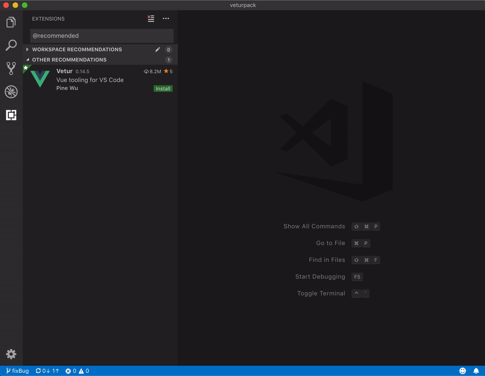

Reload is also not needed when you uninstall or disable an extension if it is not activated.

**Note:** There are certain extensions that require reload because of external contributions (contributing to the extension points of other extensions). It requires adoption from the external contribution point owners by listening to the [`extensions.onDidChange`](#extensions-change-event) event.

## Workbench

### New tree widget

We have pushed our widget game to the next level: a new tree widget was created to address performance issues and enable us to provide more features in several workbench areas. The new tree widget was created through composition over our high-performance list widget. We intend to write a separate blog post about this engineering work and the performance improvements. For now, we'll focus on the features instead.

**Note:** The new tree was adopted in the File Explorer, all Debug trees, Search, and Peek References. The features described below apply to most of those UI areas, unless explicitly disabled by us.

**Improved keyboard navigation**

There are now three different types of keyboard navigation in trees: `simple`, `highlight`, and `filter`. In both `highlight` and `filter`, typing in a tree will display a widget (control) at the top of the tree, which indicates that you are now navigating the tree:


This widget can also be used to switch between the `highlight` and `filter` modes. You can configure a keybinding to execute the `list.toggleFilterOnType` command if you'd like a keyboard shortcut for switching between modes. The **Workbench > List: Keyboard Navigation** (`workbench.list.keyboardNavigation`) setting sets the default mode, including the `simple` mode in which typing the first few characters of a tree element simply focuses that element.

Users who have single letter keybindings for list/tree actions can still use this feature by making use of the `listAutomaticKeyboardNavigation` context key. For example, the VIM extension sets this context key to `false` to disable automatic keyboard navigation and adds a keybinding `/` to the `list.toggleKeyboardNavigation` command, so users can just type `/` and navigate the tree. Learn more about this in the [VSCodeVIM pull request](https://github.com/VSCodeVim/Vim/pull/3432).

Theme authors can customize the widget's colors with the following new theme keys:

* `listFilterWidget.background`
* `listFilterWidget.outline`
* `listFilterWidget.noMatchesOutline`

**Note:** These keyboard navigation modes currently only work on **resolved** tree nodes. For example, in the File Explorer, if a folder was never expanded, the tree won't look for its children. We are considering several options to make this experience better.

**Hierarchical Select All**

Pressing `Ctrl+A` (`Cmd+A` on macOS) in a tree will now expand the tree's selection in a hierarchical fashion.

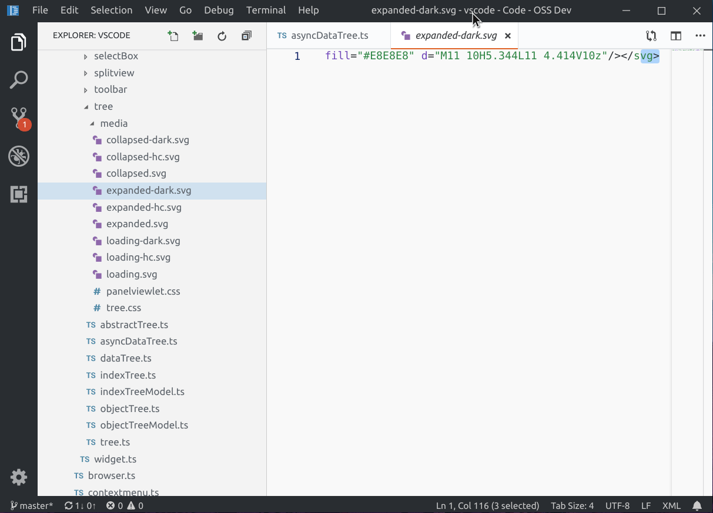

**Customizable indentation**

You can now customize the node indentation of all trees across the workbench using the **Workbench > Tree: Indent** (`workbench.tree.indent`) setting.

**Expand/Collapse All**

Holding the `Alt` key while expanding/collapsing tree nodes will now work recursively. Note that recursive expansion only works for nodes previously revealed in the tree. For example, the File Explorer will not automatically expand folders which were never expanded before by the user.

**Horizontal scrolling**

The **Workbench > Tree: Horizontal Scrolling** (`workbench.tree.horizontalScrolling`) setting now enables horizontal scrolling on more trees and lists, namely Explorer, Search, SCM, Debug, etc.

### Problems panel

**Multi-line messages**

The Problems panel now shows multi-line diagnostic messages in separate lines. The example below shows how a multi-line error message from TypeScript is now presented.


You can also toggle to show or hide the complete message using either the collapse/expand buttons or the **Problems: Show message in single line** and **Problems: Show message in multiple lines** commands.

**Trigger Code Actions using a keyboard shortcut**

You can now trigger Code Actions from the Problems panel using the same default keyboard shortcut `kb(editor.action.quickFix)` as the Quick Fix command.

### Improved the Go menu

We added more navigation actions to the **Go** menu to make them easier to discover:

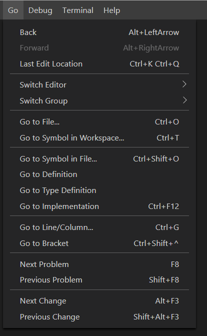

### Cut command in Explorer context menu

Based on popular request we have added the cut command to the Explorer context menu.

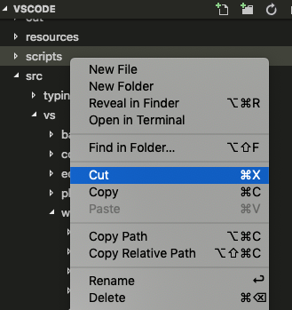

### Fast scrolling

Pressing the `Alt` key enables fast scrolling in the editor and Explorers. By default, fast scrolling uses a 5X speed multiplier but you can control the multiplier with the **Editor: Fast Scroll Sensitivity** (`editor.fastScrollSensitivity`) setting.

### Zen Mode hides line numbers

Turning on Zen Mode will now also hide editor line numbers. This behavior can be controlled via `zenMode.hideLineNumbers` setting.

### Added keyboard navigation in Linux with custom menus

Our custom menus now support the use of the `Page Up/Down` and `Home/End` keys to quickly jump to the beginning or end of the menu.

### Double-click the application icon to close in Windows/Linux

Due to technical tradeoffs, by default, the custom title bar on Window and Linux removes the functionality of double-clicking the application icon to close the window. The functionality can be regained by enabling the setting `window.doubleClickIconToClose` with the caveat that you will no longer be able to drag the window from this location or get the system context menu on Windows.

### Closing order of editor tabs

A new setting `workbench.editor.focusRecentEditorAfterClose` allows you to change the order in which editor tabs are closed. By default, tabs will close in most recently used (MRU) order. Changing this setting allows closing tabs from right to left instead.

### New title variables

There are three new variables that can be used within the `window.title` setting:

* `${activeFolderShort}`: The name of the folder the file is contained in.
* `${activeFolderMedium}`: The path of the folder the file is contained in, relative to the workspace folder.
* `${activeFolderLong}`: The full path of the folder the file is contained in.

### Output panel

Smart scrolling behavior in the Output panel is now more efficient. Scrolling is locked when you click anywhere in the Output panel and gets unlocked when you click in the last line.

### Screencast Mode

There is a new **Screencast Mode** in VS Code, which highlights the cursor position and keystrokes. Screencast Mode (**Developer: Toggle Screencast Mode**) can be useful for demonstration purposes.


## Editor

### Smart Selections

We have worked on improving the implementation of **Expand Selection** and **Shrink Selection** from the **Selections** menu. We are in the process of adding an API so that language servers can specify selection steps based on their semantics knowledge. In addition, we have improved the default implementation as well.

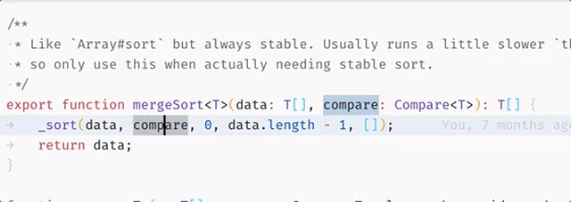

Stay tuned, there is more to come as smart select is improved. Use the [`smart-select`](https://github.com/Microsoft/vscode/issues?q=is%3Aopen+is%3Aissue+label%3Asmart-select)-label to see what we are working on.

### References history

There is now a **References: Show History** command for the References view. It brings up Quick Pick with previous searches allowing speedy reruns of previous searches.

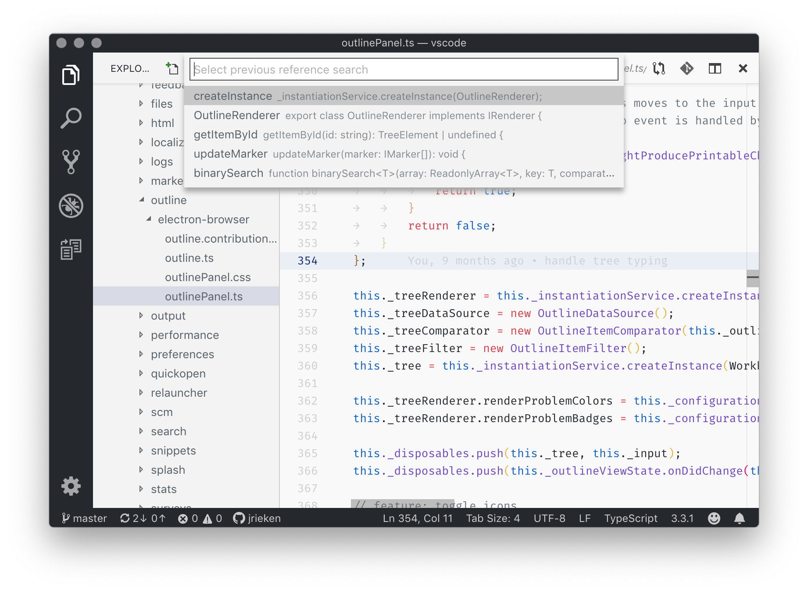

### Reference CodeLens

When selecting a reference CodeLens, a peek editor opens. This can now be controlled with the `references.preferredLocation` setting. Its options are `peek` and `view`, the latter shows references in the new view.

### Snippets descriptions

When authoring snippets with long descriptions, in the past you were forced to write a long single string. There was no support for using an array as you could for `body`. This has now changed and long descriptions can be written using string arrays.

```json
{
  "prefix": "happy",
    "body": "#Happy Coding!",
    "description": [
      "First Line",
      "Second Line",
      "Third Line"
    ]
}
```

### Removed legacy search mode

20 releases ago, we started using [ripgrep](https://github.com/BurntSushi/ripgrep) for search in VS Code. Our old Node.js-based search implementation has still been available behind the setting `search.useLegacySearch`. But as Marie Kondo says, we must tidy up the things that no longer spark joy. If you have been using regex features like backreferences or lookahead, make sure to turn on the `search.usePCRE2` setting.

### Use simple text editor for editing settings as JSON

On a similar theme, now that we have had a settings UI for several releases, we are looking into simplifying the JSON settings editing experience. If you edit settings as JSON by opening a `settings.json` file, or clicking the `{}` button in the settings UI, or invoking the **Open Settings (JSON)** command, then you will get a simple JSON editor instead of the split JSON editor that we had previously. You can still see the listing of default settings with the **Open Raw Default Settings** command.

If you really miss the split JSON editor with the default settings on the left, you can restore it by enabling the `workbench.settings.useSplitJSON` setting. Note that you will always be able to edit settings as JSON if that's what you prefer.

### Network proxy support for extensions

The setting **Http: Proxy Support** (`http.proxySupport`) now enables network proxy support for all extensions by default.

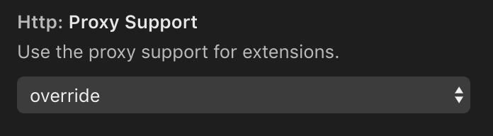

## Languages

### TypeScript 3.3

We now ship with [TypeScript 3.3.1](https://devblogs.microsoft.com/typescript/announcing-typescript-3-3/). This TypeScript update brings some important bug fixes and polish.

### Removing the markdown.previewFrontMatter setting

The `markdown.previewFrontMatter` setting has been removed. The Markdown preview now always hides YAML frontmatter (this was the default setting for `markdown.previewFrontMatter`).

Markdown extensions such as [Markdown yaml Preamble](https://marketplace.visualstudio.com/items?itemName=bierner.markdown-yaml-preamble) and [GitHub Markdown Preview](https://marketplace.visualstudio.com/items?itemName=bierner.github-markdown-preview) render frontmatter as a table in the preview.

### Semantic selection

Semantic selection is now available for HTML, CSS/LESS/SCSS, and JSON:

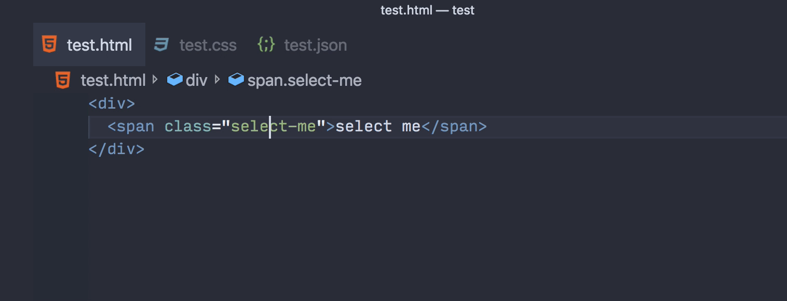

## Integrated Terminal

### Reflow support

The terminal will now wrap and unwrap lines when it is resized horizontally.

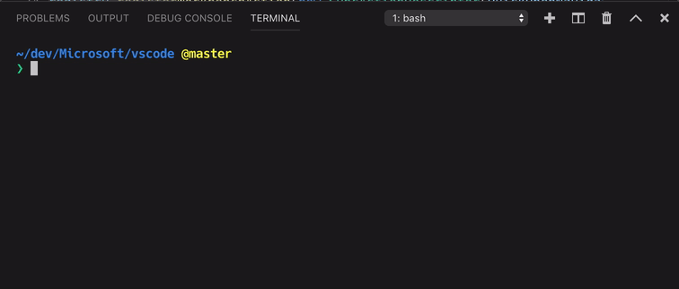

### ConPTY support on Windows

Managing terminal processes via the Windows [ConPTY API](https://blogs.msdn.microsoft.com/commandline/2018/08/02/windows-command-line-introducing-the-windows-pseudo-console-conpty/) is now available as an opt-in option in the Windows Insiders fast ring (build number 18309+).

```json
{
  "terminal.integrated.windowsEnableConpty": true
}
```

This will use the ConPTY system provided by the Windows Console team as the backend for the terminal. Enabling this should fix many issues with the Windows terminal, particularly around color support, interactive applications, and shells that natively support VT sequences.

Here's a before and after of 256 ANSI color support in a WSL terminal:

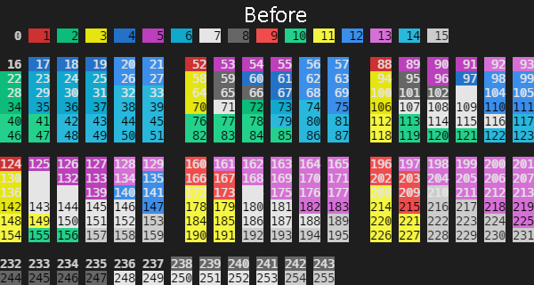

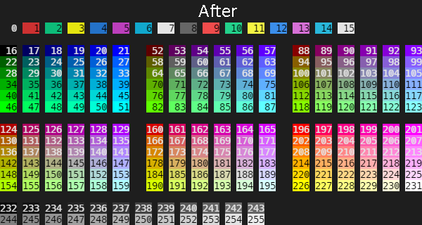

### Current working directory used for links

On Linux and macOS, the terminal will now resolve links relative to the current working directory, not the initial directory of the terminal.


### Find in terminal improvements

Find in the terminal now supports incremental "find-as-you-type" searching, as well as the ability to find multiple terms on a single line.

### Improvements to commandsToSkipShell setting

Previously, the setting `terminal.integrated.commandsToSkipShell` was a list of all commands that would skip evaluation by the terminal and be handled instead by VS Code. This was awkward because you would need a list of 100+ commands in your settings file to change it. This is now changed to be a list of additions and deletions, so you only include the changes to the default list:

```json
{
  "terminal.integrated.commandsToSkipShell": [
    // Make ctrl+n open a new file when the terminal is focused
    "workbench.action.files.newUntitledFile",
    // Send ctrl+e to the terminal
    "-workbench.action.quickOpen"
  ]
}
```

### New buffer implementation enabled

The TypedArray/ArrayBuffer-based terminal buffer [introduced in v1.29](https://code.visualstudio.com/updates/v1_29#_experimental-buffer-improvements) is now turned on and the old implementation has been removed. This should provide a good boost to throughput in the terminal as well as significantly reduce its memory footprint.

## Debug and tasks

### Custom command user input variables

The [input variables](https://code.visualstudio.com/updates/v1_30#_improved-user-input-variables-for-task-and-debug-configurations) introduced last milestone are a powerful mechanism to ask for user input in task or debug configurations. Initially, we made `promptString` and `pickString` input variables available.

In this milestone, we are introducing a new type of input variable `command` which runs an arbitrary command when an input variable is interpolated. Since commands can be contributed by extensions, it is now possible to extend user input variables by new implementations.

The following example shows how to use a user input variable of type `command` in a debug configuration that lets the user pick a test case from a list of all test cases found in a specific folder. It is assumed that some extension provides an `extension.mochaSupport.testPicker` command that locates all test cases in a configurable location and shows a picker UI to pick one of them.

```json
{
   "configurations": [
      {
         "type": "node",
         "request": "launch",
         "name": "Launch Test",
         "program": "${workspaceFolder}/${input:pickTest}"
      }
   ],
   "inputs": [
      {
         "id": "pickTest",
         "type": "command",
         "command": "extension.mochaSupport.testPicker",
         "args": {
            "testFolder": "${workspaceFolder}/tests",
         }
      }
   ]
}
```

### Task output support split terminals

You can now configure tasks to show output in a split terminal panel instead of creating a new one. A task configuration can use the `group` attribute in the `presentation` section to define where the task's output should be shown.

If you run both of the two tasks below, they will show in a split terminal so you can see both of them at the same time:

````json
{
    "version": "2.0.0",
    "tasks": [
        {
            "label": "Task One",
            "type": "shell",
            "command": "echo One && sleep 5000",
            "problemMatcher": [],
            "presentation": {
                "group": "groupA"
            },
        },
        {
            "label": "Task Two",
            "type": "shell",
            "command": "echo Two && sleep 5000",
            "problemMatcher": [],
            "presentation": {
                "group": "groupA"
            }
        }
    ]
}
````

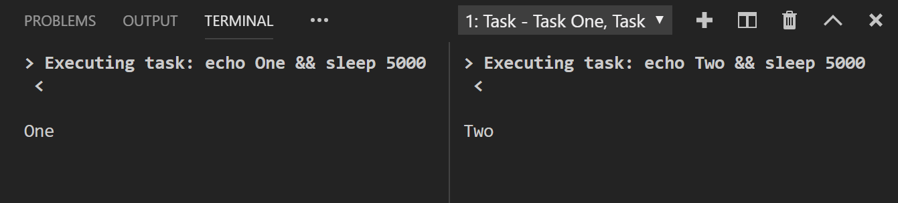

## Preview features

Preview features are not ready for release but are functional enough to use. We welcome your early feedback while they are under development.

### Grid Layout for the Workbench

The workbench layout is being reworked to use the same grid layout used by the editors themselves. The work being done here will not only simplify the engineering work of maintaining the workbench layout in the long run, but also help us light up new experiences.

This milestone, we are shipping with one such experience to demonstrate something that can be achieved more easily with the new grid layout, toggling the editor area. With the experimental grid layout enabled (`"workbench.useExperimentalGridLayout": true`), there is a new command **Toggle Editor Area**, which hides the code editors. This allows you to create a VS Code terminal panel, which occupies the complete editor area as shown below:

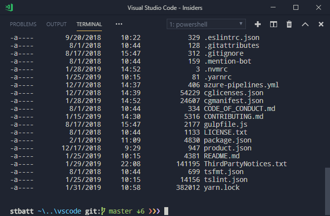

If you open a file from the terminal using `code file.txt`, it will still pop open an editor just as you would expect. This feature is still a work in progress and there are known issues, but we encourage you to check it out and file issues. You can keep up-to-date with issues regarding this work with [this query](https://github.com/Microsoft/vscode/issues?q=is%3Aopen+is%3Aissue+label%3Aworkbench-layout+label%3Abug).

### HTML and CSS custom data support

Since this feature is in preview, the settings, Contribution Points, and data formats are subject to change.

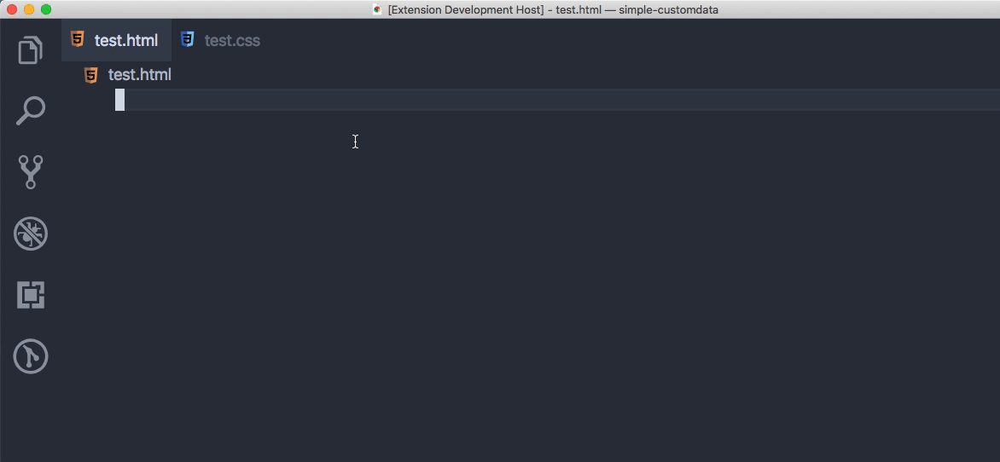

Today, front-end developers often code in a superset of HTML/CSS:

* [Web Components](https://developer.mozilla.org/docs/Web/Web_Components) allow custom HTML elements such as `<my-button type="alert"></my-button>`.
* [PostCSS](https://postcss.org/) allows custom CSS properties such as [`size`](https://github.com/postcss/postcss-size) and not-yet-standardized CSS features such as [`:any-link`](https://preset-env.cssdb.org/features#any-link-pseudo-class).
* Various frameworks allow even greater flexibility in the source HTML/CSS.

In this iteration, we improved the [HTML custom data support](https://code.visualstudio.com/updates/v1_30#_html-custom-tags-attributes-support) introduced in 1.30 and added CSS custom data support.

* Use `html.experimental.customData` or `css.experimental.customData` to load custom data. (`html.experimental.custom.tags` and `html.experimental.custom.attributes` are removed.)
* Alternatively, bundle the JSON into an extension with `contributes.html.experimental.customData` or `contributes.css.experimental.customData`.
* Finally, if you are writing a Language Server that uses [vscode-html-languageservice](https://github.com/Microsoft/vscode-html-languageservice) or [vscode-css-languageservice](https://github.com/Microsoft/vscode-css-languageservice), you can create the Language Service with custom data.

Custom data enhances VS Code's understanding of HTML/CSS. For example, with these HTML/CSS JSON contributions, VS Code could provide completion and hover for the custom HTML tag/attribute and CSS property/pseudoClass:

```json
{
  "version": 1,
  "tags": [{
      "name": "my-button",
      "description": "My button",
      "attributes": [{
        "name": "type",
        "description": "My button type",
        "values": [
          { "name": "alert" }
        ]
      }]
  }]
}
```

```json
{
  "version": 1,
  "properties": [{
    "name": "my-size",
    "description": "Compiles down to `width` and `height`. See details at https://github.com/postcss/postcss-size."
  }],
  "pseudoClasses": [{
    "name": ":my-link",
    "description": ":any-link pseudo class. See details at https://preset-env.cssdb.org/features#any-link-pseudo-class."
  }]
}
```

The above sample is available at [octref/simple-customdata](https://github.com/octref/simple-customdata), while a more fully-featured sample is available at [octref/svg-data](https://github.com/octref/svg-data).

These guides explain the data format and how to use them through settings and extension Contribution Points.

* [Guide](https://github.com/Microsoft/vscode-html-languageservice/blob/master/docs/customData.md) for using HTML Custom Data
* [Guide](https://github.com/Microsoft/vscode-css-languageservice/blob/master/docs/customData.md) for using CSS Custom Data

## Extension authoring

### Extensions change event

A new event `extensions.onDidChange` was added which fires when the `extensions.all` array changes. This can happen when extensions are installed, uninstalled, enabled, or disabled. See the [No reload on extension install](#no-reload-on-install) section.

```ts
/**
 * An event which fires when `extensions.all` changes. This can happen when extensions are
 * installed, uninstalled, enabled or disabled.
 */
export const onDidChange: Event<void>;
```

**Note**: Extension authors that introduce new contribution points should listen to this event and update the state of the workbench accordingly.

### Open resources in a browser

We have observed that several extensions use node modules like `opn` or `open` to open a URL in a browser. Given the desire for this functionality, we have added a new API `vscode.env.openExternal`. It expects a URL and can be used to open website-links, mail-links, or application-url-handler. Also, file URLs are accepted to open them in their default app, like a PDF file.

```ts
// open default browser
await vscode.env.openExternal(vscode.Uri.parse("https://github.com/Microsoft/vscode/issues/66741"));
```

**Note**: Extension authors currently using the `opn` or `open` modules should switch to this new API.

### Global storage path

An extension is now provided with a global storage path `ExtensionContext.globalStoragePath` that is pointing to a local directory with write/read access. This is a good option if you need to store large files that are accessible from all workspaces.

```ts
/**
 * An absolute file path in which the extension can store global state.
 * The directory might not exist on disk and creation is
 * up to the extension. However, the parent directory is guaranteed to be existent.
 *
 * Use [`globalState`](#ExtensionContext.globalState) to store key value data.
 */
globalStoragePath: string;
```

VS Code takes care of cleaning up this path when the extension is removed.

**Note**: Extension authors that currently use a custom file system location to store state across workspaces should switch to this new API.

### CodeActionKind.intersects

The `CodeActionKind.intersects` method is useful to check if a `CodeActionProvider` should bother computing its Code Actions:

```typescript
import * as vscode from 'vscode';

export class OrganizeImportsProvider implements vscode.CodeActionProvider {
    public provideCodeActions(
        document: vscode.TextDocument,
        range: vscode.Range,
        context: vscode.CodeActionContext,
        token: vscode.CancellationToken
    ): vscode.CodeAction[] {
        // Only return organize imports actions if they were explicitly requested
        // We can check this using `intersects`.
        if (!context.only || !vscode.CodeActionKind.SourceOrganizeImports.intersects(context.only)) {
            // Organize imports actions were not requested
            return [];
        }

        // Organize imports was requested
        ...
    }
}
```

### contributes.resourceLabelFormatters

Extensions can now contribute resource label formatters that specify how to display URIs everywhere in the workbench. For example, here's how an extension could contribute a formatter for URIs with scheme `remotehub`:

```json
"contributes": {
   "resourceLabelFormatters": [
        {
            "scheme": "remotehub",
            "formatting": {
                "label": "${path}",
                "separator": "/",
                "workspaceSuffix": "GitHub"
            }
        }
    ]
}
```

This means that all URIs that have a scheme `remotehub` will get rendered by showing only the `path` segment of the URI and the separator will be `/`. Workspaces which have the `remotehub` URI, will have the GitHub suffix in their label.

### Add arguments to keybindings

When defining a keybinding in `package.json`, you can now define arguments. Upon execution, those arguments are passed to the command.

In the sample below, it is: `{foo: 1, bar: 2}`.

```json
"keybindings": {
  "key": "cmd+i",
  "command": "myCommand",
  "args": {
    "foo": 1,
    "bar": 2
  }
}
```

### Full control over createTerminal environment

The new setting `TerminalOptions.strictEnv` when set to true will not make any modifications to the terminal environment at all, instead it will be used exactly as passed in by the extension.

```ts
// This will create a terminal whose environment only contains the single value
// FOO=BAR.
const terminal = createTerminal({
  name: "Test terminal",
  env: {
    "FOO": "BAR"
  },
  strictEnv: true
});
```

### Node.js update

The version of Electron that VS Code runs on has been updated which brings with it an update to Node.js from `8.9` to `10.2.0`. All extensions will now run on this newer version of Node.js. Take a look at [Node v10.0.0 deprecations](https://nodejs.org/en/blog/release/v10.0.0/#deprecations) for a list of deprecations in Node.js 10.

### Updated Octicons

We've updated our version of Octicons to 8.3.0 and now support the following icons:


* `$(arrow-both)`
* `$(bold)`
* `$(color-mode)`
* `$(eye-closed)`
* `$(fold-down)`
* `$(fold-up)`
* `$(grabber)`
* `$(italic)`
* `$(kebab-horizontal)`
* `$(kebab-vertical)`
* `$(note)`
* `$(organization-filled)`
* `$(person-filled)`
* `$(project)`
* `$(request-changes)`
* `$(screen-full)`
* `$(screen-normal)`
* `$(smiley)`
* `$(tasklist)`
* `$(text-size)`
* `$(unverified)`
* `$(verified)`

You can [read our documentation](https://code.visualstudio.com/api/references/icons-in-labels) to view a full list of the icons that we support. For a full detail list of changes, see the [Octicon changelog](https://github.com/primer/octicons/blob/master/CHANGELOG.md#830).

## Proposed extension APIs

Every milestone comes with new proposed APIs and extension authors can try them out. As always we are keen on your feedback. This is what you have to do to try out a proposed API:

* You must use Insiders because proposed APIs change frequently.
* You must have this line in the `package.json` file of your extension: `"enableProposedApi": true`.
* Copy the latest version of the [`vscode.proposed.d.ts`](https://github.com/Microsoft/vscode/blob/master/src/vs/vscode.proposed.d.ts) file into your project.

Note that you cannot publish an extension that uses a proposed API. We may likely make breaking changes in the next release and we never want to break existing extensions.

### SignatureHelpContext.activeSignatureHelp

The proposed `SignatureHelpContext.activeSignatureHelp` field tracks the previously active signature:

```typescript
import * as vscode from 'vscode';

class MySignatureHelpProvider implements vscode.SignatureHelpProvider {
    provideSignatureHelp(
        document: vscode.TextDocument,
        position: vscode.Position,
        token: vscode.CancellationToken,
        context: vscode.SignatureHelpContext
    ): vscode.ProviderResult<vscode.SignatureHelp> {
        // The active signature help when this provider was triggered or undefined if
        // no signature help was active.
        console.log(context.activeSignatureHelp);

        ...
    }
}
```

Providers can use this to track which overload was selected before the signature help provider was retriggered.

### Auto fix and CodeAction.isPreferred

The Code Action API powers VS Code's Quick Fixes (the lightbulbs you see in the editor). Although there may be many Quick Fixes for a given error, often one of these Quick Fixes is the most reasonable fix for the problem. For example, fixing a spelling error is usually the more likely fix than generating new fields:

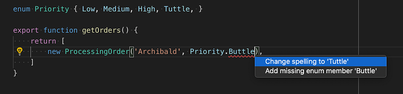

By using the proposed API, extensions can set `isPreferred` on a `CodeAction` to indicate that is the most reasonable fix for the underlying problem. Preferred fixes can be automatically applied using the **Auto Fix** command (`kb(editor.action.autoFix)`)

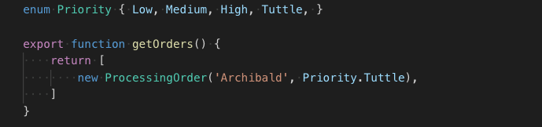

Preferred Quick Fixes should generally:

* Correctly fix the underlying error (and not suppress it).
* Be a reasonable fix for the error.
* Not perform extensive operations unexpectedly.

Refactoring Code Actions can also be marked as preferred to indicate that they are the most reasonable refactoring. For example, while multiple **Extract constant** refactorings may be available, often the user just wants to extract to the nearest local. If that refactoring Code Action is marked `isPreferred`, users can set up a single keybinding for it:

```json
{
  "key": "ctrl+shift+r ctrl+e",
  "command": "editor.action.codeAction",
  "args": {
    "kind": "refactor.extract.constant",
    "preferred": true
  }
}
```

### Fix All Source Actions

The proposed `source.fixAll` `CodeActionKind` establishes a convention for extensions that can auto fix errors in a file. This new Source Action kind is similar to **Organize imports** and makes it easy to configure keybindings for fix all actions or enable autofix on save:

```json
// On save, run both fixAll and organizeImports source actions
"editor.codeActionsOnSave": {
    "source.fixAll": true,
    "source.organizeImports": true,
}
```

The [TSLint extension](https://marketplace.visualstudio.com/items?itemName=ms-vscode.vscode-typescript-tslint-plugin) already uses this proposed source Code Action kind to implement fix all and auto fix on save.

### Debug Adapter Protocol

**Proposed Debug Adapter Protocol for data breakpoints**

As a follow-up step for the [ongoing work on data breakpoints](https://github.com/Microsoft/vscode/issues/58304) (AKA "watchpoints"), we made some progress on the design of the Debug Adapter Protocol for data breakpoints. The proposed DAP changes live on this [branch](https://github.com/Microsoft/debug-adapter-protocol/tree/aweinand/data-breakpoints) and the corresponding TypeScript API can be found in the [Data breakpoints proposal](https://github.com/Microsoft/debug-adapter-protocol/issues/20#issue-384366398).

If you are interested in supporting data breakpoints in your debugger extension, please have a look at the [proposal](https://github.com/Microsoft/debug-adapter-protocol/issues/20) and provide feedback.

### Live theme editing

When developing a color theme extension, you can see color changes applied live in the **Extension Development Host** window.

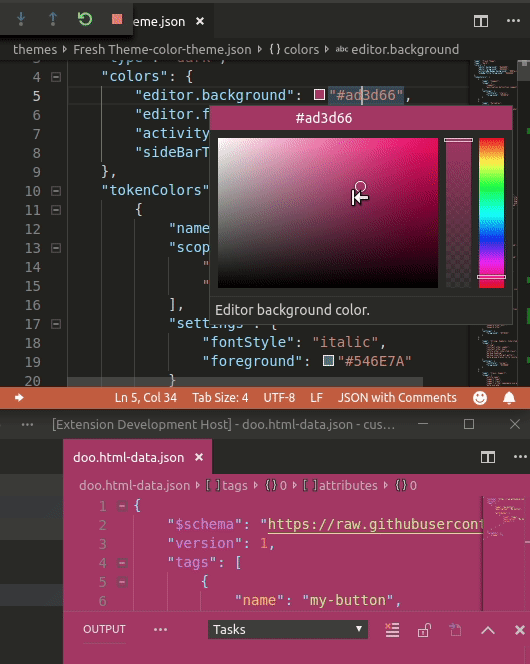

The same works for file icon themes.

## Engineering

### Electron 3.0 update and Electron 4.0 exploration

In this milestone, we finished the exploration of bundling Electron 3 into VS Code, making it the first time we ship this Electron version with stable. This is a major Electron release and comes with Chrome 66 and Node.js 10.x (a major leap forward compared to our current version that has Chrome 61 and Node.js 8.x).

At the same time, we started to explore updating to Electron 4, which we hope to push to Insiders soon.

### Better performance information

With this release, the **Developer: Startup Performance** command output is presented in the editor and no longer in DevTools. That makes it easier to read and faster to get to. In addition, many issues with the information have been fixed.

### WinJS.Promise removal ✅

When VS Code started, JavaScript wasn't what it is today. For instance, there were no native promises and so the team decided to use `WinJS.Promise` for asynchronous work. Today, the situation is different: native promises are real and `WinJS.Promise` is obsolete. Midway through last year, we started an effort to remove `WinJS.Promise` from the codebase, which we completed in December.

### Strict null checking

We continued our work to [strict null check the main VS Code codebase](https://github.com/Microsoft/vscode/issues/60565). Thanks to [your help](https://github.com/Microsoft/vscode/issues/65233), this milestone we were able to enable strict null checking for a large number of test files, which eliminated a large number of errors.

We will be continuing the strict null check effort next milestone.

## Contributions to Extensions

Our team maintains or contributes to a number of VS Code extensions. Most notably this month:

### TSLint support

The new [TSLint](https://marketplace.visualstudio.com/items?itemName=ms-vscode.vscode-typescript-tslint-plugin) extension now supports auto fix on save using `source.fixAll` code actions.

```json
"editor.codeActionsOnSave": {
    "source.fixAll": true
}
```

We recommend that all users of the deprecated TSLint (eg2.tslint) extension migrate to the new [TSLint](https://marketplace.visualstudio.com/items?itemName=ms-vscode.vscode-typescript-tslint-plugin) extension.

### Stylus language support

The [Stylus language extension](https://marketplace.visualstudio.com/items?itemName=sysoev.language-stylus) now uses the curated data from [vscode-css-languageservice](https://github.com/Microsoft/vscode-css-languageservice) to offer up-to-date completions with status warnings and syntax documentation.

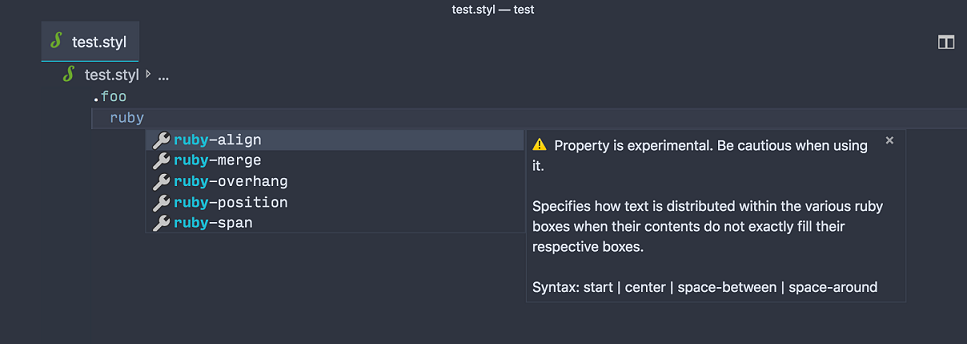

### GitHub Pull Requests

This milestone we continued working on improvements to the [GitHub Pull Requests](https://marketplace.visualstudio.com/items?itemName=GitHub.vscode-pull-request-github) extension.

Below are some of the new features:

* GitHub Review support. You can now group comments into a [review](https://help.github.com/articles/reviewing-proposed-changes-in-a-pull-request/) instead of just adding them individually.
* The extension works seamlessly when you join a [Live Share](https://visualstudio.microsoft.com/services/live-share/) session when the workspace is a GitHub repository.
* We introduced [GraphQL](https://graphql.org/) gradually into the project so the description view now presents more detailed information of a pull request and the overall performance of the extension is improved.
* You can now choose **Create Merge Commit**, **Squash and Merge**, or **Rebase and Merge** when merging a pull request.
* Performance improvements. We reduced both the API calls to GitHub and git operations when you browse pull requests, file changes, and checkout a pull request, which makes the extension respond faster, especially on Windows.

You can read the full release notes for the extension at [vscode-pull-request-github releases](https://github.com/Microsoft/vscode-pull-request-github/releases).

## New documentation

### Python Jupyter Notebooks

A new [Working with Jupyter Notebooks](https://code.visualstudio.com/docs/python/jupyter-support) topic describes how to open, debug, and export [Jupyter Notebooks](https://jupyter-notebook.readthedocs.io/en/latest/) from within VS Code.

### Improved JavaScript and TypeScript documentation

We've refreshed our JavaScript and TypeScript articles to make sure they are up-to-date and provide more helpful information.

The [JavaScript](https://code.visualstudio.com/docs/languages/javascript) and [TypeScript](https://code.visualstudio.com/docs/languages/typescript) pages now provide an overview of the features that VS Code offers for these languages. More detailed explanations of these features and tutorials have been moved to new pages under **Node.js / JavaScript** and **TypeScript** respectively in the table of contents.

### Updated Extension API documentation

For extension authors, the VS Code [API](https://code.visualstudio.com/api) documentation was rewritten and moved to its own table of contents.

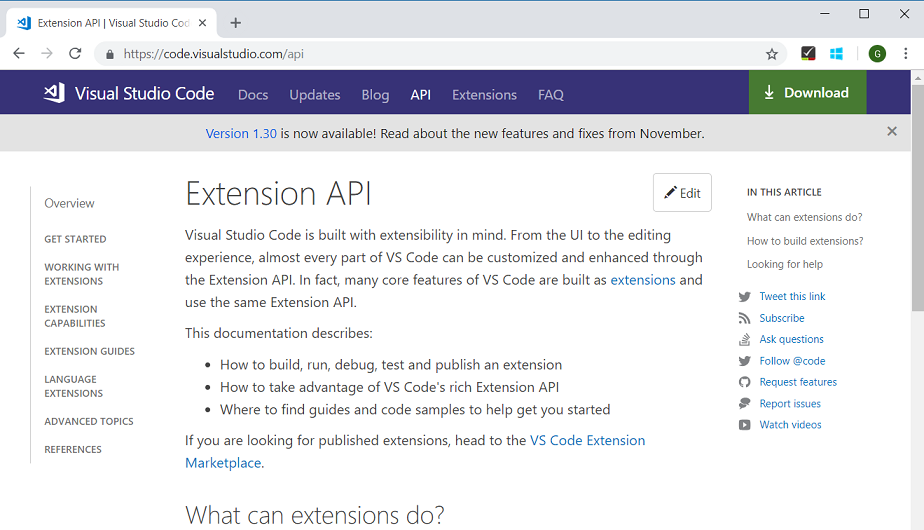

Here you'll find articles to:

* Get you started with your [first extension](https://code.visualstudio.com/api/get-started/your-first-extension).
* Learn about various extension [capabilities](https://code.visualstudio.com/api/extension-capabilities/overview).
* Find extension [guides](https://code.visualstudio.com/api/extension-guides/overview) and [advanced topics](https://code.visualstudio.com/api/advanced-topics/extension-host).
* Complete API [references](https://code.visualstudio.com/api/references/vscode-api).

## Notable fixes

* [7570](https://github.com/Microsoft/vscode/issues/7570): VS Code does not open offline
* [14372](https://github.com/Microsoft/vscode/issues/14372): Extensions: disablement state needs to be communicated across windows
* [34396](https://github.com/Microsoft/vscode/issues/34396): High CPU on single CPU VM
* [58167](https://github.com/Microsoft/vscode/issues/58167): Terminal and minimap restore textures are corrupted after resuming the OS
* [59794](https://github.com/Microsoft/vscode/issues/59794): Terminal screen reader support doesn't work when editor.accessibilitySupport is set to 'auto'
* [61649](https://github.com/Microsoft/vscode/issues/61649): Debug cannot read property 'onError' of undefined
* [63832](https://github.com/Microsoft/vscode/issues/63832): Unable to attach to lsp server when debugging extension
* [64948](https://github.com/Microsoft/vscode/issues/64948): GDB C/C++ debugger won't start, giving error
* [65697](https://github.com/Microsoft/vscode/issues/65697): Debug stopOnEntry with autoAttachChildProcesses is not honored on node cluster forked processes
* [66302](https://github.com/Microsoft/vscode/issues/66302): Ctrl + L should be bound to clear repl by default
* [66681](https://github.com/Microsoft/vscode/issues/66681): "Select for compare" and "Compare with selected" commands not shown for virtual documents

This release also include a security update for Microsoft Security Response Center [CVE-2019-0728](https://portal.msrc.microsoft.com/en-us/security-guidance/advisory/CVE-2019-0728).

## Thank you

Last but certainly not least, a big *__Thank You!__* to the following folks that helped to make VS Code even better:

Contributions to our issue tracking. Please see our [Community Issue Tracking](https://github.com/Microsoft/vscode/wiki/Community-Issue-Tracking) page, if you want to help us manage incoming issues:

* [Alexander (@usernamehw)](https://github.com/usernamehw)
* [Simon Chan (@yume-chan)](https://github.com/yume-chan)
* [Prabhanjan S Koushik (@skprabhanjan)](https://github.com/skprabhanjan)
* [Eric Amodio (@eamodio)](https://github.com/eamodio)
* [Christopher Leidigh (@cleidigh)](https://github.com/cleidigh)

Contributions to `vscode`:

* [Alec Chan (@aechan)](https://github.com/aechan): Search: Improvements to clear button behavior [PR #63082](https://github.com/Microsoft/vscode/pull/63082)
* [Alexander Eyers-Taylor (@aeyerstaylor)](https://github.com/aeyerstaylor)
  * Fix another LGTM.com warning [PR #66997](https://github.com/Microsoft/vscode/pull/66997)
  * Fix regex warnings from LGTM.com [PR #66615](https://github.com/Microsoft/vscode/pull/66615)
* [Agustín Rodríguez (@agurodriguez)](https://github.com/agurodriguez): Prevent 'Report Issue' and 'Process Explorer' windows to be opened in fullscreen mode [PR #64839](https://github.com/Microsoft/vscode/pull/64839)
* [Anirudh Rayabharam (@anirudhrb)](https://github.com/anirudhrb): Fixed issue 65204: open keybindings icon disappears [PR #65968](https://github.com/Microsoft/vscode/pull/65968)
* [@asaf050](https://github.com/asaf050): Allow kill terminal from the terminal context menu [PR #66535](https://github.com/Microsoft/vscode/pull/66535)
* [Chris Patterson (@chrisrpatterson)](https://github.com/chrisrpatterson): Update build badge url [PR #67008](https://github.com/Microsoft/vscode/pull/67008)
* [Christian Alexander (@ChristianAlexander)](https://github.com/ChristianAlexander): Add display handling of files added by git add -N [PR #59163](https://github.com/Microsoft/vscode/pull/59163)
* [Christian Flach (@cmfcmf)](https://github.com/cmfcmf): Add terminalGroup to tasks to allow running them in split panes [PR #65973](https://github.com/Microsoft/vscode/pull/65973)
* [Christian Oliff (@coliff)](https://github.com/coliff): HTTPS link to EditorConfig.org [PR #65358](https://github.com/Microsoft/vscode/pull/65358)
* [Danny Tuppeny (@DanTup)](https://github.com/DanTup): Fix typo: "accepeted" => "accepted" [PR #64976](https://github.com/Microsoft/vscode/pull/64976)
* [@davidwu226](https://github.com/davidwu226): Fix invalid JSON. [PR #65447](https://github.com/Microsoft/vscode/pull/65447)
* [Donald Pipowitch (@donaldpipowitch)](https://github.com/donaldpipowitch): add .vscodeignore syntax highlighting [PR #64960](https://github.com/Microsoft/vscode/pull/64960)
* [Thai Pangsakulyanont (@dtinth)](https://github.com/dtinth): Use jsonc.parse instead of JSON.parse when parsing tsconfig.json, fixing bug where `-b` flag is not activated when tsconfig.json contains comments. [PR #67535](https://github.com/Microsoft/vscode/pull/67535)
* [Thien Do (@dvkndn)](https://github.com/dvkndn): Update nvmrc to node 8 [PR #67183](https://github.com/Microsoft/vscode/pull/67183)
* [Ashwin Ramaswami (@epicfaace)](https://github.com/epicfaace)
  * Strict null checks for windowsKeyboardMapper.test.ts [PR #65423](https://github.com/Microsoft/vscode/pull/65423)
  * strictNullChecks for macLinuxKeyboardMapper [PR #65426](https://github.com/Microsoft/vscode/pull/65426)
* [Phil (@flurmbo)](https://github.com/flurmbo): Detect md image link [PR #66958](https://github.com/Microsoft/vscode/pull/66958)
* [li zixiang (@fuafa)](https://github.com/fuafa): add strict null checks to findModel.test.ts [PR #66436](https://github.com/Microsoft/vscode/pull/66436)
* [Gabriel Arjones (@g-arjones)](https://github.com/g-arjones): Fix #59635 [PR #60111](https://github.com/Microsoft/vscode/pull/60111)
* [@g1tman](https://github.com/g1tman): Don't fetch font in terminal on resize when it's not visible [PR #66781](https://github.com/Microsoft/vscode/pull/66781)
* [Gabriel DeBacker (@GabeDeBacker)](https://github.com/GabeDeBacker): Allow a terminal creation to ignore VSCode's process environment [PR #64733](https://github.com/Microsoft/vscode/pull/64733)
* [Chris Ganga (@gangachris)](https://github.com/gangachris)
  * Enable strict null check for src/vs/base/test/common/async.test.ts [PR #65442](https://github.com/Microsoft/vscode/pull/65442)
  * Enable strict null check for ./vs/base/test/common/keyCodes.test.ts [PR #65454](https://github.com/Microsoft/vscode/pull/65454)
  * Enable strict null check for ./vs/base/test/common/octicon.test.ts [PR #65458](https://github.com/Microsoft/vscode/pull/65458)
  * Enable strict null check ./vs/base/test/node/config.test.ts [PR #65471](https://github.com/Microsoft/vscode/pull/65471)
  * Enable Strict null check for ./vs/base/test/common/event.test.ts [PR #65444](https://github.com/Microsoft/vscode/pull/65444)
  * Enable strict null check for ./vs/base/test/common/history.test.ts [PR #65453](https://github.com/Microsoft/vscode/pull/65453)
  * Enable strict null check for windowsFinder [PR #65551](https://github.com/Microsoft/vscode/pull/65551)
  * Enable strict null check for find controller [PR #65553](https://github.com/Microsoft/vscode/pull/65553)
* [Gaurav Gupta (@gaurav5430)](https://github.com/gaurav5430): Enable strict null checking for ./vs/platform/contextkey/test/common/contextkey.test.ts [PR #65474](https://github.com/Microsoft/vscode/pull/65474)
* [Guy Waldman (@guywald1)](https://github.com/guywald1): [git] Add command to create branch from specific ref [PR #59078](https://github.com/Microsoft/vscode/pull/59078)
* [Henk Mollema (@henkmollema)](https://github.com/henkmollema): Update copyright year to 2019 [PR #65875](https://github.com/Microsoft/vscode/pull/65875)
* [Ilya Biryukov (@IlyaBiryukov)](https://github.com/IlyaBiryukov): Add Git log, globalConfig, and tree diff API [PR #64826](https://github.com/Microsoft/vscode/pull/64826)
* [James Dinh (@jamesdinht)](https://github.com/jamesdinht): Enable strict null checking for files test [PR #65249](https://github.com/Microsoft/vscode/pull/65249)
* [James George (@jamesgeorge007)](https://github.com/jamesgeorge007): Add multiline description support in user snippets [PR #66159](https://github.com/Microsoft/vscode/pull/66159)
* [Jimi (Dimitris) Charalampidis (@JimiC)](https://github.com/JimiC): [themes] Add ability to reload themes without restarting the editor [PR #66115](https://github.com/Microsoft/vscode/pull/66115)
* [Julia McGeoghan (@jkmdev)](https://github.com/jkmdev)
  * Enable strict null checking for node/flow test  [PR #65541](https://github.com/Microsoft/vscode/pull/65541)
  * Enable strict null checking for common/configurationModels [PR #65556](https://github.com/Microsoft/vscode/pull/65556)
* [Joseph Duchesne (@josephduchesne)](https://github.com/josephduchesne): Fixed #58159 by triggering a layout refresh to work around xtermjs bug… [PR #60221](https://github.com/Microsoft/vscode/pull/60221)
* [Josh Goldberg (@JoshuaKGoldberg)](https://github.com/JoshuaKGoldberg)
  * Converted another ~70 test files to strictNullChecks [PR #65672](https://github.com/Microsoft/vscode/pull/65672)
  * Converted about 25 *.test.ts files to --strictNullChecks (mostly automatically) [PR #65581](https://github.com/Microsoft/vscode/pull/65581)
* [Krish De Souza (@Kedstar99)](https://github.com/Kedstar99)
  * Removed snapUpdate.sh and replaced with inline command [PR #65579](https://github.com/Microsoft/vscode/pull/65579)
  * Fixed isUpdateAvailable in updateService.snap.ts to correctly identify snap version [PR #64392](https://github.com/Microsoft/vscode/pull/64392)
* [Kermit Xuan (@Kermit-Xuan)](https://github.com/Kermit-Xuan)
  * Enable strict null checking for common/uri common/map node/pfs and node/glob test [PR #65488](https://github.com/Microsoft/vscode/pull/65488)
  * Enable strict null checking for node/extfs test [PR #65498](https://github.com/Microsoft/vscode/pull/65498)
  * Enable strict null checking for String test [PR #65449](https://github.com/Microsoft/vscode/pull/65449)
  * Strict null checking  for node/storage browser/ui/dataTree and  browser/htmlContent [PR #65503](https://github.com/Microsoft/vscode/pull/65503)
* [Claire (@krider2010)](https://github.com/krider2010): Allow updates to be completely disabled or manual, as well as automatic [PR #60973](https://github.com/Microsoft/vscode/pull/60973)
* [Kumar Harsh (@kumarharsh)](https://github.com/kumarharsh): fix(loc): fix incorrect phrasing for transparent color descriptions [PR #66334](https://github.com/Microsoft/vscode/pull/66334)
* [Anton Marchenko (@marchenko-am)](https://github.com/marchenko-am): Fix #64379 - SimpleFindWidget position was changed (in hidden state) [PR #64558](https://github.com/Microsoft/vscode/pull/64558)
* [Mathias Rasmussen (@mathiasvr)](https://github.com/mathiasvr): HTML Snippet: Consistent void tags [PR #66072](https://github.com/Microsoft/vscode/pull/66072)
* [Maksymilian Barnaś (@maxbarnas)](https://github.com/maxbarnas): #61410 Add keybinding to "Find in Folder" action [PR #61526](https://github.com/Microsoft/vscode/pull/61526)
* [Mrigank Krishan (@Mrigank11)](https://github.com/Mrigank11): Ask to add known huge folders to .gitignore, fixes #44304 [PR #44562](https://github.com/Microsoft/vscode/pull/44562)
* [J.M. Rütter (@mynetx)](https://github.com/mynetx): Hide undefined title showing briefly on term split [PR #61981](https://github.com/Microsoft/vscode/pull/61981)
* [Néstor Hernández Ojeda (@nesukun)](https://github.com/nesukun): Add entries to scm/git context menu for force pushing [PR #60387](https://github.com/Microsoft/vscode/pull/60387)
* [Noj Vek (Manoj P) (@nojvek)](https://github.com/nojvek): Fixes #27107 - User terminal's cwd for links [PR #64750](https://github.com/Microsoft/vscode/pull/64750)
* [Nuno Lopes (@nunottlopes)](https://github.com/nunottlopes): Fix run active file in terminal on paths with spaces under Windows [PR #65331](https://github.com/Microsoft/vscode/pull/65331)
* [Oleg Voloshin (@oniondomes)](https://github.com/oniondomes): Enable strict null checking for workspaceStats test [PR #65429](https://github.com/Microsoft/vscode/pull/65429)
* [Raul Piraces Alastuey (@piraces)](https://github.com/piraces): Add strict null checks to suggestMemory.test.ts [PR #66754](https://github.com/Microsoft/vscode/pull/66754)
* [Prateek Singh (@punteek)](https://github.com/punteek): Enable strict null checking for simpleServices test [PR #65571](https://github.com/Microsoft/vscode/pull/65571)
* [Rich Evans (@rcbevans)](https://github.com/rcbevans): Add xterm mouseleave to dismiss widget [PR #66576](https://github.com/Microsoft/vscode/pull/66576)
* [Matthias Reitinger (@reima)](https://github.com/reima): Fix issues with keybindings list header behavior (#41558) [PR #60217](https://github.com/Microsoft/vscode/pull/60217)
* [Romain Marcadier-Muller (@RomainMuller)](https://github.com/RomainMuller): Fix the "tsc watch" task when references are used [PR #67148](https://github.com/Microsoft/vscode/pull/67148)
* [Rudi Chen (@rudi-c)](https://github.com/rudi-c): Enables strictNullChecks to breadcrumbs.ts, outlineModel.ts, breadcrumbsModel.ts [PR #65062](https://github.com/Microsoft/vscode/pull/65062)
* [Segev Finer (@segevfiner)](https://github.com/segevfiner)
  * code command completions for Bash & Zsh [PR #56670](https://github.com/Microsoft/vscode/pull/56670)
  * Print a message before installing dependencies in npm post install [PR #67017](https://github.com/Microsoft/vscode/pull/67017)
* [@SimonEggert](https://github.com/SimonEggert): Add setting for tab closing order [PR #66635](https://github.com/Microsoft/vscode/pull/66635)
* [Prabhanjan S Koushik (@skprabhanjan)](https://github.com/skprabhanjan)
  * Fix #64253 - Support ~/ paths for typescript.tsdk [PR #64892](https://github.com/Microsoft/vscode/pull/64892)
  * Fix-65575 MarkdownIt plugins (or Rules) called multiple times for one input [PR #65953](https://github.com/Microsoft/vscode/pull/65953)
  * Fix #65287 - Disable warning in markdown preview doesn't immediately hide the warning [PR #65396](https://github.com/Microsoft/vscode/pull/65396)
* [Tereza Tomcova (@the-ress)](https://github.com/the-ress): Handle UNC paths correctly in bootstrap.js [PR #66128](https://github.com/Microsoft/vscode/pull/66128)
* [Tiago Ribeiro (@TiagoR98)](https://github.com/TiagoR98): Feature #24344 implemented [PR #65072](https://github.com/Microsoft/vscode/pull/65072)
* [Tyler James Leonhardt (@TylerLeonhardt)](https://github.com/TylerLeonhardt): Handle the edge case where there's a single quote but no space [PR #66359](https://github.com/Microsoft/vscode/pull/66359)
* [Alexander (@usernamehw)](https://github.com/usernamehw)
  * Enable strict null checking for Comparers test [PR #65301](https://github.com/Microsoft/vscode/pull/65301)
  * Add contrast ratio to inspect TM widget [PR #64495](https://github.com/Microsoft/vscode/pull/64495)
  * Enable strict null checking for quickOpenScorer test [PR #65299](https://github.com/Microsoft/vscode/pull/65299)
  * Move cursor inside braces [PR #67164](https://github.com/Microsoft/vscode/pull/67164)
  * Exclude/include commandsToSkipShell instead of butchering user settings file [PR #66179](https://github.com/Microsoft/vscode/pull/66179)
  * Enable strict null checking for Notifications test [PR #65291](https://github.com/Microsoft/vscode/pull/65291)
  * Enable strict null checking for snippetVariables test [PR #65236](https://github.com/Microsoft/vscode/pull/65236)
  * Enable strict null checking for SplitView test [PR #65307](https://github.com/Microsoft/vscode/pull/65307)
  * Add a space after theme/icon theme filters [PR #64745](https://github.com/Microsoft/vscode/pull/64745)
  * Enable strict null checking for GridView test [PR #65305](https://github.com/Microsoft/vscode/pull/65305)
  * Completely hide tab close button when dirty state is highlighted in top border [PR #64718](https://github.com/Microsoft/vscode/pull/64718)
* [Dipen Ved (@vedipen)](https://github.com/vedipen)
  * Setting longDescription as absolute [PR #67077](https://github.com/Microsoft/vscode/pull/67077)
  * Show the folder path a file is in, in title of the window [PR #66746](https://github.com/Microsoft/vscode/pull/66746)
* [@vemoo](https://github.com/vemoo): fix named multiline problem pattern parsing [PR #65840](https://github.com/Microsoft/vscode/pull/65840)
* [Vladimir Kotikov (@vladimir-kotikov)](https://github.com/vladimir-kotikov): Add option to automatically stash changes before performing `git pull` [PR #59849](https://github.com/Microsoft/vscode/pull/59849)
* [Jeremy Shore (@w9jds)](https://github.com/w9jds): Fix #57910 - Add setting for auto fetch timeout [PR #59988](https://github.com/Microsoft/vscode/pull/59988)
* [Matthew Walinga (@walinga)](https://github.com/walinga): Stage empty last line removal when using stage line cmd [PR #59974](https://github.com/Microsoft/vscode/pull/59974)
* [Yisrael Veller (@YisraelV)](https://github.com/YisraelV)
  * Lock on click [PR #66169](https://github.com/Microsoft/vscode/pull/66169)
  * prepend category in keybinding editor [PR #65622](https://github.com/Microsoft/vscode/pull/65622)

Contributions to `vscode-eslint`:

* [Jonathan T L Lee (@Lee182)](https://github.com/Lee182): Issue 529, Added support for pnpm [PR #572](https://github.com/Microsoft/vscode-eslint/pull/572)
* [Loune Lam (@loune)](https://github.com/loune): disable-eslint fixes and improvements [PR #588](https://github.com/Microsoft/vscode-eslint/pull/588/)

Contributions to `language-server-protocol`:

* [Laurent Tréguier (@LaurentTreguier)](https://github.com/LaurentTreguier): Remove duplicated label property [PR #638](https://github.com/Microsoft/language-server-protocol/pull/638)
* [Jason Axelson (@axelson)](https://github.com/axelson): Fix changelog link [PR #654](https://github.com/Microsoft/language-server-protocol/pull/654)

Contributions to `vscode-languageserver-node`:

* [Daniel McNab (@DJMcNab)](https://github.com/DJMcNab):
  * Support MarkupContent[] in a Hover [PR #417](https://github.com/Microsoft/vscode-languageserver-node/pull/417)
  * Support using a separate output channel for trace messages [PR #444](https://github.com/Microsoft/vscode-languageserver-node/pull/444)
* [Felix Becker (@felixfbecker)](https://github.com/felixfbecker): Add repository.directory field to package.json [PR #439](https://github.com/Microsoft/vscode-languageserver-node/pull/439)
* [Laurent Tréguier (@LaurentTreguier)](https://github.com/LaurentTreguier): Fix configuration not always using resource scope [PR #446](https://github.com/Microsoft/vscode-languageserver-node/pull/446)
* [Aleksey Kladov (@matklad)](https://github.com/matklad): mention `npm run symlink` in the readme [PR #452](https://github.com/Microsoft/vscode-languageserver-node/pull/452)

Contributions to `debug-adapter-protocol`:

* [Ben Jackson (@puremourning)](https://github.com/puremourning): Add vimspector to implementations list [PR #21](https://github.com/Microsoft/debug-adapter-protocol/pull/21)
* [Sean Allred (@vermiculus)](https://github.com/vermiculus): Correct various typos in overview [PR #22](https://github.com/Microsoft/debug-adapter-protocol/pull/22)

Contributions to `vscode-vsce`:

* [Alexander (@usernamehw)](https://github.com/usernamehw): Add colors to console messages [PR #324](https://github.com/Microsoft/vscode-vsce/pull/324)

Contributions to `vscode-json-languageservice`:

* [@abc-55](https://github.com/abc-55): Fixed a bug when comments are allowed but trailing commas aren't [PR #35](https://github.com/Microsoft/vscode-json-languageservice/pull/35)

Contributions to `vscode-css-languageservice`:

* [Krister Kari (@kristerkari)](https://github.com/kristerkari): Don't warn for unknown properties inside an :export block [PR #137](https://github.com/Microsoft/vscode-css-languageservice/pull/137)
* [Simon Chan (@yume-chan)](https://github.com/yume-chan)
  * fix: handle incomplete rules in box model analysis [PR #143](https://github.com/Microsoft/vscode-css-languageservice/pull/143)
  * Improve box model analysis [PR #138](https://github.com/Microsoft/vscode-css-languageservice/pull/138)
* [Matthew Dean](https://github.com/matthew-dean): Support for Less root functions, lookups, anonymous mixins [PR #135](https://github.com/Microsoft/vscode-css-languageservice/pull/135)

Contributions to `vscode-html-languageservice`:

* [Liam Newman (@bitwiseman)](https://github.com/bitwiseman): Update to 1.9.0-beta1 [PR #43](https://github.com/Microsoft/vscode-html-languageservice/pull/43)

Contributions to `vscode-generator-code`:

* [Aurélien Pupier (@apupier)](https://github.com/apupier): Follow markdownLint guidelines for linebreaks #154 [PR #155](https://github.com/Microsoft/vscode-generator-code/pull/155)

Contributions to `vscode-recipes`:

* [Alan Agius (@alan-agius4)](https://github.com/alan-agius4): docs: update ng test command [PR #179](https://github.com/Microsoft/vscode-recipes/pull/179)
* [Bryan Chapel (@bryanchapel)](https://github.com/bryanchapel): Update README.md [PR #176](https://github.com/Microsoft/vscode-recipes/pull/176)
* [@CannibalKush](https://github.com/CannibalKush): modifications to angular flow [PR #177](https://github.com/Microsoft/vscode-recipes/pull/177)
* [zhan ishzhanov (@janat08)](https://github.com/janat08): Split arguments for JEST recipe [PR #174](https://github.com/Microsoft/vscode-recipes/pull/174)

Contributions to `localization`:

There are over 600 [Cloud + AI Localization](https://github.com/Microsoft/Localization/wiki) community members using the Microsoft Localization Community Platform (MLCP), with over about 100 active contributors to Visual Studio Code.

We appreciate your contributions, either by providing new translations, voting on translations, or suggesting process improvements.

Here is a snapshot of [contributors](https://microsoftl10n.github.io/VSCode/). For details about the project including the contributor name list, visit the project site at [https://aka.ms/vscodeloc](https://aka.ms/vscodeloc).

* **Bulgarian:** Любомир Василев.
* **Czech:** Samuel Tulach.
* **Danish:** Johan Fagerberg.
* **Dutch:** Jos Verlinde,Eric Algera.
* **Finnish:** Petri Niinimäki, Valtteri Vatanen.
* **French:** Mohamed Sahbi, Thomas Gouthière.
* **German:** Frank Lindecke,Hans Meiser,Jakob von der Haar,Sebastian Seidl.
* **Hebrew:** Kyle Orin.
* **Hindi:** Satish Yadav,nirav adatiya,shaswat rungta,Dhanvi Kapila.
* **Hungarian:** Péter Nagy.
* **Chinese Simplified:** 福永 叶, Xiangrui Kong, Licheng Ren, Young Bige, 文 陈, Y F, 彦佐 刘, 九鼎 谭.
* **Indonesian:** Azhe Kun.
* **Italian:** Michael Longo.
* **Japanese:** nh,Masakazu TENMYO, 裕子 知念.
* **Korean:** SeungJin Jeong.
* **Norwegian:** Stephan Eriksen.
* **Polish:** grzegorz m, Jakub Jedryszek.
* **Portuguese (Brazil):** Bruno Talanski, Alan Willian, Letticia Nicoli, Alessandro Fragnani, Cynthia Zanoni.
* **Portuguese(Portugal):** Vitor Barbosa.
* **Spanish:** Engel Aguilar, José María Aguilar, julian3xl, Alvaro Enrique Ruano, Ing. Sergio Uziel Tovar Lemus, Mario Mendieta.
* **Tamil:** Mani M.
* **Turkish:** Muhammed Emin TİFTİKÇİ.
* **Ukrainian:** Did Kokos.
* **Vietnamese:** Việt Anh Nguyễn.

<!-- In-product release notes styles.  Do not modify without also modifying regex in gulpfile.common.js -->
<a id="scroll-to-top" role="button" aria-label="scroll to top" href="#"><span class="icon"></span></a>
<link rel="stylesheet" type="text/css" href="css/inproduct_releasenotes.css"/>
