# February 2019 (version 1.32)

**Updates:** Issues addressed in each update - [1.32.3](https://github.com/microsoft/vscode/milestone/93?closed=1) - [1.32.2](https://github.com/microsoft/vscode/milestone/91?closed=1) - [1.32.1](https://github.com/microsoft/vscode/milestone/90?closed=1)

<!-- DOWNLOAD_LINKS_PLACEHOLDER -->

---

Welcome to the February 2019 release of Visual Studio Code. There are a number of significant updates in this version that we hope you will like, some of the key highlights include:

* **[Preview and apply color themes](#preview-and-apply-new-themes)** - Install and apply new theme extensions without reloading.
* **[Keyboard shortcuts editor improvements](#keyboard-shortcuts-editor)** - Modify keybinding 'when' conditions in the editor.
* **[Problems panel hover commands](#hover-and-problems-peek-improvements)** - Apply Quick Fixes or open a Peek window directly from hovers.
* **[Preferred Code Actions](#auto-fix-and-preferred-code-actions)** - Preferred (mostly likely) Code Actions support auto fixing common issues.
* **[Debug Console customization](#font-configuration-for-debug-console)** - Modify font size, font family, and line height of the Debug Console.
* **[Better IntelliSense for ARIA attributes](#improved-html-intellisense-for-aria-attributes)** - More detailed descriptions for HTML accessibility attributes.
* **[Vue.js interpolations IntelliSense](#vetur)** - The Vetur extension now supports smart completions in Vue.js interpolations.
* **[New "Bundling Extensions" topic](#bundling-extensions-with-webpack)** - Use webpack to improve your extension's load time.

>If you'd like to read these release notes online, go to [Updates](https://code.visualstudio.com/updates) on [code.visualstudio.com](https://code.visualstudio.com).<br>
>You can also check out this 1.32 release [highlights video](https://youtu.be/jM7hwmulPy8) from Cloud Developer Advocate [Brian Clark](https://twitter.com/_clarkio).

The release notes are arranged in the following sections related to VS Code focus areas. Here are some further updates:

* **[Workbench](#workbench)** - Keyboard navigation control, Outline view and breadcrumbs use tree widget.
* **[Editor](#editor)** - Fix All Source Action allows you to fix on save, improved column selection.
* **[Languages](#languages)** - No reload required when installing TypeScript and Markdown extensions.
* **[Extension Authoring](#extension-authoring)** - Add commands to the Debug toolbar, track last method signature choice.

**Insiders:** Want to see new features as soon as possible? You can download the nightly [Insiders](https://code.visualstudio.com/insiders) build and try the latest updates as soon as they are available. And for the latest Visual Studio Code news, updates, and content, follow us on Twitter [@code](https://twitter.com/code)!

## Workbench

### Preview and apply new themes

You can now preview and apply color and file icon themes immediately after installing an extension that contributes them.

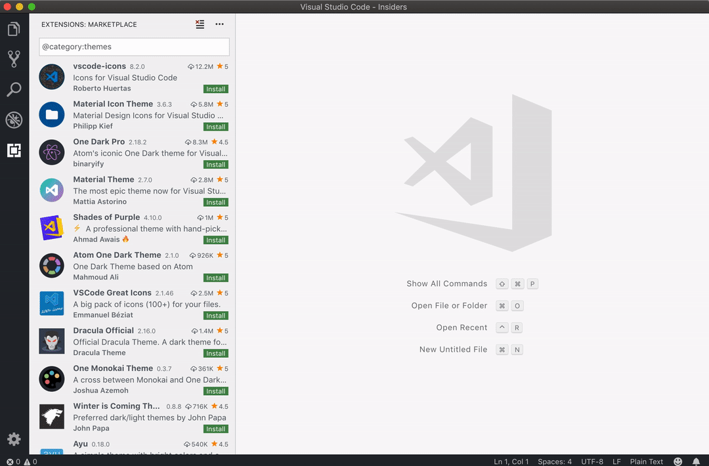

### Keyboard Shortcuts editor

You can now edit the `when` clause of a keybinding in the Keyboard Shortcuts editor.

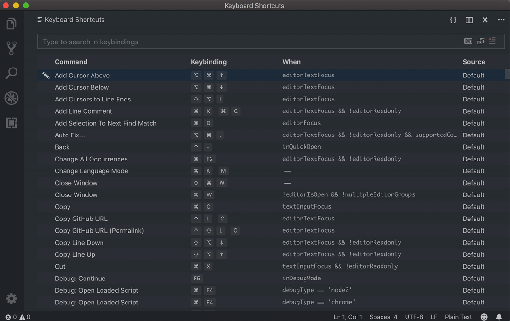

We removed the link that opens your `keybindings.json` file from the Keyboard Shortcuts editor in favor of the **{}** button on the right of the editor title bar.

When directly editing your `keybindings.json` file, the default keybindings are no longer shown on the left. If you prefer to see **Default Keybindings**, you can check the **Workbench > Settings: Open Default Keybindings** setting (`workbench.settings.openDefaultKeybindings` to `true`).

### Automatic Keyboard Navigation setting

A new setting **List: Automatic Keyboard Navigation** controls whether lists and trees capture lexicographic keypresses in order to navigate and filter elements. If disabled, keyboard navigation becomes modal and the `list.toggleKeyboardNavigation` command will toggle its state. You can assign a specific keyboard shortcut to that command. For example, you could set it to be `/` and only after pressing `/`, will subsequent keypresses filter items in lists/trees. This setting defaults to enabled.

Below is the keybinding to toggle keyboard navigation with `/` for the File Explorer:

```json
{
    "key": "/",
    "command": "list.toggleKeyboardNavigation",
    "when": "filesExplorerFocus"
}
```

### Default title bar style on Linux

After listening to user feedback, we have made the decision to revert our change of the default setting `window.titleBarStyle` from `custom` back to `native` on Linux. We still recommend the custom title bar for those needing better accessibility support. More information on this change has been documented in our [Linux setup](https://go.microsoft.com/fwlink/?linkid=2074137) page.

### New tree widget for Outline and Breadcrumbs

The Outline document symbol view and breadcrumb picker have adopted the new tree widget. The new implementation makes them faster and gives better filtering support, along with other new tree widget enhancements.

## Editor

### Hover and Problems peek improvements

In this release, a command bar with **Quick Fix** and **Peek Problem** actions was added to the Problems hover. The **Quick Fix** action applies Quick Fixes from the hover and the **Peek Problem** action will open the peek view in the editor.

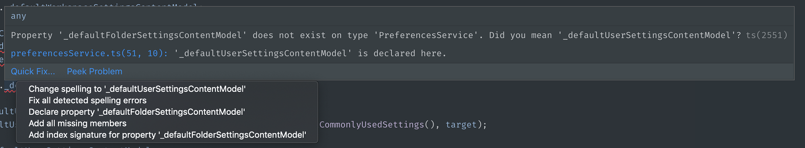

From a Problems peek view, you can now navigate to the previous and next error/warning.

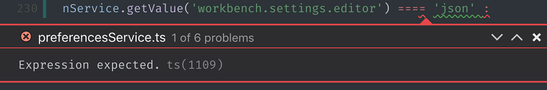

We also improved the appearance of the hovers and the Problems peek view. Hovers with problems and code blocks are given enough space to show their contents:

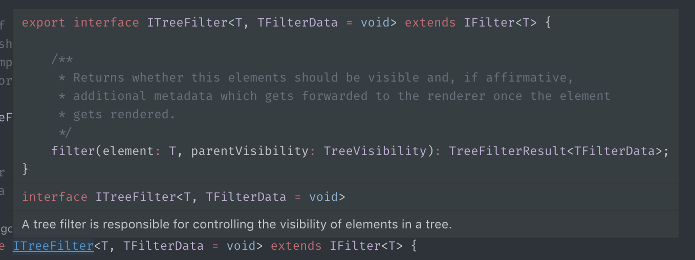

### Auto fix and preferred Code Actions

The Code Action API powers VS Code's Quick Fixes (the lightbulbs you see in the editor). Although there may be many Quick Fixes for a given error, there is often one that is the most reasonable fix for the problem. For example, fixing a spelling error is usually the more likely fix than generating new fields.

Extensions can now mark a Code Action as "preferred" to indicate that it is the most reasonable fix for the underlying problem. When a preferred fix is available, a blue badge is added to the lightbulb. Preferred fixes can be automatically applied using the **Auto Fix** command (`kb(editor.action.autoFix)`).

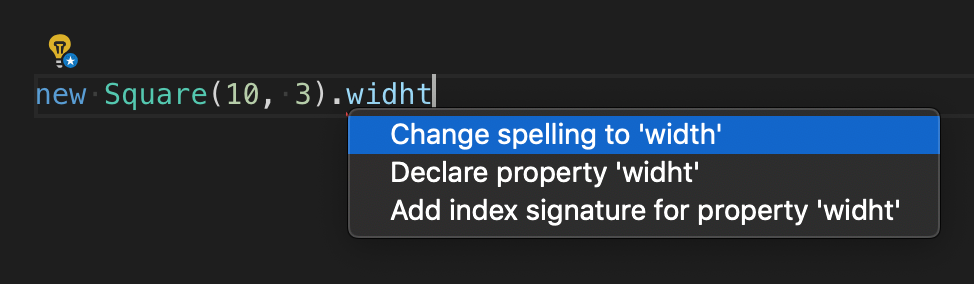

Preferred Quick Fixes should generally:

* Correctly fix the underlying error (and not suppress it).
* Be a reasonable fix for the error.
* Not perform extensive operations unexpectedly.

Refactoring Code Actions can also be marked as preferred to indicate that they are the most reasonable refactoring. For example, while multiple **Extract constant** refactorings may be available, the user usually wants to extract to the nearest local. If that refactoring Code Action is marked `isPreferred`, users can set up a single keybinding for it:

```json
{
  "key": "ctrl+shift+r ctrl+e",
  "command": "editor.action.codeAction",
  "args": {
    "kind": "refactor.extract.constant",
    "preferred": true
  }
}
```

### Fix All Source Actions

The new `source.fixAll` `CodeActionKind` establishes a convention for extensions that can auto fix errors in a file. This new Source Action kind is similar to **Organize imports** and makes it easy to configure keybindings for fix all actions or enable auto fix on save:

```json
// On save, run both fixAll and organizeImports source actions
"editor.codeActionsOnSave": {
    "source.fixAll": true,
    "source.organizeImports": true,
}
```

The [TSLint extension](https://marketplace.visualstudio.com/items?itemName=ms-vscode.vscode-typescript-tslint-plugin) already uses `source.fixAll` Code Action kind to implement fix all and auto fix on save.

### Default keybinding change for `expandLineSelection`

The command `expandLineSelection` is now bound by default to `Ctrl+L` (`Cmd+L` on macOS) and not to `Ctrl+I` (`Cmd+I`).

### Improved column selection

With the **Multi Cursor Modifier** setting configured to use `Ctrl` (`Cmd` on macOS) `"editor.multiCursorModifier": "ctrlCmd"`, and thus the `Alt` modifier is only used for Go to Definition, it is now possible to press the `Alt` modifier when dragging a selection in the editor to toggle between a regular selection or a column selection.

In the following video, the selection begins as a regular selection and then `Alt` is pressed and held until the mouse button is released:

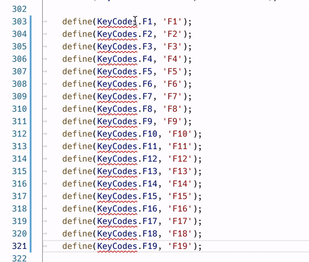

## Languages

### TypeScript 3.3.3

This release includes TypeScript 3.3.3, a small update that [fixes a few important bugs](https://github.com/microsoft/TypeScript/milestone/90?closed=1).

### No reload required when installing TypeScript extensions

[Last iteration](https://code.visualstudio.com/updates/v1_31#_no-reload-on-install), VS Code was changed to no longer require a reload after installing the vast majority of extensions. VS Code now also supports dynamic loading of [TypeScript plugin extensions](https://code.visualstudio.com/api/references/contribution-points#contributes.typescriptServerPlugins) as well. When you install a new TypeScript extension, such as [TSLint](https://marketplace.visualstudio.com/items?itemName=ms-vscode.vscode-typescript-tslint-plugin), the extension is automatically enabled without requiring a reload.

### No reload required when installing Markdown extensions

In addition, you no longer need to reload VS Code after installing an extension such as [GitHub Markdown Preview](https://marketplace.visualstudio.com/items?itemName=bierner.github-markdown-preview). Any active Markdown previews will be automatically updated as soon as a Markdown extension is installed.

### Improved HTML IntelliSense for ARIA attributes

Thanks to data retrieved from [W3C](https://www.w3.org/TR/wai-aria-1.1/#state_prop_def) and [MDN](https://developer.mozilla.org/docs/Web/Events), VS Code now shows descriptions for ARIA (Accessible Rich Internet Applications) attributes and DOM events.

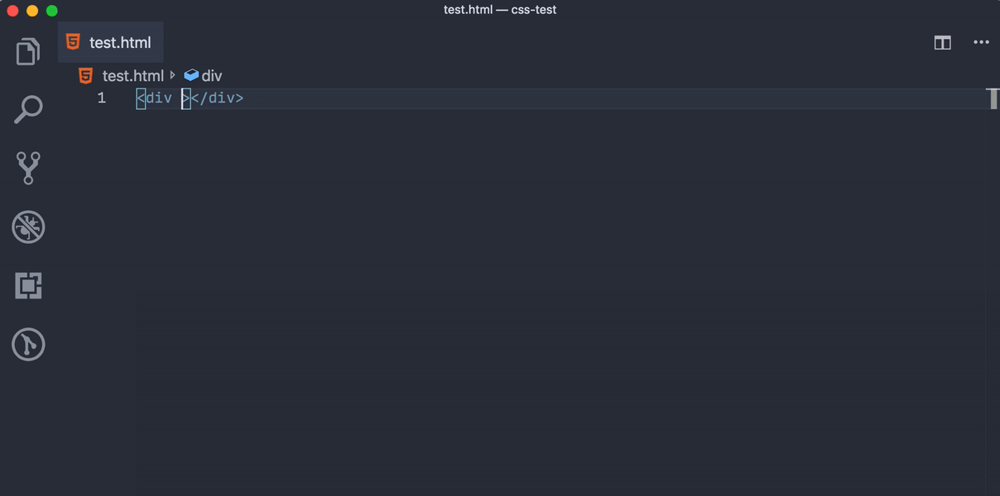

### Removed Razor support in HTML extension

The legacy [ASP.NET Razor](https://learn.microsoft.com/aspnet/web-pages/overview/getting-started/introducing-razor-syntax-c) support has been removed. We now recommend the [C# extension](https://marketplace.visualstudio.com/items?itemName=ms-dotnettools.csharp) for editing Razor files.

## Debugging

### Font configuration for Debug Console

Now it is possible to configure the font size, font family, and line height in the Debug Console using these settings: `debug.console.fontSize`, `debug.console.fontFamily`, and `debug.console.lineHeight`.

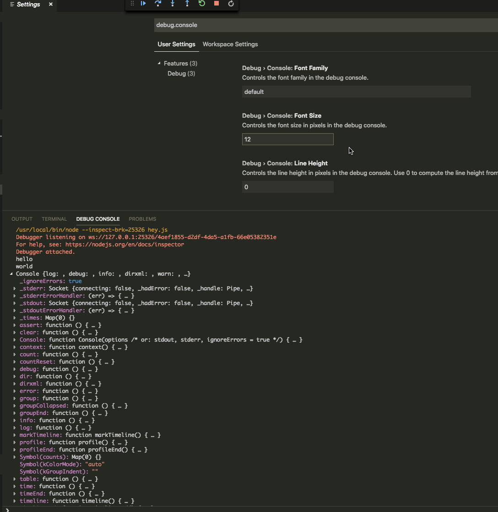

### Debug Console text wrapping

Thanks to the new tree widget adoption, the debug console now supports automatic text wrapping for all its elements, even attributes inside objects.

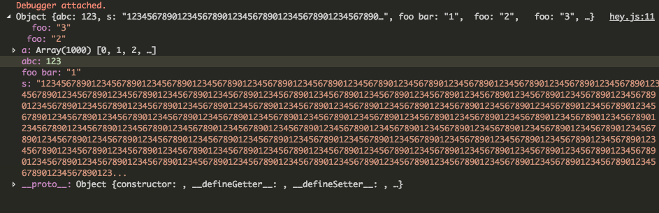

## Integrated Terminal

### Variable support in send sequence command

It's now possible to use [variables](https://code.visualstudio.com/docs/editor/variables-reference) with the `workbench.action.terminal.sendSequence` command, for example:

```json
{
  "key": "ctrl+shift+t",
  "command": "workbench.action.terminal.sendSequence",
  "args": { "text": ". ${file}" }
}
```

## Preview features

Preview features are not ready for release but are functional enough to use. We welcome your early feedback while they are under development.

### Automatically open a URI when debugging a server program

Developing a web program typically requires opening a specific URL in a web browser in order to hit the server code in the debugger. In this milestone, we added a first cut of a new VS Code feature that tries to automate this process in a flexible way.

Here is an example of a simple [Node.js Express](https://expressjs.com) application:

```javascript
var express = require('express');
var app = express();

app.get('/', function (req, res) {
  res.send('Hello World!')
});

app.listen(3000, function () {
  console.log('Example app listening on port 3000!')
});
```

This application first installs a "Hello World" handler for the "/" URL and then starts to listen for HTTP connections on port 3000. The port is announced in the Debug Console and typically the developer would now type `http://localhost:3000` into their browser application.

The new feature makes it possible to add a structured property `serverReadyAction` to any launch config and select an "action" to be performed:

```json
{
  "type": "node",
  "request": "launch",
  "name": "Launch Program",
  "program": "${workspaceFolder}/app.js",

  "serverReadyAction": {
    "pattern": "listening on port ([0-9]+)",
    "uriFormat": "http://localhost:%s",
    "action": "openExternally"
  }
}
```

Here the `pattern` property describes the regular expression for matching the program's output string that announces the port. The pattern for the port number is put into parenthesis so that it is available as a regular expression capture group. In this example, we are extracting only the port number, but it is also possible to extract a full URI.

The `uriFormat` property describes how the port number is turned into a URI. The first `%s` is substituted by the first capture group of the matching pattern.

The resulting URI is then opened outside of VS Code ("externally") with the standard application configured for the URI's scheme.

Alternatively, the `action` can be set to `debugWithChrome`. In this case, VS Code starts a Chrome debug session for the URI (which requires that the [Debugger for Chrome](https://marketplace.visualstudio.com/items?itemName=msjsdiag.debugger-for-chrome) extension is installed). In this mode, a `webRoot` property can be added that is passed to the Chrome debug session.

To simplify things a bit, most properties are optional and we use the following fallback values:

* **pattern**: `"listening on.* (https?://\\S+|[0-9]+)"` which matches the commonly used messages "listening on port 3000" or "Now listening on: https://localhost:5001".
* **uriFormat**: `"http://localhost:%s"`
* **webRoot**: `"${workspaceFolder}"`

And here the feature in action:

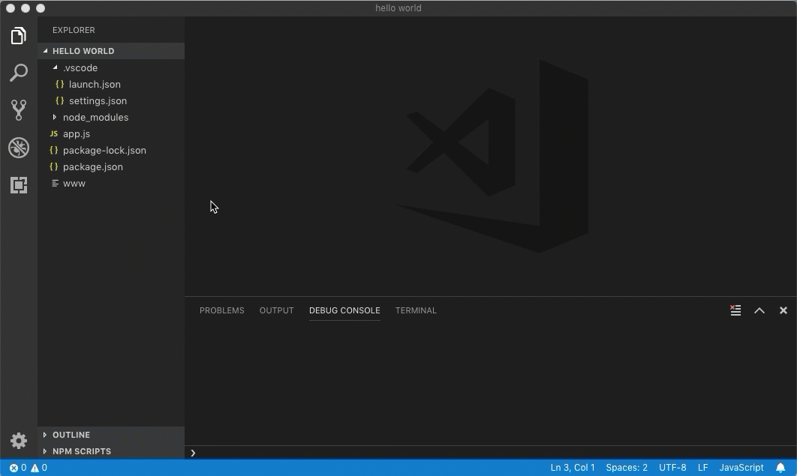

Please note that in the preview release of the feature:

* The pattern is only matched in the Debug Console. It doesn't yet work if the debug target is launched in the Integrated Terminal (and it will never work in external terminals).
* The feature does not warn if `debugWithChrome` is configured but the **Debugger for Chrome** extension is not installed.
* It is not yet possible to use other browser-based debuggers.

## Extension Authoring

### Contributing commands to debug toolbar

Now extensions can contribute commands to the debug toolbar.

Here's an example from an extension's `package.json`:

```json
"contributes": {
  "commands": [
    {
      "command": "dart.hotReload",
      "title": "Hot Reload",
      "icon": {
        "dark": "./media/hot_reload_inverse.svg",
        "light": "./media/hot_reload.svg"
      }
    }
  ],
  "menus": {
    "debug/toolbar": [
      {
        "command": "dart.hotReload",
        "when": "debugType == dart",
        "group": "dart"
      }
    ]
  }
}
```

The extension adds a "Hot Reload" button seen on the right of the debug toolbar.

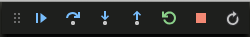

### SignatureHelpContext.activeSignatureHelp

`SignatureHelpContext` object now have an `activeSignatureHelp` field that tracks the previously active signature:

```typescript
import * as vscode from 'vscode';

class MySignatureHelpProvider implements vscode.SignatureHelpProvider {
    provideSignatureHelp(
        document: vscode.TextDocument,
        position: vscode.Position,
        token: vscode.CancellationToken,
        context: vscode.SignatureHelpContext
    ): vscode.ProviderResult<vscode.SignatureHelp> {
        // The active signature help when this provider was triggered or undefined if
        // no signature help was active.
        console.log(context.activeSignatureHelp);

        ...
    }
}
```

Providers can use this to track which overload was selected by the user before the signature help provider was retriggered.

## Proposed extension APIs

Every milestone comes with new proposed APIs and extension authors can try them out. As always we are keen on your feedback. This is what you have to do to try out a proposed API:

* You must use Insiders because proposed APIs change frequently.
* You must have this line in the `package.json` file of your extension: `"enableProposedApi": true`.
* Copy the latest version of the [vscode.proposed.d.ts](https://github.com/microsoft/vscode/blob/main/src/vs/vscode.proposed.d.ts) file into your project.

Note that you cannot publish an extension that uses a proposed API. We may likely make breaking changes in the next release and we never want to break existing extensions.

### workspace.registerResourceLabelFormatter

```typescript
export interface ResourceLabelFormatter {
  scheme: string;
  authority?: string;
  formatting: ResourceLabelFormatting;
}

export interface ResourceLabelFormatting {
  label: string; // myLabel:/${path}
  separator: '/' | '\\' | '';
  tildify?: boolean;
  normalizeDriveLetter?: boolean;
  workspaceSuffix?: string;
  authorityPrefix?: string;
}

export namespace workspace {
  export function registerResourceLabelFormatter(formatter: ResourceLabelFormatter): Disposable;
}
```

Extensions can use the `registerResourceLabelFormatter` to contribute dynamically resource label formatters that specify how to display URIs everywhere in the workbench.

## Engineering

### Linux 32-bit support ends soon

VS Code is using [Electron](https://electronjs.org/) as framework to run on multiple platforms. We are currently using Electron version 3.x, which will be the last version to support Linux on 32-bit architectures. As we are planning to move to Electron 4.x soon (1-2 months), this means that VS Code will no longer run on Linux 32-bit. Please [update](https://code.visualstudio.com/download) your version of VS Code to the 64-bit version. All your settings and extensions will work as before without the need to migrate anything. You can read the [related blog post](https://electronjs.org/blog/linux-32bit-support) from Electron for more information.

### Strict null progress

We continued to make good progress towards [strict null checking the main VS Code codebase](https://github.com/microsoft/vscode/issues/60565). This iteration, we cut the number of remaining strict null errors in half, fixing over 2000 errors. We still have around 1800 strict null errors left, and many of the remaining errors are tricky ones, but the end is in sight.

### Compiling to ES6

VS Code is written TypeScript, and TypeScript is compiled into JavaScript. TypeScript can target different JavaScript versions and with this release, we target ES6 JavaScript. ES6 is much closer to TypeScript and produces less code, which means faster loading times.

**Note:** This means our JavaScript output uses [classes](https://developer.mozilla.org/docs/Web/JavaScript/Reference/Classes) as defined in JavaScript. We have a utility in place that still allows functions to "extend" from those classes and we have created a [tracking item](https://github.com/microsoft/vscode/issues/68698) for extensions authors to now emit ES6 as well. Everything should still work as before but we encourage everyone to get on the ES6 train.

## Contributions to Extensions

### GitHub Pull Requests

This milestone we continued working on improvements to the [GitHub Pull Requests](https://marketplace.visualstudio.com/items?itemName=GitHub.vscode-pull-request-github) extension.

Below are some of the new features:

* View and assign reviewers and labels on the pull request description page.
* GitHub Pull Request tree views now show in its own view container. You can also choose to show them in Source Control view by modifying `githubPullRequests.showInSCM`.
* View and modify reactions on comments.

### Vetur

The [Vetur](https://github.com/vuejs/vetur) extension now provides IntelliSense (smart completions) for Vue.js [interpolations](https://vuejs.org/v2/guide/syntax.html#Interpolations).

The completion items are sourced from Vue.js `props`, `data`, `computed`, and `methods` API calls. The source code, along with any JSDoc documentation, are used as completion item descriptions.

When using child components from parent components, Vetur also offers IntelliSense on the child component's `props`.


Other notable features include:

* Using Prettier as an option for `<template>` formatter.
* GraphQL custom block syntax highlighting.
* Pug interpolation syntax highlighting.

You can learn more about the features in Vetur's [Changelog](https://github.com/vuejs/vetur/blob/master/CHANGELOG.md).

## New documentation

### Bundling extensions with webpack

For extension authors, there is a new [Bundling Extensions](https://code.visualstudio.com/api/working-with-extensions/bundling-extension) topic on bundling extensions files with [webpack](https://webpack.js.org/) to reduce extension load time.


### Working with JavaScript

A new [Working with JavaScript](https://code.visualstudio.com/docs/nodejs/working-with-javascript) article describes advanced JavaScript features supported by VS Code. You'll learn the benefits of adding [JavaScript project files](https://code.visualstudio.com/docs/nodejs/working-with-javascript#_javascript-projects-jsconfigjson) (jsconfig.json) to your code as well as how to enable [type checking](https://code.visualstudio.com/docs/nodejs/working-with-javascript#_type-checking-javascript).

## Notable fixes

* [55084](https://github.com/microsoft/vscode/issues/55084): Allow to create/open file names containing backslash
* [68204](https://github.com/microsoft/vscode/issues/68204): New file doesn't show in explorer after creating from path like 'folder/subfolder/file.txt'
* [68316](https://github.com/microsoft/vscode/issues/68316): New workbench explorer treeview fails to update properly
* [68616](https://github.com/microsoft/vscode/issues/68616): Debug points getting hit but no visual indication when debugging nodejs (mocha tests)
* [68691](https://github.com/microsoft/vscode/issues/68691): No input box to create new file in Explorer
* [68627](https://github.com/microsoft/vscode/issues/68627): 'Reveal in sidebar` does not work
* [67970](https://github.com/microsoft/vscode/issues/67970): New explorer: switching editors should clear focus

This release also include a security update for Microsoft Security Response Center CVE-2019-5786, which you can read about in this [Electron blog post](https://electronjs.org/blog/filereader-fix).

## Thank you

Last but certainly not least, a big *__Thank You!__* to the following folks that helped to make VS Code even better:

Contributions to our issue tracking. Please see our [Community Issue Tracking](https://github.com/microsoft/vscode/wiki/Community-Issue-Tracking) page, if you want to help us manage incoming issues:

* [Alexander (@usernamehw)](https://github.com/usernamehw)
* [Simon Chan (@yume-chan)](https://github.com/yume-chan)
* [Eric Amodio (@eamodio)](https://github.com/eamodio)
* [John Murray (@gjsjohnmurray)](https://github.com/gjsjohnmurray)
* [Christopher Leidigh (@cleidigh)](https://github.com/cleidigh)

Contributions to `vscode`:

* [Max Sysoev (@ColCh)](https://github.com/ColCh): Configure long line length  [PR #65137](https://github.com/microsoft/vscode/pull/65137)
* [Derek Ziemba (@DerekZiemba)](https://github.com/DerekZiemba): Ctrl+Click - Either open in Peek or go to definition, not BOTH! [PR #68023](https://github.com/microsoft/vscode/pull/68023)
* [David Lechner (@dlech)](https://github.com/dlech): add editor.indentSize option [PR #62079](https://github.com/microsoft/vscode/pull/62079)
* [Alexandr Fadeev (@fadeevab)](https://github.com/fadeevab)
  * Makefile grammar updating: tests are updated about the handling @, - and + [PR #65629](https://github.com/microsoft/vscode/pull/65629)
  * Makefile colorizing tests - handling variable expansion in a variable name [PR #67921](https://github.com/microsoft/vscode/pull/67921)
* [Chris Ganga (@gangachris)](https://github.com/gangachris): correct message for global and snippet templates [PR #67060](https://github.com/microsoft/vscode/pull/67060)
* [Geir Hauge (@geirha)](https://github.com/geirha): Use hard quotes rather than soft quotes #61902 [PR #68435](https://github.com/microsoft/vscode/pull/68435)
* [Gleisson Ricardo (@gleissonmattos)](https://github.com/gleissonmattos): main.js code review [PR #68245](https://github.com/microsoft/vscode/pull/68245)
* [Jay Rodgers (@headmelted)](https://github.com/headmelted): Updating ARM code from arm to armv7l [PR #68250](https://github.com/microsoft/vscode/pull/68250)
* [Hao Hu (@hhu94)](https://github.com/hhu94): Add git diff terminal link handler [PR #67828](https://github.com/microsoft/vscode/pull/67828)
* [Hugo Sartori (@HugoSart)](https://github.com/HugoSart): Added "_" prefix in private method names. [PR #67078](https://github.com/microsoft/vscode/pull/67078)
* [Matt Q (@irrationalRock)](https://github.com/irrationalRock): Fixed #64679 - Delete Lines now works with multiple selections on multiple lines [PR #67287](https://github.com/microsoft/vscode/pull/67287)
* [John Blackbourn (@johnbillion)](https://github.com/johnbillion): Treat Composer lock files as JSON by default [PR #67861](https://github.com/microsoft/vscode/pull/67861)
* [강동윤 (@kdy1)](https://github.com/kdy1): Treat .swcrc file as json [PR #67517](https://github.com/microsoft/vscode/pull/67517)
* [Volodymyr Klymenko (@klymenkoo)](https://github.com/klymenkoo): Keep extensions' search input value after window reload [PR #68198](https://github.com/microsoft/vscode/pull/68198)
* [Luis GG (@lggomez)](https://github.com/lggomez): Propagate context information on CopyValueAction evaluate requests [PR #68585](https://github.com/microsoft/vscode/pull/68585)
* [Luciana da Costa Marques (@LucianaMarques)](https://github.com/LucianaMarques): Changed keybinding to select current line -issue 59003 [PR #67178](https://github.com/microsoft/vscode/pull/67178)
* [Matthew Kwiecien (@mattkwiecien)](https://github.com/mattkwiecien): When wrapping with Emmet, consider the document language when setting the syntax. [PR #68326](https://github.com/microsoft/vscode/pull/68326)
* [Milo Halsey-Perry (@MHalseyPerry)](https://github.com/MHalseyPerry): Improves flipped cursor on line numbers [PR #66618](https://github.com/microsoft/vscode/pull/66618)
* [Pedro Fernandes (@MrZephyr17)](https://github.com/MrZephyr17): Suppress display of end-of-file newline as blank line [PR #64667](https://github.com/microsoft/vscode/pull/64667)
* [Nilesh Kevlani (@njkevlani)](https://github.com/njkevlani): Resolve vars in text for sendSequence to Terminal [PR #67182](https://github.com/microsoft/vscode/pull/67182)
* [Pranshu Gupta (@Pranshu258)](https://github.com/Pranshu258):  Added strict null checks for findModel.test.ts [PR #66706](https://github.com/microsoft/vscode/pull/66706)
* [Jaco Swarts (@productiveme)](https://github.com/productiveme): Include triple-stash bracket and add brace to surroundingPairs [PR #68833](https://github.com/microsoft/vscode/pull/68833)
* [Rob DeLine (@rdeline)](https://github.com/rdeline): Code inset feature [PR #66418](https://github.com/microsoft/vscode/pull/66418)
* [Sebastian De Deyne (@sebastiandedeyne)](https://github.com/sebastiandedeyne): Fix types in Emmet comments [PR #69121](https://github.com/microsoft/vscode/pull/69121)
* [Steve Shreeve (@shreeve)](https://github.com/shreeve): Improve column selection by setting origin to clicked position [PR #66445](https://github.com/microsoft/vscode/pull/66445)
* [Travis Thieman (@thieman)](https://github.com/thieman): Give hover popups focus only when accessibility support is enabled [PR #66827](https://github.com/microsoft/vscode/pull/66827)
* [Yusuke Tsutsumi (@toumorokoshi)](https://github.com/toumorokoshi)
  * Modifying ChordKeybinding to support multiple chords [PR #65826](https://github.com/microsoft/vscode/pull/65826)
  * Modifying ResolvedKeybindingItem to support multiple chords [PR #68863](https://github.com/microsoft/vscode/pull/68863)
* [Trevor Florence (@trevorade)](https://github.com/trevorade): Make EditStack correctly report canUndo [PR #69239](https://github.com/microsoft/vscode/pull/69239)
* [Alexander (@usernamehw)](https://github.com/usernamehw)
  * Fix wrong hover on empty when column [PR #67817](https://github.com/microsoft/vscode/pull/67817)
  * Autocomplete/validation `args` for keybindings.json [PR #66458](https://github.com/microsoft/vscode/pull/66458)
* [@WorldofBay](https://github.com/WorldofBay): fix lua indentation [PR #68978](https://github.com/microsoft/vscode/pull/68978)
* [Yan Pashkovsky (@Yanpas)](https://github.com/Yanpas): rejected promise not handled verbose message [PR #67640](https://github.com/microsoft/vscode/pull/67640)

Contributions to `vscode-languageserver-node`:

* [Aleksey Kladov (@matklad)](https://github.com/matklad): Proposed extensions: textDocument/selectionRange [PR #441](https://github.com/microsoft/vscode-languageserver-node/pull/441)
* [John Wiseheart (@johnwiseheart)](https://github.com/johnwiseheart): Add generic capabilities type [PR #459](https://github.com/microsoft/vscode-languageserver-node/pull/459)

Contributions to `node-jsonc-parser`:

* [John Spurlock (@johnspurlock)](https://github.com/johnspurlock): Fix a few typos in doc comments [PR #15](https://github.com/microsoft/node-jsonc-parser/pull/15)

Contributions to `vscode-generator-code`:

* [Ace Cassidy (@Ace-Cassidy)](https://github.com/Ace-Cassidy): fix markdownlint(MD022) violation [PR #161](https://github.com/microsoft/vscode-generator-code/pull/161)

Contributions to `vscode-vsce`:

* [小胡子哥 (@barretlee)](https://github.com/barretlee): Fixbug: increase the stdout/stderr buffer of exec [PR #309](https://github.com/microsoft/vscode-vsce/pull/309)

Contributions to `vscode-recipes`:

* [Jose Constela (@joseconstela)](https://github.com/joseconstela)
  * Fix #99 [PR #191](https://github.com/microsoft/vscode-recipes/pull/191)
  * Fix missing commas on README for MeteorJS [PR #190](https://github.com/microsoft/vscode-recipes/pull/190)
* [Ryan Morrin (@rmorrin)](https://github.com/rmorrin): Fix type for isBackground in Angular-CLI [PR #194](https://github.com/microsoft/vscode-recipes/pull/194)
* [Dave Sirockin (@sirockin)](https://github.com/sirockin): Updated Docker-TypeScript tasks.json to version 2.0.0 [PR #197](https://github.com/microsoft/vscode-recipes/pull/197)

Contributions to `localization`:

There are over 700 [Cloud + AI Localization](https://github.com/microsoft/Localization/wiki) community members using the Microsoft Localization Community Platform (MLCP), with over about 100 active contributors to Visual Studio Code.

We appreciate your contributions, either by providing new translations, voting on translations, or suggesting process improvements.

Here is a snapshot of [contributors](https://microsoftl10n.github.io/VSCode/). For details about the project including the contributor name list, visit the project site at [https://aka.ms/vscodeloc](https://aka.ms/vscodeloc).

* **Bosnian:** Ismar Bašanović.
* **Bulgarian:** Любомир Василев.
* **Czech:** Jakub Stibůrek, Samuel Tulach, Jan Brudný.
* **Danish:** Lasse Stilvang,Alexander Matzen,Johan Fagerberg.
* **Dutch:** Jos Verlinde, Eric Algera.
* **English (United Kingdom):**  Mohammad Idrees.
* **Finnish:** Petri Niinimäki, Riku Riikonen, Valtteri Vatanen.
* **French:** Mohamed Sahbi, Antoine Griffard, Maxime COQUEREL, franto.
* **German:** Frank Lindecke, Jakob von der Haar, Hans Meiser, Carsten Kneip, Sebastian Seidl.
* **Greek:** Jim Spentzos, John D, Δημήτρης Παπαϊωάννου.
* **Hebrew:** Snir Broshi, Kyle Orin.
* **Hindi:** Satish Yadav, Ashok Kumar Rathore, nirav adatiya, Amit Gusain, shaswat rungta, Jagjeet Singh, Pratishek PII, Chethana S, Dhanvi Kapila.
* **Chinese Simplified:** Tingting Yi, 斌 项, feiyun0112 feiyun0112, 建东 薛, 刘瑞恒 刘瑞恒, Junzhe Liu, Dave Young, 昊宇 周, Joel Yang, Tony Xia, XIANG ZUO, Edi Wang, Zhiqiang Li, 福永 叶, G.Y. Z,Hao Hu, Pluwen, meng shao, YITING ZHU, Xiangrui Kong, Liam Kennedy, 松阳 樊, Young Bige, Justin Liu, Jessica Zhang, Licheng Ren, 驰 雷, 彦佐 刘, xiong Fu, Fan Su, Lynne Dong, 吉姆 舒, 游 尤, 剑秋, 陶, Hanlin Yang, bh wu, Y F, WangCG duoduobear, ziqiang sun, 越 郑, Jiang LI, 正元 刘, peng wei, 瑜 周, 仁松 陈, 翼 张, Ludi Fang, 九鼎 谭.
 **Chinese Traditional:** 奕濬 潘, Winnie Lin.
* **Hungarian:** Péter Nagy, Dániel Tar.
* **Indonesian:** Laurensius Dede Suhardiman, Afnizar Nur Ghifari, Pradipta Hendri, Azhe Kun, Italian (Italy), Bruni Luca, Alessandro Alpi, Andrea Dottor, Riccardo Cappello, Aldo Donetti, Michael Longo.
* **Japanese:** nh, EbXpJ6bp -, Masakazu TENMYO, Takayuki Fuwa, Makoto Sakaguchi, 裕子 知念, Rie Moriguchi, Koichi Makino, Fujio Kojima, Kazuya Ujihara.
* **Korean:** Jong Heun Shin, Kyunghee Ko, Jae Yong Kum, SeungJin Jeong.
* **Norwegian:** Cookius Monsterius, Stephan Eriksen.
* **Polish:** Grzegorz Miros, Tomasz Świstak, Michal Szulc, Bartek PL, Szymon Seliga, Tomasz Chojnacki, Marcin Weksznejder, Artur Pelczar, Marcin Floryan, Jakub Jedryszek.
* **Portuguese (Brazil):** Marcondes Alexandre, Albert Tanure, Marcelo Fernandes, Junior Galvão - MVP, Ray Carneiro, Eduardo Moura, Bruno Talanski, Bruno Sonnino, Jucinei Pereira dos Santos, Emmanuel Gomes Brandão, Flávio Albuquerque Camilo, Pablo Garcia, Lucas Miranda, Giuliano Reginatto, Alan William, Lucas Nunes, Gabriel Schade, arthurdenner., Mauricio Lima, Roberto Fonseca, Letticia Nicoli, Milton Camara, Alessandro Fragnani, Marcelo Guerra, Cynthia Zanoni, Jhonathan Soares, Rafael Laranja, Swellington Soares.
* **Portuguese(Portugal):** João Carvalho, Vitor Barbosa.
* **Russian:** michael v, Иван Лещенко.
* **Spanish:** Andy Gonzalez, Alvaro Enrique Ruano, Engel Aguilar, Carlos Mendible, José María Aguilar, julian3xl, Ing. Sergio Uziel Tovar Lemus, Mario Mendieta, Jorge Serrano Pérez.
* **Tamil:** Mani M, Krishna Pravin, Vetri.
* **Turkish:** Hüseyin Fahri Uzun, Okan Çetin, Muhammed Emin TİFTİKÇİ.
* **Ukrainian:** Did Kokos.
* **Vietnamese:** Việt Anh Nguyễn, Belikhun.

<!-- In-product release notes styles.  Do not modify without also modifying regex in gulpfile.common.js -->
<a id="scroll-to-top" role="button" aria-label="scroll to top" href="#"><span class="icon"></span></a>
<link rel="stylesheet" type="text/css" href="css/inproduct_releasenotes.css"/>
