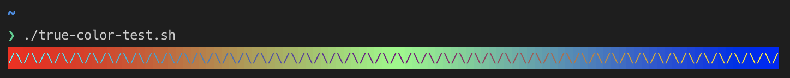

# May 2019 (version 1.35)

<!-- DOWNLOAD_LINKS_PLACEHOLDER -->

## Insiders Release

Welcome to the Insiders build. These are the preliminary notes for the May 1.35 release of Visual Studio Code. As we get closer to the release date, you'll see details below about new features and important fixes.

Until the May release notes are available, you can still track our progress:

* **[May iteration plan](https://github.com/microsoft/vscode/issues/74143)** - See what's planned for the milestone.
* **[Commit Log](https://github.com/microsoft/vscode/commits/master)** - GitHub commits to the vscode open-source repository.
* **[Closed issues](https://github.com/microsoft/vscode/milestone/89?closed=1)** - Resolved bugs and implemented feature requests in the milestone.

We really appreciate people taking a look at our new features as soon as they are ready so check back here often and learn what's new to try out.

If you find issues or have suggestions, you can enter them in the [VS Code repository](https://github.com/Microsoft/vscode/issues) on GitHub.

## New Visual Studio Code logo

Over the past two months, we've been working on updating the VS Code product logo. [We've taken feedback from the community](https://github.com/microsoft/vscode/issues/71827) (thank you to everyone that responded) and we are happy to release the new logos for Stable and Insiders. We are also using same logo on all platforms.

Stable | Insiders
--- | ---
 | 

**Note**: Depending on your platform, you may still see the earlier logo due the operating system caching the application icon. If you do encounter caching issues, [follow these steps](https://github.com/microsoft/vscode/issues/71827#issuecomment-498352621) to clear your icon cache.

## Editor

### Go to Definition improvements

We have polished the **Go to Definition** action and its friends, **Go to Declaration**, **Go to Type Definition**, and **Go to Implementation**.

* Earlier, we added the `editor.gotoLocation.multiple: goto` option to disable showing a Peek view when a symbol has multiple definitions. However, it would only show the first definition and ignore the rest. This is now much better, as multiple results are shown in the Status bar and pressing `kb('editor.gotoNextSymbolFromResult')` repeatedly reveals them all.


* **Go to Definition** now honors the `workbench.editor.revealIfOpen` setting. This means that an editor that is already open in another group can be reused (or not) when going to a symbol. Note that the old, hard-coded behavior was to reuse the current editor and the default for `revealIfOpen` is not to reuse.
* The Peek view now supports search and filter, like the results tree, to allow you to quickly narrow down on a result.
* Last but not least, you can now cancel long running requests for definitions by pressing `kb('editor.cancelOperation')`.

### Breadcrumbs displayed

Breadcrumbs are now on by default. This can be toggled in the View menu **View** > **Toggle Breadcrumbs** command.


## Languages

### TypeScript 3.5

VS Code now ships with [TypeScript 3.5.1](https://devblogs.microsoft.com/typescript/announcing-typescript-3-5/). This update brings TypeScript language improvements, along with tooling enhancements for both JavaScript and TypeScript. It also fixes a number of important bugs, including fixes for performance issues that some users were seeing when working with styled-components.

### Smart selection for JavaScript and TypeScript

JavaScript and TypeScript now support [smart selection](https://code.visualstudio.com/updates/v1_33#_smart-select-api). This feature uses semantic knowledge to intelligently expand selections for expressions, types, statements, classes, and imports:


### Extract to type alias refactoring for TypeScript

Use the new **Extract to type alias**  refactoring for TypeScript to quickly extract part type into its own type alias:


The **Extract to type alias** refactoring has a kind of `refactor.extract.type`. You can configure a single keybinding that extracts either constants or type aliases using:

```json
{
    "key": "shift+ctrl+e",
    "command": "editor.action.codeAction",
    "args": {
        "kind": "refactor.extract",
        "preferred": true
    }
}
```

See the [Code Action](https://code.visualstudio.com/docs/editor/refactoring#_keybindings-for-code-actions) documentation for more information on configuring keybindings for refactorings.

### JavaScript and TypeScript suggestion sorting

We've tuned our suggestion sorting for JavaScript and TypeScript to more heavily prioritize suggestions for local variables over suggestions for globals or auto-imports:


## Integrated Terminal

### True color support

The terminal now supports programs that use true color (24-bit) escape sequences, rendering the correct color instead of the previous approximation of it.

Before:


After:



### Improved surfacing of shell selector on Windows

For some time, there has been a command to select the default shell on Windows. This release makes the command more discoverable as a shortcut available in the terminal selector dropdown.


## Source control

### Compare merge conflict with complete context in new editor groups

We have introduced the setting `merge-conflict.diffViewPosition` to allow you to open the diff view in a new editor group when you compare merge conflicts. In addition, it shows the complete diff view of the changed file, which provides a better context of the merge conflicts.


## Extension authoring

### Command enablement

Contributed commands can now control their enabled state using a new `enablement` property. Its value is a [when](https://code.visualstudio.com/docs/getstarted/keybindings#_when-clause-contexts) clause, similar to keybindings and menu contributions.

The sample below shows how to add a **Hello Enablement** command to the editor's context menu and have its enabled state depend on whether text is selected in an editor.

```json
"commands": [{
    "command": "extension.sayHello",
    "title": "Hello Enablement",
    "enablement": "editorHasSelection"
}],
"menus": {
    "editor/context": [{
        "command": "extension.sayHello",
    }]
}
```


Note that certain menu implementations, like the Command Palette, don't show commands that are disabled. Also there is some semantic overlap between `enablement` of commands and the `when` clause of menu items. The former defines the enabled state for all representations of a command while the latter defines when a command should be included in a menu. For instance, an explorer context menu item might only make sense for certain file types, such as TypeScript files, while enabling that command might depend on another condition, for example "TypeScript server running".

### Updated Octicons

We have added new icons to the Octicon library:


```$(error) $(info) $(info-outline) $(smiley) $(smiley-outline) $(warning)```

We have also updated existing icons to be a consistent size:


```$(beaker) $(bell) $(info-outline) $(tools)```

**Note:** We also changed the default for `$(info) $(smiley)` to be a solid version and the previous ones were renamed to `$(info-outline) $(smiley-outline)`.

### New theme color for active tab of an inactive editor group

A new color `tab.unfocusedActiveBackground` allows you to control the background color of the active tab in an editor group that does not have focus. This color inherits from the `tab.activeBackground` color.

### Webviews that set retainContextWhenHidden can now receive messages even if they are in the background

Webviews that set `retainContextWhenHidden` can now receive messages even if they are not visible. Previously, only visible webviews could receive messages using `.postMessage`.

Keep in mind that in order to provide a good user experience, webviews should not perform complex operations such as DOM manipulation or network requests while in the background.

### Comments API

We have finalized the Comments API that allows extensions to provide commenting support within VS Code. For example, the [GitHub Pull Request](https://marketplace.visualstudio.com/items?itemName=GitHub.vscode-pull-request-github) extension uses the Comments API to create and update comments for open pull requests directly in the editor and a dedicated Comments Panel.

You can play with the [comment sample extension](https://github.com/microsoft/vscode-extension-samples/tree/master/comment-sample) to get a better understanding of the API or take a deep look at the [GitHub Pull Request extension repository](https://github.com/microsoft/vscode-pull-request-github/pull/1168).

### Uninstall extension command

There is a new command, `workbench.extensions.uninstallExtension`, to uninstall an installed extension.

```typescript
vscode.commands.executeCommand('workbench.extensions.uninstallExtension', 'ms-python.python');
```

## Debug Adapter Protocol

Thanks to [Andrew Crawley](https://github.com/andrewcrawley), the Debug Adapter Protocol better supports hardware-oriented debuggers that need to surface processor registers and memory contents. Both additions are optional and existing and new debug adapters are not affected. However, if a debug adapter is interested in showing registers and/or memory contents, it can opt into these features. Note that the debugger frontend needs to add support: Visual Studio plans to support both and we have not yet decided for Visual Studio Code.

### Support for reading registers

Register support for DAP has been retrofitted to the existing "Scope" mechanism: a debug adapter can return a set of CPU registers to the frontend as an additional scope in the `scopes` request. To mark a scope as a "register" scope, a new optional `presentationHint` attribute and a value `registers` has been added to the `Scopes` type. Using this hint is all needed to opt into the feature; there is no corresponding capability.

### Support for memory access and disassembly

This feature centers around "memory references." A memory reference is an opaque identifier that can be used (along with an optional byte offset) to identify a single location in memory. A debug adapter has the option of providing a memory reference on DAP responses that represent things a frontend might want to display in a memory view or use as a starting point for disassembly, for example `EvaluateResponse` and `Variable`. Since providing memory references could be expensive for a debug adapter, the frontend announces that it can actually use memory references by sending a `supportsMemoryReferences` capability in the `initialize` request.

With a_memory reference in hand, a frontend can read memory via a new `readMemory` request and it can disassemble source code via a new `disassemble` request.
If a debug adapter implements these requests, it can announce it via the two capabilities, `supportsReadMemoryRequest` and `supportsDisassembleRequest`.

## Proposed extension APIs

Every milestone comes with new proposed APIs and extension authors can try them out. As always we are keen on your feedback. This is what you have to do to try out a proposed API:

* You must use Insiders because proposed APIs change frequently.
* You must have this line in the `package.json` file of your extension: `"enableProposedApi": true`.
* Copy the latest version of the [`vscode.proposed.d.ts`](https://github.com/Microsoft/vscode/blob/master/src/vs/vscode.proposed.d.ts) file into your project.

Note that you cannot publish an extension that uses a proposed API. We may likely make breaking changes in the next release and we never want to break existing extensions.

### DocumentLink.tooltip

The proposed `DocumentLink.tooltip` property allows a `DocumentLinkProvider` to customize the text displayed when a user hovers over a document link:


VS Code includes instructions on how to activate the link (`Cmd+click to` in this example) along with the `tooltip` text.

### Background terminals

The new proposed `runInBackground` terminal option lets extension authors create terminals but not surface them through the UI. Background terminals will become regular terminals visible to the user once `Terminal.show()` is called for the first time.

```ts
// Create a background terminal
const terminal = window.createTerminal({ runInBackground: true });

// Show the terminal in the panel
terminal.show();
```

This is useful if you need an interactive terminal session but don't want to display it to the user unless something goes wrong.

## New documentation

### Remote Development topics

The VS Code Remote Development extensions are still in preview but there is extensive [documentation](https://code.visualstudio.com/docs/remote/remote-overview) to help you get started.

There are specific topics for each Remote Development extension:

* [Remote - SSH](https://code.visualstudio.com/docs/remote/ssh.md) - Connect to any location by opening folders on a remote machine/VM using SSH.
* [Remote - Containers](https://code.visualstudio.com/docs/remote/containers.md) - Work with a sandboxed toolchain or container-based application inside (or mounted into) a container.
* [Remote - WSL](https://code.visualstudio.com/docs/remote/wsl.md) - Get a Linux-powered development experience in the Windows Subsystem for Linux.

Under the [Remote](https://code.visualstudio.com/docs/remote) table of contents, you will also find a [Tips and Tricks](https://code.visualstudio.com/docs/remote/troubleshooting) guide as well as [FAQ](https://code.visualstudio.com/docs/remote/faq).

## Notable improvements

* The history of the References view can now be cleared.
* When running the **Format With...** command, the default formatter is now pre-selected.
* When debugging is paused on a line, the whole line is read out by the screen reader.
* Multiple item paste in the Explorer is run in parallel for improved performance.
* Explorer: **Open Folder** button in the empty explorer view is scoped to folder even on macOS.
* Collapse All list and tree command with `kb(list.collapseAll)` keyboard shortcut.

## Notable fixes

* [15749](https://github.com/microsoft/vscode/issues/15749): Potential data loss for files that changed on disk meanwhile after a backup was made
* [17115](https://github.com/microsoft/vscode/issues/17115): Preserve picked language for files across restarts
* [74446](https://github.com/microsoft/vscode/issues/74446): Completion providers with resolve methods leak memory
* [74457](https://github.com/microsoft/vscode/issues/74457): URI: Should invalidate cached _fsPath when crossing platforms
* [73783](https://github.com/microsoft/vscode/issues/73783): Make workbench.dialogs.useSimplified a real setting
* [68793](https://github.com/microsoft/vscode/issues/68793): Clicking anywhere on the "debug console" pane should "focus" on input box
* [73457](https://github.com/microsoft/vscode/issues/73457): Breakpoint lines are not correct when saving the source file after modifying the file
* [68812](https://github.com/microsoft/vscode/issues/68812): Typescript task detection is now cross-platform

## Thank you

Last but certainly not least, a big *__Thank You!__* to the following folks that helped to make VS Code even better:

Contributions to our issue tracking. Please see our [Community Issue Tracking](https://github.com/Microsoft/vscode/wiki/Community-Issue-Tracking) page, if you want to help us manage incoming issues:

* [John Murray (@gjsjohnmurray)](https://github.com/gjsjohnmurray)
* [Alexander (@usernamehw)](https://github.com/usernamehw)
* [Prabhanjan S Koushik (@skprabhanjan)](https://github.com/skprabhanjan)
* [Carl Morris (@msftrncs)](https://github.com/msftrncs)

Contributions to `vscode`:

* [@Acid147](https://github.com/Acid147): Preselect default formatter [PR #73535](https://github.com/microsoft/vscode/pull/73535)
* [Andrew Branch (@andrewbranch)](https://github.com/andrewbranch): Smart select: only add line ranges if they’re contained by the next range [PR #73850](https://github.com/microsoft/vscode/pull/73850)
* [Babak K. Shandiz (@babakks)](https://github.com/babakks): Minor update on main.js [PR #74415](https://github.com/microsoft/vscode/pull/74415)
* [Fabio Vitale (@c0m3tx)](https://github.com/c0m3tx): Add region markers folding for Go [PR #69899](https://github.com/microsoft/vscode/pull/69899)
* [Dan McCarthy (@Daniel-McCarthy)](https://github.com/Daniel-McCarthy)
  * Add shortcut to Collapse All Trees in Outline View [PR #74026](https://github.com/microsoft/vscode/pull/74026)
  * Allow multi-line comment auto-closing for C++ files [PR #73841](https://github.com/microsoft/vscode/pull/73841)
* [David Munoz (@DavidMunozMartinez)](https://github.com/DavidMunozMartinez): Possible fix for #72483 [PR #73758](https://github.com/microsoft/vscode/pull/73758)
* [Davide Alberto Molin (@dmolin)](https://github.com/dmolin): Controlling the background color of the active tab in an unfocused editor group [PR #73848](https://github.com/microsoft/vscode/pull/73848)
* [EFanZh (@EFanZh)](https://github.com/EFanZh): Fix SVG links in Webview [PR #73272](https://github.com/microsoft/vscode/pull/73272)
* [Hao Hu (@hhu94)](https://github.com/hhu94): Add git.pullTags setting [PR #67527](https://github.com/microsoft/vscode/pull/67527)
* [Hung-Wei Hung (@hwhung0111)](https://github.com/hwhung0111)
  * Fix two typos [PR #73132](https://github.com/microsoft/vscode/pull/73132)
  * Fix #73021 [PR #73154](https://github.com/microsoft/vscode/pull/73154)
  * Fix #55470 [PR #73775](https://github.com/microsoft/vscode/pull/73775)
  * Fix typos and localize issues [PR #74076](https://github.com/microsoft/vscode/pull/74076)
  * Fix typo: isScrollWhellKeyPressed => isScrollWheelKeyPressed [PR #73731](https://github.com/microsoft/vscode/pull/73731)
* [Ian Sanders (@iansan5653)](https://github.com/iansan5653): Use active theme colors for styled text in the debug console [PR #71458](https://github.com/microsoft/vscode/pull/71458)
* [Jean Pierre (@jeanp413)](https://github.com/jeanp413)
  * Preserve whitespace in debug hover expresion value [PR #73954](https://github.com/microsoft/vscode/pull/73954)
  * Don't expand parent element if it's the root in single folder workspace when editing an element in explorer. [PR #72627](https://github.com/microsoft/vscode/pull/72627)
* [Wenqing Luo (@laphets)](https://github.com/laphets): Git: Checkout to a tracked local branch instead when trying to checkout to a remote branch [PR #61149](https://github.com/microsoft/vscode/pull/61149)
* [Linskeyd (@Linskeyd)](https://github.com/Linskeyd): Fix docblock for FileSystemError [PR #73759](https://github.com/microsoft/vscode/pull/73759)
* [@markspanbroek](https://github.com/markspanbroek): Support negated .gitignore rules. [PR #73890](https://github.com/microsoft/vscode/pull/73890)
* [Khaja Nizamuddin (@NizamLZ)](https://github.com/NizamLZ)
  * Input box escape \n, \r etc in the setter [PR #74144](https://github.com/microsoft/vscode/pull/74144)
  * _validateShellPaths: skip file exists check for empty strings [PR #72800](https://github.com/microsoft/vscode/pull/72800)
  * Normalize tsconfig path [PR #73001](https://github.com/microsoft/vscode/pull/73001)
* [Sardorbek (@oneslash)](https://github.com/oneslash): [git] Expose git.pushForce in the UI [PR #62021](https://github.com/microsoft/vscode/pull/62021)
* [Preet Sai Mutneja (@preetsaimutneja)](https://github.com/preetsaimutneja): update breadcrumb on case-only file rename [PR #73009](https://github.com/microsoft/vscode/pull/73009)
* [Rob DeLine (@rdeline)](https://github.com/rdeline): fixes a z-order bug in code insets [PR #73052](https://github.com/microsoft/vscode/pull/73052)
* [roottool (@roottool)](https://github.com/roottool): Add PS Core in select default shell on windows#72425 [PR #72689](https://github.com/microsoft/vscode/pull/72689)
* [Simon Siefke (@SimonSiefke)](https://github.com/SimonSiefke)
  * fix #74085 (port mapping for websockets) [PR #74086](https://github.com/microsoft/vscode/pull/74086)
  * fix #74085 [PR #74185](https://github.com/microsoft/vscode/pull/74185)
* [Prabhanjan S Koushik (@skprabhanjan)](https://github.com/skprabhanjan)
  * Fix-73465 Toggle search view position should also appear in empty search view [PR #73808](https://github.com/microsoft/vscode/pull/73808)
  * Fix-72650 Shell paths should be validated before launched to prevent ambiguous errors [PR #72784](https://github.com/microsoft/vscode/pull/72784)
  * Fix-72938 Searching in specified path only works when another folder is already open [PR #74003](https://github.com/microsoft/vscode/pull/74003)
* [@tazgong](https://github.com/tazgong): object literal type to the interface type [PR #73187](https://github.com/microsoft/vscode/pull/73187)
* [Tony Xia (@tony-xia)](https://github.com/tony-xia): Use "const" instead of "let" in uint [PR #74546](https://github.com/microsoft/vscode/pull/74546)

Contributions to `language-server-protocol`:

* [Remy Suen (@rcjsuen)](https://github.com/rcjsuen)
  * Fix #758 Change LocationLink's targetUri to be a DocumentUri [PR #760](https://github.com/Microsoft/language-server-protocol/pull/760)
  * Change URI string types to DocumentURIs [PR #761](https://github.com/Microsoft/language-server-protocol/pull/761)

Contributions to `vscode-vsce`:

* [Adam Watters (@adamwatters)](https://github.com/adamwatters): added note about vscodeignore to bundle reminder [PR #352](https://github.com/microsoft/vscode-vsce/pull/352)
* [Tony Allevato (@allevato)](https://github.com/allevato): Add badge.buildkite.com to trusted SVG sources [PR #350](https://github.com/microsoft/vscode-vsce/pull/350)
* [Nikolay Kondratyev (@kondratyev-nv)](https://github.com/kondratyev-nv): Move cpx package to devDependencies [PR #348](https://github.com/microsoft/vscode-vsce/pull/348)

Contributions to `localization`:

There are over 800 [Cloud + AI Localization](https://github.com/Microsoft/Localization/wiki) community members using the Microsoft Localization Community Platform (MLCP), with over about 100 active contributors to Visual Studio Code.

We appreciate your contributions, either by providing new translations, voting on translations, or suggesting process improvements.

Here is a snapshot of [contributors](https://microsoftl10n.github.io/VSCode/). For details about the project including the contributor name list, visit the project site at [https://aka.ms/vscodeloc](https://aka.ms/vscodeloc).

* **Bosnian:** Ismar Bašanović, Ernad Husremovic.
* **Bulgarian:** Иван Иванов.
* **Danish:** René Pape, Lars Vange Jørgensen, Martin Liversage, Lasse Stilvang.
* **Dutch:** Leroy W, Maxim Janssens, Tom Meulemans.
* **English (United Kingdom):** Martin Littlecott, Alexander Ogilvie, Fabio Zuin, Mohit Nain.
* **French:** Thierry DEMAN-BARCELÒ, Antoine Griffard.
* **Greek:** Θοδωρής Τσιρπάνης, Charalampos Fanoulis.
* **Hungarian:** Boldi Kemény.
* **Chinese Simplified:** Justin Liu, Pluwen, 斌 项, paul cheung, Chen Yang, 建 周, Yiting Zhu, 涛 罗, 张锐, 雨齐 刘, Joel Yang, cuibty wong, XIANG ZUO.
* **Chinese Traditional:** Winnie Lin.
* **Indonesian:** Hendra Widjaja, Don Nisnoni, Bervianto Leo Pratama, Rifani Arsyad, Laurensius Dede Suhardiman.
* **Italian:** Aldo Donetti.
* **Korean:** 우현 조.
* **Latvian:** Kaspars Bergs, Andris Vilde.
* **Lithuanian:** Andrius Svylas, Tautvydas Derzinskas, Karolis Kundrotas, Martynas J..
* **Norwegian:** Dag H. Baardsen, Ole Kristian Losvik.
* **Polish:** Marcin Weksznejder, Grzegorz Miros.
* **Portuguese (Brazil):** Alessandro Trovato, Weslei A. de T. Marinho, Alessandro Fragnani, Judson Santiago, Guilherme Pais, Emmanuel Gomes Brandão, Fabio Lux.
* **Portuguese(Portugal):** Nuno Carapito, Pedro Daniel, Diogo Barros.
* **Romanian:** Stefan Gabos.
* **Russian:** Анатолий Калужин.
* **Spanish:** Thierry DEMAN.
* **Swedish:** Johan Spånberg.
* **Tamil:** Merbin J Anselm, Jeyanthinath Muthuram, Nithun Harikrishnan.
* **Turkish:** meryem, Ömer Sert, Anıl MISIRLIOĞLU, Bruh Moment.
* **Vietnamese:** Van-Tien Hoang, Chủ Tất.

<!-- In-product release notes styles.  Do not modify without also modifying regex in gulpfile.common.js -->
<a id="scroll-to-top" role="button" aria-label="scroll to top" href="#"><span class="icon"></span></a>
<link rel="stylesheet" type="text/css" href="css/inproduct_releasenotes.css"/>
