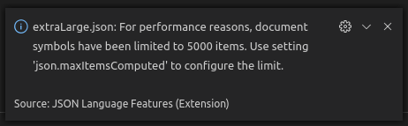

---
Order:
TOCTitle: November 2019
PageTitle: Visual Studio Code November 2019
MetaDescription: See what is new in the Visual Studio Code November 2019 Release (1.41)
MetaSocialImage: 1_41/release-highlights.png
Date: 2019-12-12
DownloadVersion: 1.41.1
---
# November 2019 (version 1.41)

**Update 1.41.1**: The update addresses these [issues](https://github.com/microsoft/vscode/issues?q=is%3Aissue+milestone%3A%22November+2019+Recovery%22+is%3Aclosed).

<!-- DOWNLOAD_LINKS_PLACEHOLDER -->

---

Welcome to the November 2019 release of Visual Studio Code. There are a number of updates in this version that we hope you will like, some of the key highlights include:

* **[Compact folders in Explorer](#compact-folders-in-explorer)** - Single child folders collapsed by default.
* **[Edit left side of diff views](#edit-left-side-in-diffs)** - You can now edit both files in a difference view.
* **[Update search results while typing](#update-search-results-as-you-type)** - Global search results update while you type.
* **[Problems panel improvements](#problems-panel)** - Filter by problem type and limit output to the active file.
* **[Minimap highlights errors and content changes](#minimap-decorations-for-errors-warnings-and-content-changes)** - Quickly locate problems and changes in your file.
* **[Terminal minimum contrast ratio](#minimum-contrast-ratio)** - Set preferred contrast ratio for increased visibility.
* **[HTML mirror cursor in tags](#html-mirror-cursor)** - Automatic multi-cursor in matching HTML tags.
* **[Optional chaining in JS/TS](#optional-chaining-support-for-javascript-and-typescript)** - Use the `?.` operator to simplify working with nested structures.
* **[Extract interface refactoring](#extract-interface-refactoring-for-typescript)** - Quickly extract an inline type to a TypeScript interface.
* **[Dev Containers extension](#remote-development)** - Better support for opening repositories in Docker containers.

>If you'd like to read these release notes online, go to [Updates](https://code.visualstudio.com/updates) on [code.visualstudio.com](https://code.visualstudio.com).

**Insiders:** Want to see new features as soon as possible? You can download the nightly [Insiders](https://code.visualstudio.com/insiders) build and try the latest updates as soon as they are available. And for the latest Visual Studio Code news, updates, and content, follow us on Twitter [@code](https://twitter.com/code)!

## Workbench

### Compact folders in Explorer

In the File Explorer, we now render single child folders in a compact form. In such a form, single child folders will be compressed in a combined tree element. Useful for Java package structures, for example.

Setting `explorer.compactFolders` controls this behavior. By default, this setting is turned on.


### Edit left side in diffs

If you compare two editors that are editable (for example, from the File Explorer by comparing two files or running a global Search & Replace), the left-hand side is now also editable and can be saved (`kb(workbench.action.files.save)`).


**Note:** You can enable Auto Save (**File** > **Auto Save**) if you are tired of pressing `kb(workbench.action.files.save)`.

### Save from Peek editors

If you bring up a Peek view and type into it, you can now save changes via `kb(workbench.action.files.save)`, if the focus is inside that embedded editor.


### Problems panel

**More Filters**

More predefined filters were added to the Problems panel. You can now filter problems by type (errors, warnings, and information) and also see problems scoped to the current active file.


*Theme: GitHub Sharp Dark, Font: FiraCode*

**Show current problem in Status bar**

You can now configure VS Code to show the current problem message in the Status bar. This allows you to see the summary of the selected problem in the active file without any additional keyboard or mouse gestures.

**Note:** Enabling this feature needs enabling the setting `problems.showCurrentInStatus`.


*Theme: GitHub Sharp Dark, Font: FiraCode*

**Flexible filter box layout**

The filter box in the Problems panel now adjusts its position according to the panel's position and size.


*Theme: GitHub Sharp Dark, Font: FiraCode*

### Improved font rendering (Windows, Linux)

When we updated to Electron 6 last milestone, many users reported that font rendering regressed for them. Specifically, fonts did not render as smoothly as they used to. We immediately [addressed the issue](https://github.com/microsoft/vscode/issues/84214) in the editor and the fix was made available in a 1.40 recovery release. However, other areas in the workbench still suffered from less than ideal font rendering.

In this release, we improved font rendering in more parts of the workbench (for Windows and Linux). The screenshots below show a before and after comparison (zoomed in to show the difference). In particular, many tree and list elements of the workbench were rendered using greyscale antialiasing and they now render with subpixel antialiasing.

Before (left) and after (right):


We plan to improve font rendering in even more parts of the workbench. You can check out this [query of text rendering issues](https://github.com/microsoft/vscode/labels/lcd-text-rendering) to view progress.

### Faster read/write file performance for remote scenarios

Reading and writing files (from the text editor) should now be faster for scenarios where the file system is remote and the latency is high (for example when using VS Code in a browser with a slow connection or being connected to a remote host that is not in the same region). We switched to a stream-based implementation for reads and writes that greatly reduces communication overhead.

## Search

### Update search results as you type

In full text search, results will now update as you type. This is especially helpful in scenarios like constructing complicated Regular Expression queries, where fast feedback on a query can help you to write the RegEx.

Here, the instant feedback helps in constructing a RegEx Find and Replace query for adopting TypeScript's optional chaining syntax:


*Theme: Noctis Hibernus, Font: Hasklig*

**Note:** This feature can be disabled by setting `search.searchOnType` to `false`, and the delay between typing and searching can be adjusted with `search.searchOnTypeDebouncePeriod`, which defaults to 300 ms.

### Add cursors to search results

We've added a command to add cursors to all matches of a text search. With focus on a file's search results in the Search view, you can press `kb(addCursorsAtSearchResults)` to edit all matches in that one file simultaneously. This is the same keyboard shortcut used when searching inside a single editor with the Find widget.


### Expand all search results by default

Previously, if a full text search returned more than 10 results in a single file, it would appear collapsed in the Results tree. However, this sometimes made finding a particular result difficult, so with this release all results will appear expanded.

You can set `search.collapseResults` to `auto` to revert to the old behavior.

## Editor

### Minimap decorations for errors, warnings, and content changes

Errors and warnings are now highlighted inline in the minimap (code overview). You can change the color of these decorations with the new `minimap.errorHighlight` and `minimap.warningHighlight` theme colors.

Below you can see the minimap highlighting a subtle missing comma typo:


Content changes decorations are also shown in the gutter of the minimap:


You can modify the content change colors with:

* `minimapGutter.addedBackground`
* `minimapGutter.modifiedBackground`
* `minimapGutter.deletedBackground`

You can change the visibility of source control decorations with the `scm.diffDecorations` setting, which has the values:

* `all` - Show source control diff decorations in all locations.
* `gutter` - Only show in the left side editor gutter.
* `minimap` - Only show in the minimap gutter.
* `overview` - Only show in the overview ruler.
* `none` -  Do not show the diff decorations.

### Code navigation alternate commands

VS Code used to do nothing when selecting **Go to Definition** while already at the definition. With this release, alternate commands can be executed instead. For instance, **Go to Definition** can be mapped to run **Go to References**.

This is customized via the `editor.gotoLocation.alternativeDefinitionCommand` setting. For example, you can make the alternate for **Go to Definition** be **Go to Declaration** and vice versa. You can leave the setting empty if you prefer the old behavior.

### Peek, Go to, and Find All commands

Each **Peek** command now has a **Go to** counterpart. For instance, there are now both **Peek Implementations** and **Go to Implementations**. The Peek view doesn't change the current editor and allows for a quick in-place look at source code.

The video below shows using **Peek Implementations** to see all implementations of the `ICommandService` interface in a Peek view:


*Theme: GitHub Sharp, Font: FiraCode*

In contrast, **Go to Implementations** is for navigation and gets you to an implementation quickly.

The video below (using the `"editor.gotoLocation.multipleImplementations": "goto"` setting) navigates to all implementations of the `ICommandService` interface by repeatedly pressing `kbstyle(F12)`:


*Theme: GitHub Sharp, Font: FiraCode*

Last but not least, similar to the **Find All References** command, there is now **Find All Implementations**. It presents the implementations as a stable list to the side of the editor. This can be used as a TODO list, for example when performing a refactoring that affects all implementations of an interface.


*Theme: GitHub Sharp, Font: FiraCode*

### Language-specific filtering for breadcrumbs and Outline view

Last milestone, we have added the capability to filter certain types, like variables, from the Outline view and breadcrumbs navigation. This release refines this features and allows language-specific filtering, for example don't show TypeScript variables but do show JavaScript variables.

Below you can see how the `value` constant is displayed in the Outline view for the JavaScript file but not the TypeScript version.


*Theme: GitHub Sharp, Font: Fira Code*

### IntelliSense keyboard shortcuts on macOS

IntelliSense is usually triggered via `kbstyle(Ctrl+Space)`. On macOS however, this keyboard shortcut is taken by the operating system when multiple input sources are configured. This often leads to confusion and users thinking IntelliSense is broken.

There are now two ways to handle this:

* Use the new `kbstyle(Alt+Escape)` keyboard shortcut that we have added for macOS.
* Disable Input Source switching via `kbstyle(Ctrl+Space)` in your macOS preferences through **Preferences** > **Keyboard** > **Shortcuts** > **Input Sources**.


### Screen reader output

There is a new setting `editor.accessibilityPageSize` that controls the number of lines in the editor that can be read out by a screen reader at once. Note that this has performance implications for numbers larger than the default of 10.

If you use the screen reader **Say All** command, we recommend setting `editor.accessibilityPageSize` to 100 or 1000. Next milestone, we will look into changing the default value of this setting.

### New bracket matching option

It is now possible to configure `"editor.matchBrackets": "near"` to get the old behavior of highlighting matching brackets only when the cursor is on either side of a bracket. The default is `always`, which highlights the matching brackets enclosing the current cursor position.

### New auto indentation option

The setting `editor.autoIndent` can now take different values. This setting impacts multiple features, such as pressing `kbstyle(Enter)`, pressing `kbstyle(Tab)`, or when indenting and unindenting lines. You can think of the setting like a "slider" that becomes more and more opinionated:

* `"none"`: Pressing `kbstyle(Enter)` will insert `\n` and nothing more.
* `"keep"`: Pressing `kbstyle(Enter)` will keep the indentation of the current line.
* `"brackets"`: All of the above and special logic around language-specific brackets.
* `"advanced"`: All of the above and respecting language-specific rules that are defined via `onEnterRules`.
* `"full"` (default): All of the above and respecting language-specific rules that are defined via `indentationRules`.

### Code Action menu keyboard shortcuts

The Code Action and Refactoring menus now display [custom keybindings](https://code.visualstudio.com/docs/editor/refactoring#_keybindings-for-code-actions), if they exist.


## Integrated terminal

### Minimum contrast ratio

Applications working with colors in the terminal can be tricky and they can use the following colors for text:

* The default foreground color
* A palette of 16 colors as defined by the terminal theme
* A set of 240 fixed colors
* Any RGB color (16 million)

The problem is the application doesn't know what the default background color or foreground color is and whether it will have good contrast with colors used by the application. To solve this problem, the terminal can now change the foreground color of text dynamically to meet a specified contrast ratio.

Set the foreground color to the desired contrast ratio ranging from 1 to 21:

```json
// 4.5 is recommended for baseline website accessibility
"terminal.integrated.minimumContrastRatio": 4.5
```

Terminal colors will increase or decrease luminance until either the contrast ratio is met or the foreground becomes `#000000` or `#ffffff`.


*Theme: Sapphire, Font: Hack*

### New experimental WebGL renderer

A new WebGL-based renderer is available for the terminal, which boasts performance gains of up to 900%\* compared to the old canvas-based approach.

You can opt in to use the new renderer with this setting:

```json
"terminal.integrated.rendererType": "experimentalWebgl"
```

The speed improvements are attributed to many things but here are the highlights:

* WebGL allows us to talk more directly to the GPU, as opposed to going via the web platform's `CanvasRenderingContext2D` API.
* The renderer deals almost exclusively with numbers and typed arrays, which are extremely fast. Object and array creation is also kept to a minimum to avoid unnecessary garbage collection.
* All characters are now cached in a texture atlas as opposed to just ASCII characters with a limited set of styles. This means repeated drawing of the same character is much faster.

We observed rendering of frames varying wildly based on a user's hardware/environment with the canvas renderer. Each frame would typically take anywhere from 1 ms to 40 ms but could reach to over 200 ms in extreme cases, where hardware issues were a factor. So far, WebGL seems much more consistent, typically sitting in the 0.2 ms to 2 ms range:


Reliability is one of the things we expect to improve once this is integrated. With the canvas renderer, the browser would try to be clever and fall back to rendering on the CPU if there were problems with the GPU/canvas, but we never want that to happen as we have a DOM-based renderer, which is much more suited for that. With WebGL, it should either work as expected or fail hard (a WebGL context cannot be acquired), in which case we can fall back to the DOM renderer.

Since rendering takes so much less time, the CPU is freed up to focus on parsing incoming data, which results in more frames rendered and commands that run faster. The following performance data was generated from running `ls -lR` inside the vscode  repository:


The new renderer also fixes a nasty bug with the canvas renderer, where characters would get their sides clipped when they are larger than the cell size. This issue was most commonly observed with certain fonts on Linux with underscores.

\* *More info on benchmarks available at [xtermjs/xterm.js#1790](https://github.com/xtermjs/xterm.js/pull/1790)*

## Source Control

### Git: Relative paths in git.ignoredRepositories

The `git.ignoredRepositories` setting now supports relative paths, which are useful when you're configuring workspace settings and you'd like to ignore certain repositories in VS Code.

### Git: Adoption of FileSystemProvider

The Git extension now uses the [FileSystemProvider API](https://code.visualstudio.com/api/references/vscode-api#FileSystemProvider) which, besides fixing certain encoding issues, provides a more performant and more reliable way of exposing older versions of your files, from a Git repository.

## Languages

### HTML mirror cursor

VS Code now adds a "mirror cursor" when you are editing HTML tags. This behavior is controlled by the setting `html.mirrorCursorOnMatchingTag`, which is on by default.

This feature works by adding a [multi-cursor](https://code.visualstudio.com/docs/editor/codebasics#_multiple-selections-multicursor) to the matching tag when your cursor moves into an HTML tag name range. Just like in multi-cursor mode, you can use word-wise deletion or word-wise selection. The mirrored cursor is removed when you move your cursor outside the tag name range.

One special case is entering `kbstyle(Space)` when the cursor is at the end of the opening tag, for example at the end of a `div` like `<div`|`></div`|`>`. In this case, VS Code removes the inserted space after the closing tag name and exits mirror cursor mode, so you can continue to edit HTML attributes.


*Theme: [Nord](https://marketplace.visualstudio.com/items?itemName=arcticicestudio.nord-visual-studio-code), Font: [Input Mono](https://input.fontbureau.com/)*

### HTML rename tags

You can now use `kb(editor.action.rename)` to rename the opening/closing tag pairs in HTML.


### Ranking of autocompleted CSS properties

CSS autocompletion now ranks properties by their popularity:


The usage data is sourced from [ChromeStatus.org](https://www.chromestatus.com/metrics/css/popularity).

### Sass module support

Sass recently introduced a [new module system](http://sass.logdown.com/posts/7858341-the-module-system-is-launched).

We have added syntax highlighting support, as well as language feature support, for Sass modules in **SCSS** files. The language features include:

* Auto completion of `@use` and `@forward`.
* Path completion for `@use` and `@forward` path.
* Auto completion of Sass [built-in modules](https://sass-lang.com/documentation/modules) such as `sass:math` and `sass:color`.
* Document link for `@use` and `@forward` import paths.


### JSON

To avoid performance issues with large JSON files, JSON language support now has an upper limit on the number of folding regions and document symbols it computes (for the Outline view and breadcrumbs). By the default, the limit is 5000 items, but you can change the limit with the setting `json.maxItemsComputed`.



### TypeScript 3.7

VS Code now ships with TypeScript 3.7.3. This major update brings some TypeScript language improvements - including [optional chaining](https://devblogs.microsoft.com/typescript/announcing-typescript-3-7/#optional-chaining), [nullish coalescing](https://devblogs.microsoft.com/typescript/announcing-typescript-3-7/#nullish-coalescing), and [assertion functions](https://devblogs.microsoft.com/typescript/announcing-typescript-3-7/#assertion-functions) - as well as some new tooling features for both JavaScript and TypeScript. As always, this release also includes a number of important bug fixes.

You can read more about the TypeScript 3.7 features on the [TS 3.7 blog post](https://devblogs.microsoft.com/typescript/announcing-typescript-3-7/).

### Optional chaining support for JavaScript and TypeScript

Thanks to TypeScript 3.7, VS Code now supports [option chaining](https://developer.mozilla.org/docs/Web/JavaScript/Reference/Operators/Optional_chaining) out of the box for both JavaScript and TypeScript. This includes syntax highlighting and IntelliSense:


Additionally, VS Code can automatically insert a `?.` when you accept a completion on an optional property:


Automatic insertion of `?.` depends on [strict null checking](https://www.typescriptlang.org/docs/handbook/release-notes/typescript-2-0.html#--strictnullchecks) being enabled. Automatic `?.` insertion can be disabled with the `"typescript.suggest.includeAutomaticOptionalChainCompletions"` or `"javascript.suggest.includeAutomaticOptionalChainCompletions"` settings.

### Extract interface refactoring for TypeScript

The new **Extract to interface** refactoring lets you quickly extract an inline type to an interface so that it can be reused.


Below you can see that the 'Neural' interface has been extracted out of 'keyes':


### Semicolon formatter options for JavaScript and TypeScript

The new `javascript.format.semicolons` and `typescript.format.semicolons` formatting settings let you control how the formatter handles semicolons in JavaScript and TypeScript files.

Valid semicolon format settings values are:

* `ignore` - Does not add or remove semicolons (default).
* `insert` - Insets semicolons at statement ends.
* `remove` - Remove unnecessary semicolons.

### Uncalled function checks

VS Code will now alert you if you forget to call a function in a conditional.

Consider the following TypeScript snippet:

```ts
import * as fs from 'fs';

fs.stat('/path/to/file', function(err, stats) {
    if (stats.isDirectory) {
        handleDirectory(stats);
    }
});
```

The example above uses the Node.js [`fs.stat` API](https://nodejs.org/api/fs.html#fs_fs_stat_path_options_callback) to get information about a file. But there's a bug! `.isDirectory` is actually a function, not a property! This means that `handleDirectory` will be called on every file, not just directories as intended, as the function `isDirectory` is defined and evaluates to `true`.


Note that you will only see this diagnostic when [strict null checking](https://www.typescriptlang.org/docs/handbook/release-notes/typescript-2-0.html#--strictnullchecks) is enabled.

## Debugging

### Debug START view

We have introduced a new debug START view to make it easier for users to start and configure debugging in a new workspace. Based on the active file, we will choose the appropriate debug extension and make it possible to debug or run your application. For more elaborate debug and run configurations, it is still best to configure a `launch.json` file.

Below you can see quickly starting to debug an Express JavaScript application and then creating a `launch.json` file if more control is needed.


### Restart frame as an inline action in the CALL STACK view

To improve the discoverability of the **Restart Frame** action, there is now an inline action in the CALL STACK view visible on hover. Restarting frames is a handy way to rerun the preceding source code after a breakpoint is hit. If the debug extension does not support restarting frames, this action is not shown.


### Debug console shows input and output

In order to better distinguish input and output in the Debug console, we have added input `>` and output `<` decorations to the left.


### Inline breakpoint display

A new setting `debug.showInlineBreakpointCandidates` controls whether inline breakpoints candidate decorations are shown in the editor while debugging. By default, they are visible.

## Preview features

Preview features are not ready for release but are functional enough to use. We welcome your early feedback while they are under development.

### Search Editor

In this milestone, we've started work on showing search results in a dedicated editor. This provides more space to view search results and allows you to maintain multiple collections of search results simultaneously.

With this release, in a search editor you can:

* Navigate to results using **Go to Definition** family commands, including **Peek Definition** and **Open Definition to Side**.
* Rerun a search to update the list of results.
* View source code lines surrounding a result.
* Persist results to disk to be referenced later or even tracked in source control.

We will continue to add functionality and increase usability in the coming releases.


*Theme: A Touch of Lilac, Font: Hasklig*

**Note:** You can preview this feature by setting `search.enableSearchEditorPreview` to `true`.

### Call Hierarchy view

The call hierarchy API is available in Stable and language extension authors are busy implementing it, so we have added a Call Hierarchy view. This complements the **Peek Call Hierarchy** view and shares the same Side bar view as **Find All References** and **Find All Implementations**. Once a language extension supports the call hierarchy API, you will be able to select **Show Call Hierarchy** from the context menu or the Command Palette to see the view:


*Theme: GitHub Sharp, Font: FiraCode*

The Call Hierarchy view allows you to drill into the callers from and calls of a symbol. It highlights calls in the active editor, allows reparenting the view from any children, and it keeps a history of previous runs.

### JavaScript Debugger

We're working on a new debugger for Node.js and Chrome. You can install the nightly extension [`js-debug-nightly`](https://marketplace.visualstudio.com/items?itemName=ms-vscode.js-debug-nightly), and use it as a drop-in replacement by updating your settings to add:

```json
{
  "debug.chrome.useV3": true,
  "debug.node.useV3": true,
}
```

You should not need to change your existing launch configurations in order to use the new debugger.

The debugger brings an assortment of new features, such as the ability to debug and step through webworkers:


*Theme: Earthsong, Font: Fira Code*

...debug npm scripts with no extra configuration or flags...


...and more! If you run into problems, please [file an issue](https://github.com/microsoft/vscode-pwa/issues/new).

## Contributions to extensions

### Remote Development

Work continues on the [Remote Development extensions](https://marketplace.visualstudio.com/items?itemName=ms-vscode-remote.vscode-remote-extensionpack), which allow you to use a container, remote machine, or the [Windows Subsystem for Linux](https://learn.microsoft.com/windows/wsl) (WSL) as a full-featured development environment.

Feature highlights in 1.41 include:

* Dev Containers: Easier to try out sample repositories (for example [vscode-remote-try-python](https://github.com/microsoft/vscode-remote-try-python)) in a container.
* Dev Containers: Improved performance when creating a container and new options for `devcontainer.json`.
* WSL: Support on Windows 10 ARM-based PCs such as Surface Pro X.
* Remote Explorer can now scope available views to specific remote types.

You can learn about new extension features and bug fixes in the [Remote Development release notes](https://github.com/microsoft/vscode-docs/blob/main/remote-release-notes/v1_41.md).

You can also read a recent blog post about [Inspecting Containers with VS Code](https://code.visualstudio.com/blogs/2019/10/31/inspecting-containers) and try the updated [Using C++ and WSL in VS Code](https://code.visualstudio.com/docs/cpp/config-wsl) tutorial.

### ESLint

Improvements to the [ESLint](https://marketplace.visualstudio.com/items?itemName=dbaeumer.vscode-eslint) extension:

* Better support for ESLint 6.x - In most cases, it shouldn't be necessary to configure working directories when using ESLint 6.x.
* Improved TypeScript detection - As soon as TypeScript is correctly configured inside ESLint, you no longer need additional configuration through VS Code's `eslint.validate` setting. The same is true for HTML and Vue.js files.
* Glob working directory support - Projects that have a complex folder structure and need to customize the working directories via `eslint.workingDirectories` can now use glob patterns instead of listing every project folder. For example, `code-*` will match all project folders starting with `code-`. In addition, the extension now changes the working directory by default. You can disable this feature with the new `!cwd` property.
* Improved Auto Fix on Save - Auto Fix on Save is now part of VS Code's Code Action on Save infrastructure and computes all possible fixes in one round. It is customized via the `editor.codeActionsOnSave` setting. The setting supports the ESLint specific property `source.fixAll.eslint`. The extension also respects the generic property `source.fixAll`.

The setting below turns on Auto Fix for all providers including ESLint:

```json
    "editor.codeActionsOnSave": {
        "source.fixAll": true
    }
```

In contrast, this configuration only turns it on for ESLint:

```json
    "editor.codeActionsOnSave": {
        "source.fixAll.eslint": true
    }
```

You can also selectively disable ESLint via:

```json
    "editor.codeActionsOnSave": {
        "source.fixAll": true,
        "source.fixAll.eslint": false
    }
```

### vscode-scss

The [vscode-scss](https://marketplace.visualstudio.com/items?itemName=mrmlnc.vscode-scss) extension offers cross-file language support for SCSS variables, mixins, and functions. In this milestone, we helped its development for a new release, [0.8.0](https://github.com/mrmlnc/vscode-scss/releases/tag/v0.8.0).

The new version improves:

* Better import path resolution
* Color preview for autocompleted color variable
* Better performance

## Extension authoring

### Figma design toolkit

We've created a [Figma](https://www.figma.com) design toolkit to better help extension authors design experiences for their extensions. Check out the [toolkit repo on GitHub](https://aka.ms/vscode-figma-toolkit) that has instructions on how to access and use the toolkit.

Below is an example of some of the components included:


All components should be resizable and editable.


If you run into any problems or have any requests for certain components, please create an issue in the toolkit repo so that we can triage and track the requests.

### Debug icon color tokens

We've added a set of new color tokens for the Debug view.

Debug toolbar:

* `debugIcon.startForeground`
* `debugIcon.continueForeground`
* `debugIcon.disconnectForeground`
* `debugIcon.pauseForeground`
* `debugIcon.restartForeground`
* `debugIcon.stepBackForeground`
* `debugIcon.stepIntoForeground`
* `debugIcon.stepOutForeground`
* `debugIcon.stepOverForeground`
* `debugIcon.stopForeground`


*Theme: [Min Dark](https://marketplace.visualstudio.com/items?itemName=miguelsolorio.min-theme), Font: [Input Mono](https://input.fontbureau.com/)*

Debug breakpoints:

* `debugIcon.breakpointForeground`
* `debugIcon.breakpointDisabledForeground`
* `debugIcon.breakpointUnverifiedForeground`
* `debugIcon.breakpointStackframeForeground`
* `debugIcon.breakpointCurrentStackframeForeground`


*Theme: [Min Dark](https://marketplace.visualstudio.com/items?itemName=miguelsolorio.min-theme), Font: [Input Mono](https://input.fontbureau.com/)*

### Workspace file events

There are new events for when files and folders change:

* `vscode.workspace.on[Will|Did]CreateFile`
* `vscode.workspace.on[Will|Did]RenameFile`
* `vscode.workspace.on[Will|Did]DeleteFile`

The events are fired when files are created, renamed, or deleted from the Explorer or from extensions via the `vscode.workspace.applyEdit(WorkspaceEdit)` API but not when files change on disk or when files are modified via the `vscode.workspace.fs` API.

A possible use case for these events is a language server, which might update the contents of a file before renaming it or update project files after deletion/creation of files.

### SnippetString

The `SnippetString` type has now a builder-method for choice-elements.

### Strict getWordRangeAtPosition

The [`TextDocument.getWordRangeAtPosition`](https://github.com/microsoft/vscode/blob/58479e80ab899402283b522da173c34867d7c78f/src/vs/vscode.d.ts#L224) API is now more strict and instead of ignoring invalid regular expressions that result in empty string matches, it will throw an error.

### Deprecated string type for extensionKind

Extension authors can use the `extensionKind` property in `package.json` to indicate where an extension should run in the remote case. In release (1.40), this value could be a string or an array. Starting with this release, this property only supports an array value and using a string is deprecated. See the [Remote Development documentation](https://code.visualstudio.com/api/advanced-topics/remote-extensions#incorrect-execution-location) for more information.

### Convert DAP Sources to URIs

The VS Code extension API uses document URIs when referring to resources that can be opened in editors, whereas the [Debug Adapter Protocol](https://microsoft.github.io/debug-adapter-protocol/) is based on [Source](https://microsoft.github.io/debug-adapter-protocol/specification#Types_Source) descriptors. In this milestone, we've added an API for connecting the two worlds. The function `debug.asDebugSourceUri` creates a URI from a DAP Source object. This makes opening a DAP Source into a VS Code editor simple:

```ts
export async function openDAPSource(session: vscode.DebugSession, source: DebugProtocol.Source) {
  const uri = vscode.debug.asDebugSourceUri(source, session);
  vscode.window.showTextDocument(vscode.workspace.openTextDocument(uri));
}
```

## Proposed extension APIs

Every milestone comes with new proposed APIs and extension authors can try them out. As always, we are keen on your feedback. This is what you have to do to try out a proposed API:

* You must use Insiders because proposed APIs change frequently.
* You must have this line in the `package.json` file of your extension: `"enableProposedApi": true`.
* Copy the latest version of the [vscode.proposed.d.ts](https://github.com/microsoft/vscode/blob/main/src/vs/vscode.proposed.d.ts) file into your project's source location.

Note that you cannot publish an extension that uses a proposed API. There may be breaking changes in the next release and we never want to break existing extensions.

### CodeAction.disabled

VS Code encourages extensions to implement refactoring functionality using [Code Actions](https://github.com/microsoft/vscode-extension-samples/tree/main/code-actions-sample). However it can be difficult for users to discover which refactorings an extension supports and to understand why a given refactoring is not available for a specific selection. The `CodeAction.disabled` API proposal aims to help extensions make their refactorings more discoverable.

The proposed `.disabled` property on `CodeAction` is a human readable string describing why a given Code Action is not possible. Here's an example of using  `.disabled` in our [CodeAction sample extension](https://github.com/microsoft/vscode-extension-samples/tree/main/code-actions-sample).

```ts
import * as vscode from 'vscode';

export class Emojizer implements vscode.CodeActionProvider {

    public provideCodeActions(document: vscode.TextDocument, range: vscode.Range): vscode.CodeAction[] | undefined {
        const action = new vscode.CodeAction(`Convert to ${emoji}`, vscode.CodeActionKind.Refactor.append('emojize'));

        if (!this.isAtStartOfSmiley(document, range)) {
            // Tell the user why our action is not available
            action.disabled = 'Selection is not currently on a :)';
            return [action];
        }

        action.edit = new vscode.WorkspaceEdit();
        action.edit.replace(document.uri, new vscode.Range(range.start, range.start.translate(0, 2)), '😀');
        return action;
    }

    ...
}
```

If the user tries to apply a disabled Code Action [through a keybinding](https://code.visualstudio.com/docs/getstarted/keybindings#_custom-keybindings-for-refactorings), VS Code will display the `.disabled` error message to the user:


In addition, to help with discoverability, disabled Code Actions are shown as faded in the **Refactor** and **Source Action** context menus:


Note that disabled actions are not show in the top-level lightbulb menu.

If your extension uses Code Actions, please [let us know](https://github.com/microsoft/vscode/issues/85160) if `CodeAction.disabled` is something that you would find useful and be able to implement.

### Custom Editors editing capabilities

We continued to work on the [custom editor proposal](https://github.com/microsoft/vscode/issues/77131) this iteration. As a reminder, custom editors are webview-based views that can be used in place of VS Code's normal text editor for specific file types. As of VS Code 1.41, Custom editors can now integrate with VS Code's Undo/Redo and Save functionality, which enables many interesting use cases including using them as visual and WYSIWYG editors.

You can find the current API proposal in [vscode.proposed.d.ts](https://github.com/microsoft/vscode/blob/main/src/vs/vscode.proposed.d.ts)
 and we have also put together some [very simple extension samples](https://github.com/mjbvz/vscode-experimental-webview-editor-extension) that demonstrate using custom editors for text and for binary files.

If you are interested in custom editors, please share your feedback on the current proposal and let us know if you would be able to implement it.

### Semantic tokens provider

We have added new proposed API for a [semantic tokens provider](https://github.com/microsoft/vscode/issues/86415). The new API allows extensions to provide additional token information to be used by the editor to enrich the TextMate based syntax highlighting.

Each semantic token annotates a range with a token **type** and any number of token **modifiers**. For example, type `variable` and modifiers `member` and `modification` would describe a write access to a member variable. The token types and modifiers are then used to add styles in the editor.

Styling can be configured in both color themes and user settings:

```json
    "editor.tokenColorCustomizationsExperimental": {
        "variable.member": {
            "foreground": "#35166d"
        },
        "*.modification": {
            "fontStyle": "underline"
        }
    }

```

If you are interested in this feature, we would like to get your feedback regarding the current proposal and we would love to encourage experimentation and some early implementations.

A full sample is available in the [vscode-extensions-samples repo](https://github.com/microsoft/vscode-extension-samples/tree/main/semantic-tokens-sample).

## Language Server Protocol

There is now proposed support for the [call hierarchy](https://github.com/microsoft/vscode-languageserver-node/blob/dbaeumer/moreIntegrationTests/protocol/src/protocol.callHierarchy.proposed.ts#L1) view via LSP.

## Browser support

### Improved support for Firefox and Safari (macOS & iPadOS)

During this milestone, we focused on improving the experience of VS Code running in a browser when using Firefox or Safari. We fixed many issues to support both browsers ([Firefox](https://github.com/microsoft/vscode/issues?q=is%3Aissue+label%3Afirefox+is%3Aclosed+milestone%3A%22November+2019%22), [Safari](https://github.com/microsoft/vscode/issues?q=is%3Aissue+label%3Asafari+is%3Aclosed+milestone%3A%22November+2019%22)). On Firefox, we don't have full keyboard shortcut support yet due to upstream blockers and you can read more details at [tracking issue #85252](https://github.com/microsoft/vscode/issues/85252).

We also fixed many [issues](https://github.com/microsoft/vscode/issues?q=is%3Aissue+label%3Asafari+label%3Aios+is%3Aclosed) to enable basic VS Code functionality in Safari on iPadOS. Core UI elements are now accessible to touch and pointer devices. However, there are still major blockers related to predefined keybindings (`Escape` and `Function` keys), hovers, and touch friendly UI/UX. See [issue #85254](https://github.com/microsoft/vscode/issues/85254) for more information.

### More features available running in a browser

Last milestone, we [introduced support](https://code.visualstudio.com/updates/v1_40#_test-vs-code-running-in-a-browser) for running `yarn web` from our repository to set up VS Code running in the browser. This setup is still meant to be used for testing issues in browsers and not for development.

This milestone we added more features that can be tested:

* Debug
* Search
* Tasks
* Problems

Here is a video showing the new features in action:


**Note:** Do not use this setup for any serious development. The intent is to allow the community to contribute changes back to VS Code to improve the overall experience in the browser.

## Engineering

### Insiders available in the yum repository

The Insiders build is now available in the yum repository and is automatically published just like with the apt repository. Follow the [instructions on the website](https://code.visualstudio.com/docs/setup/linux#_rhel-fedora-and-centos-based-distributions) to set up the repo and install using `sudo dnf install code-insiders`.

### Continuous build for Monaco Editor

This iteration we added [continuous build and a test pipeline](https://github.com/microsoft/monaco-editor/issues/1668) for the Monaco Editor. We build the Monaco Editor core from the VS Code repository main branch and perform sanity testing to catch potential bugs or unexpected breaking changes as early as possible.

## Notable fixes

* [51039](https://github.com/microsoft/vscode/issues/51039): Diff editor closes when closing left hand side editor in other tab
* [83746](https://github.com/microsoft/vscode/issues/83746): Web: unable to drag and drop composites & views (activity bar, panel)
* [80026](https://github.com/microsoft/vscode/issues/80026): gray attributes in launch.json are confusing, please remove them
* [83449](https://github.com/microsoft/vscode/issues/83449): Accessibility: Ctrl+Right in accessibility mode (CursorWordAccessibilityRight) should jump to the beginning of next word, rather than the end
* [83753](https://github.com/microsoft/vscode/issues/83753): Disabling console.debug.wordWrap strips newlines and whitespace
* [85086](https://github.com/microsoft/vscode/issues/85086): Backreferences are not supported in global searching when `search.usePCRE2` is disabled
* [36219](https://github.com/microsoft/vscode/issues/36219): Git: "Stage selected ranges" command changes encoding to UTF-8

## Thank you

Last but certainly not least, a big *__Thank You!__* to the following folks that helped to make VS Code even better:

Contributions to our issue tracking:

* [John Murray (@gjsjohnmurray)](https://github.com/gjsjohnmurray)
* [Andrii Dieiev (@IllusionMH)](https://github.com/IllusionMH)
* [Alexander (@usernamehw)](https://github.com/usernamehw)
* [Danny Tuppeny (@DanTup)](https://github.com/DanTup)

Contributions to `vscode`:

* [Amir Omidi (@aaomidi)](https://github.com/aaomidi): Use isNaN instead of === NaN [PR #83790](https://github.com/microsoft/vscode/pull/83790)
* [Anirudh Rayabharam (@anirudhrb)](https://github.com/anirudhrb): Git: Fixed error when staging in empty repository [PR #82995](https://github.com/microsoft/vscode/pull/82995)
* [Anthony Dresser (@anthonydresser)](https://github.com/anthonydresser): Add filter to git hook (dev qol) [PR #85159](https://github.com/microsoft/vscode/pull/85159)
* [Jakub Chodorowicz (@chodorowicz)](https://github.com/chodorowicz): Improve Monokai theme for markdown files [PR #85467](https://github.com/microsoft/vscode/pull/85467)
* [DiamondYuan (@DiamondYuan)](https://github.com/DiamondYuan): fix: fix typo CustomEditoInputFactory -> CustomEditorInputFactory [PR #85090](https://github.com/microsoft/vscode/pull/85090)
* [George Batalinski (@georgebatalinski)](https://github.com/georgebatalinski): fix(aria-expanded) on submenues add aria prop [PR #79775](https://github.com/microsoft/vscode/pull/79775)
* [John Murray (@gjsjohnmurray)](https://github.com/gjsjohnmurray)
  * Rename "Reveal in Explorer" to "Reveal in Side Bar" on Search result filename context menu [PR #83418](https://github.com/microsoft/vscode/pull/83418)
  * Outline "Sort By: Type" -> "Sort By: Category" [PR #83845](https://github.com/microsoft/vscode/pull/83845)
* [James Inkster (@Grommers00)](https://github.com/Grommers00): fix #84080 added cntl-shift-c and cntl-shift-v to terminal [PR #84438](https://github.com/microsoft/vscode/pull/84438)
* [Vladislav Hadzhiyski (@hadzhiyski)](https://github.com/hadzhiyski)
  * Fix #83940 [PR #84414](https://github.com/microsoft/vscode/pull/84414)
  * #83646 Webview: Cannot load resource outside of protocol root", if .md source is an network share [PR #84702](https://github.com/microsoft/vscode/pull/84702)
* [Hung-Wei Hung (@hunghw)](https://github.com/hunghw): Fix #83818 - polish description in enablePreviewFromQuickOpen [PR #83895](https://github.com/microsoft/vscode/pull/83895)
* [Andrew Liu (@hypercubestart)](https://github.com/hypercubestart): fix #82457, markdown open, but unfocused source tab [PR #85506](https://github.com/microsoft/vscode/pull/85506)
* [Andrii Dieiev (@IllusionMH)](https://github.com/IllusionMH): Improve template literals support to match TS [PR #80234](https://github.com/microsoft/vscode/pull/80234)
* [Jason Ginchereau (@jasongin)](https://github.com/jasongin): Fix minor packaging issues in automation lib [PR #83942](https://github.com/microsoft/vscode/pull/83942)
* [Jean Pierre (@jeanp413)](https://github.com/jeanp413)
  * Don't encode image resource URI twice [PR #85355](https://github.com/microsoft/vscode/pull/85355)
  * Fixes Web: starting to drag a tab shows a scrollbar [PR #83959](https://github.com/microsoft/vscode/pull/83959)
  * Fixes image name including # fail to render [PR #84334](https://github.com/microsoft/vscode/pull/84334)
  * Adopt insert & replace in snippet provider [PR #84206](https://github.com/microsoft/vscode/pull/84206)
  * Fixes can't drag to select linkified text in the debug console [PR #83956](https://github.com/microsoft/vscode/pull/83956)
  * Fixes Web Firefox: dropping a file onto itself navigates the page [PR #83962](https://github.com/microsoft/vscode/pull/83962)
  * Fixes compressedNavigationController ends with outdated state after startup [PR #86574](https://github.com/microsoft/vscode/pull/86574)
* [Huáng Jùnliàng (@JLHwung)](https://github.com/JLHwung): add `babel.config.json` to JSON validation schema maps [PR #83758](https://github.com/microsoft/vscode/pull/83758)
* [Joan Rieu (@joanrieu)](https://github.com/joanrieu): Document problemMatcher.fileLocation="autodetect" configuration option [PR #83803](https://github.com/microsoft/vscode/pull/83803)
* [John Combs (@jscombs91)](https://github.com/jscombs91): Added force-device-scale-factor to command line args [PR #84651](https://github.com/microsoft/vscode/pull/84651)
* [Robert Jin (@jzyrobert)](https://github.com/jzyrobert)
  * Add appRoot to windows protocol handler for dev [PR #85289](https://github.com/microsoft/vscode/pull/85289)
  * Correct spelling of Implementation (from Implemenation) [PR #85192](https://github.com/microsoft/vscode/pull/85192)
  * fix #85938: prevent duplicate selections [PR #86286](https://github.com/microsoft/vscode/pull/86286)
* [@MartinBrathen](https://github.com/MartinBrathen): Fix zoom on first click [PR #83826](https://github.com/microsoft/vscode/pull/83826)
* [@mltony](https://github.com/mltony): Make ctrl+right in accessibility mode to jump to beginning of the word [PR #83450](https://github.com/microsoft/vscode/pull/83450)
* [Nilesh Kevlani (@njkevlani)](https://github.com/njkevlani): Command and Keybinding for adding multi cursor from search result [PR #82510](https://github.com/microsoft/vscode/pull/82510)
* [okmttdhr (@okmttdhr)](https://github.com/okmttdhr)
  * Add builder-method for snippet choice [PR #84048](https://github.com/microsoft/vscode/pull/84048)
  * Show JS/TS References Code Lens for Inner Functions [PR #84689](https://github.com/microsoft/vscode/pull/84689)
* [@OneQuid](https://github.com/OneQuid): Fix opening image with '%' in the filename [PR #84667](https://github.com/microsoft/vscode/pull/84667)
* [Osk (@oskosk)](https://github.com/oskosk): Address typo in command identifier for installMissingDependencies [PR #84056](https://github.com/microsoft/vscode/pull/84056)
* [Peter Elmers (@pelmers)](https://github.com/pelmers): Add optional sortByLabel to QuickPick to control whether to re-sort results [PR #77297](https://github.com/microsoft/vscode/pull/77297)
* [Pieter Vanderpol (@petevdp)](https://github.com/petevdp)
  * #84678 add language-specific overrides for breadcrumb and outline settings [PR #85081](https://github.com/microsoft/vscode/pull/85081)
  * #82105 Add Terminal Rename Command [PR #84429](https://github.com/microsoft/vscode/pull/84429)
* [Samuel Bronson (@SamB)](https://github.com/SamB): Allow trailing commas in jsconfig.json, too [PR #85479](https://github.com/microsoft/vscode/pull/85479)
* [Shizeng Zhou (@shizengzhou)](https://github.com/shizengzhou): Fix #84111 [PR #84610](https://github.com/microsoft/vscode/pull/84610)
* [@smilegodly](https://github.com/smilegodly): Added focusSearch() into clearSearchResults() and got rid of duplicate function [PR #83617](https://github.com/microsoft/vscode/pull/83617)
* [Konstantin Solomatov (@solomatov)](https://github.com/solomatov)
  * Cleanup extHostTerminalService.ts [PR #84404](https://github.com/microsoft/vscode/pull/84404)
  * Fix bug with hanged pseudoterminal [PR #84181](https://github.com/microsoft/vscode/pull/84181)
* [空雲 (@SoraKumo001)](https://github.com/SoraKumo001):  Make local and remote ports configurable [PR #84958](https://github.com/microsoft/vscode/pull/84958)
* [Sebastian Pahnke (@spahnke)](https://github.com/spahnke): monaco-editor: Find model by resource in SimpleEditorModelResolverService [PR #85129](https://github.com/microsoft/vscode/pull/85129)
* [酷酷的哀殿 (@sunbohong)](https://github.com/sunbohong): Support utf-8 encoding guessing [PR #84504](https://github.com/microsoft/vscode/pull/84504)
* [Tobias Fenster (@tfenster)](https://github.com/tfenster): implement filtering by marker type [PR #83797](https://github.com/microsoft/vscode/pull/83797)
* [Valentin Hăloiu (@vially)](https://github.com/vially): Add parent path to git clone command [PR #85459](https://github.com/microsoft/vscode/pull/85459)
* [Wojciech Buczek (@Wowol)](https://github.com/Wowol): Add support of relative paths for git.ignoredRepositories [PR #83466](https://github.com/microsoft/vscode/pull/83466)
* [ZHAO Jinxiang (@xiaoxiangmoe)](https://github.com/xiaoxiangmoe): Add .cjs to known JavaScript file extensions [PR #85460](https://github.com/microsoft/vscode/pull/85460)

Contributions to `language-server-protocol`:

* [Montana Rowe (@calcnerd256)](https://github.com/calcnerd256):
  * Correct misuse of "then" where "than" is appropriate. [PR #866](https://github.com/microsoft/language-server-protocol/pull/866)
  * Correct a broken link to the canonical copy of a specification.  [PR #869](https://github.com/microsoft/language-server-protocol/pull/869)

* [Bradley Walters (@bmwalters)](https://github.com/bmwalters): Fix wrong client capabilities interface listed for document symbol [PR #862](https://github.com/microsoft/language-server-protocol/pull/862)

Contributions to `vscode-css-languageservice`:

* [Piotr Błażejewicz (Peter Blazejewicz) (@peterblazejewicz)](https://github.com/peterblazejewicz): Fix linear gradient description. [PR #198](https://github.com/microsoft/vscode-css-languageservice/pull/198)
* [@wongjn](https://github.com/wongjn)
  * Fix SCSS media query interpolation after 'and' [PR #184](https://github.com/microsoft/vscode-css-languageservice/pull/184)
  * SCSS modules [PR #183](https://github.com/microsoft/vscode-css-languageservice/pull/183)

Contributions to `debug-adapter-protocol`:

* [Ben Clayton (@ben-clayton)](https://github.com/ben-clayton): Update sdks.md [PR #82](https://github.com/microsoft/debug-adapter-protocol/pull/82)

Contributions to `vscode-chrome-debug-core`:

* [Elmi Ahmadov (@ahmadov)](https://github.com/ahmadov): Fix reference error issue when setting a new value for property [PR #546](https://github.com/microsoft/vscode-chrome-debug-core/pull/546)

Contributions to `vscode-vsce`:

* [Alessandro Fragnani (@alefragnani)](https://github.com/alefragnani): Ignore file via option [PR #294](https://github.com/microsoft/vscode-vsce/pull/294)
* [James Inkster (@Grommers00)](https://github.com/Grommers00): fixes #400 allow force to unpublish an extension [PR #405](https://github.com/microsoft/vscode-vsce/pull/405)
* [Chris S. (@LaChRiZ)](https://github.com/LaChRiZ): if package path is a directory, use default file name to write vsix [PR #248](https://github.com/microsoft/vscode-vsce/pull/248)
* [Nate Drake (@ndrake)](https://github.com/ndrake): Set permissions on .vsce to 0600; fix for #230 [PR #295](https://github.com/microsoft/vscode-vsce/pull/295)

Contributions to `localization`:

There are over 800 [Cloud + AI Localization](https://github.com/microsoft/Localization/wiki) community members using the Microsoft Localization Community Platform (MLCP), with over about 100 active contributors to Visual Studio Code. We appreciate your contributions, either by providing new translations, voting on translations, or suggesting process improvements.

Here is a snapshot of [contributors](https://microsoftl10n.github.io/VSCode/). For details about the project including the contributor name list, visit the project site at [https://aka.ms/vscodeloc](https://aka.ms/vscodeloc).

* **Bosnian (Latin, Bosnia and Herzegovina):** Sead Mulahasanović, Ismar Bašanović, Adnan Rizvan.
* **Danish:** Lasse Stilvang.
* **Dutch:** Lemuel Gomez, Gideon van de Laar.
* **English (United Kingdom):** Martin Littlecott, Alonso Calderon, Daniel Imms, Kamalsinh Solanki.
* **Finnish:** Tuula P.
* **French:** Antoine Griffard, Thierry DEMAN-BARCELÒ, Edouard Choinière, Joel Monniot, Rodolphe NOEL, Alain BUFERNE, Xavier Laffargue, DJ Dakta.
* **German:** Pascal Wiesendanger, Jakob von der Haar, jan-nitsche, Michael Richter.
* **Greek:** Valantis Kamayiannis, Θοδωρής Τσιρπάνης.
* **Hebrew:** Ariel Bachar.
* **Hindi:** Kiren Paul, Niraj Kumar, Preeti Madhwal, Jaadu Jinn, Mahtab Alam.
* **Hungarian:** József Cserkó, Kiss Attila Csaba, Krisztián Papp.
* **Chinese Simplified:** Yizhi Gu, Tingting Yi, Justin Liu, Charles Dong, Peng Zeng, Tony Xia, 斌 项, Yixing Zheng, paul cheung, 普鲁文, Sheng Jiang, 钟越, Joel Yang, 一斤瓜子, Zhiqiang Li, Yiting hu, Alexander ZHANG, 张锐, Libing Yang, ZHENGCHENG CHEN, 光宇 朴, 石岩 詹, 舜杰 杨, WJ Wang, Siam Chen.
* **Chinese Traditional:** Winnie Lin, 船長, Alan Tsai, TingWen Su.
* **Indonesian:** Eriawan Kusumawardhono, Arif Fahmi, Laurensius Dede Suhardiman, Christian Elbrianno.
* **Italian:** Alessandro Alpi, Luigi Bruno.
* **Japanese:** Takayuki Fuwa, 貴康 内田, Kyohei Uchida, Koichi Makino, TENMYO Masakazu, Aya Tokura.
* **Korean:** Hongju.
* **Latvian:** Andris Vilde.
* **Norwegian:** Frode Aarebrot, Anders Stensaas, Thomas Ødegård, Thomas Isaksen.
* **Polish:** Makabeus Orban, Wojciech Maj, Kacper Łakomski, Oskar Janczak, Szymon Seliga, Mateusz Redynk, Franx Bar.
* **Portuguese (Brazil):** Marcelo Fernandes, Albert Tanure, Arthur Lima, Nylsinho Santos, Pudda, Matheus Vitti Santos, Rodrigo Crespi, Roberto Fonseca, Felipe Nascimento.
* **Portuguese(Portugal):** Francisco Osorio, Luís Chaves, Ricardo Sousa Vieira, João Fernandes.
* **Romanian:** LaServici, Dan Ichim.
* **Russian:** Vadim Svitkin.
* **Serbian Cyrillic:** Dusan Milojkovic.
* **Spanish:** José María Aguilar, Gustavo Gabriel Gonzalez.
* **Tamil:** MUTHU VIJAY, Sankar Raj, Kadhireshan S, Pandidurai R, Madhu Chakravarthy, Madhu Maha.
* **Turkish:** Mehmet Yönügül, mehmetcan Gün, Misir Jafarov, Fırat Eşki, Gökberk Nur, Safa Selim.
* **Ukrainian:** Arthur Murauskas, Oleksandr Krasnokutskyi.
* **Vietnamese:** Dat Nguyen, Vương, Dao Ngo, Van-Tien Hoang, ng-hai.

<!-- In-product release notes styles.  Do not modify without also modifying regex in gulpfile.common.js -->
<a id="scroll-to-top" role="button" aria-label="scroll to top" href="#"><span class="icon"></span></a>
<link rel="stylesheet" type="text/css" href="css/inproduct_releasenotes.css"/>
