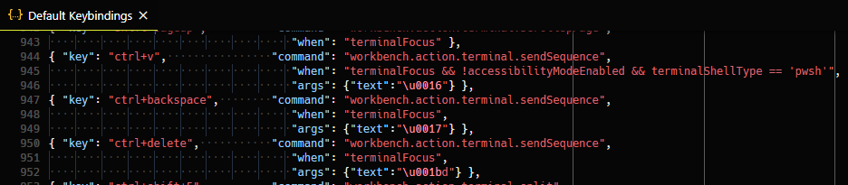
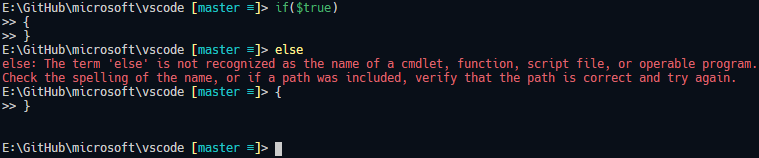
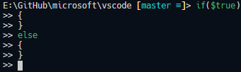
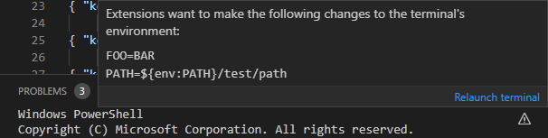

---
Order:
TOCTitle: April 2020
PageTitle: Visual Studio Code April 2020
MetaDescription: Learn what is new in the Visual Studio Code April 2020 Release (1.45)
MetaSocialImage: 1_45/release-highlights.png
Date: 2020-5-7
DownloadVersion: 1.45.1
---
# April 2020 (version 1.45)

**Update 1.45.1**: The update addresses these [issues](https://github.com/microsoft/vscode/issues?q=is%3Aissue+milestone%3A%22April+2020+Recovery%22+is%3Aclosed).

<!-- DOWNLOAD_LINKS_PLACEHOLDER -->

---

Welcome to the April 2020 release of Visual Studio Code. There are a number of updates in this version that we hope you will like, some of the key highlights include:

* **[Accessibility improvements](#accessibility)** - Focus commands to navigate the workbench, status bar accessibility.
* **[Switch editor tabs via mouse wheel](#switch-tabs-using-mouse-wheel)** - Quickly switch files in the editor using your mouse wheel.
* **[Faster syntax highlighting](#faster-syntax-highlighting)** - Programming language colorization is up to 3 times faster.
* **[Custom semantic colors](#semantic-token-styling)** - Change semantic token colors through your user settings.
* **[GitHub authentication support](#github-authentication-for-github-repositories)** - Automatic GitHub authentication for GitHub repositories.
* **[GitHub Issues integration](#github-pull-requests-and-issues)** - Inline hovers and suggestions for GitHub issues and users.
* **[Remote Development](#remote-development)** - Container configuration recommendations, WSL 2 support.
* **[JavaScript debugger preview](#new-javascript-debugger)** - CPU profiling, improved Auto Attach to Node.js processes.
* **[New Docker Compose topic](#docker-compose)** - Learn how to use Docker Compose to work with multiple containers.

>If you'd like to read these release notes online, go to [Updates](https://code.visualstudio.com/updates) on [code.visualstudio.com](https://code.visualstudio.com).

**Insiders:** Want to try new features as soon as possible? You can download the nightly [Insiders](https://code.visualstudio.com/insiders) build and try the latest updates as soon as they are available. And for the latest Visual Studio Code news, updates, and content, follow us on Twitter [@code](https://twitter.com/code)!

## Accessibility

This milestone we received great feedback from our community, which helped us identify and tackle many [accessibility issues](https://github.com/microsoft/vscode/issues?q=label%3Aaccessibility+milestone%3A%22April+2020%22+is%3Aclosed).

* We introduced **Focus Next Part** (`kb(workbench.action.focusNextPart)`) and **Focus Previous Part** (`kb(workbench.action.focusPreviousPart)`) commands to make it easy to navigate across the workbench.
* The status bar is now accessible and when focused, screen readers can read its content.
* Introduced appropriate ARIA labels across every list and tree widget in the workbench, such as Open Editors, Breadcrumbs, Problems view, and more.

One of our team's top priorities is making Visual Studio Code a more accessible product and improving experiences for every user and so we have created a [new Gitter channel](https://gitter.im/Microsoft/vscode-a11y) for VS Code accessibility. We encourage users to join and give feedback, bring up problems, and share accessibility practices.

## Workbench

### Switch tabs using mouse wheel

When you use the mouse wheel to scroll over editor tabs, you currently cannot switch tabs, only reveal tabs that are out of view. Now with a new setting `workbench.editor.scrollToSwitchTabs`, you can change the behavior to switch the active editor tab.

Below when the cursor focus in the editor tab region, if the user scrolls their mouse wheel, the active editor changes.


**Note:** You can also press and hold the `Shift` key while scrolling to get the opposite behavior (for example, you can switch editor tabs even when the `scrollToSwitchTabs` setting is off).

### Custom window title separator

A new setting `window.titleSeparator` lets you change the separator character that is used in the window title. By default, a dash `'-'` is used.


### Updated Side Bar section headers for default themes

We've updated the styling of the Side Bar section headers for our default Dark and Light themes. We now use a transparent background and show a border for each header.

Below the **OPEN EDITORS** section header does not have a background color and the **VSCODE** and **OUTLINE** headers have an upper border.


## Editor

### Faster syntax highlighting

Syntax Highlighting in VS Code runs by [interpreting Text Mate Grammars](https://code.visualstudio.com/blogs/2017/02/08/syntax-highlighting-optimizations). These grammars are authored with regular expressions written in a particular dialect and can be evaluated using the [oniguruma regular expression library](https://github.com/kkos/oniguruma). Up until now, we have been using two distinct libraries for evaluating such regular expressions, one for VS Code desktop (a native node module), and another one for VS Code in the browser (a Web Assembly binary).

We have now written a dedicated Web Assembly binding that is optimized for usage by our TextMate interpreter. By avoiding memory allocations in inner loops and adopting new APIs added just a few months ago to oniguruma, we have been able to create a variant that is faster than both of the previous approaches and delivers up to 3 times faster performance for highlighting regular programming files. You can review [pull request #95958](https://github.com/microsoft/vscode/pull/95958) more details and measurements.

### Semantic token styling

You can now customize semantic theming rules in your user settings. Semantic coloring is available for TypeScript and JavaScript, with support for Java and C++ under development. It is enabled by default for built-in themes and is being adopted by theme extensions.

The `editor.semanticTokenColorCustomizations` setting allows users to override the default theme rules and to customize the theming.


The setting above changes the **Default Dark+** theme. It gives a new style to parameters (italic and a new color) and underlines all symbols from a default library (for example, `Promise`, `Map`, and their properties).

The example below adds semantic styling to all themes:

```ts
"editor.semanticTokenColorCustomizations": {
    "enabled": true, // enable semantic highlighting for all themes
    "rules": {
        // different color for all constants
        "property.readonly": "#35166d",

        // make all symbol declarations bold
        "*.declaration": { "bold": true }
    }
}
```

Theming for semantic tokens is explained in more details in the [Semantic Highlighting Guide](https://code.visualstudio.com/api/language-extensions/semantic-highlight-guide#theming).

### New color for constants in the Default Dark+ theme

The Default Dark+ and the Default Light+ themes now color constants in a different shade than writable variables.

Below notice that the `htmlMode` and `range` constants are a different color than the `result` variable.

Default Dark+ theme:


Default Light+ theme:


### Disable persistent Undo

Last milestone, changed the Undo/Redo stack to be persisted when you close a file and reopen it. Not everyone wanted this new feature, so there is now a setting, `files.restoreUndoStack`, to disable persistent Undo.

## Integrated Terminal

### Removal of several prompt-related commands

The following commands have been removed:

* `workbench.action.terminal.deleteWordLeft`
* `workbench.action.terminal.deleteWordRight`
* `workbench.action.terminal.deleteToLineStart`
* `workbench.action.terminal.moveToLineStart`
* `workbench.action.terminal.moveToLineEnd`

These commands worked by sending a particular character sequence to the terminal, which was a best effort guess based on what command keybindings terminals use. The problem with these commands was that they were a closed box, you needed to literally search through the vscode codebase to figure out how they worked. They have been replaced with custom keybindings for the `workbench.action.terminal.sendSequence` command, which does the same thing in a generic way.

These are advanced keyboard shortcuts and cannot be viewed in their entirety via the Keyboard Shortcuts UI as they contain arguments but you can view their JSON definitions by running the **Preferences: Open Default Keyboard Shortcuts (JSON)** command:



### Support for pasting of multi-line text in PowerShell

Multi-line pasting never worked in PowerShell as VS Code always sent over the text in exactly the same way as typing it out. As explained above, several keybindings have been swapped to use the `workbench.action.terminal.sendSequence` command and you might have noticed a new keybinding was added for Windows only:

```json
{ "key": "ctrl+v",                "command": "workbench.action.terminal.sendSequence",
                                     "when": "terminalFocus && !accessibilityModeEnabled && terminalShellType == 'pwsh'",
                                     "args": {"text":"\u0016"} },
```

This new keybinding will send the text representing `Ctrl+V` directly to PowerShell, which gets picked up by PSReadLine and handled properly.

Before:



After:



*Theme: [Sapphire (Dim)](https://marketplace.visualstudio.com/items?itemName=Tyriar.theme-sapphire)*

### Control double-click word selection

The new `terminal.integrated.wordSeparators` setting lets you customize the separator characters used to delimit a word when you double-click in the terminal.

The default separators are:

```json
  "terminal.integrated.wordSeparators": " ()[]{}',\"`─"
```

## Debugging

### Automatic debug configurations

Setting up debugging in VS Code can be a daunting task because a user has to create a new debug configuration (or at least modify a template to their needs). In our continuing effort to simplify the debugging experience, we have added a new feature that gives debug extension authors a means to analyze the current project and offer quality debug configurations automatically that do not require additional user configuration.

In a similar way to how build tasks are provided, the automatic debug configurations are grouped under the appropriate debugger (folder icon) in the Debug view's configuration dropdown and the **Select and Start Debugging** Quick Pick. Once the debugger is chosen, VS Code presents all the automatic configurations available. Selecting a configuration will start a new debugging session.

The following screen cast shows the feature for the new JavaScript debugger (in preview) and our educational Mock Debug:


The debug Quick Pick can be opened by typing 'debug ' (with a space) in **Quick open** (`kb(workbench.action.quickOpen)`) or by triggering the **Debug: Select and Start Debugging** command.

In the next milestone, we'll add UI so that an automatic debug configuration can be easily added to the `launch.json` for further configuration.

## Tasks

### Disable faster Quick Pick

With version 1.44, we improved the task picker that shows when you run the **Tasks: Run Task** command by changing the layout and making it faster. However, the faster Quick Pick does make the task picker two levels deep depending on which task you want to run. If you want the previous UI, you can now disable the faster picker with the `task.quickOpen.showAll` setting.

### Save on run

Previously, all dirty editors were always saved when a task is run. If you don't want to have your editors saved when you run a task, you can now configure that behavior with `task.saveBeforeRun`.

## Languages

### TypeScript status bar entry enhancements

When you are focused on a TypeScript file, VS Code shows the current TypeScript version in the status bar:


Clicking on the version now brings up commands appropriate for the current TypeScript project:


### Prompt users to switch to the workspace version of TypeScript

The new `typescript.enablePromptUseWorkspaceTsdk` setting brings up a prompt asking users if they want to switch to the workspace version of TypeScript:


To enable the prompt, include `"typescript.enablePromptUseWorkspaceTsdk": true` and `typescript.tsdk` as workspace settings for your project.

### Markdown link to folders

Editor links in Markdown files and links in the Markdown preview can now point to folders. Clicking on one of these links will reveal the target folder in VS Code's File Explorer.

## Source Control

### GitHub authentication for GitHub repositories

VS Code now has automatic GitHub authentication against GitHub repositories. You can now clone, pull, push to and from public and private repositories without configuring any credential manager in your system. Even Git commands invoked in the Integrated Terminal, for example `git push`, are now automatically authenticated against your GitHub account.

You can disable GitHub authentication with the `git.githubAuthentication` setting. You can also disable the terminal authentication integration with the `git.terminalAuthentication` setting.

### Hide Git commit input box

A new setting `git.showCommitInput` allows you to hide the commit input box for Git repositories.

### Inline diff is now editable

You can now edit inside the quick diff editor, when previewing changes in a file.


## Preview features

Preview features are not ready for release but are functional enough to use. We welcome your early feedback while they are under development.

### Settings Sync

We have been working the last couple of months to support synchronizing VS Code preferences across machines and this feature is available for preview on the [Insiders](https://code.visualstudio.com/insiders/) release.

You can now sign in with your GitHub account to synchronize your VS Code preferences.


*Theme: GitHub Sharp with Customizations*

There is also now support for synchronizing global snippets.

### New JavaScript debugger

This month we continued making progress on our new JavaScript debugger. It's installed by default on Insiders, and can be installed [from the Marketplace](https://marketplace.visualstudio.com/items?itemName=ms-vscode.js-debug-nightly) in VS Code stable. You can start using it with your existing launch configurations by enabling the `debug.javascript.usePreview` setting.

Here are some new features added this month:

**Profiling Support**

You can capture CPU profiles from your Node.js or browser applications by clicking the new **Profile** button in the Call Stack view, or using the **Debug: Take Performance Profile** command. Once you do, you can choose how long the profile will run: until you stop it, for a length of time, or until you hit another breakpoint.

After the profile ends, it's saved in your workspace folder and opened in VS Code. If you're running our stable build, you'll want to install our [visualizer extension](https://marketplace.visualstudio.com/items?itemName=ms-vscode.vscode-js-profile-table) to view it. On Insiders, the extension is already built-in. When you open the profile, CodeLens are added to your files that contain performance information at the function level and for certain 'hot' lines. Unlike profiles captured in many other tools, the recorded profile is sourcemap-aware.


*Theme: Earthsong, Font: Fira Code*

**Auto Attach integration**

When `debug.javascript.usePreview` is turned on, VS Code's [Auto Attach](https://code.visualstudio.com/docs/nodejs/nodejs-debugging#_auto-attach-feature) will use a new method provided by `js-debug` that allows all terminals to work similarly to the Debug Terminal.

Improvements to Auto Attach over the existing debugger:

* The debugger is attached immediately allowing you to hit breakpoints early on in the program.
* Child processes are debugged automatically.
* There's no process-polling overhead during Auto Attach.

**Copy Complex Values from Variables View**

Previously, trying to copy complex values, like objects, from the VS Code **Variables** view would often result in truncated or incomplete data. Changes in VS Code and js-debug allow us to copy the complete value.


### Product icon themes

Visual Studio Code contains a set of built-in icons that are used in views and the editor, but can also be used in hovers, the status bar, and by extensions. These icons are **product icons** as opposed to **file icons**, which are displayed next to file names throughout the UI.

The product icons that ship with VS Code are contained in the [Codicon icon font](https://github.com/microsoft/vscode-codicons) and are used for the **default** product icon theme. Extensions can now provide new product icon themes to redefine these icons and give VS Code a new appearance.


The [Product Icon Themes](https://code.visualstudio.com/api/extension-guides/product-icon-theme) documentation has more details and there is a [Product Icon Theme Sample](https://github.com/microsoft/vscode-extension-samples/tree/main/product-icon-theme-sample).

### TypeScript/JavaScript symbol search across all open projects

When using TypeScript 3.9+, VS Code's [workspace symbol search](https://code.visualstudio.com/docs/editor/editingevolved#_open-symbol-by-name) now includes results from all opened JavaScript and TypeScript projects by default. We previously only searched the project of the currently active file.

This is controlled by the new `"typescript.workspaceSymbols.scope"` setting. To revert to the old behavior, set: `"typescript.workspaceSymbols.scope": "currentProject"`.

### Improved links in the terminal

Links in the terminal have undergone an overhaul, changing out the backing system for a much more robust implementation that enables:

* The use of the editor's link detection for better web and `file://` link detection.
* Folder link support, either opening the folder in the Explorer or opening a new VS Code window.
* Different link actions for different link types, falling back to "word" links that search the workspace (based on the `terminal.integrated.wordSeparators` setting).
* Similar link highlighting and hover experience to the editor.


*Theme: [Topaz (Dim)](https://marketplace.visualstudio.com/items?itemName=Tyriar.theme-topaz)*

A list of known issues is available [in this query](https://github.com/microsoft/vscode/issues?q=is%3Aopen+is%3Aissue+label%3Aintegrated-terminal-links).

### Dynamic view icons and titles

This milestone, we continued on the work to make the layout more flexible. Moving views around the workbench allows you to create new icons in the Activity Bar or new tabs in the Panel. To make it easier to understand what is held in one of these newly created view containers, we have updated the logic to be easier to understand.

Now, when you have a custom container, we will inherit the title and icon from the first visible view. This will allow you to change it by rearranging the views. For containers that are built-in or from extensions, we will try to preserve this icon as long as possible. Below when a new view is placed at the top of the view container, its icon and title are updated.


Lastly, you can now move your custom containers around with all of the containing views in one movement. The short video below shows dragging a Terminal and Output view combination into the Activity Bar.


## Contributions to extensions

### Remote Development

Work continues on the [Remote Development extensions](https://marketplace.visualstudio.com/items?itemName=ms-vscode-remote.vscode-remote-extensionpack), which allow you to use a container, remote machine, or the [Windows Subsystem for Linux](https://learn.microsoft.com/windows/wsl) (WSL) as a full-featured development environment.

Feature highlights in 1.45 include:

* Dev Containers: Provide container configuration recommendations.
* Dev Containers: WSL 2 Docker and Podman engines support.
* Dev Containers: New `devcontainer.json` variables for local and container folders.

You can learn about new extension features and bug fixes in the [Remote Development release notes](https://github.com/microsoft/vscode-docs/blob/main/remote-release-notes/v1_45.md).

### GitHub Pull Requests and Issues

Formerly named "GitHub Pull Requests", the [GitHub Pull Requests and Issues](https://marketplace.visualstudio.com/items?itemName=GitHub.vscode-pull-request-github) extension has been letting you manage and review pull requests from within VS Code for [over a year now](https://code.visualstudio.com/blogs/2018/09/10/introducing-github-pullrequests). Now, the extension as been expanded to include support for GitHub Issues.

Issue support includes:

* Hovers for #-referenced issues and @-mentioned users.
* Inline completion suggestions for issues and users.
* An **Issues** view where you can use custom queries.
* An action to start working on an issue, which creates a branch and populates the commit message.

There is also new repository support:

* Clone a repository using a [remote source provider](#git).
* Publish a repository to GitHub.

The short video below illustrates publishing to a new private repository on GitHub, with an option to browse the repo on GitHub once the files have been successfully uploaded.


For more information, you can read the recent [GitHub Issues Integration](https://code.visualstudio.com/blogs/2020/05/06/github-issues-integration) blog post and [Working with GitHub](https://code.visualstudio.com/docs/sourcecontrol/github) documentation.

### GitHub Issue Notebook

The VS Code team is working on native support for Notebooks. The most popular Notebooks in use these days are Jupyter Notebooks and while investigating them, we began looking at ways to build a Notebook solution that is unbiased and supports different styles of Notebooks.

One of those Notebooks is the [GitHub Issue Notebooks](https://marketplace.visualstudio.com/items?itemName=ms-vscode.vscode-github-issue-notebooks) extension, which lets you manage issue and pull request searches and render results inline:


This extension is still under development and only works with VS Code Insiders but with it you can experience Notebooks first hand and you can provide us with feedback.

## Extension authoring

### New theme colors for editor tabs

New colors were added to further theme the workbench editor tabs:

* `tab.unfocusedInactiveBackground`: Inactive tab background color in an unfocused group
* `tab.hoverForeground`: Tab foreground color when hovering
* `tab.unfocusedHoverForeground`: Tab foreground color in an unfocused group when hovering

### New theme color for editor title border

The existing color `editorGroupHeader.tabsBorder` was changed to render a border below editor tabs but above breadcrumbs. A new color `editorGroupHeader.border` lets you render a border below the editor group header (for example, below breadcrumbs if enabled) to restore the previous behavior of `editorGroupHeader.tabsBorder`.

### Deprecating and archiving of the vscode NPM module

In June 2019, we [split the vscode module](https://code.visualstudio.com/updates/v1_36#_splitting-vscode-package-into-typesvscode-and-vscodetest)  into `@types/vscode` and `vscode-test` in light of the `event-stream` incident. Today, a [security alert for minimist](https://snyk.io/blog/prototype-pollution-minimist/) has caused security alerts for extensions that still depend on `vscode`, which depends on `mocha@5.2.0` and therefore `minimist@0.0.8`. Unfortunately, `mocha@5.2.0` no longer receive updates and upgrading to a new `mocha` version would break existing functionalities.

We published a new version of `vscode` that removes some unnecessary dependencies. We also archived the [repository](https://github.com/microsoft/vscode-extension-vscode) and deprecated the [vscode module](https://www.npmjs.com/package/vscode) on NPM. Please [migrate](https://code.visualstudio.com/api/working-with-extensions/testing-extension#migrating-from-vscode) to `@types/vscode` and `vscode-test`.

### New Completion Item Kinds

There are two new entries to `vscode.CompletionItemKind` that represent issues and users. These can be used for instance to suggest usernames when adding TODO tags.

### Working with URIs

We have added a `vscode.Uri.joinPath` utility. It is a factory function that creates new URIs by joining path segments with an existing URI. Think of this as Node.js' `path.join` utility but for URIs.

For extensions, VS Code exposes the URI where extensions are installed via `Extension.extensionUri` and via `ExtensionContext.extensionUri`. With the join utility, you can now create URIs for resources of your extension.

For example:

```ts

const fileUri = vscode.Uri.joinPath(context.extensionUri, './file.png');
const bytes = await vscode.workspace.fs.readFile(fileUri);
```

### debug/callstack/context menu inline group

VS Code now supports contributions to the `debug/callstack/context` menu `inline` group. Commands contributed to this group will be rendered inline in the Call Stack when a user hovers over the Debug Session element.


### New Debug theme colors

There are new colors for styling the Debug view:

* `debugView.exceptionLabelForeground`: Foreground color for a label shown in the CALL STACK view when the debugger breaks on an exception
* `debugView.exceptionLabelBackground`: Background color for a label shown in the CALL STACK view when the debugger breaks on an exception
* `debugView.stateLabelForeground`: Foreground color for a label in the CALL STACK view showing the current session's or thread's state
* `debugView.stateLabelBackground`: Background color for a label in the CALL STACK view showing the current session's or thread's state
* `debugView.valueChangedHighlight`: Color used to highlight value changes in the Debug views (for example, the Variables view)
* `debugTokenExpression.name`: Foreground color for the token names shown in Debug views (for example, the Variables or Watch view)
* `debugTokenExpression.value`: Foreground color for the token values shown in Debug views
* `debugTokenExpression.string`: Foreground color for strings in Debug views
* `debugTokenExpression.boolean`: Foreground color for booleans in Debug views
* `debugTokenExpression.number`: Foreground color for numbers in Debug views
* `debugTokenExpression.error`: Foreground color for expression errors in Debug views

### Source control management

**New preserveFocus argument to open resource commands**

When invoking the `SourceControlResourceState.command` command, an additional `preserveFocus: boolean` argument will be passed, which lets extension authors to provide a better user experience.

**Input text mimetype**

The Source Control input text now has a dedicated mimetype: `text/x-scm-input`.

**Control input box visibility**

Extensions can now control the visibility of the Source Control input box for each repository using the `SourceControlInputBox.visible` property.

### Git

**Remote source providers**

The Git extension API now allows other extensions to [provide remote sources](https://github.com/microsoft/vscode/blob/68213a7df9ee450fecec51f4f2a6dc8a44592f53/extensions/git/src/api/git.d.ts#L230) in order to participate in the **Git: Clone** command.

Here's an example by the [GitHub Pull Requests and Issues](https://marketplace.visualstudio.com/items?itemName=GitHub.vscode-pull-request-github) extension:


**Credential providers**

The Git extension API was expanded so that extensions can [provide authentication credentials](https://github.com/microsoft/vscode/blob/68213a7df9ee450fecec51f4f2a6dc8a44592f53/extensions/git/src/api/git.d.ts#L231) in order to authenticate Git commands invoked against HTTPS Git repositories within the workbench and Integrated Terminal.

### SignatureInformation.activeParameter

The new `activeParameter` property on `SignatureInformation` lets you specify the active parameter for every signature individually. When provided, this overrides the top level `SignatureHelp.activeParameter` property.

### Strict null fix for EventEmitter

In VS Code 1.44 and below, the argument to `EventEmitter.fire` is optional:

```ts
// Valid in VS Code 1.44
const emitter = new EventEmitter<number>();

emitter.event((x: number) => console.log(x));

// Calling fire with no argument was valid but resulted in the `x` above being `undefined`
emitter.fire();
```

This violated [strict null checking](https://www.typescriptlang.org/docs/handbook/release-notes/typescript-2-0.html#--strictnullchecks) but did not cause compile errors.

In VS Code 1.45, the `fire` now requires an argument. If you still want to be able to call `.fire()` with no arguments in your source code, use `new EventEmitter<void>`.

## Language Server Protocol

Work has started on the [3.16 version](https://microsoft.github.io/language-server-protocol/specifications/specification-3-16/) of the specification. As a first step, the Call Hierarchy support moved out of the proposed state. Please note that the 3.16 spec is not yet final and, depending on feedback, may still change.

## Proposed extension APIs

Every milestone comes with new proposed APIs and extension authors can try them out. As always, we are keen on your feedback. This is what you have to do to try out a proposed API:

* You must use Insiders because proposed APIs change frequently.
* You must have this line in the `package.json` file of your extension: `"enableProposedApi": true`.
* Copy the latest version of the [vscode.proposed.d.ts](https://github.com/microsoft/vscode/blob/main/src/vs/vscode.proposed.d.ts) file into your project's source location.

Note that you cannot publish an extension that uses a proposed API. There may be breaking changes in the next release and we never want to break existing extensions.

### Contribute to terminal environments

This new proposed API was introduced last month so that extension authors can contribute to terminal environments. This month has mainly been applying some UI on top of the feature and polishing it up. There is now a warning icon when a terminal has a "stale" environment, which shows a rich hover explaining what's going to change and includes a convenient **Relaunch terminal** action. There's also an information icon available when changes are active but this is disabled by default.



### Providing debug configurations dynamically

We have updated the debugging extension API to give debug extension authors a way to add debug configurations dynamically, based on information found in the workspace or project. These debug configurations appear in the same UI locations where static debug configurations from the `launch.json` are shown.

In this release, dynamic debug configurations are shown in the Debug view's configuration dropdown and the **Select and Start Debugging** Quick Pick. In a future release, we are considering showing them in the "Welcome" view as well.

The new API is based on the `provideDebugConfigurations` method of the existing `DebugConfigurationProvider`. Until this release, the `provideDebugConfigurations` was called by VS Code to provide the initial "static" debug configurations to be copied into a newly created `launch.json`. With the new API, a `DebugConfigurationProvider` can now be registered via `vscode.debug.registerDebugConfigurationProvider` for the "dynamic" case by passing the value `DebugConfigurationProviderTriggerKind.Dynamic` to the new optional `triggerKind` argument. With this new registration, VS Code will call the `provideDebugConfigurations` method whenever the list of all debug configurations is about to be presented in the UI.

In order to activate extensions that make use of this new API on time, a new activation event `onDebugDynamicConfigurations:<debug type>` has been introduced. The `<debug type>` is mandatory and denotes for which debugger the dynamic debug configurations are specified.

A [usage example](https://github.com/microsoft/vscode-mock-debug/blob/6be4f5b4b246dafe25f1e1d8ef420f7dccd8f627/src/extension.ts#L31-L55) can be found in Mock Debug.

### Binary Custom Editor API

We spent this iteration reworking the proposed API for binary custom editors to prepare it for stabilization. As a reminder, custom editors let extensions provide their own editor user interface in place of VS Code's normal text editor. We've already stabilized support for [custom editors for text based files](https://code.visualstudio.com/api/extension-guides/custom-editors#custom-text-editor). The proposed API extends custom editors to binary file formats such as images or hex dumps.


We want your feedback on this API so that we can hopefully finalize it next iteration. Check out the [custom editor extension sample](https://github.com/microsoft/vscode-extension-samples/tree/main/custom-editor-sample) to review an example implementation of a custom editor for binary files. The [Custom Editor API](https://code.visualstudio.com/api/extension-guides/custom-editors) documentation now also covers custom editors for binary files.

Please [let us know](https://github.com/microsoft/vscode/issues/77131) if this API works for you or if you run into any problems implementing your custom editor.

## Engineering

### Native iterators

We're now using native ES6 iterators to speed up performance. You can find more details in [issue #94540](https://github.com/microsoft/vscode/pull/94540).

### Compilation daemon

Thanks to the [deemon](https://github.com/joaomoreno/deemon) utility, we now run our selfhost compilation task as a background process: it stays running even if VS Code is restarted.

### Automated issue classification

Continuing with our work in moving our issue triaging flow over to GitHub Actions, we have created Actions for automatic issue classification. These Actions work by automatically downloading all of our issues and generating Machine Learning models to classify issues into feature-areas on a scheduled basis. The full implementation of all our Actions is in our [GitHub Triage Actions](https://github.com/microsoft/vscode-github-triage-actions/) repository.

## New documentation

### Docker Compose

There is a new [Docker Compose](https://code.visualstudio.com/docs/containers/docker-compose) topic explaining how the Microsoft [Docker extension](https://marketplace.visualstudio.com/items?itemName=ms-azuretools.vscode-docker) can help you add Docker Compose files to your projects to work easily with multiple Docker containers.

### Java topics

The Java topics have been updated and include new topics on [Linting](https://code.visualstudio.com/docs/java/java-linting) and [Refactoring](https://code.visualstudio.com/docs/java/java-refactoring) Java source code using the [Java extensions](https://marketplace.visualstudio.com/items?itemName=vscjava.vscode-java-pack).

### GitHub

With the expanded GitHub integration, there is a new [Working with GitHub](https://code.visualstudio.com/docs/sourcecontrol/github) topic that shows how you can use GitHub from within VS Code.

## Notable fixes

* [46886](https://github.com/microsoft/vscode/issues/46886): Can't resize Breakpoints section in Debug sidebar
* [85344](https://github.com/microsoft/vscode/issues/85344): Firefox crashes when I click on a link in VSCode.
* [86425](https://github.com/microsoft/vscode/issues/86425): Integrated terminal width too narrow
* [90714](https://github.com/microsoft/vscode/issues/90714): Apply debug console font size setting to input field
* [90734](https://github.com/microsoft/vscode/issues/90734): Windows Terminal as external terminal does not launch in the workspace directory
* [93973](https://github.com/microsoft/vscode/issues/93973): [SSH] Auto Reveal in Side Bar not working
* [94574](https://github.com/microsoft/vscode/issues/94574): Centered Layout: use full width when displaying diff editor
* [94982](https://github.com/microsoft/vscode/issues/94982): Bash debugging does not start with version 1.44.0
* [95108](https://github.com/microsoft/vscode/issues/95108): serverReadyAction debugWithChrome suddenly stopped working
* [95319](https://github.com/microsoft/vscode/issues/95319): getWordRangeAtPosition can freeze the extension host

## Thank you

Last but certainly not least, a big *__Thank You!__* to the following folks that helped to make VS Code even better:

Contributions to our issue tracking:

* [John Murray (@gjsjohnmurray)](https://github.com/gjsjohnmurray)
* [Andrii Dieiev (@IllusionMH)](https://github.com/IllusionMH)
* [Simon Chan (@yume-chan)](https://github.com/yume-chan)
* [ArturoDent (@ArturoDent)](https://github.com/ArturoDent)
* [Alexander (@usernamehw)](https://github.com/usernamehw)
* [Marco Zehe (@MarcoZehe)](https://github.com/MarcoZehe)
* [joanmarie (@joanmarie)](https://github.com/joanmarie)
* [José Vilmar Estácio de Souza (@jvesouza)](https://github.com/jvesouza)
* [Michał Zegan (@webczat)](https://github.com/webczat)

Contributions to `vscode`:

* [Andrew Casey (@amcasey)](https://github.com/amcasey)
  * Clean up CallstackOrException telemetry in typescript-language-features [PR #96108](https://github.com/microsoft/vscode/pull/96108)
  * Make char position optional in TS stack [PR #96321](https://github.com/microsoft/vscode/pull/96321)
  * Update npm script compile-extension:typescript-language-features [PR #96320](https://github.com/microsoft/vscode/pull/96320)
* [Anthony Van de Gejuchte (@avdg)](https://github.com/avdg): Do not let git use a pager [PR #95549](https://github.com/microsoft/vscode/pull/95549)
* [Richard Willis (@badsyntax)](https://github.com/badsyntax): Update vscode.d.ts - Fix code comment block for Pseudoterminal.onDidClose [PR #96206](https://github.com/microsoft/vscode/pull/96206)
* [@bkis](https://github.com/bkis): Fix typo in git extension's config description [PR #94993](https://github.com/microsoft/vscode/pull/94993)
* [@bolinfest](https://github.com/bolinfest): Ensure @rematch and nextEmbedded can be used together in Monarch grammar [PR #95742](https://github.com/microsoft/vscode/pull/95742)
* [Borja Zarco (@bzarco)](https://github.com/bzarco): Use `argument` in addition to `folderUri` when conditionally resolving some variables. [PR #95483](https://github.com/microsoft/vscode/pull/95483)
* [Christos Pappas (@ChrisPapp)](https://github.com/ChrisPapp)
  * Focus terminal after dragging a file to terminal [PR #96278](https://github.com/microsoft/vscode/pull/96278)
  * Add default keybindings for stage/revert/unstage selected ranges [PR #93706](https://github.com/microsoft/vscode/pull/93706)
  * Prevent unexpected rename cancellation [PR #95739](https://github.com/microsoft/vscode/pull/95739)
* [Connor Skees (@connorskees)](https://github.com/connorskees)
  * handle windows paths beginning with \\?\ [PR #95147](https://github.com/microsoft/vscode/pull/95147)
  * Strip \\?\ from absolute Windows paths [PR #95365](https://github.com/microsoft/vscode/pull/95365)
* [Edgar Cumbreras (@cumbreras)](https://github.com/cumbreras): Feat: #94285 Options on saving before running tasks [PR #94466](https://github.com/microsoft/vscode/pull/94466)
* [Duncan Walter (@DuncanWalter)](https://github.com/DuncanWalter): TS: Add setting to prompt users about workspace tsdk [PR #95566](https://github.com/microsoft/vscode/pull/95566)
* [Dusty Pomerleau (@dustypomerleau)](https://github.com/dustypomerleau): change all instances of `wordHighligher` to `wordHighlighter` [PR #95830](https://github.com/microsoft/vscode/pull/95830)
* [Evan Krause (@evangrayk)](https://github.com/evangrayk): Throttle status bar spinner animations to save CPU [PR #96096](https://github.com/microsoft/vscode/pull/96096)
* [Jonathan Fleckenstein (@fleck)](https://github.com/fleck): remove duplicate git.pullFrom command [PR #95780](https://github.com/microsoft/vscode/pull/95780)
* [Phil Marshall (@flurmbo)](https://github.com/flurmbo): Add git.showCommitInput config option (#79074) [PR #81982](https://github.com/microsoft/vscode/pull/81982)
* [Gaurav Makhecha (@gauravmak)](https://github.com/gauravmak): Spell fix [PR #94687](https://github.com/microsoft/vscode/pull/94687)
* [@Git-Lior](https://github.com/Git-Lior): bugfix  - typescript code completion doesn't recognize property modifiers when more than one exists [PR #94165](https://github.com/microsoft/vscode/pull/94165)
* [John Murray (@gjsjohnmurray)](https://github.com/gjsjohnmurray): fix #95510 'Reveal in Side Bar' confused by case-sensitive FileSystem… [PR #95555](https://github.com/microsoft/vscode/pull/95555)
* [Gustavo Cassel (@GustavoASC)](https://github.com/GustavoASC): Developed setting to loop search from the beginning or end of document in Find Widget [PR #92243](https://github.com/microsoft/vscode/pull/92243)
* [Ilia Pozdnyakov (@iliazeus)](https://github.com/iliazeus)
  * add more json file extensions #95584 [PR #95751](https://github.com/microsoft/vscode/pull/95751)
  * fix uri fragment slugification #94508 [PR #94655](https://github.com/microsoft/vscode/pull/94655)
* [Andrii Dieiev (@IllusionMH)](https://github.com/IllusionMH)
  * Fix menu icons mismatch [PR #95872](https://github.com/microsoft/vscode/pull/95872)
  * Register loading icon for async tree [PR #95885](https://github.com/microsoft/vscode/pull/95885)
* [Jean Pierre (@jeanp413)](https://github.com/jeanp413)
  * Fixes clicking on problems filter inputbox makes problems panel callapse [PR #96203](https://github.com/microsoft/vscode/pull/96203)
  * Fix command `scm.mainPane.focus` does not focus Source Control Providers view [PR #96515](https://github.com/microsoft/vscode/pull/96515)
  * Fixes apply debug console font size setting to input field [PR #91261](https://github.com/microsoft/vscode/pull/91261)
  * Fixes missing git folder actions under Untracked Changes group in scm viewlet [PR #91872](https://github.com/microsoft/vscode/pull/91872)
  * Update markersViewModel on MarkersView construction [PR #95653](https://github.com/microsoft/vscode/pull/95653)
  * Improve debug viewlet dropdown outline [PR #95935](https://github.com/microsoft/vscode/pull/95935)
  * Fixes rename preview "Group Changes By File" view doesn't show the reference type icon info [PR #94968](https://github.com/microsoft/vscode/pull/94968)
  * Fixes "Run and "Debug" is always greyed out when the editor first opens [PR #94853](https://github.com/microsoft/vscode/pull/94853)
* [jedwards (@jheiv)](https://github.com/jheiv): Focus terminal after 'Terminal:Clear' command palette action [PR #92100](https://github.com/microsoft/vscode/pull/92100)
* [Jon Bockhorst (@jmbockhorst)](https://github.com/jmbockhorst)
  * Adopt terminal link provider API [PR #90336](https://github.com/microsoft/vscode/pull/90336)
  * Fix terminal link hovers for local links [PR #91615](https://github.com/microsoft/vscode/pull/91615)
  * Fix terminal Follow Link handlers [PR #91477](https://github.com/microsoft/vscode/pull/91477)
* [John Blackbourn (@johnbillion)](https://github.com/johnbillion): Treat `.gitignore_global` as an Ignore file by default. [PR #96080](https://github.com/microsoft/vscode/pull/96080)
* [Kodai Nakamura (@kdnk)](https://github.com/kdnk): Add action to focus query editor widget [PR #94799](https://github.com/microsoft/vscode/pull/94799)
* [Lenny Anders (@lennyanders)](https://github.com/lennyanders): Add transition to backdrop-filter when dragging elements [PR #95217](https://github.com/microsoft/vscode/pull/95217)
* [Lukas Spieß (@lumaxis)](https://github.com/lumaxis): Update keytar to latest public version [PR #95351](https://github.com/microsoft/vscode/pull/95351)
* [Yaşar Yıldız (@MonoLizard)](https://github.com/MonoLizard): Fix #90734 Add starting directory parameter for the new Windows Terminal [PR #90773](https://github.com/microsoft/vscode/pull/90773)
* [Marvin Heilemann (@muuvmuuv)](https://github.com/muuvmuuv): Feature: add window title separator prop [PR #94371](https://github.com/microsoft/vscode/pull/94371)
* [@NickDebug](https://github.com/NickDebug): added missing word [PR #95043](https://github.com/microsoft/vscode/pull/95043)
* [Richard Townsend (@richard-townsend-arm)](https://github.com/richard-townsend-arm): Add gulp targets, fix build for Windows on Arm. [PR #85326](https://github.com/microsoft/vscode/pull/85326)
* [Robert Rossmann (@robertrossmann)](https://github.com/robertrossmann)
  * Add editorOverviewRuler.background colour customisation point [PR #93732](https://github.com/microsoft/vscode/pull/93732)
  * Debug: major theming improvements 🎨 🎉 [PR #94838](https://github.com/microsoft/vscode/pull/94838)
  * Allow theming the diff view's diagonal fill with diffEditor.diagonalFill [PR #94780](https://github.com/microsoft/vscode/pull/94780)
* [Dmitry Sharshakov (@sh7dm)](https://github.com/sh7dm): Display future events in timeline correctly [PR #94459](https://github.com/microsoft/vscode/pull/94459)
* [Tobias (@Shegox)](https://github.com/Shegox): Update link for automated issue management actions repository [PR #96568](https://github.com/microsoft/vscode/pull/96568)
* [Josh Smith  (@smithjosh115)](https://github.com/smithjosh115): Issue #93589: Rename 'renameShorthandProperties' setting to 'useAliasesForRenames' [PR #94480](https://github.com/microsoft/vscode/pull/94480)
* [Thomas Weingartner (@Thoemmeli)](https://github.com/Thoemmeli): Fix to 'Markdown Preview of relative links drops 'host' from path' [PR #95092](https://github.com/microsoft/vscode/pull/95092)
* [Tyler James Leonhardt (@TylerLeonhardt)](https://github.com/TylerLeonhardt): Add PowerShell herestring autoclosing pairs [PR #95245](https://github.com/microsoft/vscode/pull/95245)
* [Alexander (@usernamehw)](https://github.com/usernamehw): Reveal file in OS should work for special files like settings.json wi… [PR #95193](https://github.com/microsoft/vscode/pull/95193)
* [Christopher Makarem (@x24git)](https://github.com/x24git): Prevent CodeLens CSS selector name from being invalid [PR #95005](https://github.com/microsoft/vscode/pull/95005)
* [@xisui-MSFT](https://github.com/xisui-MSFT): Add configurations field to launch.json, workspace.json or .code-workspace when it does not exist [PR #95488](https://github.com/microsoft/vscode/pull/95488)

Contributions to `vscode-json-languageservice`:

* [Alex Kreidler (@alexkreidler)](https://github.com/alexkreidler): Add basic coverage information [PR #54](https://github.com/microsoft/vscode-json-languageservice/pull/54)
* [Anantha Kumaran (@ananthakumaran)](https://github.com/ananthakumaran): add support for textDocument/definition [PR #50](https://github.com/microsoft/vscode-json-languageservice/pull/50)

Contributions to `vscode-html-languageservice`:

* [Liam Newman (@bitwiseman)](https://github.com/bitwiseman): Update js-beautify to 1.11.0 [PR #82](https://github.com/microsoft/vscode-html-languageservice/pull/82)

Contributions to `language-server-protocol`:

* [Sam McCall (@sam-mccall)](https://github.com/sam-mccall): make didSave server capability name consistent [PR #958](https://github.com/microsoft/language-server-protocol/pull/958)
* [Sora Morimoto (@imbsky)](https://github.com/imbsky): Fix link to lsif-util [PR #971](https://github.com/microsoft/language-server-protocol/pull/971)

Contributions to `debug-adapter-protocol`:

* [Nick Battle (@nickbattle)](https://github.com/nickbattle): Added VDMJ-LSP to the list of adapters [PR #109](https://github.com/microsoft/debug-adapter-protocol/pull/109)

Contributions to `vscode-generator-code`:

* [Neeraj Kashyap (@nkashy1)](https://github.com/nkashy1): Updated the commented myExtension import [PR #199](https://github.com/microsoft/vscode-generator-code/pull/199)

Contributions to `vscode-textmate`:

* [Yan Pashkovsky (@Yanpas)](https://github.com/Yanpas): Add grammar performance warning [PR #128](https://github.com/microsoft/vscode-textmate/pull/128)

Contributions to `vscode-vsce`:

* [Ilia Pozdnyakov (@iliazeus)](https://github.com/iliazeus): print output of failed prepublish scripts [PR #442](https://github.com/microsoft/vscode-vsce/pull/442)

Contributions to `localization`:

There are over 800 [Cloud + AI Localization](https://github.com/microsoft/Localization/wiki) community members using the Microsoft Localization Community Platform (MLCP), with over about 170 active contributors to Visual Studio Code. We appreciate your contributions, either by providing new translations, voting on translations, or suggesting process improvements.

Here is a snapshot of [contributors](https://microsoftl10n.github.io/VSCode/). For details about the project including the contributor name list, visit the project site at [https://aka.ms/vscodeloc](https://aka.ms/vscodeloc).

* **Chinese (Simplified, China)** Tingting Yi, Yizhi Gu, Charles Dong, Justin Liu, Joel Yang, Tony Xia, 朱知阳, meng shao, 普鲁文, paul cheung, 张锐, Yiting Zhu, Nong Zhichao, Liam Kennedy, 武 健, Zhao Liguo, 宁 倬, Bochen Wang, 一斤瓜子, 顺 谭, 云 何, Yun Liu, yungkei fan, 杨 越鹏.
* **Chinese (Traditional, Taiwan)** 船長, Winnie Lin, 予 恆, TingWen Su.
* **Czech** David Knieradl.
* **Danish (Denmark)** Javad Shafique, Lasse Stilvang.
* **English (United Kingdom)** Martin Littlecott, Oren Recht, Faris Ansari.
* **Finnish (Finland)** Teemu Sirkiä.
* **French (France)** Antoine Griffard, Thierry DEMAN-BARCELÒ, Rodolphe NOEL, Nathan Bonnemains.
* **Hebrew (Israel)** Chayim Refael Friedman, Asaf Amitai.
* **Hungarian** Bucsai László.
* **Indonesian (Indonesia)** Gerry Surya, Laurensius Dede Suhardiman.
* **Italian (Italy)** Alessandro Alpi, Riccardo Cappello.
* **Japanese (Japan)** Ikko Ashimine, Aya Tokura, Takayuki Fuwa, ちゃん きさらぎ, 住吉 貴志, Koichi Makino, Yoshihisa Ozaki, TENMYO Masakazu.
* **Korean (Korea)** Kyunghee Ko, June Heo.
* **Norwegian (Norway)** Torbjørn Viem Ness.
* **Polish (Poland)** Makabeus Orban, Kacper Łakomski, Karol Szapsza.
* **Portuguese (Brazil)** Alessandro Trovato, Marcelo Fernandes, Arthur Lima, Luciana de Melo, Luiz Gustavo Nunes.
* **Portuguese(Portugal)** Pedro Filipe, António Pereira.
* **Russian (Russia)** Andrey Veselov, Vadim Svitkin, Минаков Антон.
* **Spanish (Spain, International Sort)** Sifredo Da Silva, Ariel Costas Guerrero, David Roa, Abdón Rodríguez P., Luis Manuel, Carlos A. Echeverri V, A. Jesus Flores A., Ricardo Estrada Rdez, Alfonso Jesus Flores.
* **Swedish (Sweden)** Per Ragnar Edin.
* **Tamil (India)** krishnakoumar c.
* **Turkish (Türkiye)** Umut Can Alparslan, Mehmet Yönügül.
* **Ukrainian (Ukraine)** Nikita Potapenko, igor oleynik.
* **Vietnamese (Vietnam)** Hieu Nguyen Trung, LN Quang.

<!-- In-product release notes styles.  Do not modify without also modifying regex in gulpfile.common.js -->
<a id="scroll-to-top" role="button" title="Scroll to top" aria-label="scroll to top" href="#"><span class="icon"></span></a>
<link rel="stylesheet" type="text/css" href="css/inproduct_releasenotes.css"/>
