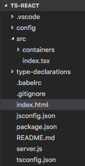
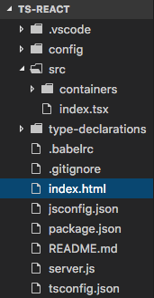
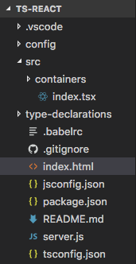
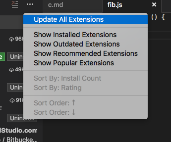
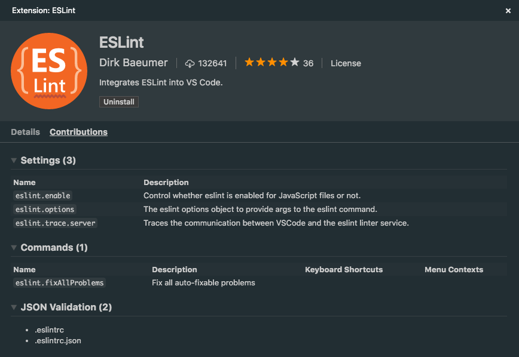
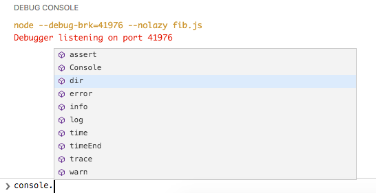
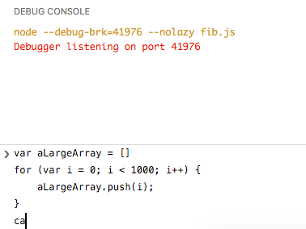
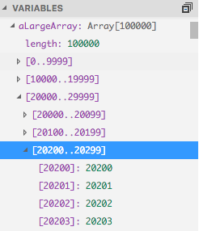
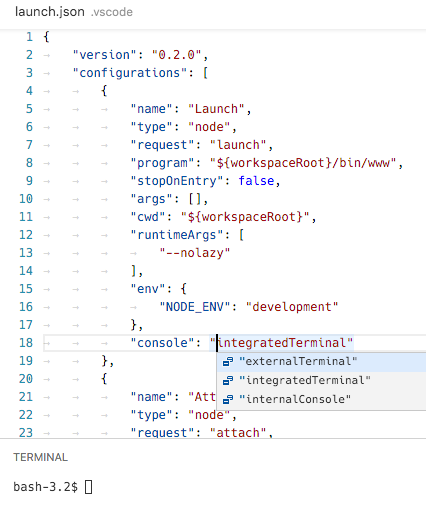

---
Order:
TOCTitle: August 2016
PageTitle: Visual Studio Code August 2016 1.5
MetaDescription: See what is new in the Visual Studio Code August 2016 Release (1.5)
MetaSocialImage: 1_5/social.jpg
---
# August 2016 (version 1.5)

## 1.5.3 Fully Translated Build

It took us 2 weeks longer than originally anticipated, but now it's here: The 1.5.3 release is our August release fully translated into the 9 supported languages.

Downloads: [Windows](https://vscode-update.azurewebsites.net/1.5.3/win32/stable) | [Mac](https://vscode-update.azurewebsites.net/1.5.3/darwin/stable) | Linux 64-bit: [.tar.gz](https://vscode-update.azurewebsites.net/1.5.3/linux-x64/stable) [.deb](https://vscode-update.azurewebsites.net/1.5.3/linux-deb-x64/stable) [.rpm](https://vscode-update.azurewebsites.net/1.5.3/linux-rpm-x64/stable) | Linux 32-bit: [.tar.gz](https://vscode-update.azurewebsites.net/1.5.3/linux-ia32/stable) [.deb](https://vscode-update.azurewebsites.net/1.5.3/linux-deb-ia32/stable) [.rpm](https://vscode-update.azurewebsites.net/1.5.3/linux-rpm-ia32/stable)

## 1.5.2 Recovery Build

We are releasing a 1.5.2 recovery build to fix several important issues:

* [11702](https://github.com/Microsoft/vscode/issues/11702): Unable to bypass ssl verification any more for corp firewall
* [11714](https://github.com/Microsoft/vscode/issues/11714): Terminal focus key binding is not working correctly after update to 1.5
* [11742](https://github.com/Microsoft/vscode/issues/11742): Bug in cursor location within user snippets
* [11754](https://github.com/Microsoft/vscode/issues/11754): ShowQuickPick does not fulfil the promises

Downloads: [Windows](https://vscode-update.azurewebsites.net/1.5.2/win32/stable) | [Mac](https://vscode-update.azurewebsites.net/1.5.2/darwin/stable) | Linux 64-bit: [.tar.gz](https://vscode-update.azurewebsites.net/1.5.2/linux-x64/stable) [.deb](https://vscode-update.azurewebsites.net/1.5.2/linux-deb-x64/stable) [.rpm](https://vscode-update.azurewebsites.net/1.5.2/linux-rpm-x64/stable) | Linux 32-bit: [.tar.gz](https://vscode-update.azurewebsites.net/1.5.2/linux-ia32/stable) [.deb](https://vscode-update.azurewebsites.net/1.5.2/linux-deb-ia32/stable) [.rpm](https://vscode-update.azurewebsites.net/1.5.2/linux-rpm-ia32/stable)

## 1.5.1 Recovery Build

To fix an [issue](https://github.com/Microsoft/vscode/issues/11715) when the `editor.fontSize` is set to 0, we're releasing a 1.5.1 recovery build.

Downloads: [Windows](https://vscode-update.azurewebsites.net/1.5.1/win32/stable) | [Mac](https://vscode-update.azurewebsites.net/1.5.1/darwin/stable) | Linux 64-bit: [.tar.gz](https://vscode-update.azurewebsites.net/1.5.1/linux-x64/stable) [.deb](https://vscode-update.azurewebsites.net/1.5.1/linux-deb-x64/stable) [.rpm](https://vscode-update.azurewebsites.net/1.5.1/linux-rpm-x64/stable) | Linux 32-bit: [.tar.gz](https://vscode-update.azurewebsites.net/1.5.1/linux-ia32/stable) [.deb](https://vscode-update.azurewebsites.net/1.5.1/linux-deb-ia32/stable) [.rpm](https://vscode-update.azurewebsites.net/1.5.1/linux-rpm-ia32/stable)

## August Release Summary

The VS Code team was hard at work during August and we are happy with the release and we hope you like it too. There are key updates to the UI, extension support, debugging and the extensibility APIs.

Here are some highlights:

* **Workbench**: Bring the File Explorer to life with File Icon Themes. VS Code ships with two icon themes with more available on the Marketplace.
* **Debugging**: The console [REPL] just got a whole lot more usable with IntelliSense for Node.js as well as debug protocol additions to support IntelliSense by other debug extensions. We also added support for multiline input.
* **Extensions**:
  * You can now quickly see an extension's contributions (commands, settings, languages). Both for your installed extensions and those on the Marketplace.
  * Sort your Marketplace extension searches by installation count and ratings.
  * Turn on auto update or use Update All for your installed extensions.
* **Editor**: New settings to control word wrap and auto save.
* **Quick Open**: Performance improvements with Quick Open for large projects.
* **Extension Authoring**: Expanded editor command API to support VIM emulation.

>**Note:** We had planned to ship 1.5 fully translated. Unfortunately, there are some delays with the translations and we do not want hold this release. We will ship an update with all the translations soon.

## Workbench

### File Icon Themes

The File Explorer can now show file and folder icons. To enable file icons, pick a File Icon Theme:

- Use the global menu **File** > **Preferences** > **File Icon Theme** (**Code** > **Preferences** on Mac).
- Use the **Preferences: File Icon Theme** command in the **Command Palette** (`kb(workbench.action.showCommands)`).

By default, no file icon set is configured and the File Explorer doesn't render icons. Once a File Icon Theme is selected, the choice will be persisted and used again on restarts of VS Code. In this release, file icons are only shown in the File Explorer, but we plan to use file icons in other places, for example in Editor tabs.

VS code ships with two icon themes and we expect the community to contribute many more themes.

|None (Default)|Minimal File Icons|Seti File Icons|
|-----|-----|-----|
||||

Credit goes to Jesse Weed and all contributors to the popular [Seti UI](https://github.com/jesseweed/seti-ui) theme for the fantastic Seti UI icons and to Roberto Huertas for implementing an icon extension that made very clear how many of our users wanted icons.

### Key binding support within the Integrated Terminal

A new setting `terminal.integrated.commandsToSkipShell` was added that contains an array of commands that skip processing by the shell and instead are processed by VS Code's key binding system. This allows keys such as `kbstyle(F1)` to now work while focus is in the terminal.

## Editor

### Editor settings

There are several useful Editor [settings](/docs/getstarted/settings.md) in this release:

* `editor.renderLineHighlight` - Disables the current line highlight
* `editor.fontWeight` - Customizes the editor's font weight (**normal**, **bold**).
* `editor.wordWrap` - Toggles word wrapping while respecting `editor.wrappingColumn`.

### Auto Save when application loses focus

You can now configure Auto Save (`files.autoSave` setting) with the new value `onWindowChange` to trigger save automatically when switching windows.

### Quick Open got a lot quicker

Over the last two iterations, we looked into making Quick Open fast, even for large workspaces ('large' as in 'Chromium-repository-large'). A newly cloned Chromium repository contains more than 220,000 files. On our development machines, Quick Open went from around 30s in VS Code version 1.3 to around 3-4s (depending on your platform) in version 1.5. This is the performance without any caches. However we do use caches and with those, it takes around 0.5s to get the results. Since we start updating the caches immediately when the user invokes Quick Open and don't block the UI thread when we read from the caches, the 0.5 seconds is the perceived end-user performance even when the caches were out-of-date. As said, this is for the large Chromium repository. If your projects are smaller, you may not see any delay now.

### Keep Quick Open visible even when focus is outside

We added a new setting `workbench.quickOpen.closeOnFocusLost` to control if Quick Open should close when focus moves out of the widget. By default, Quick Open will close, but you can set it to `false` to stay open even when focus is outside of VS Code.

### Include symbol results in file Quick Open results

We added a new setting `search.quickOpen.includeSymbols` to control if symbols should appear in Quick Open file searches. Previously, we included symbol results in the general file picker but this had enough issues that we decided to make this optional. If you want the symbol results back, please set this option to `true`. Note that enabling this setting will make the overall file search speed slower depending on the time it needs for the global symbol search to return results.

>**Note:** You can always search for global symbols using **Show All Symbols** (`kb(workbench.action.showAllSymbols)`).

### New actions to move Tabs left or right within a group

There are new actions to move a Tab (tabbed header) left or right within a group of editors.

The two actions and their default key bindings are:

Action | Command Palette | Key Binding
--- | --- | ---
`workbench.action.moveEditorLeftInGroup` | Move Editor Left | `kb(workbench.action.moveEditorLeftInGroup)`
`workbench.action.moveEditorRightInGroup` | Move Editor Right | `kb(workbench.action.moveEditorRightInGroup)`

### Closed editors reopen at their previous index

We always provided an action to reopen an editor after it was closed, `workbench.action.reopenClosedEditor` (`kb(workbench.action.reopenClosedEditor)`). With this release, editors will now reopen at the same index, preserving the order that existed before they were closed.

### Mac OS: Cmd+E no longer opens Quick Open

We decided to remove an (undocumented) key binding to bring up quick open for file search. You can bring back `kbstyle(Cmd+E)` with the following key binding configuration:

```json
{ "key": "cmd+e", "command": "workbench.action.quickOpen" }
```

The reason behind this change is that `kbstyle(Cmd+E)` on Mac OS is typically associated with running a search in the current active file.

## Languages

### TypeScript

We bundle the officially released version of TypeScript with Visual Studio Code. For the August release, this will be version `1.8.10`. During September, the version `2.0` will become available and you can already install the release candidate using `npm install -g typescript@rc`. Using a different version of TypeScript inside VS Code as on the command line or by a build tool is confusing, since you will get different errors. `2.0` supports features that are not supported in `1.8.10`. If you want to use the newer version of TypeScript inside VS Code then please use the `typescript.tsdk` setting and refer to the corresponding [documentation](https://code.visualstudio.com/docs/languages/typescript#_using-newer-typescript-versions).

VS Code now checks if the workspace folder contains a custom TypeScript version (typically installed via `npm install typescript@x.x.x`). If this is the case and the `typescript.tsdk` setting isn't used, then VS Code informs the user about the local version and ask whether the local version should be used.


The **More Information** action takes you to documentation for how to configure VS Code to always use a locally installed TypeScript version. VS Code now also checks whether the used TypeScript language server is different than the globally installed `tsc` compiler. When this is the case, a corresponding information message is shown.

### HTML

New settings have been added to control which built-in code completion providers are active. Use these settings if you prefer not to see the corresponding proposals.

```json
// Configures if the built-in HTML language suggests Angular V1 tags and properties.
"html.suggest.angular1": true,

// Configures if the built-in HTML language suggests Ionic tags, properties and values.
"html.suggest.ionic": true,

// Configures if the built-in HTML language suggests HTML5 tags, properties and values.
"html.suggest.html5": true
```

### LESS

The LESS syntax validation has been brought up-to-date to support some of the features recently added to LESS. These include:

- Named Parameters in Mixins
- Mixins as functions
- Passing Rulesets to Mixins
- CSS Guards
- Merge

Check out the [LESS documentation](http://lesscss.org/features/) to learn more about these features.

### Settings to enable/disable Emmet for languages

You can now associate existing Emmet syntax profiles (such as `html`, `css`) with other languages with the new `emmet.syntaxProfiles` setting. The setting takes a language Id and associates it with an Emmet profile.

For example, to use Emmet HTML abbreviations inside JavaScript:

```json
{
    "emmet.syntaxProfiles": {
        "javascript": "html"
     }
}
```

You can disable Emmet abbreviations for a particular language using the  `emmet.excludeLanguages` setting. The setting below disables Emmet in PHP files:

```json
{
    "emmet.excludeLanguages": [
        "php"
    ]
}
```

### Linter Extensions

The `vscode-eslint` and `vscode-tslint` extensions now provide settings to run the linter only on save and not while typing.

```json
{
    "tslint.run": "onSave"
}
```

## Extensions

### Easier Updates

There is now an action to **Update All Extensions**.



Additionally, there is now an `extensions.autoUpdate` setting which, when set to `true`, will let extension automatically update themselves without user intervention.

### Extension Contribution Details View

When browsing extensions in VS Code, there is now a **Contributions** section which will display each extension's contributions, even before installing the extension.



### Extension Sorting

You can now sort extensions not only by install count, in the extensions view:


### Marketplace Performance Improvements

The [Marketplace](https://marketplace.visualstudio.com/vscode) has been revamped with a CDN, in order to improve download times and availability for extension queries and downloads.

## Debugging

### Suggestions in Debug Console

The **Debug Console** now shows suggestions while typing. Currently this is only available for Node.js debugging, but other debuggers can implement suggestions as well through the debug protocol.



### MultiLine Debug Console Input

The **Debug Console** input now expands to multiple lines when needed. The expansion can be triggered using `kbstyle(Shift + Enter)`.



### Multi-Level Variable Paging

Data structures with a large number of children are displayed in multi-level chunks. This results in better performance and makes it easier to traverse a large number of children.



## Node Debugging

### Launch debug target in Integrated Terminal

It is now possible to launch the Node.js debug target in the **Integrated Terminal** which helps when developing Node.js based command line applications that read from an interactive terminal and/or need to control their output on the terminal they are running in.

Since there are now three options where to run a node program (**Debug Console**, **Integrated Terminal**, **External Terminal**), we've deprecated the boolean `launch.json` attribute `externalConsole` and introduced a new attribute `console` which accepts these corresponding values: `internalConsole`, `integratedTerminal`, `externalTerminal`.



>**Note:** Depending on what options you have configured for the `internalConsoleOptions` attribute, VS Code may decide to open the **Debug Console** which will hide the **Integrated Terminal**. To avoid this, please set `internalConsoleOptions` to `neverOpen`.

>**Note:** In this release, every debug session creates a new **Integrated Terminal**. In the next release, we will reuse an existing **Integrated Terminal** if possible.

## Extension Authoring

>**Note:** The August release of VS Code still bundles the official version of Typescript which is `1.8.10`. Extension development should be done using this version. We will support TypeScript `2.0.x` for extension development in a future release.

### Editor Commands

For the [VIM extension](https://marketplace.visualstudio.com/items?itemName=vscodevim.vim) to make good progress on their [roadmap](https://github.com/VSCodeVim/Vim/blob/master/ROADMAP.md) particularly on window scrolling and folding, we added the following editor APIs:

- **Scroll editor:** Scrolls the editor up or down - See [9609](https://github.com/Microsoft/vscode/issues/9609).

```javascript
  commands.executeCommand('editorScroll', {to: 'up', by: 'page', value: '1'})
```

- **Reveal line:** Reveals the line at different logical positions in the editor - See [9609](https://github.com/Microsoft/vscode/issues/9609).

```javascript
  commands.executeCommand('revealLine', {lineNumber: '10', at: 'top'})
```

- **Fold:** Fold the content of the editor `n` levels above or below the current cursor position.

```javascript
  commands.executeCommand('editor.fold', {levels: '2', up: false})
```

- **Unfold:** Unfold the content of the editor `n` levels below the current cursor position.

```javascript
  commands.executeCommand('editor.unfold', {levels: '2'})
```

### Powerful Completion Items

The [`Completion Item`](https://github.com/Microsoft/vscode/blob/master/src/vs/vscode.d.ts#L2246) now supports additional text edits and an additional command.

With those, you can do rich things like:

* Add an import statement when completing a symbol.
* Add a library to the project when completing.

### Stable Input Box and Quick Open

When showing Quick Open or asking for input, you can provide the `ignoreFocusOut` option so that the dialogs will not close when focus moves to another part of VS Code or another window. Also, you can now programmatically close them using a cancellation token.

### New context menu keys

We added new context keys for more control over key bindings and menu items:

* `explorerResourceIsFolder` - Will reflect if a file or folder is selected in the Explorer.
* `resourceFilename`  - The name of the file currently active in the editor/Explorer.

### New Theme Settings

In this release, we exposed the following internal colors as TextMate theme settings and now theme writers can customize them with their themes.

- `rangeHighlight`: Background color of range highlighted, used by Quick Open and Find features.
- `selectionHighlight`: Background color of regions highlighted while selecting.
- `inactiveSelection`: Background color of selections when not in focus.
- `wordHighlight`: Background color of a symbol during read-access, like reading a variable.
- `wordHighlightStrong`: Background color of a symbol during write-access, like writing to a variable.
- `findMatchHighlight`: Background color of regions matching the search.
- `currentFindMatchHighlight`: Background color of the current region matching the search.
- `findRangeHighlight`: Background color of regions selected for search.
- `activeLinkForeground`: Color of active links.
- `hoverHighlight`: Background color when hovered.
- `referenceHighlight`: Background color of a reference when finding all references.
- `guide`: Color of the indentation guides which indicate nesting levels.

### Integrated Terminal API

An API has been added that provides extensions with some basic control over the integrated terminal like creating terminal(s) and sending text to them. See the [`window` API reference page](https://code.visualstudio.com/docs/extensionAPI/vscode-api#_window) for a full description of the API.

### Additions to the Debug Protocol

The [debug protocol](https://github.com/Microsoft/vscode-debugadapter-node/blob/master/protocol/src/debugProtocol.ts) has been extended in the following areas (and VS Code already provides the corresponding UI):

* **IntelliSense Support for the Debug Console**: Debug adapters can now implement the `completions` request to provide suggestion proposals for IntelliSense in the **Debug Console**. To enable this feature in VS Code, a debug adapter has to set the `supportsCompletionsRequest` capability to true.

* **Run in Terminal Request**: Debug adapters can now easily run the debug target in VS Code's **Integrated Terminal** via the `runInTerminal` request (which happens to be the first request that is called from the debug adapter into VS Code). The **Integrated Terminal** is an alternative to the **Debug Console** and better supports development of command line applications that read from an interactive terminal and/or need to control their output on the terminal they are running in. Before calling `runInTerminal` make sure that the front-end client supports it by verifying that the arguments passed to the `initialize` request have a `supportsRunInTerminalRequest` attribute and that its value is true.

## Engineering

Originally started with [PR #9791](https://github.com/Microsoft/vscode/pull/9791) from [Manoj Patel (@nojvek)](https://github.com/nojvek), we now have [test coverage](https://coveralls.io/github/Microsoft/vscode?branch=master) for our TypeScript files updated on each build.

## Notable Changes

* [6602](https://github.com/Microsoft/vscode/issues/6602): Add scroll bar to integrated terminal
* [8499](https://github.com/Microsoft/vscode/issues/8499): Cannot distinguish different files with the same path.filename(x)
* [8983](https://github.com/Microsoft/vscode/issues/8983): Closing a dirty split editor (existing OR untitled) should not affect the initial editor
* [9405](https://github.com/Microsoft/vscode/issues/9405): Resizing terminal only resizes the active terminal instance
* [9589](https://github.com/Microsoft/vscode/issues/9589): Save: Flush to disk after writing to file
* [9675](https://github.com/Microsoft/vscode/issues/9675): Undo/Redo adds a stop in between CHN Characters
* [9822](https://github.com/Microsoft/vscode/issues/9822): Terminal IME composition view appears on top of text when at the bottom of the screen
* [9937](https://github.com/Microsoft/vscode/issues/9937): Increase rule stack protection limit - Syntax highlighting broken in JS with multiple nested functions
* [9962](https://github.com/Microsoft/vscode/issues/9962): Explorer can freeze for large folders and many glob patterns
* [10100](https://github.com/Microsoft/vscode/issues/10100): Terminal cursor does not invert text color
* [10148](https://github.com/Microsoft/vscode/issues/10148): After updating to 1.4.0 the react-native extension no longer accepted as a debugger
* [10302](https://github.com/Microsoft/vscode/issues/10302): Support standard keybindings for scrolling terminal by one line on each platform
* [10360](https://github.com/Microsoft/vscode/issues/10360): File rename can close editors
* [10586](https://github.com/Microsoft/vscode/issues/10586): TabCompletionController causes severe perf hit

These are the [closed bugs](https://github.com/Microsoft/vscode/issues?q=is%3Aissue+label%3Abug+milestone%3A%22August+2016%22+is%3Aclosed) and these are the [closed feature requests](https://github.com/Microsoft/vscode/issues?q=is%3Aissue+milestone%3A%22August+2016%22+is%3Aclosed+label%3Afeature-request) for the 1.5 update.

## Monaco Editor 0.6.0

We will create monthly releases of the "Monaco" Editor, in the same rhythm with VS Code. You can see the change log [here](https://github.com/Microsoft/monaco-editor/blob/master/CHANGELOG.md).

## Downloads

* [Windows](https://vscode-update.azurewebsites.net/1.5.0/win32/stable)
* [Mac](https://vscode-update.azurewebsites.net/1.5.0/darwin/stable)
* Linux 64-bit: [.tar.gz](https://vscode-update.azurewebsites.net/1.5.0/linux-x64/stable)
  [.deb](https://vscode-update.azurewebsites.net/1.5.0/linux-deb-x64/stable)
  [.rpm](https://vscode-update.azurewebsites.net/1.5.0/linux-rpm-x64/stable)
* Linux 32-bit: [.tar.gz](https://vscode-update.azurewebsites.net/1.5.0/linux-ia32/stable)
  [.deb](https://vscode-update.azurewebsites.net/1.5.0/linux-deb-ia32/stable)
  [.rpm](https://vscode-update.azurewebsites.net/1.5.0/linux-rpm-ia32/stable)

## Thank You

Last but certainly not least, a big *__Thank You!__* to the following folks that helped to make VS Code even better:

* [Karsten Thoms (@kthoms)](https://github.com/kthoms):
  * Typo: Header File Name -> Header Field Name [PR language-server-protocol#43](https://github.com/Microsoft/language-server-protocol/pull/43)
  * Consistent text style [PR language-server-protocol#44](https://github.com/Microsoft/language-server-protocol/pull/44)
  * Typo fixed [PR language-server-protocol#45](https://github.com/Microsoft/language-server-protocol/pull/45)
  * Consistent use of suffix 'Request' in headers [PR language-server-protocol#46](https://github.com/Microsoft/language-server-protocol/pull/46)
* [Nagaraj (@ramamurthynagaraj)](https://github.com/ramamurthynagaraj):
  * Fixing warning while executing expand select action on an empty page. [PR #10787](https://github.com/Microsoft/vscode/pull/10787)
  * Fixes #10556: Considering non open files dirty count using file dirty event [PR #10590](https://github.com/Microsoft/vscode/pull/10590)
  * Added editor.fontWeight configuration [PR #10515](https://github.com/Microsoft/vscode/pull/10515)
  * Fixes 10754 - Using mode transition constructor so that modeId is available [PR #10784](https://github.com/Microsoft/vscode/pull/10784)
* [Jared Hester (@cloudRoutine)](https://github.com/cloudRoutine):
  * removed ocaml extensions [PR #10240](https://github.com/Microsoft/vscode/pull/10240)
  * don't auto close on single quote [PR #10239](https://github.com/Microsoft/vscode/pull/10239)
* [Fabian Lauer (@FabianLauer)](https://github.com/FabianLauer):
  * Git commit using '--signoff' [PR #10410](https://github.com/Microsoft/vscode/pull/10410)
  * Git: Ignore untracked files in change count badge [PR #10448](https://github.com/Microsoft/vscode/pull/10448)
* [Sandy Armstrong (@sandyarmstrong)](https://github.com/sandyarmstrong):
  * Support CompletionItemKind.Method. [PR #10225](https://github.com/Microsoft/vscode/pull/10225)
  * Fix show in IE11 [PR #10309](https://github.com/Microsoft/vscode/pull/10309)
  * Correct docs for IEditorScrollbarOptions.useShadows [PR #11312](https://github.com/Microsoft/vscode/pull/11312)
* [Natacha Gabbamonte (@natgabb)](https://github.com/natgabb): Fix params link under Completion Request [PR language-server-protocol#42](https://github.com/Microsoft/language-server-protocol/pull/42)
* [Quinn Slack (@sqs)](https://github.com/sqs): Print child process stderr to output channel [PR vscode-languageserver-node#83](https://github.com/Microsoft/vscode-languageserver-node/pull/83)
* [Kaloyan Raev (@kaloyan-raev)](https://github.com/kaloyan-raev): Contribute JSON Schema for composer.json [PR #10698](https://github.com/Microsoft/vscode/pull/10698)
* [Eshwar Andhavarapu (@gontadu)](https://github.com/gontadu): Added .bash_aliases to recognised extensions [PR #10651](https://github.com/Microsoft/vscode/pull/10651)
* [Scott Addie (@scottaddie)](https://github.com/scottaddie): Update default project.json TFMs [PR #9965](https://github.com/Microsoft/vscode/pull/9965)
* [@hm1992](https://github.com/hm1992): Detect shebang for Groovy files [PR #9709](https://github.com/Microsoft/vscode/pull/9709)
* [Toru Nagashima (@mysticatea)](https://github.com/mysticatea): Update: supports the range of lint results. [PR vscode-eslint#102](https://github.com/Microsoft/vscode-eslint/pull/102)
* [@sprinkle131313](https://github.com/sprinkle131313):
  * Recently closed editors open at same position as they were closed [PR #11076](https://github.com/Microsoft/vscode/pull/11076)
  * Changes cursor animations to start in default state [PR #11093](https://github.com/Microsoft/vscode/pull/11093)
* [Meai1 (@Meai1)](https://github.com/Meai1): Check if adapter is null and let it print errors [PR #9966](https://github.com/Microsoft/vscode/pull/9966)
* [Rajkumar Janakiraman (@rajkumar42)](https://github.com/rajkumar42): Improve evaluate on hover feature [PR #9821](https://github.com/Microsoft/vscode/pull/9821)
* [Manoj Patel (@nojvek)](https://github.com/nojvek): Travis builds post coverage info to coveralls.io, README badge [PR #9791](https://github.com/Microsoft/vscode/pull/9791)
* [William Raiford (@bill-mybiz)](https://github.com/bill-mybiz): Restore Previous Commit Message on Undo Last Commit [PR #9796](https://github.com/Microsoft/vscode/pull/9796)
* [Aldo Fregoso (@AldoMX)](https://github.com/AldoMX): Fixed `code.sh` to start VS Code under Cygwin [PR #10508](https://github.com/Microsoft/vscode/pull/10508)
* [Nathan Novielli (@natenovielli)](https://github.com/natenovielli): Only 'git fetch' if there is a remote repository available [PR #10853](https://github.com/Microsoft/vscode/pull/10853)
* [Denis Malinochkin (@mrmlnc)](https://github.com/mrmlnc): Emmet implementation tweaks [PR #11009](https://github.com/Microsoft/vscode/pull/11009), [PR #11003](https://github.com/Microsoft/vscode/pull/11003), [PR #11001](https://github.com/Microsoft/vscode/pull/11001)
* [Ashhar Hasan (@hashhar)](https://github.com/hashhar): Fix for issue 1490 [PR #7029](https://github.com/Microsoft/vscode/pull/7029)
* [Belleve Invis (@be5invis)](https://github.com/be5invis): Add mouse-keyboard event crossover to prevent menu bar from showing up after multi-selecting [PR #9154](https://github.com/Microsoft/vscode/pull/9154)
* [Eric Amodio (@eamodio)](https://github.com/eamodio): Fixes #7749 - Focus on CodeLens click [PR #9249](https://github.com/Microsoft/vscode/pull/9249)
* [Christian Alexander (@ChristianAlexander)](https://github.com/ChristianAlexander): Allow workspaceContains to specify directories [PR #9394](https://github.com/Microsoft/vscode/pull/9394)
* [Grant Mathews (@johnfn)](https://github.com/johnfn): Fix flipping axes behavior [PR #10322](https://github.com/Microsoft/vscode/pull/10322)
* [Pavel Kolev (@paveldk)](https://github.com/paveldk): Fix sending message to terminated worker [PR #10833](https://github.com/Microsoft/vscode/pull/10833)
* [Jun Han (@formulahendry)](https://github.com/formulahendry): Run entire text in terminal if selection is empty [PR #9480](https://github.com/Microsoft/vscode/pull/9480)

<!-- In-product release notes styles.  Do not modify without also modifying regex in gulpfile.common.js -->
<a id="scroll-to-top" role="button" aria-label="scroll to top" href="#"><span class="icon"></span></a>
<link rel="stylesheet" type="text/css" href="css/inproduct_releasenotes.css"/>