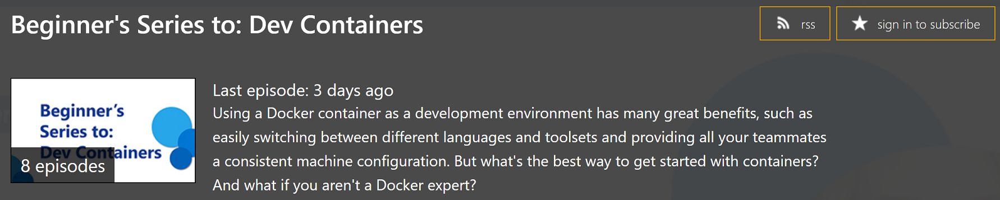

---
Order:
TOCTitle: January 2021
PageTitle: Visual Studio Code January 2021
MetaDescription: Learn what is new in the Visual Studio Code January 2021 Release (1.53)
MetaSocialImage: 1_53/release-highlights.png
Date: 2021-2-4
DownloadVersion: 1.53.2
---
# January 2021 (version 1.53)

**Update 1.53.1**: The update addresses these security [issues](https://github.com/microsoft/vscode/milestone/143?closed=1).

**Update 1.53.2**: The update addresses these [issues](https://github.com/microsoft/vscode/issues?q=is%3Aissue+milestone%3A%22January+2021+Recovery+2%22+is%3Aclosed).

<!-- DOWNLOAD_LINKS_PLACEHOLDER -->

---

Welcome to the January 2021 release of Visual Studio Code. There are a number of updates in this version that we hope you will like, some of the key highlights include:

* **[Wrap tabs](#wrap-tabs)** - Wrap editor tabs in the workbench instead of having a scrollbar.
* **[Configure tab decorations](#tab-decorations)** - Add editor tab status decorations.
* **[Customize search mode](#default-search-mode)** - Use the Search view or open a new Search editor.
* **[JavaScript debugging](#javascript-debugger)** - Support for conditional exception breakpoints and Node.js worker_threads.
* **[Notebook UX updates](#notebooks)** - Outline view for Notebook cells, and breadcrumbs for improved navigation.
* **[Markdown preview image auto update](#markdown-preview-auto-updates-when-images-are-changed-on-disk)** - Preview automatically updates when images change.
* **[Emmet improvements](#emmet-performance-and-feature-improvements)** - Faster performance and supporting the latest features.
* **[Extension guidelines](#extension-guidelines)** - Documented best practices for extension authors.
* **[Remote Development video series](#documentation)** - Learn to create and configure container-based environments.

>If you'd like to read these release notes online, go to [Updates](https://code.visualstudio.com/updates) on [code.visualstudio.com](https://code.visualstudio.com).

**Join us live** at the [VS Code team's livestream](https://code.visualstudio.com/livestream) on Tuesday, February 9 at 8am Pacific (4pm London) to see a demo of what's new in this release, and ask us questions live.

**Insiders:** Want to try new features as soon as possible? You can download the nightly [Insiders](https://code.visualstudio.com/insiders) build and try the latest updates as soon as they are available.

## Workbench

### Wrap tabs

A new setting `workbench.editor.wrapTabs` lets editor tabs wrap instead of showing a scrollbar.


*Theme: [GitHub Dark Theme](https://marketplace.visualstudio.com/items?itemName=GitHub.github-vscode-theme)*

If the available space for the tabs is too small, wrapping will temporarily turn off, and you will see the old experience with a scrollbar.

**Note:** You can prevent wrapped tabs from growing too large by configuring `workbench.editor.tabSizing: shrink`.

### Tab decorations

Two new settings allow you to configure whether editor tabs show decorations, such as git status or diagnostics. Use `workbench.editor.decorations.colors` to decorate tabs with colors, like red/green for files with errors and warnings, and use `workbench.editor.decorations.badges` to decorate tabs with badges, like **M** for git modified.


*Theme: [GitHub Light Theme](https://marketplace.visualstudio.com/items?itemName=GitHub.github-vscode-theme)*

### Open Editors view hidden by default

The Open Editors view is now hidden by default. This will only affect new VS Code users, and existing users will still see the Open Editors view. We wanted to present a cleaner look in the Explorer view out-of-the-box, and we believe that the functionality provided in the Open Editors view is covered in other areas of the workbench, like tabs. The visibility of the Open Editors view can be controlled by the context menu in the Explorer view title area.


### New confirmation dialogs

If a user tries to quit VS Code while there is a file operation in progress, we now show a confirmation dialog. We also show a confirmation dialog for destructive undo operations from the Explorer.

We always want to avoid data loss, so we've introduced these dialogs to make sure it doesn't happen by accident.


### New setting workbench.editor.enablePreviewFromCodeNavigation

A new setting `workbench.editor.enablePreviewFromCodeNavigation` allows you to explicitly enable preview editors from code navigations, such as **Go to Definition**. In our previous release, we changed the default to open editors normally from code navigations. This setting allows you to choose which option you prefer.

### Emmet performance and feature improvements

Emmet now works much faster in HTML and CSS files. The extension also uses the latest Emmet, meaning that features such as countdowns are now supported.

Here's an example of Emmet expanding with a countdown in a large HTML file, with a 20x performance improvement:


### Improved refactor participants UI

Extensions can participate when you create, move, rename, or delete files. This is useful when automatically running refactorings, for example, when you rename a Java file and also need to rename its public class.


The unified UI allows you to accept, skip, and preview the other changes that an extension is making.

### Open with supports alternative opening mode

After running the **Reopen Editor With** command, you can now hold down `Ctrl` when selecting the editor to use to open the new editor to the side of the current editor. This matches the behavior of VS Code's quick open.

Additionally, pressing `Right Arrow` in the **Reopen Editor With** dialog will now open the editor in the background.

### Issue reporting

If you're signed in with GitHub, you can now directly create issues from the issue reporter (**Help** > **Report Issue**).

### Default search mode

The `search.mode` setting is now available to allow configuring what search UI commands like **Search: Find in Files**, and the explorer's **Find in Folder...** and **Find in Workspace** context menu entries use, with options of:

* `view`: Default existing behavior, search using the search view in the sidebar or panel
* `newEditor`: Search in a new Search Editor
* `existingEditor`: Reusing an existing open Search Editor if one exists, otherwise create a new one

In the past, it was advised to configure default search UI by editing keybindings. This is no longer necessary, and these keybindings can be removed in favor of this setting.


*Theme: [GitHub Light Theme](https://marketplace.visualstudio.com/items?itemName=GitHub.github-vscode-theme)*

### New file and folder icons

We've updated our **New File** and **New Folder** icons to make them consistent with the rest of our [iconography library](https://code.visualstudio.com/api/references/icons-in-labels):


## Editor

### New snippet variables

There are new snippet variables for inserting UUIDs, and for inserting the relative path of the current file. The sample snippet below would print:

`let someId = 'foo/test.js/c13d226f-1932-40e2-9fd9-10198c219e33'`

```json
// sample snippet using UUID and RELATIVE_FILEPATH
{
  "scope": "javascript",
  "prefix": "newVars",
  "body": "let someId = '${RELATIVE_FILEPATH}/${UUID}'$0"
}
```

### Transform to snake case

There is a new command **Transform to Snake Case** that will convert the selected text to [snake case](https://en.wikipedia.org/wiki/Snake_case) (for example, `myVariable` -> `my_variable`).

## Debugging

**Start the same debug configuration multiple times**

We have removed the restriction that only a single debug session can be started from a launch configuration. You can now start multiple concurrent sessions by pressing the green run button in the debug configuration dropdown menu any number of times.

Each subsequent debug session will have a number appended at the end of the name so they can be easily distinguished.


**Breakpoints: condition editing**

We've continued the effort to consolidate and simplify breakpoint editing from the BREAKPOINTS view:

* Condition and hit count editing support has been added for **function** breakpoints. With this condition editing is now available for source-, function-, and exception breakpoints and logpoints.
* You can initiate condition editing from the context menu, or the new inline **Edit Condition** action.

An example of condition editing in the BREAKPOINTS view:


Note that while the new UI supports editing of all breakpoint types, conditions, and hit counts are only respected if a debug extension actually supports them. Currently, we are not aware of any debuggers supporting conditions and hit counts for function breakpoints, but we expect some support soon. For exception breakpoints, condition support has been added to the built-in JavaScript debugger in this release.

**Prompt to save untitled files before run/debug**

A common issue reported by new users who are just getting into programming is forgetting to save files before running them. Since most debuggers cannot debug untitled files (PowerShell being an exception), we now prompt users to save open untitled files in the active editor group before running or debugging.

**Syntax coloring for breakpoint zone widget**

The breakpoint editor zone widget now supports syntax coloring by respecting the language mode of the underlying editor.


**Debug console action moved into secondary menu**

In order to make more room for the debug dropdown menu in the debug view, we have moved the **Debug Console** action to the secondary menu (`...`).

In addition, we believe that the need for the action is small given that the debug console opens automatically when a debug session starts.


**Improved logging for extension debugging**

When debugging an extension, calls to `console` APIs are now processed through the built-in JavaScript debugger, which allows for richer representation of complex objects like source mapped stacktraces.

### JavaScript debugger

A complete list of changes can be found in the [vscode-js-debug changelog](https://github.com/microsoft/vscode-js-debug/blob/main/CHANGELOG.md).

**Conditional exception breakpoints**

[Conditional exception breakpoints](https://code.visualstudio.com/updates/v1_52#_support-for-conditional-exceptions) are now supported in the JavaScript debugger. The `error` variable will contain the currently thrown exception:


*Theme: [Codesong](https://marketplace.visualstudio.com/items?itemName=connor4312.codesong)*

**Debug worker_threads**

Debugging of Node.js `worker_threads` is now supported.


*Theme: [Codesong](https://marketplace.visualstudio.com/items?itemName=connor4312.codesong)*

No changes or extra configuration is needed.

## Integrated Terminal

### Flow control

The connection between the terminal processes and the frontend is now protected by a flow control mechanism that will pause the process when the frontend needs to catch up. Previously, this would cause stability/performance issues when using a terminal in a remote connection. This change only applies when using VS Code's remoting functionality for now, but it will be used for local windows soon, after we tweak where terminal processes get launched.

### Better PowerShell 7 discovery

[PowerShell 7](https://github.com/PowerShell/PowerShell) is the latest and greatest version of PowerShell, which can be installed on Windows, macOS, and Linux. If you install PowerShell 7 on Windows, VS Code will use that as the default shell. If you don't have PowerShell 7 installed, VS Code will continue to use Windows PowerShell as the default.

Additionally, if you open the **Select Default Shell** Quick Pick, the enumeration of all of the installed PowerShell versions will show up (MSI installation, Microsoft Store installation, etc.).


> **Note**: macOS and Linux default shell discovery and shell enumeration are unaffected by this because they use the default set by the OS and /etc/shells respectively.
> Additionally, the `terminal.integrated.shell.windows` setting is still honored.

## Languages

### Markdown preview auto updates when images are changed on disk

The Markdown preview will now automatically update when any embedded images are changed on disk:


This can happen when you edit the image file using an external program or from a source control operation, such as switching branches.

## Notebooks

### Outline and breadcrumbs

Notebook cells now show up in the outline pane and breadcrumbs. This allows for a better overview and fast navigation within notebooks.


There are two settings that allow you to define if code cells are part of the outline or not.

* `notebook.outline.showCodeCells`: Whether outline contains code cells
* `notebook.breadcrumbs.showCodeCells`: Whether breadcrumbs contain code cells

### Notebook diff editor: rich output rendering and performance improvement

The diff editor for notebook documents now supports rendering rich output like tables, images, or HTML output.


This feature is currently available in [Insiders](https://code.visualstudio.com/insiders) and you can install either the [Jupyter](https://marketplace.visualstudio.com/items?itemName=ms-toolsai.jupyter) or [.NET Interactive](https://marketplace.visualstudio.com/items?itemName=ms-dotnettools.dotnet-interactive-vscode) extension to preview.

We also improved the scrolling performance to ensure a smooth experience while browsing changes in the diff editor.

### Add new cell toolbar

We've updated our add new cell toolbar to appear whenever you hover over a cell to make it more discoverable.


## Source Control

### Git: Open All Changes command

A new Git command has been added to the Command Palette:

* **Git: Open All Changes...** - Opens all modified and untracked files.

### Git: Warning when pulling (or syncing) and the current branch has been rebased

VS Code will now warn you whenever you attempt to pull (or sync) and the current branch looks like it has been rebased (for example, when published history has been rewritten).

### Git: New settings

Additionally, new Git settings have been added:

* `git.requireGitUserConfig` - In VS Code 1.51 we made a privacy change to require a user name or email address before committing. You can now disable that requirement if desired.
* `git.ignoreRebaseWarning` - Disables the new warning when pulling (or syncing) and the current branch has been rebased.
* `git.autofetch` - Auto fetch can now additionally be set to `all` to fetch all remotes.

## Preview features

### Search in open editors

This release comes with experimental support for searching in open editors, which has been a [highly requested feature](https://github.com/microsoft/vscode/issues/20530) for some time. This feature is enabled by default in Insiders, and can be enabled with the `search.experimental.searchInOpenEditors` setting in Stable.


*Theme: [GitHub Light Theme](https://marketplace.visualstudio.com/items?itemName=GitHub.github-vscode-theme)*

### TypeScript 4.2 support

This release continues to improve our support for the upcoming TypeScript 4.2 release. You can read more about the new language features and improvements in TypeScript 4.2 [on the TypeScript blog](https://devblogs.microsoft.com/typescript/announcing-typescript-4-2-beta/). Here are some of the editor improvements it enables:

* JS Doc templates now generate `@returns`.
* Deprecated DOM APIs are now marked as such.
* A quick fix to declare missing functions.
* Native support for semantic highlighting, instead of using a TypeScript service plugin.

To start using the TypeScript 4.2 nightly builds, just install the [TypeScript Nightly extension](https://marketplace.visualstudio.com/items?itemName=ms-vscode.vscode-typescript-next). Please share your feedback and let us know if you run into any bugs with TypeScript 4.2.

### New Find References to File command

If you are using TypeScript 4.2, you can also try the new **Find References to File** command for JavaScript and TypeScript to find all places where a file is being referenced.


You can trigger this command in a few different ways:

* For the active file using **TypeScript: Find File References** command.
* Right-click on an editor tab and select **Find File References**.
* Right-click on a file in the File Explorer and select **Find File References**.

## Contributions to extensions

### Remote Development

Work continues on the [Remote Development extensions](https://marketplace.visualstudio.com/items?itemName=ms-vscode-remote.vscode-remote-extensionpack), which allow you to use a container, remote machine, or the [Windows Subsystem for Linux](https://learn.microsoft.com/windows/wsl) (WSL) as a full-featured development environment.

Feature highlights in 1.53 include:

* You can now restore the UI state of reconnected terminals.
* Connection compression to help with weak network connectivity.
* Attributes can now be configured for ports in settings.
* Privileged ports are now detected and autoforwarded.
* Containers now support SSH connection with password entry.
* Installation of extensions from a WSL shell.

You can learn about new extension features and bug fixes in the [Remote Development release notes](https://github.com/microsoft/vscode-docs/blob/main/remote-release-notes/v1_53.md).

## Extension authoring

### Extension guidelines

There is now a set of detailed [extension guidelines](https://code.visualstudio.com/api/ux-guidelines/overview) for extension authors. The guidelines cover best practices for contributing to VS Code's users interface and conventions for notifications and status updates.

As an example, below are the Do's and Dont's for contributing commands to the Command Palette:


### Product icon themes

The [product icon theme](https://code.visualstudio.com/api/extension-guides/product-icon-theme) APIs are now stable. Theme authors can publish themes that replace the built-in icons used in views and editors.

Users can switch to new themes with the **Preferences: Product Icon Theme** command.

### Status bar entry background color API

The previously proposed `backgroundColor` for the `StatusBarItem` API is now stable. Currently only `statusBarItem.errorBackground` is supported to avoid the Status bar looking too colorful. We may expand this support to more colors in the future.


The use case for this new API is to enable extensions to indicate error conditions in the Status bar. For example, the ESLint extension may decide to use this color to alert the user that ESLint has not yet been enabled for a workspace.

### Adding CancellationError type

We have added a new error type: `vscode.CancellationError`. This type can be used in response to a `CancellationToken` being canceled or when an operation is being canceled by the executor of that operation.

### OnEnterRule.previousLineText

It is now possible to target the text on the previous line when evaluating an `OnEnterRule` using the newly added property `previousLineText`.

### onEnterRules in language configuration files

Until now, `onEnterRules` could be defined only using the `vscode.languages.setLanguageConfiguration` API. Now, `onEnterRules` can also be defined in the language configuration file.

For example:

```json
  "onEnterRules": [
    {
      "beforeText": "^\\s*(?:def|class|for|if|elif|else|while|try|with|finally|except|async).*?:\\s*$",
      "action": { "indent": "indent" }
    }
  ]
```

### Semantic token commands

There are now new commands to invoke the semantic tokens provider. The commands are:

* `vscode.provideDocumentSemanticTokensLegend` with an argument of type `Uri`
* `vscode.provideDocumentSemanticTokens` with an argument of type `Uri`
* `vscode.provideDocumentRangeSemanticTokensLegend` with an argument of type `Uri`
* `vscode.provideDocumentRangeSemanticTokens` with two arguments: the first an `Uri` and the second a `Range`.

### Secrets API

Similar to the storage API, there is now an API for storing and retrieving secrets on a per-extension basis. This allows extensions to store sensitive information in the OS credential manager or keystore.

### workspaceContains extension activation behavior change

This month, we fixed a bug with the behavior of the `workspaceContains` extension activation event that could change how an extension is activated.

The bug caused us to start a search over the entire workspace, when the `workspaceContains` pattern was only targeting files in the root of the workspace. Since this could affect the startup performance of VS Code, we needed to fix this and scope these searches correctly. But as a result, some extensions that were previously activated by this behavior may no longer get activated.

The change has been in our Insiders build since the beginning of January. For more information, see [this comment](https://github.com/microsoft/vscode/issues/110510#issuecomment-770133700) on the GitHub issue.

### Updated loading icon

We've updated our loading icon to make for a smoother experience.


### Git extension APIs

* A new `API.onDidPublish` event has been added, which fires when a repository or branch is published from the VS Code Git extension.
* A new `API.openRepository` method has been added, to allow extensions to tell the Git extension about other Git repositories, for example, outside the workspace, or more deeply nested within it.
* The `API.push` method now has an additional optional `force` parameter.
* The `API.commit` method's `CommitOptions` now has an additional optional `requireUserConfig` to avoid requiring a user or email address.

### Welcome view content link enablement

A `viewsWelcome` contribution from an extension in which an `enablement` expression is specified will now render command links inactive when the expression evaluates as false.

### resolveTreeItem

The `resolveTreeItem` API now supports cancellation. You can also now use `resolveTreeItem` to resolve the `command` property of your `TreeItem`.

## Proposed extension APIs

Every milestone comes with new proposed APIs and extension authors can try them out. As always, we want your feedback. This is what you have to do to try out a proposed API:

* You must use Insiders because proposed APIs change frequently.
* You must have this line in the `package.json` file of your extension: `"enableProposedApi": true`.
* Copy the latest version of the [vscode.proposed.d.ts](https://github.com/microsoft/vscode/blob/main/src/vs/vscode.proposed.d.ts) file into your project's source location.

You cannot publish an extension that uses a proposed API. There may be breaking changes in the next release and we never want to break existing extensions.

### Inline value provider API

Today the **Show Inline Values** feature of VS Code's debugger is based on a generic implementation in VS Code core, and doesn't provide customizability through settings or extensibility via extensions. As a consequence, it is not a perfect fit for all languages and sometimes shows incorrect values because it doesn't understand the underlying source language. For this reason, we are working on an extension API that allows to replace the built-in implementation completely or to replace parts of the implementation with custom code.

In this milestone, we have created an [initial proposal](https://github.com/microsoft/vscode/issues/105690). If you are interested in this extension API, we'd appreciate your feedback.

### Testing

We are investigating [testing in VS Code](https://github.com/microsoft/vscode/issues/107467), and the first version of the API is now present in `vscode.proposed.d.ts`. Please read the linked issue for more context, and participate if you have input.

This iteration focused building out the **Selfhost Test Provider** for VS Code and foundational UI, primarily the test explorer, gutter decorations, and peek views for results.

For example, here's a failed test showing the difference between actual and expected values in a diff peek view:

*Theme: [Codesong](https://marketplace.visualstudio.com/items?itemName=connor4312.codesong)*

### External URI opener

The proposed external URI opener API allows extensions to handle opening HTTP and HTTPS links that the user selects in the editor. For example, a browser preview extension could use this to open links to a local server in VS Code directly, instead of opening the link with the user's default browser:

To use the external opener API, first add an `onOpenExternalUri` activation event for the URL schemes your opener supports. Currently only `http` and `https` URLs are supported:

```json
"activationEvents": [
  "onOpenExternalUri:http",
  "onOpenExternalUri:https"
]
```

Then in your extension's activation, call `registerExternalUriOpener` to register your external URI opener:

```ts
vscode.window.registerExternalUriOpener('myExtension.opener', {
  canOpenExternalUri(uri: vscode.Uri) {
    // Check if a URI can be opened.
    // This is called when the user first selects a link and VS Code
    // needs to determine which openers are available.

    if (uri.authority === 'localhost:8080') {
      // This opener has default priority for this URI.
      // This will result in the user being prompted since VS Code always has
      // its own default opener.
      return vscode.ExternalUriOpenerPriority.Default;
    }

    // The opener can be used but should not be used by default
    return vscode.ExternalUriOpenerPriority.Option;
  },
  openExternalUri(resolveUri: vscode.Uri) {
    // Actually open the URI.
    // This is called once the user has selected this opener.
  }
}, {
  schemes: ['http', 'https'],
  label: localize('openTitle', "Open URL using My Extension"),
});
```

Now when you select links to `localhost:8080` in the editor or terminal, you will be prompted to select how the URL should be opened:


Additionally, you can configure a default opener for a URI using the new `workbench.externalUriOpeners` setting:

```json
"workbench.externalUriOpeners": {
  "localhost:8081": "myExtension.opener"
}
```

## Language Server Protocol

Work has started on the [3.17](https://microsoft.github.io/language-server-protocol/specifications/specification-3-17) version of the protocol. The first proposed feature is support for a more detailed completion item label.

### Language Server Index Format

We also improved the LSIF indexer for TypeScript and tested it against a broader range of open-source repositories. Major improvements are:

* A tolerant index mode that uses more memory but doesn't fail if a symbol's moniker is not correctly computed (see `--moniker` command-line option).
* Log file support to help find situations where monikers can't be correctly computed.
* A new LSIF dump validation tool (lsif-tooling). The tools can be used with dumps produced by any tool. It is not constraint to the TypeScript indexer. The tool checks and LSIF dump for:
  * Correct vertex and edge layout (for example, correct properties and types of the properties)
  * That vertices are emitted before they are referenced in edges
  * The cardinality of edges
  * The outgoing and incoming type of edges.
  * The dump is portioned correctly (for example, no result partitions are added to documents / projects that are already closed)

## Debug Adapter Protocol

**Value dataBreakpoint from VariablePresentationHint.kind is deprecated**

Currently, we can detect whether an object has a data breakpoint by checking for the `dataBreakpoint` kind from `VariablePresentationHint`. However, the variable `kind` is generally used to identify the actual type of the object - that is, if it's an interface, a method, or a derived class. Data breakpoint tracking, which is used for UI purposes, should be declared as an `attribute` instead, since that can be set alongside other attributes and variable kinds.

So, we have deprecated the value `dataBreakpoint` from the `kind` property of the `VariablePresentationHint` and added a new value `hasDataBreakpoint` for the `attribute` property of the `VariablePresentationHint`.

## Engineering

### Performance Improvements

There's been considerable work surrounding both our GitHub Actions and Azure DevOps Pipelines infrastructure. Our builds now run faster and more often thanks to these improvements. Building VS Code now takes half as much time as before:


### Electron 11 update

In this milestone, we finished the exploration to bundle Electron 11 into VS Code, thanks to everyone involved with testing and self-hosting on insiders. This is a major Electron release and comes with Chromium 87.0.4280.141 and Node.js 12.18.3.

**Breaking change**

As a side effect of this update, we had to bump our build image to use `Ubuntu-18.04` for `x64` linux machines to consume Electron. This update raised the minimum GLIBCXX requirement to `3.4.22` for our native modules, which breaks support for older distros on desktop. After some changes to the build system, we were able to go back as far as using gcc-5 toolchain, which brings the minimum GLIBCXX requirement to `3.4.21`. With these changes, the following are the distros known to work for the `x64` desktop app:

* Ubuntu 16.04 and newer
* Fedora 24 and newer
* Debian 9 and newer
* CentOS 8 and newer

**Note:** Our remote development components continue to use GLIBCXX `3.4.19`, so there is no change in supported platforms.

A workaround for the other distros would be to install gcc-5 or higher toolchain to avoid the GLIBCXX error with native modules, but there is no guarantee that all components of the runtime will work fine. There is also the option of using our [remote development suite](https://code.visualstudio.com/docs/remote/remote-overview) to work with the older distros.

### Apple Silicon Insiders

Thanks to Electron 11, we continue to make progress on fully supporting Apple Silicon. For the Insiders build, we offer three variations of downloads under macOS:

* `x64` version for Mac devices with Intel chip
* `arm64` version for Mac devices with Apple Silicon chip
* `universal` version that can run natively on either of the above devices

The `universal` version is the default download option on the website. We will work towards removing the architecture specific downloads later this year. More updates on this will follow in upcoming iterations.

Universal apps are created by bundling both `x64` and `arm64` version of the apps, hence there is a significant increase in download size for the first install but simplifies the transition for a user to the new Apple Silicon Macs.

**Note:** We originally planned to push the Apple Silicon builds to Stable this iteration. However, late in the iteration, users reported that on macOS Big Sur 11.2 loading a WASM module crashed the extension host. You can follow along with our investigation of the problem in the upstream issue [#115646](https://github.com/microsoft/vscode/issues/115646).

### Debian repository migration

In order to support x64, ARM, and ARM 64-bit architectures in a single repository, we have moved to a new repository location:

```
http://packages.microsoft.com/repos/code
```

The VS Code Debian packages will automatically migrate your system to the new repository, so there's no adoption necessary.

### Progress on Electron sandbox

This milestone we continued to make the VS Code window fit for enabling Electron's [sandbox](https://www.electronjs.org/docs/tutorial/sandbox) and [context isolation](https://www.electronjs.org/docs/tutorial/context-isolation).

**Specifically:**

* The IPC connection to our background shared process changed from a Node.js socket connection to using Electron's [MessagePort](https://www.electronjs.org/docs/api/message-port-main) API.
* There is a new internal option to enable the experimental `vscode-file` protocol for the main window that enables us to do some selfhosting (the issue reporter and process explorer already run with this option since last milestone).
* We removed the more direct Node.js API that is used in the VS Code window.

### VS Code is now Trusted Types compliant

We have finished the work to make VS Code trusted types compliant per the [W3C Trusted Types](https://github.com/w3c/webappsec-trusted-types) specification.

## Documentation

### Remote Development

Check out our new [Beginner's Series to: Dev Containers](https://channel9.msdn.com/Series/Beginners-Series-to-Dev-Containers?WT.mc_id=devcloud-11496-cxa), a set of eight videos that show you how to get, create, and configure a container-based development environment using VS Code [Dev Containers](https://marketplace.visualstudio.com/items?itemName=ms-vscode-remote.remote-containers).



### when clause reference

The `when` clause documentation is now in its own [when clause contexts reference](https://code.visualstudio.com/api/references/when-clause-contexts). Here you can learn how to [conditionally](https://code.visualstudio.com/api/references/when-clause-contexts#_conditional-operators) enable or disable custom keybindings depending on the currently active VS Code UI ([contexts](https://code.visualstudio.com/api/references/when-clause-contexts#_available-contexts)) and tune the visibility of menus and views when contributing extensions.

```json
{ "key": "f5",  "command": "workbench.action.debug.start",
                   "when": "debuggersAvailable && debugState != 'initializing'" }
```

### CodeTour for educators

A new [CodeTour](https://code.visualstudio.com/learn/educators/codetour) topic introduces educators to the [CodeTour extension](https://marketplace.visualstudio.com/items?itemName=vsls-contrib.codetour) that lets them easily author walkthroughs for codebases. Educators can create self-paced tours for their students as they ramp up on new projects and assignments.


### What is a VS Code "workspace"?

A new topic explains what "workspaces" are in VS Code. If you are interested in learning more about the differences between single-folder, multi-root and untitled workspaces, take a look at [What is a VS Code "workspace"?](https://code.visualstudio.com/docs/editor/workspaces).

## Notable fixes

* [76095](https://github.com/microsoft/vscode/issues/76095): Changing `debug.console.wordWrap` should not require a restart
* [96409](https://github.com/microsoft/vscode/issues/96409): Trackpad: Tab switch on mouse scroll: horizontal scrolling sensitivity too high
* [101136](https://github.com/microsoft/vscode/issues/101136): Terminal filled with ^[[D^[[D^[[D^[[D when alt-clicking a link
* [103869](https://github.com/microsoft/vscode/issues/103869): Don't include modified settings with default values in user settings
* [107704](https://github.com/microsoft/vscode/issues/107704): Debugger output is laggy and janky when scrolling
* [109127](https://github.com/microsoft/vscode/issues/109127): Window border causes webviews to be positioned slightly off.
* [111474](https://github.com/microsoft/vscode/issues/111474): "Toggle Editor Type" creates corrupted new view that cannot be opened.
* [111652](https://github.com/microsoft/vscode/issues/111652): Action in explorer is interrupted shortly after creating a folder
* [111758](https://github.com/microsoft/vscode/issues/111758): Accessibility of links in exception widget
* [112013](https://github.com/microsoft/vscode/issues/112013): Maximum call stack size exceeded for long file paths with custom editors.
* [113627](https://github.com/microsoft/vscode/issues/113627): Inform users which editors could not be backed up for hotexit.
* [114353](https://github.com/microsoft/vscode/issues/114353): Watch: copy value should respect multi selection

## Thank you

Last but certainly not least, a big _**Thank You**_ to the following people who contributed this month to VS Code:

Contributions to our issue tracking:

* [John Murray (@gjsjohnmurray)](https://github.com/gjsjohnmurray)
* [Andrii Dieiev (@IllusionMH)](https://github.com/IllusionMH)
* [Simon Chan (@yume-chan)](https://github.com/yume-chan)
* [ArturoDent (@ArturoDent)](https://github.com/ArturoDent)
* [Alexander (@usernamehw)](https://github.com/usernamehw)

Contributions to `vscode`:

* [@0dinD](https://github.com/0dinD): Clarify OpenDialogOptions note (#113831) [PR #113998](https://github.com/microsoft/vscode/pull/113998)
* [@a5hk (Ashkan)](https://github.com/a5hk): camelCase/PascalCase to snake_case [PR #110961](https://github.com/microsoft/vscode/pull/110961)
* [@Andre-Fonteles](https://github.com/Andre-Fonteles): Fixed tab switching too fast when wheeling/scrolling [PR #112034](https://github.com/microsoft/vscode/pull/112034)
* [@AnthonyMastrean (Anthony Mastrean)](https://github.com/AnthonyMastrean): Update problemMatcher.ts [PR #113834](https://github.com/microsoft/vscode/pull/113834)
* [@axetroy (艾斯特洛)](https://github.com/axetroy): add missing await for git.clone and git.cloneRecursive command [PR #112222](https://github.com/microsoft/vscode/pull/112222)
* [@chenjigeng (chenjigeng)](https://github.com/chenjigeng)
  * feat: add rename symbol within script tags [PR #111644](https://github.com/microsoft/vscode/pull/111644)
  * fix: Param helper hover getting cut off at bottom [PR #112019](https://github.com/microsoft/vscode/pull/112019)
  * Fix/debug auto decode link [PR #112169](https://github.com/microsoft/vscode/pull/112169)
  * feat: support Report Issue capability for built-in module [PR #112279](https://github.com/microsoft/vscode/pull/112279)
  * fix: The git commit message field is cropped with negative zoom [PR #112316](https://github.com/microsoft/vscode/pull/112316)
  * fix: hover link encode unnecessarily [PR #112670](https://github.com/microsoft/vscode/pull/112670)
* [@clarkio (Brian Clark)](https://github.com/clarkio): Fix Typo | Suggest: Show Inline Details setting description [PR #112327](https://github.com/microsoft/vscode/pull/112327)
* [@dsanders11 (David Sanders)](https://github.com/dsanders11)
  * [markdown-language-features]: Fix starting scroll for URIs with fragment [PR #111126](https://github.com/microsoft/vscode/pull/111126)
* [@egfx-notifications](https://github.com/egfx-notifications): Correctly resolve mapped drive on Windows [PR #114642](https://github.com/microsoft/vscode/pull/114642)
* [@enagic](https://github.com/enagic): fix: update `isUri()` to compare `fsPath` as `string` [PR #114972](https://github.com/microsoft/vscode/pull/114972)
* [@engelsdamien (Damien Engels)](https://github.com/engelsdamien)
  * Updates tsec and rewrites sinks assignment [PR #112069](https://github.com/microsoft/vscode/pull/112069)
  * Updates tsec to latest version using TS4.1.2 [PR #112206](https://github.com/microsoft/vscode/pull/112206)
* [@ewlsh (Evan Welsh)](https://github.com/ewlsh): Remove unused import 'UriIdentityService'. [PR #112112](https://github.com/microsoft/vscode/pull/112112)
* [@gjsjohnmurray (John Murray)](https://github.com/gjsjohnmurray)
  * #27498 restore extension editor webview scroll positions [PR #85982](https://github.com/microsoft/vscode/pull/85982)
  * fix #111587 Apply enablement to command links in welcome views [PR #113841](https://github.com/microsoft/vscode/pull/113841)
  * fix #37570 add RELATIVE_FILEPATH snippet variable [PR #114208](https://github.com/microsoft/vscode/pull/114208)
  * fix #114416 LabelService.getUriLabel bad relative path if in root workspace [PR #114419](https://github.com/microsoft/vscode/pull/114419)
* [@goldst (Leonard Goldstein)](https://github.com/goldst)
  * add option for preview navigation behavior [PR #112389](https://github.com/microsoft/vscode/pull/112389)
  * fix #115050 flickering tabs when wrapped [PR #115273](https://github.com/microsoft/vscode/pull/115273)
* [@hantatsang (Sang)](https://github.com/hantatsang): Save file dialog: sort file types alphabetically [PR #114487](https://github.com/microsoft/vscode/pull/114487)
* [@HaoboGu (HaoboGu)](https://github.com/HaoboGu): Add emojis and several more symbols as word separators, fix #113404 [PR #113837](https://github.com/microsoft/vscode/pull/113837)
* [@hediet (Henning Dieterichs)](https://github.com/hediet)
  * Refresh Images In Markdown Preview On Change [PR #114083](https://github.com/microsoft/vscode/pull/114083)
  * Set override to false when reopening editors after dragging them to a different editor group [PR #114093](https://github.com/microsoft/vscode/pull/114093)
* [@homebysix (Elliot Jordan)](https://github.com/homebysix): Adjust references to --list-extensions option [PR #112833](https://github.com/microsoft/vscode/pull/112833)
* [@infinnie (joan xie)](https://github.com/infinnie): Allow ResourceCommandResolver.getRightResource() to return undefined [PR #113364](https://github.com/microsoft/vscode/pull/113364)
* [@jasonwilliams (Jason Williams)](https://github.com/jasonwilliams): Changing autofetch to a string config which has "current", "all" and [PR #111090](https://github.com/microsoft/vscode/pull/111090)
* [@jeanp413 (Jean Pierre)](https://github.com/jeanp413)
  * Fixes window border causes webviews to be positioned slightly off [PR #114061](https://github.com/microsoft/vscode/pull/114061)
  * Respect multi selection when Copy value in Watch Expression View [PR #114388](https://github.com/microsoft/vscode/pull/114388)
  * Fix markdown preview no longer shows images with root relative path [PR #114553](https://github.com/microsoft/vscode/pull/114553)
  * Fixes hovers have horizontal scrollbar when not needed [PR #114593](https://github.com/microsoft/vscode/pull/114593)
* [@jonamat (Jonathan Mataloni)](https://github.com/jonamat): fix #113750 [PR #113840](https://github.com/microsoft/vscode/pull/113840)
* [@Kingwl (Wenlu Wang)](https://github.com/Kingwl)
  * Inline Hints controller and API proposal  [PR #113285](https://github.com/microsoft/vscode/pull/113285)
  * Enable forceConsistentCasingInFileNames flag [PR #114334](https://github.com/microsoft/vscode/pull/114334)
* [@KyleMit (Kyle)](https://github.com/KyleMit): Update task services doc link (fixes #112591) [PR #113170](https://github.com/microsoft/vscode/pull/113170)
* [@myovan](https://github.com/myovan)
  * Fixed Issue #110225 - Dragging to select text on Peek window should not hide it [PR #112384](https://github.com/microsoft/vscode/pull/112384)
  * Fixed issue -filtering by extension in Change Language Mode [PR #112435](https://github.com/microsoft/vscode/pull/112435)
* [@noritada (Noritada Kobayashi)](https://github.com/noritada): Remove duplicate 'the's [PR #113716](https://github.com/microsoft/vscode/pull/113716)
* [@nrayburn-tech (Nicholas Rayburn)](https://github.com/nrayburn-tech)
  * update dom to use newer methods [PR #113518](https://github.com/microsoft/vscode/pull/113518)
  * lazier loading of windowsProcessTree [PR #113549](https://github.com/microsoft/vscode/pull/113549)
  * add a RANDOM_UUID snippet variable [PR #113826](https://github.com/microsoft/vscode/pull/113826)
* [@olderor (Bohdan Yevchenko)](https://github.com/olderor): Add sorting to npm scripts [PR #112725](https://github.com/microsoft/vscode/pull/112725)
* [@PiDelport (Pi Delport)](https://github.com/PiDelport): fix typo: ResourcEditorInput → ResourceEditorInput [PR #115208](https://github.com/microsoft/vscode/pull/115208)
* [@plainerman (Michael Plainer)](https://github.com/plainerman): Fix setting title of renamed terminal windows [PR #112317](https://github.com/microsoft/vscode/pull/112317)
* [@qchateau (Quentin Chateau)](https://github.com/qchateau): BUGFIX: Fix semantic highlight scheduling [PR #113315](https://github.com/microsoft/vscode/pull/113315)
* [@rchiodo (Rich Chiodo)](https://github.com/rchiodo): Fix random focus lost issues on CTRL+1/2 for a webview [PR #111676](https://github.com/microsoft/vscode/pull/111676)
* [@serge1 (Serge Lamikhov-Center)](https://github.com/serge1): A case for 'Shift+Insert' added. Fixes #114103 [PR #114520](https://github.com/microsoft/vscode/pull/114520)
* [@shskwmt (Shunsuke Iwamoto)](https://github.com/shskwmt)
  * Fixes #113318: Show having no change  when diffing two empty files [PR #113618](https://github.com/microsoft/vscode/pull/113618)
  * Fixes #113807: Fixed not to skip determination of option type starting with "_" [PR #114101](https://github.com/microsoft/vscode/pull/114101)
  * Fixes 113603: Change reason for moveWordCommand to CursorChangeReason.Explicit [PR #114127](https://github.com/microsoft/vscode/pull/114127)
* [@SneakyFish5 (SneakyFish5)](https://github.com/SneakyFish5): Allow tabs to wrap to multi-line [PR #106448](https://github.com/microsoft/vscode/pull/106448)
* [@solomatov (Konstantin Solomatov)](https://github.com/solomatov): Do not ignore errors from $spawnExtHostProcess [PR #112033](https://github.com/microsoft/vscode/pull/112033)
* [@susiwen8 (susiwen8)](https://github.com/susiwen8)
  * Fix: selecting entry should focus back to editor [PR #114493](https://github.com/microsoft/vscode/pull/114493)
  * Fix: release note don't use editor style [PR #114709](https://github.com/microsoft/vscode/pull/114709)
  * Fix: show hover when mouse control hover scroll [PR #114854](https://github.com/microsoft/vscode/pull/114854)
* [@swinder0161](https://github.com/swinder0161): build on mac11.1: upgrade version of playwright to 1.7.1 [PR #113906](https://github.com/microsoft/vscode/pull/113906)
* [@tamuratak (Takashi Tamura)](https://github.com/tamuratak): Fix scrolling of markdown preview. Close #65504 [PR #111094](https://github.com/microsoft/vscode/pull/111094)
* [@thebinarysearchtree (Andrew Jones)](https://github.com/thebinarysearchtree): Fix hover widget. [PR #112803](https://github.com/microsoft/vscode/pull/112803)
* [@thsmi (Thomas Schmid)](https://github.com/thsmi): Adds support for gulpfiles using ESM. [PR #113505](https://github.com/microsoft/vscode/pull/113505)
* [@wahidshafique (Wahid Shafique)](https://github.com/wahidshafique): Remove `#` from typescript language features deprecation warnings [PR #114787](https://github.com/microsoft/vscode/pull/114787)
* [@wesinator (Ԝеѕ)](https://github.com/wesinator): PR template - remove pull requests link full stop [PR #115090](https://github.com/microsoft/vscode/pull/115090)
* [@yeswolf](https://github.com/yeswolf): Add more frequently-used Ruby filenames to Ruby bundle (based on the actual TextMate bundle) [PR #112296](https://github.com/microsoft/vscode/pull/112296)
* [@Zemnmez (Thomas Neil James Shadwell)](https://github.com/Zemnmez): Fix typo in marked.js sanitizer [PR #111258](https://github.com/microsoft/vscode/pull/111258)
* [Konstantin Solomatov (@solomatov)](https://github.com/solomatov): Identify root cause of [memory leak in terminal support](https://github.com/microsoft/vscode/issues/111562)
* [Arne Brasseur (@plexus)](https://github.com/plexus): Clojure: Use ;; instead of ; for line comments [PR #115036](https://github.com/microsoft/vscode/pull/115036)

Contributions to `language-server-protocol`:

* [Danny Tuppeny (@DanTup)](https://github.com/DanTup): Remove duplicate URI definition [PR #1167](https://github.com/microsoft/language-server-protocol/pull/1167)
* [Lev Chelyadinov (@illright)](https://github.com/illright): Patch up the docs [PR 1176](https://github.com/microsoft/language-server-protocol/pull/1176)
* [Rafał Chłodnicki (@rch)](https://github.com/rchl): Fix case of textEdit link [PR #1169](https://github.com/microsoft/language-server-protocol/pull/1169)
* [Lev Chelyadinov (@illright)](https://github.com/illright): Fix typos in the documentation [PR #1190](https://github.com/microsoft/language-server-protocol/pull/1190)

Contributions to `vscode-languageserver-node`:

* [Lev Chelyadinov (@illright)](https://github.com/illright): Make the moniker capability optional as per the spec [PR #720](https://github.com/microsoft/vscode-languageserver-node/pull/720)
* [strager (@strager)](https://github.com/strager): Fix hang when server crashes during shutdown [PR #715](https://github.com/microsoft/vscode-languageserver-node/pull/715)

Contributions to `vscode-css-languageservice`:

* [@aNickzz (Nick)](https://github.com/aNickzz): Use node type to check for id selectors [PR #228](https://github.com/microsoft/vscode-css-languageservice/pull/228)
* [@ShPelles](https://github.com/ShPelles): General sibling combinator prints the element only once [PR #226](https://github.com/microsoft/vscode-css-languageservice/pull/226)

Contributions to `vscode-html-languageservice`:

* [@sapphi-red (翠 / green)](https://github.com/sapphi-red): add lacking backquote in README [PR #100](https://github.com/microsoft/vscode-html-languageservice/pull/100)

Contributions to `vscode-generator-code`:

* [@justanotheranonymoususer](https://github.com/justanotheranonymoususer): Update extension.js [PR #238](https://github.com/microsoft/vscode-generator-code/pull/238)

Contributions to `debug-adapter-protocol`:

* [@isadorasophia (Isadora Sophia)](https://github.com/isadorasophia): Add hasDataBreakpoint attribute for VariablePresentationHint [PR #174](https://github.com/microsoft/debug-adapter-protocol/pull/174)
* [@maziac](https://github.com/maziac): Added DeZog [PR #170](https://github.com/microsoft/debug-adapter-protocol/pull/170)
* [@nickbattle (Nick Battle)](https://github.com/nickbattle): Update VDM DAP server URL [PR #172](https://github.com/microsoft/debug-adapter-protocol/pull/172)

Contributions to `vscode-eslint`:

* [Ikko Ashimine (@eltociear)](https://github.com/eltociear):
  * Fix typo in diff.ts [PR #1167](https://github.com/microsoft/vscode-eslint/pull/1167)
  * Fix typo in eslintServer.ts [PR #1174](https://github.com/microsoft/vscode-eslint/pull/1174)

Contributions to `vscode-js-debug`:

* [@jasonwilliams (Jason Williams)](https://github.com/jasonwilliams): Update documentation for cwd [PR #897](https://github.com/microsoft/vscode-js-debug/pull/897)

Contributions to `vscode-vsce`:

* [@eltociear (Ikko Ashimine)](https://github.com/eltociear): Fix typo in package.nls.json [PR #521](https://github.com/microsoft/vscode-vsce/pull/521)

<!-- In-product release notes styles.  Do not modify without also modifying regex in gulpfile.common.js -->
<a id="scroll-to-top" role="button" title="Scroll to top" aria-label="scroll to top" href="#"><span class="icon"></span></a>
<link rel="stylesheet" type="text/css" href="css/inproduct_releasenotes.css"/>
