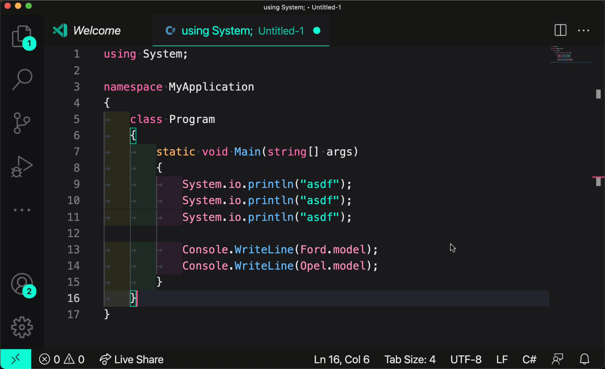

# July 2021 (version 1.59)

**Update 1.59.1**: The update addresses these [issues](https://github.com/microsoft/vscode/issues?q=is%3Aissue+milestone%3A%22July+2021+Recovery%22+is%3Aclosed).

This release also addresses [CVE-2021-26437](https://msrc.microsoft.com/update-guide/vulnerability/CVE-2021-26437).

<!-- DOWNLOAD_LINKS_PLACEHOLDER -->

---

Welcome to the July 2021 release of Visual Studio Code. There are many updates in this version that we hope you will like, some of the key highlights include:

* **[Extensions view improvements](#extensions)** - Rich extension detail hovers, new runtime status tab.
* **[Settings editor validation](#settings-editor)** - Quickly find editing errors for object-based settings.
* **[Drag and drop terminals](#drag-and-drop-terminals-across-windows)** - Move terminals across windows to both editor and panel areas.
* **[Extended theme customization](#extended-theme-customization-syntax)** - Customize multiple color themes at once.
* **[Built-in support for Jupyter notebooks](#support-for-jupyter-notebooks)** - Open `.ipynb` files directly in VS Code.
* **[Notebook UI improvements](#notebook-layout-improvements)** - Display first line of collapsed cells, Undo/Redo per cell.
* **[Testing API finalized](#testing-apis)** - Native support for running tests in VS Code with built-in Test Explorer.
* **[Debug Disassembly view preview](#disassembly-view)** - Display disassembled C++ code in VS Code.
* **[Live Preview extension](#live-preview)** - Live HTML preview within VS Code with JavaScript debugging support.
* **[Dev Containers devcontainer CLI](#dev-containers-devcontainer-cli)** - Command line interface for working with development containers.

>If you'd like to read these release notes online, go to [Updates](https://code.visualstudio.com/updates) on [code.visualstudio.com](https://code.visualstudio.com).

**Join us live** at the [VS Code team's livestream](https://code.visualstudio.com/livestream) on Tuesday, August 10 at 8am Pacific (4pm London) to see a demo of what's new in this release, and ask us questions live.

**Insiders:** Want to try new features as soon as possible? You can download the nightly [Insiders](https://code.visualstudio.com/insiders) build and try the latest updates as soon as they are available.

## Workbench

### Extensions

Improved Extensions view on resize. In the following short video, the Extensions view with default width shows all details (previously the icon, ratings, and install count were not shown). As the view shrinks, a smaller extension icon is shown, and when its width reduces further, the icon and ratings are hidden.


*Theme: [GitHub Light Theme](https://marketplace.visualstudio.com/items?itemName=GitHub.github-vscode-theme)*

The Extensions view now shows a custom hover on an extension. This rich hover includes the complete description of the extension and other useful information such as why an extension is disabled or recommended.


*Theme: [GitHub Light Theme](https://marketplace.visualstudio.com/items?itemName=GitHub.github-vscode-theme)*

You can now check the runtime status of an extension in the new **Runtime Status** tab in the extension pane. Status information includes its activation time, whether it is activated on startup, and if it has any warnings or errors.  Some of this information is displayed in the Extensions view and its hover (shown in the image above).


*Theme: [GitHub Light Theme](https://marketplace.visualstudio.com/items?itemName=GitHub.github-vscode-theme)*

The Extension pane Details tab now shows categories, resources links, and other information such as the extension release and update dates. Selecting a category will display other extensions in that category in the Extensions view.


*Theme: [GitHub Light Theme](https://marketplace.visualstudio.com/items?itemName=GitHub.github-vscode-theme)*

### Settings editor

The Settings editor now supports validation on objects. The validation checks for type errors that can be introduced when editing the JSON file directly.


Array settings now have drag and drop support in non-editing mode. Moreover, enum array settings with the property `uniqueItems` set to `true` now only show remaining options rather than all options in the dropdowns:


The Settings editor also now supports multiline string settings, where the value is rendered in a multiline text area instead of a single-line input box:


### Extended theme customization syntax

The color customization settings listed below allow users to customize colors of the current theme:

* `workbench.colorCustomizations`
* `editor.tokenColorCustomizations`
* `editor.semanticTokenColorCustomizations`

There is new syntax to customize multiple themes at once:

```json
    "workbench.colorCustomizations": {
        "[Abyss][Red]": {
            "activityBar.background": "#ff0000"
        },
        "[Monokai*]": {
            "activityBar.background": "#ff0000"
        }
    },
```

Multiple themes can be listed as well as the `*` wildcard character can be used at the beginning and the end of the name.

### Support for Jupyter Notebooks

This month, we moved the code that handles reading `*.ipynb` files from the [Jupyter Notebook](https://marketplace.visualstudio.com/items?itemName=ms-toolsai.jupyter) extension into a new built-in extension. This means that you can now open Jupyter notebooks in a clean install of VS Code, without having to install the full Jupyter extension. However, if you want to execute cells or view outputs that use ipywidgets or other complex renderer types, you will have to install the Jupyter extension.

### Notebook layout improvements

We have made a few improvements to the notebook layout this iteration:

* The first line of the cell input is now rendered when the cell is collapsed.
* Actions on the notebook editor toolbar will be moved into the overflow menu (**...**) when the window is not wide enough to render all primary actions.
* The default value of `notebook.undoRedoPerCell` is now changed to `true`.


We also updated the default styles for code cells and now show a background color to help distinguish cells apart. Themes can use `notebook.cellEditorBackground` to customize this color.


Lastly, you can now toggle the text labels on the notebook toolbar using the setting `notebook.globalToolbarShowLabel`:


### Configure the path separator for Copy Relative Path

A new setting `explorer.copyRelativePathSeparator` allows you to explicitly set the path separator when invoking the **Copy Relate Path** action.

The available separator options are:

* `auto` (default) - Uses operating system specific path separation character.
* `/` - Use slash as the path separation character.
* `\\` - Use backslash as the path separation character.

### Share view state across editor groups

A new setting `workbench.editor.sharedViewState` was added to configure how editor view state (for example, the scroll position in the editor) is shared across editor groups.

By default, this setting is disabled to preserve the current behavior. If you open an editor to the side and close that editor group later, only to open the editor again to the side, no view state is restored because you are opening a new editor group. However, when you enable this setting, the most recent editor view state is preserved across all editor groups and will be used, unless more specific view state is found for the editor group.

Below the selection state is preserved when reopening the `package.json` file to the side.


## Editor

### Navigate between folding regions

There are new commands to set the cursor location to a corresponding fold:

* **Go to Next Fold** (`editor.gotoNextFold`)
* **Go to Previous Fold** (`editor.gotoPreviousFold`)
* **Go to Parent Fold** (`editor.gotoParentFold`)

The commands currently have no default keybindings but you can add you own keyboard shortcuts via **Preferences: Open Keyboard Shortcuts** (`kb(workbench.action.openGlobalKeybindings)`).

### Automatically fold imports

Use the setting `editor.foldingImportsByDefault` to have import statements automatically folded. The fold state is stored once a file has been opened once. The feature works with TypeScript, JavaScript, Java, C#, C++, and with all languages that have a folding range provider that annotates import statements with `FoldingRangeKind.Imports`.

### Seed search string from selection

The Find control setting `editor.find.seedSearchStringFromSelection` has been extended to support seeding the search string only from non-empty selection. By default, the editor will use the selection or the word around the empty selection as the search keyboard when the Find control is revealed.

### Inline suggestions improvements

We have changed the way inline suggestions are rendered. This not only fixes a lot of bugs, but also makes word wrapping aware of inline suggestions.

In addition, multi-line inline suggestions at non-trailing positions are now supported.

### Inlay hints improvements

We have also changed the way inlay hints are rendered. By using the same mechanism as for inline suggestions, inlay hints are now also taken into account for word wrapping. This mechanism also enables separate cursor stops around inlay hints.

## Terminal

### Drag and drop terminals across windows

Drag and drop terminals from the tabs list or editor area of one window into the tabs list, editor area, or panel of another window.


### Child process tracking and close warnings

The existing `terminal.integrated.confirmOnExit` and new `terminal.integrated.confirmOnKill` settings use child process tracking to display a warning when trying to close a terminal that has child processes under the shell process. By default, this tracking only affects terminals in the editor area but can now be configured to show warnings for all terminals or those in the panel area.

### Set contributed terminal profile as default

Terminal profiles contributed by extensions can now be set as the default profile. The default terminal profile is indicated by the **Default** suffix in the terminal dropdown.


### Underline and strikethrough support

The integrated terminal now supports underline and strikethrough attributes. For example, [Git can be configured](https://git-scm.com/docs/git-config#Documentation/git-config.txt-color) to use these new attributes:


*Theme: [Sapphire Theme](https://marketplace.visualstudio.com/items?itemName=Tyriar.theme-sapphire)*

The above example uses the following settings in `.gitconfig`:

```ini
[color "status"]
  added = green bold
  changed = red bold strike
  untracked = cyan
  branch = yellow black bold ul
```

### Create terminal in editor area to the side

There is a new command `workbench.action.createTerminalEditorSide` to create a terminal in the editor area to the side of the active editor.

### Active terminal tab indicator

Themes can now set the color for a vertical line to indicate the active terminal tab using theme key `terminal.tab.activeBorder`.


The color will fall back to `tab.activeBorder` if `terminal.tab.activeBorder` is not set.

### Disable animation in terminal tab icon

The new setting `terminal.integrated.tabs.enableAnimation` will disable animation in the terminal tab icon. For tasks, the play button is used, instead of a spinner animation:


## Debugging

### Improved Run/Debug button in editor title

In the February release, we introduced a dropdown button to group the Run and Debug commands in a central (and compact) location in the editor's title area (refer to the [1.54 release notes](https://code.visualstudio.com/updates/v1_54#_limits-for-editor-title-menu-and-run-submenu)). Based on user feedback, we've tried to improve the dropdown button by remembering the last executed action. The dropdown button now has two click zones, one for the default action (left) and another for the dropdown (right) which, when selected, runs the action and remembers it as the new default.


The dropdown behavior:

* If there is only a single Run or Debug action, the dropdown menu is omitted.
* If there is more than one Run or Debug action, all actions appear in the dropdown menu and the default action is set to the first action from the dropdown menu (as long as there is no remembered action).
* The default action is preserved for a specific workspace across VS Code restarts; it is **not** preserved per editor.

## Contributions to extensions

### Live Preview

The [Live Preview](http://aka.ms/live-preview) extension, [released last month](https://code.visualstudio.com/updates/v1_58#_live-preview), has some exciting new features. These include:

* Compatibility with the built-in JavaScript debugger for external previews.
  * Run **Live Preview: Show Debug Preview** to try it out!
* Improvements to the embedded browser such as "Find in Page" support and quick access to the `webvivew` DevTools.
* Filesystem watching for auto-generated files.
* And more! 🎉

To see more details on this month's progress, see [the extension's release notes](https://github.com/microsoft/vscode-livepreview/blob/main/release_notes/july-2021.md).


*Theme: [GitHub Dark Theme](https://marketplace.visualstudio.com/items?itemName=GitHub.github-vscode-theme)*

### GitHub Pull Requests and Issues

Work continues on the [GitHub Pull Requests and Issues](https://marketplace.visualstudio.com/items?itemName=GitHub.vscode-pull-request-github) extension, which allows you to work on, create, and manage pull requests and issues. One of this month's highlights is that **Start working** on an issue has been expanded to let you work on issues outside of your current repository.

To learn about all the new features and updates, you can see the full [changelog for the 0.29.0](https://github.com/microsoft/vscode-pull-request-github/blob/main/CHANGELOG.md#0290) release of the extension.

### Jupyter

Work continues on the [Jupyter](https://marketplace.visualstudio.com/items?itemName=ms-toolsai.jupyter) extension. To learn about all the new features and updates, you can read the full [changelog for the July](https://github.com/microsoft/vscode-jupyter/blob/main/CHANGELOG.md#202189-3-august-2021) release of the extension.

If you'd like to know more about VS Code's path to enabling native support for notebooks, you can read the recent [Coming of Age of Notebooks](https://code.visualstudio.com/blogs/2021/08/05/notebooks) blog post.

**Interactive window**

The Jupyter Interactive window provides an alternative way to build and work with Jupyter notebooks, using a text file instead of a notebook interface. Last month, we previewed an upgraded version of the Jupyter Interactive window, featuring deeper workbench integration including support for themes, custom keybindings, snippets, compatibility with extensions, and more. Many thanks to our users for providing feedback via GitHub issues on the preview experience. The built-in Interactive window is now the default interface in 1.59. The previous interface will remain available behind the setting `"jupyter.enableNativeInteractiveWindow": false` and will be removed in an upcoming release. We look forward to [your feedback](https://github.com/microsoft/vscode-jupyter/issues).


**Run By Line**

We've been working on supporting the "Run By Line" feature in Jupyter notebooks. This feature is essentially a simplified debug mode that lets you step through your cell's code line by line without any complex debug UI. This is still experimental, but you can try it out by setting `"jupyter.experimental.debugging": true`, installing version 6 of ipykernel in your selected kernel, then selecting the **Run By Line** button in the cell toolbar.


### Python

In the [Python](https://marketplace.visualstudio.com/items?itemName=ms-python.python) extension, we've improved the sorting of the list of Python interpreters. In the past, virtual environments would be displayed at the bottom of the list, resulting in a lot of scrolling and/or searching. Virtual environments located on the project root are now displayed first, followed by globally installed environments.


### Dev Containers devcontainer CLI

The [Dev Containers](https://marketplace.visualstudio.com/items?itemName=ms-vscode-remote.remote-containers) extension, for working with Docker containers from within VS Code, now includes a `devcontainer` command line interface to let you open a folder within a dev container (`devcontainer open`) or build a dev container image (`devcontainer build`).

You can learn about new Remote Development extension features and bug fixes in the [Remote Development release notes](https://github.com/microsoft/vscode-docs/blob/main/remote-release-notes/v1_59.md).

## Preview Features

### Automatic language detection of untitled files

We're excited to announce the initial preview of automatic language detection of untitled files that uses machine learning to detect which language you are coding in and automatically sets the language mode of the untitled file. This feature uses the open-source ML library, [Tensorflow.js](https://www.tensorflow.org/js/), and the ML model from [Guesslang](https://github.com/yoeo/guesslang) by GitHub user [@yoeo](https://github.com/yoeo).

In this release, this feature will be off by default but we plan on making it the default next iteration. To enable it, apply the following setting:

```json
"workbench.editor.untitled.experimentalLanguageDetection": true
```

To see the feature in action, open an untitled file (**File** > **New File**) and paste source code into your editor.

Here's an example of autodetection of Python code:


*Theme: [Panda Theme](https://marketplace.visualstudio.com/items?itemName=tinkertrain.theme-panda)*

Additionally, you can see what language(s) are being detected by opening the language picker.



*Theme: [Panda Theme](https://marketplace.visualstudio.com/items?itemName=tinkertrain.theme-panda)*

> **Note**: If language detection isn't confident enough, then you will stay in your current language mode and no results will show in the language picker until language detection has more confidence.

The setting also allows you to provide language overrides to specify language modes you don't want to be automatically switched away from.

Here's an example to not autodetect Markdown files:

```json
"workbench.editor.untitled.experimentalLanguageDetection": true
"[markdown]": { "workbench.editor.untitled.experimentalLanguageDetection": false }
```

With the settings above, automatic language detection **will not** run while you are editing an untitled Markdown file. However, if you modify an untitled file of any other kind, automatic language detection **will** run with the contents of those files.

We've separated the code that interacts with the ML model into its own library, released as an npm package, in the [vscode-languagedetection repo](https://github.com/Microsoft/vscode-languagedetection).

Let us know how automatic language detection for untitled files works for you!

### TypeScript 4.4

This release includes support for the upcoming TypeScript 4.4 release. You can read more about the new language features and improvements in TypeScript 4.4 [on the TypeScript blog](https://devblogs.microsoft.com/typescript/announcing-typescript-4-4-beta/). Some tooling highlights:

* Inlay hints for parameter names and types in both JavaScript and TypeScript files.
* Basic spelling suggestions in plain JavaScript files. These are only shown if the TypeScript language service is confident in the error and in the fix.

To start using the TypeScript 4.4 nightly builds, install the [TypeScript Nightly](https://marketplace.visualstudio.com/items?itemName=ms-vscode.vscode-typescript-next) extension.

Please share your feedback and let us know if you run into any bugs with TypeScript 4.4.

### Disassembly view

Thanks to a large [contribution](https://github.com/microsoft/vscode/pull/125737) by the Microsoft C++ team, we are happy to include a preview of a debug **Disassembly** view in this milestone.

The Disassembly view can be opened from an editor's context menu to show the disassembled source of the active stack frame, and it supports stepping through assembly instructions and setting breakpoints on individual instructions.

The Disassembly view is only available in an active debug session and when the underlying debug extension supports it. As of today only the Microsoft [C++](https://marketplace.visualstudio.com/items?itemName=ms-vscode.cpptools) and [Mock Debug](https://marketplace.visualstudio.com/items?itemName=andreweinand.mock-debug) extensions can feed the Disassembly view.


From a technical perspective, VS Code's implementation of the Disassembly view now supports four more features of the Debug Adapter Protocol:

* The `disassembly` request for providing the disassembled source for a memory location.
* The `instructionPointerReference` property on stack frames.
* The `granularity` property on the stepping requests.
* Instruction breakpoints and the `setInstructionBreakpoints` request.

## Extension authoring

### Testing APIs

Last fall we began work on adding native support for running tests in VS Code, and this month the first set of testing-related APIs has been finalized. These APIs provide greater flexibility, better performance, and richer UX over what has been found previously in extensions. Check out the [guide on writing testing extensions](https://code.visualstudio.com/api/extension-guides/testing) to dive in.


*Theme: [codesong](https://marketplace.visualstudio.com/items?itemName=connor4312.codesong)*

Existing users of the [Test Explorer UI](https://marketplace.visualstudio.com/items?itemName=hbenl.vscode-test-explorer) extension can get the native experience by setting `testExplorer.useNativeTesting` to `true`. However, the conversion is a reflection of the Test Explorer UI extension's existing API, so some features like rich diff support are not included.

One of the first extensions to adopt the testing API was the Microsoft [Test Runner for Java](https://marketplace.visualstudio.com/items?itemName=vscjava.vscode-java-test) included in the [Extension Pack for Java](https://marketplace.visualstudio.com/items?itemName=vscjava.vscode-java-pack).


### Contribution point for New File menu

Extensions that provide a way to create a new file editor, for instance notebooks or custom editors, can now contribute commands to the new `file/newFile` menu contribution point. This menu can be accessed from the **New File...** item on the Welcome page or in the File menu.


### Rich Status bar hover

Rich hovers including links and icons are now supported on Status bar items `StatusBarItem.tooltip: string | IMarkdownString`.


* If `MarkdownString.supportThemeIcons` is true, you can use icons with the `$(iconName)` syntax.
* If the `MarkdownString` is trusted, you can also add command links. Syntax: `([test](command:vscode.newWindow))`.

### Status bar warning colors

Status bar items that represent warnings can use the newly added colors `statusBarItem.warningBackground` and `statusBarItem.warningForeground`.

### Object settings without additionalProperties

Object settings must have `additionalProperties` set to `false` for an object to be supported in the Settings editor. Otherwise, the Settings editor will interpret the setting as a complex setting that can take on any shape, and direct the user to the settings JSON file.

### Multiline string settings

To add support for a multiline string setting in the Settings editor, add `"editPresentation": "multilineText"` as a key-value pair to the string setting. Changing a string setting to be multiline will cause the Settings editor to render the setting value in a multiline text area instead of a single-line input box.

### Updated codicons

We've added the following new icons to our [codicon library](https://code.visualstudio.com/api/references/icons-in-labels):


* `azure`
* `compass-active`
* `compass-active`
* `compass-dot`
* `compass`
* `debug-all`
* `debug-coverage`
* `git-pull-request-closed`
* `git-pull-request-draft`
* `issue-draft`
* `layers-active`
* `layers-dot`
* `layers`

### Text Document change reason

When the event `workspace.onDidChangeTextDocument` is fired, a new property `reason` on the event object indicates whether the text change was caused by an Undo or Redo operation.

## Language Server Protocol

A new next version of the [Language Server Protocol](https://microsoft.github.io/language-server-protocol), together with the corresponding npm modules, has been published. The [3.17 version](https://microsoft.github.io/language-server-protocol/specifications/specification-3-17) contains a proposal for the completion item label details that is in line with the latest changes in VS Code itself.

## Debug Adapter Protocol

### Finalized "writeMemory" request and "memory" event proposal

The `writeMemory` request has been finalized and is now available in version 1.48 of the [Debug Adapter Protocol](https://microsoft.github.io/debug-adapter-protocol/) and the corresponding npm modules. If a debug adapter has a `supportsWriteMemoryRequest` capability, clients can use the `writeMemory` request to write bytes to memory at a given location.

The `memory` event has a [proposal](https://github.com/microsoft/debug-adapter-protocol/issues/194#issuecomment-886687894) that will be added to DAP in the next milestone.

## Proposed extension APIs

Every milestone comes with new proposed APIs and extension authors can try them out. As always, we want your feedback. This is what you have to do to try out a proposed API:

* You must use Insiders because proposed APIs change frequently.
* You must have this line in the `package.json` file of your extension: `"enableProposedApi": true`.
* Copy the latest version of the [vscode.proposed.d.ts](https://github.com/microsoft/vscode/blob/main/src/vs/vscode.proposed.d.ts) file into your project's source location.

You cannot publish an extension that uses a proposed API. There may be breaking changes in the next release and we never want to break existing extensions.

### isDefault for TaskGroup

The `group` property exists on tasks defined in a `tasks.json` file and is also exposed through the tasks API. The `group` property has an `isDefault` property, which until now has not been available in the API. This proposal exposes the `isDefault` property as readonly on the `TaskGroup`, so that extensions can read which task is the default for a group, but cannot override a user's configuration by setting the default for a group.

### forceRecreate for AuthenticationGetSessionOptions

Until now, the `getSession` API, which is used to get an authentication session object, never had the ability to ask the user to log in. Prompting a login is needed for authentication services like GitHub, that use SAML/Single Sign On (SSO) with an access token that eventually looses access to resources when an SSO session expires. This proposal adds another property to `AuthenticationGetSessionOptions` called `forceRecreate` that allows you to ask the user to sign in again. A modal experience similar to when you specify `createIfNone` is shown to the user.

## Engineering

### iframe based webviews now used everywhere on desktop

This month we finished our transition from [Electron's webview tag](https://www.electronjs.org/docs/api/webview-tag) element to normal `<iframe>` element based webviews. This better aligns the implementation of VS Code's webviews across desktop and web, and also lets us delete a lot of now-redundant code.

### Electron 13 update

In this milestone, we finished the exploration to bundle Electron 13 into VS Code and we want to thank everyone involved with testing and self-hosting on Insiders. This is a major Electron release and comes with Chromium 91.0.4472.124. There is no change to the Node.js version with this release and it will remain v14.16.0.

### Progress for Electron sandbox support

As we continue to make the VS Code workbench ready for enabling Electron's [sandbox](https://www.electronjs.org/docs/tutorial/sandbox), we wanted to enable mixed sandbox mode on Linux and no longer bundle with the CLI argument `--no-sandbox` in our distributed packages deb, rpm, snap and tar archive. Chromium has a [multi-layer sandboxing model on Linux](https://chromium.googlesource.com/chromium/src/+/HEAD/docs/linux/sandboxing.md). If Chromium cannot use the namespace sandbox for layer-1, it will try to use the [setuid sandbox](https://chromium.googlesource.com/chromium/src/+/HEAD/docs/linux/suid_sandbox.md) via the helper binary `chrome-sandbox` shipped alongside the application binary. For the setuid binary to work, it needs to meet the following conditions:

* The sandbox binary must be executable by the Chromium process.
* It must be SUID and executable by others.

We were able to preserve these conditions for deb and rpm packages. It is currently not possible to achieve these permissions for snap, and we have tracking [issue #127140](https://github.com/microsoft/vscode/issues/127140) to address snap packages moving forward.

As for using the tar archive, if the application cannot use the namespace sandbox, which might the case when running inside containers, it will fail with the following error:

```
FATAL:setuid_sandbox_host.cc(158)] The SUID sandbox helper binary was found, but is not configured correctly. Rather than run without sandboxing I'm aborting now. You need to make sure that chrome-sandbox is owned by root and has mode 4755.
```

If that happens, you can use either of the following two options to get it working:

* Fix the permissions of setuid helper

  ```bash
  sudo chown root <path-to-vscode>/chrome-sandbox
  sudo chmod 4755 <path-to-vscode>/chrome-sandbox
  ```

* Run with the `--no-sandbox` flag

### Smoke test improvements

We run a suite of smoke tests, triggered on each build, that launch VS Code (both desktop and web) and exercise various UI elements to ensure proper functionality. This milestone we invested in this infrastructure to allow us to remove manual smoke testing from our release checklist.

The smoke tests now run on all platforms (macOS, Linux, and Windows). On top of that, one of our more involved smoke test suites that specifically checks for regressions between the last Stable version of VS Code and the new release, has been automated to run on each commit.

Finally, thanks to the awesome [Playwright](https://github.com/microsoft/playwright) library, which we use for automated web smoke testing, we enabled their tracing capabilities to allow us to replay failing smoke tests using their [trace viewer](https://playwright.dev/docs/next/trace-viewer/) tool.

## Notable fixes

* [26425](https://github.com/microsoft/vscode/issues/26425): Open changes button should not show when no changes exist
* [100815](https://github.com/microsoft/vscode/issues/100815): External Terminal broken when connected to remote WSL
* [106981](https://github.com/microsoft/vscode/issues/106981): Terminal Cursor Ghosting When Window Zoom Set To -1
* [127959](https://github.com/microsoft/vscode/issues/127959): Debug Pane Opens When Debugger Pauses
* [129059](https://github.com/microsoft/vscode/issues/129059): Object widget in settings editor doesn't render description
* [129070](https://github.com/microsoft/vscode/issues/129070): Unable to correct dropdown setting value by only pressing OK button
* [129415](https://github.com/microsoft/vscode/issues/129415): User tasks can't be run in single file mode

## Thank you

Last but certainly not least, a big _**Thank You**_ to the following people who contributed this month to VS Code:

Contributions to our issue tracking:

* [John Murray (@gjsjohnmurray)](https://github.com/gjsjohnmurray)
* [Andrii Dieiev (@IllusionMH)](https://github.com/IllusionMH)
* [@CodeCrazy-ywt](https://github.com/CodeCrazy-ywt)
* [ArturoDent (@ArturoDent)](https://github.com/ArturoDent)
* [Alexander (@usernamehw)](https://github.com/usernamehw)

Contributions to `vscode`:

* [@71 (Grégoire Geis)](https://github.com/71): platform/configuration: fix empty keys being ignored by configuration parser [PR #128909](https://github.com/microsoft/vscode/pull/128909)
* [@adaex (Aex)](https://github.com/adaex): Add support for eslintrc.json seti-ui icon [PR #123404](https://github.com/microsoft/vscode/pull/123404)
* [@alanrenmsft (Alan Ren)](https://github.com/alanrenmsft)
  * fix maximum call stack size reached issue [PR #119929](https://github.com/microsoft/vscode/pull/119929)
  * make dropdown arrow larger to meet accessibility requirement [PR #127839](https://github.com/microsoft/vscode/pull/127839)
* [@alielbashir (Ali Elbashir)](https://github.com/alielbashir): Fix typo in github spaces link [PR #128120](https://github.com/microsoft/vscode/pull/128120)
* [@andrewbranch (Andrew Branch)](https://github.com/andrewbranch): [typescript-language-features] Add suggest.allowIncompleteCompletions and pass trigger kind to TS Server [PR #127673](https://github.com/microsoft/vscode/pull/127673)
* [@door-bell (Tim)](https://github.com/door-bell): Add settings for list scroll sensitivity outside of the editor and terminal [PR #110059](https://github.com/microsoft/vscode/pull/110059)
* [@galexite (George White)](https://github.com/galexite): Add `.ixx` as a possible C++ extension [PR #127962](https://github.com/microsoft/vscode/pull/127962)
* [@headerjson](https://github.com/headerjson): Add isDefault to TaskGroup API [PR #128596](https://github.com/microsoft/vscode/pull/128596)
* [@jeanp413 (Jean Pierre)](https://github.com/jeanp413)
  * Fixes keyboard multi-select not working in 'Open Editors' and 'Source Control' views [PR #128284](https://github.com/microsoft/vscode/pull/128284)
  * Fix dragging a folder from the explorer tree to terminal no longer copies folder path [PR #128419](https://github.com/microsoft/vscode/pull/128419)
  * Fixes "Run python file in terminal" opens panel although a terminal editor is used [PR #128866](https://github.com/microsoft/vscode/pull/128866)
* [@joshspicer (Josh Spicer)](https://github.com/joshspicer): typo in welcomePage.contribution.ts [PR #127893](https://github.com/microsoft/vscode/pull/127893)
* [@karolz-ms (Karol Zadora-Przylecki)](https://github.com/karolz-ms): Improve defaults for dockercompose language [PR #128550](https://github.com/microsoft/vscode/pull/128550)
* [@kieranlblack (Kieran Black)](https://github.com/kieranlblack): Add setting to modify copy separator [PR #101197](https://github.com/microsoft/vscode/pull/101197)
* [@kilbouri (Isaac Kilbourne)](https://github.com/kilbouri): Commit message [PR #127849](https://github.com/microsoft/vscode/pull/127849)
* [@Kingwl (Wenlu Wang)](https://github.com/Kingwl)
  * Add ts inline hints [PR #113412](https://github.com/microsoft/vscode/pull/113412)
  * Expose inlay hints api for monaco [PR #127391](https://github.com/microsoft/vscode/pull/127391)
  * Inlay hints uses editor.fontFamily by defaults [PR #128181](https://github.com/microsoft/vscode/pull/128181)
  * Add auto folding for imports spans [PR #128978](https://github.com/microsoft/vscode/pull/128978)
* [@movermeyer (Michael Overmeyer)](https://github.com/movermeyer)
  * Resolve all time-based snippet variables using the same time [PR #128571](https://github.com/microsoft/vscode/pull/128571)
  * Remove private field from constructor [PR #128857](https://github.com/microsoft/vscode/pull/128857)
* [@nickdelja (Nick Delja)](https://github.com/nickdelja): Fixed minor typos [PR #129439](https://github.com/microsoft/vscode/pull/129439)
* [@NSExceptional (Tanner Bennett)](https://github.com/NSExceptional): Provide more specific file type descriptions on macOS [PR #117713](https://github.com/microsoft/vscode/pull/117713)
* [@shantaram3013 (Siddharth Singh)](https://github.com/shantaram3013): walkthrough: Update deprecated property name [PR #129041](https://github.com/microsoft/vscode/pull/129041)
* [@SNDST00M (SNDST00M: M.U.N.I.N)](https://github.com/SNDST00M): Extended theme customisation syntax [PR #122969](https://github.com/microsoft/vscode/pull/122969)
* [@ssigwart (Stephen Sigwart)](https://github.com/ssigwart): Add Fold Jumping (Parent and Next/Previous at Same Level) [PR #128450](https://github.com/microsoft/vscode/pull/128450)
* [@suema0331](https://github.com/suema0331): Fix#122454: Truncate the long terminal title [PR #122620](https://github.com/microsoft/vscode/pull/122620)
* [@timfenney (Tim Fenney)](https://github.com/timfenney): Add Copy Command Label to Keyboard Shortcuts. [PR #125563](https://github.com/microsoft/vscode/pull/125563)
* [@usjpin (Utkarsh Singh)](https://github.com/usjpin): Hide activity bar hover while typing [PR #128362](https://github.com/microsoft/vscode/pull/128362)
* [@xisui-MSFT](https://github.com/xisui-MSFT)
  * Disassembly view [PR #125737](https://github.com/microsoft/vscode/pull/125737)
  * Fix focus issues in disassembly view [PR #129616](https://github.com/microsoft/vscode/pull/129616)
  * Larger initial view size in disassembly view [PR #129651](https://github.com/microsoft/vscode/pull/129651)
  * Open Disassembly View should be present but disabled [PR #129726](https://github.com/microsoft/vscode/pull/129726)

Contributions to `vscode-extension-samples`:

* [@gjsjohnmurray (John Murray)](https://github.com/gjsjohnmurray): fix \#400 tree-view-sample: update package.json, package-lock.json [PR #401](https://github.com/microsoft/vscode-extension-samples/pull/401)
* [@jabbera (Mike)](https://github.com/jabbera): Add --enable-proposed-api to launch.json [PR #346](https://github.com/microsoft/vscode-extension-samples/pull/346)
* [@james1293](https://github.com/james1293): Remove extra parseTree [PR #406](https://github.com/microsoft/vscode-extension-samples/pull/406)

Contributions to `vscode-languageserver-node`:

* [@perrinjerome (Jérome Perrin)](https://github.com/perrinjerome): Fix "A request has failed" dialog that can not be dismissed [PR #787](https://github.com/microsoft/vscode-languageserver-node/pull/787)

Contributions to `vscode-pull-request-github`:

* [@binsee](https://github.com/binsee): Fix check fork details [PR #2806](https://github.com/microsoft/vscode-pull-request-github/pull/2806)
* [@iChenLei (ChenLei)](https://github.com/iChenLei): chore: replace deprecated vscode-test with @vscode/test-electron [PR #2842](https://github.com/microsoft/vscode-pull-request-github/pull/2842)

Contributions to `vscode-vsce`:

* [@legomushroom (Oleg Solomka)](https://github.com/legomushroom): Update `azure-devops-node-api` version [PR #589](https://github.com/microsoft/vscode-vsce/pull/589)

Contributions to `debug-adapter-protocol`:

* [@NipunaRanasinghe (Nipuna Ransinghe )](https://github.com/NipunaRanasinghe): Update Ballerina debug adapter information [PR #201](https://github.com/microsoft/debug-adapter-protocol/pull/201)

Contributions to `language-server-protocol`:

* [@leegbestand](https://github.com/leegbestand): Update comment for jsonrpcReservedErrorRangeEnd [PR #1315](https://github.com/microsoft/language-server-protocol/pull/1315)

Contributions to `monaco-editor`:

* [@Surm4 (Marcin)](https://github.com/Surm4): Exposed colors sample update in the playground. [PR #2561](https://github.com/microsoft/monaco-editor/pull/2561)

Contributions to `monaco-languages`:

* [@alefragnani (Alessandro Fragnani)](https://github.com/alefragnani): Adds `strict` keyword to Pascal language [PR #153](https://github.com/microsoft/monaco-languages/pull/153)
* [@jonatanklosko (Jonatan Kłosko)](https://github.com/jonatanklosko): Properly tokenize fence closing in GitHub style code blocks [PR #149](https://github.com/microsoft/monaco-languages/pull/149)
* [@lofcz (Matěj Štágl)](https://github.com/lofcz): Fix razor + liquid render of tags with a dash symbol [PR #150](https://github.com/microsoft/monaco-languages/pull/150)

<!-- In-product release notes styles.  Do not modify without also modifying regex in gulpfile.common.js -->
<a id="scroll-to-top" role="button" title="Scroll to top" aria-label="scroll to top" href="#"><span class="icon"></span></a>
<link rel="stylesheet" type="text/css" href="css/inproduct_releasenotes.css"/>
