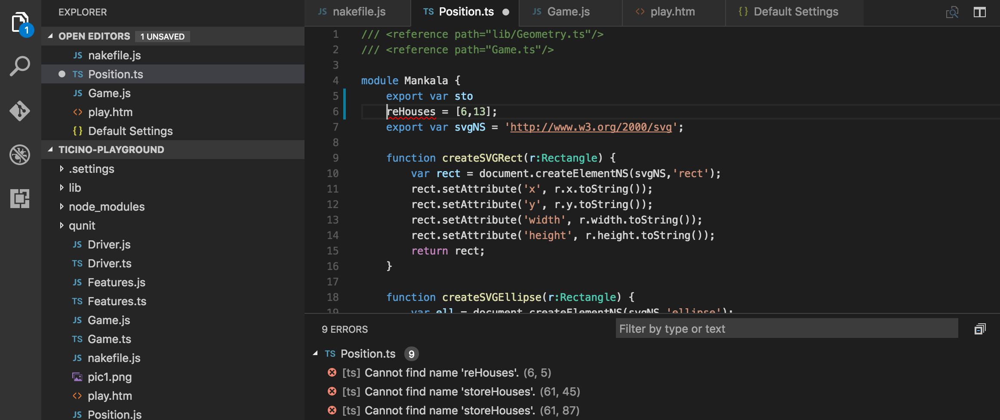
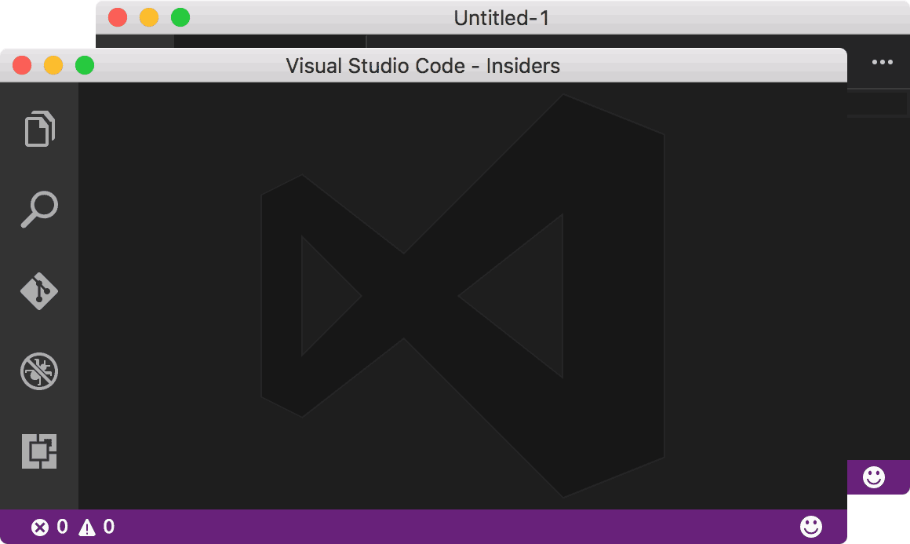
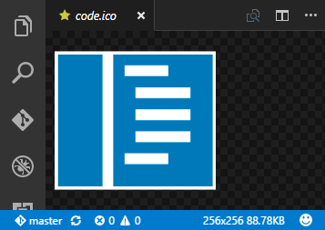
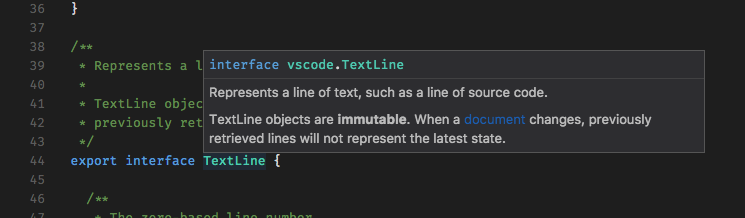
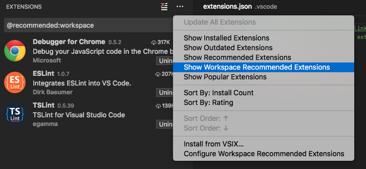
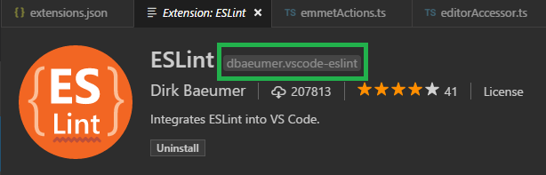
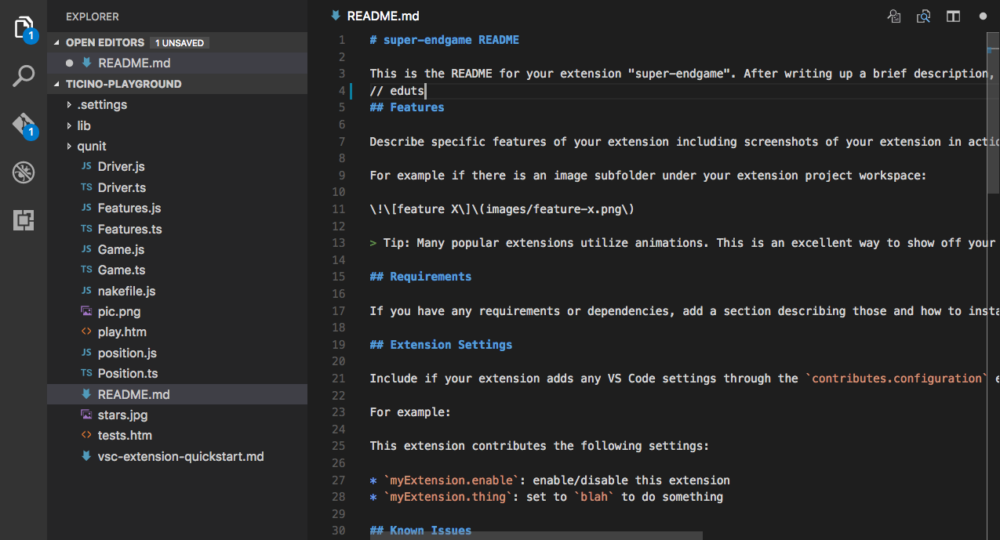
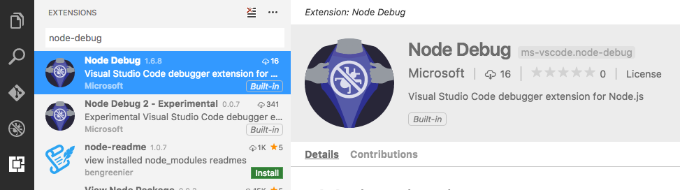

# September 2016 (version 1.6)

## 1.6.1 Recovery Build

We are releasing a 1.6.1 recovery build to add the final 1.6 translations and fix several important [issues](https://github.com/Microsoft/vscode/milestone/31?closed=1).

Downloads: [Windows](https://vscode-update.azurewebsites.net/1.6.1/win32/stable) | [Mac](https://vscode-update.azurewebsites.net/1.6.1/darwin/stable) | Linux 64-bit: [.tar.gz](https://vscode-update.azurewebsites.net/1.6.1/linux-x64/stable) [.deb](https://vscode-update.azurewebsites.net/1.6.1/linux-deb-x64/stable) [.rpm](https://vscode-update.azurewebsites.net/1.6.1/linux-rpm-x64/stable) | Linux 32-bit: [.tar.gz](https://vscode-update.azurewebsites.net/1.6.1/linux-ia32/stable) [.deb](https://vscode-update.azurewebsites.net/1.6.1/linux-deb-ia32/stable) [.rpm](https://vscode-update.azurewebsites.net/1.6.1/linux-rpm-ia32/stable)

## September Release Summary

Welcome to the September release of VS Code. There are a number of significant updates in this version that we hope you will like, some of the key highlights include:

* **[TypeScript 2.0](#typescript-2)** - Language improvements for [JavaScript](#javascript) and [TypeScript](#typescript) as well as [extension authoring](#extension-authoring).
* **[Format on Save](#format-on-save)** - Keep your code looking great by running a formatter when you save.
* **[Switch Windows](#switch-between-running-windows)** - Move quickly between VS Code windows (instances) via the Command Palette.
* **[Search term history](#search-term-history)** - Easily reuse past search terms in the Search box.
* **[Launch script support](#launch-configuration-supports-npm-and-other-tools)** - It's now possible to launch an NPM script before debugging.
* **[Workspace recommendations](#workspace-extension-recommendations)** - Provide extension recommendations for other members of your team to use.
* **[API for Settings](#new-apis)** - It's now possible to programmatically change settings. This allows new options like persistent [Auto Save](#auto-save-menu-item) and [File Associations](#file-associations-configuration).
* **[VIM style relative line numbers](#improvements-to-linenumber-and-whitespace-settings)** - Display line numbers relative to the current cursor position.
* **[Node 6.3+ Debugger](#experimental-node-debugger)** - An experimental extension is available to support the V8 Inspector Protocol.
* **[*PREVIEW*  Extensions Packs](#preview-extension-packs)** - Bundle a set of extensions into a single download from the Marketplace.
* **[*PREVIEW*  TS/JS Grammar](#preview-typescript-javascript-grammar)** - A new colorizer for TS/JS with over 200 fixes. We will include it in the next release.

The release notes are arranged in the following sections related to VS Code focus areas. Here are some further updates:

* **[Workbench](#workbench)** - View image dimensions & file size details.
* **[Editor](#editor)** - Unicode improvements to support UTF-16 surrogate pairs, Improvements to Whitespace settings.
* **[Languages](#languages)** - Updated TML/Razor/Handlebar support.
* **[Extensions](#extensions)** - Extension identifier badge, Extension update version check.
* **[Debugging](#debugging)** - Configurable External Terminal Support, Glob patterns for source maps.
* **[Extension Authoring](#extension-authoring)** - Debug protocol updates including programmatic access to launch.json.

Downloads: [Windows](https://vscode-update.azurewebsites.net/1.6.0/win32/stable) | [Mac](https://vscode-update.azurewebsites.net/1.6.0/darwin/stable) | Linux 64-bit: [.tar.gz](https://vscode-update.azurewebsites.net/1.6.0/linux-x64/stable) [.deb](https://vscode-update.azurewebsites.net/1.6.0/linux-deb-x64/stable) [.rpm](https://vscode-update.azurewebsites.net/1.6.0/linux-rpm-x64/stable) | Linux 32-bit: [.tar.gz](https://vscode-update.azurewebsites.net/1.6.0/linux-ia32/stable) [.deb](https://vscode-update.azurewebsites.net/1.6.0/linux-deb-ia32/stable) [.rpm](https://vscode-update.azurewebsites.net/1.6.0/linux-rpm-ia32/stable)

## Workbench

### Release notes inside VS Code

There is no need to go to our website to review the latest release notes - you can now see these directly within VS Code itself.  Use the global **Show Release Notes** command or the **Help** > **Release Notes** menu to access them. Perhaps this is how you are reading these notes right now. :)

### Icons Everywhere

Continuing on the work we did in the August release to support file icons, we've added file icons to many more places throughout the UI. This includes most trees that show files (for example, Problems panel, Search results, OPEN EDITORS section) as well as in **Quick Open** results and the editor headings.

If you don't want to see icons everywhere, for instance in Tab headings, we added a new setting `workbench.editor.showIcons`.



### Switch between running Windows

We added a new command to let you quickly move between open Windows of VS Code.  Simply open the **Command Palette** (`kb(workbench.action.showCommands)`) and type **Switch Window**. A dropdown will appear showing all the opened VS Code Windows (instances) and you can quickly move from one to the other without leaving the keyboard, right from within VS Code.



### Image dimensions & Binary file size

When you open a binary file in VS Code, extra meta information is now displayed in the Status Bar. For all binary files, we show the size of the file and for images, we also show the image dimensions.



VS Code also now detects image file changes on disk so you no longer see stale old versions of an image.

## Editor

### Format On Save

Would you like your source code formatted each time you save? VS Code now supports "Format On Save" which will automatically pick up relevant installed formatter extensions and format the whole document on each save. Enable "Format On Save" by setting `"editor.formatOnSave": true`

> **Note:** To keep cursors and selections stable, we don't format when saving after delay.

### Search term history

You can now navigate to your previous search terms in the global Search View and in the editor Find widget.

* `kbstyle(Alt+Up)` navigates backward in the history. Corresponding commands are `search.history.showPrevious` and `find.history.showPrevious`.
* `kbstyle(Alt+Down)` navigates forward in the history. Corresponding commands are `search.history.showNext` and `find.history.showNext`.

### Hover & IntelliSense UI consistency

The Hover widget UI was updated aligning it more with VS Code's IntelliSense experience:



### Auto Save Menu Item

Auto Save is a great feature for many scenarios. In order to make this feature more discoverable, VS Code now has an **Auto Save** toggle right in the **File** menu. This will toggle the `files.autoSave` [setting](https://code.visualstudio.com/docs/getstarted/settings) in your global User `settings.json` configuration file.

### File Associations configuration

It is tedious to repeatedly set the Language Mode of a given file type and configuring a file association mapping was a manual process through your user or workspace settings. Now when changing the Language Mode of a file, you can pick **Configure File Association for...** and your choice will be stored to your User settings file and remembered.

### Unicode improvements

VS Code now has better handling of UTF-16 surrogate pairs and validates all edits such that it doesn't break up the surrogate pairs. This is particularly important if you want to add things like Emojis into your source code.

### Improvements to LineNumber and Whitespace settings

Several editor settings have been updated to support new options:

* `editor.renderWhitespace` Possible values are now `"all"`, `"boundary"` and `"none"`. The `"boundary"` option does not render single spaces between words.

* `editor.lineNumbers` Possible values are `"on"`, `"off"` and `"relative"`. `"relative"` shows the line count from the current cursor position.

## Languages

### TypeScript 2

VS Code 1.6 now ships with TypeScript 2.0.3. You can do the following to go back to TypeScript 1.8.10 in your workspace:

- Navigate into your workspace folder.
- Run `npm install typescript@1.8.10` to install TypeScript version 1.8.10.
- Start VS Code. You will get prompted whether you want to use the workspace version (1.8.10) or the bundled version (2.0.3) of TypeScript. Select workspace version and confirm the `typescript.tsdk` Workspace setting change.

### TypeScript

TypeScript 2.0.3 contains lots of new features, like strict null checking or modular library dependencies to name a few. A complete list of the new features can be found [here](https://github.com/Microsoft/TypeScript/wiki/What%27s-new-in-TypeScript#typescript-20).

Besides new features, TypeScript 2.0.3 contains many bug fixes. This might result in additional compile time errors when you first compile your project with TypeScript 2.0.3.

### JavaScript

The JavaScript in VS Code is powered by TypeScript and the TypeScript version bundled with VS Code has been updated to version 2.0.3.

This brings several improvements for JavaScript support:

- The JS Doc support has been improved and many issues have been fixed.
- The parser now allows any syntax that the TypeScript parser is capable of recognizing and is part of a JavaScript standards proposal. For example, static class properties are no longer flagged as invalid.

In addition, there are improvements to TypeScript that are also applicable to JavaScript:

- There is now globbing support in the `jsconfig.json` file.
- Better support for including [built-in types from new ECMAScript versions using -–lib](https://github.com/Microsoft/TypeScript/wiki/What%27s-new-in-TypeScript#including-built-in-type-declarations-with---lib).
- Better handling for [module imports with file extensions](https://github.com/Microsoft/TypeScript/wiki/What%27s-new-in-TypeScript#module-identifiers-allow-for-js-extension).

One very big improvement is that the acquisition of Type Declaration files (typings) has been simplified. You can now use NPM directly to get typings with the `@types` parameter.

For example to get typings for `lodash` you can run:

```bash
npm install --save-dev @types/lodash
```

### PREVIEW TypeScript JavaScript Grammar

The TypeScript/JavaScript TextMate grammar has been reworked for improved syntax highlighting. This work is currently available as an [extension in the marketplace](https://marketplace.visualstudio.com/items?itemName=ms-vscode.typescript-javascript-grammar). The plan is to switch to this version during October. Please install this extension now and provide us with feedback.

### Updated HTML/Razor/Handlebar Support

Since we made VS Code available, we've had the debt item that some languages were implemented inside VS Code directly and they were not implemented as an extension. In the last couple of milestones, we have reduced this debt by extracting the JSON, CSS, LESS, SASS languages into their own extension. In September, we have now done this for HTML and its coupled languages, Razor and Handlebar. These languages are now all implemented using the [language server protocol](https://github.com/Microsoft/language-server-protocol).

This is a major refactoring and as a consequence, some language features have not yet been implemented:

* Commenting actions inside `<script>` section of an HTML - [Issue 12969](https://github.com/Microsoft/vscode/issues/12969)
* Word highlighting - [Issue 12973](https://github.com/Microsoft/vscode/issues/12973)

We will work on bringing these features back during the next iteration.

However, we are not done yet.. Now that we have extracted languages into extensions, the next challenge is to support the nesting of these languages, that is, embed JavaScript or CSS inside HTML. We will be working on this in October.

## Extensions

### Workspace Extension Recommendations

Often you have a set of extensions that makes working with a particular workspace more productive. We now support creating a recommended list of extensions for a workspace. The set of recommendations is defined in a file `extensions.json` which is located in the `.vscode` folder. In this way, the recommendations can easily be shared inside a team.

You can create this file using the **Extensions: Configure Workspace Recommended Extensions** command.

For example, this is the `extensions.json` file that we use for the [vscode workspace](https://github.com/Microsoft/vscode/blob/master/.vscode/extensions.json):

```json
{
	"recommendations": [
		"eg2.tslint",
		"dbaeumer.vscode-eslint",
		"msjsdiag.debugger-for-chrome"
	]
}
```

As you can see from the `recommendations` setting above, we recommend that anybody working on the VS Code codebase use the TSLint and ESLint extensions. In addition, we recommend using the Chrome debugger extension.

VS Code prompts a user to install the recommended extensions when a workspace is opened for the first time. The user can also review the list with the **Extensions: Show Workspace Recommended Extensions** command.



### PREVIEW Extension Packs

We have added support for publishing 'Extension Packs' in the Marketplace. An Extension Pack is a set of extensions that can be installed together. This enables easily sharing your favorite extensions with other users. Another use case is to create a set of extensions for a particular scenario like PHP development to help a PHP developer get started with VS Code quickly. The feature is available as preview with the understanding that more work is still needed.

An Extension Pack is represented as an extension that depends on other extensions. This dependency is expressed using the `extensionDependencies` attribute inside the `package.json` file.

For example, here is an Extension Pack for PHP that includes a debugger, language service, and formatter:

```json
  "extensionDependencies": [
      "felixfbecker.php-debug",
      "felixfbecker.php-intellisense",
      "Kasik96.format-php"
  ]
```

When installing an Extension Pack, VS Code will now also install its extension dependencies.

### Extension identifier badge

To ease in the discoverability of the identifier of an extension required for workspace Recommendations and extension packs, we have added a badge to the Extension details view. An extension is uniquely identified using its `publisher name` and `extension name` separated by a period `.`.

.

### Extension update version check

Now you will only see an extension as outdated if there is a new version that is compatible with your VS Code installation available in the [Marketplace](https://marketplace.visualstudio.com/vscode).

>**Note:** This is applicable only if the extension is published using the latest version of the [vsce](https://github.com/Microsoft/vscode-vsce) publishing tool.

## Debugging

### Configurable External Terminal

Running a debug target in an external terminal is now provided as a VS Code service to debugger extensions and we hope that this will result in widespread adoption. A useful side effect of this is that it is now possible to configure which terminal program to use via the existing `terminal.external.windowsExec`, `terminal.external.osxExec`, and `terminal.external.linuxExec` settings.

>**Note:** In this release, only the built-in debug extensions have adopted this new feature.

### Launch configuration supports 'npm' and other tools

A frequent feature request was to support running 'npm' scripts directly from a launch configuration. This is now possible by the following changes to the existing launch configuration concepts:

- Any program available on the PATH (for example 'npm', 'mocha', 'gulp', etc.) can now be used for the `runtimeExecutable` attribute and arguments can be passed via `runtimeArgs`.
- The `program` attribute is no longer mandatory which helps if the npm script already specifies the program to launch.
- If you specify a debug port via the `port` attribute, the `--debug-brk=nnnn` attribute will no longer be automatically added because the debug port is typically specified by the npm scripts as well.

Let's look at an 'npm' example. If your `package.json` has a 'debug' script, for example:

```json
  "scripts": {
    "debug": "node --nolazy --debug-brk=5858 myProgram.js"
  },
```

the corresponding launch configuration would look like this:

```json
{
	"name": "Launch via NPM",
	"type": "node",
	"request": "launch",
	"cwd": "${workspaceRoot}",
	"runtimeExecutable": "npm",
	"windows": {
		"runtimeExecutable": "npm.cmd"
	},
	"runtimeArgs": [
		"run-script", "debug"
	],
	"port": 5858
}
```

>**Note:** On Windows, make sure to specify the executable with the correct extension, for example use `npm.cmd` instead of just `npm` which exists but is the shell script for Linux and macOS.

### Glob pattern support for Source Map setup

When debugging transpiled code (for example TypeScript) where your build process generates JavaScript code into a specific directory, it is necessary to help the Node.js debugger finding the generated code. In previous version of VS Code, this was done by specifying the root directory of the generated source code via the `outDir` attribute.

In the September release, it is now possible to use multiple glob patterns for including and excluding files from the set of generated JavaScript files. For this, a new array typed attribute `outFiles` has been introduced. The old `outDir` is still supported, but we plan to deprecate this in the future.

The following example shows how to configure source maps if the generated code lives in an "out" and "node_modules" directory and you want to exclude the generated test code:

```json
{
  "sourceMaps": true,
  "outFiles": [
    "${workspaceRoot}/{out,node_modules}/**/*.js",
    "!${workspaceRoot}/out/tests/**/*.js"
  ]
}
```

### Experimental Node Debugger

We now have an experimental debug extension that uses the [V8 Inspector Protocol](https://chromedevtools.github.io/debugger-protocol-viewer/v8/), which Node.js now exposes via the `--inspect` flag, only in Node.js versions 6.3+. This is the same protocol exposed by [Chrome and other targets](https://developer.chrome.com/devtools/docs/debugger-protocol). This extension runs on the [vscode-chrome-debug-core](https://github.com/Microsoft/vscode-chrome-debug-core) library which also powers the [Debugger for Chrome](https://marketplace.visualstudio.com/items?itemName=msjsdiag.debugger-for-chrome) extension, and several others.

>**Note** On Windows, the 6.x versions only support this in 32-bit versions of Node.js. The latest builds of v7 should work in 64 or 32-bit. See [this issue](https://github.com/nodejs/node/issues/8155).

This extension will eventually have feature-parity with vscode-node-debug, but isn't there yet. An overview is recorded [here](https://github.com/Microsoft/vscode-node-cdp-debug/issues/7) and you can see issues in the [vscode-node-debug2](https://github.com/Microsoft/vscode-node-cdp-debug/issues) repo and the [vscode-chrome-debug-core](https://github.com/microsoft/vscode-chrome-debug-core/issues) repo. For the most part, you should be able to set `"type": "node2"` in your existing Node.js launch configuration and have things work the same, as long as it's running in Node.js v6.3+.

>**Note**: See troubleshooting tips in the extension [README](https://marketplace.visualstudio.com/items?itemName=ms-vscode.node-debug2).

## Extension Authoring

### Authoring in TypeScript

The Yeoman generator for VS Code extensions has been updated to use TypeScript version 2.0.x. If you start a new VS Code extension, simply install yeoman and the extension generator using `npm install -g yo generator-code` and run it using `yo code`. If you have an existing extension using TypeScript 1.8.x, you can migrate it to TypeScript 2.0.3 using the following steps.

Open the `package.json` file and do the following changes:

- Change the TypeScript developer dependency from `"typescript": "x.x.x"` to `"typescript": "^2.0.3"`.
- Add a developer dependency for the Node.js typings using `"@types/node": "^6.0.40"`.
- If your extension has Mocha tests, change the developer dependency to at least Mocha version 2.3.3.
- Add a developer dependency for the Mocha typing using `"@types/mocha": "^2.2.32"`.
- In the script section, exchange the `compile` script with `"compile": "tsc -watch -p ./"` and the `vscode:prepublish` with `"vscode:prepublish": "tsc -p ./"`.

The `devDependencies` section should look like this:

```json
"devDependencies": {
    "typescript": "^2.0.3",
    "vscode": "^1.0.0", // Or a higher version if necessary
    "mocha": "^2.3.3",
    "@types/node": "^6.0.40",
    "@types/mocha": "^2.2.32"
}
```

and the `scripts` section something like this:

```json
"scripts": {
    "vscode:prepublish": "tsc -p ./",
    "compile": "tsc -watch -p ./",
    "postinstall": "node ./node_modules/vscode/bin/install"
}
```

- Open the `tsconfig.json` file and exchange the line `"noLib": true` with `"lib": [ "es6" ]` and `"target": "es5"` with `"target": "es6"`.

The file should look something like this:

```json
{
    "compilerOptions": {
        "module": "commonjs",
        "target": "es6",
        "outDir": "out",
        "lib": [
            "es6"
        ],
        "sourceMap": true,
        "rootDir": "."
    },
    "exclude": [
        "node_modules",
        ".vscode-test"
    ]
}
```

Then delete the typings folder in the workspace and run `npm install` from a terminal.

### Authoring in JavaScript

The Yeoman generator has also been updated to make use of the new TypeScript 2.0.x features to help write JavaScript. If you want to migrate an existing extension to use TypeScript 2.0.3 for JavaScript authoring do the following.

Open the `package.json` file and do the following changes:

- Add a TypeScript developer dependency `"typescript": "^2.0.3"`.
- Add a developer dependency for the Node.js typings using `"@types/node": "^6.0.40"`.
- If your extension has Mocha tests, change the developer dependeny to at least Mocha version 2.3.3.
- Add a developer dependency for the Mocha typing using `"@types/mocha": "^2.2.32"`.
- We also recommend using ESLint for linting JavaScript source code. To do so, add the following entry as a developer dependency as well: `"eslint": "^3.6.0"`. In addition we recommend installing the [ESLint extensions](https://marketplace.visualstudio.com/items?itemName=dbaeumer.vscode-eslint).

The `devDependencies` section should now look something like this:

```json
"devDependencies": {
    "typescript": "^2.0.3",
    "vscode": "^1.0.0", // Or a higher version if necessary
    "mocha": "^2.3.3",
    "eslint": "^3.6.0",
    "@types/node": "^6.0.40",
    "@types/mocha": "^2.2.32"
}
```

- Open the `jsconfig.json` file and exchange the line `"noLib": true` with `"lib": [ "es6" ]` and `"target": "es5"` with `"target": "es6"`.

The file should look something like this:

```json
{
    "compilerOptions": {
        "module": "commonjs",
        "target": "es6",
        "lib": [
            "es6"
        ]
    },
    "exclude": [
        "node_modules"
    ]
}
```

Please note that although the target is set to `es6` you still have to import other modules using require statements. Node.js has no support yet for ES2015 modules.

### New APIs

* We added an `onWillSaveTextDocument` event that is fired before a document is saved to disk. It allows an extension to change the document before saving and enables features like *remove unused imports on save*, *insert final newline*, etc.

* There is now `WorkspaceConfiguration#update` which allows extensions to add/update/remove configuration options. This should ease configuring the editor and extensions. For example, an extension would be able to configure a linter from a warning via a code action.

* `Terminal#processId` returns a `Thenable<number>` containing the process ID of the terminal's shell process (eg. bash or cmd).

* `window.createTerminal` now includes parameters to set the path and arguments of the shell. This will allows an extension to consistently launch the shell of choice, for example a Python or PowerShell REPL.

* `window.onDidCloseTerminal` is a new event that allows extensions to easily track when terminals are closed by the user. Currently, like the rest of the API, this is restricted to only terminals created by the API.

### Breaking Change: Button order in messages

When using any of the methods `showInformationMessage`, `showWarningMessage`, and `showErrorMessage`, you could always pass in a set of strings to show as actions next to the message. Previously, the order of messages was reversed such as the action you passed in first was shown last. We fixed this unexpected behavior in this release and actions are now displayed in order. Please check your extension for usage of this API to see if you are impacted. We think that the new behavior is more natural and thus did not add code that would keep the previous behavior.

### Breaking Change: Terminals are created in the background

As mentioned in the API documentation, the `window.createTerminal` and `Terminal.sendText` will now be created in the background. So whenever an extension wants to show their terminal in the terminal panel, it requires an explicit call to `Terminal.show`.

## Debug Extension Authoring

### VS Code Debug Protocol

The VS Code debug protocol specification is now maintained as a [language neutral JSON schema](https://github.com/Microsoft/vscode-debugadapter-node/blob/master/debugProtocol.json) instead of a TypeScript definition file. This schema can be used to generate client or server libraries for a specific language automatically. The project [vscode-debugadapter-node](https://github.com/Microsoft/vscode-debugadapter-node) contains a [simple program](https://github.com/Microsoft/vscode-debugadapter-node/blob/master/src/generator.ts) to generate the TypeScript `d.ts` from the schema. This program can be used as a starting point for other languages.

### External Terminal support for 'runInTerminal' request

Debug adapters can now easily run the debug target in an **External Terminal** via the `runInTerminal` request and passing a value `external` for the `kind` parameter. The **External Terminal** is an alternative to the **Integrated Terminal** and supports development of command line applications that read from an interactive terminal and/or need to control their output on the terminal they are running in. Before calling `runInTerminal` make sure that the front-end client supports it by verifying that the arguments passed to the `initialize` request have a `supportsRunInTerminalRequest` attribute and that its value is true.

### Initial Configurations contributed by a command

It is now possible for a debug adapter to specify a command name as a value for `initialConfigurations` attribute of the `debuggers` contribution in the `package.json` file. The debug adapter extension can then register the specified command which will get called once the `launch.json` file is generated for the first time. The command needs to return the initial content of the `launch.json` file - this way debug adapters have more flexibility on customizing `launch.json`. Our example mock debug illustrates this: ['initialConfigurations' contribution](https://github.com/Microsoft/vscode-mock-debug/blob/master/package.json#L83) and [command registration](https://github.com/Microsoft/vscode-mock-debug/blob/master/src/extension.ts#L29).

### Debug Protocol Additions

Debug adapters can now implement 'hit count' support for breakpoints. With this, a user can specify how many hits of a breakpoint to ignore before it 'breaks' the execution. The `SourceBreakpoint` and `FunctionBreakpoint` types now support an optional attribute `hitCondition` for passing a hit count expression to the debug adapter. To enable the UI for this feature in VS Code, a debug adapter has to set the `supportsHitConditionalBreakpoints` capability to true.

>**Note:** In the September release, VS Code does not implement UI for editing the hit count condition.

## Miscellaneous

### New location for dirty indicator when Tabs are disabled

We decided to move the dirty (unsaved file) indicator over to the **Close** button when Tabs (tabbed headers) are disabled. This makes the experience consistent with other places where we replace the Close button with the dirty indicator (for example, inside **OPEN EDITORS** or when Tabs are enabled).



### Electron update

In this release, we decided to take a major update of the [Electron](https://github.com/electron/electron) framework. We now run with version **1.3.7** which brings big version increments to the Chrome rendering engine (from **49** to **52**) and Node.js (from **5.10.0** to **6.5.0**). This also means that all extensions can expect the full Node.js **6.5.0** runtime when running in this VS Code release. For a full list of changes in Node.js, please refer to the [Node.js Changelog](https://github.com/nodejs/node/blob/master/CHANGELOG.md).

> **Note:** We don't recommend extensions to use native `npm` modules. But if you authored an extension that does use native modules, remember to recompile all of them.

### Detecting a corrupt installation

We have found ourselves spending many hours investigating VS Code issues that were ultimately caused by corrupt VS Code installations. Some extensions directly modify (patch) the VS Code product in such a way that is semi-permanent (until the next update) and this can cause hard to reproduce issues.

We have therefore added a background check where we try to detect if the VS Code bits have been changed on disk. We are not trying to block VS Code patching, but we want to raise awareness that patching VS Code means you are running an unsupported version.


### Built-in Extensions

It is now possible to bundle a selection of Marketplace extensions with VS Code. These extensions appear as _Built-in_ extensions. This allows us to decouple bundled extension development from VS Code's core development.



### Improvements in Issue Reporting

Related to this, we often investigate issues that are caused by an installed extension. To help us with these investigations, we have enriched the **Help** > **Report Issues** action to seed the issue description with the list of installed extensions.

Please use this action when reporting issues so we have more information to help track down the problem and ultimately resolve the issue for you quicker.

### macOS Sierra support

Apple recently released the final version of macOS Sierra and with the Electron update, we were able to fix some issues we had seen (fonts and icons did not look sharp on a Retina display). However, [some users](https://github.com/Microsoft/vscode/issues/12473) are seeing bad background artifacts in the editor the underlying issue is Chrome related and it seems to happen when you are using a custom color profile. There is a workaround, you can run VS Code with forced GPU rasterization to mitigate this issue:

```bash
code --force-gpu-rasterization
```

## New Commands

Key|Command|Command id
---|-------|----------
Search||
`kb(find.history.showNext)`|Next Search Term|`find.history.showNext`
`kb(find.history.showPrevious)`|Previous Search Term|`find.history.showPrevious`
`kb(toggleSearchCaseSensitive)`|Toggle Case Senstive|`toggleSearchCaseSensitive`
`kb(toggleSearchRegex)`|Toggle Regex|`toggleSearchRegex`
`kb(toggleSearchWholeWord)`|Toggle Whole Word|`toggleSearchWholeWord`
Integrated Terminal||
`kb(workbench.action.terminal.scrollUpPage)`|Scroll Up|`workbench.action.terminal.scrollUpPage`
`kb(workbench.action.terminal.scrollDownPage)`|Scroll Down|`workbench.action.terminal.scrollDownPage`
`unassigned`|Clear Terminal|`workbench.action.terminal.clear`
Extensions||
`unassigned`|Update All Extensions|`workbench.extensions.action.updateAllExtensions`
`unassigned`|Open Extensions Folder|`workbench.extensions.action.openExtensionsFolder`
Navigation||
`unassigned`|Focus Active Editor Group|`workbench.action.focusActiveEditorGroup`
`unassigned`|Switch Window (Instance)|`workbench.action.switchWindow`
Help||
`unassigned`|Show Release Notes|`update.showCurrentReleaseNotes`
`unassigned`|Report Issues|`workbench.action.reportIssues`

## Notable Changes

* [241](https://github.com/Microsoft/vscode/issues/241): Windows: Jump list misses files and folders in the recent category when opened
* [7470](https://github.com/Microsoft/vscode/issues/7470): Save file even w/o file changes - so that Nodemon, Gulp, Chokidar and other file watchers restart
* [7817](https://github.com/Microsoft/vscode/issues/7817): Integrated terminal scrolling not working in oh-my-zsh
* [7951](https://github.com/Microsoft/vscode/issues/7951): Images do not show updated when changed on disk
* [8819](https://github.com/Microsoft/vscode/issues/8819): Allow to Ctrl+click in File > Open Recent to open in new window
* [9354](https://github.com/Microsoft/vscode/issues/9354): Ability to remove file permanently (bypass trash)
* [9448](https://github.com/Microsoft/vscode/issues/9448): Lower case drive letter in Open New Command Prompt command on Windows
* [11049](https://github.com/Microsoft/vscode/issues/11049): Text cursor stops blinking in integrated terminal if you run external command
* [11129](https://github.com/Microsoft/vscode/issues/11129): Hovering cursor over integrated terminal on Mac shows a low-contrast cursor
* [11244](https://github.com/Microsoft/vscode/issues/11244): Scroll is gone after exiting vi in integrated terminal
* [11275](https://github.com/Microsoft/vscode/issues/11275): Terminal.dispose should not show the panel if it is hidden
* [11318](https://github.com/Microsoft/vscode/issues/11318) & [8365](https://github.com/Microsoft/vscode/issues/8365): Search and Problems views are now consistent with others in highlighting lines.
* [11727](https://github.com/Microsoft/vscode/issues/11727): Goto declaration should store current cursor in navigation history
* [11976](https://github.com/Microsoft/vscode/issues/11976): MarkerService and ProblemsView do not scale well and block UI thread
* [12574](https://github.com/Microsoft/vscode/issues/12574): Terminal scroll bar appears on top after hiding and displaying it

These are the [closed bugs](https://github.com/Microsoft/vscode/issues?q=is%3Aissue+label%3Abug+milestone%3A%22September+2016%22+is%3Aclosed) and these are the [closed feature requests](https://github.com/Microsoft/vscode/issues?q=is%3Aissue+milestone%3A%22September+2016%22+is%3Aclosed+label%3Afeature-request) for the 1.6 update.

## Contributions to Extensions

Our team maintains or contributes to a number of VS Code extensions. Most notably:

* [Go](https://marketplace.visualstudio.com/items?itemName=lukehoban.Go)
* [Python](https://marketplace.visualstudio.com/items?itemName=ms-python.python)
* [TSLint](https://marketplace.visualstudio.com/items?itemName=eg2.tslint)
* [ESLint](https://marketplace.visualstudio.com/items?itemName=dbaeumer.vscode-eslint)
* [Debugger for Chrome](https://marketplace.visualstudio.com/items?itemName=msjsdiag.debugger-for-chrome)
* [VSCodeVim](https://marketplace.visualstudio.com/items?itemName=vscodevim.vim)

## Thank You

Last but certainly not least, a big *__Thank You!__* to the following folks that helped to make VS Code even better:

* [Fred Bricon (@fbricon)](https://github.com/fbricon): Fix typos in log messages [PR vscode-languageserver-node#92](https://github.com/Microsoft/vscode-languageserver-node/pull/92)
* [Henning Dieterichs (@hediet)](https://github.com/hediet): Non-normative inconsistencies [PR language-server-protocol#68](https://github.com/Microsoft/language-server-protocol/pull/68)
* [Luke Persola (@Persola)](https://github.com/Persola): Correct grammar/rephrase README [PR language-server-protocol#56](https://github.com/Microsoft/language-server-protocol/pull/56)
* [Amadeusz Leonardo Juskowiak (@alfanick)](https://github.com/alfanick): Relative Line Number support  [PR #12055](https://github.com/Microsoft/vscode/pull/12055)
* [Artem Govorov (@ArtemGovorov)](https://github.com/ArtemGovorov): Clear buffered output on output clear event [PR #12057](https://github.com/Microsoft/vscode/pull/12057)
* [Logan Fleur (@effleurager)](https://github.com/effleurager): Fixed typo in git action error [PR #12419](https://github.com/Microsoft/vscode/pull/12419)
* [Jun Han (@formulahendry)](https://github.com/formulahendry): Fixes #9482: AutoClosePair between tags [PR #9535](https://github.com/Microsoft/vscode/pull/9535)
* [Kei Son (@heycalmdown)](https://github.com/heycalmdown)
  * fix minor typo [PR #11492](https://github.com/Microsoft/vscode/pull/11492)
  * Added new command to switch between workspaces [PR #11630](https://github.com/Microsoft/vscode/pull/11630)
* [Yuki Ueda (@Ikuyadeu)](https://github.com/Ikuyadeu): Remove workerMainCompatibility.html #11306 [PR #11369](https://github.com/Microsoft/vscode/pull/11369)
* [@marktrz](https://github.com/marktrz)
  * Implements whitespace rendering for "boundary" and "all" modes. [PR #11122](https://github.com/Microsoft/vscode/pull/11122)
  * Implements system variable "workspaceRootFolderName". [PR #11128](https://github.com/Microsoft/vscode/pull/11128)
* [Sam El-Husseini (@microsoftsam)](https://github.com/microsoftsam): Using Cmd+Scroll to zoom on a mac [PR #12477](https://github.com/Microsoft/vscode/pull/12477)
* [Denis Malinochkin (@mrmlnc)](https://github.com/mrmlnc): Display language identifier in Language Mode drop down [PR #12031](https://github.com/Microsoft/vscode/pull/12031)
* [Dmitry Nikitenko (@nDmitry)](https://github.com/nDmitry) and [@FichteFoll](https://github.com/FichteFoll): Redone YAML grammar [PR #11666](https://github.com/Microsoft/vscode/pull/11666)
* [Nic Holthaus (@nholthaus)](https://github.com/nholthaus): Add `konsole` as default terminal for KDE-plasma [PR #11452](https://github.com/Microsoft/vscode/pull/11452)
* [Paul Oppenheim (@pauloppenheim)](https://github.com/pauloppenheim): vscode-linux-*-build-deb - expected permission bits [PR #11558](https://github.com/Microsoft/vscode/pull/11558)
* [@Romanito](https://github.com/Romanito): Enable "Open with Code" on drive roots in Windows Explorer [PR #11870](https://github.com/Microsoft/vscode/pull/11870)
* [@sprinkle131313](https://github.com/sprinkle131313): Fixes debugger config launch for Linux and OSX. [PR #11092](https://github.com/Microsoft/vscode/pull/11092)
* [@ted-piotrowski](https://github.com/ted-piotrowski): Fix gulp methods for targeting arm systems [PR #12486](https://github.com/Microsoft/vscode/pull/12486)
* [Vincenzo Chianese (@XVincentX)](https://github.com/XVincentX)
  * Provide a changelog tab when this file is bundled in the package [PR #12035](https://github.com/Microsoft/vscode/pull/12035)
  * Take changelog from remote if provided [PR #12455](https://github.com/Microsoft/vscode/pull/12455)
* [Eklavya @eklavyamirani](https://github.com/eklavyamirani) Markdown syntax highlighting to support alternative header styles [PR #11066](https://github.com/Microsoft/vscode/pull/11066)

<!-- In-product release notes styles.  Do not modify without also modifying regex in gulpfile.common.js -->
<a id="scroll-to-top" role="button" aria-label="scroll to top" href="#"><span class="icon"></span></a>
<link rel="stylesheet" type="text/css" href="css/inproduct_releasenotes.css"/>