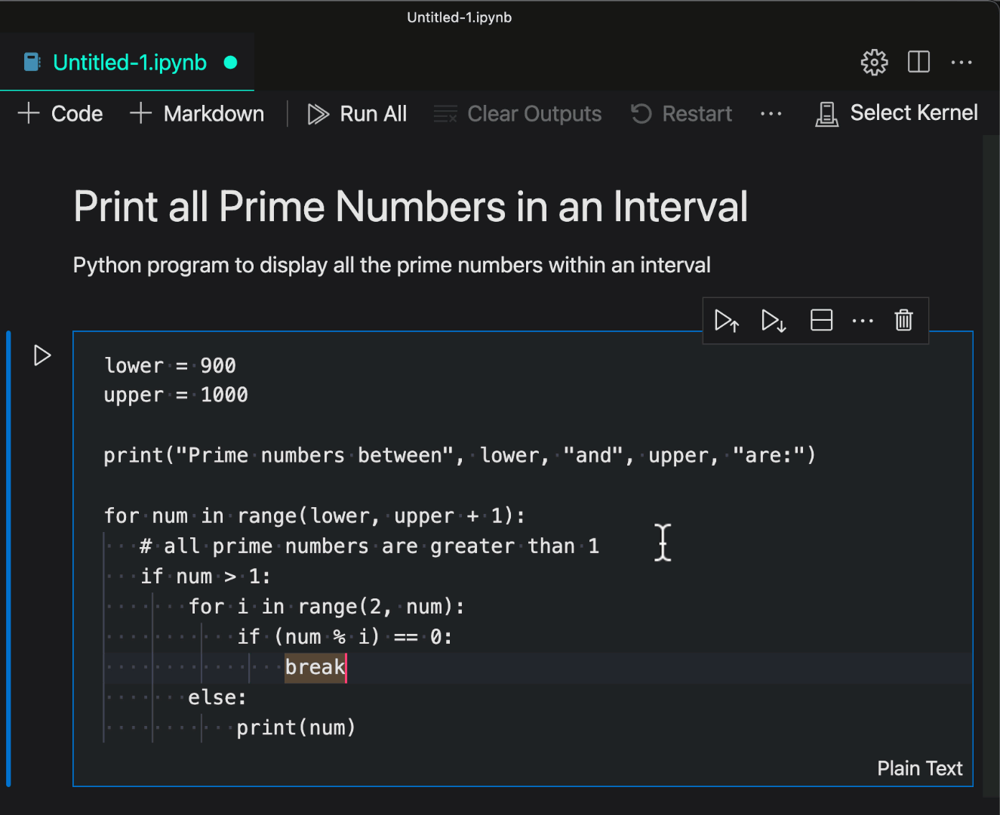
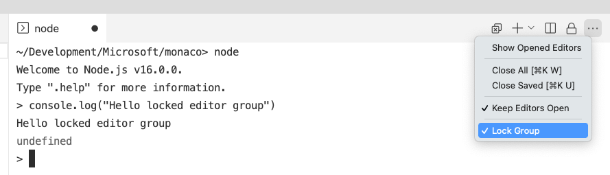
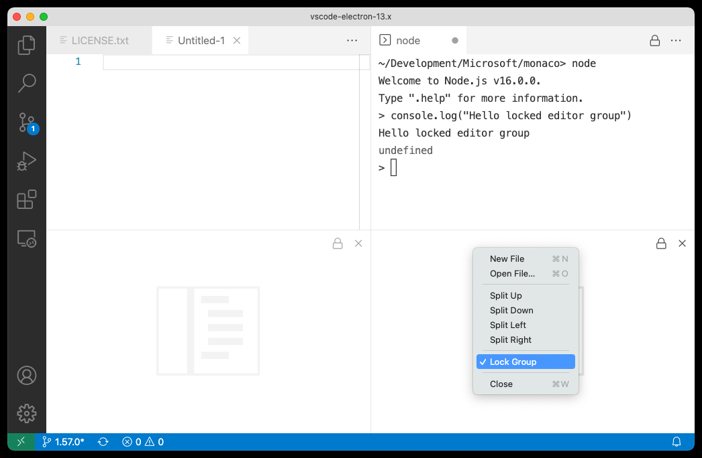
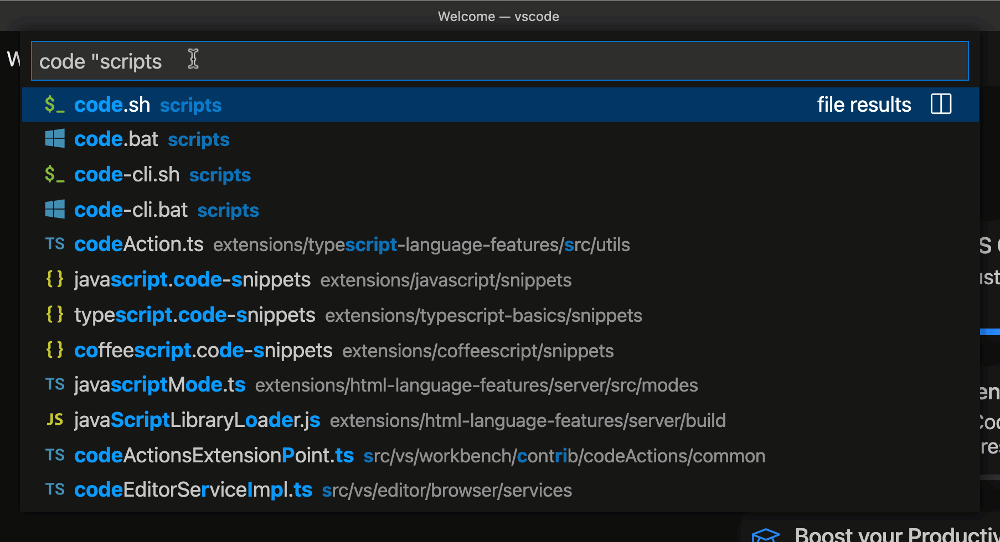
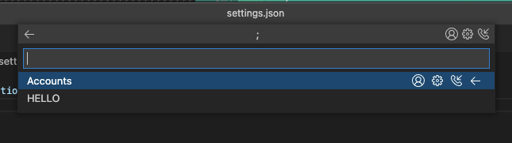

# August 2021 (version 1.60)

**Update 1.60.1**: The update addresses these [issues](https://github.com/microsoft/vscode/issues?q=is%3Aissue+milestone%3A%22August+2021+Recovery%22+is%3Aclosed).

**Update 1.60.2**: The update addresses these [issues](https://github.com/microsoft/vscode/issues?q=is%3Aissue+milestone%3A%22August+2021+Recovery+2%22+is%3Aclosed).

<!-- DOWNLOAD_LINKS_PLACEHOLDER -->

---

Welcome to the August 2021 release of Visual Studio Code. There are many updates in this version that we hope you will like, some of the key highlights include:

* **[Automatic language detection](#automatic-language-detection)** - Programming language detected when you paste into VS Code.
* **[Built-in fast bracket colorization](#high-performance-bracket-pair-colorization)** - Fast bracket matching and colorization for large files.
* **[Settings editor syntax highlighting](#syntax-highlighting-of-codeblocks-in-the-settings-editor)** - Rich syntax highlighting for setting description code blocks.
* **[Custom terminal glyph rendering](#terminal)** - Better display of box drawing and block element characters.
* **[Set debugging Watch values](#set-value-in-watch-view)** - Change watched values during a debugging session.
* **[Notebook improvements](#notebooks)** - Markdown link navigation, faster rendering of large outputs.
* **[JavaScript/TypeScript inlay hints](#inlay-hints-for-javascript-and-typescript)** - Inline hints for parameter names and types, and more.
* **[Locked editor group preview](#locked-editor-groups)** - Keep a preferred editor layout by locking the editor group.
* **[Python extension testing updates](#python)** - Better support for test discovery, navigation, and status.
* **[Web extension authors guide](#web-extensions)** - Learn how to update your extension for VS Code in the browser.

>If you'd like to read these release notes online, go to [Updates](https://code.visualstudio.com/updates) on [code.visualstudio.com](https://code.visualstudio.com).

**Join us live** at the [VS Code team's livestream](https://code.visualstudio.com/livestream) on Thursday, September 2 at 8am Pacific (4pm London) to see a demo of what's new in this release, and ask us questions live.

**Insiders:** Want to try new features as soon as possible? You can download the nightly [Insiders](https://code.visualstudio.com/insiders) build and try the latest updates as soon as they are available.

## Workbench

### Automatic language detection

Last release, we introduced an experimental feature for untitled files that would automatically set the language mode for the file based on the contents. The automatic language detection feature uses machine learning to guess the language and the machine learning model runs entirely local on your machine. The model is powered by the open-source ML library, [Tensorflow.js](https://www.tensorflow.org/js/), and the ML model from [Guesslang](https://github.com/yoeo/guesslang) by GitHub user [@yoeo](https://github.com/yoeo).

This release we are enabling automatic language detection by default and also expanding detection to include files that don't have a file extension. In Notebooks, we provide an easy way to ask for language detection using the language picker.

We added this feature because we found that some new users of VS Code didn't know how to set the language mode and didn't know that this is needed in order to get VS Code's rich feature set (language colorization and extension recommendations). Enabling new users to quickly see the language features and extensions available for VS Code helps them as they ramp up on the editor.

In addition, power users who use untitled text editors as a scratch pad, no longer need to explicitly set the language mode, which we hope will streamline their workflow.

Below are several fun scenarios enabled by automatic language detection.

Grab an example from online and paste it in an untitled editor:


*Theme: [Panda Theme](https://marketplace.visualstudio.com/items?itemName=tinkertrain.theme-panda)*

"Pipe into code" language detection (showing off detection of extension-less files):


*Theme: [Panda Theme](https://marketplace.visualstudio.com/items?itemName=tinkertrain.theme-panda)*

Auto detect option in the Notebooks language picker:



*Theme: [Panda Theme](https://marketplace.visualstudio.com/items?itemName=tinkertrain.theme-panda)*

### Terminal editor confirmation dialog

The dialog presented when closing a terminal editor with running child processes is now specific for the terminal editor and will no longer offer a way to "Save" the terminal.


### Keep editors open instead of closing when they fail to restore

Previously, when an editor failed to restore after reload of the window or restart of the application, the editor would automatically close until an editor was found that successfully loads. This behavior led to frustrating results, where a carefully created editor layout would go away due to editors closing.

With this release, an editor that was once successfully opened will not close, even if it fails to restore. The editor indicates the problem and offers to retry the operation:


### Syntax highlighting of codeblocks in the Settings editor

[Fenced code blocks](https://docs.github.com/github/writing-on-github/working-with-advanced-formatting/creating-and-highlighting-code-blocks#syntax-highlighting) in setting descriptions are now syntax highlighted:


### Open Settings editor to the side

It's now possible to open the Settings editor in a side group by configuring a keybinding using the `openToSide` argument.

```json
{
    "key": "cmd+,",
    "command": "workbench.action.openSettings",
    "args": {
        "openToSide": true
    }
}
```

This also works with the `workbench.action.openSettingsJson` command.

## Editor

### High performance bracket pair colorization

The editor now supports native bracket pair colorization:


Bracket pair colorization can be enabled by setting `"editor.bracketPairColorization.enabled": true`. All colors are themeable and up to six colors can be configured.

We implemented this feature to address performance issues of the famous [Bracket Pair Colorizer](https://marketplace.visualstudio.com/items?itemName=CoenraadS.bracket-pair-colorizer-2) extension by [CoenraadS](https://github.com/CoenraadS).

Now, even changes in huge documents are reflected immediately:


### Inline suggestions in autocomplete

Inline suggestions can now extend the suggestion preview when the autocomplete widget is shown. If a suggestion that is selected in the autocomplete widget can be extended by an inline completion provider, the extension is shown in italic. Pressing `Tab` once will still only accept the autocomplete suggestion. Pressing `Tab` a second time will then accept the inline suggestion.


This feature requires the suggest preview to be enabled (`"editor.suggest.preview": true`).

### Updated Peek views

We've given the Peek views a visual refresh to align with the rest of the other editor views:


## Terminal

### Custom rendering of box drawing and block element characters

Box drawing and block element characters now use pixel-perfect custom glyphs instead of using the font when GPU acceleration is on (`terminal.integrated.gpuAcceleration`). This means, for example, that boxes are drawn without gaps, even if you set line height or letter spacing in the terminal.


Here is an example of the terminal app [Zenith](https://github.com/bvaisvil/zenith) that shows the box drawing characters around sections as well as block elements for the charts:


This can be disabled by setting `"terminal.integrated.customGlyphs": false`.

### Improved rendering of underscore for certain fonts

There were some historical issues with how underscore is rendered in the terminal, most of which were fixed by switching to the WebGL renderer (default). There was one exception to this, where the underscore character in the font is unexpectedly drawn below the bounds of the cell on Linux.

Notice how the underscore on the lower row is rendered below the cell:


While this works fine in most cases, it fails on the bottom row because it is drawn outside the bounds of the canvas.

We now work around this problem by detecting such a font and shifting the underscore texture up until it is within the bounds of the cell. This solution also applies to the canvas renderer, which previously wouldn't show underscores for any rows because of how it clips the rows to avoid overlapping.


### Faster reconnection after reloading the window

Previously, when reloading a window, it could take up to 300 ms to parse the state of a terminal's buffer and there was also the possibility of corruption. For several busy terminals, this can quickly add up! To fix this, the method of restoring the buffer has changed from recording a large number of recent raw terminal events on the [pty host](https://code.visualstudio.com/updates/v1_54#_new-terminal-process-layout) to maintaining a headless terminal frontend on the pty host and writing all data to that.

This approach brings several benefits:

* The amount of scrollback to restore can be fine-tuned. The default is now 100, which is a good balance between speed and the amount of data. The scrollback amount can be changed with the `terminal.integrated.persistentSessionScrollback` setting.
* Thanks to [xterm.js'](https://github.com/xtermjs/xterm.js) fast parser, this should have minimal impact on CPU usage and reduce overall memory usage on the pty host.
* Terminal modes are now restored explicitly that could potentially get missed before and cause buffer corruption.
* There is no longer the need to replay costly resize events as the terminal's buffer is always in sync with its size.
* Since the restore is relatively quick, it's all handled in a single frame. This means that precious CPU time isn't wasted on rendering the partially restored terminal and slowing things down further.

How much of a speedup this new implementation provides depends on many factors, like the number of terminals, hardware, terminal buffer size, and what was happening in the terminal. A rough estimate of restoring a full terminal buffer should yield an approximate speedup of 5-10x.

We also published the new [xterm-headless](http://npmjs.com/package/xterm-headless) package on npm, so you can use this work in your own project.

## Debugging

### Set Value in WATCH view

It is now possible to set the value of a watched expression in the WATCH view using the **Set Value** action in the context menu.


Debug extensions have to opt into this feature in order for **Set Value** to be available. For now, the JS-debug, C#, and C++ extensions support this, but we expect other debug extensions to follow soon.

### Minor UI improvements

* VS Code now detects links for values also in the VARIABLES view, WATCH view, and Debug hover. When a variable's value is a link, this will make it easier to follow that link by clicking on it.
* When starting another instance of a debug session that is already running, there is now a modal confirmation dialog to prevent accidentally starting two sessions.
* Clicking on a disabled breakpoint in the editor's breakpoint gutter now enables the breakpoint instead of removing it.
* When a debug session is active, the **Run To Line** action is now available in the editor's breakpoint gutter context menu:

  

### New settings

* If you want to avoid accidentally closing the window during a debug session, you can enable the new setting `debug.confirmOnExit`. With this set to `always`, you will be prompted to confirm that you want to stop the debug session when closing the window.

  

* A new setting `debug.console.acceptSuggestionOnEnter` controls whether suggestions should be accepted on `Enter` in the Debug Console. `Enter` is also used to evaluate whatever is typed in the Debug Console, so this option gives users better control over what happens when pressing `Enter`.

### JavaScript debugging

**Legacy node debuggers are gone**

VS Code has long included a built-in Node.js debugger, and published a separate Chrome debugger. Last year we introduced a new debugger for Node.js and Chrome, and since VS Code 1.47 (July 2020) it has been the default, with an 'opt out' option.

With this release, the **old** debuggers have been removed from the product and marked as deprecated on the Marketplace. If you're among the majority of VS Code users who didn't opt out of the new JavaScript debugger, nothing will change for you.

If you require the old debuggers—to debug Node.js 6 programs, for example—you can install the [[Deprecated] Node Debug](https://marketplace.visualstudio.com/items?itemName=ms-vscode.node-debug) or [[Deprecated] Debugger for Chrome](https://marketplace.visualstudio.com/items?itemName=msjsdiag.debugger-for-chrome) extension and use the `legacy-node` or `legacy-chrome` launch types, respectively.

**Improved stepping in async functions and Node.js internals**

You can set the debugger's [skipFiles](https://code.visualstudio.com/docs/nodejs/nodejs-debugging#_skipping-uninteresting-code) to avoid stepping into certain code, including Node.js internals, which can often be hit when stepping around async functions.

However, Node.js does not always exhibit correct behavior when dealing with ["blackboxed"](https://chromedevtools.github.io/devtools-protocol/tot/Debugger/#method-setBlackboxPatterns) scripts, so this iteration we've introduced "synthetic blackboxing" in the debugger. This should result in significantly improved reliability when working with Node.js programs, particularly when stepping into async functions.

In our next release, we plan to make the debugger skip Node.js internals by default.

## Installer

### Register VS Code for supported file types by default

Windows 11 introduces a [new File Explorer context menu](https://blogs.windows.com/windowsdeveloper/2021/07/19/extending-the-context-menu-and-share-dialog-in-windows-11/) that puts **Open With** to the top of the menu, grouped with **Open**. The update makes it easier to find all available editors and change defaults.

Following the new best practices, VS Code's checkbox **Register VS Code to be the editor for associated file types** will now be checked on by default during Windows installation. We also reviewed the list of associated file types and expanded it to include more of the frequently opened file types.

### Microsoft Store on Windows 11

With the upcoming Windows 11, the new Microsoft store can support more traditional application types and installers. If you are already testing Windows 11 via the Windows Insiders program, you can now install the latest release of VS Code today by searching for it in the store. Once installed, you will have the same VS Code that is available as a user install from our website and updates will be handled in-app, just like they are today.

## Notebooks

### Links between Markdown cells

Notebooks now support links between Markdown cells:


You can create a link to a header in a Markdown cell using:

```markdown
[Link text](#header-slug)
```

`header-slug` is the lowercase text of the header with any spaces or special characters replaced with `-`. The link in the example above will go to the header `# Header Slug`.

### Performance improvements when dealing with large outputs

We've optimized how we deal with large outputs in notebooks to significantly improve performance.

Behind the scenes, VS Code stores notebook outputs as binary data using [Uint8Arrays](https://developer.mozilla.org/docs/Web/JavaScript/Reference/Global_Objects/Uint8Array). Previously, when transferring output data between the extension host process and the renderer process, data was first converted to an array of number values and then serialized to JSON.

To understand why this is bad for performance, consider a notebook that outputs the text: `Hello Code!`. This is stored internally as a `Uint8Array`:

```js
new Uint8Array([72, 101, 108, 108, 111, 32, 67, 111, 100, 101, 33])
```

That data is 11 bytes long. The old implementation would then convert the binary data to a JSON string:

```js
"[72,101,108,108,111,32,67,111,100,101,33]"
```

This string is 41 bytes long, which is over 3.5x times the size of our original data! That's a lot extra bytes to transfer and the receiver now has to parse that string as JSON to convert it back into a `Uint8Array`. This parsing can become a significant bottleneck for notebook outputs that are tens of MB in size.

With the new implementation, notebook outputs are kept as binary data while transferring them. You can read more about the details of how this was implemented [in the pull request](https://github.com/microsoft/vscode/pull/130452).

This fix significantly improves both loading of notebooks with large outputs saved into them, as well as improving performance when notebooks generate large outputs during execution.

### onNotebook activation event improvement

VS Code will emit `onNotebook:{type}` and `onNotebook:*` events when a notebook is opened in the workspace so that notebook extensions can be activated when listening to these events. Previously, VS Code would wait for all extensions listening to these two events prior to opening a file, but now it will only wait for the serializer for the specific notebook to be registered. For example, when users open an `ipynb` file in a fresh workspace, the built-in `ipynb` serializer extension will be activated and the file opened immediately. At the same time, VS Code emits activation events to all other extensions, for example, Jupyter, .NET Interactive, or Julia extensions. The activation of other extensions will not slow down file operations to ensure fast notebook opening.

### Notebook layout customization

You can now customize the notebook layout settings directly through the editor toolbar.


## Language Features

### TypeScript 4.4

VS Code now includes TypeScript 4.4. This update brings support for a number of new language features and improvements, including [static blocks](https://devblogs.microsoft.com/typescript/announcing-typescript-4-4/#static-blocks) and [new strictness options](https://devblogs.microsoft.com/typescript/announcing-typescript-4-4/#exact-optional-property-types). It also adds new tooling improvements and fixes some important bugs.

You can read all about TypeScript 4.4 on the [TypeScript blog](https://devblogs.microsoft.com/typescript/announcing-typescript-4-4).

### Inlay hints for JavaScript and TypeScript

The most significant new tooling feature in TypeScript 4.4 is inlay hint support. Inlay hints add additional inline information to source code to help you understand what the code does.

Parameter name inlay hints, for example, show the names of parameters in function calls:


This can help you understand the meaning of each argument at a glance, which is especially helpful for functions that take Boolean flags or have parameters that are easy to mix up.

To enable parameter name hints, set `javascript.inlayHints.parameterNames.enabled` or `typescript.inlayHints.parameterNames.enabled` settings. There are three possible values:

* `none` - Disable parameter inlay hints.
* `literals` - Only show inlay hints for literals (string, number, Boolean).
* `all` - Show inlay hints for all arguments.

In addition, VS Code also offers inlay hints that show implicit type information in your JavaScript and TypeScript code.

**Variable type inlay hints** show the types of variables that don't have explicit type annotations.

Settings - `javascript.inlayHints.variableTypes.enabled` and `typescript.inlayHints.variableTypes.enabled`


**Property type inlay hints** show the type of class properties that don't have an explicit type annotation.

Settings- `javascript.inlayHints.propertyDeclarationTypes.enabled` and `typescript.inlayHints.propertyDeclarationTypes.enabled`


**Parameter type hints**  show the types of implicitly typed parameters.

Settings - `javascript.inlayHints.parameterTypes.enabled` and `typescript.inlayHints.parameterTypes.enabled`


**Return type inlay hints** show the return types of functions that don't have an explicit type annotation.

Settings - `javascript.inlayHints.functionLikeReturnTypes.enabled` and `typescript.inlayHints.functionLikeReturnTypes.enabled`


We plan to continue improving inlay hints going forward so be sure to [share any feedback](https://github.com/microsoft/vscode/issues/new/choose) you have on the new feature!

### Spelling suggestions in JavaScript files

VS Code now helps you catch simple spelling mistakes in JavaScript files:


Spelling suggestions are only shown if there is fairly high confidence that they are actual mistakes and not just code patterns that our IntelliSense engine doesn't understand. You can read more about the details of this [in the PR that added the feature](https://github.com/microsoft/TypeScript/pull/44271).

You also can disable these suggestions by setting:

```json
"javascript.suggestionActions.enabled": false
```

For more comprehensive checking, try [enabling full semantic checking in your JavaScript code](https://code.visualstudio.com/docs/nodejs/working-with-javascript#_type-checking-javascript). Not only can this help catch more errors, it also enables several helpful Quick Fixes.

### typescript.tsserver.useSyntaxServer

The new `typescript.tsserver.useSyntaxServer` setting allows you to control if TypeScript launches a dedicated server to quickly handle syntax-related operations, such as computing code folding. It replaces the now deprecated `typescript.tsserver.useSeparateSyntaxServer` setting.

Possible values are:

* `auto` - Spawn both a full server and a lighter weight server dedicated to syntax operations. The syntax server is used to speed up syntax operations such as code folding and provide IntelliSense while projects are loading. (Default)
* `always` - Use a lighter weight syntax server to handle all IntelliSense operations. This syntax server can only provide IntelliSense for opened files.
* `never` - Don't use a dedicated syntax server. Use a single server to handle all IntelliSense operations.

## Preview features

### Locked editor groups

With the introduction of [terminals in the editor area](https://code.visualstudio.com/updates/v1_58#_terminals-in-the-editor-area), we received reports from users who were frustrated that a terminal editor would be replaced with a file editor too easily or by accident. By default, files will always open in the active editor group and thus, even when a terminal was active, a file would open and hide the terminal.

**Locked editor groups** provide a new way of handling this issue, not only for terminals but for any editor. If you have more than one editor group opened, you can now lock it, either using one of the new commands or from the **"..."** overflow menu:



Locked groups behave differently than unlocked groups:

* New editors will not open in a locked group unless explicitly moved there by the user (for example, via drag and drop).
* If an editor skips a locked group for opening, it will either open in the most recently used unlocked group or create a new group to the side of the locked one.
* The locked state of an editor group is persisted and restored across restarts.
* You can lock empty groups as well allowing for a more stable editor layout.
* A locked group is indicated by a lock icon in the action toolbar (top right).



See the following demo of how locked editor groups behave in action. Even though the Markdown preview is active, new files will open in the left editor group:


The commands added for this feature are:

* `workbench.action.experimentalLockEditorGroup`
* `workbench.action.experimentalUnlockEditorGroup`
* `workbench.action.experimentalToggleEditorGroupLock`

A new context key `activeEditorGroupLocked` is available to conditionally bind commands depending on the locked state of a group.

**Note:** The associated setting and commands are experimental until we have finalized the design of locked editor groups. We want your feedback on this new feature, so please do not hesitate to [report issues](https://github.com/microsoft/vscode/issues).

### Auto-lock an editor group

Building on top of the new locked editor groups concept, the new `workbench.editor.experimentalAutoLockGroups` setting allows you to select editors that should lock a group automatically when they open. This only applies when the editor is the first to open in an otherwise empty or new group.

Terminals are configured by default to cause a new group to lock automatically. In the short video below, even though the terminal is active, the selected file from the terminal will open in the left editor group:


If you want Markdown previews to lock a group automatically, you can add `mainThreadWebview-markdown.preview: true` to the `experimentalAutoLockGroups` setting.

In the next milestones, we will work on improving the settings UX to be able to pick editors without having to know their identifiers. The associated setting and commands are experimental until we have finalized the design of locked editor groups. Again we would like your [feedback](https://github.com/microsoft/vscode/issues).

### Quotes support in the "Search by file name" Quick Pick

This iteration, we have added the ability to exclude fuzzy search results from the "Search by file name" Quick Pick (`kb(workbench.action.quickOpen)`) by placing the search string in quotes.

Scenarios where this shines:

When a query is only a few characters:


If you want to reduce the "clutter" of the results:



We like this quoting experience and it feels intuitive since most search engines use a similar mechanism, but we'd like your feedback. We are also considering other approaches discussed in [issue #131431](https://github.com/microsoft/vscode/issues/131431).

## Contributions to extensions

### Jupyter

**Run By Line**

VS Code now supports the **Run By Line** feature in Jupyter notebooks. This is a simple debug mode that lets you execute the code of a cell line by line. To try it out, make sure that you have `ipykernel` v6+ installed as your selected kernel, then select the **Run By Line** button.


**Debugging**

There is also experimental support for debugging Jupyter notebooks using the full debug features of VS Code. To try it out, make sure you have `ipykernel` v6+ installed as your selected kernel, set `"jupyter.experimental.debugging": true`, set a breakpoint, and select the **Debug Cell** command.


**Jupyter Keymap**

We extracted the Jupyter classic keybindings to a separate [Jupyter Keymap extension](https://marketplace.visualstudio.com/items?itemName=ms-toolsai.jupyter-keymap), which you can disable if you prefer to use another set of [notebook keybindings](https://marketplace.visualstudio.com/search?term=%40tag%3Anotebook-keymap&target=VSCode&category=All%20categories&sortBy=Relevance) from the Marketplace.

### Python

**Revamped testing interface**

Thanks to the [new testing API](https://code.visualstudio.com/api/extension-guides/testing), the [Python extension](https://marketplace.visualstudio.com/items?itemName=ms-python.python) has revamped its testing features.  You can now enjoy a more stable experience for test discovery, navigation, and status rendering, as well as new features such as search tests, run a selection of tests, rerun last executed test, and more!


**Run and debug Python files in the terminal from the editor**

You can now run **and debug** your Python files in the terminal directly from the editor with the Python extension.


### GitHub Pull Requests and Issues

The much requested ability to expand and collapse all comments in the [GitHub Pull Requests and Issues](https://marketplace.visualstudio.com/items?itemName=GitHub.vscode-pull-request-github) extension is now available. All comments can be expanded and collapsed via the commands **GitHub Pull Requests: Expand All Comments** and **GitHub Pull Requests: Collapse All Comments**. There is also a setting `githubPullRequests.commentExpandState` to control the expand collapse state. Finally, you can also collapse all comments from within the commenting UI:


To learn about all the new features and updates, you can see the full [changelog for the 0.30.0](https://github.com/microsoft/vscode-pull-request-github/blob/main/CHANGELOG.md#0300) release of the extension.

## Extension authoring

### Web extensions

When VS Code is running in a browser, extensions are loaded into an extension host also running in the browser. The "web extension host" is constrained by the browser and extensions do not have access to the local file system or platform features. To help extension authors update their extensions to support running in VS Code for the web, there is now a [Web Extensions](https://code.visualstudio.com/api/extension-guides/web-extensions) authoring guide. Here you will learn which types of extensions work best on the web, how to access the VS Code APIs, and work with virtual file systems.

Along with the web extension guide, the `yo code` [extension generator](https://www.npmjs.com/package/generator-code) now has an option to scaffold a **Web Extension**, and also includes support for the `@vscode/test-web` module to test web extensions from the command line.

If you haven't seen Visual Studio Code for the Web in action, you can press `'.'` (the period key) in the **<> Code** tab of a GitHub repository and you will launch a web-based version of VS Code to browse and edit the source code.

### Short title for commands

The [commands](https://code.visualstudio.com/api/references/contribution-points#contributes.commands) contribution point allows extensions to define UI-properties for commands, like title, category, or icon. Menus, on the other hand, are "places" that display commands and menus may present some or all of the command's UI-properties. For instance, some menus render only icons while others render titles or category plus title. As an extension author, it can be hard to come up with a command title that works equally well for global and local menus. For example, the Command Palette can display more words than a context menu.

To allow for different titles, there is a new `shortTitle` property. It allows commands to provide a shorter title that works well depending on the UI, such as **Notebook: Clear All Cell Output** in the Command Palette and shorter **Clear All** in the notebook toolbar.

### Application host added to environment namespace

The `.env` namespace now includes the application host `appHost` property. `appHost` allows extension developers to determine the environment VS Code is hosted in. Examples include desktop, GitHub Codespaces, github.dev, and vscode.dev.

### RendererContext.workspace.isTrusted for notebook renderers

The new `workspace.isTrusted` property on the context object passed to [notebook renderers](https://github.com/microsoft/vscode-extension-samples/tree/main/notebook-renderer-sample) lets extension authors check if the current workspace is trusted or not:

```ts
import type { ActivationFunction } from 'vscode-notebook-renderer';

export const activate: ActivationFunction<void> = (ctx) => {
  return {
    renderOutputItem: (outputInfo, element) => {
      if (ctx.workspace.isTrusted) {
        // Render normally. Still take precautions to avoid script injection and
        // only enable as much functionality as your renderer needs.
      } else {
        // Only render safe content. Always make sure it has been properly sanitized.
      }
    }
  }
};
```

### Platform-specific extensions

We have been making progress on [platform-specific extensions](https://github.com/microsoft/vscode/issues/23251), which allow extensions authors to create separate extension versions for different platforms (Windows, macOS, Linux). We have been working with the Marketplace team on this feature and have finalized on a solution. In this milestone, we started on the implementation and plan to bring it to extension authors soon. You can follow [issue #23251](https://github.com/microsoft/vscode/issues/23251) for updates and to provide feedback.

### Updated codicons

The following new icons were added to our [codicon library](https://code.visualstudio.com/api/references/icons-in-labels):


* `folder-library`
* `run-errors`

### Updates to Walkthrough contributions

**Using themeable SVG's as Walkthrough step media**

Walkthrough steps can now specify a `svg` property in their `media` object. In addition to better scaling support, SVG's provide access to theme tokens, which can allow the media to visually fit in with the rest of the workbench. See our guide on [theming webview content](https://code.visualstudio.com/api/extension-guides/webview#theming-webview-content) for more information.


**Declaring the files of interest for a Walkthrough**

Walkthroughs now support an optional `featuredFor` parameter, which lists out the file types that a given walkthrough applies to. When these files are found in a workspace folder, the walkthrough will be rendered with higher visual priority.

### Tasks default group API

The `isDefault` property for `TaskGroup` has been finalized. Extensions can now fetch tasks then read the `isDefault` property of the task's `group` to determine if a task is the default for that group.

## Debugger extension authoring

### New "managedByParent" property on "DebugSessionOptions"

A new flag `managedByParent` has been added to the `DebugSessionOptions` type. When passed to the `startDebugging` API, it controls whether lifecycle requests like `disconnect` and `restart` are sent to the newly created session or its parent session.

### Debug Adapter Protocol's "showUser" property

When a `launch` request fails, VS Code will now honor the `showUser` property sent with the response from the debug adapter. If the `showUser` property is provided and is false, VS Code will **not** show a modal dialog with the error. In case the `showUser` property is missing or is `true`, VS Code will behave as before and will show the error dialog.

For other Debug Adapter Protocol (DAP) requests, there is no change. If `showUser` is `true`, the error will be shown using a notification. Otherwise, nothing will be shown to the user.

### VS Code no longer registers breakpoints for "noDebug" debug sessions

When the `noDebug` property of DAP's `launch` request is set to `true`, VS Code will no longer call any breakpoint registering DAP requests (`setBreakpoints`, `setExceptionBreakpoints`, `setDataBreakpoints`, `setFunctionBreakpoints`, `setInstructionBreakpoints`).

### VS Code now supports the DAP "setExpression" request

If a debug adapter implements the `setExpression` request (the `supportsSetExpression` capability is `true`), VS Code will use `setExpression` in two situations:

* In the VARIABLES and WATCH view, for changing the value of variables, if the debug adapter does not support the `setVariable` request (`supportsSetVariable` capability is missing or `false`) and if the variable has an `evaluateName` property and is editable (`readOnly` attribute in `VariablePresentationHint` is not `true`).
* In the WATCH view, for changing the value of an assignable expression, if the watch expression is editable (`readOnly` attribute in `VariablePresentationHint` is not `true`).

### Suppressing the 'Open launch.json' button in DAP error messages

The Debug Adapter Protocol permits the [Message](https://microsoft.github.io/debug-adapter-protocol/specification#Types_Message) of an [ErrorResponse](https://microsoft.github.io/debug-adapter-protocol/specification#Base_Protocol_ErrorResponse) to return a `url`, where additional information about the message can be found, and a `urlLabel` that is presented to the user as the UI for opening the URL. When VS Code shows the message to the user in a modal dialog, a button is shown captioned with the `urlLabel`. Prior to this release, VS Code would also add a button captioned **Open launch.json**. That button is no longer added if the `url` of the message uses the 'command' scheme, for example `command:myExtension.fixError`.

## Debug Adapter Protocol

### New "memory" event released

The `memory` event has been finished and is now available in version 1.49 of the [Debug Adapter Protocol](https://microsoft.github.io/debug-adapter-protocol/) and the corresponding npm modules. If a debug adapter has received a value `true` for the `supportsMemoryEvent` capability of the `initialize` request, the debug adapter can emit the `memory` event to indicate that some memory range has been updated.

## Proposed extension APIs

Every milestone comes with new proposed APIs and extension authors can try them out. As always, we want your feedback. This is what you have to do to try out a proposed API:

* You must use Insiders because proposed APIs change frequently.
* You must have this line in the `package.json` file of your extension: `"enableProposedApi": true`.
* Copy the latest version of the [vscode.proposed.d.ts](https://github.com/microsoft/vscode/blob/main/src/vs/vscode.proposed.d.ts) file into your project's source location.

You cannot publish an extension that uses a proposed API. There may be breaking changes in the next release and we never want to break existing extensions.

### Support for type hierarchy

There is an API proposal for a [TypeHierarchyProvider](https://github.com/microsoft/vscode/blob/75f509fa8ac66f0909f9958de17b9e0a8a10a937/src/vs/vscode.proposed.d.ts#L2808-L2808) that allows extensions to provide supertypes and subtypes for symbols. The API is ready to try out and if you find issues or have suggestions, you can enter them in the [VS Code repository](https://github.com/Microsoft/vscode/issues).

### Create terminals anywhere

The [proposed terminal location API](https://github.com/microsoft/vscode/blob/6d2920473c6f13759c978dd89104c4270a83422d/src/vs/vscode.proposed.d.ts#L929-L967) allows creating both terminal splits in the panel as well as in the editor area.

### Query and event for whether a terminal has been "interacted with"

A new proposed API for [Terminal.state and window.onDidChangeTerminalState](https://github.com/microsoft/vscode/blob/6d2920473c6f13759c978dd89104c4270a83422d/src/vs/vscode.proposed.d.ts#L890-L927) allows querying whether a terminal has been "interacted with". An interaction means that data has been sent to the process, and could happen for various reasons, the main one being keyboard input.

### Buttons in QuickPickItems

There is a proposed API for [adding and handling buttons in a QuickPickItem](https://github.com/microsoft/vscode/blob/ecc7fdac9014976109db45db3143261a5795169d/src/vs/vscode.proposed.d.ts#L2889-L2899). We hope this will enable extensions to provide richer user interactions with the Quick Pick.



Try it out and let us know what you think. One thing to note is that there is [currently a known issue around the scroll position](https://github.com/microsoft/vscode/issues/109969) of the Quick Pick, which we think will be amplified by this new proposed API. We are working on the right set of APIs to address this issue. Please let us know your thoughts by [engaging in the issue](https://github.com/microsoft/vscode/issues/109969).

### Test tags

[Test tags](https://github.com/microsoft/vscode/issues/129456) are a proposed API that provide both a method for organizing tests, as well indicating which tests are runnable.

### Non-error test output

The test API supports test failure messages, but previously didn't have a way to associate non-error output with a certain test case. We're evaluating a way to do this, by passing an optional `TestItem` and `location` to the `TestRun.appendOutput` method. Please leave feedback on [issue #129201](https://github.com/microsoft/vscode/issues/129201) if you have any input!

### Inline Completion Provider: Interaction with Autocomplete widget

The `InlineCompletionContext` has a new field `selectedCompletionInfo` that contains details of the currently selected suggestion in the autocomplete widget. Also, `InlineCompletionItemProvider`s are asked for inline suggestions whenever the user changes the selected item in the autocomplete widget. If the inline suggestion extends the selected suggestion item, the extension is shown in italic.

## Engineering

### Fix support for RHEL7 and Centos7 distros

In VS Code version 1.53, we updated our build images to consume newer Electron versions causing a change in CXXABI requirements for native modules that broke our rpm packages in some distros [issue #115784](https://github.com/microsoft/vscode/issues/115784). With update to Electron v13, we are now able to build our native modules with the same compiler toolchain as the runtime, specifically we now use Clang and statically link the libcxx from the runtime. This allows us to bypass the CXXABI requirements for only a small increase in binary size ~10 MB and bring back support for these distros. Thanks for your patience and help with testing on Insiders.

## Documentation

### Julia in VS Code

There is a new [Julia in Visual Studio Code](https://code.visualstudio.com/docs/languages/julia) topic describing [Julia programming language](https://julialang.org) support in VS Code with the [Julia extension](https://marketplace.visualstudio.com/items?itemName=julialang.language-julia). The Julia extension includes rich language features such as code completions, code navigation, and debugging as well as an integrated REPL and plot navigator.


### Azure Machine Learning

You can read the [Azure Machine Learning in VS Code](https://code.visualstudio.com/docs/datascience/azure-machine-learning) overview to learn how the [Azure Machine Learning extension](https://marketplace.visualstudio.com/items?itemName=ms-toolsai.vscode-ai) lets you work with Azure Machine Learning cloud-based [machine learning models](https://learn.microsoft.com/azure/machine-learning/overview-what-is-azure-machine-learning) directly from VS Code.

## Notable fixes

* [82489](https://github.com/microsoft/vscode/issues/82489): Incorrect keyboard input when using "AltGr" key
* [115945](https://github.com/microsoft/vscode/issues/115945): Debug toolbar contributed commands missing when toolbar is docked
* [118196](https://github.com/microsoft/vscode/issues/118196): Elements in args-list does not update when restarting debug session
* [121201](https://github.com/microsoft/vscode/issues/121201): Menu selection not rendered correctly on iPad
* [124128](https://github.com/microsoft/vscode/issues/124128): Extension development window is not torn down when debugging stops
* [125259](https://github.com/microsoft/vscode/issues/125259): Debug does not save launch.json before starting
* [126102](https://github.com/microsoft/vscode/issues/126102): SkipFiles still opens the file to skip temporarily, causing slowness
* [126911](https://github.com/microsoft/vscode/issues/126911): Extension debugging: stopping debug session doesn't close window
* [128484](https://github.com/microsoft/vscode/issues/128484): debug: option to disable the modal dialog on launch failure
* [129019](https://github.com/microsoft/vscode/issues/129019): treeview started as closed need another refresh (or re-opening) to show content
* [129469](https://github.com/microsoft/vscode/issues/129469): The settings editor inputbox could be larger
* [129645](https://github.com/microsoft/vscode/issues/129645): Enable code block syntax highlighting in setting UI
* [129844](https://github.com/microsoft/vscode/issues/129844): markdownEnumDescriptions don't remove markdown \<backtick\>##\<backtick\> in the settings UI and don't remove ## in settings.json
* [130265](https://github.com/microsoft/vscode/issues/130265): Node debugger doesn't break on unhandled promise rejection

## Thank you

Last but certainly not least, a big _**Thank You**_ to the following people who contributed this month to VS Code:

Contributions to our issue tracking:

* [John Murray (@gjsjohnmurray)](https://github.com/gjsjohnmurray)
* [Andrii Dieiev (@IllusionMH)](https://github.com/IllusionMH)
* [CodeCrazy-ywt (@CodeCrazy-ywt)](https://github.com/CodeCrazy-ywt)
* [Sandeep Rajakrishnan (@san-coding)](https://github.com/san-coding)
* [ArturoDent (@ArturoDent)](https://github.com/ArturoDent)

Contributions to `vscode`:

* [@afonsomatos (Afonso Matos)](https://github.com/afonsomatos): Fix Drag&Drop not working in Shadow Dom [PR #131392](https://github.com/microsoft/vscode/pull/131392)
* [@akosyakov (Anton Kosyakov)](https://github.com/akosyakov): use separate event loop for opened tabs [PR #126341](https://github.com/microsoft/vscode/pull/126341)
* [@AkatQuas (Akat)](https://github.com/AkatQuas)
  * fix some typo in comments, renaming few methods [PR #130470](https://github.com/microsoft/vscode/pull/130470)
  * fix(storage): fix method typo [PR #131051](https://github.com/microsoft/vscode/pull/131051)
* [@chrisyeh96 (Christopher Yeh)](https://github.com/chrisyeh96): Persist KaTeX macros across render calls [PR #129747](https://github.com/microsoft/vscode/pull/129747)
* [@Chigusa0w0 (Chigusa0w0)](https://github.com/Chigusa0w0): Fix strange behavior when scrolling downward at low-speed with trackpad [PR #131231](https://github.com/microsoft/vscode/pull/131231)
* [@erha19 (Dan)](https://github.com/erha19): fix: debug console variables output problem [PR #127132](https://github.com/microsoft/vscode/pull/127132)
* [@Eskibear (Yan Zhang)](https://github.com/Eskibear): peek type hierarchy [PR #130922](https://github.com/microsoft/vscode/pull/130922)
* [@gjsjohnmurray (John Murray)](https://github.com/gjsjohnmurray)
  * fix #126842 clear Explorer root folder error indicator when refresh succeeds [PR #126843](https://github.com/microsoft/vscode/pull/126843)
  * fix #129296 keep authority, query, fragment when navigating simple file dialog [PR #129310](https://github.com/microsoft/vscode/pull/129310)
  * Suppress 'Open launch.json' command on error dialog if DA provided a command (#124020) [PR #130754](https://github.com/microsoft/vscode/pull/130754)
  * improve workbench.editor.experimentalAutoLockGroups text [PR #131157](https://github.com/microsoft/vscode/pull/131157)
  * fix #131743 add menu separator only when adding 'Run to Line' [PR #131744](https://github.com/microsoft/vscode/pull/131744)
* [@jeanp413 (Jean Pierre)](https://github.com/jeanp413)
  * Fixes splitting first terminal after reload is sometimes really narrow [PR #129668](https://github.com/microsoft/vscode/pull/129668)
  * Fixes cmd+click on invalid link to create new file doesn't work in markdown [PR #130815](https://github.com/microsoft/vscode/pull/130815)
  * Fixes notebook UI displayed over terminal [PR #130854](https://github.com/microsoft/vscode/pull/130854)
  * Fixes parameter hints should use link hover color [PR #130963](https://github.com/microsoft/vscode/pull/130963)
  * Fixes suggest details should use link hover color [PR #130966](https://github.com/microsoft/vscode/pull/130966)
* [@jihoon-ernesto](https://github.com/jihoon-ernesto): Add terminal keybinding for cmd+. → ctrl+c to match macOS Terminal [PR #131025](https://github.com/microsoft/vscode/pull/131025)
* [@jsjoeio (Joe Previte)](https://github.com/jsjoeio): feat: add asWebviewUri test with port in name [PR #131447](https://github.com/microsoft/vscode/pull/131447)
* [@Kingwl (Wenlu Wang)](https://github.com/Kingwl): Fix folding ranges with inlay hints [PR #130399](https://github.com/microsoft/vscode/pull/130399)
* [@lezgomatt (Matthew Go)](https://github.com/lezgomatt): Fix custom select box hover styles [PR #129970](https://github.com/microsoft/vscode/pull/129970)
* [@nickofolas](https://github.com/nickofolas): Fix grammatical issues in status bar [PR #131271](https://github.com/microsoft/vscode/pull/131271)
* [@nrayburn-tech (Nicholas Rayburn)](https://github.com/nrayburn-tech): Fix #124276 batch Markdown file requests [PR #124545](https://github.com/microsoft/vscode/pull/124545)
* [@remcohaszing (Remco Haszing)](https://github.com/remcohaszing): define window.MonacoEnvironment [PR #128949](https://github.com/microsoft/vscode/pull/128949)
* [@sdissegna-maystreet](https://github.com/sdissegna-maystreet): [#131407] Fix service worker version check in browsers [PR #131408](https://github.com/microsoft/vscode/pull/131408)
* [@spahnke (Sebastian Pahnke)](https://github.com/spahnke): [Standalone editor] Add support to list provided code action kinds when registering a `CodeActionProvider` [PR #131254](https://github.com/microsoft/vscode/pull/131254)
* [@spasche (Sylvain Pasche)](https://github.com/spasche): Copy URI authority from base when splitting terminals, fixes #127811 [PR #130291](https://github.com/microsoft/vscode/pull/130291)
* [@ssigwart (Stephen Sigwart)](https://github.com/ssigwart): Update select to matching bracket direction [PR #128931](https://github.com/microsoft/vscode/pull/128931)
* [@suzmue (Suzy Mueller)](https://github.com/suzmue): Sort threads in response order [PR #128686](https://github.com/microsoft/vscode/pull/128686)
* [@threeal (Alfi Maulana)](https://github.com/threeal): feat: add .tpp and .txx as c++ extensions [PR #130101](https://github.com/microsoft/vscode/pull/130101)
* [@tony-xia (Tony Xia)](https://github.com/tony-xia)
  * Update method name [PR #129224](https://github.com/microsoft/vscode/pull/129224)
  * Update a variable name [PR #129226](https://github.com/microsoft/vscode/pull/129226)
* [@vagusX (vagusX)](https://github.com/vagusX): fix: remove useless priority field in vscode.FileDecoration api [PR #129501](https://github.com/microsoft/vscode/pull/129501)
* [@xgdgsc](https://github.com/xgdgsc): click on disabled breakpoint enable instead of removing #125904 [PR #125931](https://github.com/microsoft/vscode/pull/125931)
* [@xisui-MSFT](https://github.com/xisui-MSFT)
  * Fix focused stack frame colors in disassembly view [PR #129721](https://github.com/microsoft/vscode/pull/129721)
  * Move event listeners to renderTemplate in disassembly view [PR #129734](https://github.com/microsoft/vscode/pull/129734)
  * Improve accessibility in disassembly view [PR #129788](https://github.com/microsoft/vscode/pull/129788)
  * Add a special entry when disassembly is unavailable [PR #129797](https://github.com/microsoft/vscode/pull/129797)
* [@yannickowow (Yanis HAMITI)](https://github.com/yannickowow): [debugService #113742] variable display on debug session ending [PR #131016](https://github.com/microsoft/vscode/pull/131016)
* [@yash112-lang (Yash Singhal)](https://github.com/yash112-lang): Fixed vertical alignment [PR #130327](https://github.com/microsoft/vscode/pull/130327)

Contributions to `vscode-generator-code`:

* [@octref (Pine)](https://github.com/octref): Add local dev tips [PR #296](https://github.com/microsoft/vscode-generator-code/pull/296)

Contributions to `vscode-js-debug`:

* [@Manish-Giri (Manish Giri)](https://github.com/Manish-Giri): Update userDataDir option documentation [PR #1078](https://github.com/microsoft/vscode-js-debug/pull/1078)

Contributions to `vscode-pull-request-github`:

* [@joshuaobrien (Joshua O'Brien)](https://github.com/joshuaobrien)
  * Include PR template in PR description if there is just one commit [PR #2846](https://github.com/microsoft/vscode-pull-request-github/pull/2846)
  * When using a branch name as a PR title, ensure the first letter is capitalized [PR #2848](https://github.com/microsoft/vscode-pull-request-github/pull/2848)
  * Always show action bar in PR overview header [PR #2849](https://github.com/microsoft/vscode-pull-request-github/pull/2849)
* [@RishabhKothaari (Rishab)](https://github.com/RishabhKothaari): Let the view know about the review status of the PR [PR #1833](https://github.com/microsoft/vscode-pull-request-github/pull/1833)

Contributions to `debug-adapter-protocol`:

* [@robertoaloi (Roberto Aloi)](https://github.com/robertoaloi): Add Erlang adapter [PR #202](https://github.com/microsoft/debug-adapter-protocol/pull/202)

Contributions to `language-server-protocol`:

* [@okuramasafumi (OKURA Masafumi)](https://github.com/okuramasafumi): The latest version is now 3.16 [PR #1321](https://github.com/microsoft/language-server-protocol/pull/1321)
* [@OliverKovacs (Oliver Kovacs)](https://github.com/OliverKovacs): Fixed a typo [PR #1332](https://github.com/microsoft/language-server-protocol/pull/1332)
* [@vintagedave (David Millington)](https://github.com/vintagedave): Adjusted alphabetical sorting by language [PR #1323](https://github.com/microsoft/language-server-protocol/pull/1323)
* [@Wilfred (Wilfred Hughes)](https://github.com/Wilfred): Fix typo in honorsChangeAnnotations description [PR #1322](https://github.com/microsoft/language-server-protocol/pull/1322)

Contributions to `monaco-editor`:

* [@SpaceComet](https://github.com/SpaceComet): Small update on the website playground [PR #2616](https://github.com/microsoft/monaco-editor/pull/2616)
* [@thien-do (Thien Do)](https://github.com/thien-do): Add usage with Vite to ESM Integrate doc [PR #2632](https://github.com/microsoft/monaco-editor/pull/2632)

Contributions to `monaco-html`:

* [@Pranomvignesh (Pranom Vignesh)](https://github.com/Pranomvignesh): fix(workerManager.js) : Added a check for the existence of the worker [PR #15](https://github.com/microsoft/monaco-html/pull/15)

Contributions to `monaco-languages`:

* [@ladyrick (LadyRick)](https://github.com/ladyrick): fix(cpp): fix cpp language integer suffix [PR #156](https://github.com/microsoft/monaco-languages/pull/156)

<!-- In-product release notes styles.  Do not modify without also modifying regex in gulpfile.common.js -->
<a id="scroll-to-top" role="button" title="Scroll to top" aria-label="scroll to top" href="#"><span class="icon"></span></a>
<link rel="stylesheet" type="text/css" href="css/inproduct_releasenotes.css"/>
