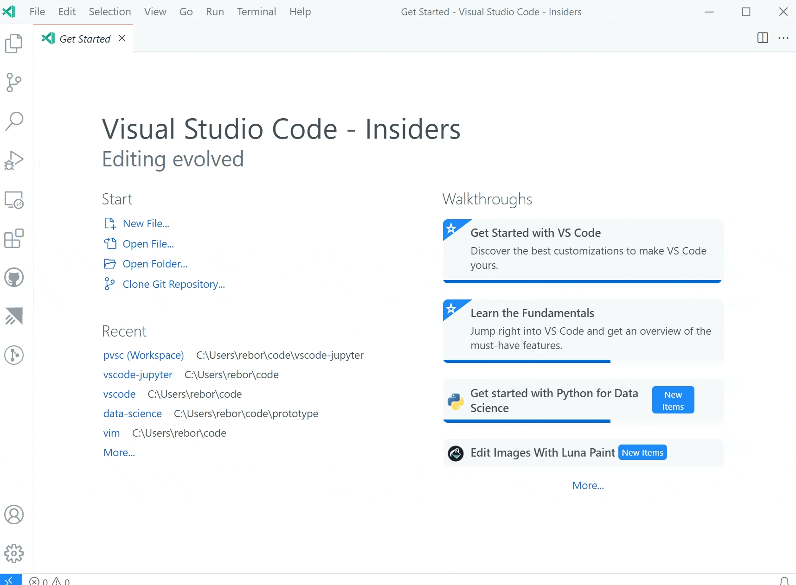

# September 2021 (version 1.61)

**Update 1.61.1**: The update addresses these [issues](https://github.com/microsoft/vscode/issues?q=is%3Aissue+milestone%3A%22September+2021+Recovery%22+is%3Aclosed).

**Update 1.61.2**: The update addresses these [issues](https://github.com/microsoft/vscode/issues?q=is%3Aissue+milestone%3A%22September+2021+Recovery+2%22+is%3Aclosed).

<!-- DOWNLOAD_LINKS_PLACEHOLDER -->

---

Welcome to the September 2021 release of Visual Studio Code. There are many updates in this version that we hope you will like, some of the key highlights include:

* **[Split editors within the same group](#split-an-editor-without-creating-a-new-group)** - Quickly create side-by-side editors for the same file.
* **[Locked editor groups](#locked-editor-groups)** - Select editor types to automatically lock in an editor group.
* **[Better display of deleted and readonly files](#indicate-deleted-and-readonly-editors-via-decorations)** - Tab decorations highlight deleted and readonly files.
* **[Bracket pair guides](#bracket-pair-guides)** - Display vertical guides to link matching bracket pairs.
* **[Fixed terminal dimensions](#fixed-dimensions)** - Set an active terminal's width and height.
* **[Jupyter Notebook improvements](#jupyter)** - Table of Contents view, full debugging support.
* **[Platform-specific extensions](#platform-specific-extensions)** - Publish different extension versions for Windows, macOS, and Linux.
* **[Virtual Workspaces extension guide](#virtual-workspaces-extension-guide)** - Learn how to update your extension for virtual environments.
* **[Advanced container configuration](#advanced-container-configuration)** - Tips, code samples, and videos to help configure development containers.

>If you'd like to read these release notes online, go to [Updates](https://code.visualstudio.com/updates) on [code.visualstudio.com](https://code.visualstudio.com).

**Watch a highlight** of the new features in this version in the VS Code team's release party. You can find the [recording of the event](https://www.youtube.com/watch?v=G4jjCN8uQAg) on our YouTube channel.

**Insiders:** Want to try new features as soon as possible? You can download the nightly [Insiders](https://code.visualstudio.com/insiders) build and try the latest updates as soon as they are available.

## Workbench

### Split an editor without creating a new group

A new command **Split in Group** (`kb(workbench.action.splitEditorInGroup)`) was added to split an editor into two sides without requiring a second editor group. This allows you to work in two editors side by side on the same file. You can also toggle the layout between splitting vertically or horizontally via the **Toggle Layout** button as seen in the short video.


There is a new setting `workbench.editor.splitInGroupLayout` if you prefer the splitting to be either vertical or horizontal.

There are new commands to use this feature via keybindings:

* `workbench.action.splitEditorInGroup`
* `workbench.action.toggleSplitEditorInGroup`
* `workbench.action.joinEditorInGroup`
* `workbench.action.toggleSplitEditorInGroupLayout`

And to navigate between the sides:

* `workbench.action.focusFirstSideEditor`
* `workbench.action.focusSecondSideEditor`
* `workbench.action.focusOtherSideEditor`

The new color `sideBySideEditor.border` sets the color for the border to separate one side from the other.

### Locked editor groups

We introduced [locked editor groups](https://code.visualstudio.com/updates/v1_60#_locked-editor-groups) last milestone as an experimental new feature. During this milestone, the settings experience was improved allowing you to easily select an editor that should lock a group automatically when opening:


The setting is now called `workbench.editor.autoLockGroups`. Similarly, the commands related to editor group locking have been renamed and are no longer experimental:

* `workbench.action.lockEditorGroup`
* `workbench.action.unlockEditorGroup`
* `workbench.action.toggleEditorGroupLock`

### Indicate deleted and readonly editors via decorations

Opened editors can indicate whether they are readonly or whether their associated resource has been deleted from disk. This indication was given by appending "deleted" and/or "readonly" to the editor label, requiring quite a bit of space.

VS Code now uses decorations for this purpose:

* Editors with deleted resource appear with strikethrough and in red.
* Editors with readonly resources appear with a lock icon.


### Split an editor into an existing group

When you split an editor to the side, VS Code opens a new editor group, even if an existing group is present to the side. However, there are times when you want to split an editor into an already existing group.


To support this, new commands were added:

* `workbench.action.splitEditorToPreviousGroup`: Split into the previous group.
* `workbench.action.splitEditorToNextGroup`: Split into the next group.
* `workbench.action.splitEditorToAboveGroup`: Split into the group above the current one.
* `workbench.action.splitEditorToBelowGroup`: Split into the group below the current one.
* `workbench.action.splitEditorToLeftGroup`: Split into the group to the left of the current one.
* `workbench.action.splitEditorToRightGroup`: Split into the group to the right of the current one.
* `workbench.action.splitEditorToFirstGroup`: Split into first group.
* `workbench.action.splitEditorToLastGroup`: Split into last group.

### Shorter labels for diff editors

When you compare two files, the workspace relative folder path was prefixed on file names, making it hard to see the names of the files being compared.

In this release, the folder is now hidden from the label, unless both file names are the same, matching the behavior for normal editor labels.

If both file names are identical, a description is shown that hints at the folder difference:


### macOS: File menu changes

On macOS, if you select the **Open...** menu item from the **File** menu, you can open both files and folders. For new users, this may come as a surprise, and people tried to use the **Open Workspace** command to open a folder, when that menu item is specifically to open a `.code-workspace` file.

To avoid confusion, we made slight adjustments to the file menu on macOS:

* A new entry **Open Folder...** opens a folder.
* **Open Workspace...** was renamed to **Open Workspace from File...**


### Telemetry settings

There is a new telemetry setting, `telemetry.telemetryLevel` that provides higher configuration granularity and lets users select whether they want to only send error telemetry and not general usage data. The values are `on`, `error`, and `off`. The values of `on` and `error` will also enable the crash reporter.

The existing settings `telemetry.enableTelemetry` and `telemetry.enableCrashReporter` have been marked for deprecation in favor of the new `telemetry.telemetryLevel` setting but will continue to be respected.

### Minimap background transparency

It is now possible to configure the [minimap](https://code.visualstudio.com/docs/getstarted/userinterface#_minimap) background opacity independently of the minimap text's opacity using the newly added `minimap.foregroundOpacity` color.

### Updated Help menu items

With the ongoing improvements to the getting started experience, the **Help** menu items were updated to more commonly used names. This is based on learnings from new users but hopefully make it easier for everyone to find help. **Welcome** is now **Get Started**, **Introductory Videos** is **Video Tutorials**, and **Interactive Playground** became **Editor Playground**. You will find the new names in both the **Help** menu and the Command Palette. The **Help** menu also has a **Show All Commands** entry as an additional entry point to open the Command Palette.

## Editor

### Bracket pair guides

The editor now supports rudimentary bracket pair guides. Bracket pair guides use the same colors and the same algorithms as the bracket pair colorization feature. The bracket pair matching algorithms are described in detail in the recent ["Bracket pair colorization 10,000x faster"](https://code.visualstudio.com/blogs/2021/09/29/bracket-pair-colorization) blog post.

Similar to indentation guides, the active bracket pair guide is highlighted.


Bracket pair guides can be enabled by configuring the `editor.guides.bracketPairs` setting (defaults to `false`).
We will continue iterating on this feature and explore vertical guides in the next release.

### Indentation guides settings

The `editor.renderIndentGuides` and `editor.highlightActiveIndentGuide` settings have been deprecated in favor of `editor.guides.indentation` and `editor.guides.highlightActiveIndentation`.

## Source Control

### Publish or Sync "action button" for Git repositories

The Git extension now adds a new "action" button to the Source Control view, to allow you to more easily publish or sync any unpushed changes.


*Theme: [Amethyst Theme](https://marketplace.visualstudio.com/items?itemName=eamodio.amethyst-theme)*

By default, the Git extension will add a **Sync Changes** button as shown above, if there are unpushed commits, or a **Publish Changes** button if the branch hasn't yet been published. Additionally, users can customize this behavior by configuring the `git.showUnpublishedCommitsButton` setting, which defaults to `whenEmpty` so that the button will only be shown if there are unpushed commits and there are no other changes in the view.

This new action button is available as a new proposed API for Source Control extensions, see the [Proposed API section](#sourcecontrolactionbutton) below for more details.

And finally, users can completely disable the visibility of any action buttons in the Source Control view via the new `scm.showActionButton` setting, which overrides any Source Control extension's behavior.

### Increased limit on changed files display

Prior to this release, the Git extension had a hard-coded limit of 5000 changes that it could show in the Source Control view. The limit was to prevent the user from having to wait too long while VS Code processed all the changes reported by Git. This limit is now increased to 10,000 changes, and there is a new `git.statusLimit` setting to allow users to customize the limit (per repository if desired). This setting can also be set to `0` to disable the limit completely, but be aware this could cause updates to take a long time if there are lots of changes.

Additionally, we've added the following warning indicator on the input box when the limit has been exceeded.


## Terminal

### Fixed dimensions

You can now statically set terminal dimensions via the **Terminal: Set Fixed Dimensions** command (`workbench.action.terminal.setDimensions`). This is useful for cases when line wrapping can be jarring or disruptive.

The command will display a prompt where you can enter the preferred width and/or height.


### Custom title and description

Terminal names are usually the name of the process they're associated with and it can sometimes be difficult to distinguish between terminals.

You can now configure both the title and description using variables in the `terminal.integrated.tabs.title` and `terminal.integrated.tabs.description` settings.

The current default values are:

```json
{
  "terminal.integrated.tabs.title": "${process}",
  "terminal.integrated.tabs.description": "${task}${separator}${local}${separator}${cwdFolder}"
}
```

Variables available are:

* `${cwd}` - The terminal's current working directory
* `${cwdFolder}` - The terminal's current working directory.
* `${workspaceFolder}` - The workspace in which the terminal was launched.
* `${local}` - Indicates a local terminal in a remote workspace.
* `${process}` - The name of the terminal process.
* `${separator}` - A conditional separator (" - ") that only shows when surrounded by variables with values or static text.
* `${sequence}` - The name provided to xterm.js by the process.
* `${task}` - Indicates this terminal is associated with a task.

### Emoji IMEs

Emojis are now supported for Input Method Editors (IME) on macOS.


### Alt buffer active context key

Some terminal UI applications, like nano, use keyboard shortcuts that are consumed by the VS Code workbench, which limits their functionality when integrated within VS Code. A new [when clause context](https://code.visualstudio.com/api/references/when-clause-contexts) key, `TerminalContextKeys.altBufferActive`, directs keybindings to the terminal instead of the workbench when the alt buffer is active to work around this.

## Languages

### New JavaScript and TypeScript language status item

The current TypeScript version and IntelliSense state are now shown in the language Status bar item:


Previously, the TypeScript version was always shown in the Status bar. You can pin the version to restore the old behavior:


The language status item also shows the current file's `jsconfig/tsconfig` and will indicate if you are currently in [partial mode](https://code.visualstudio.com/docs/nodejs/working-with-javascript#_partial-intellisense-mode).

### IntelliSense across untitled files

All untitled JavaScript and TypeScript files are now treated as part of the same project. This means that global symbols defined in one untitled file will now show up as suggestions in others.

This better matches the behavior of on-disk files in the workspace. You can add an `import` or `export` to an untitled file to turn it into a module, which will hide its global variables from other files.

### IntelliSense across files on the web

IntelliSense now works across JavaScript and TypeScript files on [vscode.dev](https://vscode.dev) or [github.dev](https://github.dev) when VS Code is running in a browser.


Keep in mind that when VS Code is running in the browser, it only has access to your currently opened files, so VS Code cannot provide project-wide IntelliSense features such as automatic imports.

### More consistent folding of JSX tags

When you fold a JSX tag in JavaScript or TypeScript, VS Code now continues to show the closing tag:


This matches how folding works in HTML.

## Preview features

### TypeScript 4.5 support

This update includes initial support for the upcoming TypeScript 4.5 release. See the [TypeScript 4.5 beta announcement post](https://devblogs.microsoft.com/typescript/announcing-typescript-4-5-beta) for more information about the new language and tooling features. Some tooling highlights:

* Initial support for [JSX attribute completions](https://github.com/microsoft/TypeScript/issues/38891).
* More accurate reference counts for the references CodeLens.

To start using the TypeScript 4.5 nightly builds, install the [TypeScript Nightly extension](https://marketplace.visualstudio.com/items?itemName=ms-vscode.vscode-typescript-next).

Please share your feedback and let us know if you run into any bugs with TypeScript 4.5.

### Restore terminal sessions across application restarts

Terminal processes are disposed of when a VS Code window is closed. In this release, there is a new opt-in setting for recording and restoring the buffer and using it to recreate processes. Set `terminal.integrated.persistentSessionReviveProcess` to enable this.


### Toggle size terminal to content width

You can toggle the terminal width between fitting the full contents and wrapped lines via `kb(workbench.action.terminal.sizeToContentWidth)` or using the tab context menu action **Toggle Size to Content Width**.


This is similar to, and shares the keybinding with, toggling wrapped lines in the editor.

## Contributions to extensions

### Jupyter

**Table of Contents**

Table of Contents for Jupyter Notebooks can now be accessed via the command **Jupyter: Show Table of Contents** in the Command Palette. This same feature can also be accessed via an icon in the notebook toolbar.

This feature applies to all notebooks within VS Code, hence is accessible via the [Outline view](https://code.visualstudio.com/docs/getstarted/userinterface#_outline-view) in the File Explorer.


**Create new Notebooks via New File menu**

You can now create a new Jupyter Notebook using the menu item **File** > **New File...**. This menu can also be accessed from the **New File...** item on the **Get Started** page or in the Command Palette.



**Debugging**

VS Code now supports full debug features for Jupyter Notebooks. To try it out, make sure you have `ipykernel` v6+ installed as your selected kernel, set a breakpoint, and select the **Debug Cell** command.


**Remote Debugging**

You can also use **Run by Line** and debug Jupyter Notebooks using remote kernels. To try it out, connect to your remote kernel with the **Jupyter: Specify local or remote Jupyter server for connections** command, make sure you have `ipykernel` v6+ installed as your selected kernel, and use **Run by Line** or debugging as usual.

**Separate renderer extension**

Jupyter Notebook renderers have been split out into a separate extension ([Jupyter Notebook Renderers](https://marketplace.visualstudio.com/items?itemName=ms-toolsai.jupyter-renderers)), allowing users to view Notebook outputs such as plotly, vega, latex, and the like on [vscode.dev](https://vscode.dev) and [github.dev](https://github.dev).

### Python

**New Python walkthrough**

The Python extension now offers a walkthrough with some basic setup steps to improve the getting started experience for Python in VS Code.


**Improved debugging experience**

When working with workspaces without a `launch.json` configuration file, the [Python extension](https://marketplace.visualstudio.com/items?itemName=ms-python.python) would display a debugger configuration menu every time you started debugging a Python file or project. This could be particularly annoying when debugging a web application with custom arguments (such as Flask, Django, or FastAPI).

You now no longer need to choose a configuration every time you start debugging, as the first selection you make is reused for the rest of the session.

### GitHub Pull Requests and Issues

Work continues on the [GitHub Pull Requests and Issues](https://marketplace.visualstudio.com/items?itemName=GitHub.vscode-pull-request-github) extension, which allows you to work on, create, and manage pull requests and issues. Check out the [changelog for the 0.31.0](https://github.com/microsoft/vscode-pull-request-github/blob/main/CHANGELOG.md#0310) release of the extension to see the highlights.

### Remote Development

Work continues on the [Remote Development extensions](https://marketplace.visualstudio.com/items?itemName=ms-vscode-remote.vscode-remote-extensionpack), which allow you to use a container, remote machine, or the [Windows Subsystem for Linux](https://learn.microsoft.com/windows/wsl) (WSL) as a full-featured development environment.

Feature highlights in 1.61 include:

* DNS names in forwarded ports.
* Easy container additional feature selection.
* Dev Containers extension can execute CLI commands in WSL.

You can learn about new extension features and bug fixes in the [Remote Development release notes](https://github.com/microsoft/vscode-docs/blob/main/remote-release-notes/v1_61.md).

## Extension authoring

### Platform specific extensions

Extensions can now publish different VSIXs for each platform (Windows, Linux, macOS) supported by VS Code. Starting with VS Code version 1.61.0, VS Code looks for the extension package that matches the current platform. Starting with version 1.99.0, the [vsce](https://github.com/microsoft/vsce) extension publishing tool supports publishing **platform-specific extensions**.

Platform-specific extensions are useful if your extension has platform-specific libraries or dependencies, so you can control the exact binaries that are included in a platform package. A common use case is when an extension uses **native node modules**.

More about this can be found in our [platform-specific extensions documentation](https://code.visualstudio.com/api/working-with-extensions/publishing-extension#platformspecific-extensions).

### Test tags and non-error output

This month we shipped additional APIs for extensions building on the new [testing APIs](https://code.visualstudio.com/api/extension-guides/testing).

* [Test tags](https://github.com/microsoft/vscode/issues/129456) allow you to configure if and how certain tests can be run--or not.
* [Non-error output](https://github.com/microsoft/vscode/issues/129201#issuecomment-897178325) allows you to associate additional console output with specific test cases.

  Messages from the output are displayed inline, similarly to failure messages.

  

### Enable file system providers to declare a file as readonly

File system providers can now mark individual files as readonly via a new `permissions` property on the `FileStat` object by setting the value of the property to `FilePermission.Readonly`. Readonly files are not editable.

**Note:** If all files should be treated readonly, you can use the existing `isReadonly` option when calling `registerFileSystemProvider`.

### Settings editor extension categories

The Settings editor now displays a subtree for an extension's `contributes.configuration` endpoint when there are categories.

To create multiple categories, the `contributes.configuration` accepts an array of configurations, and the `title` key of each configuration is used for the section headings. There is also an `order` field, which allows categories to be reordered within the subtree.


### Type hierarchy

The API proposal for adding type hierarchy providers has been finalized.

### WebviewOptions.enableForms

The new `enableForms` property on `WebviewOptions` allows you to enable or disable forms inside webviews. For backwards compatibility, `enableForms` defaults to true if you have already set `enableScripts`. Otherwise it defaults to false.

We recommend disabling forms unless your webview content needs them.

### Terminal state

A new `state` property is exposed on the `Terminal` object, in addition to a corresponding `window.onDidChangeTerminalState` event, and indicates whether or not a terminal has been interacted with by the user. For example, an extension might want to wait until a user has interacted with the terminal to run an action.

### Running web extension tests on test data

The [@vscode/test-web](https://www.npmjs.com/package/@vscode/test-web) node module offers a CLI and API to test web extensions in Chromium, Firefox, or Webkit.

New for this milestone is the option `folderPath` to open VS Code for the Web on test data. An in-memory file system contains the resources of the given location so that tests have files to work with.

```sh
vscode-test-web --browserType=chromium --extensionDevelopmentPath=$extensionLocation $testDataLocation
```

### Updated codicons

The following new icons were added to our [codicon](https://code.visualstudio.com/api/references/icons-in-labels) library:


* `beaker-stop`
* `bracket-dot`
* `bracket-error`
* `bracket`
* `debug-continue-small`
* `graph-line`
* `graph-scatter`
* `pie-chart`

### Webview UI Toolkit for Visual Studio Code

The [Webview UI Toolkit for Visual Studio Code](https://github.com/microsoft/vscode-webview-ui-toolkit) is a component library for building [webview-based extensions](https://code.visualstudio.com/api/extension-guides/webview) in Visual Studio Code.


Features of the library include:

* **Implements the Visual Studio Code design language:** Create extensions that have a consistent look and feel with the rest of the editor.
* **Automatic support for color themes:** All components are designed with theming in mind and will automatically display the current editor theme.
* **Use any tech stack:** The library ships as a set of web components, meaning developers can use the toolkit no matter what tech stack (React, Vue, Svelte, etc.) their extension is built with.
* **Accessible out of the box:** All components ship with web standard compliant ARIA labels and keyboard navigation.

### Virtual Workspaces extension guide

There is a new [Virtual Workspaces](https://code.visualstudio.com/api/extension-guides/virtual-workspaces) extension guide to help extension authors test and update their extension when VS Code is running in virtual environments. With the introduction of extensions like [GitHub Repositories](https://marketplace.visualstudio.com/items?itemName=GitHub.remotehub), which creates its own virtual file system, and new workflows like [vscode.dev](https://vscode.dev) and [github.dev](https://github.dev), where VS Code is running in your browser, extensions can no longer assume they have direct access to an on-disk file system or platform features.

The Virtual Workspaces extension guide covers:

* Whether your extension will work in virtual workspaces without modification.
* How to update your extension to work in a virtual workspace without an on-disk file system.
* How to signal to VS Code whether to enable or disable your extension when running in a virtual workspace.

## Proposed extension APIs

Every milestone comes with new proposed APIs and extension authors can try them out. As always, we want your feedback. This is what you have to do to try out a proposed API:

* You must use Insiders because proposed APIs change frequently.
* You must have this line in the `package.json` file of your extension: `"enableProposedApi": true`.
* Copy the latest version of the [vscode.proposed.d.ts](https://github.com/microsoft/vscode/blob/main/src/vs/vscode.proposed.d.ts) file into your project's source location.

You cannot publish an extension that uses a proposed API. There may be breaking changes in the next release and we never want to break existing extensions.

### TaskPresentationOptions close property

The `close` property, which is a `presentation` property in the `tasks.json` schema, is available in the `TaskPresentationOptions` API. It functions in the same way as the matching `tasks.json` property by controlling whether the terminal will be closed upon completion of the task.

### Tabs API

There is a proposed API for reading and manipulating tabs. This unblocks common feature requests such as wanting access to the list of open resources when there is not a backing `textDocument`. You can provide feedback about this API in [issue #133532](https://github.com/microsoft/vscode/issues/133532).

### MarkdownString.supportHtml

The newly proposed `supportHtml` property on `MarkdownString` enables rendering of a safe subset of raw HTML that appears inside the Markdown text.

The `supportHtml` property defaults to `false`. When disabled, VS Code will strip out any raw HTML tags that appear in the Markdown text.

### Controller renderer scripts now use JavaScript modules

`NotebookController.rendererScripts` lets notebook controllers preload a set of JavaScript files into the notebook before any renderers are run. These scripts can initialize the notebook or define global symbols that the renderers depend on.

The renderer scripts were previously normal JavaScript files. These scripts could use a global symbol exported by VS Code to call VS Code specific APIs.

This global symbol was not discoverable and also didn't give VS Code much control over the renderer scripts themselves. To fix that, renderer scripts now use JavaScript modules that export an `activate` function. This function is passed the VS Code API:

```js
interface KernelPreloadContext {
    readonly onDidReceiveKernelMessage: Event<unknown>;
    postKernelMessage(data: unknown): void;
}

export function activate(ctx: KernelPreloadContext): Promise<void> | undefined {
    ...
}
```

This change also better aligns the renderer script from a `NotebookController` with the rendering scripts provided by a contributed [notebook renderer](https://code.visualstudio.com/api/extension-guides/notebook#notebook-renderer).

### Quick Pick keepScrollPosition property

The `keepScrollPosition` property on the `QuickPick` object that you get back from `window.createQuickPick()` has been added as a proposed API. This allows you to control whether or not the scroll position (`cursorTop`) in the Quick Pick moves back to the top of the list.

Here are a few use cases for this API:

* Implementing a "remove this item from the list" option using the proposed [`QuickPickItemButton`s](https://github.com/microsoft/vscode/pull/130519) API (for example, Ctrl/Cmd + P `x` QuickPickItemButton).
* Implementing a "toggle this item in some way" option using the proposed [`QuickPickItemButton`s](https://github.com/microsoft/vscode/pull/130519) API (for example, **Insert Snippet** command).
* Asynchronously loading items in the Quick Pick (like `setInterval` adding an item to the list by reassigning the `.items` property, where scroll shouldn't jump to the top).

Without the ability to control scroll position, every one of these operations would force the scroll position of the Quick Pick to jump up to the top of the list. The `keepScrollPosition` allows extension authors to control this behavior.

### SourceControl.actionButton

The source control API now includes a `actionButton` property on `SourceControl` object that allows SCM providers to conditionally show an "action" button below the input box. For example, the Git extension uses this new property to show a publish or sync button when there are unpushed changes.

## Language Server Protocol

A new next version of the [Language Server Protocol](https://microsoft.github.io/language-server-protocol), together with the corresponding npm modules, has been published. The new version contains a proposed implementation for type hierarchies.

## Engineering

### Switching to DOMPurify to sanitize rendered HTML

We've switched to using [DOMPurify](https://github.com/cure53/DOMPurify) internally to sanitize HTML that is rendered in the main workbench. This is mainly used for sanitizing rendered Markdown.

DOMPurify is well maintained and compliant with [trusted types](https://github.com/w3c/webappsec-trusted-types) out of the box. This switch helps protect users and gives us more confidence in enabling features such as [MarkdownString.supportHtml](#markdownstringsupporthtml).

### Using the open command for Big Sur CLI

On macOS Big Sur, we now use the open command to spawn VS Code when launched from the command line. This change allows VS Code to open as though it were launched from the macOS Dock, which fixes some issues involving entitlements.

### File watching changes

The file watcher used to detect changes to files and folders on disk changed to a [library](https://github.com/microsoft/vscode-nsfw) that can handle all of our supported platforms (Windows, Linux, macOS) and reduces the overhead of maintaining different watchers for different platforms. We plan to enable this library by default on all platforms. This iteration we enabled it on Windows and macOS, and plan to enable it on Linux shortly.

The new watcher should be faster on startup and result in fewer CPU cycles spent on large folders. One downside of using the library is that the file watcher no longer automatically detects folders in a workspace that are symbolic links on macOS. If you have such a setup, you can use the new `files.watcherInclude` setting to explicitly add symbolic link paths to include for file watching. On the upside, you can use this new setting on Windows to explicitly include symbolic link folders inside the workspace - something that was not possible before on Windows.

You should not notice any difference in your day to day work, but if file watching is broken for you, please report an issue. There is a setting `files.legacyWatcher` to enable the old watcher if you run into problems.

## Documentation

### Advanced container configuration

There is a new section covering the [Dev Containers](https://marketplace.visualstudio.com/items?itemName=ms-vscode-remote.remote-containers) extension's [advanced container configuration](https://code.visualstudio.com/remote/advancedcontainers/overview).

In the container documentation, you can learn how to:

* [Set environment variables](https://code.visualstudio.com/remote/advancedcontainers/environment-variables)
* [Mount local disk drives](https://code.visualstudio.com/remote/advancedcontainers/add-local-file-mount)
* [Add a non-root user](https://code.visualstudio.com/remote/advancedcontainers/add-nonroot-user)
* [Work with multiple containers](https://code.visualstudio.com/remote/advancedcontainers/connect-multiple-containers)
* And more...

The advanced container configuration documentation has tips and code examples for setting up your development containers as well as short [YouTube videos](https://www.youtube.com/embed/vEb7hKlagAU).

## Notable fixes

* [69665](https://github.com/microsoft/vscode/issues/69665): Terminal shows corrupt texture sometimes when resuming the OS from a sleep state
* [130407](https://github.com/microsoft/vscode/issues/130407): \[trivial\] settings>files: exclude changing pattern as (blank) won't deletable
* [133149](https://github.com/microsoft/vscode/issues/133149): Task terminal marked failed for info/warning-level problems.
* [133567](https://github.com/microsoft/vscode/issues/133567): accessibility: the labels for the top-level tree nodes in find references all just read "true"
* [133910](https://github.com/microsoft/vscode/issues/133910): Show an error when resolving shell environment fails or is timing out
* [133976](https://github.com/microsoft/vscode/issues/133976): Allow to open a `.code-workspace` via protocol URL

## Thank you

Last but certainly not least, a big _**Thank You**_ to the following people who contributed this month to VS Code:

Contributions to our issue tracking:

* [John Murray (@gjsjohnmurray)](https://github.com/gjsjohnmurray)
* [Andrii Dieiev (@IllusionMH)](https://github.com/IllusionMH)
* [CodeCrazy-ywt (@CodeCrazy-ywt)](https://github.com/CodeCrazy-ywt)
* [ArturoDent (@ArturoDent)](https://github.com/ArturoDent)
* [Alberto Santin (@albertosantini)](https://github.com/albertosantini)
* [Tarunav.BA (@TarunavBA)](https://github.com/TarunavBA)
* [Simon Chan (@yume-chan)](https://github.com/yume-chan)

Contributions to `vscode`:

* [@adaex (Aex)](https://github.com/adaex)
  * Update to latest seti-ui icon theme [PR #131856](https://github.com/microsoft/vscode/pull/131856)
  * Update to latest seti-ui icon theme [PR #132512](https://github.com/microsoft/vscode/pull/132512)
* [@aghArdeshir (aghArdeshir)](https://github.com/aghArdeshir): Remove IE-support for clipboard data [PR #133679](https://github.com/microsoft/vscode/pull/133679)
* [@AiverReaver (Ashish Vagish)](https://github.com/AiverReaver): added feature to add keybinding to Copy Command Title(fix #131350) [PR #131436](https://github.com/microsoft/vscode/pull/131436)
* [@AkatQuas (Akat)](https://github.com/AkatQuas)
  * fix(html-language-feature): remove vague statement [PR #132508](https://github.com/microsoft/vscode/pull/132508)
  * fix: early return on cancellation [PR #132523](https://github.com/microsoft/vscode/pull/132523)
* [@akosyakov (Anton Kosyakov)](https://github.com/akosyakov): apply installation options for extensions from vsix files [PR #131786](https://github.com/microsoft/vscode/pull/131786)
* [@armanio123 (Armando Aguirre)](https://github.com/armanio123): Add jsxAttributeCompletionStyle setting [PR #133920](https://github.com/microsoft/vscode/pull/133920)
* [@CGNonofr (Loïc Mangeonjean)](https://github.com/CGNonofr): Add resolveCodeAction to monaco registerCodeActionProvider [PR #133335](https://github.com/microsoft/vscode/pull/133335)
* [@crackalak (Dan Hughes)](https://github.com/crackalak): Added `ariaContainerElement` to `IStandaloneEditorConstructionOptions` [PR #131865](https://github.com/microsoft/vscode/pull/131865)
* [@crimx (CRIMX)](https://github.com/crimx): fix: correct submenu position calculation [PR #133596](https://github.com/microsoft/vscode/pull/133596)
* [@davidanthoff (David Anthoff)](https://github.com/davidanthoff): Add setKernelSpecAndLanguageInfo to ipynb ext [PR #132298](https://github.com/microsoft/vscode/pull/132298)
* [@door-bell (Tim)](https://github.com/door-bell): Fix formatting on setting workbench scroll sensitivity setting description [PR #132214](https://github.com/microsoft/vscode/pull/132214)
* [@DragWx](https://github.com/DragWx): Allow bracket pairs to share open tokens or close tokens in the colorizer [PR #132504](https://github.com/microsoft/vscode/pull/132504)
* [@fwcd (FW)](https://github.com/fwcd): Add Citation File Format (`.cff`) to the recognized YAML file extensions [PR #131323](https://github.com/microsoft/vscode/pull/131323)
* [@gjsjohnmurray (John Murray)](https://github.com/gjsjohnmurray)
  * Append hint text to placeholder if input supports history [PR #129324](https://github.com/microsoft/vscode/pull/129324)
  * Prevent duplicate '(read-only)' suffix on window title (#132127) [PR #132134](https://github.com/microsoft/vscode/pull/132134)
* [@heartacker](https://github.com/heartacker): add cmd+i (mac), ctrl+i (linux/win) as additional intellisense toggleSuggestionDetails
 [PR #131976](https://github.com/microsoft/vscode/pull/131976)
* [@IllusionMH (Andrii Dieiev)](https://github.com/IllusionMH): Fix keys used to resolve terminal settings [PR #132851](https://github.com/microsoft/vscode/pull/132851)
* [@jackos (Jack Clayton)](https://github.com/jackos): Added close field in vscode.d.ts interface TaskPresntationOptions [PR #131127](https://github.com/microsoft/vscode/pull/131127)
* [@jeanp413 (Jean Pierre)](https://github.com/jeanp413): Fixes terminal editor tab displays content from another terminal editor tab [PR #131211](https://github.com/microsoft/vscode/pull/131211)
* [@jwei98 (Justin Wei)](https://github.com/jwei98): Do not fold closing tag [PR #132316](https://github.com/microsoft/vscode/pull/132316)
* [@LEGOL2 (Sebastian Łużyński)](https://github.com/LEGOL2): Increase max file size for file comparison [PR #127860](https://github.com/microsoft/vscode/pull/127860)
* [@MarkZuber (Mark Zuber)](https://github.com/MarkZuber): Add telemetry to extension host startup success/fail [PR #131917](https://github.com/microsoft/vscode/pull/131917)
* [@MasterOdin (Matthew Peveler)](https://github.com/MasterOdin): Docs: Fix grammar on language and value docstrings [PR #132782](https://github.com/microsoft/vscode/pull/132782)
* [@matkoniecz (Mateusz Konieczny)](https://github.com/matkoniecz): recognise .geojson as json, fixes #129329 [PR #129330](https://github.com/microsoft/vscode/pull/129330)
* [@philnagel (Philipp Nagel)](https://github.com/philnagel): Recognize .pyt files in Python extension [PR #133546](https://github.com/microsoft/vscode/pull/133546)
* [@SNDST00M (SNDST00M: M.U.N.I.N)](https://github.com/SNDST00M): Allow comments in all JSON files [PR #129206](https://github.com/microsoft/vscode/pull/129206)
* [@ssigwart (Stephen Sigwart)](https://github.com/ssigwart)
  * Fix fold jumping with no parent fold [PR #130309](https://github.com/microsoft/vscode/pull/130309)
  * Make go to next/prev folding range more intuitive [PR #133363](https://github.com/microsoft/vscode/pull/133363)
  * Fix Typescript NLS JSON [PR #134179](https://github.com/microsoft/vscode/pull/134179)
* [@Suven-p (Suven-p)](https://github.com/Suven-p): Remove colorized bracket pair for plain text files [PR #132534](https://github.com/microsoft/vscode/pull/132534)
* [@Un-index](https://github.com/Un-index): Update iframe.ts [PR #132577](https://github.com/microsoft/vscode/pull/132577)
* [@utajum (Vladimir Tasic)](https://github.com/utajum): Minimap - highlight all instances of selected word [PR #132584](https://github.com/microsoft/vscode/pull/132584)
* [@youngjuning (洛竹)](https://github.com/youngjuning): fix: GetSessionOptions -> AuthenticationGetSessionOptions [PR #131644](https://github.com/microsoft/vscode/pull/131644)
* [@yume-chan (Simon Chan)](https://github.com/yume-chan)
  * fix: progress text in welcome page [PR #133812](https://github.com/microsoft/vscode/pull/133812)
  * fix: avoid stack overflow when loading bracket guides for large files [PR #134189](https://github.com/microsoft/vscode/pull/134189)
* [@goldst (Leonard Goldstein)](https://github.com/goldst): Multiple tab labels for diff editors [PR #116178](https://github.com/microsoft/vscode/pull/116178)

Contributions to `vscode-eslint`:

* [@eungyeole (Eungyeol)](https://github.com/eungyeole): Add exception to a .gitignore [PR #1332](https://github.com/microsoft/vscode-eslint/pull/1332)
* [@geekanant (Anant Patni)](https://github.com/geekanant): fix: tasks typo [PR #1342](https://github.com/microsoft/vscode-eslint/pull/1342)

Contributions to `vscode-html-languageservice`:

* [@domdomegg (Adam Jones)](https://github.com/domdomegg): Update method and formmethod HTML attrs capitalization [PR #113](https://github.com/microsoft/vscode-html-languageservice/pull/113)
* [@ssigwart (Stephen Sigwart)](https://github.com/ssigwart): Add doNotAddAttributeQuotes setting to disable automatic quotes [PR #112](https://github.com/microsoft/vscode-html-languageservice/pull/112)

Contributions to `vscode-json-languageservice`:

* [@dsherret (David Sherret)](https://github.com/dsherret): fix: clear `JsonSchemaService` local single resource cache on schema change [PR #105](https://github.com/microsoft/vscode-json-languageservice/pull/105)

Contributions to `vscode-languageserver-node`:

* [@AkatQuas (Akat)](https://github.com/AkatQuas): fix: modify some comments in jsdoc [PR #817](https://github.com/microsoft/vscode-languageserver-node/pull/817)
* [@link89](https://github.com/link89): fix import of jsonrpc module [PR #805](https://github.com/microsoft/vscode-languageserver-node/pull/805)

Contributions to `vscode-pull-request-github`:

* [@burkeholland (Burke Holland)](https://github.com/burkeholland)
  * Fixes #2259 [PR #2909](https://github.com/microsoft/vscode-pull-request-github/pull/2909)
  * Respect remote link type for upstream [PR #2929](https://github.com/microsoft/vscode-pull-request-github/pull/2929)
  * Button sizes don't look right when PR title is wrapped [PR #2966](https://github.com/microsoft/vscode-pull-request-github/pull/2966)
  * Focus border is used on assignees when it's not focused [PR #2967](https://github.com/microsoft/vscode-pull-request-github/pull/2967)
  * Create commit select horizontal padding is too high [PR #2970](https://github.com/microsoft/vscode-pull-request-github/pull/2970)
  * Fixes Tick SVG doesn't look right #2950 [PR #2971](https://github.com/microsoft/vscode-pull-request-github/pull/2971)
  * PR created x minutes ago is cut off in small tabs [PR #2985](https://github.com/microsoft/vscode-pull-request-github/pull/2985)
  * Lowercase branch names [PR #2986](https://github.com/microsoft/vscode-pull-request-github/pull/2986)
  * Skipped status check is shown as pending [PR #3005](https://github.com/microsoft/vscode-pull-request-github/pull/3005)
* [@lgarron (Lucas Garron)](https://github.com/lgarron): GitHub permalinks: Deduplicate the line number if the range is one line. [PR #2980](https://github.com/microsoft/vscode-pull-request-github/pull/2980)
* [@moshfeu (Mosh Feu)](https://github.com/moshfeu): fix: make pending checks "show" button / link accessible [PR #2972](https://github.com/microsoft/vscode-pull-request-github/pull/2972)

Contributions to `vscode-references-view`:

* [@Eskibear (Yan Zhang)](https://github.com/Eskibear): show type hierarchy [PR #71](https://github.com/microsoft/vscode-references-view/pull/71)

Contributions to `vscode-vsce`:

* [@prashantvc (Prashant Cholachagudda)](https://github.com/prashantvc): Fixed an issue where search returns ADO and VSIDE [PR #606](https://github.com/microsoft/vscode-vsce/pull/606)
* [@wangweixuan (Wang Weixuan)](https://github.com/wangweixuan): Supports repository shorthand [PR #598](https://github.com/microsoft/vscode-vsce/pull/598)
* [@youngjuning (洛竹)](https://github.com/youngjuning): chore: add defaultIgnore item [PR #614](https://github.com/microsoft/vscode-vsce/pull/614)

Contributions to `language-server-protocol`:

* [@larshp (Lars Hvam)](https://github.com/larshp): semantic highlighting range, does not return delta [PR #1345](https://github.com/microsoft/language-server-protocol/pull/1345)
* [@rcjsuen (Remy Suen)](https://github.com/rcjsuen): Reorder words to fix the grammar [PR #1347](https://github.com/microsoft/language-server-protocol/pull/1347)

Contributions to `monaco-editor-webpack-plugin`:

* [@six-ponies (马騳骉)](https://github.com/six-ponies): fix: Failed to execute 'importScripts' on 'WorkerGlobalScope': The URL xxx is invalid. [PR #160](https://github.com/microsoft/monaco-editor-webpack-plugin/pull/160)

<!-- In-product release notes styles.  Do not modify without also modifying regex in gulpfile.common.js -->
<a id="scroll-to-top" role="button" title="Scroll to top" aria-label="scroll to top" href="#"><span class="icon"></span></a>
<link rel="stylesheet" type="text/css" href="css/inproduct_releasenotes.css"/>
