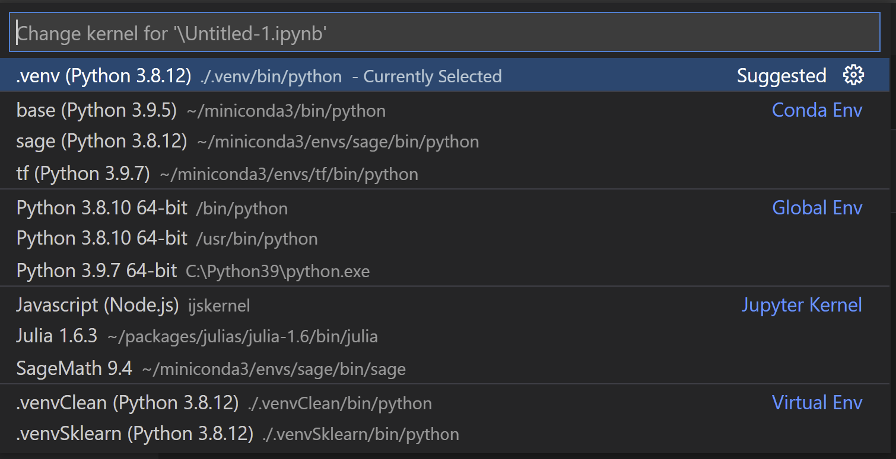
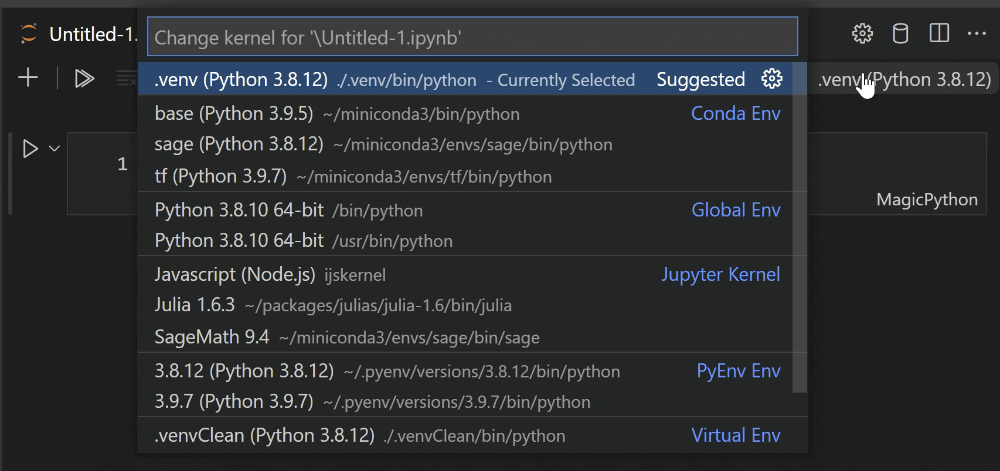

# October 2021 (version 1.62)

<!-- DOWNLOAD_LINKS_PLACEHOLDER -->

Welcome to the Insiders build. These are the preliminary notes for the October 1.62 release of Visual Studio Code. As we get closer to the release date, you'll find details below about new features and important fixes.

Until the October milestone release notes are available, you can still track our progress:

* **[October iteration plan](https://github.com/microsoft/vscode/issues/134730)** - Review what's planned for the milestone.
* **[Commit log](https://github.com/Microsoft/vscode/commits/main)** - GitHub commits to the vscode open-source repository.
* **[Closed issues](https://github.com/Microsoft/vscode/issues?q=is%3Aissue+milestone%3A%22October+2021%22+is%3Aclosed)** - Resolved bugs and implemented feature requests in the milestone.

We really appreciate people trying our new features as soon as they are ready, so check back here often and learn what's new.

If you find issues or have suggestions, you can enter them in the [VS Code repository](https://github.com/Microsoft/vscode/issues) on GitHub.

----

Welcome to the October 2021 release of Visual Studio Code. In addition to making a preview of [vscode.dev](https://vscode.dev/) available, we have announced in the [October iteration plan](https://github.com/microsoft/vscode/issues/134730) that we will focus on housekeeping GitHub issues and pull requests (see our [issue cleanup guide](https://github.com/microsoft/vscode/wiki/Issue-Grooming)). Across all of our VS Code repositories, we closed (either triaged or fixed) **4163** issues. While we closed issues, you created **2222** new issues. The main [vscode repository](https://github.com/microsoft/vscode/issues) now has **2491** open feature requests and **1246** open bugs. In addition, we closed **194** pull requests.

Same as every year, we used the [live tracker](https://vscode-issue-tracker.netlify.com/) from [Benjamin Lannon](https://github.com/lannonbr) to track our progress:


Given the focus on shipping `vscode.dev` and not everybody in the team had cycles for clean-up some of the issue clean-up will continue in November. After focusing on housekeeping, we have also addressed several feature requests and community [pull requests](#pull-requests).

## Visual Studio Code for the Web - vscode.dev (Preview)

[](https://vscode.dev) [](https://insiders.vscode.dev)

This iteration, we released a preview of Visual Studio Code for the Web. Visual Studio Code for the Web provides a free, zero-install Microsoft Visual Studio Code experience running entirely in your browser, allowing you to quickly and safely browse source code repositories and make lightweight code changes. To get started, go to [https://vscode.dev](https://vscode.dev) in your browser.

VS Code for the Web has many of the features of VS Code desktop that you love, including search and syntax highlighting while browsing and editing, along with extension support to work on your codebase and make simpler edits. In addition to opening repositories, forks, and pull requests from source control providers like GitHub and Azure Repos (in preview), you can also work with code that is stored on your local machine.

You can learn more about VS Code for the Web in our [blog post](https://aka.ms/vscode.dev-blog) and [documentation](https://aka.ms/vscode-web-docs).

We would like to say [thank you](#web-extensions) to the extension authors that already have published their extensions as [web extensions](https://code.visualstudio.com/api/extension-guides/web-extensions) so that they can run in the browser.

## Notebooks

### Find and Replace supports capturing groups

The Find and Replace widget in the notebook editor now supports regular expression capturing groups.


### Better selection of output renderers and mimetypes

Notebook cells can output multiple type of data (mimetypes) which can be rendered in different ways both by VS Code itself and extensions. Previously, VS Code has basic memoization of the selected renderer for a mimetype, and you could manually configure your preferred mimetypes using the `notebook.displayOrder` setting. However, it wasn't particularly smart about picking the best renderer for a mimetype, and preferred mimetypes had to be updated manually.

Now, preferred renderers are cached on a per-notebook type, level in the workspace. Additionally, if you switch to view a different mimetype, that preference will be updated in-memory for the VS Code session, and you can use the **Notebook: Save Mimetype Display Order** to easily update the `notebook.displayOrder` setting the working preference.

## Workbench

### Settings editor accessibility improvements

There were various Settings editor accessibility improvements this iteration:

* The Settings editor scrolls back to the top after performing a search, so the user does not end up midway through the search results after each search.
* The settings scope switcher is accessible by keyboard.
* Deprecated setting text blocks display an icon. Previously, the deprecated text was distinguished from the rest of the setting text only by being in a different colour.
* More UI elements within the Settings editor have the setting ID as their name.

### Verified extension publishers

VS Code now shows extension publishers, whose domains are verified by the Visual Studio Marketplace, using a verified indicator.


*Theme: [GitHub Light Theme](https://marketplace.visualstudio.com/items?itemName=GitHub.github-vscode-theme)*

Extension authors can reach out to [VS Code Marketplace](https://marketplace.visualstudio.com) for getting your domain verified.

### Copy multiple problems

You can now select and copy multiple problems in Problems view.

### Parameter Hint Highlight

We've updated how we highlight the current parameter in the parameter hint, which can be themed via `editorHoverWidget.highlightForeground`.


### Updated Search icons

We've aligned the search icons to be the same weight and updated the match whole word icon to be more distinguishable from the rest.


## Editor

### Improved Bracket Pair Guides

We continued iterating on bracket pair guides.
Horizontal lines now outline the scope of a bracket pair.
Also, vertical lines now depend on the indentation of the code that is surrounded by the bracket pair.


Bracket pair guides can be enabled by setting `editor.guides.bracketPairs` to `true` (defaults to `false`).
We added a third option "`active`" to only show a bracket pair guide for the active bracket pair.

The new setting `editor.guides.bracketPairsHorizontal` controls if and when to render horizontal guides (defaults to `active`).

New themable colors `editorBracketPairGuide.background{1,...,6}` and `editorBracketPairGuide.activeBackground{1,...,6}` can be used to customize the color of bracket pair guides.

### Customizable Bracket Pairs

Bracket pairs can now be configured individually for each language through settings.
`editor.language.bracketPairs` can be used to configure which brackets [should be matched](https://code.visualstudio.com/docs/editor/editingevolved#_bracket-matching).
If set, `editor.language.colorizedBracketPairs` independently configures which bracket pairs are colorized when bracket pair colorization or bracket pair guides are enabled.

```json
"[javascript]": {
    "editor.language.bracketPairs": [
        ["[", "]"],
        ["(", ")"]
    ],
    "editor.language.colorizedBracketPairs": [
        ["[", "]"]
    ]
},
```

## Languages

### Emmet improvements

For multi-root workspaces, Emmet now sources snippets from all workspace folders, rather than just the first one. As a result, custom snippets from all workspace folders will be suggested when editing an applicable file in the workspace.

The extension also activates now when one tries to run any Emmet command. This change should fix an issue where some commands were not found when run from the command palette, while also keeping the activation event list more precise so that Emmet does not start up unnecessarily, such as in an empty workspace.

Additionally, the `editor.emmet.action.updateTag` command updates the placeholder with the tag to be updated.


### Configure how HTML completes attributes

There is a new setting `html.completion.attributeDefaultValue` that lets you choose how values are filled in when a HTML attribute is completed:

* `doublequotes`: The value is placed in double quotes (default)
* `singlequotes`: The value is placed in single quotes
* `empty`: The value is left empty

## Terminal

### New default keybindings

The following keybindings were added that are typically supported in other terminals:

- `ctrl+shift+2`: Inputs the null character (`0x00`)
- `ctrl+shift+6`: Inputs the record separator character (`0x1E`)
- `ctrl+/`: Inputs the unit separator character (`0x1F`)

## Contributions to extensions

### GitHub Pull Requests and Issues

Work continues on the [GitHub Pull Requests and Issues](https://marketplace.visualstudio.com/items?itemName=GitHub.vscode-pull-request-github) extension, which allows you to work on, create, and manage pull requests and issues. Check out the [changelog for the 0.32.0](https://github.com/microsoft/vscode-pull-request-github/blob/main/CHANGELOG.md#0320) release of the extension to see the highlights.

### Jupyter

**Kernels**

In order to make it easier to identify kernels, they are now grouped in the kernel picker.



One can now filter the list of kernels displayed in the kernel picker. This filter can be applied per user or per workspace. This would prove to be an invaluable tool for those with large number of kernels in the kernel picker, as one can now ensure only a subset of the kernels are displayed for a specific workspace.

To manage the list of kernels displayed, please use the command **Jupyter: Filter Kernels** from the Command Palette.



**Interactive Window**

Automatic cell creation when running the last cells in an **Interactive Window** using `kbstyle(Shift+Enter)` can now be configured via the setting `jupyter.newCellOnRunLast`.

## Preview features

### TypeScript 4.5 support

This update support for the upcoming TypeScript 4.5 release. See the [TypeScript 4.5 beta announcement post](https://devblogs.microsoft.com/typescript/announcing-typescript-4-5-beta) for more information about the new language and tooling features. Some tooling highlights:

* [Method signature completions](https://github.com/microsoft/TypeScript/pull/46370).
* [JSX attribute completions](https://github.com/microsoft/TypeScript/issues/38891).
* More accurate reference counts for the references CodeLens.

To start using the TypeScript 4.5 nightly builds, install the [TypeScript Nightly extension](https://marketplace.visualstudio.com/items?itemName=ms-vscode.vscode-typescript-next).

Please share your feedback and let us know if you run into any bugs with TypeScript 4.5.


## Extension authoring

### Emoji support in file decorations

The [file decorations](https://github.com/microsoft/vscode/blob/9430f7848503b25ff1a629f2cb81b705e11672f5/src/vs/vscode.d.ts#L6071)-API now supports emojis as badge texts.


### MarkdownString.supportHtml

The newly `supportHtml` property on `MarkdownString` enables rendering of a safe subset of raw HTML that appears inside the Markdown text.

The `supportHtml` property defaults to `false`. When disabled, VS Code will strip out any raw HTML tags that appear in the Markdown text.

## Engineering

**TODO** Server Folder

### File watching changes

File watching in VS Code changes to a new library, thanks to the work of the Parcel team with their [@parcel/watcher](https://github.com/parcel-bundler/watcher). We will gradually roll out this change to all users in the upcoming weeks. Linux users will be happy to learn that the `files.watcherExclude` now applies natively so that the number of file handles VS Code needs to open for file watching can be greatly reduced.

The existing `files.legacyWatcher` setting was changed to an enumeration with these values:

* `on` - The new file watcher will never be used.
* `off` - The new file watcher will always be used.
* `default` - The new file watcher will only be used when you open multi-root workspaces (via `.code-workspace` file).

You should not notice any difference in your day to day work, but if file watching is broken for you, please report an issue.

### Progress for Electron sandbox support

As we continue to make the VS Code workbench ready for enabling Electron's [sandbox](https://www.electronjs.org/docs/tutorial/sandbox), we made progress on moving Node.js file services out of the workbench window into a different process. The same is true for the file watcher that no longer forks from the workbench window, but from a background process. This change is enabled by default in VS Code Insiders and will be the default in Stable for our November release.

## Notable fixes

* [73061](https://github.com/microsoft/vscode/issues/73061): Enumerable properties mixed with regular properties
* [130868](https://github.com/microsoft/vscode/issues/130868): Emmet suggestions list missing entries after adding custom snippets.json
* [131966](https://github.com/microsoft/vscode/issues/131966): Emmet unable to expand abbreviation with onclick attribute
* [135110](https://github.com/microsoft/vscode/issues/135110): Support different border settings for vertical or horizontal layouts, for in-group editor splitting

## Thank you

Last but certainly not least, a big _**Thank You**_ to the contributors of VS Code.

### Web Extensions

Extension authors for enabling their extension as [web extensions](https://code.visualstudio.com/api/extension-guides/web-extensions):

* [Prettier - Code formatter](https://marketplace.visualstudio.com/items?itemName=esbenp.prettier-vscode) ([Prettier](https://marketplace.visualstudio.com/publishers/esbenp))
* [Material Icon Theme](https://marketplace.visualstudio.com/items?itemName=PKief.material-icon-theme) ([Philipp Kief](https://marketplace.visualstudio.com/publishers/PKief))
* [YAML](https://marketplace.visualstudio.com/items?itemName=redhat.vscode-yaml) ([Red Hat](https://marketplace.visualstudio.com/publishers/redhat))
* [Path Intellisense](https://marketplace.visualstudio.com/items?itemName=christian-kohler.path-intellisense) ([Christian Kohler](https://marketplace.visualstudio.com/publishers/christian-kohler))
* [One Dark Pro](https://marketplace.visualstudio.com/items?itemName=zhuangtongfa.Material-theme) ([binaryify](https://marketplace.visualstudio.com/publishers/zhuangtongfa))
* [Color Highlight](https://marketplace.visualstudio.com/items?itemName=naumovs.color-highlight) ([Sergii Naumov](https://marketplace.visualstudio.com/publishers/naumovs))
* [markdownlint](https://marketplace.visualstudio.com/items?itemName=DavidAnson.vscode-markdownlint) ([David Anson](https://marketplace.visualstudio.com/publishers/DavidAnson))
* [oderwat.indent-rainbow](https://marketplace.visualstudio.com/items?itemName=oderwat.indent-rainbow) ([oderwat](https://marketplace.visualstudio.com/publishers/oderwat))
* [TODO Highlight](https://marketplace.visualstudio.com/items?itemName=wayou.vscode-todo-highlight) ([Wayou Liu](https://marketplace.visualstudio.com/publishers/wayou))
* [Peacock](https://marketplace.visualstudio.com/items?itemName=johnpapa.vscode-peacock) ([John Papa](https://marketplace.visualstudio.com/publishers/johnpapa))
* [IntelliJ IDEA Keybindings](https://marketplace.visualstudio.com/items?itemName=k--kato.intellij-idea-keybindings) ([Keisuke Kato](https://marketplace.visualstudio.com/publishers/k--kato))
* [PHP DocBlocker](https://marketplace.visualstudio.com/items?itemName=neilbrayfield.php-docblocker) ([Neil Brayfield](https://marketplace.visualstudio.com/publishers/neilbrayfield))
* [C# XML Documentation Comments](https://marketplace.visualstudio.com/items?itemName=k--kato.docomment) ([Keisuke Kato](https://marketplace.visualstudio.com/publishers/k--kato))
* [SCSS Formatter](https://marketplace.visualstudio.com/items?itemName=sibiraj-s.vscode-scss-formatter) ([Sibiraj](https://marketplace.visualstudio.com/publishers/sibiraj-s))
* [searKing.preview-vscode](https://marketplace.visualstudio.com/items?itemName=searKing.preview-vscode) ([Haixin Chen](https://marketplace.visualstudio.com/publishers/searKing))
* [Java Code Generators](https://marketplace.visualstudio.com/items?itemName=sohibe.java-generate-setters-getters) ([Sohibe](https://marketplace.visualstudio.com/publishers/sohibe))
* [GitHub.remotehub](https://marketplace.visualstudio.com/items?itemName=GitHub.remotehub) ([GitHub](https://marketplace.visualstudio.com/publishers/GitHub))
* [GistPad](https://marketplace.visualstudio.com/items?itemName=vsls-contrib.gistfs) ([Jonathan Carter](https://marketplace.visualstudio.com/publishers/vsls-contrib))
* [Marp for VS Code](https://marketplace.visualstudio.com/items?itemName=marp-team.marp-vscode) ([Marp team](https://marketplace.visualstudio.com/publishers/marp-team))
* [CodeTour](https://marketplace.visualstudio.com/items?itemName=vsls-contrib.codetour) ([Jonathan Carter](https://marketplace.visualstudio.com/publishers/vsls-contrib))
* [Duplicate selection or line](https://marketplace.visualstudio.com/items?itemName=geeebe.duplicate) ([Greg Bacchus](https://marketplace.visualstudio.com/publishers/geeebe))
* [GitHub Actions](https://marketplace.visualstudio.com/items?itemName=cschleiden.vscode-github-actions) ([Christopher Schleiden](https://marketplace.visualstudio.com/publishers/cschleiden))
* [Python C++ Debugger](https://marketplace.visualstudio.com/items?itemName=benjamin-simmonds.pythoncpp-debug) ([BeniBenj](https://marketplace.visualstudio.com/publishers/benjamin-simmonds))
* [WordPress Hooks IntelliSense](https://marketplace.visualstudio.com/items?itemName=johnbillion.vscode-wordpress-hooks) ([johnbillion](https://marketplace.visualstudio.com/publishers/johnbillion))
* [Markdown Checkbox](https://marketplace.visualstudio.com/items?itemName=PKief.markdown-checkbox) ([Philipp Kief](https://marketplace.visualstudio.com/publishers/PKief))
* [Awesome Emacs Keymap](https://marketplace.visualstudio.com/items?itemName=tuttieee.emacs-mcx) ([Yuichiro Tsuchiya](https://marketplace.visualstudio.com/publishers/tuttieee))
* [Date & Time](https://marketplace.visualstudio.com/items?itemName=rid9.datetime) ([rid9](https://marketplace.visualstudio.com/publishers/rid9))
* [Highlight Bad Chars](https://marketplace.visualstudio.com/items?itemName=wengerk.highlight-bad-chars) ([Kevin Wenger](https://marketplace.visualstudio.com/publishers/wengerk))
* [Bracket Lens](https://marketplace.visualstudio.com/items?itemName=wraith13.bracket-lens) ([wraith13](https://marketplace.visualstudio.com/publishers/wraith13))
* [statusbar-commands](https://marketplace.visualstudio.com/items?itemName=anweber.statusbar-commands) ([Andreas Weber](https://marketplace.visualstudio.com/publishers/anweber))
* [One Dark Theme](https://marketplace.visualstudio.com/items?itemName=mskelton.one-dark-theme) ([Mark Skelton](https://marketplace.visualstudio.com/publishers/mskelton))
* [Which Key](https://marketplace.visualstudio.com/items?itemName=VSpaceCode.whichkey) ([VSpaceCode](https://marketplace.visualstudio.com/publishers/VSpaceCode))
* [CodeSwing](https://marketplace.visualstudio.com/items?itemName=codespaces-Contrib.codeswing) ([Jonathan Carter](https://marketplace.visualstudio.com/publishers/codespaces-contrib))
* [GitLive](https://marketplace.visualstudio.com/items?itemName=TeamHub.teamhub) ([GitLive](https://marketplace.visualstudio.com/publishers/TeamHub))
* [Code Translate](https://marketplace.visualstudio.com/items?itemName=w88975.code-translate) ([w88975](https://marketplace.visualstudio.com/publishers/w88975))
* [GitHub Pull Request Nightly Build](https://marketplace.visualstudio.com/items?itemName=GitHub.vscode-pull-request-github-insiders) ([GitHub](https://marketplace.visualstudio.com/publishers/GitHub))
* [VSpaceCode](https://marketplace.visualstudio.com/items?itemName=VSpaceCode.vspacecode) ([VSpaceCode](https://marketplace.visualstudio.com/publishers/VSpaceCode))
* [GitHub Classroom](https://marketplace.visualstudio.com/items?itemName=GitHub.classroom) ([GitHub](https://marketplace.visualstudio.com/publishers/github))
* [BPMN Editor](https://marketplace.visualstudio.com/items?itemName=redhat.vscode-extension-bpmn-editor) ([Red Hat](https://marketplace.visualstudio.com/publishers/redhat))
* [Unsaved Files](https://marketplace.visualstudio.com/items?itemName=wraith13.unsaved-files-vscode) ([wraith13](https://marketplace.visualstudio.com/publishers/wraith13))
* [Unstable Ember Language Server](https://marketplace.visualstudio.com/items?itemName=lifeart.vscode-ember-unstable) ([lifeart](https://marketplace.visualstudio.com/publishers/lifeart))
* [Astro](https://marketplace.visualstudio.com/items?itemName=astro-build.astro-vscode) ([Astro](https://marketplace.visualstudio.com/publishers/astro-build))
* [DMN Editor](https://marketplace.visualstudio.com/items?itemName=redhat.vscode-extension-dmn-editor) ([Red Hat](https://marketplace.visualstudio.com/publishers/redhat))
* [Angular.io Documentation Utilities](https://marketplace.visualstudio.com/items?itemName=gkalpak.aio-docs-utils) ([George Kalpakas](https://marketplace.visualstudio.com/publishers/gkalpak))
* [SQLite Viewer](https://marketplace.visualstudio.com/items?itemName=qwtel.sqlite-viewer) ([Florian Klampfer](https://marketplace.visualstudio.com/publishers/qwtel))
* [abaplint](https://marketplace.visualstudio.com/items?itemName=larshp.vscode-abaplint) ([Lars Hvam](https://marketplace.visualstudio.com/publishers/larshp))
* [Command Variable](https://marketplace.visualstudio.com/items?itemName=rioj7.command-variable) ([rioj7](https://marketplace.visualstudio.com/publishers/rioj7))
* [Toggle Light/Dark Theme](https://marketplace.visualstudio.com/items?itemName=danielgjackson.auto-dark-mode-windows) ([Daniel Jackson](https://marketplace.visualstudio.com/publishers/danielgjackson))
* [Azure Devops Pull Requests](https://marketplace.visualstudio.com/items?itemName=ankitbko.vscode-pull-request-azdo) ([Ankit Sinha](https://marketplace.visualstudio.com/publishers/ankitbko))
* [Colemak-Vim](https://marketplace.visualstudio.com/items?itemName=ollyhayes.colmak-vim) ([Olly Hayes](https://marketplace.visualstudio.com/publishers/ollyhayes))
* [COBOL](https://marketplace.visualstudio.com/items?itemName=bitlang.cobol) ([BitLang](https://marketplace.visualstudio.com/publishers/bitlang))
* [Glimmer Templates Syntax for VS Code](https://marketplace.visualstudio.com/items?itemName=lifeart.vscode-glimmer-syntax) ([lifeart](https://marketplace.visualstudio.com/publishers/lifeart))
* [Keil Studio](https://marketplace.visualstudio.com/items?itemName=arm-debug.keil-studio-vscode) ([Arm Debug](https://marketplace.visualstudio.com/publishers/arm-debug))
* [Markdown Header Coloring](https://marketplace.visualstudio.com/items?itemName=satokaz.vscode-markdown-header-coloring) ([satokaz](https://marketplace.visualstudio.com/publishers/satokaz))
* [LuatIDE](https://marketplace.visualstudio.com/items?itemName=luater.luatide) ([luater](https://marketplace.visualstudio.com/publishers/luater))
* [Toggler](https://marketplace.visualstudio.com/items?itemName=hideoo.toggler) ([HiDeoo](https://marketplace.visualstudio.com/publishers/hideoo))
* [Dance](https://marketplace.visualstudio.com/items?itemName=gregoire.dance) ([Grégoire Geis](https://marketplace.visualstudio.com/publishers/gregoire))
* [SHADERed](https://marketplace.visualstudio.com/items?itemName=dfranx.shadered) ([dfranx](https://marketplace.visualstudio.com/publishers/dfranx))
* [Csound](https://marketplace.visualstudio.com/items?itemName=kunstmusik.csound-vscode-plugin) ([kunstmusik](https://marketplace.visualstudio.com/publishers/kunstmusik))
* [WikiLens](https://marketplace.visualstudio.com/items?itemName=lostintangent.wikilens) ([Jonathan Carter](https://marketplace.visualstudio.com/publishers/lostintangent))
* [AutoHotKey2 Language Support](https://marketplace.visualstudio.com/items?itemName=thqby.vscode-autohotkey2-lsp) ([thqby](https://marketplace.visualstudio.com/publishers/thqby))
* [Diff Viewer](https://marketplace.visualstudio.com/items?itemName=caponetto.vscode-diff-viewer) ([Guilherme Caponetto](https://marketplace.visualstudio.com/publishers/caponetto))
* [Web assets compiler](https://marketplace.visualstudio.com/items?itemName=kiennp.web-assets-compiler) ([Kien NP](https://marketplace.visualstudio.com/publishers/kiennp))
* [GehDoc.vscode-textile-preview](https://marketplace.visualstudio.com/items?itemName=GehDoc.vscode-textile-preview) ([GehDoc](https://marketplace.visualstudio.com/publishers/GehDoc))
* [Align Text Tokens](https://marketplace.visualstudio.com/items?itemName=SergeLamikhov.aligntokens) ([Serge Lamikhov-Center](https://marketplace.visualstudio.com/publishers/SergeLamikhov))
* [Starfall](https://marketplace.visualstudio.com/items?itemName=sndst00m.starfall-visual-studio-code) ([sndst00m](https://marketplace.visualstudio.com/publishers/sndst00m))
* [BlitzMax](https://marketplace.visualstudio.com/items?itemName=Hezkore.blitzmax) ([Hezkore](https://marketplace.visualstudio.com/publishers/Hezkore))
* [Print Timestamp](https://marketplace.visualstudio.com/items?itemName=snowcrash30.PrintTimestamp) ([snowcrash30](https://marketplace.visualstudio.com/publishers/snowcrash30))
* [WarpScript & FLoWS language support](https://marketplace.visualstudio.com/items?itemName=senx.warpscript-language) ([SenX](https://marketplace.visualstudio.com/publishers/senx))
* [AutoMageDev](https://marketplace.visualstudio.com/items?itemName=Webkul.automagedev) ([Webkul](https://marketplace.visualstudio.com/publishers/Webkul))
* [File Path Bar](https://marketplace.visualstudio.com/items?itemName=wraith13.file-path-bar) ([wraith13](https://marketplace.visualstudio.com/publishers/wraith13))
* [Blitz](https://marketplace.visualstudio.com/items?itemName=wraith13.blitz) ([wraith13](https://marketplace.visualstudio.com/publishers/wraith13))
* [JavaScript Assistant: Refactoring Hints & Automation](https://marketplace.visualstudio.com/items?itemName=p42ai.refactor) ([P42](https://marketplace.visualstudio.com/publishers/p42ai))
* [Type4Py](https://marketplace.visualstudio.com/items?itemName=saltud.type4py) ([Software Analytics Lab (TU Delft)](https://marketplace.visualstudio.com/publishers/saltud))
* [CompStruct VSCode](https://marketplace.visualstudio.com/items?itemName=jamestiotio.compstruct-vscode) ([James Raphael Tiovalen](https://marketplace.visualstudio.com/publishers/jamestiotio))
* [Stationeers ic10](https://marketplace.visualstudio.com/items?itemName=Traineratwot.stationeers-ic10) ([Traineratwot](https://marketplace.visualstudio.com/publishers/Traineratwot))
* [LuatOS Debug](https://marketplace.visualstudio.com/items?itemName=openluat-wendal.luatos-debug) ([OpenLuat Wendal Chen](https://marketplace.visualstudio.com/publishers/openluat-wendal))
* [SinoMCU IDE RISC8 (alpha)](https://marketplace.visualstudio.com/items?itemName=SinoMCU.IDE-RISC8) ([SinoMCU](https://marketplace.visualstudio.com/publishers/SinoMCU))
* [shuaihu.html-embedded-javascript](https://marketplace.visualstudio.com/items?itemName=shuaihu.html-embedded-javascript) ([shuaihu](https://marketplace.visualstudio.com/publishers/shuaihu))
* [Bash Options](https://marketplace.visualstudio.com/items?itemName=stenalpj.shell-script-options) ([Stenal P Jolly](https://marketplace.visualstudio.com/publishers/stenalpj))
* [PMML Editor](https://marketplace.visualstudio.com/items?itemName=redhat.vscode-extension-pmml-editor) ([Red Hat](https://marketplace.visualstudio.com/publishers/redhat))
* [Minion Debug](https://marketplace.visualstudio.com/items?itemName=VSCodeMinionPluginProject.minion) ([VSCode Minion Plugin Project](https://marketplace.visualstudio.com/publishers/VSCodeMinionPluginProject))
* [spec log](https://marketplace.visualstudio.com/items?itemName=fujidana.spec-log) ([fujidana](https://marketplace.visualstudio.com/publishers/fujidana))
* [Git Buttons](https://marketplace.visualstudio.com/items?itemName=anweber.git-buttons) ([Andreas Weber](https://marketplace.visualstudio.com/publishers/anweber))
* [Vz Keymap](https://marketplace.visualstudio.com/items?itemName=tshino.vz-like-keymap) ([tshino](https://marketplace.visualstudio.com/publishers/tshino))
* [Bulma CSS Class Completion](https://marketplace.visualstudio.com/items?itemName=reliutg.bulma-css-class-completion) ([reliutg](https://marketplace.visualstudio.com/publishers/reliutg))
* [vscode-go-by-example](https://marketplace.visualstudio.com/items?itemName=stuartleeks.vscode-go-by-example) ([Stuart Leeks](https://marketplace.visualstudio.com/publishers/stuartleeks))
* [vscode-source-map](https://marketplace.visualstudio.com/items?itemName=larshp.vscode-source-map) ([Lars Hvam](https://marketplace.visualstudio.com/publishers/larshp))
* [PHP DocBlocker](https://marketplace.visualstudio.com/items?itemName=neilbrayfield.php-docblocker-test) ([Neil Brayfield](https://marketplace.visualstudio.com/publishers/neilbrayfield))
* [atsushieno.vscode-language-mugene](https://marketplace.visualstudio.com/items?itemName=atsushieno.vscode-language-mugene) ([atsushieno](https://marketplace.visualstudio.com/publishers/atsushieno))
* [Copy-Gather-Paste](https://marketplace.visualstudio.com/items?itemName=SergeLamikhov.copy-gather-paste) ([Serge Lamikhov-Center](https://marketplace.visualstudio.com/publishers/SergeLamikhov))
* [VSCode DOSBox](https://marketplace.visualstudio.com/items?itemName=xsro.vscode-dosbox) ([clcxsrolau](https://marketplace.visualstudio.com/publishers/xsro))
* [Typescript Language Server - Multi Host mode](https://marketplace.visualstudio.com/items?itemName=asvetliakov.typescript-language-features-multi-host) ([Alexey Svetliakov](https://marketplace.visualstudio.com/publishers/asvetliakov))
* [spec command](https://marketplace.visualstudio.com/items?itemName=fujidana.spec-command) ([fujidana](https://marketplace.visualstudio.com/publishers/fujidana))
* [Visual Regex](https://marketplace.visualstudio.com/items?itemName=reliutg.visual-regex) ([reliutg](https://marketplace.visualstudio.com/publishers/reliutg))
* [spec data](https://marketplace.visualstudio.com/items?itemName=fujidana.spec-data) ([fujidana](https://marketplace.visualstudio.com/publishers/fujidana))
* [Context Menu Extra](https://marketplace.visualstudio.com/items?itemName=rioj7.context-menu-extra) ([rioj7](https://marketplace.visualstudio.com/publishers/rioj7))
* [CypressHelper](https://marketplace.visualstudio.com/items?itemName=simonaron.cypresshelper) ([Simon Áron](https://marketplace.visualstudio.com/publishers/simonaron))
* [sndst00m.vscode-native-svg-preview](https://marketplace.visualstudio.com/items?itemName=sndst00m.vscode-native-svg-preview) ([sndst00m](https://marketplace.visualstudio.com/publishers/sndst00m))
* [Pop File Money Counter](https://marketplace.visualstudio.com/items?itemName=pfwobcke.pop-file-money-counter) ([pfwobcke](https://marketplace.visualstudio.com/publishers/pfwobcke))
* [Boxdraw](https://marketplace.visualstudio.com/items?itemName=taizod1024.boxdraw-extension) ([taizod1024](https://marketplace.visualstudio.com/publishers/taizod1024))
* [Octopus Deploy](https://marketplace.visualstudio.com/items?itemName=octopusdeploy.vscode-octopusdeploy) ([Octopus Deploy](https://marketplace.visualstudio.com/publishers/OctopusDeploy))
* [Vscode Outliner](https://marketplace.visualstudio.com/items?itemName=VscodeOutliner.vscode-outliner) ([VscodeOutliner](https://marketplace.visualstudio.com/publishers/VscodeOutliner))
* [Iteria Json editor](https://marketplace.visualstudio.com/items?itemName=MartinBilansky.iteria-json-editor) ([MartinBilansky](https://marketplace.visualstudio.com/publishers/MartinBilansky))
* [quickstarts-preview](https://marketplace.visualstudio.com/items?itemName=PatternFly.quickstarts-preview) ([PatternFly](https://marketplace.visualstudio.com/publishers/PatternFly))
* [Oracle Guid Converter](https://marketplace.visualstudio.com/items?itemName=piklbojan.oracleguidconverter) ([Bojan](https://marketplace.visualstudio.com/publishers/piklbojan))
* [Hex Editor with Tags](https://marketplace.visualstudio.com/items?itemName=notblank00.hexeditor) ([Igor Gunin](https://marketplace.visualstudio.com/publishers/notblank00))
* [Simplicite VSCode tools](https://marketplace.visualstudio.com/items?itemName=SimpliciteSoftware.simplicite-vscode-tools) ([Simplicite Software](https://marketplace.visualstudio.com/publishers/simpliciteSoftware))
* [Wardlt Editor](https://marketplace.visualstudio.com/items?itemName=Wardlt.wardlt) ([Wardlt](https://marketplace.visualstudio.com/publishers/Wardlt))
* [HarmonyLang Lite](https://marketplace.visualstudio.com/items?itemName=kevinsun-dev-cornell.harmonylang-lite) ([Kevin Sun](https://marketplace.visualstudio.com/publishers/kevinsun-dev-cornell))
* [Arrow Function Snippets](https://marketplace.visualstudio.com/items?itemName=deinsoftware.arrow-function-snippets) ([dein Software](https://marketplace.visualstudio.com/publishers/deinsoftware))
* [88d88d8d8d8d8](https://marketplace.visualstudio.com/items?itemName=Thomka.88d88d8d8d8d8) ([Thomka](https://marketplace.visualstudio.com/publishers/Thomka))
* [Vouch](https://marketplace.visualstudio.com/items?itemName=vouch-dev.vouch) ([vouch-dev](https://marketplace.visualstudio.com/publishers/vouch-dev))
* [SideBar Moc](https://marketplace.visualstudio.com/items?itemName=DiamondYuan.sidebar-moc) ([DiamondYuan](https://marketplace.visualstudio.com/publishers/DiamondYuan))
* [bmwebtest - for testing - will be deleted soon](https://marketplace.visualstudio.com/items?itemName=leodevbro.bmwebtest) ([leodevbro](https://marketplace.visualstudio.com/publishers/leodevbro))
* [Tiny8BitVS](https://marketplace.visualstudio.com/items?itemName=flohofwoe.tiny8bitvs) ([flohofwoe](https://marketplace.visualstudio.com/publishers/flohofwoe))
* [Scout](https://marketplace.visualstudio.com/items?itemName=ncbradley.scout) ([Nick Bradley](https://marketplace.visualstudio.com/publishers/ncbradley))
* [海拍客codereview](https://marketplace.visualstudio.com/items?itemName=hipac.Hicr) ([hipac](https://marketplace.visualstudio.com/publishers/hipac))
* [Svelte for VS Code Web](https://marketplace.visualstudio.com/items?itemName=asafamr.svelte-web) ([Asaf Amrami](https://marketplace.visualstudio.com/publishers/asafamr))
* [Search Github Users Extension](https://marketplace.visualstudio.com/items?itemName=adarshpandeyin.search-github-users-extension) ([Adarsh Pandey](https://marketplace.visualstudio.com/publishers/adarshpandeyin))
* [blink-fs](https://marketplace.visualstudio.com/items?itemName=BlinkShellInc.blink-fs) ([Blink Shell Inc](https://marketplace.visualstudio.com/publishers/blinkshellinc))
* [wjrnjknrekwj](https://marketplace.visualstudio.com/items?itemName=wjrnjknrekwj.wjrnjknrekwj-wjrnjknrekwj) ([wjrnjknrekwj](https://marketplace.visualstudio.com/publishers/wjrnjknrekwj))
* [Package Logger](https://marketplace.visualstudio.com/items?itemName=taizod1024.package-logger) ([taizod1024](https://marketplace.visualstudio.com/publishers/taizod1024))
* [ui-builder](https://marketplace.visualstudio.com/items?itemName=PatternFly.ui-builder) ([PatternFly](https://marketplace.visualstudio.com/publishers/PatternFly))

### Issue Tracking

Contributions to our issue tracking:

* [John Murray (@gjsjohnmurray)](https://github.com/gjsjohnmurray)
* [Andrii Dieiev (@IllusionMH)](https://github.com/IllusionMH)
* [Simon Chan (@yume-chan)](https://github.com/yume-chan)
* [Lemmingh (@Lemmingh)](https://github.com/Lemmingh)
* [ArturoDent (@ArturoDent)](https://github.com/ArturoDent)

### Pull Requests

Contributions to `vscode`:

* [@a-stewart (Anthony Stewart)](https://github.com/a-stewart): Specific the map generics in history.ts explicitly [PR #134896](https://github.com/microsoft/vscode/pull/134896)
* [@a5hk (Ashkan)](https://github.com/a5hk): Adds support for separate horizontal and vertical borders for side by side editor [PR #135181](https://github.com/microsoft/vscode/pull/135181)
* [@adaex (Aex)](https://github.com/adaex): Update to latest seti-ui icon theme [PR #135484](https://github.com/microsoft/vscode/pull/135484)
* [@AiverReaver (Ashish Vagish)](https://github.com/AiverReaver): fixed minimap slider width when page is scroll horizontally. [PR #135081](https://github.com/microsoft/vscode/pull/135081)
* [@AlexStrNik (AlexStrNik)](https://github.com/AlexStrNik): Fix interactive playground's suggest widget styled everything as links [PR #90022](https://github.com/microsoft/vscode/pull/90022)
* [@asciimike (Mike McDonald)](https://github.com/asciimike): Changing port "privacy" to "visibility" to address Codespaces user confusion [PR #135193](https://github.com/microsoft/vscode/pull/135193)
* [@ashgti (John Harrison)](https://github.com/ashgti): Updating the TerminalInstance to only reigster link providers once. [PR #135419](https://github.com/microsoft/vscode/pull/135419)
* [@brajkowski (Brandon Rajkowski)](https://github.com/brajkowski): Terminal now supports linking local file paths containing '$' [PR #132027](https://github.com/microsoft/vscode/pull/132027)
* [@byteit101 (Patrick Plenefisch)](https://github.com/byteit101): Fix: Don't ignore the indent settings in advanced wrapping mode [PR #134171](https://github.com/microsoft/vscode/pull/134171)
* [@codeclown (Martti Laine)](https://github.com/codeclown): Feature: New command - Delete Duplicate Lines [PR #119480](https://github.com/microsoft/vscode/pull/119480)
* [@codingLogan (Logan Rasmussen)](https://github.com/codingLogan): Remove angle brackets when checking the scheme [PR #133419](https://github.com/microsoft/vscode/pull/133419)
* [@concatime (Issam Maghni)](https://github.com/concatime): Fix mkdir arguments order in snap [PR #135182](https://github.com/microsoft/vscode/pull/135182)
* [@cyntler (Damian Cyntler)](https://github.com/cyntler): Fix zoom-out on an image [#131080] [PR #134706](https://github.com/microsoft/vscode/pull/134706)
* [@eltociear (Ikko Ashimine)](https://github.com/eltociear): Fix typo in timelinePane.ts [PR #131356](https://github.com/microsoft/vscode/pull/131356)
* [@gabritto (Gabriela Araujo Britto)](https://github.com/gabritto): [typescript-language-features] Add includeCompletionsWithClassMemberSnippets preference [PR #136045](https://github.com/microsoft/vscode/pull/136045)
* [@Gerrit0 (Gerrit Birkeland)](https://github.com/Gerrit0): Fix codeblock detection to catch blocks not on first lines [PR #132821](https://github.com/microsoft/vscode/pull/132821)
* [@gjsjohnmurray (John Murray)](https://github.com/gjsjohnmurray)
  * Correct doc for `count` property of `SourceControl` (#117765) [PR #132242](https://github.com/microsoft/vscode/pull/132242)
  * fix #134345 - 'workpsace' typo [PR #134348](https://github.com/microsoft/vscode/pull/134348)
* [@jakevossen5 (Jake Vossen)](https://github.com/jakevossen5): Standardize captilization of "Go to" [PR #135869](https://github.com/microsoft/vscode/pull/135869)
* [@JaredNeil (Jared Neil)](https://github.com/JaredNeil): Update seti-ui for Bazel icon fix [PR #135188](https://github.com/microsoft/vscode/pull/135188)
* [@jeanp413 (Jean Pierre)](https://github.com/jeanp413)
  * Fixes feedback widget appears wrong when invoked from command palette [PR #103738](https://github.com/microsoft/vscode/pull/103738)
  * Fixes drop indicator not shown when dragging a view over panel title [PR #125438](https://github.com/microsoft/vscode/pull/125438)
  * Fix empty HoverWidget is visible at startup [PR #134752](https://github.com/microsoft/vscode/pull/134752)
* [@justanotheranonymoususer](https://github.com/justanotheranonymoususer): Option to preserve focus while showing view [PR #133682](https://github.com/microsoft/vscode/pull/133682)
* [@Lemmingh](https://github.com/Lemmingh): Add source map for every possible element in the Markdown preview [PR #134799](https://github.com/microsoft/vscode/pull/134799)
* [@martinzimmermann (Martin Zimmermann)](https://github.com/martinzimmermann): Fixes #26393 by changing the default behavior of InsertCursorAbove/Below [PR #135805](https://github.com/microsoft/vscode/pull/135805)
* [@rjc](https://github.com/rjc): Fix extended description [PR #134387](https://github.com/microsoft/vscode/pull/134387)
* [@sean-mcmanus (Sean McManus)](https://github.com/sean-mcmanus): Update package.json [PR #135050](https://github.com/microsoft/vscode/pull/135050)
* [@ssigwart (Stephen Sigwart)](https://github.com/ssigwart)
  * Add doNotAddAttributeQuotes setting to disable automatic quotes [PR #129284](https://github.com/microsoft/vscode/pull/129284)
  * Fix search editor scrolled to bottom on first search when editor group changed. [PR #134693](https://github.com/microsoft/vscode/pull/134693)
  * Search editor go to location improvements [PR #135227](https://github.com/microsoft/vscode/pull/135227)
* [@Suven-p (Suven-p)](https://github.com/Suven-p)
  * Set wordwrap to on for testingOutputPeek [PR #134347](https://github.com/microsoft/vscode/pull/134347)
  * Add tooltip for keybinding [PR #134438](https://github.com/microsoft/vscode/pull/134438)
* [@suzmue (Suzy Mueller)](https://github.com/suzmue): disassemble request fix off by one error [PR #134241](https://github.com/microsoft/vscode/pull/134241)
* [@TabithaLarkin (Tabitha Larkin)](https://github.com/TabithaLarkin): Add colorized bracket highlighting colours [PR #132494](https://github.com/microsoft/vscode/pull/132494)
* [@thebinarysearchtree (Andrew Jones)](https://github.com/thebinarysearchtree)
  * Remove backticks from word character fix [PR #135197](https://github.com/microsoft/vscode/pull/135197)
  * Handle apostrophes in TitleCaseAction [PR #135698](https://github.com/microsoft/vscode/pull/135698)
* [@Timmmm (Tim)](https://github.com/Timmmm): Add setting to control hover position [PR #127609](https://github.com/microsoft/vscode/pull/127609)
* [@timretout (Tim Retout)](https://github.com/timretout): Update desktop file cache in Debian package postinst [PR #134840](https://github.com/microsoft/vscode/pull/134840)
* [@wenfangdu (Wenfang Du)](https://github.com/wenfangdu): fix: the quick diff should respect `diffEditor.ignoreTrimWhitespace` [PR #135285](https://github.com/microsoft/vscode/pull/135285)
* [@yuehuang010 (Yue (Felix) Huang)](https://github.com/yuehuang010): Integrate Source Code into Disassembly View [PR #132541](https://github.com/microsoft/vscode/pull/132541)
* [@yume-chan (Simon Chan)](https://github.com/yume-chan): Fix a typo in npm extension package.json [PR #134856](https://github.com/microsoft/vscode/pull/134856)
* [@yuzhishuo (muduo)](https://github.com/yuzhishuo): fix: Terminal editors are always marked dirty. [PR #134861](https://github.com/microsoft/vscode/pull/134861)

Contributions to `vscode-codicons`:

* [@Profesor08](https://github.com/Profesor08): added svg-sprite generation [PR #84](https://github.com/microsoft/vscode-codicons/pull/84)

Contributions to `vscode-debugadapter-node`:

* [@friederbluemle (Frieder Bluemle)](https://github.com/friederbluemle): Fix capitalization of GitHub org [PR #235](https://github.com/microsoft/vscode-debugadapter-node/pull/235)

Contributions to `vscode-eslint`:

* [@dotansimha (Dotan Simha)](https://github.com/dotansimha): Added graphql language to ESLint-server comments [PR #1346](https://github.com/microsoft/vscode-eslint/pull/1346)
* [@jogo-](https://github.com/jogo-): 💄 Fix typo in Changelog [PR #1350](https://github.com/microsoft/vscode-eslint/pull/1350)

Contributions to `vscode-generator-code`:

* [@albinpk (Albin PK)](https://github.com/albinpk): Update comment in webpack.config.js [PR #302](https://github.com/microsoft/vscode-generator-code/pull/302)

Contributions to `vscode-js-debug`:

* [@yyyang1996 (yang)](https://github.com/yyyang1996): fix: use edge if it's the default on macOS [PR #1122](https://github.com/microsoft/vscode-js-debug/pull/1122)

Contributions to `vscode-json-languageservice`:

* [@jgraettinger (Johnny Graettinger)](https://github.com/jgraettinger): interpret `pattern`/`patternProperties` regex as Unicode [PR #111](https://github.com/microsoft/vscode-json-languageservice/pull/111)

Contributions to `vscode-languageserver-node`:

* [@AkatQuas (Akat)](https://github.com/AkatQuas)
  * fix(types): guard the `is` judgement [PR #814](https://github.com/microsoft/vscode-languageserver-node/pull/814)
  * feat: update type definition [PR #816](https://github.com/microsoft/vscode-languageserver-node/pull/816)
* [@bmewburn (Ben Mewburn)](https://github.com/bmewburn): fix unhandled promise rejection in getConfiguration [PR #760](https://github.com/microsoft/vscode-languageserver-node/pull/760)
* [@DanTup (Danny Tuppeny)](https://github.com/DanTup): Add support for textDocument/inlineValues [PR #806](https://github.com/microsoft/vscode-languageserver-node/pull/806)
* [@dc-mak (Dhruv Makwana)](https://github.com/dc-mak): Mention dependency of codeDescription on code [PR #830](https://github.com/microsoft/vscode-languageserver-node/pull/830)

Contributions to `vscode-pull-request-github`:

* [@burkeholland (Burke Holland)](https://github.com/burkeholland)
  * Fixes Commit hash should use a monospace font #2957 [PR #2968](https://github.com/microsoft/vscode-pull-request-github/pull/2968)
  * Burkeholland-issue1635 [PR #2993](https://github.com/microsoft/vscode-pull-request-github/pull/2993)
  * Title doesn't have enough horizontal space in small tabs [PR #3029](https://github.com/microsoft/vscode-pull-request-github/pull/3029)
  * Fix 2959 - Merge title box needs top margin [PR #3039](https://github.com/microsoft/vscode-pull-request-github/pull/3039)
* [@nicholas-l (Nicholas Latham)](https://github.com/nicholas-l): Allow authentication for github enterprise [PR #3064](https://github.com/microsoft/vscode-pull-request-github/pull/3064)

Contributions to `vscode-vsce`:

* [@Andrewnt219 (Andrew Nguyen)](https://github.com/Andrewnt219): feat: warn users about missing LICENSE [PR #628](https://github.com/microsoft/vscode-vsce/pull/628)
* [@felipecrs (Felipe Santos)](https://github.com/felipecrs): Migrate to GitHub Actions [PR #579](https://github.com/microsoft/vscode-vsce/pull/579)
* [@SimonSegerblomRex (Simon Segerblom Rex)](https://github.com/SimonSegerblomRex): Fix broken Dockerfile [PR #640](https://github.com/microsoft/vscode-vsce/pull/640)

Contributions to `debug-adapter-protocol`:

* [@getreu (Jens Getreu)](https://github.com/getreu): Rust: Microsoft DAP server implementation [PR #204](https://github.com/microsoft/debug-adapter-protocol/pull/204)

Contributions to `language-server-protocol`:

* [@nektro (Meghan)](https://github.com/nektro): fix the bounding box of `.anchor`s [PR #1355](https://github.com/microsoft/language-server-protocol/pull/1355)

Contributions to `monaco-languages`:

* [@arlosi (Arlo Siemsen)](https://github.com/arlosi): Rust: highlighting raw strings and fix chars with escapes [PR #167](https://github.com/microsoft/monaco-languages/pull/167)

Contributions to `node-jsonc-parser`:

* [@Marcono1234](https://github.com/Marcono1234): Improve README [PR #47](https://github.com/microsoft/node-jsonc-parser/pull/47)
* [@urish (Uri Shaked)](https://github.com/urish): readme: improve ParseOptions documentation [PR #54](https://github.com/microsoft/node-jsonc-parser/pull/54)

Contributions to `vscode-jupyter`:

* [Janosh Riebesell](https://github.com/janosh): Add setting jupyter.newCellOnRunLast [PR #7965](https://github.com/Microsoft/vscode-jupyter/pull/7965)

<!-- In-product release notes styles.  Do not modify without also modifying regex in gulpfile.common.js -->
<a id="scroll-to-top" role="button" title="Scroll to top" aria-label="scroll to top" href="#"><span class="icon"></span></a>
<link rel="stylesheet" type="text/css" href="css/inproduct_releasenotes.css"/>
