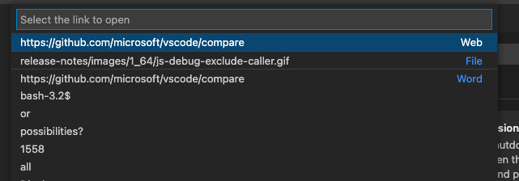

---
Order:
TOCTitle: January 2022
PageTitle: Visual Studio Code January 2022
MetaDescription: Learn what is new in the Visual Studio Code January 2022 Release (1.64)
MetaSocialImage: 1_64/release-highlights.png
Date: 2022-2-3
DownloadVersion: 1.64.2
---
# January 2022 (version 1.64)

**Update 1.64.1**: The update addresses these security [issues](https://github.com/microsoft/vscode/issues?q=is%3Aissue+milestone%3A%22January+2022+Recovery+1%22+is%3Aclosed).

**Update 1.64.2**: The update addresses these [issues](https://github.com/microsoft/vscode/issues?q=is%3Aissue+milestone%3A%22January+2022+Recovery+2%22+is%3Aclosed).

<!-- DOWNLOAD_LINKS_PLACEHOLDER -->

---

Welcome to the January 2022 release of Visual Studio Code. There are many updates in this version that we hope you will like, some of the key highlights include:

* **[New Side Panel](#new-side-panel)** - Display more views at once with the new Side Panel.
* **[Settings editor search](#settings-editor)** - Search now prioritizes whole word matches.
* **[Audio cues](#audio-cues)** - Hear when the cursor moves to folded regions, errors, and breakpoints.
* **[Unicode highlighting](#unicode-highlighting-improvements)** - Avoid highlighting characters in supported languages.
* **[Automatic terminal replies](#automatic-replies)** - Create automatic responses to common terminal prompts.
* **[Notebook UI improvements](#notebooks)** - Search text in Markdown and output cells.
* **[Debug binary data view](#viewing-and-editing-binary-data)** - View and edit binary data while debugging.
* **[Markdown path suggestions](#markdown-path-intellisense)** - Quickly insert relative file paths and header links.
* **[JS/TS surround with snippets](#surround-with-snippets-for-jsts)** - Insert selected code inside snippets.
* **[VS Code for the Web](#remote-repositories)** - Support for signed GitHub commits in vscode.dev and github.dev.

>If you'd like to read these release notes online, go to [Updates](https://code.visualstudio.com/updates) on [code.visualstudio.com](https://code.visualstudio.com).

**Watch a highlight** of the new features in this version at the VS Code team's release party. You can find the [recording of the event](https://www.youtube.com/watch?v=g2UC0FmbYSY) on our YouTube channel.

**Insiders:** Want to try new features as soon as possible? You can download the nightly [Insiders](https://code.visualstudio.com/insiders) build and try the latest updates as soon as they are available.

## Workbench

### New Side Panel

This milestone, we introduce the Side Panel, a new surface in the workbench opposite the Side Bar, where you can house views from the Side Bar or the bottom Panel. Unlike moving the bottom Panel to the left or the right of the editor, the new Side Panel works in addition to the bottom Panel so you can see more sets of views at once.

To use the Side Panel, you need to move some views over to it. Based on one of our most upvoted feature requests, you might want to move Outline view from the Side Bar to the Side Panel. You can do this by dragging and dropping the view into the Side Panel. If the Side Panel is not open, just like the bottom Panel, dragging a view to the edge of the editor area, will pop it open.

In the short video below, the Outline view is dragged to the right and dropped to create the Side Panel. The user can then switch views in the Side Bar (here opening the global Search view), while keeping the Outline view visible.


Alternatively, you can use the **Move View** command from the Command Palette, which will display a dropdown of available views. When you select a view, you can then choose the location by either creating a new Panel/Side Bar/Side Panel entry or placing the view in an existing location such as Explorer or Source Control.


Views can be drag and dropped between the Panel, Side Bar, and Side Panel by grabbing the view icon. You can reset a view's location back to its default by right-clicking on the view icon and selecting **Reset Location**.


If you'd like to reset all views back to the default layout, you can run **Views: Reset View Locations** from the Command Palette.

### Replacing Panel location

As mentioned above, the new Side Panel provides similar functionality as moving the Panel to the left or right, yet improves on this by not moving the entire contents of the original panel. Along with view drag and drop between panels, the new Side Panel is replacing the option to move the bottom Panel.

In light of that, we have deprecated the `workbench.panel.defaultLocation` setting as well as the **Move Panel** commands in favor of similar commands:

* **Move Views From Panel To Side Panel** (`workbench.action.movePanelToSidePanel`)
* **Move Views From Side Panel To Panel** (`workbench.action.moveSidePanelToPanel`)

The old **Move Panel** commands have been remapped to the new command that provides the similar behavior. Even with this mapping, we recommend updating your keybindings to the new commands.

Below, the entire bottom Panel is moved to the Side Panel and then back to the original Panel location.


### Panel alignment

Addressing another popular feature request, we have added a new layout option called Panel Alignment. This option allows you to configure how far the bottom Panel spans across your window. There are four options:

* **Center** - This is the classic behavior. The panel spans the width of the editor area only.
* **Left** - The panel will span from the left edge of the window to the right edge of the editor area.
* **Right** - The panel will span from the right edge of the window to the left edge of the editor area.
* **Justify** - The panel will span the full width of the window.

Note that with all options, the Activity Bar is considered the edge of the window.

You can configure these options in the menu under **View** > **Appearance** > **Align Panel** or using the new **Set Panel Alignment to...** commands.


### Customize Layout control

With all these new layout options, we have been exploring ways to better expose layout configuration for discoverability and ease of use. That's why you might notice a new experimental **Configure Layout** button in your title bar. This only appears if your `window.titleBarStyle` setting is `custom` (default on Windows and macOS) and `workbench.experimental.layoutControl.enabled` is set to `true`. The button visibility is controlled by an experiment, but if you want to enable it manually, you can do so by applying these setting values in the Settings editor (`kb(workbench.action.openSettings)`).


The contents of the menu are still being worked on, but currently you should see the ability to toggle the Side Bar, Panel, and Side Panel. Additionally, you will see an entry for a new command **Customize Layout**. This new command triggers a new interactive Quick Pick experience allowing you to control all aspects of layout configuration in one place.


Try it out, and let us know if you have any feedback in [issue #137633](https://github.com/microsoft/vscode/issues/137633).

### Settings editor

The Settings editor search now looks for string value matches in string and enum settings when searching.


The new search algorithm also prioritizes whole word matches, which means that if one has both the Java and JavaScript extensions, the Java settings will show up first when searching "java".


Lastly, dropdowns (such as for `files.autoSave`) and list widgets (such as for `files.associations`) in the Settings editor now work with touchscreen devices.

### Settings Sync

Settings Sync now supports synchronizing User Tasks.


The default Settings Sync machine names now include the browser and product names in VS Code for the Web.


### Explorer: Confirm and disable Undo

The File Explorer has long supported an Undo stack to revert file and folder edits (rename, cut/copy/paste, move, import, etc.). Some users find this functionality unexpected, so there is now a setting to disable Undo in the Explorer (`explorer.enableUndo`).

Additionally, a new setting (`explorer.confirmUndo`) was added to configure how frequently the Explorer will prompt for confirmation when performing an Undo. By default, the Explorer will prompt more frequently than before to ensure destructive undoing doesn't accidentally happen, but this can be changed to the old behavior with the value `"light"`, or set to `"verbose"` to prompt before all Undo actions.


## Editor

### Audio cues

Audio cues indicate if the current line has certain markers, such as errors, breakpoints, or folded text regions.

They are played when the primary cursor changes its line or the first time a marker is added to the current line. Audio cues are enabled automatically when a screen reader is attached, but can also be turned on manually by setting `audioCues.enabled` to `on`.

More audio cues are to come and we will iterate on the sound design.

### Unicode highlighting improvements

To improve the [Unicode highlighting feature](https://code.visualstudio.com/updates/v1_63#_unicode-highlighting) introduced in the November release, there are new settings to better deal with false positives.

The new setting `editor.unicodeHighlight.allowedLocales` can be used to allow characters that are common in one or many configured locales. By default, this includes the current VS Code display language and the current OS language. At the moment, only locales translated in [vscode-loc](https://github.com/microsoft/vscode-loc) Language Packs are supported.

The setting, `editor.unicodeHighlight.includeStrings`, controls whether characters in strings should be highlighted. The value is `true` by default but can be set to `false` to ignore strings.

### Editor folding limit

A new setting `editor.foldingMaximumRegions` allow users to change the maximum number of folding ranges that are shown in an editor. By default, the limit is 5000. Note that larger numbers can result in a reduced performance.

### Editor adapts to language feature timings

Extensions power almost all language features, including built-in features like folding regions, CodeLens, inlay hints, and semantic tokens. These features aren't triggered by user gestures but by typing, usually after a timeout. For instance, CodeLens updates as you type, and so does semantic tokens. The chosen timeout values had been fixed and more or less arbitrary. With this release, the editor adapts to the observed timings so that slower machines or network connections aren't overwhelmed with requests and faster machines are utilized better.

## Terminal

### Automatic replies

The terminal now features an opt-in feature to automatically reply when a specific sequence of characters is received. A good example of where this is useful is the Windows batch script message `Terminate batch job (Y/N)?` after hitting `Ctrl+C` when running a batch script. To get the terminal to automatically reply with `Y` and enter (`\r`) on `Ctrl+C` in Windows add the following setting:

```json
"terminal.integrated.autoReplies": {
  "Terminate batch job (Y/N)?": "Y\r"
}
```


_Theme: [Sapphire](https://marketplace.visualstudio.com/items?itemName=Tyriar.theme-sapphire)_

You can set up custom replies for other things, but be careful when doing this, as you are sending text to the process automatically. For example, you could use it to automatically update Oh My Zsh when prompted:

```json
"terminal.integrated.autoReplies": {
  "[Oh My Zsh] Would you like to check for updates? [Y/n]": "Y\r"
}
```

If you use [Clink](https://github.com/chrisant996/clink) and enable their similar feature, you can disable it in Clink or in VS Code by setting the reply to `null` to avoid the two features conflicting with each other:

```json
"terminal.integrated.autoReplies": {
  "Terminate batch job (Y/N)": null
}
```

### Enhanced VT support

Support for Operating System Command (OSC) 4/10/11/12 escape sequences were added that enables applications to control the terminal's theme colors.

### Keyboard navigable links

Previously, link navigation in the terminal required the use of a mouse. Now, links can be opened using only the keyboard via the following commands:

* **Terminal: Open Last Web Link...** for example, `https://github.com/microsoft/vscode`
* **Terminal: Open Last File Link...** for example, `/Users/user/repo/file.txt`
* **Terminal: Open Detected Link...** to view all links (web, file, word)



## Source Control

### More control on repository discovery

Based on community feedback, there are two new settings to better control the process of discovering Git repositories and accommodate more diverse folder structures.

* `git.repositoryScanMaxDepth` - Control the depth used when scanning.
* `git.repositoryScanIgnoredFolders` - Control the list of folders that should be ignored during scanning.

### Changes list sort improvements

A new setting (`scm.defaultViewSortKey`) controls the default sort key used for the changes list in the Source Control view. The choice for the sort key is also remembered for each folder/workspace.

The options are:

* `name` - Sort changes by filename.
* `path` - Sort changes by file path (default).
* `status` - Sort changes by source control status.

You will need to reload the VS Code window to apply the setting change.

### New Git stash command

A new command, **Git: Drop All Stashes...**, was added to the Command Palette that allows users to clear all stash entries. As with any Git operation with permanent consequences, use this command with care.

### Git Output - git commands execution time, and duration

To help track down performance issues, the Git Output channel now shows the time when a git command was executed as well as the duration of the command, excluding the time it took to spawn the child process.

## Notebooks

### Find text in rendered Markdown and code cell outputs

VS Code now supports find text in the rendered view of Markdown cells and output of code cells. The feature is disabled by default as it would require rendering of all Markdown cells and outputs, which might be costly when opening a notebook. You can turn on this feature by choosing options (**Markdown Preview**, **Code Cell Outputs**) from the filter dropdown on the Find control input box.

Currently, there are some limitations when searching text in outputs. For example, you cannot search streaming/text output rendered by VS Code itself. We plan to improve this in the next iteration.


### Cell collapsing UI

Notebook cells have a blue bar on the left side to indicate that they are focused. This bar is now interactive - you can click the top part to collapse the cell input, and the bottom part to collapse the output.


### Markdown cell fold hint

When a region of Markdown cells has been folded, a message will appear with the number of folded cells to make it more apparent that some cells are hidden.


### Cell execution hints

We made some changes to make it more obvious when a cell is executing, and which cell is executing.

First, when a cell is executing but is not scrolled into view, a progress bar will be shown at the top of the editor pane.

Second, a new button, **Go To Running Cell**, is added to the notebook toolbar when a cell is executing.

Third, if code cells are visible in the outline or breadcrumbs via the `notebook.outline.showCodeCells` and `notebook.breadcrumbs.showCodeCells` settings, they will display an animated running icon when they are executing.


## Debugging

### Viewing and editing binary data

VS Code's generic debugger now supports viewing and editing binary data (aka "memory"). Variables for which memory viewing and editing is available show an inline binary icon in the **Variables** view, and selecting it opens the [Hex Editor](https://marketplace.visualstudio.com/items?itemName=ms-vscode.hexeditor):


_Theme: [Codesong](https://marketplace.visualstudio.com/items?itemName=connor4312.codesong)_

Memory viewing and editing relies on the memory-related features of the Debug Adapter Protocol and debug extensions have to implement these features in order to enable the corresponding UI in VS Code. For details, see section [Debugger extension authoring](#debugger-extension-authoring) below. In this release, only the built-in JavaScript debugger supports viewing and editing of binary data, but we expect other debug extensions to follow soon.

### JavaScript debugging

**Exclude callers from pausing at breakpoints**

Sometimes you might set a breakpoint or add a debugger statement, but only want to pause when called from a certain code path. DOM event handlers like `mousemove` are a good example for this. In this release, the JavaScript debugger added the ability to "exclude a caller" from pausing at a breakpoint or debugger statement.

When paused at a location, you can right-click on a frame in the **CALL STACK** view and choose the **Exclude Caller** command. A new **EXCLUDED CALLERS** view will be shown to allow you to view and manage excluded callers, and afterwards your program won't pause at a breakpoint location if the excluded caller appears anywhere in its call stack.


**Edge support on Linux**

[Microsoft Edge](https://www.microsoft.com/edge) debugging is now available on Linux, via the `edge` debug type.

## Languages

### Markdown path IntelliSense

The built-in Markdown extension now includes path IntelliSense for links and images.


The paths suggestions work similarly to path IntelliSense in CSS and HTML files. Paths starting with `/` are resolved relative to the current workspace, while paths staring with `./` or without any prefix are resolved relative to the current file. Path suggestions are automatically shown when you type `/` or can be manually invoked by using `kb(editor.action.triggerSuggest)`.

Path IntelliSense can also help you link to headers within the current file or within another Markdown file. Start the path with `#` to see completions for all the headers in the file (depending on your settings, you may need to use `kb(editor.action.triggerSuggest)` to see these):


You can disable path IntelliSense with `"markdown.suggest.paths.enabled": false`.

### Markdown strikethrough support

VS Code now supports rendering `~~strikethrough~~` text in both the Markdown editor and in the built-in Markdown preview:


Strikethroughs are written by wrapping text in two tilde characters.

While all of VS Code's built-in themes support strikethroughs, some themes from the Marketplace may require an update to properly render strikethrough text in the editor.

### TS 4.5.5

VS Code now bundles TypeScript 4.5.5.

This minor update fixes a few [important crashes and tooling bugs](https://github.com/microsoft/typescript/issues?q=is%3Aissue+milestone%3A%22TypeScript+4.5.5%22+is%3Aclosed).

### Surround with snippets for JS/TS

Many of the JavaScript and TypeScript snippets have been updated to support surrounding selected text.


To use surround with, first select some text and then run **Insert Snippet**. Instead of replacing the selected text, snippets such as `if` or `forof` will now use the selected text as the body of the new statement.

### HTML auto insert quotes after equals

When typing `=` after a property in HTML, the language service now automatically inserts quotes and places the cursor between the quotes. The setting `html.completion.attributeDefaultValue` lets you specify what type of quotes (single or double) and by default uses double quotes.

The feature can be disabled by setting `"html.autoCreateQuotes": false`.

### JSON Clear schema cache command

A new command **Clear schema cache** clears the cache of previously downloaded schemas.

### LaTeX support

LaTeX basic language support has been added. This includes syntax highlighting and auto-closing pairs.


## VS Code for the Web

### Remote Repositories

**GitHub Repositories**

Commits created in VS Code for the Web are now signed and marked as **Verified** in the GitHub UI. Additionally, maintainers can now commit to pull requests submitted from forks when using VS Code for the Web. This is thanks to the new GitHub GraphQL [createCommitOnBranch](https://github.blog/changelog/2021-09-13-a-simpler-api-for-authoring-commits/) API.


Additionally, the Source Control view now supports [multiple selection](https://code.visualstudio.com/api/extension-guides/scm-provider#menus).


_Theme: [One Monokai](https://marketplace.visualstudio.com/items?itemName=azemoh.one-monokai)_

Previously, creating empty commits was only supported after cloning your GitHub repository to a local or remote machine. You can now also create empty commits in VS Code for the Web using the **GitHub Repositories: Commit Empty** command.

A new configuration was also added to enable automatically downloading the full contents of repositories below a given size to enable advanced features like whole-repository text search and **Go to Reference**. The setting `remoteHub.experimental.fs.maxAutoDownloadSize` controls the repository size limit before a prompt will be shown on attempting to download full contents. By default, `maxAutoDownloadSize` is not set, in order to never download without prompting.

**Azure Repos**

Azure Repos support has moved out of the GitHub Repositories extension into its own dedicated [extension](https://marketplace.visualstudio.com/items?itemName=ms-vscode.azure-repos) that can also be installed on desktop.

### Adopted pre-release extensions

VS Code for the Web now bundles pre-release versions of both the [GitHub Pull Request and Issues](https://marketplace.visualstudio.com/items?itemName=GitHub.vscode-pull-request-github) and [GitHub Repositories](https://marketplace.visualstudio.com/items?itemName=GitHub.remotehub) extensions.

### PWA and offline support

VS Code for the Web has adopted the PWA model and can now be installed as a PWA on the host OS. Thanks to that adoption, it is also now possible to enable some offline functionality. Having once visited [vscode.dev](https://vscode.dev) or [insiders.vscode.dev](https://insiders.vscode.dev), users can now use it to edit local files even while offline.


## Contributions to extensions

### Python

**Improved interpreter Quick Pick**

In order to make it easier to select the desired interpreter, the [Python](https://marketplace.visualstudio.com/items?itemName=ms-python.python) extension now groups interpreters by type in the **Select Interpreter** Quick Pick.


We're also experimenting with moving the active/selected interpreter in the Status bar towards the right possibly inside the language status, so check the **Python** status in the right side in case it isn't visible.

**Add support for 'conda run'**

To improve our support for [Anaconda](https://www.anaconda.com) users, we have implemented support for `conda run`, using the `--no-capture-output` parameter, which does not capture output that had caused errors in the past. This feature is implemented for executing the linter, testing, and formatting functions.

There is a known bug [issue #10972](https://github.com/conda/conda/issues/10972) that causes an error on Windows when running linting and testing with a special character in the parameters. This is due to how `conda run` reads parameters with special characters, so it can affect any command line arguments you have specified in your `settings.json`.

The Anaconda team is working on the issue and hopes to have a fix out soon. You can update your version of Anaconda on the [Conda website](https://docs.conda.io) once the new version is released.

**Smart selection and better folding support**

Improvements were also made for Python code selection and folding via the [Pylance](https://marketplace.visualstudio.com/items?itemName=ms-python.vscode-pylance) language server.

Selecting Python code using the keyboard takes fewer keystrokes as the semantic information of your code is taken into account when defining the selection range:


_Theme: [Horizon Extended](https://marketplace.visualstudio.com/items?itemName=LanceWilhelm.horizon-extended)_

As for folding, previously the regions were defined just by indentation, which was not ideal for some cases, such as multi-line strings. Now folding regions take into account semantic information appropriately, and also supports `#region` comments:


### Jupyter

**Remote Jupyter servers**

The [Jupyter](https://marketplace.visualstudio.com/items?itemName=ms-toolsai.jupyter) extension now no longer requires you to reload VS Code when switching between local and remote Jupyter servers. In addition, the extension now displays both local and remote kernels together in the kernel picker.


### Hex Editor

The [Hex Editor](https://marketplace.visualstudio.com/items?itemName=ms-vscode.hexeditor) has undergone some significant architectural refactoring. Notably, in most cases it's now able to open files of any size without performance issues. Additionally, its layout width is now configurable, and it has a more capable Find/Replace implementation. Continued improvements will be forthcoming in future iterations.

### Remote Development

Work continues on the [Remote Development extensions](https://marketplace.visualstudio.com/items?itemName=ms-vscode-remote.vscode-remote-extensionpack), which allow you to use a container, remote machine, or the [Windows Subsystem for Linux](https://learn.microsoft.com/windows/wsl) (WSL) as a full-featured development environment.

You can learn about new extension features and bug fixes in the [Remote Development release notes](https://github.com/microsoft/vscode-docs/blob/main/remote-release-notes/v1_64.md).

### GitHub Pull Requests and Issues

Work continues on the [GitHub Pull Requests and Issues](https://marketplace.visualstudio.com/items?itemName=GitHub.vscode-pull-request-github) extension, which allows you to work on, create, and manage pull requests and issues. Check out the [changelog for the 0.36.0](https://github.com/microsoft/vscode-pull-request-github/blob/main/CHANGELOG.md#0360) release of the extension to see the highlights.

## Preview features

### Terminal shell integration

The terminal now features experimental shell integration that allows VS Code to gain insights on what is going on within the terminal, which was previously unknown. When enabled using the setting `"terminal.integrated.enableShellIntegration": true`, arguments to run a shell integration script will be injected into your terminal profile if possible. The script itself mostly injects invisible sequences into your prompt, providing VS Code with information such as the location of the prompt, command, and command output, what the current working directory (cwd) is for each command, and the exit code of each command.

Using this information, we can enhance existing features in various ways:

* Detect the cwd quickly - Previously this was only possible on macOS and Linux and would launch processes or query the file system to get that information. This now also works on Windows. The cwd is used in features like link detection and inheriting the cwd when splitting a terminal tab.
* Improve the command tracking feature - This feature existed beforehand but only had default keybindings on macOS (`Cmd+Up/Down`) and used a naive approach to guess where lines were based on when `Enter` was pressed.

Shell integration enables the following new features:

* Run recent command - Since we know what commands are run, we can expose a command that allows you to view and run them again in a Quick Pick.
  
* Go to recent directory - Similar to above, we also allow navigating to past directories.
  
* Link support relative to the cwd - We now know the cwd for each line in the terminal buffer, so we can support opening links in the terminal relative to the cwd at the location where it was activated. Before, when a link was clicked, a Quick Pick would open with results from any folders containing a match for that name. Now, the exact file match will be opened. 

The goal is to turn on shell integration by default when reliability of the feature is good enough. The approach we're taking with regard to argument injection is to be as unintrusive as possible. For example, we do not modify your shell initialization scripts automatically like some terminals but instead intercept the creation of the process, inspect the arguments, and inject shell integration arguments if we are confident the terminal can run with them. The hope is to make it work well without any configuration required by the user, and to not interfere with your existing shell settings.

The current shells supported are pwsh for Windows and pwsh, bash, and zsh for Linux and macOS.

As mentioned previously, this is an experimental feature that is a little rough around the edges and there are some known issues:

* `$PS2` line continuations aren't supported yet. However, line continuations in pwsh do work.
* Right prompts aren't supported yet.
* The zsh script is known to [not activate sometimes](https://github.com/microsoft/vscode/issues/141620).
* Remote VS Code window support is limited.

### Explorer file nesting

The Explorer now has experimental support for displaying files in the same directory in a logically nested layout. This can be helpful for visually grouping related files together and collapsing files into a "root" file to reduce clutter. Several new settings have been added to control this behavior:

* `explorer.experimental.fileNesting.enabled`: Controls whether file nesting is enabled.
* `explorer.experimental.fileNesting.expand`: Controls whether file nests show as expanded by default.
* `explorer.experimental.fileNesting.patterns`: Controls how files get nested.

For example, in many repositories `.ts` files sit next to their derived `.js`, `.d.ts`, and/or `.js.map` files. While hiding derived files entirely has long been possible via `files.exclude`, it can be nice to have a quick way of accessing derived files, which is now possible with nests:

Below, the Explorer is using the default `explorer.experimental.fileNesting.patterns` configuration to nest `.js` and `.js.map` files, which are displayed when the corresponding `.ts` file is expanded.


_Theme: [GitHub Light](https://marketplace.visualstudio.com/items?itemName=GitHub.github-vscode-theme)_

## Extension authoring

### Language default icons

Language contributors can define an icon for the language.

```jsonc
{
  "contributes": {
    "languages": [
      {
        "id": "latex",
        // ...
        "icon": {
          "light": "./icons/latex-light.png",
          "dark": "./icons/latex-dark.png"
        }
      }
  ]
```

The icon is shown if the current file icon theme only has a generic file icon for the language.

Also file icon themes like `Minimal` or `None` that do not show file icons, will not use the language icon. If a file icon theme has an icon for an extension or file name, these will be preferred.

File icon themes can customize the new behavior by defining `showLanguageModeIcons: true|false` in the theme file.

* `showLanguageModeIcons: true` shows the default language icons even if the theme does not specify a file icon.
* `showLanguageModeIcons: false` prevents that default language icons are used.

### QuickPickItem separators

Extension authors now have the ability to add separators to a Quick Pick. This is useful for grouping items or adding a bit of space between items:


To add a separator to your existing Quick Pick, add a new `QuickPickItem` to your existing list of items but specify the `kind` property on the `QuickPickItem` and set it to `QuickPickItemKind.Separator`.

In the example above, you would add the following object to your list of items:

```ts
{
    label: 'APIs',
    kind: QuickPickItemKind.Separator
}
```

If you don't specify a `kind` property, or you set it to `QuickPickItemKind.Default`, the item will be treated as a normal `QuickPickItem`.

### vscode.workspace.createFileSystemWatcher now supports any path

The existing `vscode.workspace.createFileSystemWatcher` API was improved to allow you to pass in any file or folder path for file watching, even if it is outside of the workspace. Previously, the file watcher was limited to the opened folders in the workspace.

Depending on the glob pattern you pass into the method, the watcher will either be recursive (for example, `**/*.js`) or non-recursive (`*.js`). Recursive watchers require more resources, so we recommend using simple glob patterns if possible.

Example:

```ts
// Watch a folder non-recursively
vscode.workspace.createFileSystemWatcher(new vscode.RelativePattern(vscode.Uri.file(<path to folder outside workspace>), '*.js'));

// Watch the active text editor file
vscode.workspace.createFileSystemWatcher(new vscode.RelativePattern(vscode.window.activeTextEditor.document.uri, '*'));
```

**Note:** As part of this change, we made a behavioral change for existing file watchers. A file watcher that is instructed with just a glob pattern (for example, `vscode.workspace.createFileSystemWatcher('**')`) will no longer receive events for files that changed outside of the workspace. It will only receive file events from paths that are inside the workspace. If the user does not have an open workspace, no event will be delivered via this method anymore. This was done to ensure that extensions do not receive unexpected events from outside the workspace.

### vscode.TerminalLocation

You can specify where an extension terminal will be created with the new [TerminalLocation](https://github.com/microsoft/vscode/blob/1a57cb85407249f380f0ebfb34c748a960e5430a/src/vscode-dts/vscode.d.ts#L9807) API.

This enables creating a split terminal by providing a [parentTerminal](https://github.com/microsoft/vscode/blob/1a57cb85407249f380f0ebfb34c748a960e5430a/src/vscode-dts/vscode.d.ts#L6012), choosing between the [editor area and the panel](https://github.com/microsoft/vscode/blob/1a57cb85407249f380f0ebfb34c748a960e5430a/src/vscode-dts/vscode.d.ts#L5978), and more.

### Cancellation token for onWill events

The VS Code API exposes events to participate in file operations, like [onWillRenameFiles](https://github.com/microsoft/vscode/blob/f30dba54302d2c00356e90604ec27aceeeb38bb5/src/vscode-dts/vscode.d.ts#L11375). This participation can be long-running and therefore users can cancel it. With this release, user-side cancellation can be observed by extensions via a cancellation token on the corresponding event, for example [FileWillRenameEvent#token](https://github.com/microsoft/vscode/blob/f30dba54302d2c00356e90604ec27aceeeb38bb5/src/vscode-dts/vscode.d.ts#L10738). This allows extensions to cancel expensive downlevel operations as well.

### Git extension APIs

* A new `Repository.add` method has been added, to enable the ability to stage files.
* The `Repository.tag` and `Repository.deleteTag` methods were added to enable the ability to create and delete tags.

### onTaskType activation event

Extension that provide tasks can limit their unneeded activations by using the new `onTaskType:foo` activation event. This is an improvement over activating on `onCommand:workbench.action.tasks.runTask` as `workbench.action.tasks.runTask` is usually too eager for task providing extensions.

## Debugger extension authoring

### VS Code now implements the memory-related features of the Debug Adapter Protocol

In this release, VS Code has started to support viewing and editing binary data by supporting the following memory-related features of the [Debug Adapter Protocol](https://microsoft.github.io/debug-adapter-protocol):

* VS Code honor's the `memoryReference` attribute on DAP variables and announces this by passing the client capability `supportsMemoryReferences` to the debug adapter.
* If VS Code receives the capability `supportsReadMemoryRequest` from a debug adapter, it will enable the UI for viewing binary data and will issue `readMemory` requests to retrieve the data.
* If VS Code receives the capability `supportsWriteMemoryRequest` from a debug adapter, it will enable the UI for editing binary data and will issue `writeMemory` requests to store the data.
* VS Code handles the `memory` event and announces this by passing the client capability `supportsMemoryEvent` to the debug adapter.

## Language Server Protocol

A new next version of the [Language Server Protocol](https://microsoft.github.io/language-server-protocol), together with the corresponding npm modules, has been published. The version contains a proposed implementation for notebook documents. The specification part can be read [here](https://github.dev/microsoft/vscode-languageserver-node/blob/f50f66b6766d3c9ca9aebca132dd543537f26da4/protocol/src/common/proposed.notebooks.md#L1).

## Proposed extension APIs

Every milestone comes with new proposed APIs and extension authors can try them out. As always, we want your feedback. Here are the steps to try out a proposed API:

1. [Find a proposal that you want to try](https://github.com/microsoft/vscode/tree/main/src/vscode-dts) and add its name to `package.json#enabledApiProposals`.
1. Use the latest [vscode-dts](https://www.npmjs.com/package/vscode-dts) and run `vscode-dts dev`. It will download the corresponding `d.ts` files into your workspace.
1. You can now program against the proposal.

You cannot publish an extension that uses a proposed API. There may be breaking changes in the next release and we never want to break existing extensions.

### Disable terminal persistence

When creating a terminal, you can opt out of terminal persistence on restart and reload by setting `disablePersistence` in `TerminalOptions` or `ExtensionTerminalOptions`.

```ts
export interface TerminalOptions {
  disablePersistence?: boolean;
}
```

### Inlay hint API

This is a shout out to everyone who's interested in the inlay hints API. It is nearing completion and has added support for interactive label parts. Those allow you to bind a source code location to hints that in return enables features like code navigation. Also, commands are now supported. The latest state and development of this proposal is here: [vscode.proposed.inlayHints.d.ts](https://github.com/microsoft/vscode/blob/1.64.0/src/vscode-dts/vscode.proposed.inlayHints.d.ts)

### Language status API

The language status item API is planned for finalization. Please try it out and provide feedback for [vscode.proposed.languageStatus.d.ts](https://github.com/microsoft/vscode/blob/1.64.0/src/vscode-dts/vscode.proposed.languageStatus.d.ts)

### Testing Proposals

We're proposing an official way to implement a "refresh" handler for tests, check out [vscode.proposed.testRefresh.d.ts](https://github.com/microsoft/vscode/blob/1.64.0/src/vscode-dts/vscode.proposed.testRefresh.d.ts). This will allow extensions to unify behind a standard "refresh" button in VS Code and avoid implementing their own.

Additionally, we propose that `TestItem` have a `sortText` attribute in [vscode.proposed.testSortText.d.ts](https://github.com/microsoft/vscode/blob/1.64.0/src/vscode-dts/vscode.proposed.testSortText.d.ts).

### Inline completions: Automatic bracket completion

When an extension provides an inline completion item, it can set its property `completeBracketPairs` to `true`. If set, VS Code tries to repair invalid brackets in the completion text by closing or removing them, before the inline completion is shown to the user.

### Tree drag and drop proposal supports dragging into the editor

The tree drag and drop proposal is almost ready for finalization and now supports dragging from a tree view into an editor when the `"resourceurls"` mime type is supported by the `TreeDragAndDropController`. Details are available in [issue #141418](https://github.com/microsoft/vscode/issues/141418#issuecomment-1021184968). Try it out and provide feedback for [vscode.proposed.treeViewDragAndDrop.d.ts](https://github.com/Microsoft/vscode/blob/1.64.0/src/vscode-dts/vscode.proposed.treeViewDragAndDrop.d.ts).

### Comment timestamp

The commenting API has a new `timestamp` property on `Comment`. Along with the API is a new setting to control how comment timestamps are displayed: `comments.useRelativeTime`. Please try it out and provide feedback for [vscode.proposed.commentTimestamp.d.ts](https://github.com/Microsoft/vscode/blob/1.64.0/src/vscode-dts/vscode.proposed.commentTimestamp.d.ts).

## Engineering

### vscode-bisect tool

A new tool for bisecting released VS Code Insiders versions (web and desktop) is available to help diagnose issues:

```sh
npx vscode-bisect
```


Similar to `git bisect`, `vscode-bisect` will launch a range of released Insiders builds from the past, asking whether the build reproduces the issue or not. The end result is a range of commits that introduced the issue. The instance will use a dedicated fresh folder for user data to not impact your main development environment.

### Run Code Web & Server from sources

The scripts to run VS Code for the Web and VS Code Server from sources has moved to the `scripts` folder:

* `./scripts/code-web.sh|bat` starts Code for the Web (aka "serverless)" from sources and opens a browser on it. Use `--help` for more options.
* `./scripts/code-server.sh|bat` starts VS Code Server from sources. Add `--launch` to additionally open the web UI in a browser. Use `--help` for more options.
* `./scripts/test-web-integration.sh|bat` for the remote web tests.
* `./scripts/test-remote-integration.sh|bat` for the remote tests.

### Extensions

In this milestone, we improved Marketplace interactions by minimizing the number of queries VS Code makes to the service.

## Notable fixes

* [91286](https://github.com/microsoft/vscode/issues/91286) Throttling settings sync activity on the client
* [117648](https://github.com/microsoft/vscode/issues/117648) The result when "gtc" is expanded with emmet with the extension sass is strange.
* [134466](https://github.com/microsoft/vscode/issues/134466) Non-existent debugger configuration
* [135677](https://github.com/microsoft/vscode/issues/135677) Hovering over setting UI links shows # at the start
* [138072](https://github.com/microsoft/vscode/issues/138072) Store recently opened workspaces in global storage
* [138805](https://github.com/microsoft/vscode/issues/138805) Opening large binary files reads full contents
* [138850](https://github.com/microsoft/vscode/issues/138850) Opened editor can end up empty after a file change on disk
* [139880](https://github.com/microsoft/vscode/issues/139880) Debug: being asked to save a file on F5
* [140003](https://github.com/microsoft/vscode/issues/140003) Task cannot be referenced from a launch configuration that is in a different workspace folder
* [140129](https://github.com/microsoft/vscode/issues/140129) Double clicking on settings.json file results in new tabs each time
* [140560](https://github.com/microsoft/vscode/issues/140560) Problem with the VS Code Stop Debugging API
* [140967](https://github.com/microsoft/vscode/issues/140967) Comment.body rendered as Markdown, even for plain strings

## Thank you

Last but certainly not least, a big _**Thank You**_ to the contributors of VS Code.

### Web extensions

Extension authors for enabling extensions that run code as [web extensions](https://code.visualstudio.com/api/extension-guides/web-extensions) (the list below is between December 7 2021 and January 31 2022):

* [Tabulate](https://marketplace.visualstudio.com/items?itemName=a5hk.tabulate) ([a5hk](https://marketplace.visualstudio.com/publishers/a5hk))
* [Powder](https://marketplace.visualstudio.com/items?itemName=flcl42.powder) ([Alexey Osipov](https://marketplace.visualstudio.com/publishers/flcl42))
* [VCDrom](https://marketplace.visualstudio.com/items?itemName=drom.vcdrom) ([Aliaksei Chapyzhenka](https://marketplace.visualstudio.com/publishers/drom))
* [Reveal Button](https://marketplace.visualstudio.com/items?itemName=anweber.reveal-button) ([Andreas Weber](https://marketplace.visualstudio.com/publishers/anweber))
* [Digital Solutions](https://marketplace.visualstudio.com/items?itemName=AndrewTacon.digitalsolutions) ([Andrew Tacon](https://marketplace.visualstudio.com/publishers/AndrewTacon))
* [lorem ipsum](https://marketplace.visualstudio.com/items?itemName=aroary.loremipsum) ([aroary](https://marketplace.visualstudio.com/publishers/aroary))
* [Convert Selection](https://marketplace.visualstudio.com/items?itemName=ArturoDent.convert-selection) ([ArturoDent](https://marketplace.visualstudio.com/publishers/ArturoDent))
* [Custom Language Properties](https://marketplace.visualstudio.com/items?itemName=ArturoDent.custom-language-syntax) ([ArturoDent](https://marketplace.visualstudio.com/publishers/ArturoDent))
* [Find and Transform](https://marketplace.visualstudio.com/items?itemName=ArturoDent.find-and-transform) ([ArturoDent](https://marketplace.visualstudio.com/publishers/ArturoDent))
* [Launch Configs](https://marketplace.visualstudio.com/items?itemName=ArturoDent.launch-config) ([ArturoDent](https://marketplace.visualstudio.com/publishers/ArturoDent))
* [Instant Documentation](https://marketplace.visualstudio.com/items?itemName=atanasster.instant-documentation-vscode) ([atanasster](https://marketplace.visualstudio.com/publishers/atanasster))
* [Couper Configuration](https://marketplace.visualstudio.com/items?itemName=AvengaGermanyGmbH.couper) ([Avenga Germany GmbH](https://marketplace.visualstudio.com/publishers/AvengaGermanyGmbH))
* [Argdown](https://marketplace.visualstudio.com/items?itemName=christianvoigt.argdown-vscode) ([Christian Voigt](https://marketplace.visualstudio.com/publishers/christianvoigt))
* [ES7+ React/Redux/React-Native snippets](https://marketplace.visualstudio.com/items?itemName=dsznajder.es7-react-js-snippets) ([dsznajder](https://marketplace.visualstudio.com/publishers/dsznajder))
* [fantasy.markdown-all-in-one-for-web](https://marketplace.visualstudio.com/items?itemName=fantasy.markdown-all-in-one-for-web) ([fantasy](https://marketplace.visualstudio.com/publishers/fantasy))
* [fink](https://marketplace.visualstudio.com/items?itemName=fink.vscode-fink) ([fink](https://marketplace.visualstudio.com/publishers/fink))
* [GitLens (Insiders)](https://marketplace.visualstudio.com/items?itemName=eamodio.gitlens-insiders) ([GitKraken](https://marketplace.visualstudio.com/publishers/eamodio))
* [Select by Indent](https://marketplace.visualstudio.com/items?itemName=haberdashPI.vscode-select-by-indent) ([haberdashPI](https://marketplace.visualstudio.com/publishers/haberdashPI))
* [Selection Utilities](https://marketplace.visualstudio.com/items?itemName=haberdashPI.selection-utilities) ([haberdashPI](https://marketplace.visualstudio.com/publishers/haberdashPI))
* [Python-Factory Web Search](https://marketplace.visualstudio.com/items?itemName=HyunseungLee.python-factory-web-search) ([HyunseungLee](https://marketplace.visualstudio.com/publishers/HyunseungLee))
* [Custom Element Scanner (alpha)](https://marketplace.visualstudio.com/items?itemName=Jan-Kretschmer.custom-element-scanner) ([JanKretschmer](https://marketplace.visualstudio.com/publishers/Jan-Kretschmer))
* [tomato extensions](https://marketplace.visualstudio.com/items?itemName=jingjingwu.tomato-extensions) ([jingjingwu](https://marketplace.visualstudio.com/publishers/jingjingwu))
* [vscode-position](https://marketplace.visualstudio.com/items?itemName=jtr.vscode-position) ([jtr](https://marketplace.visualstudio.com/publishers/jtr))
* [KCL for vscode.dev](https://marketplace.visualstudio.com/items?itemName=kcl.kcl-vscode-web-extension) ([kcl_extension_publisher](https://marketplace.visualstudio.com/publishers/kcl))
* [KL Language support](https://marketplace.visualstudio.com/items?itemName=Kevlanche.kl-language-support) ([Kevlanche](https://marketplace.visualstudio.com/publishers/Kevlanche))
* [Systemd Helper](https://marketplace.visualstudio.com/items?itemName=hangxingliu.vscode-systemd-support) ([Liu Yue](https://marketplace.visualstudio.com/publishers/hangxingliu))
* [bett3r icons](https://marketplace.visualstudio.com/items?itemName=lcsalt.bett3r-icons) ([Lucas](https://marketplace.visualstudio.com/publishers/lcsalt))
* [xpro-snippets](https://marketplace.visualstudio.com/items?itemName=maratib.xpro-snippets) ([Maratib Ali Khan](https://marketplace.visualstudio.com/publishers/maratib))
* [Projen](https://marketplace.visualstudio.com/items?itemName=MarkMcCulloh.vscode-projen) ([MarkMcCulloh](https://marketplace.visualstudio.com/publishers/MarkMcCulloh))
* [Rainbow CSV](https://marketplace.visualstudio.com/items?itemName=mechatroner.rainbow-csv) ([mechatroner](https://marketplace.visualstudio.com/publishers/mechatroner))
* [Blogview](https://marketplace.visualstudio.com/items?itemName=mkizka.blogview-vscode) ([mkizka](https://marketplace.visualstudio.com/publishers/mkizka))
* [CodeSandpack](https://marketplace.visualstudio.com/items?itemName=mojojoji.codesandpack) ([Mojojoji](https://marketplace.visualstudio.com/publishers/mojojoji))
* [Abracadabra, refactor this!](https://marketplace.visualstudio.com/items?itemName=nicoespeon.abracadabra) ([Nicolas Carlo](https://marketplace.visualstudio.com/publishers/nicoespeon))
* [Office Script Extension](https://marketplace.visualstudio.com/items?itemName=office-script.office-script-extension) ([office-script](https://marketplace.visualstudio.com/publishers/office-script))
* [Better Fountain](https://marketplace.visualstudio.com/items?itemName=piersdeseilligny.betterfountain) ([Piers Deseilligny](https://marketplace.visualstudio.com/publishers/piersdeseilligny))
* [Dothttp Http Client](https://marketplace.visualstudio.com/items?itemName=ShivaPrasanth.dothttp-code) ([Prasanth](https://marketplace.visualstudio.com/publishers/shivaprasanth))
* [小説](https://marketplace.visualstudio.com/items?itemName=publictheta.vscode-japanese-novel) ([Public Theta](https://marketplace.visualstudio.com/publishers/publictheta))
* [bojodog](https://marketplace.visualstudio.com/items?itemName=RanolP.bojodog) ([RanolP](https://marketplace.visualstudio.com/publishers/RanolP))
* [JSON Validate](https://marketplace.visualstudio.com/items?itemName=rioj7.vscode-json-validate) ([rioj7](https://marketplace.visualstudio.com/publishers/rioj7))
* [Remove Comments](https://marketplace.visualstudio.com/items?itemName=rioj7.vscode-remove-comments) ([rioj7](https://marketplace.visualstudio.com/publishers/rioj7))
* [Everforest](https://marketplace.visualstudio.com/items?itemName=sainnhe.everforest) ([sainnhe](https://marketplace.visualstudio.com/publishers/sainnhe))
* [Gruvbox Material](https://marketplace.visualstudio.com/items?itemName=sainnhe.gruvbox-material) ([sainnhe](https://marketplace.visualstudio.com/publishers/sainnhe))
* [JetSet for VSCode](https://marketplace.visualstudio.com/items?itemName=Sudhay.jetset-for-vscode) ([Sudhay](https://marketplace.visualstudio.com/publishers/Sudhay))
* [MathJax for Markdown](https://marketplace.visualstudio.com/items?itemName=taniguchi.mathjax-for-markdown) ([TANIGUCHI Masaya](https://marketplace.visualstudio.com/publishers/taniguchi))
* [WebEnv-Client](https://marketplace.visualstudio.com/items?itemName=Theboys619.webenv-client) ([Theboys619](https://marketplace.visualstudio.com/publishers/Theboys619))
* [Graphviz Interactive Preview](https://marketplace.visualstudio.com/items?itemName=tintinweb.graphviz-interactive-preview) ([tintinweb](https://marketplace.visualstudio.com/publishers/tintinweb))
* [LLL](https://marketplace.visualstudio.com/items?itemName=tintinweb.vscode-LLL) ([tintinweb](https://marketplace.visualstudio.com/publishers/tintinweb))
* [Vyper](https://marketplace.visualstudio.com/items?itemName=tintinweb.vscode-vyper) ([tintinweb](https://marketplace.visualstudio.com/publishers/tintinweb))
* [Sourcegraph - preview](https://marketplace.visualstudio.com/items?itemName=kandalatj.sourcegraph-preview) ([TJ Kandala](https://marketplace.visualstudio.com/publishers/kandalatj))
* [Keyboard Macro Beta](https://marketplace.visualstudio.com/items?itemName=tshino.kb-macro) ([tshino](https://marketplace.visualstudio.com/publishers/tshino))
* [WakaTime](https://marketplace.visualstudio.com/items?itemName=WakaTime.vscode-wakatime) ([WakaTime](https://marketplace.visualstudio.com/publishers/WakaTime))
* [MSCode](https://marketplace.visualstudio.com/items?itemName=ms-webxt-es.mscode) ([WebXT ES](https://marketplace.visualstudio.com/publishers/ms-webxt-es))
* [DigitalJS](https://marketplace.visualstudio.com/items?itemName=yuyichao.digitaljs) ([Yichao Yu](https://marketplace.visualstudio.com/publishers/yuyichao))
* [Better Snippets](https://marketplace.visualstudio.com/items?itemName=zardoy.better-snippets) ([zardoy](https://marketplace.visualstudio.com/publishers/zardoy))
* [Fix All JSON](https://marketplace.visualstudio.com/items?itemName=zardoy.fix-all-json) ([zardoy](https://marketplace.visualstudio.com/publishers/zardoy))
* [Zardoy Experiments](https://marketplace.visualstudio.com/items?itemName=zardoy.zardoy-experiments) ([zardoy](https://marketplace.visualstudio.com/publishers/zardoy))

### Issue tracking

Contributions to our issue tracking:

* [John Murray (@gjsjohnmurray)](https://github.com/gjsjohnmurray)
* [Andrii Dieiev (@IllusionMH)](https://github.com/IllusionMH)
* [ArturoDent (@ArturoDent)](https://github.com/ArturoDent)
* [Simon Chan (@yume-chan)](https://github.com/yume-chan)
* [heartacker (@heartacker)](https://github.com/heartacker)
* [Lemmingh (@Lemmingh)](https://github.com/Lemmingh)

### Pull requests

Contributions to `vscode`:

* [@btidor (Benjamin Tidor)](https://github.com/btidor): Fix `undefined`s in text search results [PR #141522](https://github.com/microsoft/vscode/pull/141522)
* [@ckline-tryptic (Christopher M Kline)](https://github.com/ckline-tryptic): Expose 'tag' and 'deleteTag' in git extension API [PR #123815](https://github.com/microsoft/vscode/pull/123815)
* [@DanielRosenwasser (Daniel Rosenwasser)](https://github.com/DanielRosenwasser): "Surround with" in TS/JS snippets [PR #138565](https://github.com/microsoft/vscode/pull/138565)
* [@dnicolson (Dave Nicolson)](https://github.com/dnicolson): Add singular form of bisect message [PR #137626](https://github.com/microsoft/vscode/pull/137626)
* [@eltociear (Ikko Ashimine)](https://github.com/eltociear): editors - fix typo [PR #140320](https://github.com/microsoft/vscode/pull/140320)
* [@Enzime (Michael Hoang)](https://github.com/Enzime): ripgrep: don't use deprecated flag for PCRE2 [PR #139721](https://github.com/microsoft/vscode/pull/139721)
* [@gjsjohnmurray (John Murray)](https://github.com/gjsjohnmurray)
  * fix #118617 use term 'remote' when referring to lack of upstream branch [PR #120467](https://github.com/microsoft/vscode/pull/120467)
  * Correct the description of `screencastMode.keyboardShortcutsFormat` setting (#138644) [PR #138645](https://github.com/microsoft/vscode/pull/138645)
  * Surface the maximum and minimum values for `editor.hover.delay` (#140215) [PR #140216](https://github.com/microsoft/vscode/pull/140216)
  * Support `--#region` and `--#endregion` in SQL (#141257) [PR #141264](https://github.com/microsoft/vscode/pull/141264)
* [@iamkun](https://github.com/iamkun): refactor: remove duplicate if statement [PR #140085](https://github.com/microsoft/vscode/pull/140085)
* [@imphil (Philipp Wagner)](https://github.com/imphil): Update ripgrep binaries to include ppc64le and s390x [PR #140028](https://github.com/microsoft/vscode/pull/140028)
* [@jeanp413 (Jean Pierre)](https://github.com/jeanp413)
  * Install extension with version using workbench.extensions.installExtension [PR #136314](https://github.com/microsoft/vscode/pull/136314)
  * Fixes Ctrl + Shift + {Left, Right, Home, End} is broken after a terminal is opened & closed on Firefox [PR #139615](https://github.com/microsoft/vscode/pull/139615)
  * Fixes changing keyboard layout in vscode web is broken [PR #140295](https://github.com/microsoft/vscode/pull/140295)
  * Fix connection token parsing [PR #140532](https://github.com/microsoft/vscode/pull/140532)
* [@jlelong (Jerome Lelong)](https://github.com/jlelong)
  * Basic LaTeX built-in extension [PR #138395](https://github.com/microsoft/vscode/pull/138395)
  * Update latex language grammar and configuration [PR #140801](https://github.com/microsoft/vscode/pull/140801)
* [@jzyrobert (Robert Jin)](https://github.com/jzyrobert): Update html-language-features to use doQuoteComplete [PR #137080](https://github.com/microsoft/vscode/pull/137080)
* [@KapitanOczywisty](https://github.com/KapitanOczywisty): Fix PHP update-grammar.js [PR #140619](https://github.com/microsoft/vscode/pull/140619)
* [@KendallDoesCoding (Kendall Pinto)](https://github.com/KendallDoesCoding): creating pr's section [PR #141130](https://github.com/microsoft/vscode/pull/141130)
* [@KhaledSamir (Khaled)](https://github.com/KhaledSamir): Corrected the regex to detect espaced percent symbol. [PR #139437](https://github.com/microsoft/vscode/pull/139437)
* [@lostintangent (Jonathan Carter)](https://github.com/lostintangent): [Markdown] Adding support for GitHub themed images [PR #137820](https://github.com/microsoft/vscode/pull/137820)
* [@Mai-Lapyst](https://github.com/Mai-Lapyst): Adding default fileicon support to language contributions [PR #118846](https://github.com/microsoft/vscode/pull/118846)
* [@MaxGrekhov (Max Grekhov)](https://github.com/MaxGrekhov): open editors: sort by fullPath [PR #133790](https://github.com/microsoft/vscode/pull/133790)
* [@nrayburn-tech (Nicholas Rayburn)](https://github.com/nrayburn-tech): Add Source Control View Sort to Storage [PR #123232](https://github.com/microsoft/vscode/pull/123232)
* [@OPY-bbt (zhangyan)](https://github.com/OPY-bbt): fix(suggest): only show readmore icon in focused label [PR #139792](https://github.com/microsoft/vscode/pull/139792)
* [@orta (Orta Therox)](https://github.com/orta): Allow extensions to be able to make requests to the typescript extension's tsserver via commands [PR #138279](https://github.com/microsoft/vscode/pull/138279)
* [@PieterBranderhorst](https://github.com/PieterBranderhorst): Notify user when max folds exceeded, make max folds configurable. [PR #140480](https://github.com/microsoft/vscode/pull/140480)
* [@samestep (Sam Estep)](https://github.com/samestep): Add option to not pass --no-ignore-parent to rg [PR #140022](https://github.com/microsoft/vscode/pull/140022)
* [@SeriousBug (Kaan Genç)](https://github.com/SeriousBug): hasCustomMarkdownPreview disables markdown preview buttons in context menus [PR #139241](https://github.com/microsoft/vscode/pull/139241)
* [@ShafinKhadem (Nafiur Rahman Khadem)](https://github.com/ShafinKhadem): Add an undo/redo stop at end of snippet [PR #140096](https://github.com/microsoft/vscode/pull/140096)
* [@slidoooor (Hans)](https://github.com/slidoooor)
  * fix generates different html content for the same markdown when get the cached token [PR #138935](https://github.com/microsoft/vscode/pull/138935)
  * Fix the overlap the line by a few pixels (#139311) [PR #139575](https://github.com/microsoft/vscode/pull/139575)
  * testing: add autosave before each test run [PR #141254](https://github.com/microsoft/vscode/pull/141254)
* [@smcenlly (Simon McEnlly)](https://github.com/smcenlly): testing: add new API `sortText` property to TestItem [PR #132099](https://github.com/microsoft/vscode/pull/132099)
* [@SMSadegh19 (Mohammad Sadegh Salimi)](https://github.com/SMSadegh19): Adding support for RTL languages for readme markdown preview. [PR #139644](https://github.com/microsoft/vscode/pull/139644)
* [@SNDST00M (M.U.N.I.N)](https://github.com/SNDST00M): Add `FontStyle.Strikethrough` support [PR #139413](https://github.com/microsoft/vscode/pull/139413)
* [@somebee (Sindre Aarsaether)](https://github.com/somebee): Fix decorations and mouse hit-testing when editor is scaled via transform [PR #139282](https://github.com/microsoft/vscode/pull/139282)
* [@stevenjoezhang (Mimi)](https://github.com/stevenjoezhang): Fix terminal.integrated.cwd with predefined variables [PR #137023](https://github.com/microsoft/vscode/pull/137023)
* [@Timmmm (Tim)](https://github.com/Timmmm): Fix parseAddress regex [PR #140977](https://github.com/microsoft/vscode/pull/140977)
* [@TwitchBronBron (Bronley Plumb)](https://github.com/TwitchBronBron): Fix perf issue for InstallAnotherVersionAction [PR #136992](https://github.com/microsoft/vscode/pull/136992)
* [@WaqasAliAbbasi (Waqas Ali)](https://github.com/WaqasAliAbbasi): Prevent link highlight in markdown code blocks and spans [PR #140816](https://github.com/microsoft/vscode/pull/140816)
* [@wengj9 (James Weng)](https://github.com/wengj9): Add extension information to snippet picker [PR #138880](https://github.com/microsoft/vscode/pull/138880)
* [@Yash621 (Yash Goel)](https://github.com/Yash621): code-insiders --status results in error [PR #140152](https://github.com/microsoft/vscode/pull/140152)
* [@zardoy (Vitaly)](https://github.com/zardoy): Make typings on `showInformationMessage`, `showWarningMessage`, `showErrorMessage` strict with items as strings [PR #137672](https://github.com/microsoft/vscode/pull/137672)

Contributions to `vscode-css-languageservice`:

* [@fyangstudio (yangfan)](https://github.com/fyangstudio): Feat: support new resolving import at-rules [PR #255](https://github.com/microsoft/vscode-css-languageservice/pull/255)
* [@romainmenke (Romain Menke)](https://github.com/romainmenke): css color : add support for hue rad|grad|turn [PR #257](https://github.com/microsoft/vscode-css-languageservice/pull/257)
* [@Semigradsky (Dmitry Semigradsky)](https://github.com/Semigradsky): Support case-sensitivity attribute selector [PR #259](https://github.com/microsoft/vscode-css-languageservice/pull/259)

Contributions to `vscode-eslint`:

* [@edupsousa (Eduardo Pereira de Sousa)](https://github.com/edupsousa): Allow user to ignore server errors. [PR #1375](https://github.com/microsoft/vscode-eslint/pull/1375)

Contributions to `vscode-extension-samples`:

* [@laurentlb (Laurent Le Brun)](https://github.com/laurentlb): Fix the 'Cancel' button in comment-sample [PR #492](https://github.com/microsoft/vscode-extension-samples/pull/492)

Contributions to `vscode-html-languageservice`:

* [@zuochenxue (ZuoChenxue)](https://github.com/zuochenxue): docs: correct typos [PR #118](https://github.com/microsoft/vscode-html-languageservice/pull/118)

Contributions to `vscode-js-debug`:

* [@zkx5xkt](https://github.com/zkx5xkt): fix: DebugSessionTunnels. Misplaced remote/local port usage [PR #1163](https://github.com/microsoft/vscode-js-debug/pull/1163)

Contributions to `vscode-pull-request-github`:

* [@blindpirate (Bo Zhang)](https://github.com/blindpirate)
  * Fix react warnings in timeline [PR #3212](https://github.com/microsoft/vscode-pull-request-github/pull/3212)
  * Fix more React warnings of incorrect `props.key` [PR #3214](https://github.com/microsoft/vscode-pull-request-github/pull/3214)
* [@joshuaobrien (Joshua O'Brien)](https://github.com/joshuaobrien): Add command to open all diffs [PR #3238](https://github.com/microsoft/vscode-pull-request-github/pull/3238)

Contributions to `vscode-textmate`:

* [@SNDST00M (M.U.N.I.N)](https://github.com/SNDST00M): Implement `FontStyle.Strikethrough` [PR #159](https://github.com/microsoft/vscode-textmate/pull/159)

Contributions to `vscode-vsce`:

* [@hangxingliu (Liu Yue)](https://github.com/hangxingliu): fix: docker base image needs be at latest `node:14-alpine` [PR #651](https://github.com/microsoft/vscode-vsce/pull/651)
* [@joerohde (Joe Rohde)](https://github.com/joerohde): feat: sanity check to validate entrypoints [PR #669](https://github.com/microsoft/vscode-vsce/pull/669)
* [@ritwickdey (Ritwick Dey)](https://github.com/ritwickdey): fix: entrypoint validation without js tag [PR #676](https://github.com/microsoft/vscode-vsce/pull/676)

Contributions to `debug-adapter-protocol`:

* [@Calindro](https://github.com/Calindro): Added Emulicious Debugger [PR #230](https://github.com/microsoft/debug-adapter-protocol/pull/230)
* [@cdaringe (Christopher Dieringer)](https://github.com/cdaringe): docs(implementors): add OCaml [PR #228](https://github.com/microsoft/debug-adapter-protocol/pull/228)
* [@ko1 (Koichi Sasada)](https://github.com/ko1): Add `VSCode rdbg Ruby Debugger` [PR #232](https://github.com/microsoft/debug-adapter-protocol/pull/232)

Contributions to `monaco-editor`:

* [@blutorange (Andre Wachsmuth)](https://github.com/blutorange): Implements #2383 Add syntax modes for FreeMarker template language [PR #2847](https://github.com/microsoft/monaco-editor/pull/2847)
* [@forensicmike (forensicmike1)](https://github.com/forensicmike): Add "cd monaco-editor" to the step by step commandline instructions for cloning and running the samples [PR #2894](https://github.com/microsoft/monaco-editor/pull/2894)
* [@juan-carlos-diaz](https://github.com/juan-carlos-diaz): Fix #2851 Highlight correctly the attributes and identifiers (with dashes) for Shell language [PR #2871](https://github.com/microsoft/monaco-editor/pull/2871)
* [@philipturner (Philip Turner)](https://github.com/philipturner)
  * Update Swift language specification to version 5.5 [PR #2855](https://github.com/microsoft/monaco-editor/pull/2855)
  * Add @preconcurrency to Swift declaration attributes [PR #2924](https://github.com/microsoft/monaco-editor/pull/2924)
* [@rcjsuen (Remy Suen)](https://github.com/rcjsuen): Support hyphenated HTML tags in Markdown syntax [PR #2864](https://github.com/microsoft/monaco-editor/pull/2864)
* [@resistdesign (Ryan Graff)](https://github.com/resistdesign): doc: (samples) Simplify Browser ESM Parcel build [PR #2832](https://github.com/microsoft/monaco-editor/pull/2832)
* [@ValeraS (Valeriy)](https://github.com/ValeraS)
  * fix(monaco-editor-webpack-plugin): load monaco-editor with webpack 4 [PR #2818](https://github.com/microsoft/monaco-editor/pull/2818)
  * tune(monaco-editor-webpack-plugin): expose plugin options type [PR #2853](https://github.com/microsoft/monaco-editor/pull/2853)

Contributions to `node-jsonc-parser`:

* [@Marcono1234](https://github.com/Marcono1234)
  * Update API section in README [PR #61](https://github.com/microsoft/node-jsonc-parser/pull/61)
  * Add JSON path supplier parameter to visitor functions [PR #62](https://github.com/microsoft/node-jsonc-parser/pull/62)
* [@P0lip (Jakub Rożek)](https://github.com/P0lip): findNodeAtLocation does not handle incomplete property pair [PR #44](https://github.com/microsoft/node-jsonc-parser/pull/44)

<!-- In-product release notes styles.  Do not modify without also modifying regex in gulpfile.common.js -->
<a id="scroll-to-top" role="button" title="Scroll to top" aria-label="scroll to top" href="#"><span class="icon"></span></a>
<link rel="stylesheet" type="text/css" href="css/inproduct_releasenotes.css"/>
