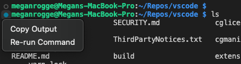
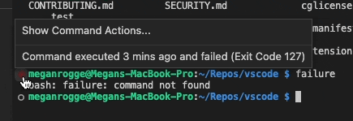

# February 2022 (version 1.65)

**Update 1.65.1**: The update addresses these security [issues](https://github.com/microsoft/vscode/issues?q=is%3Aissue+milestone%3A%22February+2022+Recovery+1%22+is%3Aclosed).

**Update 1.65.2**: The update addresses these [issues](https://github.com/microsoft/vscode/issues?q=is%3Aissue+milestone%3A%22February+2022+Recovery+2%22+is%3Aclosed).

<!-- DOWNLOAD_LINKS_PLACEHOLDER -->

---

Welcome to the February 2022 release of Visual Studio Code.

* **[New editor history navigation](#new-editor-history-navigation)** - Scope Go Back/Go Forward history to editor group or single editor.
* **[Light High Contrast theme](#light-high-contrast-theme)** - Light theme for enhanced VS Code editor visibility.
* **[New audio cues](#audio-cues)** - Audio cues for warnings, inline suggestions, and breakpoint hits.
* **[Drag and drop Problems and Search results](#drag-and-drop-problems-and-search-results)** - Drag results to new or existing editor groups.
* **[Source Control diff editor management](#diff-editor-management)** - Automatically close diff editors after Git operations.
* **[Debugger lazy variable evaluation](#lazy-variables)** - Lazy evaluation of JavaScript/TypeScript property getters.
* **[Preview: Terminal shell integration](#terminal-shell-integration)** - Rerun terminal commands, command status decorations.
* **[VS Code for the Web](#vs-code-for-the-web)** - Reopen recent local files and folders, improved Git integration.

>If you'd like to read these release notes online, go to [Updates](https://code.visualstudio.com/updates) on [code.visualstudio.com](https://code.visualstudio.com).

## Workbench

### New editor history navigation

The editor history navigation feature in VS Code drives some popular commands, such as **Go Back** and **Go Forward**. Numerous feature requests accumulated over time to improve this feature and also add more capabilities. This milestone editor history navigation was rewritten from scratch to address most of these requests.

**Editor group aware navigation**

Editor groups are now taken into account when navigating in the editor history. Navigating back and forward in editor history will activate and focus editors in exactly those editor groups as they were. When an editor group is removed, all associated history entries are discarded.

In the short video below, the first **Go Back** places the cursor in the new editor group and then the second **Go Back** navigation returns to the original editor group.


_Theme: [GitHub Light](https://marketplace.visualstudio.com/items?itemName=GitHub.github-vscode-theme)_

**New setting to scope navigation to editor group or editor**

A new setting `workbench.editor.navigationScope` makes it possible to scope editor history navigation to just the active editor group or even editor. Supported values are:

* `default`: Editor navigation works across all opened editor groups and editors.
* `editorGroup`: Editor navigation is limited to opened editors of the active editor group.
* `editor`: Editor navigation is limited to the active editor.

If you configure the scope to `editorGroup` or `editor`, each editor group or editor will have their own navigation stack that can be navigated individually.

**Notebook support**

You can now navigate between cells you have selected in any notebook. Navigation works across editors, in the same way as you can navigate between cursor locations in a text editor.


_Theme: [GitHub Light](https://marketplace.visualstudio.com/items?itemName=GitHub.github-vscode-theme)_

**New commands to navigate edit or navigation locations**

By default, editor navigation locations are added whenever you navigate across editors but also when navigating within editors (for example, when switching notebook cells or changing selection in text editors). If you feel that too many locations are being recorded, new commands have been added that reduce locations to either:

* Navigation locations - For example, when using **Go to Definition**.
* Edit locations - Whenever an editor is changed. For example, when typing in a text editor.

You can assign your favorite keybinding to these commands to change your navigation accordingly.

Commands for edit locations:

* `workbench.action.navigateForwardInEditLocations` - Go forward in edit locations.
* `workbench.action.navigateBackInEditLocations` - Go back in edit locations.
* `workbench.action.navigatePreviousInEditLocations` - Go previous in edit locations.
* `workbench.action.navigateToLastEditLocation` - Go to last edit location (this command already existed before).

Commands for navigation locations:

* `workbench.action.navigateForwardInNavigationLocations` - Go forward in navigation locations.
* `workbench.action.navigateBackInNavigationLocations` - Go back in navigation locations.
* `workbench.action.navigatePreviousInNavigationLocations` - Go previous in navigation locations.
* `workbench.action.navigateToLastNavigationLocation'` - Go to last navigation location.

Associated context keys have been added to make assigning keybindings more powerful.

Context keys for edit locations:

* `canNavigateBackInEditLocations`- Whether it is possible to go back in edit locations.
* `canNavigateForwardInEditLocations` - Whether it is possible to go forward in edit locations.
* `canNavigateToLastEditLocation` - Whether it is possible to go to the last edit location.

Context keys for navigation locations:

* `canNavigateBackInNavigationLocations` - Whether it is possible to go back in navigation locations.
* `canNavigateForwardInNavigationLocations` - Whether it is possible to go forward in navigation locations.
* `canNavigateToLastNavigationLocation` - Whether it is possible to go to the last navigation location.

### New layout control options

Last milestone, we introduced the experimental [layout control](https://code.visualstudio.com/updates/v1_64#_customize-layout-control) in the title bar (enabled by setting `workbench.experimental.layoutControl.enabled` to `true`). We have heard feedback that, while the actions in the control are useful, they require too many clicks. For that reason, we are adding several UI options for everyone to try out with the setting `workbench.experimental.layoutControl.type`. This setting has the following options:

* `menu`: The previous behavior with a single button that opens a menu (default).
* `toggles`: A new option that shows three buttons to toggle the Panel, Side Bar, and Side Panel.
* `both`: A new option that shows the toggles followed by the menu button, which still allows you to fairly quickly access the customize layout Quick Pick.

The image below shows `layoutControl.type` set to `both` to display the three toggle buttons along with the menu dropdown.


### Light High Contrast theme

A new Light High Contrast theme has been added to improve legibility and readability of the editor.


### Audio cues

New audio cues have been added with this release, including audio cues for warnings, inline suggestions, and debugger breakpoint hits. The sounds have been tuned and the general setting `audioCues.enabled` has been deprecated in favor of the individual `audioCues.*` settings:


All audio cues except `lineHasWarning` are enabled by default for screen reader users (setting value `auto`).

A new audio cue command **Help: List Audio Cues** lists all available audio cues, lets you hear each audio cue as you move through the list, and review which cues are currently enabled.


### Drag and drop Problems and Search results

You can now drag and drop a Problem, Search, or Reference result into the editor, opening the file and revealing the result position. This can be useful if you want to start a new editor group or drop a result into an existing editor group.


### Settings editor split view

The Settings editor now uses an adjustable split view to separate the table of contents from the settings list.


### Improved automatic language detection

When the new setting `workbench.editor.historyBasedLanguageDetection` is enabled, untitled editors will use an improved automatic language detection algorithm that factors in your editor history and the contents of the current workspace. The new algorithm requires much less text input than before to provide detection results.

Below is an example of using this across JavaScript, TypeScript, Markdown, Python, PHP, and C++ (many more languages are supported):


_Theme: [GitHub Light + HC Customizations](https://github.com/JacksonKearl/gh-high-contrast-light)_

### Improved language extension recommendations

Language feature extension recommendations now take into consideration other prominent language extensions in the Marketplace while recommending. For example, VS Code does not recommend the [Java Extension Pack](https://marketplace.visualstudio.com/items?itemName=vscjava.vscode-java-pack) if you have the [Apache NetBeans Java](https://marketplace.visualstudio.com/items?itemName=ASF.apache-netbeans-java) extension installed.

### Keyboard shortcut for extension tree hovers

You can trigger the hover to show in custom tree views that are contributed by extensions by using the keyboard shortcut `Ctrl/Cmd+K, Ctrl/Cmd+I`.

## Editor

### Surround With Snippet

There is a new command to surround the current selection with a snippet. Select some text, invoke the **Surround With Snippet** command from the Command Palette (`kb(workbench.action.showCommands)`), and select a snippet from the dropdown.

In the short video below, a selected method is surrounded by a try/catch snippet.


Any applicable snippet that uses the `TM_SELECTED_TEXT` or `SELECTION` variables will be available in the **Surround With Snippet** Quick Pick dropdown. Custom user or project snippets are also included.

### Accessible inlay hints

Inlay hints show additional information within source code, like the inferred type of a variable. For screen reader users, there is a new command to help with this feature. Select **Read Line With Inlay Hints** from the Command Palette and the editor will read the current line interleaved with its hints.

### Contextual Unicode highlighting

To report fewer false positives, ambiguous and invisible Unicode characters are no longer highlighted if the surrounding characters visually indicate a non-ASCII script. Thus, in trusted workspaces, only characters that are invisible or can be confused with ASCII characters are highlighted. The exception to this is those characters that are contained in a word of non-ASCII characters, where at least one character cannot be confused with an ASCII character.

Before you can see multiple false positives in the const string:


After only the confusing character is highlighted:


## Terminal

### Multi-line paste warning

A dialog now shows by default when pasting multiple lines in terminals when the shell does not support multi-line. This warning is displayed for bracketed paste mode and for PowerShell when we hand off `Ctrl+V` directly to the shell. There is a **Do not ask me again** checkbox on the dialog to easily disable the feature.

### Terminal link improvements

The implementation for terminal links had a large refactor this release. This simplified and improved maintainability of the feature but also brought:

* Link highlights work again.
* Caching of resolved links, reducing latency for certain links to show up.
* **Workspace Search** links are now handled by the same code as validated links, for more consistency and improving line/column recognition.
* Several bug fixes.

### Open file link command improvements

The **Open Last File Link** and **Open Detected Link...** commands introduced last version now exclude folders, which should make them more useful.

## Source Control

### Diff editor management

This milestone we have made changes that should help with managing diff editors. There is a new command **Git: Close All Diff Editors** in the Command Palette that can be used to close all open diff editors. There is also a new setting, `git.closeDiffOnOperation` to automatically close diff editors when changes are stashed, committed, discarded, staged, or unstaged.

### Git command output logging

When executing a git command, the contents of `stderr` are logged in the [Git output window](https://code.visualstudio.com/docs/sourcecontrol/overview#_git-output-window). There is a new setting, `git.commandsToLog`, to specify a list of Git commands that will have the contents of `stdout` logged in the [Git output window](https://code.visualstudio.com/docs/sourcecontrol/overview#_git-output-window).

## Debugging

### Lazy variables

Accessing the value of a variable may have side-effects or be expensive. VS Code's generic debugger can now show a button for the user to fetch the variable value on demand. This is available for debug extensions that support the new ["lazy" variable feature](#debugger-extension-authoring). Currently this has only been implemented by the built-in JavaScript debugger for property getters, but we expect that other debugger extensions will follow soon.


## Tasks

There's a new platform independent `userHome` variable that you can use in tasks.

```json
{
    "label": "Test Home",
    "type": "shell",
    "command": "ls ${userHome}"
}
```

## Notebooks

### Built-in output renderers update

We moved the text, image, HTML and code renderers from the VS Code core to a built-in output renderer extension. With this change, VS Code can now search text on these output types.

In the short video below, searching for `item` initially has 3 results for the code cell, but can be filtered to also include the cell output.


### Sticky scrolling notebook cell buttons

The **Run** button and cell toolbar will now stick to the top of the screen when scrolling down a code cell. This makes them more accessible when working in a long code cell.


_Theme: [Dracula](https://marketplace.visualstudio.com/items?itemName=dracula-theme.theme-dracula)_

## Languages

### TypeScript 4.6

VS Code now ships with TypeScript 4.6. This update brings a number of new language features, along with tooling improvements and bug fixes. You can read more about TypeScript 4.6 on the [TypeScript blog](https://devblogs.microsoft.com/typescript/announcing-typescript-4-6-rc).

### Syntax error reporting in JavaScript files

Thanks to TypeScript 4.6, VS Code now reports some common syntax errors in JavaScript files. This includes parsing errors, as well as invalid redeclarations of block scoped variables:


Previously these errors were only reported when you [enable semantic checking in your JavaScript](https://code.visualstudio.com/docs/languages/javascript#_type-checking).

You can disable this error reporting by setting:

```json
"javascript.validate.enable": false
```

### More JS/TS settings can be configured per language

More of the JavaScript and TypeScript settings can now be configured as [language-specific settings](https://code.visualstudio.com/docs/getstarted/settings#_languagespecific-editor-settings). Language-specific settings are useful if you want different settings for `javascript` vs `javascriptreact`, for example.

New language-specific enabled settings include:

* `javascript.preferences.quoteStyle`, `typescript.preferences.quoteStyle`
* `javascript.preferences.importModuleSpecifier`, `typescript.preferences.importModuleSpecifier`
* `javascript.preferences.importModuleSpecifierEnding`, `typescript.preferences.importModuleSpecifierEnding`
* `javascript.preferences.jsxAttributeCompletionStyle`, `typescript.preferences.jsxAttributeCompletionStyle`
* `javascript.preferences.renameShorthandProperties`, `typescript.preferences.renameShorthandProperties`
* `javascript.preferences.useAliasesForRenames`, `typescript.preferences.useAliasesForRenames`
* `javascript.suggest.enabled`, `typescript.suggest.enabled`
* `javascript.suggest.completeJSDocs`, `typescript.suggest.completeJSDocs`
* `javascript.suggest.jsdoc.generateReturns`, `typescript.suggest.jsdoc.generateReturns`
* `javascript.autoClosingTags`, `typescript.autoClosingTags`

### New Lua syntax highlighting grammar

VS Code has a new, better-maintained, Lua grammar for syntax highlighting of Lua files. The new grammar is actively maintained, fixes issues that existed in the old grammar, and supports newer Lua tokens.

## VS Code for the Web

### Reopen local files and folders

The list of recently opened local files and folders is now available when you access [vscode.dev](https://vscode.dev) or [insiders.vscode.dev](https://insiders.vscode.dev) with a browser that supports the [web file system access API](https://developer.mozilla.org/docs/Web/API/File_System_Access_API). Selecting a local file will open it in an editor and selecting a local folder will update the File Explorer to show its contents. You may be asked by the browser to confirm local file access before the contents are revealed.


### Remote Repositories

**GitHub Repositories**

This milestone, merge conflict resolution was improved when editing GitHub repositories on [vscode.dev](https://vscode.dev) and [github.dev](https://github.dev). There are now merge conflict decorations in your editor, with options to **Accept Current Change**, **Accept Incoming Change** or **Accept Both Changes**.


There is also a **Stage Changes** action in the Source Control view for files containing merge conflicts.


Additionally, you can now easily stage and unstage all changes under a specific folder in a GitHub repository on [vscode.dev](https://vscode.dev) and [github.dev](https://github.dev). To do so, right-click on the Source Control view and select **View as Tree**.


_Theme: [One Monokai](https://marketplace.visualstudio.com/items?itemName=azemoh.one-monokai)_

Workspace search and **Find All References** will now download and index a full copy of the repository by default, rather than defaulting to providing partial results as before.

There are several settings to configure this indexing feature:

* `remoteHub.indexing.verboseDownloadNotification` - Controls whether the download notification is shown as a popup (default) or in the Status bar.
* `remoteHub.indexing.maxIndexSize` - Controls the size limit of indexes to download. If this limit is exceeded, the download will be cancelled and partial results will be provided. You can leave this setting empty to never download repositories and always use partial results.

**Azure Repos**

In this milestone, we switched Azure Repos support from using a specific Azure DevOps authentication provider to using the generic Microsoft authentication provider (used by Settings Sync). You will be prompted to log in again when you visit an Azure Repo but all of your saved changes will be persisted.

## Contributions to extensions

### Hex Editor data inspector improvements

Previously, the [Hex Editor extension](https://marketplace.visualstudio.com/items?itemName=ms-vscode.hexeditor) always displayed its Data Inspector in the Side bar, and revealed it whenever a hex editor was revealed. However, some users found this annoying, and it led to a particularly disruptive experience with its integration of a [memory inspector for debuggers](https://code.visualstudio.com/updates/v1_64#_viewing-and-editing-binary-data). Now, the Data Inspector will appear to the right side of the inspected bytes. If the editor is too narrow, the Data Inspector will be displayed inside a hover widget instead.


_Theme: [Codesong](https://marketplace.visualstudio.com/items?itemName=connor4312.codesong)_

This can be configured via the `hexeditor.inspectorType` setting, which can take one of three values:

* `aside` - Show the Data Inspector to the side.
* `hover` - Show the Data Inspector only on hover, regardless of editor width.
* `sidebar` - Display the Data Inspector in the Side bar as before.

### GitHub Pull Requests and Issues

Work continues on the [GitHub Pull Requests and Issues](https://marketplace.visualstudio.com/items?itemName=GitHub.vscode-pull-request-github) extension, which allows you to work on, create, and manage pull requests and issues. Check out the [changelog for the 0.38.0](https://github.com/microsoft/vscode-pull-request-github/blob/main/CHANGELOG.md#0380) release of the extension to see the highlights.

## Preview features

### Terminal shell integration

Shell integration in the terminal was initially introduced [in the last release](https://code.visualstudio.com/updates/v1_64#_terminal-shell-integration) and has seen many improvements this month. As a refresher, this feature allows VS Code to gain additional insights into what's happening within the terminal, which was previously largely unknown. The feature is still considered experimental and you can opt-in via the `terminal.integrated.shellIntegration.enabled` setting.

The biggest change this release is that commands detected by shell integration now feature decorations in the "gutter" to the left. A command decoration visually breaks up the buffer and provides access to information and actions that use shell integration capabilities. There are three types of command decorations: error, success, and default, as determined by the command's exit code.


Clicking on a decoration displays actions specific to that command in a menu, that currently include **Re-run Command** and **Copy Output**.



Hovering over the decoration displays information about the command, such as the time since it was run and the associated exit code.



Decorations can be disabled by setting `terminal.integrated.shellIntegration.decorationsEnabled` to `false`. Individual icons can be configured via the `terminal.integrated.shellIntegration.decorationIcon*` settings and these new theme keys set the colors:

* `terminalCommandDecoration.successBackground`
* `terminalCommandDecoration.errorBackground`
* `terminalCommandDecoration.defaultBackground`

Here are the other main changes:

* The enablement setting has been renamed to `terminal.integrated.shellIntegration.enabled`.
* The mechanism for enabling shell integration in all supported shells is now more reliable.
* Shell integration should now work when using remote connected windows (SSH, WSL, containers).
* Line continuations (for example, `$PS2`) should now work on all supported shells.
* Commands that are "skipped" are now marked specially. For example, after using `Ctrl+C` or running an empty command.
* The **Run Recent Command** and **Go to Recent Directory** commands now store history between sessions. Storing history can be configured via the `terminal.integrated.shellIntegration.history` setting.

### ESLint

The [ESLint](https://marketplace.visualstudio.com/items?itemName=dbaeumer.vscode-eslint) extension has preliminary support for notebook documents containing cells that can be validated with ESLint. This support is only available in the Pre-Release version of the extension.

## Extension authoring

### Language status items

We have finalized the API for language status items. This API shows language specific information for the active editor. This can be general information about the project or toolset version but can also display errors and warnings.


The API resembles the Status bar API and can be accessed via `vscode.languages.createLanguageStatusItem(...)`. A language status item should be created with a document selector so that VS Code can show and hide it whenever the active editor changes.

### Inlay Hints

The Inlay Hint provider API is now finalized. It allows to inlay additional information with source code. The image below shows how TypeScript added an inlay hint for an inferred type.


The API is built around the `InlayHintsProvider`. It provides `InlayHint` objects, which have a couple of interesting features:

* An inlay hint can have a tooltip and a command.
* The label of a hint can be composed of multiple parts, which again can have a tooltip and command.
* The label parts can also have an associated source location that enables language features such as **Go To Definition** for this part.

### Status bar focus borders

We made it easier and more accessible to navigate the Status bar by adding focus borders to the Status bar and Status bar items.


Theme authors can customize the border colors by configuring the two new theme colors:

* `statusBar.focusBorder`: The border color of the entire status bar when focused.
* `statusBarItem.focusBorder`: The border color the status bar items when focused.

### Testing refresh action and sortText

We've finalized [our proposal](https://github.com/microsoft/vscode/issues/139737) to add a standard refresh handler to the `TestController` interface. If extensions assign a method to this property, VS Code will show a "refresh" icon in the Test Explorer view.

Additionally, the `TestItem` [can now](https://github.com/microsoft/vscode/issues/130882) have a `sortText` attribute that controls the sort order for items which do not have a specific location in a file.

### Comment timestamp

The Comments API now let's you add a `timestamp` to each `Comment`. This timestamp is shown in the Comments widget and in the Comments view. By default, the timestamp is shown as a relative time (for example, "2 weeks ago"), but the user setting `comments.useRelativeTime` can be used to show an exact time instead. The hover of the timestamp will always be the exact time.

### vscode-test package renamed to @vscode/test-electron

The `vscode-test` package has been renamed to `@vscode/test-electron`. Extension authors should update the entry in their extension's `package.json` file `devDependencies`, if they are including that package. The [@vscode/test-electron](https://www.npmjs.com/package/@vscode/test-electron) package helps run integration tests for VS Code extensions. You can learn more at the [vscode-test repository](https://github.com/microsoft/vscode-test).

### Updated codicons

The following new icons were added to our [codicon](https://code.visualstudio.com/api/references/icons-in-labels) library:

* `arrow-circle-down`
* `arrow-circle-left`
* `arrow-circle-right`
* `arrow-circle-up`
* `error-small`
* `indent`
* `layout-activitybar-left`
* `layout-activitybar-right`
* `layout-centered`
* `layout-menubar`
* `layout-panel-center`
* `layout-panel-justify`
* `layout-panel-left`
* `layout-panel-right`
* `layout-panel`
* `layout-sidebar-left`
* `layout-sidebar-right`
* `layout-statusbar`
* `layout`
* `newline`
* `record-small`
* `target`


### Icon contribution point is now final

The icon contribution point allow extensions to define a new icon by ID, along with a default icon. The icon ID can then be used by the extension (or any other extensions that depend on the extension) anywhere a `ThemeIcon` can be used `new ThemeIcon("iconId")`, in Markdown strings (`$(iconId)`), and as icons in certain contribution points.

Product icon themes can redefine the icon (if they know about the icon ID).

```json
"contributes": {
  "icons": {
    "distro-ubuntu": {
      "description": "Ubuntu icon",
      "default": {
        "fontPath": "./distroicons.woff",
        "fontCharacter": "\\E001"
      }
    },
    "distro-fedora": {
      "description": "Ubuntu icon",
      "default": {
        "fontPath": "./distroicons.woff",
        "fontCharacter": "\\E002"
      }
    }
  }
}
```

In the example above, an extension defines two new icon IDs `distro-ubuntu` and `distro-fedora`, along with default icon definitions. The icons are defined in an icon font at the given font character.

### File icon themes: Support for folder names in file associations

In [file icon themes](https://code.visualstudio.com/api/extension-guides/file-icon-theme), the associations in `folderNames`, `folderNamesExpanded`, `fileNames`, and `fileExtensions` can now also contain a folder name:

```json
  "fileNames": {
    "system/win.ini": "_win_ini_file"
  },
```

`system/win.ini` means that the association matches files called `win.ini` directly in a folder `system`.

```json
  "fileExtensions": {
    "system/ini": "_ini_file"
  },
```

`system/ini` means that the association matches files called `*.ini` directly in a folder `system`.

```json
  "folderNames": {
    ".vscode/extensions": "_vscode_folder"
  },
```

### Running remotely installed web extensions in VS Code for the Web with Codespaces

VS Code for the Web with Codespaces now supports running a remotely installed [web extension](https://code.visualstudio.com/api/extension-guides/web-extensions) in the web extension host. For example, if you have the [Vim](https://marketplace.visualstudio.com/items?itemName=vscodevim.vim) extension installed in a GitHub Codespace (via configuration in a `devcontainer.json` file) then Vim will be loaded in the web extension host when you open the codespace in the browser. Please read our [Extension Host](https://code.visualstudio.com/api/advanced-topics/extension-host#preferred-extension-location) documentation for more information.

**Note:** There are currently known limitations regarding loading a web worker by such an extension. See [issue](https://github.com/microsoft/vscode/issues/144235) for more details.

## Debugger extension authoring

### Support for "important" Output events

Recently, the Debug Adapter Protocol [added](https://code.visualstudio.com/updates/v1_63#_new-important-category-for-the-output-event) an `important` category for the `Output` event. This category marks events that should stand out and not go overlooked by the user. VS Code will now show a notification popup for messages with the `important` category. They will also still be logged to the Debug Console.

### Support for 'lazy' variables

Some variables are dynamic and require executing code to get the value. A debug adapter may not want to retrieve their full values automatically, since doing so could have side-effects or be expensive.

Some debug adapters have addressed this problem by representing the "expensive variable" as a placeholder object that the user needs to "expand" explicitly in order to fetch the value. VS Code's built-in js-debug uses this approach for JS/TS getters:

```ts
class Person {
  name = "Danny";
  get email(): string {
    return "foo@example.bar";
  }
  get address(): Address {
    return new Address();
  }
}
class Address {
  street = "Main Street";
  city = "Zurich";
}
```

The following screencast shows that the intermediate object makes it difficult to understand the effective data structure:


In this release, we have improved VS Code to render the intermediate object in a compact form with a **(...)** button for requesting the full value.


A debug adapter can request this new presentation style for a variable by adding a `VariablePresentationHint` with a `lazy` property ([see DAP additions](#debug-adapter-protocol)). If the client does not support the `lazy` flag, the variable will be shown as before.

## Language Server Protocol

Another next version of the [Language Server Protocol](https://microsoft.github.io/language-server-protocol), together with the corresponding npm modules, has been published. The new version contains the following changes:

* The conversion of LSP types into VS Code types and vice versa is now fully asynchronous. This change avoids the conversion of large data streams, which can block the extension host. Note that this is a breaking API change in the libraries (more information in the [README.md](https://github.com/microsoft/vscode-languageserver-node/blob/081ba82a0e49eebec2d1b7d93751290cc1128104/README.md#L47)). It does not affect the backwards compatibility of the protocol itself.
* The proposed implementation for notebook documents was enhanced. It has now full middleware and provider support.

## Debug Adapter Protocol

There are several new properties added to the [Debug Adapter Protocol](https://microsoft.github.io/debug-adapter-protocol).

* The new boolean property `lazy` was added to the `VariablePresentationHint`. Clients can use the optional flag to present the variable with a UI that supports a specific gesture to fetch its value.
* The new optional string property `detail` was added to the `CompletionItem`. With this human-readable string, a client can show additional information about the item, such as type or symbol information. Note that this property is not yet supported by VS Code.

## Proposed extension APIs

Every milestone comes with new proposed APIs and extension authors can try them out. As always, we want your feedback. Here are the steps to try out a proposed API:

1. [Find a proposal that you want to try](https://github.com/microsoft/vscode/tree/main/src/vscode-dts) and add its name to `package.json#enabledApiProposals`.
1. Use the latest [vscode-dts](https://www.npmjs.com/package/vscode-dts) and run `vscode-dts dev`. It will download the corresponding `d.ts` files into your workspace.
1. You can now program against the proposal.

You cannot publish an extension that uses a proposed API. There may be breaking changes in the next release and we never want to break existing extensions.

### Markdown hovers in Timeline items

Items provided by a `TimelineProvider` can now support Markdown in the `detail` property, which is used to provide content for their tooltip.

### Notebook aware document selectors

The `vscode.DocumentSelector` type allows you to associate language features like **Go to Definition** to specific documents. This drives the UI and also decides if the corresponding provider is asked for results. We have added a new API proposal that allows extensions to also select notebook types. For example, `{ language: 'python', notebookType: 'jupyter-notebook'}` targets all python documents that are embedded in Jupyter notebooks. This is the [current proposal](https://github.com/microsoft/vscode/blob/8a3b1f4c4c24064273efb3417a5c2e229ba78481/src/vscode-dts/vscode.proposed.notebookDocumentSelector.d.ts) - give it a try and let us know what you think.

### Output channel with custom language ID

There are some extensions that are able to define token or syntax coloring and CodeLens features in their output channels, given that they are text documents (read-only) by themselves. Since all output channels share the same language ID, these customizations can be wrongly applied to other output channels. There was a feature request to create output channels with custom language IDs so that extension authors can define customizations by language. Hence in this milestone, we have introduced the [proposal](https://github.com/microsoft/vscode/blob/35ba35b799a85974079e4a90f59ae7e978ad3def/src/vscode-dts/vscode.proposed.outputChannelLanguage.d.ts#L21) to create an output channel with a custom language ID. Please try it out and give us feedback.

### MarkdownString.baseUri

The proposed `baseUri` property on `MarkdownString` lets you specify a base URI that relative links and images in Markdown are resolved relative to. This property behaves much like the [`<base>` element in HTML](https://developer.mozilla.org/docs/Web/HTML/Element/base).

If the `baseUri` ends with `/`, it is considered a directory and relative paths in Markdown are resolved relative to that directory:

```ts
const md = new vscode.MarkdownString(`[link](./file.js)`);
md.baseUri = vscode.Uri.file('/path/to/dir/');
// Here 'link' in the rendered Markdown resolves to '/path/to/dir/file.js'
```

If the `baseUri` is a file, relative paths in Markdown are resolved relative to the parent directory of that file:

```ts
const md = new vscode.MarkdownString(`[link](./file.js)`);
md.baseUri = vscode.Uri.file('/path/to/otherFile.js');
// Here 'link' in the rendered Markdown resolves to '/path/to/file.js'
```

## New documentation

### Java GUI applications

The new [Java GUI Applications](https://code.visualstudio.com/docs/java/java-gui) topic explains how to use the [Extension Pack for Java](https://marketplace.visualstudio.com/items?itemName=vscjava.vscode-java-pack) to develop JavaFX, AWT, and Swing application in VS Code.

## Notable fixes

* [107748](https://github.com/microsoft/vscode/issues/107748) Voice over does not read that a setting is ignored to sync
* [123399](https://github.com/microsoft/vscode/issues/123399) Emmet doesn't add the class with tag A in jsx and html files.
* [141680](https://github.com/microsoft/vscode/issues/141680) Searching for @tags in settings is slow
* [141977](https://github.com/microsoft/vscode/issues/141977) Settings editor: Folder action item not handling keyup properly
* [142040](https://github.com/microsoft/vscode/issues/142040) Improve Install Another Version action for extensions supporting pre-release.
* [142462](https://github.com/microsoft/vscode/issues/142462) File writes can hang when write locks are not cleared up
* [142641](https://github.com/microsoft/vscode/issues/142641) ts-node debugger not working properly in v1.64

## Thank you

Last but certainly not least, a big _**Thank You**_ to the contributors of VS Code.

### Web extensions

Extension authors for enabling extensions that run code as [web extensions](https://code.visualstudio.com/api/extension-guides/web-extensions) (the list below is between February 1 2022 and February 28 2022):

* [Var Style](https://marketplace.visualstudio.com/items?itemName=allen.VarStyle) ([allen](https://marketplace.visualstudio.com/publishers/allen))
* [helloworld-web-sample](https://marketplace.visualstudio.com/items?itemName=AndreyBelym-DXTestCafe.helloworld-web-sample) ([Andrey Belym](https://marketplace.visualstudio.com/publishers/AndreyBelym-DXTestCafe))
* [asciidoctor.asciidoctor-vscode](https://marketplace.visualstudio.com/items?itemName=asciidoctor.asciidoctor-vscode) ([asciidoctor](https://marketplace.visualstudio.com/publishers/asciidoctor))
* [Gitignore Adder](https://marketplace.visualstudio.com/items?itemName=beatrix.gitignore-adder) ([beatrix](https://marketplace.visualstudio.com/publishers/beatrix))
* [gkauthentication-test](https://marketplace.visualstudio.com/items?itemName=branchcreation.gkauthentication-test) ([BranchCreation SLU](https://marketplace.visualstudio.com/publishers/branchcreation))
* [Racket Helpers](https://marketplace.visualstudio.com/items?itemName=Calvin-LL.racket-helpers) ([Calvin-LL](https://marketplace.visualstudio.com/publishers/Calvin-LL))
* [PHP Tools](https://marketplace.visualstudio.com/items?itemName=DEVSENSE.phptools-vscode) ([DEVSENSE](https://marketplace.visualstudio.com/publishers/DEVSENSE))
* [Naninovel](https://marketplace.visualstudio.com/items?itemName=Elringus.naninovel) ([Elringus](https://marketplace.visualstudio.com/publishers/Elringus))
* [Pitoco Extension](https://marketplace.visualstudio.com/items?itemName=feodrippe.pitoco-extension) ([Feodrippe](https://marketplace.visualstudio.com/publishers/feodrippe))
* [feodrippe.feodrippe-helloworld-minimal-sample-test-web](https://marketplace.visualstudio.com/items?itemName=feodrippe.feodrippe-helloworld-minimal-sample-test-web) ([Feodrippe](https://marketplace.visualstudio.com/publishers/feodrippe))
* [Simple React Snippets for Typescript](https://marketplace.visualstudio.com/items?itemName=fulin.react-snippets-typescript) ([Giovanni Fu Lin](https://marketplace.visualstudio.com/publishers/fulin))
* [GitKraken Authentication](https://marketplace.visualstudio.com/items?itemName=gitkraken.gitkraken-authentication) ([GitKraken](https://marketplace.visualstudio.com/publishers/gitkraken))
* [groog](https://marketplace.visualstudio.com/items?itemName=groogle.groog) ([groogle](https://marketplace.visualstudio.com/publishers/groogle))
* [ModalKeys](https://marketplace.visualstudio.com/items?itemName=haberdashPI.vscode-modal-keys) ([haberdashPI](https://marketplace.visualstudio.com/publishers/haberdashpi))
* [VDM VSCode](https://marketplace.visualstudio.com/items?itemName=jonaskrask.vdm-vscode) ([Jonas Rask](https://marketplace.visualstudio.com/publishers/jonaskrask))
* [cis-algorithm](https://marketplace.visualstudio.com/items?itemName=kimjihu.cis-algorithm) ([kimjihu](https://marketplace.visualstudio.com/publishers/kimjihu))
* [Markdown (Pandoc Flavored)](https://marketplace.visualstudio.com/items?itemName=ickc.vscode-markdown-it-pandoc) ([Kolen Cheung](https://marketplace.visualstudio.com/publishers/ickc))
* [zyname - this is for testing and will be deleted soon](https://marketplace.visualstudio.com/items?itemName=leodevbro.zyidentifier) ([leodevbro](https://marketplace.visualstudio.com/publishers/leodevbro))
* [Snippet Copy](https://marketplace.visualstudio.com/items?itemName=lumaxis.snippet-copy) ([Lukas Spieß](https://marketplace.visualstudio.com/publishers/lumaxis))
* [PHP import checker](https://marketplace.visualstudio.com/items?itemName=marabesi.php-import-checker) ([Marabesi](https://marketplace.visualstudio.com/publishers/marabesi))
* [VSCode Language JSONata](https://marketplace.visualstudio.com/items?itemName=bigbug.vscode-language-jsonata) ([Markus Gutbrod](https://marketplace.visualstudio.com/publishers/bigbug))
* [Babel JavaScript](https://marketplace.visualstudio.com/items?itemName=mgmcdermott.vscode-language-babel) ([Michael McDermott](https://marketplace.visualstudio.com/publishers/mgmcdermott))
* [Create Project](https://marketplace.visualstudio.com/items?itemName=publictheta.vscode-create-project) ([Public Theta](https://marketplace.visualstudio.com/publishers/publictheta))
* [Dynamic Theme](https://marketplace.visualstudio.com/items?itemName=rodydavis.vscode-dynamic-theme) ([Rody Davis](https://marketplace.visualstudio.com/publishers/rodydavis))
* [Router Generator](https://marketplace.visualstudio.com/items?itemName=rodydavis.router-generator) ([Rody Davis](https://marketplace.visualstudio.com/publishers/rodydavis))
* [Chimera Theme](https://marketplace.visualstudio.com/items?itemName=roydukkey.theme-chimera) ([roydukkey](https://marketplace.visualstudio.com/publishers/roydukkey))
* [Qiita Markdown Preview](https://marketplace.visualstudio.com/items?itemName=ryokat3.vscode-qiita-markdown-preview) ([Ryoji Kato](https://marketplace.visualstudio.com/publishers/ryokat3))
* [Kestrel](https://marketplace.visualstudio.com/items?itemName=SenseTime.kestrel) ([SenseTime](https://marketplace.visualstudio.com/publishers/SenseTime))
* [Test token](https://marketplace.visualstudio.com/items?itemName=sevillal.test-token) ([sevillal](https://marketplace.visualstudio.com/publishers/sevillal))
* [Sourcegraph](https://marketplace.visualstudio.com/items?itemName=sourcegraph.sourcegraph) ([Sourcegraph](https://marketplace.visualstudio.com/publishers/sourcegraph))
* [Rewrap](https://marketplace.visualstudio.com/items?itemName=stkb.rewrap) ([stkb](https://marketplace.visualstudio.com/publishers/stkb))
* [wav-preview](https://marketplace.visualstudio.com/items?itemName=sukumo28.wav-preview) ([sukumo28](https://marketplace.visualstudio.com/publishers/sukumo28))
* [Pandoc](https://marketplace.visualstudio.com/items?itemName=taniguchi.pandoc) ([TANIGUCHI Masaya](https://marketplace.visualstudio.com/publishers/taniguchi))
* [Hex Viewer](https://marketplace.visualstudio.com/items?itemName=tao-cumplido.hex-viewer) ([Tao Cumplido](https://marketplace.visualstudio.com/publishers/tao-cumplido))
* [Time Link Bundle (Web version)](https://marketplace.visualstudio.com/items?itemName=time-link.timelink-vscode-web) ([Time Link](https://marketplace.visualstudio.com/publishers/time-link))
* [DCC Websocket](https://marketplace.visualstudio.com/items?itemName=virgilsisoe.dcc-websocket) ([virgilsisoe](https://marketplace.visualstudio.com/publishers/virgilsisoe))
* [VSC+](https://marketplace.visualstudio.com/items?itemName=Vrej.vscplus) ([Vrej](https://marketplace.visualstudio.com/publishers/Vrej))

### Issue tracking

Contributions to our issue tracking:

* [John Murray (@gjsjohnmurray)](https://github.com/gjsjohnmurray)
* [Andrii Dieiev (@IllusionMH)](https://github.com/IllusionMH)
* [ArturoDent (@ArturoDent)](https://github.com/ArturoDent)
* [Simon Chan (@yume-chan)](https://github.com/yume-chan)

### Pull requests

Contributions to `vscode`:

* [@aminya (Amin Yahyaabadi)](https://github.com/aminya): fix: simplify regex expressions in tasks/common [PR #142899](https://github.com/microsoft/vscode/pull/142899)
* [@Balastrong (Leonardo)](https://github.com/Balastrong)
  * Increased opacity in overload counter tooltip [PR #141828](https://github.com/microsoft/vscode/pull/141828)
  * Fixed element detection by checking fragment before and after decoding if necessary [PR #141848](https://github.com/microsoft/vscode/pull/141848)
* [@BMBurstein (Baruch)](https://github.com/BMBurstein): Correct description of bracket guide setting [PR #143722](https://github.com/microsoft/vscode/pull/143722)
* [@Bruce-Hopkins (Bruce Hopkins)](https://github.com/Bruce-Hopkins): Add user home variable [PR #141902](https://github.com/microsoft/vscode/pull/141902)
* [@caioagiani (Caio Agiani)](https://github.com/caioagiani): Fix typos [PR #141959](https://github.com/microsoft/vscode/pull/141959)
* [@CGNonofr (Loïc Mangeonjean)](https://github.com/CGNonofr)
  * Replace languageId by languageSelector in all language feature registration functions [PR #143610](https://github.com/microsoft/vscode/pull/143610)
  * Allow getWorker function to return a promise [PR #143611](https://github.com/microsoft/vscode/pull/143611)
* [@ChaseKnowlden](https://github.com/ChaseKnowlden): Update Lua Grammar [PR #142107](https://github.com/microsoft/vscode/pull/142107)
* [@divinity76](https://github.com/divinity76): seems root requires --no-sandbox [PR #137125](https://github.com/microsoft/vscode/pull/137125)
* [@efcoyote (coyote)](https://github.com/efcoyote): update to latest seti-ui version [PR #141931](https://github.com/microsoft/vscode/pull/141931)
* [@enticies (enticies)](https://github.com/enticies): Fix error message typo [PR #142054](https://github.com/microsoft/vscode/pull/142054)
* [@g-plane (Pig Fang)](https://github.com/g-plane): Add "pnpm-lock.yaml" to default file nesting patterns [PR #142375](https://github.com/microsoft/vscode/pull/142375)
* [@gjsjohnmurray (John Murray)](https://github.com/gjsjohnmurray)
  * Add optional languageId to window.createOutputChannel API (#19561) [PR #140876](https://github.com/microsoft/vscode/pull/140876)
  * Fix `testing.openTesting` setting text (#142306) [PR #142314](https://github.com/microsoft/vscode/pull/142314)
* [@haykam821](https://github.com/haykam821): Prevent the image preview transparency background from being affected by scaling [PR #141667](https://github.com/microsoft/vscode/pull/141667)
* [@heartacker](https://github.com/heartacker): add math snippet [PR #142697](https://github.com/microsoft/vscode/pull/142697)
* [@icepaq (Anton)](https://github.com/icepaq): Autocomplete activation event onWebviewPanel [PR #141752](https://github.com/microsoft/vscode/pull/141752)
* [@jeanp413 (Jean Pierre)](https://github.com/jeanp413)
  * Fix WebviewElement::streamToBuffer [PR #142288](https://github.com/microsoft/vscode/pull/142288)
  * Fix querying an extension by ID in extension view always renders stable version in extension editor [PR #143481](https://github.com/microsoft/vscode/pull/143481)
* [@JJRcop (Jonathan Rubenstein)](https://github.com/JJRcop): Add VS 2022 to supported versions [PR #142667](https://github.com/microsoft/vscode/pull/142667)
* [@LuanVSO (Luan Vitor Simião Oliveira)](https://github.com/LuanVSO)
  * fix psreadline not working with shell integration [PR #142211](https://github.com/microsoft/vscode/pull/142211)
  * Fix shellintegration.ps1 [PR #142217](https://github.com/microsoft/vscode/pull/142217)
* [@michaelkuhn (Michael Kuhn)](https://github.com/michaelkuhn): Fix some Solarized colors [PR #142670](https://github.com/microsoft/vscode/pull/142670)
* [@neeleshb (Neelesh Bodas)](https://github.com/neeleshb): Fix incorrect label for the "goto previous problem" [PR #143823](https://github.com/microsoft/vscode/pull/143823)
* [@satokaz (Kazuyuki Sato)](https://github.com/satokaz): Decode header suggestions in Markdown path IntelliSense [PR #142392](https://github.com/microsoft/vscode/pull/142392)
* [@SNDST00M (M.U.N.I.N)](https://github.com/SNDST00M): Add optional directory syntax in file icon themes [PR #140079](https://github.com/microsoft/vscode/pull/140079)
* [@stefanhaller (Stefan Haller)](https://github.com/stefanhaller): Fix #142028 [PR #142930](https://github.com/microsoft/vscode/pull/142930)
* [@surajteggi](https://github.com/surajteggi): Fix typo [PR #142185](https://github.com/microsoft/vscode/pull/142185)
* [@thebinarysearchtree (Andrew Jones)](https://github.com/thebinarysearchtree): fix indentation [PR #141997](https://github.com/microsoft/vscode/pull/141997)
* [@weartist (Han)](https://github.com/weartist): Implement multiLinePasteWarning in VSCode terminal，fix the #122683 [PR #141822](https://github.com/microsoft/vscode/pull/141822)
* [@y-tsutsu (y-tsutsu)](https://github.com/y-tsutsu)
  * Commands display both translated names and original names in command palette. [PR #142524](https://github.com/microsoft/vscode/pull/142524)
  * fix action category [PR #142911](https://github.com/microsoft/vscode/pull/142911)
* [@Yash621 (Yash Goel)](https://github.com/Yash621): fixed settings sync has duplicate logins [PR #142340](https://github.com/microsoft/vscode/pull/142340)
* [@zardoy (Vitaly)](https://github.com/zardoy): Resolve correct link path for tsconfig.extends [PR #141062](https://github.com/microsoft/vscode/pull/141062)

Contributions to `vscode-css-languageservice`:

* [@romainmenke (Romain Menke)](https://github.com/romainmenke)
  * add support for hwb() color function [PR #262](https://github.com/microsoft/vscode-css-languageservice/pull/262)
  * fix specificity for :has, :not, :is and :where [PR #263](https://github.com/microsoft/vscode-css-languageservice/pull/263)

Contributions to `vscode-languageserver-node`:

* [@dsherret (David Sherret)](https://github.com/dsherret): feat: more descriptive error when childProcess.spawn fails [PR #888](https://github.com/microsoft/vscode-languageserver-node/pull/888)

Contributions to `debug-adapter-protocol`:

* [@apupier (Aurélien Pupier)](https://github.com/apupier): Add Debug Adapter for Apache Camel [PR #245](https://github.com/microsoft/debug-adapter-protocol/pull/245)
* [@eshelyaron (Eshel Yaron)](https://github.com/eshelyaron): Add SWI-Prolog DAP implementation to adapters.md [PR #248](https://github.com/microsoft/debug-adapter-protocol/pull/248)
* [@hyangah (Hyang-Ah Hana Kim)](https://github.com/hyangah): Update sdks.md * include go-dap [PR #241](https://github.com/microsoft/debug-adapter-protocol/pull/241)
* [@lukaszsamson (Łukasz Samson)](https://github.com/lukaszsamson): Add link to Elixir DAP implementation [PR #243](https://github.com/microsoft/debug-adapter-protocol/pull/243)
* [@Ricbet (John)](https://github.com/Ricbet): Add OpenSumi to the Implementations tools [PR #247](https://github.com/microsoft/debug-adapter-protocol/pull/247)

Contributions to `language-server-protocol`:

* [@zwpaper (Wei Zhang)](https://github.com/zwpaper): use language ID for consistence [PR #1409](https://github.com/microsoft/language-server-protocol/pull/1409)

Contributions to `monaco-editor`:

* [@Dan1ve (Daniel Veihelmann)](https://github.com/Dan1ve): Make Vite sample code Firefox compatible [PR #2991](https://github.com/microsoft/monaco-editor/pull/2991)
* [@philipturner (Philip Turner)](https://github.com/philipturner): Add `@noDerivative` modifier to Swift [PR #2957](https://github.com/microsoft/monaco-editor/pull/2957)

<!-- In-product release notes styles.  Do not modify without also modifying regex in gulpfile.common.js -->
<a id="scroll-to-top" role="button" title="Scroll to top" aria-label="scroll to top" href="#"><span class="icon"></span></a>
<link rel="stylesheet" type="text/css" href="css/inproduct_releasenotes.css"/>
