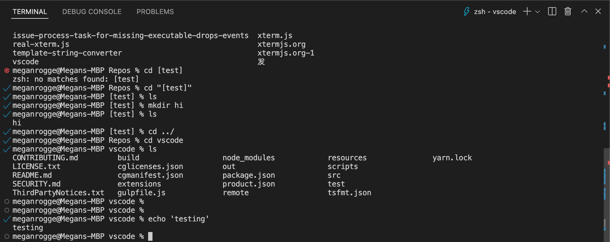

# March 2022 (version 1.66)

**Update 1.66.1**: The update addresses these [issues](https://github.com/microsoft/vscode/issues?q=is%3Aissue+milestone%3A%22March+2022+Recovery%22+is%3Aclosed).

**Update 1.66.2**: The update addresses these security [issues](https://github.com/microsoft/vscode/issues?q=is%3Aissue+milestone%3A%22March+2022+Recovery+2%22+is%3Aclosed).

<!-- DOWNLOAD_LINKS_PLACEHOLDER -->

---

Welcome to the March 2022 release of Visual Studio Code. There are many updates in this version that we hope you'll like, some of the key highlights include:

* **[Local history](#local-history)** - Keep track of local file changes independent of source control.
* **[Settings editor language filter](#settings-editor)** - Displays available language-specific settings.
* **[Terminal find improvements](#terminal)** - Matches are highlighted in the terminal panel and scroll bar.
* **[Built-in CSS/LESS/SCSS formatters](#css-formatter)** - Code formatting for CSS, LESS, and SCSS.
* **[JavaScript heap profiles](#javascript-debugging)** - Collect and view JS memory allocations while debugging.
* **[VS Code for the Web](#vs-code-for-the-web)** - Drag and drop files and folders into vscode.dev.
* **[Remote - SSH support for Mac](#remote-development)** - Connect via SSH to Apple Silicon/M1/ARM64 machines.
* **[New R language topic](#r-in-vs-code)** - Learn how to use R for data science in VS Code.

>If you'd like to read these release notes online, go to [Updates](https://code.visualstudio.com/updates) on [code.visualstudio.com](https://code.visualstudio.com).

**Watch the release party:** Listen in as the VS Code team discusses some of the new features. You can find the [recording of the event](https://www.youtube.com/watch?v=JNc3jfOeYRY) on our YouTube channel.

**Highlights short:** If you just have 60 seconds, check out the [March VS Code release highlights](https://www.youtube.com/shorts/72BD7rCn820) video to quickly see what's new.

**Insiders:** Want to try new features as soon as possible? You can download the nightly [Insiders](https://code.visualstudio.com/insiders) build and try the latest updates as soon as they are available.

## Accessibility

The team works hard to make VS Code one of the most accessible editors available. This release contains several improvements to help usability and accessibility:

* **[Reduce motion mode](#reduce-motion-mode)** - Limit animations used in the VS Code UI.
* **[More visible source control decorators](#updated-source-control-decorators)** - Higher visibility using patterns and color contrast.
* **[Audio cues volume control](#audio-cue-improvements)** - You can now adjust the editor audio cue volume.
* **[Comment UI accessibility](#comment-accessibility-improvements)** - New commands and keyboard shortcuts.
* **[High Contrast Light color theme](#high-contrast-light-theme-for-color-contributions)** - Theme authors can now contribute colors to High Contrast Light.

## Workbench

### Local history

Local history of files is now available in the **Timeline** view. Depending on the configured settings, every time you save an editor, a new entry is added to the list:


Each local history entry contains the full contents of the file at the time the entry was created and in certain cases, can provide more semantic information (for example, indicate a refactoring).

From an entry you can:

* Compare the changes to the local file or previous entry.
* Restore the contents.
* Delete or rename the entry.

There are new global commands to work with local history:

* `workbench.action.localHistory.create` - Create a new history entry for the active file with a custom name.
* `workbench.action.localHistory.deleteAll` - Delete all history entries across all files.
* `workbench.action.localHistory.restoreViaPicker` - Find a history entry to restore across all files.

These commands don't have default keybindings but you can add your own [keyboard shortcuts](https://code.visualstudio.com/docs/getstarted/keybindings).

There are also new settings to work with local history:

* `workbench.localHistory.enabled` - Enable or disable local history (default: `true`).
* `workbench.localHistory.maxFileSize` - File size limit when creating a local history entry (default: `256 KB`).
* `workbench.localHistory.maxFileEntries` - Local history entries limit per file (default: `50`).
* `workbench.localHistory.exclude` - Glob patterns for excluding certain files from local history.
* `workbench.localHistory.mergeWindow` - Interval in seconds during which further changes are added to the last entry in local file history (default `10s`).

A new filter action in the Timeline view toolbar allows you to enable or disable individual providers:


**Note:** Local history entries are stored in different locations depending on your use of VS Code. When opening local files, the entries are persisted in the local user data folder and when opening remote files, they will be stored on the remote user data folder. When no file system is available (for example, in certain cases when using VS Code for Web), entries are stored into IndexedDB.

### Settings editor

**Language filter**

Users can now type `@lang:languageId` in the Settings editor search box to view and edit all settings that can be configured for the language with ID `languageId`. This way, users can view language-specific settings, also known as language overrides.

Note that these overrides remain configured until explicitly reset by clicking in the gear icon and resetting the setting.

The short video below has the language filter set to `@lang:css` to display all possible CSS language override settings.


_Theme: [Light Pink](https://marketplace.visualstudio.com/items?itemName=mgwg.light-pink-theme)_

**Workspace and Folder settings preservation**

Workspace and folder settings in the Settings editor are now preserved until manually reset by the user. This change helps the case where the user wants to explicitly specify a workspace setting value that is equal to the default value of a setting, but is different from the user setting value. Previously, users had to open the workspace settings JSON file to set this value.

Below the editor tab size is set in Settings editor **Workspace** tab and it is automatically added to the workspace's `settings.json` file.


_Theme: [Light Pink](https://marketplace.visualstudio.com/items?itemName=mgwg.light-pink-theme)_

### Primary notification buttons

The first button of a notification now appears with a primary color to distinguish from other buttons. This follows the same patterns as dialogs.


_Theme: [GitHub Dark](https://marketplace.visualstudio.com/items?itemName=GitHub.github-vscode-theme)_

### New context keys for editors

There are new context keys indicating whether an editor is the first or last in an editor group:

* `activeEditorIsFirstInGroup`- Whether the active editor is the first one in its group.
* `activeEditorIsLastInGroup`- Whether the active editor is the last one in its group.

These context keys can be used to conditionally enable keyboard shortcuts using [when clauses](https://code.visualstudio.com/docs/getstarted/keybindings#_when-clause-contexts).

### Default binary editor

A new setting, `workbench.editor.defaultBinaryEditor`, lets you circumvent the binary file warning and automatically open the editor type of your choosing when a binary file is detected. You can select the default binary editor ID from a dropdown in the Settings editor or via IntelliSense in `settings.json`.

### Smoother authentication experiences

You may notice smoother authentication flows of both GitHub and Microsoft.

* For GitHub authentication, we've removed the initial **Continue** page so your log in experience requires one less step.
* For Microsoft authentication, we try to minimize the number of times you are sent out of VS Code to log in, if you've already logged in with Microsoft for Settings Sync or another extension.

### Install pre-release and normal extensions together from CLI

VS Code now supports installing pre-release and normal extensions together from the command line. For example, the following command line instruction will install the pre-release version of `GitHub.vscode-pull-request-github` extension and release version of `GitHub.remotehub` extension:

```bash
code --install-extension GitHub.vscode-pull-request-github@prerelease --install-extension GitHub.remotehub
```

### Improved platform specific extension updates

VS Code now supports updating a platform specific extension to a more specific target platform version. For example, if you are on Windows 64-bit and have installed the **C/C++** extension for Windows 32-bit and the Marketplace has the extension with same version for Windows 64-bit, VS Code will automatically update the extension to the 64-bit version.

### Audio cue improvements

The new setting `audioCues.volume` (0-100, default is 50) can be used to control the volume of audio cues. There is also an updated audio cue for folded regions.

### New names for Side Panel and Side Bar

Two releases ago, we introduced the [Side Panel](https://code.visualstudio.com/updates/v1_64#_new-side-panel). At that time, we removed the capability to move the bottom panel that contains the terminal to the side in favor of new coherent commands. After listening to user feedback, we determined that there were important workflows that this decision broke and we decided to revert that change.

This left us with two panels, the panel and side panel, both of which could live on the side of the workbench. To account for this and better reflect the direction of the new side panel, we have decided to update the naming of both the Side Bar and Side Panel. The Side Bar will now be referred to as the Primary Side Bar in the UI, while the Side Panel will now be referred to as the Secondary Side Bar.

* **Side Bar** -> **Primary Side Bar**
* **Side Panel** -> **Secondary Side Bar**

These names will be reflected in menus and commands throughout the editor; however, no command IDs have been changed to prevent breaking existing keybindings.


### Reduce motion mode

The workbench now supports rendering with reduced animations when the OS reduced motion setting is enabled. This can be overridden or disabled with the `workbench.reduceMotion` setting (values are `on`, `off`, or the default `auto`).

## Comments

The Comments UI is used extensively by the [GitHub Pull Requests and Issues](https://marketplace.visualstudio.com/items?itemName=GitHub.vscode-pull-request-github) extension to add comments to issues and pull requests but can be adopted by any extension.

### Comments view discoverability

When you open a file that has comments in it, the **Comments** view will show. This can be controlled with the setting `comments.openView`.

### Add a comment discoverability

Now, when you hover over any part of a line where a comment can be added on, the **"+"** symbol is shown in the left gutter.


### Comment accessibility improvements

There are several comments accessibility improvements:

* A command **Add Comment on Current Line** for creating a comment if you're in a commentable range.
* An aria label for comment threads, which includes the number of comments and the label of the thread.
* The **Go to Next Comment Thread** command focuses into the comment thread control.
* A new **Go to Previous Comment Thread** command.
* Keyboard shortcuts for the next and previous commands: `Alt+F9` and `Shift+Alt+F9`.

## Terminal

### Display all find matches

When searching in the terminal, all instances of the search term will now be highlighted. The currently selected match also has a specific highlight, which can be customized separately.

You can fine tune the appearance of highlight colors via the color customizations prefixed by `terminal.findMatch`.


### Scroll bar annotations

Annotations now appear in the scroll bar of the terminal to indicate points of interest in the buffer.

For example, find results have corresponding annotations in the scroll bar.


When the preview feature of [shell integration](#terminal-shell-integration) is enabled, an annotation is displayed in the scroll bar for each command that gets run.



### Command navigation improvements

A little known feature that's been around for a while is the ability to quickly navigate between commands in the terminal. Originally this was based on when `Enter` was pressed but now when shell integration is enabled, it will be upgraded to use the shell integration knowledge to more reliably identify the correct lines. Additionally, UI feedback is now shown when jumping between commands.


This feature can be accessed via the following keybindings:

* macOS: `Cmd+Up/Down`
* Linux/Windows: `Ctrl+Up/Down` (new)

The `Shift` key can be held down to make selections between commands in the terminal.

### Copied text retains HTML styling

To copy rich text from the terminal, run the **Terminal: Copy Selection as HTML** command or use the terminal context menu entry **Copy as HTML**.

### Minimum contrast ratio default changed

The `terminal.integrated.minimumContrastRatio` setting has been around for a while and dynamically changes the foreground color in the terminal based on the background color. This release, we changed the default to `4.5` (WCAG AA) to make sure the terminal is accessible regardless of the theme. If this ends up causing problems with your colors, you can disable the feature by setting `"terminal.integrated.minimumContrastRatio": 1`.

## Source Control

### Source Control Repositories view

Previously, the repositories in the **Source Control Repositories** view have been sorted as they were being discovered when opening a folder/workspace with multiple repositories. This was problematic as the discovery order can vary and repositories appeared to be in random order. This milestone, repositories are always sorted by name in the **Source Control Repositories** view.

## Editor

### Quick suggestions as inline completions

The `editor.quickSuggestions` setting now accepts `inline` as configuration value. When set to `inline`, quick suggestions (IntelliSense) don't display the suggestions widget when you type but show completions as ghosted text.


_Theme: [GitHub Light](https://marketplace.visualstudio.com/items?itemName=GitHub.github-vscode-theme)_

### Snippet variables for cursor index

There are new snippet variables: `$CURSOR_INDEX` and `$CURSOR_NUMBER`. They evaluate to the index of the respective cursor. The latter starts at 1, the former at 0. The power of these variables is in its combination with multiple cursors.

For example, the snippet below will add an ordered list item for each cursor:

```json
"ordered_list": {
  "scope": "markdown",
  "prefix": "ol",
  "body": [
    "$CURSOR_NUMBER. $0"
  ],
  "description": "Add ordered list"
}
```

### Updated source control decorators

In order to make the source control decorators more visible for accessibility, we've added a new pattern for modified lines and increased the contrast for all decorators.


### Bracket pair colorization

There is a new setting `editor.bracketPairColorization.independentColorPoolPerBracketType`. When set to `true`, each bracket type (`{` ... `}` or `(` ... `)`) will use its own color pool for colorization. Thus, nested brackets of different types will have the same color.


### Improved language detection

Last iteration we added the setting `workbench.editor.historyBasedLanguageDetection` to configure whether to make use of a new language detection strategy that takes into consideration the file types you have opened. This setting is now enabled by default, and a new setting `workbench.editor.preferHistoryBasedLanguageDetection` was added to give more priority to the results from this strategy.

## VS Code for the Web

### Drag and drop folders

You can now drag and drop local files and folders into a browser window opened on [vscode.dev](https://vscode.dev) or [insiders.vscode.dev](https://insiders.vscode.dev) with a browser that supports the [web file system access API](https://developer.mozilla.org/docs/Web/API/File_System_Access_API) to access the contents. This works both when dropping over the editor area as well as the File Explorer.


### Remote Repositories

**Extension refactoring**

Previously, the Azure Repos extension depended directly on the GitHub Repositories extension. Azure Repos and GitHub Repositories now depend on a common extension, [Remote Repositories](https://marketplace.visualstudio.com/items?itemName=ms-vscode.remote-repositories), which supports common workflows across GitHub and Azure Repos. All APIs previously exposed by the GitHub Repositories extension are now exposed by Remote Repositories.

**Reminder to sync repository**

When you reopen a repository with uncommitted changes, by default Remote Repositories does not display the latest version of your repository. We now display a dialog to manually sync your repository so that your repository stays up to date with what's on GitHub or Azure Repos. You can control this dialog using the `remoteHub.uncommittedChangesOnEntry` setting.


_Theme: [One Monokai](https://marketplace.visualstudio.com/items?itemName=azemoh.one-monokai)_

**Azure Repos**

This milestone we are enabling the capability to edit and commit changes to repositories that are hosted in [Azure Repos](https://learn.microsoft.com/azure/devops/repos). We have also added basic functionality to create, update, and open pull requests for Azure Repos.

## Notebooks

### Find decorations on scroll bar

The Find results in notebooks will now be rendered in the scroll bar:


### Move focus to the interactive window

There are two new commands for placing focus in the interactive window.

* `interactive.input.focus` - Move focus to the input editor in the interactive window.
* `interactive.history.focus` - Move focus to history in interactive window.

These commands don't have default keybindings but you can add your own [keyboard shortcuts](https://code.visualstudio.com/docs/getstarted/keybindings).

## Debugging

### JavaScript debugging

The JavaScript debugger now supports collecting and visualizing heap profiles. Heap profiles allow you to see where and how much memory is allocated over time. These have been added as an option in the **Debug: Take Performance Profile** command, which is also accessible via a record ⏺ button in the CALL STACK view.


## Languages

### CSS formatter

The built-in CSS extension now ships with a formatter. The formatter works with CSS, LESS and SCSS. It is implemented by the [JS Beautify library](https://github.com/beautify-web/js-beautify) and comes with the following settings:

* `css.format.enable` - Enable/disable default CSS formatter.
* `css.format.newlineBetweenRules` - Separate rulesets by a blank line.
* `css.format.newlineBetweenSelectors` - Separate selectors with a new line.
* `css.format.spaceAroundSelectorSeparator` - Ensure a space character around selector separators '>', '+', '~' (for example, `a > b`).

The same settings also exist for `less` and `scss`.

### JavaScript semantic highlighting in HTML

We've aligned the semantic highlighting of JavaScript source in HTML files with what you see in normal `.js` files.

Not only does this make code colors more consistent, it also adds some important semantic information that was missing before, such as highlighting readonly types.

### TypeScript 4.6.3

VS Code now bundles TypeScript 4.6.3. This minor update fixes a [few important bugs](https://github.com/microsoft/TypeScript/issues?q=is%3Aissue+milestone%3A%22TypeScript+4.6.3%22+is%3Aclosed).

### Markdown shorthand reference links are now clickable

Markdown lets you can create links using a shorthand syntax in cases where the link text matches the link definition ID. For example, `[my fancy link]`, uses the `my fancy link` link definition (for example, `[my fancy link]: https://example.com`). These shorthand links are now clickable in VS Code's editor:


In the editor, clicking these links navigates to the link definition. In the Markdown preview, the links instead navigate to the link destination.

### reStructuredText grammar

There is now a built-in extension for [reStructuredText](https://docutils.sourceforge.io/rst.html) (rst) file syntax highlighting.


## Contributions to extensions

### Python

**Changes to the interpreter display in the Status bar**

The [Python](https://marketplace.visualstudio.com/items?itemName=ms-python.python) extension, in order to be consistent with other languages, moved the selected Python interpreter information towards the right side in the Status bar beside the **Python** language status item. With the intention of cleaning up the Status bar, it's now only displayed when a Python or a `settings.json` file is currently open.


**New Python File command**

There's now two faster ways to create empty Python files: through a new command called **Python: New Python File**, or through the **New File...** item on the [Get Started page](https://code.visualstudio.com/docs/getstarted/tips-and-tricks#_getting-started).

**Pylint extension**

There is now a new Microsoft [Pylint](https://marketplace.visualstudio.com/items?itemName=ms-python.pylint) extension for linting using [pylint](https://pypi.org/project/pylint). This extension utilizes the [Language Server Protocol](https://microsoft.github.io/language-server-protocol) to provide linting support.

The Pylint extension provides additional configuration to adjust the severity levels of the issues reported via `pylint`.

```js
{
    "convention": "Information",
    "error": "Error",
    "fatal": "Error",
    "refactor": "Hint",
    "warning": "Warning",
    "info": "Information",
    "W0611": "Error",
    "unused-import": "Error"
}
```

Note: You may see two entries for the same problem in the **Problems** panel if you also have Pylint enabled in the Python extension. You can disable the built-in linting functionality by setting `"python.linting.pylintEnabled": false`.

### Jupyter

There were several improvements to the [Jupyter](https://marketplace.visualstudio.com/items?itemName=ms-toolsai.jupyter) extension this milestone.

**Kernel Support**

Kernel startup was improved with:

* Support for more [conda](https://docs.conda.io) environments.
* Support for `.env` files on all platforms.

**Data Viewer**

Named indexes for DataFrames and Series are now supported in the Data Viewer.


**New Jupyter notebook**

Creation of new Jupyter notebooks is now consolidated in the **New File...** menu.


### Remote Development

Work continues on the [Remote Development extensions](https://marketplace.visualstudio.com/items?itemName=ms-vscode-remote.vscode-remote-extensionpack), which allow you to use a container, remote machine, or the [Windows Subsystem for Linux](https://learn.microsoft.com/windows/wsl) (WSL) as a full-featured development environment.

Feature highlights in 1.66 include:

* "Open in Dev Container" badge - Direct users of your repo to reopen in a custom development container.
* The Remote - SSH extension can now connect to remote Apple Silicon/M1/ARM64 machines.

You can learn about new extension features and bug fixes in the [Remote Development release notes](https://github.com/microsoft/vscode-docs/blob/main/remote-release-notes/v1_66.md).

### GitHub Pull Requests and Issues

Work continues on the [GitHub Pull Requests and Issues](https://marketplace.visualstudio.com/items?itemName=GitHub.vscode-pull-request-github) extension, which allows you to work on, create, and manage pull requests and issues. Check out the [changelog for the 0.40.0](https://github.com/microsoft/vscode-pull-request-github/blob/main/CHANGELOG.md#0400) release of the extension to see the highlights.

## Preview features

### Terminal shell integration

Shell integration continued to see more improvements this release mainly in the form of reliability and improvements to the decorations described in the [Terminal](#terminal) section above.

Here are the highlights:

* Command decorations are now shown in the scroll bar, similar to the editor.
* Command decorations should be restored across window reloads (or detach/attach).
* Better tracking of commands when resizing the terminal on Windows.
* Improved handling of the **Terminal: Clear** VS Code command and `clear` shell command.
* `zsh` right prompt support.
* Handle more formats of bash's `$PROMPT_COMMAND` variable.
* Support `pwsh` when PSReadLine is not enabled.
* Shell initialization scripts can now opt out of shell integration by unsetting the `$VSCODE_SHELL_INTEGRATION` variable if there are known issues or they need special handling, even when the setting is enabled.

### TypeScript 4.7 support

This update includes initial support for the upcoming TypeScript 4.7 release. See the [TypeScript 4.7 iteration plan](https://github.com/microsoft/TypeScript/issues/48027) for more details on what the TypeScript team is currently working on.

To start using the TypeScript 4.7 nightly builds, install the [TypeScript Nightly extension](https://marketplace.visualstudio.com/items?itemName=ms-vscode.vscode-typescript-next).

### Explorer file nesting

This iteration we continued to work on support for file nesting in the Explorer. As part of this work, we polished support for moving, renaming, and deleting nested files, and added the setting `explorer.experimental.fileNesting.operateAsGroup` to configure whether edits to a nesting parent should be applied to its children as well.

Additionally, we extended the configuration language for file nesting to include more expansion patterns. Previously `$(capture)` in a child pattern would be expanded to the text consumed by a `*` in the parent pattern. Now, there is additional support for `$(basename)`, `$(extname)`, and `$(dirname)` in patterns. This enables patterns such as `* -> $(basename).*.$(dirname)` to nest all files with "added segments" under a single base file.

## Extension authoring

### Notebook-aware document selectors

We have finalized an addition to the `vscode.DocumentSelector` type. This type allows you to associate language features like **Go to Definition** to specific documents, it drives the UI, and also decides if the corresponding provider is asked for results. We have added a new property that allows extensions to narrow down on notebook types. For example, `{ language: 'python', notebookType: 'jupyter-notebook'}` targets all python documents that are embedded in Jupyter notebooks.

### Inlay hints can have edits

The `InlayHint` type can now have an optional, lazy [textEdits](https://github.com/microsoft/vscode/blob/a4aa4127986fb44c52732ef85e6224093e2d8b0a/src/vscode-dts/vscode.d.ts#L4700-L4710) property. Inlay hints that have edits set to them will apply them on double-click. The `textEdits` should be used to make the edits that are needed to make the inlay hint obsolete. For example, double clicking a hint representing an inferred type should insert that type annotation.

### Output channel with custom language ID

In this milestone, we have finalized the [createOutputChannel API](https://github.com/microsoft/vscode/blob/dc2f5d8dd1790ac4fc6054e11b44e36884caa4be/src/vscode-dts/vscode.d.ts#L9415) to create an output channel with custom language ID. This will allow you to contribute token or syntax coloring and CodeLens features to your Output channel by passing a language ID.

### Color theme kind: High Contrast Light

[Color themes](https://code.visualstudio.com/api/references/contribution-points#contributes.themes) can now specify `hc-light` as base theme (`uiTheme`). The base theme is used for all colors not defined by the color theme.

In the VS Code API, [ColorTheme.kind](https://code.visualstudio.com/api/references/vscode-api#ColorTheme) can now also have value `HighContrastLight`.

### High Contrast Light theme for color contributions

[Color contributions](https://code.visualstudio.com/api/references/contribution-points#contributes.colors) can now also define a High Contrast Light theme (`highContrastLight`). If not specified, the `light` color will be used as default.

### NODE_MODULE_VERSION and Node.js API update

For extension authors using native node modules, this release bumps the Node.js version from `14.16.0` to `16.13.0`, which might have an impact on your module compilation depending on which API abstraction layer is used.

|                                                | Desktop | Remote |
| ---------------------------------------------- | ------- | ------ |
| NODE_MODULE_VERSION / process.versions.modules | 101     | 93     |
| Node-API / process.versions.napi               | 8       | 8      |

### Tree drag and drop API

With the newly finalized [TreeDragAndDropController](https://github.com/microsoft/vscode/blob/dc2f5d8dd1790ac4fc6054e11b44e36884caa4be/src/vscode-dts/vscode.d.ts#L9813-L9871) API, extension-contributed tree views can support drag and drop. The [tree view sample](https://github.com/microsoft/vscode-extension-samples/blob/main/tree-view-sample/src/testViewDragAndDrop.ts) has an example of how to use this API.

## Debugger extension authoring

### Support for CompletionItem.detail

Last month, the Debug Adapter Protocol added a `detail` property to the `CompletionItem` object. This property is now supported in VS Code. You will see the detail in the suggest widget in the Debug Console.


## Language Server Protocol

Type Hierarchy, inline values, and inlay hints support has been moved out of the proposed state to prepare for the 3.17 release. A new next version of the libraries has been published.

There is also a first version of a [meta model for LSP](https://github.dev/microsoft/vscode-languageserver-node/blob/6a33b75c3520ad66d437c33ec9fc10d49a4675b8/protocol/metaModel.json#L1) together with the corresponding schema as a [JSON schema](https://github.dev/microsoft/vscode-languageserver-node/blob/6a33b75c3520ad66d437c33ec9fc10d49a4675b8/protocol/metaModel.schema.json#L1) or as [TypeScript type definitions](https://github.dev/microsoft/vscode-languageserver-node/blob/6a33b75c3520ad66d437c33ec9fc10d49a4675b8/tools/src/metaModel.ts#L1). The meta model contains the following information: specified requests and notifications together with their parameter types, return types, partial return types, and registration options. It also contains all defined structures and enums.

## Debug Adapter Protocol

We have addressed several documentation issues of the [Debug Adapter Protocol](https://microsoft.github.io/debug-adapter-protocol):

* In order to disambiguate the [terminate](https://microsoft.github.io/debug-adapter-protocol/specification#Requests_Terminate) and [disconnect](https://microsoft.github.io/debug-adapter-protocol/specification#Requests_Disconnect) requests, we have improved their documentation.
* The value `variables` has been documented for the `context` argument of the `evaluate` request. VS Code was using this undocumented value whenever the `evaluate` request was called in the context of the **VARIABLES** view. No changes are required for clients and debug adapters because the `context` argument is of type `string` and the `variables` value is only mentioned in the documentation.

## Proposed extension APIs

Every milestone comes with new proposed APIs and extension authors can try them out. As always, we want your feedback. Here are the steps to try out a proposed API:

1. [Find a proposal that you want to try](https://github.com/microsoft/vscode/tree/main/src/vscode-dts) and add its name to `package.json#enabledApiProposals`.
1. Use the latest [vscode-dts](https://www.npmjs.com/package/vscode-dts) and run `vscode-dts dev`. It will download the corresponding `d.ts` files into your workspace.
1. You can now program against the proposal.

You cannot publish an extension that uses a proposed API. There may be breaking changes in the next release and we never want to break existing extensions.

### InputBox validation message severity

Our InputBox APIs (via `window.showInputBox` and `window.createInputBox`) provide mechanisms for validating the user's input. This iteration we are extending it with a proposed API to show severity.

For example, if you wanted to show the user an information message based on their input, your validation message can return:

```ts
{ content: 'this is an info message'; severity: InputBoxValidationSeverity.Info }
```

which would look like this:


Details of this proposal can be found in [inputBoxSeverity](https://github.com/microsoft/vscode/blob/68802ccc44e21661aa426bfd211c6e94788aa42b/src/vscode-dts/vscode.proposed.inputBoxSeverity.d.ts).

### Notebook document change events

There is a new proposal for notebook document change events: it is available as [notebookDocumentEvents](https://github.com/microsoft/vscode/blob/9d2324412916035d7a955150ac1774d5b25e265a/src/vscode-dts/vscode.proposed.notebookDocumentEvents.d.ts) and contains two events:

* `vscode.workspace.onDidSaveNotebookDocument` fires whenever a notebook has been saved.
* `vscode.workspace.onDidChangeNotebookDocument` fires whenever a notebook has changed. For example, when cells were added or removed, cells themselves changed, or metadata changed.

### Tabs API shape finalization

The [tabs API](https://github.com/microsoft/vscode/blob/e0df95f34b340211e6d6375c603d16e61b34129b/src/vscode-dts/vscode.proposed.tabs.d.ts) is approaching finalization next milestone and is currently in a state where the shape will remain stable with little to no changes. The April 2022 iteration will be the last chance to provide feedback regarding the shape and features of this API. Feedback can be provided via GitHub [issues](https://github.com/microsoft/vscode/issues). The tabs API allows for the reading of open tabs, their locations, and closing them.

### Inline Completions

We continued working on inline completions to prepare for finalization in the next couple of releases.
Inline completions can now be used to suggest snippets or text-replacements (previously, only text-insertions were supported).

### Drop into editor

The proposed [text editor drop API](https://github.com/microsoft/vscode/blob/bfc026b97a1c28d8288aa2510c066d03e5bcde54/src/vscode-dts/vscode.proposed.textEditorDrop.d.ts) lets extensions handle drops into text editors. These drop events can come from within VS Code—such as dragging a file from VS Code's Explorer into a text editor—or can be generated by dropping a file from your operating system into VS Code.


To try the new API, you must set `"workbench.experimental.editor.dragAndDropIntoEditor.enabled": true`. After enabling this, you can then drop into the editor by holding down `Shift` while dragging and dropping.

We've included experimental support for generating links when you drop into a Markdown file. You can also [see the Markdown extension's source](https://github.com/microsoft/vscode/blob/e6e907e721131329dad0d4327605ed356a381d44/extensions/markdown-language-features/src/features/dropIntoEditor.ts#L11) for an example of the API in use.

### Resolved/unresolved comments

There is a new proposal for setting a [resolved or unresolved state](https://github.com/microsoft/vscode/blob/cc00f75d029dad12694b355578a31720619ec7d1/src/vscode-dts/vscode.proposed.commentsResolvedState.d.ts#L10-L17) on comment threads. Comment threads that specify a state will be given additional UX treatment.

## Engineering

### Electron 17 update

In this milestone, we are excited to ship with Electron v17 in VS Code. This is a major update from our previous adoption of Electron v13 and takes advantage of the [process reuse architecture](https://github.com/electron/electron/issues/18397) from Electron. Over the past year, we have been reimplementing and gradually rolling out changes to some of our core services with respect to their interaction and lifetime associated with the workbench in preparation for this new architecture:

* [File Watcher](https://github.com/microsoft/vscode/issues/132282)
* [Integrated Terminal](https://github.com/microsoft/vscode/issues/117257)
* [Extension host](https://github.com/microsoft/vscode/issues/123592)
* [Search](https://github.com/microsoft/vscode/issues/118200)

Special thanks to everyone involved with this effort, also thanks to the community for self-hosting on Insiders and providing feedback so we can confidently ship this update.

**What does this change mean for VS Code users?**

Operations like switching workspaces and reloading workspaces should now be faster. With this update, we also bump our Chromium version to 98.0.4758.109 and Nodejs version to 16.13.0.

**What's next?**

We will continue Electron version adoption under their new [release cadence](https://www.electronjs.org/blog/8-week-cadence). We are also actively working towards [sandboxing the workbench](https://github.com/microsoft/vscode/issues/92164) and the next step is to improve the communication channel between the [Node.js hosted service and a sandboxed workbench](https://github.com/microsoft/vscode/issues/131798), which will allow us to further simplify the new architecture.

### RPM package requirements list improvement

We now calculate the dependencies needed for the rpm packages as part of our [build process](https://github.com/microsoft/vscode/issues/17142) inspired by the work done in [Chromium](https://chromium.googlesource.com/chromium/src/+/master/chrome/installer/linux/rpm). This allows us to provide an up-to-date dependency list when adopting newer runtimes or native modules. We will also introduce a similar change to our debian packages in the upcoming milestone.

### Support out-of-band releases for built-in extensions

Those built-in extensions that are available in the Marketplace can now be released out-of-band and VS Code will detect the new version and update the extension. This will enable these extensions to support pre-releases as well.

## Documentation

### R in VS Code

There is a new [R in Visual Studio Code](https://code.visualstudio.com/docs/languages/r) topic describing [R programming language](https://www.r-project.org) support in VS Code with the [R extension](https://marketplace.visualstudio.com/items?itemName=REditorSupport.r). The R extension includes rich language features such as code completions and linting as well as integrated R terminals and dedicated workspace, data, and plot viewers.


### Development containers blog post

In case you missed Burke Holland's recent blog post on using dev containers to create easy to use programming environments, check out ["The problem with tutorials"](https://code.visualstudio.com/blogs/2022/03/08/the-tutorial-problem). The blog post describes how [Laravel](https://laravel.com) uses pre-configured Docker containers to provide the runtime and dependencies for their PHP framework tutorials.

## Notable fixes

* [117674](https://github.com/microsoft/vscode/issues/117674) Debug console stops automatically scrolling sometimes when contents wrap
* [138963](https://github.com/microsoft/vscode/issues/138963) When debugging is started, the debug console does not work properly
* [142754](https://github.com/microsoft/vscode/issues/142754) Emacs usage in VS Code terminal is broken
* [143513](https://github.com/microsoft/vscode/issues/143513) contributes.configuration items respects "order" attribute in views only if search box empty
* [144458](https://github.com/microsoft/vscode/issues/144458) Glob patterns `**/p*` incorrectly match on `/foo/ap`
* [144783](https://github.com/microsoft/vscode/issues/144783) Settings list widget items that are not being edited don't seem to have a max width
* [145243](https://github.com/microsoft/vscode/issues/145243) Settings toc unable to be resized in smaller screens
* [145572](https://github.com/microsoft/vscode/issues/145572) Settings box can overlap setting

## Thank you

Last but certainly not least, a big _**Thank You**_ to the contributors of VS Code.

### Web extensions

Extension authors for enabling extensions that run code as [web extensions](https://code.visualstudio.com/api/extension-guides/web-extensions) (the list below is between March 1 2022 and March 27 2022):

* [RTF](https://marketplace.visualstudio.com/items?itemName=alefragnani.rtf) ([Alessandro Fragnani](https://marketplace.visualstudio.com/publishers/alefragnani))
* [Highlight - C/C++ Parameters](https://marketplace.visualstudio.com/items?itemName=mblet.highlight-cpp-parameters) ([BLET Mickaël](https://marketplace.visualstudio.com/publishers/mblet))
* [Highlight - Regex](https://marketplace.visualstudio.com/items?itemName=mblet.highlight-regex) ([BLET Mickaël](https://marketplace.visualstudio.com/publishers/mblet))
* [Material Icon Theme](https://marketplace.visualstudio.com/items?itemName=Dancheg97.material-icon-theme-gopher-fork) ([Dancheg97](https://marketplace.visualstudio.com/publishers/Dancheg97))
* [Go to Character Position](https://marketplace.visualstudio.com/items?itemName=davidfreer.go-to-character-position) ([davidfreer](https://marketplace.visualstudio.com/publishers/davidfreer))
* [Extension panel](https://marketplace.visualstudio.com/items?itemName=eliostruyf.vscode-extension-panel) ([Elio Struyf](https://marketplace.visualstudio.com/publishers/eliostruyf))
* [Writing Style Guide](https://marketplace.visualstudio.com/items?itemName=eliostruyf.vscode-microsoft-writingstyleguide) ([Elio Struyf](https://marketplace.visualstudio.com/publishers/eliostruyf))
* [Bravato Icons](https://marketplace.visualstudio.com/items?itemName=florin-bratan.bravato-icons) ([Florin Bratan](https://marketplace.visualstudio.com/publishers/florin-bratan))
* [Markmap](https://marketplace.visualstudio.com/items?itemName=gera2ld.markmap-vscode) ([Gerald Liu](https://marketplace.visualstudio.com/publishers/gera2ld))
* [GitLens — Git supercharged](https://marketplace.visualstudio.com/items?itemName=eamodio.gitlens) ([GitKraken](https://marketplace.visualstudio.com/publishers/eamodio))
* [YARA](https://marketplace.visualstudio.com/items?itemName=infosec-intern.yara) ([infosec-intern](https://marketplace.visualstudio.com/publishers/infosec-intern))
* [ZMK Tools](https://marketplace.visualstudio.com/items?itemName=spadin.zmk-tools) ([Joel Spadin](https://marketplace.visualstudio.com/publishers/spadin))
* [JSPM Generator](https://marketplace.visualstudio.com/items?itemName=JSPM.jspm-vscode) ([JSPM](https://marketplace.visualstudio.com/publishers/JSPM))
* [gcs-sync-vs-ext](https://marketplace.visualstudio.com/items?itemName=killerbees-devops.gcs-sync-vs-ext) ([killerbees-devops](https://marketplace.visualstudio.com/publishers/killerbees-devops))
* [Faster paragraph/word movement](https://marketplace.visualstudio.com/items?itemName=mateusz-d-421.faster-para-word-movement) ([Mateusz Dudzinski](https://marketplace.visualstudio.com/publishers/mateusz-d-421))
* [narumincho.definy](https://marketplace.visualstudio.com/items?itemName=narumincho.definy) ([narumincho](https://marketplace.visualstudio.com/publishers/narumincho))
* [Better Markdown & Latex Shortcuts](https://marketplace.visualstudio.com/items?itemName=OrangeX4.better-markdown-latex-shortcuts) ([OrangeX4](https://marketplace.visualstudio.com/publishers/OrangeX4))
* [Python Brackets](https://marketplace.visualstudio.com/items?itemName=OrangeX4.python-brackets) ([OrangeX4](https://marketplace.visualstudio.com/publishers/OrangeX4))
* [Quarto](https://marketplace.visualstudio.com/items?itemName=quarto.quarto) ([Quarto](https://marketplace.visualstudio.com/publishers/quarto))
* [Inline SQL](https://marketplace.visualstudio.com/items?itemName=qufiwefefwoyn.inline-sql-syntax) ([qufiwefefwoyn](https://marketplace.visualstudio.com/publishers/qufiwefefwoyn))
* [React Hierarchy Explorer](https://marketplace.visualstudio.com/items?itemName=react-sidekick.react-hierarchy-explorer) ([React Sidekick](https://marketplace.visualstudio.com/publishers/react-sidekick))
* [Serverless Workflow Editor](https://marketplace.visualstudio.com/items?itemName=redhat.vscode-extension-serverless-workflow-editor) ([Red Hat](https://marketplace.visualstudio.com/publishers/redhat))
* [gitlab](https://marketplace.visualstudio.com/items?itemName=RedstoneWizard08.gitlab) ([RedstoneWizard08](https://marketplace.visualstudio.com/publishers/RedstoneWizard08))
* [LLVM IR Language Support](https://marketplace.visualstudio.com/items?itemName=revng.llvm-ir) ([rev.ng Labs](https://marketplace.visualstudio.com/publishers/revng))
* [Behave](https://marketplace.visualstudio.com/items?itemName=rioj7.vscode-behave) ([rioj7](https://marketplace.visualstudio.com/publishers/rioj7))
* [Line Completion](https://marketplace.visualstudio.com/items?itemName=rioj7.line-completion) ([rioj7](https://marketplace.visualstudio.com/publishers/rioj7))
* [vscode_web_extension_emulator](https://marketplace.visualstudio.com/items?itemName=runthoser.vscode-web-extension-emulator) ([runthoser](https://marketplace.visualstudio.com/publishers/runthoser))
* [Marquee](https://marketplace.visualstudio.com/items?itemName=stateful.marquee) ([stateful](https://marketplace.visualstudio.com/publishers/stateful))
* [painandsufferingforjaredsstuff](https://marketplace.visualstudio.com/items?itemName=Thomka.painandsufferingforjaredsstuff) ([Thomka](https://marketplace.visualstudio.com/publishers/Thomka))
* [Tofu (Alpha)](https://marketplace.visualstudio.com/items?itemName=watware.tofu-vscode) ([Watware](https://marketplace.visualstudio.com/publishers/watware))

### Issue tracking

Contributions to our issue tracking:

* [John Murray (@gjsjohnmurray)](https://github.com/gjsjohnmurray)
* [Andrii Dieiev (@IllusionMH)](https://github.com/IllusionMH)
* [Lemmingh (@Lemmingh)](https://github.com/Lemmingh)
* [Simon Chan (@yume-chan)](https://github.com/yume-chan)

### Pull requests

Contributions to `vscode`:

* [@a-stewart (Anthony Stewart)](https://github.com/a-stewart): Add match media change listener in browser ts [PR #143287](https://github.com/microsoft/vscode/pull/143287)
* [@AkatQuas (Akat)](https://github.com/AkatQuas): feat(jsonc): more interactive completion for "path" property [PR #144136](https://github.com/microsoft/vscode/pull/144136)
* [@babakks (Babak K. Shandiz)](https://github.com/babakks): Add jsonc to markdown embedded languages [PR #144003](https://github.com/microsoft/vscode/pull/144003)
* [@Backfighter](https://github.com/Backfighter): Do not overwrite users environment variables [PR #115455](https://github.com/microsoft/vscode/pull/115455)
* [@BamBamboozled](https://github.com/BamBamboozled): Add support for references when no [] exists [PR #144781](https://github.com/microsoft/vscode/pull/144781)
* [@cbliard (Christophe Bliard)](https://github.com/cbliard): Add expected type for selectionLines property of editor.fold command [PR #144732](https://github.com/microsoft/vscode/pull/144732)
* [@Charles-Gagnon (Charles Gagnon)](https://github.com/Charles-Gagnon): Update coverage folder location [PR #145597](https://github.com/microsoft/vscode/pull/145597)
* [@eltociear (Ikko Ashimine)](https://github.com/eltociear): Update README.md [PR #145132](https://github.com/microsoft/vscode/pull/145132)
* [@gabritto (Gabriela Araujo Britto)](https://github.com/gabritto): [typescript-language-features] Add includeCompletionsWithObjectLiteralMethodSnippets preference [PR #145941](https://github.com/microsoft/vscode/pull/145941)
* [@gjsjohnmurray (John Murray)](https://github.com/gjsjohnmurray): Fix configure keybinding action buttons on New File quickpick (#145422) [PR #145429](https://github.com/microsoft/vscode/pull/145429)
* [@hermannloose (Hermann Loose)](https://github.com/hermannloose): Introduce themable colors for resolved and unresolved comments [PR #145230](https://github.com/microsoft/vscode/pull/145230)
* [@jeanp413 (Jean Pierre)](https://github.com/jeanp413)
  * Fixes glob patterns `**/p*` incorrectly match on `/foo/ap` [PR #144473](https://github.com/microsoft/vscode/pull/144473)
  * Fixes cannot install web extension using remote cli [PR #144522](https://github.com/microsoft/vscode/pull/144522)
  * Fixes wrong extension running location shown in running extension editor [PR #144528](https://github.com/microsoft/vscode/pull/144528)
* [@kkakroo (Karan Kakroo)](https://github.com/kkakroo)
  * only exit zen mode by workbench.action.exitZenMode if its already in zen mode [PR #144217](https://github.com/microsoft/vscode/pull/144217)
  * Scroll to top button not getting themed [PR #144224](https://github.com/microsoft/vscode/pull/144224)
* [@kkocdko (kkocdko)](https://github.com/kkocdko): Fix infinite recursion in `getDirectoryHandle` [PR #145972](https://github.com/microsoft/vscode/pull/145972)
* [@matthewjamesadam (Matt Adam)](https://github.com/matthewjamesadam): Add badges extension API [PR #139225](https://github.com/microsoft/vscode/pull/139225)
* [@mifopen (Slava Mostovoy)](https://github.com/mifopen): fix: Hovering fixed positioned hover widget will hide them [PR #142160](https://github.com/microsoft/vscode/pull/142160)
* [@pjknkda (Jungkook Park)](https://github.com/pjknkda): Skip reading file content for undo when deleting a large file [PR #144890](https://github.com/microsoft/vscode/pull/144890)
* [@quanzhuo (Quan Zhuo)](https://github.com/quanzhuo)
  * Fix issue #144453, extension's lastUpdated time exceed 24:00:00 [PR #144454](https://github.com/microsoft/vscode/pull/144454)
  * #144671, fix some non localized strings in git extension [PR #144712](https://github.com/microsoft/vscode/pull/144712)
* [@rounaksingh557 (Rounak singh)](https://github.com/rounaksingh557): This will look for Visual Studio in the Correct directory. [PR #143479](https://github.com/microsoft/vscode/pull/143479)
* [@sbresin (Sebastian Bresin)](https://github.com/sbresin): feat: gitExtension API also expose repository.revert() [PR #145029](https://github.com/microsoft/vscode/pull/145029)
* [@Semphriss](https://github.com/Semphriss): Update Seti theme [PR #145004](https://github.com/microsoft/vscode/pull/145004)
* [@ShafinKhadem (Nafiur Rahman Khadem)](https://github.com/ShafinKhadem): Respect searchScope column in multicursor selectAll [PR #142312](https://github.com/microsoft/vscode/pull/142312)
* [@sumneko (最萌小汐)](https://github.com/sumneko)
  * Update Lua grammar [PR #144544](https://github.com/microsoft/vscode/pull/144544)
  * update Lua-grammar [PR #144975](https://github.com/microsoft/vscode/pull/144975)
* [@UltiRequiem (Eliaz Bobadilla)](https://github.com/UltiRequiem): chore: bump actions/checkout [PR #145891](https://github.com/microsoft/vscode/pull/145891)
* [@weartist (Han)](https://github.com/weartist): Fix the #143392 [PR #143498](https://github.com/microsoft/vscode/pull/143498)
* [@xisui-MSFT](https://github.com/xisui-MSFT)
  * Allow stack frame without source as top stack frame when using disassembly view [PR #143649](https://github.com/microsoft/vscode/pull/143649)
  * Fix disabled breakpoint icon in disassembly view [PR #143925](https://github.com/microsoft/vscode/pull/143925)
* [@xmedeko (Ondrej Medek)](https://github.com/xmedeko): fix markdownDescription for javascript.suggest.jsdoc.generateReturns [PR #144486](https://github.com/microsoft/vscode/pull/144486)
* [@yume-chan (Simon Chan)](https://github.com/yume-chan): Wait for extension contributions in `welcome.showAllWalkthroughs` [PR #135632](https://github.com/microsoft/vscode/pull/135632)

Contributions to `vscode-css-languageservice`:

* [@marknn3 (Mark Langezaal)](https://github.com/marknn3): Fix vscode #142516 [css] support unicode-range wildcard [PR #264](https://github.com/microsoft/vscode-css-languageservice/pull/264)

Contributions to `vscode-js-debug`:

* [@zjffun (JuFeng Zhang)](https://github.com/zjffun): feat: heap profiling [PR #1187](https://github.com/microsoft/vscode-js-debug/pull/1187)

Contributions to `vscode-languageserver-node`:

* [@razzeee (Kolja Lampe)](https://github.com/razzeee): Fix typo [PR #903](https://github.com/microsoft/vscode-languageserver-node/pull/903)

Contributions to `vscode-vsce`:

* [@felipecrs (Felipe Santos)](https://github.com/felipecrs): docs: add configuration tips to readme
 [PR #704](https://github.com/microsoft/vscode-vsce/pull/704)

Contributions to `debug-adapter-protocol`:

* [@eshelyaron (Eshel Yaron)](https://github.com/eshelyaron): Fix a small mistake in `ExceptionFilterOptions` [PR #250](https://github.com/microsoft/debug-adapter-protocol/pull/250)
* [@haneefdm (Haneef Mohammed)](https://github.com/haneefdm): Added Cortex-Debug which used to be in this list [PR #257](https://github.com/microsoft/debug-adapter-protocol/pull/257)
* [@renkun-ken (Kun Ren)](https://github.com/renkun-ken): Add R Debugger [PR #255](https://github.com/microsoft/debug-adapter-protocol/pull/255)

Contributions to `language-server-protocol`:

* [@KamasamaK](https://github.com/KamasamaK)
  * Recommend WorkspaceSymbol [PR #1428](https://github.com/microsoft/language-server-protocol/pull/1428)
  * Add `workspace.inlayHint` to capabilities [PR #1429](https://github.com/microsoft/language-server-protocol/pull/1429)
* [@sno2 (Carter Snook)](https://github.com/sno2): fix(inlayHint): type reference typo [PR #1425](https://github.com/microsoft/language-server-protocol/pull/1425)

<!-- In-product release notes styles.  Do not modify without also modifying regex in gulpfile.common.js -->
<a id="scroll-to-top" role="button" title="Scroll to top" aria-label="scroll to top" href="#"><span class="icon"></span></a>
<link rel="stylesheet" type="text/css" href="css/inproduct_releasenotes.css"/>
