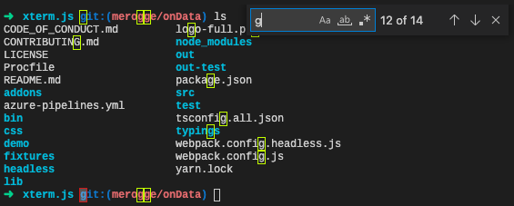

---
Order:
TOCTitle: April 2022
PageTitle: Visual Studio Code April 2022
MetaDescription: Learn what is new in the Visual Studio Code April 2022 Release (1.67)
MetaSocialImage: 1_67/release-highlights.png
Date: 2022-5-5
DownloadVersion: 1.67.2
---
# April 2022 (version 1.67)

**Update 1.67.1**: The update addresses this security [issue](https://github.com/microsoft/vscode/issues?q=is%3Aissue+milestone%3A%22April+2022+Recovery+1%22+is%3Aclosed).

**Update 1.67.2**: The update addresses these [issues](https://github.com/microsoft/vscode/issues?q=is%3Aissue+milestone%3A%22April+2022+Recovery+2%22+is%3Aclosed).

<!-- DOWNLOAD_LINKS_PLACEHOLDER -->

---

Welcome to the April 2022 release of Visual Studio Code. There are many updates in this version that we hope you'll like, some of the key highlights include:

* **[Explorer file nesting](#explorer-file-nesting)** - Nest generated files under source files in the Explorer.
* **[Settings editor filters](#settings-editor-search-filter-button)** - Filter button brings up searches such as @Modified settings
* **[Bracket pair colorization](#bracket-pair-colorization-enabled-by-default)** - Colored bracket pairs are now enabled by default.
* **[Toggle inlay hints](#toggle-inlay-hints)** - Ctrl+Alt to quickly hide or show inlay hints in the editor.
* **[Drag and drop to create Markdown links](#languages)** - Drop files into the editor to create Markdown links.
* **[Find All References in Markdown](#markdown-find-all-references-to-headers)** - Quickly find all references to headers, files, URLs.
* **[Java extension updates](#java)** - Now supporting inlay hints and lazy variable resolution.
* **[UX Guidelines for extension authors](#ux-guidelines)** - Guidance for VS Code extension UI best practices.
* **[New Rust language topic](#rust-in-vs-code)** - Learn how to use the Rust programming language in VS Code.

>If you'd like to read these release notes online, go to [Updates](https://code.visualstudio.com/updates) on [code.visualstudio.com](https://code.visualstudio.com).

**Watch the release party:** Listen in as the VS Code team discusses some of the new features. You can find the [recording of the event](https://www.youtube.com/watch?v=dpfy1V7C4Ho) on our YouTube channel.

**Highlights short:** If you just have 60 seconds, check out the [April VS Code release highlights](https://www.youtube.com/shorts/hKwrn5-7FjQ) video to quickly see what's new.

**Insiders:** Want to try new features as soon as possible? You can download the nightly [Insiders](https://code.visualstudio.com/insiders) build and try the latest updates as soon as they are available.

## Workbench

### Explorer file nesting

The Explorer now supports nesting related files based on their names. There are several settings to control this behavior:

* `explorer.fileNesting.enabled` - Controls whether file nesting is enabled at-large. It can be set either globally or for a specific workspace.
* `explorer.fileNesting.expand` - Controls whether nested files are expanded by default.
* `explorer.fileNesting.patterns` - Controls how files are nested. The default configuration provides nesting intelligence for TypeScript and JavaScript projects, but you're encouraged to modify this to fit your own project's structure. Some examples:

Default configuration:


Nesting under `index.ts` when a file matches the directory's name (`"index.ts": "${dirname}.ts"`):


Nesting files that have the same name as a different file but with an added segment (`"*": "${basename}.*.${extname}"`):


_Theme: [GitHub Light High Contrast](https://marketplace.visualstudio.com/items?itemName=GitHub.github-vscode-theme)_

File nesting has been available through an experimental setting for several iterations. The behavior now is mostly unchanged, except for file operations. The experimental setting `explorer.experimental.fileNesting.operateAsGroup` has been removed in favor of treating nests as a group when collapsed, but as single entities otherwise. This means that if you want to copy, cut, drag, or delete an entire nested stack of files, you can collapse the nest then operate on it as a single entity. When nested elements are expanded, selections will behave as normal.

### Settings editor search filter button

The Settings editor search control now contains a funnel button on the right side. Clicking on the button shows a list of filters that you can apply to the search query in order to filter down the results.


_Theme: [Light Pink](https://marketplace.visualstudio.com/items?itemName=mgwg.light-pink-theme)_

### Settings editor language filter indicator

Settings editor language filters now change the scope text to more clearly show which language is being acted on when a language filter is applied. The short video above shows the Markdown language filter (`@lang:markdown`) being applied to the filtered settings.

For reference, when a language filter is applied, modifying a setting's value will modify the value of that setting for that language only. [Language-specific settings](https://code.visualstudio.com/docs/getstarted/settings#_languagespecific-editor-settings) are scoped in `settings.json` by the [language identifier](https://code.visualstudio.com/docs/languages/overview#_language-identifier):

```json
  "[markdown]": {
      "editor.wordBasedSuggestions": "off"
  }
```

### Save files after refactoring

Refactorings, like Rename, often modify multiple files and leave them with unsaved changes (dirty). External development tools usually require these files to be saved. To make this workflow easier, there is a new setting `files.refactoring.autoSave` that defaults to `true` and controls if files that were part of a refactoring should be saved automatically.

### Exclude dirty editors in editor limit

A new setting `workbench.editor.limit.excludeDirty` controls if the maximum number of opened editors should exclude dirty editors for counting towards the configured limit. The setting is disabled by default (`false`).

### Bring back "Uncommitted Changes" to Timeline

When we introduced [Local History](https://code.visualstudio.com/updates/v1_66#_local-history) feature last month, we removed the **Uncommitted Changes** entry from the Git timeline provider because it felt a bit redundant. However, some users see real value in this timeline entry and now you can bring it back by configuring the new `git.timeline.showUncommitted` setting accordingly.

### New editor placeholder when opening fails

When an editor fails to open, VS Code no longer shows a notification and reveals the previous opened editor. Instead, there is a generic placeholder with the error message and, in some cases, actions to resolve the error.


### Language status improvements

The language status item now shows formatter conflicts - those happen when multiple formatters for a language are installed but none of them is configured as the default formatter. Also, the language status item is more prominent when containing severe status.


Additionally, the language status item will now show hints to switch languages when your document is suspected to be a different language than what is currently set. This applies only to untitled editors and notebook cells, and can be configured with the `workbench.editor.languageDetectionHints` setting. Below this is demonstrated in the [Handy Dandy Notebook](https://marketplace.visualstudio.com/items?itemName=jakearl.handydandy-notebook), which supports executing cells in various different languages.


_Theme: [GitHub Light High Contrast](https://marketplace.visualstudio.com/items?itemName=GitHub.github-vscode-theme)_

### Show invalid or incompatible extensions

The Extensions view now shows invalid or incompatible extensions in the **Installed** extension list with error status. For example, if your VS Code version is `1.67.0-insider` and you have installed an extension that requires VS Code version `1.68.0`, then it will show up in the list with incompatible error status.


### Confirm before quit

A new setting `window.confirmBeforeClose` can be configured to show a confirmation dialog before quitting the application.


You can either chose `keyboardOnly` to bring up the confirmation dialog when a keybinding is used or `always`, even when using the mouse to quit.

**Note**: The setting is not entirely new and has been available in [VS Code for Web](https://code.visualstudio.com/docs/editor/vscode-web) for some time.

### comments.openView default value

The old default value of `comments.openView` was `file`, which caused the Comments view to open every time a file with comments was opened. To make the Comments view less noisy, the new default is `firstFile`, which causes the Comments view to open only the first time a file with comments is opened during a session.

### Multiline comments

Behind the scenes, VS Code has supported multiline comments since the comments UX was finalized, but multiline comments were never surfaced in the UI. You can now see and leave multiline comments.


### Handle URI in new window

Whenever a VS Code URI contains a query parameter `windowId=_blank`, VS Code will handle it in a new window. Example: `vscode://vscode.git/clone?url=https%3A%2F%2Fgithub.com%2FMicrosoft%2Fvscode-vsce.git&windowId=_blank`.

## Editor

### Bracket pair colorization enabled by default

Given the positive feedback of the new bracket pair colorization feature introduced in the [1.60 release](https://code.visualstudio.com/updates/v1_60#_high-performance-bracket-pair-colorization), we enabled bracket pair colorization by default.


Bracket pair colorization can be disabled by setting `"editor.bracketPairColorization.enabled"` to `false`.

Bracket pair colorization can also be disabled just for specific languages:

```json
"[typescript]": {
  "editor.bracketPairColorization.enabled": false,
},
```

### TextMate grammars can mark tokens as unbalanced

Previously, TextMate grammars could not mark certain brackets as **unbalanced**, like the closing parenthesis in the case-statement of shell scripts:


To make bracket pair matching and colorization more robust, TextMate grammar contributions can now express that brackets in certain tokens should not be matched. In the `contributes` section of an extensions `package.json`, provided grammars can use the properties `balancedBracketScopes` (defaults to `["*"]`) and `unbalancedBracketScopes` (defaults to `[]`) to include or exclude scopes for bracket matching.

```json
"grammars": [{
    "language": "shellscript",
    "scopeName": "source.shell",
    "path": "./syntaxes/shell-unix-bash.tmLanguage.json",
    "balancedBracketScopes": [ "*" ],
    "unbalancedBracketScopes": [ "meta.scope.case-pattern.shell" ]
}],
```

With this feature, the grammar of the shell script can now indicate that `)` in case-statements should not be matched:


### New bracket matching algorithm

Bracket matching now uses the same [data structure](https://code.visualstudio.com/blogs/2021/09/29/bracket-pair-colorization) as bracket colorization. This both increases accuracy and performance.

Old bracket matching behavior (notice that the colors and the highlight decoration do not match):


New bracket matching behavior:


### Bracket guide improvements

Horizontal bracket guides now properly support wrapped lines. Also, bracket pairs that only span a single line get their own horizontal bracket guide.


Horizontal bracket guides are disabled by default and can be enabled with `"editor.guides.bracketPairsHorizontal": true`.

With this release, `"editor.guides.highlightActiveIndentation"` now accepts the value `"always"`. If set to `always`, indentation guides are highlighted even if there is already an active bracket pair.

### Toggle inlay hints

Inlay hints are a great way to show additional information right within your source code. However, sometimes you just want to see the actual source code. To support quickly hiding inlay hints, the `editor.inlayHints.enabled` setting has been changed: in addition to `on` and `off`, there are also values `onUnlessPressed` and `offUnlessPressed`. The `on/offUnlessPressed` values hide or show inlay hints while `Ctrl+Alt` is being pressed and held.

**Editor › Inlay Hints: Enabled** value:

* `on` - Inlay hints are enabled.
* `off` - Inlay hints are disabled.
* `onUnlessPressed` - Inlay hints shown and hidden with `Ctrl+Alt`.
* `offUnlessPressed` - Inlay hints hidden and shown with `Ctrl+Alt`.

### Improved inline suggestions

Last month we added the ability to use 👻 ghost text (faint coloring) for quick suggestions. Reminder: you need to use `inline` for the `editor.quickSuggestions` setting. We have done some polish work in this area, notably trigger characters and TypeScript "complete functions with arguments" are now supported.


To disable IntelliSense when typing trigger characters, like `.`, set `"editor.suggestOnTriggerCharacters": false`. To enable TypeScript function call completions, use `"typescript.suggest.completeFunctionCalls": true`.

### Drag and drop text into editor

You can now drag and drop text from other applications into a text editor. On macOS for example, this lets you drop an emoji from the emoji panel into a text editor:


While dragging, a dotted cursor shows you where the text will be inserted.

## Terminal

### Find result count

When searching in the terminal, the result count and currently selected match index are now displayed in the Find control.



## Source Control

### Source Control Repositories view

This milestone we have introduced a new setting, `scm.repositories.sortOrder`, to control the default sort order of the repositories displayed in the **Source Control Repositories** view. Repositories can be sorted by the order in which they are discovered, by name, and by full path. Changing the sort order can be done using the **...** **Views and More Actions** menu of the **Source Control Repositories** view and the **...** > **View & Sort** > **Repositories** menu of the **Source Control** view.

The short video below shows that the **SCM > Repositories: Sort Order** setting is by default `discovery time`, the time when the repositories were selected, and that you can also change the sort order in the Source Control views.


### Editor decoration improvements

Last milestone we improved the accessibility of the editor decorators for added/modified lines by adopting a pattern for the modified line decorators. This milestone, we added a new setting, `scm.diffDecorationsGutterPattern`, that lets users toggle the pattern for the editor decorators.


The setting defaults to using the pattern for the modified line decoration but not for added:

```json
"scm.diffDecorationsGutterPattern": {
    "added": false,
    "modified": true
}
```

### Performance improvements

Users that have the `git.untrackedChanges` setting set to `hidden` will experience better performance when working with large repositories. This is achieved by passing the `-uno` parameter when calling `git status`.

### Expanded remote source providers API

The Git extension API now allows extensions that register or display [remote source providers](https://code.visualstudio.com/updates/v1_45#_git) to provide richer information about remote sources.

Remote source providers can now set the description and icon for individual remote sources. Additionally, providers can optionally specify **recent** remote sources. These are displayed at the top level in the picker for easy access and sorted by timestamp if one is provided.

The expanded API has been adopted by the built-in GitHub extension, as well as the [GitHub Repositories](https://marketplace.visualstudio.com/items?itemName=GitHub.remotehub) and [Azure Repos](https://marketplace.visualstudio.com/items?itemName=ms-vscode.azure-repos) extensions in [github.dev](https://github.dev) and [vscode.dev](https://vscode.dev).

### Clone from GitHub using SSH

A new setting `github.gitProtocol` lets you change the default protocol when cloning a repository from GitHub. The value is `https` by default but can be changed to `ssh`.

## Debugging

### Auto-expand lazy variables

A couple months ago, we added support for clicking a button to expand "lazy" variables in the debugger Variables view. There is a new setting, `debug.autoExpandLazyVariables`, to automatically expand lazy variables without a click.

### New button for lazy variables

We've updated the text link button to a real button with the "eye" codicon. The "eye" codicon was also updated to look more eye-like.


### Shift-click to disable breakpoints

You can now `Shift+Click` on a breakpoint (or conditional breakpoint, or logpoint) to disable it, and to re-enable it.


## Languages

### Markdown: Drop into editor to create link

You can now quickly create Markdown links by dragging and dropping files from VS Code's Explorer into a Markdown editor. Hold `Shift` while dragging the file over a Markdown editor to drop it into the editor and create a link to it:


If the file looks like an image, VS Code will automatically insert a Markdown image. Otherwise a normal Markdown link is added.

This also works when dragging some types of files from other applications, such as dragging and dropping images from a web browser:


You can disable this drop behavior by setting `"markdown.editor.drop.enabled": false`.

### Markdown: Find All References to headers

VS Code now supports running **Find All References** in Markdown files for headers. This lets you see all the places where a given header is used within the current workspace, including links to it from other Markdown files.

To get started, place your cursor either on the header itself or on the fragment part of a link to the header (for example, `#some-header` in `[link text](#some-header)` or `[link text](/path/to/file#some-header)`) and run **Find All References**.


This will show all references in the References view. If you prefer a different view, you can also use the **Peek References** or **Go to References** commands.

### Markdown: Find all references to reference links

VS Code also supports finding all references to [reference links](https://spec.commonmark.org/0.30/#reference-link) within the current file. This is supported for:

* On `ref` in `[some text][ref]`.
* On `ref` in the shorthand link `[ref]`.
* On `ref` in the link definition `[ref]: http://example.com`.


### Markdown: Find all references to files

You can also now find all the references to a given Markdown file in the current workspace. Again this includes links across files.

This can be triggered in a few ways:

* To find references to the current Markdown file, use the **Markdown: Find File References** command.
* To find references to a Markdown file in the Explorer, right-click on it and run **Find File References** command.
* Run **Find All References** on the file part of a link to a Markdown file, such as `[text](/link/to/file.md)`.


This will list all places where a given file is referenced, including references to headers within that file.

### Markdown: Find all references to URLs

Finally, we also support finding all places where a given URL is used in the current workspace.


### Markdown: Rename headers

Ever change a header in a Markdown file only to realize that you also accidentally broke all links to it? That's where our new rename support for Markdown can help.

To get started, place your cursor on a header and then press `F2` to start a rename. Enter the new text for the header and then press `Enter` to accept. This will both update the current header as well as updating all known links to it in the current workspace.


You can trigger renames on the header itself or on the header component of a link to the header. For example, `some-header` in `[link text](#some-header)` or `[link text](/path/to/file#some-header)`.

### Markdown: Rename reference links

You can also rename reference links in Markdown. This will update all the reference links in the current Markdown file:


### Markdown: Rename files

Rounding out our new Markdown rename support, you can now use `F2` on file paths in Markdown links to both rename the file on disk as well as updating all Markdown references to it:


Currently renaming files is only supported using `F2` on a link to the file in the text editor. In upcoming iterations, we also plan to support update links when a rename is triggered in the Explorer.

### JSON

The new setting `json.validate.enable` lets you turn off the JSON validation.

## VS Code for the Web

### Open Remote Repository picker

VS Code for the Web now respects the `window.openFoldersInNewWindow` setting when you use the **Open Remote Repository** picker. This aligns the picker behavior with the other versions of VS Code and replaces the **Open in New Window** Quick Pick item button.

## Contributions to extensions

### Java

**Inlay hints**

The Java language service included in the [Extension Pack for Java](https://marketplace.visualstudio.com/items?itemName=vscjava.vscode-java-pack) now supports [inlay hints](https://code.visualstudio.com/docs/editor/editingevolved#_inlay-hints) to show parameter names for method signatures.


There are three modes for Java parameter name inlay hints:

* `literals` - Enable parameter name hints only for literal arguments (default).
* `all` - Enable parameter name hints for literal and non-literal arguments.
* `none` - Disable parameter name hints.

**Lazy variable resolution**

The [Debugger for Java](https://marketplace.visualstudio.com/items?itemName=vscjava.vscode-java-debug) extension now supports ['lazy' variables](https://code.visualstudio.com/updates/v1_65#_support-for-lazy-variables). This feature lets you defer the operations for an expensive variable until you explicitly expand the debugger UI to see it's value.


### Jupyter

**Jupyter PowerToys extension**

We are excited to announce the [Jupyter PowerToys](https://marketplace.visualstudio.com/items?itemName=ms-toolsai.vscode-jupyter-powertoys) extension that provides experimental functionality for working with Jupyter notebooks. In its first release, we have prototyped the following features:

* Kernel management panel
* Contextual help
* Execution grouping

We'd love for you to take these for a spin and let us know what you think so that we can hone them into a supported feature someday!

For more information, refer to the README in the [vscode-jupyter-powertoys](https://github.com/microsoft/vscode-jupyter-powertoys) repository.

**Web extension**

The [Jupyter](https://marketplace.visualstudio.com/itemdetails?itemName=ms-toolsai.jupyter) extension can now be installed as a web extension for use with [vscode.dev](https://vscode.dev). Functionality is currently limited with support only for notebooks (`.ipynb` files) being run on Jupyter servers that do not require https.

If you'd like to experiment with the functionality, launch Jupyter from your local machine with:

```bash
jupyter --no-browser --NotebookApp.allow_origin_pat=https://.*\.vscode-cdn\.net
```

And connect to it using the command **Jupyter: Specify Jupyter server for connections**.

In upcoming releases, we will be enabling more features when running in a browser, including:

* 'https' based servers
* IntelliSense
* Data viewing
* Variable viewing
* Interactive window
* IPyWidgets
* Plot viewing
* Exporting

**Jupyter kernel handling**

A number of updates were made to Jupyter kernel handling:

* To make it more obvious when a kernel has crashed, the extension now displays this information in cell output.
* There is now troubleshooting guidance in cell output when certain known errors are detected during execution.
* Solving kernel execution problems can be a tricky and time consuming process. We've put together a [troubleshooting section](https://github.com/microsoft/vscode-jupyter/wiki) on our wiki that we hope can help guide you to a solution quicker. Our [GitHub Discussions forum](https://github.com/microsoft/vscode-jupyter/discussions) can be a great resource for obtaining help as well.

### Python

**No reload when changing language servers**

The [Python](https://marketplace.visualstudio.com/items?itemName=ms-python.python) extension now supports updating the value of the `python.languageServer` setting and automatically restarting the language server without needing to reload VS Code.

**Black formatter extension**

There is now a [Black Formatter](https://marketplace.visualstudio.com/items?itemName=ms-python.black-formatter) extension that provides formatting support for Python using the [black](https://pypi.org/project/black/) formatter. A pre-release version of the extension is available to install.

**Import organization with isort**

New [isort](https://marketplace.visualstudio.com/items?itemName=ms-python.isort) extension, which provides import organization using the [isort](https://pypi.org/project/isort/) library. A pre-release version of the extension is available.

### Remote Development

Work continues on the [Remote Development extensions](https://marketplace.visualstudio.com/items?itemName=ms-vscode-remote.vscode-remote-extensionpack), which allow you to use a container, remote machine, or the [Windows Subsystem for Linux](https://learn.microsoft.com/windows/wsl) (WSL) as a full-featured development environment.

You can learn about new extension features and bug fixes in the [Remote Development release notes](https://github.com/microsoft/vscode-docs/blob/main/remote-release-notes/v1_67.md).

### GitHub Pull Requests and Issues

Work continues on the [GitHub Pull Requests and Issues](https://marketplace.visualstudio.com/items?itemName=GitHub.vscode-pull-request-github) extension, which allows you to work on, create, and manage pull requests and issues. Highlights of this release include:

* Multiline comments
* Showing commit changes in a tree

Check out the [changelog for the 0.42.0](https://github.com/microsoft/vscode-pull-request-github/blob/main/CHANGELOG.md#0420) release of the extension to see the other highlights.

## Preview Features

### Settings Profile

In this milestone, we introduced **Settings Profile** that is a collection of your settings, extensions, and UI customizations. If you customized VS Code, you can now export your customizations to a Settings Profile file (`mysetup.code-profile`) and save it to your computer and share it with others.

The following short video shows exporting a Settings Profile from VS Code:


You can also import a Settings Profile file to restore your customizations.

Below shows importing a Settings Profile into VS Code:


You can host your Settings Profile file in the cloud, for example save it as a public GitHub gist, and share the URL with others. One can import the Settings Profile file by providing the URL.

**Note:** At present, only the following UI customizations are included in the Settings Profile. More will be added in the future.

* Status bar items visibility
* Activity Bar, Bottom Panel & Side Panel items visibility and order
* Views visibility, location and order

### TypeScript 4.7 Support

This update includes support for the upcoming TypeScript 4.7 release. See the [TypeScript 4.7 iteration plan](https://github.com/microsoft/TypeScript/issues/48027) for more details on what the TypeScript team is currently working on. Some highlights:

* Jump directly to a JavaScript implementation of a library function using the new **Go to Source Definition** command. You can learn more about this feature and share feedback in [TypeScript issue #49003](https://github.com/microsoft/TypeScript/issues/49003).
* Snippets for completing methods as object members.
* [Group-aware Organize Imports](https://devblogs.microsoft.com/typescript/announcing-typescript-4-7-beta/#groups-aware-organize-imports).

To start using the TypeScript 4.7 nightly builds, install the [TypeScript Nightly](https://marketplace.visualstudio.com/items?itemName=ms-vscode.vscode-typescript-next) extension.

## Extension authoring

### Tab API

We have finalized the read-only side of the tabs API (closing a tab is also supported) marking the completion of one of our most upvoted issues [microsoft/vscode#15178](https://github.com/microsoft/vscode/issues/15178). This exposes information such as how many groups there are, what tabs are open, what tabs are active, what type of editors a tab represents, and more! More information can be found in the `vscode.d.ts` file with the entrypoint into the API being `window.tabGroups`.

### Notebook change and save events

We have finalized two notebook-related events:

* `vscode.workspace.onDidSaveNotebookDocument` - An event that fires whenever a notebook has been saved.
* `vscode.workspace.onDidChangeNotebookDocument` - An event that fires whenever a notebook has been changed. That includes structural changes, like adding or remove cells, as well as cell changes, like changing output or metadata.

### Support for non-recursive workspace file watchers

In previous milestones, we [announced](https://code.visualstudio.com/updates/v1_64#_vscodeworkspacecreatefilesystemwatcher-now-supports-any-path) that the `createFileSystemWatcher` API can be used to watch any folder on disk as long as the folder is not inside the opened workspace. We have now relaxed this restriction and allow non-recursive file watchers anywhere, even inside the opened workspace. Non-recursive watchers have the advantage that configured settings for excludes (`files.watcherExclude`) do not apply so you can be sure that the file watcher will only emit for the paths you subscribe to.

We are working on full support for recursive watchers with custom exclude rules for extensions, so stay tuned for more!

### UX Guidelines

The [UX Guidelines](https://code.visualstudio.com/api/ux-guidelines) for extension authors has been redone to have its own table of contents, where you can find best practices for using the various VS Code user interface elements. Specific topics discuss the recommended Do's and Don't's when creating UI for your extensions so that they seamlessly integrate within VS Code.


### Running extension tests

Before, VS Code would exit the extension host process as soon as test running was finished. Now, when running extension tests, VS Code will first go through the regular `deactivate` flow and only afterwards exit. This allows extensions that spawn processes to better clean up after themselves.

### Dropping files into custom trees

Building on the recently finalized tree drag and drop API, we now have basic support for dropping files from the OS into extension tree views using the `text/uri-list` MIME type.

## Debugger extension authoring

### UI for supportSuspendDebuggee and supportTerminateDebuggee

The `disconnect` request has two extra options that enable a client to control what happens to a debuggee when disconnecting:

* `suspendDebuggee` indicates whether the debuggee should stay suspended after disconnection.
* `terminateDebuggee` indicates whether the debuggee should be terminated when the debugger is disconnected.

A debug adapter can use the capabilities `supportSuspendDebuggee` and `supportTerminateDebuggee` to signal that it supports these options. When supported, a dropdown will appear next to the stop button in the debug toolbar with extra disconnect commands.

For example, in a "launch"-type debug session, for a debug adapter that supports both capabilities, the default toolbar button will be the normal **Stop** button, but the dropdown will include **Disconnect** (`terminateDebuggee: false`) and **Disconnect and Suspend** (`terminateDebuggee: false, suspendDebuggee: true`).


## Language Server Protocol

Support for notebooks and pull diagnostics has been moved out of the proposed state to be ready to ship the 3.17 release. New versions of the corresponding client and server libraries have been published to npm.

## Proposed APIs

Every milestone comes with new proposed APIs and extension authors can try them out. As always, we want your feedback. Here are the steps to try out a proposed API:

1. [Find a proposal that you want to try](https://github.com/microsoft/vscode/tree/main/src/vscode-dts) and add its name to `package.json#enabledApiProposals`.
1. Use the latest [vscode-dts](https://www.npmjs.com/package/vscode-dts) and run `vscode-dts dev`. It will download the corresponding `d.ts` files into your workspace.
1. You can now program against the proposal.

You cannot publish an extension that uses a proposed API. There may be breaking changes in the next release and we never want to break existing extensions.

### Drop into editor

The proposed [text editor drop API](https://github.com/microsoft/vscode/blob/800eec5645cf45d3cae5f49d4fc18e76e0e028ab/src/vscode-dts/vscode.proposed.textEditorDrop.d.ts#L10) lets extensions handle drops into text editors. These drop events can come from within VS Code—such as dragging a file from VS Code's Explorer into a text editor—or can be generated by dropping a file from your operating system into VS Code.


This iteration we've switched this API to a provider based model. We've also created a [new extension sample](https://github.com/microsoft/vscode-extension-samples/tree/main/drop-on-document) that demonstrates how to use this api.

### Badges on views

The new proposal for [adding badges to views](https://github.com/microsoft/vscode/blob/9be0d5ed05ea064568515e455d8488e3d523d0a8/src/vscode-dts/vscode.proposed.badges.d.ts#L10-L40) is available to try out. Similar to how badges work on views provided by VS Code core, extensions can use this API proposal to add number badges to views.

## Engineering

### Playwright for Electron smoke tests

We have been using [Playwright](https://playwright.dev/) for our web-based smoke tests for a long time. However, our Electron-based smoke tests were still relying on our own custom solution. With the [Electron support](https://playwright.dev/docs/api/class-electron) in Playwright, we were able to reuse most of our web-based smoke test code and use it for our Electron smoke tests too. We are excited to now use the [Trace Viewer](https://playwright.dev/docs/trace-viewer) to diagnose failing smoke tests post-mortem.

### New localization pipeline for extensions

VS Code supports a number of [display languages](https://code.visualstudio.com/docs/getstarted/locales) that you can enable by installing a language pack. These are great for localizing VS Code itself and built-in extensions to VS Code. This iteration, we have started the standardization effort for localizing extensions that aren't built-in that the team owns. You'll see the results of this effort in the [GitHub Repositories](https://marketplace.visualstudio.com/items?itemName=GitHub.remotehub) and [Azure Repos](https://marketplace.visualstudio.com/items?itemName=ms-vscode.azure-repos) extensions as their common dependency extension, [Remote Repositories](https://marketplace.visualstudio.com/items?itemName=ms-vscode.remote-repositories), is the first extension to onboard to this.

Next iteration, we will continue this standardization effort and onboard more extensions. The [Python](https://marketplace.visualstudio.com/items?itemName=ms-python.python) extension is currently in progress and GitHub Repositories and Azure Repos will be quick to follow. We want to get to a point where every extension owned by the team is localized and any new extension created in the future will be able to onboard with ease so that users who aren't native English speakers can have a great experience in VS Code.

## Documentation

### Rust in VS Code

There is a new [Rust in Visual Studio Code](https://code.visualstudio.com/docs/languages/rust) topic describing [Rust programming language](https://www.rust-lang.org/) support in VS Code with the [rust-analyzer](https://marketplace.visualstudio.com/items?itemName=rust-lang.rust-analyzer) extension. The rust-analyzer extension includes rich language features such as code completions, linting, refactorings, debugging, and more.


## Notable fixes

* [114844](https://github.com/microsoft/vscode/issues/114844) Allow to skip restore editors from previous session from crash dialog
* [127936](https://github.com/microsoft/vscode/issues/127936) Allow to set `files.encoding` as language specific setting for files on startup
* [138461](https://github.com/microsoft/vscode/issues/138461) Emmet autocomplete inside a pair of [ ] in a React file is wrong
* [139392](https://github.com/microsoft/vscode/issues/139392) Confirmation of Clear Recent projects
* [139950](https://github.com/microsoft/vscode/issues/139950) When a breakpoint is hit, the caret (cursor) should move to that line
* [145265](https://github.com/microsoft/vscode/issues/145265) Terminal on Windows uses cmd /C, this corrupts passed arguments
* [146406](https://github.com/microsoft/vscode/issues/146406) Powerline symbols in the terminal get wrong colors
* [146977](https://github.com/microsoft/vscode/issues/146977) Declare folder support in Info.plist on macOS
* [147104](https://github.com/microsoft/vscode/issues/147104) Unable to finish logging in to GitHub

## Thank you

Last but certainly not least, a big _**Thank You**_ to the contributors of VS Code.

### Web extensions

Extension authors for enabling extensions that run code as [web extensions](https://code.visualstudio.com/api/extension-guides/web-extensions) (the list below is between March 28 2022 and May 1 2022):

* [Logos for VS Code](https://marketplace.visualstudio.com/items?itemName=tale.logos-vscode) ([Aarnav Tale](https://marketplace.visualstudio.com/publishers/tale))
* [Copy Word in Cursor](https://marketplace.visualstudio.com/items?itemName=alefragnani.copy-word) ([Alessandro Fragnani](https://marketplace.visualstudio.com/publishers/alefragnani))
* [Delphi Keymap](https://marketplace.visualstudio.com/items?itemName=alefragnani.delphi-keybindings) ([Alessandro Fragnani](https://marketplace.visualstudio.com/publishers/alefragnani))
* [Pascal](https://marketplace.visualstudio.com/items?itemName=alefragnani.pascal) ([Alessandro Fragnani](https://marketplace.visualstudio.com/publishers/alefragnani))
* [Separators](https://marketplace.visualstudio.com/items?itemName=alefragnani.separators) ([Alessandro Fragnani](https://marketplace.visualstudio.com/publishers/alefragnani))
* [Tagged Comment](https://marketplace.visualstudio.com/items?itemName=alefragnani.tagged-comment) ([Alessandro Fragnani](https://marketplace.visualstudio.com/publishers/alefragnani))
* [NeuroViewer](https://marketplace.visualstudio.com/items?itemName=anibalsolon.neuro-viewer) ([Anibal Solon](https://marketplace.visualstudio.com/publishers/anibalsolon))
* [sb4-extension](https://marketplace.visualstudio.com/items?itemName=arrow2nd.sb4-extension) ([arrow2nd](https://marketplace.visualstudio.com/publishers/arrow2nd))
* [DeloresDevDev](https://marketplace.visualstudio.com/items?itemName=bolinfest.delores-dev-dev) ([bolinfest](https://marketplace.visualstudio.com/publishers/bolinfest))
* [VSCode Remote Server](https://marketplace.visualstudio.com/items?itemName=btwiuse.vscode-remote-server) ([btwiuse](https://marketplace.visualstudio.com/publishers/btwiuse))
* [Text Toolbox](https://marketplace.visualstudio.com/items?itemName=CarloCardella.vscode-texttoolbox) ([Carlo Cardella](https://marketplace.visualstudio.com/publishers/carlocardella))
* [CloudStudio.common](https://marketplace.visualstudio.com/items?itemName=CloudStudio.common) ([CloudStudio](https://marketplace.visualstudio.com/publishers/CloudStudio))
* [Vsnips](https://marketplace.visualstudio.com/items?itemName=corvofeng.Vsnips) ([corvofeng](https://marketplace.visualstudio.com/publishers/corvofeng))
* [Const & Props Snippets](https://marketplace.visualstudio.com/items?itemName=deinsoftware.const-props-snippets) ([dein Software](https://marketplace.visualstudio.com/publishers/deinsoftware))
* [dein Snippets Pack](https://marketplace.visualstudio.com/items?itemName=deinsoftware.dein-snippets-pack) ([dein Software](https://marketplace.visualstudio.com/publishers/deinsoftware))
* [EVSCode Web IDE Connector (web, experimental)](https://marketplace.visualstudio.com/items?itemName=Elrond.evscode-web-ide-connector-experimental) ([Elrond](https://marketplace.visualstudio.com/publishers/Elrond))
* [String To Any Case](https://marketplace.visualstudio.com/items?itemName=gauseen.vscode-string-transform) ([gauseen](https://marketplace.visualstudio.com/publishers/gauseen))
* [Image Gallery](https://marketplace.visualstudio.com/items?itemName=GeriYoco.vscode-image-gallery) ([GeriYoco](https://marketplace.visualstudio.com/publishers/GeriYoco))
* [模袋云-modelo](https://marketplace.visualstudio.com/items?itemName=heekei.modelo) ([heekei zhuang](https://marketplace.visualstudio.com/publishers/heekei))
* [sigma](https://marketplace.visualstudio.com/items?itemName=humpalum.sigma) ([humpalum](https://marketplace.visualstudio.com/publishers/humpalum))
* [My Snippets](https://marketplace.visualstudio.com/items?itemName=JaedeokKim.real-my-snippets) ([Jaedeok Kim](https://marketplace.visualstudio.com/publishers/JaedeokKim))
* [GCS Uploader](https://marketplace.visualstudio.com/items?itemName=kb-devs.zz-gcs-sync) ([kb-devs](https://marketplace.visualstudio.com/publishers/kb-devs))
* [TEI Japanese Editor Web](https://marketplace.visualstudio.com/items?itemName=ldas.vscode-japanese-tei-web) ([ldas](https://marketplace.visualstudio.com/publishers/ldas))
* [tal7aouy.indent-colorizer](https://marketplace.visualstudio.com/items?itemName=tal7aouy.indent-colorizer) ([Mhammed Talhaouy](https://marketplace.visualstudio.com/publishers/tal7aouy))
* [minim-tools.m-web](https://marketplace.visualstudio.com/items?itemName=minim-tools.m-web) ([minim-tools](https://marketplace.visualstudio.com/publishers/minim-tools))
* [UUID Generator](https://marketplace.visualstudio.com/items?itemName=motivesoft.vscode-uuid-generator) ([Motivesoft](https://marketplace.visualstudio.com/publishers/motivesoft))
* [TyranoScript syntax](https://marketplace.visualstudio.com/items?itemName=orukred-tyranosyntax.tyranosyntax) ([orukred](https://marketplace.visualstudio.com/publishers/orukred-tyranosyntax))
* [VDM VSCode](https://marketplace.visualstudio.com/items?itemName=overturetool.vdm-vscode) ([Overture](https://marketplace.visualstudio.com/publishers/jonaskrask))
* [Excalidraw](https://marketplace.visualstudio.com/items?itemName=pomdtr.excalidraw-editor) ([pomdtr](https://marketplace.visualstudio.com/publishers/pomdtr))
* [WebGL GLSL Editor](https://marketplace.visualstudio.com/items?itemName=raczzalan.webgl-glsl-editor) ([Rácz Zalán](https://marketplace.visualstudio.com/publishers/raczzalan))
* [Vue](https://marketplace.visualstudio.com/items?itemName=znck.vue) ([Rahul Kadyan](https://marketplace.visualstudio.com/publishers/znck))
* [VueDX](https://marketplace.visualstudio.com/items?itemName=znck.vue-language-features) ([Rahul Kadyan](https://marketplace.visualstudio.com/publishers/znck))
* [BDD Goto Step](https://marketplace.visualstudio.com/items?itemName=rioj7.vscode-bdd-gotostep) ([rioj7](https://marketplace.visualstudio.com/publishers/rioj7))
* [Extra Context](https://marketplace.visualstudio.com/items?itemName=rioj7.extra-context) ([rioj7](https://marketplace.visualstudio.com/publishers/rioj7))
* [web_prolin_emulator](https://marketplace.visualstudio.com/items?itemName=runthoser.web-prolin-emulator) ([runthoser](https://marketplace.visualstudio.com/publishers/runthoser))
* [Go Nav Bar](https://marketplace.visualstudio.com/items?itemName=Scotthew.go-nav-bar) ([Scotthew](https://marketplace.visualstudio.com/publishers/Scotthew))
* [yaist-vscode](https://marketplace.visualstudio.com/items?itemName=toyjack.yaist-vscode) ([toyjack](https://marketplace.visualstudio.com/publishers/toyjack))
* [Pyodide Runner](https://marketplace.visualstudio.com/items?itemName=tym-inc.pyodide) ([tym-inc](https://marketplace.visualstudio.com/publishers/tym-inc))
* [Import Cost](https://marketplace.visualstudio.com/items?itemName=wix.vscode-import-cost) ([Wix](https://marketplace.visualstudio.com/publishers/wix))
* [Lawtext](https://marketplace.visualstudio.com/items?itemName=yamachi.lawtext) ([yamachi](https://marketplace.visualstudio.com/publishers/yamachi))
* [ZG Assembler](https://marketplace.visualstudio.com/items?itemName=ZENG-GE.zg-assembler) ([ZENG GE](https://marketplace.visualstudio.com/publishers/ZENG-GE))

### Issue tracking

Contributions to our issue tracking:

* [John Murray (@gjsjohnmurray)](https://github.com/gjsjohnmurray)
* [Andrii Dieiev (@IllusionMH)](https://github.com/IllusionMH)
* [Simon Chan (@yume-chan)](https://github.com/yume-chan)
* [Lemmingh (@Lemmingh)](https://github.com/Lemmingh)

### Pull requests

Contributions to `vscode`:

* [@100paperkite](https://github.com/100paperkite)
  * Fixes #146305 [PR #146449](https://github.com/microsoft/vscode/pull/146449)
  * Fixes #147420 [PR #147930](https://github.com/microsoft/vscode/pull/147930)
* [@a-stewart (Anthony Stewart)](https://github.com/a-stewart)
  * Create an empty div.message-actions-container when no actions provided [PR #140578](https://github.com/microsoft/vscode/pull/140578)
  * Update the colouring of links in banner markdown [PR #140581](https://github.com/microsoft/vscode/pull/140581)
  * Rename user facing instances of SCM to Source Control [PR #146742](https://github.com/microsoft/vscode/pull/146742)
* [@AkatQuas (Akat)](https://github.com/AkatQuas): fix(markdown): avoid considering link references/sources in code sections [PR #146826](https://github.com/microsoft/vscode/pull/146826)
* [@amanasifkhalid (Aman Khalid)](https://github.com/amanasifkhalid)
  * Close #143241: Testing UI filter survives window reload [PR #147344](https://github.com/microsoft/vscode/pull/147344)
  * Fix #146166: Snippet transform preserves existing camel/Pascal case [PR #147422](https://github.com/microsoft/vscode/pull/147422)
* [@ambar (ambar)](https://github.com/ambar): fix parenthesis encoding in unicode highlighting [PR #146248](https://github.com/microsoft/vscode/pull/146248)
* [@andschwa (Andy Schwartzmeyer)](https://github.com/andschwa): Delete built-in PowerShell snippets [PR #146459](https://github.com/microsoft/vscode/pull/146459)
* [@babakks (Babak K. Shandiz)](https://github.com/babakks): Ask user to select PR templates when forking a repository [PR #143733](https://github.com/microsoft/vscode/pull/143733)
* [@Balastrong (Leonardo Montini)](https://github.com/Balastrong)
  * 145367 Added cwd to terminal name if present [PR #145620](https://github.com/microsoft/vscode/pull/145620)
  * Replaced true and false with on and off in debug.inlineValues [PR #146543](https://github.com/microsoft/vscode/pull/146543)
* [@bytemain (Artin)](https://github.com/bytemain): Fix `TerminalProfile` not throw [PR #143251](https://github.com/microsoft/vscode/pull/143251)
* [@cdce8p (Marc Mueller)](https://github.com/cdce8p): Fix `git` getBranch [v1.65.0] [PR #144449](https://github.com/microsoft/vscode/pull/144449)
* [@CGNonofr (Loïc Mangeonjean)](https://github.com/CGNonofr): Fix freezed folding blocks while computing new ones [PR #146545](https://github.com/microsoft/vscode/pull/146545)
* [@dlech (David Lechner)](https://github.com/dlech): Fix editor eating ContextMenu key when contexmenu is disabled [PR #146968](https://github.com/microsoft/vscode/pull/146968)
* [@eamodio (Eric Amodio)](https://github.com/eamodio): Fixes #140787 watches proper worktree dir [PR #140789](https://github.com/microsoft/vscode/pull/140789)
* [@gabritto (Gabriela Araujo Britto)](https://github.com/gabritto): Add support for label details in TS completion item [PR #146270](https://github.com/microsoft/vscode/pull/146270)
* [@gjsjohnmurray (John Murray)](https://github.com/gjsjohnmurray): Add 'Evaluate in Debug Console' and 'Add to Watch' to palette [PR #146775](https://github.com/microsoft/vscode/pull/146775)
* [@heartacker](https://github.com/heartacker): add the git.fetch action to the first header menu [PR #137940](https://github.com/microsoft/vscode/pull/137940)
* [@hello-smile6](https://github.com/hello-smile6): Update package.json [PR #146278](https://github.com/microsoft/vscode/pull/146278)
* [@IllusionMH (Andrii Dieiev)](https://github.com/IllusionMH): Fix version in error message [PR #147750](https://github.com/microsoft/vscode/pull/147750)
* [@ImCa0 (ImCaO)](https://github.com/ImCa0): Fix spell check errors in translatable strings [PR #147234](https://github.com/microsoft/vscode/pull/147234)
* [@jhgg (Jake)](https://github.com/jhgg): feat: inlay hints displayStyle [PR #145470](https://github.com/microsoft/vscode/pull/145470)
* [@jlelong (Jerome Lelong)](https://github.com/jlelong): Update to vscode-latex-basics 1.3.0 [PR #146308](https://github.com/microsoft/vscode/pull/146308)
* [@jsjoeio (Joe Previte)](https://github.com/jsjoeio)
  * refactor(workbench.ts): update outdated comment [PR #146364](https://github.com/microsoft/vscode/pull/146364)
  * fix(service-worker): allow webview resources to be served from same domain [PR #147467](https://github.com/microsoft/vscode/pull/147467)
* [@laurentlb (Laurent Le Brun)](https://github.com/laurentlb)
  * Comments panel: use the date of the last reply [PR #147922](https://github.com/microsoft/vscode/pull/147922)
  * Comments panel: do not truncate the author name [PR #147924](https://github.com/microsoft/vscode/pull/147924)
* [@luoriyuhui21 (Keming Liang)](https://github.com/luoriyuhui21):  Add a setting to ignore dirty tabs in workbench.editor.limit.value. [PR #144545](https://github.com/microsoft/vscode/pull/144545)
* [@manunamz (manunam)](https://github.com/manunamz): Update markdownRenderer.ts path in docstring. [PR #146332](https://github.com/microsoft/vscode/pull/146332)
* [@matthewjamesadam (Matt Adam)](https://github.com/matthewjamesadam): Implement badge API for webviews and treeviews [PR #144775](https://github.com/microsoft/vscode/pull/144775)
* [@mbelsky (Max Belsky)](https://github.com/mbelsky): Disable a breakpoint on shift+click [PR #147598](https://github.com/microsoft/vscode/pull/147598)
* [@michaelkuhn (Michael Kuhn)](https://github.com/michaelkuhn): Unify and fix Solarized token colors [PR #142883](https://github.com/microsoft/vscode/pull/142883)
* [@neeleshb (Neelesh Bodas)](https://github.com/neeleshb): Misc. A11y fixes for VSCode [PR #145775](https://github.com/microsoft/vscode/pull/145775)
* [@nesk (Johann Pardanaud)](https://github.com/nesk): Improve UX for markdown snippets [PR #146431](https://github.com/microsoft/vscode/pull/146431)
* [@quanzhuo (Quan Zhuo)](https://github.com/quanzhuo)
  * Fix issue #145134, fetch all repos for authenticated user [PR #145203](https://github.com/microsoft/vscode/pull/145203)
  * fix #140612: toggle the Toggle Button when the context line number la… [PR #147141](https://github.com/microsoft/vscode/pull/147141)
* [@Suven-p (Suven-p)](https://github.com/Suven-p): Add action to hide all tests [PR #148003](https://github.com/microsoft/vscode/pull/148003)
* [@tharbakim](https://github.com/tharbakim): Fix detection of CSS Preprocessor Comments at Start of File in Emmet Extension [PR #146121](https://github.com/microsoft/vscode/pull/146121)
* [@thekorn (Markus Korn)](https://github.com/thekorn): git extension: if 'git.untrackedChanges' is set to 'hidden' ignore untracked files when running 'git status' (fixes microsoft/vscode#131020) [PR #131030](https://github.com/microsoft/vscode/pull/131030)
* [@yepitschunked](https://github.com/yepitschunked): [Git watcher] ignore watchman cookies [PR #127702](https://github.com/microsoft/vscode/pull/127702)

Contributions to `vscode-css-languageservice`:

* [@romainmenke (Romain Menke)](https://github.com/romainmenke): fix selector specificity display for `:lang` and similar pseudo selectors [PR #268](https://github.com/microsoft/vscode-css-languageservice/pull/268)

Contributions to `vscode-generator-code`:

* [@rupeshs (Rupesh Sreeraman)](https://github.com/rupeshs): Fix for ext-snippets quick start documentation [PR #340](https://github.com/microsoft/vscode-generator-code/pull/340)

Contributions to `vscode-js-debug`:

* [@timvahlbrock](https://github.com/timvahlbrock)
  * feat: apply pathMapping when loading sourcemaps [PR #1241](https://github.com/microsoft/vscode-js-debug/pull/1241)
  * feat: make hover evaluation timeout configurable [PR #1243](https://github.com/microsoft/vscode-js-debug/pull/1243)

Contributions to `vscode-pull-request-github`:

* [@hoontae24](https://github.com/hoontae24): Support the copied permalink for Github Enterprise URL [PR #3460](https://github.com/microsoft/vscode-pull-request-github/pull/3460)

Contributions to `debug-adapter-protocol`:

* [@KamasamaK](https://github.com/KamasamaK): Fix some typos [PR #264](https://github.com/microsoft/debug-adapter-protocol/pull/264)
* [@peterderivaz (Peter de Rivaz)](https://github.com/peterderivaz): Fix description for SetBreakpointsArguments [PR #261](https://github.com/microsoft/debug-adapter-protocol/pull/261)
* [@polinasok](https://github.com/polinasok): Update adapters.md for Go debug adapter [PR #262](https://github.com/microsoft/debug-adapter-protocol/pull/262)
* [@WardenGnaw (Andrew Wang)](https://github.com/WardenGnaw): Remove extra newline in adapters.md [PR #263](https://github.com/microsoft/debug-adapter-protocol/pull/263)

Contributions to `language-server-protocol`:

* [@KamasamaK](https://github.com/KamasamaK)
  * Add `workspace.inlineValue` to capabilities [PR #1440](https://github.com/microsoft/language-server-protocol/pull/1440)
  * Add some missing linkable types [PR #1441](https://github.com/microsoft/language-server-protocol/pull/1441)
  * Use FoldingRangeKind for kind [PR #1450](https://github.com/microsoft/language-server-protocol/pull/1450)

Contributions to `monaco-editor`:

* [@DetachHead](https://github.com/DetachHead): add `out` keyword to typescript [PR #3066](https://github.com/microsoft/monaco-editor/pull/3066)
* [@Yash-Singh1 (Yash Singh)](https://github.com/Yash-Singh1): feat: add fr units for css grid [PR #3078](https://github.com/microsoft/monaco-editor/pull/3078)

<!-- In-product release notes styles.  Do not modify without also modifying regex in gulpfile.common.js -->
<a id="scroll-to-top" role="button" title="Scroll to top" aria-label="scroll to top" href="#"><span class="icon"></span></a>
<link rel="stylesheet" type="text/css" href="css/inproduct_releasenotes.css"/>
