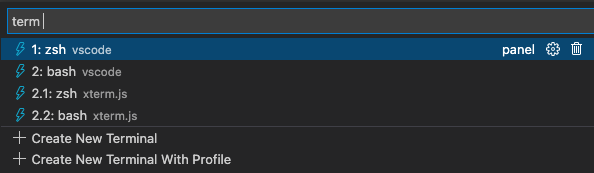

# April 2022 (version 1.67)

<!-- DOWNLOAD_LINKS_PLACEHOLDER -->

Welcome to the Insiders build. These are the preliminary notes for the April 1.67 release of Visual Studio Code. As we get closer to the release date, you'll find details below about new features and important fixes.

Until the April milestone release notes are available, you can still track our progress:

* **[April iteration plan](https://github.com/microsoft/vscode/issues/146672)** - Review what's planned for the milestone.
* **[Commit log](https://github.com/Microsoft/vscode/commits/main)** - GitHub commits to the vscode open-source repository.
* **[Closed issues](https://github.com/Microsoft/vscode/issues?q=is%3Aissue+milestone%3A%22April+2022%22+is%3Aclosed)** - Resolved bugs and implemented feature requests in the milestone.

We really appreciate people trying our new features as soon as they are ready, so check back here often and learn what's new.

If you find issues or have suggestions, you can enter them in the [VS Code repository](https://github.com/Microsoft/vscode/issues) on GitHub.

## Workbench

### Confirm before quit

A new setting `window.confirmBeforeClose` can be configured to show a confirmation dialog before quitting the application.


You can either chose `keyboardOnly` to bring up the confirmation dialog when a keybinding is used or `always`, even when using the mouse to quit.

**Note**: The setting is not entirely new and has been available in [VS Code for Web](https://code.visualstudio.com/docs/editor/vscode-web) for some time.

### Save files after refactoring

Refactorings, like rename, often modify multiple files and make them dirty. Downlevel, external tools usually require these files to be saved and this is becoming easier with this release: There is a new setting `files.refactoring.autoSave` which defaults to `true` and it controls if files that were part of a refactoring should be saved automatically.

### Exclude dirty editors in editor limit

A new setting `workbench.editor.limit.excludeDirty` controls if the maximum number of opened editors should exclude dirty editors for counting towards the configured limit.

### Bring back "Uncommitted Changes" to Timeline

When we introduced [Local History](https://code.visualstudio.com/updates/v1_66#_local-history) feature last month, we removed the **Uncommitted Changes** entry from the Git timeline provider because it felt a bit redundant. However, some users see real value in this timeline entry and now you can bring it back by configuring the new `git.timeline.showUncommitted` setting accordingly.

### New editor placeholder when opening fails

When an editor fails to open, VS Code no longer shows a notification and reveals the previous opened editor. Instead, there is a generic placeholder with the error message and, in some cases, actions to resolve the error.


### Settings editor search widget filter button

The Settings editor search control now contains a funnel button on the right side. Clicking on the button shows a list of filters that the user can apply to the search query in order to filter down the results.


_Theme: [Light Pink](https://marketplace.visualstudio.com/items?itemName=mgwg.light-pink-theme)_

### Settings editor language filter indicator

Settings editor language filters now change the scope widget text to more clearly show which language is being acted on when a language filter is applied. The short video above shows the Markdown language filter being applied to the filtered settings.

For reference, when a language filter is applied, modifying a setting's value will modify the value of that setting for that language only.

### Language status improvements

The language status item now shows formatter conflicts - those happen when multiple formatter for a language are installed but none of them is configure as default formatter. Also, the language status item is a little more prominent when containing severe status


### Extensions UI: Show Invalid or Incompatible Extensions

Extensions UI now shows invalid or incompatible extensions in the installed extension list with error status. For example, if your VS Code version is `1.67.0-insider` and have an extension that requires VS Code `1.68.0` version, then it will show up in the list with incompatible error status.


## Settings Profile

### Import/Export Settings Profile

In this milestone we introduced **Settings Profile** that is a collection of your settings, extensions and UI customizations. If you customized VS Code, you can now export your customizations to a Settings Profile file (`mysetup.code-profile`) and save it to your computer and share it with others. Following gif shows exporting a Settings Profile from VS Code:


You can also import a Settings Profile file to restore your customizations. Following gif shows importing a Settings Profile into VS Code:


You can host your Settings Profile file in the Internet, for example save it as a public GitHub gist, and share the URL with others. One can import the Settings Profile file by providing the URL.

**Note:** At present only following UI customizations are included in the Settings Profile. More will be added in the future.
- Status bar items visibility
- Activity Bar, Bottom Panel & Side Panel items visibility and order
- Views visibility, location and order

## Editor

### Improved inline suggestions

Last month we added the ability to use 👻 ghost text for quick suggestions. Reminder: use `inline` for the `editor.quickSuggestions` setting. We have done some polish work in this area, notably trigger characters and TypeScript "complete functions with arguments" are now supported.


To disable the IntelliSense widget when typing trigger characters, like `.`, use this configuration: `"editor.suggestOnTriggerCharacters": false`, enable TypeScript function call completions use `"typescript.suggest.completeFunctionCalls": true`

### Toggle Inlay Hints

Inlay hints are a great way to show additional information right with your source code. However, something you want to see the actual sources. For this the `editor.inlayHints.enabled` has been changed: in addition to `on` and `off` it new also supports `onUnlessPressed` and `offUnlessPressed`. The latter two show, respectively hide, inlay hints while `Ctrl+Alt` is being pressed and held.

### Improved Snippet Choice

Snippet choice elements are special placeholders with a fixed set of options. The logic around that has been improved: you can now reliably type to select them, accepting an options automatically moves to the next placeholder, and visiting an accepted choice shows all alternative options again.

## Terminal

### Find result count

When searching in the terminal, the result count and currently selected match index are now displayed in the Find control.


### Improved Switch Active Terminal command

To aid in terminal selection with the **Terminal: Switch Active Terminal** command (`workbench.action.quickOpenTerm`), the terminal drop down now displays the current working directory.



## Source Control

### Expanded remote source providers API

The Git extension API now allows extensions that register or display [remote source providers](https://code.visualstudio.com/updates/v1_45#_git) to provide richer information about remote sources.

Remote source providers can now set the description and icon for individual remote sources. Additionally, providers can optionally specify **recent** remote sources. These are displayed at the top level in the picker for easy access and sorted by timestamp if one is provided.

The expanded API has been adopted by the built-in GitHub extension, as well as the [GitHub Repositories](https://marketplace.visualstudio.com/items?itemName=GitHub.remotehub) and [Azure Repos](https://marketplace.visualstudio.com/items?itemName=ms-vscode.azure-repos) extensions in [github.dev](https://github.dev) and [vscode.dev](https://vscode.dev).

## Debugging

* New button for lazy variables
TODO@roblourens
* New setting for automatically expanding lazy variables
TODO@roblourens
* Disable breakpoints with shift+click
TODO@roblourens

## Languages

### JSON

The new setting `json.validate.enable` allows to turn off the validation.

## VS Code for the Web

### Open Remote Repository picker

VS Code for the Web now respects the `window.openFoldersInNewWindow` setting when you use the **Open Remote Repository** picker. This aligns the picker behavior with the other versions of VS Code and replaces the **Open in New Window** Quick Pick item button.

## Contributions to extensions

### Java

**Inlay hints**

The Java language service included in the [Extension Pack for Java](https://marketplace.visualstudio.com/items?itemName=vscjava.vscode-java-pack) now supports [inlay hints](https://code.visualstudio.com/docs/editor/editingevolved#_inlay-hints) to show parameter names for method signatures.


There are three modes for Java parameter name inlay hints:

* `literals` - Enable parameter name hints only for literal arguments (default).
* `all` - Enable parameter name hints for literal and non-literal arguments.
* `none` - Disable parameter name hints.

**Lazy variable resolution**

The [Debugger for Java](https://marketplace.visualstudio.com/items?itemName=vscjava.vscode-java-debug) extension now supports ['lazy' variables](https://code.visualstudio.com/updates/v1_65#_support-for-lazy-variables). This feature lets you defer the operations for an expensive variable until you explicitly expand the debugger UI to see it's value.


### Jupyter

**Web Extension**

The [Jupyter extension](https://marketplace.visualstudio.com/itemdetails?itemName=ms-toolsai.jupyter) can now be installed as a web extension for use at [vscode.dev](https://vscode.dev). Functionality is currently quite limited with support only for notebooks (.ipynb files) being run on Jupyter servers that do not require https.

If you'd like to experiment with the functionality, launch Jupyter from your local machine with:
```jupyter --no-browser --NotebookApp.allow_origin_pat=https://.*\.vscode-cdn\.net```

And connect to it using the command:
**Jupyter: Specify Jupyter server for connections**

There are a number of features we will be enabling in coming releases, including:
- 'https' based servers
- Intellisense
- Data viewing
- Variable viewing
- Interactive window
- IPyWidgets
- Plot viewing
- Exporting

**Jupyter Powertoys Extension**

We are excited to introduce this new extension for use with Jupyter notebooks that provides experimental functionality for working with them. In its first release, we have prototyped the following features:
- Kernel management panel
- Contextual help
- Execution grouping

We'd love for you to take these for a spin and let us know what you think so that we can hone them into a supported feature someday!

For more information see the readme at https://github.com/microsoft/vscode-jupyter-powertoys.

You can download the powertoys extension here: https://marketplace.visualstudio.com/items?itemName=ms-toolsai.vscode-jupyter-powertoys

**Jupyter Kernel Handling**

A number of additions were made to kernel handling:
- To make it more obvious when a kernel has crashed, we now display this information in cell output.
- We have provided troubleshooting guidance in cell output when certain known errors are detected during execution.
- Solving kernel execution problems can be a tricky and time consuming process. So, we've put together a [troubleshooting section](https://github.com/microsoft/vscode-jupyter/wiki) on our wiki that we hope can help guide you to a solution quicker. Of course, our [GitHub Discussions forum](https://github.com/microsoft/vscode-jupyter/discussions) can be great resource for obtaining help as well.

### Python

**No reload when changing language servers**

Updating the value of the `python.languageServer` setting now automatically restarts the language server used by the Python extension to provide suggestions without needing to reload VS Code.

## Extension authoring

### Tab API

We have finalized the read-only side of the tabs API (with the caveat of close as well) marking the completion of one of our most upvoted issues [microsoft/vscode#15178](https://github.com/microsoft/vscode/issues/15178).
This exposes information such as how many groups there are, what tabs are open, what tabs are active, what type of editors a tab represents, and more! More info can be found in the `vscode.d.ts` file with the entrypoint into the API being `window.tabGroups`.

### Notebook Change and Save Event

We have finalized two notebook-related events:

1. `vscode.workspace.onDidSaveNotebookDocument` is an event that fires whenever a notebook has been saved
1. `vscode.workspace.onDidChangeNotebookDocument` is an event that fires whenever a notebook has been changed. That includes structural changes, like adding or remove cells, as well as cell changes, like changing output or metadata.

### Support for non-recursive workspace file watchers

In previous milestones, we [had already announced](https://code.visualstudio.com/updates/v1_64#_vscodeworkspacecreatefilesystemwatcher-now-supports-any-path) that the `createFileSystemWatcher` API can be used to watch any folder on disk as long as the folder is not inside the opened workspace. We have now relaxed this restriction and allow non-recursive file watchers anywhere even inside the opened workspace. Non-recursive watchers have the advantage that configured settings for excludes (`files.watcherExclude`) do not apply so you can be sure that the file watcher will emit for the paths you subscribe to.

We are working on full support for recursive watchers with custom exclude rules for extensions, so stay tuned for more!

### UX Guidelines

The [UX Guidelines](https://code.visualstudio.com/api/ux-guidelines) for extension authors has been redone to have it's own table of contents, where you can find best practices for using the various VS Code user interface elements. Specific topics discuss the recommended Do's and Don't when creating UI for your extensions so that they seamlessly integrate within VS Code.

## Engineering

### Playwright for Electron smoke tests

We have been using [Playwright](https://playwright.dev/) for our web-based smoke tests for a long time. However, our Electron-based smoke tests were still relying on our own custom solution. With the [Electron support](https://playwright.dev/docs/api/class-electron) in Playwright, we were able to reuse most of our web-based smoke test code and use it for our Electron smoke tests too. We are excited to now use the [Trace Viewer](https://playwright.dev/docs/trace-viewer) to diagnose failing smoke tests post-mortem.

### New localization pipeline for extensions

VS Code supports a number of [display languages](https://code.visualstudio.com/docs/getstarted/locales) which you can enable by installing a language pack. These are great for localizing VS Code itself and built-in extensions to VS Code. This iteration, we have started the standardization effort for localizing extensions that aren't built-in that the team owns. You'll see the results of this effort in the GitHub Repositories and Azure Repos extension as their common dependency extension, Remote Repositories, is the first extension to onboard to this.

Next iteration, we will continue this standardization effort and onboard more extensions. The Python extension is currently in progress and GitHub Repositories & Azure Repos will be quick to follow. We want to get to a point where every extension owned by the team is localized and any new extension created in the future will be able to onboard with ease so that users who aren't native English speakers can have a great experience in VS Code.

## Documentation

### Rust in VS Code

There is a new [Rust in Visual Studio Code](https://code.visualstudio.com/docs/languages/rust) topic describing [Rust programming language](https://www.rust-lang.org/) support in VS Code with the [rust-analyzer](https://marketplace.visualstudio.com/items?itemName=matklad.rust-analyzer) extension. The rust-analyzer extension includes rich language features such as code completions, linting, refactorings, debugging, and more.


## Notable fixes

* [114844](https://github.com/microsoft/vscode/issues/114844) Allow to skip restore editors from previous session from crash dialog
* [127936](https://github.com/microsoft/vscode/issues/127936) Allow to set `files.encoding` as language specific setting for files on startup
* [138461](https://github.com/microsoft/vscode/issues/138461) Emmet autocomplete inside a pair of [ ] in a React file is wrong
* [139392](https://github.com/microsoft/vscode/issues/139392) Confirmation of Clear Recent projects
* [139950](https://github.com/microsoft/vscode/issues/139950) When a breakpoint is hit, the caret (cursor) should move to that line
* [145265](https://github.com/microsoft/vscode/issues/145265) Terminal on Windows uses cmd /C, this corrupts passed arguments
* [146406](https://github.com/microsoft/vscode/issues/146406) Powerline symbols in the terminal get wrong colors
* [146977](https://github.com/microsoft/vscode/issues/146977) Declare folder support in Info.plist on macOS
* [147104](https://github.com/microsoft/vscode/issues/147104) Unable to finish logging in to GitHub

## Thank you

Last but certainly not least, a big _**Thank You**_ to the contributors of VS Code.

### Pull requests

Contributions to `vscode`:

* [@100paperkite](https://github.com/100paperkite)
  * Fixes #146305 [PR #146449](https://github.com/microsoft/vscode/pull/146449)
  * Fixes #147420 [PR #147930](https://github.com/microsoft/vscode/pull/147930)
* [@a-stewart (Anthony Stewart)](https://github.com/a-stewart)
  * Create an empty div.message-actions-container when no actions provided [PR #140578](https://github.com/microsoft/vscode/pull/140578)
  * Update the colouring of links in banner markdown [PR #140581](https://github.com/microsoft/vscode/pull/140581)
  * Rename user facing instances of SCM to Source Control [PR #146742](https://github.com/microsoft/vscode/pull/146742)
* [@AkatQuas (Akat)](https://github.com/AkatQuas): fix(markdown): avoid considering link references/sources in code sections [PR #146826](https://github.com/microsoft/vscode/pull/146826)
* [@amanasifkhalid (Aman Khalid)](https://github.com/amanasifkhalid)
  * Close #143241: Testing UI filter survives window reload [PR #147344](https://github.com/microsoft/vscode/pull/147344)
  * Fix #146166: Snippet transform preserves existing camel/Pascal case [PR #147422](https://github.com/microsoft/vscode/pull/147422)
* [@ambar (ambar)](https://github.com/ambar): fix parenthesis encoding in unicode highlighting [PR #146248](https://github.com/microsoft/vscode/pull/146248)
* [@andschwa (Andy Schwartzmeyer)](https://github.com/andschwa): Delete built-in PowerShell snippets [PR #146459](https://github.com/microsoft/vscode/pull/146459)
* [@babakks (Babak K. Shandiz)](https://github.com/babakks): Ask user to select PR templates when forking a repository [PR #143733](https://github.com/microsoft/vscode/pull/143733)
* [@Balastrong (Leonardo Montini)](https://github.com/Balastrong)
  * 145367 Added cwd to terminal name if present [PR #145620](https://github.com/microsoft/vscode/pull/145620)
  * Replaced true and false with on and off in debug.inlineValues [PR #146543](https://github.com/microsoft/vscode/pull/146543)
* [@bytemain (Artin)](https://github.com/bytemain): Fix `TerminalProfile` not throw [PR #143251](https://github.com/microsoft/vscode/pull/143251)
* [@cdce8p (Marc Mueller)](https://github.com/cdce8p): Fix `git` getBranch [v1.65.0] [PR #144449](https://github.com/microsoft/vscode/pull/144449)
* [@CGNonofr (Loïc Mangeonjean)](https://github.com/CGNonofr): Fix freezed folding blocks while computing new ones [PR #146545](https://github.com/microsoft/vscode/pull/146545)
* [@dlech (David Lechner)](https://github.com/dlech): Fix editor eating ContextMenu key when contexmenu is disabled [PR #146968](https://github.com/microsoft/vscode/pull/146968)
* [@eamodio (Eric Amodio)](https://github.com/eamodio): Fixes #140787 watches proper worktree dir [PR #140789](https://github.com/microsoft/vscode/pull/140789)
* [@gabritto (Gabriela Araujo Britto)](https://github.com/gabritto): Add support for label details in TS completion item [PR #146270](https://github.com/microsoft/vscode/pull/146270)
* [@gjsjohnmurray (John Murray)](https://github.com/gjsjohnmurray): Add 'Evaluate in Debug Console' and 'Add to Watch' to palette [PR #146775](https://github.com/microsoft/vscode/pull/146775)
* [@heartacker](https://github.com/heartacker): add the git.fetch action to the first header menu [PR #137940](https://github.com/microsoft/vscode/pull/137940)
* [@hello-smile6](https://github.com/hello-smile6): Update package.json [PR #146278](https://github.com/microsoft/vscode/pull/146278)
* [@IllusionMH (Andrii Dieiev)](https://github.com/IllusionMH): Fix version in error message [PR #147750](https://github.com/microsoft/vscode/pull/147750)
* [@ImCa0 (ImCaO)](https://github.com/ImCa0): Fix spell check errors in translatable strings [PR #147234](https://github.com/microsoft/vscode/pull/147234)
* [@jhgg (Jake)](https://github.com/jhgg): feat: inlay hints displayStyle [PR #145470](https://github.com/microsoft/vscode/pull/145470)
* [@jlelong (Jerome Lelong)](https://github.com/jlelong): Update to vscode-latex-basics 1.3.0 [PR #146308](https://github.com/microsoft/vscode/pull/146308)
* [@jsjoeio (Joe Previte)](https://github.com/jsjoeio)
  * refactor(workbench.ts): update outdated comment [PR #146364](https://github.com/microsoft/vscode/pull/146364)
  * fix(service-worker): allow webview resources to be served from same domain [PR #147467](https://github.com/microsoft/vscode/pull/147467)
* [@laurentlb (Laurent Le Brun)](https://github.com/laurentlb)
  * Comments panel: use the date of the last reply [PR #147922](https://github.com/microsoft/vscode/pull/147922)
  * Comments panel: do not truncate the author name [PR #147924](https://github.com/microsoft/vscode/pull/147924)
* [@luoriyuhui21 (Keming Liang)](https://github.com/luoriyuhui21):  Add a setting to ignore dirty tabs in workbench.editor.limit.value. [PR #144545](https://github.com/microsoft/vscode/pull/144545)
* [@manunamz (manunam)](https://github.com/manunamz): Update markdownRenderer.ts path in docstring. [PR #146332](https://github.com/microsoft/vscode/pull/146332)
* [@matthewjamesadam (Matt Adam)](https://github.com/matthewjamesadam): Implement badge API for webviews and treeviews [PR #144775](https://github.com/microsoft/vscode/pull/144775)
* [@mbelsky (Max Belsky)](https://github.com/mbelsky): Disable a breakpoint on shift+click [PR #147598](https://github.com/microsoft/vscode/pull/147598)
* [@michaelkuhn (Michael Kuhn)](https://github.com/michaelkuhn): Unify and fix Solarized token colors [PR #142883](https://github.com/microsoft/vscode/pull/142883)
* [@neeleshb (Neelesh Bodas)](https://github.com/neeleshb): Misc. A11y fixes for VSCode [PR #145775](https://github.com/microsoft/vscode/pull/145775)
* [@nesk (Johann Pardanaud)](https://github.com/nesk): Improve UX for markdown snippets [PR #146431](https://github.com/microsoft/vscode/pull/146431)
* [@quanzhuo (Quan Zhuo)](https://github.com/quanzhuo)
  * Fix issue #145134, fetch all repos for authenticated user [PR #145203](https://github.com/microsoft/vscode/pull/145203)
  * fix #140612: toggle the Toggle Button when the context line number la… [PR #147141](https://github.com/microsoft/vscode/pull/147141)
* [@Suven-p (Suven-p)](https://github.com/Suven-p): Add action to hide all tests [PR #148003](https://github.com/microsoft/vscode/pull/148003)
* [@tharbakim](https://github.com/tharbakim): Fix detection of CSS Preprocessor Comments at Start of File in Emmet Extension [PR #146121](https://github.com/microsoft/vscode/pull/146121)
* [@thekorn (Markus Korn)](https://github.com/thekorn): git extension: if 'git.untrackedChanges' is set to 'hidden' ignore untracked files when running 'git status' (fixes microsoft/vscode#131020) [PR #131030](https://github.com/microsoft/vscode/pull/131030)
* [@yepitschunked](https://github.com/yepitschunked): [Git watcher] ignore watchman cookies [PR #127702](https://github.com/microsoft/vscode/pull/127702)

Contributions to `vscode-css-languageservice`:

* [@romainmenke (Romain Menke)](https://github.com/romainmenke): fix selector specificity display for `:lang` and similar pseudo selectors [PR #268](https://github.com/microsoft/vscode-css-languageservice/pull/268)

Contributions to `vscode-generator-code`:

* [@rupeshs (Rupesh Sreeraman)](https://github.com/rupeshs): Fix for ext-snippets quick start documentation [PR #340](https://github.com/microsoft/vscode-generator-code/pull/340)

Contributions to `vscode-js-debug`:

* [@timvahlbrock](https://github.com/timvahlbrock)
  * feat: apply pathMapping when loading sourcemaps [PR #1241](https://github.com/microsoft/vscode-js-debug/pull/1241)
  * feat: make hover evaluation timeout configurable [PR #1243](https://github.com/microsoft/vscode-js-debug/pull/1243)

Contributions to `vscode-pull-request-github`:

* [@hoontae24](https://github.com/hoontae24): Support the copied permalink for Github Enterprise URL [PR #3460](https://github.com/microsoft/vscode-pull-request-github/pull/3460)

Contributions to `debug-adapter-protocol`:

* [@KamasamaK](https://github.com/KamasamaK): Fix some typos [PR #264](https://github.com/microsoft/debug-adapter-protocol/pull/264)
* [@peterderivaz (Peter de Rivaz)](https://github.com/peterderivaz): Fix description for SetBreakpointsArguments [PR #261](https://github.com/microsoft/debug-adapter-protocol/pull/261)
* [@polinasok](https://github.com/polinasok): Update adapters.md for Go debug adapter [PR #262](https://github.com/microsoft/debug-adapter-protocol/pull/262)
* [@WardenGnaw (Andrew Wang)](https://github.com/WardenGnaw): Remove extra newline in adapters.md [PR #263](https://github.com/microsoft/debug-adapter-protocol/pull/263)

Contributions to `language-server-protocol`:

* [@KamasamaK](https://github.com/KamasamaK)
  * Add `workspace.inlineValue` to capabilities [PR #1440](https://github.com/microsoft/language-server-protocol/pull/1440)
  * Add some missing linkable types [PR #1441](https://github.com/microsoft/language-server-protocol/pull/1441)
  * Use FoldingRangeKind for kind [PR #1450](https://github.com/microsoft/language-server-protocol/pull/1450)

Contributions to `monaco-editor`:

* [@DetachHead](https://github.com/DetachHead): add `out` keyword to typescript [PR #3066](https://github.com/microsoft/monaco-editor/pull/3066)
* [@Yash-Singh1 (Yash Singh)](https://github.com/Yash-Singh1): feat: add fr units for css grid [PR #3078](https://github.com/microsoft/monaco-editor/pull/3078)

<!-- In-product release notes styles.  Do not modify without also modifying regex in gulpfile.common.js -->
<a id="scroll-to-top" role="button" title="Scroll to top" aria-label="scroll to top" href="#"><span class="icon"></span></a>
<link rel="stylesheet" type="text/css" href="css/inproduct_releasenotes.css"/>
