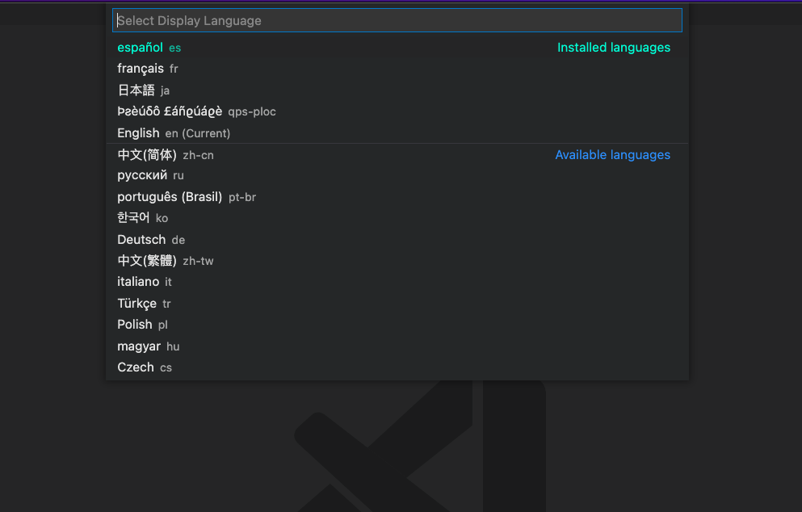
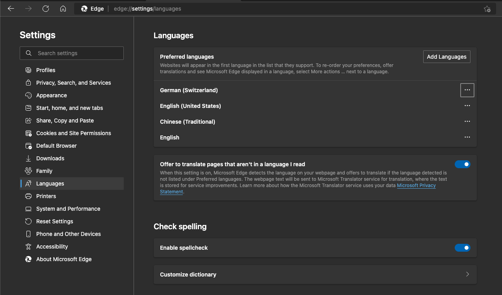
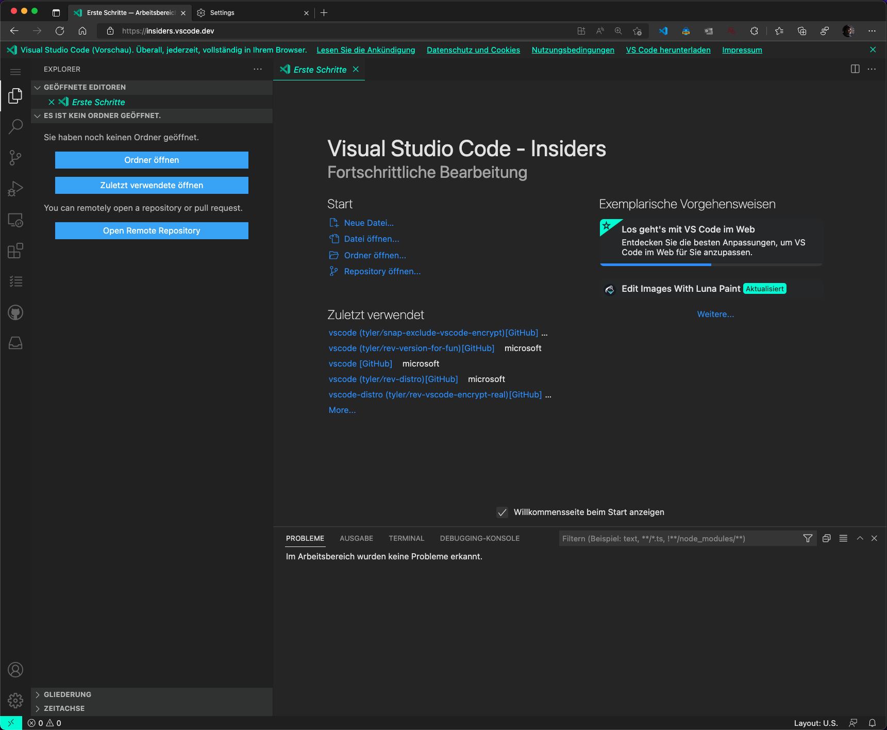
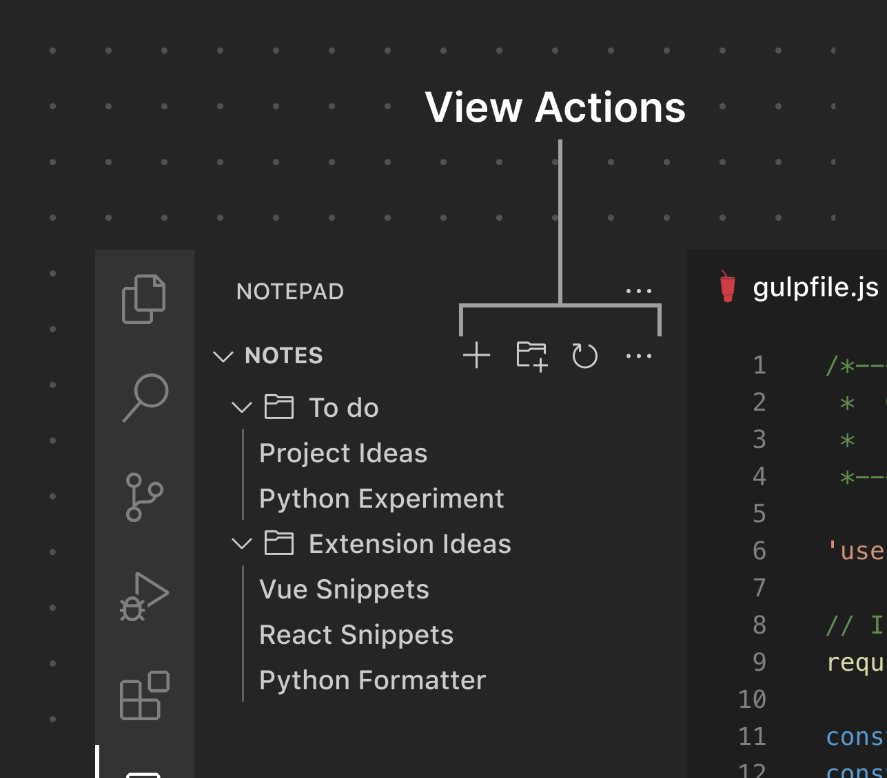

# May 2022 (version 1.68)

**Update 1.68.1**: The update addresses these [issues](https://github.com/microsoft/vscode/issues?q=is%3Aissue+milestone%3A%22May+2022+Recovery+1%22+is%3Aclosed).

<!-- DOWNLOAD_LINKS_PLACEHOLDER -->

---

Welcome to the May 2022 release of Visual Studio Code. There are many updates in this version that we hope you'll like, some of the key highlights include:

* **[Configure Display Language](#configure-display-language-improvements)** - See installed and available Language Packs in their language.
* **[Problems panel table view](#problems-panel-table-view)** - View errors and warnings as a table to quickly filter on their source.
* **[Deprecated extensions](#deprecated-extensions)** - Learn whether an extension is deprecated or should be replaced.
* **[Extension sponsorship](#sponsoring-extensions)** - Support the developers who build your favorite extensions.
* **[Hide Explorer files using .gitignore](#hide-files-in-explorer-based-on-gitignore)** - Reuse your existing `.gitignore` to hide files in the Explorer.
* **[Terminal color and contrast enhancements](#terminal)** - Find match background color, min contrast ratio.
* **[Git branch protection](#git-branch-protection)** - Branch protection available right inside VS Code.
* **[TypeScript Go to Source Definition](#go-to-source-definition)** - Jump directly to a symbol's JavaScript implementation.
* **[VS Code for the Web localization](#core-localization-support)** - vscode.dev now matches your chosen browser language.
* **[Development Container specification](#development-container-specification)** - Learn more about the evolving dev container spec.
* **[Preview: Markdown link validation](#markdown-link-validation)** - Detects broken links to headers, images, and files.

>If you'd like to read these release notes online, go to [Updates](https://code.visualstudio.com/updates) on [code.visualstudio.com](https://code.visualstudio.com).

**Insiders:** Want to try new features as soon as possible? You can download the nightly [Insiders](https://code.visualstudio.com/insiders) build and try the latest updates as soon as they are available.

## Workbench

### Configure Display Language improvements

The **Configure Display Language** command has been refreshed to include:

* The name of the language in that language.
* An **Available languages** section that shows what languages aren't installed on your machine and selecting one will automatically install it and apply that language.



_Theme: [Panda Theme](https://marketplace.visualstudio.com/items?itemName=tinkertrain.theme-panda)_

This should help with the discovery of available [Language Packs](https://marketplace.visualstudio.com/search?term=language%20pack&target=VSCode&category=All%20categories&sortBy=Relevance). Please let us know what you think!

### Problems panel table view

This milestone we added a new capability for users to toggle the view mode of the Problems panel between a tree and a table. Compared to the tree view, the table surfaces the source (language service or extension) of each problem, which allows users to filter the problems by their source.


_Theme: [GitHub Dark Dimmed Theme](https://marketplace.visualstudio.com/items?itemName=GitHub.github-vscode-theme)_

You can toggle the view UI with the **View as Table/View as Tree** button in the upper right of the Problems panel or change the default view mode with the **Problems: Default View Mode** setting (`problems.defaultViewMode`)


### Deprecated extensions

In this milestone, we have added support for deprecated extensions in VS Code. An extension can be simply deprecated or deprecated in favor of another extension or when its functionality is built into VS Code. VS Code will render extensions as deprecated in the Extensions view, as shown below.

A deprecated extension that is no longer being maintained.


An extension deprecated in favor of another extension. In this case, VS Code does not allow users to install this extension.


A deprecated extension with its functionality built-in to VS Code that can be enabled by configuring settings.


VS Code will not automatically migrate or uninstall a deprecated extension. There will be a **Migrate** button to guide you to switch over to the recommended extension.


_Theme: [GitHub Dark Dimmed Theme](https://marketplace.visualstudio.com/items?itemName=GitHub.github-vscode-theme)_

**Note:** The list of deprecated extensions is maintained by the VS Code. If you have an extension that you believe should be deprecated, reach out to us by commenting in this [discussion](https://github.com/microsoft/vscode-discussions/discussions/1).

### Sponsoring extensions

VS Code now allow users to sponsor their favorite extensions. When an extension can be sponsored, VS Code will render a **Sponsor** button in the Extensions view Details page like below:


_Theme: [GitHub Dark Dimmed Theme](https://marketplace.visualstudio.com/items?itemName=GitHub.github-vscode-theme)_

The **Sponsor** button will direct you to the extension's sponsorship URL, where you can provide your support. Refer to [Extension sponsorship](#extension-sponsorship) to learn how to opt into this feature for your extension.

### Hide files in Explorer based on .gitignore

The File Explorer now supports parsing and hiding files that are excluded by your `.gitignore` file. This can be enabled via the **Explorer: Exclude Git Ignore** (`explorer.excludeGitIgnore`) setting. This setting works alongside `files.exclude` to hide unwanted files from the Explorer.

**Note**: At this time, negated globs such as `!package.json` are not parseable.

### Lock hover position

Some custom hovers are difficult or impossible to mouse over due to the presence of other UI elements (for example, a scroll bar). Holding `Alt` while a hover is active will now "lock" it, giving it a wider border and preventing mouse movement outside of the hover from hiding it. This is primarily an accessibility feature to make hovers play nicely with screen magnifiers but it is also useful for copying text from hovers. Note that this feature only applies outside of the editor because editor hovers can always be moused over unless specified otherwise via the `editor.hover.sticky` setting.


### Settings editor improvements

The Settings editor now shows a default value override indicator for language-specific settings. You can view [language-specific settings](https://code.visualstudio.com/docs/getstarted/settings#_languagespecific-editor-settings) by adding a language filter in the Settings editor search bar, either by typing it out explicitly (`@lang:javascript`), or by clicking the filter button on the right of the search bar, and selecting the **Language** option.

When the default value override indicator shows up, it indicates that the default value of the language-specific setting has been overridden by an extension. The indicator also indicates which extension overrode the default value.


_Theme: [Light Pink](https://marketplace.visualstudio.com/items?itemName=mgwg.light-pink-theme)_

This iteration also fixes a behavior where some links in the Settings editor were not redirecting properly when there was already a search query in the Settings editor search bar. The links also now have proper styling so that it is clearer when one is hovering over them.


_Theme: [Light Pink](https://marketplace.visualstudio.com/items?itemName=mgwg.light-pink-theme)_

### Comments widget primary button

The comments widget uses the primary button color for the first (rightmost) action:


## Terminal

### Find match background color

Last release find in the terminal was implemented to show a border around all matches, but this was a temporary solution until support for changing the background of cells dynamically was possible. A colored background is now the default for themes when highlighting matches and the overall experience should look similar to the editor.


If you're a theme author that adopted `terminal.findMatchBorder` or `terminal.findMatchHighlightBorder`, we recommend migrating to `terminal.findMatchBackground` and `terminal.findMatchHighlightBackground` if that would fit the theme better or help contrast.

### Improvements to contrast and the minimum contrast ratio

The find match background work added a lot more flexibility in how the terminal works with background and foreground colors. Because of this, improvements were made around contrast in the terminal, aligning the terminal visuals closer to the editor. In addition, there is now the minimum contrast ratio feature that changes the foreground of text dynamically to help with visibility.

* Luminance will now go in the other direction if contrast isn't met. For example, if contrast isn't met for dark grey text on a lighter grey background with pure black (#000000), the color will also try to move towards white and the value that best meets the desired contrast ratio will be used.

  

* Selection is now drawn below the text when GPU acceleration is disabled and supports opaque colors. Previously, this had to be partially transparent and it would wash out the foreground color. Thanks to this change, the selection color now uses the same color as in the editor.

  

* [Nerd font](https://www.nerdfonts.com) symbols should now apply minimum contrast ratio to blend in with nearby text while [Powerline](https://powerline.readthedocs.io) symbols and box drawing characters will **not** apply minimum contrast ratio as they are often adjacent to inverted cells without any foreground characters.

  

* Themes can now specify a fixed selection foreground color to be used by default in the high contrast themes.

  

* Several bugs were fixed to make the resulting foreground color more correct.

As a reminder, minimum contrast ratio can be disabled if you would prefer original colors by setting `"terminal.integrated.minimumContrastRatio": 1`.

## Tasks

### Glob pattern for default tasks

Default build and test tasks can now be scoped to only be "default" when the active file matches a filename glob pattern:

```jsonc
{
    "version": "2.0.0",
    "tasks": [
        {
            "label": "echo txt",
            "type": "shell",
            "command": "echo TextFile",
            "group": {
                "kind": "build",
                "isDefault": "**.txt" // This is a glob pattern which will only match when the active file has a .txt extension.
            }
        },
        {
            "label": "echo js",
            "type": "shell",
            "command": "echo JavascriptFile",
            "group": {
                "kind": "build",
                "isDefault": "**.js" // This is a glob pattern which will only match when the active file has a .js extension.
            },
        }
    ]
}
```

## Source Control

There have been a few updates to the Git extension that align with our new [pull request flow](#using-pull-requests).

### Git: Branch prefix

To make the process of creating a new branch smoother, there is a new setting, `git.branchPrefix`, that specifies a string to use as a prefix when creating a new branch.

### Git: Branch name generation


A new setting `git.branchRandomName.enable` will make VS Code suggest random branch names whenever creating a new branch. The random names are generated from dictionaries, which you can control via the `git.branchRandomName.dictionary` setting. The supported dictionaries are: `adjectives` (default), `animals` (default), `colors`, and `numbers`.

### Git: Branch protection

With the new `git.branchProtection` setting, you can configure specific branches to be protected. VS Code will avoid committing directly on protected branches and will offer you the chance to create a new branch to commit to instead. You can fine tune this behavior with the `git.branchProtectionPrompt` setting.

### GitHub: Pull request template support

The GitHub extension now understands [pull request templates](https://docs.github.com/communities/using-templates-to-encourage-useful-issues-and-pull-requests/creating-a-pull-request-template-for-your-repository) and will use them as a base whenever creating a PR from a newly forked repository.

## Notebooks

### Cell revealing changes

We have tuned how cells outside of the viewport are revealed in a couple scenarios.

When you click a cell in the Outline view, if that cell is outside of the viewport, the notebook will now scroll to reveal that cell at about the top 1/5th of the viewport. This matches the Outline's behavior in the text editor.

When the cursor is in a cell editor, you can move the cursor past the first or last line of the editor to move it into the next cell editor. Now, when moving the cursor into an editor whose cell is out of the viewport, the notebook will scroll just enough to reveal that line in the editor, instead of jumping up to reveal the cell in the middle of the viewport.

### Find and Replace supports seeding query from cursor/selection

The Find control in notebook editor now supports seeding the search string from the editor selection. The behavior is controlled by the editor setting `editor.find.seedSearchStringFromSelection`.


## Debugging

### Run and Debug without a launch.json

When you haven't set up a `launch.json` configuration file and press `F5`, or select the **Run and Debug** button in the Debug view, VS Code picks a debugger based on the programming language in the currently active file. If you don't have a file open, you will be asked which debugger you want to use. This experience can be a little confusing, so we've made a couple improvements.


If an extension was already activated before you tried to start debugging, then that extension's debugger will be sorted to the top. This can be useful, for example, when the extension was activated by previously running a command from that extension, or opening a file of a language that activates that extension, or by a `workspaceContains` pattern that your workspace matches. If you have used the debugger in this session, it will also be sorted to the top.

The Chrome/Edge debuggers have been renamed to **Web App (Chrome)** and **Web App (Edge)** to try to avoid confusion with other debuggers such as the [Flutter](https://marketplace.visualstudio.com/items?itemName=Dart-Code.flutter) extension that also run apps in a browser.

## Languages

### TypeScript 4.7

VS Code now bundles [TypeScript 4.7.3](https://devblogs.microsoft.com/typescript/announcing-typescript-4-7/). This major TypeScript brings new language features including [improved Control-Flow Analysis](https://devblogs.microsoft.com/typescript/announcing-typescript-4-7/#control-flow-analysis-for-bracketed-element-access) and support for [ECMAScript Module Support in Node.js](https://devblogs.microsoft.com/typescript/announcing-typescript-4-7/#ecmascript-module-support-in-node-js). It also includes new tooling features and fixes a number of important bugs!

### Go to Source Definition

One of VS Code's longest standing and most upvoted feature requests is to make VS Code navigate to the JavaScript implementation of functions and symbols from external libraries. Currently, **Go to Definition** jumps to the type definition file (the `.d.ts` file) that defines the types for the target function or symbol. This is useful if you need to inspect the types or the documentation for these symbols but hides the actual implementation of the code. The current behavior also confuses many JavaScript users who may not understand the TypeScript type from the `.d.ts`.

While changing **Go to Definition** to navigate to the JavaScript implementation of a symbol may sound simple, there's a reason why this feature request has been open for so long. JavaScript (and especially the compiled JavaScript shipped by many libraries) is much more difficult to analyze than a `.d.ts`. Trying to analyze all the JavaScript code under `node_modules` would be both slow and would also dramatically increase memory usage. There are also many JavaScript patterns that the VS Code IntelliSense engine is not able to understand.

That's where the new **Go to Source Definition** command comes in. When you run this command from either the editor context menu or from  the Command Palette, TypeScript will attempt to track down the JavaScript implementation of the symbol and navigate to it. This may take a few seconds and we may not always get the correct result, but it should be useful in many cases.


We're actively working on improving this feature so give it a try in your codebase and [share your feedback](https://github.com/microsoft/TypeScript/issues/49003).

### Object method snippets

Object method snippets help you quickly add methods to object literals that implement a given interface:


When inside an object literal, you should see two suggestions for each possible method: one that inserts just the method name and one that inserts the full signature of the method. You can also fully disable object method snippets by setting `"typescript.suggest.classMemberSnippets.enabled": false` or `"javascript.suggest.classMemberSnippets.enabled": false`.

### Group aware Organize Imports

The **Organize Imports** command for JavaScript and TypeScript lets you quickly clean up your list of imports. When run, it both removes unused imports and also sorts the imports alphabetically.

However some codebases like having some degree of manual control over how their imports are organized. Grouping external versus internal imports is one of the most common examples of this:

```ts
// local code
import * as bbb from "./bbb";
import * as ccc from "./ccc";
import * as aaa from "./aaa";

// built-ins
import * as path from "path";
import * as child_process from "child_process"
import * as fs from "fs";

// some code...
```

In older versions of VS Code, running **Organize Imports** here would result in the following:

```ts
// local code
import * as child_process from "child_process";
import * as fs from "fs";
// built-ins
import * as path from "path";
import * as aaa from "./aaa";
import * as bbb from "./bbb";
import * as ccc from "./ccc";

// some code...
```

Yuck! This happens because all of the imports are being sorted alphabetically, and VS Code even tries to  preserve comments and newlines while doing so.

With TypeScript 4.7 however, **Organize Imports** is now a group-aware. Running it on the above code looks a little bit more like what you’d expect:

```ts
// local code
import * as aaa from "./aaa";
import * as bbb from "./bbb";
import * as ccc from "./ccc";

// built-ins
import * as child_process from "child_process";
import * as fs from "fs";
import * as path from "path";

// some code...
```

Notice how the imports have now been sorted while still remaining within their groups. Much better!

### Strict null checks enabled in implicit projects

[Strict null checks](https://www.typescriptlang.org/tsconfig#strictNullChecks) are enabled in implicit projects by default for both JavaScript and TypeScript. This should result in more accurate IntelliSense and improved type checking that can catch common programming mistakes.


This new behavior only applies to any file that is not part of a `jsconfig` or `tsconfig` project. You can disable it by setting: `"js/ts.implicitProjectConfig.strictNullChecks": false`. For files that are part of a `jsconfig` or `tsconfig`, you still need to enable strict null checks in the configuration file.

### Go to Definition for Markdown reference links

You can now use **Go to Definition** on [reference links](https://www.markdownguide.org/basic-syntax/#reference-style-links) in Markdown files. This will jump from the reference to the link definition in the current file.

### Expanded JSON Schema support

The built-in JSON language service has improved the support for [JSON Schema Draft 2019-09](https://json-schema.org/draft/2019-09/release-notes.html) and [JSON Schema Draft 2020-12](https://json-schema.org/draft/2020-12/release-notes.html). There's no longer a warning shown when such a schema is used.

There are still some features that are not fully supported. A warning is shown when they are used by a schema. The unsupported properties are:

* Subschemas with $id
* $recursiveRef/Anchor (Draft 2019-09)
* $dynamicRef/Anchor (Draft 2020-12)

## VS Code for the Web

### Core localization support

We've introduced the initial localization support of VS Code for the Web. VS Code is used all over the world and for many users, English is not their first language (or a language they're familiar with at all!). For years, VS Code users have been installing [Language Packs from the Marketplace](https://marketplace.visualstudio.com/search?term=language%20pack&target=VSCode&category=All%20categories&sortBy=Relevance) in order to use VS Code in a language other than English. For VS Code for the Web, we decided to take a different approach, one that is more aligned with how the web works today.

For users who set their browser to one of our core supported languages, [vscode.dev](https://vscode.dev) will automatically apply translations in that language. The languages we support are documented in the [vscode-loc](https://github.com/microsoft/vscode-loc) repository.

For example, to configure the display language in Microsoft Edge, you would use **Settings** > **Languages**:



Once that is set, when you go to [vscode.dev](https://vscode.dev) (or [insiders.vscode.dev](https://insiders.vscode.dev)), it will be displayed in German:



_Theme: [Panda Theme](https://marketplace.visualstudio.com/items?itemName=tinkertrain.theme-panda)_

In the next few months, we will enable localization for extensions (both ones that ship with VS Code and ones that don't) so that extension authors can also support non-English speaking users. Stay tuned!

### Remote Repositories

When using the **Remote Repositories > Continue Working On...** command to clone a GitHub or Azure Repos repository locally and open it in desktop VS Code, you can now configure `remoteHub.gitProtocol` to always clone using `http` or `ssh` URLs.

## Development Container specification

Our development container teams across Microsoft and GitHub continue active development on the new [Dev Container Specification](https://github.com/devcontainers/spec), and this iteration had several exciting highlights.

### Reference implementation

We released an open source command-line interface (CLI) as the reference implementation for the specification. The CLI builds and starts a dev container from a `devcontainer.json`, and it can either be used directly or integrated into product experiences.

The CLI is available in a new [devcontainers/cli](https://github.com/devcontainers/cli) repository. You can learn how to get started in its [README](https://github.com/devcontainers/cli#try-it-out), and read more in this [blog post](https://code.visualstudio.com/blogs/2022/05/18/dev-container-cli).

The CLI is under active development and will continue evolving to better support more scenarios, such as greater support for individual users. We'd love to hear your feedback along the way, so we've [opened an issue](https://github.com/devcontainers/cli/issues/7) specifically for feedback on the CLI and welcome additional issues and PRs in the repo.

### Dev Container in CI

A GitHub Action and an Azure DevOps Task are available for running a repository's dev container in continuous integration (CI) builds. This allows you to reuse the same setup that you are using for local development to also build and test your code in CI. See the [devcontainers/ci README](https://github.com/devcontainers/ci/blob/main/README.md) for more details.

Example usage of the GitHub Action:

```yaml
- name: Build and run dev container task
  uses: devcontainers/ci@v0.2
  with:
    imageName: ghcr.io/example/example-devcontainer
    runCmd: make ci-build
```

Example usage of the Azure DevOps Task:

```yaml
- task: DevcontainersCI@0
  inputs:
    imageName: 'yourregistry.azurecr.io/example-dev-container'
    runCmd: 'make ci-build'
    sourceBranchFilterForPush: refs/heads/main
```

### Specification

Active development continues on the specification, and we've published an [initial version](https://github.com/devcontainers/spec/blob/main/docs/specs/devcontainer-reference.md) in the [devcontainers/spec](https://github.com/devcontainers/spec) repository.

As with the CLI, stay tuned for further updates and progress, and we'd love to hear your feedback.

### Further reading

You can read all about development containers and the specification at [https://containers.dev](https://containers.dev).

## Contributions to extensions

### Python

#### No interpreter discovery at startup

The [Python](https://marketplace.visualstudio.com/items?itemName=ms-python.python) extension now auto-triggers discovery only when:

* Using **Python: Select Interpreter** command to choose a different interpreter.
* A particular scope (workspace or global) is opened for the first time.
* No Python is installed.

Since discovery isn't triggered automatically at startup, this leads to instantaneous load, and faster startup of other features like the language server. However, if the [Jupyter](https://marketplace.visualstudio.com/itemdetails?itemName=ms-toolsai.jupyter) extension is installed/enabled, discovery is still triggered by Jupyter at startup.

#### Enable localization

The Python extension now supports translations in all the languages that VS Code supports. We have updated the way we get the translations of our commands, notifications, titles, etc. using [vscode-nls](https://www.npmjs.com/package/vscode-nls). These translations are maintained by a localization team to ensure that they are up to date and correct.

### Jupyter

#### Web extension

We've made progress on supporting more of the core functionality in the web version of the [Jupyter](https://marketplace.visualstudio.com/itemdetails?itemName=ms-toolsai.jupyter) extension.

This month the following features were ported to the web extension:

* https support
* kernel completions
* ipywidgets
* notebook debugging
* variable viewing
* exporting
* interactive window

If you'd like to experiment with the functionality, launch Jupyter from your local machine with:

```bash
jupyter notebook --no-browser --NotebookApp.allow_origin_pat=https://.*\.vscode-cdn\.net
```

And then connect to it using the command **Jupyter: Specify Jupyter server for connections** from within [vscode.dev](https://vscode.dev).

For more information (and to comment), see this discussion [item](https://github.com/microsoft/vscode-jupyter/discussions/10315).

### Remote Development

Work continues on the [Remote Development extensions](https://marketplace.visualstudio.com/items?itemName=ms-vscode-remote.vscode-remote-extensionpack), which allow you to use a container, remote machine, or the [Windows Subsystem for Linux](https://learn.microsoft.com/windows/wsl) (WSL) as a full-featured development environment.

You can learn about new extension features and bug fixes in the [Remote Development release notes](https://github.com/microsoft/vscode-docs/blob/main/remote-release-notes/v1_68.md).

### GitHub Pull Requests and Issues

There has been more progress on the [GitHub Pull Requests and Issues](https://marketplace.visualstudio.com/items?itemName=GitHub.vscode-pull-request-github) extension, which allows you to work on, create, and manage pull requests and issues. Highlights of this release include:

* Auto-merge checkbox in **Create Pull Request** view

Check out the [changelog for the 0.44.0](https://github.com/microsoft/vscode-pull-request-github/blob/main/CHANGELOG.md#0440) release of the extension to see the other highlights.

### Remote Repositories extensions

Both the [GitHub Repositories](https://marketplace.visualstudio.com/items?itemName=github.remotehub) and [Azure Repos](https://marketplace.visualstudio.com/items?itemName=ms-vscode.azure-repos) extensions support translations in all languages that VS Code supports.

## Preview features

### Markdown link validation

While working with Markdown, it's easy to mistakenly add an invalid file link or image reference. Perhaps you forgot that the filename used a `-` (dash) instead of an `_` (underline), or perhaps the file you are linking to was moved to a different directory. Often you only catch these mistakes after viewing the Markdown preview or even after publishing. VS Code's new experimental Markdown link validation can help catch these mistakes.

With link validation, VS Code will analyze Markdown links to headers, images, and other local files. Invalid links will be reported as either warnings or errors.


VS Code can even catch invalid links to specific headers in other Markdown files!

Link validation is off by default. You can try link validation by setting `"markdown.experimental.validate.enabled": true`.

There are a few settings you can use to customize link validation:

* `markdown.experimental.validate.fileLinks.enabled` - Enable/disable validation of links to local files: `[link](/path/to/file.md)`

* `markdown.experimental.validate.headerLinks.enabled` - Enable/disable validation of links to headers in the current file: `[link](#some-header)`

* `markdown.experimental.validate.referenceLinks.enabled` - Enable/disable validation of reference links: `[link][ref]`.

* `markdown.experimental.validate.ignoreLinks` - A list of links that skip validation. This is useful if you link to files that don't exist on disk but do exist once the Markdown has been published.

Let us know what you think of the new feature!

### Paste files to insert Markdown links

We've added experimental support for pasting to insert images or file links in Markdown.


This requires enabling both `markdown.experimental.editor.pasteLinks.enabled` and `"editor.experimental.pasteActions.enabled"`. You can currently copy files from the VS Code File Explorer. Pasting image files inserts image references while pasting normal text files inserts links to those files.

### Terminal shell integration

[Shell integration](https://code.visualstudio.com/docs/terminal/shell-integration) (enabled with the `terminal.integrated.shellIntegration.enabled` setting) and command decorations have been polished and improved upon this iteration.

A few of the updates include:

* [146377](https://github.com/microsoft/vscode/issues/146377) Persist shell status such that `bash-git-prompt` and other programs work
* [148635](https://github.com/microsoft/vscode/issues/148635) Allow the use of a custom `ZDOTDIR` for `zsh`
* [145801](https://github.com/microsoft/vscode/issues/145801) Fix decorations getting out of sync on slower machines
* [146873](https://github.com/microsoft/vscode/issues/146873) Improve handling of existing debug traps in `bash`
* [148839](https://github.com/microsoft/vscode/issues/148839) Polish messaging with **How does this work?** command and activation status in the tab hover
* [151223](https://github.com/microsoft/vscode/pull/151223) After buffer clear, ensure commands are tracked correctly

### Window Controls Overlay on Windows

We've adopted the API provided by Electron to support [Window Controls Overlay](https://wicg.github.io/window-controls-overlay/) on Windows. The major user-facing benefit of this change is access to the [Snap Layouts](https://learn.microsoft.com/windows/apps/desktop/modernize/apply-snap-layout-menu) feature in Windows 11. Due to some [persistent issues](https://github.com/microsoft/vscode/issues/150475), the Window Controls Overlay is off by default, but you can turn them on with the experimental setting `window.experimental.windowControlsOverlay.enabled`.


### Command Center

We are adding Command Center - a simpler way to trigger Quick Pick for files, commands, and more.


This can be enabled via the `window.experimental.commandCenter` setting and let us know what you think.

### Merge editor

We have started to work on a better merge experience. It is still early days and we aren't yet ready for feedback but you can give it a try via `git.experimental.mergeEditor`. With this enabled, files with merge conflicts open in a new merge editor to make resolving conflicts simpler.

We will continue to work on this. Use [Insiders](https://code.visualstudio.com/insiders/) to follow our progress. We would like to sincerely thank [Mingpan](https://github.com/Mingpan) and our friends at Google who are helping us with this effort. ❤️

## Extension authoring

### Inline Completions Finalization

We have finalized the Inline Completions API. This allows extensions to provide inline completions that are decoupled from the suggestion widget. An inline completion is rendered as if it was already accepted, but with a gray color. Users can cycle through suggestions and accept them with the `Tab` key. An example extension that uses Inline Completions is [GitHub Copilot](https://marketplace.visualstudio.com/items?itemName=GitHub.copilot). More information can be found in the `vscode.d.ts` file with the entrypoint into the API being [`languages.registerInlineCompletionItemProvider`](https://github.com/microsoft/vscode/blob/e3a8e502ad7263836d0bc34cbcefbfc7bd65104f/src/vscode-dts/vscode.d.ts#L12357).

### InputBox validation message severity finalization

Our InputBox APIs (via `window.showInputBox` and `window.createInputBox`) to [provide severity in validation of user's input](https://github.com/microsoft/vscode/blob/main/src/vscode-dts/vscode.d.ts#L1990-L2002) has been finalized.

For example, if you wanted to show the user an information message based on their input, your validation message can return:

```ts
{ message: 'this is an info message'; severity: InputBoxValidationSeverity.Info }
```

which would look like this:


### Notebook Editor API

The new notebook editor API introduces a new `NotebookEditor` type that is similar to `TextEditor` but for [notebooks](https://code.visualstudio.com/api/extension-guides/notebook) instead of normal text editors.

```ts
const editor = vscode.window.activeNotebookEditor;
if (editor) {
  // Access the underlying notebook document associated with the editor
  console.log(editor.notebook.uri);

  // Change the selection in the current notebook
  editor.selection = new vscode.NotebookRange(1, 3);
}
```

You can use `window.activeNotebookEditor` to get the current notebook editor and events such as `window.onDidChangeActiveNotebookEditor` to observe when the user switches to the new notebook editor.

### Extension activation based on Timeline view

A new activation event has been added for when the Timeline view is visible. This event `onView:timeline` can be used by any extension but is most useful to extensions implementing the proposed `Timeline` API.

### UX Guidelines

The [UX Guidelines](https://code.visualstudio.com/api/ux-guidelines) for extension authors has been updated and expanded to cover more VS Code user interface elements.



A revised [Overview](https://code.visualstudio.com/api/ux-guidelines/overview) page steps through the VS Code UI to give a visual tour of the interface and common UI elements.

Links to relevant guides, API references, and extension samples have been added to each area's dedicated page. Additionally, all example images have been updated across the guidelines to showcase an up-to-date version of the UI.

You can now read about the recommended Do's and Don't's for extensions that add to or contribute these UI elements:

* [Activity Bar](https://code.visualstudio.com/api/ux-guidelines/activity-bar)
* [Sidebars](https://code.visualstudio.com/api/ux-guidelines/sidebars)
* [Panel](https://code.visualstudio.com/api/ux-guidelines/panel)
* [Walkthroughs](https://code.visualstudio.com/api/ux-guidelines/walkthroughs)

### Extension sponsorship

In this milestone, we have introduced a `sponsor` field in the extension's `package.json` to allow extensions to opt into sponsorship. The `sponsor` object has a `url` field for the extension author's sponsorship link. For example:

```ts
"sponsor": {
    "url": "https://github.com/sponsors/nvaccess"
}
```

If an extension opts-in to this, VS Code will render a **Sponsor** button in the Extensions view Details page as shown in the [Sponsoring extensions](#sponsoring-extensions) section above.

**Note:** Make sure to use the latest [vsce](https://code.visualstudio.com/api/working-with-extensions/publishing-extension#vsce) command line tool (`>=2.9.1`) to publish your extension with sponsorship enabled.

## Proposed APIs

Every milestone comes with new proposed APIs and extension authors can try them out. As always, we want your feedback. Here are the steps to try out a proposed API:

1. [Find a proposal that you want to try](https://github.com/microsoft/vscode/tree/main/src/vscode-dts) and add its name to `package.json#enabledApiProposals`.
1. Use the latest [vscode-dts](https://www.npmjs.com/package/vscode-dts) and run `vscode-dts dev`. It will download the corresponding `d.ts` files into your workspace.
1. You can now program against the proposal.

You cannot publish an extension that uses a proposed API. There may be breaking changes in the next release and we never want to break existing extensions.

### Read files from DataTransfer

The new `dataTransferFiles` API proposal lets extensions read files from a `vscode.DataTransfer` object. The `DataTransfer` type is used by the tree drag and drop API, as well as the drop into editor and copy paste API proposals.

```ts
export class TestViewDragAndDrop implements vscode.TreeDataProvider<Node>, vscode.TreeDragAndDropController<Node> {

  ...

   public async handleDrop(target: Node | undefined, sources: vscode.DataTransfer, token: vscode.CancellationToken): Promise<void> {

     // Get a list of all files
     const files: vscode.DataTransferFile[] = [];
     sources.forEach((item) => {
       const file = item.asFile();
       if (file) {
         files.push(file);
       }
     });

    const decoder = new TextDecoder();

    // Print out the names and first 100 characters of the file
     for (const file of files) {
       const data = await file.data();
       const text = decoder.decode(data);
       const fileContentsPreview = text.slice(0, 100);
       console.log(file.name + ' — ' + fileContentsPreview + '\n');
     }

    ...
  }
}
```

Files data transfer items are currently only added to the `DataTransfer` when they come from outside of VS Code (such as when you drag and drop from the desktop into a tree view or into the editor).

### Copy paste API

The new `documentPaste` API proposal lets extensions hook into copy and paste inside text editors. This can be used to modify the text that is inserted on paste. Your extension can also store metadata when copying text and use this metadata when pasting (for example, to bring along imports when pasting between two code files).

The [document paste extension sample](https://github.com/microsoft/vscode-extension-samples/tree/main/document-paste) shows this API in action:

```ts
/**
 * Provider that maintains a count of the number of times it has copied text.
 */
class CopyCountPasteEditProvider implements vscode.DocumentPasteEditProvider {

  private readonly countMimeTypes = 'application/vnd.code.copydemo-copy-count';

  private count = 0;

  prepareDocumentPaste(
    _document: vscode.TextDocument,
    _range: vscode.Range,
    dataTransfer: vscode.DataTransfer,
    _token: vscode.CancellationToken
  ): void | Thenable<void> {
    dataTransfer.set(this.countMimeTypes, new vscode.DataTransferItem(this.count++));
  }

  async provideDocumentPasteEdits(
    _document: vscode.TextDocument,
    range: vscode.Range,
    dataTransfer: vscode.DataTransfer,
    token: vscode.CancellationToken
  ) {
    const countDataTransferItem = dataTransfer.get(this.countMimeTypes)
    if (!countDataTransferItem) {
      return undefined;
    }

    const textDataTransferItem = dataTransfer.get('text/plain') ?? dataTransfer.get('text');
    if (!textDataTransferItem) {
      return undefined;
    }

    const count = await countDataTransferItem.asString();
    const text = await textDataTransferItem.asString();

    // Build a snippet to insert
    const snippet = new vscode.SnippetString();
    snippet.appendText(`(copy #${count}) ${text}`);

    return new vscode.SnippetTextEdit(range, snippet);
  }
}

vscode.languages.registerDocumentPasteEditProvider({ language: 'markdown' }, new CopyCountPasteEditProvider());
```

### New Notebook Workspace edit proposal

The new `notebookWorkspaceEdit` API proposal allows extensions to edit the contents of a notebook. It replaces the previous `notebookEditorEdit` proposal.

With the proposal, you can create workspace edits that insert, replace, or modify cells in a notebook:

```ts
const currentNotebook = vscode.window.activeNotebookEditor?.notebook;
if (currentNotebook) {
  const edit = new vscode.WorkspaceEdit();

  edit.set(currentNotebook.uri, vscode.NotebookEdit.insertCells(/* index*/ 1, [
    // ... new notebook cell data
  ]));

  await vscode.workspace.applyEdit(edit);
}
```

## Engineering

### Using pull requests

We have moved away from pushing changes directly to the vscode repository `main` branch and are now pushing all changes to VS Code exclusively using pull requests (PR). We require that each PR gets at least one approval from another team member. Taking advantage of this, we now also require that some basic checks pass before a PR can be merged. These are tasks like TypeScript compilation, formatting rules, unit tests and integration tests, which typically don't take longer than 10 minutes. Switching to this flow has reduced the number of times our Insiders build was broken due to a programming mistake.

### VS Code OSS build

We have a new public [Code OSS build](https://dev.azure.com/vscode/VSCode/_build?definitionId=46&_a=summary) that is reusing the same build definitions as our production builds. This build now runs in under 30 minutes on each PR and we plan to continue investing in speeding it up.

## Documentation

### Updated version control video

The [Using Git with Visual Studio](https://code.visualstudio.com/docs/introvideos/versioncontrol) introductory video has been redone to help you get started using the Git integration built into VS Code.

You can also find other great videos on the [VS Code YouTube](https://www.youtube.com/c/Code) channel.

### vscode.dev on code.visualstudio.com

Want to use VS Code for the Web but forgot the URL? [vscode.dev](https://vscode.dev) is now displayed prominently on the VS Code [Download](https://code.visualstudio.com/download) page so you can quickly start VS Code running in your browser.


## Notable fixes

* [141157](https://github.com/microsoft/vscode/issues/141157) Clicking F11 while not in debug mode turns on debug instead of going full screen
* [148864](https://github.com/microsoft/vscode/issues/148864) Unbound breakpoint for TypeScript files
* [149638](https://github.com/microsoft/vscode/issues/149638) Lazy variable evaluation button causes problematic gaps and misalignments between nodes

## Thank you

Last but certainly not least, a big _**Thank You**_ to the contributors of VS Code.

### Web extensions

Extension authors for enabling extensions that run code as [web extensions](https://code.visualstudio.com/api/extension-guides/web-extensions) (the list below is between May 2 and June 6, 2022):

* [Pipeline Editor](https://marketplace.visualstudio.com/items?itemName=Cloud-pipelines.pipeline-editor-vscode) ([Alexey Volkov](https://marketplace.visualstudio.com/publishers/Cloud-pipelines))
* [Markdown Base64 Image ID](https://marketplace.visualstudio.com/items?itemName=amoxuk.markdown-base64-replace-by-id) ([amoxuk](https://marketplace.visualstudio.com/publishers/amoxuk))
* [Apache Daffodil VS Code Extension](https://marketplace.visualstudio.com/items?itemName=ASF.apache-daffodil-vscode) ([Apache Software Foundation](https://marketplace.visualstudio.com/publishers/asf))
* [Web Search](https://marketplace.visualstudio.com/items?itemName=BenRogersWPG.websearchengine) ([Ben Rogers](https://marketplace.visualstudio.com/publishers/BenRogersWPG))
* [CloudStudio.coding](https://marketplace.visualstudio.com/items?itemName=CloudStudio.coding) ([CloudStudio](https://marketplace.visualstudio.com/publishers/CloudStudio))
* [Screenshot Clipboard](https://marketplace.visualstudio.com/items?itemName=DarrenDanielDay.screenshot-clipboard) ([Darren Daniel Day](https://marketplace.visualstudio.com/publishers/DarrenDanielDay))
* [Galaxy Workflows](https://marketplace.visualstudio.com/items?itemName=davelopez.galaxy-workflows) ([davelopez](https://marketplace.visualstudio.com/publishers/davelopez))
* [React Snippets](https://marketplace.visualstudio.com/items?itemName=dotkiro.ink-vscode-snippets) ([dotkiro](https://marketplace.visualstudio.com/publishers/dotkiro))
* [Draw](https://marketplace.visualstudio.com/items?itemName=hall.draw) ([hall](https://marketplace.visualstudio.com/publishers/hall))
* [Blogging tool](https://marketplace.visualstudio.com/items?itemName=Huka.blogging-tool) ([Huka](https://marketplace.visualstudio.com/publishers/Huka))
* [Katalon Runner](https://marketplace.visualstudio.com/items?itemName=KatalonStudioz.katalon-runner) ([Katalon Studioz](https://marketplace.visualstudio.com/publishers/KatalonStudioz))
* [zzzGCS-Uploader](https://marketplace.visualstudio.com/items?itemName=KillerBees.zzz-gcs-sync) ([KillerBees](https://marketplace.visualstudio.com/publishers/KillerBees))
* [WhatTheCommit](https://marketplace.visualstudio.com/items?itemName=Gaardsholt.vscode-whatthecommit) ([Lasse Gaardsholt](https://marketplace.visualstudio.com/publishers/Gaardsholt))
* [TEI Japanese Editor](https://marketplace.visualstudio.com/items?itemName=ldas.vscode-japanese-tei) ([ldas](https://marketplace.visualstudio.com/publishers/ldas))
* [TypeScript Error Translator](https://marketplace.visualstudio.com/items?itemName=mattpocock.ts-error-translator) ([Matt Pocock](https://marketplace.visualstudio.com/publishers/mattpocock))
* [Mintlify](https://marketplace.visualstudio.com/items?itemName=mintlify.connector) ([Mintlify](https://marketplace.visualstudio.com/publishers/mintlify))
* [Play DJMAX](https://marketplace.visualstudio.com/items?itemName=minwook-shin.play-djmax) ([minwook-shin](https://marketplace.visualstudio.com/publishers/minwook-shin))
* [Sciter JS](https://marketplace.visualstudio.com/items?itemName=MustafaHi.sciterjs) ([MustafaHi](https://marketplace.visualstudio.com/publishers/MustafaHi))
* [NewWeb](https://marketplace.visualstudio.com/items?itemName=newsearchwebtesting.newsearchwebtesting) ([newsearchwebtesting](https://marketplace.visualstudio.com/publishers/newsearchwebtesting))
* [Loop Development Kit](https://marketplace.visualstudio.com/items?itemName=Olive-AI.vscode-loop-development-kit) ([Olive AI](https://marketplace.visualstudio.com/publishers/Olive-AI))
* [Chewbacca](https://marketplace.visualstudio.com/items?itemName=otter.chewbacca) ([Otter](https://marketplace.visualstudio.com/publishers/otter))
* [Grammarly](https://marketplace.visualstudio.com/items?itemName=znck.grammarly) ([Rahul Kadyan](https://marketplace.visualstudio.com/publishers/znck))
* [Reflame](https://marketplace.visualstudio.com/items?itemName=reflame.agent) ([Reflame](https://marketplace.visualstudio.com/publishers/reflame))
* [SAS](https://marketplace.visualstudio.com/items?itemName=SAS.sas-lsp) ([SAS Institute Inc.](https://marketplace.visualstudio.com/publishers/SAS))
* [vscode-solidity](https://marketplace.visualstudio.com/items?itemName=sevillal.vscode-solidity) ([sevillal](https://marketplace.visualstudio.com/publishers/sevillal))
* [Slint (Nightly)](https://marketplace.visualstudio.com/items?itemName=Slint.slint-nightly) ([Slint](https://marketplace.visualstudio.com/publishers/Slint))
* [Markdown Images](https://marketplace.visualstudio.com/items?itemName=sgourley.markdown-images) ([Steven Gourley](https://marketplace.visualstudio.com/publishers/sgourley))
* [Smart Sort](https://marketplace.visualstudio.com/items?itemName=sgryjp.vscode-stable-sort) ([Suguru Yamamoto](https://marketplace.visualstudio.com/publishers/sgryjp))
* [fiber-ifttt-starlark](https://marketplace.visualstudio.com/items?itemName=t-codespaces.fiber-ifttt-starlark) ([t-codespaces](https://marketplace.visualstudio.com/publishers/t-codespaces))
* [Markdown Preview Style (Beta)](https://marketplace.visualstudio.com/items?itemName=TakumiI.markdown-previewstyle) ([TakumiI](https://marketplace.visualstudio.com/publishers/TakumiI))
* [TATEditor for VS Code](https://marketplace.visualstudio.com/items?itemName=tateditor.app) ([TATEditor](https://marketplace.visualstudio.com/publishers/tateditor))
* [kodeine](https://marketplace.visualstudio.com/items?itemName=tored.kodeine) ([tored](https://marketplace.visualstudio.com/publishers/tored))
* [Vue Language Features (Volar)](https://marketplace.visualstudio.com/items?itemName=Vue.volar) ([Vue](https://marketplace.visualstudio.com/publishers/Vue))
* [Watermelon](https://marketplace.visualstudio.com/items?itemName=WatermelonTools.watermelon-tools) ([WatermelonTools](https://marketplace.visualstudio.com/publishers/WatermelonTools))
* [todoist](https://marketplace.visualstudio.com/items?itemName=waymondo.todoist) ([Waymondo](https://marketplace.visualstudio.com/publishers/waymondo))
* [Arrange Selection](https://marketplace.visualstudio.com/items?itemName=Wupb.arrange-selection) ([Wupb](https://marketplace.visualstudio.com/publishers/Wupb))
* [Transient Emacs](https://marketplace.visualstudio.com/items?itemName=yasuyuky.transient-emacs) ([yasuyuky](https://marketplace.visualstudio.com/publishers/yasuyuky))
* [Go to Next Error](https://marketplace.visualstudio.com/items?itemName=yy0931.go-to-next-error) ([yy0931](https://marketplace.visualstudio.com/publishers/yy0931))
* [Extra Commands](https://marketplace.visualstudio.com/items?itemName=zardoy.extra-commands) ([zardoy](https://marketplace.visualstudio.com/publishers/zardoy))

### Issue tracking

Contributions to our issue tracking:

* [John Murray (@gjsjohnmurray)](https://github.com/gjsjohnmurray)
* [Andrii Dieiev (@IllusionMH)](https://github.com/IllusionMH)
* [ArturoDent (@ArturoDent)](https://github.com/ArturoDent)
* [Simon Chan (@yume-chan)](https://github.com/yume-chan)

### Pull requests

Contributions to `vscode`:

* [@a-stewart (Anthony Stewart)](https://github.com/a-stewart): Workaround for the webview positioning bug [PR #137506](https://github.com/microsoft/vscode/pull/137506)
* [@aifreedom (Song Xie)](https://github.com/aifreedom)
  * Format date strings with the right locale [PR #150133](https://github.com/microsoft/vscode/pull/150133)
  * Fix a typo for "synchronizing" in log string [PR #150236](https://github.com/microsoft/vscode/pull/150236)
* [@AlbertHilb](https://github.com/AlbertHilb): Pass one shared `macros` object into every call to katex renderer [PR #148006](https://github.com/microsoft/vscode/pull/148006)
* [@andrewbranch (Andrew Branch)](https://github.com/andrewbranch)
  * \[typescript-language-features] Add `flags` to completions telemetry [PR #148313](https://github.com/microsoft/vscode/pull/148313)
  * \[typescript-language-features] No commit characters for string completions [PR #148597](https://github.com/microsoft/vscode/pull/148597)
* [@bl-nero (Bartosz Leper)](https://github.com/bl-nero): Fix infinite loop in the disassembly view [PR #148556](https://github.com/microsoft/vscode/pull/148556)
* [@CGNonofr (Loïc Mangeonjean)](https://github.com/CGNonofr)
  * Add high contrast light theme on monaco editor [PR #148249](https://github.com/microsoft/vscode/pull/148249)
  * Add editor monitoring methods in monaco api [PR #148777](https://github.com/microsoft/vscode/pull/148777)
* [@dlech (David Lechner)](https://github.com/dlech): allow null in ICodeEditor.restoreViewState() [PR #146866](https://github.com/microsoft/vscode/pull/146866)
* [@eugenesimakin (Eugene)](https://github.com/eugenesimakin): Inherit editor.letterSpacing for suggest widget (fixes #125622) [PR #148283](https://github.com/microsoft/vscode/pull/148283)
* [@gjsjohnmurray (John Murray)](https://github.com/gjsjohnmurray): Add "Open Containing Folder" etc to file context menu in Git SCM view [PR #149150](https://github.com/microsoft/vscode/pull/149150)
* [@holazz (zz)](https://github.com/holazz): Add "pnpm-lock.yaml" to the child patterns of "package.json" [PR #146869](https://github.com/microsoft/vscode/pull/146869)
* [@ilumer (ilumer)](https://github.com/ilumer): fix build/npm/preinstall.js node version check [PR #150547](https://github.com/microsoft/vscode/pull/150547)
* [@jasonwilliams (Jason Williams)](https://github.com/jasonwilliams): Enable globs on tasks otherwise fallback to default  - fixes #88106 [PR #141230](https://github.com/microsoft/vscode/pull/141230)
* [@jeanp413 (Jean Pierre)](https://github.com/jeanp413)
  * Enable go to definition for markdown links [PR #148017](https://github.com/microsoft/vscode/pull/148017)
  * Fixes terminal split width is not persisted if not focused within exit [PR #149594](https://github.com/microsoft/vscode/pull/149594)
* [@justanotheranonymoususer](https://github.com/justanotheranonymoususer): Add extension output label to url [PR #150065](https://github.com/microsoft/vscode/pull/150065)
* [@Lazyuki](https://github.com/Lazyuki): Check maxTokenizationLineLength in monarchLexer [PR #145979](https://github.com/microsoft/vscode/pull/145979)
* [@Long0x0](https://github.com/Long0x0): Fix incorrect ligatures when rendering whitespaces [PR #150349](https://github.com/microsoft/vscode/pull/150349)
* [@MachineMitch21 (Mitch Schutt)](https://github.com/MachineMitch21): Editor Drop Target debug threshold square cleanup [PR #149570](https://github.com/microsoft/vscode/pull/149570)
* [@Mingpan](https://github.com/Mingpan): [Unpolished prototype] 3 way merge for Git [PR #150388](https://github.com/microsoft/vscode/pull/150388)
* [@PF4Public](https://github.com/PF4Public): Changing dependency syntax in extensions/markdown-math [PR #149501](https://github.com/microsoft/vscode/pull/149501)
* [@pksunkara (Pavan Kumar Sunkara)](https://github.com/pksunkara): feat: inlay hints displayStyle [PR #150118](https://github.com/microsoft/vscode/pull/150118)
* [@prashantvc (Prashant Cholachagudda)](https://github.com/prashantvc): Added extension search text length to telemetry [PR #148785](https://github.com/microsoft/vscode/pull/148785)
* [@quanzhuo (Quan Zhuo)](https://github.com/quanzhuo): Add newpromise snippets in javascript [PR #148755](https://github.com/microsoft/vscode/pull/148755)
* [@r3m0t (Tomer Chachamu)](https://github.com/r3m0t): Fix access token coming from wrong provider [PR #150473](https://github.com/microsoft/vscode/pull/150473)
* [@Raymo111 (Raymond Li)](https://github.com/Raymo111): Fix typo [PR #149509](https://github.com/microsoft/vscode/pull/149509)
* [@remcohaszing (Remco Haszing)](https://github.com/remcohaszing): Specify tsconfig.tsbuildinfo is json [PR #149065](https://github.com/microsoft/vscode/pull/149065)
* [@robinkar (Robin Karlsson)](https://github.com/robinkar): Accept capitalization in HTTP upgrade header in web [PR #150961](https://github.com/microsoft/vscode/pull/150961)
* [@roj1512 (Roj)](https://github.com/roj1512): Handle multiline commit messages when creating PR [PR #149426](https://github.com/microsoft/vscode/pull/149426)
* [@ShenHongFei (沈鸿飞)](https://github.com/ShenHongFei): In addition to WebviewPanel, let WebviewView also support transferring of TypedArrays [PR #148429](https://github.com/microsoft/vscode/pull/148429)
* [@susiwen8 (susiwen8)](https://github.com/susiwen8): fix: close `create fork` message will create fork [PR #148438](https://github.com/microsoft/vscode/pull/148438)
* [@weartist (Han)](https://github.com/weartist): fix #130527 [PR #146710](https://github.com/microsoft/vscode/pull/146710)
* [@wkillerud (William Killerud)](https://github.com/wkillerud): Add onEnterRule for SassDoc documentation [PR #150599](https://github.com/microsoft/vscode/pull/150599)
* [@yhatt (Yuki Hattori)](https://github.com/yhatt): Fixes #147936 [PR #148503](https://github.com/microsoft/vscode/pull/148503)

Contributions to `vscode-extension-samples`:

* [@KamasamaK](https://github.com/KamasamaK): Remove unused enableProposedApi [PR #609](https://github.com/microsoft/vscode-extension-samples/pull/609)

Contributions to `vscode-generator-code`:

* [@segevfiner (Segev Finer)](https://github.com/segevfiner): Remove $tslint-webpack-watch from vscode-webpack template [PR #346](https://github.com/microsoft/vscode-generator-code/pull/346)

Contributions to `vscode-html-languageservice`:

* [@hahn-kev (Kevin Hahn)](https://github.com/hahn-kev): Allow void elements to be specified in data provider [PR #125](https://github.com/microsoft/vscode-html-languageservice/pull/125)

Contributions to `vscode-js-debug`:

* [@ashgti (John Harrison)](https://github.com/ashgti): Adding support for indexed source maps. [PR #1261](https://github.com/microsoft/vscode-js-debug/pull/1261)

Contributions to `vscode-languageserver-node`:

* [@d-biehl (Daniel Biehl)](https://github.com/d-biehl): cleanup diagnostics in DiagnosticRequestor [PR #976](https://github.com/microsoft/vscode-languageserver-node/pull/976)
* [@DanTup (Danny Tuppeny)](https://github.com/DanTup)
  * Fix typos + minor doc tweaks [PR #945](https://github.com/microsoft/vscode-languageserver-node/pull/945)
  * Mark WorkspaceFoldersInitializeParams.workspaceFolders as optional [PR #948](https://github.com/microsoft/vscode-languageserver-node/pull/948)
  * Fix meta model documentation for enum values [PR #949](https://github.com/microsoft/vscode-languageserver-node/pull/949)
* [@heejaechang (Heejae Chang)](https://github.com/heejaechang): make sure to unsubscribe from file events [PR #929](https://github.com/microsoft/vscode-languageserver-node/pull/929)
* [@Vtec234 (Wojciech Nawrocki)](https://github.com/Vtec234): fix: return `false` when `showDocument` fails [PR #951](https://github.com/microsoft/vscode-languageserver-node/pull/951)

Contributions to `vscode-pull-request-github`:

* [@jpspringall](https://github.com/jpspringall): Issue #3371 | Updated getAuthSessionOptions in case of GitHub Enterprise AuthProvider [PR #3565](https://github.com/microsoft/vscode-pull-request-github/pull/3565)

Contributions to `debug-adapter-protocol`:

* [@apupier (Aurélien Pupier)](https://github.com/apupier)
  * Add Eclipse usage for Apache Camel debugger [PR #270](https://github.com/microsoft/debug-adapter-protocol/pull/270)
  * Add Eclipse usage for Rust [PR #271](https://github.com/microsoft/debug-adapter-protocol/pull/271)
* [@lemmy (Markus Alexander Kuppe)](https://github.com/lemmy): Add TLA+ to the list of debug-adapter-protocols [PR #267](https://github.com/microsoft/debug-adapter-protocol/pull/267)

Contributions to `language-server-protocol`:

* [@asashour (Ahmed Ashour)](https://github.com/asashour)
  * Fix broken link in `protocol.md` [PR #1475](https://github.com/microsoft/language-server-protocol/pull/1475)
  * Fix grammar in `textDocument.rename` [PR #1476](https://github.com/microsoft/language-server-protocol/pull/1476)
  * Fix grammar (extra `the`) [PR #1479](https://github.com/microsoft/language-server-protocol/pull/1479)
* [@KamasamaK](https://github.com/KamasamaK)
  * Update DocumentDiagnosticReportKind case [PR #1453](https://github.com/microsoft/language-server-protocol/pull/1453)
  * JSON-RPC should be hyphenated [PR #1469](https://github.com/microsoft/language-server-protocol/pull/1469)
* [@michaelmesser (Michael Messer)](https://github.com/michaelmesser): Update latest version in index.html [PR #1478](https://github.com/microsoft/language-server-protocol/pull/1478)
* [@pedro-w (Peter Hull)](https://github.com/pedro-w): Add newline to end of file [PR #1486](https://github.com/microsoft/language-server-protocol/pull/1486)

<!-- In-product release notes styles.  Do not modify without also modifying regex in gulpfile.common.js -->
<a id="scroll-to-top" role="button" title="Scroll to top" aria-label="scroll to top" href="#"><span class="icon"></span></a>
<link rel="stylesheet" type="text/css" href="css/inproduct_releasenotes.css"/>
