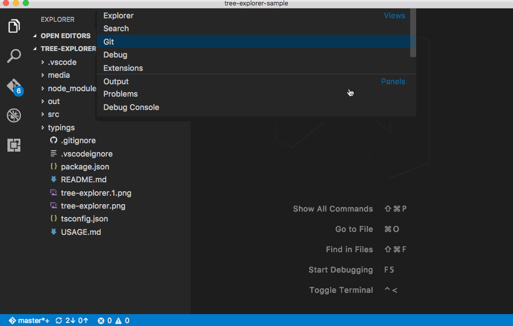

# November 2016 (version 1.8)

Welcome to the November release of Visual Studio Code. There are a number of significant updates in this version that we hope you will like, some of the key highlights include:

* **[Hot exit](#hot-exit)** - VS Code now remembers unsaved files. TBD on by default?
* **[Zen Mode](#zen-mode)** - Remove any distractions when looking at your files by putting VS Code into Zen Mode.
* **[Configurable Activity Bar](#configurable-activity-bar)** - Arrange the Activity Bar icons to your liking.
* **[Settings improvements](#settings-improvements)** - Easily configure VS Code with global and workspace settings.
* **[Git clone](#git-clone)** - Clone your repo from within VS Code.
* **[New Selection menu](#selection-menu)** - Easily discover and use the editor selection commands.
* **[JavaScript IntelliSense in HTML](#javascript-language-support-in-html)** - Get full JavaScript language support in HTML files.
* **[Markdown preview improvements](#markdown-preview-improvements)** - New settings for font family, size and line height, hide YAML front matter.

The release notes are arranged in the following sections related to VS Code focus areas. Here are some further updates:

* **[Workbench](#workbench)** - View picker, new workbench configuration settings.
* **[Editor](#editor)** - TBD details not mentioned in highlights.
* **[Languages](#languages)** - TBD details not mentioned in highlights.
* **[Extensions](#extensions)** - TBD details not mentioned in highlights.
* **[Node.js Debugging](#node-debugging)** - TBD details not mentioned in highlights.
* **[Extension Authoring](#extension-authoring)** - TBD details not mentioned in highlights.

## Workbench

### Hot exit

### Zen Mode
As per [user requests](https://github.com/Microsoft/vscode/issues/12940) we have added zen mode to VS Code. Zen Mode is designed so that the focus is on the actual code thus entering zen mode hides all the parts except the editor (activity bar, status bar, sidebar and panel) and transitions VS Code to full screen. Zen mode can be toggled using the View menu, quick pick or by the shortcut `kb(workbench.action.toggleZenMode)`. Transition to full screen can be disabled via `workbench.fullScreenZenMode`. Double `esc` also exits zen mode.

### Configurable Activity Bar

The Activity Bar is home to all views shipped with VS Code (File Explorer, Search, Debug). Many people use it to quickly switch between views and to see information about a view (for example, the number of outgoing files on the Git view).

In this release, we improved the Activity Bar with several new features. First of all, it is now possible to reorder views using drag and drop. The order is kept and restored between restarts of VS Code. Second, you can now remove entries from the Activity Bar using the context menu on either the Activity Bar itself or the particular view to remove.

Removed views will still show up in the Activity Bar when opened but their icon will not be displayed when you switch to another view. This is similar to the well known behavior of an application dock where you can pin applications to always show them or unpin them if you want the application icon to be removed once the application quits.


Finally, if the window gets small enough so that all view icons can not show, a new overflow menu was added to show the views in a dropdown:


### View Picker

A new picker is added that shows Views, Panels, Output channels and Terminals and allows for easy opening of those. You can open it via the **Open View** command or by typing `view` followed by a `space` into quick open.



On Windows and Mac, you can press `kbstyle(Ctrl+Q)` to bring up the picker. On Linux, you can reassign the keybinding if you want (`kbstyle(Ctrl+Q)` is assigned to quitting on Linux). Pressing `kbstyle(Ctrl+Q)` and holding the `kbstyle(Ctrl)` key while pressing the `kbstyle(Q)` allows you to jump to an entry from the list and open it after you release the keys.

### Settings improvements

Given that VS Code is an editor, we provide settings in the form of `settings.json` file to configure VS Code behaviour by editing. To discover existing settings, in addition to IntelliSense, we show `Default settings` in a separate editor, when user opens settings. But, there was feedback that they are not still easily discoverable and configurable, which was also confirmed from our user studies. In this release, we did some explorataions to improve discoverability and user experience for Settings and this resulted into following improvements to our Settings story.

#### Search settings
One of the big reasons for showing default settings is to let users search and discover settings. To facilitate this, Default settings editor now comes with a big Search bar where you can easily find for setting(s) you are looking for. In addition to showing and highlighting settings matching your search criteria, this will also filter out those settings which are not matching. This makes finding settings quick and easy.


#### Settings groups
We enhanced visual representatin of default settings groups to make settings navigation more user friendly. We also introduced a new group for most commonly used settings for user awareness.


#### Quick Edit
We introduced actions inside Default settings and Settings editors which will help you in quickly copying or updating a setting.


#### One Side by Side Settings editor
Last but not least, we grouped Default settings and Settings editors into one side by side editor which are no longer separated. This addresses the issue of managing two editors for settings.

Explorations and improvements continue... Stay tuned to our next release plan.

### Git clone

### Mac: Custom themed title

On macOS, we are now drawing our own custom title instead of the native one to allow for the theme color to be picked up. This behavior can be changed with the new `window.titleBarStyle` setting. The new default is `custom` but you can set the value to `native` to go back to the old behavior after a restart.


### Hide the Activity Bar

A new setting `workbench.activityBar.visible` lets you hide the Activity Bar to the side of the view area.


We also added a related entry to the **View** menu as well as in **Command Palette**. The related command has the id `workbench.action.toggleActivityBarVisibility`.

### New setting to show full path in Window title

We added a new setting `window.showFullPath` that will show the full path to an opened file in the window title instead of the workspace relative one.

### New setting to hide Close buttons on Tabs

We added a new setting `workbench.editor.showTabCloseButton` that will hide the Close buttons on tabs. Dirty indications are still visible at the same location but you will not accidentally close tabs with the mouse once enabled.

## Editor

### Selection menu

### Snippet Variables

In snippets you can now use variables. The syntax for variables is `$name` for simple variables and `${name:default}` for variables with a default value. Variables evaluate to their value, the empty string, or, if present, their default value. When a variable is unknown we insert it as a placeholder.

The following variables can be used:

* `TM_SELECTED_TEXT` The currently selected text or the empty string
* `TM_CURRENT_LINE` The contents of the current line
* `TM_CURRENT_WORD` The contents of the word under cursor or the empty string
* `TM_LINE_INDEX` The zero-index based line number
* `TM_LINE_NUMBER` The one-index based line number
* `TM_FILENAME` The filename of the current document
* `TM_DIRECTORY` The direcorty of the current document
* `TM_FILEPATH` The full file path of the current document

The following is an example of a snippet that surrounds the selected text with single quotes or, when no text is selected, inserts a `type_here`-placeholder.

```json
"in quotes": {
	"prefix": "inq",
	"body": "'${TM_SELECTED_TEXT:${1:type_here}}'"
}
```

### New setting to insert final newline into files

We added a new setting `files.insertFinalNewline` to automatically add a newline at the end of files when saving.

### Keybinding commands can now define arguments

We added support to invoke commands with arguments to the `keybindings.json` configuration file. The following is an example of this by overriding the Enter key to print some text:

`{ "key": "enter", "command": "type", "args": { "text": "Hello World"}, "when": "editorTextFocus" }`

The type command will receive `{ "text": "Hello World"}` as first argument and add "Hello World" to the file instead of producing the default command.

## Languages

### JavaScript language support in HTML

### Markdown preview improvements

Hide YAML metadata
Preview settings for fontFamily, fontSize, lineHeight

## Extensions

### Item

## Node Debugging

### Item

## Extension Authoring

### Strict Null Checks supported

We have updated the type definitions in `vscode.d.ts` to explicit spell out when a type can be `undefined` and/or `null`. With this extensions using the `strictNullChecks`-feature of TypeScript will get better type check results.

### Snippet Completions

A completion item provider can now return completions that are inserted as snippet. When creating an item, make sure its `insertText` is a [`SnippetString`](https://github.com/Microsoft/vscode/blob/master/src/vs/vscode.d.ts#L2073). When selected, the editor will go to snippet mode, allowing the have placeholders and control over the cursor position.

### Inspect Configurations

With the new [`inspect`](https://github.com/Microsoft/vscode/blob/master/src/vs/vscode.d.ts#L2825)-function you can figure out where a configuration value was defined and what it default is.


### TextDocument#getWordRangeAt

Ever since the text document allows to ask for a [word-range](https://github.com/Microsoft/vscode/blob/master/src/vs/vscode.d.ts#L221) at a given position. To know what a word is VS Code uses the [word-pattern](https://github.com/Microsoft/vscode/blob/master/src/vs/vscode.d.ts#L2714) of the respective language. That's not always good enough and therefore you can now provide a regular expression that will be used instead.

### VS Code Debug Protocol

Specifying a top level `debugServer` attribute in `launch.json` is no longer supported. This attribute now has to be specified per launch configuration. More details can be found [here](https://github.com/Microsoft/vscode/issues/13783).

### Breaking Change: TBD

### Item

## Miscellaneous

### Electron update

In this release, we updated from Electron 1.3.x to 1.4.x. This brings a Chrome update from version 52 to 53. We have heard from users that this update reduces font blurriness on Windows when running with >100% DPI.

Another benefit is that we can now enable the High Contrast theme automatically when we detect that Windows is running in high contrast mode. VS Code will open in high contrast mode when Windows is configured as such and will also switch to high contrast mode if you change the mode in Windows while VS Code is running.

## New Commands

Key|Command|Command id
---|-------|----------
`kb(workbench.action.quickOpenView)`|Quick Open View|`workbench.action.quickOpenView`
`unassigned`|Open Next Editor in Group|`workbench.action.nextEditorInGroup`
`unassigned`|Open Previous Editor in Group|`workbench.action.previousEditorInGroup`
`kb(workbench.action.toggleZenMode)`|Enable Zen Mode|`workbench.action.toggleZenMode`
`kb(workbench.action.exitZenMode)`|Leave Zen Mode|`workbench.action.exitZenMode`
`unassigned`|Close active Panel|`workbench.action.closePanel`
`unassigned`|Clone from a Git URL|`workbench.action.git.clone`
`unassigned`|Toggle Visibility of Activity Bar|`workbench.action.toggleActivityBarVisibility`
`unassigned`|Quit VS Code|`workbench.action.quit`

## Notable Changes

* [15111](https://github.com/Microsoft/vscode/issues/15111): External file watcher fails for editors that do atomic saves

These are the [closed bugs](https://github.com/Microsoft/vscode/issues?q=is%3Aissue+label%3Abug+milestone%3A%22November+2016%22+is%3Aclosed) and these are the [closed feature requests](https://github.com/Microsoft/vscode/issues?q=is%3Aissue+milestone%3A%22November+2016%22+is%3Aclosed+label%3Afeature-request) for the 1.8 update.

## Contributions to Extensions

Our team maintains or contributes to a number of VS Code extensions. Most notably:

* [Go](https://marketplace.visualstudio.com/items?itemName=lukehoban.Go)
* [Python](https://marketplace.visualstudio.com/items?itemName=donjayamanne.python)
* [TSLint](https://marketplace.visualstudio.com/items?itemName=eg2.tslint)
* [ESLint](https://marketplace.visualstudio.com/items?itemName=dbaeumer.vscode-eslint)
* [Debugger for Chrome](https://marketplace.visualstudio.com/items?itemName=msjsdiag.debugger-for-chrome)
* [VSCodeVim](https://marketplace.visualstudio.com/items?itemName=vscodevim.vim)

## Thank You

Last but certainly not least, a big *__Thank You!__* to the following folks that helped to make VS Code even better:

TBD The contribution list is autogenerated

* [TBD (@tbd)](https://github.com/tbd):  TBD [PR #TBD](https://github.com/Microsoft/vscode/pull/TBD)
* [Vlad Dumitrescu (@vladdu)](https://github.com/vladdu):
  * add table of contents to the specification [PR LSP#117](https://github.com/Microsoft/language-server-protocol/pull/117)
  * add link to JSON-RPC specification [PR LSP#123](https://github.com/Microsoft/language-server-protocol/pull/123)
* [CJ Bell (@siegebell)](https://github.com/siegebell): CancellationToken.is does not check for undefined [PR LSP-Node#121](https://github.com/Microsoft/vscode-languageserver-node/pull/121)
* [Gama11 (@Gama11)](https://github.com/Gama11): Typo fix: "hove" -> "hover" [PR LSP-Node#109](https://github.com/Microsoft/vscode-languageserver-node/pull/109)

<!-- In-product release notes styles.  Do not modify without also modifying regex in gulpfile.common.js -->
<a id="scroll-to-top" role="button" aria-label="scroll to top" onclick="scroll(0,0)"><span class="icon"></span></a>
<link rel="stylesheet" type="text/css" href="css/inproduct_releasenotes.css"/>
