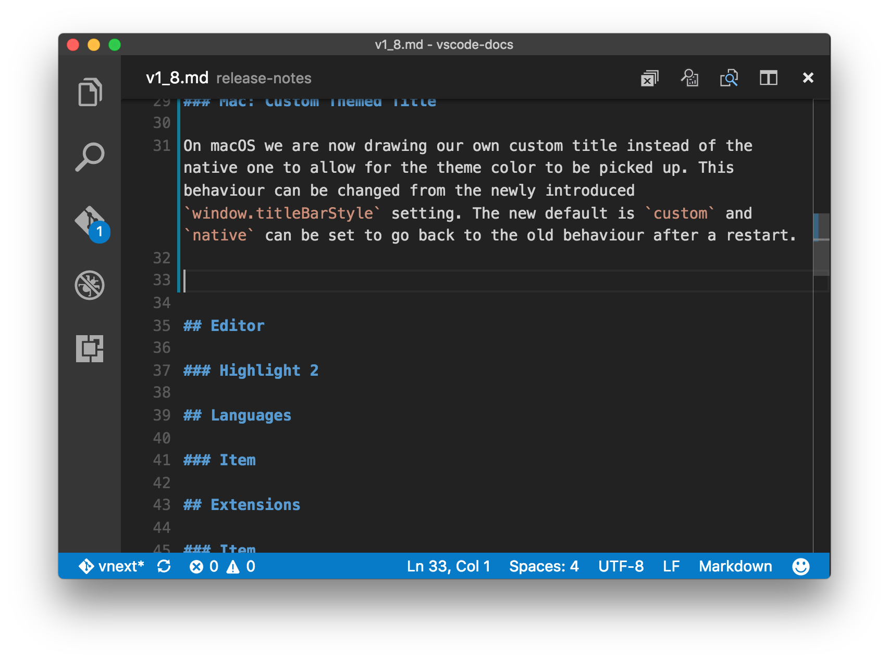
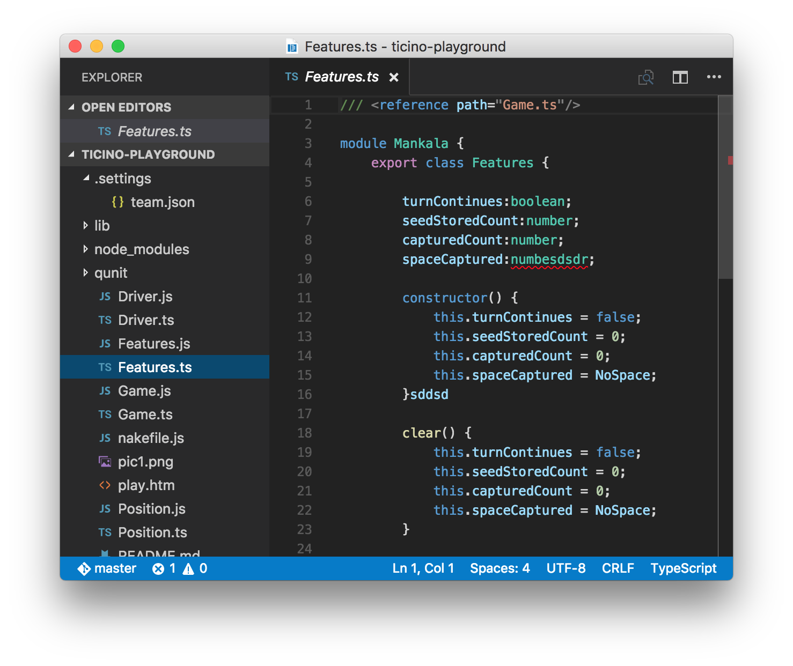

# November 2016 (version 1.8)

Welcome to the November release of Visual Studio Code. There are a number of significant updates in this version that we hope you will like, some of the key highlights include:

* **[Highlight1](#highlight-1)** - highlight 1 description.
* **[Highlight2](#highlight-2)** - highlight 2 description.

TBD add 10-12 highlights linking to h3 headers

The release notes are arranged in the following sections related to VS Code focus areas. Here are some further updates:

* **[Workbench](#workbench)** - TBD details not mentioned in highlights.
* **[Editor](#editor)** - TBD details not mentioned in highlights.
* **[Languages](#languages)** - TBD details not mentioned in highlights.
* **[Extensions](#extensions)** - TBD details not mentioned in highlights.
* **[Node.js Debugging](#node-debugging)** - TBD details not mentioned in highlights.
* **[Extension Authoring](#extension-authoring)** - TBD details not mentioned in highlights.

## Workbench

### Mac: Custom Themed Title

On macOS we are now drawing our own custom title instead of the native one to allow for the theme color to be picked up. This behaviour can be changed from the newly introduced `window.titleBarStyle` setting. The new default is `custom` and `native` can be set to go back to the old behaviour after a restart.

 

### Hide the Activity Bar

A newly introduced setting `workbench.activityBar.visible` setting allows to hide the activity bar to the side of the viewlet area. 

 

We also added a related entry to the View menu as well as command palette. The related command has the id `workbench.action.toggleActivityBarVisibility`.

### New Setting to Show Full Path in Window Title

We added a new setting `window.showFullPath` that will show the full path to an opened file in the window title instead of the workspace relative one.

### New Setting to Hide Close Buttons on Tabs

We added a new setting `workbench.editor.showTabCloseButton` that will hide the close buttons on tabs. Dirty indications are still visible at the same location but you will not accidentally close taby with the mouse anymore once enabled.

### Electron Update

In this release we update from Electron 1.3.x to 1.4.x. This brings a Chrome update from version 52 to 53. We have heard from users that this update reduces font blurriness on Windows when running with >100% DPI.

Another benefit is that we can now enable high contrast theme automatically when we detect that Windows runs in high contrast mode. Code will open in high contrast mode when Windows is configured as such and will also switch to high contrast mode if you change the mode in Windows while Code is running 

## Editor

### New Setting to insert Final Newline into Files

We added a new setting `files.insertFinalNewline` to automatically add a newline at the end of files when saving. 

### Keybinding Commands can now Define Arguments

We added support to invoke commands with arguments to the `keybindings.json` configuration file. The following is an example of this by overriding the Enter key to print some text:

`{ "key": "enter", "command": "type", "args": { "text": "Hello World"}, "when": "editorTextFocus" }`

The type command will receive `{ "text": "Hello World"}` as first argument and add "Hello World" to the file instead of producing the default command.

## Languages

### Item

## Extensions

### Item

## Node Debugging

### Item

## Extension Authoring

### VS Code Debug Protocol
Specifying a top level `"debugServer"` attribute in `launch.json` is no longer supported. This attribute now has to be specified per launch configuration. More details can be found [here](https://github.com/Microsoft/vscode/issues/13783).

### Breaking Change: TBD

### Item

## New Commands

Key|Command|Command id
---|-------|----------
`kb(workbench.action.nextEditorInGroup)`|Open Next Editor in Group|`workbench.action.nextEditorInGroup`
`kb(workbench.action.previousEditorInGroup)`|Open Previous Editor in Group|`workbench.action.previousEditorInGroup`
`kb(workbench.action.toggleZenMode)`|Enable Zen Mode|`workbench.action.toggleZenMode`
`kb(workbench.action.exitZenMode)`|Leave Zen Mode|`workbench.action.exitZenMode`
`kb(workbench.action.closePanel)`|Close the Panel|`workbench.action.closePanel`
`kb(workbench.action.git.clone)`|Clone from a Git URL|`workbench.action.git.clone`
`kb(workbench.action.toggleActivityBarVisibility)`|Toggle Visibility of Activity Bar|`workbench.action.toggleActivityBarVisibility`

## Notable Changes

* [15111](https://github.com/Microsoft/vscode/issues/15111): External file watcher fails for editors that do atomic saves

These are the [closed bugs](https://github.com/Microsoft/vscode/issues?q=is%3Aissue+label%3Abug+milestone%3A%22November+2016%22+is%3Aclosed) and these are the [closed feature requests](https://github.com/Microsoft/vscode/issues?q=is%3Aissue+milestone%3A%22November+2016%22+is%3Aclosed+label%3Afeature-request) for the 1.8 update.

## Contributions to Extensions

Our team maintains or contributes to a number of VS Code extensions. Most notably:

* [Go](https://marketplace.visualstudio.com/items?itemName=lukehoban.Go)
* [Python](https://marketplace.visualstudio.com/items?itemName=donjayamanne.python)
* [TSLint](https://marketplace.visualstudio.com/items?itemName=eg2.tslint)
* [ESLint](https://marketplace.visualstudio.com/items?itemName=dbaeumer.vscode-eslint)
* [Debugger for Chrome](https://marketplace.visualstudio.com/items?itemName=msjsdiag.debugger-for-chrome)
* [VSCodeVim](https://marketplace.visualstudio.com/items?itemName=vscodevim.vim)

## Thank You

Last but certainly not least, a big *__Thank You!__* to the following folks that helped to make VS Code even better:

TBD The contribution list is autogenerated

* [TBD (@tbd)](https://github.com/tbd):  TBD [PR #TBD](https://github.com/Microsoft/vscode/pull/TBD)
* [Vlad Dumitrescu (@vladdu)](https://github.com/vladdu): add table of contents to the specification [PR LSP#117](https://github.com/Microsoft/language-server-protocol/pull/117)

<!-- In-product release notes styles.  Do not modify without also modifying regex in gulpfile.common.js -->
<a id="scroll-to-top" role="button" aria-label="scroll to top" onclick="scroll(0,0)"></a>
<link rel="stylesheet" type="text/css" href="css/inproduct_releasenotes.css"/>
