---
Order:
TOCTitle: November 2016
PageTitle: Visual Studio Code November 2016
MetaDescription: See what is new in the Visual Studio Code November 2016 Release (1.8)
MetaSocialImage: 1_8/release-highlights.png
---
# November 2016 (version 1.8)

## 1.8.1 Recovery Build

We are releasing a 1.8.1 recovery build to address a handful of [key issues](https://github.com/Microsoft/vscode/milestone/34?closed=1) before the end of year. Thank you for helping us find them quickly!

* Fixed scrolling in large minified files ([#17208](https://github.com/Microsoft/vscode/issues/17208))
* Resolved an issue with Copy command in certain contexts ([#17232](https://github.com/Microsoft/vscode/issues/17232))
* Fixed an issue with saving files on a mounted drive ([#17345](https://github.com/Microsoft/vscode/issues/17345))
* Fixed Quick Outline in Default Keyboard Shortcuts ([#17376](https://github.com/Microsoft/vscode/issues/17376))
* Removed 'Focus Default Settings' command from Command Palette ([#17468](https://github.com/Microsoft/vscode/issues/17468))

VS Code will automatically update itself to 1.8.1 or you can download the release directly using the following links:

Downloads: [Windows](https://vscode-update.azurewebsites.net/1.8.1/win32/stable) | [Mac](https://vscode-update.azurewebsites.net/1.8.1/darwin/stable) | Linux 64-bit: [.tar.gz](https://vscode-update.azurewebsites.net/1.8.1/linux-x64/stable) [.deb](https://vscode-update.azurewebsites.net/1.8.1/linux-deb-x64/stable) [.rpm](https://vscode-update.azurewebsites.net/1.8.1/linux-rpm-x64/stable) | Linux 32-bit: [.tar.gz](https://vscode-update.azurewebsites.net/1.8.1/linux-ia32/stable) [.deb](https://vscode-update.azurewebsites.net/1.8.1/linux-deb-ia32/stable) [.rpm](https://vscode-update.azurewebsites.net/1.8.1/linux-rpm-ia32/stable)

## November Release Summary

Welcome to the November release of Visual Studio Code. There are a number of significant updates in this version that we hope you will like, some of the key highlights include:

* **[Hot Exit](#hot-exit)** - Switch context quickly and never lose your changes.
* **[Focus on Your Code](#focus-on-your-code)** - Enhancements like Zen Mode, configurable Activity Bar, and more.
* **[Settings improvements](#settings)** - New experience for configuring VS Code.
* **[New Selection menu](#selection-menu)** - Easily discover and use the editor selection commands.
* **[Faster Text Search ](#text-search-performance)** - Find the code you're looking for fast no matter how large your project.
* **[Snippet authoring](#snippets)** - Use variables in your code snippets.
* **[Keyboard shortcuts](#keyboard-shortcuts)** - Create custom shortcuts with command arguments, find popular Keymaps.
* **[JavaScript IntelliSense in HTML](#javascript-language-support-in-html)** - Get full JavaScript language support in HTML files.
* **[UI for Multitarget Debugging](#multitarget-debugging)** - Launch simultaneous debug sessions.
* **[TypeScript 2.1](#typescript-update)** - Improved language support with the latest TypeScript update.
* **[JavaScript](#javascript)** - Support for Object Rest/Spread.

The release notes are arranged in the following sections related to VS Code focus areas. Here are some further updates:

* **[Workbench](#workbench)** - New View picker, Integrated Terminal improvements, macOS themed title.
* **[Settings](#settings)** - Search and easily edit settings, find Keymap extensions.
* **[Editor](#editor)** - Git Clone, new editor settings, Sublime Text compatibility.
* **[Languages](#languages)** - CSS apply rule, Markdown preview customization, TSLint and ESLint extension updates.
* **[Debugging](#debugging)** - Add launch configurations easily as snippets through IntelliSense.
* **[Node.js Debugging](#node-debugging)** - Just My Code, load environment variables from files, help for sourcemaps.
* **[Extension Authoring](#extension-authoring)** - Strict Null checks, snippet completions, debugger extension updates.

## Workbench

### Hot Exit

VS Code now remembers your unsaved changes when you exit. Hot Exit will be triggered under the following cases:

- All windows (instances) are closed.
- On Mac, when you finally quit the application.
- Window reload, no more saving to reload extensions!

When VS Code is next launched after a Hot Exit, all workspaces/files that are backed up will be restored. This also brings with it the ability to restore files if VS Code crashes, regardless of whether Hot Exit is enabled or disabled (via the `files.hotExit` setting). You can read more about how Hot Exit works, the design decisions behind the implementation, and what's next for the feature on [our blog](https://code.visualstudio.com/blogs/2016/11/30/hot-exit-in-insiders).

### View Picker

A new picker is added that shows Views, Panels, Output channels and Terminals and allows for easy opening of those. You can open it via the **Open View** command or by typing `view` followed by a `space` into **Quick Open**.

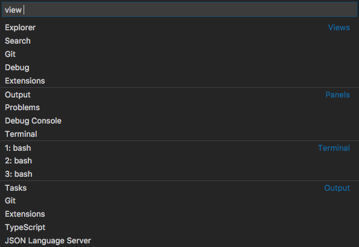

On Windows and Mac, you can press `kbstyle(Ctrl+Q)` to bring up the picker. On Linux, you can reassign the key binding if you want (`kbstyle(Ctrl+Q)` is assigned to quitting on Linux). Pressing `kbstyle(Ctrl+Q)` and holding the `kbstyle(Ctrl)` key while pressing the `kbstyle(Q)` allows you to jump to an entry from the list and open it after you release the keys.

### Terminal improvements

Several improvements were made to the Integrated Terminal:

- Terminal copy and paste key bindings on Windows have changed to `kbstyle(Ctrl+C)` (when text is selected) and `kbstyle(Ctrl+V)` respectively.
- The terminal will no longer scroll to the bottom when it receives output if you have scrolled up
- `kbstyle(Cmd+K)` now clears the terminal when it has focus
- A new setting `terminal.integrated.scrollback` enables changing the number of lines the terminal will remember before discarding

### Mac: Custom themed title

On macOS, we are now drawing our own custom title instead of the native one to allow for the theme color to be picked up. This behavior can be changed with the new `window.titleBarStyle` setting. The new default is `custom` but you can set the value to `native` to go back to the old behavior after a restart.

## Focus on your code

This release we've added features to help you focus on your highest priority, your source code.

### Zen Mode

Per [user requests](https://github.com/Microsoft/vscode/issues/12940), we have added Zen Mode to VS Code. Zen Mode lets you focus on your code by hiding all UI except the editor (no Activity Bar, Status Bar, Sidebar and Panel) and going to full screen. Zen mode can be toggled using the **View** menu, **Command Palette** or by the shortcut `kb(workbench.action.toggleZenMode)`. If you prefer not to transition to full screen, that can be disabled via `window.fullScreenZenMode`. Double `kbstyle(Escape)` exits Zen Mode.

### Configurable Activity Bar

The Activity Bar is home to all views shipped with VS Code (File Explorer, Search, Debug). Many people use it to quickly switch between views and to see information about a view (for example, the number of outgoing files on the Git view).

In this release, we improved the Activity Bar with several new features. First of all, it is now possible to reorder views using drag and drop. The order is kept and restored between restarts of VS Code. Second, you can now remove entries from the Activity Bar using the context menu on either the Activity Bar itself or the particular view to remove.

Removed views will still show up in the Activity Bar when opened but their icon will not be displayed when you switch to another view. This is similar to the well-known behavior of an application dock where you can pin applications to always show them or unpin them if you want the application icon to be removed once the application quits.

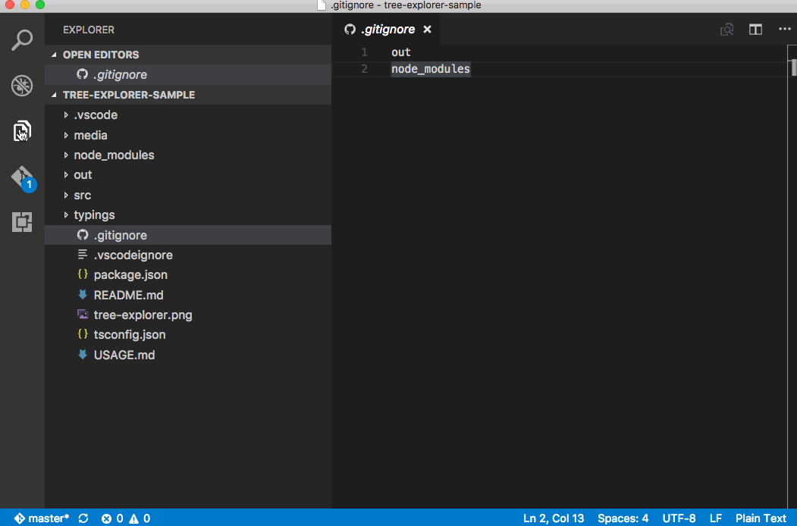

Finally, if the window gets small enough so that all view icons cannot show, a new overflow menu was added to show the views in a dropdown:

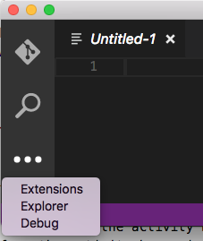

### Hide the Activity Bar

A new setting `workbench.activityBar.visible` lets you hide the Activity Bar to the side of the view area.

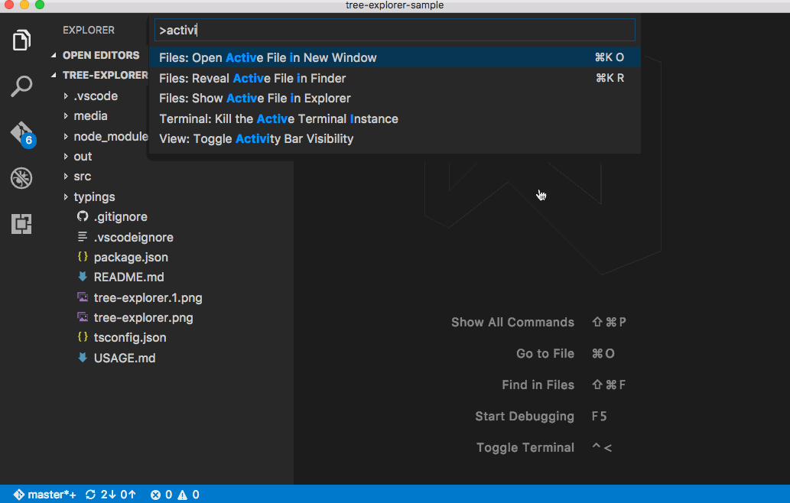

We also added a related entry to the **View** menu as well as in **Command Palette**. The related command has the id `workbench.action.toggleActivityBarVisibility`.

### New setting to hide Close buttons on Tabs

We added a new setting `workbench.editor.showTabCloseButton` that will hide the Close buttons on tabs. Dirty indications are still visible at the same location but you will not accidentally close tabs with the mouse once enabled.

## Settings

VS Code's customization model is very simple in the form of a `settings.json` file which you edit to configure VS Code's behavior. To discover available settings, we show **Default Settings** in a separate editor as well as provide IntelliSense in your opened global or workspace settings. From user feedback and usability studies, we learned that people were still having trouble working with their settings. In this release, we did some explorations to improve discoverability and the user experience for modifying settings and this resulted in the following improvements.

### Search settings

One of the big reasons for showing the default settings is to let users search and discover settings. To facilitate this, the **Default Settings** editor now comes with a big Search bar where you can easily search for settings. In addition to showing and highlighting settings matching your search criteria, this will also filter out those settings which are not matching. This makes finding settings quick and easy.

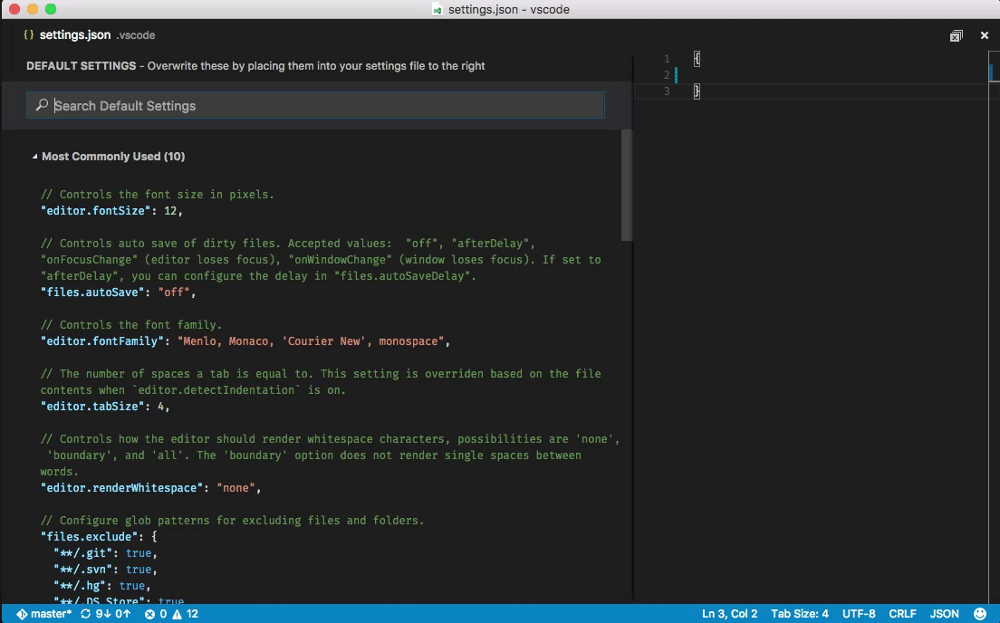

### Settings groups

We enhanced visual representation of **Default Settings** groups to make settings navigation more user friendly. We also introduced a new group of most commonly used settings.

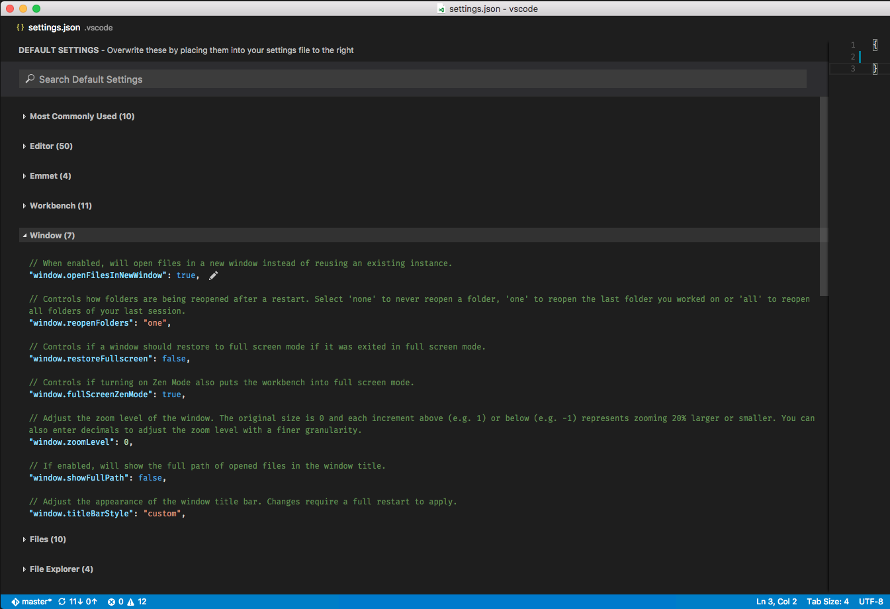

### Quick Edit

We introduced actions inside the **Default Settings** and `settings.json` editors which will help you quickly copy or update a setting.


### One Side by Side Settings editor

Last but not least, we grouped the **Default Settings** and `settings.json` editors into one side by side editor. This addresses the issue of managing two editors for settings.

Explorations and improvements continue... Stay tuned to our next release plan.

## Keyboard shortcuts

### Key binding command arguments

We added support to invoke commands with arguments to the `keybindings.json` configuration file. This is useful if you often perform the same operation on a specific file or folder. Simply add a custom keyboard shortcut to do exactly what you want.

The following is an example overriding the `kbstyle(Enter)` key to print some text:

```json
  { "key": "enter", "command": "type",
                    "args": { "text": "Hello World" },
                    "when": "editorTextFocus" }
```

The type command will receive `{ "text": "Hello World"}` as first argument and add "Hello World" to the file instead of producing the default command.

### Recommended keymap extensions

We have added a command to list the most popular Keymap extensions which provide full sets of key bindings for popular editors or IDEs. To see the list, use **File** > **Preferences** > **Keymap Extensions**.

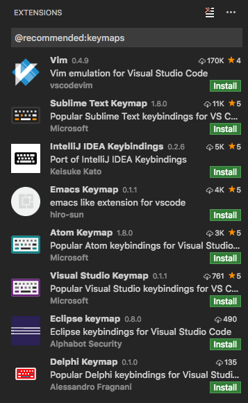

## Editor

### Selection menu

We have added a Selection menu to the menu bar giving access to the most common selection and multi-selection actions:

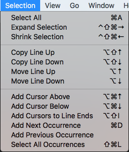

### Text search performance

We improved the [performance](https://github.com/Microsoft/vscode/issues/15384) of full text search by running our search code in multiple processes in parallel. Your searches should complete much faster, especially in large workspaces.

### Git clone

There is now a new lightweight command to clone a Git repository into your machine and open it with VS Code. You can execute it from the **Command Palette** and searching for `Git: Clone`.

### New editor settings

* `window.showFullPath` - show the full path to an opened file in the window title instead of the workspace relative one.
* `files.insertFinalNewline` - automatically add a newline at the end of files when saving.

The `editor.renderLineHighlight` setting has been updated to support new options:

* `line` - Highlight the current line in the editor.
* `gutter` - Highlight the line number in the gutter to the left of the current line.
* `all` - Both gutter and line highlight.
* `none` - No current line highlighting.

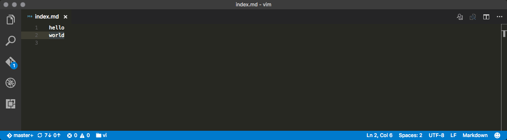

### Accessibility improvements of diff editor

We enhanced the accessibility of the diff editor by adding `+` and `-` indicators for modifications in the diff editor. The feature is enabled by default and can be disabled by setting `diffEditor.renderIndicators` to `false`.

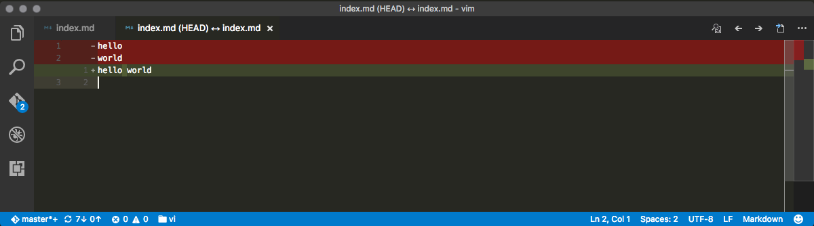

### Sublime Text compatibility

We added four new commands which users from Sublime Text are familiar with:

- Join Lines - `editor.action.joinLines`
- Transpose characters around the cursor - `editor.action.transpose`
- Transform to Uppercase - `editor.action.transformToUppercase`
- Transform to Lowercase - `editor.action.transformToLowercase`

These commands are not bound to any keyboard shortcuts by default.

## Snippets

### Snippet Variables

In your custom snippets, you can now use variables. The syntax for variables is `$name` for simple variables and `${name:default}` for variables with a default value. Variables evaluate to their value, the empty string, or, if present, their default value. When a variable is unknown, we insert it as a placeholder.

The following variables can be used:

* `TM_SELECTED_TEXT` - The currently selected text or the empty string.
* `TM_CURRENT_LINE` - The contents of the current line.
* `TM_CURRENT_WORD` - The contents of the word under cursor or the empty string.
* `TM_LINE_INDEX` - The zero-index based line number.
* `TM_LINE_NUMBER` - The one-index based line number.
* `TM_FILENAME` - The filename of the current document.
* `TM_DIRECTORY` - The directory of the current document.
* `TM_FILEPATH` - The full file path of the current document.

The following is an example of a snippet that surrounds the selected text with single quotes or, when no text is selected, inserts a `type_here`-placeholder.

```json
"in quotes": {
	"prefix": "inq",
	"body": "'${TM_SELECTED_TEXT:${1:type_here}}'"
}
```

### Snippets in JSON schemas

The JSON language service uses JSON schemas to validate JSON documents as well as to provide completions. As a VS code specific extension to JSON schemas, you can now also specify snippets proposals in the schema for a richer experience. The snippet proposals are shown as additional completion proposals and use the snippet syntax to specify placeholders.
See the  [JSON documentation](https://code.visualstudio.com/docs/languages/json#_json-schemas-settings) for more information.

## Languages

### JavaScript language support in HTML

Coding assistance for JavaScript embedded in HTML is back! You get code completions and signature help for DOM and JQuery APIs, validation, hovers, Find References and Go To Definition, symbol highlighting and outline (Ctrl + Shift + o) and format. Note that the language support doesn't follow script includes, it only knows about definitions made in the same file.


### CSS improvements

The CSS language support can now handle the new [@apply rule](https://tabatkins.github.io/specs/css-apply-rule/).

CSS in HTML was also improved, in particular for styles defined in attributes:

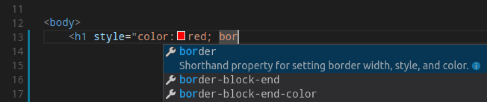

### TypeScript Update

We now use [TypeScript 2.1](https://devblogs.microsoft.com/typescript/announcing-typescript-2-1/) for JavaScript and TypeScript language support. TypeScript 2.1 brings a number of new language and tooling features. [Read about what's new in TypeScript 2.1](https://github.com/Microsoft/TypeScript/wiki/What's-new-in-TypeScript#typescript-21).

### JavaScript

The JavaScript in VS Code is powered by TypeScript and the new TypeScript version bundled with VS Code brings several improvements for JavaScript support:

* [Support for Object Rest and Spread](https://github.com/Microsoft/TypeScript/wiki/What's-new-in-TypeScript#object-spread-and-rest). This was a heavily requested feature request by JS developers working with React. Now you no longer need to disable JavaScript validation when using Object Spread/Rest.
* [Configuration inheritance](https://github.com/Microsoft/TypeScript/wiki/What's-new-in-TypeScript#configuration-inheritance) for `jsconfig.json` files.
* IntelliSense for paths in `import` and `require`.

### Markdown preview improvements

Several new settings were added to improve Markdown preview and let you more closely match your final Markdown rendering.

* `markdown.previewFrontMatter` - By default, VS Code now hides YAML front matter sections in preview. You can set to `show` if you'd like to review YAML metadata.

Controls the font family, size and line height used in the Markdown preview.

* `markdown.preview.fontFamily`
* `markdown.preview.fontSize`
* `markdown.preview.lineHeight`

### Linter Extensions

#### vscode-tslint

The `vscode-tslint` extension now supports [TSLint 4.0](https://palantir.github.io/tslint/2016/11/17/new-for-4.0.html). This version of TSLint provides additional quick fixes for warnings. In addition, `vscode-tslint` adds a quick fix to disable a TSLint rule on the next line. The new TSLint version also adds support for linting JavaScript files. See the [CHANGELOG](https://github.com/Microsoft/vscode-tslint/blob/master/tslint/CHANGELOG.md) for more details.

#### vscode-eslint

The `vscode-eslint` extension now supports validating file types other than JavaScript. To enable this, you need to do the following:

- Configure ESLint with an additional plugin to do the actual validation. For example, to validate HTML files install `eslint-plugin-html` using `npm install eslint-plugin-html` and update the eslint configuration (e.g. `.eslintrc.json` file) with `"plugin": [ "html" ]`.
- Add the corresponding language identifier to the `eslint.validate` setting. Something like `"eslint.validate": [ "javascript", "javascriptreact", "html" ]`. If the setting is missing, it defaults to `["javascript", "javascriptreact"]`

## Debugging

### Multitarget debugging

A first glimpse of _multi-target debugging_ was already available in the previous milestone. In this milestone, we've added the user interface for it. With this release, _multi-target debugging_ is no longer experimental.

Using multi-target debugging is very simple: after you've started a first debug session, VS Code no longer blocks you from launching another session. As soon as a second session is up and running, the VS Code UI switches to _multi-target mode_:

- The individual sessions now show up as top level elements in the CALL STACK view.<BR>
- The floating debug widget shows the currently _active session_ (and all other sessions are available in a dropdown menu).<BR>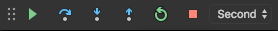
- Debug actions (e.g. all actions in the floating debug widget) are performed on the active session. The active session can be changed either by using the drop down menu in the floating debug widget or by selecting a different element in the CALL STACK view.
- Whenever a session stops (e.g. because a breakpoint or exception is hit), this session becomes the active session. This makes it possible to easily step between debug sessions just by pressing 'F5'.

An alternative way to start multiple debug session is by using a so-called _compound_ launch configuration. A compound launch configuration lists the names of two or more launch configurations that should be launched in parallel. Compound launch configurations show up in the launch configuration drop down menu.

```json
{
    "version": "0.2.0",
    "configurations": [
        {
            "type": "node",
            "request": "launch",
            "name": "Server",
            "program": "${workspaceRoot}/server.js",
            "cwd": "${workspaceRoot}"
        },
        {
            "type": "node",
            "request": "launch",
            "name": "Client",
            "program": "${workspaceRoot}/client.js",
            "cwd": "${workspaceRoot}"
        }
    ],
    "compounds": [
        {
            "name": "Server/Client",
            "configurations": ["Server", "Client"]
        }
    ]
}
```

This [blog](https://medium.com/@auchenberg/introducing-simultaneous-nirvana-javascript-debugging-for-node-js-and-chrome-in-vs-code-d898a4011ab1#.fehi3batj) explains in detail how to setup a compound configuration for a Node.js backend and a browser frontend.

### Adding individual Launch Configurations

We've tried to improve the experience of adding new configurations to an existing `launch.json` by supporting snippet suggestions for IntelliSense. Snippet IntelliSense is available if your cursor is located inside the `configurations` array. Or just press the **Add Configuration** button to invoke snippet IntelliSense at the start of the array.

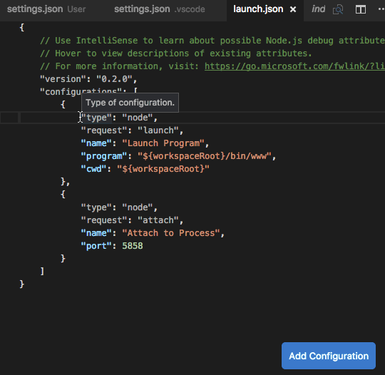

IntelliSense lists the launch configuration snippets that are contributed by all installed debug extensions. This makes it really easy to combine launch configurations for different debuggers (e.g. Chrome and Node) into one launch.json.

Since debug extensions will have to opt into this new feature, please allow some time until all debuggers have adopted this. In the November release, only the built-in Node.js debuggers contribute snippets.

### Some UI Polish

Per [user request](https://github.com/Microsoft/vscode/issues/14125), we now support rearranging the order of Watch expressions using drag and drop.

We have polished the look of the debug start action UI by grouping the start button with the drop down menu to tie them together:

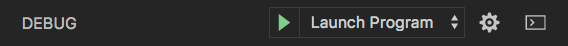

The source and line number information in the BREAKPOINTS view has been rearranged to better align with the CALL STACK view.

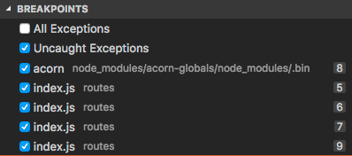

## Node Debugging

This section covers features of the two built-in Node.js debuggers, `node` and `node2`. We try to keep feature parity between them but this becomes more and more difficult because the technology underlying `node` (_V8 Debugger Protocol_) is deprecated (frozen) whereas the new technology (_Chrome Debugger Protocol_) evolves quickly. For this reason, we list the supported debugger types in parenthesis in the header of each feature.

Use the 'old' debugger `node` when debugging Node.js versions < 6.3 and the new debugger `node2` for versions >= 6.3.

>**Note:** If you are using ES6 Proxy in your Node.js app, a Node.js v7.x runtime might even crash when being debugged by the old debugger. This does not happen with `node2`. This issue is tracked in [Microsoft/vscode#12749](https://github.com/Microsoft/vscode/issues/12749).

### Just My Code (node and node2)

We have added a feature to avoid code that you don't want to step through. This feature can be enabled with the `skipFiles` setting in your launch configuration. `skipFiles` is an array of glob patterns for script paths to skip.

For example using:

```typescript
  "skipFiles": [
    "node_modules/**/*.js",
    "lib/**/*.js"
  ]
```

all code in the `node_modules` and `lib` folders will be skipped.

The exact rules are as follows:

* If you step into a skipped file, you won't stop there - you will stop on the next executed line that is not in a skipped file.
* If you have set the option to break on thrown exceptions, then you won't break on exceptions thrown from skipped files.
* If you set a breakpoint in a skipped file, you will stop at that breakpoint, and you will be able to step through it until you step out of it, at which point normal skipping behavior will resume.

This feature is available in the `node`, `node2`, and [Chrome](https://marketplace.visualstudio.com/items?itemName=msjsdiag.debugger-for-chrome) debuggers.

>**Note:** The old debugger (`node`) supports negative glob patterns, but they must **follow** a positive pattern: positive patterns add to the set of skipped files, while negative patterns subtract from that set.

In the following example all but a 'math' module is skipped:

```typescript
"skipFiles": [
    "node_modules/**/*.js",
    "!node_modules/math/**/*.js"
]
```

>**Note:** The old debugger (`node`) has to emulate the _Just My Code_ feature because the _V8 Debugger Protocol_ does not support it natively. This might result in slow stepping performance.

### Load environment variables from external file (node)

The VS Code Node debugger now supports to load environment variables from a file and passes them to the node runtime.
To use this feature add an attribute `envFile` to your launch config and specify the absolute path to the file containing the environment variables:

```typescript
   //...
   "envFile": "${workspaceRoot}/.env",
   "env": { "USER": "john doe" }
   //...
```

Any environment variable specified in the `env` dictionary will override variables loaded from the file.

Here is an example for an '.env' file:

```
USER=doe
PASSWORD=abc123

# a comment

# an empty value:
empty=

# new lines expanded in quoted strings:
lines="foo\nbar"
```

### Diagnostics for Source Map Problems (node2)

When debugging a Node.js app, you may have seen breakpoints turn gray with the message "Source map problem?". The new `node2` debug adapter has two new features which make it easier to understand these issues.

Typing `.scripts` in the debug console during a debugging session will cause the adapter to print out all the information it has about loaded scripts and their sourcemaps.

And the `sourceMapPathOverrides` option in the launch config allows you to rewrite paths in your sourcemap file to enable sourcemaps in cases where the sourcemap file doesn't include enough information for the debug adapter to find the correct source files on disk. See more information about both of these features [in the `node2` README](https://github.com/Microsoft/vscode-node-debug2#the-scripts-command).

### Back in time Debugging (node)

This UI appears automatically for Chakra based Node.js runtimes. For details see this [blog](https://blogs.windows.com/msedgedev/2016/11/29/node-chakracore-vm-neutrality/#cr7wJLzUhp37TVcI.97).

The _Back In Time Debugging_ support of the `node` debugger has been extended by a `Reverse Continue` action:

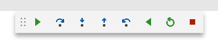

## Extension Authoring

### Strict Null Checks supported

We have updated the type definitions in `vscode.d.ts` to explicit spell out when a type can be `undefined` and/or `null`. With this extensions using the `strictNullChecks`-feature of TypeScript will get better type check results.

### Snippet Completions

A completion item provider can now return completions that are inserted as snippet. When creating an item, make sure its `insertText` is a [`SnippetString`](https://github.com/Microsoft/vscode/blob/master/src/vs/vscode.d.ts#L2073). When selected, the editor will go to snippet mode, allowing the have placeholders and control over the cursor position.

### Inspect Configurations

With the new [`inspect`](https://github.com/Microsoft/vscode/blob/master/src/vs/vscode.d.ts#L2825)-function you can figure out where a configuration value was defined and what it default is.

### TextDocument#getWordRangeAt

Ever since the text document allows to ask for a [word-range](https://github.com/Microsoft/vscode/blob/master/src/vs/vscode.d.ts#L221) at a given position. To know what a word is VS Code uses the [word-pattern](https://github.com/Microsoft/vscode/blob/master/src/vs/vscode.d.ts#L2714) of the respective language. That's not always good enough and therefore you can now provide a regular expression that will be used instead.

### Debugger Extension Authoring

In the `launch.json`, the top level `debugServer` attribute has been deprecated (and support for it will be removed in the February milestone). Instead the `debugServer` attribute has to be specified per launch configuration. More details can be found [here](https://github.com/Microsoft/vscode/issues/13783).

Debugger extensions can now contribute launch configuration snippets which will get surfaced in `launch.json` as explained in section "Adding Individual Launch Configurations". This can be done using the regular syntax for contributing snippets to VS Code, but as a `configurationSnippets` attribute inside the `debuggers` section of the `package.json`. An example of how Mock Debug is contributing debug configuration snippets can be found [here](https://github.com/Microsoft/vscode-mock-debug/blob/master/package.json#L71).

### VS Code Debug Protocol

The `OutputEvent` type now supports to send structured objects to the debug console and VS Code renders them as expandable objects. More details can be found [here](https://github.com/Microsoft/vscode-debugadapter-node/issues/79).

A new `RestartRequest` has been added to the debug protocol. If a debug adapter opts into this, the VS Code debugger UI no longer implements the `Restart` action by terminating and restarting the debug adapter but instead sends a `RestartRequest` to the adapter. More details can be found [here](https://github.com/Microsoft/vscode/issues/14189).

## Miscellaneous

### Electron update

In this release, we updated from Electron 1.3.x to 1.4.x. This brings a Chrome update from version 52 to 53. We have heard from users that this update reduces font blurriness on Windows when running with >100% DPI.

Another benefit is that we can now enable the High Contrast theme automatically when we detect that Windows is running in high contrast mode. VS Code will open in high contrast mode when Windows is configured as such and will also switch to high contrast mode if you change the mode in Windows while VS Code is running.

### Language Server Protocol

The LSP now supports snippets in completion items just as the VS Code API does. In addition, two new requests got introduced supporting the dynamic registration of providers on the client side. Also the LSP NPM node modules were upgraded to TypeScript version 2.0. For details see [https://github.com/Microsoft/language-server-protocol](https://github.com/Microsoft/language-server-protocol) and [https://github.com/Microsoft/vscode-languageserver-node](https://github.com/Microsoft/vscode-languageserver-node)

## New Commands

Key|Command|Command id
---|-------|----------
`kb(workbench.action.quickOpenView)`|Quick Open View|`workbench.action.quickOpenView`
`kb(workbench.action.nextEditorInGroup)`|Open Next Editor in Group|`workbench.action.nextEditorInGroup`
`kb(workbench.action.previousEditorInGroup)`|Open Previous Editor in Group|`workbench.action.previousEditorInGroup`
`kb(workbench.action.toggleZenMode)`|Enable Zen Mode|`workbench.action.toggleZenMode`
`kb(workbench.action.exitZenMode)`|Leave Zen Mode|`workbench.action.exitZenMode`
`kb(workbench.action.closePanel)`|Close active Panel|`workbench.action.closePanel`
`kb(workbench.action.git.clone)`|Clone from a Git URL|`workbench.action.git.clone`
`kb(workbench.action.toggleActivityBarVisibility)`|Toggle Visibility of Activity Bar|`workbench.action.toggleActivityBarVisibility`
`kb(workbench.action.quit)`|Quit VS Code|`workbench.action.quit`
`kb(editor.action.joinLines)`|Join Lines|`editor.action.joinLines`
`kb(editor.action.transpose)`|Transpose characters around the cursor|`editor.action.transpose`
`kb(editor.action.transformToUppercase)`|Transform to Uppercase|`editor.action.transformToUppercase`
`kb(editor.action.transformToLowercase)`|Transform to Lowercase|`editor.action.transformToLowercase`

## Notable Changes

* [16330](https://github.com/Microsoft/vscode/issues/16330): Use cached data to speed up script parsing
* [16065](https://github.com/Microsoft/vscode/issues/16065): First https request is responsible for 18% of windows startup time
* [15111](https://github.com/Microsoft/vscode/issues/15111): External file watcher fails for editors that do atomic saves
* [14951](https://github.com/Microsoft/vscode/issues/14951): Download vscode very slow in China
* [13104](https://github.com/Microsoft/vscode/issues/13104): Windows: selected tree item not accessible
* [13527](https://github.com/Microsoft/vscode/issues/13527): Text is super blurry now
* [15741](https://github.com/Microsoft/vscode/issues/15741): Allow code to open directories in nautilus file manager

These are the [closed bugs](https://github.com/Microsoft/vscode/issues?q=is%3Aissue+label%3Abug+milestone%3A%22November+2016%22+is%3Aclosed) and these are the [closed feature requests](https://github.com/Microsoft/vscode/issues?q=is%3Aissue+milestone%3A%22November+2016%22+is%3Aclosed+label%3Afeature-request) for the 1.8 update.

## Contributions to Extensions

Our team maintains or contributes to a number of VS Code extensions. Most notably:

* [Go](https://marketplace.visualstudio.com/items?itemName=ms-vscode.Go)
* [Python](https://marketplace.visualstudio.com/items?itemName=ms-python.python)
* [TSLint](https://marketplace.visualstudio.com/items?itemName=eg2.tslint)
* [ESLint](https://marketplace.visualstudio.com/items?itemName=dbaeumer.vscode-eslint)
* [Debugger for Chrome](https://marketplace.visualstudio.com/items?itemName=msjsdiag.debugger-for-chrome)
* [VSCodeVim](https://marketplace.visualstudio.com/items?itemName=vscodevim.vim)
* [Mono Debug](https://marketplace.visualstudio.com/items?itemName=ms-vscode.mono-debug)
* [Mock Debug](https://marketplace.visualstudio.com/items?itemName=andreweinand.mock-debug)

## Thank You

Last but certainly not least, a big *__Thank You!__* to the following folks that helped to make VS Code even better:

* [@anantoghosh](https://github.com/anantoghosh):  Fix Incorrect links in "vscode namespace API" Doc [PR #15904](https://github.com/Microsoft/vscode/pull/15904)
* [Christian Alexander (@ChristianAlexander)](https://github.com/ChristianAlexander):  Fix #14135 - Allow files with merge status to be staged [PR #14788](https://github.com/Microsoft/vscode/pull/14788)
* [Faustino Aguilar (@faustinoaq)](https://github.com/faustinoaq):  Support HTML comments in Markdown [PR #14573](https://github.com/Microsoft/vscode/pull/14573)
* [Felix Becker (@felixfbecker)](https://github.com/felixfbecker)
  *  Repl links fix [PR #15174](https://github.com/Microsoft/vscode/pull/15174)
  *  Improve REPL link highlight regexp [PR #15406](https://github.com/Microsoft/vscode/pull/15406)
  *  Only resolve paths in REPL if path is relative [PR #15794](https://github.com/Microsoft/vscode/pull/15794)
  *  Resolve relative REPL paths [PR #15464](https://github.com/Microsoft/vscode/pull/15464)
* [Sanders Lauture (@golf1052)](https://github.com/golf1052):  Provide an option to hide the activity bar [PR #14940](https://github.com/Microsoft/vscode/pull/14940)
* [Huachao Mao (@Huachao)](https://github.com/Huachao)
  *  Add .conf and .cfg file extensions for ini language [PR #15512](https://github.com/Microsoft/vscode/pull/15512)
  *  Add Translation Memory eXchange (TMX) support [PR #14894](https://github.com/Microsoft/vscode/pull/14894)
* [Michael Hudson (@Huddo121)](https://github.com/Huddo121):  Add tests for zoom level functionality [PR #14737](https://github.com/Microsoft/vscode/pull/14737)
* [Yuichi Tanikawa (@itiut)](https://github.com/itiut):  Add .zsh-theme to shellscript extensions [PR #15489](https://github.com/Microsoft/vscode/pull/15489)
* [Kai Wood (@kaiwood)](https://github.com/kaiwood):  Fix focus and configuration handling of the integrated terminal [PR #15958](https://github.com/Microsoft/vscode/pull/15958)
* [Matt King (@KattMingMing)](https://github.com/KattMingMing):  Support opening files through URL handling (fixes #4883) [PR #15320](https://github.com/Microsoft/vscode/pull/15320)
* [Jonathan Carter (@lostintangent)](https://github.com/lostintangent):  Adding Docker 1.12 instructions to its grammar [PR #16476](https://github.com/Microsoft/vscode/pull/16476)
* [Pine (@octref)](https://github.com/octref):  Declarative contribution of custom Tree Explorer [PR #14048](https://github.com/Microsoft/vscode/pull/14048)
* [Munir Mastalic (@polygotdev)](https://github.com/polygotdev):  add conditional to rpm spec to test for arch, fixes 13616 [PR #15128](https://github.com/Microsoft/vscode/pull/15128)
* [scheakur (@scheakur)](https://github.com/scheakur):  Remove duplicate test code [PR #16061](https://github.com/Microsoft/vscode/pull/16061)
* [Sean Kelly (@xconverge)](https://github.com/xconverge):  fixes #16553 [PR #16689](https://github.com/Microsoft/vscode/pull/16689)
* [Yuya Tanaka (@ypresto)](https://github.com/ypresto):  Fix backslash is not escaped by define key binding [PR #16108](https://github.com/Microsoft/vscode/pull/16108)
* [Tamas Kiss (@kisstkondoros)](https://github.com/kisstkondoros):  Standardize cursor movement with home and end keys [PR #17027](https://github.com/Microsoft/vscode/pull/17027)

Contributions to `vscode-tslint`:

* [Eric Anderson (@ericanderson)](https://github.com/ericanderson):  Detect 4.0.0 for -dev versions of TSLint [PR #141](https://github.com/Microsoft/vscode-tslint/pull/141)
* [Richard Lasjunies (@rlasjunies)](https://github.com/rlasjunies): fix most of the autoFix issues using TSLint 4.0 [PR #138](https://github.com/Microsoft/vscode-tslint/pull/138)
* [Robert Stoll (@robstoll)](https://github.com/robstoll):  reverts #107, seems like rule name was removed [PR #140](https://github.com/Microsoft/vscode-tslint/pull/140)
* [Yuichi Nukiyama (@YuichiNukiyama)](https://github.com/YuichiNukiyama)
  *  backward compatibility for js files [PR #137](https://github.com/Microsoft/vscode-tslint/pull/137)
  *  support .jsx file [PR #126](https://github.com/Microsoft/vscode-tslint/pull/126)
  *  Support javascript files [PR #120](https://github.com/Microsoft/vscode-tslint/pull/120)

Contributions to `vscode-debugadapter-node`:

* [Richard Stanton (@richardstanton)](https://github.com/richardstanton): Allow requests to specify formatting hints. [PR #82](https://github.com/Microsoft/vscode-debugadapter-node/pull/82)

Contributions to `language-server-protocol`:

* [Vlad Dumitrescu (@vladdu)](https://github.com/vladdu):
  * add link to JSON-RPC specification [PR #123](https://github.com/Microsoft/language-server-protocol/pull/123)
  * add table of contents to the specification [PR #117](https://github.com/Microsoft/language-server-protocol/pull/117)
* [Guillaume Martres (@smarter)](https://github.com/smarter): Correct minor issue in ParameterInformation doc [PR #108](https://github.com/Microsoft/language-server-protocol/pull/108)
* [Peter Burns (@rictic)](https://github.com/rictic): [minor] Fix a couple [PR #103](https://github.com/Microsoft/language-server-protocol/pull/103)

Contributions to `vscode-languageserver-node`:

* [CJ Bell (@siegebell)](https://github.com/siegebell): CancellationToken.is does not check for undefined [PR #121](https://github.com/Microsoft/vscode-languageserver-node/pull/121)
* [Gama11 (@Gama11)](https://github.com/Gama11): Typo fix: "hove" -> "hover" [PR #109](https://github.com/Microsoft/vscode-languageserver-node/pull/109)

Contributions to `vscode-css-languageservice`:

* [Denis Malinochkin (@mrmlnc)](https://github.com/mrmlnc):
  * Support !important in Variables [PR #3](https://github.com/Microsoft/vscode-css-languageservice/pull/3)
  * Display value of Variable [PR #14](https://github.com/Microsoft/vscode-css-languageservice/pull/14)
  * Add Mixin proposals [PR #17](https://github.com/Microsoft/vscode-css-languageservice/pull/17)
* [Peter Burns (@rictic)](https://github.com/rictic):
  * Fully support parsing Custom Property values [PR #11](https://github.com/Microsoft/vscode-css-languageservice/pull/11)
  * Add support for parsing @apply rules. [PR #10](https://github.com/Microsoft/vscode-css-languageservice/pull/10)


<!-- In-product release notes styles.  Do not modify without also modifying regex in gulpfile.common.js -->
<a id="scroll-to-top" role="button" aria-label="scroll to top" href="#"><span class="icon"></span></a>
<link rel="stylesheet" type="text/css" href="css/inproduct_releasenotes.css"/>
