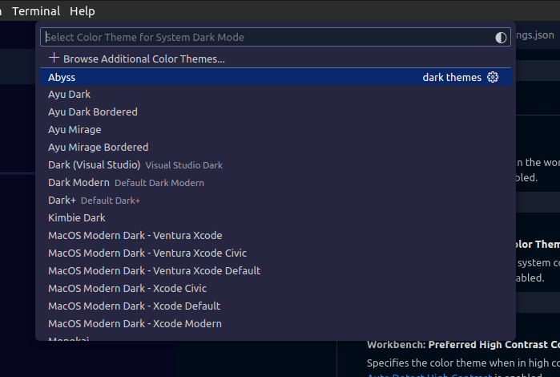

# April 2024 (version 1.89)

**Update 1.89.1**: The update addresses these [issues](https://github.com/microsoft/vscode/issues?q=is%3Aissue+is%3Aclosed+milestone%3A%22April+2024+Recovery+1%22).

<!-- DOWNLOAD_LINKS_PLACEHOLDER -->

---

Welcome to the April 2024 release of Visual Studio Code. There are many updates in this version that we hope you'll like, some of the key highlights include:

* [Preview Markdown images & videos](#hover-to-preview-images-and-videos-in-markdown) - Hover over a link to preview images & videos in Markdown.
* [Enhanced branch switching](#saverestore-open-editors-when-switching-branches) - Restore open editors seamlessly when switching between branches.
* [Middle-click paste support](#configure-middle-click-to-paste) - Paste text quickly in the terminal using a mouse middle-click.
* [WSL over Remote - SSH](#remote-development) - Use WSL when connected to a remote machine via Remote - SSH.
* [Accessible View](#accessible-view) - Navigate through comments, chat code blocks & terminal commands from the Accessible View.
* [Keyboard shortcuts for UI actions](#customize-keybindings) - Customize keybindings for UI actions directly with a right-click.
* [Quick Search](#quick-search) - Search for text across your workspace with Quick Search.
* [AI-powered rename suggestions](#copilot-powered-rename-suggestions-button) - Get intelligent rename suggestions in the editor with Copilot.
* [Copilot content exclusion](#content-exclusions) - Exclude files from being used in the Copilot context.
* [Local workspace extension](#local-workspace-extensions) - Include and install extensions directly in your workspace.

>If you'd like to read these release notes online, go to [Updates](https://code.visualstudio.com/updates) on [code.visualstudio.com](https://code.visualstudio.com).
**Insiders:** Want to try new features as soon as possible? You can download the nightly [Insiders](https://code.visualstudio.com/insiders) build and try the latest updates as soon as they are available.

## Accessibility

### Progress accessibility signal

The setting, <code codesetting='accessibility.signals.progress'>accessibility.signals.progress</code>, enables screen reader users to hear progress anywhere a progress bar is presented in the user interface. The signal plays after three seconds have elapsed, and then loops every five seconds until completion of the progress bar. Examples of when a signal might play are: when searching a workspace, while a chat response is pending, when a notebook cell is running, and more.

### Improved editor accessibility signals

There are now separate accessibility signals for when a line has an error or warning, or when the cursor is on an error or warning.

We support customizing the delay of accessibility signals when navigating between lines and columns in the editor separately. Also, aria alert signals have a higher delay before playing them than audio cue signals.

Inline suggestions no longer trigger an accessibility signal while the suggest control is shown.

### Accessible View

The Accessible View (`kb(editor.action.accessibleView)`) enables screen reader users to inspect workbench features.

#### Terminal improvements

Now, when you navigate to the next (`kb(workbench.action.terminal.accessibleBufferGoToNextCommand)`) or previous (`kb(workbench.action.terminal.accessibleBufferGoToPreviousCommand)`) command in the terminal Accessible View, you can hear if the current command failed. This functionality can be toggled with the setting <code codesetting='accessibility.signals.terminalCommandFailed'>accessibility.signals.terminalCommandFailed</code>.

When this view is opened from a terminal with shell integration enabled, VS Code alerts with the terminal command line for an improved experience.

#### Chat code block navigation

When you're in the Accessible View for a chat response, you can now navigate between next (`kb(editor.action.accessibleViewNextCodeBlock)`) and previous (`kb(editor.action.accessibleViewPreviousCodeBlock)`) code blocks.

#### Comments view

When there is an extension installed that is providing comments and the Comments view is focused, you can inspect and navigate between the comments in the view from within the Accessible View. Extension-provided actions that are available on the comments can also be executed from the Accessible View.

## Workbench

### Language model usage reporting

For extensions that use the language model, you can now track their language model usage in the Extension Editor and Runtime Extensions Editor. For example, you can view the number of language model requests, as demonstrated for the Copilot Chat extension in the following screenshot:


### Local workspace extensions

Local workspace extensions, first introduced in the [VS Code 1.88 release](https://code.visualstudio.com/updates/v1_88#_local-workspace-extensions), is generally available. You can now include an extension directly in your workspace and install it only for that workspace. This feature is designed to cater to your specific workspace needs and provide a more tailored development experience.

To use this feature, you need to have your extension in the `.vscode/extensions` folder within your workspace. VS Code then shows this extension in the **Workspace Recommendations** section of the Extensions view, from where users can install it. VS Code installs this extension only for that workspace. A local workspace extension requires the user to trust the workspace before installing and running this extension.

For instance, consider the `vscode-selfhost-test-provider` extension in the [VS Code repository](https://github.com/microsoft/vscode/tree/main/.vscode/extensions/vscode-selfhost-test-provider). This extension plugs in test capabilities, enabling contributors to view and run tests directly within the workspace. Following screenshot shows the `vscode-selfhost-test-provider` extension in the Workspace Recommendations section of the Extensions view and the ability to install it.


Note that you should include the unpacked extension in the `.vscode/extensions` folder and not the `VSIX` file. You can also include only sources of the extension and build it as part of your workspace setup.

### Custom Editor Labels in Quick Open

Last month, we introduced [custom labels](https://code.visualstudio.com/docs/getstarted/userinterface#_customize-tab-labels), which let you personalize the labels of your editor tabs. This feature is designed to help you more easily distinguish between tabs for files with the same name, such as `index.tsx` files.

Building on that, we've extended the use of custom labels to Quick Open (`kb(workbench.action.quickOpen)`). Now, you can search for your files using the custom labels you've created, making file navigation more intuitive.


### Customize keybindings

We've made it more straightforward to customize keybindings for user interface actions. Right-click on any action item in your workbench, and select **Customize Keybinding**. If the action has a `when` clause, it's automatically included, making it easier to set up your keybindings just the way you need them.

<video src="images/1_89/customize-keybinding.mp4" title="Video that shows how to customize the keybinding for the split editor action." autoplay loop controls muted></video>

### Find in trees keybinding

We have addressed an issue where the Find control was frequently being opened unintentionally for a tree control. For example, when the Find control appears in the Explorer view instead of searching in the editor.

To reduce these accidental activations, we have changed the default keybinding for opening the Find control in a tree control to `kb(list.find)`. If you prefer the previous setup, you can easily revert to the original keybinding for the `list.find` command using the Keyboard Shortcuts editor.

### Auto detect system color mode improvements

If you wanted your theme to follow the color mode of your system, you could already do this by enabling the setting <code codesetting="window.autoDetectColorScheme:true">window.autoDetectColorScheme</code>.

When enabled, the current theme is defined by the <code codesetting="workbench.preferredDarkColorTheme">workbench.preferredDarkColorTheme</code> setting when in dark mode, and the <code codesetting="workbench.preferredLightColorTheme">workbench.preferredLightColorTheme</code> setting when in light mode.

In that case, the <code codesetting="workbench.colorTheme">workbench.colorTheme</code> setting is then no longer considered. It is only used when <code codesetting="window.autoDetectColorScheme">window.autoDetectColorScheme</code> is off.

In this milestone, what's new is that the theme picker dialog (**Preferences: Color Theme** command) is now aware of the system color mode. Notice how the theme selection only shows dark themes when the system in in dark mode:



The dialog also has a new button to directly take you to the <code codesetting="window.autoDetectColorScheme">window.autoDetectColorScheme</code> setting:


### Paste Markdown links in comments

In the input editor of the Comments control, pasting a link has the same behavior as pasting a link in a Markdown file. The paste options are shown and you can choose to paste a Markdown link instead of the raw link that you copied.


## Source Control

### Save/restore open editors when switching branches

This milestone, we have addressed a long-standing feature request to save and restore editors when switching between source control branches. Use the <code codesetting="scm.workingSets.enabled:true">scm.workingSets.enabled</code> setting to enable this feature.

To control the open editors when switching to a branch for the first time, you can use the <code codesetting="scm.workingSets.default">scm.workingSets.default</code> setting. You select to have no open editors (`empty`), or to use the currently opened editors (`current`, the default value).

### Dedicated commands for viewing changes

To make it easier to view specific types of changes in the multi-file diff editor, we have added a set of new commands to the command palette: **Git: View Staged Changes**, **Git: View Changes**, and **Git: View Untracked Changes**.

## Notebooks

### Minimal error renderer

You can use a new layout for the notebook error renderer with the setting <code codesetting="notebook.output.minimalErrorRendering:true">notebook.output.minimalErrorRendering</code>. This new layout only displays the error and message, and a control to expand the full error stack into view.

<video src="images/1_89/minimal-notebook-errors.mp4" title="Minimal notebook error renderer demo" autoplay loop controls muted></video>

### Disabled backups for large notebooks

Periodic file backups are now disabled for large notebook files to reduce the amount of time spent writing the file to disk. The limit can be adjusted with the setting `notebook.backup.sizeLimit`. We are also experimenting with an option to avoid blocking the renderer while saving the notebook file with <code codesetting="notebook.experimental.remoteSave:true">notebook.experimental.remoteSave</code>, so that auto-saves can occur without a performance penalty.

### Fix for outline/sticky scroll performance regressions

Over the past few months, we have received feedback about performance regressions in the notebook editor. The regressions are difficult to pinpoint and not easily reproducible. Thanks to the community for continuously providing logs and feedback, we could identify that the regressions are coming from the outline and sticky scroll features as we added new features to them. The issues have been fixed in this release.

We appreciate the community's feedback and patience, and we continue to improve Notebook Editor's performance. If you continue to experience performance issues, please don't hesitate to file a new issue in the [VS Code repo](https://github.com/microsoft/vscode/issues).

## Search

### Quick Search

Quick Search enables you to quickly perform a text search across your workspace files. Quick Search is no longer experimental, so give it a try by using the **Search: Quick Search** command in the Command Palette (`kb(workbench.action.showCommands)`)! ✨🔍

<video src="images/1_89/quick-search.mp4" title="Quick Search demo" autoplay loop controls muted></video>
_Theme: [Night Owl Light](https://marketplace.visualstudio.com/items?itemName=sdras.night-owl) (preview on [vscode.dev](https://vscode.dev/editor/theme/sdras.night-owl))_

Note that all Quick Search commands and settings no longer have the "experimental" keyword in their identifier. For example, the command ID `workbench.action.experimental.quickTextSearch` became `workbench.action.quickTextSearch`. This might be relevant if you have settings or keybindings that use these old IDs.

### Search tree recursive expansion

We have a new context menu option that enables you to recursively open a selected tree node in the search tree.

<video src="images/1_89/search-tree-recurse-open.mp4" title="Recursively open search tree nodes" autoplay loop controls muted></video>
_Theme: [Night Owl Light](https://marketplace.visualstudio.com/items?itemName=sdras.night-owl) (preview on [vscode.dev](https://vscode.dev/editor/theme/sdras.night-owl))_

## Terminal

### Git Bash shell integration enabled by default

Shell integration for Git Bash is now [automatically enabled](https://code.visualstudio.com/docs/terminal/shell-integration#_automatic-script-injection). This brings many features to Git Bash, such as [command navigation](https://code.visualstudio.com/docs/terminal/shell-integration#_command-navigation), [sticky scroll](https://code.visualstudio.com/docs/terminal/shell-integration#_sticky-scroll), [quick fixes](https://code.visualstudio.com/docs/terminal/shell-integration#_quick-fixes), and more.

### Configure middle click to paste

On most Linux distributions, middle-click pastes the selection. Similar behavior can now be enabled on other operating systems by configuring `terminal.integrated.middleClickBehavior` to `paste`, which pastes the regular clipboard content on middle-click.

### Expanded ANSI hyperlink support

ANSI hyperlinks made via the [OSC 8 escape sequence](https://gist.github.com/egmontkob/eb114294efbcd5adb1944c9f3cb5feda) previously supported only `http` and `https` protocols but now work with any protocol. By default, only links with the  `file`, `http`, `https`, `mailto`, `vscode` and `vscode-insiders` protocols activate for security reasons, but you can add more via the `terminal.integrated.allowedLinkSchemes` setting.

### New icon picker for the terminal

Selecting the change icon from the terminal tab context menu now opens the new icon picker that was built for profiles:


_Theme: [Sapphire](https://marketplace.visualstudio.com/items?itemName=Tyriar.theme-sapphire) (preview on [vscode.dev](https://vscode.dev/editor/theme/Tyriar.theme-sapphire))_

### Support for window size reporting

The terminal now responds to the following escape sequence requests:

- `CSI 14 t` to report the terminal's window size in pixels
- `CSI 16 t` to report the terminal's cell size in pixels
- `CSI 18 t` to report the terminal's window size in characters

### ⚠️ Deprecation of the canvas renderer

The terminal features three different renderers: the DOM renderer, the WebGL renderer, and the canvas renderer. We have wanted to remove the canvas renderer for some time but were blocked by unacceptable performance in the DOM renderer and WebKit not implementing `webgl2`. Both of these issues have now been resolved!

This release, we removed the canvas renderer from the fallback chain so it's only enabled when the `terminal.integrated.gpuAcceleration` setting is explicitly set to `"canvas"`. We plan to remove the canvas renderer entirely in the next release. Please let us know if you have issues when `terminal.integrated.gpuAcceleration` is set to both `"on"` or `"off"`.

## Debug

### JavaScript Debugger

The JavaScript debugger now automatically looks for binaries that appear in the `node_modules/.bin` folder in the `runtimeExecutable` configuration. Now, it resolves them by name automatically.

Notice in the following example that you can just reference `mocha`, without having to specify the full path to the binary.

```diff
{
	"name": "Run Tests",
	"type": "node",
	"request": "launch",
-	"runtimeExecutable": "${workspaceFolder}/node_modules/.bin/mocha",
-	"windows": {
-		"runtimeExecutable": "${workspaceFolder}/node_modules/.bin/mocha.cmd"
-	},
+	"runtimeExecutable": "mocha",
}
```

## Languages

### Image previews in Markdown path completions

VS Code's built-in Markdown tooling provides path completions for links and images in your Markdown. When completing a path to an image or video file, we now show a small preview directly in the [completion details](https://code.visualstudio.com/docs/editor/intellisense#intellisense-features). This can help you find the image or video you're after more easily.


### Hover to preview images and videos in Markdown

Want a quick preview of an image or video in some Markdown without opening the full [Markdown preview](https://code.visualstudio.com/docs/languages/markdown#markdown-preview)? Now you can hover over an image or video path to see a small preview of it:


### Improved Markdown header renaming

Did you know that VS Code's built-in Markdown support lets you rename headers using `kbstyle(F2)`? This is useful because it also [automatically updates all links to that header](https://code.visualstudio.com/docs/languages/markdown#rename-headers-and-links). This iteration, we improved handling of renaming in cases where a Markdown file has duplicated headers.

Consider the Markdown file:

```md
# Readme
- [Example 1](#example)
- [Example 2](#example-1)

## Example
...

## Example
...
```

The two `## Example` headers have the same text but can each be linked to individually by using a unique ID (`#example` and `#example-1`). Previously, if you renamed the first `## Example` header to `## First Example`, the `#example` link would be correctly changed to `#first-example` but the `#example-1` link would not be changed. However, `#example-1` is no longer a valid link after the rename because there are no longer duplicated `## Example` headers.

We now correctly handle this scenario. If you rename the first `## Example` header to `## First Example` in the document above for instance, the new document will be:

```md
# Readme
- [Example 1](#first-example)
- [Example 2](#example)

## First Example
...

## Example
...
```

Notice how both links have now been automatically updated, so that they both remain valid!

## Remote Development

The [Remote Development extensions](https://marketplace.visualstudio.com/items?itemName=ms-vscode-remote.vscode-remote-extensionpack), allow you to use a [Dev Container](https://code.visualstudio.com/docs/devcontainers/containers), remote machine via SSH or [Remote Tunnels](https://code.visualstudio.com/docs/remote/tunnels), or the [Windows Subsystem for Linux](https://learn.microsoft.com/windows/wsl) (WSL) as a full-featured development environment.

Highlights include:

- Connect to WSL over SSH

You can learn more about these features in the [Remote Development release notes](https://github.com/microsoft/vscode-docs/blob/main/remote-release-notes/v1_89.md).

## Contributions to extensions

### GitHub Copilot

#### Terminal inline chat

Terminal inline chat is now the default experience in the terminal. Use the `kb(inlinechat.start)` keyboard shortcut when the terminal is focused to bring it up.


The terminal inline chat uses the `@terminal` chat participant, which has context about the integrated terminal's shell and its contents.


Once a command is suggested, use `kb(workbench.action.terminal.chat.runCommand)` to run the command in the terminal or `kb(workbench.action.terminal.chat.insertCommand)` to insert the command into the terminal. The command can also be edited directly in Copilot's response before running it (currently `kbstyle(Ctrl+down)`, `kbstyle(Tab)`, `kbstyle(Tab)` on Windows & Linux, `kbstyle(Cmd+down)`, `kbstyle(Tab)`, `kbstyle(Tab)` on macOS).


#### Copilot powered rename suggestions button

Copilot-powered rename suggestions can now be triggered by using the sparkle icon in the rename control.

<video src="images/1_89/rename-suggestions-button.mp4" title="Rename widget now has a button to trigger rename suggestions from copilot" autoplay loop controls muted></video>

#### Content Exclusions

GitHub Copilot Content Exclusions is now supported in Copilot Chat for all Copilot for Business and Copilot Enterprise customers. Information on configuring content exclusions can be found on the [GitHub Docs](https://docs.github.com/en/copilot/managing-copilot-business/configuring-content-exclusions-for-github-copilot).

When a file is excluded by content exclusions, Copilot Chat is unable to see the contents or the path of the file, and it's not used in generating an LLM suggestion.


#### Preview: Generate in Notebook Editor

We now support inserting new cells with inline chat activated automatically in the notebook editor. We show a **Generate** button on the notebook toolbar and the insert toolbar between cells, when the <code codesetting="notebook.experimental.generate">notebook.experimental.generate</code> setting is set to `true`. It can also be triggered by pressing `kbstyle(Cmd+I)` on macOS (or `kbstyle(Ctrl+I)` on Windows/Linux), when the focus is on the notebook list or cell container. This feature can help simplify the process of generating code in new cells with the help of the language model.

<video src="images/1_89/notebook-cell-generate.mp4" title="Generate new cell with inline chat activated." autoplay loop controls muted></video>

### Python

#### "Implement all inherited abstract classes" code action

Working with abstract classes is now easier when using Pylance. When defining a new class that inherits from an abstract one, you can now use the **Implement all inherited abstract classes** code action to automatically implement all abstract methods and properties from the parent class:

<video src="images/1_89/pylance-implement-abstract-classes.mp4" title="Implement all inherited abstract classes code action from Pylance." autoplay loop controls muted></video>
_Theme: [Catppuccin Macchiato](https://marketplace.visualstudio.com/items?itemName=Catppuccin.catppuccin-vsc) (preview on [vscode.dev](https://vscode.dev/editor/theme/Catppuccin.catppuccin-vsc/Catppuccin%20Macchiato))_

#### New auto indentation setting

Previously, Pylance's auto indentation behavior was controlled through the <code codesetting='editor.formatOnType'>editor.formatOnType</code> setting, which used to be problematic if you wanted to disable auto indentation, but enable format on type with other supported tools. To solve this problem, Pylance has its own setting to control its auto indentation behavior: <code codesetting='python.analysis.autoIndent'>python.analysis.autoIndent</code>, which is enabled by default.


#### Debugpy removed from the Python extension in favor of the Python Debugger extension

Now that debugging functionality is handled by the [Python Debugger](https://marketplace.visualstudio.com/items?itemName=ms-python.debugpy)
extension, we have removed debugpy from the Python extension.

As part of this change, `"type": "python"` and `"type": "debugpy"` specified in your `launch.json` file will both reference the path to the Python Debugger extension, requiring no changes needed to your `launch.json` files in order to run and debug effectively. Moving forward, we recommend using `"type": "debugpy"` as this directly corresponds to the Python Debugger extension.

#### Socket disablement now possible during testing

You can now run tests with socket disablement from the testing UI on the Python Testing Rewrite. This is made possible by a switch in the communication between the Python extension and the test run subprocess to now use named-pipes.

#### Minor testing bugs updated

Test view now displays projects using testscenarios with unittest and parameterized tests inside nested classes correctly. Additionally, the Test explorer now handles tests in workspaces with symlinks, specifically workspace roots that are children of symlink-ed paths, which is particularly helpful in WSL scenarios.

#### Performance improvements with Pylance

The Pylance team has been receiving feedback that Pylance's performance has degraded in the past few releases. We have made several smaller improvements in memory consumption and indexing performance to address various reported issues. However, for those who might still be experiencing performance issues with Pylance, we are kindly requesting for issues to be filed through the **Pylance: Report Issue** command from the Command Palette, ideally with logs, code samples and/or the packages that are installed in the working environment.

### Hex Editor

The hex editor now has an *insert* mode, in addition to its longstanding "replace" mode. The insert mode enables new bytes to be added within and at the end of files, and it can be toggled using the `kbstyle(Insert)` key or from the status bar.

The hex editor now also shows the currently hovered byte in the status bar.

### GitHub Pull Requests

There has been more progress on the [GitHub Pull Requests](https://marketplace.visualstudio.com/items?itemName=GitHub.vscode-pull-request-github) extension, which enables you to work on, create, and manage pull requests and issues. New features include:

- Experimental conflict resolution for non-checked out PRs is available when enabled by the hidden setting `"githubPullRequests.experimentalUpdateBranchWithGitHub": true`. This feature enables you to resolve conflicts in a PR without checking out the branch locally. The feature is still experimental and will not work in all cases.
- There's an Accessibility Help Dialog that shows when **Open Accessibility Help** is triggered from the Pull Requests and Issues views.
- All review action buttons show in the Active Pull Request sidebar view when there's enough space.

Review the [changelog for the 0.88.0](https://github.com/microsoft/vscode-pull-request-github/blob/main/CHANGELOG.md#0860) release of the extension to learn about the other highlights.

### TypeScript

#### File watching handled by VS Code core

A new experimental setting `typescript.tsserver.experimental.useVsCodeWatcher` controls if the TS extension is using VS Code's core file watching support for file watching needs. TS makes extensive use of file watching, usually with their own node.js based implementation. By using VS Code's file watcher, watching should be more efficient, more reliable, and consume less resources. We plan to gradually enable this feature for users in May and monitor for regressions.

## Preview Features

### VS Code-native intellisense for PowerShell

We've had a prototype for PowerShell intellisense inside the terminal for some time now, that we only recently got some more time to invest in polishing up. This is what it looks like:

<video src="images/1_89/terminal-intellisense.mp4" title="VS Code-native PowerShell intellisense" autoplay loop controls muted></video>

Currently, it triggers on the `-` character or when ctrl+space is pressed. To enable this feature, set `"terminal.integrated.shellIntegration.suggestEnabled": true` in your `settings.json` file (it won't show up in the settings UI currently).

It's still early for this feature but we'd love to hear your feedback on it. Some of the bigger things we have planned for it are to make triggering it more reliable ([#211222](https://github.com/microsoft/vscode/issues/211222)), make the suggestions more consistent regardless of where the popup is triggered ([#211364](https://github.com/microsoft/vscode/issues/211364)), and bringing the experience as close to the editor intellisense experience as possible ([#211076](https://github.com/microsoft/vscode/issues/211076), [#211194](https://github.com/microsoft/vscode/issues/211194)).

### Automatic Markdown link updates on paste

Say, you're writing some Markdown documentation and you realize that one section of the doc actually belongs somewhere else. So, you copy and paste it over into another file. All good, right? Well if the copied text contained any relative path links, reference links, or images, then these will likely now be broken, and you'll have to fix them up manually. This can be a real pain, but thankfully the new Update Links on Paste is here to help!

To enable this functionality, just set `"markdown.experimental.updateLinksOnPaste": true`. Once enabled, when you copy and paste text between Markdown files in the current editor, VS Code automatically fixes all relative path links, reference links, and all images/videos with relative paths.

<video src="images/1_89/md-paste-link-update.mp4" title="Links being automatically updated when copy and pasting between Markdown files" autoplay loop controls muted></video>

After pasting, if you realize that you instead want to insert the exact text you copied, you can use the paste control to switch back to normal copy/paste behavior.

### Support for TypeScript 5.5

We now support the TypeScript 5.5 beta. Check out the [TypeScript 5.5 beta blog post](https://devblogs.microsoft.com/typescript/announcing-typescript-5-5-beta/) and [iteration plan](https://github.com/microsoft/TypeScript/issues/57475) for details on this release.

Editor highlights include:

* Syntax checks for regular expressions.
* File watching improvements.

To start using the TypeScript 5.5 beta, install the [TypeScript Nightly extension](https://marketplace.visualstudio.com/items?itemName=ms-vscode.vscode-typescript-next). Please share feedback and let us know if you run into any bugs with TypeScript 5.5.

## API

### Improved support for language features in comment input editors

When writing a new comment, VS Code creates a stripped down text editor, which is backed by a `TextDocument`, just like the main editors in VS Code are. This iteration, we've enabled some additional API features in these comment text editors. This includes:

- Support for workspace edits.
- Support for diagnostics.
- Support for the paste-as proposed API.

Comment text documents can be identified by a URI that has the `comment` scheme.

We're looking forward to seeing what extensions build with this new functionality!

### Finalized Window Activity API

The [window activity API](https://github.com/microsoft/vscode/issues/181569) has been finalized. This API provides a simple additional `WindowState.active` boolean that extensions can use to determine if the window has recently been interacted with.

```js
vscode.window.onDidChangeWindowState(e => console.log('Is the user active?', e.active))
```

## Proposed APIs

### Accessibility Help Dialog for a view

An Accessibility Help Dialog can be added for any extension-contributed view via the `accessibilityHelpContent` property. With focus in the view, screen reader users hear a hint to open the dialog (`kb(editor.action.accessibilityHelp)`), which contains an overview and helpful commands.

This API is used by the GitHub Pull Request extension's Issues and PR views.

### Language model and Chat API

The language model namespace (`vscode.lm`) exports new functions to retrieve language model information and to count tokens for a given string. Those are `getLanguageModelInformation` and `computeTokenLength` respectively. You should use these functions to build prompts that are within the limits of a language model.

> **Note**: inline chat is now powered by the upcoming chat participants API. This also means `registerInteractiveEditorSessionProvider` is deprecated and will be removed very soon.

### Updated document paste proposal

We've continued iterating on the [document paste proposed API](https://github.com/microsoft/vscode/blob/main/src/vscode-dts/vscode.proposed.documentPaste.d.ts). This API enables extensions to hook into copy/paste operations in text documents.

Notable changes to the API include:

- A new `resolveDocumentPasteEdit` method, which fills in the edit on a paste operation. This should be used if computing the edit takes a long time as it is only called when the paste edit actually needs to be applied.

- All paste operations now are identified by a `DocumentDropOrPasteEditKind`. This works much like the existing `CodeActionKind` and is used in keybindings and settings for paste operations.

The [document paste extension sample](https://github.com/microsoft/vscode-extension-samples/tree/main/document-paste) includes all the latest API changes, so you can test out the API. Be sure to share feedback on the changes and overall API design.

### Hover Verbosity Level

This iteration we have added a new proposed API to contract/expand hovers, which is called `editorHoverVerbosityLevel`. It introduces a new type called the `VerboseHover`, which has two boolean fields: `canIncreaseHoverVerbosity` and `canDecreaseHoverVerbosity`, which signal that a hover verbosity can be increased or decreased. If one of them is set to true, the hover is displayed with `+` and `-` icons, which can be used to increase/decrease the hover verbosity.

The proposed API also introduces a new signature for the `provideHover` method, which takes an additional parameter of type `HoverContext`. When a hover verbosity request is sent by the user, the hover context is populated with the previous hover, as well as a `HoverVerbosityAction`, which indicates whether the user would like to increase or decrease the verbosity.

<video src="images/1_89/hover-verbosity.mp4" title="Hover Verbosity Proposed API." autoplay loop controls muted></video>

### `preserveFocus` on Extension-triggered TestRuns

There is [a proposal](https://github.com/microsoft/vscode/issues/209491) for a `preserveFocus` boolean on test run requests triggered by extensions. Previously, test runs triggered from extension APIs never caused the focus to move into the **Test Results** view, requiring some extensions to reinvent the wheel to maintain user experience compatibility. This new option can be set on `TestRunRequest`s, to ask the editor to move focus as if the run was triggered from in-editor.

## Notable fixes

* [209917](https://github.com/microsoft/vscode/issues/209917) Aux window: restore maximised state (Linux, Windows)

## Thank you

Last but certainly not least, a big _**Thank You**_ to the contributors of VS Code.

### Issue tracking

Contributions to our issue tracking:

* [@gjsjohnmurray (John Murray)](https://github.com/gjsjohnmurray)
* [@IllusionMH (Andrii Dieiev)](https://github.com/IllusionMH)
* [@RedCMD (RedCMD)](https://github.com/RedCMD)
* [@starball5 (starball)](https://github.com/starball5)
* [@ArturoDent (ArturoDent)](https://github.com/ArturoDent)

### Pull requests

Contributions to `vscode`:

* [@4-tel](https://github.com/4-tel): fix: searching for lines in debug console that start with "!" #174146 [PR #210178](https://github.com/microsoft/vscode/pull/210178)
* [@CareyJWilliams (Carey Williams)](https://github.com/CareyJWilliams): Fix task template writes to an empty tasks.json [PR #210675](https://github.com/microsoft/vscode/pull/210675)
* [@cpendery (Chapman Pendery)](https://github.com/cpendery)
  * fix: bundling error makes terminal suggestions fail [PR #208822](https://github.com/microsoft/vscode/pull/208822)
  * feat: add git-bash support to shell integration [PR #208960](https://github.com/microsoft/vscode/pull/208960)
  * fix: improve terminal marker placements on windows [PR #209136](https://github.com/microsoft/vscode/pull/209136)
  * fix: terminal suggestions should hide modal when no completions exist [PR #210289](https://github.com/microsoft/vscode/pull/210289)
  * fix: split fails in git bash [PR #210513](https://github.com/microsoft/vscode/pull/210513)
* [@Ditoo29 (Diogo Pinto)](https://github.com/Ditoo29): fix: serialization of newline characters [PR #209703](https://github.com/microsoft/vscode/pull/209703)
* [@frankli0324 (Frank)](https://github.com/frankli0324): disable corepack auto pin feature when executing npm view [PR #210601](https://github.com/microsoft/vscode/pull/210601)
* [@g-plane (Pig Fang)](https://github.com/g-plane): Auto close Git multi-diff editor when all files staged or comitted [PR #210327](https://github.com/microsoft/vscode/pull/210327)
* [@gjsjohnmurray (John Murray)](https://github.com/gjsjohnmurray)
  * Improve descriptions of `workbench.activityBar.iconClickBehavior` and `workbench.activityBar.location` settings [PR #210574](https://github.com/microsoft/vscode/pull/210574)
  * Clear Activity Bar icon badge correctly (fix #210640) [PR #210645](https://github.com/microsoft/vscode/pull/210645)
* [@grgar (George Garside)](https://github.com/grgar)
  * Don't use window.customTitleBarVisibility configuration on web [PR #209162](https://github.com/microsoft/vscode/pull/209162)
  * Fix color picker command title [PR #210349](https://github.com/microsoft/vscode/pull/210349)
  * Move cmd start escape to end of prompt [PR #210443](https://github.com/microsoft/vscode/pull/210443)
* [@hsfzxjy (Xie Jingyi)](https://github.com/hsfzxjy): Logging navigible container events for debug [PR #209357](https://github.com/microsoft/vscode/pull/209357)
* [@jswillard (John Willard)](https://github.com/jswillard): Show custom label in quick open [PR #209681](https://github.com/microsoft/vscode/pull/209681)
* [@marvinthepa (Martin Sander)](https://github.com/marvinthepa): Middle-click paste in terminal [PR #136633](https://github.com/microsoft/vscode/pull/136633)
* [@mmastrac (Matt Mastracci)](https://github.com/mmastrac):  Add `windowOptions` to xtermTerminal to allow `ESC [18t` to work [PR #209310](https://github.com/microsoft/vscode/pull/209310)
* [@nopeless (nopeless)](https://github.com/nopeless): fix: make `cmd` local in shell integration bash file [PR #208364](https://github.com/microsoft/vscode/pull/208364)
* [@pagict (Premium)](https://github.com/pagict): feat. add a menu item 'expand-select' to expand subtree in search view [PR #206033](https://github.com/microsoft/vscode/pull/206033)
* [@pisv (Vladimir Piskarev)](https://github.com/pisv): Fix incorrect typings in `OpenJsDocLinkCommand_Args` [PR #209872](https://github.com/microsoft/vscode/pull/209872)
* [@qirong77](https://github.com/qirong77): Fix missing class in inlinesuggest toolbar in Monaco-Editor causing CSS variables to be ineffective [PR #207582](https://github.com/microsoft/vscode/pull/207582)
* [@r-sargento (Rafael Sargento)](https://github.com/r-sargento): Fix #201247 (Integrated Terminal does not set the environment variables from default profile) [PR #209711](https://github.com/microsoft/vscode/pull/209711)
* [@ScriptBloom (alviner)](https://github.com/ScriptBloom): fix: minimap section header display uncompletely on first load:#209603 [PR #209605](https://github.com/microsoft/vscode/pull/209605)
* [@sheetalkamat (Sheetal Nandi)](https://github.com/sheetalkamat): Use vscode watches for tsserver [PR #193848](https://github.com/microsoft/vscode/pull/193848)
* [@telamon (Tony Ivanov)](https://github.com/telamon): Fixed #114425 prevent mime pollution on install [PR #209510](https://github.com/microsoft/vscode/pull/209510)
* [@timorthi (Timothy Ng)](https://github.com/timorthi): Re-render sticky scroll when line numbers display mode is changed [PR #210815](https://github.com/microsoft/vscode/pull/210815)
* [@WardenGnaw (Andrew Wang)](https://github.com/WardenGnaw): Add 'noDebug' for selectAndStartDebugging command [PR #209893](https://github.com/microsoft/vscode/pull/209893)
* [@zWingz (zWing)](https://github.com/zWingz): fix: unexpected error when execCommand workbench.extensions.installExtension [PR #210135](https://github.com/microsoft/vscode/pull/210135)
* [@ale-dg](https://github.com/ale-dg): continuously provide feedbacks and logs to help us diagnose multiple performance issues in the notebook editor and jupyter.

Contributions to `vscode-css-languageservice`:

* [@liaoyinglong (vigoss)](https://github.com/liaoyinglong): support nested @container [PR #390](https://github.com/microsoft/vscode-css-languageservice/pull/390)

Contributions to `vscode-emmet-helper`:

* [@nurbek0298 (Nurbek Ibraev)](https://github.com/nurbek0298)
  * Add support for markup attributes in vue [PR #92](https://github.com/microsoft/vscode-emmet-helper/pull/92)
  * 2.9.3 [PR #93](https://github.com/microsoft/vscode-emmet-helper/pull/93)

Contributions to `vscode-eslint`:

* [@hyoban (Stephen Zhou)](https://github.com/hyoban): fix: add json, jsonc to `eslint.probe`'s default options [PR #1830](https://github.com/microsoft/vscode-eslint/pull/1830)

Contributions to `vscode-hexeditor`:

* [@tomilho (Tomás Silva)](https://github.com/tomilho)
  * Edit mode and input byte insertion [PR #503](https://github.com/microsoft/vscode-hexeditor/pull/503)
  * Fix: duplicate saving and stale webview. [PR #513](https://github.com/microsoft/vscode-hexeditor/pull/513)
* [@veger (Maarten Bezemer)](https://github.com/veger): Fix swapped entries [PR #515](https://github.com/microsoft/vscode-hexeditor/pull/515)

Contributions to `vscode-json-languageservice`:

* [@michaeltlombardi (Mikey Lombardi (He/Him))](https://github.com/michaeltlombardi): Ensure parser uses errorMessage for minContains/maxContains [PR #229](https://github.com/microsoft/vscode-json-languageservice/pull/229)

Contributions to `vscode-languageserver-node`:

* [@werat (Andy Hippo)](https://github.com/werat): Don't crash when unregistering a feature that doesn't exist [PR #1460](https://github.com/microsoft/vscode-languageserver-node/pull/1460)

Contributions to `vscode-python-debugger`:

* [@DavidArchibald (David Archibald)](https://github.com/DavidArchibald): Fix debugger attach to process when running on WSL [PR #267](https://github.com/microsoft/vscode-python-debugger/pull/267)

Contributions to `vscode-vsce`:

* [@yutotnh (yutotnh)](https://github.com/yutotnh): feat: ignore .git generated by `git worktree add` [PR #943](https://github.com/microsoft/vscode-vsce/pull/943)

Contributions to `language-server-protocol`:

* [@asukaminato0721 (Asuka Minato)](https://github.com/asukaminato0721): add 2 lsp [PR #1918](https://github.com/microsoft/language-server-protocol/pull/1918)
* [@MariaSolOs (Maria José Solano)](https://github.com/MariaSolOs): Add markup diagnostic message clarification [PR #1917](https://github.com/microsoft/language-server-protocol/pull/1917)
* [@practicalli-johnny (Practicalli Johnny)](https://github.com/practicalli-johnny): servers: update clojure-lsp repo and maintainer [PR #1921](https://github.com/microsoft/language-server-protocol/pull/1921)
* [@sz3lbi (szelbi)](https://github.com/sz3lbi): add SAP CDS server [PR #1924](https://github.com/microsoft/language-server-protocol/pull/1924)
* [@unvalley (unvalley)](https://github.com/unvalley): docs: add biome to lsp servers [PR #1923](https://github.com/microsoft/language-server-protocol/pull/1923)
* [@Wilfred (Wilfred Hughes)](https://github.com/Wilfred): Fix typo in RequestCancelled doc comment [PR #1922](https://github.com/microsoft/language-server-protocol/pull/1922)

Contributions to `monaco-editor`:

* [@timotheeguerin (Timothee Guerin)](https://github.com/timotheeguerin): Add support for TypeSpec language  [PR #4450](https://github.com/microsoft/monaco-editor/pull/4450)

<a id="scroll-to-top" role="button" title="Scroll to top" aria-label="scroll to top" href="#"><span class="icon"></span></a>
<link rel="stylesheet" type="text/css" href="css/inproduct_releasenotes.css"/>
