# January 2017 (version 1.9)

## 1.9.1 Recovery Build

We are releasing a 1.9.1 recovery build to update the 1.9 translations and address a handful of [issues](https://github.com/Microsoft/vscode/milestone/36?closed=1).

Downloads: [Windows](https://vscode-update.azurewebsites.net/1.9.1/win32/stable) | [Mac](https://vscode-update.azurewebsites.net/1.9.1/darwin/stable) | Linux 64-bit: [.tar.gz](https://vscode-update.azurewebsites.net/1.9.1/linux-x64/stable) [.deb](https://vscode-update.azurewebsites.net/1.9.1/linux-deb-x64/stable) [.rpm](https://vscode-update.azurewebsites.net/1.9.1/linux-rpm-x64/stable) | Linux 32-bit: [.tar.gz](https://vscode-update.azurewebsites.net/1.9.1/linux-ia32/stable) [.deb](https://vscode-update.azurewebsites.net/1.9.1/linux-deb-ia32/stable) [.rpm](https://vscode-update.azurewebsites.net/1.9.1/linux-rpm-ia32/stable)

## January Release Summary

Welcome to the first 2017 release of Visual Studio Code. There are a number of significant updates in this version that we hope you will like, some of the key highlights include:

* **[New Welcome page](#welcome-experience)** - Whether you are a new or returning user, the Welcome page helps get you started quickly.
* **[Interactive Playground](#interactive-playground)** - Try out VS Code's advanced editing features without creating files or a project.
* **[Synchronized Markdown Preview](#markdown-preview-and-editor-integration)** - Coupled view of a Markdown preview and its editor.
* **[Format on Paste](#format-on-paste)** - Format source code as soon as you bring it into your project.
* **[Language specific settings](#language-specific-settings)** - Customize your settings for specific languages.
* **[TypeScript references CodeLens](#typescript-references-codelens)** - VS Code ships with TypeScript 2.1.5 and now includes References CodeLens.
* **[Single file debugging](#debugging-without-a-launch-configuration)** - Debug without a configuration file to enable quick debugging of single files.
* **[Inline variables display](#inline-variable-values-in-source-code)** - See variable values inline while debugging.
* **[Expanded Node.js debugging configurations](#launch-configuration-snippets-for-node-scenarios)** - Easily debug Mocha tests, gulp tasks and even Yeoman generators.
* **[Improved task running support](#task-support)** - Run multiple commands from the same task.
* **[Faster Integrated Terminal](#integrated-terminal-improvements)** - We improved the integrated terminal's performance and Windows support.

The release notes are arranged in the following sections related to VS Code focus areas. Here are some further updates:

* **[Workbench](#workbench)** - New settings to control new windows, improved Tabbed headings, Zen Mode customization.
* **[Editor](#editor)** - Add keyboard shortcut keys for snippets, Go to Implementation, fast search navigation.
* **[Languages](#languages)** - Emmet abbreviations from external files, HTML format settings, Markdown editing improvements.
* **[Extensions](#extensions)** - Create Extension Packs through the VS Code Yeoman generator.
* **[Debugging](#debugging)** - User level launch.json, copy callstack action.
* **[Node.js Debugging](#node-debugging)** - Just My Code improvements, restart support for launch configurations.
* **[Extension Authoring](#extension-authoring)** - New insertSnippet API, openTextDocument can now take language.

## Workbench

### Welcome experience

We have added a Welcome page (**Help** > **Welcome**) with **Quick links** to help new users as well as a list of **Recent** folders and **Help** documentation links for fast navigation.

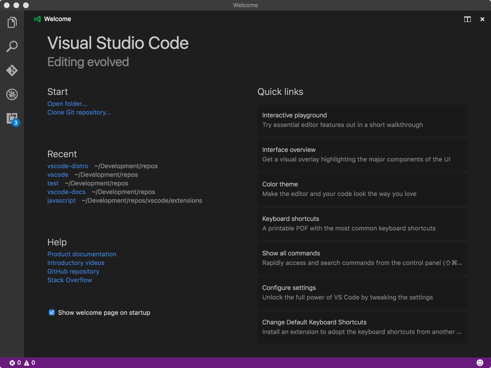

Check the **Show welcome page on startup** option to keep it handy. The Welcome page is only shown if there are no open files on startup.

If you are a new user, you will appreciate the **Interface overview** available from the Welcome page. It calls out the basic parts of the user interface with their keyboard shortcuts:

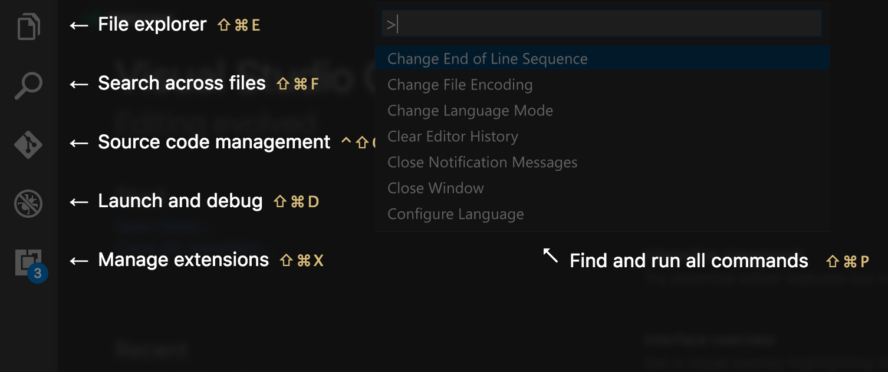

### Interactive Playground

The **Interactive Playground** on the **Welcome** page introduces you in a step-by-step guide to some of our advanced code editing features with interactive examples:

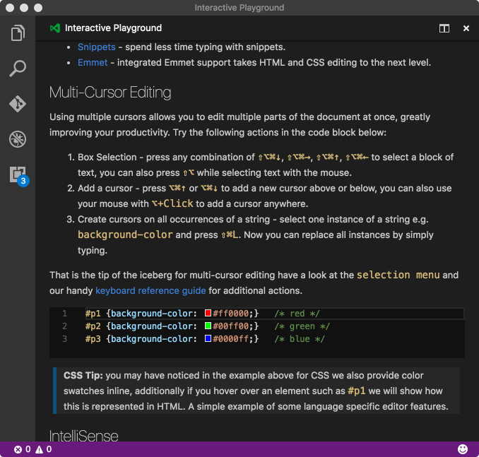

### Integrated Terminal improvements

#### Performance

Much of the Integrated Terminal frontend has been rewritten with performance in mind. In short, it should no longer lock up the application when processing large amounts of data and be about 5 times faster.

Before (v1.8.1):

---------------

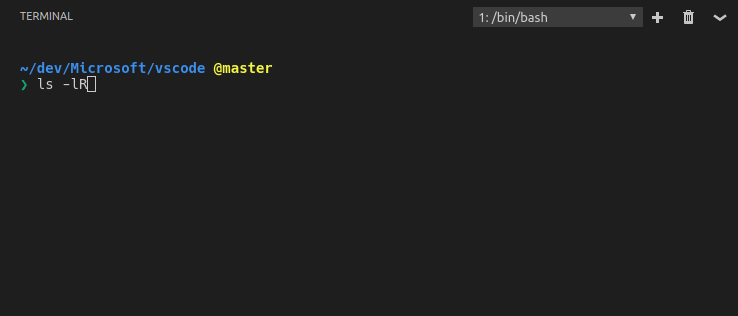

After (v1.9.0):

---------------

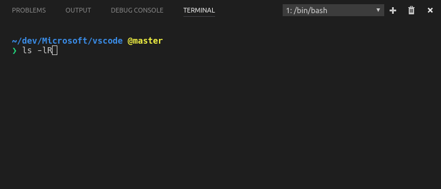

#### Windows support

The library used to communicate with the terminal process on Windows has been upgraded which fixes many of the problems the terminal had on Windows such as arrow keys not functioning and the prompt line going out of sync. A special thanks to [Ryan Prichard](https://github.com/rprichard) for his [winpty](https://github.com/rprichard/winpty) library and for assisting with the upgrade.

#### Other

- **PowerShell new default on Windows 10**: PowerShell is now the default shell on Windows 10 to better align with the [upcoming OS default](https://blogs.windows.com/windowsexperience/2016/11/17/announcing-windows-10-insider-preview-build-14971-for-pc/#fwfzEgffOGmVfEXs.97). You can change this back to cmd.exe by setting `terminal.integrated.shell.windows` to `"cmd.exe"` in your `settings.json` file.
- **Right-click copy or paste**: On Windows, similar to the cmd.exe feature, right clicking within the terminal will copy if there is a selection or paste if there is no selection. This is enabled by default on Windows and can be configured (on any platform) using the `terminal.integrated.rightClickCopyPaste` setting.
- **Cursor styles**: New line and underline cursor styles have been added to the terminal, these can be configured with the `terminal.integrated.cursorStyle` setting.
- **Wide character support**: Wide characters are now sized to consume exactly 2 character widths.
- **Better space utilization**: The individual terminals within the terminal panel should now fill up as much space as possible.

### Always hot exit on folders

The `files.hotExit` setting has changed from a simple `true`/`false` setting to accept the following options:

- `"off"`: Disable hot exit (same as the old `false` setting).
- `"onExit"`: Enable hot exit when all VS Code windows are shut down (same as the old `true` setting).
- `"onExitAndWindowClose"`: Same as `"onExit"` but trigger hot exit when any folder window closes, regardless of whether it's the instance window or not. In order to enable more flexibility, this setting will also *not* restore folder windows when you next launch, `"window.reopenFolders": "all"` can be used to restore all previous windows when this setting is used.

### Zen mode improvements

To reduce visual clutter, Zen mode now also hides the workbench Tabs. We have also introduced the following options to make it easier to fine tune the Zen mode experience:

* `"zenMode.hideStatusBar"` - Set to false, if you don't want Zen Mode to hide the Status Bar.
* `"zenMode.hideTabs"` - Set to false, if you want to still see Tabs.
* `"zenMode.fullScreen"` - Set to false to not go to full screen, had been `workbench.fullScreenZenMode`.

### Search result navigation

There are two new ways to easily navigate results in the Search view.

- The arrow keys - When you use the arrow keys to select a result, it will be shown in the editor.
- Two new commands: `search.action.focusNextSearchResult` and `search.action.focusPreviousSearchResult` - By default, these are bound to `kb(search.action.focusNextSearchResult)` and `kb(search.action.focusPreviousSearchResult)`.

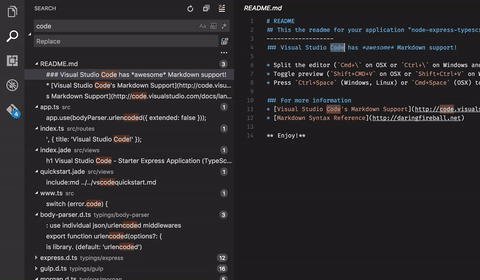

### Panels title bar update

The title bar of the horizontal panel now shows all the other available panels and thus makes it much easier to switch between panels.

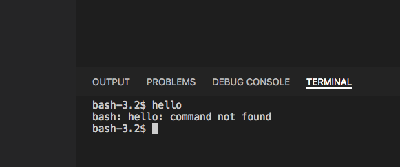

### New entries in the context menu of Tabs

Additional entries have been added to the context menu of Tabs that show files. You can copy the path of the file or reveal it in the native OS Explorer or the Explorer in the Side Bar.

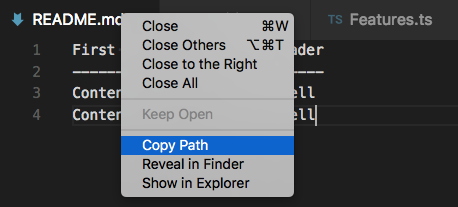

### New setting to control close button in Tabs

We added a new setting `workbench.editor.tabCloseButton` that controls if the close button should show on the right (default), left or not be visible at all.

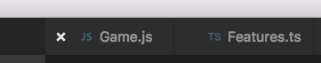

Note: The previous `workbench.editor.showTabCloseButton` was removed in favor of this new option.

### Control whether to open a new window or use last active

When VS Code is already running and you open a new file or folder, it decides whether to open in the last active window or a new window. The  existing `window.openFilesInNewWindow` setting controls this for files and by default, a new window would be opened. With this release, we wanted to make this more configurable and also change the default behavior for opening files.

* Added `window.openFoldersInNewWindow` to configure this behavior for folders.
* Changed the possible values to `default`, `on` and `off`. ( `window.openFilesInNewWindow` also uses these values)
* Both settings now default to `default`, which in most cases will reuse the last active window instead of opening a new one.

If configured to be `default`, VS Code still makes the best guess about reusing a window based on the context of the open request. Change the settings to either `on` or `off` if you want always want the same behavior. For example, if you always want a new window when picking a file or folder from the **File** menu, set this to `on`.

Note: There can still be cases where this setting is ignored (for example, when using the `-new-window` or `-reuse-window` command line option).

### Control the dimensions of new windows

A new setting `window.newWindowDimensions` controls the size and positioning of new windows. By default, a new window will open in the center of the screen with small dimensions. If you change this setting to `inherit`, the new window will get the same dimensions as the last active one. Setting it to `maximized` or `fullscreen` will always open new windows maximized or in full screen.

### Control menu visibility (Windows, Linux)

A new setting `window.menuBarVisibility` allows for more fine grained control over the top menu visibility on Windows and Linux. By `default`, the menu will be visible and only hides when entering full screen. You can set it to `toggle` to hide it. In the `toggle` state, the menu will show up when you press the `kbstyle(Alt)` key. If you turn the set the value to `hidden`, the menu will remain hidden, even if you press `kbstyle(Alt)`.

Note: If you configure the menu explicitly to be `visible`, it will also remain visible when you enter the full screen mode.

### Easy to close all editors when they are dirty

There are situations where you can end up with many dirty editors open (for example, you ran a search and replace operation without saving). Previously, when you wanted to close them all, you were asked to Save or Revert each editor one by one. Now, when you invoke the **Close All Editors** action (`kb(workbench.action.closeAllEditors)`), you will see a combined prompt for all dirty files:

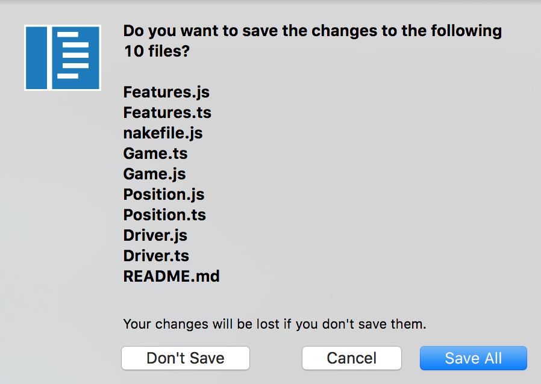

### Output scroll lock

Thanks to an external [PR](https://github.com/Microsoft/vscode/pull/18768), it is now possible to easily stop output from automatically scrolling by toggling the scroll lock in the Output panel title bar.

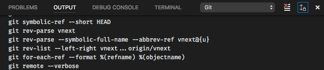

## Settings

In this milestone, we continued on the improvements we did for Settings during last milestone.

- Improved search to match individual words with the setting's key, value, allowed values and its description to yield better results.
- Improved the layout of edit action to be more accessible, discoverable and consistent with other editor actions (Quick fix).
- Improved the Settings editor UI by extending Search to both default (left) and configurable (right) settings. This brings you the benefit of searching across default and configurable settings.

### User and Workspace Settings

- Now you can quickly switch between User and Workspace settings from the single Settings editor. This helps users in discovering and understanding the user and workspace scopes.

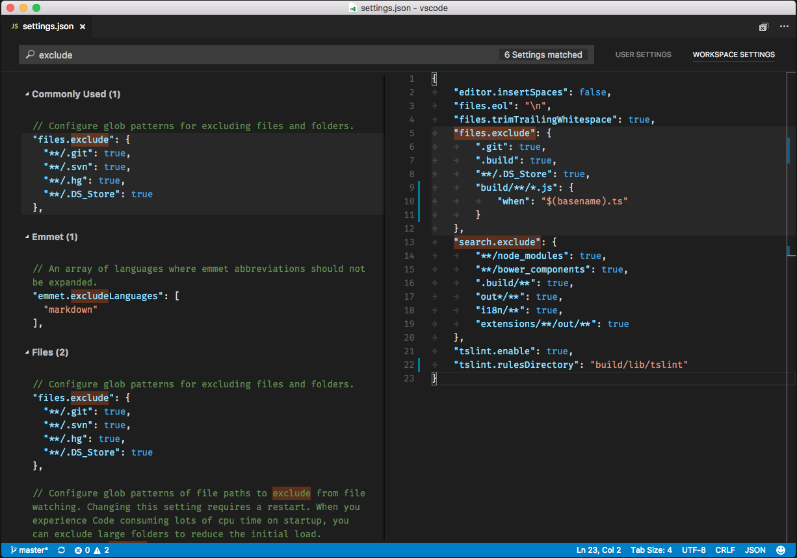

### Language specific settings

Our users often work on many different file types and languages in one workspace and a frequent feature request was language specific settings ([#1587](https://github.com/Microsoft/vscode/issues/1587)). With this release, you can now customize your editor by language through language based settings.

To customize for any language, run the global command **Preferences: Configure language specific settings...** (id: `workbench.action.configureLanguageBasedSettings`) from the **Command Palette** (`kb(workbench.action.showCommands)`) which opens the language picker. Selecting the language you want, opens the Settings editor with the language entry where you can add applicable settings.

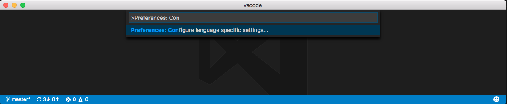

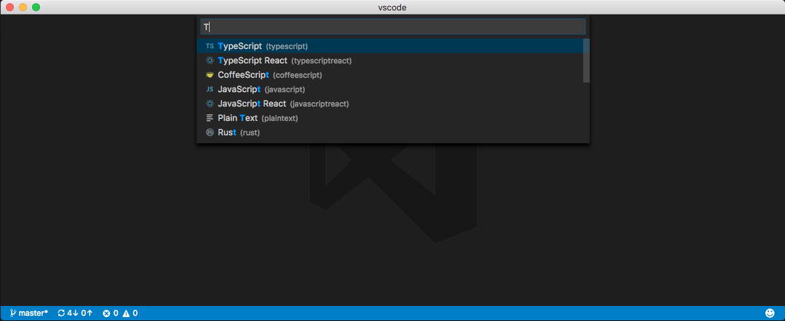


If you have a file open and you want to customize the editor for this file type, click on the Language Mode in the Status Bar to the bottom-right of the VS Code window. This opens the Language Mode picker with an option **Configure 'language_name' language based settings...**. Selecting this opens the Settings editor with the language entry where you can add applicable settings.

You can also configure language based settings by directly opening `settings.json`. You can scope them to the workspace by placing them in the Workspace settings just like other settings. If you have settings defined for a language in both user and workspace scopes, then they are merged by giving precedence to the ones defined in the workspace.

The following examples customize editor settings for language modes `typescript` and `markdown`.

```json
{
  "[typescript]": {
    "editor.formatOnSave": true,
    "editor.formatOnPaste": true
  },
  "[markdown]": {
    "editor.formatOnSave": true,
    "editor.wrappingColumn": 0,
    "editor.renderWhitespace": "all",
    "editor.acceptSuggestionOnEnter": "off"
  }
}
```

You can use IntelliSense in Settings editor to help you find allowed language based settings. All editor settings and some non-editor settings are supported.

**Note**: The following settings are not currently supported but will be in the next release. Please refer to [#19511](https://github.com/Microsoft/vscode/issues/19511) for more information.

```json
editor.tabSize
editor.insertSpaces
editor.detectIndentation
editor.trimAutoWhitespace
```

## Task support

### Commands per task

You can now define different commands per task ([#981](https://github.com/Microsoft/vscode/issues/981)). This allows running different commands for different tasks without writing your own shell script. A `tasks.json` file using commands per task looks like this:

```json
{
    "version": "0.1.0",
    "tasks": [
        {
            "taskName": "tsc",
            "command": "tsc",
            "args": ["-w"],
            "isShellCommand": true,
            "isBackground": true,
            "problemMatcher": "$tsc-watch"
        },
        {
            "taskName": "build",
            "command": "gulp",
            "args": ["build"],
            "isShellCommand": true
        }
    ]
}
```

The first task start the TypeScript compiler in watch mode, the second one starts the `gulp build`. If a tasks specifies a local command to run the task name is not included into the command line (`suppressTaskName` is `true` for these tasks). Since a local command can specify local arguments, there is no need for adding it by default. Note that the `tsc` task specifies `"isBackground": true`. The property `isWatching` is deprecated in favor of `isBackground` to support more scenarios in the future.

If a `tasks.json` file specifies both global and task local commands, the task local commands win over the global command. There is no merging between a global and a task local command.

A task local command can be made OS specific as well. The syntax is the same as for global commands. Here an example that adds an OS specific argument to a command:

```json
{
    "taskName": "build",
    "command": "gulp",
    "windows": {
        "args": ["build", "win32"]
    },
    "linux": {
        "args": ["build", "linux"]
    },
    "osx": {
        "args": ["build", "osx"]
    },
    "isShellCommand": true
}
```

As with global commands, the `args` and `options` property of the OS specific section are merged into the task command.

### Task execution in Terminal

We implemented a new task execution engine that uses the terminal instead of the output window. This brings some major advantages:

* ANSI control character support
* Terminal input (a task can read input)
* The platform character encoding is used by default
* More than one task can be executed in parallel

The support is disabled by default, but early adopters can opt in to give feedback on the new implementation. To do so add the `"_runner": "terminal"` property to the top of your `tasks.json` file

```json
{
    "version": "0.1.0",
    "_runner": "terminal",
    "tasks": [
        {
            "taskName": "tsc",
            "command": "tsc -w",
            "isShellCommand": true,
            "isBackground": true,
            "problemMatcher": "$tsc-watch",
            "isBuildCommand": true
        },
        {
            "taskName": "dir",
            "command": "dir",
            "isShellCommand": true
        }
    ]
}
```

Below a screen cast that first starts the tsc compiler in background (Using `kb(workbench.action.tasks.build)`) and then executes the dir command in another terminal.

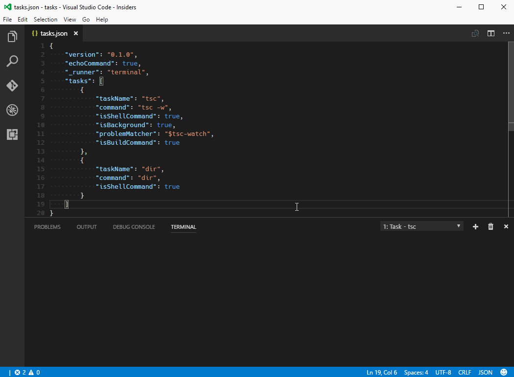

There is one thing we changed for executing tasks in the terminal: if the task is a shell command arguments to the shell command should best be part of the command itself. The reason for this is proper quoting. With the old runner, it was always complicated to quote shell commands correctly especially under Linux/Mac shells where different kind of quotes exist (pre character escaping, weak quoting and strong quoting). If arguments are provided, we add them to the command without performing any quoting rules.

Please note that this is still work in progress. Feedback and suggestions are welcome.

## Editor

### Format on Paste

We have added a new setting to enable format on paste ([#13945](https://github.com/Microsoft/vscode/issues/13945)). Simply update your settings to include `editor.formatOnPaste: true`. Note that this works with existing formatters that support formatting a selection such as the TypeScript formatter or other formatters from the Marketplace.

### Theme matching rules now respect TextMate semantics

 Since our first version, VS Code has supported TextMate themes. There was, however one catch, we would leave it up to CSS to do token <-> theme rule matching. This was a great way to make progress at the time, but it also meant that TextMate themes were not rendered accurately in VS Code (for example, TextMate theme matching semantics are different than CSS class name matching semantics). The issues had been piling up and we decided it was time to improve our implementation (see [issue #3008](https://github.com/Microsoft/vscode/issues/3008) for the rendering differences caused by this shortcut).

### New Tools for inspecting TextMate Scopes

 We have introduced a new widget to help inspect the scopes of a token and the matching theme rule. You can launch the widget with **Developer: Inspect TM Scopes** from the **Command Palette** (`kb(workbench.action.showCommands)`).

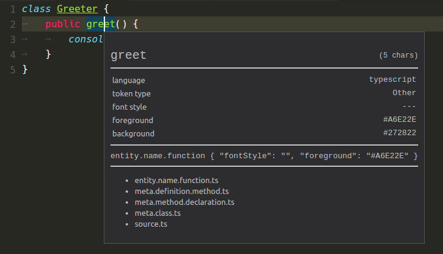

### Insert snippets

You can now bind your favorite snippets to key bindings. A sample that encloses a selection with single quotes looks like this:

```json
{
	"key": "cmd+k '",
	"command": "editor.action.insertSnippet",
	"args": { "snippet": "'$TM_SELECTED_TEXT'" }
}
```

Instead of defining a snippet with `snippet`, you can also refer to a snippet using the `name`-property, like `{ "name": "mySnippet" }`

### Go To Implementation

The new **Go to Implementation** and **Peek Implementation** commands allow you to quickly jump from an interface to its implementers, or from an abstract method to the method implementations. You can try out this feature by installing a nightly build of TypeScript 2.2 in your workspace: `npm install typescript@next`.

### Persistent view options

Using Toggle Word Wrap, Toggle Render Whitespace and Toggle Control Characters will now persist the toggled value to user settings.

### Match Case and Whole Words in multi-cursor actions

The multi-cursor actions always changed their behavior based on the toggle values for "Match Case" and "Whole Words". However, this was not really obvious, especially when the Find widget is hidden. To make this more clear, triggering the following actions will now either highlight the toggles when the Find widget is visible, or briefly show the two options in the top right corner of the editor.

Here are the multi-cursor actions:

| Label | Default Key binding |
|---|---|
| Add Selection To Next Find Match | `kb(editor.action.addSelectionToNextFindMatch)` |
| Move Last Selection To Next Find Match | `kb(editor.action.moveSelectionToNextFindMatch)` |
| Add Selection To Previous Find Match | `kb(editor.action.addSelectionToPreviousFindMatch)` |
| Move Last Selection To Previous Find Match | `kb(editor.action.moveSelectionToPreviousFindMatch)` |
| Select All Occurrences of Find Match | `kb(editor.action.selectAllMatches)` |
| Change All Occurrences | `kb(editor.action.changeAll)` |

Moreover, the two options will briefly show in the top right corner of the editor also when toggling their value via Toggle Find case sensitive (`kb(toggleFindCaseSensitive)`) or Toggle Find whole word (`kb(toggleFindWholeWord)`)

### Find widget, \n and CRLF files

The semantics of `\n` in the find widget search string, when in regex mode, has now changed to always match the End-Of-Line sequence.

Whereas before, `\n` would always match the `\n` character, `\n` will now match the `\n` characters in files with `\n` line terminators (indicated in the Status Bar with **LF**) and will match the `\r\n` sequence in files with `\r\n` line terminators (indicated in the Status Bar with **CRLF**).

### Indentation rules improvements

We polished our implementation of Indentation Rules, which Language extensions can leverage to determine the correct indentation level for a specific line. The indentation adjustments are usually triggered after users finish writing a line and press `kbstyle(Enter)`.

In addition, we implemented an experimental command **Reindent Lines** and you can use it to adjust the indentation of the whole file if the indentation rules are properly set.

## Languages

### TypeScript references CodeLens

The TypeScript references CodeLens displays an inline count of reference for classes, interfaces, methods, properties, and exported objects:

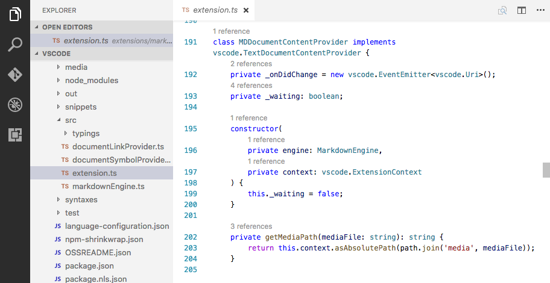

You can enable the TypeScript references CodeLens by setting `"typescript.referencesCodeLens.enabled": true`.

Click on the reference count to quickly browse a list of references:

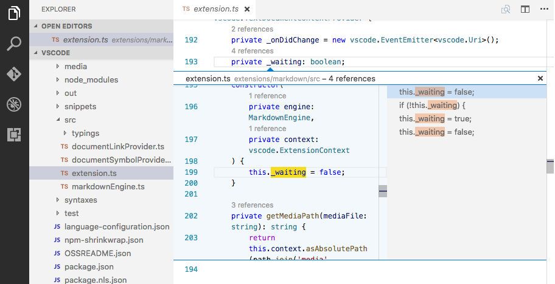

### TypeScript

VS Code now includes TypeScript 2.1.5, which includes a number of important [bug fixes](https://github.com/Microsoft/TypeScript/issues?q=is%3Aissue+milestone%3A%22TypeScript+2.1.5%22+label%3A%22fixed%22+).

### TypeScript Version Configuration

You can now more easily switch which version of TypeScript is being used in your workspace by opening a TypeScript or JavaScript file in the workspace and clicking on the TypeScript version number in the status bar:

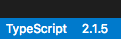

A message box will appear asking you which version of TypeScript VS Code should use:

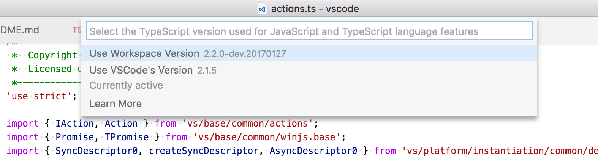

After switching TypeScript versions, reload the VS Code window to apply the change.

Due to a potential [security issue](#settings-and-security), VS Code will no longer automatically load versions of TypeScript from a `typescript.tsdk` workspace setting. When a workspace with a `typescript.tsdk` workspace setting is loaded for the first time, we ask you if we should use the workspace version of TypeScript or VS Code's version.

### Markdown Preview and editor integration

VS Code can now synchronize the view of a Markdown editor and its preview ([#6992](https://github.com/Microsoft/vscode/issues/6992)). By default, the Markdown preview will automatically scroll to reveal the element at the selected line in the editor.


Also, when the Markdown preview is scrolled, the editor will scroll along with it:


Additionally, you can now double click an element in the Markdown preview to automatically open the editor at that line:


### Other Markdown improvements

* Syntax highlighting for C++, Go, Rust, and Scala code blocks in Markdown files.
* Fixed Markdown syntax highlighting for block elements on a line immediately after a paragraph.
* When the Markdown preview is first opened, it will automatically scroll to the selected line in the editor.
* A gray bar in the left margin of the Markdown preview indicates the currently selected line.
* Links to local files now work in the Markdown preview.
* In the Markdown editor, you can `kbstyle(Ctrl)` click on links to local files to open them in the editor.

### Load Emmet preferences, profiles, snippets and abbreviations from external files

The new setting `emmet.extensionsPath` can be used to provide a location (absolute path or relative to workspace) where any or all of `snippets.json`, `syntaxProfiles.json` and `preferences.json` reside. Read more about how to customize Emmet using these files at [Emmet Customization](https://docs.emmet.io/customization/).

The existing settings `emmet.preferences` and `emmet.syntaxProfiles` will override the values from the above json files.

**Note**: The file contents are cached. Therefore, you will need to reload the VS Code window the first time you add these files and every time you modify them.

### SCSS map support

The SCSS language support now also understands the SCSS map syntax ([#1758](https://github.com/Microsoft/vscode/issues/1758)).

### New HTML settings

The HTML formatter (based on the [jsbeautifier](http://jsbeautifier.org/)) has been updated. New options are available:
- `html.format.contentUnformatted`: List of tags, comma separated, where the content shouldn't be reformatted. `null` defaults to the `pre` tag
- `html.format.wrapAttributes`: Wrapping strategy for attributes:
  - `auto`: Wrap when the line length is exceeded
  - `force`: Wrap all attributes, except first
  - `force-aligned`: Wrap all attributes, except first, and align attributes
  - `force-expand-multiline`: Wrap all attributes

The following options allows to disable of script and style validation:

- `html.validate.scripts`: Configures if the built-in HTML language support validates embedded scripts.
- `html.validate.styles`: Configures if the built-in HTML language support validates embedded styles.

### New PHP settings

The following options allows to disable the built-in PHP completion and hover supports:

- `php.suggest.basic`: Configures if the built-in PHP language suggestions are enabled. The support suggests PHP globals and variables.

### Confirmation of the `php.validate.executablePath` setting

Due to potential security risks, VS Code asks for confirmation of the `php.validate.executablePath` workspace setting before executing the program the setting is pointing to.

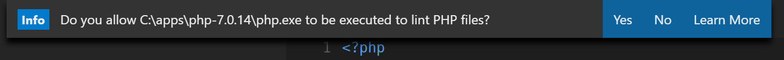

If the path is set in user settings, no confirmation is necessary.

## Extensions

### Easily create an Extension Pack

[Extension Packs](https://code.visualstudio.com/Docs/extensionAPI/extension-manifest#_extension-packs) allow you to bundle separate extensions together so that they can be installed together. We have added support to create an Extension Pack using the Code Yeoman generator.

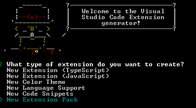

The generator creates an Extension Pack extension. Optionally, it can also seed the pack with the set of extensions you have currently installed in your Code instance. In this way you can easily create an Extension Pack with your favorite extensions, publish it to the market place, and share it with others.

## Debugging

### Debugging without a launch configuration

As per popular [user request](https://github.com/Microsoft/vscode/issues/285), we no longer require a `launch.json` file to start debugging - simply pressing `kb(workbench.action.debug.start)` will immediately start the debug session. This makes it possible to debug single files (in a so called 'no-folder-workspace' indicated by a purple colored Status Bar). A `launch.json` is still required for advanced debug configuration.

>**Note:** This feature is currently supported only by the Node.js and PowerShell debuggers but will be picked up soon by other debug extensions.

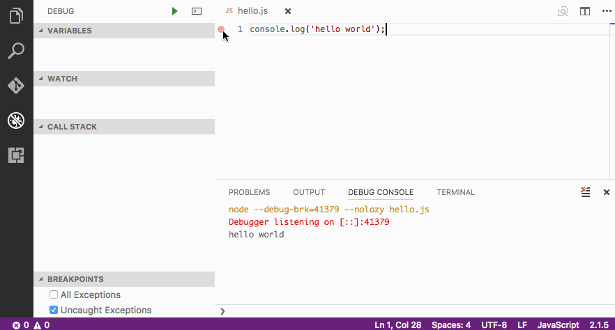

### Inline variable values in source code

Thanks to a user [PR](https://github.com/Microsoft/vscode/pull/16129) we are now able to show variable values inline in the source while stepping through the code.
This feature is still experimental, so it is disabled by default. To enable it set `"debug.inlineValues": true` in your settings.

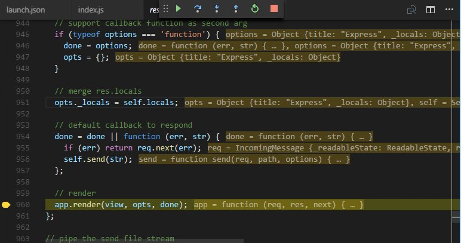

### Automatically choosing debug environment

Depending on the active file, VS Code can now automatically choose a debug environment instead of explicitly asking the user. For example, if a user has a JavaScript file active in an editor and wants to setup his `launch.json`, a  `launch.json` for JavaScript is automatically generated.

### User level launch.json

As per [user request](https://github.com/Microsoft/vscode/issues/18401), it is now possible to have a "launch" object in your user settings that is shared across all the workspaces as a launch configuration.

### Add launch configuration from dropdown

It is now possible to add a new launch configuration by simply choosing that option in the debug dropdown:

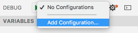

### Copy callstack action

We have added a context menu action in the callstack view that copies the callstack to the clipboard. This can be very handy when you need to report a callstack with an issue.

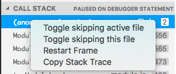

## Node Debugging

### Launch configuration snippets for Node scenarios

We've added a few launch configuration snippets to support some commonly used Node.js debugging scenarios. These snippets can be used through IntelliSense when editing the `launch.json`:

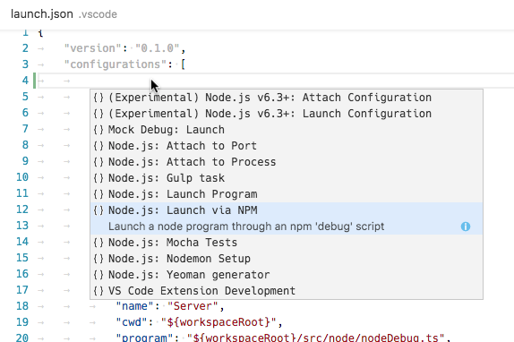

Here is the list of all snippets:

- **Launch Program**: Launch a node.js program in debug mode. The snippet asks you to enter the name of the program file.
- **Launch via NPM**: Launch a node program through an npm 'debug' script. If you have defined an npm debug script in your package.json, you can use this directly from your launch configuration. Make sure that the debug port used in the npm script, corresponds to the port specified in the snippet.
- **Attach to Port**: Attach to the debug port of a running Node.js program. Make sure that the Node.js program to debug has been started in debug mode and the debug port used is the same as the one specified in the snippet.
- **Attach to Process**: Open the process picker to select a node or gulp process for debugging. With this launch configuration you can even attach to a node or gulp process that was not started in debug mode.
- **Nodemon Setup**: Use nodemon to relaunch a debug session automatically whenever the JavaScript source has changed. Make sure that you have nodemon installed globally. Please note that terminating the debug session only terminates the program to debug, not nodemon itself. To terminate nodemon, press Control-C in the integrated terminal.
- **Mocha Tests**: Debug mocha tests in a `test` folder of your project. Make sure that your project has 'mocha' installed in its node_modules folder.
- **Yeoman generator**: Debug a yeoman generator. The snippet asks you to specify the name of the generator. Make sure that your project has 'yo' installed in its node_modules folder and that your generated project has been installed for debugging by running `npm link` in the project folder.
- **Gulp task**: Debug a gulp task. The snippet asks you to specify the name of the gulp task. Make sure that your project has 'gulp' installed in its node_modules folder.

### Just My Code improvements

We've added some finishing touches to the 'Just My Code' feature introduced in the last [milestone](https://code.visualstudio.com/updates/v1_8#_just-my-code-node-and-node2):

- Support for skipping core modules with the `skipFiles` attribute. It is now possible to use the 'magic name' `<node_internals>` in a glob pattern to refer to the core modules built into Node.js.

The following example skips all internal modules but `events.js`:

  ```json
  "skipFiles": [
     "<node_internals>/**/*.js",
     "!<node_internals>/events.js"
   ]
  ```
- Skipped source is now shown in a 'dimmed' style in the CALL STACK view:

  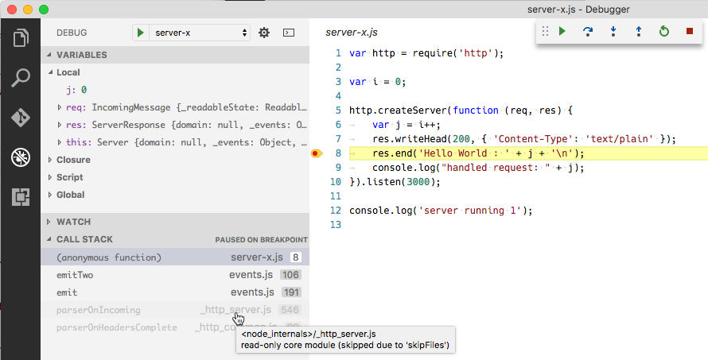

  Hovering over the dimmed entries explains why the stack frame is dimmed.

- Context menu action for skipping additional source files at runtime (`node2` only):

  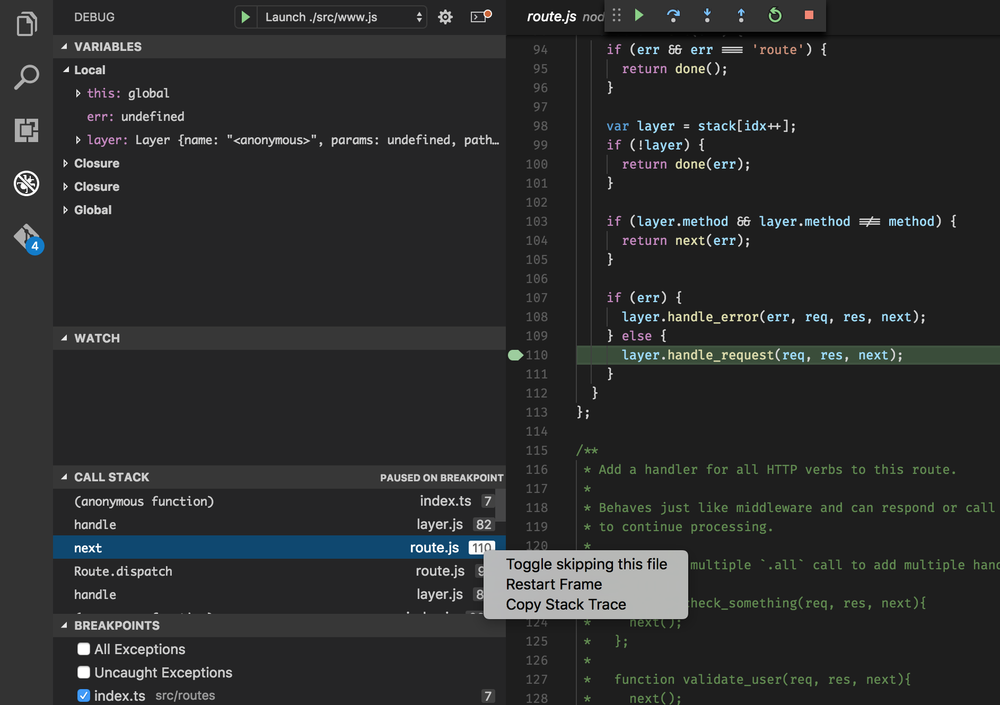

  A new context menu item on the call stack, **Toggle skipping this file** enables you to easily skip a file at runtime without adding it to your launch config. This option only persists for the current debugging session. You can also use it to stop skipping a file that is skipped by the `skipFiles` option in your launch config.

### Support 'restart' option for 'launch' requests

For quite some time the VS Code node debugger supported a `restart` attribute on `attach` configurations. See [here](https://code.visualstudio.com/docs/nodejs/nodejs-debugging#_attaching-to-nodejs) for details. With this release, we now support the `restart` attribute on `launch` configurations as well.

If this feature is enabled, VS Code restarts a debug session whenever it detects the termination of Node.js. This feature can be used in combination with the `nodemon` utility which restarts Node.js whenever it detects that JavaScript source has been modified.

This launch configuration (available as a snippet through IntelliSense) makes use of `nodemon` and the `restart` option:

```json
{
	"type": "node",
	"request": "launch",
	"name": "nodemon",
	"cwd": "${workspaceRoot}",
	"runtimeExecutable": "nodemon",
	"runtimeArgs": [
		"--debug=5858"
	],
	"program": "${workspaceRoot}/app.js",
	"restart": true,
	"port": 5858
}
```

### Source map support now always enabled

Starting with this release, source map support is enabled by default, so it is no longer necessary to set `sourceMaps` to `true`. However, it is still necessary to let the Node.js debugger know where the generated JavaScript lives by specifying the `outFiles` glob patterns. Source map support can be disabled by setting `sourceMaps` to `false`.

### Better object display in the console (node2)

In the `node2` debug adapter, calling `console.log` with an object will now show an expandable object in the console, instead of a text preview.

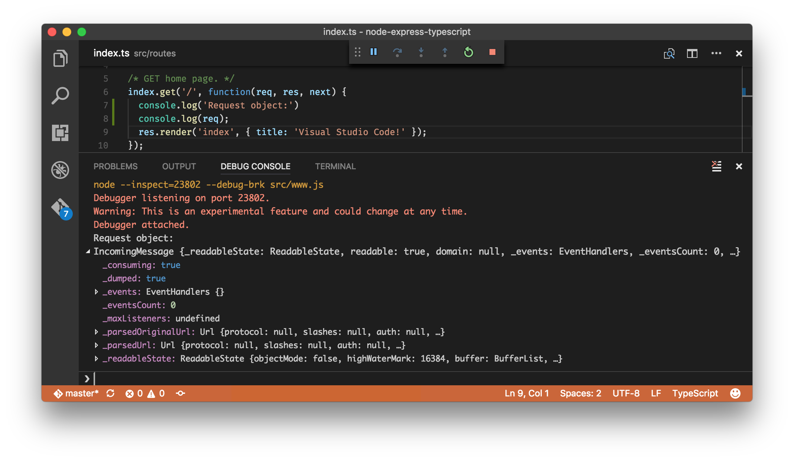

## Extension Authoring

### Editor API to insert a snippet

There is a new `TextEditor#insertSnippet` method that allows you to insert a `SnippetString` into an editor.

### Updating CodeLens

A `CodeLensProvider` can now have a `onDidChangeCodeLenses`-event which signals to the editor that lenses have changed and need to be refreshed.

### Completion item commit characters

`CompletionItems` can now have a list of commit characters. When a commit character is typed and while a completion is selected, the completion will be inserted as the character is being typed.

### Added new ImplementationProvider API

A new `ImplementationProvider` interface was added to support the new **Go to Implementation** feature. A `ImplementationProvider` maps a location in a text document to a list of implementations locations, for example going from an interface to classes that implement this interface or from an abstract method to a list of implementing methods.

Extensions that wish to support **Go to Implementation** can implement `ImplementationProvider` and register the provider using `vscode.languages.registerImplementationProvider`

### New API to open an untitled file with optional language

A new overload was added to the `openTextDocument` method that allows to open an untitled document with optional language. For example you can call:

`openTextDocument({ language: 'xml' })`

To create a text document with XML as language. If you leave out the language options, it will just create a text document with plain text language.

### TextEditorRevealType.AtTop

A new `AtTop` value was added to the `TextEditorRevealType` enum. This reveals the range at the top of the viewport.

### CompletionItemKind.Folder

A new `Folder` value was added to the `CompletionItemKind` enum.

### Proposed Progress API

We have a proposed API to show progress in different places of the editor, such as the Status Bar or a view. It is still in its early stages and we are looking for feedback. To try it out, do the following:

* Copy [`vscode.proposed.d.ts`](https://github.com/Microsoft/vscode/blob/master/src/vs/vscode.proposed.d.ts#L30) into your TypeScript project.
* In the `package.json` of your extension, add `"enableProposedApi": true` to enable the proposed APIs.

Note that proposed APIs are only available when developing an extension but not when an extension is published to the Marketplace.

### Contributable SCM Providers

We started large refactorings around source control in order to provide SCM functionality from different [contributable providers](https://github.com/Microsoft/vscode/issues/2824). At the same time, all Git functionality is being ported over to an [SCM provider](https://github.com/Microsoft/vscode/blob/23c4c8d1b881cfbf48e76fbe67e350b4efecba68/src/vs/vscode.proposed.d.ts#L143).

The new behavior is available for you to try out with via the **SCM: Enable Preview SCM** command, which will replace the current Git functionality with the experimental one (run **SCM: Disable Preview SCM** to undo). Be aware that this is not feature complete nor without issues. You can track progress in [#18615](https://github.com/Microsoft/vscode/issues/18615).

### Debugger Extension Authoring

We've added the following (optional) sub-contribution points to the `debuggers` contribution point:

- `languages`<BR>Here those languages can be listed for which the debug extension could be considered the "default debugger". VS Code makes use of this information only in cases where a debugger must be found automatically for a given source language.

- `startSessionCommand`<BR>takes the ID of a command which VS Code calls for any "debug" or "run" action targeted for this extension. If a launch configuration was selected, it is passed as an argument to the command (and the extension can massage the launch config as desired). If "debug" or "run" is executed without an existing launch config, an empty launch config is passed to the `startSessionCommand` and the extension is expected to "fill in" missing attributes e.g. based on the file currently open in the editor.

- `adapterExecutableCommand`<BR>VS Code launches a debug adapter by using the (static) attributes `program`, `args`, `runtime` and `runtimeArgs` from the package.json of the corresponding extension. Starting with this milestone an extension can alternatively contribute a command where the debug adapters executable path and arguments are dynamically calculated.<BR>Instead of defining the attributes `program`,  `args`, `runtime` and `runtimeArgs` on a debuggers contribution in the package.json, set a new attribute `adapterExecutableCommand` to the ID of a command that is registered in the extension. Make this command return a structure with this format:
  ```json
  command: "<executable>",
  args: [ "<argument1>", "<argument2>", ... ]
  ```
  The attribute `command` must be a either an absolute path to an executable or a name of executable looked up via the PATH environment variable. The special value `node` will be mapped to VS Code's built-in node runtime without being looked up on the PATH.

### VS Code Debug Protocol

A new optional attribute `presentationHint` has been added to the `Source` type. With this a debug adapter can provide a hint for how to render a source in the UI. A value of `deemphasize` can be used to indicate that the source is not available or that it is skipped on stepping.

## Miscellaneous

### Settings and security

In settings, we allow you to specify some of the executables that VS Code uses to do its work. For example, you can choose which shell the Integrated Terminal should use. Until now, just like any other setting, you could define them either as user settings or workspace settings. For enhanced security, we no longer allow such settings to be defined at the workspace level.

Here is the complete list of settings we no longer support at the workspace level:

- git.path
- terminal.integrated.shell.linux
- terminal.integrated.shellArgs.linux
- terminal.integrated.shell.osx
- terminal.integrated.shellArgs.osx
- terminal.integrated.shell.windows
- terminal.integrated.shellArgs.windows
- terminal.external.windowsExec
- terminal.external.osxExec
- terminal.external.linuxExec

When you open a workspace and we find for the first time that the workspace defines any of these settings, VS Code will warn you and subsequently ignore the values.

The `typescript.tsdk` and `php.validate.executablePath` setting created a similar security exposure which has been addressed separately.

### Launch new instance from Unity on Ubuntu

The standard shortcuts to launch a new instance of an application from the Ubuntu Unity user interface now correctly open a new instance of VS Code (`kbstyle(Win+Shift+<number>)`, `kbstyle(Shift)`+click, middle click).

### New command to report performance issues

We added a new command, **Report Performance Issues** in the **Command Palette**, that makes it very easy to open a new GitHub issue with details about your environment and performance timings prefilled into the issue description (OS, CPUs, Memory, task timings). If you think that VS Code is starting slow on your system, please use this new command to tell us about it!

### Editor Performance Optimization

We have added a heuristic that reduces the time taken to paint a frame in the editor significantly in certain conditions (that occur more than 95% of the time).

If the font you are using is monospace (most of the programming fonts are monospace), if a certain line consists only of ASCII characters (most of the lines in source code stick to the ASCII range 32-126 or tabs), and if certain editor decorations (like the color boxes in CSS) are not present on a line, we can skip interrogating the browser about where the text has ended up painted and simply do the math in JavaScript.

This optimization saves us a forced browser layout and further decreases the time it takes us to paint a frame.

>Note: If you notice the cursor being rendered slightly off from the text, please let us know. You can disable this optimization via `editor.disableMonospaceOptimizations`.

## Notable Changes

* [16803](https://github.com/Microsoft/vscode/issues/16803): Preserve language picked for untitled text documents
* [16588](https://github.com/Microsoft/vscode/issues/16588): Preserve view state for untitled files between restarts
* [17408](https://github.com/Microsoft/vscode/issues/17408): Search does not work in UTF-16 LE encoded files
* [12831](https://github.com/Microsoft/vscode/issues/12831): Support standard tab navigation key shortcuts on macOS
* [10444](https://github.com/Microsoft/vscode/issues/10444): Persist character encoding of open files across restart
* [18037](https://github.com/Microsoft/vscode/issues/18037): Possible to save file multiple times leads to race condition
* [14464](https://github.com/Microsoft/vscode/issues/14464): Preserve editor relative sizes when switching layouts
* [18003](https://github.com/Microsoft/vscode/issues/18003): Search relevance in Quick Pick control
* [14625](https://github.com/Microsoft/vscode/issues/14625): Update menu when reassigning keybindings or installing keybinding extension
* [18290](https://github.com/Microsoft/vscode/issues/18290): Moving or renaming file does not preserve editor view state
* [12040](https://github.com/Microsoft/vscode/issues/12040): Identical file name path in tab is too long and difficult to diff
* [17495](https://github.com/Microsoft/vscode/issues/17495): Explorer: Does not sort files and folders with numerical values accordingly
* [7876](https://github.com/Microsoft/vscode/issues/7876): Allow to use Ctrl P/N for up and down navigation in quick open
* [6502](https://github.com/Microsoft/vscode/issues/6502): Apply excludes to editor history quick open too
* [18679](https://github.com/Microsoft/vscode/issues/18679): F4 added as a keybinding to navigate search results - may conflict with some extension keybindings
* [11908](https://github.com/Microsoft/vscode/issues/11908): ALT + Arrows does not work in integrated terminal
* [14479](https://github.com/Microsoft/vscode/issues/14479): Integrated Terminal eats half of the first line when you zoom
* [18952](https://github.com/Microsoft/vscode/issues/18952): Terminal tab stops broken after resize
* [18332](https://github.com/Microsoft/vscode/issues/18332): Background terminal scroll bars are not synced when the foreground terminal is resized
* [18758](https://github.com/Microsoft/vscode/issues/18758): Hard crash (of everything) when debugging nodejs
* [19377](https://github.com/Microsoft/vscode/issues/19377): Explorer refresh not working for folders with same prefix

These are the [closed bugs](https://github.com/Microsoft/vscode/issues?q=is%3Aissue+label%3Abug+milestone%3A%22January+2017%22+is%3Aclosed) and these are the [closed feature requests](https://github.com/Microsoft/vscode/issues?q=is%3Aissue+milestone%3A%22January+2017%22+is%3Aclosed+label%3Afeature-request) for the 1.9 update.

## Contributions to Extensions

Our team maintains or contributes to a number of VS Code extensions. Most notably:

* [Go](https://marketplace.visualstudio.com/items?itemName=lukehoban.Go)
* [TSLint](https://marketplace.visualstudio.com/items?itemName=eg2.tslint)
* [ESLint](https://marketplace.visualstudio.com/items?itemName=dbaeumer.vscode-eslint)
* [Debugger for Chrome](https://marketplace.visualstudio.com/items?itemName=msjsdiag.debugger-for-chrome)
* [VSCodeVim](https://marketplace.visualstudio.com/items?itemName=vscodevim.vim)

In addition, we released an [early-stage PHP parser](https://github.com/Microsoft/tolerant-php-parser) designed for IDE usage scenarios. This will help extension authors provide even better tooling support for PHP. The parser is written in PHP, and is built to be fast and memory-efficient, provide graceful error-handling, and produce fully-representative syntax trees (including comments/whitespace).

## Thank You

Last but certainly not least, a big *__Thank You!__* to the following folks that helped to make VS Code even better:

* [Adrian Perez (@aperezdc)](https://github.com/aperezdc)
  *  Add a few niceties for making Flatpak builds of VS Code [PR #17370](https://github.com/Microsoft/vscode/pull/17370)
  *  Add an AppData XML data file to Linux builds [PR #17369](https://github.com/Microsoft/vscode/pull/17369)
  *  Support building Flatpak application bundles [PR #16169](https://github.com/Microsoft/vscode/pull/16169)
* [Artem Govorov (@ArtemGovorov)](https://github.com/ArtemGovorov):  Add Toggle Output Scroll Lock action [PR #18768](https://github.com/Microsoft/vscode/pull/18768)
* [Charles Pierce (@charlespierce)](https://github.com/charlespierce):  #14464 Preserve editor size when switching layout [PR #17760](https://github.com/Microsoft/vscode/pull/17760)
* [Chirag Bhatia (@chirag64)](https://github.com/chirag64):  Fixes #19194 - Added option to clear Terminal in Terminal Context menu [PR #19393](https://github.com/Microsoft/vscode/pull/19393)
* [Geir Sagberg (@geirsagberg)](https://github.com/geirsagberg)
  *  Make high contrast detection configurable [PR #17394](https://github.com/Microsoft/vscode/pull/17394)
  *  Check window.autoDetectHighContrast on window load [PR #17832](https://github.com/Microsoft/vscode/pull/17832)
* [@hun1ahpu](https://github.com/hun1ahpu)
  *  Fix labels unit tests + root displayed as '.. [PR #18575](https://github.com/Microsoft/vscode/pull/18575)
  *  Right click to copy selection and paste on Windows [PR #17496](https://github.com/Microsoft/vscode/pull/17496)
* [Yuki Ueda (@Ikuyadeu)](https://github.com/Ikuyadeu)
  *  Re use readonly #12732 #13863 [PR #18251](https://github.com/Microsoft/vscode/pull/18251)
* [Jess Chadwick (@jchadwick)](https://github.com/jchadwick)
  *  Setting Powershell as default terminal for Windows 10+ (fixes #16838) [PR #18493](https://github.com/Microsoft/vscode/pull/18493)
  *  Fixing sorting of directory and filenames with numbers [PR #18539](https://github.com/Microsoft/vscode/pull/18539)
* [Jimi (Dimitris) Charalampidis (@JimiC)](https://github.com/JimiC):  Change order of Diff extensions. [PR #17680](https://github.com/Microsoft/vscode/pull/17680)
* [@jmdowns2](https://github.com/jmdowns2)
  *  Fix for #12833. [PR #17625](https://github.com/Microsoft/vscode/pull/17625)
  *  Fix for #16771.  [PR #17698](https://github.com/Microsoft/vscode/pull/17698)
* [Joel Day (@joelday)](https://github.com/joelday):  Adding an overload to TextEditor.edit for insertion of a SnippetString [PR #17628](https://github.com/Microsoft/vscode/pull/17628)
* [Morag S. (@morags)](https://github.com/morags):  Markdown fixes [PR #18704](https://github.com/Microsoft/vscode/pull/18704)
* [@mrdrogdrog](https://github.com/mrdrogdrog):  linux argument startup fix [PR #17853](https://github.com/Microsoft/vscode/pull/17853)
* [Manoj Patel (@nojvek)](https://github.com/nojvek)
  *  inline values as decorators when debugging [PR #16129](https://github.com/Microsoft/vscode/pull/16129)
  *  Fix bug in decorationRenderHelper [PR #18361](https://github.com/Microsoft/vscode/pull/18361)
* [Nick Olinger (@olingern)](https://github.com/olingern):  Cache release notes. Fixes #13257 [PR #15050](https://github.com/Microsoft/vscode/pull/15050)
* [Marcel Miranda Ackerman (@reaktivo)](https://github.com/reaktivo):  Adds support for moving the tab close button to the left [PR #17863](https://github.com/Microsoft/vscode/pull/17863)
* [John Rothfels (@rothfels)](https://github.com/rothfels):  Ensure workspace is read from WorkspaceContextService [PR #17494](https://github.com/Microsoft/vscode/pull/17494)
* [Ryan Patterson (@ryapapap)](https://github.com/ryapapap):  Option to exclude items from Git branch checkout list #13506 [PR #16792](https://github.com/Microsoft/vscode/pull/16792)
* [Matteo (@xadhoom)](https://github.com/xadhoom):  Add GConf2 dependency in rpm spec template [PR #16016](https://github.com/Microsoft/vscode/pull/16016)
* [David Terry (@xwvvvvwx)](https://github.com/xwvvvvwx):  Add config setting to control whether alt should show the menu bar [PR #17517](https://github.com/Microsoft/vscode/pull/17517)
* [Josh Peng (@joshpeng)](https://github.com/joshpeng): Improve Markdown code block tokens for syntax highlighting [PR #17591](https://github.com/Microsoft/vscode/pull/17591)


Contributions to `vscode-eslint`:

* [Giovanni Calò (@giovannicalo)](https://github.com/giovannicalo): Fixed typo [PR #190](https://github.com/Microsoft/vscode-eslint/pull/190)

Contributions to `vscode-tslint`:

* [Yuichi Nukiyama (@YuichiNukiyama)](https://github.com/YuichiNukiyama):  Add jsEnable option [PR #154](https://github.com/Microsoft/vscode-tslint/pull/154)

Contributions to `vscode-languageserver-node`:

* [Per Lundberg (@perlun)](https://github.com/perlun): README.md: Fixed typos [PR #138](https://github.com/Microsoft/vscode-languageserver-node/pull/138)
* [Federico Bond](https://github.com/federicobond): Fix typo [PR #144](https://github.com/Microsoft/vscode-languageserver-node/pull/144)

Contributions to `language-server-protocol`:

* [Guillaume Martres (@smarter)](https://github.com/smarter): Fix incorrect numbering in CompletionItemKind [#151](https://github.com/Microsoft/language-server-protocol/pull/151)
* [Olivier Thomann (@othomann)](https://github.com/othomann): Fix some typos [#149](https://github.com/Microsoft/language-server-protocol/pull/149)

Contributions to `vsce`:

* [Chris (@LaChRiZ)](https://github.com/LaChRiZ): fixed description in option baseImagesUrl of package command [#151](https://github.com/Microsoft/vscode-vsce/pull/151)

Contributions to `vscode-generator-code`:

* [Spencer Elliott (@elliottsj)](https://github.com/elliottsj): Use `code` markup for `<user home>` in quickstarts [#61](https://github.com/Microsoft/vscode-generator-code/pull/61)

<!-- In-product release notes styles.  Do not modify without also modifying regex in gulpfile.common.js -->
<a id="scroll-to-top" role="button" aria-label="scroll to top" href="#"><span class="icon"></span></a>
<link rel="stylesheet" type="text/css" href="css/inproduct_releasenotes.css"/>
