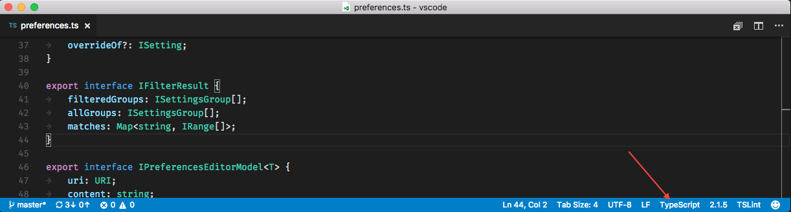
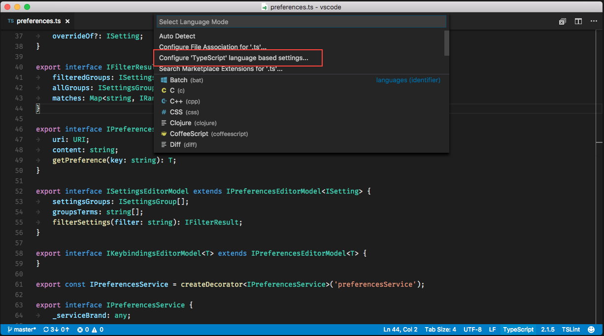
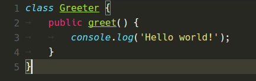
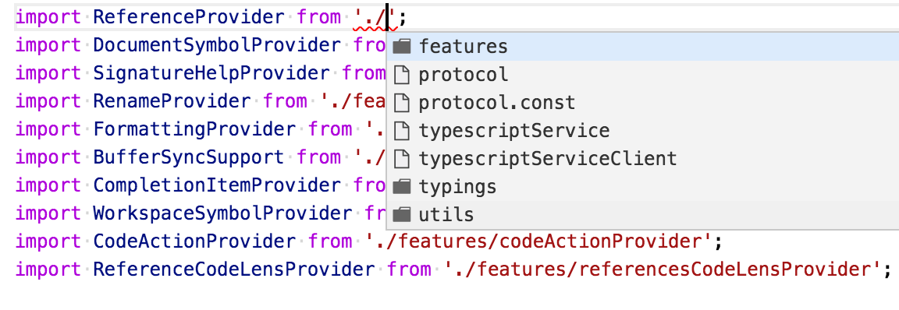
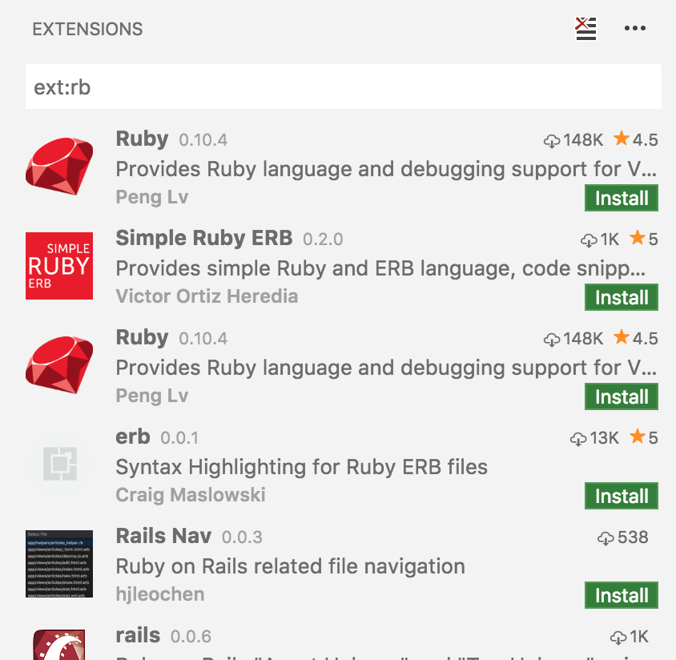

# January 2017 (version 1.9)

Welcome to the first 2017 release of Visual Studio Code. There are a number of significant updates in this version that we hope you will like, some of the key highlights include:

* **[Control menu visibility](#control-the-dimensions-of-new-windows)** - Hide or toggle the top VS Code menu.
* **[Markdown Preview and Editor Integration](#markdown-preview-and-editor-integration)** - View synchronization of a Markdown preview and its editor.
* **[Terminal performance and better Windows support](#terminal-improvements)** - The terminal is a lot faster and works better on Windows.

TBD add 10-12 highlights linking to h3 headers

The release notes are arranged in the following sections related to VS Code focus areas. Here are some further updates:

* **[Workbench](#workbench)** - New settings to control new windows, improved Tabbed headings.
* **[Editor](#editor)** - TBD details not mentioned in highlights.
* **[Languages](#languages)** - TBD details not mentioned in highlights.
* **[Extensions](#extensions)** - TBD details not mentioned in highlights.
* **[Node.js Debugging](#node-debugging)** - TBD details not mentioned in highlights.
* **[Extension Authoring](#extension-authoring)** - TBD details not mentioned in highlights.

## Workbench

### New entries in the context menu of tabs

Additional entries have been added to the context menu of tabs that show files. You can copy the path of the file or reveal it in the native OS explorer or the explorer in the side bar.


### New setting to control close button in tabs

We added a new setting `workbench.editor.tabCloseButton` that controls if the close button should show on the right (default), left or not be visible at all.


Note: the previous `workbench.editor.showTabCloseButton` was removed in favor of this new option.

### Panels title bar update

The title bar of the horizontal panel is now showing all the other panels that are available and thus makes it much easier to switch between panels.


### Control if files/folders should open in a new window or last active

There are many ways how to open files or folders when VS Code is already running and for each we have to make a decision whether they should open in the last active window or a new window. Previously we only had a simple setting `window.openFilesInNewWindow` to control this for files and by default, we would actually decide to open files into new windows, instead of reusing the last active window.

With this release, we want to make this more configurable and also change the default behavior for opening files.

A new setting `window.openFoldersInNewWindow` is provided to configure this behavior for folders and possible values are `default`, `on` and `off`. The existing (previously boolean) setting `window.openFilesInNewWindow` was changed to use these same values. In addition, `window.openFilesInNewWindow` now has the default value of `default` which in many cases will reuse the last active window instead of opening a new one.

If configured to be `default`, we will make the best decision about reusing a window or not based on the context from where the open request was made. Flip this to `on` or `off` to always behave the same. For example, if you feel that picking a file or folder from the **File** menu should open into a new window, set this to `on`.

Note: There can still be cases where this setting is ignored (for example, when using the `-new-window` or `-reuse-window` command line option).

### Control the dimensions of new windows

A new setting `window.newWindowDimensions` allows to control how new windows should open. By default, a new window will open in the center of the screen with small dimensions. If you change this setting to `inherit`, the new window will get the same dimensions as the last active one. Setting it to `maximized` or `fullscreen` will always open new windows either maximized or in fullscreen.

### Control menu visibility (Windows, Linux)

A new setting `window.menuBarVisibility` allows for more fine grained control over the top menu visibility on Windows and Linux. By `default`, the menu will be visible and only hides when entering full screen. You can set it to `toggle` to hide it. In the `toggle` state, the menu will show up when you press the `kbstyle(Alt)` key. If you turn the set the value to `hidden`, the menu will remain hidden, even if you press `kbstyle(Alt)`.

Note: If you configure the menu explicitly to be `visible`, it will also remain visible when you enter the fullscreen mode.

### Easy to close all editors when they are dirty

There are situations where you can easily end up with many dirty editors open (for example, you ran a search and replace operation without saving). Previously, when you wanted to close them all, you were asked to Save or Revert each editor one by one. Now, when you invoke the **Close All Editors** action (`kb(workbench.action.closeAllEditors)`), you will see a combined prompt for all dirty files:


### Compare editors now supports untitled documents

Previously only files could be compared that exist on disk. With this release you can compare any 2 documents, even if they are untitled.

### Tabs with same labels use much less space now

When you have multiple tabs open that show the same file name from different folders, we used to just show the full (workspace relative) path to those files so that you are able to distinguish one from the other. The downside of this approach is that tabs needs a lot more space:


With this release, we try to find a segment in the path that is different and then only show this to distinguish the two tabs:


### Rename or move dirty files without confirmation

You can now move or rename dirty files without having to save or revert the changes. Any moved or renamed dirty file will preserve the dirty content and dirty state without any confirmation needed.

### Always hot exit on folders

The `files.hotExit` setting has changed from a simple `true`/`false` setting to accept the following options:

- `"off"`: Disable hot exit (same as the old `false` setting).
- `"onExit"`: Enable hot exit when all VS Code windows are shut down (same as the old `true` setting).
- `"onExitAndWindowClose"`: Same as `"onExit"` but trigger hot exit when any folder window closes, regardless of whether it's the window or not. In order to enable more flexibility, this setting will also *not* restore folder windows when you next launch, `"window.reopenFolders": "all"` can be used to restore all previous windows when this setting is used.

### Output scroll lock

Thanks to an external [PR](https://github.com/Microsoft/vscode/pull/18768) it is now possible to easily stop output from automatically scrolling by toggling the scroll lock in the output title bar.


### Zen mode improvements

To reduce visual clutter zen mode now also hides the workbench tabs. We have also introduced the following options to make it easier to fine tune the zen mode experience: `"zenMode.hideStatusBar"`, `"zenMode.hideTabs"`, `"zenMode.fullScreen"`.

### Terminal improvements

**Performance**

Much of the terminal frontend has been rewritten with performance in mind. In short it should no longer lock up the application when processing large amounts of data and it should process data about 5 times faster.

Before (v1.8.1):


After (v1.9.0):


**Windows support**

The library used to communicate with the terminal process on Windows has been upgraded which fixes many of the problems the terminal had on Windows such as arrow keys not functioning and the prompt line going out of sync. A special thanks to [Ryan Prichard](https://github.com/rprichard) for his [winpty](https://github.com/rprichard/winpty) library and for assisting with the upgrade.

**Other**

- **PowerShell on Windows 10**: PowerShell is now the default shell on Windows 10 to better align with the [new OS default](https://blogs.windows.com/windowsexperience/2016/11/17/announcing-windows-10-insider-preview-build-14971-for-pc/#fwfzEgffOGmVfEXs.97).
- **Right-click copy or paste**: On Windows similar to the cmd.exe feature, right clicking within the terminal will copy if there is a selection or paste if there is no selection. This is enabled by default on Windows and can be configured (on any platform) using the `terminal.integrated.rightClickCopyPaste` setting.
- **Cursor styles**: New line and underline cursor styles have been added to the terminal, these can be configured with the `terminal.integrated.cursorStyle` setting.
- **Wide character support**: Wide characters are now sized to consume exactly 2 character widths
- **Better space utilization**: The terminals within the terminal panel should now fill up as much space as possible

### Launch new instance from Unity/Ubuntu

The standard shortcuts to launch a new instance of an application from the Unity launcher now correctly open a new instance of VS Code (`kbstyle(Win+Shift+<number>)`, `kbstyle(Shift)`+click, middle click).

## Settings

In this milestone, we fine tuned those improvements we did in Settings during last milestone.

- Improved search to match individual words with the setting's key, value, allowed values and its description to yield better results.
- Improved the layout of edit action to be more accessible, discoverable and consistent with other editor actions (Quick fix).
- Improved the Settings editor UI by extending Search to both default (left) and configurable (right) settings. This brings you the benifit of searching across default and configurable settings.

### User/Workspace Settings

- Now you can quickly switch between User and Workspace settings from the single Settings editor. This helps users in discovering and understanding the user and workspace scopes.


## Language based Settings

VS Code gives you the flexibility of customizing the editor through Settings. But it is quiet often that users work with different file types (languages) within or across the workspaces. This brings the requirement of more detailed editor configuration. With this release, you can customise your editor by language through language based settings. This is one of the most wanted features requested by our users for a long time.

You can start leveraging this feature as follows

- When you have a file opened and if you want to customize the editor for this file type, click on the language in the status bar to the bottom-right of the VS Code window. This opens the language picker with an option `Configure <language_name> language based settings`. Selecting this opens the Settings editor with the language entry where you can add applicable settings.






- If you want to customize for any language, run the global command `Preferences: Configure language specific settings` (id: `workbench.action.configureLanguageBasedSettings`) from the Command pallette (`F1`) which opens the language picker. Selecting the language you want, opens the Settings editor with the language entry where you can add applicable settings.


- You can also configure language based settings by directly opening Settings. You can scope them to the workspace by placing them in the Workspace settings just like other settings. If you have settings defined for a language in both user and workspace scopes, then they are merged by giving precedence to the ones defined in workspace. Following examples customize editor settings for language modes `typescript` and `markdown`.

```json
{
  "[typescript]": {
    "editor.formatOnSave": true,
    "editor.formatOnPaste": true
  },
  "[markdown]": {
    "editor.formatOnSave": true,
    "editor.wrappingColumn": 0,
  }
}
```

*NOTE:* All editor settings and some non-editor settings are allowed to be customizable. Intelli-sense in Settings editor will help you in finding the allowed settings.

## Editor

### Format on Paste

We have added a new setting to enable format on paste. Update your settings to include `editor.formatOnPaste: true` and have code formatted on paste. Note that this work with existing formatters that support to format a selection such as the TypeScript formatter or other formatters from the marked place.

### Insert snippets

You can now bind your favorite snippets to keybindings. A sample that encloses a selection with single quotes looks like this:

```json
{
	"key": "cmd+k '",
	"command": "editor.action.insertSnippet",
	"args": { "snippet": "'$TM_SELECTED_TEXT'" }
}
```

Instead of defining a snippet with `snippet`, you can also refer to a snippet using the `name`-property, like `{ "name": "mySnippet" }`

### Go To Implementation

The new **Go to Implementation** and **Peek Implementation** commands allow you to quickly jump from an interface to its implementers, or from an abstract method to the method implementations.

### Persistent view options

Using Toggle Word Wrap, Toggle Render Whitespace and Toggle Control Characters will now persist the toggled value to user settings.

### Match Case and Whole Words in multicursor actions

The multicursor actions always changed their behaviour based on the toggle values for "Match Case" and "Whole Words". However, this was not really obvious, especially when the find widget is hidden. To make this more clear, triggering the following actions will now either highlight the toggles when the find widget is visible, or briefly show the two options in the top right corner of the editor. Here are the multicursor actions:

| Label | Default Keybinding |
|---|---|
| Add Selection To Next Find Match | `kb(editor.action.addSelectionTonextFindMatch)` |
| Move Last Selection To Next Find Match | `kb(editor.action.moveSelectionTonextFindMatch)` |
| Add Selection To Previous Find Match | `kb(editor.action.addSelectionToPreviousFindMatch)` |
| Move Last Selection To Previous Find Match | `kb(editor.action.moveSelectionToPreviousFindMatch)` |
| Select All Occurrences of Find Match | `kb(editor.action.selectAllMatches)` |
| Change All Occurrences | `kb(editor.action.changeAll)` |

Moreover, the two options will briefly show in the top right corner of the editor also when toggling their value via Toggle Find case sensitive (`kb(toggleFindCaseSensitive)`) or Toggle Find whole word (`kb(toggleFindWholeWord)`)

### Find widget, \n and CRLF files

The semantics of `\n` in the find widget search string, when in regex mode, has now changed to always match the End-Of-Line sequence.

Whereas before, `\n` would always match the `\n` character, `\n` will now match the `\n` characters in files with `\n` line terminators (indicated in the status bar with LF) and will match the `\r\n` sequence in files with `\r\n` line terminators (indicated in the status bar with CRLF).

### Theme matching rules now respect TM semantics

Since our first version, VS Code has supported TM themes. There was, however one catch: we would leave it up to CSS to do token <-> theme rule matching. This was a great way to make progress at the time, but it also meant that TM themes were not rendered accurately in VS Code (i.e. TM theme matching semantics are different than CSS class name matching semantics). The issues have been piling up and we had to rip the band-aid sooner rather than later (see [issue #3008](https://github.com/Microsoft/vscode/issues/3008) for a whole bunch of differences caused by this shortcut).

> Note: The TM theme matching semantics are documented [here](https://manual.macromates.com/en/themes) and [here](https://manual.macromates.com/en/scope_selectors.html). VS Code 1.9.1 still does not support excluding selectors, but they are not used in the most popular TM themes.

#### TM theme rules semantics

Here is a TypeScript file rendered with the Monokai theme in VSCode 1.8.1 and in VSCode 1.9.0. Notice how in VSCode 1.8.1 the public method `greet` would incorrectly get an underline:

| TypeScript, Monokai, 1.8.1 | TypeScript, Monokai, 1.9.0 |
|---|---|
|  |  |

Here are two Monokai theme rules that would impact the rendering before (as JSON here for brevity; the original is in XML):
```js
...
// Function name
{ "scope": "entity.name.function", "fontStyle": "", "foreground":"#A6E22E" }
...
// Class name
{ "scope": "entity.name.class", "fontStyle": "underline", "foreground":"#A6E22E" }
...
```

Before, we would generate dynamic CSS rules from the theme rules. e.g.:
```css
...
/* Function name */
.entity.name.function { color: #A6E22E; }
...
/* Class name */
.entity.name.class { color: #A6E22E; text-decoration: underline; }
...
```

Without going into too much details on how TM grammars work, the TM TypeScript grammar generates the following scopes for `greet` (from most specific to least specific):
* `entity.name.function.ts`
* `meta.definition.method.ts`
* `meta.method.declaration.ts`
* `meta.class.ts`
* `source.ts`

When rendering a token, we would ultimately take all the scopes except the least specific one, split them on `"."`, dedup unique pieces, and render `greet` using the following HTML:
```html
<span class="token ts meta class entity name declaration method function">greet</span>
```

Before, due to the fact that both CSS selectors would match the token, we would get both Monokai theme rules applying, even if the `entity.name.class` rule should not have matched the token according to TM theme matching semantics.

Now, we generate a [trie](https://en.wikipedia.org/wiki/Trie) when we load a theme, and at each leaf node we hold on to a set of theme rules that might match. Then, **at tokenization time**, instead of allocating an array of scopes for each token, we have introduced an immutable linked list that matches each scope as it is added to the list. Ultimately, this makes it possible to represent a token using directly resolved colors, font style information, some other useful metdata etc. in 64 bits (32 bits for the start offset of the token and 32 bits for the token metadata) in a single pass over the input text.

We now generate dynamic CSS rules containing only the minimum information. e.g. (this color is the 5th distinct color appearing in the Monokai theme):
```css
.mtk5 { color: #A6E22E; }
```

And the html used to render the token:
```html
<span class="mtk5">greet</span>
```

In this Monokai example, the difference is quite small, but for some themes, the differences in CSS selectors matching rules and TM theme matching rules yield significant results:

| HTML, Quiet Light, 1.8.1 | HTML, Quiet Light, 1.9.0 |
|---|---|
|  |  |

| HTML, Red, 1.8.1 | HTML, Red, 1.9.0 |
|---|---|
|  |  |

#### Other advantages

* Due to storing only 64 bits per token in [TypedArray](https://developer.mozilla.org/en-US/docs/Web/JavaScript/Reference/Global_Objects/TypedArray), we are getting good memory usage reductions, especially in minified files (that have a high token count / character count ratio)
* Although theme matching now occurs in the tokenization phase, we are observing faster overall tokenization times due to the more efficient memory usage (i.e. avoiding allocating arrays of scopes that then cause GC pauses) and the single-pass nature of the new implementation (i.e. there were three passes over a line before).
* Rendering a frame is faster because:
  * the generated size of the HTML for a line has reduced significantly
  * the number of class names needed to be matched by CSS is reduced significantly
* Finally, having resolved token color information in JavaScript means we can begin working on an efficient minimap implementation.

#### New tooling

We have introduced a new widget to help inspect the scopes of a token and the matching theme rule. It is under `F1 > Developer Tools: Inspect TM Scopes`


If desirable, it can be easily bound to a keybinding:

```json
{
	"key": "ctrl+k ctrl+t",
	"command": "editor.action.inspectTMScopes",
	"when": "editorTextFocus"
}
```

### Monospace fonts

We need to buy ourselves some time from rendering a frame, time that can be later spent on painting a minimap.

We have added a heuristic that reduces the time taken to paint a frame in the editor significantly in certain conditions (that occur more than 95% of the time).

If the font you are using is monospace (most of the programming fonts are monospace), if a certain line consists only of ASCII characters (most of the lines in source code stick to the ASCII range 32-126 or tabs), and if certain editor decorations (like the color boxes in CSS are not present on a line), we can skip interrogating the browser about where the text has ended up painted and simply do the math in JavaScript.

This optimization saves us a forced browser layout and further decreases the time it takes us to paint a frame.

> Note: If you notice the cursor being rendered slightly off from the text, please let us know. You can disable this optimization via `editor.disableMonospaceOptimizations`

### Indentation rules improvements

We polished our implementation of Indentation Rules, which Language extensions can leverage to determine what's the correct indentation level for a specific line. The indentation adjustments are usually triggered after users finish writing a line and press Enter.

In addition we implemented an experimental command Reindent Lines and you can use it to adjust the indentation of the whole file if the indentation rules are properly set.

## Languages

### TypeScript 2.1.5

VS Code now includes TypeScript 2.1.5. This release includes a number of important [bug fixes](https://github.com/Microsoft/TypeScript/issues?q=is%3Aissue+milestone%3A%22TypeScript+2.1.5%22+label%3A%22fixed%22+).

### TypeScript References Code Lens

The TypeScript references code lens displays an inline count of reference for classes, interfaces, methods, properties, and exported objects:


You can enable the TypeScript references code lens by setting `"typescript.referencesCodeLens.enabled": true`.

Click on the reference count to quickly browse a list of references:


### Support for Suggestions and Formatting in Unsaved JavaScript and TypeScript Files

Normal suggestion and formatting are now enabled for unsaved JavaScript and TypeScript files when using TypeScript 2.1.5+. Previously the file had to be saved to disk to enable these features.

### Icons For TypeScript File and Folder Completions

TypeScript file and folder completion items are now displayed using the corresponding file and folder icons.



### Markdown Preview and Editor Integration

VS Code can now synchronize the view of a Markdown editor and its preview. By default, the Markdown preview will automatically scroll to reveal the element at the selected line in the editor.


Also, when the Markdown preview is scrolled, the editor will scroll along with it:


Additionally, you can now double click an element in the Markdown preview to automatically open the editor at that line:


**Other Markdown Improvements**

* Syntax highlighting for C++, Go, Rust, and Scala code blocks in markdown files.
* Fixed Markdown syntax highlighting for block elements on a line immediately after a paragraph.
* When the Markdown preview is first opened, it will automatically scroll to the selected line in the editor.
* A gray bar in the left margin of the Markdown preview indicates the currently selected line.
* Links to local files now work in the Markdown preview.
* In the Markdown editor, you can ctrl click on links to local files to open them in the editor.

### Load Emmet preferences, profiles, snippets and abbreviations from external files

The new setting `emmet.extensionsPath` can be used to provide a location (absolute path) where any or all of `snippets.json`, `syntaxProfiles.json` and `preferences.json` reside. Read more about how to customize Emmet abbreviations at [Emmet Customization](http://docs.emmet.io/customization/).

The existing settings `emmet.preferences` and `emmet.syntaxProfiles` will override the values from the above json files.

Note: The file contents are cached. Therefore, you will need to reload the Visual Studio Code window for the changes in the json files to be reflected.

## Extensions

### Better recommendations for file extensions

The extension recommendations for specific file extensions have been improved.



## Debugging

### Debugging without a launch.json
As per popular [user request](https://github.com/Microsoft/vscode/issues/285) we no longer require a `launch.json` to start debugging - simply pressing `kb(workbench.action.debug.start)` will immediately start the debug session. This makes it possible to debug single files (in a so called 'no-folder-workspace' indicated by a purple coloured status bar). A `launch.json` is still required for advanced debug configuration though.

>**Note:** this feature is currently supported only by the Node and Powershell debuggers but will be picked up soon by other debug extensions.


### Automatically choosing debug environment

Depending on the active file VS Code can now automatically choose a debug enironment instead of explicitly asking a user.
For example, if a user has a JavaScript file active in an editor and wants to setup his `launch.json` a  `launch.json` for JavaScript is automatically generated.

### User level launch.json
As per [user request](https://github.com/Microsoft/vscode/issues/18401) it is now possible to have a "launch" object in your user settings that is shared across all the workspaces as a launch configuration.

### Add launch configuration from dropdown
It is now possible to add a new launch configuration by simply choosing that option in the debug dropdown:


### Inline variable values in source
Thanks to a user [PR](https://github.com/Microsoft/vscode/pull/16129) we are now able to show variable values inline in the source while stepping through the code.
This feature is still experimental, so it is disabled by default. To enable it set `"debug.inlineValues": true` in your settings.


### Copy callstack action
We have added a context menu action in the callstack view that copies the callstack to the clipboard. This can be very handy when you need to report a callstack with an issue.


## Node Debugging

### Launch configuration snippets for Node.js scenarios
We've added a few launch configuration snippets to support some commonly used Node.js debugging scenarios.
These snippets can be used through IntelliSense when editing the `launch.json`:


Here is the list of all snippets:

- **Launch Program**: Launch a node.js program in debug mode. The snippet asks you to enter the name of the program file.
- **Launch via NPM**: Launch a node program through an npm 'debug' script. If you have defined an npm debug script in your package.json, you can use this directly from your launch configuration. Make sure that the debug port used in the npm script, corresponds to the port specified in the snippet.
- **Attach to Port**: Attach to the debug port of a running Node.js program. Make sure that the Node.js program to debug has been started in debug mode and the debug port used is the same as theone specified in the snippet.
- **Attach to Process**: Open the process picker to select a node or gulp process for debugging. With this launch configuration you can even attach to a node or gulp process that was not started in debug mode.
- **Nodemon Setup**: Use nodemon to relaunch a debug session automatically whenever the JavaScript source has changed. Make sure that you have nodemon installed globally. Please note that terminating the debug session only terminates the program to debug, not nodemon itself. To terminate nodemon, press Control-C in the integrated terminal.
- **Mocha Tests**: Debug mocha tests in a `test` folder of your project. Make sure that your project has 'mocha' installed in its node_modules folder.
- **Yeoman generator**: Debug a yeoman generator. The snippet asks you to specify the name of the generator. Make sure that your project has 'yo' installed in its node_modules folder and that your generated project has been installed for debugging by running `npm link` in the project folder.
- **Gulp task**: Debug a gulp task. The snippet asks you to specify the name of the gulp task. Make sure that your project has 'gulp' installed in its node_modules folder.

### Just My Code Improvements
We've added some finishing touches to the 'Just My Code' feature introduced in the last milestone:
- Support for skipping core modules with the `skipFiles` attribute. It is now possible to use the 'magic name' `<node_internals>` in a glob pattern to refer to the core modules built into node.js. The following example skips all internal modules but `events.js`:
  ```json
  "skipFiles": [
     "<node_internals>/**/*.js",
     "!<node_internals>/events.js"
   ]
  ```
- Skipped source is now shown in a 'dimmed' style in the CALL STACK view:

  

  Hovering over the dimmed entries explains why the stack frame is dimmed.

- Context action for skipping additional source (node2 only): **todo@rob**

### Support 'restart' option for 'launch' requests

For quite some time the VS Code node debugger supported a `restart` attribute on `attach` configurations. See [here](https://code.visualstudio.com/docs/editor/node-debugging#_attaching-to-nodejs) for details.
With this release we now support the `restart` attribute on `launch` configurations as well.

If this feature is enabled, VS Code restarts a debug session whenever it detects the termination of Node.js.
This feature can be used in combination with the `nodemon` utility which restarts Node.js whenever it detects that JavaScript source has beed modified.

This launch configuration (available as a snippet through IntelliSense) makes use of `nodemon` and the `restart` option:
```json
{
	"type": "node",
	"request": "launch",
	"name": "nodemon",
	"cwd": "${workspaceRoot}",
	"runtimeExecutable": "nodemon",
	"runtimeArgs": [
		"--debug=5858"
	],
	"program": "${workspaceRoot}/app.js",
	"restart": true,
	"port": 5858
}
```

### Source map support now always enabled

Starting with this release source map support is enabled by default, so it is no longer necessary to set `sourceMaps` to `true`. But it is still necessary to let the node debugger know where the generated JavaScript lives by specifying the `outFiles` glob patterns.

In case of problems source map suppoprt can be disabled by setting `sourceMaps` to `false`.

## Extension Authoring

### Editor API to insert a snippet

There is a new `TextEditor#edit` overload that allows you to insert a `StringString` into an editor.

### Updating Code Lenses

A `CodeLensProvider` can now have a `onDidChangeCodeLenses`-event which signals to the editor that lenses have changed and need to be refreshed.

### Completion item commit characters

`CompletionItems` can now have a list of commit characters. When a commit character is typed and while a completion is selected, the completion will be inserted as the character is being typed.

### Added new Implementation Provider API

A new `ImplementationProvider` interface was added to support the new **Go to Implementation** feature. A `ImplementationProvider` maps a location in a text document to a list of implementations locations, for example going from an interface to classes that implement this interface or from an abstract method to a list of implementing methods.

Extensions that wish to support **Go to Implementation** can implement `ImplementationProvider` and register the provider using `vscode.languages.registerImplementationProvider`

### New API to open an untitled file with optional language

A new overload was added to the `openTextDocument` method that allows to open an untitled document with optional language. For example you can call:

`openTextDocument({ language: 'xml' })`

To create a text document with XML as language. If you leave out the language options, it will just create a text document with plain text language.

### `TextEditorRevealType.AtTop`

A new `AtTop` value was added to the `TextEditorRevealType` enum. This reveals the range at the top of the viewport.

### `CompletionItemKind.Folder`

A new `Folder` value was added to the `CompletionItemKind` enum.

### Debugger Extension Authoring

We've added the following (optional) sub-contribution points to the `debuggers` contribution point:

- `languages`<BR>Here those languages can be listed for which the debug extension could be considered the "default debugger". VS Code makes use of this information only in cases where a debugger must be found automatically for a given source language.

- `startSessionCommand`<BR>takes the ID of a command which VS Code calls for any "debug" or "run" action targeted for this extension. If a launch configuration was selected, it is passed as an argument to the command (and the extension can massage the launch config as desired). If "debug" or "run" is executed without an existing launch config, an empty launch config is passed to the `startSessionCommand` and the extension is expected to "fill in" missing attributes e.g. based on the file currently open in the editor.

- `adapterExecutableCommand`<BR>VS Code launches a debug adapter by using the (static) attributes `program`, `args`, `runtime` and `runtimeArgs` from the package.json of the corresponding extension. Starting with this milestone an extension can alternatively contribute a command where the debug adapters executable path and arguments are dynamically calculated.<BR>Instead of defining the attributes `program`,  `args`, `runtime` and `runtimeArgs` on a debuggers contribution in the package.json, set a new attribute `adapterExecutableCommand` to the ID of a command that is registered in the extension. Make this command return a structure with this format:
  ```json
  command: "<executable>",
  args: [ "<argument1>", "<argument2>", ... ]
  ```
  The attribute `command` must be a either an absolute path to an executable or a name of executable looked up via the PATH environment variable. The special value `node` will be mapped to VS Code's built-in node runtime without being looked up on the PATH.

### VS Code Debug Protocol

A new optional attribute `presentationHint` has been added to the `Source` type. With this a debug adapter can provide a hint for how to render a source in the UI. A value of `deemphasize` can be used to indicate that the source is not available or that it is skipped on stepping.

### Breaking Change: TBD

Configuration `"workbench.fullScreenZenMode"` has been renamed to `"zenMode.fullScreen"`.

### Item

## Miscellaneous

### Item

## New Commands

Key|Command|Command id
---|-------|----------
`kb(editor.action.reindentlines)`|Reindent Lines|`editor.action.reindentlines`

## Notable Changes

* [16803](https://github.com/Microsoft/vscode/issues/16803): Preserve language picked for untitled text documents
* [16588](https://github.com/Microsoft/vscode/issues/16588): Preserve view state for untitled files between restarts
* [17408](https://github.com/Microsoft/vscode/issues/17408): Search does not work in UTF-16 LE encoded files
* [12831](https://github.com/Microsoft/vscode/issues/12831): Support standard tab navigation key shortcuts on macOS
* [10444](https://github.com/Microsoft/vscode/issues/10444): Persist character encoding of open files across restart
* [18037](https://github.com/Microsoft/vscode/issues/18037): Possible to save file multiple times leads to race condition
* [14464](https://github.com/Microsoft/vscode/issues/14464): Preserve editor relative sizes when switching layouts
* [18003](https://github.com/Microsoft/vscode/issues/18003): Search relevance in Quick Pick control
* [14625](https://github.com/Microsoft/vscode/issues/14625): Update menu when reassigning keybindings or installing keybinding extension
* [18290](https://github.com/Microsoft/vscode/issues/18290): Moving or renaming file does not preserve editor view state
* [12040](https://github.com/Microsoft/vscode/issues/12040): Identical file name path in tab is too long and difficult to diff
* [17495](https://github.com/Microsoft/vscode/issues/17495): Explorer: Does not sort files and folders with numerical values accordingly
* [7876](https://github.com/Microsoft/vscode/issues/7876): Allow to use Ctrl P/N for up and down navigation in quick open
* [6502](https://github.com/Microsoft/vscode/issues/6502): Apply excludes to editor history quick open too
* [18679](https://github.com/Microsoft/vscode/issues/18679): F4 added as a keybinding to navigate search results - may conflict with some extension keybindings
* [11908](https://github.com/Microsoft/vscode/issues/11908): ALT + Arrows does not work in integrated terminal
* [14479](https://github.com/Microsoft/vscode/issues/14479): Integrated Terminal eats half of the first line when you zoom
* [18952](https://github.com/Microsoft/vscode/issues/18952): Terminal tab stops broken after resize
* [18332](https://github.com/Microsoft/vscode/issues/18332): Background terminal scroll bars are not synced when the foreground terminal is resized
* [18758](https://github.com/Microsoft/vscode/issues/18758): Hard crash (of everything) when debugging nodejs
* [19377](https://github.com/Microsoft/vscode/issues/19377): Explorer refresh not working for folders with same prefix

These are the [closed bugs](https://github.com/Microsoft/vscode/issues?q=is%3Aissue+label%3Abug+milestone%3A%22January+2017%22+is%3Aclosed) and these are the [closed feature requests](https://github.com/Microsoft/vscode/issues?q=is%3Aissue+milestone%3A%22January+2017%22+is%3Aclosed+label%3Afeature-request) for the 1.9 update.

## Contributions to Extensions

Our team maintains or contributes to a number of VS Code extensions. Most notably:

* [Go](https://marketplace.visualstudio.com/items?itemName=lukehoban.Go)
* [Python](https://marketplace.visualstudio.com/items?itemName=donjayamanne.python)
* [TSLint](https://marketplace.visualstudio.com/items?itemName=eg2.tslint)
* [ESLint](https://marketplace.visualstudio.com/items?itemName=dbaeumer.vscode-eslint)
* [Debugger for Chrome](https://marketplace.visualstudio.com/items?itemName=msjsdiag.debugger-for-chrome)
* [VSCodeVim](https://marketplace.visualstudio.com/items?itemName=vscodevim.vim)

## Thank You

Last but certainly not least, a big *__Thank You!__* to the following folks that helped to make VS Code even better:

* [Adrian Perez (@aperezdc)](https://github.com/aperezdc)
  *  Add a few niceties for making Flatpak builds of VSCode [PR #17370](https://github.com/Microsoft/vscode/pull/17370)
  *  Add an AppData XML data file to Linux builds [PR #17369](https://github.com/Microsoft/vscode/pull/17369)
  *  Support building Flatpak application bundles [PR #16169](https://github.com/Microsoft/vscode/pull/16169)
* [Artem Govorov (@ArtemGovorov)](https://github.com/ArtemGovorov):  Add Toggle Output Scroll Lock action [PR #18768](https://github.com/Microsoft/vscode/pull/18768)
* [Charles Pierce (@charlespierce)](https://github.com/charlespierce):  #14464 Preserve editor size when switching layout [PR #17760](https://github.com/Microsoft/vscode/pull/17760)
* [Chirag Bhatia (@chirag64)](https://github.com/chirag64):  Fixes #19194 - Added option to clear Terminal in Terminal Context menu [PR #19393](https://github.com/Microsoft/vscode/pull/19393)
* [Geir Sagberg (@geirsagberg)](https://github.com/geirsagberg)
  *  Make high contrast detection configurable [PR #17394](https://github.com/Microsoft/vscode/pull/17394)
  *  Check window.autoDetectHighContrast on window load [PR #17832](https://github.com/Microsoft/vscode/pull/17832)
* [@hun1ahpu](https://github.com/hun1ahpu)
  *  Fix labels unit tests + root displayed as '.. [PR #18575](https://github.com/Microsoft/vscode/pull/18575)
  *  Right click to copy selection and paste on Windows [PR #17496](https://github.com/Microsoft/vscode/pull/17496)
* [Yuki Ueda (@Ikuyadeu)](https://github.com/Ikuyadeu)
  *  Re use readonly #12732 #13863 [PR #18251](https://github.com/Microsoft/vscode/pull/18251)
* [Jess Chadwick (@jchadwick)](https://github.com/jchadwick):  Setting Powershell as default terminal for Windows 10+ (fixes #16838) [PR #18493](https://github.com/Microsoft/vscode/pull/18493)
* [Jimi (Dimitris) Charalampidis (@JimiC)](https://github.com/JimiC):  Change order of Diff extensions. [PR #17680](https://github.com/Microsoft/vscode/pull/17680)
* [@jmdowns2](https://github.com/jmdowns2)
  *  Fix for #12833. [PR #17625](https://github.com/Microsoft/vscode/pull/17625)
  *  Fix for #16771.  [PR #17698](https://github.com/Microsoft/vscode/pull/17698)
* [Joel Day (@joelday)](https://github.com/joelday):  Adding an overload to TextEditor.edit for insertion of a SnippetString [PR #17628](https://github.com/Microsoft/vscode/pull/17628)
* [Morag S. (@morags)](https://github.com/morags):  Markdown fixes [PR #18704](https://github.com/Microsoft/vscode/pull/18704)
* [@mrdrogdrog](https://github.com/mrdrogdrog):  linux argument startup fix [PR #17853](https://github.com/Microsoft/vscode/pull/17853)
* [Manoj Patel (@nojvek)](https://github.com/nojvek)
  *  inline values as decorators when debugging [PR #16129](https://github.com/Microsoft/vscode/pull/16129)
  *  Fix bug in decorationRenderHelper [PR #18361](https://github.com/Microsoft/vscode/pull/18361)
* [Nick Olinger (@olingern)](https://github.com/olingern):  Cache release notes. Fixes #13257 [PR #15050](https://github.com/Microsoft/vscode/pull/15050)
* [Marcel Miranda Ackerman (@reaktivo)](https://github.com/reaktivo):  Adds support for moving the tab close button to the left [PR #17863](https://github.com/Microsoft/vscode/pull/17863)
* [John Rothfels (@rothfels)](https://github.com/rothfels):  Ensure workspace is read from WorkspaceContextService [PR #17494](https://github.com/Microsoft/vscode/pull/17494)
* [Ryan Patterson (@ryapapap)](https://github.com/ryapapap):  Option to exclude items from Git branch checkout list #13506 [PR #16792](https://github.com/Microsoft/vscode/pull/16792)
* [Matteo (@xadhoom)](https://github.com/xadhoom):  Add GConf2 dependency in rpm spec template [PR #16016](https://github.com/Microsoft/vscode/pull/16016)
* [David Terry (@xwvvvvwx)](https://github.com/xwvvvvwx):  Add config setting to control whether alt should show the menu bar [PR #17517](https://github.com/Microsoft/vscode/pull/17517)


Contributions to `vscode-eslint`:

* [Giovanni Calò (@giovannicalo)](https://github.com/giovannicalo): Fixed typo [PR #190](https://github.com/Microsoft/vscode-eslint/pull/190)

Contributions to `vscode-tslint`:

* [Yuichi Nukiyama (@YuichiNukiyama)](https://github.com/YuichiNukiyama):  Add jsEnable option [PR #154](https://github.com/Microsoft/vscode-tslint/pull/154)

Contributions to `vscode-languageserver-node`:

* [Per Lundberg (@perlun)](https://github.com/perlun): README.md: Fixed typos [PR #138](https://github.com/Microsoft/vscode-languageserver-node/pull/138)
* [Federico Bond](https://github.com/federicobond): Fix typo [PR #144](https://github.com/Microsoft/vscode-languageserver-node/pull/144)

Contributions to `language-server-protocol`:

* [Guillaume Martres (@smarter)](https://github.com/smarter): Fix incorrect numbering in CompletionItemKind [#151](https://github.com/Microsoft/language-server-protocol/pull/151)
* [Olivier Thomann (@othomann)](https://github.com/othomann): Fix some typos [#149](https://github.com/Microsoft/language-server-protocol/pull/149)

Contributions to `vsce`:

* [Chris (@LaChRiZ)](https://github.com/LaChRiZ): fixed description in option baseImagesUrl of package command [#151](https://github.com/Microsoft/vscode-vsce/pull/151)

<!-- In-product release notes styles.  Do not modify without also modifying regex in gulpfile.common.js -->
<a id="scroll-to-top" role="button" aria-label="scroll to top" onclick="scroll(0,0); event.preventDefault(); event.stopPropagation()"><span class="icon"></span></a>
<link rel="stylesheet" type="text/css" href="css/inproduct_releasenotes.css"/>
