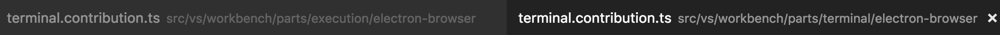
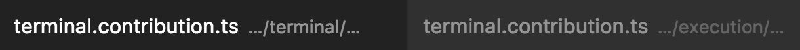

# January 2017 (version 1.9)

Welcome to the first 2017 release of Visual Studio Code. There are a number of significant updates in this version that we hope you will like, some of the key highlights include:

* **[Highlight1](#highlight-1)** - highlight 1 description.
* **[Highlight2](#highlight-2)** - highlight 2 description.

TBD add 10-12 highlights linking to h3 headers

The release notes are arranged in the following sections related to VS Code focus areas. Here are some further updates:

* **[Workbench](#workbench)** - TBD details not mentioned in highlights.
* **[Editor](#editor)** - TBD details not mentioned in highlights.
* **[Languages](#languages)** - TBD details not mentioned in highlights.
* **[Extensions](#extensions)** - TBD details not mentioned in highlights.
* **[Node.js Debugging](#node-debugging)** - TBD details not mentioned in highlights.
* **[Extension Authoring](#extension-authoring)** - TBD details not mentioned in highlights.

## Workbench

### Easy to close all editors when they are dirty

There are situations where you can easily end up with many dirty editors open (e.g. run a search and replace operation without saving). Previously, when you wanted to close them all you got asked to Save or Revert each and every editor one by one. Now, when you invoke the Close All Editors action (`kb(workbench.action.closeAllEditors)`), you will see a combined prompt for all dirty files opened:

### Compare editors now supports untitled documents

Previously only files could be compared that exist on disk. With this release you can compare any 2 documents, even if they are untitled.

### Tabs with same labels use much less space now

When you have multiple tabs open that show the same file name from different folders, we used to just show the full (workspace relative) path to those files so that you are able to distinugish one from the other. The downside of this approach is that tabs needs a lot more space:

With this release we try to find a segment in the path that is different and then only show this to distinugish the two tabs:

### Rename or move dirty files without confirmation

In this release you can now move or rename dirty files without having to save or revert the changes. Any moved or renamed dirty file will preserve the dirty content and dirty state without any confirmation needed.

### New setting to control menu visibility (Windows, Linux)

A new setting `window.menuBarVisibility` allows for more fine grained control over the menu visibility. By default the menu will be `visible` but you can set it to `toggle` to hide it. In this state the menu will still show up when you press the `kbstyle(Alt)` key. Finally, when you turn the setting into `hidden`, the menu will remain hidden, even if you press `kbstyle(Alt)`. 

Note: If you configure the menu explicitly to be `visible`, it will also remain visible when you enter the fullscreen mode.

## Editor

### Highlight 2

## Languages

### Item

## Extensions

### Item

## Node Debugging

### Item

## Extension Authoring

### Breaking Change: TBD

### Item

## Miscellaneous

### Item

## New Commands

Key|Command|Command id
---|-------|----------
`kb(commandid)`|Command Palette description|`commandid`

## Notable Changes

* [16803](https://github.com/Microsoft/vscode/issues/16803): Preserve language picked for untitled text documents
* [16588](https://github.com/Microsoft/vscode/issues/16588): Preserve view state for untitled files between restarts
* [17408](https://github.com/Microsoft/vscode/issues/17408): Search does not work in UTF-16 LE encoded files
* [12831](https://github.com/Microsoft/vscode/issues/12831): Support standard tab navigation key shortcuts on macOS
* [10444](https://github.com/Microsoft/vscode/issues/10444): Persist character encoding of open files across restart
* [18037](https://github.com/Microsoft/vscode/issues/18037): Possible to save file multiple times leads to race condition
* [14464](https://github.com/Microsoft/vscode/issues/14464): Preserve editor relative sizes when switching layouts
* [18003](https://github.com/Microsoft/vscode/issues/18003): Search relevance in Quick Pick control
* [14625](https://github.com/Microsoft/vscode/issues/14625): Update menu when reassigning keybindings or installing keybinding extension
* [18290](https://github.com/Microsoft/vscode/issues/18290): Moving or renaming file does not preserve editor view state
* [12040](https://github.com/Microsoft/vscode/issues/12040): Identical file name path in tab is too long and difficult to diff
* [17495](https://github.com/Microsoft/vscode/issues/17495): Explorer: Does not sort files and folders with numerical values accordingly

These are the [closed bugs](https://github.com/Microsoft/vscode/issues?q=is%3Aissue+label%3Abug+milestone%3A%22January+2017%22+is%3Aclosed) and these are the [closed feature requests](https://github.com/Microsoft/vscode/issues?q=is%3Aissue+milestone%3A%22January+2017%22+is%3Aclosed+label%3Afeature-request) for the 1.9 update.

## Contributions to Extensions

Our team maintains or contributes to a number of VS Code extensions. Most notably:

* [Go](https://marketplace.visualstudio.com/items?itemName=lukehoban.Go)
* [Python](https://marketplace.visualstudio.com/items?itemName=donjayamanne.python)
* [TSLint](https://marketplace.visualstudio.com/items?itemName=eg2.tslint)
* [ESLint](https://marketplace.visualstudio.com/items?itemName=dbaeumer.vscode-eslint)
* [Debugger for Chrome](https://marketplace.visualstudio.com/items?itemName=msjsdiag.debugger-for-chrome)
* [VSCodeVim](https://marketplace.visualstudio.com/items?itemName=vscodevim.vim)

## Thank You

Last but certainly not least, a big *__Thank You!__* to the following folks that helped to make VS Code even better:

TBD The contribution list is autogenerated

* [TBD (@tbd)](https://github.com/tbd):  TBD [PR #TBD](https://github.com/Microsoft/vscode/pull/TBD)

Contributions to `vscode-eslint`:

* [Giovanni Calò (@giovannicalo)](https://github.com/giovannicalo): Fixed typo [PR #190](https://github.com/Microsoft/vscode-eslint/pull/190)

Contributions to `vscode-languageserver-node`:

* [Per Lundberg (@perlun)](https://github.com/perlun): README.md: Fixed typos [PR #138](https://github.com/Microsoft/vscode-languageserver-node/pull/138)

Contributions to `language-server-protocol`:

* [Guillaume Martres (@smarter)](https://github.com/smarter): Fix incorrect numbering in CompletionItemKind [#151](https://github.com/Microsoft/language-server-protocol/pull/151)
* [Olivier Thomann (@othomann)](https://github.com/othomann): Fix some typos [#149](https://github.com/Microsoft/language-server-protocol/pull/149)

<!-- In-product release notes styles.  Do not modify without also modifying regex in gulpfile.common.js -->
<a id="scroll-to-top" role="button" aria-label="scroll to top" onclick="scroll(0,0)"></a>
<link rel="stylesheet" type="text/css" href="css/inproduct_releasenotes.css"/>
