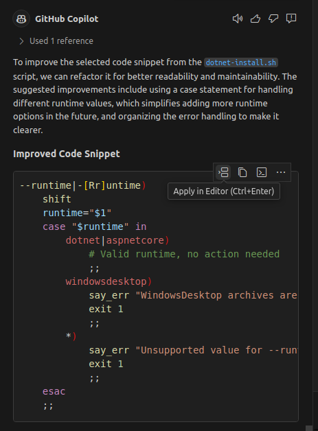

# June 2024 (version 1.91)

**Update 1.91.1**: The update addresses these [issues](https://github.com/microsoft/vscode/issues?q=is%3Aissue%20milestone%3A%22June%202024%20Recovery%201%22%20is%3Aclosed%20).

<!-- DOWNLOAD_LINKS_PLACEHOLDER -->

---

Welcome to the June 2024 release of Visual Studio Code. There are many updates in this version that we hope you'll like, some of the key highlights include:

* [Preview: Incoming/Outgoing changes graph](#source-control) - Visualize incoming and outgoing changes in the Source Control view.
* [Python environments](#python) - Enhanced environment discovery with python-environment-tools.
* [Smart Send in native REPL](#smart-send-in-native-repl) - Smoothly run code chunks in the native REPL.
* [GitHub Copilot extensibility](#chat-and-language-model-api) - Chat and Language Model APIs available in VS Code Stable.
* [Preview: Profiles Editor](#profiles-editor-preview) - Manage your profiles in a single place.
* [Custom tab labels](#access-file-extensions-in-custom-labels) - More variable options and support for multiple extensions.
* [TypeScript 5.5](#syntax-checking-for-regular-expressions) - Syntax checking for regular expressions and other language features.
* [JavaScript Debugger](#javascript-debugger) - Inspect shadowed variables while debugging JavaScript.

>If you'd like to read these release notes online, go to [Updates](https://code.visualstudio.com/updates) on [code.visualstudio.com](https://code.visualstudio.com).
**Insiders:** Want to try new features as soon as possible? You can download the nightly [Insiders](https://code.visualstudio.com/insiders) build and try the latest updates as soon as they are available.

## Accessibility

### Accessible View for editor hover

To improve accessibility when coding, the [Accessible View](https://code.visualstudio.com/docs/editor/accessibility#_accessible-view) and [accessibility help menu](https://code.visualstudio.com/docs/editor/accessibility#_accessibility-help) can now present the content of the editor hover information. Depending on the focused part of the hover, they show information about the focused part or the entire hover content.


### Link underlines

To make links easier to distinguish from regular text in the workbench, you can enable the setting <code codesetting="accessibility.underlineLinks">accessibility.underlineLinks</code> to underline links.


## Workbench

### Search

We added a new setting <code codesetting="search.ripgrep.maxThreads">search.ripgrep.maxThreads</code> that enables you to limit the number of threads that the ripgrep search engine uses. This setting applies regardless whether search is used by the core product or via the extension API.

Set <code codesetting="search.ripgrep.maxThreads">search.ripgrep.maxThreads</code> to a nonzero value to configure the number of threads. Be cautious because fixing this setting to a specific value might slow down ripgrep.

### Adjust allowed encodings for guessing

With the new setting <code codesetting="files.candidateGuessEncodings">files.candidateGuessEncodings</code>, you can configure a set of encodings that should be considered when <code codesetting="files.autoGuessEncoding">files.autoGuessEncoding</code> is enabled. The order of configuration determines the priority. This functionality enables you to limit the possible encodings that can be detected to a smaller set and to prioritize one encoding over another.

### Profiles Editor preview

In this milestone, we introduced a new Profiles Editor that enables you to manage [profiles](https://code.visualstudio.com/docs/editor/profiles) from a single place. This experience includes creating new profiles, editing and deleting existing profiles, and importing and exporting profiles to share with others. While creating a new profile, you can preview the profile and customize as needed before saving it. The Profiles Editor also enables you to open new windows with a specific profile, or set a profile as the default profile for new windows.


The Profiles Editor is available as an experimental feature behind the <code codesetting="workbench.experimental.enableNewProfilesUI">workbench.experimental.enableNewProfilesUI</code> setting. Once enabled, you can access the Profiles Editor from the Settings gear icon in the bottom left corner of the window.


Give it a try and give us feedback on how we can improve this experience further.

### New Window with Profile menu item

In addition to the Profiles Editor, we added actions to the File menu to open a new window with a specific profile. Use the **File** > **New Window with Profile** menu to open a new window with a specific profile.


### Extension install options

We added more options to give you more flexibility when installing extensions:

* Install an extension without syncing it.
* Install a specific version of an extension. Previously, you first had to install the latest version of the extension before you could select a specific version.

These actions are available in the context menu of the extension in the Extensions view:


### Access file extensions in custom labels

When you define [custom labels](https://code.visualstudio.com/docs/getstarted/userinterface#_customize-tab-labels), you have now more flexibility to access individual file extensions by using the `${extname(N)}` syntax. Additionally, `${extname(N)}` also supports negative indices to capture file extensions in the reverse order. To get the entire file extension, use `${extname}`.

For example, for the file `tests/editor.test.ts`:

- `${filename}` => `editor`
- `${extname}` => `test.ts`
- `${extname(0)}` => `ts`
- `${extname(1)}` => `test`
- `${extname(-1)}` => `test`
- `${extname(-2)}` => `ts`

### Merge custom label patterns from multiple extensions

When two extensions contribute a default configuration for the setting <code codesetting="workbench.editor.customLabels.patterns">workbench.editor.customLabels.patterns</code> in their `configurationDefaults`, the contributed patterns are merged together.

<table style="width: 100%;">
  <tr>
    <td>
      <pre><code>"workbench.editor.customLabels.patterns" : {
  "**/app/**/page.tsx": "${dirname} - Page",
  "**/app/**/layout.tsx": "${dirname} - Layout"
}</code></pre>
    </td>
    <td>
    <pre><code>"workbench.editor.customLabels.patterns" : {
  "**/components/**/index.tsx": "${dirname} - Component"
}</code></pre>
    </td>
  </tr>
  <tr>
    <td align="center">Default Contribution by Extension 1</td>
    <td align="center">Default Contribution by Extension 2</td>
  </tr>
</table>

<table style="width: 100%;">
  <tr>
    <td style="text-align: center;">
      <pre style="display: inline-block; text-align: left;"><code>"workbench.editor.customLabels.patterns" : {
  "**/app/**/page.tsx": "${dirname} - Page",
  "**/app/**/layout.tsx": "${dirname} - Layout",
  "**/components/**/index.tsx": "${dirname} - Component"
}</code></pre>
    </td>
  </tr>
  <tr>
    <td align="center">Resulting Custom Label Patterns</td>
  </tr>
</table>

### Unset a theme color

If a theme sets a color or border that you don't like, you can now use `default` to set it back to the original value:

```json
  "workbench.colorCustomizations": {
      "diffEditor.removedTextBorder": "default"
  }
```

### Change folding placeholder color

The folding placeholder (ellipsis) can now be themed with the color `editor.foldPlaceholderForeground`.

## Editor

### Code Actions on Save

With the <code codesetting="editor.codeActionsOnSave">editor.codeActionsOnSave</code> setting, you can configure a set of Code Actions that are automatically applied when you save a file, for example to organize imports. We improved the IntelliSense for configuring this setting by providing a list of available Code Actions based on your workspace files and the active extensions.

> **Note**: be aware that that although `true` and `false` are still valid configurations at the moment, they will be deprecated in favor of `explicit`, `always`, and `never`. See [Code Actions on Save Docs](https://code.visualstudio.com/docs/typescript/typescript-refactoring#_code-actions-on-save) for examples.

### Quickly turn off read-only file status

If you have configured a file as read-only through the `files.readonlyInclude` setting, you can now quickly toggle off the read-only status of the file from the read-only editor message.


## Source Control

### Incoming/Outgoing changes graph preview

We have been exploring using an alternative visualization of the incoming and outgoing changes. This milestone includes an experimental feature that uses a graph to visualize the incoming and outgoing changes. The graph contains the current branch, the current branch's upstream branch, and an optional base branch. The root of the graph is the common ancestor of these branches.

You can enable this new visualization by using the <code codesetting="scm.experimental.showHistoryGraph">scm.experimental.showHistoryGraph</code> setting. Try it out and let us know what you think, as we continue to improve and expand the functionality available in this visualization.


## Notebooks

### Find in text selection

The Notebook Find control now has "Find in Selection" for textual selections and cell selections. This behavior is enabled by default, and can be controlled via the button within the control. Based on the context of your selection, toggling this button scopes your find query to one or more selected cells, or lines within a cell.

<video src="images/1_91/notebook-find-in-selection.mp4" title="Find in Selection using Notebook Find control" autoplay loop controls muted></video>

### Copy or open text output from the context menu

When working with text output in notebooks, you can now use the context menu of a text output to copy the output value or to open the output in a new editor. This feature makes it easier to review large streaming outputs.

<video src="images/1_91/notebook-output-context-menu.mp4" title="Copy or Open Text Output from the Context Menu" autoplay loop controls muted></video>

## Terminal

### Support for copy and paste escape sequence (OSC 52)

The Operating System Command (OSC) 52 escape sequence is now supported. This can be used by anything running in the terminal but the primary use case is clipboard access for `tmux`.

### New custom glyphs

The terminal now supports custom glyphs for the branch, line number, and lock Powerline symbols. Like the [other custom glyphs](https://code.visualstudio.com/docs/terminal/appearance#_custom-glyphs) we support, these symbols work without the need to configure a font when [GPU acceleration](https://code.visualstudio.com/docs/terminal/appearance#_gpu-acceleration) is enabled.


These symbols also scale perfectly with the cell when font size, line height, or letter spacing is adjusted.


## Debug

### JavaScript debugger

The JavaScript debugger now shows the correct value of shadowed variables when hovering over them and in inline values (enabled via the <code codesetting="debug.inlineValues">debug.inlineValues</code> setting), based on the program's scopes.


_Theme: [Codesong](https://marketplace.visualstudio.com/items?itemName=connor4312.codesong) (preview on [vscode.dev](https://vscode.dev/editor/theme/connor4312.codesong))_

## Languages

### TypeScript 5.5

We now include TypeScript 5.5. This major update brings a number of new language features and tooling improvements. Check out the [TypeScript 5.5 blog post](https://devblogs.microsoft.com/typescript/announcing-typescript-5-5/) for details on this release.

### Syntax checking for regular expressions

Thanks to TypeScript 5.5, we now report many syntax errors in JavaScript and TypeScript regular expression literals. This includes errors such as unclosed groups, incorrect back references, or invalid escapes:


Check out the [TypeScript 5.5 blog post for more details](https://devblogs.microsoft.com/typescript/announcing-typescript-5-5/#regular-expression-syntax-checking).

## Contributions to extensions

### GitHub Copilot

#### Compact Inline Chat

Inline chat rendering is now more compact, which makes it easier to read and understand suggestions. We are also experimenting with a more narrative style for the button text that you can enable via <code codesetting="inlineChat.experimental.textButtons:true">inlineChat.experimental.textButtons</code>.


#### Terminal initial hint

A new hint is displayed in the terminal to help discover the inline chat.


This hint only shows when the Copilot extension is installed and there is a single terminal that has not had any interaction. It's easy to dismiss the message permanently by right-clicking it. The message also dismisses after you use terminal inline chat for the first time.

#### Apply Code Block

The **Apply In Editor** command on a code block in the Chat view uses the language model to determine the best approach for applying the changes to the current editor.



### Python

#### Python environment discovery using python-environment-tools

We are excited to introduce a new tool, [python-environment-tools](https://github.com/microsoft/python-environment-tools), designed to significantly enhance the speed of detecting global Python installations and Python virtual environments. This tool uses Rust to ensure a rapid and accurate discovery process.

We are currently testing this new feature, running it in parallel with the existing support, to evaluate the new discovery performance in the Python extension. So, you will see a new logging channel called `Python Locator` that shows the discovery times with this new tool.

This enhancement is part of our ongoing efforts to optimize the performance and efficiency of Python support in VS Code. Visit the [python-environment-tools repo](https://github.com/microsoft/python-environment-tools) to learn more about this feature, ongoing work, and provide feedback.

#### Smart Send in native REPL

The Python extension has now enabled [Smart Send](https://devblogs.microsoft.com/python/python-in-visual-studio-code-november-2023-release/#improvements-to-shift-enter-run-line-in-terminal) in the [VS Code native REPL](https://devblogs.microsoft.com/python/python-in-visual-studio-code-june-2024-release/#vs-code-native-repl-for-python-with-intellisense-and-syntax-highlighting).

Previously, when you placed your cursor on a line of Python code and pressed `kbstyle(Shift+Enter)`, the Python extension would send the exact line contents to the native REPL, even if it would fail, for example because it's part of a multi-line command.

Now, `kbstyle(Shift+Enter)` sends minimum executable code in a non-nested scenario, or the highest top-level block of code in a nested scenario. This enables users to quickly `kbstyle(Shift+Enter)` throughout their file to run the maximum amount of executable code with the least amount of effort.

#### Support for reStructuredText docstrings

Pylance now has support for rendering reStructuredText documentation strings (docstrings) on hover!

This feature is in its early stages and is currently behind a flag as we work to ensure it handles various Sphinx, GoogleDoc, and Epytext scenarios effectively. To try it out, you can enable the experimental setting <code codesetting="python.analysis.supportRestructuredText:true">python.analysis.supportRestructuredText</code>.


Try out this change, and report any issues or feedback at the [Pylance GitHub repository](https://github.com/microsoft/pylance-release/).

> **Note**: this setting is experimental and will likely be removed in the future, as we stabilize this new feature and enable it by default.

### GitHub Pull Requests and Issues

There has been more progress on the [GitHub Pull Requests](https://marketplace.visualstudio.com/items?itemName=GitHub.vscode-pull-request-github) extension, which enables you to work on, create, and manage pull requests and issues. New features include:

* Commit dates show in the **Commits** subtree for checked out PRs.
* Numerous bug fixes.

Review the [changelog for the 0.92.0](https://github.com/microsoft/vscode-pull-request-github/blob/main/CHANGELOG.md#0920) release of the extension to learn about the other highlights.

### ESLint

The ESLint extension now supports the [flat config file format](https://eslint.org/docs/latest/use/configure/configuration-files). The extension still supports `eslintrc` files and you can use the <code codesetting="eslint.useFlatConfig">eslint.useFlatConfig</code> setting to control which configuration file format is used.

Consult the [ESLint Flat Config rollout plan](https://eslint.org/blog/2023/10/flat-config-rollout-plans/) to understand ESLint's plan for deprecating and removing support for the `eslintrc` file format.

## Extension authoring

### Chat and Language Model API

Last month, we finalized the APIs that enable extensions to participate in chat and to access language models, but they were only available in VS Code Insiders. In this release, these APIs are now fully available in VS Code Stable.

Check out our [announcement blog post](https://code.visualstudio.com/blogs/2024/06/24/extensions-are-all-you-need) to learn more about these APIs and see how some of early adopters are using them.

To get started, head over to our [extension sample](https://github.com/microsoft/vscode-extension-samples/tree/main/chat-sample) and the [Chat extensibility documentation](https://code.visualstudio.com/api/extension-guides/chat).

### Handling of default values for object settings

When multiple extensions contribute default values for the same object setting, these default values are now combined. This prevents conflicts between the extensions.

### Finalized `DebugSessionOptions.testRun` API

Extensions that start a debug session from a test run, can now pass that run into the `DebugSessionOptions` when they call `vscode.debug.startDebugging`. When passed, lifecycle actions, such as restarting the debug session, create a new test run as well.

## Debug Adapter Protocol

A couple notable changes were made to the [Debug Adapter Protocol](https://microsoft.github.io/debug-adapter-protocol):

* Notation for return values by a new `Scope.presentationHint = returnValue` option.
* Addition of a source location to `evaluate` requests. VS Code implements this and passes the location when evaluating hovers and inline values.

## Proposed APIs

### Tools and functions for language models

We added an API proposal that enables tools or functions calling. The API comes with two major parts:

1. The ability for extensions to register a "tool". A tool is a piece of functionality that is meant to be used by language models. For example, reading the Git history of a file.

2. The mechanics for language models to support tools, such as: extensions passing tools when making a request, language models requesting a tool invocation, and extensions communicating back the result of a tool invocation.

The proposal can be found as [vscode.proposed.lmTools.d.ts](https://github.com/microsoft/vscode/blob/main/src/vscode-dts/vscode.proposed.lmTools.d.ts).

> **Note**: The API is still under active development and things will change. Also expect VS Code to ship with reasonable default tools.

### Authentication `getSessions` is now `getAccounts`

While we support multi-account authentication providers, something that has always been missing is the ability to get all sessions and take action on a specific session. Previously, we had a `getSessions` API proposal that attempted to solve this, but after experimentation and using inspiration of popular authentication libraries, we are taking a different approach to solve the issue.

We moved away from the previous proposed `getSessions` API to something that separates the concept of "Accounts" and "Sessions".

Extension authors looking to consume authentication sessions can run the following code to get the `AuthenticationSessionAccountInformation` of the accounts that the user is logged into:

```ts
const accounts = vscode.authentication.getAccounts('microsoft');
```

From there, you can use those accounts to mint sessions specifically for those accounts:

```ts
const session = vscode.authentication.getSession('microsoft', scopes, { account: accounts[0] })
```

> **Note**: For this to work, the authentication provider needs to handle a new parameter, which you can read about in the API proposal below

We believe that this is a much clearer way to handle multiple authentication sessions and will be able to handle various scenarios that we couldn't support before.

The proposal can be found as [vscode.proposed.authGetSessions.d.ts](https://github.com/microsoft/vscode/blob/main/src/vscode-dts/vscode.proposed.authGetSessions.d.ts), which uses the previous name for this proposal, not to break existing code that depends on this proposal.

### Comment thread reveal

We have added an API proposal that enables extensions that provide comments to reveal their own comment threads in the editor. This API provides options for whether to preserve focus when revealing the thread, or to focus into the thread's reply box.

The proposal is available at [vscode.proposed.commentReveal.d.ts](https://github.com/microsoft/vscode/blob/main/src/vscode-dts/vscode.proposed.commentReveal.d.ts).

### Attributable test coverage

We're working on an API that enables attributing test coverage on a per-test basis. This enables users to see which tests ran which code, filtering both the coverage shown in the editor, and that in the **Test Coverage** view.

Check [vscode#212196](https://github.com/microsoft/vscode/issues/212196) for more information and updates.

## Engineering

### Decouple NLS from AMD loader

This milestone, we started to remove the dependency of the core native language support (NLS) in VS Code with the Asynchronous Module Definition (AMD) loader we ship. Our goal in the future is to use ECMAScript Modules (ESM) loading and drop AMD entirely. To make progress into this direction, we remove our AMD loader plugin dependencies. You should not notice any difference in behaviour, and all the translations we used to support are still supported in both web and desktop.

## Notable fixes

## Thank you

Last but certainly not least, a big _**Thank You**_ to the contributors of VS Code.

### Issue tracking

Contributions to our issue tracking:

* [@gjsjohnmurray (John Murray)](https://github.com/gjsjohnmurray)
* [@IllusionMH (Andrii Dieiev)](https://github.com/IllusionMH)
* [@shelvesdragon (Shelves The Dragon)](https://github.com/shelvesdragon)
* [@starball5 (starball)](https://github.com/starball5)
* [@spartanatreyu (Jayden Pearse)](https://github.com/spartanatreyu)
* [@RedCMD (RedCMD)](https://github.com/RedCMD)

### Pull requests

Contributions to `vscode`:

* [@bsShoham (Shoham Ben Shitrit)](https://github.com/bsShoham): allow usage of `extname(N)` template in custom labels [PR #213033](https://github.com/microsoft/vscode/pull/213033)
* [@CGNonofr (Loïc Mangeonjean)](https://github.com/CGNonofr): Update preference markers on profile change [PR #214353](https://github.com/microsoft/vscode/pull/214353)
* [@cobey (Cody Beyer)](https://github.com/cobey)
  * updated file to include ai and vector db libs for py and js [PR #216771](https://github.com/microsoft/vscode/pull/216771)
  * adding auzre ai package tagging for js [PR #216857](https://github.com/microsoft/vscode/pull/216857)
  * adding missing azure ai py packages to tagging [PR #216861](https://github.com/microsoft/vscode/pull/216861)
* [@dangerman (Anees Ahee)](https://github.com/dangerman): Use node 20 in dev container [PR #215434](https://github.com/microsoft/vscode/pull/215434)
* [@francescov1 (Francesco Virga)](https://github.com/francescov1): Add recursive toggle [PR #212218](https://github.com/microsoft/vscode/pull/212218)
* [@franciscacarneiro (Francisca Carneiro)](https://github.com/franciscacarneiro): Fix #182308: Pressing PageUp in the search panel no longer causes the layout to change. [PR #213067](https://github.com/microsoft/vscode/pull/213067)
* [@gabritto (Gabriela Araujo Britto)](https://github.com/gabritto): [typescript-language-features] Region-based semantic diagnostics for TypeScript [PR #208713](https://github.com/microsoft/vscode/pull/208713)
* [@gjsjohnmurray (John Murray)](https://github.com/gjsjohnmurray): Page correctly on multi-provider timeline (fix #213452) [PR #213453](https://github.com/microsoft/vscode/pull/213453)
* [@grgar (George Garside)](https://github.com/grgar): Fix merged table cells in extension marketplace readme rendering unmerged [PR #211666](https://github.com/microsoft/vscode/pull/211666)
* [@hecticme (H. Ngọc Minh)](https://github.com/hecticme): fix: do not show activity bar's focus border on click [PR #217837](https://github.com/microsoft/vscode/pull/217837)
* [@its-meny](https://github.com/its-meny): fix: Quotes with headings on markdown not rendering properly [PR #205227](https://github.com/microsoft/vscode/pull/205227)
* [@jakebailey (Jake Bailey)](https://github.com/jakebailey): Fix tsc -p ./src, remove no-default-lib [PR #216760](https://github.com/microsoft/vscode/pull/216760)
* [@jeanp413 (Jean Pierre)](https://github.com/jeanp413): Fix configure tasks in serverless can delete entire tasks file [PR #215810](https://github.com/microsoft/vscode/pull/215810)
* [@mohankumarelec](https://github.com/mohankumarelec): Added http.noProxy setting which is same as NO_PROXY env variable value that is already present currently [PR #211958](https://github.com/microsoft/vscode/pull/211958)
* [@mtbaqer (Mohammad Baqer)](https://github.com/mtbaqer): make collapsedText theme-able [PR #173203](https://github.com/microsoft/vscode/pull/173203)
* [@powersagitar](https://github.com/powersagitar): Add file extensions for C++20 module interface units [PR #214800](https://github.com/microsoft/vscode/pull/214800)
* [@r-sargento (Rafael Sargento)](https://github.com/r-sargento): Implement display variable type setting for vscode (#210258) [PR #214315](https://github.com/microsoft/vscode/pull/214315)
* [@rehmsen (Ole)](https://github.com/rehmsen)
  * Fix leaking comment thread when CellComment is reused. [PR #214589](https://github.com/microsoft/vscode/pull/214589)
  * Fix two bugs in #214589 fixing #213535. [PR #218357](https://github.com/microsoft/vscode/pull/218357)
* [@remcohaszing (Remco Haszing)](https://github.com/remcohaszing)
  * Replace `removeChild` with `remove` [PR #213465](https://github.com/microsoft/vscode/pull/213465)
  * Fix opening select boxes [PR #214348](https://github.com/microsoft/vscode/pull/214348)
* [@SimonSiefke (Simon Siefke)](https://github.com/SimonSiefke)
  * feature: replace electron File.path with electron webUtils [PR #213031](https://github.com/microsoft/vscode/pull/213031)
  * When completing color keys in settings, fill in current value [PR #213451](https://github.com/microsoft/vscode/pull/213451)
  * feature: make number of ripgrep threads configurable [PR #213511](https://github.com/microsoft/vscode/pull/213511)
  * feature: allow unsetting color theme values in settings [PR #213512](https://github.com/microsoft/vscode/pull/213512)
  * fix settings editor memory leak [PR #216763](https://github.com/microsoft/vscode/pull/216763)
  * fix: possible memory leak in SettingTreeRenderers [PR #216768](https://github.com/microsoft/vscode/pull/216768)
  * fix: add disposable to elementDisposables instead of templateDisposables in renderElement function in SettingEnumRenderer [PR #216855](https://github.com/microsoft/vscode/pull/216855)
* [@swordensen (Michael Sorensen)](https://github.com/swordensen): Fixes #182449 : Pressing Shift re-enables webview during Drag and Drop Events [PR #209211](https://github.com/microsoft/vscode/pull/209211)
* [@Timmmm (Tim Hutt)](https://github.com/Timmmm): Fix opening links in the terminal with column numbers [PR #210898](https://github.com/microsoft/vscode/pull/210898)
* [@tisilent (xiejialong)](https://github.com/tisilent): Add showIncludesExcludes in IFindInFilesArgs [PR #212347](https://github.com/microsoft/vscode/pull/212347)
* [@werat (Andy Hippo)](https://github.com/werat): Fix error message format [PR #214900](https://github.com/microsoft/vscode/pull/214900)
* [@xiaoxianBoy (Snoppy)](https://github.com/xiaoxianBoy): chore: fix typos [PR #216562](https://github.com/microsoft/vscode/pull/216562)
* [@y0sh1ne (y0sh1ne)](https://github.com/y0sh1ne): Update language-configuration.json(fix #215999) [PR #216394](https://github.com/microsoft/vscode/pull/216394)
* [@yutotnh (yutotnh)](https://github.com/yutotnh): Add the ability to specify a list of candidate encodings when guessing encoding (#36951) [PR #208550](https://github.com/microsoft/vscode/pull/208550)

Contributions to `vscode-css-languageservice`:

* [@wkillerud (William Killerud)](https://github.com/wkillerud): feat: add support for Sass `pkg:` importers [PR #384](https://github.com/microsoft/vscode-css-languageservice/pull/384)

Contributions to `vscode-extension-samples`:

* [@AllanJard (Allan Jardine)](https://github.com/AllanJard): Fix #863 - Start language automatically [PR #864](https://github.com/microsoft/vscode-extension-samples/pull/864)

Contributions to `vscode-html-languageservice`:

* [@johnsoncodehk (Johnson Chu)](https://github.com/johnsoncodehk): Lazy evaluation of `voidElements` [PR #187](https://github.com/microsoft/vscode-html-languageservice/pull/187)

Contributions to `vscode-languageserver-node`:

* [@remcohaszing (Remco Haszing)](https://github.com/remcohaszing): Use client ID as fallback for diagnostics collection [PR #1445](https://github.com/microsoft/vscode-languageserver-node/pull/1445)

Contributions to `vscode-python-tools-extension-template`:

* [@caelean (Caelean Barnes)](https://github.com/caelean): Reference filepaths consistently in README [PR #208](https://github.com/microsoft/vscode-python-tools-extension-template/pull/208)

Contributions to `node-jsonc-parser`:

* [@Vbbab](https://github.com/Vbbab): Allow the visitor to cease callbacks [PR #88](https://github.com/microsoft/node-jsonc-parser/pull/88)


<a id="scroll-to-top" role="button" title="Scroll to top" aria-label="scroll to top" href="#"><span class="icon"></span></a>
<link rel="stylesheet" type="text/css" href="css/inproduct_releasenotes.css"/>
