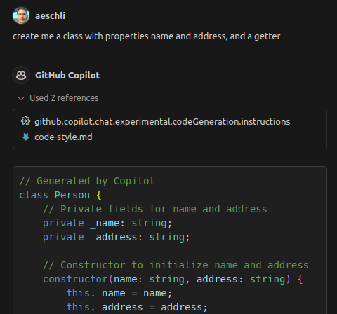

# August 2024 (version 1.93)

**Update 1.93.1**: The update addresses these [issues](https://github.com/microsoft/vscode/issues?q=is%3Aissue+milestone%3A%22August+2024+Recovery+1%22+is%3Aclosed).

<!-- DOWNLOAD_LINKS_PLACEHOLDER -->

---

Welcome to the August 2024 release of Visual Studio Code. There are many updates in this version that we hope you'll like, some of the key highlights include:

* [Profiles editor](#new-profiles-editor) - Switch and manage your profiles from a single place.
* [Django unit test support](#django-unit-test-support) - Discover and run Django unit tests from the Test Explorer.
* [IntelliSense on vscode.dev](#full-project-intellisense-and-package-typings-on-vscodedev) - Boost your JS & TS coding in vscode.dev with IntelliSense.
* [Notebook diff viewer](#show-or-hide-unchanged-cells-in-the-diff-view) - Efficiently review changes in notebooks by collapsing unchanged cells.
* [Resize columns via the keyboard](#resize-table-columns-via-the-keyboard) - Resizing table columns in VS Code more accessible via keyboard.
* [Source Control Graph](#source-control-graph-view) - Easily hide, collapse, or move the Source Control Graph.
* [GitHub Copilot](#github-copilot-override) - Add context in Quick Chat, improved test generation and chat history.
* [Experiment: Custom Copilot instructions](#code-generation-instructions) - Define specific code-generation instructions for Copilot.

>If you'd like to read these release notes online, go to [Updates](https://code.visualstudio.com/updates) on [code.visualstudio.com](https://code.visualstudio.com).
**Insiders:** Want to try new features as soon as possible? You can download the nightly [Insiders](https://code.visualstudio.com/insiders) build and try the latest updates as soon as they are available.

## Accessibility

<h3 id="resize-table-columns-via-the-keyboard">Resize table columns via the keyboard<div id="_resize-table-columns-via-the-keyboard"/></h3>

A new command, `list.resizeColumn`, enables you to resize columns by using the keyboard. When you trigger this command, select the column you want to resize and provide a percentage of the width you want to set. The following video shows how to apply this to resize a column in the Keyboard Shortcuts editor.

<video src="images/1_93/resize-columns.mp4" title="Resize columns in the Keyboard Shortcuts editor via the keyboard." autoplay loop controls muted></video>

### Screen reader support for synthesizing chat responses

We've updated the <a href="vscode://settings/accessibility.voice.autoSynthesize" codesetting="true">`accessibility.voice.autoSynthesize`</a> setting to enable screen reader users to opt in to hearing chat responses announced by our synthesizer, instead of getting aria alerts.

### Debugging improvements

When you're debugging with the focus in an editor, invoking the **Debug: Add to Watch** command now announces the variable's value for screen reader users.

Additionally, the Debug accessibility help dialog was improved for better thoroughness.

## Workbench

<h3 id="new-profiles-editor">New Profiles editor<div id="_new-profiles-editor"/></h3>

The new Profiles editor is now generally available for all in Visual Studio Code. The new Profiles editor enables you to manage profiles from a single place. This experience includes creating new profiles, editing and deleting existing profiles, and importing and exporting profiles to share with others. For more information, see the [Profiles documentation](https://code.visualstudio.com/docs/editor/customizing/profiles).


### Linux support for window control overlays

A new setting <a href="vscode://settings/window.experimentalControlOverlay" codesetting="true">`window.experimentalControlOverlay`</a> enables native window controls to appear, even when a custom title bar is enabled via the <a href="vscode://settings/window.titleBarStyle" codesetting="true">`window.titleBarStyle`</a> setting.


Out of the box, we have not yet enabled the custom title by default on Linux, but we plan to do so eventually. Once you turn on a custom title, native window control overlays will appear automatically. We welcome any feedback you find when using this new feature!

### Comments sorting

Comments can now be sorted by their position in the file or by date.


### Copy settings URL from Settings editor

You can copy a direct URL to a specific setting from the Settings editor. When you navigate to the settings URL, it opens VS Code and focuses the corresponding setting in the Settings editor.


### Reverse sort in Explorer

We added an additional sort option, <a href="vscode://settings/explorer.sortOrderReverse" codesetting="true">`explorer.sortOrderReverse`</a>, which enables you to reverse any of the various Explorer sort configurations, providing further sorting flexibility.

## Editor

### Lightbulb improvements

In the previous milestone, we improved the location where the Code Actions lightbulb icon is shown. We've now decided to set <a href="vscode://settings/editor.lightbulb.enabled" codesetting="true">`editor.lightbulb.enabled`</a> to `onCode` by default. This means that the lightbulb icon is only shown when the cursor is on lines with source code and will show up less frequently.

### Color theming for action lists

The color of the action list control, such as the Code Action menu, can be configured by themes with the `editorActionList.background`, `editorActionList.foreground`, `editorActionList.focusForeground`, and `editorActionList.focusBackground` keys. By default, the action list control theme matches that of the Quick Pick and Command Palette. Get more info about [customizing a color theme](https://code.visualstudio.com/docs/getstarted/themes#_customize-a-color-theme).

<h2 id="github-copilot-override"><div id="_github-copilot-override"/></h2>

## GitHub Copilot

This milestone, we continued to improve the GitHub Copilot experience in VS Code, across the editor, the Chat view, and inline Chat. We've also added several experimental features for you to try and for which we'd like to get your feedback.

### Improved test generation

With GitHub Copilot, you can generate tests for your code, either by using the **Generate Tests using Copilot** action in the editor content menu, or by using the `/tests` slash command in inline Chat.

We improved the test generation flow by looking for an existing test file and generating the new tests into that file, appending them at the end. If there isn't a test file yet, Copilot creates a new test file for the generated tests.

<video src="images/1_93/generate-tests-opens-editor.mp4" title="Generating tests with Copilot opens a new editor." autoplay loop controls muted></video>

### Renamed Code Actions for generating tests and documentation

When you place the cursor on an identifier, such as a method name, GitHub Copilot gives you Code Actions to generate tests or documentation. To better reflect their purpose, we renamed these Code Actions to **Generate Tests using Copilot** and **Generate Documentation using Copilot**. Previously, these were called *Test using Copilot* and *Document using Copilot*.


### Improved chat history

You can open previous chat sessions from the chat history with the **Show Chats** button at the top of the Chat view. These sessions now have a more user-friendly, AI-generated name. You can also rename sessions manually by selecting the pencil icon on each row.

These chat history entries are now also sorted by the date of their last request, and are labeled and grouped by date buckets.


> Note: Only new chat sessions get the AI-generated name, any chat sessions that you already had won't be renamed.

### Save chat sessions for empty windows

Previously, VS Code wasn't saving chat sessions for empty windows (that don't have a folder or workspace open). Now, these sessions are saved as expected, and previous chats from an empty window can be loaded via the **Show Chats** button.

> **Note**: You should avoid opening and using the same chat session in multiple empty windows simultaneously.

### Attach context in Quick Chat

When using Quick Chat, you can now use the `Attach Context` action to attach context like files and symbol to your Copilot request.

<video src="images/1_93/attach-context-quick-chat.mp4" title="Attach context in Quick Chat." autoplay loop controls muted></video>

### Thumbs down feedback details

Did you get a response from Copilot Chat that wasn't what you expected? Help us out by selecting the **Thumbs down** button on the toolbar for a chat response. Now, it shows a dropdown with a few detailed options for you to describe the issue. You can also open the issue reporter from this menu.


<h3 id="code-generation-instructions">Code generation instructions (Experimental)<div id="_code-generation-instructions"/></h3>

**Setting**: <a href="vscode://settings/github.copilot.chat.experimental.codeGeneration.instructions" codesetting="true">`github.copilot.chat.experimental.codeGeneration.instructions`</a>

Copilot can help you generate code, for example as part of a refactoring, generating unit tests, or implementing a feature. And you might have specific libraries you want to use, or a particular coding style you want to follow for the code that Copilot generates.

The experimental setting <a href="vscode://settings/github.copilot.chat.experimental.codeGeneration.instructions" codesetting="true">`github.copilot.chat.experimental.codeGeneration.instructions`</a> lets you define a set of instructions that are added to every Copilot request that generates code.

The instructions can be defined in the User or Workspace [settings](https://code.visualstudio.com/docs/getstarted/settings) but can also be imported from a file.

The following code snippet shows how to define a set of instructions from both settings and an external file:

```json
  "github.copilot.chat.experimental.codeGeneration.instructions": [
    {
      "text": "Always add a comment: 'Generated by Copilot'."
    },
    {
      "text": "In TypeScript always use underscore for private field names."
    },
    {
      "file": "code-style.md" // import instructions from file `code-style.md`
    }
  ],
```

Content of `myProject/code-style.md`:

```markdown
Always use React functional components.
Always add comments.
```

In the screenshot, you can see from the references section that the instructions were used:



### Automatic chat participant detection in Chat view (Experimental)

**Setting**: <a href="vscode://settings/chat.experimental.detectParticipant.enabled" codesetting="true">`chat.experimental.detectParticipant.enabled`</a>

GitHub Copilot has several built-in chat participants, such as `@workspace`, which also contribute commands to the Chat view. Previously, you had to explicitly specify the chat participant and command in a chat prompt.

To make it easier to use chat participants with natural language, in the coming weeks, we're experimenting with enabling Copilot Chat to automatically route your question to a suitable participant or chat command.


If the automatically selected participant is not appropriate for your question, you can select the **rerun without** link at the top of the chat response to resend your question to Copilot.

### Use recent coding files as Inline Chat context (Experimental)

**Setting**: <a href="vscode://settings/github.copilot.chat.experimental.temporalContext.enabled" codesetting="true">`github.copilot.chat.experimental.temporalContext.enabled`</a>

Often, when you're prompting Copilot, you're asking a question related to code you were just working on or looking at. Inline Chat can now use recently seen or edited code as context to provide more relevant suggestions.

This functionality is still experimental but also good to be tested by everyone.

### Use current editor line as inline Chat prompt (Experimental)

**Setting**: <a href="vscode://settings/github.copilot.config.experimental.inlineChatCompletionTrigger.enabled" codesetting="true">`github.copilot.config.experimental.inlineChatCompletionTrigger.enabled`</a>

Instead of first opening inline Chat and then entering your chat prompt, you can now start typing in the editor and use the contents of the current line directly as the prompt for inline Chat. And for an even smoother chat experience, Copilot can detect when you're prompting instead of writing code, and then automatically start inline Chat for you.

The different ways in which you can use the current line as your prompt for inline Chat are the following:

* Enter **Inline Chat: Start in Editor with Current Line** from the **Command Palette** (`kb(workbench.action.showCommands)`)
* Configure a keybinding for the **inlineChat.startWithCurrentLine** command, combine it with the `inlineChatExpansion` context key
* Enable the <a href="vscode://settings/github.copilot.config.experimental.inlineChatCompletionTrigger.enabled" codesetting="true">`github.copilot.config.experimental.inlineChatCompletionTrigger.enabled`</a> setting, so that Copilot detects that the current line has mostly text instead of source code, and then starts inline Chat.

The following video shows how Copilot suggests starting inline Chat after it detects that there's mostly text on the current line.

<video src="images/1_93/inline-with-line.mp4" title="Start Inline Chat via Completions" autoplay loop controls muted></video>

### Start debugging from Chat (Experimental)

**Setting**: <a href="vscode://settings/github.copilot.advanced.startDebugging.experimental.enabled" codesetting="true">`github.copilot.advanced.startDebugging.experimental.enabled`</a>

A new experimental slash command, `/startDebugging`, is available on the `@vscode` chat participant. This command enables you to create a launch configuration and start debugging your app.

You can also access this command through the **Generate Debug Configuration with GitHub Copilot** option in the Create a launch.json Quick Pick.


### Generate tests based on test coverage (Experimental)

**Setting**: <a href="vscode://settings/github.copilot.chat.experimental.generateTests.codeLens" codesetting="true">`github.copilot.chat.experimental.generateTests.codeLens`</a>

If test coverage information is available, GitHub Copilot can offer a CodeLens **Generate tests using Copilot** for functions and methods that are not yet covered by tests.

<video src="images/1_93/generate-tests-code-lens.mp4" title="Generating tests with Copilot opens a new editor." autoplay loop controls muted></video>

## Languages

### Renamed "SQL" to "MS SQL"

The language name for SQL files has been renamed from "SQL" to "MS SQL" to better reflect the language's focus on Microsoft SQL Server (T-SQL) syntax. The file extension for this language mode is still `.sql` and the syntax highlighting remains unchanged.

<h3 id="full-project-intellisense-and-package-typings-on-vscodedev">Full project Intellisense and package typings on vscode.dev<div id="_full-project-intellisense-and-package-typings-on-vscodedev"/></h3>

Working with JavaScript and TypeScript on [VS Code for the Web](https://vscode.dev) just got a whole lot better. To start off, we've implemented package IntelliSense, so you can see suggestions and documentation from any imported package, such as `react`. This works much like it does in the desktop version of VS Code.


In TypeScript files, we offer IntelliSense for packages listed in your `package.json`. JavaScript files are a little more flexible and use [automatic type acquisition](https://code.visualstudio.com/docs/nodejs/working-with-javascript#_typings-and-automatic-type-acquisition), which offers IntelliSense for any package imported into the current file, even if it's not listed in the `package.json`.

Thanks to package IntelliSense, we've also enabled full project IntelliSense for JavaScript and TypeScript projects. This greatly improves navigation through code, letting you correctly **Go to Definition** and **Find All References** to any symbol in your project. It also enables type error reporting. We now even support auto-imports while writing code.


Package typings and full project IntelliSense are supported in Chrome, Microsoft Edge, and Firefox. Safari is not yet supported, as it does not implement [`ReadableByteStreamController`](https://developer.mozilla.org/en-US/docs/Web/API/ReadableByteStreamController).

## Source Control

<h3 id="source-control-graph-view">Source Control Graph view<div id="_source-control-graph-view"/></h3>

Based on user feedback, we have moved the history graph that was enabled last milestone from the Source Control view into a new view called **Source Control Graph**. This reduces the information overload from the main view and enables you to hide/collapse/move the new view as you see fit. This also lays the foundation for a full-featured history graph.

The Source Control Graph view currently shows the remote/base for the current branch. In the next milestone, we are working on adding the capability to filter the graph to any repository reference, and improving the experience for workspaces with multiple repositories.


_Theme: [GitHub Sharp](https://marketplace.visualstudio.com/items?itemName=joaomoreno.github-sharp-theme) (preview on [vscode.dev](https://vscode.dev/editor/theme/joaomoreno.github-sharp-theme))_

### Support for reftable format

[Git 2.45](https://github.blog/open-source/git/highlights-from-git-2-45/#preliminary-reftable-support) added preliminary support for the new reference storage backend called "reftable". This milestone, we updated the built-in Git extension to support this new reference storage backend.

Using Git 2.45, you can either create or clone a repository that uses the new reference storage backend with the `--ref-format=reftable` flag. Git 2.46 also added support for migrating an existing repository to use the new reference storage format by using the [`git refs migrate`](https://git-scm.com/docs/git-refs/2.46.0) command.

Please note that the new reference storage backend is still considered experimental.

### Compact folders setting

Thanks to a community contribution, we have added a new setting, <a href="vscode://settings/scm.compactFolders" codesetting="true">`scm.compactFolders`</a>, to control whether folders are rendered in compact form in the Source Control view when changes are viewed as a tree.

## Terminal

### Julia and NuShell support

There's now shell integration support for Julia and NuShell. This enables features such as [command decorations](https://code.visualstudio.com/docs/terminal/shell-integration#_command-decorations-and-the-overview-ruler) and [run recent command](https://code.visualstudio.com/docs/terminal/shell-integration#_run-recent-command) for these shell types.

### Move multiple terminal tabs

You can now multi-select terminal tabs and move them around the list of terminals as an ordered group.

### Command guide setting and color theming

The command guide is a bar that shows up beside a command and its output when hovered. You can now disable the [command guide](https://code.visualstudio.com/docs/terminal/shell-integration#_command-guide) with the <a href="vscode://settings/terminal.integrated.shellIntegration.showCommandGuide" codesetting="true">`terminal.integrated.shellIntegration.showCommandGuide`</a> setting and the color can be configured by themes with the `terminalCommandGuide.foreground` theme key.

## Notebooks

<h3 id="show-or-hide-unchanged-cells-in-the-diff-view">Show or hide unchanged cells in the diff view<div id="_show-or-hide-unchanged-cells-in-the-diff-view"/></h3>

The notebook diff view now hides unchanged cells, which enables you to focus on the changed cells.
At the same time, the input of all unchanged cells is always collapsed.

<video src="images/1_93/notebook_diff_unchanged.mp4" title="Notebook diff editor hides unchanged regions." autoplay loop controls muted></video>

### Manage whitespace in the diff view

The notebook diff view now respects the following setting:

* <a href="vscode://settings/diffEditor.ignoreTrimWhitespace" codesetting="true">`diffEditor.ignoreTrimWhitespace`</a> - Ignore leading and trailing (trim) whitespace when showing differences.

<video src="images/1_93/notebook_diff_whitespace.mp4" title="Notebook diff editor ignores leading and trailing whitespace." autoplay loop controls muted></video>

### Sticky Scrolling for Notebook execution count

The execution count of a code cell now sticks to the bottom of the screen when scrolling down a code cell. This makes it easier to see the execution state and update when working in a long code cell.

<video src="images/1_93/notebook_execution_count_sticky_scroll.mp4" title="Notebook execution count remain visible during scrolling" autoplay loop controls muted></video>

## Tasks

### Keep task terminal open on process exit

If a task's terminal process exits with a nonzero code, we now keep the terminal open for easier debugging.

## Debug

### Jump to variable definition

Debug extensions can now link variables and expressions to locations in your code. Data with this link are `kbstyle(Ctrl)`-selectable (`kbstyle(Cmd)`-selectable on macOS) in the Variables view, Watch view, and Debug Console.

The built-in JavaScript debugger will link locations of functions defined in your code¸ Other debug extensions need to adopt the corresponding protocol change to enable this feature.

### Find control

You can now open the Find control in the Debug Console (`kb(repl.action.find)`) to search for results in the input. Support for searching results in the output will be investigated in future milestones.

You can also access the control via the action `Debug Console: Focus Find` that appears on the Debug Console's toolbar to the right of the Filter control.

### Launch config input cache

[Input variables](https://code.visualstudio.com/docs/editor/variables-reference#_input-variables) used in launch configurations and tasks now persist their last entered value to ease the process of rerunning debug sessions that depend on them. This is only done if there is no explicit `default` defined on the input.

### JavaScript Debugger

#### Experimental Network view

The JavaScript debugger now includes a basic, experimental Network view that is available when the <a href="vscode://settings/debug.javascript.enableNetworkView" codesetting="true">`debug.javascript.enableNetworkView`</a> setting is turned on. The view displays information about requests and responses made by browser sessions.


_Theme: [Codesong](https://marketplace.visualstudio.com/items?itemName=connor4312.codesong) (preview on [vscode.dev](https://vscode.dev/editor/theme/connor4312.codesong))_

The Network view also works for Node.js 22.6.0 and above when the process is launched with [`--experimental-network-inspection`](https://nodejs.org/en/blog/release/v22.6.0#experimental-network-inspection-support-in-nodejs) in its arguments, such as by adding `"runtimeArgs": ["--experimental-network-inspection"]` into a `node` launch configuration.

> **Note**: Node's implementation of networking is still very early and most data around requests and responses is not yet available.

## Testing

### Support for stack traces on messages

Testing extensions can now associate a stack trace with test failures. When they do, you'll see the code around each frame of the call stack in the Test Results view and in error peeks. You can `kbstyle(Ctrl)`-select (`kbstyle(Cmd)`-select on macOS) on code in the views to go to their original locations, or use the **Go to File** action on their headers.


_Theme: [Codesong](https://marketplace.visualstudio.com/items?itemName=connor4312.codesong) (preview on [vscode.dev](https://vscode.dev/editor/theme/connor4312.codesong))_

## Installer

The Debian package now prompts you to confirm whether you want to add the [packages.microsoft.com](https://packages.microsoft.com) repository. This enables you to update the package afterwards by using apt.


## Remote Development

The [Remote Development extensions](https://marketplace.visualstudio.com/items?itemName=ms-vscode-remote.vscode-remote-extensionpack), allow you to use a [Dev Container](https://code.visualstudio.com/docs/devcontainers/containers), remote machine via SSH or [Remote Tunnels](https://code.visualstudio.com/docs/remote/tunnels), or the [Windows Subsystem for Linux](https://learn.microsoft.com/windows/wsl) (WSL) as a full-featured development environment.

Highlights include:

- Optional paths for Dev Container Templates
- Expanded compatibility for remote OSes with SSH

You can learn more about these features in the [Remote Development release notes](https://github.com/microsoft/vscode-docs/blob/main/remote-release-notes/v1_93.md).

## VS Code for the Web

The <a href="vscode://settings/git.openDiffOnClick" codesetting="true">`git.openDiffOnClick`</a> setting is now honored when browsing a GitHub repository on [https://vscode.dev](https://vscode.dev) or on the desktop with the [GitHub Repositories extension](https://marketplace.visualstudio.com/items?itemName=GitHub.remotehub).


## Contributions to extensions

### Python

<h4 id="django-unit-test-support">Django unit test support<div id="_django-unit-test-support"/></h4>

We are excited to announce support for one of our most [requested features](https://github.com/microsoft/vscode-python/issues/73): you can now  discover and run Django unit tests through the Test Explorer! For set up instructions on how to enable this functionality, [check our documentation](https://code.visualstudio.com/docs/python/testing#_django-unit-tests).


_Theme: [Catppuccin Macchiato](https://marketplace.visualstudio.com/items?itemName=Catppuccin.catppuccin-vsc) (preview on [vscode.dev](https://vscode.dev/editor/theme/Catppuccin.catppuccin-vsc/Catppuccin%20Macchiato))_

As you explore this newly added feature, please provide feedback and report any issues in our [vscode-python repo](https://github.com/microsoft/vscode-python/issues) or by using the **Python: Report Issue** command.

#### Native REPL improvements

We made more improvements and bug fixes to the new Native REPL experience. We are rolling out the native REPL as the default target for [Smart Send](https://devblogs.microsoft.com/python/python-in-visual-studio-code-november-2023-release/#improvements-to-shift-enter-run-line-in-terminal) as an experiment, but if you are interested in trying this out, you can set <a href="vscode://settings/python.REPL.sendToNativeREPL" codesetting="true">`python.REPL.sendToNativeREPL`</a> in your User `settings.json` and reload your VS Code window.

#### Go to definition from inlay hints with Pylance

When [inlay hints are enabled](https://code.visualstudio.com/docs/python/settings-reference#_intellisense-engine-settings) with Pylance, you can now more conveniently navigate to a type's definition by hovering over it and clicking while holding `kbstyle(Ctrl)` (`kbstyle(Cmd)` on macOS):


#### Restart support when debugging tests

You can now restart the debugger when debugging tests through the Debug toolbar control.

### GitHub Pull Requests and Issues

There has been more progress on the [GitHub Pull Requests](https://marketplace.visualstudio.com/items?itemName=GitHub.vscode-pull-request-github) extension, which enables you to work on, create, and manage pull requests and issues. Review the [changelog for the 0.96.0](https://github.com/microsoft/vscode-pull-request-github/blob/main/CHANGELOG.md#0960) release of the extension to learn about the highlights.

## Extension authoring

### Impact of EcmaScript Module (ESM) Loading of VS Code

We are in the process of changing how our code is loaded in VS Code core, away from AMD/CommonJS to ESM. Extensions will continue to load as CommonJS, but this change comes with change to the `require` method: Specifically, `require.main` will be `undefined` beginning with our `1.94` release. If you have a usecase for accessing a file from the installation, please consider `vscode.env.appRoot` instead or [reach out to us](https://github.com/microsoft/vscode/issues).

### Terminal shell integration API

The terminal shell integration API is now available to use. This powerful API enables an extension to listen to commands run in terminals, read their raw output, exit code, and command lines.

```ts
window.onDidEndTerminalShellExecution(event => {
    if (event.execution.commandLine.value.startsWith('git')) {
        if (event.exitCode === 0) {
            // React to a successful git command
        } else {
            // React to a failing git command
        }
    }
});
```

It also provides a more reliable way to execute a command, which will wait for a prompt to start before sending the command, preventing the command to be echoed to the terminal an extra time.

```ts
const commandLine = 'echo "Hello world"';
if (term.shellIntegration) {
    const execution = shellIntegration.executeCommand({ commandLine });
    window.onDidEndTerminalShellExecution(event => {
        if (event.execution === execution) {
            console.log(`Command exited with code ${event.exitCode}`);
        }
    });
} else {
    term.sendText(commandLine);
    // Without shell integration, we can't know when the command has finished or what the
    // exit code was.
}
```

See the API in `vscode.d.ts` and the [extension sample](https://github.com/microsoft/vscode-extension-samples/tree/main/shell-integration-sample) for more information.

- [`Terminal.shellIntegration`](https://github.com/microsoft/vscode/blob/f0417069c62e20f3667506f4b7e53ca0004b4e3e/src/vscode-dts/vscode.d.ts#L7334-L7344)
- [`window.onDidChangeTerminalShellIntegration`](https://github.com/microsoft/vscode/blob/f0417069c62e20f3667506f4b7e53ca0004b4e3e/src/vscode-dts/vscode.d.ts#L10777-L10780)
- [`window.onDidStartTerminalShellExecution`](https://github.com/microsoft/vscode/blob/f0417069c62e20f3667506f4b7e53ca0004b4e3e/src/vscode-dts/vscode.d.ts#L10782-L10787)
- [`window.onDidEndTerminalShellExecution`](https://github.com/microsoft/vscode/blob/f0417069c62e20f3667506f4b7e53ca0004b4e3e/src/vscode-dts/vscode.d.ts#L10789-L10794)

### Authentication account API

The authentication APIs now have more control when handling multiple accounts. Something that has always been missing is the ability to get all accounts and get an `AuthenticationSession` for a specific account. That is now possible with the finalization of the `getAccounts` API.

Extension authors looking to consume authentication sessions can run the following code to get the `AuthenticationSessionAccountInformation` of the accounts that the user is logged into:

```ts
const accounts = vscode.authentication.getAccounts('microsoft');
```

From there, you can use those accounts to mint sessions specifically for those accounts:

```ts
const session = vscode.authentication.getSession('microsoft', scopes, { account: accounts[0] })
```

> **Note**: For this to work, the authentication provider needs to handle a parameter that is passed in to both `getSessions` and `createSession`. The built-in GitHub and Microsoft providers have already adopted this.

We believe that this is the clearest way to handle multiple authentication sessions and also handle various scenarios that we couldn't support before.

## Debug Adapter Protocol

We added `locationReferences` to Variables and other data types in the [Debug Adapter Protocol](https://microsoft.github.io/debug-adapter-protocol), to enable associating a source location.

## WebAssemblies in VS Code

The 1.0 versions of the `wasm-wasi-core` extension together with the `@vscode-wasm-wasi` and `@vscode/wasm-component-model` npm modules have been released. Usage samples can be found in the [vscode-extension-samples](https://github.com/microsoft/vscode-extension-samples) repository in the `wasm-*` sub folders. There are also several posts about how to use WebAssembly code inside a VS Code extension on the [VS Code blog](https://code.visualstudio.com/blogs).

## Preview Features

### Terminal IntelliSense improvements

[Experimental PowerShell IntelliSense](https://code.visualstudio.com/docs/terminal/shell-integration#_experimental-intellisense-for-powershell) got the following improvements this release:

- `git checkout` now includes a completion for `-` to switch to the previous branch.
- The default value for `terminal.integrated.suggest.runOnEnter` is now set to ignore, which means `kbstyle(Enter)` does not interact at all with IntelliSense. This was feedback from users who found the impact on muscle memory too disruptive.
- PowerShell keywords are now available as completions for the command (not args).
- The `cd` first directory suggestion is now always itself, which makes things smoother when `terminal.integrated.suggest.runOnEnter` is set.
  
- Suggestions are more consistent now when requested at different positions on the command line.
- A completion is provided for `<path>/../` when navigating back directories.
  

### Conpty shipping in product

Conpty is the backend for the terminal that emulates how pseudoterminals work on other operating systems. This component is shipped in Windows itself, which means that bug fixes are released via Windows Update. Users might end up waiting a long time for these fixes to arrive.

This release, we have an experimental setting that bundles conpty with VS Code itself, similar to how Windows Terminal does it. This means that users can get bug fixes as we ship updates to VS Code instead of waiting on Windows updates.

To enable this, set the following setting to `true`:

```json
"terminal.integrated.experimental.windowsUseConptyDll": true
```

The type of improvements you should expect for enabling this are:

- Better performance
- More reliable shell integration
- More escape sequence support (for example [sixel](https://en.wikipedia.org/wiki/Sixel) support on Windows soon)

The only currently known issue is that some users have a process that sticks around and blocks VS Code updates ([microsoft/vscode#225719](https://github.com/microsoft/vscode/issues/225719)), which requires manually killing the process to enable updates.

### TypeScript 5.6 support

We continued improving our support for the upcoming TypeScript 5.6 release. Check out the [TypeScript 5.6 RC blog post](https://devblogs.microsoft.com/typescript/announcing-typescript-5-6-rc/) for details on what this release includes.

To start using preview builds of TypeScript 5.6, install the [TypeScript Nightly extension](https://marketplace.visualstudio.com/items?itemName=ms-vscode.vscode-typescript-next).

### New Issue Reporter implementation

This milestone, we are experimenting with a new implementation of the Issue Reporter. The functionality remains the same, but there should be a few improvements, such as improved multi-monitor support, and the availability of the Issue Reporter in VS Code for the Web.

The new version of the Issue Reporter is enabled by default and can be configured with the <a href="vscode://settings/issueReporter.experimental.auxWindow" codesetting="true">`issueReporter.experimental.auxWindow`</a> setting in desktop versions of VS Code.

## Proposed APIs

### Tools for language models

We continue to iterate on our `LanguageModelTool` API. The API comes with two major parts:

1. The ability for extensions to register a *tool*. A tool is a piece of functionality that is meant to be used by language models. For example, reading the Git history of a file.

2. The mechanics for language models to support tools, such as extensions passing tools when making a request, language models requesting a tool invocation, and extensions communicating back the result of a tool invocation.

One of the changes this month adds is the ability for the user to manually attach certain tools to their chat request. An example of this would be for a tool that computes some dynamic context that the user wants to use in their request.

The proposal can be found as [vscode.proposed.lmTools.d.ts](https://github.com/microsoft/vscode/blob/main/src/vscode-dts/vscode.proposed.lmTools.d.ts). Check out the [`tool-user` sample extension](https://github.com/microsoft/vscode-extension-samples/tree/roblou/tool-user) that demonstrates registering and calling tools.

Watch [issue #213274](https://github.com/microsoft/vscode/issues/213274) for updates or to give us feedback.

> **Note**: The API is still under active development, and things will change.

### Testing enhancements

#### Associate code to tests

We're working on an API that enables an extension to associate code to tests, and vice versa. This lets users jump between both, and enables actions, such as **Run Tests at Cursor**, to also work in implementation code. We anticipate building more experiences as the API develops.

Check out [vscode#126932](https://github.com/microsoft/vscode/issues/126932#issuecomment-2243510427) for more information and updates.

#### Attributable test coverage

We're working on an API for attributing test coverage on a per-test basis. This enables users to see which tests ran which code, filtering both the coverage shown in the editor, and that in the **Test Coverage** view.

Check out [vscode#212196](https://github.com/microsoft/vscode/issues/212196) for more information and updates.

### Chat participant detection API

If you're authoring an extension that contributes participants or chat commands to the Chat view, you can enable your participants and commands to be automatically detected by adding metadata to your `chatParticipants` contribution in `package.json`. We have updated the `vscode-extension-samples` repo with [examples](https://github.com/microsoft/vscode-extension-samples/blob/d4c646fa3cf6d8ca060aa6c7806c0543d0011de8/chat-sample/package.json#L27-L57) of how you can adopt this API. When testing, be sure to set <a href="vscode://settings/chat.experimental.detectParticipant.enabled" codesetting="true">`chat.experimental.detectParticipant.enabled`</a>. Please note that this is a proposed API that is subject to change.

## Website

We have fixed several links under the [VS Code API](https://code.visualstudio.com/api/references/vscode-api) page. Links to generic types and functions work again, and primitive types and values aren't formatted as links anymore!

## Engineering

### Progress on using ESM for VS Code

During this milestone, we completed most of the work to adopt ESM for VS Code Core. Our goal is to use ECMAScript Modules (ESM) loading and drop AMD entirely. We will start to release ESM-enabled Insider builds in September and plan to ship ESM to Stable for our next release in October.

Our plan for releasing ESM is captured in https://github.com/microsoft/vscode/issues/226260.

## Notable fixes

## Thank you

Last but certainly not least, a big _**Thank You**_ to the contributors of VS Code.

### Issue tracking

Contributions to our issue tracking:

* [@gjsjohnmurray (John Murray)](https://github.com/gjsjohnmurray)
* [@IllusionMH (Andrii Dieiev)](https://github.com/IllusionMH)
* [@RedCMD (RedCMD)](https://github.com/RedCMD)
* [@albertosantini (Alberto Santini)](https://github.com/albertosantini)

### Pull requests

Contributions to `vscode`:

* [@akinomyoga (Koichi Murase)](https://github.com/akinomyoga): Fix Bash integration clobbering `$?` for PROMPT_COMMAND [PR #226929](https://github.com/microsoft/vscode/pull/226929)
* [@andrewbranch (Andrew Branch)](https://github.com/andrewbranch): \[typescript-language-features\] Add autoImportSpecifierExcludeRegexes preference [PR #226202](https://github.com/microsoft/vscode/pull/226202)
* [@anton-matosov (Anton Matosov)](https://github.com/anton-matosov): A followup to #171066 fixing zsh and fish shells implementations [PR #223421](https://github.com/microsoft/vscode/pull/223421)
* [@arvid220u (Arvid Lunnemark)](https://github.com/arvid220u): Never run cleared auxwindow timeouts [PR #221296](https://github.com/microsoft/vscode/pull/221296)
* [@BABA983 (BABA)](https://github.com/BABA983)
  * Remove duplicate code [PR #224091](https://github.com/microsoft/vscode/pull/224091)
  * Respect the original terminal tab order after drag multiple tabs [PR #224591](https://github.com/microsoft/vscode/pull/224591)
  * Add registerWindowTitleVariable command [PR #225408](https://github.com/microsoft/vscode/pull/225408)
* [@bsShoham (Shoham Ben Shitrit)](https://github.com/bsShoham): Trigger chat variable completion on word start [PR #224174](https://github.com/microsoft/vscode/pull/224174)
* [@Cecil0o0 (hj)](https://github.com/Cecil0o0): refactor: merge same namespace declaration [PR #219638](https://github.com/microsoft/vscode/pull/219638)
* [@CGNonofr (Loïc Mangeonjean)](https://github.com/CGNonofr): Properly detect node env everywhere [PR #221357](https://github.com/microsoft/vscode/pull/221357)
* [@cobey (Cody Beyer)](https://github.com/cobey): adding ai-inference tags for python and js [PR #225098](https://github.com/microsoft/vscode/pull/225098)
* [@dangerman (Anees Ahee)](https://github.com/dangerman)
  * Fix missing "Restart TS Server" command in Command Palette [PR #223433](https://github.com/microsoft/vscode/pull/223433)
  * Round off notification focus outlines [PR #225824](https://github.com/microsoft/vscode/pull/225824)
* [@Flanker32 (Hanxiao Liu)](https://github.com/Flanker32): Update workspace tagging for java ai libraries [PR #223677](https://github.com/microsoft/vscode/pull/223677)
* [@gabritto (Gabriela Araujo Britto)](https://github.com/gabritto)
  * \[typescript-language-features\] Use commit characters from tsserver when available [PR #223541](https://github.com/microsoft/vscode/pull/223541)
  * \[typescript-language-features\] fix diagnostics telemetry property name [PR #225079](https://github.com/microsoft/vscode/pull/225079)
* [@gjsjohnmurray (John Murray)](https://github.com/gjsjohnmurray)
  * Show readonly filename decoration after revert that also resets mtime (fix #221014) [PR #221023](https://github.com/microsoft/vscode/pull/221023)
  * Fix bad capitalization of completion item statusbar texts (#225429) [PR #225431](https://github.com/microsoft/vscode/pull/225431)
  * Improve description of `workbench.editor.enablePreview` setting (fix #225453) [PR #225704](https://github.com/microsoft/vscode/pull/225704)
* [@hron (Aleksei Gusev)](https://github.com/hron): fix: `merge.toggleActiveConflict` as shortcuts [PR #225320](https://github.com/microsoft/vscode/pull/225320)
* [@iisaduan (Isabel Duan)](https://github.com/iisaduan): add settings for typescript's organizeImports to the settings interface [PR #209293](https://github.com/microsoft/vscode/pull/209293)
* [@jeanp413 (Jean Pierre)](https://github.com/jeanp413)
  * Fix search results don't automatically update on editor changes, if I move the Search view to another location [PR #215764](https://github.com/microsoft/vscode/pull/215764)
  * Change terminal rename codicon  [PR #225444](https://github.com/microsoft/vscode/pull/225444)
  * Fix explorer greys out any folder/item with the word "cut" [PR #225455](https://github.com/microsoft/vscode/pull/225455)
* [@Jesscha (JessCha)](https://github.com/Jesscha): Fix typo in extHostExtensionService.ts [PR #224111](https://github.com/microsoft/vscode/pull/224111)
* [@m-byte (Matthias B.)](https://github.com/m-byte): Fix: only add apt sources for users that want them (#22145) [PR #221285](https://github.com/microsoft/vscode/pull/221285)
* [@mkasenberg](https://github.com/mkasenberg): Fix focusResult of Search Editor [PR #205914](https://github.com/microsoft/vscode/pull/205914)
* [@mogelbrod (Victor Hallberg)](https://github.com/mogelbrod): Add "sort by updated at" option to comments panel [PR #221665](https://github.com/microsoft/vscode/pull/221665)
* [@NriotHrreion (Norcleeh)](https://github.com/NriotHrreion): fix: Command palette closes when Active Terminal killed [PR #225500](https://github.com/microsoft/vscode/pull/225500)
* [@r3m0t (Tomer Chachamu)](https://github.com/r3m0t): Fix "Open Workspace Settings" when User Settings is open (fixes #148709) [PR #225311](https://github.com/microsoft/vscode/pull/225311)
* [@rbuckton (Ron Buckton)](https://github.com/rbuckton): Update to support strictBuiltinIteratorReturn [PR #222009](https://github.com/microsoft/vscode/pull/222009)
* [@rehmsen (Ole)](https://github.com/rehmsen): Make regular text in markdown comments wrap in notebook editors. [PR #224484](https://github.com/microsoft/vscode/pull/224484)
* [@RichardLuo0 (RichardLuo)](https://github.com/RichardLuo0): fix: remove tooltips from dialog buttons [PR #225772](https://github.com/microsoft/vscode/pull/225772)
* [@stalematker (Kevin)](https://github.com/stalematker): Fix typo in extensionEnablementService.ts [PR #224145](https://github.com/microsoft/vscode/pull/224145)
* [@swordensen (Michael Sorensen)](https://github.com/swordensen): Fixes #218626 [PR #219148](https://github.com/microsoft/vscode/pull/219148)
* [@thegecko (Rob Moran)](https://github.com/thegecko): Add viewContainer contribution point [PR #212499](https://github.com/microsoft/vscode/pull/212499)
* [@tisilent (xiejialong)](https://github.com/tisilent): Add scm.compactFolders. [PR #221459](https://github.com/microsoft/vscode/pull/221459)
* [@troy351](https://github.com/troy351): fix: multiDiffEditor has wrong background color name [PR #224151](https://github.com/microsoft/vscode/pull/224151)
* [@walter-erquinigo (Walter Erquinigo)](https://github.com/walter-erquinigo): Handle errors from Dynamic Debug Configuration providers [PR #202622](https://github.com/microsoft/vscode/pull/202622)
* [@zkat (Kat Marchán)](https://github.com/zkat): stop AutoInstallerFs from thrashing forevermore and fix typings installer [PR #225648](https://github.com/microsoft/vscode/pull/225648)

Contributions to `vscode-css-languageservice`:

* [@wkillerud (William Killerud)](https://github.com/wkillerud): fix: support for conditional exports in sass's pkg [PR #400](https://github.com/microsoft/vscode-css-languageservice/pull/400)

Contributions to `vscode-eslint`:

* [@denis-sokolov (Denis Sokolov)](https://github.com/denis-sokolov): Trivial fixes in Readme [PR #1903](https://github.com/microsoft/vscode-eslint/pull/1903)

Contributions to `vscode-flake8`:

* [@taesungh (Taesung Hwang)](https://github.com/taesungh): Use global settings for `ignorePatterns` default [PR #327](https://github.com/microsoft/vscode-flake8/pull/327)

Contributions to `vscode-generator-code`:

* [@spjpgrd (seán patrick john paul george ringo doran)](https://github.com/spjpgrd): Update vsc-extension-quickstart.md [PR #486](https://github.com/microsoft/vscode-generator-code/pull/486)

Contributions to `vscode-hexeditor`:

* [@tomilho (Tomás Silva)](https://github.com/tomilho): HexEditor diff  [PR #522](https://github.com/microsoft/vscode-hexeditor/pull/522)

Contributions to `vscode-isort`:

* [@iloveitaly (Michael Bianco)](https://github.com/iloveitaly): fix: add tool path so isort works without bundled version [PR #417](https://github.com/microsoft/vscode-isort/pull/417)
* [@jicruz96 (J.I. Cruz)](https://github.com/jicruz96): Do not log traceback if file has `skip_file` comment [PR #416](https://github.com/microsoft/vscode-isort/pull/416)

Contributions to `vscode-js-profile-visualizer`:

* [@jeanp413 (Jean Pierre)](https://github.com/jeanp413): Fixes [microsoft/vscode#225059](https://github.com/microsoft/vscode/issues/225059) [PR #186](https://github.com/microsoft/vscode-js-profile-visualizer/pull/186)

Contributions to `vscode-json-languageservice`:

* [@jeremyfiel (Jeremy Fiel)](https://github.com/jeremyfiel): update invalid json instance in DocumentSymbols.test.ts [PR #241](https://github.com/microsoft/vscode-json-languageservice/pull/241)
* [@remcohaszing (Remco Haszing)](https://github.com/remcohaszing): Deprecate Thenable and alias to PromiseLike [PR #239](https://github.com/microsoft/vscode-json-languageservice/pull/239)
* [@ttlopes (Tomás Lopes)](https://github.com/ttlopes): Fix microsoft/vscode#209655: fix case-sensitive JSON sorting error [PR #238](https://github.com/microsoft/vscode-json-languageservice/pull/238)

Contributions to `vscode-languageserver-node`:

* [@DavyLandman (Davy Landman)](https://github.com/DavyLandman): Show the error message from the LSP server [PR #1490](https://github.com/microsoft/vscode-languageserver-node/pull/1490)
* [@sh-cho (Seonghyeon Cho)](https://github.com/sh-cho): Fix npm, azure pipeline links [PR #1544](https://github.com/microsoft/vscode-languageserver-node/pull/1544)

Contributions to `vscode-loader`:

* [@SimonSiefke (Simon Siefke)](https://github.com/SimonSiefke): feature: set `amdLoaderGlobal` to `globalThis` in case `this` is not defined [PR #58](https://github.com/microsoft/vscode-loader/pull/58)

Contributions to `vscode-mypy`:

* [@hamirmahal (Hamir Mahal)](https://github.com/hamirmahal)
  * fix: usage of `deprecated` version of `Node.js` [PR #309](https://github.com/microsoft/vscode-mypy/pull/309)
  * fix: usage of `setup-node@v3` in `push-check` [PR #318](https://github.com/microsoft/vscode-mypy/pull/318)
* [@meghprkh (Megh Parikh)](https://github.com/meghprkh): Update mypy to 1.11.0 [PR #311](https://github.com/microsoft/vscode-mypy/pull/311)

Contributions to `vscode-pull-request-github`:

* [@jmg-duarte (José Duarte)](https://github.com/jmg-duarte)
  * Use editor font for diff [PR #6148](https://github.com/microsoft/vscode-pull-request-github/pull/6148)
  * Make code blocks use the editor's font family by default [PR #6149](https://github.com/microsoft/vscode-pull-request-github/pull/6149)

Contributions to `vscode-python-debugger`:

* [@paulacamargo25 (Paula)](https://github.com/paulacamargo25)
  * Fix translation error [PR #411](https://github.com/microsoft/vscode-python-debugger/pull/411)
  * bump release 2024.10 [PR #416](https://github.com/microsoft/vscode-python-debugger/pull/416)
  * bump-dev-version-2024.11 [PR #417](https://github.com/microsoft/vscode-python-debugger/pull/417)
  * Update debugpy version [PR #432](https://github.com/microsoft/vscode-python-debugger/pull/432)

Contributions to `vscode-vsce`:

* [@BlackHole1 (Kevin Cui)](https://github.com/BlackHole1): fix: probabilistic trigger v8 crash [PR #1032](https://github.com/microsoft/vscode-vsce/pull/1032)
* [@mark-wiemer (Mark Wiemer)](https://github.com/mark-wiemer): Fix punycode deprecation warning [PR #1037](https://github.com/microsoft/vscode-vsce/pull/1037)

Contributions to `language-server-protocol`:

* [@asukaminato0721 (Asuka Minato)](https://github.com/asukaminato0721): add egglog [PR #1989](https://github.com/microsoft/language-server-protocol/pull/1989)
* [@LPeter1997](https://github.com/LPeter1997): Added Draco.Lsp as an LSP SDK in .NET [PR #2001](https://github.com/microsoft/language-server-protocol/pull/2001)
* [@marcoroth (Marco Roth)](https://github.com/marcoroth)
  * Add Tailwind Intellisense [PR #1986](https://github.com/microsoft/language-server-protocol/pull/1986)
  * Add Stimulus LSP [PR #1987](https://github.com/microsoft/language-server-protocol/pull/1987)
* [@techee (Jiří Techet)](https://github.com/techee): Add Geany to the list of editors supporting LSP [PR #2008](https://github.com/microsoft/language-server-protocol/pull/2008)
* [@XuechunHHH (Xuechun Hua)](https://github.com/XuechunHHH): Add PartiQL to servers.md [PR #1985](https://github.com/microsoft/language-server-protocol/pull/1985)

Contributions to `python-environment-tools`:

* [@Armd04](https://github.com/Armd04): Changed the order of locaters [PR #136](https://github.com/microsoft/python-environment-tools/pull/136)

<a id="scroll-to-top" role="button" title="Scroll to top" aria-label="scroll to top" href="#"><span class="icon"></span></a>
<link rel="stylesheet" type="text/css" href="css/inproduct_releasenotes.css"/>
