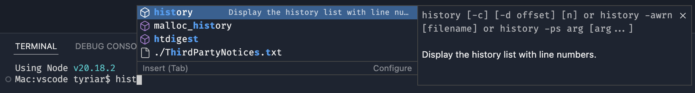
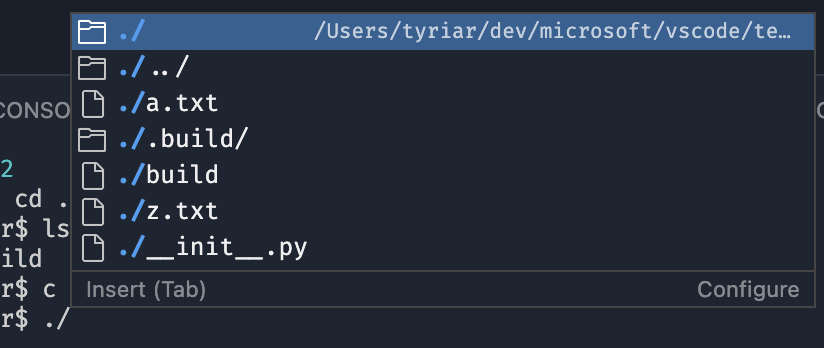
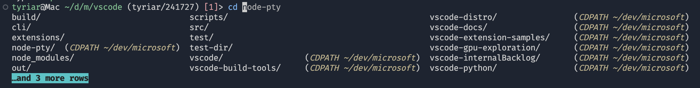
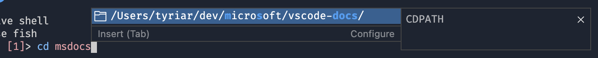
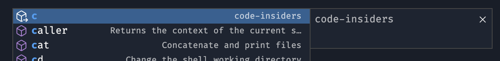

# February 2025 (version 1.98)

<!-- DOWNLOAD_LINKS_PLACEHOLDER -->

---

Welcome to the February 2025 release of Visual Studio Code. There are many updates in this version that we hope you'll like, some of the key highlights include:

* [Highlight](bookmark link) - This is a highlight
* [Highlight](bookmark link) - This is a highlight

>If you'd like to read these release notes online, go to [Updates](https://code.visualstudio.com/updates) on [code.visualstudio.com](https://code.visualstudio.com).
**Insiders:** Want to try new features as soon as possible? You can download the nightly [Insiders](https://code.visualstudio.com/insiders) build and try the latest updates as soon as they are available.

## GitHub Copilot

Copilot features might go through different early access stages, which are typically enabled and configured through settings.

* **Experimental** - view the [experimental features](command:workbench.action.openSettings?%5B%22%40tag%3Aexperimental%20%40ext%3Agithub.copilot-chat%22%5D) (`@tag:experimental`)

	This setting controls a new feature that is actively being developed and may be unstable. It is subject to change or removal.

	Experimental settings that have been modified or added with this release:
	- `setting(chat.agent.enabled)` - Enable _agent mode_ for Copilot Edits
 	- `setting(chat.experimental.statusIndicator.enabled)` - A new central Copilot related Status Bar entry
  - `setting(chat.languageContext.typescript.enabled)` - Enables TypeScript specific context for AI requests in inline chat and `/fix` commands.

* **Preview** - view the [preview features](command:workbench.action.openSettings?%5B%22%40tag%3Apreview%20%40ext%3Agithub.copilot-chat%22%5D) (`@tag:preview`)

	This setting controls a new feature that is still under refinement yet ready to use. Feedback is welcome.

	Preview settings that have been modified or added with this release:
	- `setting(github.copilot.chat.codesearch.enabled)` - More advanced codebase search
	- `setting(github.copilot.nextEditSuggestions.enabled)` - Enable Next Edit Suggestions (Preview)

* **Stable**

  	Other Copilot settings modified or added:
	- `setting(github.copilot.chat.agent.runTasks)` - Agent mode can run your build tasks
	- `setting(chat.renderRelatedFiles)` - Get Copilot Edits suggestions for related files
 	- `setting(github.copilot.advanced.authPermissions)` - Configure smoother auth flows in chat
	- `setting(editor.inlineSuggest.edits.showCollapsed:true)` - Collapsed UI mode for Next Edit Suggestions (Preview)

### Copilot Edits

#### Agent mode improvements (Experimental)

**Setting**: `setting(chat.agent.enabled)`

Last month, we introduced _agent mode_ for Copilot Edits in [VS Code Insiders](https://code.visualstudio.com/insiders/). In agent mode, Copilot can automatically search your workspace for relevant context, edit files, check them for errors, and run terminal commands (with your permission) to complete a task end-to-end.

> **Note**: Agent mode is available today in [VS Code Insiders](https://code.visualstudio.com/insiders/), and we just started rolling it out gradually in **VS Code Stable**. Once agent mode is enabled for you, you will see a mode dropdown in the Copilot Edits view — simply select **Agent**.

We made several improvements to the UX of tool usages this month:

* Terminal commands are now shown inline, so you can keep track of which commands were run.
* You can edit the suggested terminal command in the chat response before running it.
* Confirm a terminal command with the `kb(workbench.action.chat.acceptTool)` shortcut.

<video src="images/1_98/edit-terminal.mp4" title="Editing terminal command" autoplay loop controls muted></video>

Agent mode autonomously searches your codebase for relevant context. Expand the message to see the results of which searches were done.


We've also made various improvements to the prompt and behavior of agent mode:

* The undo and redo actions in chat now undo or redo the last file edit made in a chat response. This is useful for agent mode, as you can now undo certain steps the model took without rolling back the entire chat response.
* Agent mode can now run your build [tasks](https://code.visualstudio.com/docs/editor/tasks) automatically or when instructed to do so. Disable this functionality via the `setting(github.copilot.chat.agent.runTasks)` setting, in the event that you see the model running tasks when it should not.

Learn more about [Copilot Edits agent mode](https://code.visualstudio.com/docs/copilot/copilot-edits#_use-agent-mode-preview) or read the [agent mode announcement blog post](https://code.visualstudio.com/blogs/2025/02/24/introducing-copilot-agent-mode).

> **Note**: If you are a Copilot Business or Enterprise user, an administrator of your organization [must opt in](https://docs.github.com/en/copilot/managing-copilot/managing-github-copilot-in-your-organization/managing-policies-for-copilot-in-your-organization#enabling-copilot-features-in-your-organization) to the use of Copilot "Editor Preview Features" for agent mode to be available.

### Notebook support in Copilot Edits (Preview)

We are introducing notebook support in Copilot Edits. You can now use Copilot to edit notebook files with the same intuitive experience as editing code files. Create new notebooks from scratch, modify content across multiple cells, insert and delete cells, and change cell types. This preview feature provides a seamless workflow when working with data science or documentation notebooks.

> For the best notebook editing experience with Copilot, we recommend using [VS Code Insiders](https://code.visualstudio.com/insiders/) and the pre-release version of GitHub Copilot Chat, where you'll get the latest improvements to this feature as they're developed.

<video src="images/1_98/notebook_copilot_edits.mp4" title="Using Copilot Edits to modify a notebook" autoplay loop controls muted></video>

#### Refined editor integration

We have polished the integration of Copilot Edits with code and notebook editors:

* No more scrolling while changes are being applied. The viewport remains in place, making it easier to focus on what changes.
* Renamed the edit review actions from "Accept" to "Keep" and "Discard" to "Undo" to better reflect what’s happening. Changes for Copilot Edits are live, they are applied and saved as they are made and users keep or undo them.
* After keeping or undoing a file, the next file is automatically revealed.

The video demonstrates how edits are applied and saved as they occur. The live preview updates, and the user decided to "Keep" the changes. Undoing and further tweaking is also still possible.

<video src="images/1_98/edits_editor.mp4" title="Changes from Copilot Edits are saved automatically and the user decided to keep them" autoplay loop controls muted></video>

#### Refreshed UI

In preparation for unifying Copilot Edits with Copilot Chat, we've given Copilot Edits a facelift. Files that are attached and not yet sent, are now rendered as regular chat attachments. Only files that have been modified with AI are added to the changed files list, which is located above the chat input part.

With the `setting(chat.renderRelatedFiles)` setting, you can enable getting suggestions for related files. Related file suggestions are rendered below the chat attachments.


### Removed Copilot Edits limits

Previously, you were limited to attach 10 files to your prompt in Copilot Edits. With this release, we removed this limit. Additionally, we've removed the client-side rate limit of 14 interactions per 10 minutes.

> Note that service-side usage rate limits still apply.

### Smoother authentication flows in chat

If you host your source code in a GitHub repository, you're able to leverage several features, including advanced code searching, the `@github` chat participant, and more!

However, for private GitHub repositories, VS Code needs to have permission to interact with your repositories on GitHub. For a while, this was presented with our usual VS Code authentication flow, where a modal dialog showed up when you invoked certain functionality (for example, asking `@workspace` or `@github` a question, or using the `#codebase` tool).

To make this experience smoother, we've introduced this confirmation in chat:


Not only is it not as jarring as a modal dialog, but it also has new functionality:

1. **Grant:** you're taken through the regular authentication flow like before (via the modal).
1. **Not Now:** VS Code remembers your choice and won't bother you again until your next VS Code window session. The only exception to this is if the feature needs this additional permission to function, like `@github`.
1. **Never Ask Again:** VS Code remembers your choice and persists it via the `setting(github.copilot.advanced.authPermissions)` setting. Any feature that needs this additional permission will fail.

It's important to note that this confirmation does not confirm or deny Copilot (the service) access to your repositories. This is only how VS Code's Copilot experience authenticates. To configure what Copilot can access, please read the docs [on content exclusion](https://docs.github.com/en/copilot/managing-copilot/configuring-and-auditing-content-exclusion/excluding-content-from-github-copilot).

### More advanced codebase search in Copilot Chat

**Setting**: `setting(github.copilot.chat.codesearch.enabled)`

When you add `#codebase` to your Copilot Chat query, Copilot helps you find relevant code in your workspace for your chat prompt. `#codebase` can now run tools like text search and file search to pull in additional context from your workspace.

Set `setting(github.copilot.chat.codesearch.enabled)` to enable this behavior. The full list of tools is:

* Embeddings-based semantic search
* Text search
* File search
* Git modified files
* Project structure
* Read file
* Read directory
* Workspace symbol search

### Attach problems as chat context

To help with fixing code or other issues in your workspace, you can now attach problems from the Problems panel to your chat as context for your prompt.

Either drag an item from the Problems panel onto the Chat view, type `#problems` in your prompt, or select the paperclip 📎 button. You can attach specific problems, all problems in a file, or all files in your codebase.

### Attach folders as context

Previously, you could attach folders as context by using drag and drop from the Explorer view. Now, you can also attach a folder by selecting the paperclip 📎 icon or by typing `#folder:` followed by the folder name in your chat prompt.

### Collapse mode for Next Edit Suggestions (Preview)

**Settings**:

* `setting(github.copilot.nextEditSuggestions.enabled)`
* `setting(editor.inlineSuggest.edits.showCollapsed:true)`

We've added a collapsed mode for NES. When you enable this mode, only the NES suggestion indicator is shown in the left editor margin. The code suggestion itself is revealed only when you navigate to it by pressing `kb(editor.action.inlineSuggest.jump)`. Consecutive suggestions are shown immediately until a suggestion is not accepted.

The collapsed mode is disabled by default and can be enabled by configuring `setting(editor.inlineSuggest.edits.showCollapsed:true)`, or you can enable or disable it in the NES gutter indicator menu.

<video src="images/1_98/NEScollapsedMode.mp4" title="Next Edit Suggestions: Collapsed Mode" autoplay loop controls muted></video>


### Change completions model

You could already change the language model for Copilot Chat and Copilot Edits, and now you can also change the model for inline suggestions.

Alternatively, you can change the model that is used for code completions via **Change Completions Model** command in the Command Palette or the **Configure Code Completions** item in the Copilot menu in the title bar.

> **Note:** the list of available models might vary and change over time. If you are a Copilot Business or Enterprise user, your Administrator needs to enable certain models for your organization by opting in to `Editor Preview Features` in the [Copilot policy settings](https://docs.github.com/en/enterprise-cloud@latest/copilot/managing-copilot/managing-github-copilot-in-your-organization/managing-policies-for-copilot-in-your-organization#enabling-copilot-features-in-your-organization) on GitHub.com.

### Model availability

This release, we added more models to choose from when using Copilot. The following models are now available in the model picker in Visual Studio Code and github.com chat:

* **OpenAI GPT 4.5 (Preview)**: OpenAI’s latest model, GPT-4.5, is now available in GitHub Copilot Chat to Copilot Enterprise users. GPT-4.5 is a large language model designed with advanced capabilities in intuition, writing style, and broad knowledge. Learn more about the GPT-4.5 model availability in the [GitHub blog post](https://github.blog/changelog/2025-02-27-openai-gpt-4-5-in-github-copilot-now-available-in-public-preview).

* **Claude 3.7 Sonnet (Preview)**: Claude 3.7 Sonnet is now available to all customers on paid Copilot plans. This new Sonnet model supports both thinking and non-thinking modes in Copilot. In initial testing, we’ve seen particularly strong improvements in agentic scenarios. Learn more about the Claude 3.7 Sonnet model availability in the [GitHub blog post](https://github.blog/changelog/2025-02-24-claude-3-7-sonnet-is-now-available-in-github-copilot-in-public-preview/).

### Copilot Vision (Preview)

We're quickly rolling out end-to-end vision support in this version of Copilot Chat. This lets you attach images and interact with images in chat prompts. For example, if you encounter an error while debugging, attach a screenshot of VS Code, and ask Copilot to help you resolve the issue. You might also use it to attach some UI mockup and let Copilot provide some HTML and CSS to implement the mockup.


You can attach images in multiple ways:

* Drag and drop images from your OS or from the Explorer view
* Paste an image from your clipboard
* Attach a screenshot of the VS Code window (select the **paperclip 📎 button** > **Screenshot Window**)

A warning is shown if the selected model currently does not have the capability to handle the file type. The only supported model at the moment will be `GPT 4o`, but support for image attachments with `Claude 3.5 Sonnet` and `Gemini 2.0 Flash` will be rolling out soon as well. Currently, the supported image types are `JPEG/JPG`, `PNG`, `GIF`, and `WEBP`.

### Copilot Status Bar item (Experimental)

**Setting**: `setting(chat.experimental.statusIndicator.enabled)`

We are experimenting with a new central Copilot related Status Bar entry that provides:

* Quota information if you are a [Copilot Free](https://code.visualstudio.com/blogs/2024/12/18/free-github-copilot) user
* Editor related settings such as Code Completions
* Useful keyboard shortcuts to use other Copilot features

<video src="images/1_98/copilot-status.mp4" title="Copilot Status Bar" autoplay loop controls muted></video>

You can enable this new Status Bar entry by configuring the new `setting(chat.experimental.statusIndicator.enabled)` setting.

### TypeScript Context for Inline Completions (Experimental)

We are experimenting with enhanced context for inline completions in TypeScript files. The experiment is currently scoped to Insider releases.

## Accessibility

### Copilot Edits accessibility

We made Copilot Edits much more accessible.

* There are now audio signals for files with modifications and for changed regions (insertions, modifications, and deletions).
* The accessible diff viewer is now available for modified files. Just like in diff editors, select `kb(chatEditor.action.showAccessibleDiffView)` to enable it.

### `activeEditorState` window title variable

We have a new `setting(window.title)` variable, `activeEditorState`, to indicate editor information such as modified state, the number of problems, and when a file has pending Copilot Edits to screen reader users. When in Screen Reader Optimized mode, this is appended by default and can be disabled with `setting(accessibility.windowTitleOptimized:false)`.

## Workbench

### Custom title bar on Linux

The custom title bar is now enabled by default on Linux:


You can always revert back to the native title decorations, either from the custom title context menu or by configuring `setting(window.titleBarStyle)` to `native`.


We are happy for continued feedback on this experience and are already working on improving this for future milestones based on existing feedback.

### Use labels for Secondary Side Bar views

We decided to change the appearance of views in the Secondary Side Bar to show labels instead of icons, similar to what we have in the Panel area. This makes it easier to distinguish between different views, for example the **Copilot Edits** and **Copilot Chat** views. You can switch back to showing icons at any time by configuring `setting(workbench.secondarySideBar.showLabels)`.


### New Settings editor key-matching algorithm (Preview)

**Setting**: `setting(workbench.settings.useWeightedKeySearch:true)`

We have added a new Settings editor search algorithm that prioritizes more relevant key matches. The search algorithm attempts to match the setting ID and labels in more ways than before, but it also filters down the results more so that only the best match types are shown.

You can try out the preview feature by enabling the `setting(workbench.settings.useWeightedKeySearch:true)` setting.

<video src="images/1_98/new-settings-search.mp4" title="Searching for tab and font before and after. After shows more relevant settings at the top of the search results" autoplay loop controls muted></video>

_Theme: [Light Pink](https://marketplace.visualstudio.com/items?itemName=mgwg.light-pink-theme) (preview on [vscode.dev](https://vscode.dev/editor/theme/mgwg.light-pink-theme))_

### Option to hide dot files in simple file picker

When using the [simple file picker](https://code.visualstudio.com/docs/getstarted/tips-and-tricks#_simple-file-dialog) (either when connected to a remote or when using `setting(files.simpleDialog.enable:true)`, you can now hide dot files by using the **Show/Hide dot files** button.


## Editor

### Peek references drag & drop support

The [peek](https://code.visualstudio.com/docs/editor/editingevolved#_peek) view now supports drag & drop. Invoke **Peek References**, **Peek Implementation**, or any of the other peek commands, and drag entries from its tree to open them as separate editors.

<video src="images/1_98/peek_dnd.mp4" title="DnD a reference as new editor group" autoplay loop controls muted></video>
_Theme: [GitHub Light Colorblind (Beta)](https://marketplace.visualstudio.com/items?itemName=GitHub.github-vscode-theme) (preview on [vscode.dev](https://vscode.dev/editor/theme/GitHub.github-vscode-theme/GitHub%20Light%20Colorblind%20(Beta)))_

### Occurrences highlight delay

The delay for occurrence highlighting within the editor is now set to 0 by default. This results in an overall more responsive editor feel. You can still control the delay with the `setting(editor.occurrencesHighlightDelay)` setting.

## Source Control

### Updated view titles

When we added the **Source Control Graph** view to the Source Control view, it emphasized the duplication of section titles in the Source Control view: "Source Control Repositories", "Source Control", and "Source Control Graph". This milestone we have revisited the titles of the views, so that they are shorter and no longer duplicate the view title: "Repositories", "Changes", and "Graph".

### Discard untracked changes improvements

**Setting**: `setting(git.discardUntrackedChangesToTrash)`

Over the years we have received multiple reports about data loss because discarding an untracked file would permanently delete the file, even though VS Code shows a modal dialog making it clear that the file will be deleted permanently.

Starting this milestone, discarding an untracked file will move the file to the Recycle Bin/Trash when possible, so that the file can be easily recovered. You can disable this functionality using the `setting(git.discardUntrackedChangesToTrash)` setting.


### Diagnostics commit hook (Experimental)

**Settings**:

* `setting(git.diagnosticsCommitHook.Enabled:true)`
* `setting(git.diagnosticsCommitHook.Sources)`

This milestone, we introduced a new commit hook that prompts you if there are any unresolved diagnostics for the changed files. This is currently an experimental feature that can be enabled using the `setting(git.diagnosticsCommitHook.Enabled:true)` setting.

By default, the commit hook prompts for any error level diagnostics, but the diagnostics sources and levels can be customized using the `setting(git.diagnosticsCommitHook.Sources)` setting. Give it a try and let us know your feedback.


## Notebooks

### Inline notebook diff view (Experimental)

**Setting**: `setting(notebook.diff.experimental.toggleInline:true)`

You can now enable an inline diff view for notebooks. This feature enables you to view changes within notebook cells in a single inline view, rather than the traditional side-by-side comparison.

Enable this feature by setting `setting(notebook.diff.experimental.toggleInline:true)` to `true`. You can then toggle the diff view to inline using the editor menu in the top right corner.

<video src="images/1_98/inline_notebook_diff.mp4" title="Toggle from side-by-side to an inline diff for notebooks" autoplay loop controls muted></video>

### Notebook inline values hover

Notebook inline values now have their decoration truncated to fit the width of the viewport and have a rich hover to show the full value, maintaining whitespace formatting. This maintains the shape of variables like dataframes, making values easier to read at a glance.


## Terminal IntelliSense (Preview)

**Setting**: `setting(terminal.integrated.suggest.enabled:true)`

We've significantly improved terminal shell completions across bash, zsh, fish, and PowerShell by adding completion specs (`git` for example), refining command-line parsing for better suggestions, and enhancing file and folder completions. Enable this feature with `setting(terminal.integrated.suggest.enabled:true)`.

### Enhanced Fig completion support

We leverage [Fig completion specs](https://github.com/withfig/autocomplete) to power intelligent completions for specific CLIs. We only had a small number of these before, but this iteration we added the following CLIs to the list we ship with VS Code:

* Basic tools: `cat`, `chmod`, `chown`, `cp`, `curl`, `df`, `du`, `echo`, `find`, `grep`, `head`, `less`, `ls`, `mkdir`, `more`, `mv`, `pwd`, `rm`, `rmdir`, `tail`, `top`, `touch`, `uname`
* Process tools: `kill`, `killall`, `ps`
* Package managers: `apt`, `brew`
* Node.js ecosystem: `node`, `npm`, `npx`, `nvm`, `pnpm`, `yarn`
* SCM, languages, editors: `git`, `nano`, `python`, `python3`, `vim`
* Network: `scp`, `ssh`, `wget`

In addition to the new specs, we now also support _generators_, which dynamically generate completions by running commands when they're requested. One example of this in action is presenting all branches for `git checkout`:


_Theme: [Sapphire](https://marketplace.visualstudio.com/items?itemName=Tyriar.theme-sapphire) (preview on [vscode.dev](https://vscode.dev/editor/theme/Tyriar.theme-sapphire/Sapphire))_

Behind the scenes, this runs `git --no-optional-locks branch -a --no-color --sort=-committerdate` to get the list of branches before processing them into completions. A similar approach is used to also fetch tags.

### Configurable quick suggestions

**Setting**: `setting(terminal.integrated.suggest.quickSuggestions)`

Similar to the editor, _quick suggestions_ are what automatically shows IntelliSense when typing _anything_, as opposed to _trigger characters_, which show when certain characters like `\` or `-` are used. The new `setting(terminal.integrated.suggest.quickSuggestions)` setting allows precise control over when quick suggestions should be presented.

The default value enables quick suggestions for commands and arguments, and now disabled by default falling back to paths which we heard could get noisy and frustrating as they often weren't applicable. This is the default:

```js
"terminal.integrated.suggest.quickSuggestions": {
  "commands": "on",
  "arguments": "on",
  "unknown": "off"
}
```

### Inline suggestion detection

**Setting**: `setting(terminal.integrated.suggest.inlineSuggestion)`

One problem inline suggestion detection has had to date, has been confusion introduced by competing with suggestions from different sources. Specifically, the inline suggestion that often appears when typing in shells:


These suggestions are actually shell-level features (auto suggestions in fish/zsh, predictions in pwsh, etc.), which might not be obvious to the user, especially when presented alongside IntelliSense.

The IntelliSense feature requires that we detect this inline suggestion, which previously used a naive implementation that only checked whether the text was styled with _faint_ or _italics_ SGR attributes. It turns out that this was insufficient, not only when the user customized the styles, but also fish shell did not use either of these styles by default. We now detect the majority of cases by analyzing the command line context and cursor position.

Building upon this new and improved detection, the inline suggestion is now presented as the top option with a star icon to both align closer with how the editor behaves and to make it more clear what `kstyle(Tab)` will do in this case.


The default is to always show this suggestion as the top suggestions, but can be configured with `setting(terminal.integrated.suggest.inlineSuggestion)`.

### Detailed command completions

Completions for bash and zsh built-in commands and PowerShell commands are now more detailed, providing details on available arguments. This information is sourced from the shell's documentation or help commands.

For bash, `help <command>` is used to get a basic description:



For zsh, `man zshbuiltins` is used to get a detailed description:


For PowerShell, more properties of `Get-Command` are shown in the completion:


### Improved sorting

Command completions now feature improved sorting, specifically:

* Completions with more details generally appear above less detailed completions
* Builtin commands take precedence over paths from `$PATH`


For paths, the following improvements were made:

* Paths starting with `_` get a penalty as this is often an indicator that they are special and generally shouldn't be changed much (for example, `__init__.py`).
* Punctuation is ignored when sorting, so files starting with `.` will be mixed in with others.



### CDPATH support

**Setting**: `setting(terminal.integrated.suggest.cdPath)`

The `$CDPATH` environment variable is a common shell feature that contains a colon-separated list of paths, similar to `$PATH`, and allows navigating to them as if they were relative regardless of the current working directory. Fish actually shows CDPATH entries in `cd` tab completion:



We now support showing `$CDPATH` entries as completions when using `cd`:



This feature also works on Windows (`;` separators) and doesn't need the shell to natively support the feature, since the default is using the absolute path.


Configure this with `setting(terminal.integrated.suggest.cdPath)`.

#### Absolute paths

Absolute paths are now supported.


### Alias support

Command aliases are now also detected for bash, zsh and fish and feature a new distinct icon:



### Differentiated options and flags

CLI options (that have a value) and flags (that don't) are now differentiated in the UI via a different icon:


## Tasks

### Task rerun action

We have a new **rerun** task action for terminals, `kb(workbench.action.tasks.rerunForActiveTerminal)`. The action appears on the terminal tab's inline toolbar and in the terminal's context menu.

<video src="images/1_98/terminal-rerun-task.mp4" title="Terminal rerun task" autoplay loop controls muted></video>

## Debug

### Debug inline values hover

If the setting `setting(debug.inlineValues)` is enabled, the inline value decorations now have an inline hover, making it easier to read longer values at a glance.


## Languages

### TypeScript 5.8

VS Code now includes TypeScript 5.8.2. This major update brings new language improvements, including [improved checking of types from conditional expressions](https://devblogs.microsoft.com/typescript/announcing-typescript-5-8/) and [support for write code that confirms to Node's new --experimental-strip-types option](https://devblogs.microsoft.com/typescript/announcing-typescript-5-8/#the---erasablesyntaxonly-option). It also included a number of tooling improvements and bug fixes.

Check out the [TypeScript 5.8 release blog](https://devblogs.microsoft.com/typescript/announcing-typescript-5-8/) for more details on this update.

## Remote Development

The [Remote Development extensions](https://marketplace.visualstudio.com/items?itemName=ms-vscode-remote.vscode-remote-extensionpack), allow you to use a [Dev Container](https://code.visualstudio.com/docs/devcontainers/containers), remote machine via SSH or [Remote Tunnels](https://code.visualstudio.com/docs/remote/tunnels), or the [Windows Subsystem for Linux](https://learn.microsoft.com/windows/wsl) (WSL) as a full-featured development environment.

Highlights include:

* EOL for Linux legacy server
* Expanded proxy configurability

You can learn more about these features in the [Remote Development release notes](https://github.com/microsoft/vscode-docs/blob/main/remote-release-notes/v1_98.md).

## Enterprise support

### Multi-line support for allowed extensions

You can now configure allowed extensions in the group policy on Windows using a multi-line string. This allows for more flexible and extensive configuration of allowed extensions. Learn more about [configuring allowed extensions](https://code.visualstudio.com/docs/setup/enterprise#_configure-allowed-extensions).

## Contributions to extensions

### Python

#### Automatic quotation insertion when breaking long strings

[Pylance](https://marketplace.visualstudio.com/items?itemName=ms-python.vscode-pylance) now supports automatic insertion of quotation marks to enable a seamless experience when breaking long strings.

#### Pylance memory consumption improvements

Some optimizations were made to improve Pylance's memory consumption, particularly when working with large workspaces. [This enhancement](https://github.com/microsoft/pyright/pull/9993) was made to Pyright, the static type checker that powers Pylance's language server features.

#### Improvements to Python shell integration

After modifying `setting(python.terminal.shellIntegration.enabled)`, you will no longer have to reload in order for changes to take effect. Simply create a new terminal to see desired changes on your Python REPL in terminal.

#### Correct workspace prompt for Windows Git Bash

Python users on Windows using Git Bash will now see correct working directory in their terminal prompt.
These changes apply to those opted into the `pythonTerminalEnvVarActivation` experiment.

#### New setting for auto test discovery file pattern

You can now refine which files auto test discovery occurs by specifying a glob pattern in the `setting(python.testing.autoTestDiscoverOnSavePattern)` setting. Its default value is set to `**/*.py`.

#### Read test debug config from settings.json as fallback

We now look for test debug configurations in both `settings.json` and `launch.json` files, expanding where you can define these configurations.

### GitHub Pull Requests and Issues

There has been more progress on the [GitHub Pull Requests](https://marketplace.visualstudio.com/items?itemName=GitHub.vscode-pull-request-github) extension, which enables you to work on, create, and manage pull requests and issues. New features include:

* Custom Copilot instructions for generating pull request title and description

Review the [changelog for the 0.106.0](https://github.com/microsoft/vscode-pull-request-github/blob/main/CHANGELOG.md#01060) release of the extension to learn about the other highlights.

### GitHub authentication

#### Improved proxy support with Electron `fetch` adoption

The GitHub Authentication extension now leverages Electron's version of `fetch` in order to make web requests. This has helped users with certain proxy & firewall settings. If you know you run in an environment that has a proxy setup and you are unable to authenticate to GitHub inside of VS Code, don't hesitate to create an issue!

## Extension authoring

### Autentication

> **Important**:
> We are renaming `AuthenticationForceNewSessionOptions` to `AuthenticationGetSessionPresentationOptions` and leaving a deprecated `AuthenticationForceNewSessionOptions` for now. There is no functional difference, so this is not a breaking change in the runtime, but you should update your code to use `AuthenticationGetSessionPresentationOptions` instead of `AuthenticationForceNewSessionOptions` since it will be removed in the future.

Looking at these two authentication calls:
```ts
vscode.authentication.getSession(provider, scopes, { createIfNone: options });
vscode.authentication.getSession(provider, scopes, { forceNewSession: options });
```

`createIfNone` and `forceNewSession` will now take in either a `boolean` or a `AuthenticationGetSessionPresentationOptions`:
```ts
/**
 * Optional options to be used when calling {@link authentication.getSession} with interactive options `forceNewSession` & `createIfNone`.
 */
export interface AuthenticationGetSessionPresentationOptions {
	/**
	 * An optional message that will be displayed to the user when we ask to re-authenticate. Providing additional context
	 * as to why you are asking a user to re-authenticate can help increase the odds that they will accept.
	 */
	detail?: string;
}
```
_[full typings can be found here](https://github.com/microsoft/vscode/blob/release/1.98/src/vscode-dts/vscode.d.ts#L17520-L17551)_...

This is a new addition for `createIfNone`, but it's a modification for `forceNewSession`, which used to take in a `AuthenticationForceNewSessionOptions` that had the same signature as the new `AuthenticationGetSessionPresentationOptions`.

If you are explicitly using `AuthenticationForceNewSessionOptions`, you will see it is marked as deprecated and you should replace it with `AuthenticationGetSessionPresentationOptions`, as `AuthenticationForceNewSessionOptions` will be removed in a future version.

It's important to note that the only thing that is changing here are the types. **There is no runtime change, so this is not a breaking change from that perspective.**

Additionally, the `authLearnMore` [proposed API](https://github.com/microsoft/vscode/blob/release/1.98/src/vscode-dts/vscode.proposed.authLearnMore.d.ts) has been updated from `AuthenticationForceNewSessionOptions` to `AuthenticationGetSessionPresentationOptions`.

Here's an example that leverages `detail` and the `learnMore` proposal:


### Refined Snippet API

You can now control the whitespace normalization when inserting snippets. This applies to the [`insertSnippet`](https://github.com/microsoft/vscode/blob/c202fb0bcfc7ac863f90756bdf668e801b96901d/src/vscode-dts/vscode.d.ts#L1306)-API and to the [`SnippetTextEdit`](https://github.com/microsoft/vscode/blob/c202fb0bcfc7ac863f90756bdf668e801b96901d/src/vscode-dts/vscode.d.ts#L3753)-API and control is the indentation of additional lines of snippets are adjusted or not

```js
const snippet = `This is an indented
    snippet`;

// keepWhitespace: false, undefined
function indentedFunctionWithSnippet() {
    return `This is an indented
        snippet`; // adjusted indentation
}

// keepWhitespace: true
function indentedFunctionWithSnippet() {
    return `This is an indented
    snippet`; // original indentation
}

```

## Proposed APIs

### Text Encodings

We added new proposed API to work with [text encodings](https://github.com/microsoft/vscode/blob/501ee833b16b8e83ba656c46e0888aadd9d2db04/src/vscode-dts/vscode.proposed.textDocumentEncoding.d.ts#L1) in VS Code.

Specifically, this new API allows to:

* Get the current `encoding` of a `TextDocument`
* Open a `TextDocument` with a specific `encoding`
* Encode a `string` to a `Uint8Array` with a specific `encoding`
* Decode a `Uint8Array` to a `string` using a specific `encoding`

Try it out and let us know what you think [in this GitHub issue](https://github.com/microsoft/vscode/issues/241449).

### Shell environment

Extensions are able to access the user's currently active shell environment information for pwsh, zsh, bash, and fish shell that are opened from the VS Code integrated terminal. This is only available when `setting(terminal.integrated.shellIntegration.enabled)` is enabled.

The user can decide whether or not to report their shell environment information with `setting(terminal.integrated.shellIntegration.environmentReporting)`.

Give it a try and let us know what you think [in this GitHub issue](https://github.com/microsoft/vscode/issues/227467).

## Engineering

### Electron 34 update

In this milestone, we are promoting the Electron 34 update to users on our stable release. This update comes with Chromium 132.0.6834.196 and Node.js 20.18.2. We want to thank everyone who self-hosted on Insiders builds and provided early feedback.

### macOS 10.15 support has ended

VS Code `1.97` is the last release that supports macOS 10.15 (macOS Catalina). Refer to our [FAQ](https://code.visualstudio.com/docs/supporting/faq#_can-i-run-vs-code-on-old-macos-versions) for additional information.

### Dev-time tracking of leaked disposables

VS Code uses the disposable pattern for explicit resource management, for example to close files, clean up DOM elements, or remove event listeners. Not disposing of resources means memory is wasted and memory usage accumulates over time.

We are constantly on the hunt for such leaks and have added another tool for detecting this. We utilize the [`FinalizationRegistry`](https://developer.mozilla.org/en-US/docs/Web/JavaScript/Reference/Global_Objects/FinalizationRegistry) API as it informs us when an object has been garbage collected. If such an object represented a `disposable`, which has not been disposed of, this means we have a leak. These are collected and shown to the developers of VS Code, so that we can clean things up as we go.

## Notable fixes

## Thank you

Last but certainly not least, a big _**Thank You**_ to the contributors of VS Code.

### Issue tracking

Contributions to our issue tracking:

* [@gjsjohnmurray (John Murray)](https://github.com/gjsjohnmurray)
* [@albertosantini (Alberto Santini)](https://github.com/albertosantini)
* [@IllusionMH (Andrii Dieiev)](https://github.com/IllusionMH)
* [@RedCMD (RedCMD)](https://github.com/RedCMD)

### Pull requests

Contributions to `vscode`:

* [@a-stewart (Anthony Stewart)](https://github.com/a-stewart): Diff selection indicator line should use menu.separatorBackground instead of menu.border [PR #228825](https://github.com/microsoft/vscode/pull/228825)
* [@bchu1 (Bryan Chu)](https://github.com/bchu1): Fix to header misplacement in minimap [PR #217581](https://github.com/microsoft/vscode/pull/217581)
* [@cassidoo (Cassidy Williams)](https://github.com/cassidoo): Fix #241903: Add override for GitHub in settingsLayout.ts [PR #241911](https://github.com/microsoft/vscode/pull/241911)
* [@cdce8p (Marc Mueller)](https://github.com/cdce8p): Add panelTitleBadge color variables [PR #240645](https://github.com/microsoft/vscode/pull/240645)
* [@cenviity (Vincent Ging Ho Yim)](https://github.com/cenviity): Fix typos in `editorOptions.ts` [PR #239929](https://github.com/microsoft/vscode/pull/239929)
* [@cmbrose (Caleb Brose)](https://github.com/cmbrose): Update chat's `newEditSession` command to take an input prompt [PR #241796](https://github.com/microsoft/vscode/pull/241796)
* [@devm33 (Devraj Mehta)](https://github.com/devm33): fix: add electron as an external for webpack [PR #239134](https://github.com/microsoft/vscode/pull/239134)
* [@dmotte (Motte)](https://github.com/dmotte): Fix behavior of terminal.integrated.confirmOnExit [PR #240074](https://github.com/microsoft/vscode/pull/240074)
* [@dvangonen (Daniil Vangonen)](https://github.com/dvangonen): Remove unnecessary classes from body [PR #240633](https://github.com/microsoft/vscode/pull/240633)
* [@gabritto (Gabriela Araujo Britto)](https://github.com/gabritto): Revert "[typescript-language-features] Expandable hover (#228255)" [PR #240011](https://github.com/microsoft/vscode/pull/240011)
* [@gjsjohnmurray (John Murray)](https://github.com/gjsjohnmurray)
  * Supply multiselects to `scm/resourceGroup/context` menu commands (fix #92337) [PR #192172](https://github.com/microsoft/vscode/pull/192172)
  * Add `scmResourceGroupState` context key (#192009) [PR #194804](https://github.com/microsoft/vscode/pull/194804)
  * SCM - Briefer titles on SCM views [PR #230693](https://github.com/microsoft/vscode/pull/230693)
  * Fix `Show User Keybindings' option on Keyboard Shortcuts editor (fix #240068) [PR #240085](https://github.com/microsoft/vscode/pull/240085)
  * Bad 'OK' capitalization on 'Add Triggered Breakpoint...' (fix #240490) [PR #240492](https://github.com/microsoft/vscode/pull/240492)
* [@hickford (M Hickford)](https://github.com/hickford): Log provider in "tunnel user show" [PR #240692](https://github.com/microsoft/vscode/pull/240692)
* [@ihavecoke (ihavecoke)](https://github.com/ihavecoke): Clamp tab_size setting between 1 and 16 [PR #228957](https://github.com/microsoft/vscode/pull/228957)
* [@jakebailey (Jake Bailey)](https://github.com/jakebailey): Preserve --disable-extensions in extension host development [PR #240415](https://github.com/microsoft/vscode/pull/240415)
* [@jamestut (James Nugraha)](https://github.com/jamestut): Compute TextModel limits before initializing the tokenizer [PR #240919](https://github.com/microsoft/vscode/pull/240919)
* [@jeanp413 (Jean Pierre)](https://github.com/jeanp413)
  * Fix terminal split view disposable leaked [PR #241597](https://github.com/microsoft/vscode/pull/241597)
  * Fix broken terminal link hover, hides before being able to hover over the contents [PR #241599](https://github.com/microsoft/vscode/pull/241599)
  * Fix timeline view leaks event listeners [PR #241607](https://github.com/microsoft/vscode/pull/241607)
* [@KexyBiscuit (Kexy Biscuit a.k.a. るる)](https://github.com/KexyBiscuit): Allow detection of powershell-preview snap [PR #240054](https://github.com/microsoft/vscode/pull/240054)
* [@klaussner (Christian Klaussner)](https://github.com/klaussner): Fix traffic light centering on macOS [PR #212471](https://github.com/microsoft/vscode/pull/212471)
* [@naman108 (Natha Paquette)](https://github.com/naman108): Typo in storage URI docs [PR #241600](https://github.com/microsoft/vscode/pull/241600)
* [@nknguyenhc (Nguyen)](https://github.com/nknguyenhc): Extension detail content escapes container [PR #240134](https://github.com/microsoft/vscode/pull/240134)
* [@notoriousmango (Seong Min Park)](https://github.com/notoriousmango)
  * Make Command Center debug launcher offer most recently used configuration first [PR #240744](https://github.com/microsoft/vscode/pull/240744)
  * Adopt Markdown to use vscode log output channel [PR #241342](https://github.com/microsoft/vscode/pull/241342)
* [@pouyakary (Pouya Kary ✨)](https://github.com/pouyakary): Feat: Custom Minimap Section Header Marker Detection RegExp ✨ [PR #210271](https://github.com/microsoft/vscode/pull/210271)
* [@rgrunber (Roland Grunberg)](https://github.com/rgrunber): Expose adjustWhitespace to TextEditor API. [PR #234858](https://github.com/microsoft/vscode/pull/234858)
* [@silamon (Simon Lamon)](https://github.com/silamon): Diff editor: Correct `1 files` to `1 file` [PR #240092](https://github.com/microsoft/vscode/pull/240092)
* [@simon-id (simon-id)](https://github.com/simon-id): fix: workbench search use correct findMatch colors (fix #237909) [PR #237910](https://github.com/microsoft/vscode/pull/237910)
* [@SimonSiefke (Simon Siefke)](https://github.com/SimonSiefke): fix: memory leak in settings indicators [PR #236417](https://github.com/microsoft/vscode/pull/236417)
* [@ssigwart (Stephen Sigwart)](https://github.com/ssigwart): Fix unexpected tab completion when attempting to indent [PR #136572](https://github.com/microsoft/vscode/pull/136572)
* [@SunsetTechuila (Grigory)](https://github.com/SunsetTechuila): feat(commands): add `insertFinalNewLine` [PR #241126](https://github.com/microsoft/vscode/pull/241126)
* [@tcvdh (Thijs van den Heuvel)](https://github.com/tcvdh): Fix: Wait for clear command to execute before reusing terminal [PR #240970](https://github.com/microsoft/vscode/pull/240970)
* [@terrymun (Terry Mun-Andersen)](https://github.com/terrymun): fix: remove extraneous backtick in CONTRIBUTING.md [PR #240305](https://github.com/microsoft/vscode/pull/240305)
* [@tmm1 (Aman Karmani)](https://github.com/tmm1): tsb: fix for deleted and re-added source file not being re-generated [PR #238409](https://github.com/microsoft/vscode/pull/238409)
* [@xymopen (xymopen_Official)](https://github.com/xymopen)
  * Add node as npm script runner [PR #236967](https://github.com/microsoft/vscode/pull/236967)
  * Add node as npm script runner (2nd) [PR #240527](https://github.com/microsoft/vscode/pull/240527)
* [@zardoy (Vitaly)](https://github.com/zardoy): [Git] Migrate to git autostash when pulling for better performance [PR #187850](https://github.com/microsoft/vscode/pull/187850)

Contributions to `vscode-css-languageservice`:

* [@GauravB159 (Gaurav Bhagchandani)](https://github.com/GauravB159): lab() and lch() color previews added [PR #306](https://github.com/microsoft/vscode-css-languageservice/pull/306)

Contributions to `vscode-eslint`:

* [@edemaine (Erik Demaine)](https://github.com/edemaine): Probing support for Civet [PR #1965](https://github.com/microsoft/vscode-eslint/pull/1965)
* [@mustevenplay (mustevenplay)](https://github.com/mustevenplay): Add Typescript configuration files detection [PR #1968](https://github.com/microsoft/vscode-eslint/pull/1968)

Contributions to `vscode-hexeditor`:

* [@tomilho (Tomás Silva)](https://github.com/tomilho): Moved Hex Compare Selected below Compare Selected [PR #561](https://github.com/microsoft/vscode-hexeditor/pull/561)

Contributions to `vscode-jupyter`:

* [@thesuperzapper (Mathew Wicks)](https://github.com/thesuperzapper): Fix reading `JUPYTER_RUNTIME_DIR` and `XDG_RUNTIME_DIR` [PR #16451](https://github.com/microsoft/vscode-jupyter/pull/16451)

Contributions to `vscode-languageserver-node`:

* [@MariaSolOs (Maria José Solano)](https://github.com/MariaSolOs)
  * Add capability information to the metamodel [PR #1591](https://github.com/microsoft/vscode-languageserver-node/pull/1591)
  * Fix text document didOpen/didClose server capabilities [PR #1615](https://github.com/microsoft/vscode-languageserver-node/pull/1615)
  * Fix capabilities for range formatting requests [PR #1617](https://github.com/microsoft/vscode-languageserver-node/pull/1617)
* [@mciccale (Marco Ciccalè Baztán)](https://github.com/mciccale): minor typo semaphore.ts [PR #1618](https://github.com/microsoft/vscode-languageserver-node/pull/1618)
* [@yf-yang](https://github.com/yf-yang): fix: avoid dispose unmatched handlers [PR #1614](https://github.com/microsoft/vscode-languageserver-node/pull/1614)

Contributions to `vscode-mypy`:

* [@DetachHead](https://github.com/DetachHead)
  * use correct capitalization of file paths to work around mypy issue [PR #342](https://github.com/microsoft/vscode-mypy/pull/342)
  * update capitalization of cwd to match file path [PR #344](https://github.com/microsoft/vscode-mypy/pull/344)
* [@hamirmahal (Hamir Mahal)](https://github.com/hamirmahal): fix: usage of `node12 which is deprecated` in CI [PR #336](https://github.com/microsoft/vscode-mypy/pull/336)
* [@ivirabyan (Ivan Virabyan)](https://github.com/ivirabyan): Add dmypy status file setting [PR #347](https://github.com/microsoft/vscode-mypy/pull/347)

Contributions to `vscode-pull-request-github`:

* [@christianvuerings (Christian Vuerings)](https://github.com/christianvuerings): Fix Copy GitHub Permalink with custom SSH [PR #6669](https://github.com/microsoft/vscode-pull-request-github/pull/6669)

Contributions to `vscode-python-debugger`:

* [@TCPsoftware (tcpsoft)](https://github.com/TCPsoftware): Make "args": "${command:pickArgs}" as default debug configuration [PR #548](https://github.com/microsoft/vscode-python-debugger/pull/548)

Contributions to `vscode-vsce`:

* [@mohankumarelec (mohanram)](https://github.com/mohankumarelec): Updated the semver comparison [PR #1078](https://github.com/microsoft/vscode-vsce/pull/1078)
* [@stevedlawrence (Steve Lawrence)](https://github.com/stevedlawrence): Allow for reproducible .vsix packages [PR #1100](https://github.com/microsoft/vscode-vsce/pull/1100)

Contributions to `debug-adapter-protocol`:

* [@angelozerr (Angelo)](https://github.com/angelozerr): Add IntelliJ / LSP4IJ DAP support [PR #529](https://github.com/microsoft/debug-adapter-protocol/pull/529)
* [@samisalreadytaken](https://github.com/samisalreadytaken): Add Squirrel Debugger to adapters.md [PR #530](https://github.com/microsoft/debug-adapter-protocol/pull/530)
* [@SpartanJ (Martín Lucas Golini)](https://github.com/SpartanJ): Update tools.md adding a new DAP client: ecode [PR #526](https://github.com/microsoft/debug-adapter-protocol/pull/526)
* [@sssooonnnggg (Song)](https://github.com/sssooonnnggg): chore: add luau debugger [PR #516](https://github.com/microsoft/debug-adapter-protocol/pull/516)
* [@theIDinside (Simon Farre)](https://github.com/theIDinside): Add Midas to Debug Adapter list, w/ VSCode [PR #528](https://github.com/microsoft/debug-adapter-protocol/pull/528)

Contributions to `language-server-protocol`:

* [@ind1go (Ben Cox)](https://github.com/ind1go): Typo in workspace diagnostics [PR #2086](https://github.com/microsoft/language-server-protocol/pull/2086)
* [@MariaSolOs (Maria José Solano)](https://github.com/MariaSolOs)
  * Add capability information to metamodel [PR #2096](https://github.com/microsoft/language-server-protocol/pull/2096)
  * Update metamodel [PR #2104](https://github.com/microsoft/language-server-protocol/pull/2104)
* [@MuntasirSZN (Muntasir Mahmud)](https://github.com/MuntasirSZN): feat: copilot language server in server list [PR #2107](https://github.com/microsoft/language-server-protocol/pull/2107)
* [@Szasza (Szasza Palmer)](https://github.com/Szasza): adding Wing language server to server list [PR #2101](https://github.com/microsoft/language-server-protocol/pull/2101)
* [@the-mikedavis (Michael Davis)](https://github.com/the-mikedavis): Clarify that `$0` should not use any other snippet syntax [PR #2087](https://github.com/microsoft/language-server-protocol/pull/2087)
* [@yassun7010 (yassun7010)](https://github.com/yassun7010): add Tombi to LSP list. [PR #2089](https://github.com/microsoft/language-server-protocol/pull/2089)

Contributions to `python-environment-tools`:

* [@pantheraleo-7](https://github.com/pantheraleo-7): Add support for detecting `$VIRTUAL_ENV` [PR #181](https://github.com/microsoft/python-environment-tools/pull/181)

<a id="scroll-to-top" role="button" title="Scroll to top" aria-label="scroll to top" href="#"><span class="icon"></span></a>
<link rel="stylesheet" type="text/css" href="css/inproduct_releasenotes.css"/>
