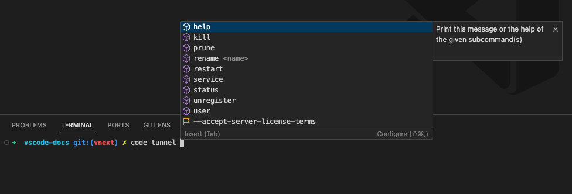

# March 2025 (version 1.99)

<!-- DOWNLOAD_LINKS_PLACEHOLDER -->

---

Welcome to the March 2025 release of Visual Studio Code. There are many updates in this version that we hope you'll like, some of the key highlights include:

* **Agentic coding flow**
  * Copilot agent mode is available in VS Code Stable. Enable it by setting `setting(chat.agent.enabled:true)`.
  * Extend agent mode with Model Context Protocol (MCP) server tools.
  * Adding new built-in tools to agent mode for thinking, fetching web content, and finding symbol usages.

* **Code editing**
  * Announcing Next Edit Suggestions general availability.
  * Removed unnecessary distractions while applying edits in the editor to keep you focused.

* **Chat**
  * Add more language models to chat with support for bringing your own key (BYOK).
  * Bringing ask, edit, and agent mode together in a unified chat experience, allowing easy context switching.
  * Improved workspace search speed and accuracy with instant remote workspace indexing for GitHub repositories.

* **AI-enhanced notebook editing**
  * Create and edit notebooks as easily as code files with support for edit and agent mode.

>If you'd like to read these release notes online, go to [Updates](https://code.visualstudio.com/updates) on [code.visualstudio.com](https://code.visualstudio.com).
**Insiders:** Want to try new features as soon as possible? You can download the nightly [Insiders](https://code.visualstudio.com/insiders) build and try the latest updates as soon as they are available.

## Accessibility

### Chat agent mode improvements

You are now notified when manual action is required during a tool invocation, such as "Run command in terminal." This information is also included in the ARIA label for the relevant chat response, enhancing accessibility for screen reader users.

Additionally, a new accessibility help dialog is available in [agent mode](https://code.visualstudio.com/docs/copilot/chat/chat-agent-mode), explaining what users can expect from the feature and how to navigate it effectively.

### Accessibility Signals for chat edit actions

VS Code now provides auditory signals when you keep or undo AI-generated edits. These signals are configurable via `setting(accessibility.signals.editsKept)` and `setting(accessibility.signals.editsUndone)`.

### Improved ARIA labels for suggest control

ARIA labels for suggest control items now include richer and descriptive information, such as the type of suggestion (for example, method or variable). This information was previously only available to sighted users via icons.

## Configure the editor

### Unified chat experience

We have streamlined the chat experience in VS Code into a single unified Chat view. Instead of having to move between separate views and lose the context of a conversation, you can now easily switch between the different chat modes.

Depending on your scenario, use either of these modes, and freely move mid-conversation:

- Ask mode: optimized for asking questions about your codebase and brainstorming ideas.
- Edit mode: optimized for making edits across multiple files in codebase.
- Agent mode: optimized for an autonomous agentic coding flow, combining code edits and tool invocations.

Get more details about the [unified chat view](#unified-chat-view).

### Faster workspace searches with instant indexing

[Remote workspace indexes](https://code.visualstudio.com/docs/copilot/reference/workspace-context#remote-index) accelerate searching large codebases for relevant code snippets that AI uses while answering questions and generating edits. These remote indexes are especially useful for large codebases with tens or even hundreds of thousands of files.

Previously, you'd have to press a button or run a command to build and start using a remote workspace index. With our new instant indexing support, we now automatically build the remote workspace index when you first try to ask a `#codebase`/`@workspace` question. In most cases, this remote index can be built in a few seconds. Once built, any codebase searches that you or anyone else working with that repo in VS Code makes will automatically use the remote index.

Keep in mind that remote workspaces indexes are currently only available for code stored on GitHub. To use a remote workspace index, make sure your workspace contains a git project with a GitHub remote. You can use the [Copilot status menu](#copilot-status-menu) to see the type of index currently being used:

To manage load, are slowly rolling out instant indexing over the next few weeks, so you may not see it right away. You can still run the `GitHub Copilot: Build remote index command` command to start using a remote index when instant indexing is not yet enabled for you.

### Copilot status menu

The Copilot status menu, accessible from the Status Bar, is now enabled for all users. This milestone we added some new features to it:

- View [workspace index](https://code.visualstudio.com/docs/copilot/reference/workspace-context) status information at any time.

    

- View if code completions are enabled for the active editor.

    A new icon reflects the status, so that you can quickly see if code completions are enabled or not.

    

- Enable or disable [code completions and NES](https://code.visualstudio.com/docs/copilot/ai-powered-suggestions).

### Out of the box Copilot setup (Experimental)

**Setting**: `setting(chat.setupFromDialog)`

We are shipping an experimental feature to show functional chat experiences out of the box. This includes the Chat view, editor/terminal inline chat, and quick chat. The first time you send a chat request, we will guide you through signing in and signing up for Copilot Free.

<video src="images/1_99/copilot-ootb.mp4" title="Video that shows Copilot out of the box." autoplay loop controls muted></video>

If you want to see this experience for yourself, flip the `setting(chat.setupFromDialog)` setting.

### Chat prerelease channel mismatch

If you have the prerelease version of the Copilot Chat extension installed in VS Code Stable, a new welcome screen will inform you that this configuration is not supported. Due to rapid development of chat features, the extension will not activate in VS Code Stable.

The welcome screen provides options to either switch to the release version of the extension or download [VS Code Insiders](https://code.visualstudio.com/insiders/).

### Semantic text search improvements (Experimental)

**Setting**: `setting(github.copilot.chat.search.semanticTextResults:true)`

AI-powered semantic text search is now enabled by default in the Search view. Use the `kb(search.action.searchWithAI)` keyboard shortcut to trigger a semantic search, which shows you the most relevant results based on your query, on top of the regular search results.

<video src="images/1_99/semantic-search.mp4" title="Video that shows semantic search improvements in Visual Studio Code." autoplay loop controls muted></video>

You can also reference the semantic search results in your chat prompt by using the `#searchResults` tool. This allows you to ask the LLM to summarize or explain the results, or even generate code based on them.

<video src="images/1_99/semantic-search-results.mp4" title="Video that shows using search results in chat view." autoplay loop controls muted></video>

### Settings editor search updates

By default, the Settings editor search now uses the key-matching algorithm we introduced in the previous release. It also shows additional settings even when the settings ID matches exactly with a known setting.

<video src="images/1_99/settings-search-show-extra.mp4" title="Searching files.autoSave and mcp in the Settings editor both show more than one setting" autoplay loop controls muted></video>

### New setting for window controls (Linux, Windows)

A new setting `setting(window.controlsStyle)` allows to adjust the window controls when the `setting(window.titleBarStyle)` is configured to be `custom`:
- `native`: this is the default and renders window controls according to the underlying platform
- `custom`: renders window controls with custom styling if you prefer that over the native one
- `hidden`: hides window controls entirely if you want to gain some space in the title bar and are a more keyboard centric user

## Code Editing

### Agent mode is available in VS Code Stable

We're happy to announce that agent mode is available in VS Code Stable! Enable it by setting `setting(chat.agent.enabled:true)`. Enabling the setting will no longer be needed in the following weeks, as we roll out enablement by default to all users.

### AI edits improvements

We have done some smaller tweaks when generating edits with AI:

1. Mute diagnostics events outside the editor while rewriting a file with AI edits. Previously, we already disabled squiggles in this scenario. These changes reduce flicker in the Problems panel and also ensure that we don't issue requests for the quick fix code actions.

1. We now explicitly save a file when deciding to keep the AI edits.

### Next Edit Suggestions general availability

**Setting**: `setting(github.copilot.nextEditSuggestions.enabled:true)`

We're happy to announce the general availability of Next Edit Suggestions (NES)! In addition, we've also made several improvements to the overall user experience of NES:

* Make edit suggestions more compact, less interfering with surrounding code, and easier to read at a glance.
* Updates to the gutter indicator to make sure that all suggestions are more easily noticeable.

<video src="images/1_99/next-edit-suggestion.mp4" title="NES suggesting edits based on the recent changes due by the user." autoplay loop controls muted></video>

### Improved edit mode

We're making a change to the way [edit mode in chat](https://code.visualstudio.com/docs/copilot/chat/copilot-edits) operates. The new edit mode uses the same approach as agent mode, where it lets the model call a tool to make edits to files. An upside to this alignment is that it enables you to switch seamlessly between all three modes, while providing a huge simplification to how these modes work under the hood.

A downside is that this means that the new mode only works with the same reduced set of models that agent mode works with, namely models that support tool calling and have been tested to be sure that we can have a good experience when tools are involved. You may notice models like `o3-mini` and `Claude 3.7 (Thinking)` missing from the list in edit mode. If you'd like to keep using those models for editing, disable the `setting(chat.edits2.enabled)` setting to revert to the previous edit mode. You'll be asked to clear the session when switching modes.

We've learned that prompting to get consistent results across different models is harder when using tools, but we are working on getting these models lit up for edit (and agent) modes.

This setting will be enabled gradually for users in VS Code Stable.

### Inline suggestion syntax highlighting

With this update, syntax highlighting for inline suggestions is now enabled by default:

If you prefer inline suggestions without syntax highlighting, you can disable it with `setting(editor.inlineSuggest.syntaxHighlightingEnabled:false)`:

### Tree-Sitter based syntax highlighting (Preview)

Building upon the previous work for using Tree-Sitter for syntax highlighting, we now support experimental, Tree-Sitter based, syntax highlighting for CSS files and for regular expressions within TypeScript. Use `setting(editor.experimental.preferTreeSitter.css:true)` and `setting(editor.experimental.preferTreeSitter.regex:true)` to try it out.

## Chat

### Model Context Protocol server support

This release supports [Model Context Protocol](https://modelcontextprotocol.io/) (MCP) servers in agent mode. Once configured in VS Code, MCP servers provide tools for agent mode to interact with other systems, such as databases, cloud platforms, search engines, or any 3rd party API.

MCP servers can be configured under the `mcp` section in your user, remote, or `.code-workspace` settings, or in `.vscode/mcp.json` in your workspace. The configuration supports input variables to avoid hard-coding secrets and constants. For example, you can use `${env:API_KEY}` to reference an environment variable or `${input:ENDPOINT}` to prompt for a value when the server is started.

You can use the **MCP: Add Server** command to quickly set up an MCP server from a command line invocation, or use an AI-assisted setup from an MCP server published to Docker, npm, or PyPI.

When a new MCP server is added, a refresh action is shown in the Chat view, which can be used to start the server and discover the tools. Afterwards, servers are started on-demand to save resources.

<video src="images/1_99/mcp.mp4" title="Video that shows using a Github MCP tool in chat." autoplay loop controls muted></video>

_Theme: [Codesong](https://marketplace.visualstudio.com/items?itemName=connor4312.codesong) (preview on [vscode.dev](https://vscode.dev/editor/theme/connor4312.codesong))_

If you've already been using MCP servers in other applications such as Claude Desktop, VS Code will discover them and offer to run them for you. This behavior can be toggled with the setting `setting(chat.mcp.discovery.enabled)`.

You can see the list of MCP servers and their current status using the **MCP: List Servers** command, and pick the tools available for use in chat by using the **Select Tools** button in agent mode.

You can read more about how to install and use MCP servers in [our documentation](https://code.visualstudio.com/docs/copilot/chat/mcp-servers.md).

### Making agent mode available in VS Code Stable

We're happy to announce that agent mode is available in VS Code Stable! Enable it by setting `setting(chat.agent.enabled:true)`. Enabling the setting will no longer be needed in the following weeks, as we roll out enablement by default to all users.

### Agent mode tools

This milestone, we have added several new built-in tools to agent mode.

#### Thinking tool

**Setting**: `setting(github.copilot.chat.agent.thinkingTool:true)`.

Inspired by [Anthropic's research](https://www.anthropic.com/engineering/claude-think-tool), we've added support for a thinking tool in agent mode that can be used to give any model the opportunity to think between tool calls. This improves our agent's performance on complex tasks in-product and on the [SWE-bench](https://www.swebench.com/) eval.

#### Fetch tool

Use the `#fetch` tool for including content from a publicly accessible webpage in your prompt. For instance, if you wanted to include the latest documentation on a topic like [MCP](#model-context-protocol-server-support), you can ask to fetch [the full documentation](https://modelcontextprotocol.io/llms-full.txt) (which is conveniently ready for an LLM to consume) and use that in a prompt. Here's a video of what that might look like:

<video src="images/1_99/fetch.mp4" title="Using the fetch tool to fetch the model context protocol documentation" autoplay loop controls muted></video>

In agent mode, this tool is picked up automatically but you can also reference it explicitly in the other modes via `#fetch`, along with the URL you are looking to fetch.

This tool works by rendering the webpage in a headless browser window in which the data of that page is cached locally, so you can freely ask the model to fetch the contents over and over again without the overhead of re-rendering.

Let us know how you use the `#fetch` tool, and what features you'd like to see from it!

**Fetch tool limitations:**

* Currently, JavaScript is disabled in this browser window. The tool will not be able to acquire much context if the website depends entirely on JavaScript to render content. This is a limitation we are considering changing and likely will change to allow JavaScript.
* Due to the headless nature, we are unable to fetch pages that are behind authentication, as this headless browser exists in a different browser context than the browser you use. Instead, consider using [MCP](#model-context-protocol-server-support) to bring in an MCP server that is purpose-built for that target, or a generic browser MCP server such as the [Playwright MCP server](https://github.com/microsoft/playwright-mcp).

#### Usages tool

The `#usages` tool is a combination of "Find All References", "Find Implementation", and "Go to Definition". This tool can help chat to learn more about a function, class, or interface. For instance, chat can use this tool to look for sample implementations of an interface or to find all places that need to be changed when making a refactoring. In agent mode this tool will be picked up automatically but you can also reference it explicitly via `#usages`

#### New Workspace creation in agent mode (Experimental)

**Setting**: `setting(github.copilot.chat.newWorkspaceCreation.enabled)`

You can now ask to scaffold a new VS Code workspace from scratch in agent mode. Whether you’re setting up a VS Code extension, an MCP server, or other development environments, it helps you initialize, configure, and launch these projects with the necessary dependencies and settings.

<video src="images/1_99/new-workspace-demo.mp4" title="Video showing creation of a new MCP server to fetch top N stories from hacker news using Agent mode." autoplay loop controls muted></video>

### VS Code extension tools in agent mode

Several months ago, we finalized our extension API for [language model tools](https://code.visualstudio.com/api/extension-guides/tools.md#create-a-language-model-tool) contributed by VS Code extensions. Now, you can use these tools in agent mode.

Any tool contributed to this API which sets `toolReferenceName` and `canBeReferencedInPrompt` in its contribution is automatically available in agent mode. Similar to tools from MCP servers, you can enable and disable these with the **Select Tools** button in agent mode. See our [language model tools extension guide](https://code.visualstudio.com/api/extension-guides/tools.md#create-a-language-model-tool) to build your own!

### Agent mode tool approvals

As part of completing the tasks for a user prompt, agent mode can run tools and terminal commands. This is powerful but potentially comes with risks. Therefore, you need to approve the use of tools and terminal commands in agent mode.

To optimize this experience, you can now remember that approval on a session, workspace, or application level. This is not currently enabled for the terminal tool, but we plan to develop an approval system for the terminal in future releases.

In the case where you want to auto-approve _all_ tools, you can now use the experimental `setting(chat.tools.autoApprove:true)` setting. This will auto-approve all tools, and VS Code will not ask for confirmation when a language model wishes to run tools. Bear in mind that with this setting enabled, you will not have the opportunity to cancel potentially destructive actions a model wants to take.

We plan to expand this setting with more granular capabilities in the future.

### Agent evaluation on SWE-bench

VS Code's agent achieves a pass rate of 56.0% on `swebench-verified` with Claude 3.7 Sonnet, following Anthropic's [research](https://www.anthropic.com/engineering/swe-bench-sonnet) on configuring agents to execute without user input in the SWE-bench environment. Our experiments have translated into shipping improved prompts, tool descriptions and tool design for agent mode, including new tools for file edits that are in-distribution for Claude 3.5 and 3.7 Sonnet models.

### Unified Chat view

For the past several months, we've had a "Chat" view for asking questions to the language model, and a "Copilot Edits" view for an AI-powered code editing session. This month, we aim to streamline the chat-based experience by merging the two views into one Chat view. In the Chat view, you'll see a dropdown with three modes:

- **[Ask](https://code.visualstudio.com/docs/copilot/chat/chat-ask-mode)**: This is the same as the previous Chat view. Ask questions about your workspace or coding in general, using any model. Use `@` to invoke built-in chat participants or from installed [extensions](https://marketplace.visualstudio.com/search?term=chat-participant&target=VSCode&category=All%20categories&sortBy=Relevance). Use `#` to attach any kind of context manually.
- **[Agent](https://code.visualstudio.com/docs/copilot/chat/chat-agent-mode)**: Start an agentic coding flow with a set of tools that let it autonomously collect context, run terminal commands, or take other actions to complete a task. Agent mode is enabled for all [VS Code Insiders](https://code.visualstudio.com/insiders/) users, and we are rolling it out to more and more users in VS Code Stable.
- **[Edit](https://code.visualstudio.com/docs/copilot/chat/copilot-edits)**: In Edit mode, the model can make directed edits to multiple files. Attach `#codebase` to let it find the files to edit automatically. But it won't run terminal commands or do anything else automatically.

> **Note**: If you don't see agent mode in this list, then either it has not yet been enabled for you, or it's disabled by organization policy and needs to be enabled by the [organization owner](https://aka.ms/github-copilot-org-enable-features).

Besides making your chat experience simpler, this unification enables a few new features for AI-powered code editing:

- **Switch modes in the middle of a conversation**: For example, you might start brainstorming an app idea in ask mode, then switch to agent mode to execute the plan. Tip: press `kb(workbench.action.chat.toggleAgentMode)` to change modes quickly.
- **Edit sessions in history**: Use the **Show Chats** command (clock icon at the top of the Chat view) to restore past edit sessions and keep working on them.
- **Move chat to editor or window**: Select **Open Chat in New Editor/New Window** to pop out your chat conversation from the side bar into a new editor tab or separate VS Code window. Chat has supported this for a long time, but now you can run your edit/agent sessions from an editor pane or a separate window as well.
- **Multiple agent sessions**: Following from the above point, this means that you can even run multiple agent sessions at the same time. You might like to have one chat in agent mode working on implementing a feature, and another independent session for doing research and using other tools. Directing two agent sessions to edit files at the same time is not recommended, it can lead to confusion.

### Bring Your Own Key (BYOK) (Preview)

Copilot Pro and Copilot Free users can now bring their own API keys for popular providers such as Azure, Anthropic, Gemini, Open AI, Ollama, and Open Router. This allows you to use new models that are not natively supported by Copilot the very first day that they're released. To try it, select `Manage Models...` from the model picker. We’re actively exploring support for Copilot Business and Enterprise customers and will share updates in future releases. To learn more about this feature, head over to our [docs](https://code.visualstudio.com/docs/copilot/language-models).

### Reusable prompt files

#### Improved configuration

**Setting**: `chat.promptFilesLocations`

The `chat.promptFilesLocations` setting now supports glob patterns in file paths. For example, to include all `.prompt.md` files in the currently open workspace, you can set the path to `{ "**": true }`.

Additionally, the configuration now respects case sensitivity on filesystems where it applies, aligning with the behavior of the host operating system.

#### Improved editing experience

- Your `.prompt.md` files now offer basic autocompletion for filesystem paths and highlight valid file references. Broken links on the other hand now appear as warning or error squiggles and provide detailed diagnostic information.
- You can now manage prompts using edit and delete actions in the prompt file list within the **Chat: Use Prompt** command.
- Folder references in prompt files are no longer flagged as invalid.
- Markdown comments are now properly handled, for instance, all commented-out links are ignored when generating the final prompt sent to the LLM model.

#### Alignment with custom instructions

The `.github/copilot-instructions.md` file now behaves like any other reusable `.prompt.md` file, with support for nested link resolution and enhanced language features. Furthermore, any `.prompt.md` file can now be referenced and is handled appropriately.

Learn more about [custom instructions](https://code.visualstudio.com/docs/copilot/copilot-customization).

#### User prompts

The **Create User Prompt** command now allows to create a new type of prompts called _user prompts_. These are stored in the user data folder and can be synchronized across machines, similar to code snippets or user settings. The synchronization can be configured in [Sync Settings](https://code.visualstudio.com/docs/configure/settings-sync) by using the **Prompts** item in the synchronization resources list.

### Improved vision support (Preview)

Last iteration, Copilot Vision was enabled for `GPT-4o`. Check our [release notes](https://code.visualstudio.com/updates/v1_98#_copilot-vision-preview) to learn more about how you can attach and use images in chat.

This release, you can attach images from any browser via drag and drop. Images drag and dropped from browsers must have the correct url extension, with `.jpg`, `.png`, `.gif`, `.webp`, or `.bmp`.

<video src="images/1_99/image-url-dnd.mp4" title="Video that shows an image from Chrome being dragged into the chat panel." autoplay loop controls muted></video>

## Notebooks

### Minimal version of Jupyter notebook document to 4.5

The default version of `nbformat` for new notebooks has been bumped from 4.2 to 4.5, which will now set `id` fields for each cell of the notebook to help with calculating diffs. You can also manually update existing notebooks by setting the `nbformat_minor` to `5` in the raw JSON of the notebook.

### AI notebook editing improvements

AI-powered editing support for notebooks (including agent mode) is now available in the Stable release. This was added last month as a preview feature in [VS Code Insiders](https://code.visualstudio.com/insiders).

You can now use chat to edit notebook files with the same intuitive experience as editing code files. Modifying content across multiple cells, insert and delete cells, and change cell types. This feature provides a seamless workflow when working with data science or documentation notebooks.

#### New notebook tool

VS Code now provides a dedicated tool for creating new Jupyter notebooks directly from chat. This tool plans and creates a new notebook based on your query.

The new notebook tool is available in several places throughout VS Code:

- In edit mode (note that you need to enable the improved editing mode with the setting `setting(chat.edits2.enabled:true)`. More info can be found here: [Improved Edit mode](#improved-edit-mode))
- In agent mode.
- Via the `/newNotebook` slash command in ask mode.

<video src="images/1_99/new-notebook-tool-release-notes.mp4" title="Video showing creation of a new Jupyter notebook using chat in agent mode and the New Notebook tool." autoplay loop controls muted></video>

#### Navigate through edits

Use the diff toolbars to iterate and review each AI edit across cells.

<video src="images/1_99/navigate-notebook-edits.mp4" title="Video showing chat implementing a TODO task and then navigating through those changes." autoplay loop controls muted></video>

#### Undo AI edits

When focused on a cell container, the **Undo** command reverts the full set of AI changes at the notebook level.

<video src="images/1_99/undo-copilot-notebook-edits.mp4" title="Video showing chat making several edits to a notebook and undoing those edits with ctrl+z." autoplay loop controls muted></video>

#### Text and image output support in chat

You can now add notebook cell outputs, such as text, errors, and images, directly to chat as context. Use the **Add cell output to chat** action, available via the triple-dot menu or by right-clicking the output. This lets you reference the output when using ask, edit, or agent mode, making it easier for the language model to understand and assist with your notebook content.

<video src="images/1_99/notebook-output-attach.mp4" title="Video that shows attaching an notebook cell error output to chat." autoplay loop controls muted></video>

<video src="images/1_99/notebook-output-image-demo.mp4" title="Video that shows attaching an notebook cell output image to chat." autoplay loop controls muted></video>

## Source Control

### Reference picker improvements

This milestone, we have made improvements of the reference picker that is used for various source control operations like checkout, merge, rebase, or delete branch. The updated reference picker contains the details of the last commit (author, commit message, commit date), as well as ahead/behind information for local branches. The additional context will help you pick the right reference for the various operations.

You can hide the additional information by toggling the `setting(git.showReferenceDetails:false)` setting.

### Repository Status Bar item

Workspaces that contain multiple repositories now have a Source Control Provider Status Bar item that displays the active repository on the left-hand side of the branch picker. The new Status Bar item provides additional context, so you know which is the active repository as you navigate between editors and use the Source Control view.

You can hide the Source Control Provider Status Bar item by using the context menu that is accessible by right-clicking on the Status Bar.

### Git blame editor decoration improvements

We have heard feedback that while typing, the "Not Yet Committed" editor decoration does not provide much value and it is more of a distraction. Starting this milestone the "Not Yet Committed" editor decoration is only shown while navigating around the codebase either by using the keyboard or the mouse.

### Commit input cursor customization

This milestone, thanks to a community contribution, we have added the `setting(editor.cursorStyle)` and `setting(editor.cursorWidth)` settings to the list of settings that are being honored by the source control input box.

## Terminal

### Reliability in agent mode

The tool that allows agent mode to run commands in the terminal has a number of reliability and compatibility improvements. You should expect less cases where the tool gets stuck or where the command finishes without the output being present.

One of the bigger changes is the introduction of the concept of "rich" quality [shell integration](https://code.visualstudio.com/docs/terminal/shell-integration), as opposed to "basic" and "none". The shell integration scripts shipped with VS Code should generally all enable rich shell integration which provides the best experience in the run in terminal tool (and terminal usage in general). You can view the shell integration quality by hovering over the terminal tab.

### Terminal IntelliSense improvements (Preview)

#### Enhanced IntelliSense for the `code` CLI

IntelliSense now supports subcommands for the `code`, `code-insiders`, and `code-tunnel` CLI. For instance, typing `code tunnel` shows available subcommands like `help`, `kill`, and `prune`, each with descriptive info.

We've also added option suggestions for:

- `--uninstall-extension`
- `--disable-extension`
- `--install-extension`

These show a list of installed extensions to help complete the command.

Additionally, `code --locate-shell-integration-path` now provides shell-specific options such as `bash`, `zsh`, `fish`, and `pwsh`.

#### Auto-refresh for global commands

The terminal now automatically refreshes its list of global commands when changes are detected in the system `bin` directory. This means newly installed CLI tools (for example, after running `npm install -g pnpm`) will show up in completions immediately, without the need to reload the window.

Previously, completions for new tools wouldn’t appear due to caching until the window was manually reloaded.

#### Option value context

Terminal suggestions now display contextual information about expected option values, helping you more easily complete commands.

#### Rich completions for fish shell

In the last release, we added detailed command completions for bash and zsh. This iteration, we've expanded that support to fish as well. Completion details are sourced from the shell’s documentation or built-in help commands.

For example, typing `jobs` in fish displays usage info and options:

#### File type icons in suggestions

Suggestions in the terminal now include specific icons for different file types, making it easier to distinguish between scripts and binaries at a glance.

#### Inline suggestion details

Inline suggestions, displayed as ghost text in the terminal, continue to appear at the top of the suggestions list. In this release, we've added command details to these entries to provide more context before accepting them.

### New simplified and detailed tab hover

By default, the terminal tab shows much less detail now.

To view everything, there is a **Show Details** button at the bottom of the hover.

### Signed PowerShell shell integration

The shell integration PowerShell script is now signed, meaning shell integration on Windows when using the default PowerShell execution policy of `RemoteSigned` should now start working automatically. You can read more about [shell integration's benefits here](https://code.visualstudio.com/docs/terminal/shell-integration).

### Terminal shell type

This iteration, we've finalized our terminal shell API, allowing extensions to see the user's current shell type in their terminal.
Subscribing to event `onDidChangeTerminalState` allows you to see the changes of the user's shell type in the terminal.
For example, the shell could change from zsh to bash.

The list of all the shells that are identifiable are currently listed [here](https://github.com/microsoft/vscode/blob/99e3ae5586a74ab1c554b6a2a50bb9eb3a4ff7fd/src/vscode-dts/vscode.d.ts#L7740-L7750)

## Remote Development

### Linux legacy server support has ended

As of release 1.99, you can no longer connect to these servers. As noted in our [1.97 release](/remote-release-notes/v1_97.md#migration-path-for-linux-legacy-server), users that require additional time to complete migration to a supported Linux distro can provide custom builds of `glibc` and `libstdc++` as a workaround. More info on this workaround can be found in the [FAQ](https://aka.ms/vscode-remote/faq/old-linux) section.

## Enterprise

### macOS device management

VS Code now supports device management on macOS in addition to Windows.  This allows system administrators to push policies from a centralized management system, like Microsoft Intune.

See the [Enterprise Support](https://code.visualstudio.com/docs/setup/enterprise#_device-management) documentation for more details.

## Contributions to extensions

### Python

#### Better support for editable installs with Pylance

Pylance now supports resolving import paths for packages installed in editable mode (`pip install -e .`) as defined by [PEP 660](https://peps.python.org/pep-0660/), which enables an improved IntelliSense experience in these scenarios.

This feature is enabled via `setting(python.analysis.enableEditableInstalls:true)` and we plan to start rolling it out as the default experience throughout this month. If you experience any issues, please report them at the [Pylance GitHub repository](https://github.com/microsoft/pylance-release).

#### Faster and more reliable diagnostic experience with Pylance (Experimental)

We're starting to roll out a change to improve the accuracy and responsiveness of Pylance's diagnostics when using the release version of the extension. This is especially helpful for scenarios with multiple open or recently closed files.

If you do not want to wait for the roll out, you can set `setting(python.analysis.usePullDiagnostics:true)`. If you experience any issues, please report them at the [Pylance GitHub repository](https://github.com/microsoft/pylance-release).

#### Pylance custom Node.js arguments

There's a new `setting(python.analysis.nodeArguments)` setting, which allows you to pass custom arguments directly to Node.js when using `setting(python.analysis.nodeExecutable)`. By default, it is set to `"--max-old-space-size=8192"`, but you can modify it to suit your needs (for example, to allocate more memory to Node.js when working with large workspaces).

Additionally, when setting `setting(python.analysis.nodeExecutable)` to `auto`, Pylance now automatically downloads Node.js.

## Extension authoring

### Terminal.shellIntegration tweaks

The `Terminal.shellIntegration` API will now only light up when command detection happens. Previously, this should work when _only_ the current working directory was reported, which caused `TerminalShellIntegration.executeCommand` to not function well.

Additionally, `TerminalShellIntegration.executeCommand` will now behave more consistently and track multiple "sub-executions" for a single command line that ended up running multiple commands. This depends on rich shell integration as mentioned in the [reliability in agent mode section](#reliability-in-agent-mode).

## Proposed APIs

### Task problem matcher status

We've added [proposed API](https://github.com/microsoft/vscode/blob/c98092f1caaad64e18be5b3f8761a09c24c7669c/src/vscode-dts/vscode.proposed.taskProblemMatcherStatus.d.ts#L9-L40), so that extensions can monitor when a task's problem matchers start and finish processing lines. Enable it with `taskProblemMatcherStatus`.

### Send images to LLM

This iteration, we've added a [proposed API](https://github.com/microsoft/vscode/blob/main/src/vscode-dts/vscode.proposed.languageModelDataPart.d.ts), so that extensions can attach images and send vision requests to the language model. Attachments must be the raw, non base64-encoded binary data of the image (`Uint8Array`). Maximum image size is 5MB.

Check out [this API proposal issue](https://github.com/microsoft/vscode/issues/245104) to see a usage example and to stay up to date with the status of this API.

## Engineering

### Use new `/latest` API from Marketplace to check for extensions updates

Couple of milestones back, we introduced a new API endpoint in `vscode-unpkg` service to check for extension updates. Marketplace now supports the same endpoint and VS Code is now using this endpoint to check for extension updates. This is behind an experiment and will be rolled out to users in stages.

## Thank you

Last but certainly not least, a big _**Thank You**_ to the contributors of VS Code.

### Issue tracking

Contributions to our issue tracking:

* [@gjsjohnmurray (John Murray)](https://github.com/gjsjohnmurray)
* [@albertosantini (Alberto Santini)](https://github.com/albertosantini)
* [@IllusionMH (Andrii Dieiev)](https://github.com/IllusionMH)
* [@RedCMD (RedCMD)](https://github.com/RedCMD)

### Pull requests

Contributions to `vscode`:

* [@a-stewart (Anthony Stewart)](https://github.com/a-stewart): Add a 2 hour offset to tests to avoid being a day short after the clocks change [PR #243194](https://github.com/microsoft/vscode/pull/243194)
* [@acdzh (Vukk)](https://github.com/acdzh): Fix hasEdits flag's value when updating multiple values in JSONEditingService  [PR #243876](https://github.com/microsoft/vscode/pull/243876)
* [@c-claeys (Cristopher Claeys)](https://github.com/c-claeys): Increment the request attempt in the chat retry action [PR #243471](https://github.com/microsoft/vscode/pull/243471)
* [@ChaseKnowlden (Chase Knowlden)](https://github.com/ChaseKnowlden): Add Merge Editor Accessibility help [PR #240745](https://github.com/microsoft/vscode/pull/240745)
* [@dibarbet (David Barbet)](https://github.com/dibarbet): Update C# onEnterRules to account for documentation comments [PR #242121](https://github.com/microsoft/vscode/pull/242121)
* [@dsanders11 (David Sanders)](https://github.com/dsanders11): Fix a few broken `@link` in vscode.d.ts [PR #242407](https://github.com/microsoft/vscode/pull/242407)
* [@jacekkopecky (Jacek Kopecký)](https://github.com/jacekkopecky): Honor more cursor settings in scm input editor [PR #242903](https://github.com/microsoft/vscode/pull/242903)
* [@joelverhagen (Joel Verhagen)](https://github.com/joelverhagen): Show support URL and license URL even if extension URL is not set [PR #243565](https://github.com/microsoft/vscode/pull/243565)
* [@kevmo314 (Kevin Wang)](https://github.com/kevmo314): Fix comment typo [PR #243145](https://github.com/microsoft/vscode/pull/243145)
* [@liudonghua123 (liudonghua)](https://github.com/liudonghua123): support explorer.copyPathSeparator [PR #184884](https://github.com/microsoft/vscode/pull/184884)
* [@mattmaniak](https://github.com/mattmaniak): Make telemetry info table a little bit narrower and aligned [PR #233961](https://github.com/microsoft/vscode/pull/233961)
* [@notoriousmango (Seong Min Park)](https://github.com/notoriousmango)
  * fix: use the copy command for images with CORS errors in the markdown preview [PR #240508](https://github.com/microsoft/vscode/pull/240508)
  * Fix Incorrect character indentation on settings with line break [PR #242074](https://github.com/microsoft/vscode/pull/242074)
* [@pprchal (Pavel Prchal)](https://github.com/pprchal): Added localization to right-click on icon [PR #243679](https://github.com/microsoft/vscode/pull/243679)
* [@SimonSiefke (Simon Siefke)](https://github.com/SimonSiefke): feature: support font family picker in settings [PR #214572](https://github.com/microsoft/vscode/pull/214572)
* [@tribals (Anthony)](https://github.com/tribals): Add discovery of PowerShell Core user installation [PR #243025](https://github.com/microsoft/vscode/pull/243025)
* [@tusharsadhwani (Tushar Sadhwani)](https://github.com/tusharsadhwani): Make `git show` ref argument unambiguous [PR #242483](https://github.com/microsoft/vscode/pull/242483)
* [@wszgrcy (chen)](https://github.com/wszgrcy): fix: extension uncaughtException listen Maximum call stack size exceeded [PR #244690](https://github.com/microsoft/vscode/pull/244690)
* [@zyoshoka (zyoshoka)](https://github.com/zyoshoka): Correct `typescript-basics` extension path [PR #243833](https://github.com/microsoft/vscode/pull/243833)

Contributions to `vscode-css-languageservice`:

* [@lilnasy (Arsh)](https://github.com/lilnasy): Support `@starting-style` [PR #421](https://github.com/microsoft/vscode-css-languageservice/pull/421)

Contributions to `vscode-custom-data`:

* [@rviscomi (Rick Viscomi)](https://github.com/rviscomi): Add computed Baseline status [PR #111](https://github.com/microsoft/vscode-custom-data/pull/111)

Contributions to `vscode-extension-samples`:

* [@ratmice (matt rice)](https://github.com/ratmice): Fix esbuild scripts [PR #1154](https://github.com/microsoft/vscode-extension-samples/pull/1154)

Contributions to `vscode-extension-telemetry`:

* [@minestarks (Mine Starks)](https://github.com/minestarks): Remove extra brace from common.platformversion [PR #221](https://github.com/microsoft/vscode-extension-telemetry/pull/221)

Contributions to `vscode-js-debug`:

* [@erikson84 (Erikson Kaszubowski)](https://github.com/erikson84): fix: ensure backslash in path when setting breakpoints in windows [PR #2184](https://github.com/microsoft/vscode-js-debug/pull/2184)
* [@xymopen (xymopen_Official)](https://github.com/xymopen): Support usenode as npm script runner [PR #2178](https://github.com/microsoft/vscode-js-debug/pull/2178)

Contributions to `vscode-mypy`:

* [@ivirabyan (Ivan Virabyan)](https://github.com/ivirabyan): Report only files specified by mypy config [PR #352](https://github.com/microsoft/vscode-mypy/pull/352)

Contributions to `vscode-prompt-tsx`:

* [@dsanders11 (David Sanders)](https://github.com/dsanders11): docs: fix sendRequest API name in README example [PR #159](https://github.com/microsoft/vscode-prompt-tsx/pull/159)
* [@tamuratak (Takashi Tamura)](https://github.com/tamuratak)
  * fix: `text` should be `this.props.text` [PR #163](https://github.com/microsoft/vscode-prompt-tsx/pull/163)
  * Fix the Usage in Tools section in README.md [PR #164](https://github.com/microsoft/vscode-prompt-tsx/pull/164)

Contributions to `vscode-pull-request-github`:

* [@aedm (Gábor Gyebnár)](https://github.com/aedm): Adds `sanitizedLowercaseIssueTitle` to settings docs [PR #6690](https://github.com/microsoft/vscode-pull-request-github/pull/6690)

Contributions to `vscode-python-debugger`:

* [@rchiodo (Rich Chiodo)](https://github.com/rchiodo): Update debugpy to latest version [PR #653](https://github.com/microsoft/vscode-python-debugger/pull/653)

Contributions to `vscode-test`:

* [@SKaplanOfficial (Stephen Kaplan)](https://github.com/SKaplanOfficial): fix: avoid 'Invalid extraction directory' when unzipping [PR #303](https://github.com/microsoft/vscode-test/pull/303)

Contributions to `language-server-protocol`:

* [@MariaSolOs (Maria José Solano)](https://github.com/MariaSolOs): Update range formatting capabilities in metamodel [PR #2106](https://github.com/microsoft/language-server-protocol/pull/2106)

Contributions to `python-environment-tools`:

* [@CharlesChen0823](https://github.com/CharlesChen0823): bump winreg [PR #195](https://github.com/microsoft/python-environment-tools/pull/195)
* [@elprans (Elvis Pranskevichus)](https://github.com/elprans)
  * Avoid misdetecting global Linux Python as virtualenv [PR #197](https://github.com/microsoft/python-environment-tools/pull/197)
  * Fix env version detection on systems with multiple system Pythons [PR #198](https://github.com/microsoft/python-environment-tools/pull/198)
  * Populate `name` in virtualenvwrapper envs [PR #199](https://github.com/microsoft/python-environment-tools/pull/199)

<a id="scroll-to-top" role="button" title="Scroll to top" aria-label="scroll to top" href="#"></a>
<link rel="stylesheet" type="text/css" href="css/inproduct_releasenotes.css"/>
