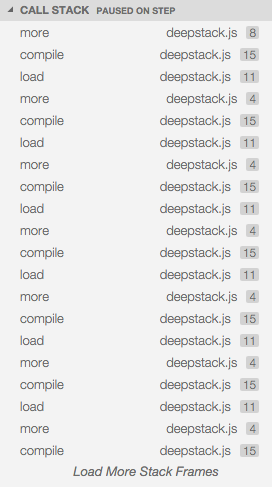
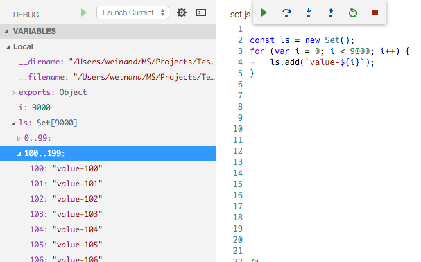
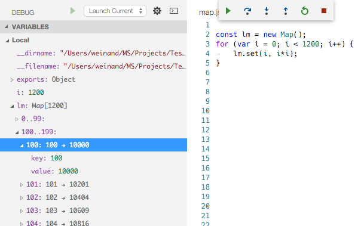
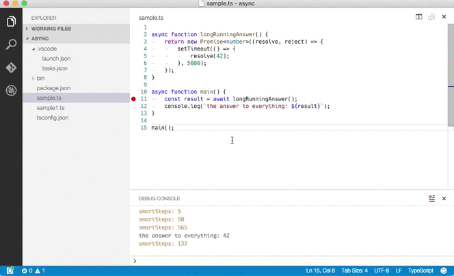

# April 2016 (1.1)

The April 1.1 release is our first monthly release after announcing 1.0. We have been overwhelmed by the positive response to that release and the excitement in the community for VS Code and the rapidly growing ecosystem of new languages and extensions.

Keeping to our monthly release cadence, we've put together a nice selection of new features and fixes in April.  We hope you enjoy it.

Here is an overview of some of the updates contained in this release:

* Quickly resize panes by double-clicking editor borders
* Reopen the last closed file using `kb(workbench.action.reopenClosedEditor)`
* Launch your favorite shell when opening a new Terminal from the Explorer or Command Palette

Extension authors will be especially happy with these updates:

* Language Server protocol 2.0 is now consistent with core VS Code API
* Automated test support for authoring Debug Adapters
* New APIs for working with folders and JSON files

Downloads: [Windows](https://az764295.vo.msecnd.net/stable/def9e32467ad6e4f48787d38caf190acbfee5880/VSCodeSetup-stable.exe) |
[OS X](https://az764295.vo.msecnd.net/stable/def9e32467ad6e4f48787d38caf190acbfee5880/VSCode-darwin-stable.zip) | Linux 64-bit [.zip](https://az764295.vo.msecnd.net/stable/def9e32467ad6e4f48787d38caf190acbfee5880/VSCode-linux-x64-stable.zip) [.deb](https://az764295.vo.msecnd.net/stable/def9e32467ad6e4f48787d38caf190acbfee5880/vscode-amd64.deb) [.rpm](https://az764295.vo.msecnd.net/stable/def9e32467ad6e4f48787d38caf190acbfee5880/vscode-x86_64.rpm) | Linux 32-bit [.zip](https://az764295.vo.msecnd.net/stable/def9e32467ad6e4f48787d38caf190acbfee5880/VSCode-linux-ia32-stable.zip) [.deb](https://az764295.vo.msecnd.net/stable/def9e32467ad6e4f48787d38caf190acbfee5880/vscode-i386.deb) [.rpm](https://az764295.vo.msecnd.net/stable/def9e32467ad6e4f48787d38caf190acbfee5880/vscode-i386.rpm)

## Editor

### Visual design for editor tabs

We have a [visual design](https://github.com/Microsoft/vscode/issues/224#issuecomment-213015687) for how editor tabs might look in VS Code. We will start to implement the design in the next milestone.

### Disable automatic revealing of files in the explorer

By default, VS Code expands folders and scrolls your active file into view in the file Explorer. If you don't want this automatic reveal behavior, you can disable it through a new setting `explorer.autoReveal`. Set `explorer.autoReveal` to `false` to prevent your Explorer view from changing as you switch between active files. There is a new action, **Show Active File in Explorer**, if you would like to explicitly display (reveal) the currently active file in the Explorer.

### Resize border (sash) double clicks

You can now double-click on some resize borders (sashes) in the workbench to quickly resize them:

* Double click on the Explorer resize border to size the sidebar to show file paths without being trimmed.
* Double clicking the resize border of other Views (Search, Git, Debug) will cause the sidebar to shrink to its minimum width.
* If you have multiple editors open, double clicking the resize border between them will resize the open editors to equal width.
* Double clicking the resize border of the side by side diff editor will resize the diffs to equal width.
* Double clicking the resize border of the lower **OUTPUT**/**DEBUG CONSOLE** panel will resize the panel to its minimum height.

### Reopen closed file command

The `workbench.action.reopenClosedEditor` command has been added which will reopen the most recent file removed from the working files list. The default key binding for this command is `kb(workbench.action.reopenClosedEditor)`.

>**Note:** Previously `kb(workbench.action.reopenClosedEditor)` had been bound to the **Run: Run Test Task** command. **Run: Run Test Task** is now not bound to any default key binding. You can [customize](https://code.visualstudio.com/docs/getstarted/keybindings#_customizing-shortcuts) the key bindings and change the behavior back to the previous one if desired.

### Disable Emmet abbreviation expansion on Tab

You can now disable the Emmet abbreviation triggered on `kbstyle(Tab)` using the `emmet.triggerExpansionOnTab` setting.

## Debugging

### Call Stack Paging

VS Code debugging now supports arbitrarily deep call stacks. For performance reasons, we only load twenty frames initially but there is now a button at the bottom for loading the next set of frames:



### Improved thread support

Debugging multi-threaded programs has been improved. The currently debugged thread is now automatically expanded and several issues were fixed to make debugging multiple threads a smoother experience.

## Node.js Debugging

### Support for ES6 Sets, Maps, and Generators

The VS Code Node.js debugger no longer shows ES6 Sets, Maps, Promises, and Generators as `undefined` or empty objects.

Set and map items show a sequence number next to the item because both data structures preserve the insertion order:





Generators show its state:


### Support for property getters

Object properties with getters are no longer shown as `undefined`. An example for this are the environment variables available through `process.env`.

### String truncation limit lifted

The Node.js V8 debugger protocol truncates strings automatically to a (non-configurable) 80 characters. In the April release, VS Code works around this limitation and truncates only strings with more than 10000 characters.

### Improved performance with large data structures in Node.js 4.x, 5.x

Inspecting large data structures like arrays or buffers results in Node.js becoming unresponsive because the V8 debugger protocol does not provide a way to access large data structures in chunks. In Node.js 0.12.x, VS Code started to dynamically inject code into the Node.js runtime to improve the V8 debugging protocol but this stopped working after the io.js/node.js reunion for 2.x and 3.x versions. A recent fix to Node.js made code injection work again. So if you see performance problems, make sure that you are using at least Node.js version 4.3.1 of the LTS stream or version 5.6 of the stable stream.

### Smart code stepping

We added experimental support for automatically skipping 'uninteresting code' when stepping through code in the debugger. 'Uninteresting code' is code that is generated by a transpiling process but is not covered by a source map so it does not map back to the original source. This code gets into your way when stepping through source code in the debugger because it makes the debugger switch between the original source code and generated code that you are not really interested in.

This experimental feature automatically steps through code not covered by a source map until it reaches a location that is covered by a source map again. To enable the feature, just add the attribute `smartStep` with a value of `true` to your launch configuration.

The following screen cast shows stepping through a simple async/await snippet first with the feature disabled and then enabled:



## Setup

### Portability improvements on Linux

The zip archive now included the CLI (`./bin/code`) and has been improved to support custom install locations and work when symlinked to.

### Launch your preferred shell

You can now specify which external shell VS Code will launch when you use commands like **Open in Command Prompt** (or **Open in Terminal** on OS X or Linux).  Set the `terminal.external` user or workspace setting for your platform (`windowsExec`, `linuxExec`) to the executable to launch (`cmd` is the default for Windows).

For example, to set PowerShell as your external shell on Windows and Terminator on Linux, use:

```json
{
    "terminal.external.windowsExec": "powershell",
    "terminal.external.linuxExec": "terminator"
}
```

OS X support has not been implemented yet ([#5462](https://github.com/Microsoft/vscode/issues/5462)).

## Extension Authoring

### New command to open a folder in the same or new window

We added a new command for extension writers to open a folder in the same or new window. The command identifier is `vscode.openFolder` and it accepts two optional arguments `uri` and `newWindow`. If you omit the `uri` argument, the native file dialog is displayed for the user to select a folder.

### Custom Close action when showing messages

The extensions API now allows you to provide custom Close button affordance (text and action) when showing a message using `window.show{Information|Warning|Error}Message` call. Just pass in a message item which has the `isCloseAffordance`-property set to `true`.

### Links when previewing html

When previewing HTML files with the `vscode.previewHtml` command, links are now interpreted in the context of VS Code. That is file-links are resolved within the editor, web-links with the default browser. Also commands are supported using the `command`-scheme. For instance, `command:vscode.previewHtml?["file:///some/file.html"]` tells the editor to run the command `vscode.previewHtml` using arguments that are JSON-encoded as query.

### Enhance support for your JSON configuration files

If you have your own JSON files and want to improve the editing experience, you can associate JSON schemas to your files. The schemas associations will be picked up by the JSON language support that ships with VS Code and you will get validations, completions and hovers for free. The schema association can be done either [by a user configuration](https://code.visualstudio.com/docs/languages/json#_json-schemas-settings) or [by an extension point](https://code.visualstudio.com/docs/extensionAPI/extension-points#_contributesjsonvalidation).

In some cases, you want more control, for example, you may want to provide completion support that requires a database lookup, or you want validation that cannot be expressed by a regular expression. To implement your own completion, validation, and hover support, you can use the regular VS Code APIs. To make this easier, we moved our JSON scanner and parsers to a node-module, [jsonc-parser](https://www.npmjs.com/package/jsonc-parser), that you can reuse. You can see this module in action with the dependency completion support for `package.json` and `bower.json` that is now part of the [JavaScript extension]( https://github.com/Microsoft/vscode/tree/master/extensions/javascript) and for `project.json` soon to be part of the [C# extension](https://github.com/OmniSharp/omnisharp-vscode/).

### 'onDebug' Activation Event

Upon starting a debug session, VS Code now emits a `onDebug:{type}` event, for example 'onDebug:node'. Debug extensions can now be activated by listening for this activation event.

## Debug Adapter Development

For Node.js based debug adapter development, we've made the debug adapter test support available as an npm module [vscode-debugadapter-testsupport](https://www.npmjs.com/package/vscode-debugadapter-testsupport).

The source for this module lives in the GitHub repository [vscode-debugadapter-node](https://github.com/Microsoft/vscode-debugadapter-node).

You can find examples of how to use the module here:

* [Node Debug](https://github.com/Microsoft/vscode-node-debug/blob/master/src/tests/adapter.test.ts)
* [Mono Debug](https://github.com/Microsoft/vscode-mono-debug/blob/master/tests/adapter.test.ts)
* [Mock Debug](https://github.com/Microsoft/vscode-mock-debug/blob/master/src/tests/adapter.test.ts)

## Electron Shell

We updated the Electron shell to 0.37.6.

## Language Server Protocol

Version 2.x of the [language server protocol](https://github.com/Microsoft/vscode-languageserver-protocol) was released together with a corresponding [client library](https://github.com/Microsoft/vscode-languageserver-node) to be used in extensions and a [server library](https://github.com/Microsoft/vscode-languageserver-node) for Node.js.

The major changes are:

- Alignment of the protocol with the VS Code extension API.
- Consistent support for language identifiers. This means that the language ID is passed to the server via the open notification.
- Support for version numbers on documents.
- Text document save notifications.
- Support for request cancellation.

## Bug Fixes

This release has a number of notable bug fixes.

* [3928](https://github.com/Microsoft/vscode/issues/3928): VS Code corrupts multi-line environment variables
* [4426](https://github.com/Microsoft/vscode/issues/4426): Include CLI in Linux zip archive and support custom install locations
* [4478](https://github.com/Microsoft/vscode/issues/4478): "Open in Terminal" not working on Fedora
* [4691](https://github.com/Microsoft/vscode/issues/4691): Command palette's camel case matching does not work for non ASCII characters
* [4679](https://github.com/Microsoft/vscode/issues/4679): Don't localize command names on the command palette
* [5260](https://github.com/Microsoft/vscode/issues/5260): Use proper font family for East Asian languages (CJK)
* [4400](https://github.com/Microsoft/vscode/issues/4400): Add update notifications for Linux
* [1796](https://github.com/Microsoft/vscode/issues/1796): HTTPS Authentication not working on Linux
* [6281](https://github.com/Microsoft/vscode/issues/6281): Edits fail to validate ranges correctly before applying
* [6304](https://github.com/Microsoft/vscode/issues/6304): Debug: continue action is broken when target app has multiple threads

These are the [closed bugs](https://github.com/Microsoft/vscode/issues?q=is%3Aissue+label%3Abug+milestone%3A%22April+2016%22+is%3Aclosed) and these are the [closed feature requests](https://github.com/Microsoft/vscode/issues?q=is%3Aissue+milestone%3A%22April+2016%22+is%3Aclosed+label%3Afeature-request) for the 1.1.0 update.

## Thank You

Last but certainly not least, a big *__Thank You!__* to the following folks that helped to make VS Code even better:

* [Maxime Quandalle (@mquandalle)](https://github.com/mquandalle): Implement double-click on sashes for optimal resizing. [PR #4702](https://github.com/Microsoft/vscode/pull/4702)
* [Christian Oetterli (@krizzdewizz)](https://github.com/krizzdewizz): Honor the %COMSPEC% environment variable on Windows when spawning a shell. [PR #743](https://github.com/Microsoft/vscode/issues/743)
* [Peter Flannery (@pflannery)](https://github.com/pflannery): Add custom terminal launch settings. [PR #3495](https://github.com/Microsoft/vscode/pull/3495)
* [Xaver Hellauer (@xaverh)](https://github.com/xaverh): Add "new window" action to code.desktop. [PR #4916](https://github.com/Microsoft/vscode/pull/4916)
* [Sam Verschueren (@SamVerschueren)](https://github.com/SamVerschueren):
  * Show move file to trash key binding in context menu - resolves #5603. [PR #5622](https://github.com/Microsoft/vscode/pull/5622)
  * Add a global action to add a new file in the explorer - resolves #5547. [PR #5597](https://github.com/Microsoft/vscode/pull/5597)
* [Denis Gladkikh (@outcoldman)](https://github.com/outcoldman): Create new conf files with right indent settings (fixes #5550). [PR #5527](https://github.com/Microsoft/vscode/pull/5527)
* [Peng Lv (@rebornix)](https://github.com/rebornix): uninstall outdated extension with correct version #5502. [PR #5502](https://github.com/Microsoft/vscode/pull/5502)
* [xzper (@f111fei)](https://github.com/f111fei): Context menu is positioned wrongly when zoomed in. [PR #5158](https://github.com/Microsoft/vscode/pull/5158)
* [Belleve Invis (@be5invis)](https://github.com/be5invis): Add CJK-aware line wrapping, and basic Kinsoku Shori (禁則処理) to Visual Studio Code. [PR #4825](https://github.com/Microsoft/vscode/pull/4825)
* [Jonathan Edwards (@JonathanMEdwards)](https://github.com/JonathanMEdwards): Make mouse cursor visible in dark themes. Fixes #754. [PR #4654](https://github.com/Microsoft/vscode/pull/4654)
