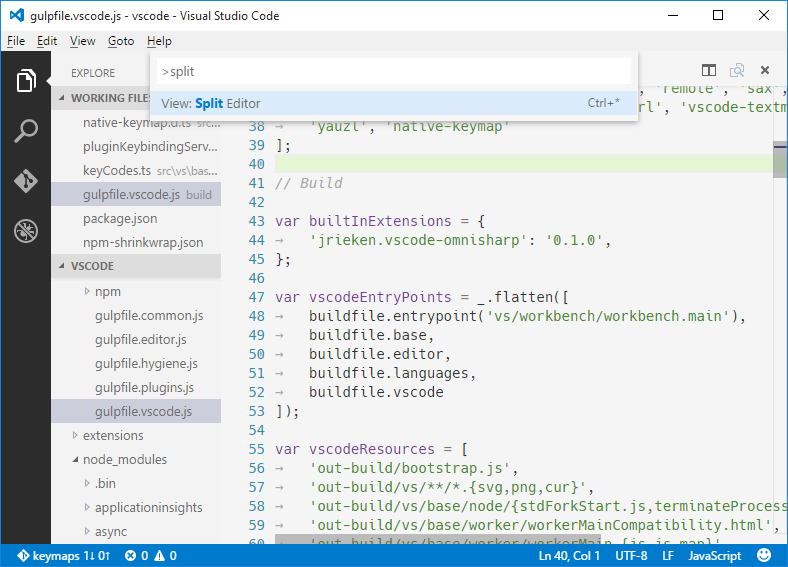
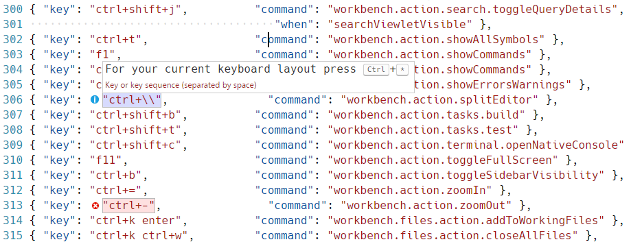
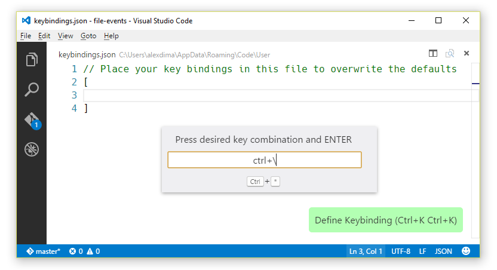
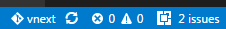
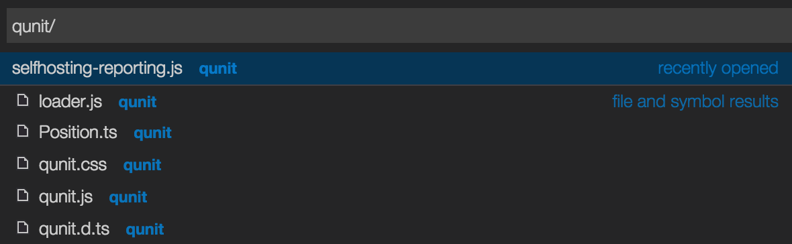
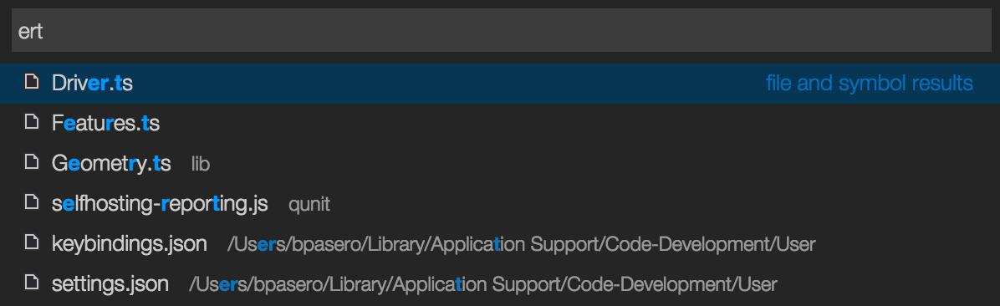
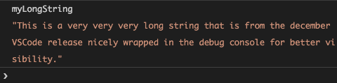

---
Order:
TOCTitle: December 2015
PageTitle: Visual Studio Code December 2015 0.10.6
MetaDescription: See what is new in the Visual Studio Code December Release (0.10.6)
---
# December 2015 (0.10.6)

Hi,

November was a big release for us (adding extensibility support and moving to open source) and we appreciate all the support we received leading up to and during the Connect(); event. We've kept busy in December and we hope you like this release.

These release notes only capture what's new in the core of Visual Studio Code. Do not forget to check out the [marketplace](https://marketplace.visualstudio.com/VSCode) for new extensions.

Downloads: [Windows](https://az764295.vo.msecnd.net/public/0.10.6/VSCodeSetup.exe) | [OS X](https://az764295.vo.msecnd.net/public/0.10.6/VSCode-darwin.zip) | [Linux 32-bit](https://az764295.vo.msecnd.net/public/0.10.6/VSCode-linux32.zip) | [Linux 64-bit](https://az764295.vo.msecnd.net/public/0.10.6/VSCode-linux64.zip)

## Thanks

A big thanks for the great contributions we have received. The community has filed over 200 bugs, 280 feature requests, and submitted 70 pull requests. We have addressed many of these issues and merged most of the pull requests.

These are the [closed bugs](https://github.com/Microsoft/vscode/issues?q=is%3Aissue+milestone%3A%22Dec+2015%22+label%3Abug+is%3Aclosed) and these are the [closed feature requests](https://github.com/Microsoft/vscode/issues?q=is%3Aissue+milestone%3A%22Dec+2015%22+label%3Afeature-request+is%3Aclosed) for the December milestone.

Regarding fixes, if you want to find out when a fix to your issue is available in a VS Code update, please check the **milestone** assigned to the issue.

## Editor - Find/Replace improvements

In regex mode:

* Can now search for `^`, `$` or `^$` thanks to a [community contribution](https://github.com/Microsoft/vscode/pull/314).
* Can now replace with `\n` or `\t`.

Keyboard shortcuts:

* New Find settings commands: toggle case-sensitive (`kb(toggleFindCaseSensitive)`), toggle regex (`kb(toggleFindRegex)`) and toggle whole word (`kb(toggleFindWholeWord)`)
* `kb(actions.find)` puts focus in the Find input field.
* `kb(editor.action.startFindReplaceAction)` puts focus in the Replace input field.
* When focus is in the Find widget input fields, `kbstyle(Ctrl+Down)` put focus in the editor.

## Changed defaults and key bindings

* Changed the defaults for `editor.insertSpaces` to `true` and `editor.tabSize` to `4`. To get the previous behavior, you can change both settings back to `"auto"`.
* Changed the default key bindings on Linux for Insert Cursor Below (`kb(editor.action.insertCursorBelow)`), Insert Cursor Above (`kb(editor.action.insertCursorAbove)`), Move Line Down (`kb(editor.action.moveLinesDownAction)`) and Move Line Up (`kb(editor.action.moveLinesUpAction)`)

## Editor - Cursor Blinking Options

New setting to configure cursor blinking: `editor.cursorBlinking` with values `blink`, `visible` and `hidden` thanks to [community contribution](https://github.com/Microsoft/vscode/pull/500).

## Editor - Select Current Line Command

New select current line command (`kb(expandLineSelection)`) thanks to a [community contribution](https://github.com/Microsoft/vscode/pull/961).

## Editor - Scroll Viewport Commands

Thanks to a [community contribution](https://github.com/Microsoft/vscode/pull/1051), VS Code has improved editor scroll support:

* Scroll by one line up (`kb(scrollLineUp)`) / down (`kb(scrollLineDown)`)
* Scroll by one page up (`kb(scrollPageUp)`) / down (`kb(scrollPageDown)`)

## Key Bindings for Numeric Keypad

Added support for function keys `kbstyle(f13-f19)` and for the numeric keypad keys:

* `kbstyle(numpad0-numpad9)`
* `kbstyle(numpad_multiply)`
* `kbstyle(numpad_add)`
* `kbstyle(numpad_separator)`
* `kbstyle(numpad_subtract)`
* `kbstyle(numpad_decimal)`
* `kbstyle(numpad_divide)`

## Improvements for non US standard keyboard layouts

VS Code dispatches key bindings based on [keyboard codes](https://msdn.microsoft.com/en-us/library/windows/desktop/dd375731). In `keybindings.json` and in all the UI, we used to render the key codes with the produced characters under the US standard keyboard layout. We received feedback that this was very confusing, therefore, we created a new Node.js module [`native-keymap`](https://www.npmjs.com/package/native-keymap) that is used in VS Code to render the key bindings using the system's current keyboard layout.

For example, `Split Editor` when using a French (France) keyboard layout is now rendered as `kbstyle(Ctrl+*)`:


When editing `keybindings.json`, we now highlight misleading key bindings - those that are represented in the file with the character produced under the standard US keyboard layout, but which need pressing keys with different labels under the current system's keyboard layout.

For example, here is how the `Default keybindings` rules look like when using a French (France) keyboard layout:



Finally, we added a new widget that helps input the key binding rule when editing `keybindings.json`. To launch the **Define Keybinding** widget, press `kb(editor.action.defineKeybinding)`. The widget listens for key presses and renders the serialized JSON representation in the text box and below it, the keys that VS Code has detected under your current keyboard layout. Once you've typed the key combination you want you can press `kbstyle(Enter)` and a rule snippet will be inserted.



## ES6 is the new default

We have made ES6 the default for JavaScript files. This means you don't need to create `jsconfig.json` files to enable new syntax and by default you get suggestions for ES6-types, like `Promise`, `Set`, `Map`, `String.startsWith` and much more. Thanks to a community [contribution](https://github.com/Microsoft/vscode/pull/337).

At the same time, the grammar used to colorize JavaScript was also updated to support the ES6 syntax.

## TypeScript Update

The TypeScript language service was updated to version [1.7.5](https://devblogs.microsoft.com/typescript/announcing-typescript-1-7).

## JSX Support

To improve the JavaScript and JSX support, the plan is to adopt [Salsa](https://github.com/Microsoft/TypeScript/issues/4789). There is good progress on the Salsa project, but until VS Code has switched over to Salsa, we can only offer a **workaround** for using VS Code with JSX.

* Install the [vscode-eslint extension](https://marketplace.visualstudio.com/items/dbaeumer.vscode-eslint) and configure JSX support. This will provide you with validation in JSX files.

```
{
    "ecmaFeatures": {
        "jsx": true,
        ...
    }
    ...
}
```

* If you are using React constructs inside `.js` files then you can install the `js-is-jsx` [extension](https://marketplace.visualstudio.com/items/eg2.js-is-jsx) which changes the file mapping so that `.js` files are treated as `.jsx` files. **Be aware** that if you install this extension, you lose the existing language support for `.js` files.

The grammars used to colorize JS and JSX are now aligned.

## Extension Debugging

We improved extension debugging when connecting the debugger to the extension. The debugger will no longer try to reconnect to the extension when you close the 'Extension Host`. In addition, the debugger will connect faster to your extension.

## Extensions Show Outdated Extensions

Thanks to a [community contribution](https://github.com/Microsoft/vscode/pull/517), there is now a `Show Outdated Extensions` command, that shows all outdated extensions and lets you quickly install their updates.

## Installed Extension Issues

If VS Code identifies an issue with an installed extension, it will display an `issues` prompt on the Status Bar.  Click on the `issues` prompt to see the extension issue details and have the option to uninstall the extension.



## Extension Gallery

There is now [proxy support for the extension gallery](https://github.com/Microsoft/vscode/issues/69).

## Extension Deactivation

If an extension exports a function named `deactivate()`, VS Code now calls it on shutdown.

## File Picker improvements and fuzzy search

The file picker ("Quick Open") is now able to search on file paths when you include slash (Mac/Linux) or backslash (Windows) in the search term. This allows you to list all the files of a directory easily.



A new setting `filePicker.alternateFileNameMatching` enables fuzzy searching for the file picker. Once enabled, the search term will match on the full path of the file by default, without having to include path separators in the query. In addition, a search term will match in a more fuzzy way on the path compared to the default. For example, a search for `fb` will match a file `foobar` because the filename contains `f` and `b`. We also added a new sorter for the picker when fuzzy searching is enabled which tries to put the most relevant results to the top. Please try out this feature and give us feedback so that we can tune the experience.



## Persisted Zoom Level

A new setting `window.zoomLevel` allows you to change and persist the zoom level of the window. The default value is 0 and each increment increases the zoom level by 20% similar to the effect of the `View` menu `Zoom in` command.  Unlike the zoom level set with the `Zoom in` and `Zoom out` commands, the `window.zoomLevel` is a setting persisted across VS Code sessions.

## window.openFileInNewWindow

The setting `window.openInNewWindow` was renamed to `window.openFilesInNewWindow` to clarify its purpose. You can still use the old setting but we ask you to update to the new name.

## Themes

Various fixes to the default light and dark theme. Due to the move to TextMate tokenizers in the last release, there were changes in the appearance of the default light and dark theme. Some themes got far more colorful, in particular JavaScript, while other languages lost colors, e.g. Jade and XML. The goal was to stay as close as possible to what we had in the 0.9.0 release so we use a few major colors: blue for keywords, green for comments and red for strings.

## Emmet

Emmet is now supported in JSX and TSX files.

## Scoped Git Services

It is now possible to open a sub-directory of a Git repository in VS Code. VS Code's Git services will still work as usual, showing all changes within the repository, but file changes outside of the scoped directory are shaded and have a tool tip indicating the file is located outside the current workspace.

## Git Status Bar Actions

There is now a **Synchronize** action in the Status Bar, next to the branch indicator, when the current checked out branch has an upstream branch configured.


If there is no upstream branch configured and the Git repository has remotes set up, a new **Publish** action is enabled. This will let you publish the current branch to remote.


## Debug Console Wraps Text

We now wrap long text in the debug console.



## Debug Breakpoints Polish

We now show breakpoints in a more intuitive way:

* A red filled circle represents an active breakpoint.
* A gray filled circle represents a disabled breakpoint.
* A gray hollow circle represents a breakpoint which could not be successfully registered with the debugger. For languages that are transpiled to JavaScript, this could mean that source maps are missing or invalid.

## JSON Schema Contributions

Extensions can now contribute JSON schema associations. The `jsonValidation` contribution point takes a file pattern and the URL of the JSON schema.

```json
    "contributes": {
        "jsonValidation": [{
            "fileMatch": ".jshintrc",
            "url": "http://json.schemastore.org/jshintrc"
        }]
    }
```

Alternatively, extensions can also give the path to a schema file in the extension folder:

```json
    "contributes": {
        "jsonValidation": [{
            "fileMatch": ".htmlhintrc",
            "url": "./schemas/htmlhintrc.schema.json"
        }]
    }
```

## Language Server Extensions

The language server protocol now supports all available language features. Please see the [Language Server example](/docs/extensions/example-language-server.md) for details on how to implement a language server.

## Debug Adapter Development

For Node.js based debug adapter development, we've made the VS Code Debug Protocol and an adapter default implementation available as npm modules:

* [vscode-debugprotocol](https://www.npmjs.com/package/vscode-debugprotocol)
* [vscode-debugadapter](https://www.npmjs.com/package/vscode-debugadapter)

The source for these modules lives in the GitHub repository [vscode-debugadapter-node](https://github.com/Microsoft/vscode-debugadapter-node). Both [mock-debug](https://github.com/Microsoft/vscode-mock-debug) and [node-debug](https://github.com/Microsoft/vscode-node-debug) have been updated to use the npm modules.

## Engineering

The VS Code GitHub repository supports continued integration for branches and pull requests:

* [Travis CI](https://travis-ci.org/Microsoft/vscode/) - Linux and OS X
* [AppVeyor](https://ci.appveyor.com/project/VSCode/vscode) - Windows

During this first iteration of VS Code being open source, we tuned and documented more of our development workflows:

* [How we do issue tracking](https://github.com/Microsoft/vscode/wiki/Issue-Tracking)
* [How we use the different feedback channels](https://github.com/Microsoft/vscode/wiki/Feedback-Channels)

We updated Electron to version 0.34.5.  This includes a bug fix for the issue on Linux where the editor font was showing blurry on certain high DPI displays.

## Notable Bug Fixes

* Submitted [pull request](https://github.com/atom/node-oniguruma/pull/46) to `atom/node-oniguruma` in order to [improve performance](https://github.com/Microsoft/vscode/issues/94) when colorizing long lines with multi-byte characters.

## What's next

The VS Code development team will now take time off to be with friends and family. We will be back fully recharged in January.
