---
Order:
TOCTitle: February 2016
PageTitle: Visual Studio Code February 0.10.11
MetaDescription: See what is new in the Visual Studio Code February Release (0.10.11)
---
# February 2016 (0.10.11)

February is our last full iteration before we start the end game for the [Build 2016 conference](https://build.microsoft.com/) milestone at the end of March. It comes with many improvements:

- Salsa is now the default JavaScript language service.
- Folding, the most requested feature, is now available.
- There is support for localization and accessibility.

In addition, we continued to listen to your issues and feature requests.

Downloads: [Windows](https://az764295.vo.msecnd.net/stable/f291f4ad600767626b24a4b15816b04bee9a3049/VSCodeSetup-stable.exe) |
[OS X](https://az764295.vo.msecnd.net/stable/f291f4ad600767626b24a4b15816b04bee9a3049/VSCode-darwin-stable.zip) | [Linux 32-bit](https://az764295.vo.msecnd.net/stable/f291f4ad600767626b24a4b15816b04bee9a3049/VSCode-linux-ia32-stable.zip) | [Linux 64-bit](https://az764295.vo.msecnd.net/stable/f291f4ad600767626b24a4b15816b04bee9a3049/VSCode-linux-x64-stable.zip)

## Languages - JavaScript

The [Salsa](https://github.com/microsoft/TypeScript/issues/4789) JavaScript language service was available as preview in January and it is now the default language service for JavaScript in the February update.

### Improvements

The JSDoc comment format is now understood and used to improve IntelliSense proposals and parameter hints:

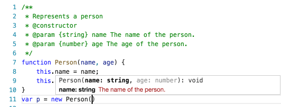

You now get IntelliSense proposals for properties in 'ECMAScript 3 style classes':

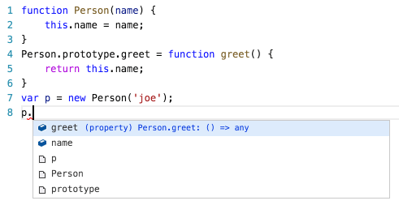

IntelliSense offers both *inferred* proposals and the global identifiers of the project. The inferred symbols are presented first, followed by the global identifiers (with the document icon), as you can see in the image above.

The **CommonJS** module support has been improved as well:

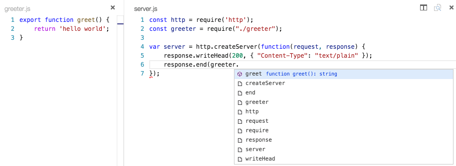

There is now support for JSX/React:


>**Tip:** To get IntelliSense for React/JSX, install the typings for `react-global` by running `tsd install react-global` or `typings install dt~react --global` from the terminal.

>**Tip:** When you use eslint for linting (see below) and you used `eslint --init` to create an eslint configuration and you answered  `yes` to "Do you use React?", then the setting `experimentalObjectRestSpread` is enabled. Support for ObjectRestSpread is not yet provided by Salsa but it is on the roadmap (see [#2103](https://github.com/microsoft/TypeScript/issues/2103)).

There is now support for React Native:

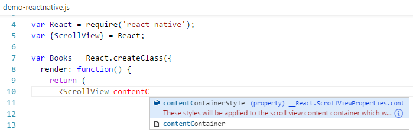

>**Tip:** To get IntelliSense for React Native, install the typings for `react-native` by running `tsd install react-native` or `typings install dt~react-native --global` from the terminal. Or even better... if you also want debugging support then install the preview of the [React Native extension](https://marketplace.visualstudio.com/items?itemName=vsmobile.vscode-react-native).

>**Tip:** There is a known issue in that [Salsa Doesn't Provide IntelliSense When Using Import Statements](https://github.com/microsoft/vscode-react-native/issues/61).

It is now possible to have mixed TypeScript and JavaScript projects. To enable JavaScript inside a TypeScript project, you can set the `allowJs` property to `true` in the `tsconfig.json`.

>**Tip:** The `tsc` compiler does not detect the presence of a `jsconfig.json` file automatically. Use the `–p` argument to make `tsc` use your `jsconfig.json` file, e.g. `tsc -p jsconfig.json`.

Finally, the TypeScript compiler `tsc` can down-level compile JavaScript files from ES6 to another language level.

### Migration Notes

The following sections describe a few of VS Code's features that have changed with the move to Salsa and provide information about maintaining previous behaviors.

### Linters

Previously the JavaScript language support provided some linting options enabled by the `javascript.validate.lint.*` settings. With `jshint` and `eslint`, there are powerful linters for JavaScript available. Also, there are now extensions for VS Code available that integrate these linters. Therefore, we have decided to deprecate the built-in linter and Salsa now reports **syntax errors only**. We **strongly recommend that you install and configure a JavaScript linter if your project hasn't done so already**.

In particular, the previous JavaScript infrastructure provided an implicit *lint rule* which warned about undeclared variables unless they are mentioned in a /\*global\*/ comment block. This rule is no longer active and needs to be configured in your linter of choice.

Here are the steps to set up `eslint`:

- `npm install eslint` to install `eslint` into your workspace or `npm install -g eslint` to install it globally.
- install the VS Code [eslint extension](https://marketplace.visualstudio.com/items?itemName=dbaeumer.vscode-eslint).
- use `eslint --init` to create an initial eslint configuration by answering questions or by picking a popular configuration.

**Tip:** If you use JSON as the format of the eslint configuration file, then VS Code can provide you with IntelliSense when you edit the `.eslintrc.json` file.

This [.eslintrc.json](https://gist.github.com/egamma/65c0e2a832393e3b625a) corresponds roughly to the lint settings of the old JavaScript infrastructure.

### Changes in `jsconfig.json`

#### `exclude` lists

The previous JavaScript language service had a built-in list for folders that should be excluded from the project context. This list included the folders: `node_modules`, `bower_components`, `jspm_packages`, `tmp`, and `temp`. This implicit behavior has changed in favor of an explicit list defined by the user. Therefore if you use...

- `node` exclude the `node_modules` folder
- `bower` exclude the `bower_components` folder
- `ember` exclude the `tmp` and `temp` folder
- `jspm` exclude the `jspm_packages` folder
- `webpack` then exclude the output folder, e.g., `dist`.

**Tip:** After editing the `jsconfig.json`, do not forget to run the **Reload JavaScript** command to ensure that everything is up to date.

#### Defaults

If you do not have a `jsconfig.json` in your workspace then the following defaults are used:

- the `exclude` list includes the `node_modules` folder and the folder defined by the `out` attribute.

Be aware that if you have no `jsconfig.json` defined to mark the root of your project, then each JavaScript file is considered an island by Salsa. Without a `jsconfig.json` file, cross-file and Typings file IntelliSense will not work.

### `js-is-jsx` extension deprecation

The `js-is-jsx` extension is no longer needed since Salsa gives you coloring for JSX constructs inside `.js` files out of the box. We **recommend** you uninstall this extension.

### No longer supported

Salsa undoubtedly provides a much better experience writing JavaScript applications in VS Code. By moving to Salsa, we give up a few features previously available with our old JavaScript language service:

- The source language level is now always ECMAScript 6. Previously, there was support to define a lower level using the `target` attribute inside `jsconfig.json`. This support has been removed and the `target` attribute is now only used by `tsc` to define the target version when a JavaScript file is compiled to a lower ECMAScript version.
- The previous JavaScript infrastructure attempted to resolve references for `AMD` modules. This hasn't worked in all cases and support for `AMD` to resolve references across files is currently no longer supported.
- There is no longer support for IntelliSense in `script` sections inside HTML documents.
- The `javascript.validate.*` settings are no longer supported and are ignored (see above).
- The previous JavaScript infrastructure provided quick fixes to add an undefined variable as a global and to fetch a type definition from definitely typed. These quick fixes are no longer available.
- A file without a .js suffix that VS Code identifies as a JavaScript file is now treated as a .ts file and you get unexpected type errors ([#issue 7291](https://github.com/microsoft/TypeScript/issues/7291)).

## Languages - TypeScript

VS Code now ships with the latest [TypeScript 1.8.2](https://devblogs.microsoft.com/typescript/announcing-typescript-1-8-2/) version.

### Migration Notes

>**Note:** With the move to TypeScript 1.8.2, you will need to have a `jsconfig.json` in your workspace for TypeScript definition files (for example [`node.d.ts`](https://github.com/DefinitelyTyped/DefinitelyTyped/blob/master/node/node.d.ts)) to be picked up.

If you don't already have a `jsconfig.json` file in your workspace, add a `jsconfig.json` file to the root with the `compilerOptions:module` attribute set:

```json
{
    "compilerOptions": {
        "module": "CommonJS"
    }
}
```

## Languages - C&#35;

C# language support is now an optional [install from the Marketplace](https://marketplace.visualstudio.com/items?itemName=ms-dotnettools.csharp). You can install it from within VS Code by searching for 'C#':

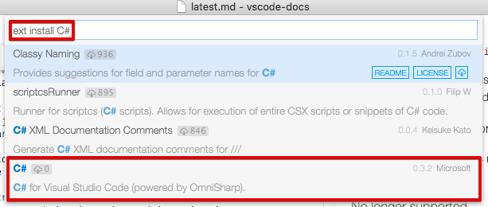

or if you already have a project with C# files, VS Code will prompt you to install the extension as soon as you open a C# file.

## Editor

### Source Code Folding

The editor now contains a first implementation of code folding. You can turn the feature on and off with the `editor.folding` configuration setting (**File** > **Preferences** > **Settings**). Once enabled, you can collapse and expand code regions using the folding icons next to the line numbers. Regions that can be folded are shown with a `-` icon, regions that are already folded with the `+` icon. The `-` icon only shows when the mouse is over the gutter.

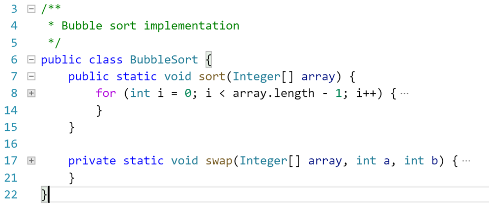

Additionally you can use the following commands from the commands menu (F1) or with keyboard shortcuts:

- Fold (`kb(editor.fold)`) folds the innermost uncollapsed region at the cursor
- Unfold (`kb(editor.unfold)`) unfolds the collapsed region at the cursor
- Fold All (`kb(editor.foldAll)`) folds all region in the editor
- Unfold All (`kb(editor.unfoldAll)`) unfolds all regions in the editor

The folding regions are evaluated solely based on the indentation of each line. This first version does not yet support language agnostic folding regions, or folding markers. This is in discussion for an upcoming release (see issue [#3422](https://github.com/microsoft/vscode/issues/3422)).

### IntelliSense Performance

The IntelliSense widget underwent a full rewrite to address some performance problems. It now handles lists of 20,000 extensions in milliseconds, compared to the previous ~10 seconds of lag.

### Indentation

Initiated by user request [#1228](https://github.com/microsoft/vscode/issues/1228), we have added indentation status in the editor to help with 'tabs to spaces' conversion and vice versa.  The Status Bar shows whether the Tab key will insert spaces or tabs and the current indentation size in characters.


You can adjust the indentation size and toggle between tabs and spaces with three new actions:


### Ruler Settings

There is a new setting `editor.rulers` available. For example, setting it to `[80, 120]` will display two vertical rulers in the editor, one after the 80th character and one after the 120th character.

### Default End of Line Sequence

A new setting `files.eol` controls the default new line character when creating new files. It defaults to `\r\n` on Windows and to `\n` on Linux and OS X.

### Word navigation and word separators

Word navigation and word deletion commands updated and now honor a new setting, `editor.wordSeparators`, when deciding what is a word, regardless of the current language of the file.

### Improved usage of web workers

With the adoption of the Salsa JavaScript language service as the default, we could streamline our usage of web workers and now have a dedicated web worker that is language agnostic, which we use for diff computation, link detection or simple textual completions. This reduces the latency of these computations and is memory friendly, as it automatically shuts down when not needed.

## Workbench

### Open Definition to the Side

There is now an action to open a definition to the side in the **Command Palette** (`kb(editor.action.revealDefinitionAside)`).

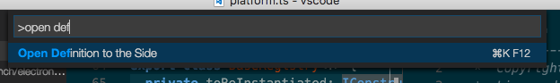

### Close Other Files

There is now an action to close all other files, in the **Working Files**' context menu (`kb(workbench.files.action.closeOtherFiles)`).

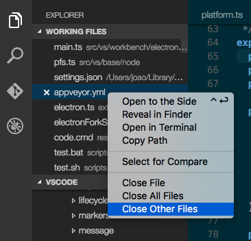

### Switch to a working file from Quick Open

It's now possible to open a file in the **Working Files** list from the **Quick Open** box by prefixing it with `~`.

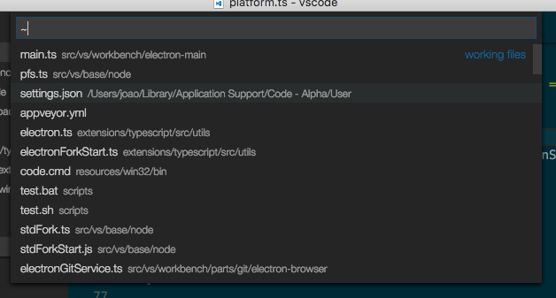

### Extension Recommendations

There is a new command **Extensions: Show Extension Recommendations** for displaying suggested extensions based on your use of VS Code. You can reach this by typing `ext recommend ` (trailing space) in the **Quick Open** box.

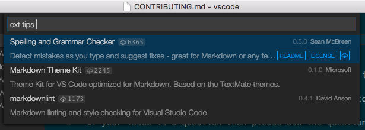

### Extension Marketplace Performance Improvement

The performance of the in-product Extension Marketplace (via the **Extensions: Install Extension** command) has been greatly improved. We introduced a server-side cache which speeds up the request considerably.

## Debugging

### VS Code no longer 'fixes' Relative Paths in Launch Configurations

In the January milestone, we deprecated the use of relative paths in launch configurations (but still continued to convert relative in absolute paths).
With this milestone, we've dropped this automatic fixing in favor of a more transparent strategy: VS Code no longer modifies launch configuration paths when sending them to the debug adapter. This is now the same treatment of paths as for task configurations.

If you haven't already fixed your launch configuration paths for the January release, then you will now see this (or similar) errors when starting a debug session:

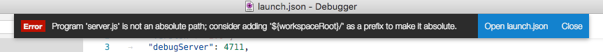

Just prefixing the relative path with a `${workspaceRoot}/` should fix the problem.

### Pre Launch Task Improvements

We have improved the `preLaunchTask` based on user feedback and feature requests:

* If `preLaunchTask` produces an error, debugging does not start and a message with an option to continue debugging despite the error is shown.

  

* If a `preLaunchTask` is a watching task, debugging does not start before the watching task becomes inactive.
* If a `tasks.json` is missing and a `preLaunchTask` is set, we offer to create a `tasks.json` for the user.

### Support for Node.js 'nodemon' Development Setup

The VS Code Node.js debugger now supports an automatic restart mode for the 'attach' launch configuration.
This feature is useful if you use `nodemon` to restart Node.js on file changes.
Setting the launch configuration attribute `restart` to `true` makes node-debug automatically try to re-attach to Node.js after a debug session has ended.

On the command line, start your Node.js program `server.js`:

```bash
nodemon --debug server.js
```

In VS Code, create an 'attach' launch configuration:

```json
{
    "name": "Attach",
    "type": "node",
    "request": "attach",
    "port": 5858,
    "restart": true
}
```

>**Tip:** Pressing the **Stop** button stops the debug session and disconnects from Node.js, but nodemon (and Node.js) will continue to run. So to stop nodemon you will have to kill it from the command line.

>**Tip:** In case of syntax errors, nodemon will not be able to start Node.js successfully until the error has been fixed. In this case VS Code will continue trying to attach to Node.js but eventually give up (after 10 seconds). To avoid this you can increase the timeout by adding a `timeout` attribute with a larger value (in milliseconds).

### Function Breakpoints

Instead of placing breakpoints directly in the code, the VS Code Node.js debugger now supports creating breakpoints by specifying a function name.
This is useful in situations where source is not available but a function name is known.

A 'function breakpoint' is created by pressing the '+' button in the Breakpoints view header:

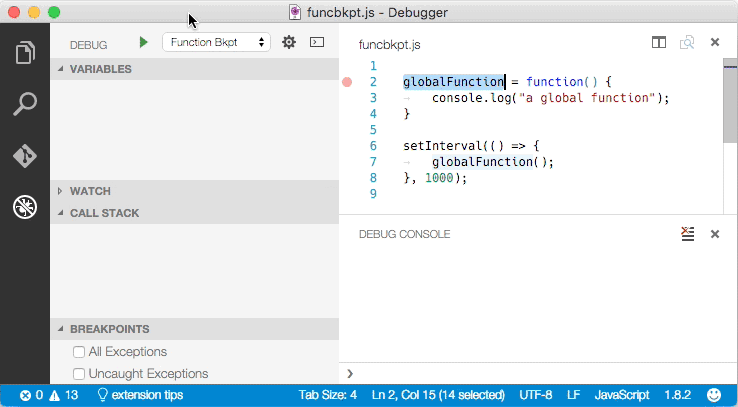

**Please note**: Node.js support for function breakpoints is limited because:

- function breakpoints only work for global, non-native functions and
- function breakpoints can only be created if the function has been defined (seen by Node.js).

### Mono Debugging is now an Optional Install

Since C# support in VS Code has been turned into an optional install, we have done the same with the Mono debugger.
The Mono debugger has now become ['Mono Debug'](https://marketplace.visualstudio.com/items?itemName=ms-vscode.mono-debug) on the Visual Studio Marketplace.

You can either install the **Mono Debug** extension with the VS Code **Extensions: Install Extension** command or if you already have a Mono based project with a `mono` launch configuration, simply by starting a debug session. VS Code will then suggest to download and install **Mono Debug** automatically:

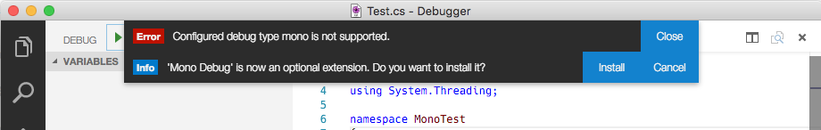

## Tasks

The `eslint-stylish` problem matcher changed to use absolute file paths by default. We made this breaking change because the stylish reporter integrated into `eslint` reports absolute paths by default. If you are using an older version of `eslint` with the external stylish reporter that reports relative file paths, you can tweak the `problemMatcher` in a tasks.json file as below to make this combination work:

```json
"problemMatcher": {
    "base": "$eslint-stylish",
    "fileLocation": "relative"
}
```

## Setup

### OS X Shell Command

In OS X, two new commands were added to install the VS Code shell command in the `$PATH` environment variable list. This makes the previous alias in `~/.bash_profile` deprecated and we **recommend you to remove it** and use this command instead.

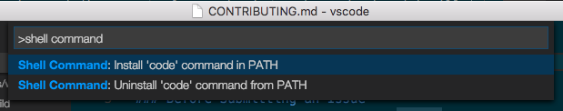

### Telemetry Opt Out

Users now can opt out of usage telemetry via the `telemetry.enableTelemetry` setting.

### Improved Command Line Interaction

The command line interface for code has been unified across all platforms and now supports a few arguments such as `--help` and `--version`.

## Accessibility

Accessibility has been a constant theme over the past milestones and in February VS Code has been improved across the feature space.

### High Contrast Theme

As a part of the accessibility work, the **High Contrast** theme, which was only available for Windows users, is now enabled for all 3 platforms.

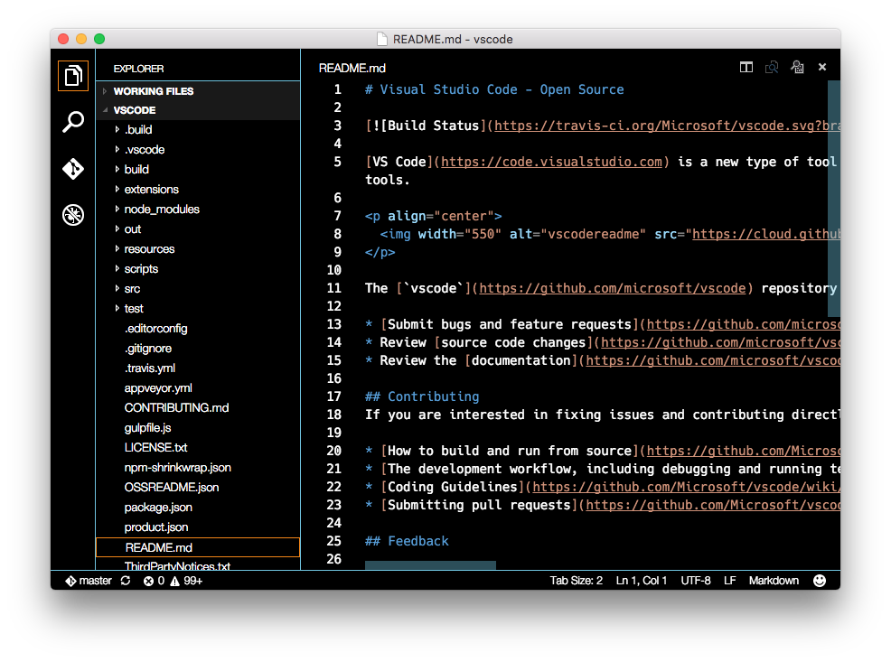

### Screen reading

We have turned on by default a new strategy for screen readers in the editor, one that is based on paging the text. From our testing, this is the best option in terms of trade-off between good screen reader support and performance when dealing with very large files.

The **Go to Next/Previous Error or Warning** actions (`kb(editor.action.marker.nextInFiles)` and `kb(editor.action.marker.prevInFiles)`) now allow screen readers to announce the error or warning messages.

### Improved Debugger Accessibility

Based on [user feedback](https://github.com/microsoft/vscode/issues/2108#issuecomment-183373356), we have improved debugger accessibility:

* Changes in debug state are read out (e.g. 'started', 'breakpoint hit', 'terminated', ...)
* All debug actions are keyboard accessible
* Focus intuitively moves inside the Debug View and Debug Console
* Debug hover is keyboard accessible (`kb(editor.action.showHover)`)

## Localization

Support has been added to localize `package.json` files for extensions and CommonJS code. For localizing CommonJS code, we've published a new npm module [`vscode-nls`](https://www.npmjs.com/package/vscode-nls) which helps you with localizing strings in your VS Code extension.

## Extension Authoring

### Always install a compatible version of the extension if possible

VS Code will now fallback to installing the latest compatible version of an extension with its own version, in case the latest extension version isn't compatible. This prevents users from installing extensions that could fail to activate.

### Debug Adapter

We now support more OS types for the `debuggers` contribution point (see [#1696](https://github.com/microsoft/vscode/issues/1696) for details). In addition to `win`, `linux`, and `osx`, adapters can now use `winx86` in their `package.json` to specify options specific to a 32-bit Windows:

```json
"debuggers": [{
    "type": "gdb",
    "win": {
        "program": "./bin/gdbDebug.exe"
    },
    "winx86": {
        "program": "./bin/gdbDebug_x86.exe"
    }
}]
```

### Debug Protocol Changes

We have changed the debug protocol in the following (backward compatible) ways:

- *Feature negotiation*:

  - A boolean `supportsConditionalBreakpoints` in `Capabilities` indicates whether the debug adapter supports conditional breakpoints. If a debug adapter does not support conditional breakpoints, a breakpoint which has a condition set is shown with an exclamation mark:

    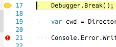

  - A boolean `supportsFunctionBreakpoints` in `Capabilities` indicates whether the debug adapter implements function breakpoints. VS Code will only use the new function breakpoint request of the debug protocol if this feature is enabled.

  - A boolean `supportsEvaluateForHovers` indicates whether the debug adapter supports a side effect free `EvaluateRequest`. If this feature is enabled, VS Code will use the `evaluate` request to populate the hover with information about the object under the mouse pointer. If it is disabled, VS Code uses the information from the Variables viewlet.

  - An optional `exceptionBreakpointFilters` capability that lists the filters available for the `setExceptionBreakpoints` request. With this, a debug adapter can contribute the options shown in the breakpoint viewlet:

    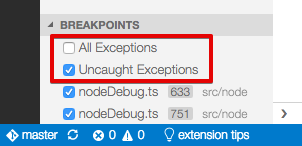

- An optional `restart` attribute has been added to the `TerminatedEvent` which a debug adapter can use to request a session restart.

## Notable Bug Fixes

- [105](https://github.com/microsoft/vscode/issues/105): Enable code folding and collapsing
- [439](https://github.com/microsoft/vscode/issues/439): `ext install` is slow
- [1228](https://github.com/microsoft/vscode/issues/1228): Add option to convert tabs to spaces
- [2490](https://github.com/microsoft/vscode/issues/2490): Improve IntelliSense perf
- [3127](https://github.com/microsoft/vscode/issues/3127): `code .` opens the current directory, `code ..` also opens the current directory - not the parent
- [3894](https://github.com/microsoft/vscode/issues/3894): [Handlebars] Curly braces edit issuess
- [3899](https://github.com/microsoft/vscode/issues/3899): [folding] sections are still folded when disabled in preferences
- [3903](https://github.com/microsoft/vscode/issues/3903): [js] syntax highlight for 'var' and 'function' not working in Default VS theme
- [3509](https://github.com/microsoft/vscode/issues/3509): Smoke Test: Don't get cross file intellisense in JS

Here are the [closed bugs](https://github.com/microsoft/vscode/issues?q=is%3Aissue+label%3Abug+milestone%3A%22Feb+2016%22+is%3Aclosed) and the [closed feature requests](https://github.com/microsoft/vscode/issues?q=is%3Aissue+milestone%3A%22Feb+2016%22+is%3Aclosed+label%3Afeature-request) for the February update.

## Thank You

Last but certainly not least, a big *__Thank You!__* to the following folks that helped to make VS Code even better:

* [sparecycles](https://github.com/sparecycles): fix replacing end of line with newline [2587](https://github.com/microsoft/vscode/pull/2587).
* [SamVerschueren](https://github.com/SamVerschueren): fix TextEditorOptions declaration [2935](https://github.com/microsoft/vscode/pull/2935).
* [Alexis Aubry](https://github.com/alexaubry): Updated Swift Autocompletion Syntax [3198](https://github.com/microsoft/vscode/pull/3198).
* [Xaver Hellauer](https://github.com/xaverh): Fixes to C++ and C syntax [2649](https://github.com/microsoft/vscode/pull/2649).
* [mkosieradzki](https://github.com/mkosieradzki): Add support for jsonSchema integer type in IntelliSense [2844](https://github.com/microsoft/vscode/pull/2844).
* [SrTobi](https://github.com/SrTobi): Misc fixes in [vsce](https://github.com/microsoft/vscode-vsce): [65](https://github.com/microsoft/vscode-vsce/pull/65) [71](https://github.com/microsoft/vscode-vsce/pull/71) [73](https://github.com/microsoft/vscode-vsce/pull/73)

## VS Code Blog

You might not have noticed but we've moved the [VS Code blog](/blogs) to our website.  We hope you find this more convenient and easier to search across all of our documentation. Check out the recent post about the [Chrome Debugger extension](/blogs/2016/02/23/introducing-chrome-debugger-for-vs-code.md)!
