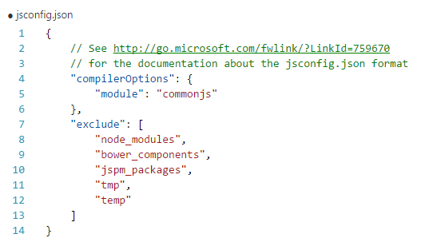
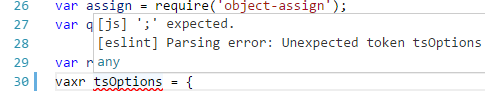
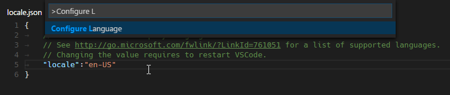
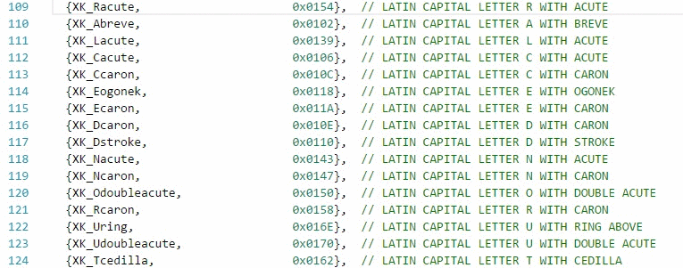
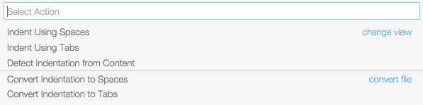
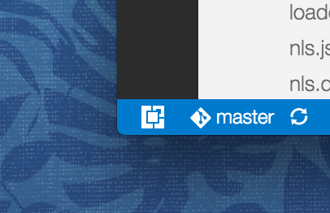
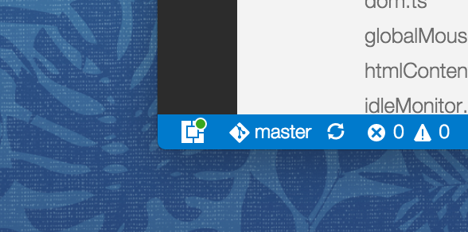

# Version 1.0!

## March 2016 (1.0)

March was the end game milestone leading up to our [1.0 release](/blogs/2016/04/14/vscode-1.0.md).  We wanted the product to meet the high expections of a 1.0 release and we focused on fundamentals like quality, accessibility, global reach and performance. We also added features you care about and streamlined some common tasks.

Here are a few highlights in this release:

* Added 9 localized display languages.
* Improved JavaScript support with new TypeScript language service, codename "Salsa".
* Simplified `jsconfig.json` and `tasks.json` file creation.
* Support adding new file extensions to existing languages.
* Implemented editor column text selection.

Downloads: [Windows](https://az764295.vo.msecnd.net/stable/fa6d0f03813dfb9df4589c30121e9fcffa8a8ec8/VSCodeSetup-stable.exe) |
[OS X](https://az764295.vo.msecnd.net/stable/fa6d0f03813dfb9df4589c30121e9fcffa8a8ec8/VSCode-darwin-stable.zip) | Linux 64-bit [.zip](https://az764295.vo.msecnd.net/stable/fa6d0f03813dfb9df4589c30121e9fcffa8a8ec8/VSCode-linux-x64-stable.zip) [.deb](https://az764295.vo.msecnd.net/stable/fa6d0f03813dfb9df4589c30121e9fcffa8a8ec8/vscode-amd64.deb) [.rpm](https://az764295.vo.msecnd.net/stable/fa6d0f03813dfb9df4589c30121e9fcffa8a8ec8/vscode-x86_64.rpm) | Linux 32-bit [.zip](https://az764295.vo.msecnd.net/stable/fa6d0f03813dfb9df4589c30121e9fcffa8a8ec8/VSCode-linux-ia32-stable.zip) [.deb](https://az764295.vo.msecnd.net/stable/fa6d0f03813dfb9df4589c30121e9fcffa8a8ec8/vscode-i386.deb) [.rpm](https://az764295.vo.msecnd.net/stable/fa6d0f03813dfb9df4589c30121e9fcffa8a8ec8/vscode-i386.rpm)

Read on to get into the details...

## Languages - JavaScript

**Please note**: If you have tested the [Salsa](https://github.com/Microsoft/TypeScript/issues/4789) preview in the past and have configured the `typescript.tsdk` setting, then please make sure to remove it. Otherwise you might be using an older version of TypeScript. When you have `typescript.tsdk` set, then the TypeScript version is shown in the bottom right of the Status Bar.

### Documentation

We improved the [JavaScript documentation](/docs/languages/javascript.md) and added more information about the `jsconfig.json` and its attributes.

### Disable Syntax Validation when using ES7 constructs

Some users want to use syntax constructs like the proposed **ES7 Object Rest/Spread Properties**. However, these are currently not supported by Salsa and are flagged as errors. For users who still want to use these **ES7** features, we have revived the `javascript.validate.enable` setting to disable all built-in syntax checking. If you do this, we recommend that you use a linter like **ESLint** to validate your code. Since the JavaScript support doesn't understand **ES7** constructs, features like IntelliSense might not be fully accurate.

### Guidance in creating a jsconfig.json file

The JavaScript experience is much better when you have a `jsconfig.json` file in your workspace that defines the project context. Without a `jsconfig.json`, each JavaScript file is treated as an island. Only the file itself and the JavaScript files it references are considered for features like IntelliSense. By adding a `jsconfig.json` file, you can the define the root of your project, the folders to exclude, etc. For this reason we now provide a hint to create a `jsconfig.json` file.


The hint creates a template for a `jsconfig.json`, with an exclusion list for you to edit:



Similarly when your JavaScript project is growing too large, often because of library folders like _node_modules_, we will prompt you to edit the `exclude` list.

### Go To Symbol is back

During the transition to Salsa, the support for **Go to Symbol** was lost ([TypeScript #7134](https://github.com/Microsoft/TypeScript/issues/7134)) for some JavaScript coding patterns. Thanks to the TypeScript team this feature is now back.

### No more "Reload JavaScript Project"

Previously you often had to run the **Reload JavaScript Project** command to ensure that the JavaScript information was up to date. Now VS Code keeps the information up to date as you edit the `jsconfig.json` file or when you add a typings (`.d.ts`) file.

### Source for Diagnostics

To make it easy to distinguish between diagnostics from external linters and the built-in syntax validation, errors and warnings from the built-in validator are now prefixed with `[js]`.



### IntelliSense when using ES6 import statements in React Native

Previously you did not get IntelliSense when using ES6 style import statements in **React Native** as used in the [getting started guide](https://facebook.github.io/react-native/docs/getting-started.html#quick-start).

In the snippet, below you get no IntelliSense for `React`:

```js
import React from 'react-native';
```

The issue is that the `react-native` typings do not define a `default` export. By adding the new [compiler option](https://github.com/Microsoft/TypeScript/wiki/What%27s-new-in-TypeScript#allow-captured-letconst-in-loops) `allowSyntheticDefaultImports` to the `jsconfig.json`, you tell the compiler to create synthetic default members and you get IntelliSense.

In `jsconfig.json`:

```json
 {
    "compilerOptions": {
        "allowSyntheticDefaultImports": true
    }
}
```

This works since **React Native** is using `Babel` to create the run-time code with default members.

### Support for mix & match of ES6 and CommonJS import/export

Thanks to fix [microsoft/TypeScript#7249](https://github.com/Microsoft/TypeScript/pull/7249) mixing & matching of ES6 and **CommonJS** import/export syntax across files is now supported.

### Formatting options

The following formatter settings are now available for JavaScript:

```typescript
// Defines space handling after a comma delimiter
"javascript.format.insertSpaceAfterCommaDelimiter": boolean,

// Defines space handling after a semicolon in a for statement
"javascript.format.insertSpaceAfterSemicolonInForStatements": boolean,

// Defines space handling after a binary operator
"javascript.format.insertSpaceBeforeAndAfterBinaryOperators": boolean,

// Defines space handling after keywords in control flow statement
"javascript.format.insertSpaceAfterKeywordsInControlFlowStatements": boolean,

// Defines space handling after function keyword for anonymous functions
"javascript.format.insertSpaceAfterFunctionKeywordForAnonymousFunctions": boolean,

// Defines space handling after opening and before closing non empty parenthesis
"javascript.format.insertSpaceAfterOpeningAndBeforeClosingNonemptyParenthesis": boolean,

// Defines space handling after opening and before closing non empty brackets
"javascript.format.insertSpaceAfterOpeningAndBeforeClosingNonemptyBrackets": boolean,

// Defines whether an open brace is put onto a new line for functions or not
"javascript.format.placeOpenBraceOnNewLineForFunctions": boolean,

// Defines whether an open brace is put onto a new line for control blocks or not
"javascript.format.placeOpenBraceOnNewLineForControlBlocks": boolean,
```

## Languages - TypeScript

### TypeScript Update

VS Code now ships with TypeScript 1.8.9, which includes some fixes over [TypeScript 1.8.2](https://blogs.msdn.microsoft.com/typescript/2016/02/22/announcing-typescript-1-8-2/).

### Formatting options

The following formatter settings are now available for TypeScript:

```typescript
// Defines space handling after a comma delimiter
"typescript.format.insertSpaceAfterCommaDelimiter": boolean,

// Defines space handling after a semicolon in a for statement
"typescript.format.insertSpaceAfterSemicolonInForStatements": boolean,

// Defines space handling after a binary operator
"typescript.format.insertSpaceBeforeAndAfterBinaryOperators": boolean,

// Defines space handling after keywords in control flow statement
"typescript.format.insertSpaceAfterKeywordsInControlFlowStatements": boolean,

// Defines space handling after function keyword for anonymous functions
"typescript.format.insertSpaceAfterFunctionKeywordForAnonymousFunctions": boolean,

// Defines space handling after opening and before closing non empty parenthesis
"typescript.format.insertSpaceAfterOpeningAndBeforeClosingNonemptyParenthesis": boolean,

// Defines space handling after opening and before closing non empty brackets
"typescript.format.insertSpaceAfterOpeningAndBeforeClosingNonemptyBrackets": boolean,

// Defines whether an open brace is put onto a new line for functions or not
"typescript.format.placeOpenBraceOnNewLineForFunctions": boolean,

// Defines whether an open brace is put onto a new line for control blocks or not
"typescript.format.placeOpenBraceOnNewLineForControlBlocks": boolean,
```

## Languages - HTML

The HTML formatter is based on the **beautifyjs** library. The formatting options offered by that library are now surfaced in the VS Code settings:

* `html.format.wrapLineLength`: Maximum amount of characters per line.
* `html.format.unformatted`: List of tags that shouldn't be reformatted.
* `html.format.extraLiners`: List of tags that should have an extra newline before them.
* `html.format.preserveNewLines`: Whether existing line breaks before elements should be preserved.
* `html.format.maxPreserveNewLines`: Maximum number of line breaks to be preserved in one chunk.
* `html.format.endWithNewline`: End with a newline.
* `html.format.indentInnerHtml`: Indent `<head>` and `<body>` sections.

## Localization

VS Code is now translated to the following 9 languages: Simplified Chinese, Traditional Chinese, French, German, Italian, Japanese, Korean, Russian and Spanish. By default, VS Code picks up the operating system's language. If you want to configure a specific language, you can either use the command line switch `--locale` to specify a locale when you launch VS Code or use the **Configure Language** action to specify a locale setting to use whenever VS Code is started. Examples are `de` for German or `zh-TW` for Traditional Chinese.



## Editor

### File to language association

A very common request was having a configurable way to associate file names and paths to languages. We are happy to provide the new `files.associations` setting that allows you to make this association either globally or per workspace.

Here is an example that will associate more extensions to the PHP language:

```json
"files.associations": {
    "*.php4": "php",
    "*.php5": "php"
}
```

You can also configure full file paths to languages if needed. The following example associates all files in a folder `somefolder` to PHP:

```json
"files.associations": {
    "**/somefolder/*.*": "php"
}
```

Note that the pattern is a [glob pattern](https://en.wikipedia.org/wiki/Glob_%28programming%29) that will match on the full path of the file if it contains a `/` and will match on the file name otherwise.

### Column Selection

You can now select columns of text by pressing `kbstyle(Shift+Alt)` and clicking or dragging the mouse:



We have also added keyboard commands for column selection.  These are bound on Windows and OS X, but not on Linux, as we could not find any free default key bindings. You can edit your `keybindings.json` to bind them to something more familiar if you wish.

For example:

```json
{ "key": "shift+alt+down",     "command": "cursorColumnSelectDown",
                                  "when": "editorTextFocus" },
{ "key": "shift+alt+left",     "command": "cursorColumnSelectLeft",
                                  "when": "editorTextFocus" },
{ "key": "shift+alt+pagedown", "command": "cursorColumnSelectPageDown",
                                  "when": "editorTextFocus" },
{ "key": "shift+alt+pageup",   "command": "cursorColumnSelectPageUp",
                                  "when": "editorTextFocus" },
{ "key": "shift+alt+right",    "command": "cursorColumnSelectRight",
                                  "when": "editorTextFocus" },
{ "key": "shift+alt+up",       "command": "cursorColumnSelectUp",
                                  "when": "editorTextFocus" }
```

### Source Code Folding Shortcuts

There are new folding actions to collapse source code regions based on their folding level.

There are actions to fold level 1 (`kb(editor.foldLevel1)`) to level 5 (`kb(editor.foldLevel5)`).
To unfold, use **Unfold All** (`kb(editor.unfoldAll)`).

The level folding actions do not apply to region containing the current cursor.

### IntelliSense on Tab only

We have added an option to accept IntelliSense proposals only on `kbstyle(Tab)` and not on `kbstyle(Enter)`. Set the `editor.acceptSuggestionOnEnter` setting to `false` to prevent accepting suggestions when you press `kbstyle(Enter)` to start a new line.

### Tab and Space Indentation

We have improved our indentation handling in the editor. We have added a new setting, `editor.detectIndentation`, that is `true` by default. When this setting is true and when the file contains sufficient hints (e.g. the file has content, it has lines with indentation), the editor will determine dynamically, for each file, the values of `editor.insertSpaces` and `editor.tabSize`.

> If you were using `editor.insertSpaces: "auto"` or `editor.tabSize: "auto"`, please start using the new `editor.detectIndentation` setting.

The indentation status shows the current file's settings. We have also added additional actions to the indentation status.



### Visual Studio style word navigation and word deletion

Visual Studio Code stops by default at the beginning of words when using `kbstyle(Ctrl+Left)` and at the end of words when using `kbstyle(Ctrl+Right)`. The same is true when deleting words. If you are accustomed to the Visual Studio style, you can change your `keybindings.json` to use the new commands we have added.

For example:

```json
{ "key": "ctrl+right",       "command": "cursorWordStartRight",
                                "when": "editorTextFocus" },
{ "key": "ctrl+shift+right", "command": "cursorWordStartRightSelect",
                                "when": "editorTextFocus" },
{ "key": "ctrl+backspace",   "command": "deleteWordStartLeft",
                                "when": "editorTextFocus" },
{ "key": "ctrl+delete",      "command": "deleteWordStartRight",
                                "when": "editorTextFocus" }
```

### Toggle Whitespace

There is a new action under **View** > **Toggle Render Whitespace** that quickly toggles the rendering of whitespace for the current opened file.

### UTF-8 BOM support

Some environments explicitly ask to include a BOM (Byte Order Mark) for UTF-8 encoded files. You can now save files with UTF-8 BOM encoding as well as convert existing files with or without BOM.

To save all new files with the UTF-8 BOM encoding, configure the `files.encoding` setting to this:

```json
"files.encoding": "utf8bom"
```

The Status Bar now distinguishes between files with UTF-8 and UTF-8 with BOM. You can convert the encoding from there.


## Workbench

### Extension Display in the Status Bar

There is now an Extensions icon in the bottom left corner of the workbench. This is not only a shortcut to reach into extension related actions but also the place for notifying extension errors. It is also used to report progress during an extension's installation.



Update notifications will also be notified in this widget:



### Exclude files from watching

When you open VS Code on a folder, it installs a file watcher service on the folder and every file and folder contained within to be notified when something changes. If the folder is very large, this can consume many resources right at startup. A new setting, `files.watcherExclude`, now allows to explicitly exclude large directories from file watching.

This setting has the following defaults:

```json
"files.watcherExclude": {
    "**/.git/objects/**": true,
    "**/node_modules/**": true
}
```

We suggest you only exclude more folders if you see that VS Code is using lots of CPU when opening a folder. Typically you would not have to make any changes to this setting.

### Output handling improvements

Large amounts of output were the cause of multiple user issues. We have now addressed this and are handling large amounts of output in a more efficient way.

## Debugging

### Run action

With this release, VS Code now supports 'Run' (in addition to 'Debug') of a program. The **Run** action is triggered with `kb(workbench.action.debug.run)` and uses the currently selected launch configuration. Many of the launch configuration attributes are supported in 'Run' mode. VS Code maintains a debug session while the program is running and pressing the **Stop** button terminates the program.

Please note: The **Run** action is always available, but a debugger extension has to 'opt-in' in order to support 'Run'. If a debugger extension has not been updated, 'Run' will fall back to 'Debug' (the built-in Node Debug and [Mono Debug](https://marketplace.visualstudio.com/items?itemName=ms-vscode.mono-debug) already support 'Run').

### Improved thread handling

Thanks to this [pull request](https://github.com/Microsoft/vscode/pull/3990), VS Code debugger UI now supports multiple stopped threads and the call stack for each thread is now requested lazily. This improves the debugger's stepping performance in multi-threaded programs.

## Tasks

### Tasks.json Creation

Configuring the task runner now offers you a list of templates to choose from. Tasks defined for Gulp and Grunt are still auto detected.


## Setup

### Linux packages

.deb and .rpm packages are now being offered as the primary way to install and start using VS Code on Linux. The packages will install the program, a desktop entry, a bin command as well as integrating VS Code into the [Debian alternatives system](https://wiki.debian.org/DebianAlternatives).

Installing can be done through a package manager GUI by running the file through the file explorer or through the command line:

```bash
# For .deb
sudo dpkg -i <file>.deb

# For .rpm
sudo yum install <file>.rpm
```

### Linux CLI

The new bin command installed with the package files brings Linux in line with the other platforms that had their command line interfaces improved in the [February release](/updates/vFebruary.md#setup). Run `code --help` to see the command line arguments available for use.

### Wait support and Git patch/diff mode

When you run VS Code from the command line, there is a new argument (`--wait`) you can pass to make the command wait until you have closed the current VS Code instance. This can be used with applications that can configure an external editor for file changes.

For example, Git allows you to configure an external editor and here are the steps to do so:

1. Make sure you can run `code --help` from the command line and you get help.
    * if you do not see help, please follow these steps:
        * Mac: Select **Shell Command: Install 'Code' command in path** from the **Command Palette**.
        * Windows: Make sure you selected **Add to PATH** during the installation.
        * Linux: Make sure you installed Code via our new .deb or .rpm packages.
2. From the command line, run `git config --global core.editor "code --wait"`

Now you can run `git config --global -e` and use VS Code as editor for configuring Git.


Add the following to enable support for using VS Code as diff tool:

```bash
[diff]
    tool = default-difftool
[difftool "default-difftool"]
    cmd = code --wait --diff $LOCAL $REMOTE
```

This leverages the new `--diff` option you can pass to VS Code to compare two files side by side.

To summarize, here are some examples of where you can use Git with VS Code:

* `git rebase HEAD~3 -i` allows to interactive rebase using VS Code
* `git commit` allows to use VS Code for the commit message
* `git add -p` followed by `kbstyle(e)` for interactive add
* `git difftool <commit>^ <commit>` allows to use VS Code as diff editor for changes

## Accessibility

We have added accessibility improvements to the suggestion widget, parameter hints widget and to the quick fix widget (Lightbulb), which now announce each suggestion, as they are selected, to screen readers.

> Tip: If you use the [NVDA screen reader](https://www.nvaccess.org), it is possible to navigate suggestions using `kb(editor.action.moveLinesUpAction)` and `kb(editor.action.moveLinesDownAction)`, to dismiss the suggestions with `kb(hideSuggestWidget)` and if suggestions get in your way, you can disable the auto-popup of suggestions with the `editor.quickSuggestions` setting.

## Extension Authoring

### Extension API additions

* Added `setEndOfLine` on the `TextEditorEdit` builder interface to allow changing the line ending sequence of a file from an extension.
* Added `cursorStyle` to `TextEditorOptions` to set the cursor style (vertical line, block or underline) for a specific editor.
* Added a `setContext` command for customizing key binding rules.  This command takes two arguments, a key and a value.
* All typing in an editor now goes through a `type` command that can be overwritten by an extension to implement different editor emulation modes such as **Vim** emulation mode.
* Added a [**Vim** emulation sample](https://github.com/alexandrudima/vscode-vim) that shows how a **Vim** emulation extension can use the VS Code API.

## Licensing Changes

There are several licensing changes for the Stable and Insiders builds.

For Stable 1.0, these are the differences:

* The TIME-SENSITIVE SOFTWARE clause has been removed and the product will no longer stop running on 31/12/2016 (day/month/year).
* The PRE-RELEASE SOFTWARE qualification has been removed.
* The license no longer prohibits you from opting out of data collection. You can turn off [crash reporting](/docs/supporting/faq.md#how-to-disable-crash-reporting) and [usage reporting](/docs/supporting/faq.md#how-to-disable-telemetry-reporting).
* The license clarifies that extensions downloaded are covered by the license provided by the extension author, not the VS Code license.

You can view the Stable license at https://code.visualstudio.com/license?lang= where lang is the two or three character language code ('en', 'de', 'fr', 'zh-CN', 'zh-TW', 'ko', 'ja', 'ru', 'es', 'it').

For Insiders, these are the changes:

* The TIME-SENSITIVE SOFTWARE clause which indicated that the software will stop running on 31/12/2016 (day/month/year) has been changed to a TERM clause which specifies the license agreement is for 90 days.
* The license clarifies that extensions downloaded are covered by the license provided by the extension author, not the VS Code license (same as Stable).

You can view the Insiders license at https://code.visualstudio.com/license/insiders, there are no localized Insider licenses.


## Notable Bug Fixes

- [2116](https://github.com/Microsoft/vscode/issues/2116): Inconsistent de-indentation behavior while closing html tags using Autocomplete
- [2808](https://github.com/Microsoft/vscode/issues/2808): Make it easier to add more file extensions to an existing colorizer/language
- [2912](https://github.com/Microsoft/vscode/issues/2912) Html code returned from a TextDocumentContentProvider can now embed JavaScript code.

Here are the [closed bugs](https://github.com/Microsoft/vscode/issues?q=milestone%3A%22March+2016%22+is%3Aclosed) and the [closed feature requests](https://github.com/Microsoft/vscode/issues?q=is%3Aissue+milestone%3A%22March+2016%22+is%3Aclosed+label%3Afeature-request) for the March update.

## Thank You

Last but certainly not least, a big *__Thank You!__* to the following folks that helped to make VS Code even better:

* [Joe Martella (@martellaj)](https://github.com/martellaj): Adds sort lines (ascending and descending) command [2796](https://github.com/Microsoft/vscode/pull/2796).
* [Ivan Enderlin (@Hywan)](https://github.com/Hywan): Improved PHP support [4323](https://github.com/Microsoft/vscode/pull/4323) [4322](https://github.com/Microsoft/vscode/pull/4322).
- [Sanders Lauture (@golf1052)](https://github.com/golf1052): Fix markdown highlighting for C# [4225](https://github.com/Microsoft/vscode/pull/4225).
- [Phillip Johnsen (@phillipj)](https://github.com/phillipj): Multiple script enhancements  [3691](https://github.com/Microsoft/vscode/pull/3691) [3649](https://github.com/Microsoft/vscode/pull/3649) [3636](https://github.com/Microsoft/vscode/pull/3636).
- [Ed Muñoz (@edumunoz)](https://github.com/edumunoz): Support stop-all-threads mode debugging for multi-threaded debuggers [3990](https://github.com/Microsoft/vscode/pull/3990).
- [Pierson Lee (@pieandcakes)](https://github.com/pieandcakes): Added telemetry for debugging scenarios [3687](https://github.com/Microsoft/vscode/pull/3687).
- [Guillaume Jenkins (@guillaumejenkins)](https://github.com/guillaumejenkins): Adding descriptions of Ionic HTML tags [3734](https://github.com/Microsoft/vscode/pull/3734).
