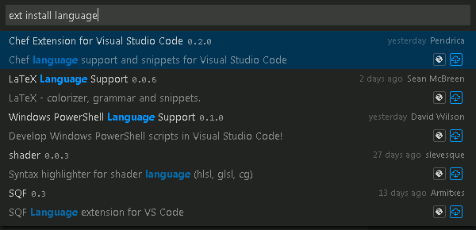
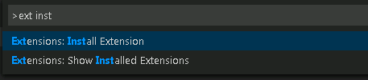
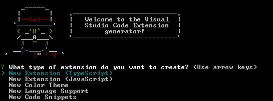
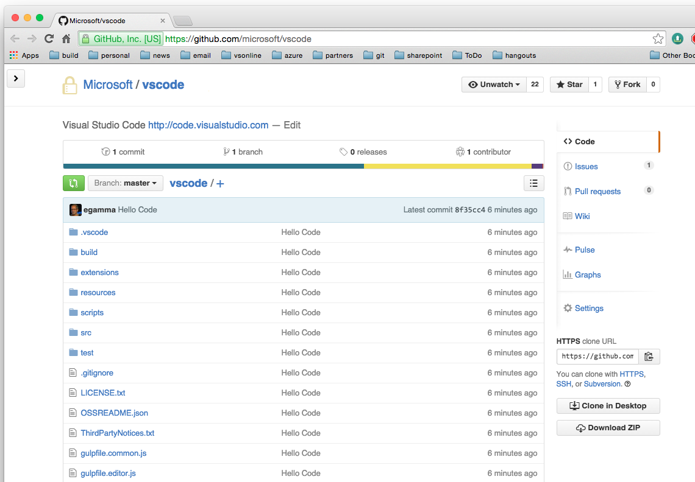
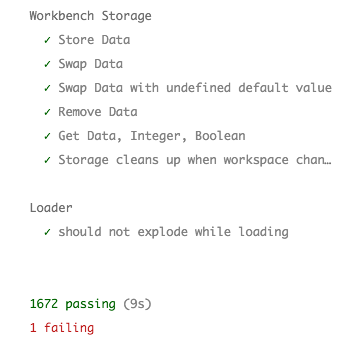
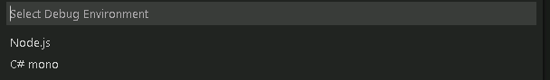
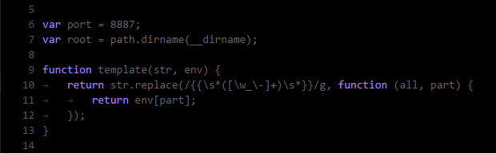
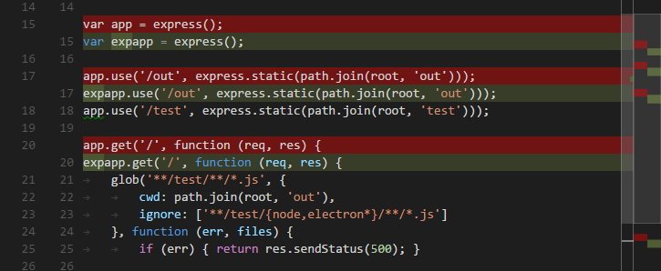

---
Order:
TOCTitle: November 2015
PageTitle: Visual Studio Code November 2015 0.10.3 Beta
MetaDescription: See what is new in Visual Studio Code November 0.10.3
---
# November 2015 (0.10.3 - Beta 2015)

Hi,

With this release, we mark our official Beta milestone and the big news is that VS Code now supports extensions (plug-ins) and is open source!

Downloads: [Windows](https://az764295.vo.msecnd.net/public/0.10.3/VSCodeSetup.exe) | [OS X](https://az764295.vo.msecnd.net/public/0.10.3/VSCode-darwin.zip) | [Linux 32-bit](https://az764295.vo.msecnd.net/public/0.10.3/VSCode-linux32.zip) | [Linux 64-bit](https://az764295.vo.msecnd.net/public/0.10.3/VSCode-linux64.zip)

## VS Code Supports Extensions!

VS Code has great features out of the box but now you and the community can extend VS Code to add new features and languages.

## Extension Gallery

Find and install cool extensions by searching VS Code's public [extension gallery](/docs/editor/extension-gallery.md).  There you'll find new themes, snippets, languages and tools.

VS Code has two new `Extensions` commands (`kb(workbench.action.showCommands)` then `'ext inst'`) to let you find and install new extensions and manage (update, uninstall) your currently installed extensions.

The VS Code also has a [Marketplace](https://marketplace.visualstudio.com/VSCode) where you can browse and learn more about extensions.

## Extensibility SDK

If you don't find an existing extension that meets your development needs, you can create your own.  We've added extensive documentation on [how to extend VS Code](/docs/extensions/overview.md) and a full [extensibility API reference](/docs/extensionAPI/overview.md).  In addition, we provide the tools to you need to create and publish extensions.

If you'd like to dive right in, you can start with our ["Hello World"](/docs/extensions/example-hello-world.md) walkthrough where you'll have a VS Code extension up and running in a matter of minutes.

### Yo Code Extension Scaffolding

We've updated the [`yo code` generator](/docs/extensions/yocode.md) to create a basic extension project (TypeScript or JavaScript) which has all the metadata and source files necessary for a working extension.

### Extension Publishing

The [`vsce` publishing tool](/docs/extensions/publish-extension.md) lets you easily package and publish your extension.  You can share your extension with colleagues by distributing a VS Code extension package or publish your extension for the community on the public gallery.

## Extension samples

If you'd rather start your extension by modifying a working example, you can find [extension samples](/docs/extensions/samples/.md) as well as the source code for many extensions on GitHub ([Go Language Support](https://github.com/microsoft/vscode-go)).

## VS Code is Open Source!

You spoke and we listened.  With this release, VS Code development is now open source on [GitHub](https://github.com/microsoft/vscode).

You can now contribute to VS Code:
* Submit [bugs](https://github.com/microsoft/vscode/issues) and help us verify fixes as they are checked in.
* Review the source code changes.
* Contribute bug fixes through pull requests.
* Update and add to the [documentation](https://github.com/microsoft/vscode-docs).

## Add TextMate Snippets

Another addition to the `yo code` generator is the option to add TextMate Snippets (.tmSnippets) to VS Code. Run `yo code`, select `New Code Snippets` and specify a folder containing TextMate snippet files. The generator will convert them to the VS Code snippet format and create a VS Code extension for your own use or to share on the gallery. The generator also supports Sublime snippets (.sublime-snippets).

## Debugging - Debug Console Improvements
* Colored text output to highlight diagnostic errors and warnings
* Support file path links with line and column information for quick source code navigation.

## Debugging - Easy Variable Selection
Directly add selections to the Debug Console and Watch window with two new editor commands:
* `Debug: Evaluate` - add the text selection to the Debug Console
* `Debug: Add to Watch` - add the text selection to the Debug Watch window

## Debugging - Debug environment configuration
When you create your initial debug configuration (`launch.json`), VS Code now asks for your specific debug environment (Node.js, Mono) and creates a `launch.json` specific to that environment.  VS Code also detects the type of request ('launch' or 'attach').

## Debugging - Hover
Debug hover behavior has been improved: it is now possible to hover over object properties or variables that are not in the top stack frame.

## Debugging - Node.js
Starting with this release, we are now launching the Node.js debug target in the internal VS Code Debug Console. This eliminates the tedious management of external console windows and brings program output and the Node.js REPL closer together. Since the Debug Console does not support programs that need to read input from the console, the external console is still available and you can enable it by setting the attribute `externalConsole` to `true` in your launch configuration.

## Improved Syntax Highlighting
We updated all our syntax highlighters to emit tokens which are compatible with TextMate themes. Custom color themes now work with all languages, including HTML and CSS.

ColorSublime Batman Theme in 0.9.1:

ColorSublime Batman Theme in 0.10.0:

## Environment Variable Substitution
You can now reference environment variables directly in your `launch.json` and `tasks.json` files through `${env:Name}` (e.g. `${env:PATH}`).

## Language - PHP
VS Code is now using the official PHP linter (`php -l`) for PHP language diagnostics. VS Code will now stay current with PHP linter improvements.

There are two new settings to control the PHP linter:
* _php.validate.executablePath_: points to the PHP executable on disk. Set this if the PHP executable is not on the system path.
* _php.validate.run_: controls whether the validation is triggered on save (value: "onSave") or on type (value: "onType"). Default is on save.

## Languages - Workspace relative TypeScript version

If you want to use a newer version of TypeScript, you can define the `typescript.tsdk` setting pointing to a directory containing the TypeScript `tsserver.js` and the corresponding `lib.*.d.ts` files. This setting now supports relative paths so you can easily share this workspace setting with your team and use the latest TypeScript version (`npm install typescript@next`).

## New Difference View Settings
You can now set your diff view preferences with two new settings:
* `diffEditor.renderSideBySide` - Control whether to show differences in a side by side or inline view.
* `diffEditor.ignoreTrimWhitespace` - Ignore leading and trailing (trim) whitespace when showing differences.

Previously these options where available in the editor's title bar.

## Notable Bug Fixes

As always we fixed many issues.

Here are a few of the notable ones:

* Editor code completion is slow with large completion lists, e.g. 30000 suggestions.

