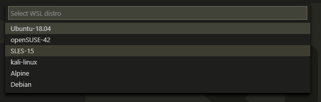
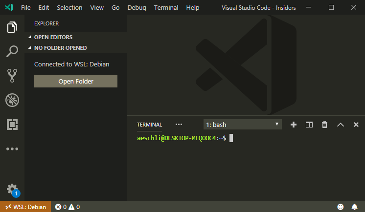
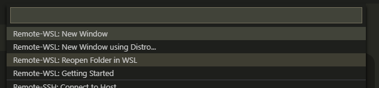

# June 2019 (version 1.36)

## VS Code Remote Core

### Close Remote Connection

A new command **Close Remote Connection** lets you close the remote connection and continue with an empty local window (instance). The command is available in the Remote indicator menu and also in the File menu.

### Drag and drop to and from the Explorer

We now support more drag and drop scenarios for the File Explorer in the remote context:

* You can drag a single file from the remote VS Code File Explorer to your local machine. Due to an upstream limitation, we cannot support this on Linux or for multiple files.
* You can drag any number of files and folders from your machine to the remote VS Code File Explorer.

### Download from Explorer

We have introduced a **Download** context menu action, which works with multiple selection so it is possible to download any number of files and folders to your local machine.

### Save As to local filesystem

The remote file picker now supports **Save As** locally. If you have a file on your remote that you want to save locally, you can use the **Show Local** button from **Save As** to save the file on your local filesystem.

### Improved label when the Explorer is empty

The empty explorer now has a more context aware label that shows the state of the remote connection.

### Local terminal support

A new command is registered in remote workspaces that lets you create a local terminal. Local terminals will be marked with **(Local)** in the terminal dropdown.

### Extensions install

The VS Code client downloads and installs extensions into the VS Code server when the server cannot. This feature will help with installing extensions in the VS Code server when the server has network connection issues such as when behind some network proxy setups.

## Containers

### Experimental Alpine Linux support

Support for Alpine Linux is available in VS Code [Insiders](https://code.visualstudio.com/insiders/). We are holding this back from the Stable release to allow for extension authors to catch up with the additional platform. See [Supporting Remote Development](https://code.visualstudio.com/api/advanced-topics/remote-extensions) for details.

### Read default shell and home folder from `/etc/passwd`

The default shell and the home folder are now read from `/etc/passwd`. You can still set the `SHELL` or `HOME` environment variables to override.

### Dev Containers: Show Container Log

The **Dev Containers: Show Container Log** command reveals the log of the Dev Container.

## WSL

### Select Linux distro

Until now, the WSL extension was limited to use the default distribution as configured by `wslconfig.exe`. You can now open a WSL window with any distro. The new **WSL: New Window using Distro...** command lets you select from the list of installed distros.

Alternatively you can start by opening a shell of the WSL distro and open the VS Code Remote window with `code .`.

To install new distros, go to the Windows Store and search for 'WSL'. You will find a selection of Linux distros, such as Ubuntu, Fedora, OpenSuse that can all be installed in parallel. Note: Alpine WSL is not yet supported by the WSL extension.

The WSL extension requires WSL from Windows 10, May 2019 Update (version 1903) for this feature to work.

### Reopen Folder in WSL and Reopen Folder in Windows

There are new commands that let you easily switch from Windows to WSL and back.

* When in a local folder or workspace, **Reopen Folder in WSL** reopens the input in WSL. If you have multiple distros installed, a picker will let you select the distro to use.
* In a WSL window, **Reopen Folder in Windows** reopens the current folder or workspace in Windows.

### Server Download on Window side

The WSL extension now downloads the VS Code server build on the Windows side instead of from WSL. This fixes issues with missing proxy settings or certificates in WSL.

### Use polling for file watching in WSL

You can now configure that file watching in WSL uses polling with a new setting: `remote.WSL.fileWatcher.polling`. This fixes the WSL 1 issue that non-empty folders can not be renamed when watched. However, polling has a performance impact for large workspaces. You can also tune the polling by setting the polling interval: `remote.WSL.fileWatcher.pollingInterval` and control the folders that are watched with `files.watcherExclude`. WSL 2, which does not have this problem, is not affected by the new setting.

Due to the performance impact, polling is disabled by default.

## SSH

### Experimental ARMv7l Linux support

Support for ARMv7l 32-bit is available in VS Code [Insiders](https://code.visualstudio.com/insiders). This means you can now connect to a Raspberry Pi 2/3 via SSH and edit files using VS Code.

We are holding this back from the stable release to allow for extension authors to catch up with the additional platform, see [Supporting Remote Development](https://code.visualstudio.com/api/advanced-topics/remote-extensions) for details.

### Improve password authentication

If you are using password authentication or a 2FA verification code to log in your remote host, VS Code should automatically prompt you for your password or code and you no longer need to set the `"remote.SSH.showLoginTerminal": true` setting. You will need to enter your password or code two times (down from three times). [Authenticating with an SSH key](https://code.visualstudio.com/docs/remote/troubleshooting#_configuring-key-based-authentication) is still a better experience.

### Cleaning up old server processes and installations

When you close the VS Code window, the VS Code Server process on the remote host stays running so it can quickly respond when a new window connects. We have added a timeout so the server will shut itself down if there are no new connections within 10 minutes.

When the SSH extension connects to a host, it will delete old installed versions of the server if they are not being used. It will leave the five most recent installations in place.

### Improve finding SSH

Previously, the SSH extension only looked for `ssh` on the PATH. Now we will also discover the `ssh.exe` installed with Git on Windows. There is also a new setting `remote.SSH.path` if SSH is in some other location.
