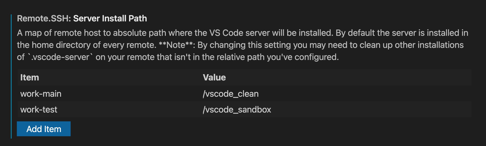
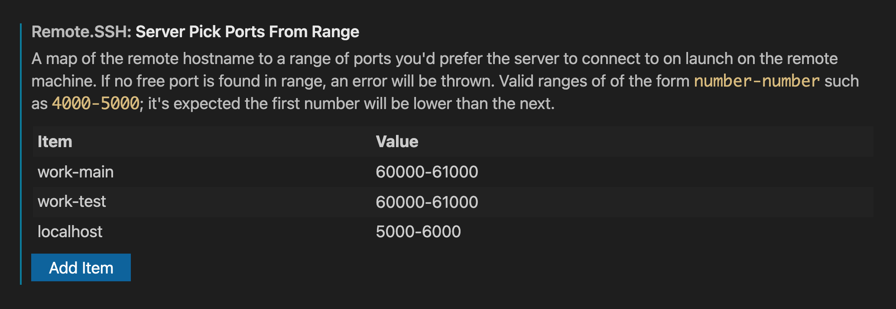

# November 2021 (version 1.63)

## Core

### Forwarded port security

For forwarded ports, when choosing a random port for the local port (for example, when the desired local port is already in use) we now attempt to avoid unsafe ports.

### Connection resilience

The remote connection is now more resilient in cases of poor network connectivity (high latency, high packet loss, etc.) and will enter reconnection less often.

## Containers (version 0.209.x)

### Open folder in container on SSH server

You can now open a folder in a container on a Linux SSH server. First open the folder using Remote-SSH to connect to the SSH server and then click the green remote indicator to use the **Reopen in Container** command.


You will need the Docker CLI installed on the SSH server. Docker is not required locally.

### Preview: User-provided container features

A new syntax in the `devcontainer.json` features property allows for including container features from a release in a GitHub repository:

```json
{
    "image": "mcr.microsoft.com/vscode/devcontainers/base:bionic",
    "features": {
        "codspace/myfeatures/helloworld": {
            "greeting": "hey"
        }
    }
}
```

The feature is identified with a triplet `owner/repository/feature` and downloaded from that repository's releases as `features.tgz` with the feature being part of that tar file.

This feature is currently in preview. We will provide detailed documentation on how to craft your own features as this effort proceeds. [You can find an initial template with information on creating your own here](https://github.com/microsoft/dev-container-features-template).

### Container features documentation links

Container features now have an inline action to open documentation on the feature.


## SSH (version 0.67.x)

The Remote - SSH extension, version `0.67.x`, introduces two new settings.

### Customize server installation path

With the new setting, `remote.ssh.serverInstallPath`, you can now customize where the VS Code server is installed on your remote rather than the default location of the home directory. The setting is represented by a map of the host name to absolute path for installation.



In the `settings.json` this setting looks like:

```json
"remote.SSH.serverInstallPath": {
    "work-main": "/vscode_clean",
    "work-test": "/vscode_sandbox"
}
```

### Configure which ports the server can use

And with the new setting `remote.ssh.serverPickPortsFromRange`, you can configure which ports are available to the VS Code server. The server will try to find a free port within the range, start and end inclusive, to bind to and if no free port is found within the range, the attempted connection will error out. If no port range is specified for a remote, a random free port is chosen.

This setting is similarly represented by a map of the host name to a range of ports.



In the `settings.json`:

```json
"remote.SSH.serverPickPortsFromRange": {
    "work-main": "60000-61000",
    "work-test": "60000-61000",
    "localhost": "5000-6000"
}
```

## WSL (version 0.63.x)

The WSL - Remote extension now uses a new connection method for WSL 2 that tackles reconnection issues that can occur after hibernate and when working on machines with flaky internet connections. It should also help when working behind a proxy.

Instead of using a socket connection to the WSL 2 VM address, it uses the `wsl.exe` command to talk to the server.

A new setting `remote.WSL2.connectionMethod` allows you to select the connection method. `wslExeProxy` is the new default. The other options are `wsl2VMAddress` (use a socket connection to the IP of the WSL2 VM) and `localhost` (use a socket connection to `localhost` and let Windows handle the proxy).

Please file issues against [vscode-remote-release](https://github.com/microsoft/vscode-remote-release/issues) if the new connection method does not work for you.

### Security update

Version 0.63.11 of the WSL extension includes a fix for a security issue in how the VS Code server running in the WSL distro is vulnerable to remote code execution. Details are in [CVE-2021-43907](https://msrc.microsoft.com/update-guide/vulnerability/CVE-2021-43907).
