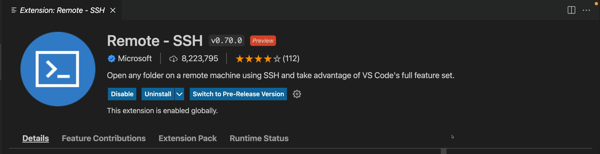
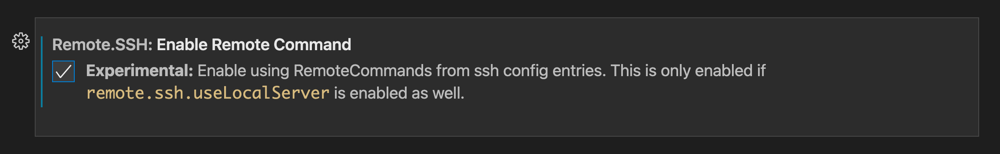

# January 2022 (version 1.64)

## Core

## Containers (version 0.x.x)

## SSH (version 0.72.x)

### Pre-release version

The Remote-SSH extension has adopted the pre-release extension model to allow anyone to switch between using the stable release of the extension, that is released along with every stable release of VS Code, and the pre-release version of the extension which is released everyday with the most up to date features and fixes.

### Enable RemoteCommand

You can now use RemoteCommands defined in your SSH Configuration entries. With the settings `remote.SSH.useLocalServer` and `remote.SSH.enableRemoteCommand` set to `true`. Note: only commands that don't close the shell will work properly. If you try the same connection with your shell and you see the command execute on the remote and then the connection immediately closes, that command will not work with the Remote-SSH extension. Only commands that leave the SSH connection in an interactive state will work as expected.

## WSL (version 0.x.x)

