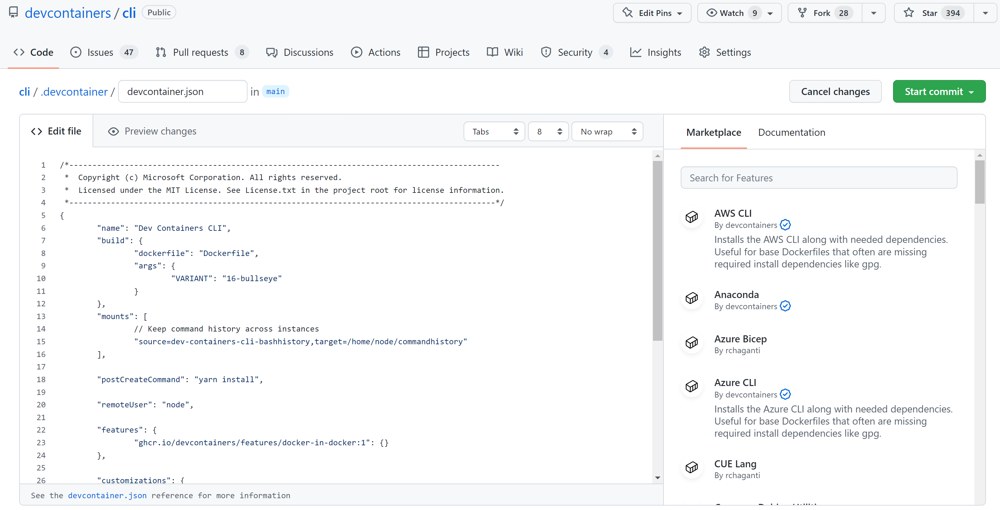

# October 2022 (version 1.73)

## Dev Containers

### Publish Templates and Features

Development Container [Templates](https://github.com/devcontainers/templates) are source files for configuring a Dev Container, and [Features](https://github.com/devcontainers/features) are shareable units of installation code and configurations that you can reference in your Dev Containers.

As part of the [Dev Container specification](https://containers.dev/), we've now published a specification for [Templates](https://containers.dev/implementors/templates/) and their [distribution](https://containers.dev/implementors/templates-distribution/).

If you'd like your contributions to appear as part of the [specification](https://containers.dev/collections) and in the VS Code or GitHub Codespaces UI for Dev Container creation, you can do the following:

* Go to [devcontainers.github.io](https://github.com/devcontainers/devcontainers.github.io).
* Open a PR to modify the [collection-index.yml](https://github.com/devcontainers/devcontainers.github.io/blob/gh-pages/_data/collection-index.yml) file.

We previously created repositories to host a set of [Features](https://github.com/devcontainers/features) and [images](https://github.com/devcontainers/images) as part of the specification, and we've now created one to host [Templates](https://github.com/devcontainers/templates) too. See the [Features quick start repository](https://github.com/devcontainers/feature-template) for information on creating and publishing your own!

When you edit a `devcontainer.json` in GitHub.com, you'll now get a new inline `devcontainer.json` editor, which includes a Marketplace populated by this dynamic index:



### Create configuration from published Templates and Features

When adding a Dev Container configuration (**Dev Containers: Add Dev Container Configuration Files...** from the Command Palette), you can select from the list of published Templates and Features. Previously only built-in Templates and Features were available.


See [Development Container Templates](https://github.com/devcontainers/templates), [Development Container Features](https://github.com/devcontainers/features), and the [Features quick start repository](https://github.com/devcontainers/feature-template) for more information about the publishing of Templates and Features.

### Create Dev Container without local folder

You can now create a Dev Container in an empty Docker volume (**Dev Containers: Create Dev Container...**) based on a Dev Container Template and Features.

Similarly to the local folder case, the UI offers you to pick from the published Templates and Features:


### Feature environment variables

Dev Container Feature scripts now have access to the remote and container users (corresponding to the `"remoteUser"` and `"containerUser"` properties in the `devcontainer.json`) and their home folders through the environment variables `_REMOTE_USER`, `_REMOTE_USER_HOME`, `_CONTAINER_USER`, and `_CONTAINER_USER_HOME`.

See [Development Container Features](https://containers.dev/implementors/features/) and the [quick start repository](https://github.com/devcontainers/feature-template) for more information about writing and publishing your own features.

### Dev Container ID variable

The `devcontainer.json` and `devcontainer-feature.json` files now support the `${devcontainerId}` variable that is replaced with the unique identifier for the Dev Container. This can, for example, be used for a feature to mount a unique volume for the Dev Container:

```json
{
    "id": "docker-in-docker",
    "version": "1.0.4",
    // ...
    "mounts": [
        {
            "source": "dind-var-lib-docker-${devcontainerId}",
            "target": "/var/lib/docker",
            "type": "volume"
        }
    ]
}
```

See the [Dev Container ID proposal](https://github.com/devcontainers/spec/blob/0ba05dda33eaa11fd1dfb93ccc09665b4ce7ac00/proposals/devcontainer-id-variable.md) for the details.
