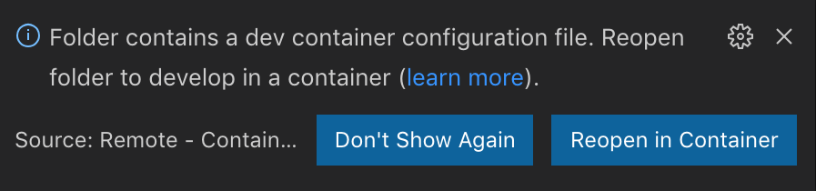
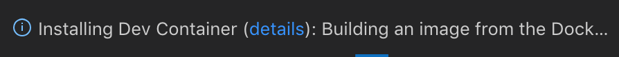

# Get the code

Checkout the following git repo.
Note there are other remote container samples such as `vscode-remote-try-python` or `vscode-remote-try-java`, but this tutorial will use `vscode-remote-try-node`.
```bash
git clone https://github.com/Microsoft/vscode-remote-try-node
```

## Open the repo in Visual Studio Code

Upon opening one of the repos listed above, you should see the following toast prompting you to reopen the workspace inside a dev container.
Click `Reopen in Container`.



## Wait for the container to build

Because this is your first time connecting, an image gets pulled down, built, and starts a container with a copy of VS Code Server running.
This might take a few minutes the first time, but future connects will only take seconds.



## Check

Once the container is running and you're connected, you should see your remote context change in the bottom left:


----

<a class="tutorial-next-btn" href="/remote-tutorials/containers/run-in-container">I've opened the repo</a>
<a class="tutorial-feedback-btn" onclick="reportIssue('remote-tutorials-containers', 'get-the-code')" href="javascript:void(0)">I ran into an issue</a>
