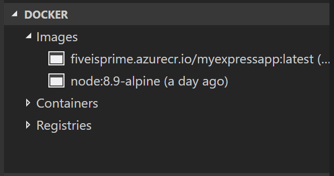
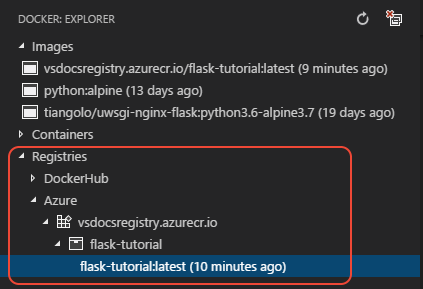

# Create your app image

To deploy an app to Azure App Service using Docker, you need to bundle your app code and its dependencies into a Docker image and push that image to a registry. The Docker extension for VS Code makes it easy to create your image and push it to the registry.

## Build and run your app locally

If you don't already have an app to deploy, you can use one of the following:

- Python: use either of the following:

  - The [python-sample-vscode-django-tutorial](https://github.com/Microsoft/python-sample-vscode-django-tutorial) sample, which is the result of following the [Django Tutorial](../../python/tutorial-django.md).

  - The [python-sample-vscode-flask-tutorial](https://github.com/Microsoft/python-sample-vscode-flask-tutorial) sample, which is the result of following the [Flask Tutorial](../../python/tutorial-flask.md).

- Node.js: follow the [Node.js tutorial](/docs/nodejs/nodejs-tutorial.md).

Make sure you can build and run the app locally on your computer, which includes installing any packages on which your app depends.

For Python apps, also make sure you've generated a `requirements.txt` file using `pip freeze` (as the tutorials describe). Docker images for Python apps automatically include the command (`pip install -r requirements.txt`) to restore those packages inside the container.

## Add Docker files

A Docker image contains your app files along with few files for Docker itself. The following steps generate the Docker-specific files.

1. in VS Code, open the **Command Palette** (`kb(workbench.action.showCommands)`) and select the **Docker: Add Docker files to workspace** command.
1. When the prompt appears after a few moments, select your app type, such as **Python** or **Node.js**.

1. Select the port on which your app listens. For the Node.js sample, use port 3000. For the Django sample, use 8000, and the Flask sample use 5000.

1. With this information, the Docker extension creates the following files to describe your app and its environment:

    - The `Dockerfile` file that describes the contents of the image and the command to start the app. By default, the name of the image is the name of the workspace folder in VS Code. (VS Code provides great support for Docker files. See the [Working with Docker](/docs/azure/docker.md) topic to learn about rich language features like smart suggestions, completions, and error detection.)

    - A `.dockerignore` file that reduces image size by excluding files and folders that aren't needed in the image, such as `.git`, `.vscode`, and `node_modules`. For Python, add another line to the file for `__pycache__`.

    - `docker-compose.yml` and `docker-compose.debug.yml` files that are used with [Docker compose](https://docs.docker.com/compose/overview/). For the purposes of this tutorial, you can ignore or delete these files.

1. Python apps deployed into production need to use a production-ready web server rather than the development servers that are built into Flask and Django. For this reason, you should use Docker base images rather that include production servers rather than the default base image that the Docker extension specifies. The following sections provide details for both Flask and Django.

### Changes for Python/Flask apps

1. Replace the contents of `Dockerfile` with the following configuration, which uses the base image tiangolo/uwsgi-nginx-flask:python3.6-alpine3.7 that already contains Flask and a production-ready web server. By default, this base image assumes that your app code is located in an `app` folder and that the Flask app object is named `app` and is found in `main.py`. The Flask sample mentioned earlier, however, contains the app code in a `hello_app` folder, and its app object (named `app`) is in `webapp.py`. The `Dockerfile` below, then, points to the correct folder along with a custom `uwsgi.ini` folder (see step 3) that specifies the app object.

    ```dockerfile
    # Pull a pre-built alpine docker image with nginx and python3 installed
    FROM tiangolo/uwsgi-nginx-flask:python3.6-alpine3.7

    # Change both values to change the port on which the app runs
    ENV LISTEN_PORT=5000
    EXPOSE 5000

    # Indicate where uwsgi.ini lives
    ENV UWSGI_INI /hello_app/uwsgi.ini

    # Set the folder where uwsgi looks for the app
    WORKDIR /hello_app

    # Copy the app contents to the image
    COPY /hello_app /hello_app

    # If you have additional requirements beyond Flask (which is included in the )
    # base image), generate a requirements.txt file with pip freeze and uncomment
    # the next three lines.
    #COPY requirements.txt /
    #RUN pip install --no-cache-dir -U pip
    #RUN pip install --no-cache-dir -r /requirements.txt
    ```

1. If your app uses additional libraries described in a `requirements.txt` file, uncomment the last three lines in the `Dockerfile`.

1. In the `hello_app` folder, create a file named `uwsgi.ini` with the following contents, which indicates that the Flask app object is found in the `webapp.py` module, and that it's named `app`:

    ```ini
    [uwsgi]
    module = webapp
    callable = app
    ```

    If you ues a different name than `app` for the app object, just change the value of `callable` to that other name.

### Changes for Python/Django apps

1. Make sure you have a `requirements.txt` file in your project that contains Django and its dependencies. You can generate `requirements.txt` using the `pip freeze` command.

1. Replace the contents of `Dockerfile` with the following configuration, which uses the base image tiangolo/uwsgi-nginx:python3.6-alpine3.7 that contains a production-ready web server. The last three lines of the `Dockerfile` also bring in `requirements.txt` to install Django.

## Build the Docker image

1. Make sure that Docker is running on your computer.
1. On the VS Code **Command Palette** (`kb(workbench.action.showCommands)`), select **Docker: Build Image**.
1. When prompted for the Docker file, choose the `Dockerfile` that you created in the previous section.
1. When prompted for a name to give the image, follow the conventional form of `<registry or username>/<image name>:<tag>`, where `<tag>` is typically `latest`. For example:

    ```
    # With Azure Container Registry, prefix with the registry name identifier
    vsdocsregistry.azurecr.io/django-tutorial:latest
    vsdocsregistry.azurecr.io/flask-tutorial:latest
    vsdocsregistry.azurecr.io/myexpressapp:latest

    # With Docker hub, prefix with your username
    vsdocsteam/django-tutorial:latest
    vsdocsteam/flask-tutorial:latest
    vsdocsteam/myexpressapp:latest
    ```

1. Docker's build output appears in the VS Code Terminal panel, showing each step, or layer, that makes up the app environment.

1. When the build is complete, the image appears in the **Docker** explorer under **Images**:

    

1. Optional: run and test your container locally by using the following command, replacing `<image_name>` with your specific image, and changing the port numbers if desired. For web apps, you can then open browser to `localhost:8000` (or whatever port) to see the app.

    ```bash
    docker run --rm -it -p 8000:8000 <image_name>
    ```

## Push the image to a registry

1. On the **Command Palette** (`kb(workbench.action.showCommands)`), select **Docker: Push**.
1. Choose the image you just built to push the image to the registry.
1. Progress is shown in the Terminal.
1. Once completed, expand the **Registries** > **Azure** (or **DockerHub**) node in the **Docker** explorer, then expand the registry and image name to see the exact image. (You may need to refresh the **Docker** explorer.)



Next, you deploy the app image to Azure App Service.

----

<a class="tutorial-next-btn" href="/tutorials/docker-extension/deploy-container">I've created an image for my app</a> <a class="tutorial-feedback-btn" onclick="reportIssue('docker-extension', 'containerize-app')" href="javascript:void(0)">I ran into an issue</a>
