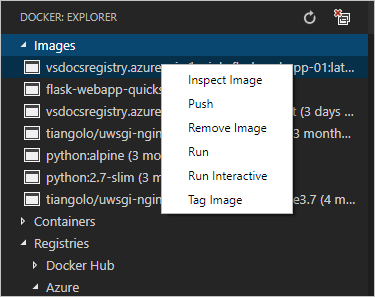

# Create and push your app image

A container image is a bundle of your app code and its dependencies. The Docker extension for VS Code makes it easy to create your image and push it to a registry.

This step assumed you already have suitable app code for your image. If not, refer to [Prerequisites - App code](getting-started.md#app-code) in the first step.

## Add Docker files

To create an image, Docker needs a `Dockerfile` that describes how to structure the app code in the container and how to get that code running. The `Dockerfile`, in other words, is the template for your image.

> **Note**: the Python samples linked earlier in this article already contain the necessary Docker files.

1. in VS Code, open the **Command Palette** (`kb(workbench.action.showCommands)`) and select the **Docker: Add Docker files to workspace** command.

1. When the prompt appears after a few moments, select your app type, such as **Python** or **Node.js**.

1. Select the port on which your app listens. For the Node.js sample, use port 3000. For the Django sample, use 8000, and the Flask sample uses 5555.

1. With this information, the Docker extension creates the following files to describe your app and its environment:

    - The `Dockerfile` file describes the contents of your app's layer in the image, which are added in top of whatever base image you refer to. By default, the name of the image is the name of the workspace folder in VS Code.

    - A `.dockerignore` file that reduces image size by excluding files and folders that aren't needed in the image, such as `.git`, `.vscode`, and `node_modules`. For Python, add another line to the file for `__pycache__`.

    - `docker-compose.yml` and `docker-compose.debug.yml` files that are used with [Docker compose](https://docs.docker.com/compose/overview/). For the purposes of this tutorial, you can ignore or delete these files.

> **Tip:** VS Code provides great support for Docker files. See the [Working with Docker](/docs/azure/docker.md) topic to learn about rich language features like smart suggestions, completions, and error detection.

### Dockerfile modifications for Python apps

When creating Docker files for Python, the Docker extension by default uses the base image `python:alpine` and includes commands to run only the Flask development server. Such defaults don't accommodate Django, obviously, and when deploying to App Service you should use production-ready web servers instead of the development server. The following sections provide the specific details.

### Changes for Python/Flask apps

A good base image for Flask is tiangolo/uwsgi-nginx-flask:python3.6-alpine3.7, which is also available for other versions of Python (see the [tiangolo/uwsgi-nginx-flask respository](https://github.com/tiangolo/uwsgi-nginx-flask-docker) on GitHub). This image already contains Flask and the production-ready uwsgi and nginx servers.

By default, the image assumes that your app code is located in an `app` folder and that the Flask app object is named `app` and is found in `main.py`. Because your app, like the sample, may have a different structure, you can indicate the correct folders in the Dockerfile and provide the necessary parameters the the uwsgi server in a `uwsgi.ini` file.

The following steps summarize the configuration used in the [python-sample-vscode-flask-tutorial](https://github.com/Microsoft/python-sample-vscode-flask-tutorial) sample, which you can adapt to your own code.

1. The `Dockerfile` indicates the location and name of the Flask app object, the location of static files for nginx, and the location of the `uwsgi.ini` file. (The `Dockerfile` in the sample contains additional comments that are omitted here.)

    ```dockerfile
    FROM tiangolo/uwsgi-nginx-flask:python3.6-alpine3.7

    ENV LISTEN_PORT=5000
    EXPOSE 5000

    # Indicate where uwsgi.ini lives
    ENV UWSGI_INI uwsgi.ini

    # Tell nginx where static files live.
    ENV STATIC_URL /hello_app/static

    # Set the folder where uwsgi looks for the app
    WORKDIR /hello_app

    # Copy the app contents to the image
    COPY . /hello_app

    # If you have additional requirements beyond Flask (which is included in the
    # base image), generate a requirements.txt file with pip freeze and uncomment
    # the next three lines.
    #COPY requirements.txt /
    #RUN pip install --no-cache-dir -U pip
    #RUN pip install --no-cache-dir -r /requirements.txt
    ```

1. The `uwsgi.ini` file, which is in the `hello_app` folder of the sample, provides configuration arguments for the uwsgi server. For the sample, the configuration below says that the Flask app object is found in the `hello_app/webapp.py` module, and that it's named (that is, "callable" as) `app`. The other value are additional common uwsgi settings:

    ```ini
    [uwsgi]
    module = hello_app.webapp
    callable = app
    uid = 1000
    master = true
    threads = 2
    processes = 4
    ```

### Changes for Python/Django apps

A good base image for Flask is tiangolo/uwsgi-nginx:python3.6-alpine3.7, which is also available for other versions of Python (see the [tiangolo/uwsgi-nginx respository](https://github.com/tiangolo/uwsgi-nginx-docker) on GitHub).

This image already contains the production-ready uwsgi and nginx servers, but does not include Django. It's also necessary to provide settings to uwsgi so it can find the app's startup code.

The following steps summarize the configuration used in the [python-sample-vscode-django-tutorial](https://github.com/Microsoft/python-sample-vscode-django-tutorial) sample that you can adapt to your own code.

1. Make sure you have a `requirements.txt` file in your project that contains Django and its dependencies. You can generate `requirements.txt` using the `pip freeze` command.

1. In your Django project's `settings.py` file, add the root URL to which you intend to deploy the app to the `ALLOWED_HOSTS` list. For example, the following code assumes deployment to an Azure App Service (azurewebsites.net) named "vsdocs-django-sample-container":

    ```python
    ALLOWED_HOSTS = [
        # Example host name only; customize to your specific host
        "vsdocs-django-sample-container.azurewebsites.net"
    ]
    ```

    Without this entry, you'll eventually get all the way through the deployment only to see a "DiallowedHost" message that instructs to you add the domain to `ALLOWED_HOSTS`, which requires that you rebuild, push, and redeploy the image all over again!

1. Create a `uwsgi.ini` file in the Django project folder (alongside `manage.py`) that contains startup arguments for the uwsgi server. In the sample, the Django project is in a folder called `web_project`, which is where the `wsgi.py` and `setting.py` files live.

    ```ini
    [uwsgi]
    chdir = .
    module = web_project.wsgi:application
    env = DJANGO_SETTINGS_MODULE=web_project.settings
    uid = 1000
    master = true
    threads = 2
    processes = 4
    ```

1. Modify the `Dockerfile` to indicate the location of `uwsgi.ini`, set the location of static files for nginx, and make sure the SQLite database file is writable. (The `Dockerfile` in the sample contains additional comments that are omitted here.)

    ```dockerfile
    FROM tiangolo/uwsgi-nginx:python3.6-alpine3.7

    ENV LISTEN_PORT=8000
    EXPOSE 8000

    # Indicate where uwsgi.ini lives
    ENV UWSGI_INI uwsgi.ini

    # Tell nginx where static files live (as typically collected using Django's
    # collectstatic command.
    ENV STATIC_URL /app/static_collected

    # Copy the app files to a folder and run it from there
    WORKDIR /app
    ADD . /app

    # Make app folder writeable for the sake of db.sqlite3, and make that file also writeable.
    RUN chmod g+w /app
    RUN chmod g+w /app/db.sqlite3

    # Make sure dependencies are installed
    RUN python3 -m pip install -r requirements.txt
    ```

> **Note**: When building a Docker image on Windows, you typically see the message below, which is why the Dockerfile shown here includes the two `chmod` commands. If need to make other files writable, add the appropriate `chmod` commands to your Dockerfile.
>
> ```output
> SECURITY WARNING: You are building a Docker image from Windows against a non-Windows Docker host. All files and directories added to build context will have '-rwxr-xr-x' permissions. It is recommended to double check and reset permissions for sensitive files and directories.
> ```

## Build and test the Docker image

1. Make sure that Docker is running on your computer.

1. On the VS Code **Command Palette** (`kb(workbench.action.showCommands)`), select **Docker: Build Image**.

1. When prompted for the Docker file, choose the `Dockerfile` that you created in the previous section. (VS Code remembers your selection so you won't need to enter it again to rebuild.)

1. When prompted for a name to give the image, use a name that follows the conventional form of `<registry or username>/<image name>:<tag>`, where `<tag>` is typically `latest`. Here are some examples:

    ```
    # Examples for Azure Container Registry, prefixed with the registry name
    vsdocsregistry.azurecr.io/python-sample-vscode-django-tutorial:latest
    vsdocsregistry.azurecr.io/python-sample-vscode-flask-tutorial:latest
    vsdocsregistry.azurecr.io/myexpressapp:latest

    # Examples for Docker hub, prefixed with your username
    vsdocs-team/python-sample-vscode-django-tutorial:latest
    vsdocs-team/python-sample-vscode-flask-tutorial:latest
    vsdocs-team/myexpressapp:latest
    ```

1. Each step of Docker's build process appears in the VS Code Terminal panel, including any errors that occur running the steps in the `Dockerfile`.

    > **Tip**: every time you run the **Docker: Build image** command, the Docker extension opens another Terminal in VS Code in which to run the command. You can close each terminal once the build is complete. Alternately, you can reuse the same terminal to build the image by scrolling up in the command history using the up arrow.

1. When the build is complete, the image appears in the **Docker** explorer under **Images**:

    

1. Optional: run and test your container locally by using the following command, replacing `<image_name>` with your specific image, and changing the port numbers as needed. For web apps, you can then open browser to `localhost:8000` (or the appropriate port) to see the running app.

    ```bash
    docker run --rm -it -p 8000:8000 <image_name>
    ```

### Two useful features of the Docker extension

The Docker extension provides a simple UI to manage and even run your images rather than using the Docker CLI. Just expand the **Image** node in the Docker explorer, right click any image, and select any of the menu items:



In addition, on the top of the Docker explorer, next to the refresh button, is a button for **System Prune**:


This command cleans up any dangling and otherwise unused images on your local computer. It's a good idea to periodically use the command to reclaim space on your file system.

## Push the image to a registry

1. On the **Command Palette** (`kb(workbench.action.showCommands)`), select **Docker: Push**.

1. Choose the image you just built to push the image to the registry; upload progress appears in the Terminal.

1. Once completed, expand the **Registries** > **Azure** (or **DockerHub**) node in the **Docker** explorer, then expand the registry and image name to see the exact image. (You may need to refresh the **Docker** explorer.)


> **Tip:** The first time you push an image, you see that VS Code uploads all of the different layers that make up the image. Subsequent push operations, however, upload only those layers that have changed. Because it's typically only your app code that's changes, those uploads happen much more quickly, making for a tight edit-build-deploy-test loop. To see this, make a small change to your code, rebuild the image, and then push again to the registry. The whole process typically completes in a matter of seconds.

Next, you deploy the app image to Azure App Service.

----

<a class="tutorial-next-btn" href="/tutorials/docker-extension/deploy-container">I've created an image for my app</a> <a class="tutorial-feedback-btn" onclick="reportIssue('docker-extension', 'containerize-app')" href="javascript:void(0)">I ran into an issue</a>
