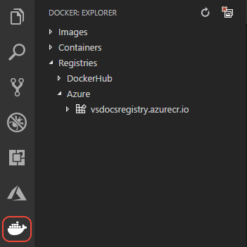

# Create an Azure container registry

Once your Docker image is built, you need to push your image to a container registry, which is a repository for Docker images. You can then deploy an image from that registry to Azure App Service.

Registry options include the following:

- The [Azure Container Registry (ACR)](https://azure.microsoft.com/services/container-registry/), a private, secure, hosted registry for your images.
- [Docker Hub](https://hub.docker.com/), Docker's own hosted registry that provides a free way to share images.
- A private registry running on your own server, ad described on [Docker registry](https://docs.docker.com/registry/) in the Docker documentation.

To create an Azure Container Registry, as shown in this tutorial:

1. Follow the first part of [Quickstart: Create a container registry using the Azure portal](https://docs.microsoft.com/azure/container-registry/container-registry-get-started-portal) through the "Log in to ACR" section. You don't need to complete the sections "Push image to ACR" and later because you do those steps within VS Code as part of this tutorial.

1. Make sure that the registry endpoint you created is visible under **Registries** in the **Docker** explorer of VS Code:

    

If you prefer, you can also use other registries with the rest of this tutorial.

----

<a class="tutorial-next-btn" href="/tutorials/docker-extension/containerize-app">I've created a registry</a>
<a class="tutorial-feedback-btn" onclick="reportIssue('docker-extension', 'getting-started')" href="javascript:void(0)">I ran into an issue</a>
